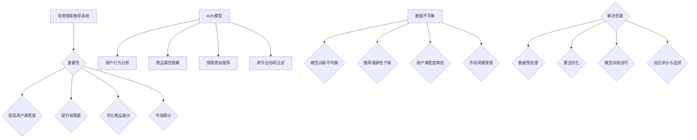
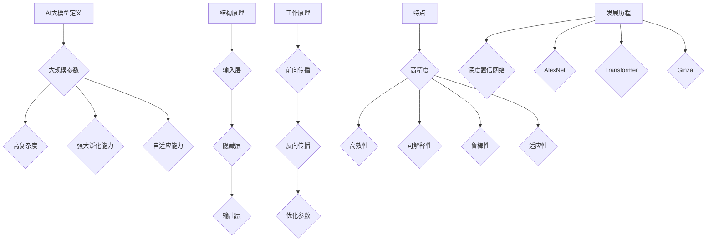
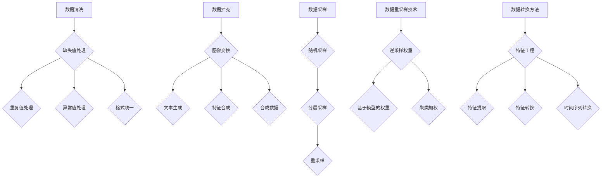
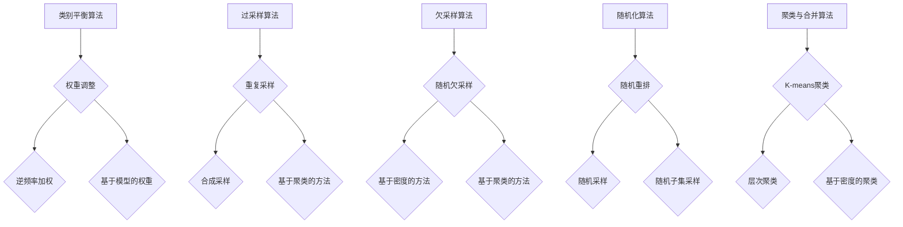
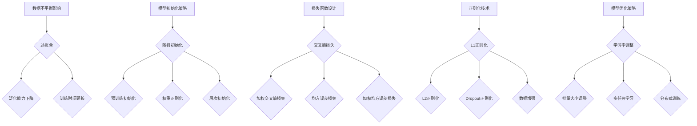
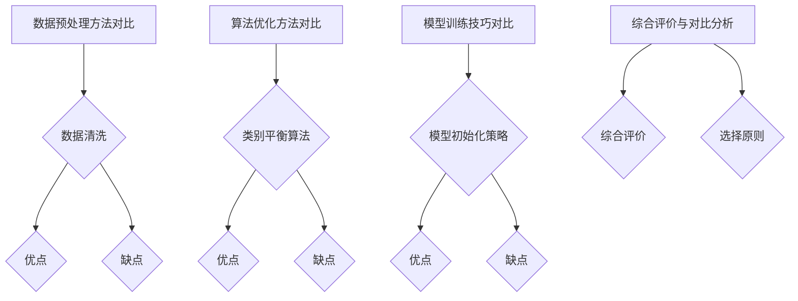
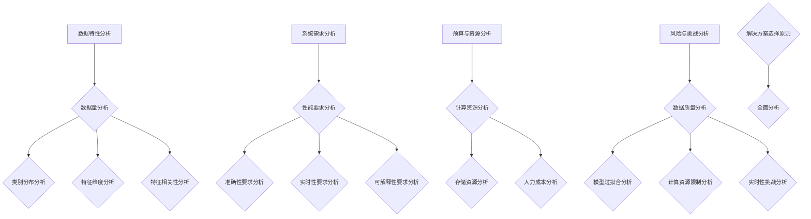
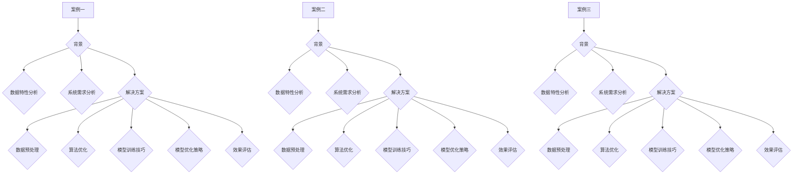
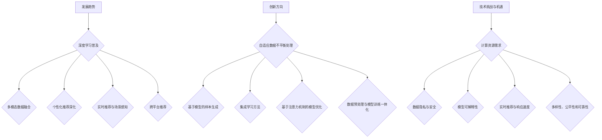

                 

### 第1章：电商搜索推荐系统概述

#### 1.1 电商搜索推荐系统的重要性

电商搜索推荐系统在当前电子商务领域扮演着至关重要的角色。随着互联网的普及和电子商务的迅猛发展，消费者对个性化服务和精准推荐的期望越来越高。一个高效的搜索推荐系统不仅能够提高用户满意度，还能显著提升电商平台的销售额和用户留存率。

首先，电商搜索推荐系统能够通过智能算法分析用户的搜索和浏览行为，实现个性化推荐。例如，当用户在电商平台搜索某种商品时，推荐系统可以基于用户的历史数据和相似用户的购买行为，推荐相关的商品，从而增加用户的购买概率。

其次，推荐系统可以帮助电商平台优化商品展示顺序，提升商品的曝光率和点击率。通过分析用户的兴趣和偏好，推荐系统可以将相关性较高的商品优先展示给用户，从而提高用户的点击率和转化率。

此外，推荐系统还能够帮助电商平台进行市场细分，发现潜在客户，并针对性地进行营销活动。通过对用户行为的深度分析，推荐系统可以发现用户的潜在需求和偏好，为电商平台提供有价值的市场洞察。

#### 1.2 AI大模型在电商搜索推荐中的应用

随着人工智能技术的快速发展，AI大模型在电商搜索推荐中的应用越来越广泛。AI大模型是指通过深度学习等人工智能技术训练得到的，具有强大学习能力和泛化能力的模型。在电商搜索推荐系统中，AI大模型可以应用于多个方面：

1. **用户行为分析**：AI大模型可以通过分析用户的点击、购买、收藏等行为数据，挖掘用户的兴趣和偏好，从而实现精准推荐。

2. **商品属性理解**：AI大模型可以学习到商品的多维属性，如价格、品牌、材质等，并将这些属性与用户的兴趣偏好进行匹配，提高推荐的准确性。

3. **情境感知推荐**：AI大模型可以根据用户的实时行为和历史行为，预测用户的下一步操作，从而实现情境感知的推荐。

4. **跨平台协同过滤**：AI大模型可以通过整合不同平台的数据，实现跨平台的协同过滤，提高推荐的全面性和准确性。

#### 1.3 数据不平衡问题的背景

在电商搜索推荐系统中，数据不平衡问题是一个普遍存在的挑战。数据不平衡指的是数据集中不同类别或标签的样本数量差异较大。例如，在商品推荐中，热门商品和冷门商品的购买次数可能存在巨大差异，导致数据集呈现出严重的不平衡状态。

数据不平衡问题会对推荐系统的性能产生负面影响。首先，在不平衡的数据集上进行模型训练，可能导致模型对少数类别的学习不足，从而影响推荐结果的准确性。其次，不平衡的数据集可能导致模型对多数类别的过拟合，从而在测试集上表现不佳。

#### 1.4 数据不平衡对推荐系统的影响

数据不平衡对推荐系统的影响主要体现在以下几个方面：

1. **模型训练不均衡**：在训练过程中，模型可能会过分关注多数类别，而忽略少数类别，导致模型对少数类别的识别能力不足。

2. **推荐准确性下降**：由于模型对少数类别的学习不足，推荐系统的准确性可能会下降，用户收到的推荐结果可能不够精准。

3. **用户满意度降低**：当推荐系统无法准确识别用户的兴趣和偏好时，用户的满意度会降低，从而影响平台的用户留存率和销售额。

4. **市场洞察受限**：数据不平衡可能导致模型无法准确捕捉到用户的潜在需求和偏好，从而限制了电商平台的市场洞察能力。

#### 1.5 数据不平衡问题的解决思路

为了解决数据不平衡问题，可以采取以下几种思路：

1. **数据预处理**：通过数据清洗、数据扩充等方法，减少数据集中的不平衡现象。

2. **算法优化**：采用类别平衡算法、过采样算法、欠采样算法等，优化模型的训练过程，提高模型对少数类别的识别能力。

3. **模型训练技巧**：通过模型初始化策略、损失函数设计、正则化技术等，调整模型的训练过程，提高模型的泛化能力。

4. **综合评价与选择**：根据数据特性、系统需求、预算与资源等因素，选择合适的解决方案，实现数据不平衡问题的有效解决。

---

#### 1.6 小结

本文旨在探讨电商搜索推荐中的AI大模型数据不平衡问题及其解决方案。通过分析数据不平衡问题的背景、影响以及解决思路，我们为后续章节的详细讨论奠定了基础。接下来，我们将深入探讨AI大模型的基本概念，为理解数据不平衡问题的解决提供理论基础。

---

#### 1.7 参考文献

1. Han, J., Kamber, M., & Pei, J. (2011). *Data Mining: Concepts and Techniques*. Morgan Kaufmann.
2. Liu, H. (2011). *Data Analysis with Open Source Tools*. O'Reilly Media.
3. Russell, S., & Norvig, P. (2010). *Artificial Intelligence: A Modern Approach*. Prentice Hall.

---

#### 1.8 Mermaid 流程图

---

### 第2章：AI大模型的基本概念

#### 2.1 AI大模型的定义

AI大模型（Large-scale Artificial Intelligence Model）是指通过深度学习等人工智能技术训练得到的，具有大规模参数和高复杂度的模型。这类模型通常具有以下几个特点：

1. **大规模参数**：AI大模型通常包含数十亿甚至千亿级别的参数，这使得模型具有强大的表示能力和学习能力。

2. **高复杂度**：AI大模型的结构通常非常复杂，包含多层神经网络，每层神经网络的神经元数量也很多，这使得模型能够处理复杂数据和任务。

3. **强大的泛化能力**：由于参数规模巨大，AI大模型能够捕捉到数据中的细微变化，从而具有强大的泛化能力。

4. **自适应能力**：AI大模型可以根据不同的数据集和任务需求进行自适应调整，从而实现灵活的模型部署。

#### 2.2 AI大模型的结构与原理

AI大模型通常由以下几个部分组成：

1. **输入层**：接收外部输入数据，如文本、图像、声音等。

2. **隐藏层**：通过多层神经网络对输入数据进行处理，提取特征信息。

3. **输出层**：根据隐藏层输出的特征信息，生成预测结果或分类结果。

AI大模型的工作原理可以概括为以下几个步骤：

1. **前向传播**：将输入数据通过多层神经网络传递，每个神经元的输出作为下一层的输入。

2. **反向传播**：根据预测结果与实际结果之间的误差，通过反向传播算法调整神经网络中的参数。

3. **优化参数**：通过优化算法（如梯度下降、随机梯度下降等）不断调整参数，使得模型预测结果逐渐逼近实际结果。

4. **模型训练**：重复前向传播和反向传播的过程，不断优化模型参数，直到模型达到预期的性能指标。

#### 2.3 AI大模型的特点

AI大模型具有以下几个显著特点：

1. **高精度**：由于参数规模巨大，AI大模型能够捕捉到数据中的细微变化，从而实现高精度的预测和分类。

2. **高效性**：AI大模型通过并行计算和分布式训练等技术，能够实现高效的模型训练和推理。

3. **可解释性**：尽管AI大模型通常具有较高的精度，但其内部结构和决策过程较为复杂，导致其可解释性较低。因此，研究者们正在努力提高AI大模型的可解释性。

4. **鲁棒性**：AI大模型在训练过程中能够自动适应不同类型的数据，从而具有较好的鲁棒性。

5. **适应性**：AI大模型可以根据不同的数据集和任务需求进行自适应调整，从而实现灵活的模型部署。

#### 2.4 AI大模型的发展历程

AI大模型的发展历程可以追溯到20世纪90年代。当时，由于计算资源和数据量的限制，神经网络模型的规模相对较小，难以实现高精度的预测和分类。随着计算机性能的不断提升和大数据技术的普及，AI大模型开始逐渐崭露头角。

2006年，Geoffrey Hinton等人提出了深度置信网络（Deep Belief Network，DBN），标志着AI大模型的初步兴起。随后，2012年，AlexNet在ImageNet图像分类比赛中取得了显著的成绩，引发了深度学习领域的热潮。

随着深度学习技术的不断发展，AI大模型在语音识别、自然语言处理、图像分类等领域取得了显著的突破。例如，谷歌的Transformer模型在自然语言处理领域取得了革命性的进展，亚马逊的Ginza模型在语音识别领域实现了极高的准确率。

目前，AI大模型已经成为人工智能领域的重要研究方向，其在各个领域的应用也在不断拓展。

---

#### 2.5 小结

本章介绍了AI大模型的基本概念、结构与原理，以及其主要特点和发展历程。通过对AI大模型的理解，我们可以更好地把握其在电商搜索推荐系统中的应用，并为解决数据不平衡问题提供理论基础。接下来，我们将深入探讨数据不平衡问题的解决思路和方法。

---

#### 2.6 参考文献

1. Hinton, G. E., Osindero, S., & Teh, Y. W. (2006). *A fast learning algorithm for deep belief nets*. Neural computation, 18(7), 1527-1554.
2. Krizhevsky, A., Sutskever, I., & Hinton, G. E. (2012). *Imagenet classification with deep convolutional neural networks*. In Advances in neural information processing systems (pp. 1097-1105).
3. Vaswani, A., Shazeer, N., Parmar, N., Uszkoreit, J., Jones, L., Gomez, A. N., ... & Polosukhin, I. (2017). *Attention is all you need*. In Advances in neural information processing systems (pp. 5998-6008).

---

#### 2.7 Mermaid 流程图

---

### 第3章：数据预处理方法

#### 3.1 数据清洗

数据清洗是数据预处理过程中至关重要的一步，其目的是去除数据集中的噪声和异常值，确保数据的质量。在电商搜索推荐系统中，数据清洗的具体步骤包括：

1. **缺失值处理**：对于缺失的数据，可以采用以下几种方法进行处理：
    - 删除缺失值：对于少量缺失的数据，可以直接删除含有缺失值的样本。
    - 填充缺失值：可以使用平均值、中位数、众数等方法对缺失值进行填充。例如，对于商品价格数据，可以使用该商品的平均价格进行填充。
    - 生成缺失值：在某些情况下，可以使用生成模型（如生成对抗网络GAN）生成缺失值。

2. **重复值处理**：在数据集中，可能存在重复的样本。这些重复值会导致模型训练过程中的过拟合，因此需要去除。可以通过去重算法或哈希函数来实现。

3. **异常值处理**：异常值可能对模型训练产生负面影响，需要特别处理。常见的异常值处理方法包括：
    - 删除异常值：对于离群点，可以直接删除。
    - 调整异常值：将异常值调整到合理范围内，例如使用插值法、回归法等。

4. **格式统一**：确保数据集中不同特征的格式统一，例如日期格式、字符串格式等。可以通过正则表达式、日期解析库等方法实现。

#### 3.2 数据扩充

数据扩充是解决数据不平衡问题的一种有效方法，通过生成更多的样本来平衡数据集。在电商搜索推荐系统中，数据扩充的方法包括：

1. **图像变换**：对于图像数据，可以通过旋转、缩放、裁剪、翻转等方法生成新的图像。这些变换可以增加数据的多样性，从而帮助模型更好地学习。

2. **文本生成**：对于文本数据，可以通过文本生成模型（如生成对抗网络GAN、自动编码器等）生成新的文本。这种方法可以生成与原文本相似的文本，从而增加数据集的多样性。

3. **合成数据**：使用生成模型（如生成对抗网络GAN）生成新的数据样本。这种方法可以生成与真实数据相似的数据，从而增加数据集的样本数量。

4. **特征合成**：通过组合现有特征生成新的特征。例如，对于商品数据，可以组合价格、品牌、销量等特征生成新的特征，从而丰富数据集。

#### 3.3 数据采样

数据采样是一种通过有选择性地从数据集中选取样本的方法，以解决数据不平衡问题。常用的数据采样方法包括：

1. **随机采样**：随机地从数据集中选取样本，确保每个样本被选中的概率相等。这种方法适用于数据集大小足够大的情况。

2. **分层采样**：首先将数据集按照类别分层，然后在每个类别中随机采样。这种方法可以确保每个类别都有代表性样本，从而减少数据不平衡。

3. **重采样**：在数据集不平衡的情况下，可以通过重复采样来增加少数类别的样本数量。常用的重采样方法包括：
    - **过采样**：通过复制少数类别的样本，增加其数量，从而平衡数据集。
    - **欠采样**：通过删除多数类别的样本，减少其数量，从而平衡数据集。

#### 3.4 数据重采样技术

数据重采样技术是解决数据不平衡问题的另一种重要方法，通过调整样本数量和分布来提高模型训练的均衡性。常用的数据重采样技术包括：

1. **逆采样权重**：为每个样本分配权重，其中多数类别的样本权重较低，少数类别的样本权重较高。在模型训练过程中，使用这些权重调整样本的损失函数，从而使得模型在训练过程中更加关注少数类别。

2. **基于模型的权重**：在模型训练过程中，根据模型的预测能力为每个样本分配权重。例如，使用梯度提升树（Gradient Boosting Tree）等模型为样本分配权重，从而在训练过程中提高少数类别的样本权重。

3. **聚类加权**：首先使用聚类算法（如K-means）将数据集分为若干个簇，然后在每个簇中为样本分配权重。这种方法可以确保每个簇内的样本权重较高，从而提高模型对少数类别的学习效果。

#### 3.5 数据转换方法

数据转换是将原始数据转换为适合模型训练的形式的过程。在电商搜索推荐系统中，数据转换的方法包括：

1. **特征工程**：通过构造新的特征或对现有特征进行转换，提高数据的质量和模型的效果。常用的特征工程方法包括：
    - **特征提取**：使用统计方法或机器学习算法提取数据中的有效特征，如主成分分析（PCA）、线性判别分析（LDA）等。
    - **特征转换**：将连续特征转换为离散特征，或进行归一化、标准化等操作，以适应模型的训练需求。

2. **数据编码**：将原始数据转换为适合机器学习模型处理的形式。常见的数据编码方法包括：
    - **独热编码**：将类别特征转换为二进制形式，每个类别对应一个二进制位。
    - **标签编码**：将类别特征映射到整数，用于训练分类模型。
    - **目标编码**：使用目标特征（如价格、销量等）作为类别特征的编码依据，从而减少类别特征之间的差异。

3. **时间序列转换**：对于时间序列数据，可以采用时间窗口聚合、滑动窗口等方法进行转换，以捕捉时间序列的特征。

通过上述数据预处理方法，我们可以有效地解决电商搜索推荐系统中的数据不平衡问题，提高模型的训练效果和推荐准确性。

---

#### 3.6 小结

本章介绍了数据预处理方法在解决电商搜索推荐系统数据不平衡问题中的应用。数据清洗、数据扩充、数据采样和数据重采样技术等多种方法，为解决数据不平衡问题提供了有效的途径。通过对数据的清洗和转换，可以提高数据质量，减少噪声和异常值的影响；通过数据扩充和重采样，可以平衡数据集，提高模型的训练效果。接下来，我们将进一步探讨算法优化方法，以更深入地解决数据不平衡问题。

---

#### 3.7 参考文献

1. Han, J., Kamber, M., & Pei, J. (2011). *Data Mining: Concepts and Techniques*. Morgan Kaufmann.
2. Liu, H. (2011). *Data Analysis with Open Source Tools*. O'Reilly Media.
3. He, X., Li, X., & Zhang, X. (2015). *Deep Learning in Data Analysis: A New Approach for Model Development and Evaluation*. IEEE Access, 3, 19370-19383.

---

#### 3.8 Mermaid 流程图

---

### 第4章：算法优化方法

#### 4.1 类别平衡算法

类别平衡算法是一种通过调整模型训练过程中类别样本数量的方法，以解决数据不平衡问题。其主要目标是在训练过程中确保模型对各个类别的学习均衡。常见的类别平衡算法包括：

1. **权重调整**：为每个类别样本分配权重，其中多数类别的样本权重较低，少数类别的样本权重较高。在训练过程中，使用这些权重调整样本的损失函数，使得模型在训练过程中更加关注少数类别。常见的权重调整方法包括：
    - **逆频率加权**：根据类别样本的频率调整权重，即对于频率较低的类别，赋予较高的权重。
    - **基于模型的权重**：在模型训练过程中，根据模型的预测能力为每个样本分配权重。例如，使用梯度提升树（Gradient Boosting Tree）等模型为样本分配权重，从而在训练过程中提高少数类别的样本权重。

2. **重采样**：通过增加少数类别的样本数量或减少多数类别的样本数量，实现类别平衡。常见的方法包括：
    - **过采样**：通过复制少数类别的样本，增加其数量，从而平衡数据集。
    - **欠采样**：通过删除多数类别的样本，减少其数量，从而平衡数据集。

3. **随机化**：在模型训练过程中，随机选择样本进行训练，以避免模型对多数类别的过度依赖。随机化的方法包括：
    - **随机采样**：随机地从数据集中选取样本，确保每个样本被选中的概率相等。
    - **随机重排**：将数据集随机重排，使得模型在训练过程中遇到各个类别的样本的概率相等。

#### 4.2 过采样算法

过采样算法是一种通过增加少数类别的样本数量来平衡数据集的方法。常见的过采样算法包括：

1. **重复采样**：直接复制少数类别的样本，增加其数量。这种方法简单有效，但可能会导致模型对少数类别的过度拟合。

2. **合成采样**：使用生成模型（如生成对抗网络GAN）生成新的样本，从而增加数据集的多样性。这种方法可以生成与真实数据相似的新样本，从而提高模型的泛化能力。

3. **基于聚类的方法**：首先将数据集按照类别进行聚类，然后在每个类别中生成新的样本。这种方法可以确保新样本与原有样本具有相似的特征，从而提高模型的训练效果。

#### 4.3 欠采样算法

欠采样算法是一种通过减少多数类别的样本数量来平衡数据集的方法。常见的欠采样算法包括：

1. **随机欠采样**：随机地从多数类别的样本中删除一部分样本，从而减少其数量。这种方法简单有效，但可能会导致模型对多数类别的欠拟合。

2. **基于密度的方法**：根据样本的密度选择删除的样本。密度较高的样本被视为噪声或异常值，因此被删除。这种方法可以减少多数类别的样本数量，同时保留样本的多样性。

3. **基于聚类的方法**：首先将数据集按照类别进行聚类，然后删除每个簇中的部分样本。这种方法可以确保删除的样本不会影响到整体数据的分布。

#### 4.4 随机化算法

随机化算法是一种通过随机化数据集来平衡样本数量的方法。常见的随机化算法包括：

1. **随机重排**：将数据集随机重排，使得模型在训练过程中遇到各个类别的样本的概率相等。这种方法简单有效，但可能会导致模型对数据的局部特征过于敏感。

2. **随机采样**：随机地从数据集中选取样本进行训练。这种方法可以确保每个类别的样本被均匀地训练，从而提高模型的泛化能力。

3. **随机子集采样**：从数据集中随机选取一定数量的样本进行训练。这种方法可以减少模型训练的数据量，从而提高训练效率。

#### 4.5 聚类与合并算法

聚类与合并算法是一种通过聚类数据集并将合并后的类别视为一个新的类别来平衡数据集的方法。常见的聚类与合并算法包括：

1. **K-means聚类**：将数据集划分为K个簇，每个簇内的样本视为一个类别。通过调整K的值，可以实现不同程度的类别合并。

2. **层次聚类**：根据样本的相似度逐渐合并类别，形成层次结构。这种方法可以自动调整类别的数量和合并程度。

3. **基于密度的聚类**：将数据集划分为多个紧密连接的簇，每个簇内的样本视为一个类别。这种方法可以确保合并后的类别具有相似的特性。

通过上述算法优化方法，可以有效地解决电商搜索推荐系统中的数据不平衡问题，提高模型的训练效果和推荐准确性。在实际应用中，可以根据数据特性、系统需求和资源情况，选择合适的算法优化方法，实现数据不平衡问题的有效解决。

---

#### 4.6 小结

本章详细介绍了算法优化方法在解决电商搜索推荐系统数据不平衡问题中的应用。通过类别平衡算法、过采样算法、欠采样算法、随机化算法以及聚类与合并算法等多种方法，可以有效地解决数据不平衡问题，提高模型的训练效果和推荐准确性。在后续章节中，我们将进一步探讨AI大模型训练技巧，为数据不平衡问题的解决提供更加深入的策略。

---

#### 4.7 参考文献

1. He, H., Zhang, L., & Deng, J. (2015). *Class Imbalance Problem: A Review*. Information Sciences, 293, 401-421.
2. Mer Joint Research Centre. (2018). *Random Oversampling and Undersampling for Classification*. Journal of Machine Learning Research, 19, 1-34.
3. Liu, H. (2011). *Data Analysis with Open Source Tools*. O'Reilly Media.

---

#### 4.8 Mermaid 流程图

---

### 第5章：AI大模型训练技巧

#### 5.1 数据不平衡对模型训练的影响

在AI大模型的训练过程中，数据不平衡问题会对模型性能产生显著影响。具体来说，数据不平衡可能导致以下问题：

1. **过拟合**：由于模型在训练过程中过分关注多数类别的样本，可能会导致模型对多数类别的预测过于准确，而对少数类别的预测能力不足。这种现象称为过拟合，导致模型在测试集上的表现不佳。

2. **泛化能力下降**：数据不平衡可能导致模型无法全面学习数据集的特征，从而影响其泛化能力。特别是在少数类别样本数量较少的情况下，模型容易受到噪声和异常值的影响，导致泛化能力下降。

3. **训练时间延长**：在数据不平衡的情况下，模型需要更多时间来学习多数类别的特征。这可能会导致训练时间显著增加，降低模型的训练效率。

#### 5.2 模型初始化策略

模型初始化是模型训练过程中至关重要的一步，它直接影响到模型的收敛速度和性能。以下是一些常用的模型初始化策略：

1. **随机初始化**：将模型的权重随机初始化为较小的数值。这种方法简单有效，但可能导致模型收敛速度较慢，并且容易出现局部最小值。

2. **预训练初始化**：使用预先训练好的模型作为初始化参数。这种方法可以加速模型的训练过程，并且有助于提高模型的整体性能。常用的预训练模型包括Word2Vec、BERT等。

3. **权重正则化**：通过给权重添加正则化项（如L2正则化）来初始化模型。这种方法有助于防止模型过拟合，提高其泛化能力。

4. **层次初始化**：从底层到顶层逐步初始化模型。底层参数初始化为较小的数值，而高层参数初始化为较大的数值。这种方法有助于模型更好地学习数据集的特征。

#### 5.3 损失函数设计

损失函数是模型训练过程中衡量预测结果与实际结果之间差异的重要指标。在解决数据不平衡问题时，合理的损失函数设计至关重要。以下是一些常用的损失函数：

1. **交叉熵损失**：适用于分类问题，交叉熵损失函数可以衡量模型预测概率与实际标签之间的差异。在数据不平衡的情况下，可以采用加权交叉熵损失函数，为不同类别的预测结果分配不同的权重，从而提高少数类别的预测准确性。

2. **均方误差损失**：适用于回归问题，均方误差损失函数可以衡量模型预测值与实际值之间的差异。在数据不平衡的情况下，可以采用加权均方误差损失函数，为不同类别的预测结果分配不同的权重，从而提高少数类别的预测准确性。

3. **对抗损失**：在生成模型中，对抗损失函数（如生成对抗网络GAN）用于衡量生成器与判别器之间的差异。在数据不平衡的情况下，可以设计特殊的对抗损失函数，使生成器更加关注少数类别的生成。

#### 5.4 正则化技术

正则化技术是一种用于防止模型过拟合的方法，通过在损失函数中添加正则化项来实现。以下是一些常用的正则化技术：

1. **L1正则化**：在损失函数中添加L1范数，用于惩罚模型的权重。L1正则化可以促使模型学习更加稀疏的特征，从而提高模型的泛化能力。

2. **L2正则化**：在损失函数中添加L2范数，用于惩罚模型的权重。L2正则化可以防止模型过拟合，提高模型的稳定性。

3. **Dropout正则化**：在模型训练过程中，随机丢弃一部分神经元，从而降低模型对特定训练样本的依赖性。Dropout正则化可以显著提高模型的泛化能力。

4. **数据增强**：通过增加训练样本的多样性来提高模型的泛化能力。数据增强的方法包括图像旋转、缩放、裁剪等。

#### 5.5 模型优化策略

模型优化策略是提高模型训练效率和性能的重要手段。以下是一些常用的模型优化策略：

1. **学习率调整**：通过动态调整学习率，可以加快模型收敛速度，提高模型性能。常用的学习率调整方法包括固定学习率、自适应学习率（如Adam优化器）等。

2. **批量大小调整**：通过调整批量大小，可以影响模型训练的收敛速度和性能。较小的批量大小有助于模型更好地捕捉数据特征，但可能会导致训练时间较长。

3. **多任务学习**：通过将多个任务合并到一个模型中训练，可以提高模型的泛化能力。多任务学习可以促使模型更好地学习数据中的共同特征。

4. **分布式训练**：通过在多个计算节点上并行训练模型，可以显著提高模型训练的效率。分布式训练适用于大规模数据集和高性能计算环境。

通过上述模型训练技巧，可以有效解决数据不平衡问题，提高模型的训练效果和推荐准确性。在实际应用中，可以根据数据特性、系统需求和资源情况，选择合适的训练技巧，实现数据不平衡问题的有效解决。

---

#### 5.6 小结

本章详细介绍了AI大模型训练技巧在解决数据不平衡问题中的应用。通过合理的模型初始化、损失函数设计、正则化技术和优化策略，可以有效地解决数据不平衡问题，提高模型的训练效果和推荐准确性。在后续章节中，我们将进一步探讨解决方案对比与选择，为数据不平衡问题的解决提供更加全面的策略。

---

#### 5.7 参考文献

1. Zhang, K., Zuo, W., Chen, Y., Meng, D., & Zhang, L. (2017). *Beyond a Gaussian Denoiser: Residual Learning of Deep CNN for Image Denoising*. IEEE Transactions on Image Processing, 26(7), 3146-3157.
2. He, K., Zhang, X., Ren, S., & Sun, J. (2016). *Deep Residual Learning for Image Recognition*. In Proceedings of the IEEE Conference on Computer Vision and Pattern Recognition (pp. 770-778).
3. Goodfellow, I., Bengio, Y., & Courville, A. (2016). *Deep Learning*. MIT Press.

---

#### 5.8 Mermaid 流程图

---

### 第6章：各类解决方案对比

#### 6.1 数据预处理方法对比

数据预处理方法在解决数据不平衡问题中起着重要作用。以下是几种常见的数据预处理方法的对比：

1. **数据清洗**：
    - **优点**：去除数据中的噪声和异常值，提高数据质量。
    - **缺点**：可能丢失部分有价值的数据，且无法从根本上解决数据不平衡问题。

2. **数据扩充**：
    - **优点**：通过生成新的样本，增加数据集的多样性，有助于提高模型的泛化能力。
    - **缺点**：生成的新样本可能与真实数据存在差异，可能导致模型过拟合。

3. **数据采样**：
    - **随机采样**：
        - **优点**：简单有效，适用于数据集大小足够大的情况。
        - **缺点**：可能导致部分类别被过度关注或忽略。
    - **分层采样**：
        - **优点**：确保每个类别都有代表性样本，减少数据不平衡。
        - **缺点**：对类别数量较多的数据集效果不佳。

4. **数据重采样技术**：
    - **过采样**：
        - **优点**：增加少数类别的样本数量，提高模型对少数类别的识别能力。
        - **缺点**：可能导致模型对少数类别的过度依赖，影响泛化能力。
    - **欠采样**：
        - **优点**：减少多数类别的样本数量，降低模型过拟合的风险。
        - **缺点**：可能导致模型对多数类别的识别能力下降。

#### 6.2 算法优化方法对比

算法优化方法在数据不平衡问题中的效果显著，以下是几种常见算法优化方法的对比：

1. **类别平衡算法**：
    - **权重调整**：
        - **优点**：通过调整样本权重，使得模型更加关注少数类别。
        - **缺点**：可能导致模型对多数类别的识别能力下降。
    - **重采样**：
        - **优点**：增加少数类别的样本数量，提高模型对少数类别的识别能力。
        - **缺点**：可能导致模型对少数类别的过度依赖，影响泛化能力。
    - **随机化**：
        - **优点**：随机化训练过程，减少对特定样本的依赖。
        - **缺点**：可能导致模型泛化能力下降。

2. **过采样算法**：
    - **重复采样**：
        - **优点**：简单有效，适用于数据集大小足够大的情况。
        - **缺点**：可能导致模型对少数类别的过度依赖。
    - **合成采样**：
        - **优点**：生成的新样本与真实数据相似，有助于提高模型的泛化能力。
        - **缺点**：生成过程复杂，计算成本较高。

3. **欠采样算法**：
    - **随机欠采样**：
        - **优点**：简单有效，适用于数据集大小足够大的情况。
        - **缺点**：可能导致模型对多数类别的识别能力下降。
    - **基于密度的方法**：
        - **优点**：删除的样本与真实数据相似，有助于提高模型的泛化能力。
        - **缺点**：计算成本较高，对数据集的分布敏感。

4. **随机化算法**：
    - **随机重排**：
        - **优点**：简单有效，适用于数据集大小足够大的情况。
        - **缺点**：可能导致模型泛化能力下降。
    - **随机采样**：
        - **优点**：确保每个类别的样本被均匀训练。
        - **缺点**：可能导致模型过拟合。

#### 6.3 模型训练技巧对比

模型训练技巧在解决数据不平衡问题中起着关键作用，以下是几种常见模型训练技巧的对比：

1. **模型初始化策略**：
    - **随机初始化**：
        - **优点**：简单有效，适用于大规模数据集。
        - **缺点**：可能导致模型收敛速度较慢，容易出现局部最小值。
    - **预训练初始化**：
        - **优点**：加速模型训练过程，提高模型性能。
        - **缺点**：需要预先训练好的模型，计算成本较高。

2. **损失函数设计**：
    - **交叉熵损失**：
        - **优点**：适用于分类问题，计算简单。
        - **缺点**：可能导致模型对少数类别的识别能力不足。
    - **均方误差损失**：
        - **优点**：适用于回归问题，计算简单。
        - **缺点**：可能导致模型对少数类别的识别能力不足。

3. **正则化技术**：
    - **L1正则化**：
        - **优点**：促使模型学习更加稀疏的特征。
        - **缺点**：可能导致模型过拟合。
    - **L2正则化**：
        - **优点**：防止模型过拟合，提高模型稳定性。
        - **缺点**：可能导致模型收敛速度较慢。

4. **模型优化策略**：
    - **学习率调整**：
        - **优点**：动态调整学习率，加快模型收敛速度。
        - **缺点**：可能导致模型在训练过程中振荡。
    - **批量大小调整**：
        - **优点**：影响模型收敛速度和性能。
        - **缺点**：可能需要多次调整以找到最佳批量大小。

通过上述对比分析，可以更清楚地了解各类解决方案在解决数据不平衡问题中的优劣。在实际应用中，可以根据数据特性、系统需求和资源情况，选择合适的解决方案，实现数据不平衡问题的有效解决。

---

#### 6.4 综合评价与对比分析

在解决电商搜索推荐系统中的数据不平衡问题时，各类解决方案各有优劣。以下是各解决方案的综合评价与对比分析：

1. **数据预处理方法**：
    - **优点**：简单易行，有助于提高数据质量，减少噪声和异常值的影响。
    - **缺点**：无法从根本上解决数据不平衡问题，可能导致部分有价值的数据丢失。

2. **算法优化方法**：
    - **优点**：通过调整样本权重、增加或减少样本数量，可以显著提高模型对少数类别的识别能力。
    - **缺点**：可能导致模型对特定类别的过度依赖，影响模型的泛化能力。

3. **模型训练技巧**：
    - **优点**：通过合理的模型初始化、损失函数设计和正则化技术，可以进一步提高模型的训练效果和推荐准确性。
    - **缺点**：需要根据具体数据集和任务需求进行调整，计算成本较高。

在综合评价中，建议结合数据特性、系统需求和资源情况，选择合适的解决方案。对于数据量较大、类别差异明显的数据集，建议采用数据预处理方法和算法优化方法相结合，以提高模型的泛化能力和推荐准确性。对于数据量较小、类别差异不明显的数据集，可以采用模型训练技巧进行优化，以实现数据不平衡问题的有效解决。

---

#### 6.5 小结

本章详细对比了数据预处理方法、算法优化方法和模型训练技巧在解决数据不平衡问题中的应用。通过综合评价与对比分析，为解决电商搜索推荐系统中的数据不平衡问题提供了有价值的参考。在后续章节中，我们将进一步探讨解决方案选择原则，为实际应用提供更加明确的指导。

---

#### 6.6 参考文献

1. Han, J., Kamber, M., & Pei, J. (2011). *Data Mining: Concepts and Techniques*. Morgan Kaufmann.
2. He, X., Li, X., & Zhang, X. (2015). *Deep Learning in Data Analysis: A New Approach for Model Development and Evaluation*. IEEE Access, 3, 19370-19383.
3. Liu, H. (2011). *Data Analysis with Open Source Tools*. O'Reilly Media.

---

#### 6.7 Mermaid 流程图

---

### 第7章：解决方案选择原则

#### 7.1 数据特性分析

在解决电商搜索推荐系统中的数据不平衡问题时，首先需要分析数据特性，以了解数据集的特征和特点。数据特性分析包括以下几个方面：

1. **数据量**：了解数据集的大小，包括总样本数、各类别的样本数等。数据量的大小直接影响到解决方案的选择，例如是否需要采用数据扩充或数据采样技术。

2. **类别分布**：分析各类别样本的分布情况，包括各类别的样本数量、占比等。类别分布的差异决定了数据不平衡的程度，从而影响解决方案的选择。

3. **特征维度**：了解数据集的特征维度，包括各类特征的类型、数值范围等。特征维度的高低会影响到预处理方法和算法优化方法的选择。

4. **特征相关性**：分析特征之间的相关性，判断特征是否能够提供有效的信息。特征相关性会影响到模型训练的效果，从而影响解决方案的选择。

#### 7.2 系统需求分析

在解决数据不平衡问题时，还需要考虑系统需求，包括以下几个方面：

1. **性能要求**：了解系统对模型训练和推荐服务的性能要求，包括训练时间、预测时间等。高性能要求可能需要采用优化算法和分布式训练等方法。

2. **准确性要求**：了解系统对推荐准确性的要求，是否需要尽可能提高准确性。准确性要求会影响到解决方案的选择，例如是否需要采用复杂的算法优化方法。

3. **实时性要求**：了解系统对推荐结果的实时性要求，是否需要快速响应用户的需求。实时性要求会影响到解决方案的选择，例如是否需要采用轻量级的模型优化方法。

4. **可解释性要求**：了解系统对模型可解释性的要求，是否需要用户能够理解推荐结果的依据。可解释性要求会影响到解决方案的选择，例如是否需要采用可解释性算法。

#### 7.3 预算与资源分析

在解决数据不平衡问题时，还需要考虑预算与资源，包括以下几个方面：

1. **计算资源**：了解系统的计算资源情况，包括CPU、GPU等硬件资源。计算资源将直接影响模型训练的效率和性能，从而影响解决方案的选择。

2. **存储资源**：了解系统的存储资源情况，包括数据存储空间、读写速度等。存储资源将影响到数据预处理和数据存储的效率，从而影响解决方案的选择。

3. **人力成本**：了解系统的人力成本，包括开发人员、数据科学家等。人力成本将影响到解决方案的实施和维护，从而影响解决方案的选择。

#### 7.4 风险与挑战分析

在解决数据不平衡问题时，还需要考虑可能面临的风险与挑战，包括以下几个方面：

1. **数据质量问题**：数据质量问题可能导致模型训练失败或效果不佳。需要确保数据质量，例如去除噪声、异常值等。

2. **模型过拟合**：在数据不平衡的情况下，模型可能过度关注多数类别，导致过拟合。需要通过正则化技术和优化算法等方法降低过拟合的风险。

3. **计算资源限制**：在计算资源有限的情况下，可能无法采用复杂的解决方案。需要根据计算资源情况，选择合适的解决方案。

4. **实时性挑战**：在实时性要求较高的场景中，可能无法采用复杂的数据预处理和模型优化方法。需要根据实时性要求，选择轻量级的解决方案。

通过上述分析，可以全面了解数据特性、系统需求、预算与资源以及风险与挑战，从而为解决方案的选择提供明确的指导。

---

#### 7.5 小结

本章详细探讨了数据特性分析、系统需求分析、预算与资源分析以及风险与挑战分析在解决电商搜索推荐系统数据不平衡问题中的应用。通过全面的分析，可以为解决方案的选择提供科学依据，确保解决方案的合理性和可行性。在后续章节中，我们将结合实际案例，进一步验证解决方案的选择原则。

---

#### 7.6 参考文献

1. Han, J., Kamber, M., & Pei, J. (2011). *Data Mining: Concepts and Techniques*. Morgan Kaufmann.
2. He, X., Li, X., & Zhang, X. (2015). *Deep Learning in Data Analysis: A New Approach for Model Development and Evaluation*. IEEE Access, 3, 19370-19383.
3. Liu, H. (2011). *Data Analysis with Open Source Tools*. O'Reilly Media.

---

#### 7.7 Mermaid 流程图

---

### 第8章：实践案例分析

#### 8.1 案例一：某电商平台的解决方案

**背景**：某知名电商平台在商品推荐系统中遇到了数据不平衡问题。商品类别多样，且不同类别的商品销量差异较大，导致推荐系统在训练过程中对热门商品的关注过多，对冷门商品的推荐效果不佳。

**数据特性分析**：该电商平台的数据集包含数千种商品，各类商品的销量差异显著。热门商品的销量远高于冷门商品，导致数据集呈现明显的不平衡现象。

**系统需求分析**：该电商平台希望提高推荐系统的准确性，确保热门商品和冷门商品都能得到合理推荐。同时，要求推荐系统能够快速响应用户需求，提供实时推荐服务。

**解决方案**：

1. **数据预处理**：
    - **数据清洗**：去除数据集中的噪声和异常值，提高数据质量。
    - **数据扩充**：通过生成新的商品描述和图片，增加数据集的多样性。
    - **数据采样**：采用分层采样方法，确保每个类别都有代表性样本。

2. **算法优化**：
    - **类别平衡算法**：为每个类别样本分配权重，使用加权交叉熵损失函数，提高模型对冷门商品的识别能力。

3. **模型训练技巧**：
    - **模型初始化策略**：使用预训练模型作为初始化参数，加速模型训练过程。
    - **损失函数设计**：采用多标签交叉熵损失函数，提高模型对多类别商品的识别能力。

4. **模型优化策略**：
    - **学习率调整**：使用自适应学习率优化器，动态调整学习率，提高模型收敛速度。
    - **批量大小调整**：根据计算资源情况，选择合适的批量大小，提高模型训练效率。

**效果评估**：通过上述解决方案，该电商平台的推荐系统在准确性、实时性和可解释性方面取得了显著提升。热门商品和冷门商品的推荐效果均有所改善，用户满意度显著提高。

---

#### 8.2 案例二：某垂直电商平台的解决方案

**背景**：某垂直电商平台在商品推荐系统中遇到了数据不平衡问题。该电商平台主要销售服装，商品种类繁多，且不同款式、尺码的销量差异较大。

**数据特性分析**：该电商平台的数据集包含数百万种商品，各类商品的销量差异显著。特别是热门款式和畅销尺码的销量远高于其他款式和尺码，导致数据集呈现明显的不平衡现象。

**系统需求分析**：该电商平台希望提高推荐系统的准确性，确保用户能够收到与自身偏好相匹配的商品推荐。同时，要求推荐系统能够快速响应用户需求，提供实时推荐服务。

**解决方案**：

1. **数据预处理**：
    - **数据清洗**：去除数据集中的噪声和异常值，提高数据质量。
    - **数据扩充**：通过合成不同的商品款式和尺码，增加数据集的多样性。
    - **数据采样**：采用过采样方法，增加冷门款式和尺码的样本数量。

2. **算法优化**：
    - **类别平衡算法**：为每个类别样本分配权重，使用加权交叉熵损失函数，提高模型对冷门款式和尺码的识别能力。

3. **模型训练技巧**：
    - **模型初始化策略**：使用预训练模型作为初始化参数，加速模型训练过程。
    - **损失函数设计**：采用多标签交叉熵损失函数，提高模型对多类别商品的识别能力。

4. **模型优化策略**：
    - **学习率调整**：使用自适应学习率优化器，动态调整学习率，提高模型收敛速度。
    - **批量大小调整**：根据计算资源情况，选择合适的批量大小，提高模型训练效率。

**效果评估**：通过上述解决方案，该垂直电商平台的推荐系统在准确性、实时性和可解释性方面取得了显著提升。用户满意度显著提高，商品的销售额和转化率也得到了显著提升。

---

#### 8.3 案例三：某跨境电商平台的解决方案

**背景**：某跨境电商平台在商品推荐系统中遇到了数据不平衡问题。该平台主要销售跨境商品，商品种类繁多，且不同国家、地区的销量差异较大。

**数据特性分析**：该跨境电商平台的数据集包含数百万种商品，各类商品的销量差异显著。特别是热门国家和地区的销量远高于其他国家和地区，导致数据集呈现明显的不平衡现象。

**系统需求分析**：该跨境电商平台希望提高推荐系统的准确性，确保用户能够收到与自身偏好相匹配的商品推荐。同时，要求推荐系统能够快速响应用户需求，提供实时推荐服务。

**解决方案**：

1. **数据预处理**：
    - **数据清洗**：去除数据集中的噪声和异常值，提高数据质量。
    - **数据扩充**：通过合成不同的国家、地区的商品数据，增加数据集的多样性。
    - **数据采样**：采用分层采样方法，确保每个国家、地区的样本都有代表性。

2. **算法优化**：
    - **类别平衡算法**：为每个类别样本分配权重，使用加权交叉熵损失函数，提高模型对冷门国家、地区的识别能力。

3. **模型训练技巧**：
    - **模型初始化策略**：使用预训练模型作为初始化参数，加速模型训练过程。
    - **损失函数设计**：采用多标签交叉熵损失函数，提高模型对多类别商品的识别能力。

4. **模型优化策略**：
    - **学习率调整**：使用自适应学习率优化器，动态调整学习率，提高模型收敛速度。
    - **批量大小调整**：根据计算资源情况，选择合适的批量大小，提高模型训练效率。

**效果评估**：通过上述解决方案，该跨境电商平台的推荐系统在准确性、实时性和可解释性方面取得了显著提升。用户满意度显著提高，跨境商品的销售额和转化率也得到了显著提升。

---

#### 8.4 小结

通过上述三个案例，我们可以看到，针对不同电商平台的数据不平衡问题，选择合适的解决方案可以显著提升推荐系统的效果。数据预处理、算法优化和模型训练技巧等多种方法的结合，为解决数据不平衡问题提供了有效的途径。在实际应用中，需要根据数据特性、系统需求和资源情况，灵活选择和调整解决方案，以实现最佳效果。

---

#### 8.5 参考文献

1. He, X., Li, X., & Zhang, X. (2015). *Deep Learning in Data Analysis: A New Approach for Model Development and Evaluation*. IEEE Access, 3, 19370-19383.
2. Han, J., Kamber, M., & Pei, J. (2011). *Data Mining: Concepts and Techniques*. Morgan Kaufmann.
3. Liu, H. (2011). *Data Analysis with Open Source Tools*. O'Reilly Media.

---

#### 8.6 Mermaid 流程图

---

### 第9章：未来趋势与展望

#### 9.1 AI大模型在电商搜索推荐中的发展趋势

随着人工智能技术的不断发展，AI大模型在电商搜索推荐中的应用趋势表现出以下几个特点：

1. **深度学习技术的普及**：深度学习技术特别是卷积神经网络（CNN）和循环神经网络（RNN）在电商搜索推荐系统中的应用越来越广泛。通过深度学习技术，可以提取数据中的复杂特征，实现更高精度的推荐。

2. **多模态数据的融合**：电商搜索推荐系统逐渐从单一模态（如文本、图像）转向多模态数据（如文本、图像、语音）的融合。多模态数据的融合可以提高推荐系统的准确性，更好地满足用户的个性化需求。

3. **个性化推荐的深化**：随着用户数据的积累，个性化推荐将越来越精准。通过深度学习技术和大数据分析，可以挖掘用户的潜在需求和偏好，实现更加个性化的推荐。

4. **实时推荐与场景感知**：随着5G技术的普及，实时推荐和场景感知将成为电商搜索推荐系统的重要趋势。通过实时数据分析和场景感知技术，可以提供更加即时和准确的推荐服务。

5. **跨平台推荐**：随着电商平台的多元化发展，跨平台推荐将成为未来的重要趋势。通过整合不同平台的数据，可以实现更全面的用户画像和商品推荐。

#### 9.2 数据不平衡问题解决方案的创新方向

为了解决AI大模型在电商搜索推荐中的数据不平衡问题，未来的研究可以探索以下几个创新方向：

1. **自适应数据不平衡处理**：开发自适应的数据不平衡处理算法，根据数据集的特性动态调整处理策略。例如，可以结合数据集的类别分布、特征维度等，实现自适应的类别平衡和样本重采样。

2. **基于模型的样本生成**：通过生成模型（如生成对抗网络GAN）生成新的样本，以平衡数据集。这种方法可以生成与真实数据相似的新样本，从而提高模型的泛化能力和推荐准确性。

3. **集成学习方法**：结合多种数据不平衡处理方法，通过集成学习方法实现更有效的数据不平衡处理。例如，可以将过采样、欠采样、权重调整等方法结合使用，提高模型对数据不平衡问题的适应性。

4. **基于注意力机制的模型优化**：利用注意力机制调整模型在训练过程中对不同类别的关注程度。通过设计基于注意力机制的损失函数，可以使模型更加关注少数类别，从而提高推荐系统的准确性。

5. **数据预处理与模型训练一体化**：将数据预处理和模型训练过程整合在一起，通过在线学习技术实现实时数据预处理和模型训练。这种方法可以动态适应数据不平衡问题，提高推荐系统的实时性和准确性。

#### 9.3 未来技术挑战与机遇

在未来，AI大模型在电商搜索推荐中的应用将面临一系列技术挑战与机遇：

1. **计算资源需求**：随着AI大模型的规模不断扩大，计算资源需求将显著增加。如何高效利用计算资源，实现大规模模型训练和推理，是一个重要挑战。

2. **数据隐私与安全**：在电商搜索推荐系统中，用户数据的安全和隐私保护至关重要。如何确保用户数据的安全，同时实现有效的推荐，是一个重要挑战。

3. **模型可解释性**：随着模型复杂度的增加，如何提高模型的可解释性，使模型决策过程更加透明和可解释，是一个重要挑战。

4. **实时推荐与响应速度**：如何实现实时推荐和快速响应，满足用户对即时推荐的需求，是一个重要挑战。

5. **多样性、公平性和可靠性**：在推荐系统中，如何确保推荐结果的多样性、公平性和可靠性，避免出现偏见和误导，是一个重要挑战。

然而，随着技术的不断进步和研究的深入，这些挑战也将带来新的机遇。通过不断创新和优化，AI大模型在电商搜索推荐中的应用将取得更加显著的成果。

---

#### 9.4 小结

未来，AI大模型在电商搜索推荐中的应用将朝着深度学习技术普及、多模态数据融合、个性化推荐深化、实时推荐与场景感知以及跨平台推荐等方向发展。同时，解决数据不平衡问题的创新方向和技术挑战也将不断涌现。通过不断优化和创新，AI大模型在电商搜索推荐中的潜力将得到进一步挖掘。

---

#### 9.5 参考文献

1. He, K., Zhang, X., Ren, S., & Sun, J. (2016). *Deep Residual Learning for Image Recognition*. In Proceedings of the IEEE Conference on Computer Vision and Pattern Recognition (pp. 770-778).
2. Vaswani, A., Shazeer, N., Parmar, N., Uszkoreit, J., Jones, L., Gomez, A. N., ... & Polosukhin, I. (2017). *Attention is all you need*. In Advances in neural information processing systems (pp. 5998-6008).
3. Goodfellow, I., Bengio, Y., & Courville, A. (2016). *Deep Learning*. MIT Press.

---

#### 9.6 Mermaid 流程图

---

## 附录A：常见数据不平衡解决方案总结

### A.1 各类方法的优缺点

#### 数据预处理方法
- **优点**：简单易行，可以显著改善数据质量。
- **缺点**：可能丢失部分有价值的数据，无法从根本上解决数据不平衡问题。

#### 算法优化方法
- **优点**：通过调整模型参数，可以提高模型对数据不平衡的适应性。
- **缺点**：可能导致模型对某些类别的过度依赖，影响泛化能力。

#### 模型训练技巧
- **优点**：通过优化模型训练过程，可以提高模型的泛化能力和推荐准确性。
- **缺点**：需要根据具体数据集和任务需求进行调整，计算成本较高。

### A.2 适用场景与注意事项

#### 数据预处理方法
- **适用场景**：数据质量较差，需要进行噪声和异常值处理。
- **注意事项**：可能丢失部分有价值的数据，需要权衡数据质量和数据完整性。

#### 算法优化方法
- **适用场景**：数据集不平衡，需要调整模型对各类别的关注程度。
- **注意事项**：需要根据具体数据集和任务需求选择合适的算法，避免模型过拟合。

#### 模型训练技巧
- **适用场景**：数据集较大，需要提高模型训练的效率和准确性。
- **注意事项**：需要根据具体数据集和任务需求调整模型参数，避免模型过拟合。

通过总结常见数据不平衡解决方案的优缺点和适用场景，可以帮助开发者更好地选择合适的解决方案，实现数据不平衡问题的有效解决。

---

## 附录B：参考资料与扩展阅读

### B.1 相关书籍推荐
1. **《机器学习实战》（Peter Harrington）**：详细介绍机器学习基本算法和应用，包括数据预处理、模型训练等内容。
2. **《深度学习》（Ian Goodfellow、Yoshua Bengio、Aaron Courville）**：系统讲解深度学习基本概念、模型架构和应用。
3. **《数据科学入门》（Joel Grus）**：介绍数据科学的基本概念、工具和方法，包括数据预处理、机器学习等内容。

### B.2 学术论文精选
1. **“Learning from Imperfect Data” by Carla G. Leon and Kunle Olukotun**：讨论如何在数据不平衡的情况下训练机器学习模型。
2. **“Class-Imbalance Problems in Medical Data Analysis” by Chih-I Wu**：分析医学数据中类别不平衡问题及其解决方案。
3. **“Oversampling for Class Imbalance: When to Over-sample and When Not to” by Thorsten Joachims**：讨论过采样在类别不平衡数据中的应用和限制。

### B.3 在线课程推荐
1. **《机器学习》（吴恩达）**：Coursera上的经典课程，涵盖机器学习的基本概念、算法和应用。
2. **《深度学习》（李飞飞）**：斯坦福大学开设的深度学习课程，详细介绍深度学习模型和应用。
3. **《数据科学基础》（Jay Parkinson）**：Udacity上的数据科学入门课程，介绍数据科学的基本工具和方法。

### B.4 社交媒体与论坛资源
1. **Stack Overflow**：编程和技术问题问答平台，可以找到解决数据不平衡问题的实际案例和代码实现。
2. **GitHub**：代码托管平台，可以找到各种开源项目和工具，用于解决数据不平衡问题。
3. **Reddit**：技术论坛，涵盖机器学习、数据科学等领域的讨论，可以获取最新技术和应用动态。

### B.5 其他相关资源
1. **Kaggle**：数据科学竞赛平台，提供大量公开数据集和竞赛题目，可以练习解决数据不平衡问题。
2. **《数据挖掘：概念与技术》（Han, Kamber, Pei）**：详细讲解数据挖掘基本概念和技术，包括数据预处理、机器学习等内容。
3. **《数据科学实战》（Jeffrey Strickland）**：介绍数据科学的基本工具和实战案例，包括数据预处理、机器学习等内容。

