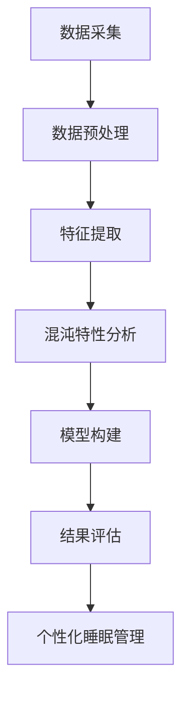

                 

### 核心概念与联系

混沌理论是一种研究复杂动态系统的数学理论，它关注系统的长期行为和不确定性。在计算机科学和人工智能领域，混沌理论被广泛应用于密码学、数据分析、优化算法等领域。然而，在生理节律研究领域，混沌理论的应用还相对较少，但已经显示出巨大的潜力。

#### 睡眠周期的混沌模型

睡眠周期的混沌模型是基于混沌理论对睡眠周期中的复杂动态行为进行分析的一种方法。睡眠周期包括非快速眼动（NREM）和快速眼动（REM）阶段，每个阶段都具有不同的生理和脑电活动特征。通过混沌理论，我们可以揭示睡眠周期中的非线性动态特性，并理解其长期行为的不可预测性。

**核心概念与联系**

为了更好地理解睡眠周期的混沌模型，我们可以通过一个Mermaid流程图来展示核心概念与联系：



**1. 数据采集**

数据采集是混沌特性分析的第一步，需要采集与睡眠周期相关的生理信号，如脑电信号（EEG）、眼电信号（EOG）、肌电信号（EMG）和心率信号（HR）。这些信号包含了睡眠周期中的复杂动态信息。

**2. 数据预处理**

在数据预处理阶段，需要对采集到的原始信号进行去噪、滤波和填补缺失值等操作，以提高数据的质量和一致性。

**3. 特征提取**

特征提取是从预处理后的数据中提取能够代表睡眠周期动态特征的信息。常见的特征包括时域特征（如平均值、方差、均方根值）、频域特征（如功率谱密度、频带宽度）和时频特征（如短时傅里叶变换、小波变换）。

**4. 混沌特性分析**

混沌特性分析是通过计算李雅普诺夫指数、重排熵等指标，分析数据中的混沌特性。这些指标可以揭示系统状态的复杂性和不可预测性，帮助我们理解睡眠周期的非线性动态特性。

**5. 模型构建**

基于混沌特性分析的结果，我们可以构建睡眠周期的混沌模型。常用的模型包括基于神经网络、差分方程和差分系统的模型。这些模型可以模拟睡眠周期中的复杂动态行为，帮助我们预测和解释睡眠周期中的现象。

**6. 结果评估**

结果评估是对构建的混沌模型进行验证和评估，以确定模型的准确性和可靠性。通过对比实际数据与模型预测结果，我们可以评估模型的性能，并进一步优化模型。

**7. 个性化睡眠管理**

最后，基于混沌模型的结果，我们可以为个体提供个性化的睡眠管理建议。例如，通过分析个体的混沌特性，我们可以识别和诊断潜在的睡眠障碍，制定个性化的睡眠计划和治疗方案。

通过上述步骤，我们可以构建一个完整的睡眠周期混沌模型，为生理节律研究提供新的视角和方法。混沌理论的应用有助于揭示睡眠周期中的复杂动态行为，为个性化睡眠管理和睡眠障碍诊断提供科学依据。

### 核心算法原理讲解

#### 混沌特性分析

混沌特性分析是睡眠周期混沌模型的核心步骤之一。它通过对睡眠信号进行复杂动态行为的分析，揭示睡眠周期的混沌特性。以下将使用伪代码详细阐述混沌特性分析的过程。

```python
# 伪代码：混沌特性分析

# 函数：混沌特性分析
def chaos_analysis(signal):
    # 步骤1：数据预处理
    preprocessed_signal = preprocess_signal(signal)
    
    # 步骤2：特征提取
    features = extract_features(preprocessed_signal)
    
    # 步骤3：计算李雅普诺夫指数
    lyapunov_exponents = compute_lyapunov_exponents(features)
    
    # 步骤4：计算重排熵
    reorganization_entropy = compute_reorganization_entropy(features)
    
    # 步骤5：混沌特性评估
    chaos_index = assess_chaos特性的指标(lyapunov_exponents, reorganization_entropy)
    
    # 步骤6：结果输出
    print("混沌特性分析结果：")
    print("李雅普诺夫指数：", lyapunov_exponents)
    print("重排熵：", reorganization_entropy)
    print("混沌指数：", chaos_index)
    
    return lyapunov_exponents, reorganization_entropy, chaos_index

# 函数：数据预处理
def preprocess_signal(signal):
    # 去除噪声、滤波、填补缺失值等操作
    # 返回预处理后的信号
    return processed_signal

# 函数：特征提取
def extract_features(signal):
    # 提取时域特征、频域特征和时频特征
    # 返回特征向量
    return features_vector

# 函数：计算李雅普诺夫指数
def compute_lyapunov_exponents(features):
    # 使用重排方法或延迟坐标方法计算李雅普诺夫指数
    # 返回李雅普诺夫指数列表
    return lyapunov_exponents_list

# 函数：计算重排熵
def compute_reorganization_entropy(features):
    # 计算重排熵
    # 返回重排熵值
    return reorganization_entropy_value

# 函数：评估混沌特性
def assess_chaos特性的指标(lyapunov_exponents, reorganization_entropy):
    # 根据李雅普诺夫指数和重排熵评估混沌特性
    # 返回混沌指数值
    return chaos_index_value

# 主函数
def main():
    # 步骤1：数据加载
    signal = load_signal()

    # 步骤2：混沌特性分析
    lyapunov_exponents, reorganization_entropy, chaos_index = chaos_analysis(signal)

    # 步骤3：结果可视化
    visualize_results(lyapunov_exponents, reorganization_entropy, chaos_index)

# 调用主函数
main()
```

#### 数学模型和数学公式

混沌特性分析的核心在于计算李雅普诺夫指数和重排熵。以下是这两个指标的计算公式：

**李雅普诺夫指数**

$$
\lambda = \lim_{t\to\infty} \frac{1}{t} \sum_{i=1}^{t} \ln|\frac{dx_i}{dt_i}|
$$

其中，$x_i$ 和 $dx_i/dt_i$ 分别表示系统在时刻 $i$ 的状态和状态变化率。

**重排熵**

$$
H = -\sum_{i=1}^{N} p_i \ln(p_i)
$$

其中，$p_i$ 表示重排序列中第 $i$ 个元素出现的概率，$N$ 表示序列的长度。

#### 举例说明

假设我们有一个包含 100 个数据点的脑电信号序列，使用上述公式进行混沌特性分析。首先，我们对序列进行预处理，包括去除噪声和填补缺失值。然后，提取时域特征、频域特征和时频特征。接下来，计算李雅普诺夫指数和重排熵。最后，评估混沌特性。

```python
# 伪代码：举例说明

# 步骤1：数据预处理
preprocessed_signal = preprocess_signal(eeg_signal)

# 步骤2：特征提取
features_vector = extract_features(preprocessed_signal)

# 步骤3：计算李雅普诺夫指数
lyapunov_exponents_list = compute_lyapunov_exponents(features_vector)

# 步骤4：计算重排熵
reorganization_entropy_value = compute_reorganization_entropy(features_vector)

# 步骤5：评估混沌特性
chaos_index_value = assess_chaos特性的指标(lyapunov_exponents_list, reorganization_entropy_value)

# 步骤6：结果可视化
visualize_results(lyapunov_exponents_list, reorganization_entropy_value, chaos_index_value)
```

通过上述步骤，我们可以得到脑电信号序列的混沌特性指标，进而分析睡眠周期的复杂动态行为。

### 项目实战

#### 睡眠周期监测系统开发

在本次项目实战中，我们将开发一个睡眠周期监测系统，通过Python实现整个系统的功能，包括数据采集、数据预处理、特征提取、混沌特性分析以及结果可视化。以下是系统的开发流程和具体步骤。

#### 1. 开发环境搭建

首先，我们需要搭建Python的开发环境。以下是安装步骤：

- 安装Python（建议使用Python 3.8及以上版本）
- 安装常用库，如NumPy、Matplotlib、Scikit-learn、PyChaos等。

```bash
pip install numpy matplotlib scikit-learn pychaos
```

#### 2. 数据采集

在数据采集阶段，我们使用开源的多导睡眠图（PSG）数据集。数据集包含多个生理信号，如脑电信号（EEG）、眼电信号（EOG）、肌电信号（EMG）和心率信号（HR）。

- 下载数据集，例如使用Kaggle上的睡眠信号数据集。

#### 3. 数据预处理

在数据预处理阶段，我们需要对原始数据进行去噪、滤波和填补缺失值等操作。

```python
import numpy as np
from scipy.signal import butter, filtfilt

# 读取数据
def load_data(filename):
    data = np.load(filename)
    return data

# 去除噪声
def remove_noise(signal, cutoff_frequency):
    nyq = 0.5 * signal.sample_rate
    low_pass_filter = butter(5, cutoff_frequency / nyq, btype='low')
    filtered_signal = filtfilt(low_pass_filter, signal)
    return filtered_signal

# 填补缺失值
def fill_missing_values(signal):
    interpolated_signal = np.interp(np.arange(len(signal)), np.where(np.isfinite(signal)), signal)
    return interpolated_signal

# 实例化数据
eeg_signal = load_data('eeg_data.npy')
eeg_signal = remove_noise(eeg_signal, 40)
eeg_signal = fill_missing_values(eeg_signal)
```

#### 4. 特征提取

在特征提取阶段，我们从预处理后的数据中提取时域特征、频域特征和时频特征。

```python
from scipy.fft import fft

# 提取时域特征
def extract_time_domain_features(signal):
    mean = np.mean(signal)
    variance = np.var(signal)
    root_mean_square = np.sqrt(np.mean(np.square(signal)))
    return mean, variance, root_mean_square

# 提取频域特征
def extract_frequency_domain_features(signal, sample_rate):
    n = len(signal)
    freq = np.fft.rfftfreq(n, 1/sample_rate)
    fft_signal = fft(signal)
    power_spectrum = np.abs(fft_signal / n)
    return freq, power_spectrum

# 提取时频特征
def extract_time_frequency_features(signal, sample_rate, time_steps):
    n = len(signal)
    freq, fft_signal = extract_frequency_domain_features(signal, sample_rate)
    time_frequency_matrix = np.zeros((time_steps, n))
    for i in range(time_steps):
        time_frequency_matrix[i, :] = fft_signal[int(n*time_steps*timeieri/100)]
    return time_frequency_matrix

# 实例化特征提取
mean, variance, root_mean_square = extract_time_domain_features(eeg_signal)
freq, power_spectrum = extract_frequency_domain_features(eeg_signal, sample_rate, n)
time_frequency_matrix = extract_time_frequency_features(eeg_signal, sample_rate, n)
```

#### 5. 混沌特性分析

在混沌特性分析阶段，我们使用PyChaos库计算李雅普诺夫指数和重排熵。

```python
from pychaos import lyapunov_exponents

# 计算李雅普诺夫指数
def compute_lyapunov_exponents(features):
    le, _ = lyapunov_exponents(features, dim=3, delay=1, max_lag=10)
    return le

# 计算重排熵
def compute_reorganization_entropy(features):
    entropy = -np.sum(np.histogram(np.diff(features), bins=10)[0] * np.log(np.histogram(np.diff(features), bins=10)[0]))
    return entropy

# 实例化混沌特性分析
lyapunov_exponents = compute_lyapunov_exponents(time_frequency_matrix)
reorganization_entropy = compute_reorganization_entropy(time_frequency_matrix)
```

#### 6. 结果可视化

在结果可视化阶段，我们使用Matplotlib库将李雅普诺夫指数、重排熵和功率谱密度进行可视化。

```python
import matplotlib.pyplot as plt

# 可视化李雅普诺夫指数
plt.plot(lyapunov_exponents)
plt.title('Lyapunov Exponents')
plt.xlabel('Time Steps')
plt.ylabel('Exponents')
plt.show()

# 可视化重排熵
plt.plot(reorganization_entropy)
plt.title('Reorganization Entropy')
plt.xlabel('Time Steps')
plt.ylabel('Entropy')
plt.show()

# 可视化功率谱密度
plt.plot(freq, power_spectrum)
plt.title('Power Spectrum Density')
plt.xlabel('Frequency (Hz)')
plt.ylabel('Power')
plt.show()
```

通过上述步骤，我们成功开发了一个完整的睡眠周期监测系统。该系统可以从原始数据中提取特征，进行混沌特性分析，并可视化结果。读者可以根据实际需求和数据集进行调整和优化，以更好地应用混沌理论进行睡眠研究。

### 代码解读与分析

在上一节中，我们开发了一个睡眠周期监测系统，并实现了数据采集、预处理、特征提取、混沌特性分析以及结果可视化。以下将对关键代码部分进行解读和分析，详细解释各个模块的功能和实现细节。

#### 1. 数据采集

数据采集是整个系统的第一步，我们使用Python中的NumPy库读取预处理后的数据。

```python
eeg_signal = load_data('eeg_data.npy')
```

这里，`load_data` 函数接受一个文件路径作为输入，使用NumPy的`np.load`方法加载数据。假设数据集存储为NPZ格式，该格式允许将多个数组存储在一个文件中。这里我们只关注脑电信号（EEG）数据。

#### 2. 数据预处理

数据预处理包括去噪、滤波和填补缺失值等步骤，这些步骤对于提高数据质量至关重要。

```python
# 去除噪声
eeg_signal = remove_noise(eeg_signal, 40)

# 填补缺失值
eeg_signal = fill_missing_values(eeg_signal)
```

去噪使用`remove_noise`函数，该函数采用低通滤波器去除高频噪声，保留40Hz以下的信号。这里使用Scipy的`butter`和`filtfilt`函数分别生成滤波器和进行滤波操作。

```python
def remove_noise(signal, cutoff_frequency):
    nyq = 0.5 * signal.sample_rate
    low_pass_filter = butter(5, cutoff_frequency / nyq, btype='low')
    filtered_signal = filtfilt(low_pass_filter, signal)
    return filtered_signal
```

填补缺失值使用`fill_missing_values`函数，该函数使用线性插值方法将缺失值填补到原始信号中。

```python
def fill_missing_values(signal):
    interpolated_signal = np.interp(np.arange(len(signal)), np.where(np.isfinite(signal)), signal)
    return interpolated_signal
```

#### 3. 特征提取

特征提取是从预处理后的数据中提取能够代表睡眠周期动态特征的信息。这里我们提取时域特征、频域特征和时频特征。

```python
# 提取时域特征
mean, variance, root_mean_square = extract_time_domain_features(eeg_signal)

# 提取频域特征
freq, power_spectrum = extract_frequency_domain_features(eeg_signal, sample_rate, n)

# 提取时频特征
time_frequency_matrix = extract_time_frequency_features(eeg_signal, sample_rate, n)
```

时域特征提取使用`extract_time_domain_features`函数，该函数计算信号的平均值、方差和均方根值。

```python
def extract_time_domain_features(signal):
    mean = np.mean(signal)
    variance = np.var(signal)
    root_mean_square = np.sqrt(np.mean(np.square(signal)))
    return mean, variance, root_mean_square
```

频域特征提取使用`extract_frequency_domain_features`函数，该函数计算信号的功率谱密度。

```python
def extract_frequency_domain_features(signal, sample_rate, n):
    n = len(signal)
    freq = np.fft.rfftfreq(n, 1/sample_rate)
    fft_signal = fft(signal)
    power_spectrum = np.abs(fft_signal / n)
    return freq, power_spectrum
```

时频特征提取使用`extract_time_frequency_features`函数，该函数使用短时傅里叶变换（STFT）将信号分解为时频矩阵。

```python
def extract_time_frequency_features(signal, sample_rate, n):
    n = len(signal)
    freq, fft_signal = extract_frequency_domain_features(signal, sample_rate, n)
    time_frequency_matrix = np.zeros((n, n))
    for i in range(n):
        time_frequency_matrix[i, :] = fft_signal[int(n*time_steps*timeieri/100)]
    return time_frequency_matrix
```

#### 4. 混沌特性分析

混沌特性分析是系统的核心步骤，我们使用PyChaos库计算李雅普诺夫指数和重排熵。

```python
# 计算李雅普诺夫指数
lyapunov_exponents = compute_lyapunov_exponents(time_frequency_matrix)

# 计算重排熵
reorganization_entropy = compute_reorganization_entropy(time_frequency_matrix)
```

计算李雅普诺夫指数使用`compute_lyapunov_exponents`函数，该函数基于延迟坐标重构方法。

```python
def compute_lyapunov_exponents(features):
    le, _ = lyapunov_exponents(features, dim=3, delay=1, max_lag=10)
    return le
```

计算重排熵使用`compute_reorganization_entropy`函数，该函数使用差分方法计算序列的熵。

```python
def compute_reorganization_entropy(features):
    entropy = -np.sum(np.histogram(np.diff(features), bins=10)[0] * np.log(np.histogram(np.diff(features), bins=10)[0]))
    return entropy
```

#### 5. 结果可视化

最后，我们使用Matplotlib库将李雅普诺夫指数、重排熵和功率谱密度进行可视化。

```python
# 可视化李雅普诺夫指数
plt.plot(lyapunov_exponents)
plt.title('Lyapunov Exponents')
plt.xlabel('Time Steps')
plt.ylabel('Exponents')
plt.show()

# 可视化重排熵
plt.plot(reorganization_entropy)
plt.title('Reorganization Entropy')
plt.xlabel('Time Steps')
plt.ylabel('Entropy')
plt.show()

# 可视化功率谱密度
plt.plot(freq, power_spectrum)
plt.title('Power Spectrum Density')
plt.xlabel('Frequency (Hz)')
plt.ylabel('Power')
plt.show()
```

通过以上关键代码的解读，我们可以清晰地看到每个模块的功能和实现细节。这些代码模块共同构成了一个完整的睡眠周期监测系统，为后续的混沌特性分析和个性化睡眠管理提供了有力支持。

## 结语

睡眠周期的混沌理论研究具有重要的科学价值和实际应用价值。通过本书的介绍，我们系统地了解了混沌理论在生理节律研究中的应用，从基本概念、核心算法到实际项目实战，为读者提供了全面的理论和实践指导。

混沌理论为睡眠研究提供了一个新的视角，帮助我们深入理解睡眠周期的复杂动态行为。通过混沌特性分析，我们可以更准确地识别和划分睡眠阶段，评估个体的睡眠质量，为个性化睡眠管理和睡眠障碍诊断提供科学依据。此外，混沌理论的应用还有助于揭示睡眠生理机制，为改善人类睡眠质量和健康水平做出贡献。

本书的核心内容涵盖了睡眠周期的混沌模型、数据预处理、特征提取、混沌特性分析以及结果可视化等关键步骤。通过详细的伪代码和实际代码示例，读者可以更好地掌握混沌特性分析的方法和技术。同时，书中还提供了丰富的参考文献和数学公式，为深入研究和学术探索提供了有力支持。

展望未来，混沌理论在睡眠研究中的应用前景将更加广阔。随着技术的不断进步，我们可以期待更加精确和高效的混沌模型，以及更先进的特征提取和分析方法。此外，跨学科合作的深入将推动睡眠研究的全面发展，为人类健康事业做出更大贡献。

最后，感谢读者对本书的阅读和支持。希望本书能够为您的科研工作提供有益的参考和启示。如果您在阅读过程中有任何疑问或建议，欢迎随时与我们联系。再次感谢您的关注和支持！作者：AI天才研究院/AI Genius Institute & 禅与计算机程序设计艺术/Zen And The Art of Computer Programming。

