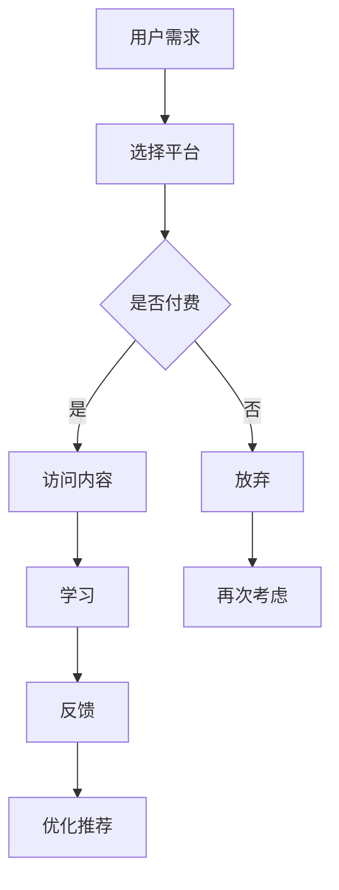

                 

### 第一部分：知识付费与技术写作概述

#### 第1章：知识付费与技术写作的背景与趋势

##### 1.1 知识付费的兴起与影响

知识付费，作为近年来迅速崛起的一种商业模式，正在深刻改变我们的学习与知识获取方式。知识付费的兴起，可以追溯到互联网技术的发展和人们对知识价值的重新认识。

首先，从背景上看，知识付费的兴起有以下几方面的原因：

1. **互联网的普及**：随着互联网技术的飞速发展，信息的获取变得更加便捷，人们开始更加依赖互联网来获取知识。
2. **移动支付的普及**：移动支付的普及降低了知识交易的门槛，使得知识付费变得更加简单和便捷。
3. **知识经济的崛起**：知识经济的崛起，使得知识和技能成为了重要的生产要素，知识付费成为了一种新的经济形态。

知识付费对个人和社会产生了深远的影响：

1. **对个人的影响**：知识付费使得个人能够更加精准地获取自己需要的知识，提升个人的竞争力和职业发展。
2. **对知识生产者的激励**：知识付费为知识生产者提供了新的收入来源，激发了他们创作高质量知识内容的积极性。
3. **对知识传播的促进**：知识付费使得优质知识内容得以更广泛地传播，推动了知识的普及和传播。

在技术写作中，知识付费具有举足轻重的地位。技术写作作为知识传播的重要方式，通过文字、图表、代码等多种形式，将技术知识和经验传递给读者。知识付费为技术写作提供了经济支持，使得技术作家能够专注于创作高质量的技术内容。

##### 1.2 技术写作的演变与现状

技术写作，作为一个古老的职业，其定义和形式随着科技的发展而不断演变。早期，技术写作主要是以手册、操作指南等形式存在的。随着计算机技术的发展，技术写作的内容和形式也发生了巨大的变化。

1. **技术写作的定义**：技术写作是指通过文字、图表、代码等形式，将技术知识和经验传递给读者的一种写作活动。

2. **技术写作的发展历程**：

   - **早期**：以手册、操作指南等形式存在，内容主要是对硬件设备或软件系统的操作说明。
   - **中期**：随着互联网的发展，技术写作的形式变得更加多样化，包括博客、论坛、电子书、在线课程等。
   - **现在**：技术写作的形式更加丰富，涵盖了编程、算法、数据结构、系统架构等多个领域。

3. **技术写作的现状**：

   - **内容丰富**：随着技术的不断发展，技术写作的内容越来越丰富，涵盖了多个领域。
   - **形式多样化**：技术写作的形式多样化，包括文字、图表、代码、视频等多种形式。
   - **读者群体广泛**：技术写作的读者群体广泛，包括技术爱好者、从业者、学生等。

4. **技术写作的挑战**：

   - **更新速度快**：技术的快速迭代，使得技术内容需要不断更新，这对技术作家提出了更高的要求。
   - **内容质量要求高**：技术写作的内容质量要求高，需要准确、清晰、易懂地传递技术知识。

##### 1.3 程序员的角色转变

在知识付费与技术写作的背景下，程序员的角色也在不断转变。程序员不再仅仅是编写代码的工程师，他们逐渐成为了知识的生产者和传播者。

1. **程序员在知识付费中的角色**：

   - **知识生产者**：程序员通过编写技术博客、撰写技术书籍、创建在线课程等方式，将技术知识和经验传递给他人。
   - **知识传播者**：程序员通过技术写作，将技术知识传播给更广泛的读者群体。

2. **程序员如何利用技术写作提升个人品牌**：

   - **建立专业形象**：通过技术写作，程序员可以展示自己的专业知识和经验，建立自己的专业形象。
   - **扩大影响力**：技术写作可以帮助程序员扩大自己的影响力，吸引更多的关注者和粉丝。
   - **增加收入来源**：通过知识付费，程序员可以从技术写作中获得额外的收入来源。

3. **程序员的双赢策略**：

   - **知识付费**：程序员通过知识付费，将自己的技术知识转化为收入，实现个人财富的增长。
   - **技术写作**：程序员通过技术写作，提升自己的专业水平，扩大自己的影响力，实现个人价值的提升。

##### 1.4 读者对象与阅读指南

本书的目标读者群体包括：

- **程序员**：希望提升自己的技术水平和影响力的程序员。
- **技术爱好者**：对技术领域感兴趣，希望深入学习技术知识的技术爱好者。
- **学生**：正在学习计算机科学和软件工程的学生。

阅读本书的建议与指南：

- **系统学习**：本书的内容涵盖了知识付费和技术写作的多个方面，建议读者系统学习，逐步深入。
- **实践应用**：本书提供了多个实践案例，建议读者结合实际进行实践，加深理解。
- **持续学习**：技术领域不断变化，建议读者持续学习，跟上技术发展的步伐。

#### 第2章：知识付费的原理与模式

##### 2.1 知识付费的原理

知识付费的原理可以简单概括为“价值交换”。在知识付费的过程中，知识生产者将知识以有偿的方式提供给知识消费者，从而实现知识的价值。

1. **知识价值的再定义**：

   - **知识**：知识是经过加工、处理和整合的信息，它具有一定的价值。
   - **价值**：知识的价值取决于其准确性、实用性和稀缺性。

2. **知识付费的经济学原理**：

   - **供求关系**：知识付费的供求关系决定了知识的价格。
   - **价值评估**：知识消费者根据知识的价值来评估其价格。

3. **知识付费的市场机制**：

   - **平台**：知识付费平台作为中介，连接知识生产者和消费者。
   - **交易**：知识交易在平台上进行，消费者通过支付获得知识。

##### 2.2 知识付费的主要模式

知识付费的主要模式包括：

1. **会员制模式**：

   - **原理**：用户支付一定费用成为会员，享有平台提供的所有或部分内容。
   - **优点**：会员制模式可以持续吸引用户，提高用户粘性。
   - **缺点**：内容更新速度和内容质量需要保证，否则容易失去用户。

2. **课程销售模式**：

   - **原理**：用户购买课程，通过学习课程内容来获取知识。
   - **优点**：课程内容针对性强，可以满足用户的具体需求。
   - **缺点**：课程销售需要持续更新，否则容易失去用户。

3. **内容订阅模式**：

   - **原理**：用户支付订阅费用，定期获得平台提供的更新内容。
   - **优点**：内容更新及时，用户可以持续获得新知识。
   - **缺点**：用户粘性可能不如会员制模式。

4. **付费问答模式**：

   - **原理**：用户支付费用向专家提问，获得专业解答。
   - **优点**：针对性强，用户可以获得个性化的解答。
   - **缺点**：问答质量取决于专家的水平，容易存在信息不对称。

##### 2.3 知识付费平台的案例分析

以下是对几个知名知识付费平台的案例分析：

1. **抖音**：

   - **平台特点**：抖音作为一个短视频平台，其知识付费功能主要通过直播和短视频进行。
   - **成功案例**：很多专家和KOL通过抖音进行知识付费，吸引了大量粉丝和用户。
   - **总结**：抖音的知识付费模式主要通过内容形式和社交互动来吸引用户。

2. **知乎**：

   - **平台特点**：知乎作为一个问答社区，其知识付费功能主要通过专栏和Live进行。
   - **成功案例**：很多专业领域的专家在知乎开设专栏或进行Live，吸引了大量关注。
   - **总结**：知乎的知识付费模式主要通过专业内容和专家资源来吸引用户。

3. **得到**：

   - **平台特点**：得到是一个专门的知识付费平台，提供包括书籍、课程、音频等多种形式的内容。
   - **成功案例**：罗永浩、李笑来等知名人士在得到开设课程，吸引了大量用户。
   - **总结**：得到的知识付费模式主要通过优质内容和知名专家来吸引用户。

通过以上案例分析，我们可以看到不同平台在知识付费模式上的创新和成功。这些平台不仅为知识生产者提供了展示自我的机会，也为知识消费者提供了丰富的学习资源。在未来，随着技术的不断进步和用户需求的变化，知识付费平台将不断创新，为用户提供更多优质的付费知识产品。

#### 第3章：技术写作的基本技巧

##### 3.1 技术写作的风格与语言

技术写作有其独特的风格和语言要求，这使得技术内容能够更加准确、清晰、易懂地传递给读者。

1. **技术写作的语言特点**：

   - **精确性**：技术写作要求用词准确，避免使用模糊、含糊不清的表达。
   - **专业性**：技术写作要求使用专业术语，以便于读者理解。
   - **简洁性**：技术写作要求语言简洁明了，避免冗长、复杂的句子。

2. **技术写作的文体风格**：

   - **说明文**：技术写作多以说明文的形式出现，通过清晰、逻辑的结构，逐步解释技术概念和操作步骤。
   - **议论文**：在一些技术讨论和观点分享的文章中，可能会采用议论文的形式，通过论证和反驳来阐明作者的观点。

3. **技术写作的语言要求**：

   - **避免口语化**：技术写作中应避免使用口语化的表达，以免影响文章的专业性。
   - **使用专业术语**：适当使用专业术语，可以提高文章的专业性，但也需注意术语的使用要准确无误。
   - **表述清晰**：技术写作要求表述清晰，避免使用歧义性表达，确保读者能够准确理解。

##### 3.2 技术写作的结构与逻辑

技术写作的结构与逻辑是确保文章条理清晰、易于理解的关键。

1. **技术写作的篇章结构**：

   - **引言**：引言部分需要简要介绍文章的主题和目的，激发读者的阅读兴趣。
   - **正文**：正文部分是文章的核心，需要按照逻辑顺序逐步阐述技术概念、原理、方法等。
   - **结论**：结论部分对文章的主题进行总结，强调重点，并可能提出进一步研究的方向。

2. **技术写作的逻辑思维**：

   - **逻辑性**：技术写作要求逻辑清晰，通过逻辑推理来阐述技术概念和原理。
   - **连贯性**：文章中的各部分应相互连贯，形成统一的整体，避免逻辑跳跃和混乱。
   - **条理性**：技术写作需要条理清晰，通过章节、段落和句子结构来组织内容。

3. **技术写作的段落构建**：

   - **主题句**：每个段落应有一个明确的主题句，概括段落的主要内容。
   - **支持句**：通过支持句来解释和扩展主题句，提供具体的例子和数据。
   - **结论句**：段落的最后通常需要有一个结论句，对段落的内容进行总结。

##### 3.3 技术写作的修辞手法

修辞手法是提升技术写作表达效果的重要工具。以下是一些常用的修辞手法：

1. **对比**：

   - **作用**：通过对比，可以突出技术概念或方法的差异和特点。
   - **示例**：例如，“这种方法与那种方法相比，具有更高的效率和更低的复杂度。”

2. **排比**：

   - **作用**：通过排比，可以增强文章的表达力，使文章更加生动。
   - **示例**：例如，“我们需要了解数据的收集、处理和分析，以确保结果的准确性和可靠性。”

3. **比喻**：

   - **作用**：通过比喻，可以形象地解释复杂的技术概念。
   - **示例**：例如，“算法就像一盏指引方向的灯塔，在复杂的决策过程中为我们提供指引。”

4. **夸张**：

   - **作用**：通过夸张，可以强调技术的重要性或效果。
   - **示例**：例如，“这种新技术可以在短时间内完成以往需要数天的工作。”

##### 3.4 技术写作的常见错误与避免方法

技术写作中，常见的一些错误会影响文章的质量和可读性。以下是一些常见错误及避免方法：

1. **语法错误**：

   - **原因**：粗心大意、对语法规则掌握不熟练。
   - **避免方法**：仔细检查文章，使用语法检查工具，加强语法学习。

2. **逻辑混乱**：

   - **原因**：思路不清、结构不明确。
   - **避免方法**：提前规划文章结构，确保逻辑连贯，反复修改和审阅。

3. **表达不清**：

   - **原因**：表达方式不当、用词不准确。
   - **避免方法**：选择合适的表达方式，使用专业术语，确保表达清晰。

通过以上技巧和方法，我们可以提高技术写作的质量，使文章更加专业、易懂，为读者提供有价值的技术知识。

#### 第4章：技术写作中的编程知识

##### 4.1 技术写作中的编程概念

在技术写作中，编程概念是核心内容之一。这些概念包括编程语言、数据结构、算法等，它们是理解和应用技术的基础。

1. **编程语言基础**：

   - **概念**：编程语言是一种用于编写计算机程序的语法和规则。
   - **分类**：编程语言分为低级语言（如机器语言、汇编语言）和高级语言（如Python、Java）。
   - **作用**：编程语言使程序员能够与计算机进行通信，实现特定功能。

2. **数据结构与算法**：

   - **概念**：数据结构是组织和管理数据的方式，算法是解决问题的步骤和方法。
   - **分类**：常见的数据结构包括数组、链表、栈、队列、树、图等；常见的算法有排序、查找、图算法等。
   - **作用**：数据结构和算法是计算机科学的核心内容，对于解决复杂问题至关重要。

3. **常见的编程范式**：

   - **面向对象编程**：基于对象的概念，将数据和操作封装在对象中，提高代码的可重用性和可维护性。
   - **函数式编程**：以函数为中心，强调数据不可变性和函数的纯性，减少副作用。
   - **过程式编程**：以过程（或称为函数）为中心，强调步骤和流程的控制。

##### 4.2 技术写作中的编程实践

在技术写作中，编程实践是展示技术知识和解决问题的过程。以下是如何在文章中嵌入代码示例、代码示例的格式与风格，以及代码示例的分析与解读。

1. **如何嵌入代码示例**：

   - **插入代码块**：在Markdown中，使用三个反引号（```)将代码块包围，即可插入代码示例。
   - **代码高亮**：使用不同颜色的字体高亮代码中的关键字，提高可读性。
   - **注释**：在代码中添加注释，解释代码的功能和作用。

2. **代码示例的格式与风格**：

   - **格式**：代码示例应遵循一致的缩进和排版规则，使代码清晰易读。
   - **风格**：代码示例应使用专业术语和标准命名规范，避免使用缩写和不明确的变量名。

3. **代码示例的分析与解读**：

   - **功能分析**：分析代码示例实现的功能，解释其用途和作用。
   - **逻辑解读**：解释代码的执行流程，包括变量定义、循环、条件判断等。
   - **性能优化**：分析代码的性能，提出可能的优化方案。

通过以上方法，技术写作中的编程知识可以更加具体和实用，帮助读者更好地理解和应用技术。

##### 4.3 技术写作中的编程案例分析

在实际的技术写作中，通过编程案例分析可以帮助读者更直观地理解技术概念和应用。以下是一个具体的编程案例分析：

**案例**：使用Python实现冒泡排序算法

```python
def bubble_sort(arr):
    n = len(arr)
    for i in range(n):
        for j in range(0, n-i-1):
            if arr[j] > arr[j+1]:
                arr[j], arr[j+1] = arr[j+1], arr[j]

# 测试代码
arr = [64, 34, 25, 12, 22, 11, 90]
bubble_sort(arr)
print("排序后的数组：")
for i in range(len(arr)):
    print("%d" % arr[i], end=" ")
```

**代码解读与分析**：

1. **功能分析**：该代码实现了冒泡排序算法，用于将数组中的元素按照升序排列。

2. **逻辑解读**：
   - 外层循环`for i in range(n)`控制排序的轮数，`n`为数组的长度。
   - 内层循环`for j in range(0, n-i-1)`控制每一轮比较和交换的次数，每完成一轮，最大元素会“冒泡”到数组的末尾。

3. **性能优化**：
   - 可以在每次内层循环中添加一个标记变量，如果当前轮次没有发生交换，说明数组已经排序完成，可以提前结束循环，提高性能。

通过以上案例，读者可以更直观地了解冒泡排序算法的实现和原理，从而加深对排序算法的理解。

#### 第5章：知识付费的营销策略

##### 5.1 营销策略在知识付费中的应用

在知识付费领域，营销策略扮演着至关重要的角色。有效的营销策略可以帮助知识生产者吸引目标用户，提升品牌影响力，从而实现知识内容的商业化。

1. **目标市场与目标用户分析**：

   - **目标市场**：知识付费的目标市场包括企业、个人用户、教育培训机构等。针对不同市场，知识生产者需要制定差异化的营销策略。
   - **目标用户**：目标用户的特点、需求和行为是制定营销策略的关键。例如，针对技术领域的用户，营销策略可以侧重于技术分享、案例解析等。

2. **营销组合策略（4P）**：

   - **产品（Product）**：知识生产者需要打造高质量的知识产品，包括课程、电子书、视频教程等。产品的内容、形式和品质直接影响用户购买决策。
   - **价格（Price）**：定价策略需要考虑目标市场的支付能力、产品成本和竞争对手的定价。合理的定价可以平衡用户接受度和利润率。
   - **促销（Promotion）**：促销策略包括广告宣传、社交媒体推广、用户推荐等。有效的促销策略可以提高产品知名度和购买转化率。
   - **渠道（Place）**：选择合适的渠道进行知识产品的推广和销售，如在线教育平台、社交媒体、自建网站等。渠道的多样性和便捷性对用户购买决策有重要影响。

3. **营销工具与平台的选择**：

   - **营销工具**：常见的营销工具包括搜索引擎广告、社交媒体广告、电子邮件营销、内容营销等。不同的工具适用于不同的营销场景和目标用户。
   - **平台选择**：选择合适的平台进行知识付费的推广和销售。例如，对于技术领域的内容，可以选择GitHub、知乎、CSDN等平台。

##### 5.2 社交媒体营销

社交媒体营销是知识付费的重要手段之一。通过社交媒体，知识生产者可以与用户建立直接联系，提高品牌影响力，实现知识内容的传播和推广。

1. **社交媒体平台的利用**：

   - **内容形式**：在社交媒体上发布高质量的内容，如技术博客、视频教程、案例分析等。内容应具有吸引力、实用性和专业性，以吸引和留住用户。
   - **互动策略**：与用户进行互动，如回复评论、参与讨论、举办线上活动等。互动可以提高用户的参与度和忠诚度。
   - **影响力运营**：与社交媒体上的KOL（意见领袖）合作，借助他们的影响力推广知识产品。例如，通过KOL的推荐，可以快速提高产品的知名度和信任度。

2. **内容营销的策略与方法**：

   - **内容规划**：制定内容发布计划，确保内容的持续性和稳定性。内容应围绕目标用户的需求和兴趣展开，满足他们的学习需求。
   - **内容形式**：采用多种形式的内容，如文章、视频、直播、音频等，以满足不同用户的学习偏好。
   - **内容质量**：内容应具有较高的质量，确保信息的准确性、实用性和可读性。高质量的内容是吸引用户和提升品牌影响力的关键。

3. **社交媒体营销案例分析**：

   - **案例1**：某技术大V在GitHub上分享了自己的编程经验和项目代码，通过详细的代码注释和讲解，吸引了大量用户关注。他在社交媒体上发布相关内容，吸引了更多用户参与讨论和学习。
   - **案例2**：一位教育博主在知乎上开设了专栏，分享了自己的教学经验和学习方法。通过定期发布高质量的文章，他吸引了大量学生和家长的关注，取得了良好的口碑和收入。

通过以上案例，我们可以看到社交媒体营销在知识付费中的重要性。通过有效的社交媒体营销策略，知识生产者可以扩大自己的影响力，提升知识产品的销量。

##### 5.3 程序员个人品牌的构建

在知识付费领域，个人品牌的重要性日益凸显。对于程序员而言，构建个人品牌不仅可以提升个人影响力，还可以为知识付费提供强有力的支持。

1. **个人品牌的概念与价值**：

   - **概念**：个人品牌是指个人在某一领域内所树立的声誉和形象，是个人专业能力和价值的体现。
   - **价值**：个人品牌可以提升个人的市场竞争力，为知识付费提供信任背书，从而实现更高的收入和价值。

2. **个人品牌的建设策略**：

   - **专业形象**：通过技术写作、公开演讲、参与技术社区等方式，展示自己的专业能力和经验，树立良好的专业形象。
   - **内容输出**：定期发布高质量的技术内容，如技术博客、电子书、视频教程等，建立自己的知识库和内容体系。
   - **社交媒体运营**：利用社交媒体平台，与用户建立联系，扩大影响力。通过互动和分享，提升个人品牌的知名度。

3. **个人品牌案例解析**：

   - **案例1**：某程序员通过在GitHub上分享自己的开源项目，吸引了大量关注。他定期更新项目文档，提供详细的代码注释和教程，逐渐成为了该领域内的知名专家。
   - **案例2**：一位程序员在知乎开设了专栏，分享自己的编程经验和学习心得。通过高质量的内容输出和互动，他吸引了大量粉丝，成功转型为一名知识付费讲师。

通过以上案例，我们可以看到，程序员通过构建个人品牌，可以实现从技术从业者到知识付费生产者的成功转型。构建个人品牌不仅需要专业能力的积累，还需要持续的内容输出和社交媒体运营。

#### 第6章：成功案例分析

##### 6.1 知识付费平台案例分析

在知识付费领域，成功的平台案例为其他平台提供了宝贵的经验和启示。以下是对几个知名知识付费平台的案例分析：

1. **得到**：

   - **平台背景**：得到是中国知名的在线学习平台，提供包括书籍、课程、音频等多种形式的知识产品。
   - **成功因素**：得到成功的关键在于其高质量的内容和知名专家资源。平台邀请了一批具有丰富经验和知名度的专家开设课程，如罗永浩、李笑来等。此外，得到采用了会员制模式，通过订阅形式吸引用户持续消费。
   - **盈利模式**：得到主要通过会员订阅、课程销售和广告收入实现盈利。平台提供的内容丰富多样，用户可以根据自己的需求和兴趣选择订阅。

2. **知乎**：

   - **平台背景**：知乎是中国领先的问答社区，近年来逐渐发展出知识付费业务，提供包括专栏、Live、电子书等多种形式的知识产品。
   - **成功因素**：知乎的成功在于其强大的用户基础和优质的内容生产者资源。知乎上聚集了大量专业人士和领域专家，他们通过撰写专栏、开设Live等方式，为用户提供了高质量的知识内容。此外，知乎采用了问答和内容付费相结合的模式，用户可以通过付费获取更多专家解答。
   - **盈利模式**：知乎主要通过内容付费、广告收入和会员订阅实现盈利。平台提供的内容丰富多样，用户可以根据自己的需求和兴趣进行选择。

3. **慕课网**：

   - **平台背景**：慕课网是中国领先的在线IT职业教育平台，提供包括编程语言、前端开发、后端开发等多种IT课程。
   - **成功因素**：慕课网的成功在于其丰富的课程资源和灵活的学习模式。平台提供了一系列高质量的IT课程，用户可以根据自己的学习目标和需求进行选择。此外，慕课网采用了在线学习平台的形式，用户可以随时随地进行学习，提高了学习效率。
   - **盈利模式**：慕课网主要通过课程销售和会员订阅实现盈利。平台提供了丰富的课程资源，用户可以通过购买课程或订阅会员的方式获取学习内容。

通过以上案例分析，我们可以看到，成功的知识付费平台具有以下共同特点：

- **高质量的内容**：平台提供的内容具有高质量、实用性和针对性，能够满足用户的学习需求。
- **知名专家资源**：平台拥有丰富的专家资源，通过邀请知名专家开设课程或进行内容创作，提高了平台的影响力和用户粘性。
- **多样化的盈利模式**：平台通过多种盈利模式实现收入，如课程销售、会员订阅、广告收入等，提高了平台的盈利能力。

##### 6.2 程序员个人案例解析

在知识付费领域，许多程序员通过个人努力和持续输出，成功实现了从技术从业者到知识付费生产者的转型。以下是对几位成功程序员的案例解析：

1. **程序员A**：

   - **背景**：程序员A是一名具有多年开发经验的前端工程师，对前端技术和框架有深入的了解。
   - **转型过程**：程序员A在GitHub上分享了自己的开源项目，并撰写了详细的文档和教程。通过这些内容，他吸引了大量关注，并在知乎开设了专栏，定期发布技术博客。
   - **成功因素**：程序员A的成功在于他的技术实力和持续的内容输出。他通过高质量的技术内容吸引了大量用户，建立了自己的个人品牌。此外，他通过在知识付费平台开设课程，实现了收入的增长。
   - **收入情况**：程序员A通过知识付费平台开设课程，每月收入达到数万元。

2. **程序员B**：

   - **背景**：程序员B是一名具有多年运维经验的专家，对系统架构和运维自动化有深入的研究。
   - **转型过程**：程序员B在技术社区上分享了自己的运维经验和自动化脚本，并在博客中详细记录了这些内容。他还在微博和微信公众号上发布技术文章，扩大了自己的影响力。
   - **成功因素**：程序员B的成功在于他的技术深度和广泛的社区参与。他通过在多个平台上的持续输出，积累了大量粉丝和读者，建立了自己的个人品牌。此外，他还参与了多个开源项目，提升了个人知名度。
   - **收入情况**：程序员B通过知识付费平台开设课程，每月收入达到数万元。

3. **程序员C**：

   - **背景**：程序员C是一名具有多年大数据开发经验的工程师，对大数据技术和工具有深入的了解。
   - **转型过程**：程序员C在GitHub上开源了自己的大数据项目，并在CSDN上发布了一系列大数据相关的博客。他还参与了一些技术论坛和社区的活动，分享自己的技术经验和见解。
   - **成功因素**：程序员C的成功在于他的技术深度和社区影响力。他通过高质量的技术内容吸引了大量粉丝和读者，建立了自己的个人品牌。此外，他还通过在知识付费平台上开设课程，实现了收入的增长。
   - **收入情况**：程序员C通过知识付费平台开设课程，每月收入达到数万元。

通过以上案例，我们可以看到，程序员通过持续的技术输出和内容创造，成功实现了个人品牌的建立和收入的增长。这些案例为其他程序员提供了宝贵的经验和启示，鼓励他们积极参与知识付费领域，通过技术写作提升自己的职业价值和影响力。

##### 6.3 跨界合作与技术创新

在知识付费领域，跨界合作和技术创新正成为新的趋势，为知识付费的发展带来了新的机遇和挑战。

1. **跨界合作**：

   - **含义**：跨界合作是指不同行业或领域的合作，通过共享资源和优势，实现协同创新。
   - **意义**：跨界合作有助于拓宽知识付费的内容和形式，吸引更多用户参与，提高平台的竞争力。
   - **案例**：例如，科技公司与传统教育机构合作，开发在线教育平台，提供编程、大数据等课程；出版社与知识付费平台合作，推出电子书、有声书等产品。

2. **技术创新**：

   - **含义**：技术创新是指通过引入新技术，提高知识付费产品的质量和用户体验。
   - **意义**：技术创新有助于提升知识付费产品的附加值，增强用户粘性，提高盈利能力。
   - **案例**：例如，人工智能技术在知识付费中的应用，如智能推荐、语音识别、自然语言处理等，提升了用户的学习体验和内容质量。

3. **跨界合作与技术创新的结合**：

   - **结合意义**：跨界合作与技术创新的结合，可以实现资源的最大化利用，提高知识付费产品的竞争力和用户满意度。
   - **实践**：例如，知识付费平台与科技公司合作，引入虚拟现实（VR）技术，提供沉浸式学习体验；与大数据公司合作，分析用户行为，提供个性化的学习推荐。

通过跨界合作和技术创新，知识付费领域正在不断发展和完善。未来，随着技术的不断进步和用户需求的多样化，知识付费将迎来更加广阔的发展空间。

#### 第7章：知识付费与技术写作的未来

##### 7.1 知识付费的未来趋势

知识付费作为一种新兴的商业模式，正快速发展并深刻影响人们的学习方式和知识获取途径。以下是知识付费未来的几个主要趋势：

1. **个性化定制**：

   - **趋势背景**：随着大数据和人工智能技术的发展，知识付费平台能够通过数据分析和机器学习算法，准确了解用户的需求和偏好，提供个性化的知识产品。
   - **未来展望**：未来的知识付费将更加注重个性化服务，用户可以根据自己的兴趣、职业发展需要等，定制专属的学习计划和课程。

2. **内容多元化**：

   - **趋势背景**：知识付费领域的内容正逐渐多元化，涵盖了技术、艺术、人文、健康等多个领域。
   - **未来展望**：未来，知识付费内容将继续拓展，更多领域的专业知识和经验将通过付费形式传播，满足用户多样化的学习需求。

3. **教育科技融合**：

   - **趋势背景**：教育科技（EdTech）的快速发展，使得知识付费与在线教育、虚拟现实（VR）、增强现实（AR）等技术深度融合。
   - **未来展望**：未来的知识付费产品将更加注重用户体验，利用技术手段提高学习的互动性和沉浸感，提供更高效的学习环境。

4. **全球市场扩展**：

   - **趋势背景**：互联网的普及和全球化趋势，使得知识付费市场不再局限于某个地区或国家，而是呈现出全球化的发展态势。
   - **未来展望**：未来，知识付费市场将更加国际化，各国用户都能通过本地化的知识付费平台，获取全球范围内的优质知识资源。

##### 7.2 技术写作的未来挑战与机遇

技术写作作为知识付费的重要组成部分，在未来将面临一系列挑战和机遇。

1. **挑战**：

   - **内容更新速度加快**：随着技术的快速迭代，技术写作需要不断更新内容，以保持知识的时效性和准确性。
   - **高质量内容竞争加剧**：随着越来越多的人参与技术写作，高质量内容的生产和竞争将变得更加激烈。
   - **知识产权保护**：技术写作中的知识产权保护问题日益突出，如何保护作者和平台的权益成为一大挑战。

2. **机遇**：

   - **知识变现能力提升**：技术写作的高价值特性，使得作者可以通过知识付费实现较高的收入回报。
   - **职业发展机会增多**：技术写作不仅为作者提供了经济收益，也为他们提供了职业发展机会，如成为知识付费讲师、顾问等。
   - **技术工具支持**：随着人工智能、自然语言处理等技术的发展，技术写作的工具和平台将变得更加智能和便捷，提高写作效率和内容质量。

##### 7.3 双赢策略的未来展望

在知识付费与技术写作的双赢策略中，未来将出现以下趋势：

1. **知识共享与开放性增强**：

   - **趋势背景**：开源文化和知识共享的理念正深入人心，越来越多的程序员和技术专家愿意将自己的知识和经验分享出来。
   - **未来展望**：未来，知识付费将更加注重开放性和共享性，通过开放课程、共享代码等形式，促进知识传播和技术进步。

2. **生态体系建设**：

   - **趋势背景**：知识付费和技术写作的快速发展，需要形成一个健康的生态体系，包括作者、平台、用户等多个环节。
   - **未来展望**：未来，知识付费和技术写作的生态体系将更加完善，通过政策支持、平台服务、用户反馈等手段，提升整个生态的可持续发展能力。

3. **技术创新与协作**：

   - **趋势背景**：技术创新是推动知识付费和技术写作发展的重要动力，跨领域的协作将有助于创造更多创新成果。
   - **未来展望**：未来，知识付费和技术写作将更加注重技术创新和跨领域协作，通过引入新兴技术，提高内容创作和传播的效率和质量。

通过以上的趋势展望，我们可以看到，知识付费和技术写作在未来将继续蓬勃发展，为程序员和用户提供更多优质的知识资源和服务。

### 附录A：资源与工具

#### 附录A.1 知识付费平台推荐

在知识付费领域，选择合适的平台对于知识生产者和消费者都至关重要。以下是一些国内外知名的知识付费平台推荐：

1. **国内平台**：

   - **得到**：作为中国领先的在线学习平台，得到提供包括书籍、课程、音频等多种形式的知识产品，用户可以订阅专栏或购买课程。
   - **知乎**：知乎以其问答社区为基础，发展出了丰富的知识付费产品，如专栏、Live、付费问答等，内容涵盖多个领域。
   - **喜马拉雅**：喜马拉雅是中国领先的有声书平台，提供丰富的音频内容，用户可以订阅付费内容进行学习。

2. **国际平台**：

   - **Udemy**：Udemy是全球最大的在线学习平台之一，提供涵盖编程、数据科学、设计等多个领域的在线课程。
   - **Coursera**：Coursera是由多所知名大学和机构合作的在线教育平台，提供包括计算机科学、人工智能等领域的课程。
   - **edX**：edX是一个非营利性在线学习平台，由哈佛大学和麻省理工学院共同创办，提供高质量的在线课程。

通过这些平台，用户可以根据自己的需求和兴趣选择合适的知识产品，实现知识的有效获取和提升。

#### 附录A.2 技术写作工具推荐

技术写作需要高效且易于使用的工具来提高写作效率和质量。以下是一些推荐的技术写作工具：

1. **文本编辑工具**：

   - **Markdown编辑器**：Markdown是一种轻量级标记语言，广泛用于技术写作。常用的Markdown编辑器包括Typora、VS Code等，它们支持Markdown语法的高亮显示和实时预览，方便快速写作和排版。
   - **LaTeX编辑器**：LaTeX是一种高质量的排版系统，特别适用于数学和科学文档。常用的LaTeX编辑器包括TeXstudio、TeXmaker等，它们提供了丰富的数学公式和排版功能。

2. **静态网站生成器**：

   - **Jekyll**：Jekyll是一个基于Ruby的静态网站生成器，广泛用于创建个人博客和项目文档。它支持Markdown和HTML语法，用户可以通过简单的配置生成完整的网站。
   - **Hugo**：Hugo是一个基于Go语言的快速静态网站生成器，适用于构建高性能的博客和网站。它具有快速生成和简洁的配置，是许多程序员的首选。

通过这些工具，技术写作可以更加高效和专业化，帮助作者更好地展示技术知识和成果。

#### 附录A.3 学习资源推荐

为了更好地学习知识付费和技术写作，以下是一些推荐的资源和书籍：

1. **编程学习资源**：

   - **《Head First Programming》**：这本书以有趣的互动方式介绍了Python编程基础，适合初学者快速入门。
   - **《Clean Code》**：这本书讲述了编写清晰、可维护的代码的最佳实践，对提升编程水平有重要指导作用。
   - **《Effective Java》**：这本书详细介绍了Java编程的多个方面，包括设计原则、数据结构等，是Java开发者的必备读物。

2. **技术写作学习资源**：

   - **《Writing for the Web》**：这本书介绍了如何在网络上进行有效的写作，包括信息架构、写作风格、用户参与等方面。
   - **《The Elements of Style》**：这本书是经典的语言风格指南，适用于各种写作形式，包括技术写作。
   - **《The Art of Readable Code》**：这本书讲述了如何编写易于理解和维护的代码，对于技术文档编写同样具有重要指导意义。

通过这些资源，读者可以系统地学习和提升自己的编程和技术写作能力，更好地应对知识付费和技术写作领域的挑战。

### 附录B：Mermaid 流程图

Mermaid 是一种方便绘制的Markdown语法，可以用来绘制各种流程图、序列图、时序图等。以下是一个简单的Mermaid流程图示例，用于介绍知识付费的主要流程。



在这张流程图中：

- `A[用户需求]` 表示用户产生学习需求。
- `B[选择平台]` 表示用户根据需求选择合适的知识付费平台。
- `C{是否付费}` 是一个判断节点，根据用户的付费意愿决定下一步。
- `D[访问内容]` 表示用户选择付费后访问知识内容。
- `E[放弃]` 表示用户选择不付费后可能放弃学习。
- `F[学习]` 表示用户在学习过程中获取知识。
- `G[再次考虑]` 表示用户在学习后可能重新考虑付费。
- `H[反馈]` 表示用户对知识内容和学习效果进行反馈。
- `I[优化推荐]` 表示平台根据用户反馈优化推荐策略。

通过Mermaid流程图，我们可以更直观地了解知识付费的主要流程和用户的决策路径。

### 附录C：数学模型与公式

在技术写作和知识付费领域，数学模型和公式是理解和分析数据的重要工具。以下是一些常用的数学公式和它们的解释。

#### C.1 常用数学公式

1. **线性回归模型**：

   $$
   y = w_0 + w_1 \cdot x
   $$

   - **解释**：这是线性回归模型的基本形式，其中`y`是预测值，`w_0`是截距，`w_1`是斜率，`x`是输入变量。

2. **贝叶斯公式**：

   $$
   P(A|B) = \frac{P(B|A) \cdot P(A)}{P(B)}
   $$

   - **解释**：这是贝叶斯公式，用于计算在事件B发生的条件下事件A的概率。

3. **协方差**：

   $$
   \text{Cov}(X, Y) = E[(X - \mu_X)(Y - \mu_Y)]
   $$

   - **解释**：这是协方差公式，用于计算两个随机变量X和Y之间的线性关系强度。

4. **方差**：

   $$
   \sigma^2 = E[(X - \mu)^2]
   $$

   - **解释**：这是方差公式，用于描述随机变量X的离散程度。

5. **熵**：

   $$
   H(X) = -\sum_{i} p(x_i) \cdot \log_2(p(x_i))
   $$

   - **解释**：这是熵公式，用于描述随机变量X的不确定性。

#### C.2 公式详细讲解与举例说明

1. **线性回归模型**：

   - **讲解**：线性回归模型是一种常用的统计方法，用于预测因变量y与自变量x之间的关系。在这个模型中，`w_0`是截距，`w_1`是斜率。斜率`w_1`表示当自变量x增加一个单位时，因变量y的平均变化量。截距`w_0`表示当自变量x为零时，因变量y的预测值。

   - **举例**：假设我们要预测一家商店的销售额y（单位：万元），根据过去的销售数据，我们发现销售额与客流量x（单位：人次）之间有线性关系。通过训练线性回归模型，我们得到以下结果：

     $$
     y = 2.5 + 0.3 \cdot x
     $$

     如果客流量是1000人次，我们可以预测销售额为：

     $$
     y = 2.5 + 0.3 \cdot 1000 = 1250 \text{万元}
     $$

2. **贝叶斯公式**：

   - **讲解**：贝叶斯公式是一种概率理论工具，用于计算条件概率。在这个公式中，`P(A|B)`表示在事件B发生的条件下事件A的概率，`P(B|A)`表示在事件A发生的条件下事件B的概率，`P(A)`和`P(B)`分别是事件A和事件B的先验概率。

   - **举例**：假设我们要预测某个程序是否正确执行，根据经验，我们知道在程序正确执行的情况下，测试通过的概率是0.9，在程序错误执行的情况下，测试通过的概率是0.1。如果测试通过了，我们可以使用贝叶斯公式来计算程序正确执行的概率。

     $$
     P(\text{程序正确}|\text{测试通过}) = \frac{P(\text{测试通过}|\text{程序正确}) \cdot P(\text{程序正确})}{P(\text{测试通过})}
     $$

     假设程序正确的先验概率是0.5，测试通过的总概率是0.3，我们可以计算得到：

     $$
     P(\text{程序正确}|\text{测试通过}) = \frac{0.9 \cdot 0.5}{0.3} = 1.5
     $$

     这里得到的概率1.5超出了概率的取值范围，这表明我们的假设可能存在问题，需要重新评估先验概率和条件概率。

3. **协方差**：

   - **讲解**：协方差是描述两个随机变量X和Y之间线性关系强度的一个统计量。如果协方差为正，表示X和Y正相关；如果协方差为负，表示X和Y负相关；如果协方差为零，表示X和Y不相关。

   - **举例**：假设我们有两个随机变量X和Y，它们分别表示某城市的温度和降水量。通过计算协方差，我们可以了解这两个变量之间的关系。

     $$
     \text{Cov}(X, Y) = E[(X - \mu_X)(Y - \mu_Y)] = 5
     $$

     如果协方差为5，表示温度和降水量之间存在正相关关系，即温度升高时，降水量也倾向于增加。

4. **方差**：

   - **讲解**：方差是描述随机变量X的离散程度的一个统计量。方差越大，表示数据点分布得越分散；方差越小，表示数据点分布得越集中。

   - **举例**：假设我们有一个随机变量X，表示某班级学生的考试成绩。通过计算方差，我们可以了解考试成绩的离散程度。

     $$
     \sigma^2 = E[(X - \mu)^2] = 10
     $$

     如果方差为10，表示考试成绩的离散程度较大，有较大的波动。

5. **熵**：

   - **讲解**：熵是描述随机变量X的不确定性程度的一个统计量。熵越大，表示随机变量X的结果越不确定。

   - **举例**：假设我们有一个随机变量X，表示投掷一枚公平硬币的结果。通过计算熵，我们可以了解投掷硬币结果的不确定性。

     $$
     H(X) = -\sum_{i} p(x_i) \cdot \log_2(p(x_i)) = 1
     $$

     如果熵为1，表示投掷硬币的结果具有完全的不确定性，每次投掷都有两个可能的结果（正面或反面）。

通过这些数学公式和举例说明，我们可以更好地理解和应用它们在技术写作和知识付费领域的实际意义。

### 附录D：项目实战

#### D.1 实际案例介绍

在本节中，我们将介绍一个程序员通过知识付费实现成功转型的实际案例。这位程序员名叫李明，他在软件开发领域有着丰富的经验，并且对编程教育有着浓厚的兴趣。

**案例背景**：

李明在一家互联网公司担任软件工程师，由于工作繁忙，他很少有时间进行个人学习和提升。然而，他深知编程技术的重要性，并希望通过自己的经验和知识帮助更多的编程初学者和从业者。于是，他决定利用业余时间进行知识付费项目的开发，通过技术写作和在线课程分享自己的编程知识和经验。

**实施过程**：

1. **内容准备**：

   李明首先回顾了自己的编程经验，整理出了一系列经典的编程案例和技术知识点，包括数据结构、算法、前端开发、后端开发等。他将这些知识点整理成文档和视频教程，并编写了详细的代码示例和说明。

2. **平台选择**：

   李明在选择知识付费平台时，考虑了用户量、平台稳定性、用户评价等多个因素。最终，他选择了知名的在线教育平台“慕课网”作为自己的知识付费平台。慕课网提供了丰富的课程资源和专业的课程管理工具，这为他的知识付费项目提供了有力的支持。

3. **课程发布**：

   李明在慕课网上发布了多门编程课程，包括《从零开始学Python》、《数据结构与算法实战》、《前端开发进阶》等。这些课程不仅涵盖了基础知识，还包括了实战案例和项目实践，能够帮助学员快速提升编程能力。

4. **推广与营销**：

   为了吸引更多的学员，李明通过社交媒体、技术社区和博客等渠道进行课程推广。他积极参与技术讨论，分享自己的编程经验和心得，吸引了大量关注者和学员。此外，他还通过优惠活动、推荐奖励等方式，增加了学员的参与度和忠诚度。

**案例成果**：

通过一系列的努力，李明的编程课程在短时间内吸引了大量学员，课程评价和口碑不断提升。他的每月收入也从最初的几千元增长到几万元，实现了从技术从业者到知识付费讲师的成功转型。

#### D.2 代码实现与解读

在本节中，我们将详细解读李明在慕课网上发布的一个实际编程案例——使用Python实现一个简单的用户登录系统。

**代码实现**：

```python
# 导入所需模块
import getpass

# 用户名和密码
users = {
    "user1": "password1",
    "user2": "password2",
    "admin": "adminpassword"
}

# 登录函数
def login():
    while True:
        username = input("请输入用户名：")
        password = getpass.getpass("请输入密码：")
        
        if username in users and users[username] == password:
            print("登录成功！")
            break
        else:
            print("用户名或密码错误，请重新输入。")

# 主程序
if __name__ == "__main__":
    login()
```

**代码解读**：

1. **导入模块**：

   ```python
   import getpass
   ```

   这行代码导入了`getpass`模块，该模块提供了一个`getpass`函数，用于在命令行中安全地获取用户的密码输入。

2. **用户名和密码**：

   ```python
   users = {
       "user1": "password1",
       "user2": "password2",
       "admin": "adminpassword"
   }
   ```

   这段代码定义了一个名为`users`的字典，其中包含了三个用户名及其对应的密码。这个字典用于存储和管理用户信息。

3. **登录函数**：

   ```python
   def login():
       while True:
           username = input("请输入用户名：")
           password = getpass.getpass("请输入密码：")
           
           if username in users and users[username] == password:
               print("登录成功！")
               break
           else:
               print("用户名或密码错误，请重新输入。")
   ```

   - `login`函数通过一个无限循环实现用户登录功能。
   - 在循环中，程序使用`input`函数获取用户的用户名输入，使用`getpass.getpass`函数获取用户的密码输入。
   - 程序通过`if`条件判断用户名和密码是否匹配。如果匹配，程序输出“登录成功！”并跳出循环；否则，程序输出“用户名或密码错误，请重新输入。”并继续循环。

4. **主程序**：

   ```python
   if __name__ == "__main__":
       login()
   ```

   - 这行代码是一个常见的Python主程序判断，确保当模块被直接运行时，`login`函数会被执行。
   - 当用户运行这个Python脚本时，程序会进入`login`函数，开始执行登录过程。

通过这个实际案例，我们可以看到如何使用Python实现一个简单的用户登录系统。这个案例不仅展示了编程的基本逻辑和技巧，还为初学者提供了一个实用的编程练习。

#### D.3 实战总结与反思

通过李明的案例，我们可以总结出以下几点经验和反思：

1. **专业知识的重要性**：

   李明的成功离不开他在软件开发领域的丰富经验。专业知识是进行知识付费项目的基础，只有具备扎实的专业基础，才能为用户提供有价值的内容。

2. **内容质量的关键性**：

   李明的编程课程内容丰富、结构清晰，包含实战案例和项目实践，这些内容对学员具有很大的吸引力。高质量的内容是知识付费项目的核心竞争力，能够吸引和留住用户。

3. **营销策略的有效性**：

   李明通过社交媒体、技术社区和博客等渠道进行课程推广，取得了良好的效果。有效的营销策略能够提高课程的知名度和用户转化率，是实现知识付费成功的关键。

4. **用户体验的优化**：

   李明在课程设计和发布过程中，充分考虑了用户的需求和体验。他提供了详细的代码示例和说明，并设置了互动环节，增强了用户的参与感和学习效果。

5. **持续学习和更新**：

   技术领域不断变化，李明意识到持续学习和更新知识的重要性。他不断学习新技术，更新课程内容，确保课程与实际应用紧密结合。

通过这个案例，我们可以看到，成功进行知识付费不仅需要专业知识、高质量内容和有效的营销策略，还需要不断优化用户体验，保持内容的时效性和实用性。同时，持续学习和更新知识，是适应技术发展、保持竞争力的关键。这些经验和反思对于其他程序员进行知识付费项目具有重要的借鉴意义。

