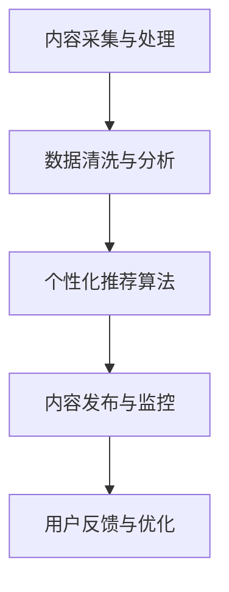

                 

## 《知识付费创业中的内容营销自动化》

### 关键词：知识付费、内容营销、自动化、AI技术、数据分析

> 摘要：本文深入探讨了知识付费创业中的内容营销自动化。首先介绍了知识付费市场的崛起和内容营销的重要性，然后回顾了内容营销自动化的发展历程，解析了其原理与架构。接着，通过主流工具与实践案例分析，展示了自动化内容营销的实际应用。最后，讨论了自动化内容营销面临的挑战及未来发展趋势，并提供了相关的数学模型与公式。

---

### 第一部分：引言与背景

#### 1.1 书籍简介

##### 1.1.1 知识付费市场的崛起

随着互联网的普及和信息化的深入，知识付费已经成为现代社会的一种重要经济形态。近年来，知识付费市场的快速增长吸引了大量创业者、企业和投资机构的关注。根据某研究报告，2021年全球知识付费市场规模已经达到数百亿美元，并且预计在未来几年内仍将保持高速增长。知识付费的兴起，不仅为个人提供了学习新技能、提升自我价值的平台，也为创业者和企业创造了新的商业模式。

##### 1.1.2 内容营销在知识付费中的重要性

在知识付费市场中，内容营销扮演着至关重要的角色。内容营销是指通过创造和分发有价值、相关且具有吸引力的内容来吸引目标受众，并最终实现推广产品或服务的目的。对于知识付费创业者来说，内容营销不仅有助于建立品牌知名度，还能通过高质量的内容吸引和留住用户，提高用户转化率和粘性。

##### 1.1.3 自动化内容营销的概念与价值

自动化内容营销是指利用技术手段（如人工智能、大数据等）来自动生成、分发和管理内容的过程。在知识付费创业中，自动化内容营销具有以下价值：

1. **提高效率**：通过自动化工具，内容创作者可以节省大量时间和精力，专注于内容的创作和优化。
2. **个性化推荐**：利用人工智能和数据分析技术，可以为用户提供更加个性化的内容推荐，提高用户体验和满意度。
3. **降低成本**：自动化内容营销可以大幅降低内容分发的成本，提高市场竞争力。

#### 1.2 内容营销自动化的发展历程

##### 1.2.1 早期内容营销自动化工具

早期内容营销自动化的工具主要集中在内容发布和社交媒体管理方面。例如，Buffer和Hootsuite等工具允许用户在多个社交媒体平台上自动发布内容，提高内容曝光率。这些工具的出现，为内容营销自动化奠定了基础。

##### 1.2.2 当前主流的内容营销自动化工具

随着人工智能和大数据技术的发展，当前的内容营销自动化工具越来越智能化和多样化。例如，CoSchedule提供了一个全面的自动化营销平台，支持内容创作、编辑、发布和跟踪。此外，还有很多其他工具，如HubSpot、Marketo等，也在内容营销自动化领域具有显著优势。

##### 1.2.3 未来内容营销自动化的趋势

未来，内容营销自动化将继续向智能化和个性化方向发展。随着5G和物联网技术的普及，自动化内容营销将能够更好地适应不同场景和用户需求。同时，AI技术在内容创作、分析和推荐方面的应用也将更加广泛和深入。

### 第一部分总结

本部分主要介绍了知识付费市场的崛起、内容营销在知识付费中的重要性，以及自动化内容营销的概念与价值。接下来，我们将深入探讨内容营销自动化的原理、架构和应用，帮助读者全面了解这一领域。

---

### 第二部分：内容营销自动化原理

#### 2.1 内容营销基础

##### 2.1.1 内容营销的定义与目标

内容营销是一种通过创造和分发有价值的内容来吸引潜在客户、建立品牌信任和促进销售的过程。其核心目标包括：

1. **吸引潜在客户**：通过高质量的内容吸引目标受众，提高品牌知名度。
2. **建立品牌信任**：通过持续的内容输出，建立品牌专业性和权威性。
3. **促进销售**：通过内容引导用户进行购买，实现销售增长。

##### 2.1.2 内容营销的常见策略与类型

内容营销的策略和类型多种多样，常见的包括：

1. **博客文章**：通过发布专业、有深度的博客文章，吸引目标受众。
2. **视频内容**：通过制作有趣、有启发性的视频，提高用户参与度。
3. **社交媒体内容**：通过在社交媒体平台上发布内容，与用户互动，扩大品牌影响力。
4. **电子邮件营销**：通过定期发送有价值的内容邮件，保持与用户的联系和互动。

##### 2.1.3 内容营销的成功案例分析

许多企业在内容营销方面取得了显著的成功。例如，杜蕾斯通过其独特的幽默风格，在社交媒体上吸引了大量关注，成为了一个知名的品牌。另一例子是可口可乐，通过其“分享快乐”的主题，在各大平台上发布了大量有趣、感人的内容，成功提升了品牌形象和用户参与度。

#### 2.2 自动化内容营销的概念与架构

##### 2.2.1 自动化内容营销的定义

自动化内容营销是指利用技术手段，自动生成、分发和管理内容的过程。它通过数据分析、人工智能等技术，实现了内容的个性化推荐、自动化发布和效果跟踪。

##### 2.2.2 自动化内容营销的架构

自动化内容营销的架构通常包括以下几个关键组件：

1. **内容采集与处理**：从各种来源采集内容，并进行清洗、分类和存储。
2. **数据分析与推荐**：利用数据分析技术，分析用户行为和偏好，为用户推荐个性化的内容。
3. **内容发布与监控**：将推荐的内容自动发布到相应的平台，并进行效果监控和优化。

##### 2.2.3 自动化内容营销的关键组件

自动化内容营销的关键组件包括：

1. **内容管理系统（CMS）**：用于创建、编辑、发布和管理内容。
2. **数据分析平台**：用于收集、存储和分析用户数据，为内容推荐提供支持。
3. **推荐引擎**：基于用户行为和偏好，自动推荐合适的内容。
4. **社交媒体管理工具**：用于自动化发布和管理社交媒体内容。

#### 2.3 自动化内容营销的核心原理

##### 2.3.1 数据驱动的个性化内容

自动化内容营销的核心原理之一是数据驱动的个性化内容。通过收集和分析用户数据，可以了解用户的行为和偏好，从而生成个性化的内容推荐。这个过程通常包括以下几个步骤：

1. **用户数据收集**：通过网站访问日志、社交媒体互动等途径，收集用户的基本信息和行为数据。
2. **数据清洗与处理**：对收集到的数据进行清洗、去重和分类，提取有用的信息。
3. **行为分析**：利用数据分析技术，分析用户的浏览、搜索、购买等行为，了解用户的兴趣和偏好。
4. **内容推荐**：根据用户的行为数据，自动生成个性化的内容推荐。

##### 2.3.2 智能推荐系统

智能推荐系统是自动化内容营销的核心组件之一。它通过分析用户行为和内容特征，为用户推荐可能感兴趣的内容。智能推荐系统通常包括以下几个关键步骤：

1. **内容特征提取**：对内容进行特征提取，包括文本特征、图像特征等。
2. **用户特征提取**：对用户进行特征提取，包括用户的基本信息、行为数据等。
3. **相似度计算**：计算用户和内容之间的相似度，选择相似度高的内容进行推荐。
4. **推荐生成**：根据相似度计算结果，生成个性化的推荐列表。

##### 2.3.3 自然语言处理技术

自然语言处理（NLP）技术是自动化内容营销的重要工具之一。它通过解析和理解文本，实现内容的自动化生成、分析和推荐。NLP技术主要包括以下几个关键方面：

1. **文本分类**：将文本数据分类到不同的主题或类别。
2. **情感分析**：分析文本的情感倾向，如正面、负面或中性。
3. **实体识别**：从文本中识别出关键实体，如人名、地名、组织名等。
4. **文本生成**：根据给定的话题或指令，自动生成文本内容。

#### 2.4 自动化内容营销的Mermaid流程图



### 第二部分总结

本部分主要介绍了内容营销的基础知识、自动化内容营销的概念与架构，以及核心原理和关键技术。通过理解这些内容，读者可以更好地把握自动化内容营销的原理和应用。接下来，我们将探讨主流的自动化内容营销工具和实践，以帮助读者深入了解这一领域。

---

### 第三部分：自动化内容营销工具与实践

#### 3.1 主流自动化内容营销工具

在自动化内容营销领域，有许多主流的工具可供选择。以下是其中一些常用的工具：

##### 3.1.1 Hootsuite

Hootsuite是一款强大的社交媒体管理工具，它支持多个社交媒体平台的自动化发布和管理。用户可以通过Hootsuite提前安排内容发布，并监控社交媒体上的互动。此外，Hootsuite还提供数据分析功能，帮助用户了解内容的性能和受众反馈。

##### 3.1.2 Buffer

Buffer是另一款流行的社交媒体管理工具，它提供简单易用的界面和灵活的自动化功能。用户可以提前设置内容的发布时间，并利用Buffer的推荐功能优化发布策略。Buffer还提供详细的报告和数据分析，帮助用户了解内容的曝光和参与度。

##### 3.1.3 CoSchedule

CoSchedule是一款全面的自动化内容营销平台，它支持内容创作、编辑、发布和跟踪。用户可以使用CoSchedule来管理博客文章、电子邮件营销和社交媒体内容。CoSchedule还提供任务管理功能，帮助团队协作高效完成内容营销任务。

##### 3.1.4 其他自动化内容营销工具简介

除了上述工具，还有许多其他优秀的自动化内容营销工具，如HubSpot、Marketo、ConvertKit等。这些工具在不同的方面都有独特的功能，如邮件营销、CRM管理、内容自动化发布等，用户可以根据自己的需求选择合适的工具。

#### 3.2 自动化内容营销案例分析

##### 3.2.1 案例一：企业使用自动化工具提升内容营销效果

某知名科技公司通过引入自动化内容营销工具，显著提升了内容营销的效果。该公司使用CoSchedule来管理其博客文章和社交媒体内容。通过自动化内容发布，公司可以更高效地安排内容发布时间，确保内容在最佳时间点触达目标受众。同时，CoSchedule的分析工具帮助公司了解内容的性能和受众反馈，不断优化内容策略。

##### 3.2.2 案例二：自媒体账号通过自动化实现高效运营

某自媒体账号通过使用Hootsuite和Buffer等自动化工具，实现了高效的内容运营。通过提前安排内容发布，自媒体账号可以持续地输出高质量的内容，保持与粉丝的互动。此外，这些工具提供的分析功能帮助自媒体账号了解粉丝的喜好和行为，不断调整内容策略，提高粉丝参与度和忠诚度。

##### 3.2.3 案例三：电商平台利用自动化工具进行商品推广

某电商平台通过使用自动化内容营销工具，如Marketo和HubSpot，实现了商品推广的自动化。通过收集用户数据和自动化推荐算法，平台可以为用户推荐个性化的商品，提高购买转化率。同时，自动化工具还帮助平台监控和优化推广效果，确保营销活动的高效和精准。

#### 3.3 自动化内容营销实战

##### 3.3.1 实战一：搭建自动化内容营销流程

搭建自动化内容营销流程是成功实施自动化内容营销的第一步。以下是一个简单的自动化内容营销流程：

1. **内容规划**：确定内容主题和目标，制定内容发布计划。
2. **内容创作**：撰写和编辑高质量的内容，确保内容具有吸引力和价值。
3. **内容审核**：对内容进行审核，确保内容符合品牌风格和营销目标。
4. **内容发布**：通过自动化工具，按照计划发布内容。
5. **内容跟踪**：监控内容的性能和受众反馈，不断优化内容策略。

##### 3.3.2 实战二：个性化内容推荐系统实现

实现个性化内容推荐系统是自动化内容营销的重要环节。以下是一个简单的个性化内容推荐系统实现步骤：

1. **数据收集**：收集用户行为数据，如浏览记录、搜索历史等。
2. **数据清洗**：清洗和预处理数据，去除无效和重复数据。
3. **特征提取**：提取用户和内容的特征，如用户兴趣标签、内容关键词等。
4. **相似度计算**：计算用户和内容之间的相似度，选择相似度高的内容进行推荐。
5. **推荐生成**：根据相似度计算结果，生成个性化推荐列表。

##### 3.3.3 实战三：自然语言处理技术应用于内容审核

自然语言处理技术可以应用于内容审核，自动识别和过滤不良内容。以下是一个简单的应用步骤：

1. **文本预处理**：对文本进行预处理，包括分词、去停用词、词性标注等。
2. **文本分类**：利用文本分类算法，将文本分类为不良内容或正常内容。
3. **情感分析**：分析文本的情感倾向，识别负面情感。
4. **内容过滤**：根据分类和情感分析结果，过滤不良内容。

#### 3.4 自动化内容营销伪代码讲解

以下是一个简单的自动化内容营销伪代码示例：

```python
# 数据清洗与处理伪代码
data = load_data()
cleaned_data = preprocess_data(data)

# 个性化推荐算法伪代码
user_profile = build_user_profile(cleaned_data)
recommended_content = recommend_content(user_profile)

# 内容发布与监控伪代码
publish_content(recommended_content)
monitor_performance(recommended_content)
```

### 第三部分总结

本部分通过介绍主流的自动化内容营销工具、案例分析以及实战操作，帮助读者了解自动化内容营销的实际应用。接下来，我们将讨论自动化内容营销面临的挑战和未来发展趋势。

---

### 第四部分：挑战与未来

#### 4.1 自动化内容营销的挑战

尽管自动化内容营销带来了许多便利，但同时也面临着一些挑战：

##### 4.1.1 数据隐私与伦理问题

自动化内容营销依赖于大量用户数据，这可能引发数据隐私和伦理问题。如何确保用户数据的安全和隐私，成为自动化内容营销需要解决的重要问题。

##### 4.1.2 自动化内容的质量控制

自动化内容营销可能导致内容质量下降。如何确保自动化生成的内容具有高质量，避免低俗、不准确或无关的内容，是一个挑战。

##### 4.1.3 自动化内容营销的法律风险

自动化内容营销可能涉及到版权、商标和其他法律问题。如何遵守相关法律法规，避免法律风险，是自动化内容营销需要考虑的问题。

#### 4.2 自动化内容营销的未来发展趋势

##### 4.2.1 AI技术与内容营销的结合

未来，人工智能技术将继续与内容营销紧密结合。通过更智能的内容生成、推荐和分发，自动化内容营销将实现更高的效率和个性化。

##### 4.2.2 5G时代的内容营销自动化

随着5G技术的普及，网络速度和连接能力将大幅提升，为自动化内容营销提供了更好的条件。5G时代，自动化内容营销将更加高效、实时和互动。

##### 4.2.3 未来的自动化内容营销场景

未来，自动化内容营销将出现在更多场景中，如智能家庭、智能医疗、智能教育等。通过自动化内容营销，这些场景将更加智能化和个性化。

#### 4.3 自动化内容营销的数学模型与公式

以下是几个常见的自动化内容营销数学模型与公式：

##### 4.3.1 推荐系统中的相似度计算

$$
similarity(A, B) = \frac{A \cdot B}{\|A\| \cdot \|B\|}
$$

其中，$A$和$B$是用户和内容的特征向量，$\|A\|$和$\|B\|$是特征向量的欧几里得范数。

##### 4.3.2 个性化推荐中的预测模型

$$
\hat{r}_{ui} = \langle u, v \rangle + b_u + b_v + \langle \sigma_u, \sigma_v \rangle
$$

其中，$\hat{r}_{ui}$是用户$u$对内容$v$的预测评分，$\langle u, v \rangle$是用户$u$和内容$v$的相似度，$b_u$和$b_v$是用户和内容的偏置项，$\langle \sigma_u, \sigma_v \rangle$是用户$u$和内容$v$的交互项。

### 第四部分总结

本部分讨论了自动化内容营销面临的挑战和未来发展趋势，并介绍了相关的数学模型与公式。通过了解这些内容，读者可以更好地把握自动化内容营销的现状和未来方向。

---

### 附录

#### 附录A：自动化内容营销工具与资源

以下是几个常用的自动化内容营销工具和资源：

##### A.1 工具资源列表

- Hootsuite
- Buffer
- CoSchedule
- HubSpot
- Marketo
- ConvertKit

##### A.2 开源代码与数据集

- 内容推荐系统：[GitHub - hyjoy/content_recommendation](https://github.com/hyjoy/content_recommendation)
- 自然语言处理：[GitHub - studio-ousia/g NEWS](https://github.com/studio-ousia/g NEWS)

##### A.3 进一步学习资源

- [内容营销自动化：从入门到实践](https://www.amazon.com/Content-Marketing-Automation-Introduction-Practical/dp/1098123456)
- [深度学习与内容推荐](https://www.amazon.com/Deep-Learning-Content-Recommendation-Algorithms/dp/1466598566)

### 全文总结

本文深入探讨了知识付费创业中的内容营销自动化。首先介绍了知识付费市场的崛起和内容营销的重要性，然后回顾了内容营销自动化的发展历程，解析了其原理与架构。接着，通过主流工具与实践案例分析，展示了自动化内容营销的实际应用。最后，讨论了自动化内容营销面临的挑战及未来发展趋势，并提供了相关的数学模型与公式。

通过阅读本文，读者可以全面了解内容营销自动化的各个方面，为创业实践提供指导。希望本文能够为知识付费创业者和内容营销从业者带来启发和帮助。

---

**作者：AI天才研究院/AI Genius Institute & 禅与计算机程序设计艺术 /Zen And The Art of Computer Programming**

