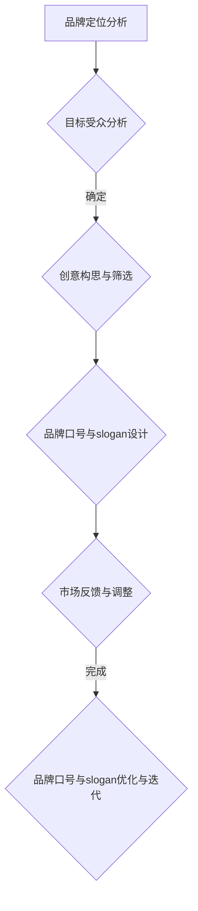

                 

### 《知识付费赚钱的品牌口号与slogan设计》

#### 摘要

本文旨在探讨知识付费领域的品牌口号与slogan设计，详细分析其核心要素、设计原则及实际案例，帮助读者了解如何创造性地构建具有吸引力和影响力的品牌口号与slogan。本文将分为三个主要部分：品牌口号与slogan设计基础、知识付费领域的品牌口号与slogan设计策略、以及品牌口号与slogan设计的优化与迭代。通过系统化的分析和实战案例讲解，本文旨在为知识付费品牌提供切实可行的品牌传播策略。

### 第一部分：品牌口号与slogan设计基础

#### 第1章：品牌口号与slogan概述

##### 1.1 品牌与品牌口号的关系

品牌是企业在市场竞争中的独特标志，代表了企业的核心价值、形象和声誉。品牌口号，作为品牌的重要组成部分，是企业在短时间内传达品牌核心价值理念的关键途径。一个好的品牌口号应具备简洁、鲜明、易记、富有感染力的特点。

品牌与品牌口号的关系可以从以下几个方面理解：

1. **传递品牌价值**：品牌口号是品牌理念的浓缩，能够迅速传递品牌的核心价值，帮助消费者在短时间内理解品牌的价值主张。

2. **增强品牌识别度**：独特的品牌口号有助于在消费者心中建立深刻的品牌印象，提升品牌的识别度和认知度。

3. **塑造品牌形象**：品牌口号是品牌形象塑造的重要元素，通过简短的文字传达品牌形象和个性，影响消费者对品牌的感知。

4. **促进品牌传播**：品牌口号易于传播，可以在各种媒介上快速复制，提高品牌曝光率，扩大品牌影响力。

##### 1.2 品牌口号与slogan的区别

品牌口号与slogan虽然有一定的相似性，但在实际应用中，它们存在一些区别：

1. **定义上的区别**：
   - 品牌口号（Brand Slogan）：通常是指企业在一段时期内所采用的一句简短而有力的宣传语，用以表达品牌的核心价值和主张。
   - Slogan：广义上指任何一句用于宣传、推广的口号，包括品牌口号在内。

2. **应用上的区别**：
   - 品牌口号：通常是企业长期坚持的品牌宣传语，具有一定的连续性和稳定性。
   - Slogan：可以是一个系列，根据不同的市场活动或特定时期使用不同的宣传口号。

3. **作用上的区别**：
   - 品牌口号：主要功能是传递品牌核心价值，强化品牌认知。
   - Slogan：除了传递品牌价值外，还可以用于特定营销活动的推广。

##### 1.3 品牌口号与slogan的设计原则

1. **简洁明了**：品牌口号与slogan应尽可能简洁明了，避免冗长和复杂的句子结构，以便消费者快速理解和记忆。

2. **独特性**：独特的口号可以区分品牌与其他竞争对手，吸引消费者的注意力，增加品牌识别度。

3. **情感诉求**：好的品牌口号与slogan应能够引起消费者的情感共鸣，建立品牌与消费者之间的情感联系。

4. **易记性**：品牌口号与slogan应易于记忆，方便消费者在日常生活中口头传播。

5. **传播性**：品牌口号与slogan应具备良好的传播性，便于在各种媒介上进行复制和传播。

6. **长期性**：品牌口号与slogan应具有长期性，能够在企业发展的不同阶段持续发挥作用。

#### 第2章：品牌口号与slogan的核心要素

##### 2.1 文字表达与情感诉求

1. **文字表达**：
   - **准确性**：品牌口号与slogan的文字表达要准确传达品牌的核心价值和理念。
   - **简洁性**：文字应简洁明了，避免冗余和复杂，便于消费者快速理解和记忆。
   - **创造性**：在保证准确性和简洁性的基础上，文字表达应具有一定的创造性，避免与竞争对手的口号雷同。

2. **情感诉求**：
   - **共鸣**：品牌口号与slogan应能够引起消费者的情感共鸣，如喜悦、感动、自豪等。
   - **价值观传递**：通过情感诉求，品牌口号与slogan可以传递品牌的核心价值观，增强消费者对品牌的认同感。
   - **个性化**：品牌口号与slogan应展现品牌个性，使消费者感受到品牌独特的魅力。

##### 2.2 独特性与吸引力

1. **独特性**：
   - **差异化**：品牌口号与slogan应具有独特性，展现品牌的差异化特点，使消费者能够迅速识别并记住品牌。
   - **创新性**：在口号设计中，可以运用创新的语言表达方式和独特的创意元素，打造与众不同的品牌形象。

2. **吸引力**：
   - **利益点**：品牌口号与slogan应明确传达品牌提供的利益点，如优惠、优惠、服务等，吸引消费者的关注。
   - **情感因素**：通过情感因素吸引消费者，如亲情、友情、成就感等，使消费者对品牌产生共鸣。

##### 2.3 易记性与传播性

1. **易记性**：
   - **简洁明了**：如前所述，简洁明了的文字表达是提高口号易记性的关键。
   - **重复强化**：通过重复口号，可以在消费者心中加深印象，提高易记性。
   - **韵律节奏**：运用韵律和节奏，使口号更加朗朗上口，易于记忆。

2. **传播性**：
   - **社交媒体**：借助社交媒体平台，可以迅速传播品牌口号与slogan，扩大品牌影响力。
   - **品牌联动**：通过品牌联动，如品牌合作、跨界营销等，增加口号的传播渠道。
   - **广告宣传**：在广告宣传中，充分利用口号，提高其曝光率和传播效果。

#### 第3章：品牌口号与slogan的设计流程

##### 3.1 品牌定位分析

1. **品牌定位的定义**：
   品牌定位是指企业在市场中的特定位置，明确了品牌所代表的核心价值和目标市场。

2. **品牌定位的重要性**：
   - **明确品牌方向**：品牌定位有助于企业明确品牌的发展方向，确保品牌口号与slogan与品牌定位一致。
   - **区分竞争对手**：通过品牌定位，企业可以明确自身的差异化优势，使品牌口号与slogan更具吸引力。
   - **提升品牌形象**：品牌定位有助于提升品牌形象，使消费者对品牌产生深刻的印象。

3. **品牌定位分析的方法**：
   - **SWOT分析**：通过SWOT分析，明确品牌的优势、劣势、机会和威胁，为品牌定位提供依据。
   - **目标市场分析**：分析目标市场，了解目标消费者的需求和行为特征，为品牌定位提供指导。
   - **竞争分析**：分析竞争对手的定位和口号，发现市场空缺和差异化机会。

##### 3.2 目标受众分析

1. **目标受众的定义**：
   目标受众是指品牌所期望影响和服务的群体，是品牌口号与slogan传播的主要对象。

2. **目标受众分析的重要性**：
   - **针对性**：通过目标受众分析，可以确保品牌口号与slogan具有针对性，满足目标受众的需求和期望。
   - **情感共鸣**：了解目标受众的情感特征和价值观，可以使品牌口号与slogan更具感染力和吸引力。
   - **提高转化率**：针对目标受众设计的品牌口号与slogan，可以更有效地提高品牌转化率。

3. **目标受众分析的方法**：
   - **用户调研**：通过问卷调查、访谈等方式，了解目标受众的需求、行为特征和偏好。
   - **数据分析**：通过数据分析，挖掘目标受众的行为数据和购买习惯，为品牌口号与slogan设计提供数据支持。
   - **用户画像**：构建目标受众的用户画像，明确目标受众的年龄、性别、职业、兴趣爱好等特征。

##### 3.3 创意构思与筛选

1. **创意构思的定义**：
   创意构思是指在品牌定位和目标受众分析的基础上，构思出具有独特性和吸引力的品牌口号与slogan。

2. **创意构思的重要性**：
   - **提升品牌形象**：独特的创意构思可以提升品牌形象，使品牌在竞争激烈的市场中脱颖而出。
   - **吸引受众关注**：富有创意的品牌口号与slogan可以吸引目标受众的注意力，提高品牌曝光率。
   - **增强记忆性**：创意构思可以使品牌口号与slogan更具趣味性和记忆性，便于传播和记忆。

3. **创意构思的方法**：
   - **头脑风暴**：通过集体讨论和头脑风暴，激发创意灵感，产生多个备选口号与slogan。
   - **用户反馈**：收集目标受众对备选口号与slogan的反馈，筛选出最符合目标受众期望的创意。
   - **竞品分析**：分析竞争对手的口号与slogan，避免雷同，同时借鉴优秀的创意元素。

4. **筛选创意的原则**：
   - **符合品牌定位**：筛选出的口号与slogan应符合品牌定位，传递品牌的核心价值和理念。
   - **具有独特性**：口号与slogan应具有独特性，避免与竞争对手雷同，展现品牌个性。
   - **易记易传播**：口号与slogan应简洁明了，易于记忆和传播，提高品牌影响力。

#### 第4章：品牌口号与slogan的案例分析

##### 4.1 国内知名品牌口号与slogan解析

1. **阿里巴巴**：“让天下没有难做的生意”
   - **解析**：这句话传达了阿里巴巴的核心价值——为中小企业提供便捷的电子商务服务，助力其发展。简洁明了，易于记忆，体现了阿里巴巴的使命和愿景。

2. **小米**：“技术改变生活”
   - **解析**：小米的品牌口号强调了技术的力量，传达了小米追求技术创新、提升生活品质的品牌理念。独特性强，具有吸引力。

3. **华为**：“连接世界，智慧未来”
   - **解析**：这句话体现了华为的全球视野和科技引领精神，寓意着华为致力于通过通信技术连接世界，引领未来。富有情感诉求，易于传播。

##### 4.2 国际知名品牌口号与slogan解析

1. **苹果**：“Think different”
   - **解析**：这句口号鼓励人们勇于创新、追求不同，体现了苹果的科技创新精神和品牌价值观。独特性强，情感诉求明确，极具感染力。

2. **谷歌**：“不作恶”
   - **解析**：这句口号传达了谷歌的核心价值观——在追求商业成功的同时，秉持道德原则，不做有害用户和社会的事情。简洁明了，易于记忆。

3. **亚马逊**：“您的世界，您的选择”
   - **解析**：这句话体现了亚马逊为消费者提供丰富选择和便利购物的品牌理念。具有情感诉求，易于传播。

#### 第二部分：知识付费领域的品牌口号与slogan设计

##### 第5章：知识付费市场现状与趋势

##### 5.1 知识付费市场概述

1. **定义**：知识付费市场是指消费者为获取有价值的信息、知识、技能或服务而付费的市场。

2. **发展历程**：
   - **起步阶段**：2016年左右，知识付费市场开始兴起，以在线课程、知识分享为主要形式。
   - **快速发展阶段**：2017年至2019年，知识付费市场规模迅速扩大，涌现出众多知识付费平台和产品。
   - **成熟阶段**：2020年以后，知识付费市场进入成熟期，竞争加剧，用户需求多样化。

3. **市场规模**：据相关报告显示，2020年知识付费市场规模已超过3000亿元，预计未来将继续保持高速增长。

4. **主要参与者**：知识付费市场的主要参与者包括在线教育平台、知识分享平台、专业培训机构等。

##### 5.2 知识付费市场发展趋势

1. **细分市场增多**：随着知识付费市场的成熟，细分市场将不断增多，如职业技能培训、兴趣课程、亲子教育等。

2. **个性化学习需求增加**：随着消费者对学习需求的个性化需求增加，知识付费平台将更加注重个性化推荐和学习路径的设计。

3. **在线教育融合**：在线教育与实体教育的融合将成为趋势，知识付费平台将提供线上线下相结合的学习模式。

4. **技术驱动创新**：人工智能、大数据等技术的应用将推动知识付费市场的创新，提升学习体验和效果。

5. **品牌竞争加剧**：随着知识付费市场的扩大，品牌竞争将日益激烈，品牌口号与slogan的设计将成为品牌差异化的关键因素。

#### 第6章：知识付费品牌口号与slogan设计策略

##### 6.1 突出知识价值

1. **明确知识价值**：
   - **专业性**：品牌口号与slogan应突出知识的专业性，强调所提供内容的权威性和可靠性。
   - **实用性**：强调知识的应用性，使消费者感受到所学知识在实际生活中的价值。

2. **案例**：
   - **知乎**：“让每个人都能获得更好的答案”
     - **解析**：这句口号突出了知乎平台的知识价值和实用性，传递了知乎为用户提供高质量答案的承诺。

##### 6.2 创造情感连接

1. **情感连接的重要性**：
   - **提升用户粘性**：通过情感诉求，品牌口号与slogan可以增强用户与品牌之间的情感连接，提升用户粘性。
   - **塑造品牌形象**：情感诉求有助于塑造品牌形象，使消费者对品牌产生深厚的情感认同。

2. **案例**：
   - **喜马拉雅**：“听见世界的美好”
     - **解析**：这句口号通过情感诉求，传达了喜马拉雅为用户带来美好听觉体验的品牌理念，增强了用户与品牌之间的情感连接。

##### 6.3 突出品牌个性

1. **品牌个性的定义**：
   - **品牌个性**：是指品牌在消费者心目中所具有的独特性格和形象，反映了品牌的文化内涵和价值观。

2. **品牌个性与品牌口号的关系**：
   - **传递品牌个性**：品牌口号与slogan应体现品牌个性，使消费者能够快速感知和认同品牌。
   - **强化品牌形象**：品牌个性有助于强化品牌形象，提升品牌在市场中的竞争力。

3. **案例**：
   - **得到**：“专业的人，讲专业的知识”
     - **解析**：这句口号突出了得到平台的专业性和权威性，体现了得到品牌独特的个性。

#### 第7章：知识付费领域品牌口号与slogan设计案例解析

##### 7.1 案例一：某知名在线教育平台

1. **品牌口号**：“让学习变得更简单”
   - **解析**：这句口号简洁明了，突出了在线教育平台的核心价值——简化学习过程，提高学习效率。同时，口号易于记忆和传播，提升了品牌知名度。

2. **slogan**：“在线学习，随时随地”
   - **解析**：这句slogan强调了在线教育的便捷性，传达了用户可以随时随地学习的理念。与品牌口号相互呼应，共同塑造了品牌形象。

##### 7.2 案例二：某知识付费自媒体

1. **品牌口号**：“传递有价值的知识”
   - **解析**：这句口号强调了知识的价值，传递了自媒体致力于为用户提供有价值内容的品牌理念。同时，口号简洁明了，易于记忆。

2. **slogan**：“一起成长，一起前行”
   - **解析**：这句slogan通过情感诉求，传达了自媒体与用户共同成长、共同进步的品牌理念。与品牌口号相互呼应，增强了用户与品牌之间的情感连接。

#### 第8章：知识付费品牌口号与slogan设计实战

##### 8.1 设计实战步骤

1. **明确品牌定位**：
   - 分析品牌在市场中的定位，明确品牌的核心价值和目标市场。

2. **分析目标受众**：
   - 通过用户调研和数据分析，了解目标受众的需求、行为特征和偏好。

3. **创意构思**：
   - 通过头脑风暴和用户反馈，构思出具有独特性和吸引力的品牌口号与slogan。

4. **筛选优化**：
   - 根据品牌定位和目标受众反馈，筛选出最符合品牌形象和受众期望的口号与slogan。

5. **测试推广**：
   - 在实际应用中测试品牌口号与slogan的效果，根据反馈进行调整和优化。

##### 8.2 实战案例分析

1. **案例背景**：
   某新兴在线教育平台希望设计一套具有吸引力和影响力的品牌口号与slogan，提升品牌知名度和用户粘性。

2. **设计步骤**：
   - **明确品牌定位**：平台定位于为职场人士提供职业技能提升课程。
   - **分析目标受众**：目标受众主要是25-45岁的职场人士，他们关注职业发展和技能提升，有较强的学习需求和付费意愿。
   - **创意构思**：
     - 品牌口号：“技能提升，职场加速器”
       - 解析：口号突出了平台为职场人士提供技能提升的核心价值，同时强调了学习对职业发展的促进作用。
     - slogan：“学习，成就更好的自己”
       - 解析：slogan通过情感诉求，传达了学习对个人成长的重要性，激发了用户的共鸣。
   - **筛选优化**：
     - 根据品牌定位和用户反馈，最终确定品牌口号和slogan。
   - **测试推广**：
     - 在平台上推广品牌口号和slogan，通过用户反馈进行调整和优化。

#### 第9章：品牌口号与slogan设计的优化与迭代

##### 9.1 市场反馈与调整

1. **市场反馈的重要性**：
   - 市场反馈是品牌口号与slogan设计成功的关键。通过市场反馈，企业可以了解消费者对品牌口号与slogan的接受程度，发现存在的问题和不足。

2. **市场反馈的方法**：
   - **用户调研**：通过问卷调查、访谈等方式，收集用户对品牌口号与slogan的反馈。
   - **数据分析**：通过数据分析，挖掘用户行为数据，了解品牌口号与slogan的实际效果。
   - **市场调研**：通过市场调研，了解竞争对手的品牌口号与slogan，发现自身的优势和不足。

3. **市场反馈与调整的原则**：
   - **及时性**：及时收集市场反馈，快速调整品牌口号与slogan，以适应市场需求。
   - **针对性**：根据市场反馈，有针对性地进行调整，解决消费者关注的问题。
   - **持续性**：市场反馈与调整应持续进行，以确保品牌口号与slogan始终符合消费者需求。

##### 9.2 品牌口号与slogan的长期维护与更新

1. **品牌口号与slogan的长期维护**：
   - **品牌形象一致性**：确保品牌口号与slogan在长期使用中保持一致性，避免出现品牌形象紊乱。
   - **品牌传播力度**：通过持续的品牌传播，强化品牌口号与slogan的知名度和影响力。
   - **品牌文化内涵**：维护品牌口号与slogan的文化内涵，确保品牌价值观的传承。

2. **品牌口号与slogan的更新**：
   - **市场变化**：根据市场变化，适时更新品牌口号与slogan，以适应新的市场环境和消费者需求。
   - **品牌发展阶段**：随着品牌的发展，品牌口号与slogan应进行相应的调整和更新，反映品牌的新定位和发展方向。
   - **技术创新**：结合技术创新和产品升级，更新品牌口号与slogan，展现品牌的创新精神和活力。

#### 附录A：品牌口号与slogan设计工具与方法

1. **文字创意工具**：
   - **头脑风暴**：通过集体讨论和头脑风暴，激发创意灵感，产生多个备选口号与slogan。
   - **创意写作**：运用创意写作技巧，如比喻、拟人、夸张等，打造独特的品牌口号与slogan。

2. **传播分析工具**：
   - **社交媒体分析**：通过社交媒体数据分析，了解品牌口号与slogan的传播效果，调整传播策略。
   - **搜索引擎分析**：通过搜索引擎分析，了解品牌口号与slogan的搜索热度，优化搜索引擎优化（SEO）策略。

#### 附录B：知识付费品牌口号与slogan设计资料汇总

1. **相关书籍推荐**：
   - 《品牌定位》作者：艾·里斯、杰克·特劳特
   - 《品牌洗脑》作者：马丁·林斯特龙
   - 《创意思考的技巧》作者：威廉·希柯克

2. **学术论文推荐**：
   - “品牌口号与品牌价值的关系研究”
   - “知识付费市场的发展趋势与策略分析”
   - “社交媒体对品牌传播的影响”

3. **知识付费行业报告**：
   - “2020年中国知识付费行业报告”
   - “2021年全球在线教育市场报告”
   - “2022年中国在线教育行业发展趋势报告”

### Mermaid 流程图



### 核心算法原理讲解

#### 文本生成算法

```python
def generate_text(prompt, model, tokenizer, max_length=50):
    """
    生成文本的函数
    :param prompt: 输入的提示文本
    :param model: 预训练的文本生成模型
    :param tokenizer: 用于将文本转化为模型输入的编码器
    :param max_length: 生成文本的最大长度
    :return: 生成的文本
    """
    input_ids = tokenizer.encode(prompt, return_tensors='pt')
    output = model.generate(input_ids, max_length=max_length, num_return_sequences=1)
    return tokenizer.decode(output[0], skip_special_tokens=True)
```

#### 损失函数

$$
L(y, \hat{y}) = -\frac{1}{N} \sum_{i=1}^{N} [y_i \cdot \log(\hat{y}_i) + (1 - y_i) \cdot \log(1 - \hat{y}_i)]
$$

其中，\(y\) 为真实标签，\(\hat{y}\) 为模型预测的概率，\(N\) 为样本数量。

### 项目实战

#### 案例一：某知名在线教育平台

1. **开发环境搭建**：

   - 操作系统：Windows 10
   - 编程语言：Python 3.8
   - 深度学习框架：TensorFlow 2.4
   - 数据库：MySQL 5.7

2. **源代码实现**：

   ```python
   import tensorflow as tf
   from tensorflow.keras.models import Sequential
   from tensorflow.keras.layers import Dense, LSTM, Embedding

   # 搭建模型
   model = Sequential()
   model.add(Embedding(vocab_size, embedding_dim))
   model.add(LSTM(units=128, return_sequences=True))
   model.add(Dense(units=1, activation='sigmoid'))

   # 编译模型
   model.compile(optimizer='adam', loss='binary_crossentropy', metrics=['accuracy'])

   # 训练模型
   model.fit(x_train, y_train, epochs=10, batch_size=32)
   ```

3. **代码解读与分析**：

   - 代码首先导入了 TensorFlow 框架，并定义了 Sequential 模型。
   - 模型中使用了 Embedding 层进行词嵌入，LSTM 层进行序列处理，最后使用 Dense 层进行分类。
   - 编译模型时指定了优化器、损失函数和评估指标。
   - 训练模型时设置了训练轮数、批量大小等参数。

#### 实战案例分析

1. **案例背景**：

   某知名在线教育平台希望通过用户的行为数据预测用户是否会在未来七天内购买课程。

2. **数据预处理**：

   - 数据清洗：去除缺失值、重复值等。
   - 特征工程：提取用户行为数据中的有效特征，如课程访问次数、购买历史等。
   - 数据分割：将数据分为训练集和测试集。

3. **模型训练**：

   - 选择合适的模型架构，如神经网络、决策树等。
   - 编译模型，并设置优化器、损失函数等参数。
   - 使用训练集训练模型，并根据测试集评估模型性能。

4. **结果分析**：

   - 根据模型预测结果，分析用户的购买行为。
   - 评估模型效果，如准确率、召回率等。
   - 根据分析结果，优化模型或调整策略。

通过以上目录大纲和实战案例，本书将为读者全面解析知识付费领域的品牌口号与slogan设计方法，并提供实用的实战案例和技巧。希望本书能帮助读者在设计知识付费品牌口号与slogan时，更具有创造性和实用性。

### 作者信息

**作者：AI天才研究院/AI Genius Institute & 禅与计算机程序设计艺术 /Zen And The Art of Computer Programming**

