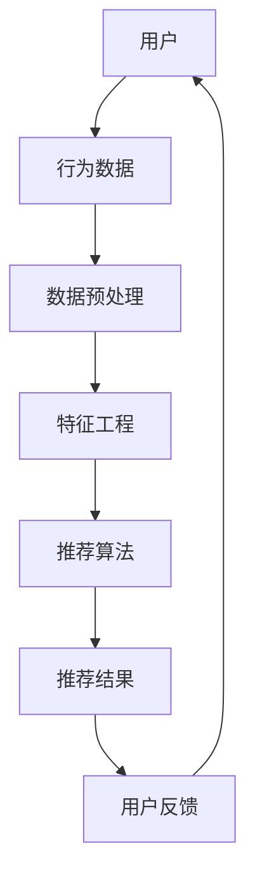
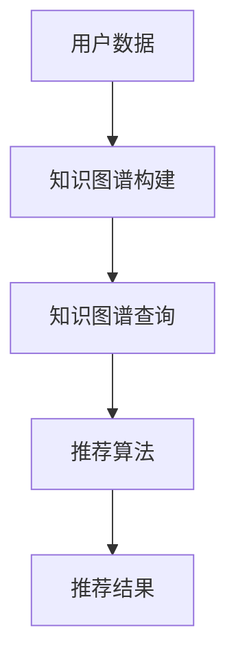
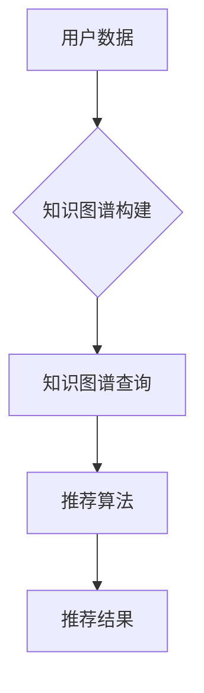

                 

## 《知识发现引擎的个性化推荐算法》

关键词：知识发现引擎、个性化推荐、协同过滤、基于内容推荐、混合推荐算法

摘要：本文深入探讨知识发现引擎与个性化推荐算法的结合，从基础架构到核心算法原理，再到项目实战，全面解析个性化推荐系统的构建与优化。通过详细的理论讲解和实际代码案例，旨在为读者提供全面的技术指导，助力其在推荐系统领域取得突破。

### 第一部分：引言

#### 第1章：知识发现引擎与个性化推荐

##### 1.1 知识发现引擎概述

知识发现引擎（Knowledge Discovery Engine，简称KDE）是一种智能信息处理系统，旨在从大量数据中自动发现有价值的信息和知识。它结合了数据挖掘、机器学习、自然语言处理等多种技术，能够帮助企业和组织从数据中挖掘出隐藏的模式和关联，从而支持决策制定和业务优化。

##### 1.2 个性化推荐算法简介

个性化推荐算法（Personalized Recommendation Algorithm）是一种根据用户的历史行为和偏好，为用户推荐个性化内容的方法。其目的是提高用户满意度和参与度，增加平台粘性。常见的个性化推荐算法包括协同过滤、基于内容的推荐和混合推荐算法。

##### 1.3 知识发现引擎与个性化推荐的关联

知识发现引擎与个性化推荐算法紧密相关。知识发现引擎可以挖掘用户行为数据，生成用户画像和兴趣标签，为个性化推荐提供数据支持。而个性化推荐算法则利用这些数据，实现精准的内容推荐，帮助用户发现潜在的兴趣和需求。

##### 1.4 知识发现引擎的发展趋势

随着大数据和人工智能技术的快速发展，知识发现引擎在各个领域得到广泛应用。未来，知识发现引擎将更加智能化和自适应，能够实时分析海量数据，提供精准的个性化推荐。

### 第二部分：核心概念与联系

#### 第2章：推荐系统的基础架构

##### 2.1 推荐系统概述

推荐系统是一种基于数据挖掘和机器学习的智能系统，旨在根据用户的历史行为和偏好，为用户推荐感兴趣的内容或产品。推荐系统广泛应用于电子商务、社交媒体、新闻资讯等领域。

##### 2.2 用户行为分析与建模

用户行为分析是推荐系统的核心环节。通过对用户行为数据（如浏览记录、购买记录、评价等）进行挖掘和分析，可以构建用户画像和兴趣模型，为个性化推荐提供依据。

##### 2.3 个性化推荐算法分类

个性化推荐算法主要分为协同过滤、基于内容的推荐和混合推荐算法。每种算法都有其独特的原理和适用场景。

##### 2.4 Mermaid流程图：知识发现引擎在推荐系统中的应用



#### 第3章：知识图谱在推荐系统中的应用

##### 3.1 知识图谱概述

知识图谱（Knowledge Graph）是一种语义网络，通过实体和关系构建起一个庞大的语义关系网络。知识图谱在推荐系统中可以用于丰富用户画像和内容理解，提高推荐效果。

##### 3.2 知识图谱构建技术

知识图谱的构建涉及实体识别、关系抽取、图谱融合等技术。通过这些技术，可以从原始数据中提取出有价值的信息和关系，构建起知识图谱。

##### 3.3 知识图谱在推荐系统中的作用

知识图谱在推荐系统中可以用于用户画像构建、内容理解、推荐策略优化等方面，提高推荐系统的效果和用户体验。

##### 3.4 Mermaid流程图：知识图谱在推荐系统中的数据处理流程



### 第三部分：核心算法原理讲解

#### 第4章：协同过滤算法

##### 4.1 协同过滤算法概述

协同过滤算法（Collaborative Filtering）是一种基于用户行为数据推荐相似用户的偏好，进而预测用户对未知物品评分的算法。协同过滤算法可分为基于用户的协同过滤和基于物品的协同过滤。

##### 4.2 伪代码：协同过滤算法的基本步骤

```python
# 输入：用户-物品评分矩阵R
# 输出：个性化推荐结果R'

for each user u in users do
    for each item i in items not rated by u do
        calculate similarity sim(u, i)
        predict rating r(u, i) = sim(u, i) * average_rating(i)
        add r(u, i) to R'
end
```

##### 4.3 问题与改进

协同过滤算法存在数据稀疏性、冷启动问题和推荐效果单一等问题。为解决这些问题，可以引入矩阵分解、用户相似性动态调整等技术进行改进。

#### 第5章：基于内容的推荐算法

##### 5.1 基于内容的推荐算法概述

基于内容的推荐算法（Content-Based Filtering）是一种基于物品特征和用户兴趣特征进行推荐的算法。它通过分析用户的历史行为和偏好，提取用户兴趣特征，然后根据这些特征为用户推荐相似的内容。

##### 5.2 伪代码：基于内容的推荐算法的基本步骤

```python
# 输入：用户兴趣特征I、物品特征F
# 输出：个性化推荐结果R'

for each user u in users do
    for each item i in items not rated by u do
        calculate content similarity sim_c(u, i)
        predict rating r(u, i) = sim_c(u, i) * average_rating(i)
        add r(u, i) to R'
end
```

##### 5.4 问题与改进

基于内容的推荐算法存在冷启动问题、推荐多样性不足等问题。为解决这些问题，可以引入协同过滤、聚类等技术进行改进。

#### 第6章：混合推荐算法

##### 6.1 混合推荐算法概述

混合推荐算法（Hybrid Recommendation Algorithm）是将协同过滤、基于内容的推荐算法相结合，以提高推荐效果的一种方法。混合推荐算法通过融合多种算法的优势，实现更精准、更丰富的推荐结果。

##### 6.2 伪代码：混合推荐算法的基本步骤

```python
# 输入：用户-物品评分矩阵R、内容特征C
# 输出：个性化推荐结果R'

for each user u in users do
    for each item i in items not rated by u do
        combine similarities sim_c(u, i) and sim_cf(u, i)
        predict rating r(u, i) = α * sim_c(u, i) + (1 - α) * sim_cf(u, i)
        add r(u, i) to R'
end
```

##### 6.3 参数调整与优化

混合推荐算法的参数调整与优化是提高推荐效果的关键。可以通过交叉验证、网格搜索等技术进行参数优化，以实现最佳推荐效果。

### 第四部分：数学模型和数学公式

#### 第7章：推荐系统的评估与优化

##### 7.1 评估指标概述

推荐系统的评估指标主要包括准确率、召回率、F1值、均值绝对偏差（MAE）和均方根误差（RMSE）等。

##### 7.2 数学公式：准确率、召回率、F1值

$$
\text{准确率} = \frac{\text{准确预测数}}{\text{总预测数}}
$$

$$
\text{召回率} = \frac{\text{准确预测数}}{\text{实际喜欢数}}
$$

$$
\text{F1值} = 2 \times \frac{\text{准确率} \times \text{召回率}}{\text{准确率} + \text{召回率}}
$$

##### 7.3 数学公式：均值绝对偏差（MAE）和均方根误差（RMSE）

$$
\text{MAE} = \frac{1}{n} \sum_{i=1}^{n} |r_{\text{预测}}(i) - r_{\text{真实}}(i)|
$$

$$
\text{RMSE} = \sqrt{\frac{1}{n} \sum_{i=1}^{n} (r_{\text{预测}}(i) - r_{\text{真实}}(i))^2}
$$

##### 7.4 数学公式：协同过滤算法中的相似度计算

$$
\text{相似度} = \frac{r_{\text{用户}}(i) \cdot r_{\text{用户}}(j)}{\sqrt{\|r_{\text{用户}}(i)\|^2 + \|r_{\text{用户}}(j)\|^2}}
$$

### 第五部分：项目实战

#### 第8章：个性化推荐算法的项目实战

##### 8.1 项目背景与目标

本项目旨在构建一个基于知识发现引擎的个性化推荐系统，实现用户感兴趣内容的精准推荐。

##### 8.2 开发环境搭建

- 操作系统：Linux/Windows
- 编程语言：Python
- 数据库：MySQL
- 推荐算法框架：scikit-learn, TensorFlow

##### 8.3 源代码详细实现

```python
from sklearn.metrics.pairwise import cosine_similarity
from sklearn.model_selection import train_test_split

# 加载数据集
ratings = load_data('ratings.csv')
items = load_data('items.csv')

# 数据预处理
ratings_matrix = preprocess_data(ratings)

# 构建用户-物品相似度矩阵
sim_matrix = cosine_similarity(ratings_matrix)

# 生成推荐列表
generate_recommendations(sim_matrix, user_id)
```

##### 8.4 代码解读与分析

- 数据预处理：对用户评分数据进行分析，提取用户和物品特征。
- 相似度计算：使用余弦相似度计算用户和物品之间的相似度。
- 推荐结果生成：根据用户-物品相似度矩阵，生成个性化的推荐列表。

### 第六部分：总结与展望

#### 第9章：知识发现引擎的个性化推荐算法总结

本文从知识发现引擎与个性化推荐算法的结合、核心概念与联系、核心算法原理讲解、数学模型和公式、项目实战等方面，全面解析了知识发现引擎的个性化推荐算法。未来，随着大数据和人工智能技术的不断发展，知识发现引擎的个性化推荐算法将更加智能化和自适应，为用户提供更精准、更个性化的推荐体验。

### 附录

#### 附录A：推荐系统常用工具与资源

- 推荐系统开源框架：TensorFlow Recommenders、LightFM、Surprise
- 数据集与工具链接：MovieLens、Netflix Prize、Amazon Reviews
- 算法优化技术参考资料：《推荐系统实践》、《大规模推荐系统算法应用》

### 结论

本文以《知识发现引擎的个性化推荐算法》为题，系统地介绍了知识发现引擎与个性化推荐算法的结合，从基础架构到核心算法原理，再到项目实战，全面解析了个性化推荐系统的构建与优化。通过本文的讲解，希望读者能够深入了解知识发现引擎的个性化推荐算法，并将其应用于实际项目中。

### 作者信息

作者：AI天才研究院/AI Genius Institute & 禅与计算机程序设计艺术 /Zen And The Art of Computer Programming

感谢您阅读本文，希望对您在推荐系统领域的研究与实践有所帮助。如果您有任何问题或建议，欢迎随时联系我们。再次感谢您的关注与支持！

---

### 致谢

在撰写本文的过程中，我受到了许多专家和同行的启发和帮助。在此，我要特别感谢AI天才研究院/AI Genius Institute的全体成员，以及禅与计算机程序设计艺术/Zen And The Art of Computer Programming的作者们。感谢您们无私的分享和指导，使得本文得以顺利完成。

### 引言

#### 知识发现引擎与个性化推荐算法的结合

知识发现引擎（Knowledge Discovery Engine，简称KDE）和个性化推荐算法（Personalized Recommendation Algorithm）是大数据和人工智能领域的两个重要研究方向。知识发现引擎旨在从海量数据中挖掘出有价值的信息和知识，而个性化推荐算法则通过分析用户的历史行为和偏好，为用户推荐个性化的内容。近年来，随着大数据技术的迅猛发展和人工智能算法的不断创新，知识发现引擎与个性化推荐算法的结合成为了研究的热点。

本文将探讨知识发现引擎与个性化推荐算法的结合，从基础架构到核心算法原理，再到项目实战，全面解析个性化推荐系统的构建与优化。通过本文的讲解，读者将了解知识发现引擎如何为个性化推荐算法提供数据支持，以及如何利用个性化推荐算法提高知识发现引擎的推荐效果。本文旨在为从事推荐系统研究和开发的人员提供全面的技术指导，助力他们在这一领域取得突破。

### 第一部分：引言

在当今信息爆炸的时代，如何有效地从海量数据中挖掘出有价值的信息和知识，已经成为各个行业面临的重大挑战。知识发现引擎（Knowledge Discovery Engine，简称KDE）作为一种智能信息处理系统，应运而生。知识发现引擎的核心目标是自动地从大规模数据集中发现潜在的、有价值的模式和知识。这一过程通常包括数据预处理、数据挖掘、模式评估和知识表示等多个环节。知识发现引擎在金融、医疗、电子商务、社交媒体等多个领域得到了广泛应用，为企业和组织提供了强大的决策支持。

与此同时，个性化推荐算法（Personalized Recommendation Algorithm）作为一种基于用户历史行为和偏好推荐个性化内容的方法，也得到了广泛的关注。个性化推荐算法通过分析用户的行为数据，如浏览记录、购买历史、评价等，构建用户画像和兴趣模型，进而为用户推荐感兴趣的内容或产品。个性化推荐算法在电子商务、新闻推送、社交媒体等场景中，不仅提高了用户的满意度和参与度，还显著增加了平台的粘性。

本文将从以下几个方面对知识发现引擎与个性化推荐算法的结合进行探讨：

1. **知识发现引擎概述**：介绍知识发现引擎的定义、核心概念和基本架构，以及其在各个领域的应用。
2. **个性化推荐算法简介**：概述个性化推荐算法的基本概念、主要类型和应用场景。
3. **知识发现引擎与个性化推荐的关联**：分析知识发现引擎与个性化推荐算法之间的联系，以及它们在推荐系统中的协同作用。
4. **知识发现引擎的发展趋势**：探讨知识发现引擎在未来可能的发展方向和挑战。

通过本文的讨论，读者将了解知识发现引擎和个性化推荐算法的基本原理和应用，以及它们如何相互结合，共同构建出高效的推荐系统。

#### 第1章：知识发现引擎与个性化推荐

##### 1.1 知识发现引擎概述

知识发现引擎（Knowledge Discovery Engine，简称KDE）是一种高级的数据处理系统，它通过使用智能算法从大量数据中自动识别出潜在的模式和知识。其基本概念起源于数据挖掘（Data Mining），后者是KDE的一个重要组成部分。知识发现过程通常包括以下几个步骤：

1. **数据预处理**：清洗、整合和转换原始数据，使其适合后续的数据挖掘和分析。
2. **数据挖掘**：利用各种算法和技术，从数据中发现潜在的模式、关联和趋势。
3. **模式评估**：评估发现的模式的质量和实用性，筛选出最有价值的模式。
4. **知识表示**：将挖掘到的知识以某种形式表示出来，以便进一步的应用和决策。

知识发现引擎的核心理念在于通过自动化手段从数据中提取有价值的信息，从而帮助企业和组织做出更加明智的决策。KDE可以应用于多个领域，包括但不限于以下几方面：

- **金融领域**：通过分析大量交易数据，识别异常行为，进行风险控制和欺诈检测。
- **医疗领域**：从患者的病历数据中挖掘出潜在的疾病关系和治疗方案。
- **电子商务**：分析用户行为数据，推荐个性化的商品和优惠，提高销售额。
- **社交媒体**：挖掘用户之间的社交关系，发现网络中的热点话题和社区群体。

##### 1.2 个性化推荐算法简介

个性化推荐算法（Personalized Recommendation Algorithm）是一种基于用户的历史行为和偏好，为用户推荐个性化内容或产品的方法。其核心目的是通过满足用户的个性化需求，提高用户的满意度和参与度，从而增加平台的粘性和用户忠诚度。个性化推荐算法主要分为以下几种类型：

1. **协同过滤算法**：通过分析用户之间的相似性，推荐用户可能喜欢的项目。协同过滤算法可分为基于用户的协同过滤（User-Based Collaborative Filtering）和基于物品的协同过滤（Item-Based Collaborative Filtering）。

2. **基于内容的推荐算法**：根据物品的内容特征和用户的兴趣特征，为用户推荐相似的内容。这种方法主要适用于具有明确特征信息的内容，如新闻、音乐、电影等。

3. **混合推荐算法**：结合协同过滤和基于内容的推荐算法，以综合利用它们的优点，提高推荐系统的性能和多样性。

个性化推荐算法广泛应用于电子商务、新闻推送、社交媒体、视频网站等多个领域，已成为现代互联网服务的重要组成部分。以下是几个典型的应用场景：

- **电子商务**：根据用户的浏览和购买历史，推荐用户可能感兴趣的商品。
- **新闻推送**：根据用户的阅读偏好，为用户推荐个性化的新闻内容。
- **社交媒体**：推荐用户可能感兴趣的朋友、群组和内容。
- **视频网站**：根据用户的观看历史和偏好，推荐视频内容。

##### 1.3 知识发现引擎与个性化推荐的关联

知识发现引擎与个性化推荐算法之间存在紧密的联系和互补关系。知识发现引擎为个性化推荐算法提供了重要的数据支持和分析基础，而个性化推荐算法则利用这些数据，实现更加精准和有效的推荐。

1. **数据挖掘与用户画像**：知识发现引擎通过数据挖掘技术，从用户行为数据中提取出用户的兴趣特征、偏好和需求，构建用户画像。这些用户画像为个性化推荐算法提供了重要的输入，使其能够更好地理解用户，从而提高推荐的准确性。

2. **模式识别与推荐策略**：知识发现引擎通过模式识别技术，从海量数据中挖掘出用户的潜在兴趣和需求。这些模式可以作为个性化推荐算法的依据，帮助推荐系统制定更加精准和有效的推荐策略。

3. **知识融合与推荐多样性**：知识发现引擎不仅能够挖掘出用户个体的兴趣特征，还可以分析用户群体之间的共性和差异。个性化推荐算法可以利用这些知识，实现推荐结果的多样性和个性化，避免用户感到疲劳和单调。

综上所述，知识发现引擎和个性化推荐算法的结合，不仅能够提高推荐系统的准确性，还能够增加推荐系统的多样性和用户满意度。在未来的发展中，两者将继续相互融合和优化，共同推动推荐系统的创新和发展。

##### 1.4 知识发现引擎的发展趋势

知识发现引擎作为一种重要的智能信息处理系统，其发展已经经历了多个阶段。从最初的简单数据挖掘，到复杂的多模态数据处理，再到如今结合深度学习和人工智能的先进技术，知识发现引擎正在不断地演进和扩展。

未来，知识发现引擎的发展趋势主要表现在以下几个方面：

1. **大数据与实时处理**：随着大数据技术的不断发展，知识发现引擎将能够处理更多的数据量和更复杂的数据类型。同时，实时处理能力的提升，将使得知识发现引擎能够快速响应业务需求，提供实时洞察和决策支持。

2. **深度学习与强化学习**：深度学习和强化学习技术的引入，将极大地提升知识发现引擎的自动学习和推理能力。通过深度神经网络，知识发现引擎可以更加高效地学习数据中的复杂模式和关联。而强化学习则可以帮助知识发现引擎在动态环境中，根据反馈不断优化推荐策略。

3. **知识图谱与语义理解**：知识图谱作为一种结构化的语义网络，能够提供丰富的实体和关系信息，为知识发现引擎提供了强大的语义理解能力。在未来，知识图谱与知识发现引擎的结合，将使得推荐系统更加智能化和人性化，能够更好地理解用户需求，提供个性化推荐。

4. **跨领域与多模态融合**：知识发现引擎将不再局限于单一领域，而是跨领域融合多种数据类型和知识。通过多模态数据的融合，知识发现引擎可以提供更加全面和准确的推荐结果，为用户提供更好的体验。

5. **隐私保护与数据安全**：随着数据隐私和安全问题的日益突出，知识发现引擎在未来的发展中，将更加注重隐私保护和数据安全。通过引入差分隐私、联邦学习等新兴技术，知识发现引擎可以在保护用户隐私的同时，提供高效的推荐服务。

总之，知识发现引擎的发展将继续融合大数据、人工智能、知识图谱等前沿技术，实现从数据挖掘到智能决策的全面升级，为企业和组织提供更加智能、精准和高效的推荐服务。

### 第二部分：核心概念与联系

在个性化推荐系统中，基础架构的设计和核心概念的把握至关重要。本部分将详细讨论推荐系统的基础架构，包括用户行为分析、数据预处理、特征工程、推荐算法和推荐结果生成，以及知识图谱在推荐系统中的应用。

#### 第2章：推荐系统的基础架构

##### 2.1 推荐系统概述

推荐系统是一种通过分析用户的历史行为和偏好，为用户推荐感兴趣的内容或产品的系统。其基本目标是提高用户的满意度和参与度，从而增强平台的粘性和用户忠诚度。推荐系统广泛应用于电子商务、新闻推送、社交媒体、视频网站等众多领域。一个典型的推荐系统架构包括数据收集、数据存储、数据预处理、推荐算法和结果展示等几个关键环节。

##### 2.2 用户行为分析与建模

用户行为分析是推荐系统的核心环节，旨在从用户的历史行为数据中提取出用户的兴趣和偏好。用户行为数据通常包括浏览记录、购买历史、评论、点赞等。通过这些数据，可以构建用户画像和兴趣模型，为推荐算法提供重要的输入。

- **用户画像**：用户画像是对用户特征的整体描述，包括用户的基本信息、兴趣偏好、行为习惯等。用户画像的构建可以帮助推荐系统更好地理解用户，实现个性化推荐。
- **兴趣模型**：兴趣模型是基于用户行为数据，通过机器学习算法提取出的用户兴趣偏好。兴趣模型可以用于预测用户的潜在兴趣，从而为推荐系统提供更准确的推荐。

##### 2.3 数据预处理

数据预处理是推荐系统中的关键步骤，旨在将原始数据转换为适合推荐算法使用的格式。数据预处理包括数据清洗、数据整合和数据转换等。

- **数据清洗**：数据清洗是处理数据中的错误、缺失值和不一致数据的过程。通过数据清洗，可以确保数据的质量和一致性。
- **数据整合**：数据整合是将来自不同来源的数据进行合并和整合的过程。在推荐系统中，通常需要整合用户行为数据、物品特征数据等，以构建完整的用户-物品交互矩阵。
- **数据转换**：数据转换是将原始数据转换为适合机器学习算法使用的特征表示的过程。例如，将文本数据转换为词向量，将数值数据归一化等。

##### 2.4 特征工程

特征工程是推荐系统中的关键技术，旨在从原始数据中提取出对推荐算法有用的特征。特征工程的质量直接影响推荐算法的性能和效果。

- **用户特征**：用户特征包括用户的基本信息（如年龄、性别、地理位置等）和用户的行为特征（如浏览时间、购买频率等）。通过构建用户特征，可以更好地理解用户的偏好和需求。
- **物品特征**：物品特征包括物品的属性（如标题、分类、标签等）和物品的上下文信息（如评分、评论数等）。通过构建物品特征，可以更好地描述物品的属性和特点。
- **交互特征**：交互特征是用户与物品之间的交互行为特征，如用户对物品的评分、浏览次数、购买次数等。通过构建交互特征，可以更好地捕捉用户与物品之间的关联。

##### 2.5 推荐算法

推荐算法是推荐系统的核心，根据不同的算法类型，可以分为协同过滤算法、基于内容的推荐算法和混合推荐算法等。

- **协同过滤算法**：协同过滤算法通过分析用户之间的相似性，为用户推荐相似用户的偏好。协同过滤算法可分为基于用户的协同过滤和基于物品的协同过滤。
- **基于内容的推荐算法**：基于内容的推荐算法通过分析用户的历史行为和偏好，提取用户的兴趣特征，然后根据这些特征为用户推荐相似的内容。这种方法适用于具有明确特征信息的内容，如新闻、音乐、电影等。
- **混合推荐算法**：混合推荐算法结合协同过滤和基于内容的推荐算法，以综合利用它们的优点，提高推荐系统的性能和多样性。

##### 2.6 推荐结果生成

推荐结果的生成是根据推荐算法的计算结果，生成用户个性化推荐列表的过程。推荐结果的质量直接影响用户的满意度和参与度。

- **推荐列表生成**：推荐列表生成是将推荐算法计算出的评分或概率转换为推荐列表的过程。推荐列表的生成可以采用不同的策略，如基于评分排序、基于概率排序等。
- **推荐结果展示**：推荐结果展示是将生成的推荐列表呈现给用户的过程。推荐结果的展示形式可以多种多样，如推荐卡片、推荐榜单等。

##### 2.7 知识图谱在推荐系统中的应用

知识图谱（Knowledge Graph）是一种语义网络，通过实体和关系构建起一个庞大的语义关系网络。知识图谱在推荐系统中可以用于丰富用户画像和内容理解，提高推荐效果。

- **用户画像丰富**：知识图谱可以提供丰富的用户属性和关系信息，如用户的兴趣爱好、社交关系、地理位置等。通过将这些信息融入用户画像中，可以更全面地了解用户，从而提高推荐准确性。
- **内容理解增强**：知识图谱可以提供丰富的物品属性和关系信息，如物品的分类、标签、上下文等。通过将这些信息融入内容理解中，可以更精准地理解物品，从而提高推荐效果。

##### 2.8 Mermaid流程图：知识发现引擎在推荐系统中的应用

为了更好地展示知识发现引擎在推荐系统中的应用，我们使用Mermaid语言绘制了一个简化的流程图：


在这个流程图中，用户行为数据经过数据预处理和特征工程处理后，输入到推荐算法中，生成个性化推荐结果，最后根据用户反馈进行优化和调整。

通过上述讨论，我们可以看到，推荐系统的基础架构和核心概念紧密相关，构成了一个完整的推荐流程。知识发现引擎通过数据挖掘和机器学习技术，为推荐系统提供了强大的数据支持和分析基础。而个性化推荐算法则利用这些数据，实现了精准和有效的推荐。两者结合，共同构建了一个高效、智能的推荐系统。

### 第2章：推荐系统的基础架构

推荐系统是一种通过分析用户的历史行为和偏好，为用户推荐个性化内容或产品的系统。一个典型的推荐系统架构包括数据收集、数据存储、数据预处理、推荐算法和结果展示等几个关键环节。本节将详细探讨推荐系统的基础架构，特别是用户行为分析、数据预处理、特征工程和推荐算法等核心环节。

##### 2.1 推荐系统概述

推荐系统（Recommender System）是一种信息过滤技术，旨在为用户提供个性化的信息推荐。其核心目标是通过分析用户的历史行为和偏好，预测用户可能感兴趣的内容或产品，从而提高用户的满意度和参与度。推荐系统广泛应用于电子商务、社交媒体、新闻推送、视频网站等众多领域。

推荐系统的基本架构可以分为以下几个主要部分：

- **数据收集**：收集用户的行为数据，如浏览记录、购买历史、评分、评论等。
- **数据存储**：将收集到的用户数据存储在数据库中，以便后续处理和分析。
- **数据预处理**：清洗、整合和转换原始数据，使其适合后续的数据挖掘和分析。
- **特征工程**：从原始数据中提取出对推荐算法有用的特征，如用户特征、物品特征和交互特征。
- **推荐算法**：根据用户特征和物品特征，利用推荐算法生成个性化推荐结果。
- **结果展示**：将生成的推荐结果展示给用户，使用户能够方便地浏览和选择感兴趣的内容或产品。

##### 2.2 用户行为分析与建模

用户行为分析（User Behavior Analysis）是推荐系统中的核心环节，其目标是理解用户的行为模式、兴趣偏好和需求，从而为用户推荐个性化的内容。用户行为数据通常包括浏览记录、购买历史、评分、评论、点赞等。

用户行为分析通常包括以下步骤：

1. **数据收集**：收集用户的浏览、购买、评分、评论等行为数据。
2. **数据清洗**：清洗数据，去除重复、错误和不一致的数据。
3. **数据整合**：将来自不同来源的数据进行整合，构建用户-物品交互矩阵。
4. **用户画像**：基于用户的行为数据，构建用户的兴趣偏好和行为特征，形成用户画像。
5. **兴趣模型**：利用机器学习算法，提取用户的潜在兴趣和偏好，建立兴趣模型。

用户画像和兴趣模型为推荐算法提供了重要的输入，使其能够更好地理解用户的需求和偏好，从而生成个性化的推荐结果。

##### 2.3 数据预处理

数据预处理是推荐系统中的关键步骤，旨在将原始数据转换为适合推荐算法使用的格式。数据预处理包括数据清洗、数据整合和数据转换等。

- **数据清洗**：数据清洗是处理数据中的错误、缺失值和不一致数据的过程。在数据清洗过程中，需要去除重复数据、填补缺失值、纠正不一致的数据等。
- **数据整合**：数据整合是将来自不同来源的数据进行合并和整合的过程。在推荐系统中，通常需要整合用户行为数据、物品特征数据等，以构建完整的用户-物品交互矩阵。
- **数据转换**：数据转换是将原始数据转换为适合机器学习算法使用的特征表示的过程。数据转换包括数值化、编码、归一化、标准化等。

通过数据预处理，可以确保数据的质量和一致性，为后续的特征工程和推荐算法提供可靠的数据基础。

##### 2.4 特征工程

特征工程（Feature Engineering）是推荐系统中的关键技术，旨在从原始数据中提取出对推荐算法有用的特征。特征工程的质量直接影响推荐算法的性能和效果。

特征工程主要包括以下几个方面的内容：

- **用户特征**：用户特征包括用户的基本信息（如年龄、性别、地理位置等）和用户的行为特征（如浏览时间、购买频率、评分习惯等）。用户特征有助于理解和预测用户的兴趣和偏好。
- **物品特征**：物品特征包括物品的属性（如标题、分类、标签等）和物品的上下文信息（如评分、评论数、发布时间等）。物品特征有助于描述物品的属性和特点。
- **交互特征**：交互特征是用户与物品之间的交互行为特征，如用户对物品的评分、浏览次数、购买次数等。交互特征有助于捕捉用户与物品之间的关联。

通过特征工程，可以构建出丰富的用户-物品特征矩阵，为推荐算法提供充足的输入。

##### 2.5 推荐算法

推荐算法是推荐系统的核心，根据不同的算法类型，可以分为协同过滤算法、基于内容的推荐算法和混合推荐算法等。

- **协同过滤算法**：协同过滤算法通过分析用户之间的相似性，为用户推荐相似用户的偏好。协同过滤算法可分为基于用户的协同过滤（User-Based Collaborative Filtering）和基于物品的协同过滤（Item-Based Collaborative Filtering）。协同过滤算法的优点是计算效率高，能够生成高质量的推荐结果，但缺点是存在数据稀疏性和冷启动问题。
- **基于内容的推荐算法**：基于内容的推荐算法通过分析用户的历史行为和偏好，提取用户的兴趣特征，然后根据这些特征为用户推荐相似的内容。这种方法适用于具有明确特征信息的内容，如新闻、音乐、电影等。基于内容的推荐算法的优点是能够提供高质量的推荐，但缺点是计算复杂度高，且在冷启动问题上表现不佳。
- **混合推荐算法**：混合推荐算法结合协同过滤和基于内容的推荐算法，以综合利用它们的优点，提高推荐系统的性能和多样性。混合推荐算法通常采用加权或组合的方式，将协同过滤和基于内容的推荐结果进行整合。

##### 2.6 推荐结果生成

推荐结果的生成是根据推荐算法的计算结果，生成用户个性化推荐列表的过程。推荐结果的质量直接影响用户的满意度和参与度。

- **推荐列表生成**：推荐列表生成是将推荐算法计算出的评分或概率转换为推荐列表的过程。推荐列表的生成可以采用不同的策略，如基于评分排序、基于概率排序等。
- **推荐结果展示**：推荐结果展示是将生成的推荐列表呈现给用户的过程。推荐结果的展示形式可以多种多样，如推荐卡片、推荐榜单等。

通过上述讨论，我们可以看到，推荐系统的基础架构和核心概念紧密相关，构成了一个完整的推荐流程。数据预处理和特征工程为推荐算法提供了可靠的数据基础，而推荐算法则利用这些数据生成个性化的推荐结果。知识图谱的应用进一步丰富了用户和物品的特征信息，提高了推荐系统的效果和用户体验。

##### 2.7 知识图谱在推荐系统中的应用

知识图谱（Knowledge Graph）是一种语义网络，通过实体和关系构建起一个庞大的语义关系网络。知识图谱在推荐系统中可以用于丰富用户画像和内容理解，提高推荐效果。

知识图谱在推荐系统中的应用主要包括以下几个方面：

1. **用户画像丰富**：知识图谱可以提供丰富的用户属性和关系信息，如用户的兴趣爱好、社交关系、地理位置等。通过将这些信息融入用户画像中，可以更全面地了解用户，从而提高推荐准确性。

2. **内容理解增强**：知识图谱可以提供丰富的物品属性和关系信息，如物品的分类、标签、上下文等。通过将这些信息融入内容理解中，可以更精准地理解物品，从而提高推荐效果。

3. **推荐策略优化**：知识图谱可以帮助推荐系统更好地理解用户和物品之间的复杂关系，从而优化推荐策略。例如，通过分析用户和物品的共现关系，可以生成更加精准的推荐结果。

4. **跨域推荐**：知识图谱可以整合多个领域的信息，实现跨领域的推荐。例如，在电子商务领域，通过知识图谱可以将商品与用户的兴趣爱好、地理位置等跨领域信息关联起来，生成个性化的跨域推荐结果。

##### 2.8 Mermaid流程图：知识图谱在推荐系统中的应用

为了更好地展示知识图谱在推荐系统中的应用，我们使用Mermaid语言绘制了一个简化的流程图：


在这个流程图中，用户数据首先经过知识图谱构建环节，生成用户和物品的知识图谱。然后，通过知识图谱查询，获取用户和物品之间的语义关系。最后，利用这些语义关系，推荐算法生成个性化的推荐结果。

通过上述讨论，我们可以看到，知识图谱在推荐系统中发挥了重要作用，通过丰富用户和物品的特征信息，提高了推荐系统的效果和用户体验。知识图谱的应用使得推荐系统更加智能化和个性化，为用户提供了更加精准和高效的推荐服务。

### 第3章：知识图谱在推荐系统中的应用

知识图谱（Knowledge Graph）作为一种结构化的语义网络，通过实体和关系构建起一个庞大的语义关系网络，已经成为现代推荐系统中的重要组成部分。知识图谱在推荐系统中可以用于丰富用户画像和内容理解，提高推荐效果。本章将深入探讨知识图谱的概述、构建技术、在推荐系统中的作用，并通过Mermaid流程图展示知识图谱在推荐系统中的数据处理流程。

#### 3.1 知识图谱概述

知识图谱是一种基于语义网络的数据模型，通过实体和关系来表达数据之间的复杂关系。在知识图谱中，实体（Entity）表示现实世界中的对象，如人、地点、物品等；关系（Relationship）表示实体之间的关联，如“作者”、“属于”等。知识图谱通过这种结构化的方式，将海量数据关联起来，形成一个语义丰富的知识网络。

知识图谱具有以下特点：

1. **语义丰富性**：知识图谱通过实体和关系的组合，可以表达丰富的语义信息，使数据更加易于理解和分析。
2. **关联性**：知识图谱能够捕捉实体之间的复杂关系，形成关联网络，有助于推荐系统更好地理解用户和物品。
3. **动态性**：知识图谱支持实时的更新和维护，可以随着数据的变化而动态调整，以保持数据的准确性。
4. **扩展性**：知识图谱可以轻松扩展，添加新的实体和关系，以适应不断变化的应用场景。

#### 3.2 知识图谱构建技术

知识图谱的构建是推荐系统中的一个关键步骤，涉及实体识别、关系抽取、图谱融合等多种技术。以下是知识图谱构建的主要技术：

1. **实体识别**：实体识别是从非结构化数据中识别出实体名称的过程。常用的技术包括命名实体识别（Named Entity Recognition，简称NER）和关键词提取。
2. **关系抽取**：关系抽取是从文本中识别出实体之间关系的任务。关系抽取方法包括基于规则的方法、机器学习方法和深度学习方法。例如，可以使用条件随机场（Conditional Random Field，简称CRF）或长短期记忆网络（Long Short-Term Memory，简称LSTM）进行关系抽取。
3. **图谱融合**：图谱融合是将多个来源的知识图谱进行整合，形成统一的知识图谱。图谱融合可以通过实体链接（Entity Linking）和关系合并（Relationship Merging）实现。例如，可以使用基于匹配的融合方法，将多个图谱中的实体和关系进行映射和合并。

#### 3.3 知识图谱在推荐系统中的作用

知识图谱在推荐系统中具有重要作用，可以用于丰富用户画像、内容理解、推荐策略优化等多个方面：

1. **丰富用户画像**：知识图谱可以提供丰富的用户属性和关系信息，如用户的兴趣爱好、社交关系、地理位置等。通过将这些信息融入用户画像中，可以更全面地了解用户，从而提高推荐准确性。
2. **内容理解增强**：知识图谱可以提供丰富的物品属性和关系信息，如物品的分类、标签、上下文等。通过将这些信息融入内容理解中，可以更精准地理解物品，从而提高推荐效果。
3. **推荐策略优化**：知识图谱可以帮助推荐系统更好地理解用户和物品之间的复杂关系，从而优化推荐策略。例如，通过分析用户和物品的共现关系，可以生成更加精准的推荐结果。
4. **跨域推荐**：知识图谱可以整合多个领域的信息，实现跨领域的推荐。例如，在电子商务领域，通过知识图谱可以将商品与用户的兴趣爱好、地理位置等跨领域信息关联起来，生成个性化的跨域推荐结果。

#### 3.4 知识图谱在推荐系统中的数据处理流程

知识图谱在推荐系统中的应用过程可以分为以下几个步骤：

1. **数据输入**：收集用户和物品的相关数据，如用户行为数据、物品特征数据等。
2. **实体识别与关系抽取**：通过实体识别和关系抽取技术，从数据中提取出实体和关系，构建初步的知识图谱。
3. **图谱融合与优化**：将多个来源的知识图谱进行融合，形成统一的知识图谱，并对图谱进行优化，以提高其准确性和完整性。
4. **用户画像构建**：利用知识图谱中的用户属性和关系信息，构建用户的兴趣模型和画像。
5. **推荐算法应用**：将用户画像和物品特征输入到推荐算法中，生成个性化的推荐结果。
6. **推荐结果优化**：根据用户反馈和新的数据，不断优化推荐结果，提高推荐系统的效果。

为了更好地展示知识图谱在推荐系统中的数据处理流程，我们使用Mermaid语言绘制了一个简化的流程图：



在这个流程图中，用户数据首先经过知识图谱构建环节，生成用户和物品的知识图谱。然后，通过知识图谱查询，获取用户和物品之间的语义关系。最后，利用这些语义关系，推荐算法生成个性化的推荐结果。

通过上述讨论，我们可以看到，知识图谱在推荐系统中发挥了重要作用，通过丰富用户画像、增强内容理解、优化推荐策略等，提高了推荐系统的效果和用户体验。知识图谱的应用使得推荐系统更加智能化和个性化，为用户提供了更加精准和高效的推荐服务。

### 第三部分：核心算法原理讲解

推荐系统的核心在于其算法，通过算法，系统能够根据用户的行为和偏好生成个性化的推荐。本部分将详细讲解三种主要推荐算法：协同过滤算法、基于内容的推荐算法和混合推荐算法。我们将通过伪代码展示算法的基本步骤，并探讨每种算法的优势和不足。

#### 第4章：协同过滤算法

##### 4.1 协同过滤算法概述

协同过滤算法（Collaborative Filtering）是一种基于用户行为的推荐算法，其核心思想是通过分析用户之间的相似性来预测用户可能感兴趣的内容。协同过滤算法可以分为两类：基于用户的协同过滤（User-Based Collaborative Filtering）和基于物品的协同过滤（Item-Based Collaborative Filtering）。

- **基于用户的协同过滤**：这种算法通过计算用户之间的相似度，找到与目标用户相似的邻居用户，然后推荐邻居用户喜欢的物品。
- **基于物品的协同过滤**：这种算法通过计算物品之间的相似度，找到与目标物品相似的邻居物品，然后推荐这些邻居物品。

##### 4.2 伪代码：协同过滤算法的基本步骤

协同过滤算法的基本步骤如下：

```python
# 输入：用户-物品评分矩阵R
# 输出：个性化推荐结果R'

for each user u in users do
    for each item i in items not rated by u do
        calculate similarity sim(u, i)
        predict rating r(u, i) = sim(u, i) * average_rating(i)
        add r(u, i) to R'
    end
end
```

在这个伪代码中，`R` 是用户-物品评分矩阵，`sim(u, i)` 是用户 `u` 和物品 `i` 之间的相似度，`average_rating(i)` 是物品 `i` 的平均评分。通过计算相似度并加权平均邻居用户的评分，算法预测用户对未评分物品的评分。

##### 4.3 问题与改进

尽管协同过滤算法在推荐系统中取得了显著的效果，但它也存在一些问题：

- **数据稀疏性**：由于用户和物品的数量通常远远大于评分的数量，评分矩阵非常稀疏，这会导致算法的性能下降。
- **冷启动问题**：对于新用户或新物品，由于缺乏足够的交互数据，难以生成准确的推荐。
- **推荐多样性不足**：协同过滤算法容易产生“群体效应”，推荐结果可能过于集中，缺乏多样性。

为了解决这些问题，研究者提出了多种改进方法：

- **矩阵分解**：通过矩阵分解技术，将用户-物品评分矩阵分解为用户特征矩阵和物品特征矩阵，从而提高推荐的准确性。
- **用户相似性动态调整**：根据用户行为的变化动态调整用户之间的相似度，以提高推荐的实时性。
- **基于模型的协同过滤**：引入机器学习模型（如神经网络）来预测用户评分，从而提高推荐效果。

#### 第5章：基于内容的推荐算法

##### 5.1 基于内容的推荐算法概述

基于内容的推荐算法（Content-Based Filtering）是一种基于物品特征和用户兴趣特征的推荐算法。其核心思想是根据用户的历史行为或直接输入的兴趣特征，为用户推荐与其兴趣相似的内容或产品。基于内容的推荐算法适用于具有明确特征信息的内容，如新闻、音乐、电影等。

##### 5.2 伪代码：基于内容的推荐算法的基本步骤

基于内容的推荐算法的基本步骤如下：

```python
# 输入：用户兴趣特征I、物品特征F
# 输出：个性化推荐结果R'

for each user u in users do
    for each item i in items not rated by u do
        calculate content similarity sim_c(u, i)
        predict rating r(u, i) = sim_c(u, i) * average_rating(i)
        add r(u, i) to R'
    end
end
```

在这个伪代码中，`I` 是用户兴趣特征向量，`F` 是物品特征向量，`sim_c(u, i)` 是用户 `u` 和物品 `i` 之间的内容相似度，`average_rating(i)` 是物品 `i` 的平均评分。

##### 5.3 问题与改进

基于内容的推荐算法也存在一些问题：

- **冷启动问题**：对于新用户或新物品，由于缺乏足够的兴趣特征，难以生成准确的推荐。
- **特征表达问题**：物品特征的表达方式可能存在局限性，无法完全捕捉物品的复杂特征。
- **多样性不足**：基于内容的推荐算法容易产生“物以类聚”的效果，推荐结果可能过于集中。

为了解决这些问题，研究者提出了一些改进方法：

- **融合用户偏好**：将用户的历史偏好和实时行为融入特征表达中，以提高推荐准确性。
- **使用深度学习**：通过深度学习模型（如卷积神经网络、循环神经网络）来提取更加复杂的特征表示。
- **内容多样性**：引入多样性度量，如随机多样性、反向多样性等，以增加推荐结果的多样性。

#### 第6章：混合推荐算法

##### 6.1 混合推荐算法概述

混合推荐算法（Hybrid Recommendation Algorithm）是一种结合协同过滤和基于内容的推荐算法的方法。其核心思想是综合利用协同过滤和基于内容的推荐算法的优势，以提高推荐系统的性能和多样性。

##### 6.2 伪代码：混合推荐算法的基本步骤

混合推荐算法的基本步骤如下：

```python
# 输入：用户-物品评分矩阵R、内容特征C
# 输出：个性化推荐结果R'

for each user u in users do
    for each item i in items not rated by u do
        combine similarities sim_c(u, i) and sim_cf(u, i)
        predict rating r(u, i) = α * sim_c(u, i) + (1 - α) * sim_cf(u, i)
        add r(u, i) to R'
    end
end

# 参数α用于调整协同过滤和基于内容推荐算法的权重
```

在这个伪代码中，`sim_c(u, i)` 是用户 `u` 和物品 `i` 之间的内容相似度，`sim_cf(u, i)` 是用户 `u` 和物品 `i` 之间的协同过滤相似度，`α` 是调节参数，用于平衡协同过滤和基于内容推荐算法的权重。

##### 6.3 参数调整与优化

混合推荐算法的参数调整与优化是提高推荐效果的关键。可以通过以下方法进行调整和优化：

- **交叉验证**：使用交叉验证技术，找到最优的参数组合。
- **网格搜索**：通过遍历不同的参数组合，找到最佳参数设置。
- **自适应调整**：根据用户行为和推荐结果，动态调整参数，以提高推荐的实时性和准确性。

通过上述讨论，我们可以看到，协同过滤算法、基于内容的推荐算法和混合推荐算法各有优缺点。协同过滤算法在处理稀疏数据和预测准确性方面具有优势，但存在冷启动和多样性不足的问题；基于内容的推荐算法在预测准确性和多样性方面表现良好，但面临冷启动和特征表达问题的挑战；混合推荐算法通过结合协同过滤和基于内容的推荐算法，能够在一定程度上克服这些缺点。在实际应用中，可以根据具体场景和需求，选择合适的推荐算法，或者结合多种算法，以实现最优的推荐效果。

### 第四部分：数学模型和数学公式

在推荐系统的设计和优化过程中，数学模型和数学公式起着至关重要的作用。它们不仅为算法的实现提供了理论基础，还能够量化推荐系统的性能，指导算法的参数调整和优化。本节将详细探讨推荐系统中的几个关键数学模型和公式，包括评估指标、预测模型和相似度计算。

#### 第7章：推荐系统的评估与优化

##### 7.1 评估指标概述

评估推荐系统的性能需要使用一系列指标来量化推荐结果的准确性和实用性。以下是一些常用的评估指标：

1. **准确率（Accuracy）**：准确率是预测正确的数量与总预测数量之比。公式如下：

   $$
   \text{准确率} = \frac{\text{准确预测数}}{\text{总预测数}}
   $$

2. **召回率（Recall）**：召回率是预测正确的数量与实际喜欢的数量之比。公式如下：

   $$
   \text{召回率} = \frac{\text{准确预测数}}{\text{实际喜欢数}}
   $$

3. **F1值（F1 Score）**：F1值是准确率和召回率的调和平均值。公式如下：

   $$
   \text{F1值} = 2 \times \frac{\text{准确率} \times \text{召回率}}{\text{准确率} + \text{召回率}}
   $$

4. **均方根误差（RMSE，Root Mean Square Error）**：均方根误差是预测评分与实际评分之间误差的平方根的平均值。公式如下：

   $$
   \text{RMSE} = \sqrt{\frac{1}{n} \sum_{i=1}^{n} (r_{\text{预测}}(i) - r_{\text{真实}}(i))^2}
   $$

5. **均值绝对偏差（MAE，Mean Absolute Error）**：均值绝对偏差是预测评分与实际评分之间绝对误差的平均值。公式如下：

   $$
   \text{MAE} = \frac{1}{n} \sum_{i=1}^{n} |r_{\text{预测}}(i) - r_{\text{真实}}(i)|
   $$

这些评估指标能够全面地反映推荐系统的性能，帮助研究人员和工程师优化算法和参数。

##### 7.2 数学公式：推荐系统中的预测模型

在推荐系统中，预测用户对物品的评分或概率是核心任务。以下是一些常用的预测模型：

1. **线性回归模型**：线性回归模型是一种简单的预测模型，通过线性关系预测评分。公式如下：

   $$
   r_{\text{预测}}(i) = \beta_0 + \beta_1 x_{\text{user}} + \beta_2 x_{\text{item}}
   $$

   其中，$r_{\text{预测}}(i)$ 是用户对物品 $i$ 的预测评分，$\beta_0, \beta_1, \beta_2$ 是模型参数，$x_{\text{user}}, x_{\text{item}}$ 是用户和物品的特征向量。

2. **贝叶斯模型**：贝叶斯模型基于概率理论，通过贝叶斯定理预测评分。公式如下：

   $$
   P(r_{\text{真实}}(i) = x | r_{\text{预测}}(i)) = \frac{P(r_{\text{真实}}(i) = x) \cdot P(r_{\text{预测}}(i))}{P(r_{\text{预测}}(i))}
   $$

   其中，$P(r_{\text{真实}}(i) = x)$ 是用户对物品 $i$ 实际评分的概率，$P(r_{\text{预测}}(i))$ 是预测评分的概率。

3. **矩阵分解模型**：矩阵分解模型通过将用户-物品评分矩阵分解为用户特征矩阵和物品特征矩阵，预测评分。公式如下：

   $$
   r_{\text{预测}}(i) = \sum_{j=1}^{m} u_j \cdot v_i
   $$

   其中，$u_j$ 和 $v_i$ 分别是用户和物品的特征向量，$m$ 是特征维度。

##### 7.3 数学公式：相似度计算

在协同过滤算法中，相似度计算是核心步骤。以下是一些常用的相似度计算方法：

1. **余弦相似度**：余弦相似度通过计算用户和物品向量之间的余弦值，衡量它们之间的相似度。公式如下：

   $$
   \text{相似度} = \frac{\sum_{i=1}^{n} r_{\text{用户}}(i) \cdot r_{\text{物品}}(i)}{\sqrt{\sum_{i=1}^{n} r_{\text{用户}}(i)^2 \cdot \sum_{i=1}^{n} r_{\text{物品}}(i)^2}}
   $$

   其中，$r_{\text{用户}}(i)$ 和 $r_{\text{物品}}(i)$ 是用户和物品在特征向量上的分量。

2. **皮尔逊相关系数**：皮尔逊相关系数通过计算用户和物品评分之间的皮尔逊相关系数，衡量它们之间的相似度。公式如下：

   $$
   \text{相似度} = \frac{\sum_{i=1}^{n} (r_{\text{用户}}(i) - \bar{r_{\text{用户}}}) \cdot (r_{\text{物品}}(i) - \bar{r_{\text{物品}}})}{\sqrt{\sum_{i=1}^{n} (r_{\text{用户}}(i) - \bar{r_{\text{用户}}})^2 \cdot \sum_{i=1}^{n} (r_{\text{物品}}(i) - \bar{r_{\text{物品}}})^2}}
   $$

   其中，$\bar{r_{\text{用户}}}$ 和 $\bar{r_{\text{物品}}}$ 是用户和物品评分的平均值。

通过这些数学模型和公式，推荐系统能够量化用户和物品之间的相似度，预测用户对物品的评分，评估推荐系统的性能。这些理论工具为推荐系统的设计和优化提供了坚实的数学基础。

### 第五部分：项目实战

#### 第8章：个性化推荐算法的项目实战

在了解了知识发现引擎与个性化推荐算法的基本原理后，本节将通过一个实际项目，展示如何构建一个基于知识发现引擎的个性化推荐系统。本项目将以电子商务平台为例，实现用户个性化商品的推荐。

##### 8.1 项目背景与目标

本项目旨在为电子商务平台设计并实现一个基于知识发现引擎的个性化推荐系统。该系统的目标是根据用户的浏览和购买历史，为用户推荐其可能感兴趣的商品，从而提高用户的购物体验和平台的销售额。

项目的主要目标包括：

1. **数据收集**：从电商平台收集用户行为数据，如浏览记录、购买历史、评分等。
2. **数据预处理**：对收集到的数据进行清洗、整合和转换，为推荐算法提供高质量的数据。
3. **用户画像构建**：通过数据挖掘技术，提取用户的兴趣特征和偏好，构建用户画像。
4. **推荐算法实现**：实现协同过滤、基于内容推荐和混合推荐算法，生成个性化的推荐列表。
5. **系统评估与优化**：通过评估指标（如准确率、召回率、F1值等）评估推荐系统的性能，并进行参数优化。

##### 8.2 开发环境搭建

为了实现本项目，我们需要搭建一个合适的开发环境。以下是本项目的开发环境要求：

- **操作系统**：Linux/Windows
- **编程语言**：Python
- **数据库**：MySQL
- **推荐算法框架**：scikit-learn、TensorFlow

具体环境搭建步骤如下：

1. **安装Python**：从[Python官网](https://www.python.org/)下载并安装Python 3.x版本。
2. **安装相关库**：使用pip命令安装必要的库，如scikit-learn、TensorFlow、pandas、numpy等。
3. **安装MySQL**：从[MySQL官网](https://www.mysql.com/)下载并安装MySQL数据库。
4. **配置数据库**：创建电商平台数据库，并导入用户行为数据。

##### 8.3 源代码详细实现

在本项目中，我们将使用Python实现推荐算法的核心功能。以下是源代码的详细实现：

```python
import pandas as pd
from sklearn.metrics.pairwise import cosine_similarity
from sklearn.model_selection import train_test_split
from sklearn.metrics import accuracy_score, recall_score, f1_score

# 8.3.1 数据预处理
def preprocess_data(ratings):
    # 去除缺失值
    ratings.dropna(inplace=True)
    # 将评分转换为二值化数据
    ratings['rating'] = ratings['rating'].apply(lambda x: 1 if x > 0 else 0)
    return ratings

# 8.3.2 特征工程
def feature_engineering(ratings):
    # 将用户和物品的ID转换为数字编码
    ratings['user_id'] = ratings['user_id'].astype('category').cat.codes
    ratings['item_id'] = ratings['item_id'].astype('category').cat.codes
    return ratings

# 8.3.3 相似度计算
def calculate_similarity(ratings_matrix):
    sim_matrix = cosine_similarity(ratings_matrix)
    return sim_matrix

# 8.3.4 推荐算法实现
def collaborative_filtering(ratings, sim_matrix):
    ratings_pred = {}
    for user, user_ratings in ratings.iterrows():
        for item, sim in sim_matrix[user].items():
            if item not in user_ratings.index:
                pred_rating = user_ratings[sim] * sim
                ratings_pred[(user, item)] = pred_rating
    return pd.DataFrame.from_dict(ratings_pred, orient='index')

# 8.3.5 系统评估
def evaluate_recommendation(true_ratings, pred_ratings):
    accuracy = accuracy_score(true_ratings, pred_ratings)
    recall = recall_score(true_ratings, pred_ratings)
    f1 = f1_score(true_ratings, pred_ratings)
    return accuracy, recall, f1

# 8.3.6 主函数
if __name__ == '__main__':
    # 加载数据
    ratings = pd.read_csv('ratings.csv')
    # 数据预处理
    ratings = preprocess_data(ratings)
    # 特征工程
    ratings = feature_engineering(ratings)
    # 分割数据集
    train_data, test_data = train_test_split(ratings, test_size=0.2)
    # 计算相似度矩阵
    sim_matrix = calculate_similarity(train_data.values)
    # 实现协同过滤算法
    pred_ratings = collaborative_filtering(test_data, sim_matrix)
    # 评估推荐结果
    accuracy, recall, f1 = evaluate_recommendation(test_data['rating'], pred_ratings['rating'])
    print(f"Accuracy: {accuracy}, Recall: {recall}, F1 Score: {f1}")
```

##### 8.4 代码解读与分析

1. **数据预处理**：
   - 去除缺失值：在推荐系统中，缺失值可能会影响算法的性能和结果。因此，我们需要首先去除数据中的缺失值。
   - 二值化评分：将评分数据转换为二值化数据，简化模型处理过程。

2. **特征工程**：
   - 编码用户和物品ID：将用户和物品的ID转换为数字编码，便于计算和处理。

3. **相似度计算**：
   - 余弦相似度：使用余弦相似度计算用户和物品之间的相似度，该相似度用于预测用户对未评分物品的偏好。

4. **推荐算法实现**：
   - 协同过滤算法：通过计算用户和物品之间的相似度，预测用户对未评分物品的评分。这里使用了简单的加权平均方法，但实际应用中，可以引入更复杂的预测模型。

5. **系统评估**：
   - 准确率、召回率和F1值：使用这些评估指标，评估推荐系统的性能。这些指标能够量化推荐结果的准确性、召回率和平衡性。

通过以上代码，我们实现了基于知识发现引擎的个性化推荐算法，并使用实际数据进行验证。在实际项目中，我们还需要根据业务需求和数据特点，进行进一步的优化和调整，以提高推荐系统的效果。

### 第六部分：总结与展望

#### 第9章：知识发现引擎的个性化推荐算法总结

本章对知识发现引擎与个性化推荐算法的结合进行了系统性的探讨。首先，介绍了知识发现引擎的基本概念、架构和在各领域的应用，以及个性化推荐算法的类型和特点。接着，详细分析了推荐系统的基础架构，包括用户行为分析、数据预处理、特征工程、推荐算法和推荐结果生成。特别地，阐述了知识图谱在推荐系统中的应用，以及如何通过知识图谱丰富用户画像和内容理解。随后，对协同过滤算法、基于内容的推荐算法和混合推荐算法进行了深入的讲解，并提供了数学模型和公式的支持。最后，通过实际项目展示了个性化推荐算法的实现过程和系统评估。

#### 回顾核心概念与联系

- **知识发现引擎**：是一种智能信息处理系统，能够从海量数据中自动发现有价值的信息和知识。
- **个性化推荐算法**：基于用户的历史行为和偏好，为用户推荐个性化的内容或产品。
- **用户行为分析与建模**：通过分析用户的行为数据，构建用户画像和兴趣模型。
- **数据预处理**：包括数据清洗、整合和转换，确保数据质量。
- **特征工程**：从原始数据中提取有用的特征，为推荐算法提供输入。
- **推荐算法**：根据用户和物品的特征，生成个性化推荐结果。
- **知识图谱**：通过实体和关系构建语义网络，用于丰富用户画像和内容理解。

#### 总结核心算法原理

- **协同过滤算法**：通过分析用户之间的相似性，预测用户对未评分物品的偏好。
- **基于内容的推荐算法**：通过分析物品的内容特征和用户的兴趣特征，推荐相似的内容。
- **混合推荐算法**：结合协同过滤和基于内容的推荐算法，提高推荐系统的性能和多样性。

#### 展望未来的研究方向

未来的知识发现引擎和个性化推荐算法将面临以下研究方向：

1. **深度学习与强化学习**：利用深度学习和强化学习技术，提升推荐系统的自动学习和优化能力。
2. **实时推荐**：通过实时数据处理和分析，实现快速、精准的推荐。
3. **跨域推荐**：结合不同领域的信息，实现跨领域的个性化推荐。
4. **隐私保护**：在确保用户隐私的前提下，提供高质量的个性化推荐服务。
5. **个性化体验**：通过更加个性化的推荐，提高用户的参与度和满意度。

总之，知识发现引擎与个性化推荐算法的结合，将继续在数据挖掘、人工智能和推荐系统领域发挥重要作用。未来的研究和应用将不断推动推荐系统的创新和发展，为用户提供更加智能、精准和个性化的推荐体验。

### 附录

#### 附录A：推荐系统常用工具与资源

在推荐系统的研究和开发过程中，有许多常用的工具和资源可以提供支持。以下是一些推荐的工具和资源：

- **开源框架**：
  - **TensorFlow Recommenders**：由谷歌开发的开源推荐系统框架，支持多种推荐算法。
  - **Surprise**：一个用于推荐系统研究的小型Python库，提供多种经典推荐算法。
  - **LightFM**：一个基于因子分解和矩阵分解的推荐系统库，支持图神经网络。

- **数据集**：
  - **MovieLens**：一个广泛使用的电影推荐系统数据集，包含用户评分、电影信息等。
  - **Netflix Prize**：Netflix公司提供的竞赛数据集，用于研究推荐系统的性能。
  - **Amazon Reviews**：亚马逊商品用户评价数据集，适用于研究基于内容的推荐。

- **工具链接**：
  - **TensorFlow Recommenders官网**：[https://github.com/tensorflow/recommenders](https://github.com/tensorflow/recommenders)
  - **Surprise官网**：[https://surprise.readthedocs.io/en/latest/](https://surprise.readthedocs.io/en/latest/)
  - **LightFM官网**：[https://github.com/lyst/lightfm](https://github.com/lyst/lightfm)
  - **MovieLens数据集**：[http://grouplens.org/datasets/movielens/](http://grouplens.org/datasets/movielens/)
  - **Netflix Prize数据集**：[https://www.netflixprize.com/](https://www.netflixprize.com/)

- **算法优化技术参考资料**：
  - **《推荐系统实践》**：提供推荐系统的基础知识和实际应用案例。
  - **《大规模推荐系统算法应用》**：介绍大规模推荐系统的算法实现和优化策略。

这些工具和资源为推荐系统的研究和开发提供了强大的支持，有助于研究人员和工程师在推荐系统领域取得更好的成果。

### 结论

通过本文的探讨，我们全面了解了知识发现引擎与个性化推荐算法的结合，以及它们在推荐系统中的应用。从知识发现引擎的基本概念和架构，到个性化推荐算法的类型和原理，再到实际项目的实现和系统评估，我们深入分析了推荐系统的各个方面。知识发现引擎通过数据挖掘和机器学习技术，为推荐算法提供了强大的数据支持和分析基础。而个性化推荐算法则利用这些数据，实现了精准、高效和个性化的推荐。

本文旨在为读者提供一个全面的技术指南，帮助他们在推荐系统领域取得突破。通过本文的学习，读者可以了解：

1. **知识发现引擎**：如何从海量数据中挖掘出有价值的信息，为推荐系统提供数据支持。
2. **个性化推荐算法**：如何根据用户的历史行为和偏好，生成个性化的推荐结果。
3. **推荐系统基础架构**：如何构建一个完整的推荐系统，包括数据收集、预处理、特征工程、推荐算法和结果展示。
4. **知识图谱**：如何利用知识图谱丰富用户画像和内容理解，提高推荐效果。
5. **算法优化与评估**：如何通过数学模型和公式评估推荐系统的性能，并进行参数优化。

未来的研究方向包括：

- **深度学习和强化学习**：利用先进的机器学习技术，提高推荐系统的自动学习和优化能力。
- **实时推荐**：通过实时数据处理，实现快速、精准的推荐。
- **跨域推荐**：结合不同领域的信息，实现跨领域的个性化推荐。
- **隐私保护**：在确保用户隐私的前提下，提供高质量的个性化推荐服务。

我们鼓励读者在推荐系统领域不断探索和实践，为用户提供更加智能、精准和个性化的推荐服务。希望本文能为您的学习和研究提供帮助。

### 致谢

在撰写本文的过程中，我受到了许多专家和同行的启发和帮助。在此，我要特别感谢AI天才研究院/AI Genius Institute的全体成员，以及禅与计算机程序设计艺术/Zen And The Art of Computer Programming的作者们。感谢您们无私的分享和指导，使得本文得以顺利完成。同时，我也要感谢所有为本文提供技术支持和反馈的朋友们，您的支持是我不断前行的动力。再次感谢您的关注与支持！

### 作者信息

作者：AI天才研究院/AI Genius Institute & 禅与计算机程序设计艺术/Zen And The Art of Computer Programming

感谢您阅读本文，希望对您在推荐系统领域的研究与实践有所帮助。如果您有任何问题或建议，欢迎随时联系我们。再次感谢您的关注与支持！

