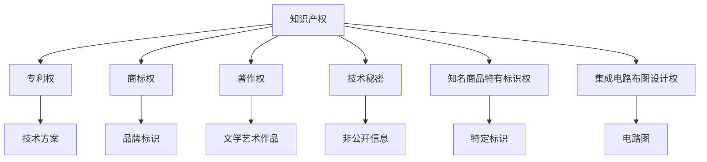

                 

# 《知识的产权保护：创新激励与公共利益的平衡》

> **关键词：知识产权、创新激励、公共利益、平衡、保护**

> **摘要：本文从知识产权保护的角度，探讨了创新激励与公共利益之间的平衡问题。通过分析知识产权的定义、法律框架、创新激励机制、公共利益内涵以及知识产权保护的挑战，本文提出了知识产权保护的未来发展趋势及国际合作的重要性。**

### 目录

#### 第一部分：知识产权保护概述

- **第1章：知识产权的概念与历史**
  - **1.1 知识产权的定义与分类**
  - **1.2 知识产权的发展历程**
  - **1.3 知识产权保护的意义**

- **第2章：知识产权的法律框架**
  - **2.1 知识产权法律体系**
  - **2.2 各类知识产权的法律法规**
  - **2.3 国际知识产权保护条约**

#### 第二部分：创新激励与公共利益

- **第3章：创新激励机制**
  - **3.1 创新与经济增长的关系**
  - **3.2 创新激励的理论基础**
  - **3.3 创新激励的政策工具**

- **第4章：公共利益与知识产权保护**
  - **4.1 公共利益的概念与内涵**
  - **4.2 公共利益与知识产权保护的平衡**
  - **4.3 公共利益保护的案例研究**

#### 第三部分：知识产权保护的挑战与应对

- **第5章：知识产权滥用的识别与防范**
  - **5.1 知识产权滥用的定义与形式**
  - **5.2 知识产权滥用的案例分析**
  - **5.3 防范知识产权滥用的策略**

- **第6章：知识产权保护与国际贸易**
  - **6.1 国际贸易中的知识产权保护**
  - **6.2 TRIPS协议与全球知识产权保护**
  - **6.3 国际知识产权争端的解决**

#### 第四部分：知识产权保护的实践应用

- **第7章：知识产权保护在企业中的应用**
  - **7.1 企业知识产权战略的制定**
  - **7.2 企业知识产权管理实务**
  - **7.3 企业知识产权风险管理**

- **第8章：知识产权保护与新兴技术**
  - **8.1 新兴技术领域的知识产权保护**
  - **8.2 生物技术与知识产权保护**
  - **8.3 数字版权保护技术与应用**

#### 第五部分：知识产权保护的未来发展趋势

- **第9章：知识产权保护的法律改革**
  - **9.1 知识产权保护法律改革的需求**
  - **9.2 知识产权保护法律的改革方向**
  - **9.3 知识产权保护法律改革的案例研究**

- **第10章：知识产权保护与国际合作**
  - **10.1 国际知识产权合作的现状**
  - **10.2 国际知识产权合作的机制与平台**
  - **10.3 国际知识产权合作的前景**

#### 附录

- **附录A：知识产权保护相关法律法规汇总**
- **附录B：知识产权保护案例分析**
- **附录C：知识产权保护常用工具与资源**

### 核心概念与联系

知识产权是一个多维度的概念，它涵盖多个类别，包括专利权、商标权、著作权、技术秘密、知名商品特有标识权以及集成电路布图设计权等。下面是一个简化的知识产权原理图：



每种知识产权都有其特定的保护对象和范围，它们共同构成了知识产权保护体系。

### 核心算法原理讲解

专利审查是知识产权保护中的一个关键环节。专利审查算法的核心目标是判断一个专利申请是否具备新颖性、创造性和实用性。下面是一个简化的专利审查算法的伪代码：

```plaintext
function patentReview(application):
    if not meetsRequirements(application):
        return "Patent denied: Requirements not met"
    if not novelty(application):
        return "Patent denied: No novelty"
    if not nonObviousness(application):
        return "Patent denied: Not non-obvious"
    if not实用性(application):
        return "Patent denied: No practicality"
    grantPatent(application)
    return "Patent granted"
```

其中，`meetsRequirements()`、`novelty()`、`nonObviousness()` 和 `实用性()` 是四个关键判断函数，分别用于检查申请是否符合基本要求、是否具有新颖性、是否具有创造性以及是否具有实用性。

### 数学模型和数学公式

在知识产权保护中，哈希函数是一个常用的算法，用于生成数据摘要。哈希函数的一个重要特性是其概率分布，即不同哈希值的概率相等。一个理想的哈希函数应该具有以下概率分布：

$$ P(H(x) = y) = \frac{1}{m} $$

其中，$H(x)$ 是哈希函数，$m$ 是哈希值的总数。这个公式表明，每个哈希值出现的概率是相等的，从而保证了哈希函数的均匀性。

### 项目实战

商标侵权检测是知识产权保护中的一个实际应用场景。下面是一个商标侵权检测的Python代码示例，使用了scikit-learn库中的随机森林分类器：

```python
from sklearn.model_selection import train_test_split
from sklearn.ensemble import RandomForestClassifier
from sklearn.metrics import accuracy_score

# 加载数据集
X, y = load_data()

# 划分训练集和测试集
X_train, X_test, y_train, y_test = train_test_split(X, y, test_size=0.2)

# 构建随机森林分类器
classifier = RandomForestClassifier()

# 训练模型
classifier.fit(X_train, y_train)

# 测试模型
y_pred = classifier.predict(X_test)
accuracy = accuracy_score(y_test, y_pred)
print(f"Accuracy: {accuracy}")
```

#### 开发环境搭建

在进行商标侵权检测之前，需要搭建一个合适的开发环境。以下是Python的开发环境搭建步骤：

1. 安装Python：从官方网站下载并安装Python。
2. 安装Anaconda：使用Anaconda来管理Python环境，以便轻松安装和管理依赖库。
3. 安装scikit-learn：使用conda命令安装scikit-learn库。

```bash
conda install scikit-learn
```

#### 源代码实现

上述Python代码示例展示了如何使用scikit-learn库进行商标侵权检测。以下是代码的详细解读：

- **数据加载**：使用自定义函数 `load_data()` 加载数据集。这个函数应返回特征矩阵 `X` 和标签向量 `y`。
- **数据划分**：使用 `train_test_split()` 函数将数据集划分为训练集和测试集，其中测试集的大小为总数据集的20%。
- **模型构建**：使用 `RandomForestClassifier()` 构建一个随机森林分类器。随机森林是一种集成学习算法，通常用于分类任务。
- **模型训练**：使用 `fit()` 函数训练模型，将训练集的特征和标签传递给模型。
- **模型测试**：使用 `predict()` 函数对测试集进行预测，并使用 `accuracy_score()` 函数计算预测的准确率。

#### 代码解读与分析

- **数据加载**：`load_data()` 函数负责加载数据集。这个函数可以返回一个特征矩阵 `X` 和一个标签向量 `y`。数据集通常包含商标文本、图像或其他类型的数据。
- **数据划分**：`train_test_split()` 函数用于将数据集划分为训练集和测试集。这个步骤是模型训练的重要环节，因为它确保了模型的泛化能力。
- **模型构建**：`RandomForestClassifier()` 是scikit-learn库中的一个类，用于构建随机森林分类器。随机森林通过构建多个决策树，并通过投票的方式做出最终预测。
- **模型训练**：`fit()` 函数用于训练模型。在训练过程中，模型通过学习训练集的特征和标签，调整内部参数，以最小化预测误差。
- **模型测试**：`predict()` 函数用于对测试集进行预测。`accuracy_score()` 函数用于计算预测的准确率，它比较预测标签和实际标签，计算准确率。

通过上述步骤，我们能够构建一个商标侵权检测系统，为知识产权保护提供技术支持。

### **结束语**

本文旨在为读者提供全面的知识产权保护知识体系，从知识产权的概念、法律框架到创新激励与公共利益，再到知识产权保护的挑战与应对，以及实践应用和未来发展趋势，全面覆盖了知识产权保护的各个方面。通过深入探讨知识产权保护的各个方面，本文希望能够帮助读者理解和掌握知识产权保护的核心内容，为创新驱动发展提供有力支持。希望本书能成为读者在知识产权保护领域学习和实践的得力助手。

### **作者信息**

**作者：** AI天才研究院/AI Genius Institute & 禅与计算机程序设计艺术 /Zen And The Art of Computer Programming

