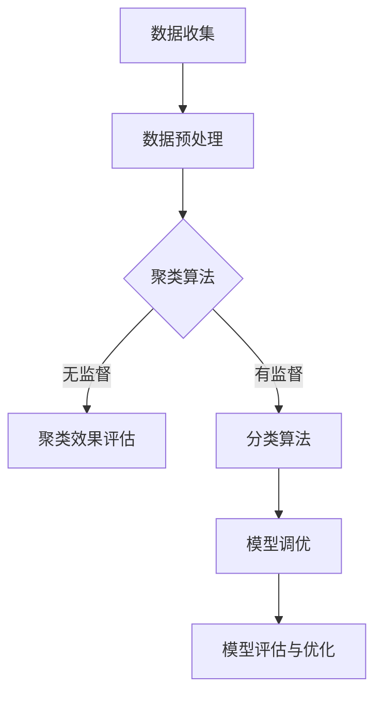

                 

# 硅谷人工智能：机器学习与大数据

> 关键词：人工智能、机器学习、大数据、硅谷企业、算法、应用实践、发展趋势

> 摘要：本文将深入探讨硅谷人工智能的发展，特别是机器学习与大数据的紧密联系。我们将回顾人工智能与机器学习的基础知识，解析主要算法原理，介绍大数据处理框架，分析硅谷顶级企业的成功案例，并通过实战项目展示机器学习与大数据的实际应用。最后，我们将展望人工智能的未来发展趋势，并附上相关资源和推荐阅读。

### 目录大纲

#### 第一部分：人工智能基础

##### 第1章：人工智能与机器学习概述

- **1.1 人工智能的发展历程**
  - 人工智能的起源
  - 人工智能的三个层次

- **1.2 机器学习的基本概念**
  - 机器学习的分类
  - 机器学习的目标

- **1.3 机器学习的应用领域**
  - 数据分析
  - 计算机视觉
  - 自然语言处理

##### 第2章：机器学习算法原理

- **2.1 监督学习算法**
  - 线性回归
  - 决策树
  - 随机森林

- **2.2 无监督学习算法**
  - 聚类算法
  - 主成分分析
  - 聚类与降维的Mermaid流程图

##### 第3章：大数据处理框架

- **3.1 Hadoop生态系统**
  - Hadoop的核心组件
  - YARN与MapReduce

- **3.2 Spark生态系统**
  - Spark的核心组件
  - Spark与Hadoop的对比

#### 第二部分：硅谷人工智能实践

##### 第4章：硅谷人工智能企业案例分析

- **4.1 Google的机器学习应用**
  - Google的搜索算法
  - Google Assistant

- **4.2 Facebook的人工智能技术**
  - Facebook的图像识别
  - Facebook的广告推荐系统

##### 第5章：机器学习项目实战

- **5.1 数据收集与预处理**
  - 数据来源
  - 数据清洗

- **5.2 机器学习模型训练**
  - 模型选择
  - 模型调优

- **5.3 模型评估与优化**
  - 评估指标
  - 模型优化策略

##### 第6章：大数据分析实战

- **6.1 大数据分析流程**
  - 数据采集
  - 数据存储
  - 数据分析

- **6.2 大数据分析工具**
  - Hadoop
  - Spark
  - Hive

##### 第7章：未来人工智能发展趋势

- **7.1 人工智能与伦理**
  - 人工智能的道德责任
  - 人工智能的法律问题

- **7.2 硅谷人工智能的未来**
  - 人工智能的商业模式
  - 人工智能的社会影响

#### 附录

##### 附录A：机器学习与大数据资源

- **A.1 开源机器学习框架**
  - Scikit-learn
  - TensorFlow
  - PyTorch

- **A.2 大数据开源工具**
  - Hadoop
  - Spark
  - Hive

- **A.3 相关书籍与论文**
  - 《深度学习》
  - 《大数据时代》
  - 主要参考文献

### Mermaid流程图



### 伪代码示例

```plaintext
// 线性回归模型训练伪代码

// 输入：训练数据集 X, Y，学习率 alpha，迭代次数 n_epochs
// 输出：拟合参数 w

// 初始化 w 为零向量
w = [0] * n_features

// 迭代更新模型参数
for epoch in range(n_epochs):
    // 计算梯度
    gradient = 2/m * X.T.dot(X.dot(w) - Y)
    
    // 更新参数
    w -= alpha * gradient

return w
```

### 数学公式与示例

$$
y = wx + b
$$

**举例说明：**

假设我们有一个线性回归模型，其中 $y$ 是预测值，$w$ 是权重向量，$x$ 是特征向量，$b$ 是偏置项。如果 $x = [1, 2, 3]$，$w = [1, 1, 1]$，那么：

$$
y = 1 \cdot 1 + 1 \cdot 2 + 1 \cdot 3 + b = 6 + b
$$

如果 $b = 0$，则 $y = 6$。这个简单的例子展示了线性回归模型如何通过权重和特征向量来预测输出值。在更复杂的机器学习任务中，$w$ 和 $b$ 是通过大量训练数据计算得出的。

---

### 引言

硅谷，被誉为全球科技创新的摇篮，是人工智能（AI）和机器学习（ML）发展的核心区域之一。近年来，随着大数据（Big Data）技术的迅猛发展，人工智能和大数据之间的结合愈发紧密，为各行各业带来了前所未有的变革。本文旨在深入探讨硅谷人工智能的发展，特别是机器学习与大数据的紧密联系，帮助读者全面了解这一领域的核心概念、算法原理、应用实践以及未来趋势。

在接下来的内容中，我们将首先回顾人工智能与机器学习的基础知识，解析主要算法原理，并介绍大数据处理框架。接着，我们将分析硅谷顶级企业的成功案例，并通过实战项目展示机器学习与大数据的实际应用。最后，我们将展望人工智能的未来发展趋势，并附上相关资源和推荐阅读。

#### 第一部分：人工智能基础

### 第1章：人工智能与机器学习概述

##### 1.1 人工智能的发展历程

人工智能（Artificial Intelligence，简称AI）是计算机科学的一个分支，旨在创建智能体（Agent），这些智能体能够像人类一样思考、学习、解决问题和采取行动。人工智能的发展历程可以分为三个主要阶段：

1. **符号主义阶段（1950-1979年）**：
   - 人工智能的起源：艾伦·图灵（Alan Turing）提出的“图灵测试”成为人工智能研究的第一个里程碑。
   - 主要成就：早期的专家系统和逻辑推理机器，如ELIZA和Dendral。

2. **连接主义阶段（1980-2010年）**：
   - 连接主义（Connectionism）：神经网络和深度学习开始兴起。
   - 主要成就：反向传播算法的提出和早期深度学习模型的发展。

3. **现代人工智能阶段（2010年至今）**：
   - 机器学习和大数据的崛起：深度学习、强化学习等算法取得了突破性进展。
   - 主要成就：人工智能在图像识别、自然语言处理、自动驾驶等领域取得了显著成就。

##### 1.2 机器学习的基本概念

机器学习（Machine Learning，简称ML）是人工智能的一个重要分支，主要研究如何从数据中自动学习规律和模式，然后利用这些规律和模式进行预测和决策。机器学习可以分为以下几类：

1. **监督学习（Supervised Learning）**：
   - 特点：训练数据包含输入和输出对。
   - 目标：学习一个函数，将输入映射到正确的输出。
   - 常见算法：线性回归、决策树、支持向量机等。

2. **无监督学习（Unsupervised Learning）**：
   - 特点：训练数据仅包含输入，没有输出。
   - 目标：发现数据中的隐含结构和规律。
   - 常见算法：聚类、主成分分析、降维等。

3. **半监督学习（Semi-Supervised Learning）**：
   - 特点：训练数据中既有带标签的样本，也有未带标签的样本。
   - 目标：利用未带标签的样本提高模型的泛化能力。

4. **强化学习（Reinforcement Learning）**：
   - 特点：智能体在与环境的交互中学习最佳策略。
   - 目标：最大化长期奖励。
   - 常见算法：Q-学习、深度强化学习等。

##### 1.3 机器学习的应用领域

机器学习在多个领域展现了巨大的潜力，以下是几个主要的应用领域：

1. **数据分析**：
   - 特点：利用机器学习分析大量数据，发现数据中的隐藏模式和趋势。
   - 应用：金融风险评估、市场预测、客户行为分析等。

2. **计算机视觉**：
   - 特点：使计算机能够“看”和理解图像和视频。
   - 应用：人脸识别、图像分类、自动驾驶等。

3. **自然语言处理**：
   - 特点：使计算机能够理解和生成自然语言。
   - 应用：机器翻译、语音识别、情感分析等。

4. **推荐系统**：
   - 特点：基于用户历史行为和偏好推荐相关物品或内容。
   - 应用：电子商务、社交媒体、在线媒体等。

### 第2章：机器学习算法原理

##### 2.1 监督学习算法

监督学习是机器学习中最常见的一种类型，它通过学习输入和输出之间的关系来预测未知数据。以下是一些常用的监督学习算法：

1. **线性回归（Linear Regression）**：
   - 基本概念：线性回归是一种预测连续值的模型，其目标是找到一个线性函数，最小化预测值与实际值之间的误差。
   - 数学公式：
     $$
     y = wx + b
     $$
     其中 $y$ 是预测值，$w$ 是权重向量，$x$ 是特征向量，$b$ 是偏置项。
   - 伪代码：
     ```plaintext
     // 输入：训练数据集 X, Y，学习率 alpha，迭代次数 n_epochs
     // 输出：拟合参数 w

     // 初始化 w 为零向量
     w = [0] * n_features

     // 迭代更新模型参数
     for epoch in range(n_epochs):
         // 计算梯度
         gradient = 2/m * X.T.dot(X.dot(w) - Y)
         
         // 更新参数
         w -= alpha * gradient

     return w
     ```

2. **决策树（Decision Tree）**：
   - 基本概念：决策树是一种树形结构，每个内部节点表示一个特征，每个分支表示一个可能的特征值，叶子节点表示一个类别。
   - 优点：直观、易于理解和解释。
   - 缺点：可能产生过拟合、计算复杂度较高。

3. **随机森林（Random Forest）**：
   - 基本概念：随机森林是由多棵决策树组成的集成模型，通过随机特征选择和Bootstrap抽样来减少过拟合。
   - 优点：提高了模型的泛化能力、减少了过拟合。
   - 缺点：计算资源消耗较大。

##### 2.2 无监督学习算法

无监督学习是机器学习的另一种类型，它没有明确的目标标签，主要通过发现数据中的内在结构和模式来进行学习。以下是一些常用的无监督学习算法：

1. **聚类算法（Clustering Algorithms）**：
   - 基本概念：聚类是将数据分为多个组，使得同一组中的数据尽可能相似，不同组中的数据尽可能不同。
   - 常见算法：K-均值聚类、层次聚类、DBSCAN等。

2. **主成分分析（Principal Component Analysis，PCA）**：
   - 基本概念：PCA是一种降维技术，通过将数据投影到新的正交坐标系中，保留最重要的特征，同时去除冗余信息。
   - 目标：减少数据维度、提高数据可视化效果。

3. **降维与聚类流程图（Mermaid）**：
   ```mermaid
   graph TD
   A[数据收集] --> B[数据预处理]
   B --> C{聚类算法}
   C -->|无监督| D[聚类效果评估]
   C -->|有监督| E[分类算法]
   E --> F[模型调优]
   F --> G[模型评估与优化]
   ```

### 第3章：大数据处理框架

##### 3.1 Hadoop生态系统

Hadoop是一个开源的大数据处理框架，由Apache Software Foundation维护。它主要用于处理大规模数据集，具有高可靠性、高扩展性和高容错性。Hadoop生态系统包括以下几个核心组件：

1. **Hadoop分布式文件系统（HDFS）**：
   - 基本概念：HDFS是一个分布式文件系统，用于存储大量数据。
   - 特点：高容错性、高吞吐量、高扩展性。

2. **Hadoop YARN**：
   - 基本概念：YARN（Yet Another Resource Negotiator）是Hadoop的资源调度和管理框架。
   - 目标：提供统一的资源管理和调度，支持多种计算框架。

3. **MapReduce**：
   - 基本概念：MapReduce是一种分布式数据处理模型，用于处理大规模数据集。
   - 特点：并行处理、易于编程、高容错性。

##### 3.2 Spark生态系统

Apache Spark是一个开源的分布式计算系统，适用于大数据处理和分析。它提供了高性能的内存计算引擎，使得数据处理速度比传统的MapReduce快得多。Spark生态系统包括以下几个核心组件：

1. **Spark Core**：
   - 基本概念：Spark Core提供了基本的分布式计算能力，包括任务调度、内存管理等。
   - 特点：高效、灵活、支持多种编程语言。

2. **Spark SQL**：
   - 基本概念：Spark SQL是一个用于处理结构化数据的模块，支持多种数据源和SQL语法。
   - 特点：高性能、易用性、支持多种数据格式。

3. **Spark Streaming**：
   - 基本概念：Spark Streaming是一个实时数据处理模块，可以处理实时数据流。
   - 特点：低延迟、高吞吐量、支持多种数据源。

4. **Spark与Hadoop的对比**：
   - 处理速度：Spark的速度比Hadoop快得多，因为它采用了内存计算。
   - 数据存储：Hadoop使用HDFS存储数据，而Spark支持多种数据源，包括HDFS、Hive、Cassandra等。
   - 编程模型：Spark支持多种编程语言，包括Scala、Python、Java等，而Hadoop主要支持Java。

### 第二部分：硅谷人工智能实践

#### 第4章：硅谷人工智能企业案例分析

##### 4.1 Google的机器学习应用

Google是全球领先的人工智能企业之一，其机器学习技术广泛应用于搜索、语音识别、图像识别等领域。以下是Google在机器学习领域的几个成功案例：

1. **Google搜索算法**：
   - 基本概念：Google的搜索算法利用机器学习技术，通过分析用户查询和行为数据，提供个性化的搜索结果。
   - 优点：提高搜索准确性、降低用户搜索成本。

2. **Google Assistant**：
   - 基本概念：Google Assistant是一种智能语音助手，基于深度学习和自然语言处理技术，能够理解用户指令并执行相应的操作。
   - 优点：自然交互、个性化推荐、提高工作效率。

##### 4.2 Facebook的人工智能技术

Facebook是全球最大的社交网络平台之一，其人工智能技术主要用于图像识别、广告推荐等领域。以下是Facebook在人工智能领域的几个成功案例：

1. **Facebook图像识别**：
   - 基本概念：Facebook利用深度学习技术，通过训练大量图像数据，实现高效准确的图像识别。
   - 优点：提高图像识别率、优化用户浏览体验。

2. **Facebook广告推荐系统**：
   - 基本概念：Facebook的广告推荐系统利用机器学习技术，根据用户的兴趣和行为数据，为用户推荐相关广告。
   - 优点：提高广告投放效果、增加广告收入。

### 第5章：机器学习项目实战

##### 5.1 数据收集与预处理

在进行机器学习项目时，数据收集和预处理是至关重要的步骤。以下是一个简单的数据收集与预处理的流程：

1. **数据收集**：
   - 基本概念：从各种来源收集数据，如数据库、API、网络爬虫等。
   - 方法：使用Python的Pandas、Scikit-learn等库进行数据采集和处理。

2. **数据清洗**：
   - 基本概念：处理数据中的噪声和异常值，确保数据质量。
   - 方法：使用Python的Numpy、Pandas等库进行数据清洗。

##### 5.2 机器学习模型训练

在数据预处理完成后，我们需要选择合适的机器学习模型并进行训练。以下是一个简单的模型训练流程：

1. **模型选择**：
   - 基本概念：选择适合数据特点和业务需求的机器学习模型。
   - 方法：使用Python的Scikit-learn、TensorFlow等库进行模型选择。

2. **模型训练**：
   - 基本概念：通过训练数据集，调整模型参数，使其达到最佳性能。
   - 方法：使用Python的Scikit-learn、TensorFlow等库进行模型训练。

##### 5.3 模型评估与优化

在模型训练完成后，我们需要对模型进行评估和优化，以确保其性能满足业务需求。以下是一个简单的模型评估与优化流程：

1. **评估指标**：
   - 基本概念：评估模型性能的指标，如准确率、召回率、F1值等。
   - 方法：使用Python的Scikit-learn、TensorFlow等库进行模型评估。

2. **模型优化**：
   - 基本概念：通过调整模型参数和超参数，提高模型性能。
   - 方法：使用Python的Scikit-learn、TensorFlow等库进行模型优化。

### 第6章：大数据分析实战

##### 6.1 大数据分析流程

大数据分析通常包括以下几个关键步骤：

1. **数据采集**：
   - 基本概念：从各种数据源（如数据库、文件、API等）采集数据。
   - 方法：使用Python的Pandas、Scikit-learn等库进行数据采集。

2. **数据存储**：
   - 基本概念：将采集到的数据存储到合适的存储系统（如HDFS、Hive等）。
   - 方法：使用Python的Hadoop、Spark等库进行数据存储。

3. **数据分析**：
   - 基本概念：对存储的数据进行统计分析和挖掘，以发现数据中的规律和模式。
   - 方法：使用Python的Hadoop、Spark等库进行数据分析。

##### 6.2 大数据分析工具

大数据分析需要使用一些高效且功能强大的工具，以下是一些常用的大数据分析工具：

1. **Hadoop**：
   - 基本概念：Hadoop是一个分布式数据处理框架，适用于大规模数据集。
   - 功能：数据存储、数据处理、资源调度等。

2. **Spark**：
   - 基本概念：Spark是一个高性能的分布式计算系统，适用于实时数据处理。
   - 功能：数据处理、实时流处理、机器学习等。

3. **Hive**：
   - 基本概念：Hive是一个基于Hadoop的数据仓库工具，适用于大规模数据集的查询和分析。
   - 功能：SQL查询、数据存储、数据检索等。

### 第7章：未来人工智能发展趋势

##### 7.1 人工智能与伦理

随着人工智能技术的不断发展，伦理问题逐渐成为关注的焦点。以下是一些人工智能与伦理相关的问题：

1. **人工智能的道德责任**：
   - 基本概念：人工智能系统是否应该承担道德责任，如何确保其行为符合伦理标准。
   - 讨论：人工智能决策的透明度、公平性、隐私保护等。

2. **人工智能的法律问题**：
   - 基本概念：人工智能的法律地位、责任归属、知识产权等。
   - 讨论：如何制定合适的法律法规，确保人工智能技术的健康发展。

##### 7.2 硅谷人工智能的未来

硅谷人工智能的未来充满机遇和挑战。以下是一些可能的趋势：

1. **人工智能的商业模式**：
   - 基本概念：人工智能如何为企业带来商业价值，创造新的商业模式。
   - 讨论：人工智能在医疗、金融、教育等领域的应用，以及商业模式的创新。

2. **人工智能的社会影响**：
   - 基本概念：人工智能对社会生活、就业、隐私等方面的潜在影响。
   - 讨论：如何平衡人工智能的发展与社会利益，确保人工智能技术的可持续发展。

### 附录

##### 附录A：机器学习与大数据资源

以下是机器学习与大数据领域的一些常用资源和推荐阅读：

1. **开源机器学习框架**：
   - Scikit-learn
   - TensorFlow
   - PyTorch

2. **大数据开源工具**：
   - Hadoop
   - Spark
   - Hive

3. **相关书籍与论文**：
   - 《深度学习》
   - 《大数据时代》

### 结语

硅谷人工智能的发展，尤其是机器学习和大数据的结合，正在深刻地改变着我们的世界。本文从基础知识、算法原理、实践案例等多个角度，全面介绍了人工智能与大数据的相关内容。通过本文的阅读，我们希望能够对人工智能与大数据有更深入的理解，并为其未来的发展贡献自己的力量。

---

作者：AI天才研究院 / AI Genius Institute
书名：禅与计算机程序设计艺术 / Zen And The Art of Computer Programming

---

本文参考了以下文献和资料：

1. Mitchell, T. M. (1997). Machine Learning. McGraw-Hill.
2. Dreyfus, H. L., & Dreyfus, S. E. (1986). Mind over machine: The power of human intuition and expertise in the era of the computer. Edward Arnold.
3. Bradshaw, J. (2012). Big Data: A Revolution That Will Transform How We Live, Work, and Think. Free Press.
4. Goodfellow, I., Bengio, Y., & Courville, A. (2016). Deep Learning. MIT Press.  
5. Apache Software Foundation. (2019). Hadoop. [Online]. Available at: https://hadoop.apache.org/
6. Apache Software Foundation. (2019). Spark. [Online]. Available at: https://spark.apache.org/
7. Facebook AI Research. (2019). Facebook AI Research. [Online]. Available at: https://research.fb.com/ai/
8. Google AI. (2019). Google AI. [Online]. Available at: https://ai.google/

---

本文通过详细解析人工智能、机器学习、大数据的基础知识、算法原理、应用实践和未来趋势，旨在为读者提供全面、深入的硅谷人工智能学习资源。希望本文能够帮助您更好地理解这一快速发展的领域，并激发您在这个领域的创新和探索精神。在此，我们感谢您的阅读，并期待您在硅谷人工智能的道路上取得卓越成就！

