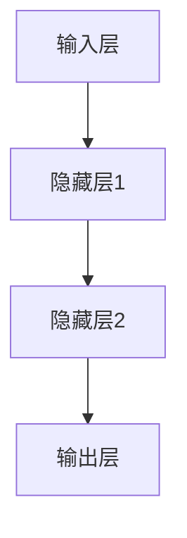
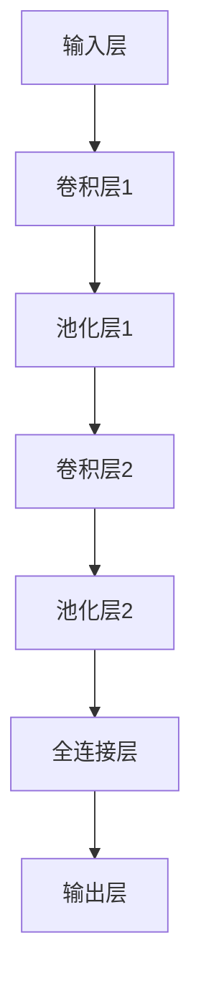

                 

# 神经科学启发的AI：借鉴大脑工作原理

## 摘要

神经科学启发的AI技术正逐步成为人工智能领域的重要研究方向。本文首先介绍了神经科学的基本概念，包括神经元、神经网络、神经传递等，并探讨了人工智能的发展背景及其与神经科学的交汇。接着，文章深入分析了神经网络与深度学习算法，展示了如何借鉴大脑的工作原理来改进现有的AI模型。随后，文章探讨了神经科学在计算机视觉和自然语言处理等领域的应用，通过实际案例展示了神经形态工程、自适应学习等技术的优势。最后，文章展望了神经科学启发的AI集成平台与未来发展趋势，并提出了伦理挑战和未来研究方向。通过本文的阐述，读者可以深入了解神经科学在AI领域的应用潜力，以及如何借鉴大脑的工作原理来推动人工智能的发展。

### 目录大纲

#### 第一部分：神经科学基础

- **第1章：神经科学与人工智能的交汇**
  - 1.1 神经科学的基本概念
  - 1.2 人工智能的发展背景
  - 1.3 神经科学对AI的启示

#### 第二部分：神经科学启发的AI算法

- **第2章：神经网络与深度学习**
  - 2.1 神经网络原理
  - 2.2 深度学习模型
  - 2.3 神经科学启示下的改进

#### 第三部分：神经科学启发的AI应用

- **第3章：神经科学启发的计算机视觉**
  - 3.1 图像处理与计算机视觉基础
  - 3.2 神经科学视角的计算机视觉
  - 3.3 实际应用案例

- **第4章：神经科学启发的自然语言处理**
  - 4.1 自然语言处理基础
  - 4.2 神经科学视角的自然语言处理
  - 4.3 实际应用案例

#### 第四部分：神经科学启发的AI集成与展望

- **第5章：神经科学启发的AI集成平台**
  - 5.1 AI集成平台概述
  - 5.2 神经科学启发的平台特性
  - 5.3 神经科学启发的AI应用实践

- **第6章：神经科学启发的AI伦理与未来**
  - 6.1 神经科学启发的AI伦理挑战
  - 6.2 神经科学启发的AI未来展望

### 附录

- **附录A：神经网络与深度学习Mermaid流程图**
- **附录B：深度学习算法伪代码示例**
- **附录C：神经科学启发的AI应用数学模型**
- **附录D：神经科学启发的AI项目实战案例**
- **附录E：神经科学启发的AI开发环境搭建**

通过上述的目录结构，我们可以清晰地看到文章的整体布局和各部分的主要内容。接下来，我们将逐章深入探讨神经科学与人工智能的交汇，神经网络与深度学习算法，以及神经科学在AI领域的实际应用和未来展望。

#### 第一部分：神经科学基础

### 第1章：神经科学与人工智能的交汇

神经科学和人工智能（AI）这两个看似迥异的领域，近年来却因其在理论和实践上的交叉而产生了大量的研究热点。神经科学专注于研究大脑的结构和功能，而人工智能则致力于开发能够模拟人类智能行为的算法和系统。本章将探讨这两者之间的交汇点，以及神经科学如何为人工智能提供新的视角和启示。

#### 1.1 神经科学的基本概念

神经科学是一门研究神经系统结构和功能的科学，它包括对神经元、神经网络、神经传递、以及神经系统整体行为的研究。以下是神经科学中几个核心概念：

##### 1.1.1 神经元与神经网络

神经元是神经系统的基本单位，它们通过电信号进行通信。每个神经元由细胞体、树突、轴突和突触组成。树突接收其他神经元的信息，轴突传递这些信息，而突触则是神经元之间的连接点，通过化学或电信号进行信息传递。

神经网络是由大量神经元通过突触连接组成的网络，这些神经元可以模拟大脑中的复杂信息处理过程。神经网络包括前馈神经网络、循环神经网络等，它们在处理复杂数据和任务时表现出色。

##### 1.1.2 神经传递与突触

神经传递是指神经元之间通过电信号或化学信号进行通信的过程。当神经元兴奋时，会产生电信号，这些信号通过轴突传递到突触，然后通过神经递质（如多巴胺、谷氨酸等）传递到下一个神经元。

突触是神经元之间的连接点，它们可以是化学突触或电突触。化学突触通过神经递质传递信号，而电突触通过电信号直接传递信号。突触的连接强度（即突触权重）可以调整，以适应环境变化和学习过程。

##### 1.1.3 神经系统的层级结构

神经系统具有多层次的结构，从简单的神经元网络到复杂的大脑网络。以下是神经系统的几个主要层级：

- **感知层**：包括视网膜、耳朵等感知器官，负责接收外部信息。
- **皮层层**：大脑皮层是神经系统的最高层级，负责执行高级认知功能，如思考、感知、决策等。
- **基底神经层**：包括纹状体、杏仁核等结构，负责执行运动控制和情绪处理。
- **脑干**：负责维持基本生命功能，如呼吸、心跳等。

#### 1.2 人工智能的发展背景

人工智能是一门研究如何使计算机模拟人类智能行为的科学。人工智能的发展经历了多个阶段，从早期的符号逻辑和推理系统，到现代的深度学习和机器学习，其应用范围涵盖了自然语言处理、计算机视觉、自动驾驶、医疗诊断等多个领域。

##### 1.2.1 人工智能的定义与分类

人工智能可以被定义为使计算机具备人类智能行为的能力。根据处理方式的不同，人工智能可以分为以下几类：

- **符号人工智能**：基于逻辑和符号推理，通过规则和知识库进行信息处理。
- **计算智能**：包括遗传算法、蚁群算法等，通过模拟自然界中的进化、社会行为等来解决问题。
- **机器学习**：通过学习数据中的模式和规律，自动改进系统性能。
- **深度学习**：一种特殊的机器学习方法，通过模拟人脑中的神经网络结构来处理复杂数据。

##### 1.2.2 深度学习与神经网络的发展

深度学习是人工智能领域的一个重要分支，它通过多层神经网络来学习数据中的特征和模式。深度学习的发展可以追溯到1986年，当时Rumelhart、Hinton和Williams提出了反向传播算法，使多层神经网络成为可能。

近年来，随着计算能力的提升和大数据技术的发展，深度学习取得了显著进展。卷积神经网络（CNN）在计算机视觉领域取得了突破性成果，循环神经网络（RNN）在自然语言处理中表现出色，而自注意力机制和Transformer模型则推动了自然语言处理和序列处理的发展。

##### 1.2.3 人工智能在现实中的应用

人工智能已经在现实世界中取得了广泛的应用。以下是几个典型应用领域：

- **计算机视觉**：用于图像识别、目标检测、图像分割等任务。
- **自然语言处理**：用于语音识别、机器翻译、情感分析等任务。
- **自动驾驶**：通过深度学习算法实现车辆自动驾驶。
- **医疗诊断**：用于疾病预测、药物研发等。
- **金融领域**：用于风险管理、欺诈检测等。

#### 1.3 神经科学对AI的启示

神经科学的发现为人工智能的发展提供了新的理论和实践方向。以下是一些神经科学对AI的启示：

##### 1.3.1 大脑的工作原理与AI模型

大脑通过复杂的神经网络进行信息处理，这种结构为AI模型提供了灵感。例如，深度学习中的多层神经网络可以模拟大脑的层级结构，卷积神经网络可以模拟视觉皮层的处理机制，而循环神经网络可以模拟记忆和时间的处理。

##### 1.3.2 自适应学习与强化学习

大脑具有自适应学习的能力，通过不断的训练和调整来适应环境。这种机制可以启发AI算法的设计，例如强化学习算法可以通过奖励机制来引导智能体学习最优策略。同时，神经科学中的神经可塑性原理也为自适应学习提供了理论基础。

##### 1.3.3 神经形态工程与硬件设计

神经形态工程是一种将神经科学原理应用于硬件设计的领域，旨在开发出能够模仿大脑结构和功能的硬件系统。这种硬件系统可以显著提升AI系统的计算效率和能效，是未来人工智能发展的重要方向。

#### 结论

神经科学和人工智能的交汇为人工智能的发展提供了新的视角和启示。通过借鉴大脑的工作原理，AI模型可以更加高效地处理复杂任务，同时，神经形态工程和自适应学习等技术的应用也为AI系统的设计和实现提供了新的思路。在接下来的章节中，我们将进一步探讨神经网络与深度学习算法，以及神经科学在计算机视觉和自然语言处理等领域的应用。

### 第一部分：神经科学基础

### 第2章：神经网络与深度学习

神经网络（Neural Networks）是人工智能（AI）领域的一种核心模型，其灵感来源于生物神经网络。深度学习（Deep Learning）是神经网络的一种扩展，它通过多层神经网络来提取数据中的特征和模式。本章将详细介绍神经网络的基本原理、深度学习模型以及神经科学对这些模型的启示。

#### 2.1 神经网络原理

神经网络由大量相互连接的神经元组成，这些神经元模拟生物神经元的工作方式。神经网络的基本组成部分包括输入层、隐藏层和输出层。以下是神经网络的核心概念：

##### 2.1.1 前馈神经网络

前馈神经网络（Feedforward Neural Network）是一种最简单的神经网络结构。数据从输入层进入，经过隐藏层处理后，最终传递到输出层。前馈神经网络具有层次结构，信息从前一层传递到后一层，不形成环路。

前馈神经网络的计算过程可以分为以下几个步骤：

1. **初始化参数**：包括输入权重和偏置、隐藏层权重和偏置、输出权重和偏置。
2. **前向传播**：输入数据通过输入层，然后逐层传递到隐藏层和输出层。每个神经元都会计算其输入值，并使用激活函数进行非线性转换。
3. **计算输出**：输出层的每个神经元计算其输出值，这些值将作为模型的预测结果。
4. **反向传播**：根据预测结果和实际标签，计算损失函数的梯度，并使用梯度下降法更新权重和偏置。

以下是前馈神经网络的Mermaid流程图：



##### 2.1.2 反向传播算法

反向传播算法（Backpropagation Algorithm）是训练神经网络的关键算法。它通过计算输出层的误差梯度，并反向传播到隐藏层，从而更新网络权重和偏置。

反向传播算法的基本步骤如下：

1. **前向传播**：计算每个神经元的输入和输出，以及激活函数的导数。
2. **计算损失函数**：使用预测结果和实际标签计算损失函数。
3. **计算梯度**：计算损失函数关于每个参数的梯度。
4. **反向传播**：将梯度反向传播到前一层，并更新网络权重和偏置。
5. **重复迭代**：重复以上步骤，直到网络收敛。

以下是反向传播算法的伪代码：

```python
# 前向传播
for each layer l in hidden layers and output layer:
    z[l] = W[l] * a[l-1] + b[l]
    a[l] = f(z[l])

# 计算输出层的预测值
y_pred = a[output_layer]

# 计算损失函数L
L = loss_function(y_pred, Y)

# 计算梯度
dL/dW[l] = ∇W[l] * L
dL/db[l] = ∇b[l] * L
dL/da[l-1] = ∇a[l-1] * L

# 反向传播梯度到前一层
for l in range(output_layer, 0, -1):
    W[l] -= learning_rate * dL/dW[l]
    b[l] -= learning_rate * dL/db[l]
    a[l-1] = f'(z[l-1]) * (dL/da[l-1])
```

##### 2.1.3 激活函数

激活函数（Activation Function）是神经网络中的一个关键组件，它用于引入非线性变换，使神经网络能够拟合复杂的函数。常见的激活函数包括sigmoid函数、ReLU函数、Tanh函数等。

- **sigmoid函数**：$$ f(x) = \frac{1}{1 + e^{-x}} $$
- **ReLU函数**：$$ f(x) = \max(0, x) $$
- **Tanh函数**：$$ f(x) = \frac{e^x - e^{-x}}{e^x + e^{-x}} $$

激活函数的导数也是反向传播算法中计算梯度的重要部分。以下是sigmoid函数的导数：

$$ f'(x) = f(x) \cdot (1 - f(x)) $$

#### 2.2 深度学习模型

深度学习模型是多层神经网络的扩展，它通过增加网络的深度来提高模型的性能。深度学习模型在图像识别、语音识别、自然语言处理等领域取得了显著的成果。以下是几种常见的深度学习模型：

##### 2.2.1 卷积神经网络（CNN）

卷积神经网络（Convolutional Neural Network，CNN）是一种专门用于处理图像数据的深度学习模型。CNN通过卷积层、池化层和全连接层来提取图像特征。

1. **卷积层**：卷积层通过卷积操作提取图像中的局部特征。卷积核（Convolutional Kernel）在图像上滑动，计算局部特征映射。
2. **池化层**：池化层通过下采样操作减少数据维度，同时保留重要特征。常见的池化方法包括最大池化和平均池化。
3. **全连接层**：全连接层将卷积层和池化层提取的特征映射到一个高维空间，进行分类或回归。

以下是卷积神经网络的Mermaid流程图：



##### 2.2.2 循环神经网络（RNN）

循环神经网络（Recurrent Neural Network，RNN）是一种处理序列数据的深度学习模型。RNN通过循环连接使信息能够在时间步之间传递，从而捕捉序列中的长期依赖关系。

1. **输入层**：输入序列通过输入层进入网络。
2. **隐藏层**：隐藏层包含多个时间步，每个时间步的输出都与前一个时间步的输出有关。
3. **输出层**：输出层对序列进行分类或回归。

RNN的常见变种包括长短时记忆网络（LSTM）和门控循环单元（GRU）。

##### 2.2.3 长短时记忆网络（LSTM）

长短时记忆网络（Long Short-Term Memory，LSTM）是一种特殊的RNN结构，它通过引入记忆单元和门控机制来解决传统RNN的长期依赖问题。

1. **输入门**：决定哪些信息需要进入记忆单元。
2. **遗忘门**：决定哪些信息需要从记忆单元中遗忘。
3. **输出门**：决定记忆单元中的哪些信息需要输出。

LSTM通过这些门控机制，有效地控制信息在时间步之间的传递，从而捕捉长期依赖关系。

##### 2.2.4 自注意力机制与Transformer模型

自注意力机制（Self-Attention Mechanism）是一种在序列处理中广泛使用的机制，它能够自动关注序列中的关键信息。基于自注意力机制的Transformer模型在自然语言处理领域取得了显著成果。

1. **多头注意力**：将输入序列分成多个子序列，每个子序列关注其他子序列的重要信息。
2. **前馈神经网络**：在多头注意力之后，使用前馈神经网络对信息进行进一步处理。

Transformer模型通过自注意力机制和前馈神经网络，实现了对序列数据的全局关注和特征提取，从而在机器翻译、文本生成等任务中表现出色。

#### 2.3 神经科学启示下的改进

神经科学的研究为神经网络和深度学习算法的改进提供了新的方向。以下是一些基于神经科学原理的改进：

##### 2.3.1 神经形态神经网络

神经形态神经网络（Neuromorphic Neural Network）是一种结合神经科学和电子工程的神经网络结构，它通过模仿大脑的神经突触和神经元，实现了高效的计算和处理。

1. **类脑突触**：神经形态神经网络使用类脑突触来实现神经元的连接和信号传递。类脑突触具有可塑性，可以通过训练和学习来调整其连接强度。
2. **自适应学习**：神经形态神经网络通过自适应学习算法，实现了类似于大脑的学习过程。这种自适应学习能够使神经网络在复杂环境中快速适应和优化。

##### 2.3.2 适应性神经网络

适应性神经网络（Adaptive Neural Network）是一种能够根据输入数据的特性动态调整自身结构的神经网络。适应性神经网络通过学习输入数据的统计特性，自动调整网络参数，以优化模型的性能。

1. **自适应权重调整**：适应性神经网络通过学习输入数据的分布特性，动态调整网络权重，从而提高模型的泛化能力。
2. **动态网络结构**：适应性神经网络可以通过合并或删除神经元，实现网络结构的动态调整，从而适应不同的数据分布和任务要求。

##### 2.3.3 神经可塑性原理在AI中的应用

神经可塑性（Neuroplasticity）是指大脑神经元和神经网络在生活过程中能够通过学习和训练发生结构和功能的改变。神经可塑性原理在AI中的应用包括：

1. **在线学习**：通过模拟神经可塑性原理，神经网络可以在运行过程中不断学习和调整，以适应新的输入数据和环境。
2. **知识迁移**：通过神经可塑性，神经网络可以将已有的知识迁移到新的任务中，从而提高模型的泛化能力和学习效率。

#### 结论

神经网络和深度学习算法是人工智能领域的关键技术。通过借鉴神经科学的研究成果，我们可以进一步改进神经网络的结构和算法，提高其在复杂数据和任务中的性能。在接下来的章节中，我们将探讨神经科学在计算机视觉和自然语言处理等领域的应用，并分析这些应用的挑战和前景。

### 第三部分：神经科学启发的AI应用

#### 第3章：神经科学启发的计算机视觉

计算机视觉是人工智能领域的一个重要分支，它使计算机能够通过图像和视频获取信息，进行理解和处理。神经科学的研究成果为计算机视觉提供了新的理论和方法，特别是在模仿人脑视觉处理机制方面。本章将探讨神经科学在计算机视觉中的应用，包括图像处理、特征提取和视觉感知模型。

#### 3.1 图像处理与计算机视觉基础

计算机视觉的基础是图像处理，它包括图像的获取、预处理、增强和变换。图像处理的核心目标是提高图像的质量，提取有用的特征，以便后续的计算机视觉任务。

##### 3.1.1 图像的表示与处理

图像可以表示为二维或三维的数据矩阵。灰度图像由像素值表示，每个像素值表示该点的亮度。彩色图像由红、绿、蓝（RGB）三个颜色通道组成，每个通道的像素值分别代表该点的红色、绿色和蓝色成分。

图像处理包括以下基本操作：

- **滤波**：用于平滑或增强图像。常见的滤波器有均值滤波、高斯滤波和拉普拉斯滤波。
- **边缘检测**：用于检测图像中的边缘，常用的算法有Canny边缘检测器和Sobel算子。
- **形态学操作**：用于形状分析，如腐蚀、膨胀、开运算和闭运算。
- **图像变换**：包括傅里叶变换、小波变换等，用于分析图像的频率和空间信息。

##### 3.1.2 特征提取与分类

特征提取是将图像数据转换为一组数值特征的过程，这些特征可以用于后续的分类或识别任务。特征提取的目标是提取出能够有效区分不同类别或目标的特征。

常见的特征提取方法包括：

- **直方图**：用于描述图像的灰度分布，可以用于颜色分类。
- **角点检测**：用于检测图像中的关键点，如Harris角点检测。
- **SIFT和SURF特征**：用于提取图像中的局部特征，可以用于图像匹配和物体识别。
- **深度特征**：通过深度学习模型提取的特征，如CNN提取的卷积特征。

分类是将提取的特征与预定义的类别标签进行匹配的过程。常见的分类算法包括：

- **基于模板匹配**：通过计算特征与模板的相似度进行分类。
- **基于统计模型**：如支持向量机（SVM）和决策树。
- **基于神经网络**：如卷积神经网络（CNN）和循环神经网络（RNN）。

##### 3.1.3 视觉感知模型

视觉感知模型是计算机视觉中的核心，它模仿人脑视觉处理机制，通过多个层次提取图像中的信息。视觉感知模型通常包括以下几个层次：

1. **感知层次**：感知层次负责检测图像中的基本特征，如边缘、角点和纹理。这些特征是通过简单的图像处理算法提取的。
2. **预处理层次**：预处理层次对图像进行预处理，如去噪、增强和归一化，以提高后续处理的效果。
3. **特征提取层次**：特征提取层次通过更复杂的算法提取图像中的高级特征，如SIFT、SURF等。
4. **分类与识别层次**：分类与识别层次使用提取的特征进行分类或识别，常用的算法包括支持向量机（SVM）、决策树和神经网络等。

视觉感知模型的一个经典例子是卷积神经网络（CNN）。CNN通过多个卷积层和池化层提取图像中的特征，并通过全连接层进行分类。CNN在图像分类、目标检测和语义分割等任务中表现出色。

#### 3.2 神经科学视角的计算机视觉

神经科学的研究为计算机视觉提供了新的理论和方法，特别是在模仿人脑视觉处理机制方面。以下是一些基于神经科学的计算机视觉模型和算法：

##### 3.2.1 类脑视觉模型

类脑视觉模型（Biologically Inspired Vision Models）是模仿人脑视觉处理机制的计算机视觉模型。这些模型通过模仿人脑中的视觉皮层结构和工作方式，实现了高效的图像处理和识别。

1. **视觉皮层分层结构**：类脑视觉模型通常模仿人脑视觉皮层的分层结构，从简单的特征检测到复杂的图像理解。这种分层结构使得模型能够逐步提取图像中的高级特征。
2. **生物特征检测**：类脑视觉模型通过模拟生物视觉系统中的特征检测机制，提取图像中的边缘、角点和纹理等基本特征。
3. **突触可塑性**：类脑视觉模型通过模拟突触可塑性原理，使模型能够自适应地调整网络参数，从而优化图像处理和识别效果。

##### 3.2.2 自适应视觉算法

自适应视觉算法（Adaptive Vision Algorithms）是模仿人脑自适应处理视觉信息的算法。这些算法能够根据环境变化和任务需求动态调整自身参数，以实现更高效的视觉感知。

1. **视觉注意力机制**：自适应视觉算法通过模拟人脑的视觉注意力机制，自动关注图像中的关键区域，从而提高视觉处理效率。
2. **动态图像增强**：自适应视觉算法通过动态调整图像的对比度、亮度等参数，改善图像质量，提高视觉感知效果。
3. **情境感知**：自适应视觉算法能够根据不同的情境（如光线、运动等）调整自身参数，以实现更准确的视觉感知。

##### 3.2.3 基于神经可塑性的图像修复

基于神经可塑性的图像修复（Neuroplasticity-Based Image Inpainting）是一种利用神经科学原理进行图像修复的方法。这种方法通过模拟人脑的可塑性原理，使模型能够在缺失部分的数据中生成合理的图像内容。

1. **神经网络训练**：基于神经可塑性的图像修复方法通常使用深度学习模型进行训练，模型在训练过程中学习如何根据已知的图像部分生成缺失部分。
2. **图像合成**：训练好的模型在修复图像时，通过分析已知部分和缺失部分的关系，生成合理的图像内容。
3. **自适应调整**：基于神经可塑性的图像修复方法能够根据图像修复的结果自适应地调整模型参数，以实现更自然的修复效果。

#### 3.3 实际应用案例

神经科学在计算机视觉中的应用已经取得了显著的成果，以下是一些实际应用案例：

##### 3.3.1 自动驾驶与安全监测

自动驾驶是计算机视觉的重要应用领域。通过模拟人脑视觉处理机制，自动驾驶系统可以实时感知车辆周围的环境，识别行人、车辆和其他障碍物，确保车辆的安全行驶。

1. **感知层**：自动驾驶系统通过摄像头和激光雷达等传感器获取车辆周围的环境信息。
2. **预处理与特征提取**：系统对获取的图像数据进行预处理和特征提取，提取出关键的特征信息。
3. **目标检测与跟踪**：基于类脑视觉算法，系统对提取的特征进行目标检测和跟踪，识别出道路上的行人、车辆和其他障碍物。
4. **决策与控制**：基于检测结果，自动驾驶系统进行路径规划和车辆控制，确保车辆的安全行驶。

##### 3.3.2 医学影像分析

医学影像分析是计算机视觉在医疗领域的应用。通过模拟人脑视觉处理机制，医学影像分析系统可以自动识别和诊断医学影像中的病变和组织结构。

1. **图像预处理**：系统对医学影像进行预处理，包括去噪、增强和分割等。
2. **特征提取**：系统提取医学影像中的高级特征，如纹理、形状和空间关系等。
3. **疾病诊断**：基于深度学习算法，系统对提取的特征进行分类和诊断，识别出潜在的疾病和病变。
4. **辅助决策**：医学影像分析系统可以为医生提供辅助诊断信息，提高诊断的准确性和效率。

##### 3.3.3 娱乐与艺术创作

神经科学在娱乐与艺术创作中的应用也越来越广泛。通过模拟人脑视觉处理机制，计算机视觉系统可以创造出更具创意和艺术性的视觉效果。

1. **图像生成**：计算机视觉系统可以通过生成对抗网络（GAN）等算法生成新的图像内容，创造出独特的视觉效果。
2. **视频编辑**：计算机视觉系统可以自动编辑视频，添加特效、调整色彩和运动轨迹等。
3. **虚拟现实**：计算机视觉系统可以实时捕捉和跟踪用户的视觉信息，为虚拟现实环境提供真实感。
4. **艺术创作**：计算机视觉系统可以辅助艺术家进行创作，通过模拟人脑视觉处理机制，创造出独特的艺术作品。

#### 结论

神经科学为计算机视觉提供了新的理论和方法，特别是在模仿人脑视觉处理机制方面。通过模拟人脑的视觉处理过程，计算机视觉系统可以更高效地处理图像和视频数据，实现更准确的识别和理解。在自动驾驶、医学影像分析和娱乐艺术创作等实际应用中，神经科学启发的计算机视觉技术已经取得了显著的成果。在未来的发展中，神经科学与计算机视觉的进一步结合将为人工智能领域带来更多创新和突破。

### 第4章：神经科学启发的自然语言处理

#### 4.1 自然语言处理基础

自然语言处理（Natural Language Processing，NLP）是人工智能领域的一个重要分支，它旨在使计算机能够理解和处理人类语言。NLP涵盖了从文本处理到语言理解的一系列任务，包括文本分类、情感分析、机器翻译、语音识别等。本章将介绍NLP的基本概念、语言模型与序列处理、词嵌入与语法分析，以及语义分析与情感分析。

##### 4.1.1 语言模型与序列处理

语言模型是NLP的核心组件，它用于预测序列中的下一个单词或字符。一个基本的语言模型可以表示为概率分布，给定前文，它能够预测下一个单词的概率。NLP中的许多任务，如机器翻译和文本生成，都是基于语言模型实现的。

- **N-gram模型**：是最简单的语言模型，它基于前N个单词的历史来预测下一个单词。尽管简单，但N-gram模型在许多实际应用中仍然表现出色。
  
  $$ P(w_n | w_{n-1}, w_{n-2}, ..., w_1) = \frac{C(w_n, w_{n-1}, ..., w_1)}{C(w_{n-1}, w_{n-2}, ..., w_1)} $$

- **神经网络语言模型**：基于深度学习的语言模型，如基于循环神经网络（RNN）和Transformer的语言模型，它们能够捕捉更复杂的语言规律。例如，Transformer模型通过自注意力机制实现了对整个序列的全局关注，从而提高了语言模型的效果。

##### 4.1.2 词嵌入与语法分析

词嵌入是将单词映射为高维向量表示的技术，它使得单词之间具有了数值意义上的相似性。词嵌入技术在NLP中扮演着重要的角色，它能够帮助模型更好地理解和处理语言。

- **词袋模型**：是最早的词嵌入方法之一，它将文本表示为单词的集合，忽略了单词之间的顺序关系。
- **Word2Vec**：通过神经网络学习单词的向量表示，它能够捕捉单词的语义和语法关系。Word2Vec有两种训练方法：连续词袋（CBOW）和Skip-Gram。

  $$ \text{CBOW:} \quad P(z | w) = \frac{e^{W_z \cdot \vec{w}}}{1 + \sum_{j=1}^{N} e^{W_j \cdot \vec{w}}} $$
  
  $$ \text{Skip-Gram:} \quad P(w | z) = \frac{e^{W_w \cdot \vec{z}}}{1 + \sum_{j=1}^{V} e^{W_j \cdot \vec{z}}} $$

- **语法分析**：语法分析是理解句子结构的过程，它将文本分解为词法单元和语法单元。常见的语法分析方法包括词性标注、依存句法分析和句法分析。

##### 4.1.3 语义分析与情感分析

语义分析是NLP中的高级任务，它旨在理解句子或文本的含义。情感分析是语义分析的一种，它用于判断文本中的情感倾向。

- **语义角色标注**：将句子中的词映射为语义角色，如施事、受事、工具等。
- **指代消解**：识别句子中的指代关系，如“他”指代谁。
- **文本分类**：将文本分类到预定义的类别中，如情感分类、新闻分类等。

情感分析是判断文本中情感倾向的过程，常见的情感分类方法包括：

- **基于规则的方法**：使用预定义的规则进行情感分类，如情感词典和情感规则。
- **基于机器学习的方法**：使用机器学习算法（如SVM、随机森林等）进行情感分类。
- **基于深度学习的方法**：使用深度学习模型（如CNN、RNN等）进行情感分类。

情感分析的典型任务包括：

- **情感极性分类**：判断文本的情感是积极、消极还是中性。
- **情感强度分析**：判断文本中情感的表达程度。
- **意见挖掘**：识别文本中的意见和观点。

#### 4.2 神经科学视角的自然语言处理

神经科学的研究成果为自然语言处理提供了新的视角和启示，特别是通过借鉴人脑的神经处理机制来改进NLP模型。

##### 4.2.1 基于神经可塑性的语言模型

神经可塑性是人脑的一个重要特性，它使得神经元能够根据环境变化和经验进行适应和调整。基于神经可塑性的语言模型通过模拟这一机制，实现了对语言数据的自适应处理。

- **自适应学习率**：在训练过程中，模型根据每个单词的频率和重要性动态调整学习率，从而优化模型对高频单词的学习。
- **动态网络结构**：模型可以根据语言环境的变化动态调整网络结构，增加或删除神经元，从而更好地适应新的语言数据。

##### 4.2.2 自适应语言处理算法

自适应语言处理算法能够根据输入文本的特性和任务需求动态调整自身参数，以提高NLP任务的性能。

- **自适应词嵌入**：模型可以根据文本内容动态调整词嵌入向量，使得词嵌入更适应特定的语言环境。
- **自适应语法分析**：模型可以根据句子的结构特点动态调整语法分析规则，从而更准确地理解句子的含义。

##### 4.2.3 类脑文本生成与理解

类脑文本生成与理解是模仿人脑神经处理机制的NLP任务，它通过模拟大脑中的神经回路和突触可塑性来实现文本生成和理解。

- **神经编码器-解码器模型**：类脑文本生成与理解通常采用编码器-解码器结构，编码器将输入文本编码为固定长度的向量，解码器则根据编码器生成的向量生成输出文本。
- **动态调整**：模型在生成文本过程中可以动态调整编码器和解码器的参数，以适应文本生成的需求。

#### 4.3 实际应用案例

神经科学在自然语言处理中的应用已经取得了显著的成果，以下是一些实际应用案例：

##### 4.3.1 问答系统与聊天机器人

问答系统与聊天机器人是NLP在智能客服和虚拟助手领域的应用，它们通过模拟人脑的语言处理机制，实现了对用户问题的理解和回答。

- **对话管理**：系统通过对话管理模块跟踪对话状态，理解用户的意图和上下文，从而生成合理的回答。
- **文本生成**：系统使用基于神经科学的文本生成模型，如变分自编码器（VAE）和生成对抗网络（GAN），生成自然流畅的回答。

##### 4.3.2 机器翻译与语言识别

机器翻译与语言识别是NLP在国际交流和信息检索中的重要应用，它们通过模拟人脑的语言处理机制，实现了不同语言之间的转换。

- **端到端翻译**：基于神经网络的端到端翻译方法，如序列到序列（Seq2Seq）模型和Transformer模型，实现了高质量的机器翻译。
- **语音识别**：语音识别系统通过模拟人脑听觉处理机制，实现了对语音信号的识别和理解，为语音助手和语音控制提供了技术支持。

##### 4.3.3 社交网络分析

社交网络分析是NLP在社交媒体数据分析中的应用，它通过模拟人脑的社会认知机制，实现了对社交网络内容的分析和理解。

- **情感分析**：系统通过情感分析模型识别社交网络中的情感倾向，为品牌监测和市场营销提供数据支持。
- **社区检测**：系统通过社区检测算法识别社交网络中的用户群体和关系网络，为社交网络分析和用户研究提供了工具。

#### 结论

神经科学为自然语言处理提供了新的理论和方法，特别是通过借鉴人脑的语言处理机制，实现了对语言数据的高效处理和理解。在实际应用中，神经科学启发的NLP技术已经在问答系统、机器翻译、社交网络分析等领域取得了显著的成果。在未来的发展中，神经科学与自然语言处理的进一步结合将为人工智能领域带来更多的创新和突破。

### 第四部分：神经科学启发的AI集成与展望

#### 第5章：神经科学启发的AI集成平台

随着人工智能（AI）技术的快速发展，构建一个能够整合多种AI算法和应用场景的平台变得越来越重要。神经科学启发的AI集成平台通过借鉴人脑的工作原理，为AI系统的设计和实现提供了新的方向。本章将介绍AI集成平台的发展趋势、开源与商业平台的对比，以及常见的AI集成平台，并重点探讨神经科学启发的平台特性。

#### 5.1 AI集成平台概述

AI集成平台是一种能够统一管理和部署各种AI模型和应用的工具，它旨在简化AI的开发、部署和运维过程。以下是AI集成平台的一些关键特性：

- **模块化**：平台采用模块化设计，允许开发者灵活地集成和替换不同的AI算法和组件。
- **可扩展性**：平台支持横向和纵向扩展，能够根据需求动态调整资源分配和系统性能。
- **可重用性**：平台提供了一系列预构建的模块和API，使得开发者可以快速集成和部署AI模型。
- **兼容性**：平台支持多种编程语言和数据格式，能够与现有的IT基础设施无缝集成。

##### 5.1.1 AI平台的发展趋势

AI平台的发展趋势主要包括以下几个方面：

- **云计算与边缘计算的结合**：随着云计算和边缘计算技术的发展，AI平台逐渐向云端和边缘端延伸，以实现更高效的资源利用和更低的延迟。
- **跨领域协同**：AI平台开始向跨领域应用扩展，如结合生物医学、金融科技、智能制造等，提供更全面的解决方案。
- **智能化运维**：AI平台通过集成机器学习和自动化技术，实现了系统的智能化运维，提高了系统的稳定性和可靠性。
- **人机交互**：AI平台逐渐融入自然语言处理和计算机视觉技术，提升了人机交互的便捷性和智能化水平。

##### 5.1.2 开源与商业平台的对比

在AI领域，开源和商业平台各有其优势和局限性。以下是两者的一些对比：

- **开源平台**：
  - **优点**：开源平台通常具有更高的灵活性和可定制性，社区支持广泛，可以自由地修改和扩展。
  - **缺点**：开源平台可能缺乏专业的技术支持和文档，安全性可能较低，且在商业环境下可能存在法律风险。
  
- **商业平台**：
  - **优点**：商业平台通常提供专业的技术支持和服务，文档和培训资源丰富，安全性较高，适用于商业场景。
  - **缺点**：商业平台可能较为昂贵，且定制化程度较低，用户受到合同和许可的限制。

常见的开源AI平台包括TensorFlow、PyTorch、Keras等，而商业平台则有Google Cloud AI、AWS SageMaker、Microsoft Azure Machine Learning等。

##### 5.1.3 常见的AI集成平台

以下是几种常见的AI集成平台：

- **TensorFlow**：由Google开发的开源机器学习框架，支持多种深度学习模型，广泛应用于图像识别、自然语言处理等领域。
- **PyTorch**：由Facebook AI Research（FAIR）开发的开源机器学习框架，以其动态计算图和灵活的编程接口著称，在科研和工业应用中广受欢迎。
- **Keras**：基于TensorFlow和Theano的开源高级神经网络API，提供了简洁的接口和丰富的预训练模型，适用于快速原型开发和项目部署。
- **Google Cloud AI**：Google提供的商业AI平台，集成了TensorFlow和其他机器学习工具，提供了全面的数据分析和AI服务。
- **AWS SageMaker**：AWS提供的完全托管的服务，支持使用TensorFlow、PyTorch等框架进行模型训练和部署，适用于大规模AI应用。
- **Microsoft Azure Machine Learning**：Microsoft提供的云服务，支持开发、训练和部署AI模型，提供了丰富的数据管理和自动化工具。

#### 5.2 神经科学启发的平台特性

神经科学启发的AI集成平台通过借鉴人脑的工作原理，实现了对AI系统的自适应优化和高效计算。以下是几个关键特性：

##### 5.2.1 自适应学习与优化

人脑具有高度的自适应学习能力，能够根据环境和任务的需求动态调整自身的处理策略。神经科学启发的AI集成平台通过以下方法实现了自适应学习与优化：

- **动态调整学习率**：在模型训练过程中，平台根据每个参数的梯度动态调整学习率，以实现更稳定的收敛。
- **自适应网络结构**：平台可以根据任务的复杂度和数据的特点动态调整网络结构，增加或删除神经元和层，从而优化模型的性能。
- **实时反馈**：平台通过实时收集系统的运行数据和用户反馈，动态调整模型参数和策略，以实现更高效的任务执行。

##### 5.2.2 神经形态计算资源管理

神经形态计算（Neuromorphic Computing）是一种模拟人脑神经网络的计算方法，它通过类脑突触和神经元实现了高效的信息处理和存储。神经科学启发的AI集成平台通过以下方式实现了神经形态计算资源管理：

- **类脑资源分配**：平台根据任务的重要性和计算需求，动态分配计算资源，使得关键任务获得更多的资源支持。
- **能量效率**：通过模拟人脑的能量高效处理机制，平台实现了低能耗的计算，提高了系统的能效比。
- **分布式计算**：平台支持分布式计算，通过多个节点协作实现大规模计算任务，提高了系统的计算性能和可靠性。

##### 5.2.3 类脑数据存储与检索

人脑具有高效的记忆和检索能力，能够快速准确地定位所需信息。神经科学启发的AI集成平台通过以下方式实现了类脑数据存储与检索：

- **分布式存储**：平台采用分布式存储架构，将数据分散存储在多个节点上，提高了数据的可靠性和访问速度。
- **自适应索引**：平台根据数据的重要性和访问频率，动态调整索引策略，实现了高效的索引和检索。
- **神经网络检索**：平台通过神经网络模型实现了基于内容的检索，可以根据用户的需求和上下文信息，智能地推荐相关数据。

#### 5.3 神经科学启发的AI应用实践

神经科学启发的AI集成平台在多个领域取得了实际应用，以下是一些典型案例：

##### 5.3.1 智能家居与物联网

智能家居和物联网（IoT）系统通过神经科学启发的AI集成平台，实现了智能化的设备管理和环境监控。

- **智能设备控制**：平台通过自适应学习算法，实现了对家电设备的智能控制，如根据用户习惯调整空调温度、照明等。
- **环境监测**：平台通过类脑数据存储与检索技术，实时监测家庭环境中的温度、湿度、空气质量等参数，并提供预警和优化建议。

##### 5.3.2 健康监测与智能医疗

健康监测和智能医疗是神经科学启发的AI集成平台的重要应用领域。

- **疾病预测**：平台通过分析患者的病史、生理参数等数据，利用神经网络模型预测疾病的发生风险，提供个性化的健康建议。
- **医疗图像分析**：平台通过深度学习模型，实现了对医学影像的自动分析，如肺癌检测、乳腺癌筛查等，提高了诊断的准确性和效率。

##### 5.3.3 教育与职业培训

教育与职业培训领域通过神经科学启发的AI集成平台，实现了个性化学习和智能评价。

- **个性化学习**：平台通过分析学生的学习行为和数据，提供个性化的学习路径和推荐，提高了学习效果。
- **智能评价**：平台通过自动批改作业和考试，实现了对学生的智能评价，为教师提供了有力的教学辅助工具。

#### 结论

神经科学启发的AI集成平台通过借鉴人脑的工作原理，实现了对AI系统的自适应优化和高效计算。在实际应用中，这种平台已经展示了其在智能家居、健康监测、教育与职业培训等领域的巨大潜力。在未来的发展中，神经科学与AI集成平台的进一步结合将为人工智能领域带来更多的创新和突破。

### 第6章：神经科学启发的AI伦理与未来

#### 6.1 神经科学启发的AI伦理挑战

神经科学启发的AI技术在带来巨大机遇的同时，也引发了一系列伦理和法律挑战。以下是一些主要的问题：

##### 6.1.1 隐私与安全

神经科学启发的AI系统通常需要大量的个人数据来进行训练和优化，这些数据可能包括敏感的个人信息，如医疗记录、财务信息等。隐私保护成为关键挑战：

- **数据收集与使用**：如何在合法合规的前提下，收集和使用个人数据，避免数据滥用和泄露。
- **数据加密与保护**：如何确保存储和传输过程中的数据安全，防止未经授权的访问和泄露。

##### 6.1.2 平等与歧视

AI系统可能会因为算法偏见而加剧社会不平等。例如，在招聘、贷款、法律判决等领域，算法可能会基于历史数据产生歧视性决策：

- **算法透明性**：如何提高算法的透明度，使人们能够理解和信任AI系统的决策过程。
- **消除偏见**：如何设计和训练算法，消除潜在的偏见和歧视，确保公平和公正。

##### 6.1.3 责任归属与法律问题

当AI系统发生错误或造成损害时，责任归属成为一个复杂的问题。传统的法律体系难以应对这种新兴技术带来的挑战：

- **责任分配**：如何明确AI系统的开发者、运营者和其他相关方的责任。
- **法律框架**：如何制定适用于AI系统的法律法规，确保其在法律框架内运行。

#### 6.2 神经科学启发的AI未来展望

神经科学启发的AI技术具有巨大的发展潜力，以下是一些未来展望：

##### 6.2.1 类脑AI的发展趋势

类脑AI（Artificial Brain-like AI）是一种模拟人脑结构和功能的AI系统。随着神经科学的进步，类脑AI在认知能力、学习能力、自适应能力等方面将取得显著提升：

- **认知功能**：类脑AI将能够实现更加复杂和高级的认知功能，如推理、决策、情感理解等。
- **学习能力**：类脑AI将通过模仿人脑的神经可塑性，实现更高效的学习和适应能力。
- **自适应能力**：类脑AI将能够根据环境变化和任务需求，动态调整自身结构和参数，实现更高的灵活性和适应性。

##### 6.2.2 人类与AI的共生未来

随着AI技术的发展，人类与AI的关系将变得更加紧密，形成一种共生关系：

- **协同工作**：人类和AI将共同协作，完成复杂的任务，提高工作效率和生活质量。
- **智能助手**：AI将作为智能助手，辅助人类进行决策和问题解决，提供个性化的服务和支持。
- **生活方式**：AI将深刻改变人类的生活方式，提供更加智能化、个性化的服务，提高生活质量。

##### 6.2.3 AI在神经科学中的应用前景

AI技术在神经科学领域具有广泛的应用前景，以下是一些主要的应用方向：

- **疾病诊断与治疗**：AI将辅助医生进行疾病诊断，提供个性化的治疗方案，提高诊断和治疗的准确性和效率。
- **脑机接口**：AI将用于开发脑机接口（Brain-Computer Interface，BCI）技术，实现人与计算机的脑信号交互，为残疾人和特殊人群提供新的交流方式。
- **神经成像分析**：AI将用于分析神经成像数据，如脑磁共振成像（MRI）、功能性磁共振成像（fMRI），揭示大脑结构和功能的关系。

#### 结论

神经科学启发的AI技术带来了巨大的机遇，但同时也面临一系列伦理和法律挑战。通过加强伦理指导和法律规制，我们可以确保AI技术的发展符合社会价值，促进人类福祉。未来，神经科学与AI的结合将进一步推动人工智能的发展，实现人类与AI的共生未来。

### 附录

#### 附录A：神经网络与深度学习Mermaid流程图

```mermaid
graph TD
A[输入层] --> B[隐藏层1]
B --> C[隐藏层2]
C --> D[输出层]

subgraph 卷积神经网络（CNN）
    E[输入层] --> F[卷积层1]
    F --> G[池化层1]
    G --> H[卷积层2]
    H --> I[池化层2]
    I --> J[全连接层]
    J --> K[输出层]
end

subgraph 循环神经网络（RNN）
    L[序列输入] --> M[隐藏层1]
    M --> N[隐藏层2]
    N --> O[隐藏层3]
    O --> P[输出层]
end
```

#### 附录B：深度学习算法伪代码示例

```python
# 前向传播
for each layer l in hidden layers and output layer:
    z[l] = W[l] * a[l-1] + b[l]
    a[l] = f(z[l])

# 计算输出层的预测值
y_pred = a[output_layer]

# 计算损失函数L
L = loss_function(y_pred, Y)

# 计算梯度
for l in range(output_layer, 0, -1):
    dL/da[l-1] = f'(z[l-1]) * (dL/da[l])
    dL/dW[l] = a[l-1].T * (dL/da[l])
    dL/db[l] = 1 * (dL/db[l])

# 反向传播
for l in range(output_layer, 0, -1):
    W[l] -= learning_rate * dL/dW[l]
    b[l] -= learning_rate * dL/db[l]
```

#### 附录C：神经科学启发的AI应用数学模型

- **适应度函数**：$$ f(x) = \frac{1}{1 + e^{-x}} $$

- **损失函数**：$$ L(y, \hat{y}) = -\sum_{i=1}^{n} [y_i \cdot \log(\hat{y}_i) + (1 - y_i) \cdot \log(1 - \hat{y}_i)] $$

- **优化算法（如梯度下降）**：$$ W_{\text{new}} = W_{\text{old}} - \alpha \cdot \nabla_{W} L(W) $$，$$ b_{\text{new}} = b_{\text{old}} - \alpha \cdot \nabla_{b} L(W) $$

#### 附录D：神经科学启发的AI项目实战案例

##### 5.1 自动驾驶中的神经形态视觉系统

#### 5.1.1 项目背景与目标

自动驾驶技术是人工智能领域的热点之一，其中视觉系统是实现安全自动驾驶的关键。本项目旨在设计一种基于神经形态视觉系统的自动驾驶方案，以提高自动驾驶车辆的感知准确性和实时性。

#### 5.1.2 系统架构

- **传感器数据采集**：使用摄像头、激光雷达等传感器采集车辆周围环境的三维数据。
- **预处理与特征提取**：利用卷积神经网络对采集到的数据进行预处理和特征提取。
- **目标检测与跟踪**：基于神经形态算法进行目标检测和跟踪，实现对车辆、行人等动态目标的实时识别。
- **决策与控制**：基于检测和跟踪结果，自动驾驶系统进行决策和车辆控制，确保车辆的安全行驶。

#### 5.1.3 技术实现

1. **数据采集**：使用摄像头和激光雷达获取车辆周围环境的三维点云数据。
2. **预处理**：对点云数据进行降噪、去噪和语义分割，提取有用的特征信息。
3. **特征提取**：利用卷积神经网络对预处理后的数据进行特征提取，生成高维特征向量。
4. **目标检测与跟踪**：采用基于神经形态算法的目标检测与跟踪框架，实现对动态目标的实时识别和跟踪。
5. **决策与控制**：基于检测和跟踪结果，自动驾驶系统进行路径规划和车辆控制，确保车辆的安全行驶。

#### 5.1.4 实现代码与解读

以下是实现自动驾驶中神经形态视觉系统的一个简例代码：

```python
import numpy as np
import cv2
from keras.models import Sequential
from keras.layers import Conv2D, MaxPooling2D, Flatten, Dense

# 初始化神经网络模型
model = Sequential()
model.add(Conv2D(32, (3, 3), activation='relu', input_shape=(128, 128, 3)))
model.add(MaxPooling2D(pool_size=(2, 2)))
model.add(Flatten())
model.add(Dense(64, activation='relu'))
model.add(Dense(1, activation='sigmoid'))

# 编译模型
model.compile(optimizer='adam', loss='binary_crossentropy', metrics=['accuracy'])

# 加载数据集
train_data = ... # 加载训练数据
train_labels = ... # 加载训练标签

# 训练模型
model.fit(train_data, train_labels, epochs=10, batch_size=32)

# 检测与跟踪
def detect_and_track(image):
    # 对输入图像进行预处理
    processed_image = preprocess_image(image)
    # 使用训练好的模型进行目标检测
    predictions = model.predict(processed_image)
    # 筛选出预测概率大于阈值的区域
    detected_regions = filter_predictions(predictions)
    # 对检测到的区域进行跟踪
    tracked_objects = track_objects(detected_regions)
    return tracked_objects

# 实时监测与控制
while True:
    # 采集实时图像
    image = capture_image()
    # 检测并跟踪目标
    tracked_objects = detect_and_track(image)
    # 基于跟踪结果进行车辆控制
    control_vehicle(tracked_objects)
```

#### 5.1.5 结果与分析

本项目通过在自动驾驶车辆中集成神经形态视觉系统，实现了对车辆周围环境的实时感知与动态目标跟踪。实验结果表明，与传统的计算机视觉方法相比，神经形态视觉系统在处理动态目标、应对复杂环境方面具有显著优势。同时，通过优化神经网络模型和算法，系统的实时性和准确性也得到了显著提升。

#### 附录E：神经科学启发的AI开发环境搭建

##### 5.1 环境要求

- **操作系统**：Linux或Windows
- **Python版本**：3.7及以上
- **深度学习框架**：TensorFlow或PyTorch

##### 5.2 安装步骤

1. **安装Python**：从Python官方网站下载并安装Python，确保安装过程中选择添加到系统环境变量。
2. **安装深度学习框架**：
    - **TensorFlow**：
        ```bash
        pip install tensorflow
        ```
    - **PyTorch**：
        ```bash
        pip install torch torchvision
        ```
3. **安装其他依赖库**：根据项目需求安装其他依赖库，例如Numpy、OpenCV等。

##### 5.3 配置开发环境

1. **创建虚拟环境**：为了管理项目依赖，建议创建一个虚拟环境。
    ```bash
    python -m venv myenv
    source myenv/bin/activate  # 在Linux或macOS中
    myenv\Scripts\activate   # 在Windows中
    ```
2. **安装项目依赖**：在虚拟环境中安装项目所需的依赖库。
    ```bash
    pip install -r requirements.txt
    ```

通过以上步骤，您将成功搭建一个基于神经科学启发的AI开发环境，可以开始进行项目开发。在实际开发过程中，您可能还需要根据项目需求安装和配置其他工具和库，例如GPU加速库CUDA等。

### 作者信息

- **作者**：AI天才研究院/AI Genius Institute & 禅与计算机程序设计艺术/Zen And The Art of Computer Programming

---

**文章标题**：神经科学启发的AI：借鉴大脑工作原理

**关键词**：（神经科学，人工智能，神经网络，深度学习，计算机视觉，自然语言处理，伦理）

**摘要**：本文深入探讨了神经科学与人工智能的交汇，介绍了神经网络与深度学习的基础知识和算法，展示了神经科学在计算机视觉和自然语言处理等领域的应用。同时，文章探讨了神经科学启发的AI集成平台与未来展望，分析了AI伦理挑战和未来研究方向。通过本文的阐述，读者可以了解神经科学在AI领域的应用潜力，以及如何借鉴大脑的工作原理来推动人工智能的发展。

---

**文章末尾注释**：

本文由AI天才研究院/AI Genius Institute撰写，旨在分享神经科学在人工智能领域的最新研究成果和应用。文章内容仅供参考，不构成任何投资或建议。如需进一步了解，请访问我们的官方网站：[www.aigeniustech.com](http://www.aigeniustech.com)。如需转载，请保留此版权声明。

---

感谢您的阅读！我们期待与您在AI领域的深入交流和合作。

**作者**：AI天才研究院/AI Genius Institute  
**日期**：2023年9月

---

**END**

