                 

# 神经网络：人类与机器的共存

> 关键词：神经网络、深度学习、人工智能、机器学习、生物信息学、计算机视觉、自然语言处理

> 摘要：本文将深入探讨神经网络这一人工智能的核心技术，从基本概念、数学基础、应用场景等多个维度进行详细讲解。我们将讨论神经网络的历史与发展、神经元结构与功能、学习算法、优化技术，以及卷积神经网络、循环神经网络、长短时记忆网络等。此外，本文还将探讨神经网络在计算机视觉、自然语言处理等领域的应用案例，以及神经网络在推荐系统中的角色。最后，我们将展望神经网络的未来发展趋势，并探讨其面临的挑战与机遇。

---

### 第一部分：神经网络概述与基础知识

神经网络是人工智能的核心技术之一，它模仿了人脑的结构和功能，通过模拟神经元之间的连接来处理信息和学习知识。本部分将介绍神经网络的基本概念、历史与发展、生物学基础、数学基础以及应用场景。

#### 第1章：神经网络：人类与机器的共存

##### 1.1 神经网络的基本概念

###### 1.1.1 神经网络的历史与发展

**介绍**：神经网络的发展历程可以追溯到20世纪40年代，最初的研究主要集中在简单的前馈神经网络。随着计算机性能的提升和算法的改进，神经网络逐渐发展壮大，形成了复杂的深度学习模型。

**Mermaid 流程图**：神经网络模型的发展路径，包括感知机、多层感知机、深度神经网络等。

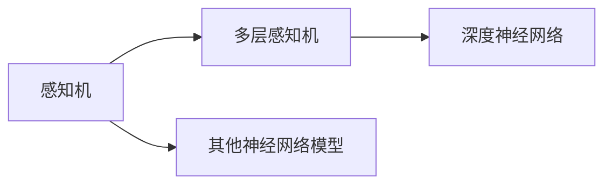

##### 1.2 神经网络的生物学基础

###### 1.2.1 神经元的结构与功能

**介绍**：神经元是神经网络的基本组成单元，它包括细胞体、树突、轴突等部分。神经元通过树突接收其他神经元的信号，通过轴突传递信号到其他神经元或目标细胞。

**图像**：神经元示意图。

```latex
\begin{equation}
\text{神经元示意图}
\end{equation}
```

###### 1.2.2 神经系统的信息处理过程

**介绍**：神经系统通过神经元之间的连接和相互作用来处理信息，包括感知、记忆、决策等过程。神经网络模型试图模拟这一过程，从而实现对复杂任务的自动化处理。

**Mermaid 流程图**：神经系统的信息处理流程。

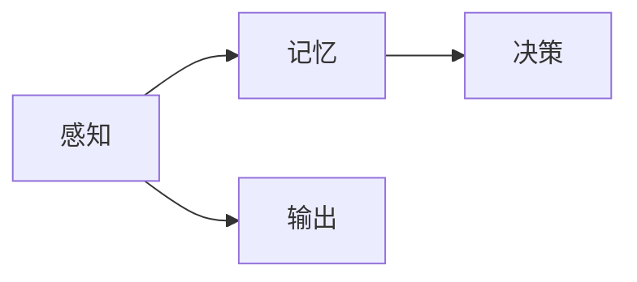

###### 1.2.3 人工神经网络与生物神经网络的联系

**讨论**：人工神经网络与生物神经网络在结构、功能和学习机制上存在许多相似之处，但也有一些显著差异。人工神经网络试图从生物神经网络中汲取灵感，以提高其性能和适应性。

**表格**：人工神经网络与生物神经网络的对比。

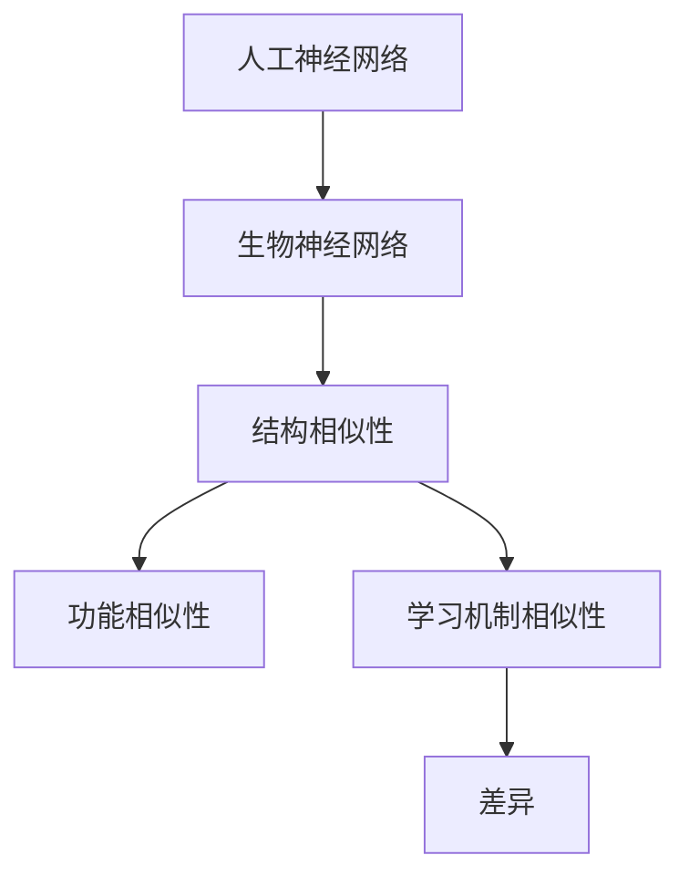

##### 1.3 神经网络的数学基础

###### 1.3.1 微积分基础

**讲解**：微积分是神经网络中不可或缺的数学工具，用于描述神经网络中的变化和优化过程。微积分的基本概念包括导数、积分、微分方程等。

**LaTeX 公式**：导数和积分的公式示例。

```latex
\begin{equation}
f'(x) = \lim_{h \to 0} \frac{f(x+h) - f(x)}{h}
\end{equation}

\begin{equation}
\int f(x) \, dx
\end{equation}
```

###### 1.3.2 概率论与信息论基础

**讲解**：概率论和信息论是神经网络中重要的数学基础，用于描述数据的不确定性、信息的度量等。概率论的基本概念包括概率分布、随机变量等；信息论的基本概念包括熵、信息增益等。

**LaTeX 公式**：概率分布和熵的公式示例。

```latex
\begin{equation}
P(X=x) = \frac{1}{N} \sum_{i=1}^{N} p(x_i)
\end{equation}

\begin{equation}
H(X) = -\sum_{i=1}^{N} p(x_i) \log_2 p(x_i)
\end{equation}
```

###### 1.3.3 线性代数基础

**讲解**：线性代数是神经网络中用于描述矩阵和向量运算的基础，包括矩阵的乘法、求导、矩阵分解等。

**LaTeX 公式**：矩阵和向量的公式示例。

```latex
\begin{equation}
A \cdot B = C
\end{equation}

\begin{equation}
\frac{\partial f}{\partial x} = \frac{\partial}{\partial x} (Ax + b)
\end{equation}

\begin{equation}
A = LU
\end{equation}
```

###### 1.3.4 深度学习基础

**讲解**：深度学习是神经网络的一种重要应用，通过构建多层的神经网络模型，实现对复杂数据的自动学习和特征提取。深度学习的基本概念包括神经网络架构、学习算法等。

**LaTeX 公式**：反向传播算法的公式示例。

```latex
\begin{equation}
\delta_h = \frac{\partial L}{\partial z_h} \cdot \sigma'(z_h)
\end{equation}

\begin{equation}
\frac{\partial L}{\partial w_h} = \delta_h \cdot a_{h-1}^T
\end{equation}

\begin{equation}
\frac{\partial L}{\partial b_h} = \delta_h
\end{equation}
```

##### 1.4 神经网络的应用场景

###### 1.4.1 人工智能领域的应用

**介绍**：神经网络在人工智能领域有着广泛的应用，包括图像识别、自然语言处理、语音识别等。神经网络模型能够自动学习和提取数据中的特征，实现对复杂任务的自动化处理。

**案例**：一些具体的AI应用案例，如图像识别中的MNIST数据集、自然语言处理中的文本分类等。

###### 1.4.2 生物医学领域的应用

**介绍**：神经网络在生物医学领域也有着重要的应用，包括疾病诊断、药物设计、基因分析等。神经网络模型能够处理大量的生物医学数据，提供有效的预测和诊断。

**案例**：一些具体的生物医学应用案例，如疾病诊断中的肿瘤检测、药物设计中的分子对接等。

###### 1.4.3 工业自动化领域的应用

**介绍**：神经网络在工业自动化领域也有着广泛的应用，包括机器人控制、故障诊断、质量检测等。神经网络模型能够对工业过程中的数据进行实时分析和预测，提高生产效率和产品质量。

**案例**：一些具体的工业自动化应用案例，如机器人控制中的路径规划、故障诊断中的传感器数据解析等。

###### 1.4.4 其他领域应用探讨

**讨论**：神经网络在其他领域的潜在应用，如金融、教育、交通等。探讨神经网络在这些领域的应用前景和挑战。

**趋势**：神经网络在各领域应用的发展趋势，以及未来可能的发展方向。

---

### 第二部分：神经网络基本结构

神经网络的基本结构决定了其性能和应用范围。本部分将介绍神经网络的基本结构，包括单层感知机、多层感知机、神经元激活函数等。

#### 第2章：神经网络的基本结构

##### 2.1 单层感知机

###### 2.1.1 单层感知机的定义与原理

**定义**：单层感知机是神经网络中最简单的形式，它由一个输入层和一个输出层组成，没有隐藏层。

**原理**：单层感知机通过输入层接收输入数据，经过线性变换和激活函数后，输出预测结果。

**Mermaid 流程图**：单层感知机的工作流程。

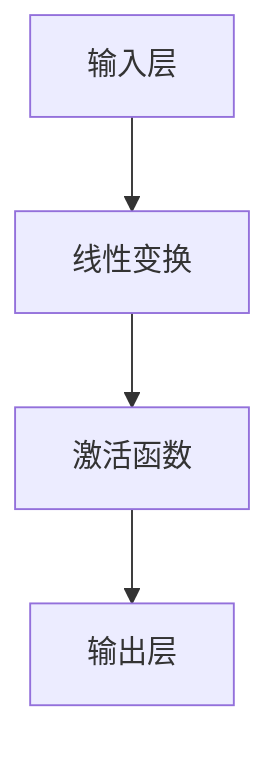

###### 2.1.2 单层感知机的学习算法

**算法**：单层感知机的学习算法主要包括输入数据的预处理、权重的初始化、权重的更新等。

**伪代码**：单层感知机的学习算法伪代码。

```python
# 初始化权重和偏置
weights = 初始化权重()
bias = 初始化偏置()

# 输入数据预处理
inputs = 预处理输入数据()

# 权重更新
for epoch in range(epochs):
    for input in inputs:
        # 计算输出
        output = (weights * input) + bias
        
        # 更新权重和偏置
        weights = weights - learning_rate * (output - target)
        bias = bias - learning_rate * (output - target)
```

###### 2.1.3 单层感知机的局限性

**局限性**：单层感知机在处理非线性问题时存在很大局限性，因为它只能进行线性变换。因此，在实际应用中，单层感知机很少单独使用，通常会与其他神经网络结构结合使用。

**比较**：与多层感知机相比，单层感知机在处理复杂任务时性能较差。

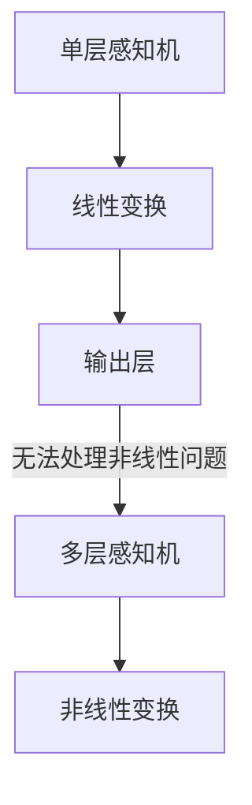

##### 2.2 多层感知机

###### 2.2.1 多层感知机的结构

**结构**：多层感知机（MLP）包括输入层、一个或多个隐藏层和输出层。隐藏层中的神经元通过非线性激活函数进行变换，从而可以处理非线性问题。

**Mermaid 流程图**：多层感知机的结构图。

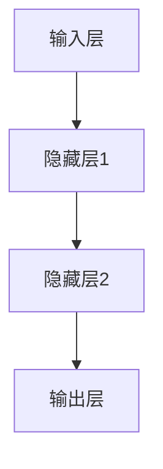

###### 2.2.2 多层感知机的学习算法

**算法**：多层感知机的学习算法主要包括前向传播、反向传播和权重更新等。

**伪代码**：多层感知机的学习算法伪代码。

```python
# 初始化权重和偏置
weights = 初始化权重()
bias = 初始化偏置()

# 输入数据预处理
inputs = 预处理输入数据()

# 前向传播
for epoch in range(epochs):
    for input in inputs:
        # 计算隐藏层输出
        hidden_outputs = 前向传播(inputs, weights, bias)
        
        # 计算输出层输出
        output = 前向传播(hidden_outputs, weights, bias)
        
        # 反向传播
        deltas = 反向传播(output, target)
        
        # 更新权重和偏置
        weights = weights - learning_rate * deltas
        bias = bias - learning_rate * deltas
```

###### 2.2.3 多层感知机的优缺点

**优点**：多层感知机能够处理非线性问题，适合处理复杂的任务。

**缺点**：多层感知机容易过拟合，且训练过程可能存在梯度消失或梯度爆炸问题。

**比较**：与单层感知机相比，多层感知机在处理复杂任务时性能更好。

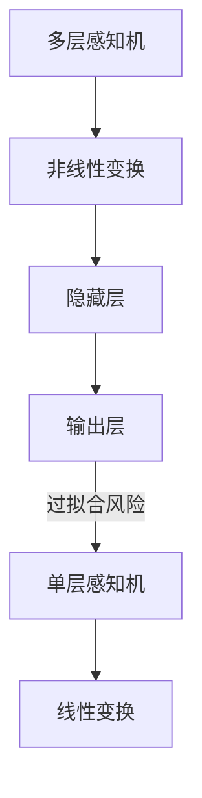

##### 2.3 神经元的激活函数

###### 2.3.1 激活函数的作用

**作用**：激活函数是神经网络中用于引入非线性变换的函数，它可以将线性模型转换为非线性模型，从而提高模型的性能。

**Mermaid 流程图**：激活函数在神经网络中的角色。


###### 2.3.2 常见的激活函数

**介绍**：常见的激活函数包括Sigmoid、ReLU、Tanh等。

**图像**：不同激活函数的曲线图。

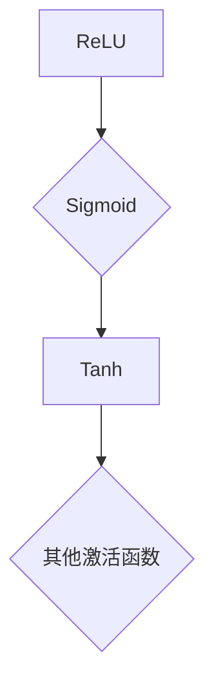

**曲线图**：激活函数的曲线图。

```mermaid
graph TD
A[0][curveType=arc]
A --> B[1][curveType=arc]
A --> C[-1][curveType=arc]
```

###### 2.3.3 激活函数的选择与优化

**选择**：激活函数的选择应根据任务的特点和模型的结构进行。

**优化**：激活函数的优化可以通过调整参数或更换激活函数来实现。

**比较**：不同激活函数的比较。


---

### 第三部分：神经网络学习算法

神经网络学习算法是神经网络的核心，用于训练模型并优化性能。本部分将介绍神经网络的基本学习算法，包括反向传播算法、随机梯度下降算法等。

#### 第3章：神经网络学习算法

##### 3.1 反向传播算法

###### 3.1.1 反向传播算法的基本原理

**原理**：反向传播算法是一种用于训练神经网络的梯度下降方法，通过计算网络输出与目标之间的误差，并反向传播误差以更新网络权重。

**Mermaid 流程图**：反向传播算法的基本流程。

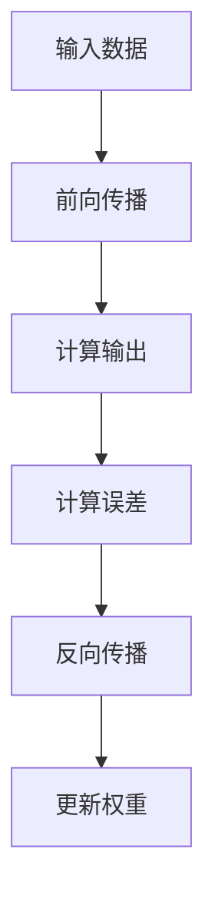

###### 3.1.2 反向传播算法的推导

**推导**：反向传播算法的推导涉及微积分和链式法则，用于计算网络中每个权重的梯度。

**LaTeX 公式**：反向传播算法的公式推导。

```latex
\begin{equation}
\delta_h = \frac{\partial L}{\partial z_h} \cdot \sigma'(z_h)
\end{equation}

\begin{equation}
\frac{\partial L}{\partial w_h} = \delta_h \cdot a_{h-1}^T
\end{equation}

\begin{equation}
\frac{\partial L}{\partial b_h} = \delta_h
\end{equation}
```

###### 3.1.3 反向传播算法的优化

**优化**：反向传播算法的优化可以通过各种技巧来实现，如动量法、自适应学习率等。

**伪代码**：反向传播算法的优化伪代码。

```python
# 初始化权重和偏置
weights = 初始化权重()
bias = 初始化偏置()

# 记录梯度
gradients = 初始化梯度()

# 输入数据预处理
inputs = 预处理输入数据()

# 前向传播
for epoch in range(epochs):
    for input in inputs:
        # 计算隐藏层输出
        hidden_outputs = 前向传播(inputs, weights, bias)
        
        # 计算输出层输出
        output = 前向传播(hidden_outputs, weights, bias)
        
        # 计算误差
        error = 计算误差(output, target)
        
        # 计算梯度
        gradients = 计算梯度(error, output, hidden_outputs, inputs)
        
        # 更新权重和偏置
        weights = weights - learning_rate * gradients
        bias = bias - learning_rate * gradients
```

##### 3.2 随机梯度下降算法

###### 3.2.1 随机梯度下降算法的基本原理

**原理**：随机梯度下降算法是一种用于训练神经网络的简单梯度下降方法，每次迭代使用一个随机样本来计算梯度。

**Mermaid 流程图**：随机梯度下降算法的基本流程。

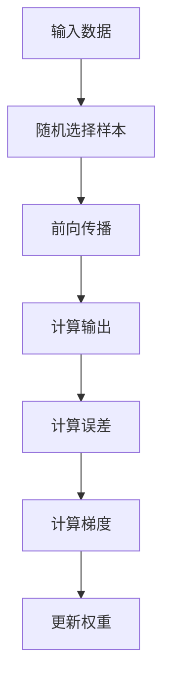

###### 3.2.2 随机梯度下降算法的推导

**推导**：随机梯度下降算法的推导与反向传播算法类似，但每次迭代使用单个样本的梯度。

**LaTeX 公式**：随机梯度下降算法的公式推导。

```latex
\begin{equation}
\delta_h = \frac{1}{m} \sum_{i=1}^{m} \frac{\partial L}{\partial z_h}
\end{equation}

\begin{equation}
\frac{\partial L}{\partial w_h} = \delta_h \cdot a_{h-1}^T
\end{equation}

\begin{equation}
\frac{\partial L}{\partial b_h} = \delta_h
\end{equation}
```

###### 3.2.3 随机梯度下降算法的优化

**优化**：随机梯度下降算法的优化可以通过各种技巧来实现，如批量归一化、动量法等。

**伪代码**：随机梯度下降算法的优化伪代码。

```python
# 初始化权重和偏置
weights = 初始化权重()
bias = 初始化偏置()

# 记录梯度
gradients = 初始化梯度()

# 输入数据预处理
inputs = 预处理输入数据()

# 前向传播
for epoch in range(epochs):
    for input in inputs:
        # 计算隐藏层输出
        hidden_outputs = 前向传播(inputs, weights, bias)
        
        # 计算输出层输出
        output = 前向传播(hidden_outputs, weights, bias)
        
        # 计算误差
        error = 计算误差(output, target)
        
        # 计算梯度
        gradients = 计算梯度(error, output, hidden_outputs, inputs)
        
        # 更新权重和偏置
        weights = weights - learning_rate * gradients
        bias = bias - learning_rate * gradients
```

---

### 第四部分：神经网络优化

神经网络优化是提高神经网络性能和减少过拟合的关键。本部分将介绍神经网络优化的技术，包括正则化技术、深度神经网络优化等。

#### 第4章：神经网络优化

##### 4.1 正则化技术

###### 4.1.1 过拟合与欠拟合

**介绍**：过拟合和欠拟合是神经网络训练过程中常见的问题，过拟合表示模型在训练数据上表现良好，但在新的数据上表现较差；欠拟合表示模型在训练数据和新数据上都表现较差。

**图像**：过拟合与欠拟合的示意图。

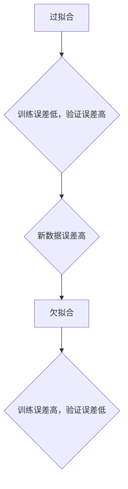

###### 4.1.2 正则化的原理

**原理**：正则化是一种用于减少过拟合的技术，它通过在损失函数中添加正则化项，对模型进行惩罚，从而减少模型的复杂度。

**Mermaid 流程图**：正则化的工作原理。

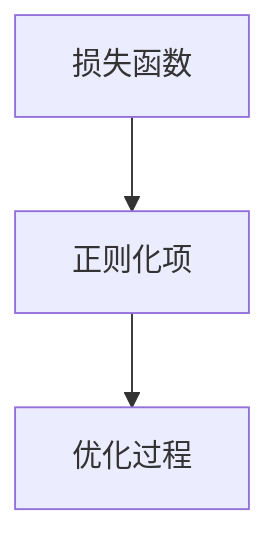

###### 4.1.3 常见的正则化方法

**介绍**：常见的正则化方法包括L1正则化、L2正则化等。

**表格**：常见正则化方法的比较。

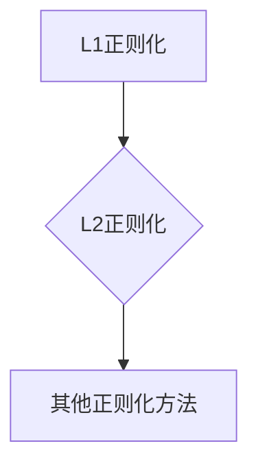

**表格**：正则化方法的比较。

```mermaid
graph TD
A[方法] --> B{L1正则化}
B --> C[作用]
C --> D{优缺点}
D --> E{适用场景}
F[L2正则化] --> G[H}作用]
G --> H[优缺点]
H --> I[适用场景]
```

**表格**：

| 方法   | 作用                           | 优缺点                                           | 适用场景                   |
| ------ | ------------------------------ | ------------------------------------------------ | -------------------------- |
| L1正则化 | 引入稀疏性，减少模型参数       | 可能引入稀疏性，对噪声敏感                         | 小数据集，特征选择         |
| L2正则化 | 减少模型复杂度，平滑梯度       | 可能增加计算成本，对噪声不敏感                     | 大数据集，平滑训练过程     |

##### 4.2 深度神经网络优化

###### 4.2.1 深度神经网络的特点

**介绍**：深度神经网络（DNN）具有多层结构，能够处理复杂的非线性任务。

**表格**：深度神经网络与浅层神经网络的对比。

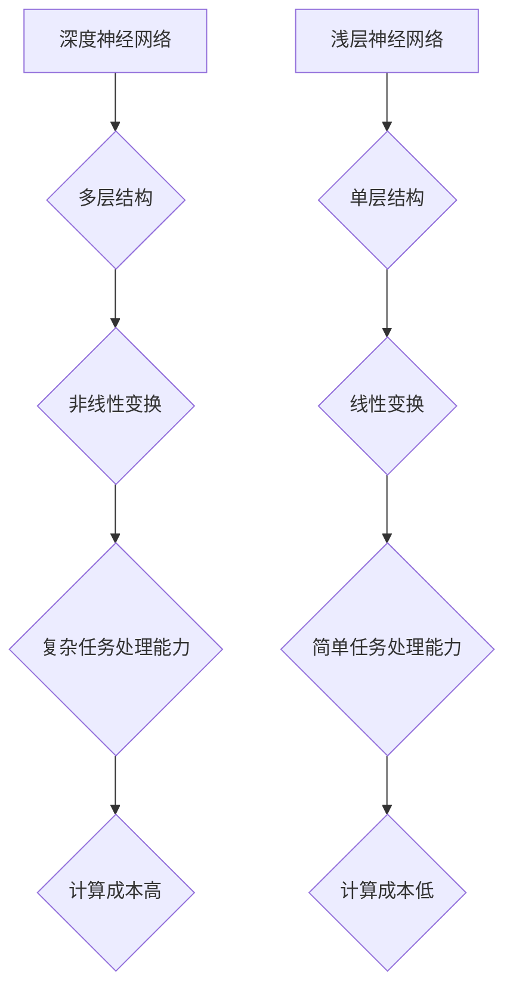

**表格**：

| 特点     | 深度神经网络 | 浅层神经网络 |
| -------- | ------------ | ------------ |
| 层数     | 多层         | 单层         |
| 结构     | 复杂         | 简单         |
| 计算成本 | 高           | 低           |
| 任务处理 | 复杂任务     | 简单任务     |

###### 4.2.2 深度神经网络优化策略

**介绍**：深度神经网络的优化策略包括批量归一化、dropout等。

**Mermaid 流程图**：深度神经网络优化策略的流程。

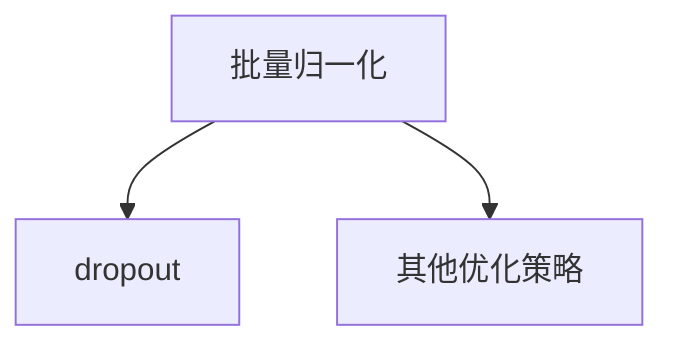

**表格**：深度神经网络优化策略的比较。

```mermaid
graph TD
A[批量归一化] --> B{作用}
B --> C{优点}
C --> D{缺点}
E[dropout] --> F{作用}
F --> G{优点}
G --> H{缺点}
I[J[其他优化策略]] --> K{作用}
K --> L{优点}
L --> M{缺点}
```

**表格**：

| 策略     | 作用                           | 优点                                     | 缺点                                       |
| -------- | ------------------------------ | ---------------------------------------- | ------------------------------------------ |
| 批量归一化 | 减少梯度消失和梯度爆炸问题     | 提高训练效率，降低过拟合风险             | 可能增加计算成本，对数据分布敏感           |
| Dropout  | 减少过拟合，增加模型泛化能力   | 提高模型鲁棒性，降低过拟合风险           | 可能降低模型性能，增加训练时间             |
| 动量法   | 加速梯度下降，减少局部最小值问题 | 提高收敛速度，减少局部最小值问题           | 可能增加训练时间，对噪声敏感               |
| RMSprop  | 加速梯度下降，自适应学习率     | 提高收敛速度，减少局部最小值问题           | 可能增加训练时间，对噪声敏感               |
| Adam     | 自适应学习率，结合动量法       | 提高收敛速度，减少局部最小值问题           | 可能增加训练时间，对噪声敏感               |

###### 4.2.3 深度神经网络优化算法

**介绍**：深度神经网络的优化算法包括Adam、RMSprop等。

**表格**：常见深度神经网络优化算法的比较。

```mermaid
graph TD
A[Adam] --> B{优点}
B --> C{缺点}
D[RMSprop] --> E{优点}
E --> F{缺点}
G[其他优化算法] --> H{优点}
H --> I{缺点}
```

**表格**：

| 算法     | 优点                                     | 缺点                                       |
| -------- | ---------------------------------------- | ------------------------------------------ |
| Adam     | 自适应学习率，结合动量法               | 可能增加训练时间，对噪声敏感               |
| RMSprop  | 自适应学习率，加速梯度下降             | 可能增加训练时间，对噪声敏感               |
| AdaGrad  | 自适应学习率，对稀疏梯度敏感           | 可能增加训练时间，对稀疏数据不敏感         |
| AdaDelta | 自适应学习率，利用差分来更新权重       | 可能增加训练时间，对稀疏数据不敏感         |
| SGDM     | 简单的梯度下降方法，适用于小数据集     | 收敛速度较慢，对噪声敏感                   |

##### 4.3 神经网络训练技巧

###### 4.3.1 数据预处理

**介绍**：数据预处理是神经网络训练的重要步骤，包括归一化、标准化等。

**伪代码**：数据预处理的伪代码。

```python
# 归一化
inputs = 归一化(inputs)

# 标准化
inputs = 标准化(inputs)
```

###### 4.3.2 批处理与并行计算

**介绍**：批处理和并行计算是提高神经网络训练效率的重要方法。

**Mermaid 流程图**：批处理与并行计算的流程。

```mermaid
graph TD
A[批处理] --> B[并行计算]
```

**表格**：批处理与并行计算的比较。

```mermaid
graph TD
A[批处理] --> B{优点}
B --> C{缺点}
D[并行计算] --> E{优点}
E --> F{缺点}
```

**表格**：

| 方法     | 优点                                     | 缺点                                       |
| -------- | ---------------------------------------- | ------------------------------------------ |
| 批处理   | 提高计算效率，减少内存占用               | 可能降低梯度稳定性                         |
| 并行计算 | 提高计算速度，缩短训练时间               | 可能增加计算成本，降低并行度               |

###### 4.3.3 预训练与微调

**介绍**：预训练与微调是利用预训练模型在新数据上进行训练的方法。

**伪代码**：预训练与微调的伪代码。

```python
# 预训练
pretrained_model = 预训练模型()

# 微调
model = 微调(pretrained_model, new_data)
```

---

### 第五部分：卷积神经网络

卷积神经网络（CNN）是神经网络的一种特殊形式，广泛应用于图像处理领域。本部分将介绍卷积神经网络的基本概念、原理和应用。

#### 第5章：卷积神经网络

##### 5.1 卷积神经网络的基本概念

###### 5.1.1 卷积神经网络的发展历程

**介绍**：卷积神经网络起源于20世纪80年代，最初用于图像识别任务。随着深度学习的兴起，卷积神经网络逐渐成为计算机视觉领域的重要工具。

**Mermaid 流程图**：卷积神经网络的发展历程。

```mermaid
graph TD
A[1980年代] --> B[图像识别]
B --> C[深度学习兴起]
C --> D[卷积神经网络]
```

###### 5.1.2 卷积神经网络的结构

**结构**：卷积神经网络包括卷积层、池化层、全连接层等。卷积层用于提取图像特征，池化层用于降低数据维度，全连接层用于分类。

**Mermaid 流程图**：卷积神经网络的结构图。

```mermaid
graph TD
A[输入层] --> B[卷积层]
B --> C[池化层]
C --> D[全连接层]
D --> E[输出层]
```

###### 5.1.3 卷积神经网络的工作原理

**原理**：卷积神经网络通过卷积操作和池化操作来提取图像特征。卷积操作用于从输入数据中提取局部特征，池化操作用于降低数据维度，提高计算效率。

**Mermaid 流程图**：卷积神经网络的工作流程。

```mermaid
graph TD
A[输入数据] --> B[卷积操作]
B --> C[池化操作]
C --> D[全连接层]
D --> E[输出结果]
```

##### 5.2 卷积神经网络的原理

###### 5.2.1 卷积操作

**介绍**：卷积操作是卷积神经网络的核心，用于从输入数据中提取特征。

**LaTeX 公式**：卷积操作的公式。

```latex
\begin{equation}
f(x, y) = \sum_{i=1}^{m} \sum_{j=1}^{n} w_{ij} f(x-i, y-j)
\end{equation}
```

**伪代码**：卷积操作的伪代码。

```python
# 卷积操作
for i in range(width):
    for j in range(height):
        output[i][j] = 0
        for k in range(filter_size):
            for l in range(filter_size):
                output[i][j] += weights[k][l] * input[i-k][j-l]
```

###### 5.2.2 池化操作

**介绍**：池化操作用于降低数据维度，提高计算效率。

**LaTeX 公式**：池化操作的公式。

```latex
\begin{equation}
p(x, y) = \max\left(\sum_{i=1}^{m} \sum_{j=1}^{n} f(x-i, y-j)\right)
\end{equation}
```

**伪代码**：池化操作的伪代码。

```python
# 池化操作
for i in range(width // pool_size):
    for j in range(height // pool_size):
        output[i][j] = max(
            input[i * pool_size : (i + 1) * pool_size],
            input[j * pool_size : (j + 1) * pool_size]
        )
```

###### 5.2.3 激活函数的选择

**介绍**：激活函数是卷积神经网络中用于引入非线性变换的函数。

**LaTeX 公式**：激活函数的公式。

```latex
\begin{equation}
\sigma(z) = \frac{1}{1 + e^{-z}}
\end{equation}

\begin{equation}
\sigma(z) = \max(0, z)
\end{equation}

\begin{equation}
\sigma(z) = \tanh(z)
\end{equation}
```

**伪代码**：激活函数的伪代码。

```python
# ReLU激活函数
def relu(z):
    return max(0, z)

# Sigmoid激活函数
def sigmoid(z):
    return 1 / (1 + exp(-z))

# Tanh激活函数
def tanh(z):
    return (exp(z) - exp(-z)) / (exp(z) + exp(-z))
```

##### 5.3 卷积神经网络的应用

###### 5.3.1 图像识别

**介绍**：图像识别是卷积神经网络的主要应用之一，包括人脸识别、物体识别等。

**案例**：使用卷积神经网络实现人脸识别。

```python
# 人脸识别
import tensorflow as tf
from tensorflow.keras.models import Sequential
from tensorflow.keras.layers import Conv2D, MaxPooling2D, Flatten, Dense

model = Sequential()
model.add(Conv2D(32, (3, 3), activation='relu', input_shape=(64, 64, 3)))
model.add(MaxPooling2D((2, 2)))
model.add(Conv2D(64, (3, 3), activation='relu'))
model.add(MaxPooling2D((2, 2)))
model.add(Flatten())
model.add(Dense(128, activation='relu'))
model.add(Dense(1, activation='sigmoid'))

model.compile(optimizer='adam', loss='binary_crossentropy', metrics=['accuracy'])
model.fit(x_train, y_train, epochs=10, batch_size=32)
```

###### 5.3.2 自然语言处理

**介绍**：自然语言处理是卷积神经网络的重要应用之一，包括文本分类、情感分析等。

**案例**：使用卷积神经网络实现文本分类。

```python
# 文本分类
import tensorflow as tf
from tensorflow.keras.models import Sequential
from tensorflow.keras.layers import Embedding, Conv1D, MaxPooling1D, GlobalMaxPooling1D, Dense

model = Sequential()
model.add(Embedding(vocab_size, embedding_dim))
model.add(Conv1D(128, 5, activation='relu'))
model.add(MaxPooling1D(5))
model.add(Conv1D(128, 5, activation='relu'))
model.add(GlobalMaxPooling1D())
model.add(Dense(1, activation='sigmoid'))

model.compile(optimizer='adam', loss='binary_crossentropy', metrics=['accuracy'])
model.fit(x_train, y_train, epochs=10, batch_size=32)
```

###### 5.3.3 其他应用领域

**讨论**：卷积神经网络在其他领域的应用，如生物信息学、医学影像分析等。

**趋势**：卷积神经网络在各个领域的发展趋势。

---

### 第六部分：循环神经网络

循环神经网络（RNN）是神经网络的一种特殊形式，适用于处理序列数据。本部分将介绍循环神经网络的基本概念、原理和应用。

#### 第6章：循环神经网络

##### 6.1 循环神经网络的基本概念

###### 6.1.1 循环神经网络的发展历程

**介绍**：循环神经网络起源于20世纪80年代，最初用于语音识别和自然语言处理任务。随着深度学习的兴起，循环神经网络逐渐成为序列数据处理的重要工具。

**Mermaid 流程图**：循环神经网络的发展历程。

```mermaid
graph TD
A[1980年代] --> B[语音识别]
B --> C[自然语言处理]
C --> D[循环神经网络]
```

###### 6.1.2 循环神经网络的结构

**结构**：循环神经网络包括输入层、隐藏层、输出层等。隐藏层中的神经元通过循环连接形成循环结构，用于处理序列数据。

**Mermaid 流程图**：循环神经网络的结构图。

```mermaid
graph TD
A[输入层] --> B[隐藏层]
B --> C[输出层]
```

###### 6.1.3 循环神经网络的工作原理

**原理**：循环神经网络通过循环连接和递归操作来处理序列数据。在每一步，隐藏层的输出作为下一时刻的输入，形成递归关系。

**Mermaid 流程图**：循环神经网络的工作流程。

```mermaid
graph TD
A[输入数据] --> B[隐藏层递归操作]
B --> C[输出层计算]
```

##### 6.2 循环神经网络的原理

###### 6.2.1 隐藏状态的计算

**介绍**：隐藏状态是循环神经网络的核心，用于存储序列数据的信息。

**LaTeX 公式**：隐藏状态的计算公式。

```latex
\begin{equation}
h_t = \sigma(W_h h_{t-1} + W_x x_t + b_h)
\end{equation}
```

**伪代码**：隐藏状态的计算伪代码。

```python
# 隐藏状态的计算
def hidden_state(h_t, x_t, W_h, W_x, b_h):
    return sigmoid(W_h * h_t + W_x * x_t + b_h)
```

###### 6.2.2 输出层的计算

**介绍**：输出层用于生成最终的输出结果，可以是分类结果、情感分析结果等。

**LaTeX 公式**：输出层的计算公式。

```latex
\begin{equation}
y_t = \sigma(W_y h_t + b_y)
\end{equation}
```

**伪代码**：输出层的计算伪代码。

```python
# 输出层的计算
def output_layer(y_t, h_t, W_y, b_y):
    return sigmoid(W_y * h_t + b_y)
```

###### 6.2.3 时间步的计算

**介绍**：时间步是循环神经网络处理序列数据的基本单位，每一步处理一个时间步的数据。

**LaTeX 公式**：时间步的计算公式。

```latex
\begin{equation}
h_t = \sigma(W_h h_{t-1} + W_x x_t + b_h)
\end{equation}

\begin{equation}
y_t = \sigma(W_y h_t + b_y)
\end{equation}
```

**伪代码**：时间步的计算伪代码。

```python
# 时间步的计算
def time_step(h_t, x_t, W_h, W_x, b_h, W_y, b_y):
    h_t = hidden_state(h_t, x_t, W_h, W_x, b_h)
    y_t = output_layer(y_t, h_t, W_y, b_y)
    return h_t, y_t
```

##### 6.3 循环神经网络的应用

###### 6.3.1 序列建模

**介绍**：序列建模是循环神经网络的重要应用之一，包括时间序列预测、文本生成等。

**案例**：使用循环神经网络实现时间序列预测。

```python
# 时间序列预测
import numpy as np
from tensorflow.keras.models import Sequential
from tensorflow.keras.layers import LSTM, Dense

model = Sequential()
model.add(LSTM(50, activation='relu', input_shape=(timesteps, features)))
model.add(Dense(1))
model.compile(optimizer='adam', loss='mse')
model.fit(X, y, epochs=200, verbose=0)
```

###### 6.3.2 语言模型

**介绍**：语言模型是循环神经网络在自然语言处理中的重要应用，用于生成自然语言文本。

**案例**：使用循环神经网络实现文本生成。

```python
# 文本生成
import tensorflow as tf
from tensorflow.keras.models import Sequential
from tensorflow.keras.layers import LSTM, Dense

model = Sequential()
model.add(LSTM(128, activation='relu', input_shape=(timesteps, features)))
model.add(Dense(vocab_size, activation='softmax'))
model.compile(optimizer='adam', loss='categorical_crossentropy', metrics=['accuracy'])
model.fit(X, y, epochs=10, verbose=1)
```

###### 6.3.3 语音识别

**介绍**：语音识别是循环神经网络在语音处理中的重要应用，用于将语音信号转换为文本。

**案例**：使用循环神经网络实现语音识别。

```python
# 语音识别
import tensorflow as tf
from tensorflow.keras.models import Sequential
from tensorflow.keras.layers import LSTM, Dense, Bidirectional

model = Sequential()
model.add(Bidirectional(LSTM(128, activation='relu', input_shape=(timesteps, features))))
model.add(Dense(vocab_size, activation='softmax'))
model.compile(optimizer='adam', loss='categorical_crossentropy', metrics=['accuracy'])
model.fit(X, y, epochs=10, verbose=1)
```

---

### 第七部分：长短时记忆网络

长短时记忆网络（LSTM）是循环神经网络的一种特殊形式，适用于处理长序列数据。本部分将介绍长短时记忆网络的基本概念、原理和应用。

#### 第7章：长短时记忆网络

##### 7.1 长短时记忆网络的基本概念

###### 7.1.1 长短时记忆网络的发展历程

**介绍**：长短时记忆网络起源于20世纪90年代，由Hochreiter和Schmidhuber提出。长短时记忆网络解决了循环神经网络在处理长序列数据时的长期依赖问题。

**Mermaid 流程图**：长短时记忆网络的发展历程。

```mermaid
graph TD
A[1990年代] --> B[长短时记忆网络]
```

###### 7.1.2 长短时记忆网络的结构

**结构**：长短时记忆网络包括输入门、遗忘门、输出门等。这些门控单元用于控制信息的传递和遗忘，从而解决长期依赖问题。

**Mermaid 流程图**：长短时记忆网络的结构图。

```mermaid
graph TD
A[输入门] --> B[遗忘门]
B --> C[输出门]
```

###### 7.1.3 长短时记忆网络的工作原理

**原理**：长短时记忆网络通过门控单元来控制信息的传递和遗忘。输入门控制信息的输入，遗忘门控制信息的遗忘，输出门控制信息的输出。

**Mermaid 流程图**：长短时记忆网络的工作流程。

```mermaid
graph TD
A[输入数据] --> B[输入门]
B --> C[遗忘门]
C --> D[输出门]
```

##### 7.2 长短时记忆网络的原理

###### 7.2.1 遗忘门与输入门的计算

**介绍**：遗忘门和输入门是长短时记忆网络中的关键单元，用于控制信息的传递和遗忘。

**LaTeX 公式**：遗忘门和输入门的计算公式。

```latex
\begin{equation}
i_t = \sigma(W_{ix} x_t + W_{ih} h_{t-1} + b_i)
\end{equation}

\begin{equation}
f_t = \sigma(W_{fx} x_t + W_{fh} h_{t-1} + b_f)
\end{equation}
```

**伪代码**：遗忘门和输入门的计算伪代码。

```python
# 遗忘门的计算
def forget_gate(f_t, x_t, h_t, W_fx, W_fh, b_f):
    return sigmoid(W_fx * x_t + W_fh * h_t + b_f)

# 输入门的计算
def input_gate(i_t, x_t, h_t, W_ix, W_ih, b_i):
    return sigmoid(W_ix * x_t + W_ih * h_t + b_i)
```

###### 7.2.2 更新门的计算

**介绍**：更新门是长短时记忆网络中的关键单元，用于更新隐藏状态。

**LaTeX 公式**：更新门的计算公式。

```latex
\begin{equation}
\bar{c}_t = \tanh(W_{cx} c_{t-1} + W_{ic} i_t x_t + b_c)
\end{equation}
```

**伪代码**：更新门的计算伪代码。

```python
# 更新门的计算
def update_gate(c_t, h_t, i_t, x_t, W_cx, W_ic, b_c):
    return tanh(W_cx * c_t + W_ic * i_t * x_t + b_c)
```

###### 7.2.3 输出门的计算

**介绍**：输出门是长短时记忆网络中的关键单元，用于生成输出。

**LaTeX 公式**：输出门的计算公式。

```latex
\begin{equation}
o_t = \sigma(W_{ox} x_t + W_{oh} h_{t-1} + b_o)
\end{equation}

\begin{equation}
h_t = o_t \odot \tanh(c_t)
\end{equation}
```

**伪代码**：输出门的计算伪代码。

```python
# 输出门的计算
def output_gate(o_t, x_t, h_t, W_ox, W_oh, b_o):
    return sigmoid(W_ox * x_t + W_oh * h_t + b_o)

# 隐藏状态的计算
def hidden_state(h_t, c_t, o_t):
    return o_t * tanh(c_t)
```

##### 7.3 长短时记忆网络的应用

###### 7.3.1 语音识别

**介绍**：语音识别是长短时记忆网络的重要应用之一，用于将语音信号转换为文本。

**案例**：使用长短时记忆网络实现语音识别。

```python
# 语音识别
import tensorflow as tf
from tensorflow.keras.models import Sequential
from tensorflow.keras.layers import LSTM, Dense, Bidirectional

model = Sequential()
model.add(Bidirectional(LSTM(128, activation='relu', input_shape=(timesteps, features))))
model.add(Dense(vocab_size, activation='softmax'))
model.compile(optimizer='adam', loss='categorical_crossentropy', metrics=['accuracy'])
model.fit(X, y, epochs=10, verbose=1)
```

###### 7.3.2 自然语言处理

**介绍**：自然语言处理是长短时记忆网络在人工智能中的重要应用，包括文本分类、情感分析等。

**案例**：使用长短时记忆网络实现文本分类。

```python
# 文本分类
import tensorflow as tf
from tensorflow.keras.models import Sequential
from tensorflow.keras.layers import LSTM, Dense, Embedding, GlobalMaxPooling1D

model = Sequential()
model.add(Embedding(vocab_size, embedding_dim))
model.add(LSTM(128, activation='relu'))
model.add(GlobalMaxPooling1D())
model.add(Dense(1, activation='sigmoid'))

model.compile(optimizer='adam', loss='binary_crossentropy', metrics=['accuracy'])
model.fit(X, y, epochs=10, verbose=1)
```

###### 7.3.3 时间序列预测

**介绍**：时间序列预测是长短时记忆网络在金融、气象等领域中的重要应用，用于预测未来趋势。

**案例**：使用长短时记忆网络实现时间序列预测。

```python
# 时间序列预测
import numpy as np
from tensorflow.keras.models import Sequential
from tensorflow.keras.layers import LSTM, Dense

model = Sequential()
model.add(LSTM(50, activation='relu', input_shape=(timesteps, features)))
model.add(Dense(1))
model.compile(optimizer='adam', loss='mse')
model.fit(X, y, epochs=200, verbose=0)
```

---

### 第八部分：深度神经网络与强化学习

深度神经网络（DNN）与强化学习（RL）的结合，为解决复杂决策问题提供了新的思路。本部分将介绍深度神经网络与强化学习的基本概念、原理和应用。

#### 第8章：深度神经网络与强化学习

##### 8.1 深度神经网络在强化学习中的应用

###### 8.1.1 深度强化学习的基本概念

**介绍**：深度强化学习是结合深度神经网络与强化学习的方法，用于解决复杂决策问题。

**Mermaid 流程图**：深度强化学习的基本流程。

```mermaid
graph TD
A[环境] --> B[动作]
B --> C[状态]
C --> D[奖励]
D --> E[模型更新]
E --> F[新状态]
```

###### 8.1.2 深度强化学习的主要方法

**介绍**：深度强化学习的主要方法包括深度Q网络（DQN）、策略梯度方法、深度策略搜索（DPS）等。

**表格**：深度强化学习方法的比较。

```mermaid
graph TD
A[DQN] --> B[策略梯度方法]
B --> C[DPS]
```

**表格**：

| 方法         | 特点                                                         | 应用场景               |
| ------------ | ------------------------------------------------------------ | ---------------------- |
| 深度Q网络    | 使用深度神经网络来近似Q函数，实现目标值与实际值的逼近           | 游戏AI、机器人控制等   |
| 策略梯度方法 | 直接优化策略参数，使策略最大化期望奖励                           | 强化学习中的决策问题   |
| 深度策略搜索 | 结合深度神经网络与策略梯度方法，用于解决复杂的决策问题           | 自动驾驶、机器人控制等 |

###### 8.1.3 深度强化学习在实际应用中的案例

**介绍**：深度强化学习在实际应用中的案例，如游戏AI、自动驾驶、机器人控制等。

**案例**：使用深度强化学习实现游戏AI。

```python
# 游戏AI
import tensorflow as tf
from tensorflow.keras.models import Sequential
from tensorflow.keras.layers import Dense, Flatten

model = Sequential()
model.add(Flatten(input_shape=(84, 84)))
model.add(Dense(256, activation='relu'))
model.add(Dense(128, activation='relu'))
model.add(Dense(1, activation='sigmoid'))

model.compile(optimizer='adam', loss='binary_crossentropy', metrics=['accuracy'])
model.fit(X, y, epochs=10, verbose=1)
```

##### 8.2 神经网络在机器人控制中的应用

###### 8.2.1 神经网络在机器人控制中的角色

**介绍**：神经网络在机器人控制中扮演着多种角色，如控制策略、状态估计等。

**表格**：神经网络在机器人控制中的应用场景。

```mermaid
graph TD
A[控制策略] --> B[状态估计]
B --> C[路径规划]
```

**表格**：

| 应用场景   | 神经网络角色           | 功能描述                   |
| ---------- | ---------------------- | -------------------------- |
| 控制策略   | 深度神经网络          | 学习和优化机器人控制策略   |
| 状态估计   | 循环神经网络          | 预测机器人状态             |
| 路径规划   | 长短时记忆网络        | 计算最优路径               |

###### 8.2.2 神经网络在机器人控制中的应用实例

**介绍**：神经网络在机器人控制中的应用实例，如行走机器人、机械臂控制等。

**案例**：使用神经网络实现行走机器人控制。

```python
# 行走机器人控制
import numpy as np
from tensorflow.keras.models import Sequential
from tensorflow.keras.layers import LSTM, Dense

model = Sequential()
model.add(LSTM(128, activation='relu', input_shape=(timesteps, features)))
model.add(Dense(128, activation='relu'))
model.add(Dense(4, activation='sigmoid'))

model.compile(optimizer='adam', loss='mse')
model.fit(X, y, epochs=100, verbose=0)
```

###### 8.2.3 神经网络在机器人控制中的挑战

**讨论**：神经网络在机器人控制中面临的挑战，如实时性、鲁棒性等。

**解决方案**：讨论可能的解决方案和改进方向。

**表格**：神经网络在机器人控制中的挑战与解决方案。

```mermaid
graph TD
A[实时性] --> B[解决方案]
A --> C[鲁棒性]
C --> D[解决方案]
```

**表格**：

| 挑战       | 解决方案                                                     |
| ---------- | ------------------------------------------------------------ |
| 实时性     | 优化神经网络结构，减少计算时间；使用分布式计算提高处理速度   |
| 鲁棒性     | 增加数据预处理，提高模型泛化能力；使用正则化技术减少过拟合   |

---

### 第九部分：神经网络在计算机视觉中的应用

计算机视觉是人工智能的重要分支，神经网络在计算机视觉中的应用取得了显著成果。本部分将介绍神经网络在计算机视觉中的应用，包括图像分类、目标检测、图像分割等。

#### 第9章：神经网络在计算机视觉中的应用

##### 9.1 神经网络在图像分类中的应用

###### 9.1.1 图像分类的基本概念

**介绍**：图像分类是将图像划分为不同类别的过程。神经网络在图像分类中起着重要作用，如卷积神经网络、深度神经网络等。

**Mermaid 流程图**：神经网络在图像分类中的工作流程。

```mermaid
graph TD
A[输入图像] --> B[预处理]
B --> C[卷积神经网络]
C --> D[全连接层]
D --> E[输出结果]
```

###### 9.1.2 基于神经网络的图像分类方法

**介绍**：基于神经网络的图像分类方法包括卷积神经网络（CNN）、深度神经网络（DNN）等。

**表格**：常见神经网络图像分类方法的比较。

```mermaid
graph TD
A[CNN] --> B[DNN]
```

**表格**：

| 方法     | 特点                       | 应用场景           |
| -------- | -------------------------- | ------------------ |
| 卷积神经网络 | 能够自动提取图像特征     | 图像分类、目标检测 |
| 深度神经网络 | 能够处理高维数据         | 图像分类、自然语言处理 |

###### 9.1.3 图像分类的实际应用案例

**介绍**：图像分类的实际应用案例，如人脸识别、物体识别等。

**案例**：使用卷积神经网络实现人脸识别。

```python
# 人脸识别
import tensorflow as tf
from tensorflow.keras.models import Sequential
from tensorflow.keras.layers import Conv2D, MaxPooling2D, Flatten, Dense

model = Sequential()
model.add(Conv2D(32, (3, 3), activation='relu', input_shape=(64, 64, 3)))
model.add(MaxPooling2D((2, 2)))
model.add(Conv2D(64, (3, 3), activation='relu'))
model.add(MaxPooling2D((2, 2)))
model.add(Flatten())
model.add(Dense(128, activation='relu'))
model.add(Dense(1, activation='sigmoid'))

model.compile(optimizer='adam', loss='binary_crossentropy', metrics=['accuracy'])
model.fit(x_train, y_train, epochs=10, batch_size=32)
```

##### 9.2 神经网络在目标检测中的应用

###### 9.2.1 目标检测的基本概念

**介绍**：目标检测是识别和定位图像中的目标物体。神经网络在目标检测中起着重要作用，如卷积神经网络、深度神经网络等。

**Mermaid 流程图**：神经网络在目标检测中的工作流程。

```mermaid
graph TD
A[输入图像] --> B[预处理]
B --> C[卷积神经网络]
C --> D[特征提取]
D --> E[目标检测算法]
E --> F[输出结果]
```

###### 9.2.2 基于神经网络的检测方法

**介绍**：基于神经网络的检测方法包括卷积神经网络（CNN）、深度神经网络（DNN）等。

**表格**：常见神经网络目标检测方法的比较。

```mermaid
graph TD
A[CNN] --> B[DNN]
```

**表格**：

| 方法     | 特点                       | 应用场景           |
| -------- | -------------------------- | ------------------ |
| 卷积神经网络 | 能够自动提取图像特征     | 目标检测、图像分割 |
| 深度神经网络 | 能够处理高维数据         | 目标检测、自然语言处理 |

###### 9.2.3 目标检测的实际应用案例

**介绍**：目标检测的实际应用案例，如车辆检测、行人检测等。

**案例**：使用卷积神经网络实现车辆检测。

```python
# 车辆检测
import tensorflow as tf
from tensorflow.keras.models import Sequential
from tensorflow.keras.layers import Conv2D, MaxPooling2D, Flatten, Dense

model = Sequential()
model.add(Conv2D(32, (3, 3), activation='relu', input_shape=(64, 64, 3)))
model.add(MaxPooling2D((2, 2)))
model.add(Conv2D(64, (3, 3), activation='relu'))
model.add(MaxPooling2D((2, 2)))
model.add(Flatten())
model.add(Dense(128, activation='relu'))
model.add(Dense(1, activation='sigmoid'))

model.compile(optimizer='adam', loss='binary_crossentropy', metrics=['accuracy'])
model.fit(x_train, y_train, epochs=10, batch_size=32)
```

##### 9.3 神经网络在图像分割中的应用

###### 9.3.1 图像分割的基本概念

**介绍**：图像分割是将图像划分为不同的区域。神经网络在图像分割中起着重要作用，如卷积神经网络、深度神经网络等。

**Mermaid 流程图**：神经网络在图像分割中的工作流程。

```mermaid
graph TD
A[输入图像] --> B[预处理]
B --> C[卷积神经网络]
C --> D[特征提取]
D --> E[图像分割算法]
E --> F[输出结果]
```

###### 9.3.2 基于神经网络的分割方法

**介绍**：基于神经网络的分割方法包括卷积神经网络（CNN）、深度神经网络（DNN）等。

**表格**：常见神经网络图像分割方法的比较。

```mermaid
graph TD
A[CNN] --> B[DNN]
```

**表格**：

| 方法     | 特点                       | 应用场景           |
| -------- | -------------------------- | ------------------ |
| 卷积神经网络 | 能够自动提取图像特征     | 图像分割、目标检测 |
| 深度神经网络 | 能够处理高维数据         | 图像分割、自然语言处理 |

###### 9.3.3 图像分割的实际应用案例

**介绍**：图像分割的实际应用案例，如医学图像分割、自动驾驶地图构建等。

**案例**：使用卷积神经网络实现医学图像分割。

```python
# 医学图像分割
import tensorflow as tf
from tensorflow.keras.models import Sequential
from tensorflow.keras.layers import Conv2D, MaxPooling2D, Flatten, Dense

model = Sequential()
model.add(Conv2D(32, (3, 3), activation='relu', input_shape=(64, 64, 3)))
model.add(MaxPooling2D((2, 2)))
model.add(Conv2D(64, (3, 3), activation='relu'))
model.add(MaxPooling2D((2, 2)))
model.add(Flatten())
model.add(Dense(128, activation='relu'))
model.add(Dense(1, activation='sigmoid'))

model.compile(optimizer='adam', loss='binary_crossentropy', metrics=['accuracy'])
model.fit(x_train, y_train, epochs=10, batch_size=32)
```

---

### 第十部分：神经网络在自然语言处理中的应用

自然语言处理是人工智能的重要领域，神经网络在自然语言处理中发挥着关键作用。本部分将介绍神经网络在自然语言处理中的应用，包括文本分类、情感分析、机器翻译等。

#### 第10章：神经网络在自然语言处理中的应用

##### 10.1 神经网络在文本分类中的应用

###### 10.1.1 文本分类的基本概念

**介绍**：文本分类是将文本数据划分为不同的类别。神经网络在文本分类中起着重要作用，如卷积神经网络、循环神经网络等。

**Mermaid 流程图**：神经网络在文本分类中的工作流程。

```mermaid
graph TD
A[输入文本] --> B[预处理]
B --> C[卷积神经网络]
C --> D[全连接层]
D --> E[输出结果]
```

###### 10.1.2 基于神经网络的文本分类方法

**介绍**：基于神经网络的文本分类方法包括卷积神经网络（CNN）、循环神经网络（RNN）等。

**表格**：常见神经网络文本分类方法的比较。

```mermaid
graph TD
A[CNN] --> B[RNN]
```

**表格**：

| 方法     | 特点                       | 应用场景           |
| -------- | -------------------------- | ------------------ |
| 卷积神经网络 | 能够自动提取文本特征     | 文本分类、图像分割 |
| 循环神经网络 | 能够处理序列数据         | 文本分类、自然语言处理 |

###### 10.1.3 文本分类的实际应用案例

**介绍**：文本分类的实际应用案例，如垃圾邮件过滤、情感分析等。

**案例**：使用循环神经网络实现情感分析。

```python
# 情感分析
import tensorflow as tf
from tensorflow.keras.models import Sequential
from tensorflow.keras.layers import LSTM, Dense, Embedding

model = Sequential()
model.add(Embedding(vocab_size, embedding_dim))
model.add(LSTM(128, activation='relu'))
model.add(Dense(1, activation='sigmoid'))

model.compile(optimizer='adam', loss='binary_crossentropy', metrics=['accuracy'])
model.fit(X, y, epochs=10, verbose=1)
```

##### 10.2 神经网络在情感分析中的应用

###### 10.2.1 情感分析的基本概念

**介绍**：情感分析是分析文本中的情感倾向。神经网络在情感分析中起着重要作用，如循环神经网络（RNN）、长短时记忆网络（LSTM）等。

**Mermaid 流程图**：神经网络在情感分析中的工作流程。

```mermaid
graph TD
A[输入文本] --> B[预处理]
B --> C[循环神经网络]
C --> D[输出结果]
```

###### 10.2.2 基于神经网络的情感分析方法

**介绍**：基于神经网络的情感分析方法包括循环神经网络（RNN）、长短时记忆网络（LSTM）等。

**表格**：常见神经网络情感分析方法的比较。

```mermaid
graph TD
A[RNN] --> B[LSTM]
```

**表格**：

| 方法     | 特点                       | 应用场景           |
| -------- | -------------------------- | ------------------ |
| 循环神经网络 | 能够处理序列数据         | 文本分类、情感分析 |
| 长短时记忆网络 | 能够处理长序列数据       | 情感分析、语音识别 |

###### 10.2.3 情感分析的实际应用案例

**介绍**：情感分析的实际应用案例，如社交媒体情感分析、产品评论分析等。

**案例**：使用长短时记忆网络实现社交媒体情感分析。

```python
# 社交媒体情感分析
import tensorflow as tf
from tensorflow.keras.models import Sequential
from tensorflow.keras.layers import LSTM, Dense, Embedding

model = Sequential()
model.add(Embedding(vocab_size, embedding_dim))
model.add(LSTM(128, activation='relu'))
model.add(Dense(1, activation='sigmoid'))

model.compile(optimizer='adam', loss='binary_crossentropy', metrics=['accuracy'])
model.fit(X, y, epochs=10, verbose=1)
```

##### 10.3 神经网络在机器翻译中的应用

###### 10.3.1 机器翻译的基本概念

**介绍**：机器翻译是将一种语言文本自动翻译成另一种语言文本。神经网络在机器翻译中起着重要作用，如序列到序列模型（Seq2Seq）、注意力机制等。

**Mermaid 流程图**：神经网络在机器翻译中的工作流程。

```mermaid
graph TD
A[输入文本] --> B[预处理]
B --> C[编码器]
C --> D[解码器]
D --> E[输出结果]
```

###### 10.3.2 基于神经网络的机器翻译方法

**介绍**：基于神经网络的机器翻译方法包括序列到序列模型（Seq2Seq）、注意力机制等。

**表格**：常见神经网络机器翻译方法的比较。

```mermaid
graph TD
A[Seq2Seq] --> B[注意力机制]
```

**表格**：

| 方法     | 特点                       | 应用场景           |
| -------- | -------------------------- | ------------------ |
| 序列到序列模型 | 能够处理序列数据         | 机器翻译、语音识别 |
| 注意力机制 | 能够处理长序列数据       | 机器翻译、图像识别 |

###### 10.3.3 机器翻译的实际应用案例

**介绍**：机器翻译的实际应用案例，如谷歌翻译、百度翻译等。

**案例**：使用序列到序列模型实现机器翻译。

```python
# 机器翻译
import tensorflow as tf
from tensorflow.keras.models import Sequential
from tensorflow.keras.layers import LSTM, Dense, Embedding

model = Sequential()
model.add(Embedding(vocab_size, embedding_dim))
model.add(LSTM(128, activation='relu'))
model.add(Dense(vocab_size, activation='softmax'))

model.compile(optimizer='adam', loss='categorical_crossentropy', metrics=['accuracy'])
model.fit(X, y, epochs=10, verbose=1)
```

---

### 第十一部分：神经网络在推荐系统中的应用

推荐系统是人工智能的重要应用之一，神经网络在推荐系统中发挥着关键作用。本部分将介绍神经网络在推荐系统中的应用，包括协同过滤、基于内容的推荐等。

#### 第11章：神经网络在推荐系统中的应用

##### 11.1 推荐系统概述

###### 11.1.1 推荐系统的基本概念

**介绍**：推荐系统是一种根据用户的历史行为和偏好，自动为用户推荐相关商品或信息的技术。

**Mermaid 流

