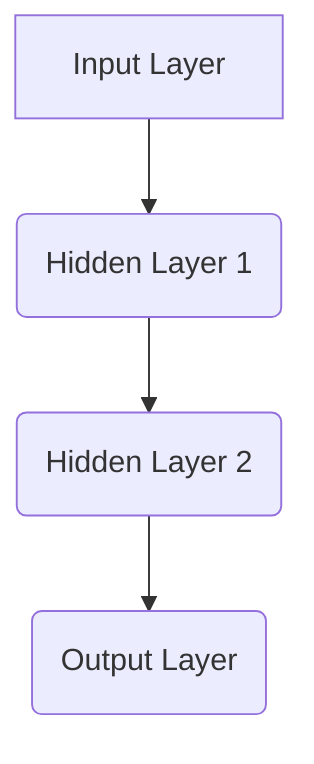
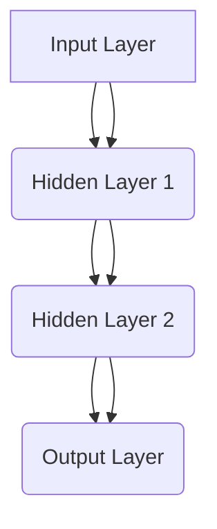
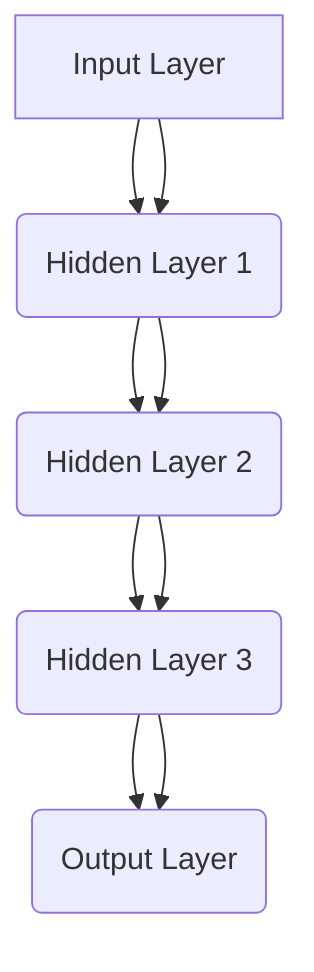
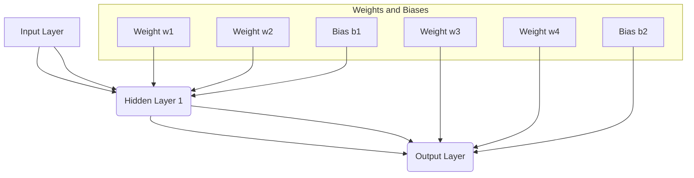
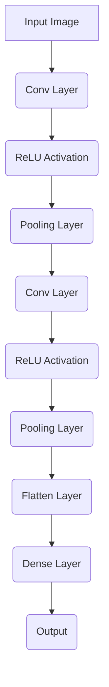
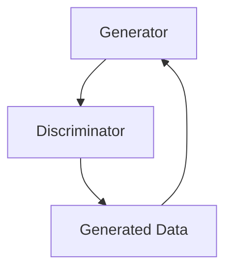
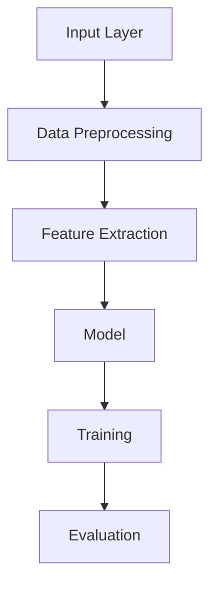

                 

### 《神经网络：人类智慧的延伸》

> **关键词**：神经网络，人工智能，机器学习，深度学习，激活函数，反向传播算法

**摘要**：
本文将深入探讨神经网络这一机器学习中的核心概念，旨在揭示其如何模拟人类大脑进行学习和推理。我们将从神经网络的基本概念、数学基础、架构设计、常见模型、训练技巧、优化方法以及实际应用等多个维度，逐步剖析神经网络的本质和应用。通过本文，读者将能够全面了解神经网络的工作原理，掌握其设计要点，并能够将其应用于实际问题解决中。

---

### 《神经网络：人类智慧的延伸》目录大纲

**第一部分：神经网络的基本概念与架构**

**第1章：神经网络的起源与历史**  
**第2章：神经网络的数学基础**  
**第3章：前馈神经网络的架构**  
**第4章：反向传播算法原理**

**第二部分：常见神经网络模型**

**第5章：感知机与线性分类器**  
**第6章：多层感知机与Sigmoid函数**  
**第7章：前馈神经网络的应用**

**第三部分：神经网络训练技巧与优化方法**

**第8章：神经网络训练技巧**  
**第9章：神经网络优化方法**

**第四部分：神经网络在实际应用中的案例与项目**

**第10章：神经网络在自然语言处理中的应用**  
**第11章：神经网络在计算机视觉中的应用**  
**第12章：神经网络在深度强化学习中的应用**

**第五部分：神经网络的设计与实现**

**第13章：神经网络设计原则**  
**第14章：神经网络实现步骤**

**附录**

**附录A：神经网络相关资源与工具**  
**附录B：神经网络常见问题解答**  
**附录C：神经网络项目实战**

---

通过这份详细的目录大纲，读者可以初步了解文章的结构和内容，接下来我们将逐步深入每一部分，解析神经网络的奥秘。

### 第一部分：神经网络的基本概念与架构

#### 第1章：神经网络的起源与历史

**1.1 神经网络的发展历程**

神经网络的起源可以追溯到20世纪40年代，当时心理学家和计算机科学家开始尝试模拟人脑的结构和功能。第一个重要的里程碑是1943年，由McCulloch和Pitts提出的神经网络模型，即“麦卡洛克-皮茨模型”（MCP模型）。这个模型奠定了神经网络理论的基础，并首次提出了人工神经元的概念。

随后的几十年中，神经网络的研究经历了多次起伏。在1950年代和1960年代，由于计算机硬件的限制和理论上的局限性，神经网络研究进入低谷。然而，在1980年代，随着计算机硬件的进步和反向传播算法（BP算法）的提出，神经网络重新获得了关注。

1986年，Rumelhart、Hinton和Williams提出了反向传播算法，这是一种用于训练多层神经网络的算法。这一突破使得多层神经网络的训练成为可能，从而推动了神经网络在图像识别、语音识别等领域的应用。

**1.2 神经网络的起源**

神经网络的概念灵感来自于生物大脑的结构和工作原理。人脑由数亿个神经元组成，这些神经元通过突触相互连接，形成一个复杂的神经网络。神经元通过电信号进行通信，这些信号在神经网络中传播，最终形成复杂的认知过程。

1943年，由心理学家McCulloch和数学家Pitts提出了第一个简单的神经网络模型，即MCP模型。这个模型由一组输入神经元、一组隐藏神经元和一组输出神经元组成，每个神经元都可以接收来自前一层神经元的输入信号，并通过激活函数产生输出信号。

**1.3 神经网络在现代的应用**

随着计算机技术的发展，神经网络在各个领域得到了广泛应用。以下是一些重要的应用领域：

1. **图像识别**：神经网络被广泛用于图像分类、目标检测和图像生成等任务。典型的应用包括人脸识别、车辆识别和医学图像分析等。

2. **语音识别**：神经网络在语音识别中发挥着重要作用，可以实现自然语言处理和语音合成等任务。

3. **自然语言处理**：神经网络被用于文本分类、情感分析、机器翻译和问答系统等任务。

4. **推荐系统**：神经网络被用于构建推荐系统，可以预测用户对特定商品或内容的偏好。

5. **游戏AI**：神经网络被用于实现智能游戏AI，例如围棋和电子竞技游戏。

6. **自动驾驶**：神经网络在自动驾驶系统中用于感知环境、规划路径和做出决策。

总之，神经网络作为一种强大的机器学习工具，已经在许多实际应用中展示了其潜力和价值。

---

在本章中，我们简要回顾了神经网络的发展历程和起源，以及其在现代应用中的重要地位。接下来，我们将深入探讨神经网络的数学基础，了解神经元模型、矩阵与向量运算以及常用线性代数公式，为后续章节的深入讲解打下基础。

### 第一部分：神经网络的基本概念与架构

#### 第2章：神经网络的数学基础

**2.1 神经元模型**

神经元是神经网络的基本构建块，其工作原理类似于生物神经元。在神经网络中，每个神经元都可以接收来自其他神经元的输入信号，并通过一个加权求和的函数进行计算，最后通过激活函数产生输出信号。

一个简单的神经元模型可以表示为：

$$
\text{输出} = \text{激活函数}(\sum_{i=1}^{n} w_i \cdot x_i + b)
$$

其中，$x_i$表示第$i$个输入，$w_i$表示第$i$个输入的权重，$b$是偏置项，用于调整输出值。激活函数（activation function）是神经网络中的关键组件，它将加权和映射到某个特定的值域内，以实现非线性的决策过程。

常见的激活函数包括：

- **Sigmoid函数**：
  $$
  \text{Sigmoid}(x) = \frac{1}{1 + e^{-x}}
  $$
  Sigmoid函数将输入值映射到$(0, 1)$区间，常用于二分类问题。

- **ReLU函数**：
  $$
  \text{ReLU}(x) = \max(0, x)
  $$
  ReLU函数在$x \geq 0$时输出$x$，在$x < 0$时输出$0$，具有简洁的计算形式和较好的训练效果。

- **Tanh函数**：
  $$
  \text{Tanh}(x) = \frac{e^x - e^{-x}}{e^x + e^{-x}}
  $$
  Tanh函数将输入值映射到$(-1, 1)$区间，常用于隐含层神经元。

**2.2 矩阵与向量运算**

在神经网络中，矩阵与向量运算是核心操作。矩阵（Matrix）是由一系列数字排列而成的矩形阵列，而向量（Vector）是一个一维的矩阵。以下是一些常见的矩阵与向量运算：

- **矩阵加法**：
  $$
  C = A + B
  $$
  两个矩阵对应位置元素相加。

- **矩阵减法**：
  $$
  C = A - B
  $$
  两个矩阵对应位置元素相减。

- **矩阵乘法**：
  $$
  C = A \cdot B
  $$
  矩阵乘法满足交换律，但通常不满足结合律。

- **向量加法**：
  $$
  \text{输出} = \text{输入} + \text{偏置}
  $$
  向量与偏置向量相加。

- **向量减法**：
  $$
  \text{输出} = \text{输入} - \text{偏置}
  $$
  向量与偏置向量相减。

- **点积**：
  $$
  \text{输出} = \text{输入} \cdot \text{权重}
  $$
  向量与权重矩阵的点积。

- **叉积**：
  $$
  \text{输出} = \text{输入} \times \text{权重}
  $$
  向量与权重矩阵的叉积。

**2.3 常用线性代数公式**

在神经网络中，以下线性代数公式经常被使用：

- **矩阵求导**：
  $$
  \frac{dC}{dB} = \frac{dC}{dB^{T}}
  $$
  矩阵对偏置的导数等于其转置。

- **链式法则**：
  $$
  \frac{dz}{dx} = \frac{dz}{dy} \cdot \frac{dy}{dx}
  $$
  多层神经网络的误差传播遵循链式法则。

- **梯度下降**：
  $$
  \theta_{\text{更新}} = \theta_{\text{当前}} - \alpha \cdot \frac{dJ}{d\theta}
  $$
  梯度下降算法用于优化神经网络的参数。

这些数学基础为理解神经网络的工作原理和实现提供了必要的工具。在下一章中，我们将探讨前馈神经网络的架构，进一步揭示神经网络的设计和实现细节。

---

在本章中，我们详细介绍了神经网络的数学基础，包括神经元模型、矩阵与向量运算以及常用线性代数公式。这些概念和工具是理解神经网络工作原理的关键，为后续章节的深入学习打下了坚实的基础。在下一章中，我们将深入探讨前馈神经网络的架构，了解其层次结构和信息流传递的过程。

### 第一部分：神经网络的基本概念与架构

#### 第3章：前馈神经网络的架构

**3.1 前馈神经网络的定义**

前馈神经网络（Feedforward Neural Network，FNN）是一种最常见的神经网络结构，其特点是信息从输入层直接流向输出层，中间经过多个隐藏层。在这种网络结构中，没有循环或循环连接，因此信息不会在隐藏层之间反复流动。前馈神经网络适用于许多任务，包括分类、回归和特征提取等。

**3.1.1 前馈神经网络的结构**

前馈神经网络通常由以下几个部分组成：

- **输入层（Input Layer）**：接收外部输入信息，每个输入节点对应一个特征。
- **隐藏层（Hidden Layers）**：一个或多个隐藏层，每个隐藏层由多个神经元组成，用于提取和转换特征。
- **输出层（Output Layer）**：产生最终输出，根据任务的不同，输出可以是分类标签、预测值等。

一个简单的前馈神经网络结构可以用Mermaid流程图表示：



**3.1.2 信息流在神经网络中的传递**

在前馈神经网络中，信息流从输入层传递到输出层，经过每个隐藏层的处理。这个过程可以分为以下几个步骤：

1. **输入层到隐藏层**：输入数据通过加权求和和激活函数处理后传递到下一层。
2. **隐藏层到隐藏层**：每个隐藏层接收前一层的输出，并经过加权求和和激活函数处理后传递到下一层。
3. **隐藏层到输出层**：输出层接收来自隐藏层的输出，并产生最终输出。

以下是一个简化的前向传播过程：



**3.2 神经网络的层次结构**

前馈神经网络的层次结构决定了网络的学习能力和表现。通常，层次结构可以分为以下几类：

- **单层神经网络**：只有一个隐藏层，适用于简单的线性可分问题。
- **多层神经网络**：具有多个隐藏层，可以提取更高层次的特征，适用于更复杂的任务。
- **深度神经网络**：具有多个隐藏层，通常超过三层，适用于大规模和高度非线性问题。

以下是一个简单的多层神经网络结构：



**3.2.1 输入层、隐藏层和输出层**

每个层次在神经网络中扮演不同的角色：

- **输入层**：接收外部输入，通常是特征向量。
- **隐藏层**：负责提取和转换特征，每个隐藏层都可以学习到不同层次的特征表示。
- **输出层**：产生最终输出，根据任务的不同，可以是分类标签、预测值等。

**3.2.2 层次之间的权重与偏置**

在神经网络中，层次之间的连接通过权重（weights）和偏置（biases）来实现。权重决定了不同特征之间的相对重要性，而偏置用于调整输出值。

以下是一个简单的权重和偏置示意图：



在下一章中，我们将探讨反向传播算法的原理，了解如何通过反向传播更新神经网络的参数，从而优化网络的性能。

---

在本章中，我们详细介绍了前馈神经网络的定义、结构、信息流传递过程以及层次结构。通过这些内容，读者可以更好地理解神经网络的设计原理和实现过程。在下一章中，我们将深入探讨反向传播算法的原理，了解如何通过误差的反向传播来优化神经网络。

### 第一部分：神经网络的基本概念与架构

#### 第4章：反向传播算法原理

**4.1 反向传播算法的基本概念**

反向传播算法（Backpropagation Algorithm）是训练多层神经网络的核心算法。它通过计算网络输出与实际输出之间的误差，并沿网络反向传播这些误差，从而更新网络的权重和偏置。反向传播算法由两个主要阶段组成：前向传播（forward propagation）和后向传播（backward propagation）。

**4.1.1 前向传播**

前向传播是指在神经网络中，从输入层开始，将输入数据通过网络的各层，最终得到输出层的结果。具体步骤如下：

1. **输入层到隐藏层**：输入数据通过加权求和和激活函数处理后传递到下一层。
2. **隐藏层到隐藏层**：每个隐藏层接收前一层的输出，并经过加权求和和激活函数处理后传递到下一层。
3. **隐藏层到输出层**：输出层接收来自隐藏层的输出，并产生最终输出。

**4.1.2 误差的传播过程**

在神经网络的前向传播过程中，会生成网络输出与实际输出之间的误差。这些误差需要反向传播到网络的每一层，以便更新权重和偏置。误差的传播过程可以分为以下几个步骤：

1. **计算输出误差**：对于输出层，计算网络输出与实际输出之间的误差，使用损失函数（如均方误差MSE或交叉熵损失）来度量。
2. **误差反向传播**：将输出误差沿网络反向传播到隐藏层。这一过程使用链式法则（chain rule）来计算每一层的误差。
3. **权重和偏置更新**：使用梯度下降（gradient descent）或其他优化算法来更新权重和偏置。

**4.2 反向传播算法的实现**

反向传播算法的实现主要包括以下步骤：

1. **前向传播**：计算网络输出和误差。
2. **计算梯度**：计算网络各层权重的梯度。
3. **后向传播**：将梯度反向传播到网络的每一层。
4. **权重更新**：根据梯度和优化算法更新权重和偏置。

以下是一个简化的伪代码实现：

```python
# 前向传播
for layer in range(len(network.layers) - 1):
    network.layers[layer].output = activation_function(
        weighted_sum(network.layers[layer - 1].output, layer.weights) + layer.bias)

network.output = activation_function(weighted_sum(network.layers[-1].output, network.layers[-1].weights) + network.layers[-1].bias)

# 计算输出误差
error = loss_function(target, network.output)

# 计算梯度
for layer in reversed(range(len(network.layers))):
    if layer == len(network.layers) - 1:
        dL_dZ = network.layers[layer].output - target
    else:
        dL_dZ = dL_dY * (1 - network.layers[layer].output)
    
    for neuron in network.layers[layer].neurons:
        dL_dW += neuron.input * dL_dZ
        dL_db += dL_dZ

# 后向传播和权重更新
for layer in reversed(range(len(network.layers))):
    for neuron in network.layers[layer].neurons:
        neuron.weights -= learning_rate * dL_dW[neuron.index]
        neuron.bias -= learning_rate * dL_db[neuron.index]
```

**4.3 反向传播算法的优化**

反向传播算法在实际应用中可能会遇到一些挑战，如梯度消失和梯度爆炸。为了解决这些问题，可以使用以下优化方法：

1. **学习率调整**：通过动态调整学习率来优化参数更新过程。
2. **动量法**：引入动量项来加速梯度下降过程。
3. **自适应优化器**：如AdaGrad、RMSProp和Adam等，这些优化器可以自动调整学习率。

**4.3.1 学习率调整**

学习率调整是反向传播算法中一个重要的优化步骤。学习率决定了参数更新的步长，如果学习率过大，可能会导致参数更新过度，使网络无法收敛；如果学习率过小，则可能导致训练过程缓慢。

常见的调整方法包括：

- **固定学习率**：在训练过程中保持学习率不变。
- **学习率衰减**：随着训练的进行，逐渐减小学习率。
- **自适应学习率**：使用自适应优化器来动态调整学习率。

**4.3.2 梯度消失与梯度爆炸**

在反向传播过程中，梯度的大小和方向会影响参数更新的效果。梯度消失和梯度爆炸是两个常见问题：

- **梯度消失**：在多层神经网络中，梯度可能因为多次反向传播而变得非常小，导致参数无法有效更新。
- **梯度爆炸**：在某些情况下，梯度可能变得非常大，导致参数更新过于剧烈。

为了解决这些问题，可以采取以下措施：

- **批量归一化（Batch Normalization）**：通过标准化每个批量中的激活值，减轻梯度消失和梯度爆炸的问题。
- **使用合适的激活函数**：如ReLU函数，可以缓解梯度消失问题。
- **梯度裁剪（Gradient Clipping）**：通过限制梯度的大小来防止梯度爆炸。

通过以上优化方法，可以显著提高反向传播算法的效率和稳定性。在下一章中，我们将探讨常见的神经网络模型，如感知机、多层感知机和前馈神经网络，了解它们的基本原理和应用。

---

在本章中，我们详细介绍了反向传播算法的基本概念、实现步骤以及优化方法。反向传播算法是训练多层神经网络的关键，它通过误差的反向传播和参数的梯度更新，实现了神经网络的学习和优化。在下一章中，我们将探讨常见的神经网络模型，如感知机、多层感知机等，了解它们的工作原理和应用。

### 第二部分：常见神经网络模型

#### 第5章：感知机与线性分类器

**5.1 感知机模型**

感知机（Perceptron）是神经网络最早的形式之一，由Frank Rosenblatt于1957年提出。它是一种基于线性二分类的神经网络，可以看作是前馈神经网络的基础。感知机模型由输入层和输出层组成，其中输入层接收外部输入，输出层产生二分类结果。

**5.1.1 感知机的工作原理**

感知机的工作原理基于线性函数，其输出可以通过以下公式表示：

$$
y = \text{sign}(w \cdot x + b)
$$

其中，$x$是输入向量，$w$是权重向量，$b$是偏置项，$\text{sign}$函数是一个符号函数，当输入大于0时返回1，小于0时返回-1。

感知机模型通过以下步骤进行操作：

1. **加权求和**：将输入向量$x$与权重向量$w$进行点积运算，加上偏置项$b$，得到加权和。
2. **应用激活函数**：通常使用符号函数作为激活函数，对加权和进行判断，若结果大于0则输出1，否则输出-1。
3. **更新权重**：在训练过程中，通过误差反向传播算法更新权重和偏置项，以最小化分类误差。

**5.1.2 感知机的局限性**

虽然感知机模型在二分类问题中表现出色，但它存在一些局限性：

- **线性可分性**：感知机只能处理线性可分的数据，对于非线性的数据，其性能较差。
- **局部最小值**：在多类分类问题中，感知机可能陷入局部最小值，导致训练过程不稳定。
- **收敛速度**：感知机的训练速度较慢，特别是在大型数据集上。

**5.2 线性分类器的实现**

线性分类器（Linear Classifier）是感知机模型在多类分类问题中的应用，其主要目标是找到一个线性决策边界，将不同类别的数据分离开来。常见的线性分类器包括线性支持向量机（Linear SVM）和逻辑回归（Logistic Regression）。

**5.2.1 线性支持向量机（Linear SVM）**

线性支持向量机通过最大化分类边界上的间隔来分割数据。其目标是最小化分类误差，并最大化分类边界到支持向量的间隔。线性SVM的决策函数可以表示为：

$$
w \cdot x_i + b \geq 1 \quad (y_i = +1) \\
-w \cdot x_i - b \geq 1 \quad (y_i = -1)
$$

其中，$w$是权重向量，$b$是偏置项，$x_i$是输入向量，$y_i$是标签。

**5.2.2 逻辑回归（Logistic Regression）**

逻辑回归是一种基于概率的线性分类器，其目标是最小化损失函数，以预测二分类问题中的概率分布。逻辑回归的决策函数可以表示为：

$$
\text{概率} = \frac{1}{1 + e^{-(w \cdot x + b)}}
$$

其中，$w$是权重向量，$b$是偏置项，$x$是输入向量。

通过调整权重和偏置项，逻辑回归可以找到最佳的分类边界，从而实现有效的分类。

**5.2.3 线性分类器的应用**

线性分类器在许多实际应用中都有广泛应用，包括文本分类、图像分类和异常检测等。以下是一些典型的应用案例：

- **文本分类**：使用线性分类器对文本进行分类，如垃圾邮件检测和情感分析。
- **图像分类**：使用线性分类器对图像进行分类，如人脸识别和物体检测。
- **异常检测**：使用线性分类器检测异常行为，如网络入侵检测和信用卡欺诈检测。

总之，感知机与线性分类器是神经网络的基本组成部分，它们在二分类和多分类问题中发挥了重要作用。在下一章中，我们将探讨多层感知机与Sigmoid函数，了解它们如何解决非线性分类问题。

---

在本章中，我们详细介绍了感知机模型及其在二分类问题中的应用，包括其工作原理和局限性。此外，我们还探讨了线性分类器的实现，如线性支持向量机和逻辑回归，以及它们在实际应用中的重要性。在下一章中，我们将进一步探讨多层感知机与Sigmoid函数，了解它们如何扩展神经网络的分类能力。

### 第二部分：常见神经网络模型

#### 第6章：多层感知机与Sigmoid函数

**6.1 多层感知机模型**

多层感知机（Multilayer Perceptron，MLP）是一种具有至少一个隐藏层的神经网络，它通过多个隐藏层来提取和转换特征，从而实现非线性分类和回归任务。与感知机相比，多层感知机能够处理更复杂的非线性问题。

**6.1.1 多层感知机的工作原理**

多层感知机的工作原理与感知机类似，但增加了隐藏层。具体步骤如下：

1. **输入层到隐藏层**：输入数据通过加权求和和激活函数处理后传递到下一层。
2. **隐藏层到隐藏层**：每个隐藏层接收前一层的输出，并经过加权求和和激活函数处理后传递到下一层。
3. **隐藏层到输出层**：输出层接收来自隐藏层的输出，并产生最终输出。

以下是一个多层感知机模型的结构：


**6.1.2 多层感知机的局限性**

尽管多层感知机能够处理非线性问题，但它也存在一些局限性：

- **局部最小值**：在训练过程中，多层感知机可能陷入局部最小值，导致训练不稳定。
- **梯度消失和梯度爆炸**：多层感知机在反向传播过程中容易出现梯度消失和梯度爆炸问题，使得训练过程变得困难。
- **过拟合**：多层感知机在训练过程中可能过拟合训练数据，导致在测试数据上的表现不佳。

**6.2 Sigmoid函数的作用**

Sigmoid函数是多层感知机中常用的激活函数，其形式如下：

$$
\text{Sigmoid}(x) = \frac{1}{1 + e^{-x}}
$$

Sigmoid函数将输入值映射到$(0, 1)$区间，具有以下作用：

- **非线性转换**：Sigmoid函数实现了输入到输出的非线性转换，使得多层感知机能够处理非线性问题。
- **平滑梯度**：Sigmoid函数的导数在$x > 0$时接近1，在$x < 0$时接近0，这有助于缓解梯度消失问题。

**6.2.1 Sigmoid函数的定义**

Sigmoid函数的定义如下：

$$
\text{Sigmoid}(x) = \frac{1}{1 + e^{-x}}
$$

其中，$e$是自然对数的底数，$x$是输入值。

**6.2.2 Sigmoid函数在神经网络中的应用**

在神经网络中，Sigmoid函数通常用于隐藏层和输出层。以下是一个多层感知机的示例：

```python
import numpy as np

# 输入数据
x = np.array([0, 1, 2, 3, 4])

# 加权求和
w1 = np.array([0.1, 0.2])
w2 = np.array([0.3, 0.4])
b1 = 0.5
b2 = 0.6

# 隐藏层1
z1 = np.dot(w1, x) + b1
a1 = sigmoid(z1)

# 隐藏层2
z2 = np.dot(w2, a1) + b2
a2 = sigmoid(z2)

# 输出层
output = sigmoid(z2)
```

在这个示例中，输入数据通过两个隐藏层和输出层传递，每个层都使用Sigmoid函数作为激活函数。

**6.2.3 Sigmoid函数与其他激活函数的比较**

与ReLU函数相比，Sigmoid函数的优点是能够较好地缓解梯度消失问题，但其缺点是梯度在$x < 0$时接近0，导致梯度较慢。ReLU函数在$x > 0$时具有更好的梯度传播效果，因此在训练深度神经网络时更为常用。

总之，多层感知机通过引入隐藏层和Sigmoid激活函数，能够处理非线性问题。在下一章中，我们将探讨前馈神经网络的应用，了解其在图像识别、文本分类等领域的实际应用。

---

在本章中，我们详细介绍了多层感知机模型及其工作原理，以及Sigmoid函数的定义和在神经网络中的应用。多层感知机通过增加隐藏层和采用Sigmoid函数，能够实现非线性分类和回归任务。在下一章中，我们将探讨前馈神经网络在图像识别、文本分类等领域的实际应用，展示其强大的功能和广泛的应用前景。

### 第二部分：常见神经网络模型

#### 第7章：前馈神经网络的应用

**7.1 前馈神经网络的分类任务**

前馈神经网络（Feedforward Neural Network，FNN）在分类任务中具有广泛的应用，其核心在于通过多层隐藏层对输入数据进行特征提取和转换，从而实现分类。以下是前馈神经网络在分类任务中的应用：

**7.1.1 多分类问题**

在多分类问题中，前馈神经网络通过输出层的多个神经元分别表示不同类别的概率。常见的多分类问题包括手写数字识别、图像分类和文本分类等。以下是一个简化的多分类问题示例：

1. **手写数字识别（MNIST）**：MNIST数据集包含0到9的手写数字图像，每个数字图像有784个像素点。前馈神经网络通过输入层接收图像数据，经过多层隐藏层提取特征，最后输出层通过softmax函数计算每个类别的概率。

```python
import tensorflow as tf

# 定义输入层
x = tf.placeholder(tf.float32, [None, 784])

# 定义隐藏层
hidden_layer = tf.layers.dense(x, units=128, activation=tf.nn.relu)

# 定义输出层
output = tf.layers.dense(hidden_layer, units=10, activation=tf.nn.softmax)

# 定义损失函数和优化器
y_ = tf.placeholder(tf.float32, [None, 10])
cross_entropy = tf.reduce_mean(-tf.reduce_sum(y_ * tf.log(output), reduction_indices=1))
optimizer = tf.train.AdamOptimizer(learning_rate=0.001).minimize(cross_entropy)

# 训练模型
with tf.Session() as sess:
    sess.run(tf.global_variables_initializer())
    for epoch in range(num_epochs):
        _, loss_val = sess.run([optimizer, cross_entropy], feed_dict={x: train_data, y_: train_labels})
        if epoch % 100 == 0:
            print(f"Epoch {epoch}: Loss = {loss_val}")
    
    test_loss_val = sess.run(cross_entropy, feed_dict={x: test_data, y_: test_labels})
    print(f"Test Loss: {test_loss_val}")
```

2. **图像分类（CIFAR-10）**：CIFAR-10数据集包含10个类别的60,000张32x32彩色图像。前馈神经网络通过输入层接收图像数据，经过多层隐藏层提取特征，最后输出层通过softmax函数计算每个类别的概率。

```python
import tensorflow as tf
import tensorflow.keras.layers as layers

# 定义模型
model = tf.keras.Sequential([
    layers.Conv2D(32, (3, 3), activation='relu', input_shape=(32, 32, 3)),
    layers.MaxPooling2D((2, 2)),
    layers.Conv2D(64, (3, 3), activation='relu'),
    layers.MaxPooling2D((2, 2)),
    layers.Conv2D(64, (3, 3), activation='relu'),
    layers.Flatten(),
    layers.Dense(64, activation='relu'),
    layers.Dense(10, activation='softmax')
])

# 编译模型
model.compile(optimizer='adam',
              loss='categorical_crossentropy',
              metrics=['accuracy'])

# 训练模型
model.fit(x_train, y_train, batch_size=64, epochs=10, validation_data=(x_test, y_test))
```

**7.1.2 回归问题**

在回归问题中，前馈神经网络的目标是预测一个连续值。常见的回归问题包括房价预测、股票价格预测和医学诊断等。以下是一个简化的回归问题示例：

```python
import tensorflow as tf

# 定义输入层
x = tf.placeholder(tf.float32, [None, num_features])

# 定义隐藏层
hidden_layer = tf.layers.dense(x, units=64, activation=tf.nn.relu)

# 定义输出层
output = tf.layers.dense(hidden_layer, units=1)

# 定义损失函数和优化器
y_ = tf.placeholder(tf.float32, [None, 1])
mean_squared_error = tf.reduce_mean(tf.square(output - y_))
optimizer = tf.train.AdamOptimizer(learning_rate=0.001).minimize(mean_squared_error)

# 训练模型
with tf.Session() as sess:
    sess.run(tf.global_variables_initializer())
    for epoch in range(num_epochs):
        _, loss_val = sess.run([optimizer, mean_squared_error], feed_dict={x: train_data, y_: train_labels})
        if epoch % 100 == 0:
            print(f"Epoch {epoch}: Loss = {loss_val}")
    
    test_loss_val = sess.run(mean_squared_error, feed_dict={x: test_data, y_: test_labels})
    print(f"Test Loss: {test_loss_val}")
```

**7.2 前馈神经网络的图像识别应用**

前馈神经网络在图像识别任务中发挥着重要作用，卷积神经网络（Convolutional Neural Network，CNN）是前馈神经网络的特殊形式，特别适用于处理图像数据。以下是一个卷积神经网络的简单示例：

```python
import tensorflow as tf
import tensorflow.keras.layers as layers

# 定义模型
model = tf.keras.Sequential([
    layers.Conv2D(32, (3, 3), activation='relu', input_shape=(32, 32, 3)),
    layers.MaxPooling2D((2, 2)),
    layers.Conv2D(64, (3, 3), activation='relu'),
    layers.MaxPooling2D((2, 2)),
    layers.Conv2D(64, (3, 3), activation='relu'),
    layers.Flatten(),
    layers.Dense(64, activation='relu'),
    layers.Dense(10, activation='softmax')
])

# 编译模型
model.compile(optimizer='adam',
              loss='categorical_crossentropy',
              metrics=['accuracy'])

# 训练模型
model.fit(x_train, y_train, batch_size=64, epochs=10, validation_data=(x_test, y_test))
```

通过这些示例，我们可以看到前馈神经网络在分类和回归任务中的应用。在下一章中，我们将探讨神经网络训练技巧和优化方法，以提高模型的训练效率和性能。

---

在本章中，我们详细介绍了前馈神经网络在分类任务中的应用，包括多分类问题和回归问题。此外，我们还探讨了卷积神经网络在图像识别任务中的应用。这些内容展示了前馈神经网络在实际问题解决中的强大能力和广泛应用。在下一章中，我们将探讨神经网络训练技巧和优化方法，以进一步提升模型的训练效率和性能。

### 第三部分：神经网络训练技巧与优化方法

#### 第8章：神经网络训练技巧

**8.1 数据预处理**

数据预处理是神经网络训练的重要步骤，其质量直接影响模型的训练效果。以下是一些常见的数据预处理技巧：

**8.1.1 数据标准化**

数据标准化是指将数据缩放到一个特定的范围，如$[0, 1]$或$[-1, 1]$。常用的方法包括：

- **Min-Max标准化**：
  $$
  x_{\text{norm}} = \frac{x - \min(x)}{\max(x) - \min(x)}
  $$
  
- **Z-Score标准化**：
  $$
  x_{\text{norm}} = \frac{x - \mu}{\sigma}
  $$
  其中，$\mu$是平均值，$\sigma$是标准差。

数据标准化有助于加快梯度下降过程，并减少模型过拟合的风险。

**8.1.2 数据归一化**

数据归一化是指将不同特征缩放到相同的尺度，以消除特征之间的尺度差异。常用的方法包括：

- **归一化因子法**：
  $$
  x_{\text{norm}} = x / \max(x)
  $$
  
- **标准化因子法**：
  $$
  x_{\text{norm}} = x / \sum_{i} |x_i|
  $$
  
数据归一化有助于提高模型的稳定性和训练速度。

**8.1.3 数据增强**

数据增强是通过生成新的训练样本来扩充数据集，从而提高模型的泛化能力。常见的数据增强方法包括：

- **随机翻转**：将图像沿水平或垂直方向随机翻转。
- **旋转**：将图像随机旋转一定角度。
- **缩放**：将图像随机缩放到不同的尺度。
- **裁剪**：从图像中随机裁剪出子图像。

数据增强有助于减少模型对训练数据的依赖，提高模型的鲁棒性。

**8.1.4 划分训练集、验证集和测试集**

在训练神经网络时，需要将数据集划分为训练集、验证集和测试集。通常，数据集的划分比例为：

- 训练集：用于训练模型，占比70-80%。
- 验证集：用于评估模型性能，占比10-20%。
- 测试集：用于测试模型在未知数据上的表现，占比10%。

通过合理划分数据集，可以避免模型过拟合，并确保模型在测试数据上的表现良好。

**8.2 正则化技术**

正则化技术是一种用于防止模型过拟合的方法，通过在损失函数中添加正则项来惩罚模型的复杂度。以下是一些常见的正则化技术：

**8.2.1 L1正则化**

L1正则化通过添加L1范数惩罚来约束模型参数：

$$
\text{Loss} = J(\theta) + \lambda \sum_{i=1}^{n} |w_i|
$$

其中，$J(\theta)$是损失函数，$\lambda$是正则化参数，$w_i$是权重。

**8.2.2 L2正则化**

L2正则化通过添加L2范数惩罚来约束模型参数：

$$
\text{Loss} = J(\theta) + \lambda \sum_{i=1}^{n} w_i^2
$$

L2正则化在降低模型复杂度的同时，有助于防止权重过大，提高模型的稳定性。

**8.3 激活函数的选择**

激活函数是神经网络中的关键组件，其选择对模型的性能有很大影响。以下是一些常用的激活函数：

**8.3.1 ReLU函数**

ReLU函数（Rectified Linear Unit）具有计算简单、参数较少的优点，能有效提高训练速度：

$$
\text{ReLU}(x) = \max(0, x)
$$

ReLU函数在$x < 0$时输出0，在$x \geq 0$时输出$x$。

**8.3.2 Softmax函数**

Softmax函数常用于多分类问题，用于将输出向量映射到概率分布：

$$
\text{Softmax}(x)_i = \frac{e^{x_i}}{\sum_{j=1}^{n} e^{x_j}}
$$

其中，$x_i$是输出向量的第$i$个元素，$n$是输出向量的长度。

Softmax函数确保了输出概率分布的和为1。

**8.3.3 Tanh函数**

Tanh函数（Hyperbolic Tangent）将输入映射到$(-1, 1)$区间，有助于提高模型的非线性能力：

$$
\text{Tanh}(x) = \frac{e^{x} - e^{-x}}{e^{x} + e^{-x}}
$$

Tanh函数在训练过程中梯度较小，有助于缓解梯度消失问题。

通过合理的数据预处理、正则化技术和激活函数选择，可以显著提高神经网络的训练效率和性能。在下一章中，我们将探讨神经网络优化方法，进一步优化模型的训练过程。

---

在本章中，我们详细介绍了神经网络训练中的数据预处理技巧、正则化技术和激活函数选择。这些技巧和方法对于提高神经网络模型的训练效率和性能具有重要意义。在下一章中，我们将深入探讨神经网络的优化方法，了解如何通过优化算法提高模型训练的效率和效果。

### 第三部分：神经网络训练技巧与优化方法

#### 第9章：神经网络优化方法

**9.1 随机梯度下降（SGD）**

随机梯度下降（Stochastic Gradient Descent，SGD）是一种用于优化神经网络参数的常见算法。与批量梯度下降（Batch Gradient Descent）不同，SGD在每个迭代中仅使用一个样本来计算梯度，从而加快了训练过程。

**9.1.1 SGD的原理**

SGD的原理可以概括为以下步骤：

1. **初始化参数**：随机初始化模型的权重和偏置。
2. **前向传播**：使用当前参数计算网络输出。
3. **计算损失**：使用损失函数计算输出与真实值之间的误差。
4. **计算梯度**：对于每个样本，计算损失关于参数的梯度。
5. **更新参数**：根据梯度更新模型参数。
6. **重复步骤2-5**：直到满足停止条件（如达到预设的迭代次数或损失低于某个阈值）。

**9.1.2 SGD的优化过程**

SGD的优化过程可以通过以下伪代码表示：

```python
# 初始化参数
w = np.random.randn(d)
b = np.random.randn(1)

# 假设有一个包含n个样本的数据集
for epoch in range(num_epochs):
    for sample in data:
        # 前向传播
        output = f(w*sample + b)
        
        # 计算损失
        loss = loss_function(output, target)
        
        # 计算梯度
        dw = grad_w(loss, sample)
        db = grad_b(loss, sample)
        
        # 更新参数
        w -= learning_rate * dw
        b -= learning_rate * db
```

**9.1.3 SGD的优缺点**

- **优点**：

  - 训练速度快：由于每个迭代仅使用一个样本，SGD在大型数据集上训练速度快。
  - 易于并行化：SGD可以很容易地并行化，提高计算效率。

- **缺点**：

  - 不稳定：由于每次迭代使用不同的样本，SGD可能导致训练结果不稳定。
  - 需要调整学习率：学习率的调整对SGD的训练过程至关重要，不当的学习率可能导致训练不稳定。

**9.2 动量法**

动量法（Momentum）是一种改进的SGD算法，通过引入动量项来加速梯度下降过程，提高收敛速度和稳定性。

**9.2.1 动量法的原理**

动量法的原理可以概括为以下步骤：

1. **初始化参数**：随机初始化模型的权重和偏置。
2. **初始化动量**：设置初始动量为0。
3. **前向传播**：使用当前参数计算网络输出。
4. **计算损失**：使用损失函数计算输出与真实值之间的误差。
5. **计算梯度**：对于每个样本，计算损失关于参数的梯度。
6. **更新动量**：计算新的动量，即前一次的动量加上当前梯度的比例。
7. **更新参数**：根据梯度更新模型参数，同时考虑动量项。
8. **重复步骤3-7**：直到满足停止条件。

**9.2.2 动量法优化SGD**

动量法可以通过以下伪代码表示：

```python
# 初始化参数
w = np.random.randn(d)
b = np.random.randn(1)
velocity_w = 0
velocity_b = 0

# 假设有一个包含n个样本的数据集
for epoch in range(num_epochs):
    for sample in data:
        # 前向传播
        output = f(w*sample + b)
        
        # 计算损失
        loss = loss_function(output, target)
        
        # 计算梯度
        dw = grad_w(loss, sample)
        db = grad_b(loss, sample)
        
        # 更新动量
        velocity_w = momentum * velocity_w + dw
        velocity_b = momentum * velocity_b + db
        
        # 更新参数
        w -= learning_rate * velocity_w
        b -= learning_rate * velocity_b
```

**9.2.3 动量法的优缺点**

- **优点**：

  - 提高收敛速度：动量法通过累积动量，加速梯度下降过程，提高收敛速度。
  - 提高稳定性：动量法通过减缓梯度的波动，提高训练过程的稳定性。

- **缺点**：

  - 需要合适的动量参数：动量参数的设置对训练过程有很大影响，需要调整以达到最佳效果。

**9.3 Adam优化器**

Adam优化器是一种结合了SGD和动量法的优化算法，具有自适应学习率的特点，适用于大多数深度学习任务。

**9.3.1 Adam优化器的原理**

Adam优化器通过计算一阶矩估计（均值）和二阶矩估计（方差），自适应调整学习率。其原理可以概括为以下步骤：

1. **初始化参数**：随机初始化模型的权重和偏置。
2. **初始化一阶矩估计和二阶矩估计**：初始化$m_t$和$v_t$为0。
3. **前向传播**：使用当前参数计算网络输出。
4. **计算损失**：使用损失函数计算输出与真实值之间的误差。
5. **计算梯度**：对于每个样本，计算损失关于参数的梯度。
6. **更新一阶矩估计和二阶矩估计**：计算$m_t$和$v_t$。
7. **计算修正的一阶矩估计和二阶矩估计**：根据偏差修正计算$\hat{m_t}$和$\hat{v_t}$。
8. **更新参数**：根据修正的一阶矩估计和二阶矩估计更新模型参数。
9. **重复步骤3-8**：直到满足停止条件。

**9.3.2 Adam优化器的参数设置**

Adam优化器有两个主要参数：$\beta_1$和$\beta_2$，分别代表一阶矩估计的衰减率和二阶矩估计的衰减率。常用的设置如下：

- $\beta_1 = 0.9$
- $\beta_2 = 0.999$

**9.3.3 Adam优化器的优缺点**

- **优点**：

  - 自适应学习率：Adam优化器具有自适应学习率的特点，适用于大多数深度学习任务。
  - 稳定的收敛速度：Adam优化器通过结合SGD和动量法的优点，提高了收敛速度和稳定性。

- **缺点**：

  - 需要更多的计算：由于需要计算一阶矩估计和二阶矩估计，Adam优化器相比SGD和动量法计算量更大。

通过选择合适的优化方法，可以显著提高神经网络的训练效率和性能。在下一章中，我们将探讨神经网络在实际应用中的案例与项目，展示其广泛的应用场景。

---

在本章中，我们详细介绍了随机梯度下降（SGD）、动量法和Adam优化器这三种常见的神经网络优化方法。每种方法都有其独特的原理和优缺点，适用于不同的训练场景。通过合理选择和调整优化方法，可以显著提高神经网络的训练效率和性能。在下一章中，我们将探讨神经网络在实际应用中的案例与项目，展示其广泛的应用场景。

### 第四部分：神经网络在实际应用中的案例与项目

#### 第10章：神经网络在自然语言处理中的应用

**10.1 语言模型的基本原理**

语言模型（Language Model，LM）是自然语言处理（Natural Language Processing，NLP）中的重要组成部分，其核心任务是预测给定文本序列的概率。语言模型在语音识别、机器翻译、文本生成等任务中发挥着关键作用。

**10.1.1 语言模型的目标**

语言模型的主要目标是构建一个模型，能够根据历史文本序列预测下一个单词或字符。具体来说，语言模型需要实现以下目标：

- **概率分布**：生成一个概率分布，表示给定文本序列后下一个单词或字符的概率。
- **平滑处理**：处理未知或罕见词，以避免模型预测失败。
- **上下文依赖**：捕捉文本序列中的上下文信息，提高预测准确性。

**10.1.2 语言模型的方法**

常见的语言模型方法包括：

- **N-gram模型**：基于历史N个单词的统计信息，预测下一个单词的概率。N-gram模型简单有效，但难以捕捉长距离依赖关系。
- **神经网络模型**：通过神经网络学习文本序列的复杂结构，如递归神经网络（RNN）、长短期记忆网络（LSTM）和变换器（Transformer）。这些模型能够捕捉长距离依赖关系，提高预测准确性。

**10.2 文本分类的应用**

文本分类是NLP中的一项重要任务，其目标是将文本数据分类到预定义的类别中。神经网络在文本分类任务中表现出色，以下是一些常见的应用：

**10.2.1 文本分类的问题定义**

文本分类问题可以定义为一个有监督学习问题，其输入是一个文本序列，输出是一个类别标签。具体来说，给定一个文本数据集$D = \{(x_1, y_1), (x_2, y_2), ..., (x_n, y_n)\}$，其中$x_i$表示第$i$个文本，$y_i$表示类别标签，目标是训练一个模型$M$，能够将新的文本$x$分类到正确的类别$y$。

**10.2.2 文本分类的实现**

以下是一个简单的文本分类实现，使用前馈神经网络：

```python
import tensorflow as tf
from tensorflow.keras.preprocessing.sequence import pad_sequences
from tensorflow.keras.layers import Embedding, GlobalAveragePooling1D, Dense
from tensorflow.keras.models import Model

# 假设有一个包含文本和标签的数据集
texts = ['这是一个例子。', '另一个例子。', '第三个例子。']
labels = [0, 1, 2]

# 数据预处理
max_sequence_length = 10
vocab_size = 10000
embedding_dim = 16

# 编码文本
tokenizer = tf.keras.preprocessing.text.Tokenizer(num_words=vocab_size)
tokenizer.fit_on_texts(texts)
sequences = tokenizer.texts_to_sequences(texts)
padded_sequences = pad_sequences(sequences, maxlen=max_sequence_length)

# 构建模型
input_sequence = tf.keras.layers.Input(shape=(max_sequence_length,))
embedding_layer = Embedding(vocab_size, embedding_dim)(input_sequence)
pooling_layer = GlobalAveragePooling1D()(embedding_layer)
output = Dense(3, activation='softmax')(pooling_layer)

model = Model(inputs=input_sequence, outputs=output)
model.compile(optimizer='adam', loss='sparse_categorical_crossentropy', metrics=['accuracy'])

# 训练模型
model.fit(padded_sequences, labels, epochs=10)

# 预测
new_text = '这是一个新的例子。'
encoded_sequence = tokenizer.texts_to_sequences([new_text])
padded_sequence = pad_sequences(encoded_sequence, maxlen=max_sequence_length)
prediction = model.predict(padded_sequence)
predicted_label = np.argmax(prediction)
print(f"Predicted Label: {predicted_label}")
```

在这个实现中，我们首先对文本进行编码，然后构建一个简单的前馈神经网络模型，并使用训练数据训练模型。最后，我们使用训练好的模型对新的文本进行预测。

通过这些案例，我们可以看到神经网络在自然语言处理中的应用和潜力。在下一章中，我们将探讨神经网络在计算机视觉中的应用，进一步展示其强大的功能。

### 第四部分：神经网络在实际应用中的案例与项目

#### 第11章：神经网络在计算机视觉中的应用

**11.1 卷积神经网络在图像识别中的应用**

卷积神经网络（Convolutional Neural Network，CNN）是计算机视觉领域中最常用的神经网络结构之一，因其能够高效地处理图像数据而广受青睐。CNN通过卷积层、池化层和全连接层的组合，实现了对图像的自动特征提取和分类。

**11.1.1 卷积神经网络的工作原理**

卷积神经网络的工作原理可以分为以下几个步骤：

1. **卷积层**：卷积层通过卷积运算从输入图像中提取特征。每个卷积核（filter）都学习到一种特定的特征，如边缘、纹理或形状。卷积层通过多个卷积核同时操作，生成多个特征图（feature map）。

2. **激活函数**：为了引入非线性，卷积层后通常使用ReLU函数作为激活函数，使得网络能够捕捉图像中的复杂结构。

3. **池化层**：池化层用于降低特征图的维度，减少参数数量，提高计算效率。常见的池化操作包括最大池化（max pooling）和平均池化（avg pooling）。

4. **全连接层**：在网络的最后，全连接层将特征图展平成一维向量，并通过一系列全连接层进行分类或回归。

以下是一个简化的CNN结构：



**11.1.2 卷积神经网络在图像识别中的应用案例**

卷积神经网络在图像识别任务中有着广泛的应用，以下是一些典型的应用案例：

1. **ImageNet图像分类**：ImageNet是一个大规模的图像识别数据集，包含1000个类别，每个类别有数千个图像。卷积神经网络通过在ImageNet上训练，实现了非常高的分类准确率。典型的模型包括AlexNet、VGG、ResNet和Inception等。

2. **人脸识别**：卷积神经网络被广泛应用于人脸识别任务，如人脸检测、人脸验证和人脸嵌入。通过卷积神经网络提取人脸特征，可以有效地识别和分类不同的人脸。

3. **目标检测**：卷积神经网络结合目标检测算法，可以检测图像中的多个目标。典型的目标检测模型包括YOLO、SSD和Faster R-CNN等。

**11.2 生成对抗网络（GAN）的应用**

生成对抗网络（Generative Adversarial Network，GAN）是另一种重要的神经网络结构，由生成器（Generator）和判别器（Discriminator）组成。GAN通过两个对抗网络的相互博弈，实现了数据的生成和分布学习。

**11.2.1 GAN的基本原理**

GAN的工作原理可以概括为以下步骤：

1. **生成器**：生成器网络生成伪造的数据，如图像、文本或音频。
2. **判别器**：判别器网络判断输入数据是真实数据还是伪造数据。
3. **对抗训练**：生成器和判别器交替训练，生成器试图生成更真实的数据，判别器试图更准确地判断数据真实性。

GAN的损失函数由两部分组成：

- **生成器损失**：生成器的目标是使判别器错误判断生成的数据为真实数据，即最小化生成器的损失。
- **判别器损失**：判别器的目标是正确判断输入数据的真实性，即最大化判别器的损失。

以下是一个简化的GAN结构：



**11.2.2 GAN的应用案例**

GAN在图像生成、图像修复和图像超分辨率等领域有着广泛的应用，以下是一些典型的应用案例：

1. **图像生成**：GAN可以生成高质量的图像，如人脸、风景和艺术品。生成的图像具有真实感，可以用于艺术创作和虚拟现实等领域。

2. **图像修复**：GAN可以修复图像中的破损区域，如照片修复、图像去噪和图像超分辨率。通过生成器生成损坏区域的伪图像，然后与原始图像进行融合，实现图像的修复。

3. **图像超分辨率**：GAN可以提升图像的分辨率，将低分辨率图像转换为高分辨率图像。生成器生成高分辨率图像的伪图像，然后与原始低分辨率图像进行融合，实现图像的超分辨率。

通过这些应用案例，我们可以看到卷积神经网络和生成对抗网络在计算机视觉中的重要性和广泛应用。在下一章中，我们将探讨神经网络在深度强化学习中的应用，进一步展示其强大的功能。

### 第四部分：神经网络在实际应用中的案例与项目

#### 第12章：神经网络在深度强化学习中的应用

**12.1 深度强化学习的基本原理**

深度强化学习（Deep Reinforcement Learning，DRL）是结合了深度学习和强化学习的一种方法，它利用深度神经网络来表示状态、动作和价值函数，从而实现智能体的自主学习和决策。深度强化学习在游戏AI、自动驾驶、机器人控制等领域展示了强大的应用潜力。

**12.1.1 强化学习的基本概念**

强化学习（Reinforcement Learning，RL）是一种机器学习方法，其核心目标是学习一个策略，使得智能体能够在环境中获得最大的累计奖励。强化学习主要涉及以下几个概念：

- **状态（State）**：环境中的一个特定情境。
- **动作（Action）**：智能体可以执行的操作。
- **奖励（Reward）**：对智能体动作的即时评价。
- **策略（Policy）**：智能体在给定状态下执行的动作。
- **价值函数（Value Function）**：评估状态或状态-动作对的期望回报。

**12.1.2 深度强化学习的方法**

深度强化学习通过引入深度神经网络来学习复杂的状态和动作表示。以下是一些常见的深度强化学习方法：

1. **深度Q网络（Deep Q-Network，DQN）**：DQN通过深度神经网络来近似Q值函数，即给定状态和动作的预期回报。DQN采用经验回放（experience replay）和目标网络（target network）来避免梯度消失和策略偏差问题。

2. **策略梯度方法（Policy Gradient Methods）**：策略梯度方法通过直接优化策略网络来最大化累计奖励。常见的方法包括REINFORCE算法、演员-批评家方法（Actor-Critic）等。

3. **深度确定性策略梯度（Deep Deterministic Policy Gradient，DDPG）**：DDPG是一种基于策略梯度方法的深度强化学习方法，适用于连续动作空间。它使用经验回放和目标网络来稳定训练过程。

**12.2 神经网络在强化学习中的应用案例**

神经网络在强化学习中的应用案例如下：

**12.2.1 DQN算法的原理**

DQN算法的核心是深度神经网络Q函数的近似。以下是DQN算法的基本步骤：

1. **初始化**：初始化经验 replay 缓存、目标网络和策略网络。
2. **选择动作**：在给定状态下，使用策略网络选择动作。
3. **执行动作**：在环境中执行选择的动作，并获得状态转移、奖励和下一个状态。
4. **经验回放**：将状态、动作、奖励和下一个状态存入经验 replay 缓存。
5. **更新目标网络**：周期性地更新目标网络，以稳定训练过程。
6. **策略网络更新**：使用经验 replay 缓存中的样本更新策略网络，最小化目标网络输出的Q值。

**12.2.2 DQN算法的应用案例**

以下是一个简单的DQN算法应用案例，使用OpenAI的Gym环境进行训练：

```python
import gym
import tensorflow as tf
import numpy as np

# 初始化环境
env = gym.make('CartPole-v0')

# 定义DQN模型
input_layer = tf.keras.layers.Input(shape=(4,))
dense_layer = tf.keras.layers.Dense(units=64, activation='relu')(input_layer)
output_layer = tf.keras.layers.Dense(units=2, activation='linear')(dense_layer)

model = tf.keras.Model(inputs=input_layer, outputs=output_layer)
model.compile(optimizer=tf.keras.optimizers.Adam(learning_rate=0.001), loss='mse')

# 初始化经验回放缓存
memory = []

# 训练DQN模型
for episode in range(num_episodes):
    state = env.reset()
    done = False
    total_reward = 0
    
    while not done:
        # 选择动作
        q_values = model.predict(state.reshape(-1, 4))
        action = np.argmax(q_values[0])
        
        # 执行动作
        next_state, reward, done, _ = env.step(action)
        total_reward += reward
        
        # 存储经验
        memory.append((state, action, reward, next_state, done))
        
        # 更新状态
        state = next_state
        
        if len(memory) > batch_size:
            # 从经验回放缓存中随机采样
            batch = np.random.choice(len(memory), batch_size, replace=False)
            states, actions, rewards, next_states, dones = zip(*[memory[i] for i in batch])
            
            # 更新目标网络
            next_q_values = model.predict(next_states.reshape(-1, 4))
            target_q_values = next_q_valuesTargets = model.predict(states.reshape(-1, 4))
            
            # 计算目标Q值
            for i in range(batch_size):
                if dones[i]:
                    target_q_values[i][actions[i]] = rewards[i]
                else:
                    target_q_values[i][actions[i]] = rewards[i] + discount_factor * np.max(next_q_values[i])
            
            # 更新策略网络
            model.fit(np.array(states), np.array(target_q_values), epochs=1, verbose=0)
    
    print(f"Episode {episode}: Total Reward = {total_reward}")

# 关闭环境
env.close()
```

在这个案例中，我们使用DQN算法训练一个智能体在CartPole环境中实现平衡。智能体通过学习从状态到动作的映射，逐步提高平衡能力。

通过这些案例，我们可以看到神经网络在深度强化学习中的应用和潜力。在下一章中，我们将探讨神经网络的设计与实现，进一步理解如何构建高效的神经网络模型。

### 第五部分：神经网络的设计与实现

#### 第13章：神经网络设计原则

**13.1 神经网络的设计流程**

设计一个高效且易于维护的神经网络模型，需要遵循一系列的设计原则和流程。以下是神经网络设计的基本步骤：

**13.1.1 数据分析**

在开始设计神经网络之前，首先需要对数据进行深入的分析。这包括数据的收集、预处理和特征提取。通过数据分析，可以了解数据的分布、异常值和处理方式，为后续设计提供依据。

**13.1.2 模型选择**

根据问题的具体需求，选择合适的神经网络结构。常见的神经网络结构包括全连接神经网络（FCNN）、卷积神经网络（CNN）和循环神经网络（RNN）。对于不同的应用场景，需要选择适合的神经网络结构。

**13.1.3 模型调优**

在确定神经网络结构后，需要对模型进行调优。调优过程包括选择合适的激活函数、优化算法和损失函数等。通过调优，可以优化模型的性能和训练效率。

**13.2 神经网络的设计原则**

在设计神经网络时，需要遵循以下原则：

**13.2.1 简化模型**

简化模型是提高神经网络性能和训练效率的重要原则。通过减少参数数量和层数，可以降低模型的复杂度，从而减少过拟合风险和提高训练速度。

**13.2.2 提高泛化能力**

提高泛化能力是神经网络设计的核心目标。通过引入正则化技术、dropout和迁移学习等方法，可以增强模型的泛化能力，使其在新的数据集上也能保持良好的性能。

**13.2.3 易于理解和维护**

神经网络的设计应遵循模块化原则，使得模型易于理解和维护。通过清晰的层次结构和模块化设计，可以方便地调整和优化模型。

**13.3 模块化设计**

模块化设计是将神经网络分解为多个独立模块，每个模块负责特定的功能。以下是一个简化的模块化设计示例：



在这个示例中，输入层接收原始数据，通过数据预处理模块进行清洗和标准化，然后通过特征提取模块提取关键特征。特征提取后的数据输入到模型模块，进行训练和评估。模块化设计使得每个模块都可以独立开发和优化，提高了模型的灵活性和可维护性。

通过遵循这些设计原则和流程，可以构建高效且易于维护的神经网络模型。在下一章中，我们将探讨神经网络的具体实现步骤，了解如何将设计原则应用于实际编程中。

### 第五部分：神经网络的设计与实现

#### 第14章：神经网络实现步骤

**14.1 神经网络实现环境搭建**

在开始实现神经网络之前，首先需要搭建一个合适的编程环境。以下是一个基于Python和TensorFlow的神经网络实现环境搭建步骤：

1. **安装Python**：确保安装了Python 3.x版本。
2. **安装TensorFlow**：通过pip命令安装TensorFlow：

   ```bash
   pip install tensorflow
   ```

   如果需要使用GPU加速，可以安装TensorFlow GPU版本：

   ```bash
   pip install tensorflow-gpu
   ```

3. **配置环境**：确保Python环境已正确配置，可以使用以下命令验证：

   ```python
   import tensorflow as tf
   print(tf.__version__)
   ```

**14.1.1 开发环境选择**

除了Python和TensorFlow，还可以选择其他开发环境，如Jupyter Notebook、Google Colab和PyCharm等。Jupyter Notebook和Google Colab提供了交互式编程和易于分享的优势，适用于快速原型设计和实验；PyCharm则提供了强大的代码编辑和调试功能，适用于复杂的神经网络开发。

**14.1.2 相关工具安装**

除了TensorFlow，可能还需要其他工具来辅助神经网络开发，如NumPy、Pandas、Matplotlib和Scikit-learn等。以下命令用于安装这些工具：

```bash
pip install numpy pandas matplotlib scikit-learn
```

**14.2 数据预处理**

数据预处理是神经网络实现的重要步骤，其质量直接影响模型的性能。以下是一些常见的数据预处理步骤：

**14.2.1 数据清洗**

数据清洗包括处理缺失值、异常值和重复数据等。可以使用Pandas库进行数据清洗操作，例如：

```python
import pandas as pd

# 读取数据
data = pd.read_csv('data.csv')

# 处理缺失值
data.fillna(data.mean(), inplace=True)

# 删除重复数据
data.drop_duplicates(inplace=True)
```

**14.2.2 数据归一化**

数据归一化是将数据缩放到一个特定的范围，如$[0, 1]$或$[-1, 1]$，以消除不同特征之间的尺度差异。可以使用Min-Max标准化或Z-Score标准化方法：

```python
from sklearn.preprocessing import MinMaxScaler, StandardScaler

# 初始化标准化器
scaler = MinMaxScaler()

# 归一化数据
data_normalized = scaler.fit_transform(data)
```

**14.2.3 数据划分**

将数据划分为训练集、验证集和测试集，以评估模型的泛化能力。可以使用Scikit-learn库进行数据划分：

```python
from sklearn.model_selection import train_test_split

# 划分数据
X_train, X_test, y_train, y_test = train_test_split(data_normalized, labels, test_size=0.2, random_state=42)
```

**14.3 模型构建**

构建神经网络模型是神经网络实现的核

