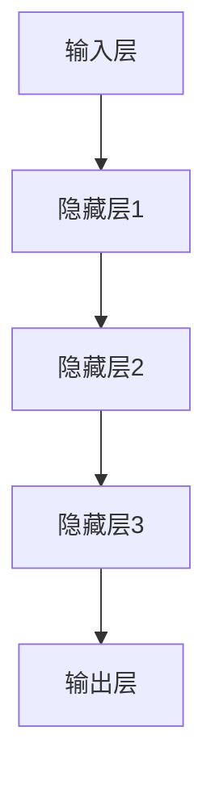
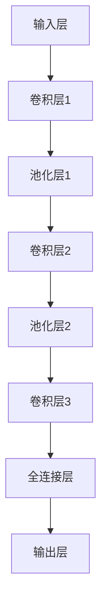
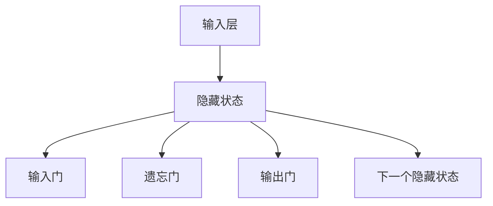

                 

## 《神经网络：人类智慧的解放》

> **关键词：** 神经网络、深度学习、人工智能、机器学习、神经架构、激活函数、优化算法、应用实践。

> **摘要：** 本文旨在深入探讨神经网络的基本概念、理论、架构以及优化方法，通过详细讲解和实际案例，揭示神经网络如何模拟人类智慧，并在人工智能领域中发挥关键作用。本文将帮助读者理解神经网络的核心原理，掌握其训练与优化的技术，从而为深度学习实践打下坚实基础。同时，文章还将展望神经网络的未来发展趋势，探讨其在人工智能领域中的潜在应用与挑战。

---

神经网络，作为一种模仿人脑信息处理过程的计算模型，已经成为了人工智能领域的核心组成部分。从最初的简单神经元模型到如今的深度学习网络，神经网络的发展经历了漫长的历程，并且不断地推动着人工智能的进步。本文将分章节系统地介绍神经网络的基本概念、数学基础、常见结构、优化方法以及应用实践，力求为广大读者提供一个全面而深入的探讨。

在接下来的章节中，我们将首先概述神经网络的发展历史和基本构成，解释神经网络如何通过前向传播和反向传播模拟人脑的思考过程。随后，我们将介绍神经网络的数学基础，包括线性代数、微积分和概率论，为理解复杂的神经网络模型打下基础。接着，我们将深入探讨前馈神经网络、卷积神经网络和循环神经网络等常见结构，通过详细的算法原理讲解和实际案例，展示神经网络在图像识别、自然语言处理等领域的应用。此外，我们还将讨论神经网络的正则化技术、非线性优化方法以及强化学习与神经网络的关系，为读者提供优化神经网络性能的实用技巧。

文章的最后一部分将聚焦于深度学习模型的应用与实践，通过具体案例展示如何在实际项目中搭建和优化神经网络，最后对神经网络的未来发展趋势进行展望，探讨其在人工智能领域的潜在应用与面临的挑战。希望通过本文的深入探讨，读者能够更好地理解神经网络的核心原理，掌握其应用技巧，为人工智能的探索和发展贡献自己的力量。

---

### 《神经网络：人类智慧的解放》目录大纲

#### 第一部分：神经网络基础理论

- **第1章：神经网络概述**
  - 1.1 神经网络的起源与发展
  - 1.2 神经网络的基本构成
  - 1.3 神经网络的工作原理

- **第2章：神经网络的数学基础**
  - 2.1 线性代数基础
  - 2.2 微积分基础
  - 2.3 概率论基础

- **第3章：前馈神经网络**
  - 3.1 前馈神经网络的基本结构
  - 3.2 激活函数的选择与优化
  - 3.3 前馈神经网络的训练过程

- **第4章：非线性优化方法**
  - 4.1 非线性优化的基本概念
  - 4.2 梯度下降法
  - 4.3 随机梯度下降法

- **第5章：神经网络的正则化技术**
  - 5.1 过拟合与欠拟合
  - 5.2 正则化方法的介绍
  - 5.3 dropout技术的实现

- **第6章：卷积神经网络**
  - 6.1 卷积神经网络的基本概念
  - 6.2 卷积神经网络的结构与原理
  - 6.3 卷积神经网络的训练与优化

- **第7章：循环神经网络**
  - 7.1 循环神经网络的基本概念
  - 7.2 循环神经网络的结构与原理
  - 7.3 循环神经网络的训练与优化

- **第8章：强化学习与神经网络**
  - 8.1 强化学习的基本概念
  - 8.2 Q学习算法与神经网络
  - 8.3 策略梯度方法与神经网络

#### 第二部分：深度学习模型的应用与实践

- **第9章：深度学习在计算机视觉中的应用**
  - 9.1 图像分类
  - 9.2 目标检测
  - 9.3 图像生成

- **第10章：深度学习在自然语言处理中的应用**
  - 10.1 词嵌入
  - 10.2 序列标注
  - 10.3 机器翻译

- **第11章：深度学习在其他领域中的应用**
  - 11.1 健康医疗
  - 11.2 金融科技
  - 11.3 自动驾驶

#### 第三部分：神经网络的未来展望

- **第12章：神经网络的发展趋势**
  - 12.1 深度学习的发展方向
  - 12.2 神经架构搜索
  - 12.3 脑机接口技术

- **第13章：神经网络在人工智能领域的未来应用**
  - 13.1 智能助手
  - 13.2 物联网
  - 13.3 人工智能安全

- **第14章：神经网络面临的挑战与应对策略**
  - 14.1 计算资源消耗
  - 14.2 数据隐私保护
  - 14.3 道德与伦理问题

通过上述目录大纲，读者将系统地了解神经网络的基础理论、常见结构、优化方法以及应用实践，进而对神经网络在人工智能领域的应用和未来发展趋势有更深入的认识。接下来，我们将逐一探讨每个章节的核心内容，逐步揭示神经网络的奥秘。

### 第一部分：神经网络基础理论

#### 第1章：神经网络概述

神经网络是一种模仿人脑结构和功能的信息处理系统。它的核心思想是通过大量的简单处理单元（即神经元）的相互连接和协同工作，来实现复杂的任务处理和模式识别。在本章中，我们将介绍神经网络的发展历史、基本构成和工作原理，帮助读者建立对神经网络的整体认知。

##### 1.1 神经网络的起源与发展

神经网络的起源可以追溯到20世纪40年代，当时数学家麦卡洛克（Warren McCulloch）和物理学家皮茨（Walter Pitts）提出了第一个数学模型——麦卡洛克-皮茨（McCulloch-Pitts，MCP）神经元。MCP神经元是一个简单的逻辑门电路，能够模拟人脑神经元的二值开关行为。这一模型奠定了神经网络理论的基础。

随后的几十年中，神经网络经历了多次起伏。20世纪80年代，由于计算机性能的限制和算法上的瓶颈，神经网络的研究陷入了低谷。然而，随着计算机硬件的发展和算法的进步，特别是在21世纪初，神经网络迎来了新的生机，特别是深度学习（Deep Learning）的兴起，使得神经网络在图像识别、语音识别和自然语言处理等领域取得了突破性的进展。

##### 1.2 神经网络的基本构成

神经网络由多个简单的处理单元——神经元组成，每个神经元都与其他神经元通过连接（权重）相连。这些连接和神经元共同构成了神经网络的复杂结构。

1. **神经元**：
   - 神经元是神经网络的基本构建块，它接收来自其他神经元的输入信号，通过加权求和后，经过一个激活函数产生输出。
   - 神经元的基本结构通常包括三个部分：输入、权重和激活函数。
     - **输入**：来自其他神经元的输入信号。
     - **权重**：每个输入信号的权重，反映了神经元之间的连接强度。
     - **激活函数**：用于确定神经元是否被激活的函数。

2. **连接**：
   - 神经元之间的连接通过权重来表示，这些权重可以通过学习过程进行调节，以优化神经网络的性能。
   - 连接可以是单向的（前馈连接）或双向的（反馈连接），构成了不同类型的神经网络结构。

3. **层**：
   - 神经网络通常由多个层组成，包括输入层、隐藏层和输出层。
     - **输入层**：接收外部输入信息。
     - **隐藏层**：位于输入层和输出层之间，用于处理和提取特征。
     - **输出层**：产生最终的输出结果。

##### 1.3 神经网络的工作原理

神经网络的工作原理可以分为两个主要过程：前向传播和反向传播。

1. **前向传播**：
   - 在前向传播过程中，输入信号从输入层开始，逐层传递到隐藏层，最终到达输出层。
   - 在每个神经元中，输入信号通过权重加权求和，然后通过激活函数产生输出。
   - 激活函数的作用是引入非线性，使得神经网络能够处理复杂的问题。

2. **反向传播**：
   - 在反向传播过程中，网络根据输出结果和预期目标之间的误差，反向计算每个神经元的梯度。
   - 梯度用于更新神经元之间的权重，通过多次迭代优化网络参数。
   - 反向传播是神经网络训练的核心，它使得神经网络能够不断调整自身的参数，以减少误差并提高性能。

通过前向传播和反向传播，神经网络能够逐步学习输入和输出之间的关系，从而实现复杂的模式识别和预测任务。

在本章的末尾，我们将使用Mermaid流程图来展示神经网络的工作原理。接下来，我们将继续介绍神经网络的数学基础，包括线性代数、微积分和概率论，为理解复杂的神经网络模型打下基础。

---

在了解了神经网络的发展历史、基本构成和工作原理后，我们接下来将深入探讨神经网络的数学基础。线性代数、微积分和概率论是构建和理解神经网络不可或缺的数学工具。通过本章的学习，我们将为后续更复杂的神经网络模型和算法奠定坚实的数学基础。

#### 第2章：神经网络的数学基础

##### 2.1 线性代数基础

线性代数是神经网络不可或缺的数学工具，它提供了处理多维数据结构和变换的基本框架。在神经网络中，线性代数广泛应用于矩阵运算、向量计算和特征提取。

1. **矩阵与向量**：
   - 矩阵（Matrix）是一个由元素排列成的二维数组，通常用于表示数据集或神经网络中的权重。
   - 向量（Vector）是矩阵的一种特殊形式，可以看作是一维的矩阵。
   - 矩阵和向量之间的运算包括加法、减法、标量乘法和矩阵乘法。

2. **矩阵乘法**：
   - 矩阵乘法是神经网络中最重要的运算之一，用于计算输入和权重的乘积。
   - 两个矩阵相乘的结果是一个新矩阵，其元素是原矩阵元素乘积的和。
   - 矩阵乘法不仅用于计算神经网络中的中间结果，还在优化算法中用于计算梯度。

3. **矩阵求导**：
   - 在反向传播过程中，我们需要计算矩阵的导数以更新权重。
   - 矩阵求导涉及到雅可比矩阵（Jacobian matrix），它描述了矩阵的每个元素对其他元素的影响。

4. **特征值与特征向量**：
   - 特征值和特征向量是矩阵的重要属性，用于理解矩阵的线性变换特性。
   - 在神经网络中，特征值和特征向量可以用于特征提取和降维。

##### 2.2 微积分基础

微积分是研究函数变化率和积分的数学分支，它在神经网络中主要用于优化算法和误差计算。

1. **导数**：
   - 导数（Derivative）描述了函数在某一点的瞬时变化率。
   - 在神经网络中，导数用于计算误差相对于每个参数的梯度，从而更新权重。

2. **梯度**：
   - 梯度（Gradient）是向量，它包含了每个参数的偏导数。
   - 梯度用于指导反向传播算法，通过调整权重来最小化误差。

3. **偏导数**：
   - 偏导数（Partial Derivative）是多元函数对一个变量的导数。
   - 在神经网络中，偏导数用于计算误差函数对每个权重的偏导数。

4. **微分方程**：
   - 微分方程（Differential Equation）描述了函数和其导数之间的关系。
   - 在神经网络中，微分方程可以用于描述神经网络的动态行为，如时间序列模型。

##### 2.3 概率论基础

概率论是研究随机事件和不确定性的数学分支，它在神经网络中用于描述数据的概率分布和预测结果的不确定性。

1. **概率分布**：
   - 概率分布（Probability Distribution）描述了随机变量可能取值的概率。
   - 在神经网络中，概率分布用于生成随机数、进行模型评估和不确定性分析。

2. **期望与方差**：
   - 期望（Expectation）是随机变量的平均值，用于评估模型的预测性能。
   - 方差（Variance）是随机变量离散程度的度量，用于评估模型的稳定性。

3. **贝叶斯定理**：
   - 贝叶斯定理（Bayes' Theorem）描述了后验概率与先验概率的关系。
   - 在神经网络中，贝叶斯定理用于概率推理和模型选择。

4. **条件概率**：
   - 条件概率（Conditional Probability）描述了在给定某个条件下，另一个事件发生的概率。
   - 在神经网络中，条件概率用于处理不确定性和依赖关系。

通过本章的学习，我们了解了神经网络所需的线性代数、微积分和概率论的基本概念和原理。这些数学工具为理解复杂的神经网络模型和算法奠定了坚实的基础。在接下来的章节中，我们将深入探讨神经网络的具体结构和工作原理，通过详细的算法原理讲解和实际案例，帮助读者更好地掌握神经网络的本质和应用。

### 第3章：前馈神经网络

前馈神经网络（Feedforward Neural Network，FNN）是神经网络中最基本的形式之一，它通过层与层之间的直接连接来实现数据的传递和处理。在前馈神经网络中，信息从输入层经过一系列隐藏层传递到输出层，整个过程不包含任何循环或反馈路径。本章将详细探讨前馈神经网络的基本结构、激活函数的选择与优化，以及其训练过程。

#### 3.1 前馈神经网络的基本结构

前馈神经网络由多个层组成，包括输入层、一个或多个隐藏层以及输出层。每一层都由多个神经元构成，神经元之间通过加权连接相连。以下是前馈神经网络的基本结构：

1. **输入层（Input Layer）**：
   - 输入层接收外部输入数据，每个输入数据对应一个输入神经元。
   - 输入层的神经元数量通常等于输入特征的维度。

2. **隐藏层（Hidden Layers）**：
   - 隐藏层位于输入层和输出层之间，用于对输入数据进行特征提取和变换。
   - 隐藏层的数量和每个层的神经元数量可以根据问题复杂度进行调整。

3. **输出层（Output Layer）**：
   - 输出层产生最终的输出结果，其神经元数量和类型取决于具体的任务需求。
   - 对于分类任务，输出层通常是一个softmax层，用于生成类别的概率分布。

以下是一个简化的前馈神经网络结构的Mermaid流程图：



#### 3.2 激活函数的选择与优化

激活函数是神经网络中的一个关键组件，它引入了非线性，使得神经网络能够解决复杂的问题。常见的激活函数包括Sigmoid、ReLU和Tanh等。选择合适的激活函数并对其进行优化，对于提高神经网络性能至关重要。

1. **Sigmoid函数**：
   - Sigmoid函数是一个S形的曲线，其公式为：\( \sigma(x) = \frac{1}{1 + e^{-x}} \)。
   - Sigmoid函数将输入值映射到(0,1)区间，但存在梯度消失问题，即当输入值较大或较小时，梯度接近于0，导致训练过程缓慢。

2. **ReLU函数**：
   -ReLU（Rectified Linear Unit）函数是一个线性函数，其公式为：\( \text{ReLU}(x) = \max(0, x) \)。
   -ReLU函数在输入为正时输出等于输入，为负时输出为0。它解决了梯度消失问题，且计算简单，但存在梯度死亡问题，即当输入值较小且为负时，梯度为0，导致神经元可能无法恢复。

3. **Tanh函数**：
   -Tanh（Hyperbolic Tangent）函数是Sigmoid函数的扩展，其公式为：\( \text{Tanh}(x) = \frac{e^{x} - e^{-x}}{e^{x} + e^{-x}} \)。
   -Tanh函数将输入值映射到(-1,1)区间，解决了梯度消失问题，但同样存在计算复杂度较高的问题。

为了优化激活函数，可以采取以下策略：

- **选择合适的函数**：根据问题的具体需求，选择具有良好特性的激活函数。
- **函数组合**：使用多个激活函数组合，以取长补短。
- **优化算法**：通过改进优化算法，如自适应学习率调整，加速训练过程。

以下是一个使用伪代码表示的ReLU函数：

```python
def ReLU(x):
    if x > 0:
        return x
    else:
        return 0
```

#### 3.3 前馈神经网络的训练过程

前馈神经网络的训练过程主要包括前向传播和反向传播两个阶段。通过这两个阶段，神经网络能够不断调整权重和偏置，以最小化误差。

1. **前向传播**：
   - 在前向传播过程中，输入数据从输入层传递到隐藏层，再传递到输出层。
   - 在每个神经元中，输入值通过权重加权求和，然后经过激活函数产生输出。
   - 输出结果与实际目标值进行比较，计算误差。

2. **反向传播**：
   - 在反向传播过程中，网络根据误差计算每个神经元的梯度。
   - 梯度用于更新神经元之间的权重和偏置，以减少误差。
   - 反向传播通过链式法则计算每个参数的梯度。

以下是一个简化的前向传播和反向传播的伪代码：

```python
# 前向传播
def forward_propagation(x, weights, biases, activation_function):
    hidden_layer_input = x.dot(weights) + biases
    hidden_layer_output = activation_function(hidden_layer_input)
    output_layer_input = hidden_layer_output.dot(weights) + biases
    output_layer_output = activation_function(output_layer_input)
    return output_layer_output

# 反向传播
def backward_propagation(y, output_layer_output, activation_derivative, weights, biases):
    output_error = y - output_layer_output
    output_delta = output_error * activation_derivative(output_layer_input)
    hidden_error = output_delta.dot(weights.T)
    hidden_delta = hidden_error * activation_derivative(hidden_layer_input)
    
    # 更新权重和偏置
    weights -= learning_rate * hidden_layer_output.T.dot(output_delta)
    biases -= learning_rate * output_delta
    weights -= learning_rate * hidden_layer_input.T.dot(hidden_delta)
    biases -= learning_rate * hidden_delta
```

通过本章的介绍，我们了解了前馈神经网络的基本结构、激活函数的选择与优化，以及其训练过程。前馈神经网络是神经网络的基础，其良好的性能和简单的结构使其在众多应用中得到了广泛使用。在下一章中，我们将深入探讨非线性优化方法，包括梯度下降法和随机梯度下降法，以优化前馈神经网络的训练过程。

### 第4章：非线性优化方法

在前馈神经网络的训练过程中，优化算法起着至关重要的作用。非线性优化方法通过迭代调整网络参数，以最小化损失函数，从而提高网络性能。本章将详细探讨几种常见的非线性优化方法，包括梯度下降法、随机梯度下降法及其变种，帮助读者理解和选择合适的优化算法。

#### 4.1 非线性优化的基本概念

非线性优化是指在一个非线性函数空间中寻找最优解的过程。在神经网络中，损失函数通常是一个复杂的非线性函数，其最小值反映了网络的性能。非线性优化的目标是通过迭代更新参数，使损失函数值逐渐减小，直至收敛到一个局部最优解。

1. **损失函数**：
   - 损失函数（Loss Function）用于衡量网络输出与实际目标之间的误差。
   - 常见的损失函数包括均方误差（Mean Squared Error，MSE）、交叉熵（Cross-Entropy）等。
   - 损失函数的值越小，表示网络性能越好。

2. **梯度**：
   - 梯度（Gradient）是损失函数对每个参数的偏导数构成的向量。
   - 梯度指示了参数调整的方向，以减少损失函数的值。

3. **优化目标**：
   - 优化目标是在参数空间中找到一个使损失函数最小的点。
   - 非线性优化通过迭代调整参数，逐步逼近最优解。

#### 4.2 梯度下降法

梯度下降法（Gradient Descent）是最基本且最常用的优化算法之一。它的核心思想是沿着损失函数梯度的反方向调整参数，以逐步减少损失函数的值。

1. **算法步骤**：
   - 初始化参数 \( \theta \)。
   - 计算损失函数 \( J(\theta) \) 对参数 \( \theta \) 的梯度 \( \nabla J(\theta) \)。
   - 根据梯度反方向更新参数： \( \theta = \theta - \alpha \nabla J(\theta) \)，其中 \( \alpha \) 是学习率（Learning Rate）。

2. **学习率**：
   - 学习率决定了参数更新的步长。
   - 较大的学习率可能导致参数更新过度，从而错过最优解。
   - 较小的学习率可能导致收敛速度慢。

3. **优化过程**：
   - 梯度下降法通过迭代更新参数，逐步减少损失函数的值。
   - 迭代过程可能收敛到局部最优解，需要选择合适的学习率和初始参数。

以下是一个简化的梯度下降法的伪代码：

```python
def gradient_descent(X, y, theta, learning_rate, num_iterations):
    for i in range(num_iterations):
        gradients = compute_gradient(X, y, theta)
        theta = theta - learning_rate * gradients
    return theta
```

#### 4.3 随机梯度下降法

随机梯度下降法（Stochastic Gradient Descent，SGD）是一种改进的梯度下降法，它使用随机样本来计算梯度，从而加速收敛。SGD通过随机抽样数据子集，在每个迭代步骤中更新参数。

1. **算法步骤**：
   - 初始化参数 \( \theta \)。
   - 随机选择一个小批量（Mini-batch）数据 \( (x_i, y_i) \)。
   - 计算该批量数据的梯度 \( \nabla J(\theta) \)。
   - 根据梯度反方向更新参数： \( \theta = \theta - \alpha \nabla J(\theta) \)。

2. **优点**：
   - 加速收敛：SGD通过随机抽样减少了局部最优解的影响，加速了收敛过程。
   - 避免局部最优：SGD通过频繁的参数更新，减少了陷入局部最优解的风险。

3. **缺点**：
   - 不稳定性：SGD的收敛过程较梯度下降法更不稳定，需要更精细的参数调整。

以下是一个简化的随机梯度下降法的伪代码：

```python
def stochastic_gradient_descent(X, y, theta, learning_rate, num_iterations, batch_size):
    for i in range(num_iterations):
        for batch in create_batches(X, y, batch_size):
            gradients = compute_gradient(batch[0], batch[1], theta)
            theta = theta - learning_rate * gradients
    return theta
```

#### 4.4 非线性优化方法的比较与选择

1. **梯度下降法**：
   - 优点：简单、易于理解。
   - 缺点：收敛速度慢、可能陷入局部最优。

2. **随机梯度下降法**：
   - 优点：加速收敛、避免局部最优。
   - 缺点：不稳定、计算量大。

3. **批量梯度下降法**：
   - 优点：收敛稳定、梯度更准确。
   - 缺点：计算量大、收敛速度慢。

根据问题的具体需求和计算资源，可以选择合适的优化方法。例如，对于大型网络和大量数据，SGD可能是更好的选择；对于小型网络和少量数据，批量梯度下降法可能更合适。

通过本章的探讨，我们了解了非线性优化方法的基本概念和算法步骤，包括梯度下降法、随机梯度下降法等。这些方法在神经网络训练中起着关键作用，通过合理选择和调整优化算法，可以显著提高神经网络性能。在下一章中，我们将深入探讨神经网络的正则化技术，以防止过拟合和提升模型泛化能力。

### 第5章：神经网络的正则化技术

在神经网络训练过程中，过拟合（Overfitting）和欠拟合（Underfitting）是两个常见的问题。过拟合指的是模型对训练数据过于敏感，导致在训练数据上表现良好但在未知数据上表现不佳；而欠拟合则是指模型对训练数据的理解不足，未能充分捕捉数据中的复杂关系。为了解决这些问题，神经网络的正则化技术应运而生。本章将详细介绍过拟合与欠拟合的概念、正则化方法的原理及其在神经网络中的应用，特别是dropout技术。

#### 5.1 过拟合与欠拟合

1. **过拟合**：
   - 过拟合是指模型在训练数据上表现得非常好，但无法泛化到新的数据集上。
   - 原因：模型过于复杂，能够捕捉到训练数据中的噪声和细节，而非真正的规律。
   - 解决方法：引入正则化技术，限制模型复杂度，提高泛化能力。

2. **欠拟合**：
   - 欠拟合是指模型在训练数据上表现不佳，无法捕捉数据中的复杂关系。
   - 原因：模型过于简单，无法捕捉到数据中的重要特征。
   - 解决方法：增加模型复杂度，使用更多的神经元和层，或者使用更复杂的激活函数。

#### 5.2 正则化方法的介绍

正则化（Regularization）是一种在损失函数中引入惩罚项的技术，用于防止模型过拟合。常见的正则化方法包括L1正则化（L1 Regularization）和L2正则化（L2 Regularization）。

1. **L1正则化**：
   - L1正则化在损失函数中引入L1范数惩罚项，即 \( \lambda ||\theta||_1 \)，其中 \( \theta \) 是模型的参数，\( \lambda \) 是正则化强度。
   - L1正则化能够导致一些参数变为0，从而简化模型，提高稀疏性。

2. **L2正则化**：
   - L2正则化在损失函数中引入L2范数惩罚项，即 \( \lambda ||\theta||_2^2 \)。
   - L2正则化对参数进行平滑惩罚，避免了参数过大或过小的极端情况。

以下是一个简化的L2正则化的伪代码：

```python
def L2_regularization(loss, theta, lambda):
    regularization_term = lambda * (1/2) * sum(theta ** 2)
    return loss + regularization_term
```

#### 5.3 dropout技术的实现

dropout（Dropout）是一种有效的正则化技术，通过在训练过程中随机丢弃部分神经元，减少神经元之间的相互依赖，防止过拟合。dropout通过在训练过程中随机忽略一部分神经元的输出，使得神经网络在每次迭代中都有不同的结构，从而增加了模型的泛化能力。

1. **dropout原理**：
   - 在训练过程中，对于每个隐藏层的每个神经元，以一定的概率 \( p \) 随机丢弃其输出。
   - 在测试过程中，不进行随机丢弃，而是使用训练时保存的权重和偏置。

2. **实现步骤**：
   - 对于每个隐藏层，计算丢弃概率 \( p \)。
   - 在训练过程中，对于每个神经元，以概率 \( p \) 随机丢弃其输出。
   - 计算未丢弃神经元的输出，并将其传递到下一层。

以下是一个简化的dropout技术的伪代码：

```python
import numpy as np

def dropout(x, p):
    dropout_mask = np.random.rand(*x.shape) < p
    return x * dropout_mask

# 前向传播
def forward_propagation_with_dropout(x, weights, biases, p):
    hidden_layer_input = x.dot(weights) + biases
    hidden_layer_output = activation_function(hidden_layer_input)
    hidden_layer_output = dropout(hidden_layer_output, p)
    return hidden_layer_output

# 反向传播
def backward_propagation_with_dropout(y, output_layer_output, activation_derivative, weights, biases, p):
    output_error = y - output_layer_output
    output_delta = output_error * activation_derivative(output_layer_input)
    output_layer_input = dropout(output_layer_input, p)  # 重计算未丢弃部分的输入
    hidden_error = output_delta.dot(weights.T)
    hidden_delta = hidden_error * activation_derivative(hidden_layer_input)
    hidden_layer_input = dropout(hidden_layer_input, p)  # 重计算未丢弃部分的输入
    return hidden_delta
```

通过本章的介绍，我们了解了神经网络的正则化技术，包括过拟合与欠拟合的概念、L1正则化和L2正则化的原理以及dropout技术的实现。正则化技术在防止过拟合、提高模型泛化能力方面发挥着重要作用。在下一章中，我们将探讨卷积神经网络，了解其在图像处理中的应用和独特优势。

### 第6章：卷积神经网络

卷积神经网络（Convolutional Neural Network，CNN）是深度学习领域中用于处理图像数据的一种强大模型。与传统的全连接神经网络相比，CNN具有结构简洁、计算效率高、特征自动提取等优点。本章将详细探讨卷积神经网络的基本概念、结构与原理，并分析其在图像识别、目标检测等领域的应用。

#### 6.1 卷积神经网络的基本概念

卷积神经网络的核心在于其特有的卷积操作和池化操作，这些操作使得CNN能够有效地从图像数据中提取特征。

1. **卷积操作**：
   - 卷积操作是一种数学运算，通过将图像数据与一组可学习的卷积核（filter）进行卷积，生成新的特征图（feature map）。
   - 卷积核是一个小的矩阵，用于捕捉图像中的局部特征，如边缘、纹理等。
   - 卷积操作能够将图像的高维数据转换成低维特征表示，从而简化了计算过程。

2. **池化操作**：
   - 池化操作是对特征图进行下采样，以减少数据的维度，提高计算效率。
   - 常见的池化方式包括最大池化（Max Pooling）和平均池化（Average Pooling）。
   - 池化操作有助于减少过拟合，提高模型的泛化能力。

3. **深度卷积神经网络**：
   - 深度卷积神经网络（Deep CNN）是通过堆叠多个卷积层和池化层，形成多层网络结构。
   - 多层的卷积和池化操作能够逐步提取图像的层次特征，从简单到复杂。

以下是一个简化的卷积神经网络结构的Mermaid流程图：



#### 6.2 卷积神经网络的结构与原理

1. **卷积层**：
   - 卷积层是CNN的核心组成部分，通过卷积操作提取图像特征。
   - 每个卷积层由多个卷积核组成，每个卷积核对输入图像进行局部卷积，生成特征图。
   - 卷积层的输出特征图包含了图像的局部特征，如边缘、角点等。

2. **池化层**：
   - 池化层位于卷积层之后，用于减少特征图的尺寸，从而降低计算复杂度。
   - 最大池化（Max Pooling）选取每个特征图窗口中的最大值，保持重要的特征信息。
   - 平均池化（Average Pooling）计算每个特征图窗口内的平均值，减少噪声影响。

3. **全连接层**：
   - 全连接层是将前一层输出的特征图映射到输出层，通过全连接的方式实现分类或其他任务。
   - 全连接层的神经元数量通常等于输出类别的数量。
   - 在分类任务中，全连接层通过softmax函数输出类别的概率分布。

4. **激活函数**：
   - 激活函数是卷积神经网络中引入非线性的一种手段，常用的激活函数包括ReLU（Rectified Linear Unit）和Sigmoid等。
   - ReLU函数能够加速训练过程，并防止梯度消失问题。

以下是一个卷积层和全连接层的伪代码：

```python
# 卷积层
def convolutional_layer(input, weights, biases, filter_size, stride, padding):
    output = np.zeros((input.shape[0], input.shape[1] - filter_size + 1, input.shape[2] - filter_size + 1))
    for i in range(output.shape[0]):
        for j in range(output.shape[1]):
            for k in range(output.shape[2]):
                window = input[i, j:j+filter_size, k:k+filter_size]
                output[i, j, k] = np.sum(window * weights) + biases
    return activation_function(output)

# 全连接层
def fully_connected_layer(input, weights, biases):
    output = input.dot(weights) + biases
    return activation_function(output)
```

#### 6.3 卷积神经网络的训练与优化

卷积神经网络的训练过程与传统的全连接神经网络类似，包括前向传播和反向传播两个阶段。不同的是，卷积神经网络需要针对卷积层和池化层进行特定的计算。

1. **前向传播**：
   - 从输入层开始，依次通过卷积层、池化层和全连接层，生成输出。
   - 在卷积层中，使用卷积操作和激活函数。
   - 在池化层中，进行下采样操作。
   - 在全连接层中，通过线性变换和激活函数。

2. **反向传播**：
   - 从输出层开始，反向计算每个层的梯度。
   - 在卷积层中，计算每个卷积核的梯度。
   - 在池化层中，需要根据上采样操作恢复梯度。
   - 在全连接层中，计算每个神经元的梯度。

以下是一个简化的反向传播过程的伪代码：

```python
# 反向传播（卷积层）
def backward_propagation_convolutional_layer(dOutput, activation_derivative, weights, biases):
    dWeights = dOutput.dot(dInput.T)
    dBiases = np.sum(dOutput, axis=0)
    dInput = dOutput.dot(weights.T).dot(activation_derivative(dInput))
    return dWeights, dBiases, dInput

# 反向传播（全连接层）
def backward_propagation_fully_connected_layer(dOutput, activation_derivative, weights, biases):
    dWeights = dOutput.T.dot(dInput)
    dBiases = np.sum(dOutput, axis=0)
    dInput = dOutput.dot(activation_derivative(dInput))
    return dWeights, dBiases, dInput
```

通过本章的介绍，我们了解了卷积神经网络的基本概念、结构与原理，以及其在图像识别、目标检测等领域的应用。CNN通过卷积操作和池化操作，能够自动提取图像中的高层次特征，大大简化了特征工程的过程，并取得了显著的性能提升。在下一章中，我们将探讨循环神经网络，了解其在序列数据处理中的独特优势。

### 第7章：循环神经网络

循环神经网络（Recurrent Neural Network，RNN）是一种用于处理序列数据的时间序列模型。与传统的神经网络不同，RNN具有记忆功能，能够通过循环结构保持对过去输入的依赖，从而有效地处理变长序列数据。本章将详细探讨循环神经网络的基本概念、结构与原理，并分析其在语言模型、语音识别等领域的应用。

#### 7.1 循环神经网络的基本概念

循环神经网络的核心在于其独特的循环结构，这种结构使得RNN能够通过隐藏状态（hidden state）在时间步之间传递信息，从而处理序列数据。

1. **隐藏状态**：
   - 隐藏状态是RNN的核心组件，它代表了当前时刻的信息，并能够存储对过去信息的依赖。
   - 在每个时间步，隐藏状态通过前一个时间步的隐藏状态和当前输入进行更新。

2. **循环结构**：
   - RNN的循环结构使得网络能够通过隐藏状态在时间步之间传递信息，保持对过去输入的依赖。
   - 这种循环机制使得RNN能够处理变长序列数据，如自然语言文本、语音信号等。

3. **门控机制**：
   - 为了更好地控制信息的传递和遗忘，RNN引入了门控机制（Gate Mechanism），包括输入门（Input Gate）、遗忘门（Forget Gate）和输出门（Output Gate）。
   - 这些门控机制能够动态地控制信息的保留和遗忘，提高了模型的灵活性和表现能力。

以下是一个简化的RNN结构的Mermaid流程图：



#### 7.2 循环神经网络的结构与原理

1. **基本结构**：
   - RNN的基本结构包括输入层、隐藏层和输出层。
   - 输入层接收序列数据，隐藏层用于处理和存储序列信息，输出层产生最终的输出。

2. **隐藏状态更新**：
   - 在每个时间步，RNN通过当前输入和前一个时间步的隐藏状态，计算新的隐藏状态。
   - 隐藏状态更新方程为：\( h_t = \sigma(W_h \cdot [h_{t-1}, x_t] + b_h) \)，其中 \( \sigma \) 是激活函数，\( W_h \) 和 \( b_h \) 分别是权重和偏置。

3. **输出计算**：
   - RNN的输出通过隐藏状态和输出层进行计算。
   - 输出方程为：\( y_t = \sigma(W_y \cdot h_t + b_y) \)，其中 \( \sigma \) 是激活函数，\( W_y \) 和 \( b_y \) 分别是权重和偏置。

4. **门控机制**：
   - 输入门（Input Gate）控制当前输入对隐藏状态的影响。
   - 遗忘门（Forget Gate）控制隐藏状态中信息的遗忘。
   - 输出门（Output Gate）控制隐藏状态对输出的影响。
   - 门控机制通过以下方程实现：
     - 输入门：\( i_t = \sigma(W_i \cdot [h_{t-1}, x_t] + b_i) \)
     - 遗忘门：\( f_t = \sigma(W_f \cdot [h_{t-1}, x_t] + b_f) \)
     - 输出门：\( o_t = \sigma(W_o \cdot [h_{t-1}, x_t] + b_o) \)

5. **梯度消失与梯度爆炸**：
   - RNN的一个主要问题是梯度消失和梯度爆炸问题，这些问题导致训练过程困难。
   - 为了解决这些问题，可以采用长短期记忆网络（Long Short-Term Memory，LSTM）或门控循环单元（Gated Recurrent Unit，GRU）等改进模型。

以下是一个简化的RNN门控机制的伪代码：

```python
def RNN(input, weights, biases):
    hidden_state = np.zeros((1, hidden_size))
    for x in input:
        input_gate = sigmoid(np.dot([hidden_state, x], weights_input + biases_input))
        forget_gate = sigmoid(np.dot([hidden_state, x], weights_forget + biases_forget))
        output_gate = sigmoid(np.dot([hidden_state, x], weights_output + biases_output))
        hidden_state = forget_gate * hidden_state + input_gate * x
        output = output_gate * sigmoid(np.dot(hidden_state, weights_output + biases_output))
    return output
```

#### 7.3 循环神经网络的训练与优化

循环神经网络的训练过程与前向传播和反向传播两个阶段密切相关。通过反向传播，RNN能够不断调整权重和门控参数，以最小化损失函数。

1. **前向传播**：
   - 在前向传播过程中，RNN逐个处理序列数据，更新隐藏状态和输出。
   - 输入门、遗忘门和输出门分别通过前一个隐藏状态和当前输入进行计算。

2. **反向传播**：
   - 在反向传播过程中，RNN通过计算损失函数的梯度，更新权重和门控参数。
   - 为了解决梯度消失和梯度爆炸问题，可以采用梯度裁剪（Gradient Clipping）或LSTM等改进模型。

以下是一个简化的反向传播过程的伪代码：

```python
def backward_propagation(loss, hidden_state, weights, biases):
    dWeights_input = dHidden_state.dot(hidden_state.T)
    dWeights_forget = dHidden_state.dot(hidden_state.T)
    dWeights_output = dOutput.dot(hidden_state.T)
    dBiases_input = dHidden_state
    dBiases_forget = dHidden_state
    dBiases_output = dOutput
    dHidden_state = (1 - forget_gate) * dHidden_state
    return dWeights_input, dWeights_forget, dWeights_output, dBiases_input, dBiases_forget, dBiases_output, dHidden_state
```

通过本章的介绍，我们了解了循环神经网络的基本概念、结构与原理，以及其在序列数据处理中的独特优势。RNN通过循环结构和门控机制，能够有效地处理变长序列数据，并在自然语言处理、语音识别等应用中取得了显著成果。在下一章中，我们将探讨强化学习与神经网络的关系，了解如何利用神经网络实现强化学习算法。

### 第8章：强化学习与神经网络

强化学习（Reinforcement Learning，RL）是一种通过试错法（trial-and-error）来学习如何在特定环境中做出最优决策的机器学习方法。与监督学习和无监督学习不同，强化学习通过奖励信号（reward signal）不断调整策略，以最大化累积奖励。神经网络在强化学习中起到了至关重要的作用，通过模拟人类思考和决策过程，提高了学习效率和决策质量。本章将详细探讨强化学习的基本概念、神经网络在强化学习中的应用，以及Q学习和策略梯度方法等经典算法。

#### 8.1 强化学习的基本概念

强化学习由四个主要组成部分：环境（Environment）、代理（Agent）、状态（State）和动作（Action）。

1. **环境**：
   - 环境是一个定义明确的系统，包含代理和外部因素，如物理世界或虚拟环境。
   - 环境的状态和动作空间是预先定义的。

2. **代理**：
   - 代理是强化学习模型，通过接收状态和发送动作，与环境进行交互。
   - 代理的目标是通过最大化累积奖励，学习最优策略。

3. **状态**：
   - 状态是描述代理当前所处环境条件的信息。
   - 状态可以是离散的，也可以是连续的。

4. **动作**：
   - 动作是代理在特定状态下可以采取的操作。
   - 动作的选择通常基于当前状态和代理的策略。

5. **奖励信号**：
   - 奖励信号是环境对代理采取的动作的即时反馈，用于评价动作的好坏。
   - 累积奖励是每个时间步奖励的总和，是代理学习的目标。

强化学习的目标是通过学习策略（Policy），使得代理在给定状态下选择最优动作，从而最大化累积奖励。策略可以表示为：\( \pi(a|s) = P(a|s) \)，其中 \( a \) 是动作，\( s \) 是状态。

#### 8.2 Q学习算法与神经网络

Q学习（Q-Learning）是一种基于值函数（Value Function）的强化学习算法，通过迭代更新Q值，以预测最优动作的选择。Q值表示在给定状态下采取特定动作的期望累积奖励。

1. **Q值**：
   - Q值是代理对某个状态和动作的评估值，表示在状态 \( s \) 下采取动作 \( a \) 的期望累积奖励。
   - Q值的更新公式为：\( Q(s, a) = Q(s, a) + \alpha [r + \gamma \max_{a'} Q(s', a') - Q(s, a)] \)，其中 \( \alpha \) 是学习率，\( \gamma \) 是折扣因子，\( s' \) 是采取动作后的新状态。

2. **Q学习算法**：
   - Q学习通过迭代更新Q值，逐步逼近最优策略。
   - 在每个时间步，代理根据当前Q值选择动作，并更新Q值。
   - Q学习算法不需要明确的模型，适用于环境状态和动作空间复杂的情况。

3. **神经网络在Q学习中的应用**：
   - 为了提高Q学习算法的效率和精度，可以使用神经网络来近似Q值函数。
   - 神经网络能够处理高维输入，并通过反向传播算法更新权重，从而提高Q值的预测能力。

以下是一个简化的神经网络Q学习算法的伪代码：

```python
def Q_learning(state, action, reward, next_state, learning_rate, discount_factor):
    current_Q = model.predict([state, action])
    next_Q = model.predict([next_state, action])
    target_Q = reward + discount_factor * np.max(next_Q)
    model.fit(np.array([state, action]), target_Q, epochs=1, verbose=0)
```

#### 8.3 策略梯度方法与神经网络

策略梯度方法是一种基于策略的强化学习算法，通过直接优化策略的梯度来最大化累积奖励。策略梯度方法可以分为基于值函数的策略梯度方法和直接策略梯度方法。

1. **基于值函数的策略梯度方法**：
   - 基于值函数的策略梯度方法通过值函数的梯度来更新策略。
   - 策略梯度公式为：\( \nabla_{\pi} J(\theta) = \nabla_{\theta} \sum_{s,a} \pi(a|s) Q(s, a) \)，其中 \( \theta \) 是策略参数，\( J(\theta) \) 是策略的损失函数。
   - 策略参数的更新公式为：\( \theta = \theta - \alpha \nabla_{\theta} J(\theta) \)，其中 \( \alpha \) 是学习率。

2. **直接策略梯度方法**：
   - 直接策略梯度方法通过直接优化策略的梯度来更新策略。
   - 策略梯度公式为：\( \nabla_{\pi} J(\theta) = \nabla_{\theta} \log \pi(a|s; \theta) \)，其中 \( \theta \) 是策略参数。
   - 策略参数的更新公式为：\( \theta = \theta - \alpha \nabla_{\theta} J(\theta) \)，其中 \( \alpha \) 是学习率。

3. **神经网络在策略梯度方法中的应用**：
   - 使用神经网络来近似策略函数，可以处理复杂的环境和动作空间。
   - 神经网络通过反向传播算法，可以高效地更新策略参数。
   - 策略梯度方法可以结合深度学习技术，实现更加复杂和灵活的策略学习。

以下是一个简化的策略梯度方法的伪代码：

```python
def policy_gradient(policy_model, state, action, reward, next_state, learning_rate):
    log_prob = policy_model.predict([state, action])
    advantages = Q_model.predict([next_state, action]) - reward
    policy_gradient = log_prob * advantages
    policy_model.fit([state, action], policy_gradient, epochs=1, verbose=0)
```

通过本章的介绍，我们了解了强化学习的基本概念、神经网络在强化学习中的应用，以及Q学习和策略梯度方法等经典算法。神经网络通过模拟人类思考和决策过程，提高了强化学习算法的学习效率和决策质量。在下一章中，我们将探讨深度学习模型在计算机视觉、自然语言处理等领域的应用，展示神经网络如何解决实际问题。

### 第9章：深度学习模型的应用与实践

深度学习模型凭借其强大的特征提取和模式识别能力，在多个领域中取得了显著的成果。本章将详细探讨深度学习模型在计算机视觉、自然语言处理等领域的应用，通过具体案例和实际项目，展示如何搭建和优化深度学习模型，解决实际问题。

#### 9.1 深度学习在计算机视觉中的应用

计算机视觉是深度学习应用最广泛的领域之一，深度学习模型通过自动学习图像特征，实现了从简单的图像分类到复杂的物体检测和分割等任务。

1. **图像分类**：
   - 图像分类是计算机视觉的基础任务，通过将图像分为不同的类别，实现对图像内容的理解。
   - 常见的图像分类任务包括 handwritten digit recognition、image recognition等。
   - 神经网络模型如LeNet、AlexNet、VGG、ResNet等广泛应用于图像分类任务。

2. **目标检测**：
   - 目标检测是计算机视觉中的一个重要任务，旨在确定图像中特定对象的位置和类别。
   - 常见的目标检测算法包括 R-CNN、Fast R-CNN、Faster R-CNN、YOLO等。
   - 目标检测模型通过结合深度学习和传统图像处理技术，实现了高效且准确的物体检测。

3. **图像分割**：
   - 图像分割是将图像中的每个像素划分为不同的区域，以实现更精细的图像理解。
   - 常见的图像分割算法包括 FCN、U-Net、DeepLab等。
   - 图像分割在医学影像、自动驾驶等领域具有广泛的应用。

以下是一个简化的目标检测模型的搭建和优化过程：

```python
from tensorflow.keras.models import Model
from tensorflow.keras.layers import Input, Conv2D, MaxPooling2D, Flatten, Dense

# 搭建模型
input_layer = Input(shape=(224, 224, 3))
conv1 = Conv2D(32, (3, 3), activation='relu')(input_layer)
pool1 = MaxPooling2D(pool_size=(2, 2))(conv1)
conv2 = Conv2D(64, (3, 3), activation='relu')(pool1)
pool2 = MaxPooling2D(pool_size=(2, 2))(conv2)
flatten = Flatten()(pool2)
dense = Dense(1024, activation='relu')(flatten)
output_layer = Dense(num_classes, activation='softmax')(dense)

model = Model(inputs=input_layer, outputs=output_layer)

# 编译模型
model.compile(optimizer='adam', loss='categorical_crossentropy', metrics=['accuracy'])

# 训练模型
model.fit(X_train, y_train, batch_size=64, epochs=10, validation_data=(X_val, y_val))

# 评估模型
loss, accuracy = model.evaluate(X_test, y_test)
print(f"Test Accuracy: {accuracy * 100:.2f}%")
```

#### 9.2 深度学习在自然语言处理中的应用

自然语言处理（Natural Language Processing，NLP）是深度学习的另一个重要应用领域，深度学习模型通过自动学习语言特征，实现了文本分类、序列标注、机器翻译等任务。

1. **文本分类**：
   - 文本分类是将文本数据分为不同的类别，以实现对文本内容的理解。
   - 常见的文本分类任务包括 sentiment analysis、topic classification等。
   - 神经网络模型如 CNN、RNN、BERT 等广泛应用于文本分类任务。

2. **序列标注**：
   - 序列标注是将文本序列中的每个词或字符标注为不同的标签，以实现更精细的语言理解。
   - 常见的序列标注任务包括 named entity recognition、part-of-speech tagging等。
   - 神经网络模型如 CRF、BiLSTM-CRF 等在序列标注任务中表现优异。

3. **机器翻译**：
   - 机器翻译是将一种语言的文本翻译成另一种语言的文本，以实现跨语言的交流。
   - 常见的机器翻译模型如 sequence-to-sequence模型、Transformer等。
   - Transformer模型通过自注意力机制，实现了高效且准确的机器翻译。

以下是一个简化的文本分类模型的搭建和优化过程：

```python
from tensorflow.keras.models import Model
from tensorflow.keras.layers import Input, Embedding, LSTM, Dense, EmbeddingLayer

# 搭建模型
input_layer = Input(shape=(max_sequence_length,))
embedding_layer = Embedding(num_words, embedding_dim)(input_layer)
lstm_layer = LSTM(units=128, return_sequences=True)(embedding_layer)
flatten = Flatten()(lstm_layer)
dense = Dense(units=64, activation='relu')(flatten)
output_layer = Dense(units=num_classes, activation='softmax')(dense)

model = Model(inputs=input_layer, outputs=output_layer)

# 编译模型
model.compile(optimizer='adam', loss='categorical_crossentropy', metrics=['accuracy'])

# 训练模型
model.fit(X_train, y_train, batch_size=64, epochs=10, validation_data=(X_val, y_val))

# 评估模型
loss, accuracy = model.evaluate(X_test, y_test)
print(f"Test Accuracy: {accuracy * 100:.2f}%")
```

#### 9.3 深度学习在其他领域中的应用

深度学习不仅在计算机视觉和自然语言处理领域取得了显著成果，还在其他多个领域中发挥了重要作用。

1. **健康医疗**：
   - 深度学习在医疗影像诊断、药物研发、疾病预测等方面有着广泛应用。
   - 图像分类和分割模型可以辅助医生进行疾病诊断。
   - 序列标注模型可以用于生物序列分析，如基因识别和蛋白质结构预测。

2. **金融科技**：
   - 深度学习在金融市场预测、风险管理、客户服务等方面具有广泛应用。
   - 时间序列模型可以用于预测股票价格和交易策略优化。
   - 自然语言处理模型可以用于客户情感分析和市场舆情监控。

3. **自动驾驶**：
   - 自动驾驶是深度学习在工程领域的重大应用之一。
   - 卷积神经网络和循环神经网络可以用于图像识别和语音识别，辅助自动驾驶系统做出实时决策。
   - 强化学习可以用于训练自动驾驶车辆的驾驶策略。

通过本章的介绍，我们了解了深度学习模型在计算机视觉、自然语言处理等领域的广泛应用，并通过具体案例展示了如何搭建和优化深度学习模型，解决实际问题。深度学习作为一种强大的技术手段，正不断推动人工智能领域的发展和应用。

### 第10章：神经网络的未来展望

随着人工智能技术的快速发展，神经网络作为其核心组成部分，正不断推动着技术革新和应用扩展。本章将探讨神经网络在人工智能领域的未来发展趋势、潜在应用以及面临的挑战，为读者展示神经网络在下一个十年中的前景。

#### 10.1 神经网络的发展趋势

1. **更深的神经网络**：
   - 目前，深度学习模型已经达到了前所未有的复杂度，但仍有很多问题需要解决。
   - 未来，我们将继续探索更深层次的神经网络，以实现更高效的模型训练和更好的性能表现。
   - 深度学习模型的深度将继续增加，同时优化算法也将得到进一步发展，以应对深度模型的计算和存储需求。

2. **神经架构搜索（Neural Architecture Search，NAS）**：
   - 神经架构搜索是一种自动设计神经网络结构的方法，通过搜索空间中的结构组合，找到最优的网络架构。
   - 未来，NAS技术将继续发展，将有望自动化网络设计过程，提高模型设计效率和性能。
   - NAS技术可以与强化学习、遗传算法等优化方法相结合，实现更智能、更高效的架构搜索。

3. **迁移学习和少样本学习**：
   - 迁移学习通过利用预训练模型，在新任务上快速适应，减少了数据需求和训练时间。
   - 少样本学习关注在样本数量有限的情况下，如何训练出高性能的模型。
   - 未来，迁移学习和少样本学习技术将得到进一步优化，提高模型的泛化能力和实用性。

4. **自适应学习**：
   - 自适应学习是一种能够根据任务和数据进行自我调整的学习方法。
   - 未来，自适应学习技术将结合深度学习和其他机器学习方法，实现更灵活、更智能的学习过程。

#### 10.2 神经网络在人工智能领域的未来应用

1. **智能助手与虚拟代理**：
   - 智能助手通过自然语言处理和语音识别技术，与用户进行实时交互，提供个性化服务。
   - 未来，智能助手将结合深度学习和强化学习，实现更智能、更自然的人机交互体验。

2. **自动驾驶与智能交通**：
   - 自动驾驶技术依赖于图像识别、目标检测和路径规划等深度学习技术。
   - 未来，自动驾驶系统将更加智能化，通过深度学习实现更加安全、高效的自动驾驶。

3. **医疗健康与生物技术**：
   - 深度学习在医疗影像诊断、药物研发和疾病预测等领域具有广泛应用。
   - 未来，结合基因组学和生物信息学，深度学习将进一步推动医疗健康和生物技术的发展。

4. **智能制造与工业4.0**：
   - 深度学习在智能制造中用于设备监控、故障检测和质量控制等任务。
   - 未来，智能制造将实现更加智能化、自适应化的生产过程，提高生产效率和产品质量。

5. **金融科技与风险管理**：
   - 深度学习在金融市场预测、风险评估和客户服务等方面具有广泛应用。
   - 未来，深度学习将推动金融科技的创新，实现更加智能、高效的风险管理和金融服务。

#### 10.3 神经网络面临的挑战与应对策略

1. **计算资源消耗**：
   - 深度学习模型通常需要大量的计算资源和时间进行训练。
   - 未来，通过优化算法、硬件加速和分布式计算等技术，将有效降低计算资源消耗。

2. **数据隐私与安全**：
   - 深度学习模型的训练和部署过程中，涉及大量的敏感数据。
   - 未来，需要开发更加安全、隐私保护的技术，确保数据的安全性和用户隐私。

3. **道德与伦理问题**：
   - 深度学习模型在决策过程中可能存在偏见和歧视，影响社会的公平性。
   - 未来，需要制定相关的道德和伦理规范，确保深度学习技术的公平、公正和透明。

4. **模型可解释性**：
   - 当前深度学习模型通常被视为“黑盒子”，缺乏可解释性。
   - 未来，需要开发可解释的深度学习模型，提高模型的透明度和可信度。

通过本章的探讨，我们了解了神经网络在人工智能领域的未来发展趋势和潜在应用，同时也认识到面临的挑战和应对策略。神经网络作为一种强大的技术工具，将在未来继续推动人工智能的发展和应用，为人类带来更多的便利和创新。

### 总结与展望

在本篇技术博客中，我们系统地介绍了神经网络的基础理论、常见结构、优化方法以及应用实践。从神经网络的发展历史、基本构成，到前馈神经网络、卷积神经网络和循环神经网络等具体结构，我们通过详细的算法原理讲解和实际案例，揭示了神经网络如何模拟人类智慧，并在人工智能领域中发挥关键作用。同时，我们还探讨了神经网络的正则化技术、非线性优化方法以及强化学习与神经网络的关系，为读者提供了优化神经网络性能的实用技巧。

在未来的研究中，深度学习和神经网络将继续在多个领域取得突破性进展。随着计算资源的增加和算法的优化，神经网络将能够解决更加复杂的问题，推动人工智能的应用和发展。同时，我们也需要关注神经网络在计算资源消耗、数据隐私、道德伦理等方面的挑战，并积极探索应对策略，确保深度学习技术的可持续发展和广泛应用。

感谢读者对本篇技术博客的关注，希望本文能够为您的学习和研究提供帮助。在未来的道路上，让我们继续探索深度学习的奥秘，共同推动人工智能技术的发展。期待您的宝贵意见和反馈，共同为人工智能的未来贡献智慧和力量。作者：AI天才研究院/AI Genius Institute & 禅与计算机程序设计艺术 /Zen And The Art of Computer Programming。

