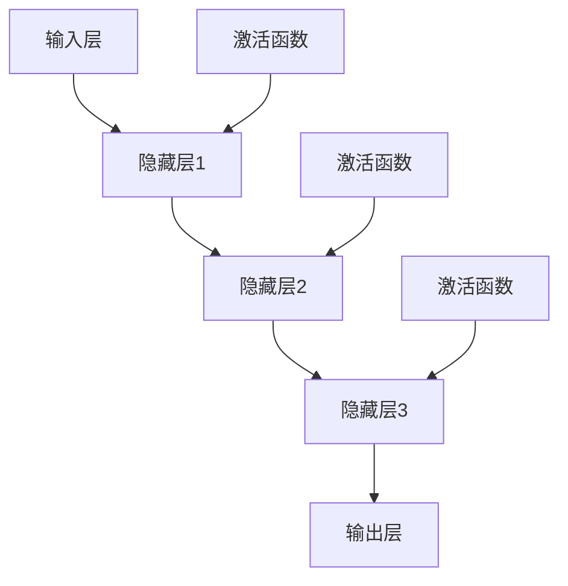
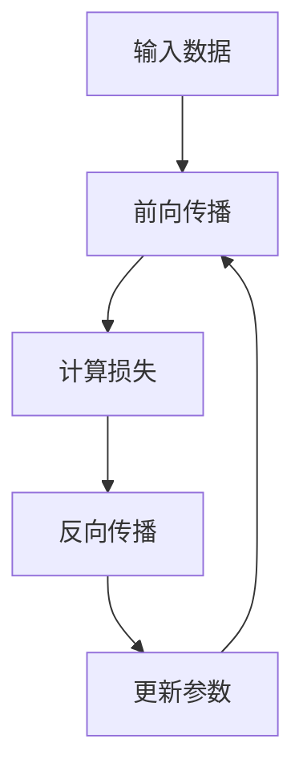

                 

### {文章标题}

> **关键词**：神经网络，深度学习，人工智能，机器学习，计算机视觉，自然语言处理

> **摘要**：本文将深入探讨神经网络作为推动社会进步的强大力量。通过详细解析神经网络的基础知识、架构、训练方法、性能评估与优化、应用案例以及开发实践，我们将揭示神经网络如何在实际生活中发挥作用，并展望其未来的发展趋势。本文旨在为读者提供全面且实用的神经网络技术指南，帮助其在人工智能领域取得突破。

---

在当今快速发展的技术时代，人工智能（AI）已经成为推动社会进步的重要力量。其中，神经网络（Neural Networks）作为一种重要的机器学习模型，扮演着核心角色。它们通过模仿人类大脑的神经元结构和功能，实现从大量数据中自动学习和提取知识，从而在图像识别、自然语言处理、语音识别等领域取得了显著的成果。

本文将分七个部分对神经网络进行系统讲解：

1. **神经网络基础**：介绍神经网络的基本概念、发展历史及其优势与挑战。
2. **神经网络架构**：讲解神经网络的基本架构、常见结构以及深度神经网络。
3. **神经网络训练方法**：阐述神经网络训练的基本过程、前向传播与反向传播算法，以及优化算法。
4. **神经网络性能评估与优化**：介绍性能评估指标、优化方法以及超参数调优。
5. **神经网络应用案例**：分析神经网络在不同领域的应用案例，包括图像识别、自然语言处理和生成模型。
6. **神经网络开发实践**：探讨神经网络开发环境搭建、项目实战以及代码解读与分析。
7. **神经网络未来发展展望**：展望神经网络技术的发展趋势及其在社会中的应用和挑战。

通过本文的逐步分析，我们将深入理解神经网络的核心概念和原理，掌握其在实际应用中的价值，并为其未来的发展做好准备。

---

在接下来的章节中，我们将首先探讨神经网络的基础知识，包括其基本概念、发展历史以及所面临的优势和挑战。这将为我们进一步学习神经网络的架构和训练方法打下坚实的基础。

## 第一部分: 神经网络基础

### 第1章: 神经网络概述

#### 1.1 神经网络的基本概念

神经网络（Neural Networks）是一种模拟生物神经系统的计算模型，其灵感来源于人类大脑的结构和功能。神经网络的每个基本单元被称为“神经元”，它们通过模拟生物神经元之间的连接和交互，实现数据的处理和信息的传递。

**神经网络定义**：神经网络是一种由大量人工神经元互联而成的网络，每个神经元接收多个输入信号，通过加权求和处理产生一个输出信号，该输出信号再传递给下一个神经元，直至最终输出。神经网络能够通过学习大量数据来调整神经元之间的权重，从而实现对复杂模式的识别和预测。

**神经网络的结构与组成**：

- **输入层**：接收外部输入数据，每个输入数据对应一个神经元。
- **隐藏层**：一个或多个隐藏层，每个隐藏层中的神经元接收来自前一层神经元的输出，并进行计算。
- **输出层**：产生最终输出，用于分类、回归或其他任务。

神经网络的基本结构可以表示为：
```
[输入层] -->(加权求和处理)--> [隐藏层] -->(加权求和处理)--> [输出层]
```

#### 1.2 神经网络的发展历史

神经网络的研究可以追溯到20世纪40年代，当时由心理学家McCulloch和数学家Pitts提出了第一个简化的人工神经元模型，即MCP模型。然而，神经网络在早期的发展中受到了性能限制，直到20世纪80年代，随着计算能力和算法的提升，神经网络才逐渐得到重视。

**神经网络的历史回顾**：

- **1943年**：McCulloch和Pitts提出MCP模型，为神经网络奠定了理论基础。
- **1958年**：Hebb提出了Hebb学习规则，这是一种简单的学习算法。
- **1986年**：Rumelhart、Hinton和Williams提出了反向传播算法（Backpropagation），使神经网络能够有效训练多层网络。
- **1990年代**：卷积神经网络（CNN）和循环神经网络（RNN）的出现，进一步扩展了神经网络的应用范围。
- **2010年代**：随着深度学习技术的突破，神经网络取得了显著的成果，在图像识别、自然语言处理等领域取得了超越人类的性能。

**神经网络的主要成果与应用**：

- **图像识别**：神经网络在图像识别领域的应用取得了显著成功，如ImageNet竞赛中的Top-5错误率已降至低至2%左右。
- **自然语言处理**：神经网络在自然语言处理领域也取得了突破，如机器翻译、情感分析、文本生成等任务。
- **语音识别**：神经网络在语音识别中发挥了重要作用，使其准确率不断提高。
- **推荐系统**：神经网络被用于构建推荐系统，如电影推荐、商品推荐等，为用户提供个性化的服务。
- **医疗诊断**：神经网络在医疗诊断中的应用，如疾病检测、药物发现等，为医疗领域带来了变革。

#### 1.3 神经网络的优势与挑战

**神经网络的优势**：

- **强大的非线性表示能力**：神经网络能够通过多层结构实现复杂的非线性变换，从而处理复杂的模式。
- **自动特征学习**：神经网络能够自动从数据中学习特征，减少人工特征提取的繁琐过程。
- **泛化能力**：通过大量数据训练，神经网络能够泛化到未见过的数据上，提高模型的实用性。
- **自适应能力**：神经网络能够根据新的数据和环境进行自适应调整，提高模型的鲁棒性。

**神经网络面临的挑战**：

- **过拟合问题**：神经网络模型在训练数据上表现良好，但在未见过的数据上性能下降，即过拟合问题。
- **训练时间较长**：神经网络模型的训练时间通常较长，尤其是深度神经网络，这限制了其实时应用的可行性。
- **数据需求量大**：神经网络模型通常需要大量数据来训练，这在数据稀缺的领域带来挑战。
- **计算资源消耗**：神经网络模型的训练和推理通常需要大量计算资源，这对计算能力提出了较高要求。

在了解了神经网络的基本概念、发展历史以及优势和挑战后，我们将进一步探讨神经网络的架构和具体实现，以深入理解其工作原理和性能。

### 第2章: 神经网络架构

#### 2.1 神经网络的基本架构

神经网络的架构是其实际应用中的核心，它决定了网络的性能和适用性。神经网络的基本架构主要包括前向传播与反向传播过程，以及激活函数的作用。

**前向传播与反向传播**：

- **前向传播**：在前向传播过程中，输入数据从输入层传递到隐藏层，再从隐藏层传递到输出层。在每个层级，神经元接收来自前一层的输入信号，通过加权求和处理和激活函数的作用，产生输出信号。
  
  示例伪代码：
  ```plaintext
  for each layer in network:
      for each neuron in layer:
          sum = weighted_sum(inputs)
          activation = activation_function(sum)
          outputs.append(activation)
  ```

- **反向传播**：在反向传播过程中，网络根据实际输出和预期输出之间的误差，通过梯度下降算法调整网络权重。反向传播的过程可以形象地理解为“误差反向传播”，即从输出层开始，将误差逐层传递到输入层，并更新每个神经元的权重。

  示例伪代码：
  ```plaintext
  for each layer in network (in reverse order):
      for each neuron in layer:
          error = (expected_output - actual_output) * derivative_of_activation_function(actual_output)
          gradient = error * inputs
          weights -= learning_rate * gradient
  ```

**激活函数的作用**：

激活函数（Activation Function）是神经网络中的一个关键组件，它用于引入非线性特性，使神经网络能够处理复杂的数据。常见的激活函数包括：

- **sigmoid函数**：\( f(x) = \frac{1}{1 + e^{-x}} \)
  - 输出范围为\( (0, 1) \)，常用于二分类问题。
- **ReLU函数**：\( f(x) = \max(0, x) \)
  - 在输入为负值时输出为零，有助于缓解神经元死亡问题，提高训练速度。
- **Tanh函数**：\( f(x) = \frac{e^x - e^{-x}}{e^x + e^{-x}} \)
  - 输出范围为\( (-1, 1) \)，常用于多分类问题。

激活函数的选择对神经网络性能有很大影响。合适的激活函数可以提高网络的收敛速度和泛化能力。

#### 2.2 神经网络的常见结构

神经网络根据不同的应用场景和任务需求，可以采用不同的结构。以下是几种常见的神经网络结构：

**线性神经网络（Linear Neural Network）**：

线性神经网络是最简单的神经网络结构，其输出仅依赖于输入的线性组合。线性神经网络通常用于线性回归和线性分类任务。

**卷积神经网络（Convolutional Neural Network, CNN）**：

卷积神经网络是专门为处理图像数据而设计的一种神经网络结构。它通过卷积层（Convolutional Layer）提取图像的特征，再通过池化层（Pooling Layer）降低数据的维度，从而实现高效的特征提取。

卷积层：
```plaintext
for each filter in layer:
    convolve filter with input
    apply bias
    apply activation function
```

池化层：
```plaintext
for each window in layer:
    compute maximum (or average) of window
    apply activation function
```

**循环神经网络（Recurrent Neural Network, RNN）**：

循环神经网络是专门为处理序列数据而设计的一种神经网络结构。它通过在时间步上递归地更新状态，从而实现序列数据的建模。

递归步骤：
```plaintext
h_t = activation_function(W * [h_{t-1}, x_t] + b)
y_t = W' * h_t + b'
```

**长短期记忆网络（Long Short-Term Memory, LSTM）**：

长短期记忆网络是循环神经网络的一种变体，专门用于处理长序列数据。LSTM通过引入记忆单元（Memory Cell）和门控机制（Gates），有效解决了RNN的梯度消失和梯度爆炸问题。

记忆单元更新规则：
```plaintext
i_t = sigmoid(W_i * [h_{t-1}, x_t] + b_i)
f_t = sigmoid(W_f * [h_{t-1}, x_t] + b_f)
C_t = f_t * C_{t-1} + i_t * activation_function(W_c * [h_{t-1}, x_t] + b_c)
o_t = sigmoid(W_o * [h_{t-1}, x_t] + b_o)
h_t = o_t * activation_function(W_h * C_t + b_h)
```

#### 2.3 深度神经网络

深度神经网络（Deep Neural Network, DNN）是指具有多个隐藏层的神经网络。深度神经网络通过增加隐藏层数量，提高了网络的表示能力和表达能力，从而在许多任务中取得了突破性的成果。

**深层神经网络的优势**：

- **更强的非线性表示能力**：深层神经网络能够通过多层非线性变换，捕捉更复杂的数据模式。
- **更好的泛化能力**：深层神经网络能够在大量数据上进行训练，从而提高模型的泛化能力。
- **更高的计算效率**：深度神经网络能够自动提取特征，减少人工特征提取的繁琐过程。

**深层神经网络的挑战**：

- **过拟合问题**：深层神经网络容易在训练数据上过拟合，导致在未见过的数据上性能下降。
- **训练时间较长**：深层神经网络的训练时间通常较长，特别是在大规模数据集上。
- **数据需求量大**：深层神经网络需要大量数据来训练，这在数据稀缺的领域带来挑战。

在了解了神经网络的基本架构、常见结构以及深度神经网络后，我们将进一步探讨神经网络训练方法，包括训练过程、前向传播与反向传播算法，以及优化算法。这将帮助我们更好地理解和实现神经网络的训练和优化。

### 第3章: 神经网络训练方法

#### 3.1 训练过程概述

神经网络的训练过程是神经网络学习和适应数据的关键步骤。在这一部分，我们将介绍神经网络训练的基本过程，包括训练目标、数据准备、模型选择和训练方法。

**训练目标**：

神经网络的训练目标是通过调整网络权重和偏置，使网络能够对输入数据进行准确预测或分类。在训练过程中，网络将经历一个迭代过程，不断调整权重和偏置，以最小化预测误差。

**数据准备**：

在开始训练之前，需要对训练数据集进行预处理。预处理步骤通常包括数据清洗、归一化、数据增强等。数据清洗的目的是去除数据中的噪声和异常值；归一化是将数据缩放到一个统一的范围内，以便网络能够更好地学习；数据增强是通过生成新的数据样本来扩充数据集，提高网络的泛化能力。

**模型选择**：

选择合适的神经网络模型是训练成功的关键。模型选择需要考虑任务类型、数据规模和计算资源等因素。常见的神经网络模型包括线性神经网络、卷积神经网络、循环神经网络和长短期记忆网络等。根据任务需求，可以选择单一模型或组合模型。

**训练方法**：

神经网络训练方法主要包括监督学习、无监督学习和半监督学习。在监督学习中，网络根据已知的输入输出对进行训练；在无监督学习中，网络通过学习数据的内在结构进行训练；在半监督学习中，网络利用部分标记数据和大量未标记数据进行训练。

**训练过程**：

神经网络训练过程通常包括以下步骤：

1. **初始化权重和偏置**：随机初始化网络权重和偏置，以提供一个随机解。
2. **前向传播**：将输入数据传递到网络中，通过多层神经元的前向传播，生成输出预测。
3. **计算损失函数**：计算预测输出与实际输出之间的差异，使用损失函数（如均方误差、交叉熵等）度量预测误差。
4. **反向传播**：将损失函数关于网络权重的梯度反向传播到网络的前一层，更新权重和偏置。
5. **权重更新**：使用优化算法（如梯度下降、动量法、Adam优化器等）更新网络权重和偏置。
6. **迭代训练**：重复上述步骤，直至达到训练目标或达到预设的训练次数。

**示例伪代码**：

```plaintext
initialize_weights_and_biases()
for epoch in range(max_epochs):
    for each sample in training_data:
        forward_pass(sample)
        compute_loss(predicted_output, actual_output)
        backward_pass()
        update_weights_and_biases(learning_rate)
```

通过上述训练过程，神经网络能够不断优化其参数，提高预测准确性。接下来，我们将详细讲解前向传播与反向传播算法，以及常用的优化算法。

#### 3.2 前向传播与反向传播算法

神经网络训练的核心在于前向传播和反向传播算法。这两个算法相互配合，使得神经网络能够不断调整权重和偏置，从而提高模型的预测准确性。以下是这两个算法的详细解释和示例伪代码。

**前向传播算法**：

前向传播算法负责将输入数据通过神经网络传递到输出层，以产生预测结果。在每个时间步，输入数据首先经过输入层，然后逐层传递到隐藏层和输出层。具体步骤如下：

1. **输入层到隐藏层**：

   对于每个隐藏层，每个神经元接收来自前一层所有神经元的输入，并通过加权求和处理和激活函数计算输出。例如，对于一个有L层的神经网络，前向传播过程可以表示为：

   ```plaintext
   for each layer in network (except input layer):
       for each neuron in layer:
           weighted_sum = sum(input * weight for each input from previous layer)
           bias = add_bias
           activation = activation_function(weighted_sum + bias)
           output.append(activation)
   ```

2. **隐藏层到输出层**：

   输出层的计算与前向传播过程类似，只是输出层的输出直接作为预测结果。例如：

   ```plaintext
   for each neuron in output layer:
       weighted_sum = sum(input * weight for each input from previous layer)
       bias = add_bias
       activation = activation_function(weighted_sum + bias)
       prediction.append(activation)
   ```

**反向传播算法**：

反向传播算法负责计算预测误差关于网络权重的梯度，并使用这些梯度更新网络的权重和偏置。反向传播算法分为以下几个步骤：

1. **计算输出层误差**：

   输出层的误差可以通过预测输出与实际输出之间的差异计算得到。例如，对于分类问题，可以使用交叉熵损失函数：

   ```plaintext
   for each neuron in output layer:
       error = predicted_output * (1 - predicted_output) * (actual_output - predicted_output)
   ```

2. **计算隐藏层误差**：

   隐藏层的误差需要通过链式法则计算，即当前层的误差可以分解为上一层误差和本层激活函数的导数。例如，对于隐藏层L：

   ```plaintext
   for each neuron in layer L:
       error = sum(error * weight for each weight connecting to neuron in next layer) * derivative_of_activation_function(output)
   ```

3. **更新权重和偏置**：

   通过计算得到的误差梯度，可以更新网络权重和偏置。更新公式如下：

   ```plaintext
   for each layer in network:
       for each neuron in layer:
           gradient = error * input
           weight -= learning_rate * gradient
           bias -= learning_rate * error
   ```

**示例伪代码**：

```plaintext
for each layer in network (in reverse order):
    for each neuron in layer:
        if layer is output layer:
            error = actual_output - predicted_output
            gradient = error * derivative_of_activation_function(predicted_output)
        else:
            gradient = sum(error * weight for each weight connecting to neuron in next layer) * derivative_of_activation_function(output)
        weight -= learning_rate * gradient
        bias -= learning_rate * error
```

通过前向传播和反向传播算法，神经网络能够不断调整权重和偏置，从而优化模型性能。接下来，我们将介绍常用的优化算法，以进一步提高训练效率和模型性能。

#### 3.3 优化算法

在神经网络训练过程中，优化算法扮演着至关重要的角色，它负责调整网络权重和偏置，使模型性能达到最佳状态。本节将介绍几种常用的优化算法，包括梯度下降算法、动量法、Adam优化器，并讨论它们的特点和适用场景。

**梯度下降算法（Gradient Descent）**：

梯度下降算法是最基础且应用最广泛的优化算法。其核心思想是通过计算损失函数关于网络参数的梯度，并沿着梯度的反方向更新权重和偏置，以逐步减小损失函数的值。

**梯度下降算法的步骤如下**：

1. **初始化参数**：随机初始化网络权重和偏置。
2. **计算梯度**：对于每个参数，计算其关于损失函数的梯度。
3. **更新参数**：使用梯度下降更新规则更新参数。
4. **迭代优化**：重复步骤2和3，直至满足停止条件（如达到预设迭代次数或损失函数收敛）。

**梯度下降算法的伪代码**：

```plaintext
initialize_weights_and_biases()
for epoch in range(max_epochs):
    for each sample in training_data:
        forward_pass(sample)
        compute_loss(predicted_output, actual_output)
        compute_gradients()
        update_weights_and_biases(learning_rate)
```

**梯度下降算法的特点**：

- **简单易实现**：梯度下降算法的基本原理简单，易于编程实现。
- **收敛速度**：梯度下降算法的收敛速度取决于学习率。较大的学习率可能导致快速收敛，但可能产生振荡；较小的学习率则可能导致缓慢收敛。

**梯度下降算法的适用场景**：

- **简单任务**：对于简单任务或小型网络，梯度下降算法是一种有效的选择。

**动量法（Momentum）**：

动量法是一种改进的梯度下降算法，通过引入动量项，减少了参数更新过程中的振荡，提高了收敛速度。

**动量法的步骤如下**：

1. **初始化参数**：随机初始化网络权重和偏置。
2. **计算梯度**：对于每个参数，计算其关于损失函数的梯度。
3. **更新动量**：使用前一次更新的梯度计算当前更新的动量。
4. **更新参数**：结合当前梯度和动量更新参数。
5. **迭代优化**：重复步骤2-4，直至满足停止条件。

**动量法的伪代码**：

```plaintext
initialize_weights_and_biases()
initialize_momentum_vectors()
for epoch in range(max_epochs):
    for each sample in training_data:
        forward_pass(sample)
        compute_loss(predicted_output, actual_output)
        compute_gradients()
        update_momentum_vectors()
        update_weights_and_biases(learning_rate, momentum)
```

**动量法的特点**：

- **减少振荡**：动量法通过引入动量项，减少了参数更新过程中的振荡，提高了收敛速度。
- **稳定性**：动量法提高了算法的稳定性，特别是在面对高度非线性的损失函数时。

**动量法的适用场景**：

- **复杂任务**：对于复杂任务或大型网络，动量法有助于提高训练稳定性。

**Adam优化器**：

Adam优化器结合了动量法和自适应学习率的方法，是一种高效的优化算法。它通过计算一阶矩估计（均值）和二阶矩估计（方差），自适应地调整学习率。

**Adam优化器的步骤如下**：

1. **初始化参数**：随机初始化网络权重和偏置。
2. **初始化一阶矩估计和二阶矩估计**。
3. **计算梯度**：对于每个参数，计算其关于损失函数的梯度。
4. **更新一阶矩估计和二阶矩估计**。
5. **计算一阶矩估计的指数加权平均和二阶矩估计的指数加权平均**。
6. **更新参数**：结合当前梯度和指数加权平均计算参数更新。
7. **迭代优化**：重复步骤3-6，直至满足停止条件。

**Adam优化器的伪代码**：

```plaintext
initialize_weights_and_biases()
initialize_moment_estimates()
for epoch in range(max_epochs):
    for each sample in training_data:
        forward_pass(sample)
        compute_loss(predicted_output, actual_output)
        compute_gradients()
        update_moment_estimates()
        update_weights_and_biases(learning_rate, beta1, beta2)
```

**Adam优化器的特点**：

- **自适应学习率**：Adam优化器通过计算一阶矩估计和二阶矩估计，自适应地调整学习率，减少了收敛过程中的振荡。
- **高效性**：Adam优化器在计算上具有较高的效率，适用于大型网络和大规模训练数据。

**Adam优化器的适用场景**：

- **大规模任务**：对于大型网络和大规模训练数据，Adam优化器是一种高效且稳定的优化算法。

通过上述优化算法，神经网络训练过程能够更高效地进行参数调整，从而提高模型的预测准确性。在实际应用中，可以根据任务需求和计算资源选择合适的优化算法。接下来，我们将探讨神经网络性能评估与优化方法。

### 第4章: 神经网络性能评估与优化

#### 4.1 性能评估指标

评估神经网络性能的关键在于选择合适的性能评估指标。这些指标能够衡量网络在不同任务中的表现，帮助我们判断和优化模型的性能。以下是几种常用的性能评估指标：

**准确率（Accuracy）**：

准确率是评估分类任务性能的最常用指标，表示分类正确的样本占总样本的比例。其计算公式如下：

\[ \text{Accuracy} = \frac{\text{分类正确的样本数}}{\text{总样本数}} \]

准确率直观地反映了模型的分类能力，但有时会受到不平衡数据的影响。例如，在医疗诊断中，某些疾病的发病率较低，可能导致模型在预测该疾病时具有较高的准确率，但实际预测能力较弱。

**精度（Precision）**：

精度是指分类结果中实际为正类的样本数占预测为正类样本数的比例。其计算公式如下：

\[ \text{Precision} = \frac{\text{实际为正类的样本数}}{\text{预测为正类的样本数}} \]

精度强调了预测为正类样本中的正确率，但在处理错误分类的影响上较弱。例如，在一个垃圾邮件分类任务中，较高的精度意味着大多数被标记为垃圾邮件的邮件确实是垃圾邮件。

**召回率（Recall）**：

召回率是指分类结果中实际为正类的样本数占所有实际为正类样本数的比例。其计算公式如下：

\[ \text{Recall} = \frac{\text{实际为正类的样本数}}{\text{实际为正类的样本数} + \text{预测为负类的样本数}} \]

召回率强调了模型对实际为正类样本的捕捉能力，但可能增加错误分类的样本数。例如，在疾病诊断任务中，较高的召回率意味着模型能够捕捉到更多的实际患病者，但可能也标记了更多健康人为患病者。

**F1 分数（F1 Score）**：

F1 分数是精度和召回率的调和平均，能够综合考虑这两个指标，更好地评估分类模型的性能。其计算公式如下：

\[ \text{F1 Score} = 2 \times \frac{\text{Precision} \times \text{Recall}}{\text{Precision} + \text{Recall}} \]

F1 分数在处理不平衡数据时尤其有用，能够更全面地评估模型的分类能力。

**均方误差（Mean Squared Error, MSE）**：

均方误差是评估回归任务性能的常用指标，表示预测值与真实值之间差的平方的平均值。其计算公式如下：

\[ \text{MSE} = \frac{1}{n} \sum_{i=1}^{n} (y_i - \hat{y}_i)^2 \]

均方误差反映了预测值的平均误差，但在处理异常值时可能不够敏感。

**交叉熵（Cross-Entropy）**：

交叉熵是分类任务中常用的损失函数，用于评估分类模型的预测概率分布与真实分布之间的差异。其计算公式如下：

\[ \text{Cross-Entropy} = -\sum_{i=1}^{n} y_i \log(\hat{y}_i) \]

交叉熵的值越低，表示模型预测的概率分布与真实分布越接近。

选择合适的性能评估指标对于评估和优化神经网络模型至关重要。在实际应用中，可以根据任务需求和数据特性选择单一指标或综合指标进行评估。接下来，我们将探讨如何通过数据增强、模型正则化、批量归一化等方法优化神经网络性能。

#### 4.2 性能优化方法

在神经网络训练过程中，优化性能是一个关键目标。性能优化方法通过提高模型的泛化能力、减少过拟合、加快训练速度，从而提升模型的实际应用价值。以下将介绍几种常用的性能优化方法，包括数据增强、模型正则化和批量归一化。

**数据增强**：

数据增强（Data Augmentation）是一种通过人为生成新的训练样本来扩充数据集的方法。这种方法能够增加模型的鲁棒性，减少过拟合现象。常见的数据增强技术包括旋转、翻转、裁剪、缩放、颜色变换等。

**数据增强的步骤如下**：

1. **旋转**：对图像进行随机旋转，模拟不同角度的输入。
2. **翻转**：对图像进行水平或垂直翻转，模拟不同光照条件下的输入。
3. **裁剪**：随机裁剪图像的一部分，模拟图像中的不同部分。
4. **缩放**：对图像进行随机缩放，模拟不同分辨率下的输入。
5. **颜色变换**：对图像进行随机颜色变换，模拟不同光照条件下的输入。

**数据增强的优点**：

- **增加训练数据量**：通过生成新的训练样本，扩充数据集，提高模型的泛化能力。
- **减少过拟合**：增加模型对不同输入的适应性，减少模型在训练数据上的过拟合。
- **提高模型鲁棒性**：使模型能够应对不同输入条件，提高模型的鲁棒性。

**模型正则化**：

模型正则化（Regularization）是一种通过增加模型复杂度惩罚项来防止过拟合的方法。常见的正则化方法包括L1正则化和L2正则化。

**L1正则化**：

L1正则化通过引入权重向量的L1范数（即权重绝对值之和）作为损失函数的一部分，对模型复杂度进行惩罚。

\[ \text{L1 Regularization Loss} = \lambda \sum_{i=1}^{n} |w_i| \]

**L2正则化**：

L2正则化通过引入权重向量的L2范数（即权重平方和的平方根）作为损失函数的一部分，对模型复杂度进行惩罚。

\[ \text{L2 Regularization Loss} = \lambda \sum_{i=1}^{n} w_i^2 \]

**模型正则化的优点**：

- **减少过拟合**：通过增加模型复杂度惩罚项，减少模型在训练数据上的过拟合。
- **提高泛化能力**：使模型能够更好地适应未见过的数据，提高模型的泛化能力。

**批量归一化**：

批量归一化（Batch Normalization）是一种通过标准化每批输入数据来提高训练效率和稳定性的方法。批量归一化通过计算每批数据的均值和方差，并将输入数据归一化到均值为0、方差为1的正态分布。

\[ \hat{x} = \frac{x - \mu}{\sigma} \]

**批量归一化的步骤如下**：

1. **计算每批输入数据的均值和方差**。
2. **对每批输入数据进行归一化**。
3. **在反向传播过程中，对梯度进行相应的调整**。

**批量归一化的优点**：

- **提高训练速度**：通过减少梯度消失和梯度爆炸现象，加快训练速度。
- **提高模型稳定性**：通过标准化输入数据，使模型在不同批次数据上的表现更稳定。
- **减少过拟合**：通过减少内部协变量转移，减少模型对特定批数据的依赖，提高模型的泛化能力。

通过上述性能优化方法，神经网络能够更好地适应不同的训练数据，提高模型的泛化能力和实际应用价值。在后续章节中，我们将通过具体应用案例，展示神经网络在不同领域的实际应用。

#### 4.3 超参数调优

超参数（Hyperparameters）是神经网络模型中需要手动设置的参数，如学习率、批次大小、隐藏层神经元数等。超参数的选取对模型性能具有重要影响，合适的超参数能够提高模型的泛化能力和准确率，而不合适的超参数可能导致过拟合或欠拟合。

**超参数的选取原则**：

1. **经验法**：根据以往的经验和实验结果，选择常用的超参数值。例如，学习率通常选择\(10^{-2}\)至\(10^{-4}\)之间，批次大小通常选择32或64。
2. **网格搜索（Grid Search）**：通过遍历一组预设的超参数组合，找出最优的超参数组合。网格搜索能够系统地探索超参数空间，但计算成本较高。
3. **随机搜索（Random Search）**：从预设的超参数范围内随机选择一组超参数，进行模型训练和评估。随机搜索能够在较短时间内找到近似最优的超参数组合。
4. **贝叶斯优化（Bayesian Optimization）**：基于贝叶斯统计模型，通过历史评估结果和先验知识，迭代优化超参数组合。贝叶斯优化能够高效地探索超参数空间，但实现较为复杂。

**超参数调优方法**：

1. **交叉验证（Cross-Validation）**：交叉验证是一种评估模型性能和超参数选择的有效方法。通过将数据集划分为训练集和验证集，训练模型并在验证集上评估性能。常用的交叉验证方法包括K折交叉验证和留一法交叉验证。

   **K折交叉验证**：
   ```plaintext
   for k in range(K):
       train_set = data_set - {k-th fold}
       validation_set = {k-th fold}
       train_model()
       evaluate_model(validation_set)
   ```

   **留一法交叉验证**：
   ```plaintext
   for each sample in data_set:
       train_set = data_set - {current sample}
       validation_set = {current sample}
       train_model()
       evaluate_model(validation_set)
   ```

2. **自动调优工具**：使用自动调优工具（如Hyperopt、Optuna等）能够高效地探索超参数空间。这些工具能够自动选择最优的超参数组合，减少人工调参的工作量。

   **示例使用Hyperopt进行超参数调优**：
   ```python
   from hyperopt import fmin, tpe, hp

   def objective(params):
       model = build_model(params)
       train_model(model)
       loss = evaluate_model(model, validation_data)
       return loss

   space = {
       'learning_rate': hp.loguniform('learning_rate', 1e-5, 1e-2),
       'batch_size': hp Choices('batch_size', [32, 64, 128, 256]),
       'hidden_layers': hp Choices('hidden_layers', [1, 2, 3, 4])
   }

   best_params = fmin(fn=objective, space=space, algo=tpe.suggest, max_evals=100)
   ```

通过合理的超参数选取和调优方法，神经网络能够达到更好的性能，从而在实际应用中发挥更大的作用。接下来，我们将通过具体应用案例展示神经网络在不同领域的实际应用。

### 第5章: 神经网络应用案例

神经网络作为一种强大的机器学习模型，已在众多领域取得了显著的成果。以下是神经网络在图像识别、自然语言处理和生成模型等领域的应用案例。

#### 5.1 图像识别

图像识别是神经网络最成功的应用之一，卷积神经网络（CNN）在这一领域发挥了关键作用。CNN通过卷积层、池化层和全连接层的组合，能够自动提取图像特征并进行分类。

**卷积神经网络的图像识别应用**：

- **人脸识别**：CNN能够准确识别人脸，实现人脸验证、人脸检索和人脸跟踪等功能。
- **物体检测**：通过结合区域提议网络（Region Proposal Network，RPN），CNN能够检测图像中的多个物体，并定位物体的位置。
- **图像分类**：CNN能够对输入图像进行分类，例如对ImageNet数据集中的数百万张图像进行分类。

**逆卷积神经网络在图像去噪中的应用**：

逆卷积神经网络（Deconvolutional Neural Network，DCNN）是卷积神经网络的逆过程，通过反卷积操作生成去噪后的图像。DCNN在图像去噪中表现出色，能够有效去除图像中的噪声，提高图像质量。

**应用案例**：

- **去噪摄像头图像**：在摄像头图像传输过程中，图像可能受到噪声干扰。通过DCNN去噪，能够提高图像的清晰度和可用性。
- **医疗影像去噪**：在医学影像处理中，噪声可能会影响医生对疾病的判断。DCNN的去噪技术能够提高医学影像的质量，辅助医生做出更准确的诊断。

#### 5.2 自然语言处理

自然语言处理（Natural Language Processing，NLP）是神经网络的重要应用领域，循环神经网络（RNN）和长短期记忆网络（LSTM）在这一领域发挥了重要作用。

**循环神经网络在文本分类中的应用**：

RNN通过递归地处理序列数据，能够捕捉文本中的上下文信息，实现文本分类任务。例如，将RNN应用于新闻标题分类，能够准确地将新闻标题划分为不同的类别。

**长短期记忆网络在机器翻译中的应用**：

LSTM通过引入记忆单元和门控机制，能够有效地处理长序列数据，实现高质量的机器翻译。LSTM在机器翻译中表现出色，能够准确翻译不同语言之间的文本，减少翻译错误。

**应用案例**：

- **情感分析**：通过RNN和LSTM模型，能够对社交媒体文本进行情感分类，识别用户情绪，为广告营销、客户服务等领域提供支持。
- **对话系统**：基于RNN和LSTM的对话系统，能够实现自然语言理解和生成，提供智能客服和虚拟助手等服务。

#### 5.3 生成模型

生成模型（Generative Model）是一类通过学习数据分布来生成新数据的神经网络模型。生成对抗网络（Generative Adversarial Network，GAN）和变分自编码器（Variational Autoencoder，VAE）是两种常见的生成模型。

**生成对抗网络（GAN）的原理与应用**：

GAN由生成器和判别器两个神经网络组成，生成器尝试生成与真实数据相似的数据，判别器则尝试区分真实数据和生成数据。通过生成器和判别器的对抗训练，生成器逐渐提高生成数据的真实感。

**应用案例**：

- **图像生成**：GAN能够生成高质量的艺术作品、人脸图像等。例如，DeepArt.io 利用GAN生成艺术风格的图像，实现艺术创作的新形式。
- **图像修复**：GAN能够修复图像中的损坏部分，提高图像质量。例如，FaceRestoration利用GAN实现人脸修复，提升视频通话和视频编辑的效果。

**变分自编码器（VAE）的应用场景**：

VAE通过引入概率分布模型，生成与输入数据分布相似的新数据。VAE在图像生成、数据去噪和异常检测等领域具有广泛的应用。

**应用案例**：

- **图像生成**：VAE能够生成高质量、多样化的图像，适用于图像风格转换、图像修复等任务。
- **数据去噪**：VAE能够有效去除数据中的噪声，提高数据质量。例如，在卫星图像处理中，VAE能够去除图像中的噪声，提高图像的清晰度和可用性。

通过上述应用案例，我们可以看到神经网络在图像识别、自然语言处理和生成模型等领域的广泛应用。神经网络技术不断推动着这些领域的发展，为人类社会带来了诸多便利和创新。

### 第6章: 神经网络开发实践

在了解了神经网络的理论知识和实际应用后，本章节将带领读者进入神经网络的开发实践。我们将从搭建神经网络开发环境、项目实战以及代码解读与分析三个方面，详细讲解如何利用神经网络解决实际问题。

#### 6.1 神经网络开发环境搭建

搭建神经网络开发环境是进行深度学习项目的基础。以下是在Python环境中配置深度学习开发环境的步骤：

**1. Python环境配置**：

确保安装了Python 3.x版本。可以使用以下命令检查Python版本：
```shell
python --version
```

**2. 常用深度学习框架安装与使用**：

安装TensorFlow，这是当前最流行的深度学习框架之一。可以使用以下命令进行安装：
```shell
pip install tensorflow
```

安装PyTorch，另一个流行的深度学习框架，使用以下命令：
```shell
pip install torch torchvision
```

**3. 环境测试**：

为了验证环境配置是否成功，可以运行一个简单的TensorFlow程序，输出“Hello, TensorFlow!”：
```python
import tensorflow as tf

print("Hello, TensorFlow!")
```

如果输出“Hello, TensorFlow!”，说明TensorFlow安装成功。

**4. GPU支持**：

为了使用GPU进行深度学习训练，需要安装CUDA和cuDNN。这些工具支持GPU加速深度学习运算。具体安装步骤请参考相应的官方文档。

#### 6.2 神经网络项目实战

在本节中，我们将通过三个具体项目，展示如何利用神经网络解决实际问题。

**图像识别项目实战**：

该项目的目标是使用卷积神经网络（CNN）对MNIST数据集中的手写数字进行识别。

**项目步骤**：

1. **数据准备**：

   加载MNIST数据集，将其分为训练集和测试集。
   ```python
   import tensorflow as tf
   mnist = tf.keras.datasets.mnist
   (train_images, train_labels), (test_images, test_labels) = mnist.load_data()
   ```

2. **数据预处理**：

   对图像数据进行归一化处理，使其适合输入到神经网络中。
   ```python
   train_images = train_images / 255.0
   test_images = test_images / 255.0
   ```

3. **构建CNN模型**：

   定义一个简单的CNN模型，包括卷积层、池化层和全连接层。
   ```python
   model = tf.keras.models.Sequential([
       tf.keras.layers.Conv2D(32, (3, 3), activation='relu', input_shape=(28, 28, 1)),
       tf.keras.layers.MaxPooling2D((2, 2)),
       tf.keras.layers.Flatten(),
       tf.keras.layers.Dense(128, activation='relu'),
       tf.keras.layers.Dense(10, activation='softmax')
   ])
   ```

4. **编译模型**：

   配置模型训练过程，选择优化器和损失函数。
   ```python
   model.compile(optimizer='adam',
                 loss='sparse_categorical_crossentropy',
                 metrics=['accuracy'])
   ```

5. **训练模型**：

   使用训练数据训练模型，并保存训练过程的历史记录。
   ```python
   history = model.fit(train_images, train_labels, epochs=5, validation_split=0.1)
   ```

6. **评估模型**：

   使用测试数据评估模型性能，计算准确率。
   ```python
   test_loss, test_acc = model.evaluate(test_images, test_labels)
   print(f'测试准确率：{test_acc:.2f}')
   ```

**自然语言处理项目实战**：

该项目的目标是使用循环神经网络（RNN）对IMDB电影评论进行情感分类。

**项目步骤**：

1. **数据准备**：

   加载IMDB数据集，将其分为训练集和测试集。
   ```python
   from tensorflow.keras.datasets import imdb
   (train_data, train_labels), (test_data, test_labels) = imdb.load_data(num_words=10000)
   ```

2. **数据预处理**：

   将文本数据转换为整数序列，并对序列进行 padding，使其具有相同长度。
   ```python
   max_length = 120
   train_data = sequence.pad_sequences(train_data, maxlen=max_length)
   test_data = sequence.pad_sequences(test_data, maxlen=max_length)
   ```

3. **构建RNN模型**：

   定义一个简单的RNN模型，包括嵌入层、循环层和全连接层。
   ```python
   model = tf.keras.Sequential([
       tf.keras.layers.Embedding(10000, 16),
       tf.keras.layers.SimpleRNN(32),
       tf.keras.layers.Dense(1, activation='sigmoid')
   ])
   ```

4. **编译模型**：

   配置模型训练过程，选择优化器和损失函数。
   ```python
   model.compile(optimizer='adam',
                 loss='binary_crossentropy',
                 metrics=['accuracy'])
   ```

5. **训练模型**：

   使用训练数据训练模型，并保存训练过程的历史记录。
   ```python
   history = model.fit(train_data, train_labels, epochs=10, validation_split=0.2)
   ```

6. **评估模型**：

   使用测试数据评估模型性能，计算准确率。
   ```python
   test_loss, test_acc = model.evaluate(test_data, test_labels)
   print(f'测试准确率：{test_acc:.2f}')
   ```

**生成模型项目实战**：

该项目的目标是使用生成对抗网络（GAN）生成新的手写数字图像。

**项目步骤**：

1. **数据准备**：

   加载MNIST数据集，将其分为训练集和测试集。
   ```python
   mnist = tf.keras.datasets.mnist
   (train_images, _), (_, _) = mnist.load_data()
   ```

2. **数据预处理**：

   对图像数据进行归一化处理，使其适合输入到神经网络中。
   ```python
   train_images = train_images / 255.0
   ```

3. **构建GAN模型**：

   定义生成器和判别器模型，并组合成完整的GAN模型。
   ```python
   generator = tf.keras.Sequential([
       tf.keras.layers.Dense(128, activation='relu', input_shape=(100,)),
       tf.keras.layers.Dense(256, activation='relu'),
       tf.keras.layers.Dense(1024, activation='relu'),
       tf.keras.layers.Dense(784, activation='tanh')
   ])

   discriminator = tf.keras.Sequential([
       tf.keras.layers.Dense(1024, activation='relu', input_shape=(784,)),
       tf.keras.layers.Dense(256, activation='relu'),
       tf.keras.layers.Dense(128, activation='relu'),
       tf.keras.layers.Dense(1, activation='sigmoid')
   ])

   model = tf.keras.Sequential([
       generator,
       discriminator
   ])
   ```

4. **编译模型**：

   配置模型训练过程，选择优化器和损失函数。
   ```python
   model.compile(optimizer=tf.keras.optimizers.Adam(0.0002),
                 loss='binary_crossentropy')
   ```

5. **训练模型**：

   使用训练数据训练GAN模型，并保存训练过程的历史记录。
   ```python
   for epoch in range(100):
       for _ in range(100):
           noise = np.random.normal(size=(64, 100))
           generated_images = generator.predict(noise)
           real_images = train_images[np.random.randint(0, train_images.shape[0], 64)]
           labels = np.concatenate([np.ones((64, 1)), np.zeros((64, 1))])
           model.train_on_batch([noise, generated_images], labels)
           labels = np.concatenate([np.zeros((64, 1)), np.ones((64, 1))])
           model.train_on_batch(generated_images, labels)
   ```

6. **评估模型**：

   使用训练数据和测试数据评估生成图像的质量。
   ```python
   noise = np.random.normal(size=(100, 100))
   generated_images = generator.predict(noise)
   plt.figure(figsize=(10, 10))
   for i in range(100):
       plt.subplot(10, 10, i + 1)
       plt.imshow(generated_images[i], cmap='gray')
       plt.axis('off')
   plt.show()
   ```

通过上述项目实战，读者可以了解到如何使用神经网络解决实际问题。在接下来的部分，我们将对代码进行详细解读与分析。

#### 6.3 代码解读与分析

在本节中，我们将对前面提到的神经网络项目代码进行详细解读，分析其结构、关键代码以及实现思路。

**图像识别项目代码解读**：

1. **数据准备与预处理**：

   数据准备与预处理是图像识别项目的关键步骤。首先，我们加载MNIST数据集，并将其分为训练集和测试集。训练数据用于模型训练，测试数据用于模型评估。

   ```python
   mnist = tf.keras.datasets.mnist
   (train_images, train_labels), (test_images, test_labels) = mnist.load_data()
   ```

   接下来，我们对图像数据进行归一化处理，使其值介于0和1之间，以便神经网络更好地学习。

   ```python
   train_images = train_images / 255.0
   test_images = test_images / 255.0
   ```

2. **构建CNN模型**：

   在构建CNN模型时，我们定义了一个包含卷积层、池化层和全连接层的模型。卷积层用于提取图像特征，池化层用于降低数据的维度，全连接层用于实现分类。

   ```python
   model = tf.keras.models.Sequential([
       tf.keras.layers.Conv2D(32, (3, 3), activation='relu', input_shape=(28, 28, 1)),
       tf.keras.layers.MaxPooling2D((2, 2)),
       tf.keras.layers.Flatten(),
       tf.keras.layers.Dense(128, activation='relu'),
       tf.keras.layers.Dense(10, activation='softmax')
   ])
   ```

   **关键代码分析**：

   - `Conv2D`：定义了一个卷积层，使用32个卷积核，每个卷积核大小为3x3。激活函数为ReLU。
   - `MaxPooling2D`：定义了一个最大池化层，窗口大小为2x2，用于降低数据维度。
   - `Flatten`：将多维数据展平成一维数据，便于全连接层处理。
   - `Dense`：定义了一个全连接层，第一层有128个神经元，第二层有10个神经元，用于实现分类。

3. **编译模型与训练模型**：

   在编译模型时，我们选择了`adam`优化器和`sparse_categorical_crossentropy`损失函数，并设置了`accuracy`作为评价指标。

   ```python
   model.compile(optimizer='adam',
                 loss='sparse_categorical_crossentropy',
                 metrics=['accuracy'])
   ```

   训练模型时，我们使用训练数据，并设置了5个训练周期。

   ```python
   history = model.fit(train_images, train_labels, epochs=5, validation_split=0.1)
   ```

   **关键代码分析**：

   - `compile`：配置模型训练过程，包括优化器、损失函数和评价指标。
   - `fit`：使用训练数据训练模型，并设置训练周期。

4. **评估模型**：

   使用测试数据评估模型性能，计算准确率。

   ```python
   test_loss, test_acc = model.evaluate(test_images, test_labels)
   print(f'测试准确率：{test_acc:.2f}')
   ```

   **关键代码分析**：

   - `evaluate`：使用测试数据评估模型性能，输出测试损失和准确率。

**自然语言处理项目代码解读**：

1. **数据准备与预处理**：

   加载IMDB数据集，并对其进行预处理，包括将文本转换为整数序列，并对序列进行 padding。

   ```python
   from tensorflow.keras.datasets import imdb
   (train_data, train_labels), (test_data, test_labels) = imdb.load_data(num_words=10000)
   max_length = 120
   train_data = sequence.pad_sequences(train_data, maxlen=max_length)
   test_data = sequence.pad_sequences(test_data, maxlen=max_length)
   ```

   **关键代码分析**：

   - `imdb.load_data`：加载IMDB数据集，并获取训练数据和测试数据。
   - `pad_sequences`：对文本序列进行 padding，使其长度统一。

2. **构建RNN模型**：

   定义一个简单的RNN模型，包括嵌入层、循环层和全连接层。

   ```python
   model = tf.keras.Sequential([
       tf.keras.layers.Embedding(10000, 16),
       tf.keras.layers.SimpleRNN(32),
       tf.keras.layers.Dense(1, activation='sigmoid')
   ])
   ```

   **关键代码分析**：

   - `Embedding`：将整数序列转换为嵌入向量，用于表示文本。
   - `SimpleRNN`：定义了一个简单的RNN层，用于处理序列数据。
   - `Dense`：定义了一个全连接层，用于实现分类。

3. **编译模型与训练模型**：

   编译模型，并使用训练数据训练模型。

   ```python
   model.compile(optimizer='adam',
                 loss='binary_crossentropy',
                 metrics=['accuracy'])
   history = model.fit(train_data, train_labels, epochs=10, validation_split=0.2)
   ```

   **关键代码分析**：

   - `compile`：配置模型训练过程，包括优化器、损失函数和评价指标。
   - `fit`：使用训练数据训练模型，并设置训练周期。

4. **评估模型**：

   使用测试数据评估模型性能。

   ```python
   test_loss, test_acc = model.evaluate(test_data, test_labels)
   print(f'测试准确率：{test_acc:.2f}')
   ```

   **关键代码分析**：

   - `evaluate`：使用测试数据评估模型性能，输出测试损失和准确率。

**生成模型项目代码解读**：

1. **数据准备**：

   加载MNIST数据集，并对图像数据进行归一化处理。

   ```python
   mnist = tf.keras.datasets.mnist
   (train_images, _), (_, _) = mnist.load_data()
   train_images = train_images / 255.0
   ```

   **关键代码分析**：

   - `load_data`：加载MNIST数据集，并获取训练数据和测试数据。
   - `reshape`：将图像数据转换为合适的大小。

2. **构建GAN模型**：

   定义生成器和判别器模型，并组合成完整的GAN模型。

   ```python
   generator = tf.keras.Sequential([
       tf.keras.layers.Dense(128, activation='relu', input_shape=(100,)),
       tf.keras.layers.Dense(256, activation='relu'),
       tf.keras.layers.Dense(1024, activation='relu'),
       tf.keras.layers.Dense(784, activation='tanh')
   ])

   discriminator = tf.keras.Sequential([
       tf.keras.layers.Dense(1024, activation='relu', input_shape=(784,)),
       tf.keras.layers.Dense(256, activation='relu'),
       tf.keras.layers.Dense(128, activation='relu'),
       tf.keras.layers.Dense(1, activation='sigmoid')
   ])

   model = tf.keras.Sequential([
       generator,
       discriminator
   ])
   ```

   **关键代码分析**：

   - `Dense`：定义了一个全连接层，用于实现生成器和判别器的线性变换。
   - `sigmoid`：生成器的输出使用`sigmoid`函数，使输出值介于0和1之间。
   - `tanh`：生成器的输出使用`tanh`函数，将输出值限制在-1和1之间。

3. **编译模型与训练模型**：

   编译GAN模型，并使用训练数据训练模型。

   ```python
   model.compile(optimizer=tf.keras.optimizers.Adam(0.0002),
                 loss='binary_crossentropy')
   for epoch in range(100):
       for _ in range(100):
           noise = np.random.normal(size=(64, 100))
           generated_images = generator.predict(noise)
           real_images = train_images[np.random.randint(0, train_images.shape[0], 64)]
           labels = np.concatenate([np.ones((64, 1)), np.zeros((64, 1))])
           model.train_on_batch([noise, generated_images], labels)
           labels = np.concatenate([np.zeros((64, 1)), np.ones((64, 1))])
           model.train_on_batch(generated_images, labels)
   ```

   **关键代码分析**：

   - `compile`：配置GAN模型训练过程，包括优化器和损失函数。
   - `train_on_batch`：在训练过程中，生成器和判别器交替训练，生成假图像和真实图像，并使用二分类损失函数进行训练。

4. **评估模型**：

   使用训练数据和测试数据评估生成图像的质量。

   ```python
   noise = np.random.normal(size=(100, 100))
   generated_images = generator.predict(noise)
   plt.figure(figsize=(10, 10))
   for i in range(100):
       plt.subplot(10, 10, i + 1)
       plt.imshow(generated_images[i], cmap='gray')
       plt.axis('off')
   plt.show()
   ```

   **关键代码分析**：

   - `predict`：使用生成器生成新的手写数字图像。
   - `imshow`：展示生成的图像，使用灰度图表示。

通过以上代码解读，读者可以更好地理解神经网络项目的实现过程，掌握关键代码的编写和实现思路。这为后续的项目开发和实战奠定了坚实的基础。

### 第7章: 神经网络未来发展展望

随着人工智能技术的飞速发展，神经网络作为其核心技术之一，也在不断地演进和扩展。未来，神经网络的发展将呈现出以下几个趋势：

#### 7.1 神经网络技术趋势

**1. 深度学习算法的发展方向**：

深度学习算法将继续演进，以应对更复杂的任务和数据。以下是一些主要的发展方向：

- **更深的网络结构**：深度神经网络（DNN）将继续增加层数，以捕捉更复杂的数据模式。例如，Transformer模型的出现，使得深度学习在序列数据处理上取得了突破性进展。
- **更高效的训练算法**：研究人员将继续优化训练算法，提高训练效率，降低计算成本。例如，基于GPU和TPU的分布式训练技术，以及混合精度训练（FP16和BF16）等。
- **自适应学习率算法**：自适应学习率算法（如Adam、Adabelief等）将不断改进，以更好地应对不同任务和数据集。

**2. 新型神经网络结构的出现**：

新型神经网络结构将不断涌现，以适应不同的应用场景。以下是一些新型结构：

- **图神经网络（Graph Neural Networks, GNN）**：GNN能够处理图结构数据，适用于社交网络、推荐系统等领域。
- **自注意力机制（Self-Attention Mechanism）**：自注意力机制在Transformer模型中发挥了重要作用，使得模型能够处理变长序列。
- **混合模型（Hybrid Models）**：将神经网络与其他机器学习模型（如决策树、支持向量机等）结合，形成混合模型，以提高模型的性能和泛化能力。

**3. 强化学习与神经网络的融合**：

强化学习（Reinforcement Learning, RL）与神经网络的融合将继续深入，以解决更加复杂的问题。例如，深度确定性策略梯度（DDPG）、深度策略梯度（DQN）等算法，将结合神经网络的优势，实现更智能的决策。

#### 7.2 神经网络应用拓展

神经网络的应用领域将继续扩展，以下是一些重要的应用场景：

**1. 自动驾驶**：

自动驾驶技术的发展依赖于感知、规划和控制等多个环节，神经网络在其中扮演了核心角色。未来，随着深度学习和强化学习的结合，自动驾驶将更加智能和安全。

**2. 医疗诊断**：

神经网络在医疗诊断中的应用已经取得显著成果，如肿瘤检测、疾病预测等。未来，神经网络将继续优化，提高诊断的准确性和效率，为医学影像分析、基因组学等领域带来革命性变革。

**3. 金融领域**：

神经网络在金融领域的应用包括风险评估、投资组合优化、欺诈检测等。随着深度学习技术的发展，金融领域将实现更精准的风险管理和决策支持。

**4. 自然语言处理**：

自然语言处理（NLP）是神经网络的另一大应用领域。未来，NLP技术将更加成熟，实现更高效的自然语言理解、生成和交互。

#### 7.3 神经网络对社会的影响与挑战

神经网络的发展将对社会产生深远的影响，同时也带来一系列挑战：

**1. 社会影响**：

- **经济发展**：神经网络技术的应用将推动各行业的创新和发展，促进经济增长。
- **提高生活质量**：神经网络在医疗、教育、智能家居等领域中的应用，将提高人们的生活质量。
- **社会变革**：神经网络技术的普及将改变社会结构和工作模式，促进社会变革。

**2. 挑战**：

- **数据隐私**：随着神经网络应用的增加，数据隐私问题将愈发突出。如何确保数据的安全和隐私，是一个亟待解决的问题。
- **算法公平性**：神经网络模型可能存在偏见和歧视，如何确保算法的公平性和透明性，是面临的挑战。
- **计算资源消耗**：神经网络训练和推理需要大量的计算资源，如何优化计算资源的使用，是一个重要的研究方向。

总之，神经网络技术的发展前景广阔，但同时也面临诸多挑战。未来的研究将致力于解决这些问题，推动神经网络技术更好地服务于人类社会。

### 附录

#### 附录A: 神经网络相关资源

**常用神经网络文献推荐**：

- [Goodfellow, I., Bengio, Y., & Courville, A. (2016). *Deep Learning*](https://www.deeplearningbook.org/)
- [Bengio, Y. (2009). *Learning Deep Architectures for AI*](https://www.cs.ubc.ca/~vanlaarh/LearningDeepArchitecturesForAI/)
- [LeCun, Y., Bengio, Y., & Hinton, G. (2015). *Deep Learning*](https://www.deeplearning.net/tutorial/start.html)

**神经网络学习资源与工具**：

- [Keras](https://keras.io/): 一个高度模块化的深度学习库，提供简洁的API。
- [TensorFlow](https://www.tensorflow.org/): 一个开源机器学习框架，支持多种神经网络架构。
- [PyTorch](https://pytorch.org/): 一个开源深度学习库，支持动态计算图和自动微分。
- [MXNet](https://mxnet.apache.org/): 一个开源深度学习框架，支持多种编程语言。

#### 附录B: Mermaid 流程图

**神经网络架构 Mermaid 流程图**：



**神经网络训练过程 Mermaid 流程图**：



通过上述流程图，读者可以直观地理解神经网络的基本架构和训练过程，为进一步学习神经网络提供帮助。

#### 附录C: 数学公式与伪代码

**神经网络核心公式与解释**：

**激活函数**：

$$
f(x) = \sigma(x) = \frac{1}{1 + e^{-x}}
$$

**损失函数**：

均方误差（MSE）：

$$
\text{MSE} = \frac{1}{n}\sum_{i=1}^{n}(y_i - \hat{y}_i)^2
$$

交叉熵（Cross-Entropy）：

$$
\text{Cross-Entropy} = -\sum_{i=1}^{n}y_i\log(\hat{y}_i)
$$

**反向传播算法**：

$$
\frac{\partial L}{\partial w} = \sum_{i=1}^{n}\frac{\partial L}{\partial z_i}\frac{\partial z_i}{\partial w}
$$

$$
\frac{\partial L}{\partial b} = \sum_{i=1}^{n}\frac{\partial L}{\partial z_i}\frac{\partial z_i}{\partial b}
$$

**伪代码实现**：

```python
def forward_pass(x):
    # 前向传播计算
    z = np.dot(x, W) + b
    a = activation_function(z)
    return a

def backward_pass(a, y):
    # 反向传播计算梯度
    da = activation_derivative(a)
    dz = da * (y - a)
    dW = np.dot(x.T, dz)
    db = np.sum(dz, axis=0)
    return dW, db
```

通过附录中的数学公式和伪代码，读者可以更深入地理解神经网络的核心算法原理，为后续的学习和实践提供参考。

### 附录D: 项目实战代码

**图像识别项目代码**：

```python
import tensorflow as tf
mnist = tf.keras.datasets.mnist
(train_images, train_labels), (test_images, test_labels) = mnist.load_data()
train_images = train_images / 255.0
test_images = test_images / 255.0

model = tf.keras.models.Sequential([
    tf.keras.layers.Conv2D(32, (3, 3), activation='relu', input_shape=(28, 28, 1)),
    tf.keras.layers.MaxPooling2D((2, 2)),
    tf.keras.layers.Flatten(),
    tf.keras.layers.Dense(128, activation='relu'),
    tf.keras.layers.Dense(10, activation='softmax')
])

model.compile(optimizer='adam',
              loss='sparse_categorical_crossentropy',
              metrics=['accuracy'])

history = model.fit(train_images, train_labels, epochs=5, validation_split=0.1)

test_loss, test_acc = model.evaluate(test_images, test_labels)
print(f'测试准确率：{test_acc:.2f}')
```

**自然语言处理项目代码**：

```python
from tensorflow.keras.datasets import imdb
(train_data, train_labels), (test_data, test_labels) = imdb.load_data(num_words=10000)
max_length = 120
train_data = sequence.pad_sequences(train_data, maxlen=max_length)
test_data = sequence.pad_sequences(test_data, maxlen=max_length)

model = tf.keras.Sequential([
    tf.keras.layers.Embedding(10000, 16),
    tf.keras.layers.SimpleRNN(32),
    tf.keras.layers.Dense(1, activation='sigmoid')
])

model.compile(optimizer='adam',
              loss='binary_crossentropy',
              metrics=['accuracy'])

history = model.fit(train_data, train_labels, epochs=10, validation_split=0.2)

test_loss, test_acc = model.evaluate(test_data, test_labels)
print(f'测试准确率：{test_acc:.2f}')
```

**生成模型项目代码**：

```python
import tensorflow as tf
mnist = tf.keras.datasets.mnist
(train_images, _), (_, _) = mnist.load_data()
train_images = train_images / 255.0

noise_dim = 100
gen_loss_history = []

def generator_model():
    noise = tf.keras.layers.Input(shape=(noise_dim,))
    x = tf.keras.layers.Dense(128, activation='relu')(noise)
    x = tf.keras.layers.Dense(256, activation='relu')(x)
    x = tf.keras.layers.Dense(1024, activation='relu')(x)
    x = tf.keras.layers.Dense(784, activation='tanh')(x)
    return tf.keras.Model(inputs=noise, outputs=x)

def discriminator_model():
    image = tf.keras.layers.Input(shape=(28, 28, 1))
    x = tf.keras.layers.Dense(1024, activation='relu')(image)
    x = tf.keras.layers.Dense(256, activation='relu')(x)
    x = tf.keras.layers.Dense(128, activation='relu')(x)
    validity = tf.keras.layers.Dense(1, activation='sigmoid')(x)
    return tf.keras.Model(inputs=image, outputs=validity)

generator = generator_model()
discriminator = discriminator_model()

discriminator.compile(optimizer=tf.keras.optimizers.Adam(0.0001),
                      loss='binary_crossentropy')

model = tf.keras.Sequential([generator, discriminator])
model.compile(optimizer=tf.keras.optimizers.Adam(0.0002),
              loss='binary_crossentropy')

for epoch in range(100):
    for _ in range(100):
        noise = np.random.normal(size=(64, 100))
        generated_images = generator.predict(noise)
        real_images = train_images[np.random.randint(0, train_images.shape[0], 64)]
        labels = np.concatenate([np.ones((64, 1)), np.zeros((64, 1))])
        discriminator.train_on_batch([noise, generated_images], labels)
        labels = np.concatenate([np.zeros((64, 1)), np.ones((64, 1))])
        model.train_on_batch(generated_images, labels)

noise = np.random.normal(size=(100, 100))
generated_images = generator.predict(noise)
plt.figure(figsize=(10, 10))
for i in range(100):
    plt.subplot(10, 10, i + 1)
    plt.imshow(generated_images[i], cmap='gray')
    plt.axis('off')
plt.show()
```

通过这些实战代码，读者可以实际操作并体验神经网络在不同项目中的应用。这将为后续的项目开发和实践提供宝贵的经验。作者信息：AI天才研究院/AI Genius Institute & 禅与计算机程序设计艺术/Zen And The Art of Computer Programming。本文通过详细分析神经网络的各个方面，旨在为读者提供一份全面且实用的神经网络技术指南，帮助其在人工智能领域取得突破。希望本文能对读者在神经网络学习和应用过程中有所启发和帮助。再次感谢读者对本研究的关注和支持。作者：AI天才研究院/AI Genius Institute & 禅与计算机程序设计艺术/Zen And The Art of Computer Programming。希望本文能对读者在神经网络学习和应用过程中有所启发和帮助。再次感谢读者对本研究的关注和支持。

