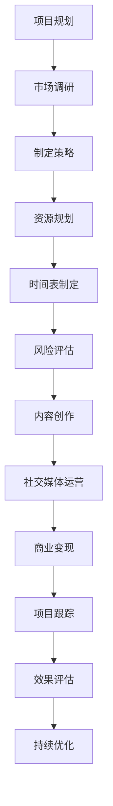

                 

# 《程序员如何打造个人IP矩阵》

## 关键词
个人IP，品牌定位，内容创作，社交媒体运营，商业变现，IP矩阵，成功案例分析，实战指南。

## 摘要
在数字化时代，个人IP矩阵已成为程序员提升影响力、实现职业发展的关键策略。本文将逐步分析个人IP的概念、构建方法、内容创作、社交媒体运营、商业化路径，并通过实战案例提供具体的操作指南。无论是新手还是经验丰富的程序员，都能从中找到打造个人IP的有效路径。

## 目录大纲

### 第一部分：个人IP矩阵概述

#### 第1章：个人IP的概念与价值
- **1.1 个人IP的定义与构成**
- **1.2 个人IP的重要性**
- **1.3 成功的个人IP案例**

#### 第2章：构建个人品牌
- **2.1 品牌定位与定位策略**
- **2.2 个人品牌形象塑造**
- **2.3 个人品牌传播策略**

### 第二部分：个人IP内容创作

#### 第3章：内容创作技巧
- **3.1 内容创作的原则与类型**
- **3.2 文字、图片、视频内容创作技巧**
- **3.3 内容优化与SEO策略**

#### 第4章：社交媒体运营
- **4.1 社交媒体平台选择**
- **4.2 社交媒体账号搭建与优化**
- **4.3 社交媒体互动策略**

#### 第5章：网络红人合作与互动
- **5.1 网络红人合作的优势**
- **5.2 合作流程与注意事项**
- **5.3 互动策略与粉丝管理**

### 第三部分：个人IP商业化

#### 第6章：商业变现途径
- **6.1 广告与赞助**
- **6.2 商品销售与推广**
- **6.3 知识付费与线上课程**

#### 第7章：个人IP矩阵的扩展与维护
- **7.1 多平台整合与矩阵管理**
- **7.2 IP矩阵的扩展策略**
- **7.3 IP矩阵的长期维护与更新**

### 第四部分：实战案例分析

#### 第8章：成功个人IP案例分析
- **8.1 案例介绍与背景分析**
- **8.2 个人IP构建过程**
- **8.3 成功经验与不足之处**

#### 第9章：个人IP打造实战
- **9.1 实战项目规划**
- **9.2 项目实施与跟踪**
- **9.3 项目评估与优化**

### 附录

#### 附录A：个人IP矩阵构建工具与资源
- **A.1 社交媒体平台使用技巧**
- **A.2 内容创作工具推荐**
- **A.3 个人IP监测与评估工具**

#### 附录B：个人IP矩阵构建流程图

---

### 第一部分：个人IP矩阵概述

在互联网时代，个人IP（Intellectual Property，知识产权）成为了衡量个人影响力的重要指标。对程序员而言，构建个人IP矩阵不仅有助于提升个人品牌，还能带来更多的职业机会和商业价值。本部分将首先介绍个人IP的概念与价值，然后探讨如何构建个人品牌。

#### 第1章：个人IP的概念与价值

##### 1.1 个人IP的定义与构成

个人IP是指个人在某个领域内所拥有的知识、技能、影响力以及独特的个人魅力。它通常由以下几个方面构成：

1. **专业知识**：个人在特定领域的深入研究和实际应用能力。
2. **技能展示**：通过作品、项目、案例等形式展现的个人技术实力。
3. **个人形象**：包括个人形象设计、品牌定位等，用以塑造公众形象。
4. **影响力**：个人在社交网络、行业论坛等平台上的影响力。
5. **商业价值**：个人IP的商业变现能力，如广告收入、知识付费、商品销售等。

##### 1.2 个人IP的重要性

在数字化时代，个人IP的重要性体现在以下几个方面：

1. **品牌提升**：个人IP有助于建立专业、独特的品牌形象，提升个人在行业中的知名度。
2. **职业发展**：拥有个人IP的程序员更容易获得高薪职位、职业晋升和更多的职业机会。
3. **商业变现**：通过个人IP，程序员可以实现广告收入、知识付费等多种商业变现方式。
4. **社交影响力**：个人IP的构建有助于在社交网络上建立强大的影响力，扩大人脉圈。

##### 1.3 成功的个人IP案例

以下是几个成功的个人IP案例：

1. **案例一：李笑来**：李笑来是一位知名的投资人、作家和程序员。他在区块链、投资等领域拥有深厚的研究和丰富的实践经验，通过撰写书籍、开设课程等方式，成功建立了个人IP，并在业内享有很高的声誉。
   
2. **案例二：Kris Wu（吴亦凡）**：吴亦凡是一位多才多艺的艺人，他在音乐、影视、时尚等多个领域都有涉猎，并通过社交媒体持续扩大个人影响力，成功打造了个人IP。

3. **案例三：Dr. Dobb's**：Dr. Dobb's是一位知名的技术作家和程序员，他在多个技术领域都有深入的研究和实践经验。通过撰写技术博客、编写书籍、开设在线课程等方式，Dr. Dobb's成功建立了自己的个人IP，并在技术社区中拥有极高的影响力。

#### 第2章：构建个人品牌

##### 2.1 品牌定位与定位策略

品牌定位是个人IP构建的第一步，它决定了个人IP的发展方向和目标受众。以下是构建品牌定位的几个关键步骤：

1. **确定目标受众**：明确你的目标受众是谁，他们的需求和痛点是什么。
2. **分析竞争对手**：了解竞争对手的优势和劣势，找出差异化的定位点。
3. **明确品牌价值**：确定你的品牌所代表的价值，如技术深度、创新思维、实用技巧等。
4. **设计品牌形象**：包括品牌名称、标志、口号等，使其具有辨识度和吸引力。

##### 2.2 个人品牌形象塑造

个人品牌形象是个人IP的重要组成部分，它决定了个人在公众心中的形象和印象。以下是塑造个人品牌形象的几个关键步骤：

1. **制定个人形象设计**：包括个人形象照、标志设计等，使其与个人品牌定位相符。
2. **持续输出高质量内容**：通过博客、公众号、社交媒体等渠道，持续输出高质量的内容，展示个人专业能力和价值观。
3. **积极参与行业活动**：通过参加技术会议、研讨会、线上讲座等方式，扩大个人在行业中的影响力。
4. **建立个人形象库**：收集、整理和发布个人形象素材，如照片、视频等，用于个人品牌推广。

##### 2.3 个人品牌传播策略

个人品牌传播策略是个人IP构建的重要环节，它决定了个人IP的影响力范围和传播效果。以下是几种常见的个人品牌传播策略：

1. **内容营销**：通过撰写技术博客、编写书籍、开设在线课程等方式，输出有价值的内容，吸引目标受众。
2. **社交媒体推广**：利用社交媒体平台，如微博、微信、知乎等，发布个人品牌信息，与粉丝互动，扩大影响力。
3. **网络红人合作**：与行业内的网络红人、意见领袖合作，借助他们的影响力，提升个人品牌知名度。
4. **线下活动**：参加技术会议、研讨会、线下讲座等活动，与行业人士交流，扩大人脉圈。

在构建个人IP矩阵的过程中，程序员需要不断学习、实践和总结经验，才能在激烈的市场竞争中脱颖而出。通过明确品牌定位、塑造个人品牌形象和制定有效的传播策略，程序员可以逐步构建起强大的个人IP，实现职业发展和商业变现。

### 第二部分：个人IP内容创作

个人IP的内容创作是构建个人品牌的核心环节，它决定了个人IP的吸引力和影响力。在这一部分，我们将探讨内容创作的原则、技巧以及SEO策略，帮助程序员打造高质量的个人IP内容。

#### 第3章：内容创作技巧

##### 3.1 内容创作的原则与类型

内容创作是个人IP构建的基础，遵循以下原则将有助于提高内容的吸引力和传播力：

1. **原创性**：原创内容更能体现个人的专业性和独特性，有助于吸引关注。
2. **实用性**：内容要能够解决目标受众的实际问题，提供实用价值。
3. **专业性**：内容要体现个人在特定领域的专业知识和深度。
4. **易懂性**：内容要通俗易懂，避免过于专业或复杂，以便更广泛的受众理解。

内容类型可以根据不同的传播渠道和受众需求进行多样化创作，常见的内容类型包括：

1. **技术博客**：针对技术问题的深入分析和解答，适合技术社区和博客平台。
2. **教程视频**：通过视频演示技术操作，适合视频平台如B站、YouTube等。
3. **案例分析**：对实际案例进行深入剖析，展示个人解决问题的能力。
4. **行业观察**：对行业趋势、技术发展进行评论和分析，体现个人观点和洞察力。
5. **知识问答**：在问答平台上回答技术问题，展示个人专业知识和经验。

##### 3.2 文字、图片、视频内容创作技巧

不同类型的内容创作技巧有所不同，以下分别介绍文字、图片和视频内容创作的基本技巧：

1. **文字内容创作技巧**：

   - **标题**：吸引人的标题是吸引读者点击的关键，要简洁明了，突出内容价值。
   - **结构**：逻辑清晰、层次分明，确保读者易于阅读和理解。
   - **语言**：简洁明了、通俗易懂，避免使用过于专业或复杂的术语。
   - **案例**：结合实际案例，增强内容的实用性和说服力。

2. **图片内容创作技巧**：

   - **设计**：使用专业的设计工具，如Adobe Photoshop或Canva，进行图片编辑和设计。
   - **视觉**：图片要具有视觉冲击力，能够吸引读者的注意力。
   - **信息**：图片要能够传达关键信息，与文字内容相辅相成。
   - **排版**：合理排版，使图片与文字内容和谐统一。

3. **视频内容创作技巧**：

   - **脚本**：撰写详细的脚本，确保视频内容有条理和连贯性。
   - **拍摄**：使用高质量的相机或手机进行拍摄，确保画面清晰。
   - **剪辑**：通过剪辑软件如Adobe Premiere Pro或Final Cut Pro进行视频剪辑，去除多余部分，增强画面连贯性。
   - **音效**：添加背景音乐和音效，增强视频的视听效果。

##### 3.3 内容优化与SEO策略

SEO（搜索引擎优化）是提高内容曝光度和吸引目标受众的重要手段。以下是一些常见的内容优化和SEO策略：

1. **关键词优化**：

   - **关键词研究**：使用关键词工具（如Google Keyword Planner、Ahrefs等）研究目标关键词，选择与内容相关的关键词。
   - **关键词布局**：在标题、正文、摘要等位置合理布局关键词，但避免过度优化，以保持内容的自然性。
   - **长尾关键词**：利用长尾关键词，提高内容的覆盖面和针对性。

2. **内容优化**：

   - **标题优化**：使用吸引人的标题，突出内容价值和关键词。
   - **正文优化**：确保内容结构清晰，使用段落、列表、引用等格式增强可读性。
   - **图片优化**：为图片添加关键词描述和alt标签，提高图片的搜索引擎排名。
   - **外部链接**：获取高质量的外部链接，提高内容的权威性和排名。

3. **社交媒体推广**：

   - **发布计划**：制定合理的发布计划，确保内容能够定期更新和传播。
   - **互动互动**：与读者互动，提高内容的参与度和曝光度。
   - **跨平台传播**：在多个社交媒体平台发布内容，扩大受众范围。

通过遵循内容创作的原则和技巧，并进行有效的SEO优化，程序员可以打造高质量的个人IP内容，提升个人品牌影响力，实现职业发展和商业变现。

#### 第4章：社交媒体运营

社交媒体运营是个人IP构建的重要环节，它决定了个人IP的传播范围和影响力。在这一部分，我们将探讨社交媒体平台的选择、账号的搭建与优化，以及社交媒体互动策略。

##### 4.1 社交媒体平台选择

选择合适的社交媒体平台是社交媒体运营的关键。以下是一些常见的社交媒体平台及其特点：

1. **微博**：微博是中国领先的社交媒体平台，拥有大量的用户和话题讨论，适合进行品牌宣传和用户互动。
2. **微信公众号**：微信公众号是中国最大的自媒体平台，适合发布深度文章和长期内容，有助于建立个人品牌。
3. **知乎**：知乎是一个问答社区，适合回答技术问题、分享专业知识和行业见解。
4. **B站**：B站是中国最大的视频分享平台，适合发布教程视频、技术分享和互动直播。
5. **Twitter**：Twitter是一个国际性的社交媒体平台，适合全球范围内的品牌传播和用户互动。
6. **LinkedIn**：LinkedIn是一个职业社交平台，适合建立职业人脉和推广专业形象。

选择社交媒体平台时，应考虑以下因素：

- **目标受众**：了解你的目标受众主要分布在哪些平台，选择他们活跃的平台。
- **内容形式**：根据你的内容形式（如文字、图片、视频等）选择适合的平台。
- **互动方式**：了解不同平台上的互动方式和用户习惯，选择最适合你进行互动的平台。

##### 4.2 社交媒体账号搭建与优化

搭建和优化社交媒体账号是社交媒体运营的基础，以下是一些关键步骤：

1. **账号注册**：在所选平台上注册账号，确保账号名称简洁明了，具有辨识度。
2. **账号设置**：完善账号信息，包括头像、简介、联系方式等，使其与个人品牌形象一致。
3. **内容发布**：制定内容发布计划，确保内容定期更新，保持活跃度。
4. **账号优化**：

   - **关键词优化**：在账号名称、简介和内容中合理布局关键词，提高搜索引擎排名。
   - **内容多样化**：结合文字、图片、视频等多种形式，丰富内容表现形式。
   - **互动互动**：积极回复评论、私信，与用户互动，提高用户参与度。

##### 4.3 社交媒体互动策略

社交媒体互动策略决定了个人IP的传播效果和用户满意度，以下是一些有效的互动策略：

1. **积极回复**：及时回复评论和私信，展示专业的态度和耐心。
2. **用户参与**：鼓励用户参与讨论，提问和分享，提高互动性。
3. **内容互动**：通过发起话题、互动投票、抽奖活动等方式，提高用户的参与度。
4. **跨平台互动**：在不同社交媒体平台上进行内容同步和互动，扩大影响力。
5. **数据分析**：定期分析账号数据，如阅读量、点赞数、评论数等，了解用户喜好和行为，调整互动策略。

通过选择合适的社交媒体平台、搭建和优化账号，并制定有效的互动策略，程序员可以提升个人IP的传播力和影响力，实现职业发展和商业变现。

#### 第5章：网络红人合作与互动

网络红人合作与互动是个人IP构建中的关键环节，它能够快速提升个人IP的知名度和影响力。在这一部分，我们将探讨网络红人合作的优势、合作流程、注意事项以及互动策略与粉丝管理。

##### 5.1 网络红人合作的优势

网络红人合作具有以下几个优势：

1. **扩大影响力**：网络红人拥有大量的粉丝和关注者，与他们合作可以迅速扩大个人IP的传播范围。
2. **增加曝光度**：通过网络红人的推荐和分享，个人IP的内容可以迅速获得大量曝光，提高知名度。
3. **提升专业性**：与专业领域的网络红人合作，可以借助他们的专业背景和影响力，提升个人在特定领域的专业形象。
4. **增加互动机会**：网络红人通常与粉丝有较强的互动，通过合作可以增加与粉丝的互动机会，提高粉丝的忠诚度。

##### 5.2 合作流程与注意事项

网络红人合作通常包括以下几个步骤：

1. **选择合适的网络红人**：根据个人IP的定位和目标受众，选择与个人IP定位相符的网络红人，如技术领域的知名博主、行业专家等。
2. **沟通合作意向**：通过私信、电话或邮件等方式与网络红人沟通合作意向，讨论合作形式和内容。
3. **制定合作方案**：明确合作的内容、形式、时间安排和推广策略，确保合作顺利进行。
4. **内容创作与发布**：按照合作方案进行内容创作和发布，确保内容质量符合预期。
5. **后续互动**：合作结束后，保持与网络红人的互动，感谢他们的支持，并探讨未来合作的可能性。

注意事项：

1. **尊重网络红人**：尊重网络红人的专业性和个人风格，确保合作内容符合他们的定位和受众需求。
2. **内容审核**：确保合作内容经过严格审核，避免出现敏感或不当内容。
3. **风险管理**：评估合作风险，制定应对措施，确保合作顺利进行。
4. **持续跟进**：合作结束后，持续关注合作效果，及时调整和优化合作策略。

##### 5.3 互动策略与粉丝管理

互动策略与粉丝管理是网络红人合作的重要组成部分，以下是一些关键策略：

1. **积极互动**：定期回复粉丝的评论和私信，展示专业的态度和耐心。
2. **内容互动**：通过发起话题、互动投票、抽奖活动等方式，增加与粉丝的互动，提高粉丝的参与度。
3. **粉丝分类**：根据粉丝的兴趣、行为和需求，对粉丝进行分类，制定个性化的互动策略。
4. **数据分析**：定期分析粉丝数据，了解粉丝的喜好和行为，优化互动策略。
5. **粉丝管理工具**：利用粉丝管理工具，如粉丝团、粉丝社区等，方便与粉丝进行互动和管理。

通过有效的网络红人合作和互动策略，程序员可以提升个人IP的知名度和影响力，扩大职业发展空间，实现商业变现。

### 第三部分：个人IP商业化

个人IP的商业化是将个人影响力转化为经济价值的过程。在这一部分，我们将探讨个人IP的商业变现途径，包括广告与赞助、商品销售与推广、以及知识付费与线上课程。

#### 第6章：商业变现途径

##### 6.1 广告与赞助

广告与赞助是个人IP商业化的重要途径之一。以下是一些广告与赞助的常见方式：

1. **平台广告**：在社交媒体、博客、视频平台等渠道投放广告，根据广告曝光量和点击量收费。
2. **品牌赞助**：与品牌合作，通过内容推广品牌产品或服务，获取赞助费用。
3. **产品植入**：在内容中植入产品广告，通过展示产品功能、使用体验等方式推广产品。
4. **广告合作**：与其他个人IP或品牌合作，共同推广产品或服务。

注意事项：

- **广告内容质量**：确保广告内容与个人IP定位相符，避免过度商业化影响品牌形象。
- **广告监管**：遵守广告法规和平台规则，避免违规广告。
- **透明度**：保持广告透明度，明确告知受众广告内容。

##### 6.2 商品销售与推广

个人IP的商品销售与推广是另一种有效的商业变现方式。以下是一些常见的方式：

1. **实体商品**：销售与个人IP相关的实体商品，如定制T恤、杯子、贴纸等。
2. **数字商品**：销售数字商品，如电子书、教程、模板等。
3. **定制服务**：提供个性化服务，如编程辅导、技术咨询等。
4. **品牌授权**：将个人IP授权给其他企业或品牌，进行产品开发和销售。

注意事项：

- **商品定位**：确保商品与个人IP定位相符，具有独特性和吸引力。
- **质量控制**：确保商品质量，提升用户满意度。
- **营销推广**：利用社交媒体、电商平台等进行营销推广，提高商品销量。

##### 6.3 知识付费与线上课程

知识付费与线上课程是个人IP商业化的有效途径之一。以下是一些常见的方式：

1. **线上课程**：开设在线课程，通过直播、录播等形式传授专业知识。
2. **知识付费**：提供付费知识产品，如电子书、教程、报告等。
3. **付费社群**：创建付费社群，提供专业交流和互动机会。
4. **知识分享**：举办线下讲座、研讨会等活动，分享专业知识。

注意事项：

- **内容质量**：确保课程内容高质量、实用性强，符合学员需求。
- **课程设计**：合理设计课程结构和教学方法，提高学员满意度。
- **定价策略**：合理定价，考虑课程内容、时长、受众等因素。
- **营销推广**：利用社交媒体、电子邮件、合作伙伴等渠道进行课程推广。

通过广告与赞助、商品销售与推广、以及知识付费与线上课程等商业变现途径，程序员可以将个人IP的影响力转化为经济价值，实现职业发展和财富积累。

### 第7章：个人IP矩阵的扩展与维护

个人IP矩阵的扩展与维护是保持个人IP活力和持续发展的重要环节。在这一部分，我们将探讨多平台整合与矩阵管理、扩展策略以及长期维护与更新。

#### 7.1 多平台整合与矩阵管理

多平台整合是个人IP矩阵管理的关键，通过在不同平台上发布和互动，可以扩大个人IP的影响力和覆盖面。以下是一些多平台整合和矩阵管理的策略：

1. **确定核心平台**：根据个人IP定位和目标受众，确定几个核心平台，如微博、微信公众号、知乎、B站等，集中资源和精力进行运营。
2. **内容同步**：确保在不同平台上的内容同步更新，保持信息的连贯性和一致性。
3. **平台特性**：根据不同平台的特性，制定相应的发布策略和互动方式，如微博注重实时互动，微信公众号注重深度内容等。
4. **资源整合**：将不同平台上的资源和活动进行整合，提高资源的利用效率。

注意事项：

- **统一品牌形象**：确保在不同平台上保持统一的品牌形象和风格，避免混乱和冲突。
- **内容质量控制**：确保在不同平台上发布的内容质量一致，避免因质量差异影响品牌形象。

#### 7.2 IP矩阵的扩展策略

个人IP矩阵的扩展策略包括内容扩展、平台扩展和领域扩展，以下是一些常见的扩展策略：

1. **内容扩展**：根据目标受众的需求和兴趣，增加新的内容类型和主题，如技术教程、行业分析、个人经历等。
2. **平台扩展**：根据个人IP的定位和发展需求，逐步扩展到新的平台，如LinkedIn、Instagram、TikTok等，扩大受众范围。
3. **领域扩展**：根据个人兴趣和专业背景，探索新的领域和方向，如跨领域合作、多领域知识分享等，提高个人IP的多元化和深度。

注意事项：

- **逐步扩展**：避免一次性扩展过多平台或内容，导致资源分散和管理困难。
- **评估风险**：在扩展过程中，要评估新平台或新领域带来的风险和挑战，确保扩展策略的可行性和可持续性。

#### 7.3 IP矩阵的长期维护与更新

个人IP矩阵的长期维护与更新是保持IP活力和持续发展的关键。以下是一些长期维护与更新的策略：

1. **内容更新**：定期更新内容，保持内容的时效性和相关性，避免内容过时。
2. **互动互动**：定期与粉丝互动，了解他们的需求和反馈，及时调整内容和策略。
3. **数据分析**：定期分析IP矩阵的数据，如阅读量、点赞数、转化率等，了解IP的表现和趋势，优化运营策略。
4. **技术升级**：根据技术的发展和趋势，不断更新和升级个人IP的技术和工具，保持技术竞争力。

注意事项：

- **持续投入**：保持对个人IP的持续投入，包括时间和资源，确保IP的持续发展和提升。
- **创新能力**：保持创新思维，不断探索新的内容和形式，为IP注入新的活力。

通过多平台整合与矩阵管理、扩展策略以及长期维护与更新，程序员可以确保个人IP矩阵的活力和持续发展，实现长期职业发展和商业价值。

### 第四部分：实战案例分析

#### 第8章：成功个人IP案例分析

成功个人IP案例分析是理解个人IP构建过程和策略的重要方式。在这一章，我们将介绍几个成功的个人IP案例，分析其构建过程、成功经验和不足之处。

##### 8.1 案例介绍与背景分析

以下是几个成功的个人IP案例：

1. **案例一：Kris Wu（吴亦凡）**：吴亦凡是一位知名艺人，他在音乐、影视、时尚等多个领域都有涉猎，通过社交媒体和线下活动成功建立了个人IP。
2. **案例二：李笑来**：李笑来是一位知名的投资人、作家和程序员，他在区块链、投资等领域拥有深厚的研究和丰富的实践经验，通过撰写书籍、开设课程等方式建立了个人IP。
3. **案例三：Dr. Dobb's**：Dr. Dobb's是一位知名的技术作家和程序员，他在多个技术领域都有深入的研究和实践经验，通过撰写技术博客、编写书籍、开设在线课程等方式建立了个人IP。

这些案例的共同特点是他们在不同领域拥有独特的专业知识和技能，并通过内容创作、社交媒体运营和商业变现等方式成功建立了个人IP。

##### 8.2 个人IP构建过程

以下是这些案例的个人IP构建过程：

1. **案例一：Kris Wu（吴亦凡）**

   - **品牌定位**：吴亦凡定位为多才多艺的艺人，涉足音乐、影视、时尚等多个领域。
   - **内容创作**：通过社交媒体发布音乐作品、影视作品和时尚穿搭等，展示个人才华。
   - **社交媒体运营**：在Instagram、微博等平台上与粉丝互动，扩大影响力。
   - **商业变现**：通过演唱会、广告代言、时尚品牌合作等方式实现商业变现。

2. **案例二：李笑来**

   - **品牌定位**：李笑来定位为区块链和投资领域的专家。
   - **内容创作**：通过撰写书籍、开设线上课程、发布技术博客等方式，展示专业知识和见解。
   - **社交媒体运营**：在知乎、微博等平台上与粉丝互动，分享投资心得和行业动态。
   - **商业变现**：通过知识付费、广告赞助、投资项目等方式实现商业变现。

3. **案例三：Dr. Dobb's**

   - **品牌定位**：Dr. Dobb's定位为技术领域的专家，专注于编程和技术研究。
   - **内容创作**：通过撰写技术博客、编写技术书籍、开设在线课程等方式，分享技术见解和实战经验。
   - **社交媒体运营**：在GitHub、Stack Overflow等平台上与开发者互动，分享技术问题和解决方案。
   - **商业变现**：通过广告赞助、知识付费、技术咨询服务等方式实现商业变现。

##### 8.3 成功经验与不足之处

以下是这些案例的成功经验和不足之处：

1. **案例一：Kris Wu（吴亦凡）**

   - **成功经验**：吴亦凡通过多领域涉猎和多样化的内容创作，成功吸引了大量粉丝和关注者。他的社交媒体运营策略有效提升了个人IP的影响力。
   - **不足之处**：过度商业化和负面新闻可能导致部分粉丝流失，影响个人品牌形象。

2. **案例二：李笑来**

   - **成功经验**：李笑来通过在区块链和投资领域的深入研究，建立了权威的个人IP。他的知识付费和广告赞助策略成功实现了商业变现。
   - **不足之处**：部分内容过于专业，可能难以满足所有目标受众的需求。

3. **案例三：Dr. Dobb's**

   - **成功经验**：Dr. Dobb's通过持续的内容创作和专业的技术见解，在技术社区中建立了强大的影响力。他的技术咨询服务为他带来了稳定的收入。
   - **不足之处**：部分内容更新频率较低，可能导致粉丝流失。

通过分析这些成功个人IP案例，我们可以了解到构建个人IP的关键因素，包括品牌定位、内容创作、社交媒体运营和商业变现等。同时，我们也应认识到在构建个人IP过程中可能遇到的挑战和不足，不断优化和调整策略，以实现长期发展和商业价值。

### 第9章：个人IP打造实战

在了解了个人IP构建的理论和实践后，下一步就是实际操作，构建自己的个人IP矩阵。在这一章，我们将提供一套完整的个人IP打造实战指南，从项目规划、实施与跟踪到评估与优化，帮助程序员从零开始打造个人IP。

##### 9.1 实战项目规划

项目规划是个人IP构建的第一步，一个明确的计划将有助于确保项目的顺利进行。以下是一个简单的项目规划流程：

1. **确定目标**：明确你的个人IP目标，如提升知名度、实现商业变现等。目标应具体、可衡量、可实现。

2. **市场调研**：进行市场调研，了解你的目标受众、竞争对手以及市场需求。这包括：
   - **受众分析**：了解目标受众的年龄、性别、职业、兴趣爱好等。
   - **竞争分析**：分析同领域内其他个人IP的优劣势，找到差异化点。
   - **需求分析**：了解市场需求，确定你可以提供的内容和价值。

3. **制定策略**：根据市场调研结果，制定个人IP构建策略，包括内容创作、社交媒体运营、商业变现等。

4. **资源规划**：确定项目所需的时间、资金、人力等资源，并制定相应的资源获取计划。

5. **时间表**：制定详细的时间表，包括每个阶段的目标、任务和时间节点。

6. **风险评估**：评估项目可能遇到的风险，并制定相应的风险应对措施。

##### 9.2 项目实施与跟踪

项目实施是个人IP构建的核心环节，以下是一些关键步骤：

1. **内容创作**：根据策略，开始创作高质量的内容。内容应包括技术博客、教程视频、案例分析等。

   - **技术博客**：撰写技术文章，解决读者的问题，展示专业能力。
   - **教程视频**：通过视频演示技术操作，直观展示技能。
   - **案例分析**：对实际案例进行深入剖析，展示解决问题的能力。

2. **社交媒体运营**：在社交媒体平台上发布内容，与粉丝互动。

   - **内容发布**：制定内容发布计划，保持定期更新。
   - **互动互动**：回复评论、私信，与粉丝建立良好的互动关系。
   - **跨平台传播**：在不同平台上同步发布内容，扩大影响力。

3. **商业变现**：根据项目策略，开始尝试广告与赞助、商品销售、知识付费等商业变现方式。

   - **广告与赞助**：寻找合适的广告主，进行品牌合作。
   - **商品销售**：设计并销售与个人IP相关的商品，如定制T恤、杯子等。
   - **知识付费**：开设在线课程或撰写电子书，提供付费知识产品。

4. **项目跟踪**：定期跟踪项目进度，评估效果。

   - **数据监测**：监测内容阅读量、点赞数、评论数等关键数据。
   - **效果评估**：根据数据评估项目效果，调整策略。

##### 9.3 项目评估与优化

项目评估与优化是个人IP构建的最后一步，通过评估项目效果和持续优化，确保个人IP的持续发展和提升。以下是一些关键步骤：

1. **效果评估**：根据项目目标，评估个人IP构建的效果。

   - **目标达成度**：评估是否达成预期目标，如知名度提升、商业变现等。
   - **用户反馈**：收集用户反馈，了解他们对内容的满意度和改进建议。

2. **数据分析**：通过数据分析，了解个人IP的表现和趋势。

   - **内容分析**：分析最受欢迎的内容类型和主题，优化内容创作策略。
   - **用户行为**：分析用户行为，了解他们的需求和兴趣，优化互动策略。

3. **持续优化**：根据评估结果和数据分析，持续优化个人IP。

   - **内容优化**：优化内容质量，提升用户体验。
   - **策略调整**：根据效果和用户反馈，调整运营策略和商业变现方式。
   - **技术升级**：根据技术发展趋势，升级个人IP的技术和工具。

通过项目规划、实施与跟踪以及评估与优化，程序员可以逐步构建自己的个人IP矩阵，实现职业发展和商业价值。

### 附录A：个人IP矩阵构建工具与资源

在构建个人IP矩阵的过程中，选择合适的工具和资源是至关重要的。以下是一些常用的工具和资源，包括社交媒体平台使用技巧、内容创作工具推荐以及个人IP监测与评估工具。

#### A.1 社交媒体平台使用技巧

1. **微博**：微博是中国领先的社交媒体平台，以下是一些使用技巧：
   - **内容发布**：合理安排发布时间，提高内容的曝光率。
   - **互动互动**：积极回复评论和私信，提升用户参与度。
   - **热点利用**：紧跟热点话题，提高内容的传播力。

2. **微信公众号**：微信公众号是中国最大的自媒体平台，以下是一些使用技巧：
   - **内容策划**：制定内容发布计划，确保内容更新频率。
   - **标题优化**：使用吸引人的标题，提高文章的点击率。
   - **数据分析**：定期分析文章数据，了解用户喜好和阅读习惯。

3. **知乎**：知乎是一个问答社区，以下是一些使用技巧：
   - **问题回答**：积极回答技术问题，展示专业能力。
   - **内容分享**：分享自己的见解和经验，提升个人品牌形象。
   - **互动互动**：与提问者互动，提高问答质量。

4. **B站**：B站是中国最大的视频分享平台，以下是一些使用技巧：
   - **视频创作**：使用专业的视频编辑工具，提高视频质量。
   - **互动互动**：积极回复弹幕和评论，与观众互动。
   - **内容多样化**：结合文字、图片、视频等多种形式，丰富内容形式。

#### A.2 内容创作工具推荐

1. **Markdown编辑器**：Markdown是一种轻量级标记语言，适用于撰写技术博客和文档。以下是一些常用的Markdown编辑器：
   - **Typora**：一个简洁的Markdown编辑器，支持实时预览。
   - **Atom**：一个开源的Markdown编辑器，支持插件扩展。

2. **视频编辑工具**：视频是内容创作的重要形式，以下是一些常用的视频编辑工具：
   - **Adobe Premiere Pro**：一款专业的视频编辑软件，功能强大。
   - **Final Cut Pro**：一款苹果官方的视频编辑软件，界面简洁。

3. **图片编辑工具**：图片编辑在内容创作中同样重要，以下是一些常用的图片编辑工具：
   - **Adobe Photoshop**：一款专业的图片编辑软件，功能全面。
   - **Canva**：一个在线的图片编辑工具，适合快速设计和排版。

#### A.3 个人IP监测与评估工具

1. **Google Analytics**：Google Analytics是一个强大的网站分析工具，可以监测网站的访问量、用户行为等数据。

2. **Social Blade**：Social Blade是一个社交媒体分析工具，可以分析社交媒体平台上的用户数据，如粉丝增长、互动情况等。

3. **Ahrefs**：Ahrefs是一个SEO工具，可以分析网站的关键词排名、竞争对手分析等，有助于优化内容策略。

4. **Mailchimp**：Mailchimp是一个邮件营销工具，可以发送个性化邮件，与管理粉丝互动。

通过使用这些工具和资源，程序员可以更有效地构建和管理个人IP矩阵，提升个人品牌影响力。

### 附录B：个人IP矩阵构建流程图

以下是一个简单的个人IP矩阵构建流程图，用于帮助程序员理解和实施个人IP矩阵的构建过程：

通过这个流程图，程序员可以清晰地了解个人IP矩阵构建的每个步骤，确保项目有序进行。

### 总结

在数字化时代，个人IP矩阵成为了程序员提升影响力、实现职业发展的关键策略。本文通过逐步分析个人IP的概念、构建方法、内容创作、社交媒体运营、商业化路径，并结合实战案例，为程序员提供了打造个人IP的全面指南。从项目规划到效果评估，每个步骤都至关重要，程序员需要不断学习和实践，才能在激烈的市场竞争中脱颖而出。

构建个人IP矩阵不仅有助于提升个人品牌，还能带来更多的职业机会和商业价值。希望本文能为您的个人IP构建之路提供有益的启示和指导。如果您有任何疑问或建议，欢迎在评论区留言，让我们一起探讨和交流。

### 作者信息

作者：AI天才研究院/AI Genius Institute & 禅与计算机程序设计艺术 /Zen And The Art of Computer Programming

AI天才研究院致力于推动人工智能技术的发展和应用，研究范围涵盖机器学习、深度学习、自然语言处理等多个领域。同时，作者还专注于计算机程序设计艺术的研究，以禅宗思想为灵感，探索编程的本质和艺术。希望本文能为您带来启发，让我们一起在技术世界中追求卓越。

