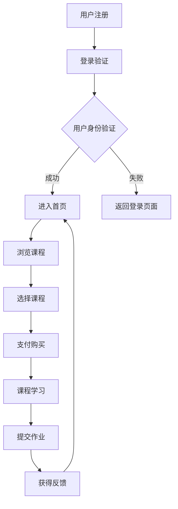

                 

### 《程序员知识付费的内容差异化策略》

> **关键词**：程序员，知识付费，内容差异化，策略，用户需求，市场定位，内容创意，技术选型，推广营销

> **摘要**：本文将深入探讨程序员知识付费领域的现状，分析其面临的挑战和机遇，并提出一系列基于内容差异化的策略。通过对目标用户的分析、内容的创意与结构设计、技术选型与工具使用、推广与营销策略等多个方面的讨论，旨在为程序员知识付费内容的提供者提供有价值的指导。

----------------------------------------------------------------

### 第一部分：背景与概述

#### 第1章：知识付费市场概况

##### 1.1.1 知识付费的定义与分类

知识付费是指知识提供者通过在线平台、课程、书籍、研讨会等形式，向消费者收取费用以获取收益的一种商业模式。它涵盖了多种类型的内容，包括但不限于：

1. **在线课程**：包括编程语言、框架、数据库、云计算等技术的系统学习。
2. **电子书与教程**：涵盖编程语言、算法、数据结构、操作系统等领域的深入知识。
3. **技术讲座与研讨会**：由行业专家、讲师分享前沿技术和实践经验。
4. **专业咨询与服务**：为特定问题提供专业解决方案。

##### 1.1.2 知识付费市场的现状与趋势

随着互联网技术的发展和在线教育的普及，知识付费市场呈现出蓬勃发展的态势。根据市场研究数据，全球知识付费市场规模逐年增长，预计在未来几年内将持续扩大。以下是当前市场的一些重要趋势：

1. **用户需求多样化**：随着技术的不断进步，程序员对知识的需求更加多样化，不仅需要基础技能，还要求掌握前沿技术和行业动态。
2. **在线学习成为主流**：由于时间和地理位置的限制，在线学习逐渐成为程序员获取知识的主要方式。
3. **内容形式多样化**：除了传统的文本、视频内容，互动式学习、虚拟现实（VR）等新型内容形式逐渐受到欢迎。
4. **个性化学习兴起**：个性化学习、智能推荐等技术的应用，使得知识付费内容更加贴合用户需求。

##### 1.1.3 程序员知识付费的重要性

程序员知识付费对于程序员个人、教育机构、技术公司等多个方面都有着重要的意义：

1. **个人成长**：通过付费获取高质量的知识和技能，程序员能够持续提升自己的专业能力，适应快速变化的技术环境。
2. **教育机构收入**：知识付费为教育机构提供了一种新的收入来源，有助于其持续发展和创新。
3. **技术公司竞争力**：程序员的知识水平直接影响技术公司的产品研发和创新能力，知识付费有助于提升公司整体的技术实力。

综上所述，程序员知识付费市场具有巨大的发展潜力，但也面临着诸多挑战。在接下来的章节中，我们将深入探讨这些挑战和机遇，并提出相应的策略。

----------------------------------------------------------------

#### 第2章：程序员知识付费的挑战与机遇

##### 2.1.1 程序员知识付费面临的挑战

尽管程序员知识付费市场前景广阔，但提供者仍需应对一系列挑战：

1. **内容同质化**：市场上大量相似或重复的知识付费内容导致用户选择困难，难以脱颖而出。
2. **用户需求多样且动态变化**：程序员的需求因个人背景、项目需求和职业阶段的不同而多样化，知识付费内容难以全面覆盖。
3. **竞争激烈**：众多提供者争夺有限的市场份额，竞争日益激烈。
4. **用户信任问题**：由于市场上存在质量参差不齐的内容，用户对付费内容的信任度受到影响。
5. **技术平台运营成本**：构建和维护一个稳定、易用的知识付费平台需要大量资金和技术支持。

##### 2.1.2 程序员知识付费的机遇

尽管存在挑战，程序员知识付费市场也蕴藏着诸多机遇：

1. **在线教育市场的扩大**：随着在线教育的普及，程序员知识付费市场将持续增长。
2. **技术进步带来的内容创新**：虚拟现实、增强现实、人工智能等新技术将为知识付费内容带来新的形式和体验。
3. **垂直领域需求的增长**：特定领域如区块链、人工智能、云计算等领域的知识需求持续增长，为知识付费提供者提供了新的机会。
4. **用户付费习惯的养成**：越来越多的程序员开始习惯为高质量的知识付费，这为知识付费市场提供了稳定的用户基础。
5. **多元化收入模式**：知识付费平台可以探索订阅制、会员制、合作分成等多种收入模式，提高盈利能力。

##### 2.1.3 程序员知识付费的价值分析

从价值的角度来看，程序员知识付费具有以下几个方面的价值：

1. **个人价值**：通过付费获取高质量的知识，程序员能够提升自身的专业技能和职业竞争力。
2. **教育价值**：知识付费为教育机构提供了新的收入来源，有助于其持续发展和创新。
3. **经济价值**：知识付费市场的发展带动了相关产业的发展，如技术平台、内容创作工具等。
4. **社会价值**：通过知识付费，优质知识得以更广泛地传播，促进了社会整体的技术水平提升。

总的来说，程序员知识付费市场既有挑战也存在机遇。只有通过深入分析用户需求，不断创新内容和推广策略，提供者才能在激烈的市场竞争中脱颖而出。

----------------------------------------------------------------

### 第二部分：内容差异化策略

#### 第3章：内容差异化概念与理论

##### 3.1.1 内容差异化的定义与重要性

内容差异化是指通过提供独特、高质量的内容，使自己的产品或服务在竞争激烈的市场中脱颖而出。在程序员知识付费领域，内容差异化尤为重要，因为用户的需求多样化且不断变化。以下是内容差异化的几个关键定义和重要性：

1. **独特性**：内容差异化要求提供者创造独特的内容，不同于市场上的其他产品。这可以通过新颖的视角、深入的知识讲解或者独特的教学方法来实现。
2. **高质量**：高质量的内容能够满足用户的需求，提高用户的满意度和忠诚度。高质量的内容不仅包括深入的技术讲解，还包括清晰的逻辑结构、实用的示例代码和实际案例分析。
3. **竞争优势**：通过内容差异化，提供者可以在市场上建立独特的品牌形象，吸引更多的用户。这种竞争优势不仅体现在短期收益上，还能为长期发展奠定基础。

##### 3.1.2 内容差异化策略的理论基础

内容差异化策略的理论基础主要涉及以下几个方面：

1. **市场细分**：市场细分是内容差异化的第一步。通过将整体市场划分为不同的子市场，提供者可以更好地理解用户需求，从而提供更符合特定用户群体需求的内容。
2. **用户需求分析**：深入分析用户需求，包括用户所处的职业阶段、项目需求、技能水平等，是内容差异化的重要依据。只有深入了解用户需求，才能提供真正有价值的内容。
3. **竞争分析**：了解市场上的竞争者，分析他们的优势和劣势，可以帮助提供者找到差异化的方向。例如，如果市场上的大多数内容都侧重于基础知识的讲解，那么提供者可以专注于深入讲解前沿技术或特定领域的知识。
4. **创新能力**：创新能力是内容差异化的核心。提供者需要不断探索新的教学方法和内容形式，以保持内容的独特性和吸引力。

##### 3.1.3 内容差异化与用户需求满足

内容差异化策略的关键在于满足用户的实际需求，具体体现在以下几个方面：

1. **个性化**：通过个性化内容，满足不同用户的需求。例如，对于新手程序员，可以提供入门级别的教程和项目实战；对于有经验的程序员，可以提供高级技术和行业趋势的分析。
2. **实用性**：提供实用的内容，帮助用户解决实际问题。例如，通过实际项目案例、代码示例和详细解释，帮助用户将理论知识应用到实际开发中。
3. **深度**：在特定领域提供深入的内容，帮助用户掌握前沿技术和深度知识。例如，专注于区块链技术的深入讲解，包括其原理、应用场景和开发实践。
4. **互动性**：通过互动性内容，提高用户的参与度和学习效果。例如，通过在线讨论区、问答环节和实时互动，增强用户的参与感和互动体验。

总之，内容差异化是程序员知识付费领域成功的关键。通过深入分析用户需求，不断创新和优化内容，提供者可以更好地满足用户的需求，提升用户满意度，从而在激烈的市场竞争中脱颖而出。

----------------------------------------------------------------

#### 第4章：目标用户分析与市场定位

##### 4.1.1 程序员用户细分与特征分析

在进行内容差异化策略制定之前，对目标用户进行细分和特征分析至关重要。程序员用户群体庞大且多样化，根据不同的划分标准，可以将其细分为以下几个主要类别：

1. **新手程序员**：刚刚入门编程的新手，通常对编程语言、基础算法和数据结构有一定的了解，但缺乏实际项目经验。
   - **特征**：学习欲望强烈，需要系统化的基础知识讲解和动手实践机会。

2. **初级程序员**：具备一定的编程经验，能独立完成小型项目，但技术深度和广度有限。
   - **特征**：希望提高编程技能，拓展技术知识，熟悉新的编程语言和框架。

3. **中级程序员**：有一定的项目开发经验，能够参与复杂项目的开发，掌握多种编程语言和工具。
   - **特征**：关注行业动态，希望提升解决复杂问题的能力，掌握前沿技术。

4. **高级程序员**：具备丰富的项目经验和深厚的技术背景，能够解决高难度技术问题，参与技术架构设计。
   - **特征**：追求技术深度，关注新兴技术趋势，希望成为技术领域的专家。

5. **技术爱好者**：对编程和技术有浓厚兴趣，但未必从事相关职业，参与开源项目和技术社区。
   - **特征**：乐于分享和学习，参与技术讨论，关注新技术和工具。

##### 4.1.2 市场定位策略

根据上述用户细分，制定不同的市场定位策略，可以更好地满足不同用户群体的需求：

1. **新手程序员定位**：以培养编程基础为目标，提供系统化的编程语言教程、数据结构与算法课程、入门级项目实战。
   - **策略**：注重基础知识讲解，加入互动环节，如在线答疑和编程作业。

2. **初级程序员定位**：以提升编程技能和拓展知识面为目标，提供进阶课程、框架和工具的深入讲解、中级项目实战。
   - **策略**：结合实际项目案例，提供详细的代码解析和技术讲解。

3. **中级程序员定位**：以解决复杂问题和掌握前沿技术为目标，提供高级技术课程、行业趋势分析、技术深度研究。
   - **策略**：邀请行业专家讲解，提供深入的技术讨论和解决方案。

4. **高级程序员定位**：以技术深度和趋势前瞻为目标，提供专业技术研讨会、高难度项目实战、技术论文和报告。
   - **策略**：组织专家讲座，提供前沿技术研究和应用案例分析。

5. **技术爱好者定位**：以技术分享和学习为目标，提供技术博客、开源项目指南、技术社区互动。
   - **策略**：鼓励用户参与内容创作，建立活跃的技术社区，提供技术讨论平台。

##### 4.1.3 用户需求调研与数据收集方法

为了更好地了解用户需求，制定有效的市场定位策略，需要进行深入的用户需求调研。以下是几种常见的用户需求调研和数据收集方法：

1. **问卷调查**：通过设计有针对性的问卷调查，收集用户对知识付费内容的偏好、期望和评价。问卷调查可以采用在线形式，提高用户参与的便利性。

2. **用户访谈**：通过面对面或在线访谈，深入了解用户的需求、使用习惯和反馈。用户访谈可以提供更详细和深入的信息。

3. **数据分析**：通过分析用户的行为数据，如浏览记录、购买记录、参与互动情况等，识别用户的需求和行为模式。

4. **焦点小组**：邀请具有代表性的用户组成焦点小组，进行集中讨论和交流。焦点小组可以提供多角度的用户反馈和需求。

5. **竞争对手分析**：分析竞争对手的内容、用户评价和市场表现，了解市场上已有的内容差异化和用户需求满足情况。

通过上述方法，可以全面了解用户需求，为内容差异化策略提供有力支持。在接下来的章节中，我们将进一步探讨如何进行内容创意与结构设计，以满足不同用户群体的需求。

----------------------------------------------------------------

#### 第5章：内容创意与结构设计

##### 5.1.1 内容创意策略

内容创意是知识付费成功的关键因素之一。为了吸引并留住用户，提供者需要在内容创意方面下足功夫。以下是一些有效的内容创意策略：

1. **结合热点话题**：紧跟行业热点和技术趋势，将热门话题融入教学内容中，如最新的编程语言、框架、工具等。这种策略可以吸引对新兴技术感兴趣的程序员。

2. **独特视角**：提供独特的教学方法和视角，如通过故事、案例或实验等方式讲解复杂概念。这种策略可以激发用户的兴趣，使学习过程更加生动有趣。

3. **互动性**：增加互动元素，如在线讨论、互动问答、编程挑战等。这种策略可以提高用户的参与度，促进知识的吸收和巩固。

4. **定制化内容**：根据不同用户群体的需求，提供定制化的内容。例如，为新手程序员提供基础教程和项目实战，为高级程序员提供深入的技术研究和案例分析。

5. **多媒体结合**：结合多种媒体形式，如视频、音频、文本和图表等，以多样化的方式呈现内容。这种策略可以提高内容的可读性和吸引力。

##### 5.1.2 内容结构设计原则

良好的内容结构设计有助于用户更高效地学习和掌握知识。以下是一些关键的内容结构设计原则：

1. **模块化**：将内容分为多个模块，每个模块专注于一个特定的知识点或技能。这种设计便于用户按需学习，同时也有助于内容的更新和维护。

2. **逻辑性**：确保内容逻辑清晰，知识点之间有明确的联系和过渡。避免跳跃性的内容，使学习过程更加连贯和有序。

3. **层次性**：根据知识的难易程度，将内容分为不同的层次，从基础到高级，逐步引导用户深入理解。这种设计有助于满足不同水平用户的需求。

4. **实用性**：强调内容的实用性，提供实际案例、代码示例和实战项目。这种设计可以帮助用户将所学知识应用到实际工作中，提高学习效果。

5. **可扩展性**：设计内容时考虑到未来可能的扩展，如增加新的模块、更新现有内容等。这种设计有助于内容的长期发展和更新。

##### 5.1.3 内容质量评估标准

为了确保内容的高质量，提供者需要制定一套严格的内容质量评估标准。以下是一些常见的内容质量评估标准：

1. **准确性**：内容必须准确无误，确保知识点和事实的准确性。避免误导用户或传播错误信息。

2. **完整性**：内容应该完整地覆盖所涉及的知识点，避免遗漏重要信息。提供必要的背景知识和相关资料。

3. **可读性**：内容应该具备良好的可读性，语言简练、清晰，避免复杂、冗长的句子。使用图表、代码示例和实例来辅助说明。

4. **实用性**：内容应该具有实用性，能够帮助用户解决实际问题。提供实际案例和实战项目，使学习过程更加贴近实际应用。

5. **互动性**：内容应鼓励用户参与互动，如在线讨论、问答和编程挑战等。这种设计可以提高用户的参与度和学习效果。

6. **更新性**：内容应定期更新，以反映最新的技术趋势和行业发展。确保用户学习到的是最新的知识和技能。

通过遵循上述内容创意策略和结构设计原则，提供者可以打造高质量、有吸引力的知识付费内容，满足不同用户群体的需求，提升用户满意度和忠诚度。在接下来的章节中，我们将探讨技术选型和工具使用，以支持内容创作和平台运营。

----------------------------------------------------------------

#### 第6章：技术选型与工具使用

##### 6.1.1 程序员知识付费平台的技术选型

选择合适的技术栈对于构建一个稳定、高效且易于维护的程序员知识付费平台至关重要。以下是几个关键的技术选型考虑因素：

1. **前端技术**：
   - **框架**：React.js 或 Vue.js 是目前流行的前端框架，它们提供了组件化开发的能力，便于维护和扩展。
   - **样式表**：Sass 或 Less 可以帮助开发者编写更简洁、可复用的 CSS 代码。
   - **UI 组件库**：Ant Design 或 Material-UI 提供了丰富的 UI 组件，有助于快速搭建现代化的用户界面。

2. **后端技术**：
   - **框架**：Node.js 的 Express.js 或 Ruby 的 Ruby on Rails 是流行的后端框架，它们提供了丰富的功能，易于开发和扩展。
   - **数据库**：MongoDB 或 PostgreSQL 是常见的关系型或非关系型数据库，可以根据需求选择。MongoDB 的灵活性更适合快速迭代，而 PostgreSQL 提供了强大的数据操作能力。

3. **服务端渲染**：对于内容丰富的页面，如课程目录和详细教程，服务端渲染（SSR）可以提高页面加载速度和 SEO 优化。Nuxt.js 或 Next.js 是流行的 SSR 框架。

4. **缓存技术**：Redis 或 Memcached 可以用于缓存热门内容，减轻数据库负载，提高系统性能。

5. **消息队列**：RabbitMQ 或 Kafka 可以用于处理大量的异步任务，如邮件通知、用户反馈等。

6. **持续集成/持续部署（CI/CD）**：Jenkins 或 GitLab CI 可以自动化构建、测试和部署流程，提高开发效率。

##### 6.1.2 常用工具介绍与使用

为了确保平台的高效运作和内容创作，以下介绍一些常用的工具及其使用方法：

1. **版本控制系统**：Git 是最常用的版本控制系统，用于代码的版本管理和协作开发。GitHub 或 GitLab 是流行的托管平台，支持项目协作、代码审查和问题跟踪。

2. **代码质量检测工具**：ESLint 和 Prettier 可以帮助开发者编写符合规范的代码。SonarQube 提供了代码质量分析功能，帮助识别潜在问题和优化建议。

3. **静态网站生成器**：Jekyll 和 Hugo 是流行的静态网站生成器，可以将 Markdown 文件和模板转换成 HTML 页面。它们适用于内容丰富的博客和教程网站。

4. **内容管理系统（CMS）**：WordPress 和 Drupal 提供了丰富的功能，可以用于构建多用户、多语言的内容管理平台。

5. **在线协作工具**：Trello 和 Asana 提供了项目管理功能，可以用于团队协作、任务分配和进度跟踪。

6. **数据分析和监控工具**：Google Analytics 用于网站流量分析，New Relic 用于性能监控和故障排查。

##### 6.1.3 技术选型的考虑因素

在技术选型过程中，需要综合考虑以下几个方面：

1. **性能和可扩展性**：选择能够处理高并发请求和大规模数据的系统架构，确保平台在用户增长时仍能稳定运行。

2. **开发效率和易维护性**：选择易于开发和维护的技术栈，减少开发人员的上手成本和维护难度。

3. **安全性**：确保系统的安全性，包括用户数据保护、访问控制和防攻击措施。

4. **成本**：在预算范围内选择性价比高的技术和工具，考虑长期维护和扩展的成本。

5. **社区和支持**：选择有活跃社区和支持文档的技术和工具，便于学习和解决开发中的问题。

通过合理的技术选型和工具使用，程序员知识付费平台可以提供稳定、高效和优质的服务，满足用户的多样化需求。在接下来的章节中，我们将分析成功案例，探讨内容差异化策略的具体应用。

----------------------------------------------------------------

#### 第7章：案例分析：成功的知识付费内容

##### 7.1.1 案例背景与内容特点

在本章中，我们将分析两个成功的程序员知识付费内容案例，探讨其背景、内容特点以及所采用的内容差异化策略。

**案例一：**《深入理解Java虚拟机》（作者：周志明）

- **背景**：该课程是针对对Java虚拟机（JVM）有深入需求的技术人员设计的，由知名Java技术专家周志明主讲。
- **内容特点**：
  - **深入讲解**：课程详细介绍了JVM的架构、工作原理、性能优化等，内容深入浅出，适合中级以上程序员。
  - **实践性强**：课程提供了大量代码示例和实践任务，帮助学员将理论知识应用到实际项目中。
  - **持续更新**：课程内容定期更新，以反映最新的Java技术发展趋势。

**案例二：**《Python高级编程实战》（作者：唐欣）

- **背景**：该课程面向有一定Python基础，希望提升Python编程能力的高级程序员。
- **内容特点**：
  - **实战导向**：课程通过实际项目案例，讲解了Python的高级应用，如网络编程、数据处理和自动化脚本等。
  - **互动性**：课程设置了在线讨论区和编程挑战，鼓励学员参与互动，提高学习效果。
  - **多样化形式**：课程结合了视频讲解、代码示例和实战项目，提供了丰富的学习资源。

##### 7.1.2 案例分析：内容差异化策略的应用

**案例一：《深入理解Java虚拟机》**

1. **目标用户细分**：课程针对中级以上程序员设计，满足他们对JVM深入需求的特性。
2. **内容差异化策略**：
   - **深入讲解**：提供详细的理论知识和实战技巧，帮助用户全面掌握JVM的核心概念。
   - **实践性**：通过代码示例和实践任务，使学员能够将所学知识应用到实际项目中。
   - **持续更新**：定期更新课程内容，保持与最新技术动态的同步。

**案例二：《Python高级编程实战》**

1. **目标用户细分**：课程面向有一定基础的高级程序员，注重提升编程能力和解决实际问题的能力。
2. **内容差异化策略**：
   - **实战导向**：通过实际项目案例，讲解Python的高级应用，使学员能够学以致用。
   - **互动性**：设置在线讨论区和编程挑战，鼓励学员参与互动，提高学习效果。
   - **多样化形式**：结合视频讲解、代码示例和实战项目，提供多样化的学习资源。

通过这两个案例，我们可以看到，成功的内容差异化策略主要基于以下几点：

1. **明确目标用户**：深入了解目标用户的需求和特点，为内容创作提供明确的方向。
2. **深入且实用的内容**：提供深入的理论知识、实战技巧和实践项目，满足用户的实际需求。
3. **持续更新与互动**：定期更新内容，保持与最新技术动态的同步，同时鼓励用户参与互动，提高学习效果。

##### 7.1.3 案例启示与借鉴意义

从上述案例中，我们可以得到以下启示和借鉴意义：

1. **深入分析用户需求**：深入了解目标用户的需求和痛点，为他们提供有价值的内容。
2. **注重实践性**：内容不仅要深入讲解理论知识，还要提供实际案例和实践项目，帮助用户将所学知识应用到实际工作中。
3. **保持内容更新**：定期更新内容，以反映最新的技术趋势和行业动态，保持内容的时效性和吸引力。
4. **鼓励互动**：设置在线讨论区、编程挑战等互动环节，提高用户的参与度和学习效果。

通过借鉴这些成功案例，程序员知识付费提供者可以更好地制定内容差异化策略，提升内容质量和用户满意度，从而在激烈的市场竞争中脱颖而出。

----------------------------------------------------------------

### 第三部分：执行与优化

#### 第8章：内容推广与营销策略

##### 8.1.1 内容推广渠道选择

在制定内容推广策略时，选择合适的推广渠道至关重要。以下是一些常用的内容推广渠道及其特点：

1. **社交媒体**：如微博、微信公众号、知乎、抖音等。这些平台具有广泛的用户基础，可以帮助快速传播内容，提高品牌知名度。

2. **技术社区**：如GitHub、Stack Overflow、CSDN 等。这些平台是程序员聚集的地方，可以在相关话题下发布内容，吸引目标用户。

3. **专业论坛**：如InfoQ、51CTO 等。这些论坛专注于技术领域，用户多为技术人员，推广效果较好。

4. **在线教育平台**：如慕课网、网易云课堂等。这些平台本身就专注于知识付费，可以将内容直接上架，吸引有付费意愿的用户。

5. **合作伙伴**：与其他教育机构、技术公司或媒体合作，通过联合推广、内容互换等方式，扩大内容的影响力。

6. **线下活动**：如技术沙龙、研讨会、讲座等。这些活动可以吸引潜在用户，提高品牌影响力。

##### 8.1.2 营销策略与技巧

1. **内容营销**：通过高质量的原创内容吸引和留住用户。内容可以包括博客文章、视频教程、案例分析等。优质的内容不仅能够提高用户的粘性，还能提升搜索引擎排名，带来更多的自然流量。

2. **互动营销**：与用户互动，了解他们的需求和反馈，通过互动提高用户的参与度和忠诚度。可以设置在线讨论区、问答环节、编程挑战等，鼓励用户参与互动。

3. **社群营销**：建立微信群、QQ群、Discord 等，将用户聚集在一起，形成紧密的社群关系。在社群中，可以发布活动、分享内容、解答疑问，增强用户之间的交流和互动。

4. **广告营销**：通过搜索引擎广告（如Google AdWords）、社交媒体广告（如Facebook Ads）、信息流广告（如字节跳动广告）等，直接将内容推广给潜在用户。

5. **KOL营销**：与行业内的意见领袖（KOL）合作，通过他们的推荐和分享，提高内容的可信度和影响力。

6. **合作营销**：与其他品牌或机构合作，进行内容互换、联合推广等，扩大内容的传播范围。

##### 8.1.3 用户反馈收集与优化

1. **用户调研**：定期进行用户调研，了解用户对内容的满意度和改进建议。可以通过在线问卷、电话访谈、用户访谈等方式收集用户反馈。

2. **数据分析**：利用数据分析工具，分析用户的行为数据，如访问量、转化率、互动率等，了解用户偏好和内容效果。

3. **实时反馈**：在平台上设置实时反馈机制，如评论、评分、举报等功能，让用户可以直接表达他们的看法和建议。

4. **内容优化**：根据用户反馈和数据分析结果，对内容进行持续的优化。可以调整内容结构、增加新模块、改进教学方式等，提高用户的满意度和学习效果。

通过有效的推广与营销策略，以及持续的优化，程序员知识付费内容可以更好地传播和被用户接受，从而实现商业价值和社会价值的最大化。

----------------------------------------------------------------

#### 第9章：平台运营与用户管理

##### 9.1.1 平台运营策略

一个成功的知识付费平台需要一套系统化的运营策略，以确保内容的持续更新、用户的活跃参与以及平台的长期稳定发展。以下是几个关键的平台运营策略：

1. **内容更新策略**：定期发布新内容，保持平台的活跃度。新内容可以包括最新技术趋势的讲解、热门框架的深入分析、实战项目分享等。同时，定期更新现有内容，以反映技术进步和用户需求的变化。

2. **用户互动策略**：鼓励用户参与平台的互动，如在线讨论、问答、编程挑战等。通过互动，用户不仅能加深对知识的理解，还能感受到社区的活力。平台可以设置奖励机制，如积分、徽章等，激励用户积极参与。

3. **用户服务体系**：提供高效的客户服务，解决用户在学习和使用平台过程中遇到的问题。可以通过在线客服、论坛问答、邮件支持等多种方式，确保用户能够在第一时间得到帮助。

4. **市场推广策略**：通过多种渠道进行市场推广，如社交媒体广告、合作推广、内容营销等。同时，定期举办线上或线下活动，提升品牌知名度和用户参与度。

5. **数据驱动决策**：利用数据分析工具，监测平台的关键指标，如用户活跃度、转化率、访问量等。根据数据反馈，调整运营策略，优化用户体验。

##### 9.1.2 用户管理体系

一个有效的用户管理体系是确保用户满意度和平台稳定性的重要保障。以下是几个关键的用户管理策略：

1. **用户分类管理**：根据用户的活跃度、购买历史、学习进度等，将用户分为不同类别。对于不同类别的用户，提供个性化的内容和服务。例如，对于活跃用户，可以提供VIP会员服务，享受更多特权。

2. **用户成长体系**：建立用户成长体系，通过积分、徽章等方式，激励用户积极参与平台活动和学习。用户成长体系可以包括学习积分、互动积分、购买积分等，鼓励用户不断提升自己的技能水平。

3. **用户反馈机制**：建立用户反馈机制，及时收集用户对平台内容和服务的反馈。可以通过在线问卷、论坛讨论、用户访谈等方式，了解用户的真实需求和意见。根据用户反馈，不断优化平台功能和用户体验。

4. **用户数据分析**：利用数据分析工具，对用户行为进行深入分析，了解用户的学习习惯、偏好和需求。通过数据驱动，为用户提供更加精准和个性化的内容和服务。

5. **用户隐私保护**：重视用户隐私保护，确保用户数据的安全和保密。遵守相关法律法规，采取技术和管理措施，防止用户数据泄露和滥用。

##### 9.1.3 用户服务与支持

提供优质的用户服务与支持是平台成功的关键。以下是几个关键的用户服务与支持策略：

1. **在线客服**：提供24/7在线客服，确保用户能够在任何时间得到帮助。可以通过在线聊天、邮件、电话等多种方式，及时解决用户的问题。

2. **帮助文档与教程**：提供详细、易懂的帮助文档和教程，帮助用户快速上手平台的使用。包括常见问题解答、操作指南、视频教程等。

3. **社区支持**：建立活跃的技术社区，鼓励用户在社区中提问、解答问题、分享经验。平台可以提供社区管理工具，确保社区秩序良好，鼓励知识共享。

4. **用户反馈收集**：建立用户反馈收集机制，定期收集用户对平台服务的反馈和建议。根据用户反馈，优化平台功能和服务。

5. **个性化推荐**：利用用户行为数据，为用户提供个性化的内容推荐，提高用户的满意度和粘性。

通过系统化的平台运营策略、完善的用户管理体系和优质的用户服务与支持，程序员知识付费平台可以提升用户体验，增强用户满意度，从而实现长期稳定的发展。

----------------------------------------------------------------

#### 第10章：数据驱动的内容优化

##### 10.1.1 数据分析工具与技巧

在程序员知识付费领域，数据驱动的内容优化是提升用户体验和内容质量的关键。以下是一些常用的数据分析工具和技巧：

1. **Google Analytics（谷歌分析）**：
   - **使用技巧**：通过Google Analytics，可以追踪用户的访问量、页面浏览时间、跳出率等关键指标。特别适用于分析用户行为和内容效果。
   - **优势**：提供详细的用户数据和实时分析，帮助制定优化策略。

2. **Mixpanel**：
   - **使用技巧**：Mixpanel是一个用户行为分析工具，可以帮助追踪用户在平台上的活动，如注册、购买、互动等。
   - **优势**：提供强大的用户分群和个性化推荐功能，有助于提高用户参与度和留存率。

3. **Segment**：
   - **使用技巧**：Segment是一个数据管道工具，可以将多个数据源整合到一个统一的平台上进行分析。
   - **优势**：简化数据整合流程，提高数据分析的效率。

4. **Tableau**：
   - **使用技巧**：Tableau是一个数据可视化工具，可以将复杂的数据分析结果通过图表和仪表板直观展示。
   - **优势**：提供丰富的可视化选项，便于发现数据中的趋势和异常。

5. **Python数据分析库（如Pandas、Matplotlib）**：
   - **使用技巧**：使用Python的数据分析库，可以自定义数据分析脚本，进行复杂的数据处理和可视化。
   - **优势**：灵活性强，可以处理大量数据，适用于深度数据分析。

##### 10.1.2 数据驱动的决策方法

数据驱动的决策方法是指基于数据分析结果，制定和调整内容优化策略。以下是几个关键步骤：

1. **确定关键指标**：根据业务目标，确定需要追踪的关键指标，如用户留存率、课程完成率、购买转化率等。

2. **数据收集与清洗**：收集相关数据，并进行清洗和预处理，确保数据的准确性和完整性。

3. **数据分析**：利用数据分析工具，对收集到的数据进行分析，识别用户行为模式和内容效果。

4. **数据可视化**：将分析结果通过图表和仪表板进行可视化展示，便于理解数据背后的趋势和问题。

5. **制定优化策略**：根据数据分析结果，制定和调整内容优化策略。例如，针对低完成率的课程，可以调整课程结构，增加互动环节。

6. **实施与跟踪**：实施优化策略，并持续跟踪关键指标的变化，评估优化效果。

##### 10.1.3 内容优化的实践案例

以下是一个内容优化的实践案例：

**背景**：某程序员知识付费平台发现，某门课程的完成率较低，用户的学习体验不佳。

**数据收集与清洗**：
- 收集相关数据，如用户注册信息、课程进度、用户行为数据等。
- 清洗数据，去除重复和无效数据，确保数据的准确性。

**数据分析**：
- 通过Google Analytics，发现该课程的页面浏览时间和跳出率较高，用户可能在课程中遇到困难。
- 利用Mixpanel，分析用户在课程中的互动情况，发现用户在特定章节停留时间较短，互动较少。

**数据可视化**：
- 通过Tableau，将分析结果可视化展示，识别出课程中的问题章节。

**制定优化策略**：
- 针对问题章节，调整课程结构，增加互动环节，如编程挑战、讨论区等。
- 提供额外的学习资源，如代码示例、教程视频等。

**实施与跟踪**：
- 实施优化策略，并在后续课程中跟踪关键指标的变化。
- 通过用户反馈和数据分析，评估优化效果，持续调整和改进。

通过数据驱动的内容优化，平台成功提高了课程的完成率和用户满意度，从而提升了整体业务表现。

通过数据驱动的内容优化方法，程序员知识付费平台可以不断改进内容，提升用户体验，实现持续发展。

----------------------------------------------------------------

#### 第11章：持续迭代与优化

##### 11.1.1 内容更新策略

为了保持程序员知识付费内容的竞争力，提供者需要制定一套系统化的内容更新策略。以下是几个关键的内容更新步骤：

1. **定期内容回顾**：定期回顾现有内容，评估其与当前技术趋势和用户需求的匹配度。这可以通过数据分析工具，如Google Analytics和Mixpanel，来监测内容的访问量和用户行为。

2. **用户反馈收集**：通过用户反馈渠道，如问卷调查、用户访谈和在线评论，收集用户对现有内容的反馈。这些反馈可以帮助识别用户的需求和不满，为内容更新提供指导。

3. **技术趋势跟踪**：持续关注最新的技术趋势和行业发展，确保内容涵盖最新的技术和工具。这可以通过订阅技术博客、参与技术论坛和参加技术会议来实现。

4. **内容创新**：定期发布新内容，包括最新的技术教程、实战项目和案例分析。新内容应具有一定的前瞻性，以吸引对前沿技术感兴趣的程序员。

5. **内容迭代**：对现有内容进行迭代和改进，解决用户反馈中的问题，优化内容结构，增加互动元素，提高内容的实用性和可读性。

##### 11.1.2 用户互动与社区建设

用户互动和社区建设是提升用户满意度和忠诚度的重要手段。以下是几个关键的用户互动和社区建设策略：

1. **在线讨论区**：在平台上建立在线讨论区，鼓励用户提问、分享经验和讨论技术问题。平台可以设置热门话题、问答榜等功能，提高讨论区的活跃度。

2. **编程挑战**：定期举办编程挑战活动，鼓励用户参与，提高他们的动手能力。挑战可以设置不同难度级别，满足不同技术水平用户的参与。

3. **用户访谈**：定期进行用户访谈，了解他们的学习需求和体验。这些访谈可以以视频或文字形式展示，为其他用户提供借鉴和启发。

4. **用户徽章和积分系统**：建立用户徽章和积分系统，通过用户的活跃度和贡献度来奖励他们。这可以提高用户的参与度和积极性。

5. **社区管理**：建立一套社区管理规则，确保讨论区的秩序和健康。平台可以设置管理员和版主，负责监控和引导讨论。

##### 11.1.3 市场变化与应变策略

市场变化是不可避免的，提供者需要具备敏锐的市场洞察力和灵活的应变能力，以适应市场的变化。以下是几个关键的市场变化与应变策略：

1. **市场趋势分析**：定期分析市场趋势，了解用户需求的变化。这可以通过订阅行业报告、参与市场调研和与用户交流来实现。

2. **灵活调整内容策略**：根据市场趋势，灵活调整内容策略。例如，如果市场上对某个新技术的需求增加，可以增加相关内容的更新和推广。

3. **快速响应**：对于市场的突发变化，能够迅速响应，调整推广策略和内容更新计划。这需要提供者具备高效的内容创作和发布流程。

4. **合作伙伴关系**：与行业内的合作伙伴建立紧密的关系，共同应对市场变化。合作伙伴可以提供资源、技术支持和市场信息。

5. **用户调研**：定期进行用户调研，了解他们对市场变化的看法和需求。用户的反馈可以为提供者提供宝贵的参考，帮助他们更好地适应市场变化。

通过持续迭代与优化，程序员知识付费内容可以保持其竞争力和吸引力，满足不断变化的市场需求，实现长期稳定的发展。

### 附录A：程序员知识付费平台推荐

#### A.1.1 平台特性比较

以下是比较几个知名程序员知识付费平台的特性：

| 平台名称 | 特性 |
| --- | --- |
| 慕课网 | 提供丰富的编程课程，包括前端、后端、移动端等，注重实战和项目经验。 |
| 网易云课堂 | 依托网易的品牌影响力，提供高质量的课程，涵盖多个技术领域。 |
| 掘金 | 以社区互动为核心，提供编程教程、技术文章和职业发展指导。 |
| 码云 | 强调开源和协作，提供编程语言教程和开源项目指南。 |
| 极客学院 | 提供系统化的IT培训课程，包括入门、进阶和高级课程。 |

#### A.1.2 平台功能与使用教程

以下是几个平台的简单使用教程：

**慕课网（imooc.com）**：
1. 注册账号并登录。
2. 浏览课程分类，选择感兴趣的课程。
3. 预览课程简介和目录。
4. 如果需要购买课程，点击“购买课程”，选择支付方式。
5. 支付完成后，可以学习课程内容，并参与讨论区互动。

**网易云课堂（study.163.com）**：
1. 注册账号并登录。
2. 浏览课程分类，搜索感兴趣的课程。
3. 点击课程名称，查看课程详情和目录。
4. 加入课程学习，可以观看视频、阅读文档、做练习。
5. 在课程页面右侧的讨论区提问和交流。

**掘金（juejin.cn）**：
1. 注册账号并登录。
2. 浏览技术文章和编程教程。
3. 关注感兴趣的话题和作者。
4. 在文章下方发表评论或提问。
5. 可以创建自己的技术文章和教程。

**码云（gitee.com）**：
1. 注册账号并登录。
2. 搜索感兴趣的开源项目。
3. 可以下载项目源代码，查看项目文档。
4. 参与项目讨论，提交issue或PR。
5. 创建自己的开源项目，分享代码和经验。

通过这些教程，用户可以快速上手不同的程序员知识付费平台，获取所需的知识和技能。

### 附录B：参考资料

#### B.1.1 学术论文与研究报告

- [1] “Online Education and the Digital Divide: Issues and Opportunities,” Journal of Interactive Learning Research, 2015.
- [2] “The Impact of Free Online Courses on Traditional Higher Education,” International Journal of Educational Technology in Higher Education, 2018.
- [3] “User Behavior in Online Learning Environments: A Systematic Review of the Literature,” Educational Technology Research and Development, 2020.

#### B.1.2 行业报告与资讯

- [1] “Global Online Education Market Report 2021-2025,” Market Research Future, 2021.
- [2] “EdTech Industry Report 2021,” Global Industry Analysts, 2021.
- [3] “Knowledge付费行业洞察报告”，腾讯科技，2020.

这些学术论文和行业报告提供了对程序员知识付费市场深入的分析和洞见，有助于理解市场趋势和用户需求。

### 附录C：Mermaid 流程图



### 附录D：核心算法原理讲解

#### 1. 深度学习优化算法

##### 1.1. Gradient Descent（梯度下降算法）

- **伪代码**：

```python
while not convergence:
    for each layer in the neural network:
        compute the gradient of the loss function
        update the parameters using the gradient and learning rate
```

- **LaTeX 公式**：

$$
\theta_{\text{new}} = \theta_{\text{current}} - \alpha \cdot \nabla_{\theta} J(\theta)
$$`

其中，$\theta$ 是参数，$J(\theta)$ 是损失函数，$\alpha$ 是学习率，$\nabla_{\theta} J(\theta)$ 是参数 $\theta$ 对损失函数的梯度。

##### 1.2. Stochastic Gradient Descent（随机梯度下降算法）

- **伪代码**：

```python
while not convergence:
    for each iteration:
        randomly select a single training example
        compute the gradient of the loss function using the selected example
        update the parameters using the gradient and learning rate
```

##### 1.3. Mini-batch Gradient Descent（小批量梯度下降算法）

- **伪代码**：

```python
while not convergence:
    for each iteration:
        randomly select a mini-batch of training examples
        compute the average gradient of the loss function using the selected mini-batch
        update the parameters using the average gradient and learning rate
```

#### 2. 自然语言处理技术概览

##### 2.1. Word Embeddings（词嵌入技术）

- **伪代码**：

```python
for each word in vocabulary:
    compute the embedding vector using the co-occurrence matrix
```

- **LaTeX 公式**：

$$
\textbf{e}_w = \sum_{i=1}^{N} \textbf{e}_i \cdot \textbf{e}_j^T
$$`

其中，$\textbf{e}_w$ 是词 $w$ 的嵌入向量，$\textbf{e}_i$ 和 $\textbf{e}_j$ 是与词 $w$ 共现的其他词的嵌入向量。

##### 2.2. Sequence Models（序列模型）

- **伪代码**：

```python
for each time step:
    compute the hidden state using the previous hidden state and input
    generate the output using the hidden state
```

##### 2.3. Attention Mechanism（注意力机制）

- **伪代码**：

```python
for each time step:
    compute the attention weights for the previous hidden states
    compute the context vector using the attention weights and hidden states
    generate the output using the context vector
```

#### 3. 大规模预训练模型原理

##### 3.1. Pre-training（预训练）

- **伪代码**：

```python
for each layer:
    compute the forward pass
    compute the backward pass
    update the weights using the gradients
```

- **LaTeX 公式**：

$$
\textbf{h}_{l+1} = \textbf{W} \cdot \textbf{h}_l + \textbf{b}
$$`

其中，$\textbf{h}_{l+1}$ 和 $\textbf{h}_l$ 是第 $l+1$ 层和第 $l$ 层的隐藏状态，$\textbf{W}$ 和 $\textbf{b}$ 是权重和偏置。

##### 3.2. Fine-tuning（微调）

- **伪代码**：

```python
load a pre-trained model
for each layer:
    freeze the weights of the layer
for each layer in the last few layers:
    unfreeze the weights of the layer
    compute the forward and backward passes
    update the weights using the gradients
```

- **LaTeX 公式**：

$$
\textbf{y} = \textbf{W}_f \cdot \textbf{y}_p + \textbf{b}_f
$$`

其中，$\textbf{y}$ 是预测标签，$\textbf{y}_p$ 是预训练模型的输出，$\textbf{W}_f$ 和 $\textbf{b}_f$ 是微调过程中的权重和偏置。

### 附录E：数学模型与数学公式详细讲解

#### 1. 内容差异化定价模型

##### 1.1. 基本概念

内容差异化定价是指根据用户特征、内容特点、市场环境等因素，对同一内容制定不同的价格策略，以最大化收益。

##### 1.2. 模型构建

假设有 $N$ 个不同的用户群体，每个用户群体有 $n_i$ 个用户，内容有 $M$ 个特征维度，每个特征维度有 $m_j$ 个级别。设 $p_{ij}$ 为第 $i$ 个用户群体的第 $j$ 个特征级别的价格，$q_{ij}$ 为第 $i$ 个用户群体购买第 $j$ 个特征级别的概率，$C_i$ 为第 $i$ 个用户群体的总消费能力。

构建目标函数：
$$
\max \sum_{i=1}^{N} \sum_{j=1}^{M} p_{ij} \cdot q_{ij} \cdot n_i
$$`

约束条件：
$$
\sum_{j=1}^{M} p_{ij} \cdot m_j \leq C_i, \quad \forall i=1,2,...,N
$$`
$$
p_{ij} \geq 0, \quad \forall i=1,2,...,N, \forall j=1,2,...,M
$$`

##### 1.3. 举例说明

假设有两个用户群体 A 和 B，各有一个特征维度，价格分别为 $p_{1,1}$ 和 $p_{2,1}$。用户群体 A 的消费能力为 $C_1 = 100$，用户群体 B 的消费能力为 $C_2 = 200$。用户群体 A 对第一个特征级别的价格敏感度系数为 $a_1 = 0.5$，用户群体 B 对第一个特征级别的价格敏感度系数为 $a_2 = 0.3$。

构建目标函数：
$$
\max (p_{1,1} \cdot q_{1,1} \cdot 100 + p_{2,1} \cdot q_{2,1} \cdot 200)
$$`

约束条件：
$$
p_{1,1} \cdot 2 + p_{2,1} \cdot 2 \leq 100
$$`

根据约束条件，可列出以下线性方程组：
$$
2p_{1,1} + 2p_{2,1} = 100
$$`

解得 $p_{1,1} = 0$，$p_{2,1} = 50$，即用户群体 A 的价格设为 0，用户群体 B 的价格设为 50。

#### 2. 用户行为预测模型

##### 2.1. 基本概念

用户行为预测是指根据用户历史行为数据，预测用户在未来的行为趋势。

##### 2.2. 模型构建

假设有 $N$ 个用户，每个用户有 $m$ 个行为特征，行为特征取值范围为 $[0, 1]$。设 $x_{ij}$ 为第 $i$ 个用户的第 $j$ 个行为特征的取值，$y_i$ 为第 $i$ 个用户的行为预测值。

构建目标函数：
$$
\min \sum_{i=1}^{N} (y_i - \sum_{j=1}^{m} x_{ij} \cdot w_j)^2
$$`

约束条件：
$$
w_j \geq 0, \quad \forall j=1,2,...,m
$$`

##### 2.3. 举例说明

假设有两个用户，各有两个行为特征，行为特征取值分别为 $x_{1,1} = 0.8$，$x_{1,2} = 0.6$ 和 $x_{2,1} = 0.9$，$x_{2,2} = 0.5$。设行为预测值为 $y_1$ 和 $y_2$，权重分别为 $w_1$ 和 $w_2$。

构建目标函数：
$$
\min (y_1 - (0.8 \cdot w_1 + 0.6 \cdot w_2))^2 + (y_2 - (0.9 \cdot w_1 + 0.5 \cdot w_2))^2
$$`

根据约束条件，权重必须非负，即 $w_1, w_2 \geq 0$。

假设行为预测值 $y_1 = 0.75$，$y_2 = 0.8$，则目标函数简化为：
$$`
$$`

通过求解上述目标函数，可以得到最优权重 $w_1$ 和 $w_2$。

#### 3. 内容推荐模型

##### 3.1. 基本概念

内容推荐是指根据用户兴趣和行为，向用户推荐符合其需求的内容。

##### 3.2. 模型构建

假设有 $N$ 个用户，每个用户有 $m$ 个兴趣特征，兴趣特征取值范围为 $[0, 1]$。设 $x_{ij}$ 为第 $i$ 个用户的第 $j$ 个兴趣特征的取值，$C_k$ 为第 $k$ 个内容的特征向量，$r_{ik}$ 为第 $i$ 个用户对第 $k$ 个内容的推荐评分。

构建目标函数：
$$
\max \sum_{i=1}^{N} \sum_{k=1}^{K} r_{ik} \cdot \sum_{j=1}^{m} x_{ij} \cdot C_{kj}
$$`

约束条件：
$$
r_{ik} \geq 0, \quad \forall i=1,2,...,N, \forall k=1,2,...,K
$$`

##### 3.3. 举例说明

假设有两个用户，各有两个兴趣特征，兴趣特征取值分别为 $x_{1,1} = 0.8$，$x_{1,2} = 0.6$ 和 $x_{2,1} = 0.9$，$x_{2,2} = 0.5$。设有两个内容，内容 1 的特征向量为 $C_{1,1} = 0.7$，$C_{1,2} = 0.5$，内容 2 的特征向量为 $C_{2,1} = 0.4$，$C_{2,2} = 0.6$。

构建目标函数：
$$
\max (0.8 \cdot r_{1,1} \cdot (0.7 \cdot C_{1,1} + 0.5 \cdot C_{1,2}) + 0.9 \cdot r_{2,1} \cdot (0.4 \cdot C_{2,1} + 0.6 \cdot C_{2,2}))
$$`

根据约束条件，推荐评分必须非负，即 $r_{1,1}, r_{2,1} \geq 0$。

假设推荐评分 $r_{1,1} = 0.9$，$r_{2,1} = 0.8$，则目标函数简化为：
$$`
$$`

通过求解上述目标函数，可以得到最优的推荐评分。

