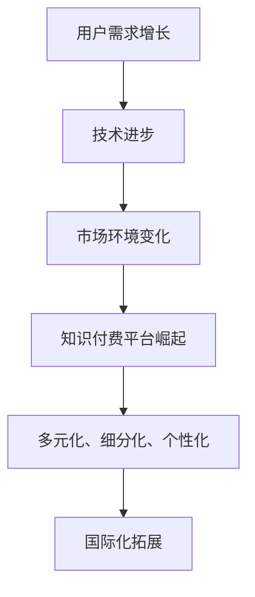
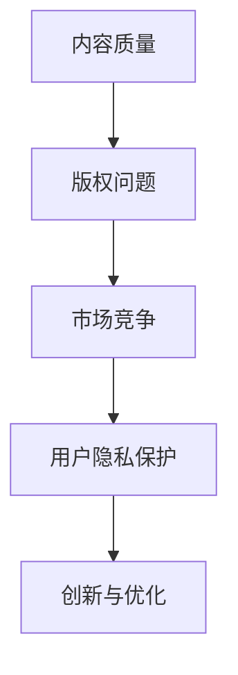
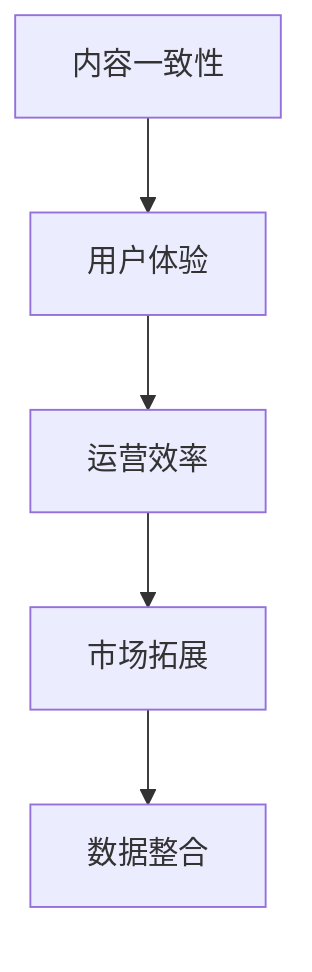
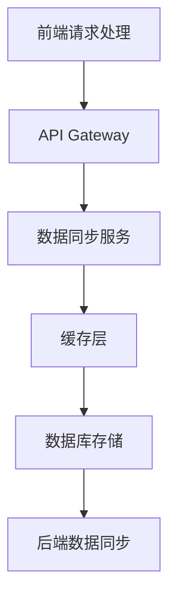

                 

### 第1章：知识付费的起源与发展

知识付费，作为一种新兴的商业模式，正日益受到广泛关注。本章将探讨知识付费的起源、演变以及当前行业现状与趋势。

#### 1.1.1 知识付费的定义与演变

知识付费，顾名思义，指的是用户为了获取特定领域的专业知识和技能而愿意支付的费用。这种模式的出现，源于信息时代的快速发展，人们对于知识的渴求与日俱增。早期的知识付费主要表现为传统教育，如学校教育、培训班等。随着互联网的普及和在线教育的兴起，知识付费逐渐从线下迁移到线上，形成了如今的多样化知识付费平台。

知识付费的演变历程可以追溯到以下几个阶段：

1. **传统教育阶段**：在这个阶段，知识付费主要依赖于传统教育机构，如学校、培训机构等。用户通过支付学费来获取知识。

2. **在线教育阶段**：随着互联网技术的发展，在线教育开始崛起。用户可以通过网络平台购买课程，实现随时随地学习。

3. **知识付费平台阶段**：在线教育平台逐渐发展壮大，如网易云课堂、腾讯课堂等，它们不仅提供课程，还提供各种增值服务，如直播、问答、社群等，极大地丰富了知识付费的形式。

#### 1.1.2 知识付费的驱动力

知识付费的快速发展，离不开以下几个驱动因素：

1. **用户需求**：随着社会的发展，人们越来越重视个人成长和职业发展，对于知识的渴求日益强烈。知识付费平台恰好满足了这一需求。

2. **技术进步**：互联网、大数据、云计算等技术的快速发展，为知识付费提供了强大的技术支撑。这些技术使得知识付费平台能够提供更加个性化、高效的服务。

3. **市场环境**：市场竞争的加剧，使得企业和个人需要不断提升自身的能力，以适应快速变化的市场环境。知识付费平台因此得到了广泛的应用。

#### 1.1.3 知识付费的行业现状与趋势

当前，知识付费行业呈现出以下特点：

1. **多元化**：知识付费平台覆盖了各个领域，从IT技术、金融经济到生活艺术，满足了不同用户的需求。

2. **细分化**：知识付费平台逐渐向细分市场发展，如专注于编程的“掘金”、专注于金融的“雪球”等，为用户提供更加专业的内容。

3. **个性化**：知识付费平台通过大数据分析，为用户提供个性化的推荐，提高了用户的满意度和粘性。

4. **国际化**：随着全球化的发展，知识付费平台开始向国际市场拓展，吸引了大量的海外用户。

未来，知识付费行业将继续保持快速增长，预计将有更多的创新模式和平台涌现。同时，随着技术的不断进步，知识付费平台将提供更加智能化、便捷化的服务，满足用户不断变化的需求。

### Mermaid 流程图



#### 1.1.4 知识付费的价值与挑战

知识付费不仅为用户提供了高质量的知识服务，还为企业创造了新的商业模式。然而，知识付费行业也面临着一些挑战：

1. **内容质量**：知识付费的核心在于内容，高质量的内容是吸引和留住用户的关键。因此，内容质量是知识付费平台需要持续关注的重点。

2. **版权问题**：知识付费涉及到大量的版权问题，如何保护版权、避免侵权是知识付费平台需要解决的重要问题。

3. **市场竞争**：知识付费行业竞争激烈，平台需要不断创新和优化，以保持竞争优势。

4. **用户隐私**：随着用户对隐私保护意识的提高，知识付费平台需要确保用户的隐私安全。

总之，知识付费行业具有巨大的发展潜力，但也面临着诸多挑战。只有不断创新和优化，才能在激烈的市场竞争中脱颖而出。

### Mermaid 流程图



通过以上分析，我们可以看到知识付费行业的起源、演变以及当前的发展现状。在接下来的章节中，我们将深入探讨跨平台内容同步策略，为知识付费平台提供更高效的解决方案。

---

### 第2章：跨平台内容同步的核心概念

在知识付费的快速发展背景下，跨平台内容同步成为一个至关重要的技术需求。本章将详细介绍跨平台内容同步的核心概念，包括其定义、目标、技术挑战以及价值。

#### 2.1.1 跨平台内容同步的定义与目标

**定义**：跨平台内容同步是指在多个不同的平台之间实现内容实时或定期更新的过程。这些平台可以是不同的社交媒体、在线教育平台、企业内部系统等。

**目标**：跨平台内容同步的主要目标是保证内容在不同平台上的更新一致性，提高用户体验，拓展用户覆盖范围。具体来说，跨平台内容同步有以下几方面的目标：

1. **内容一致性**：确保同一内容在不同平台上展示的内容一致，避免信息误差和用户混淆。

2. **用户体验**：提供无缝的跨平台体验，使用户可以在任何平台都能访问到最新的内容。

3. **用户覆盖**：通过在不同平台上同步内容，可以扩大用户群体的覆盖范围，提高知识付费平台的曝光率和用户粘性。

#### 2.1.2 内容同步的技术挑战

**数据一致性**：这是跨平台内容同步面临的首要挑战。由于不同平台的数据结构和存储方式可能不同，如何保证数据在不同平台之间的一致性是一个复杂的问题。

**性能优化**：跨平台内容同步需要处理大量的数据传输，因此性能优化是另一个重要挑战。高速、低延迟的内容同步是提升用户体验的关键。

**安全性**：内容同步过程中涉及大量的数据传输和存储，因此安全性至关重要。如何确保数据在传输和存储过程中的安全，是跨平台内容同步需要解决的重要问题。

#### 2.1.3 跨平台内容同步的价值

**用户体验**：通过跨平台内容同步，用户可以在不同的设备上无缝切换，始终访问到最新的内容。这极大地提升了用户的体验和满意度。

**运营效率**：跨平台内容同步可以减少内容重复创建和更新的工作量，提高内容管理效率。运营人员可以集中精力优化核心内容，而不必担心不同平台之间的内容同步问题。

**市场拓展**：通过跨平台内容同步，知识付费平台可以扩大用户覆盖范围，吸引更多的潜在用户。这有助于提高平台的知名度和市场影响力。

**数据整合**：跨平台内容同步可以实现数据的整合和分析，为平台提供更全面的数据支持。这有助于平台更好地了解用户需求，优化产品和服务。

总之，跨平台内容同步是知识付费平台发展的重要方向。在接下来的章节中，我们将深入探讨跨平台内容同步的具体技术实现和架构设计，为平台提供实用的解决方案。

### Mermaid 流程图



通过以上分析，我们可以清晰地理解跨平台内容同步的核心概念和重要性。在接下来的章节中，我们将逐步探讨实现跨平台内容同步的具体技术手段和策略。

---

### 第3章：内容同步技术基础

在了解跨平台内容同步的核心概念后，我们需要掌握一系列关键技术来实现内容同步。本章将重点介绍RESTful API、GraphQL和Webhook三种技术，分析它们的原理、优势和应用场景。

#### 3.1.1 RESTful API设计与实现

**原理**：RESTful API（Representational State Transfer API）是一种基于HTTP协议的网络服务架构风格。它通过统一的接口设计，实现资源的创建、读取、更新和删除（CRUD）操作。

**设计原则**：
1. **统一接口**：所有API接口遵循统一的命名规范和方法。
2. **状态转移**：通过HTTP请求的不同方法（如GET、POST、PUT、DELETE）实现状态转移。
3. **无状态**：每个请求之间相互独立，服务器不保存任何关于请求的信息。

**常用方法**：
- **GET**：用于获取资源。
- **POST**：用于创建资源。
- **PUT**：用于更新资源。
- **DELETE**：用于删除资源。

**优势**：RESTful API具有简单易用、易于扩展、跨平台兼容性强等优点，广泛应用于各种网络应用。

**应用场景**：RESTful API适用于需要频繁读取、创建、更新和删除资源的场景，如在线教育平台、社交媒体等。

**伪代码示例**：

```python
def handle_request(request):
    if request.method == 'GET':
        return get_data()
    elif request.method == 'POST':
        return create_data(data)
    elif request.method == 'PUT':
        return update_data(data)
    elif request.method == 'DELETE':
        return delete_data(data)
```

#### 3.1.2 GraphQL的优势与应用

**原理**：GraphQL是一种查询语言，它允许客户端指定需要获取的数据，从而减少了服务器返回不必要的冗余数据。GraphQL通过一个单一的接口，提供了一种强大且灵活的数据查询方式。

**优势**：
1. **灵活查询**：客户端可以精确地指定需要的数据，减少冗余传输。
2. **优化网络性能**：通过减少数据传输量，提高网络性能。
3. **易于集成**：GraphQL可以与现有的RESTful API共存，易于迁移和扩展。

**应用场景**：GraphQL适用于需要复杂查询、大量数据筛选的场景，如电商应用、数据密集型应用等。

**伪代码示例**：

```python
def execute_query(query):
    result = parse_query(query)
    data = query_data(result)
    return format_response(data)
```

#### 3.1.3 Webhook的原理与使用

**原理**：Webhook是一种基于事件驱动的数据同步机制。当某个事件发生时（如内容更新、订单支付等），Webhook会自动触发一个HTTP请求，将事件数据发送到指定的URL。

**优势**：
1. **实时同步**：Webhook可以实现实时数据同步，提高数据更新速度。
2. **无需轮询**：与传统的轮询方式相比，Webhook可以节省服务器带宽和资源。

**应用场景**：Webhook适用于需要实时响应的事件处理，如社交媒体内容同步、支付通知等。

**伪代码示例**：

```python
def handle_webhook(event):
    if event.type == 'content_updated':
        synchronize_content(event.data)
```

#### 总结

RESTful API、GraphQL和Webhook各自具有独特的优势和应用场景。RESTful API适用于广泛的场景，GraphQL提供了更灵活的数据查询方式，而Webhook则实现了实时事件处理。在实际应用中，可以根据具体需求选择合适的技术方案。

通过以上介绍，我们可以看到内容同步技术的基础知识和应用场景。在下一章中，我们将进一步探讨内容同步的架构设计，为跨平台内容同步提供系统化的解决方案。

### 第4章：内容同步架构设计

在了解了内容同步的技术基础后，我们需要设计一个高效、可靠的内容同步架构，以确保数据在不同平台之间的快速、准确传输。本章将详细阐述内容同步系统的架构设计，包括关键组件、数据同步流程以及性能优化和安全性保障策略。

#### 4.1.1 内容同步系统的架构设计

**整体架构**：

内容同步系统通常包含以下关键组件：

1. **前端请求处理**：负责接收用户的请求，并将请求转发到后端处理。
2. **后端数据同步**：实现数据在不同平台之间的同步操作，包括数据的采集、处理和传输。
3. **缓存层**：提高数据访问速度，减少数据库负载。
4. **数据库存储**：存储不同平台的数据，确保数据的一致性和可靠性。
5. **API Gateway**：作为系统的统一入口，处理跨平台的数据请求和响应。

**关键组件**：

1. **API Gateway**：API Gateway负责接收前端请求，并根据请求的URL和参数，将请求转发到相应的后端服务。同时，它还负责处理跨域请求、身份验证、流量控制等功能。

2. **消息队列**：消息队列用于解耦系统中的不同组件，确保数据传输的高可用性和可靠性。常用的消息队列系统有RabbitMQ、Kafka等。

3. **缓存系统**：缓存系统（如Redis）用于存储高频访问的数据，减少对后端数据库的访问压力，提高系统性能。

4. **数据同步服务**：数据同步服务负责实现不同平台之间的数据同步操作，包括数据的采集、处理和传输。

5. **数据库**：数据库用于存储不同平台的数据，确保数据的一致性和可靠性。常用的数据库系统有MySQL、PostgreSQL等。

**架构图**：



#### 4.1.2 数据同步流程设计与优化

**数据同步流程**：

1. **数据采集**：数据同步服务从源平台采集需要同步的数据。

2. **数据清洗**：对采集到的数据进行清洗和转换，确保数据格式和结构的一致性。

3. **数据同步**：将清洗后的数据同步到目标平台。同步方式可以是实时同步或定期同步。

4. **数据验证**：对同步后的数据进行验证，确保数据的一致性和准确性。

**优化策略**：

1. **异步处理**：采用异步处理方式，提高系统响应速度，减轻服务器负担。

2. **批量同步**：将多个数据同步任务合并为批量任务，减少系统调用的次数，提高数据同步效率。

3. **缓存机制**：利用缓存机制，减少对数据库的访问频率，提高数据访问速度。

4. **任务调度**：根据业务需求，合理分配任务，提高任务执行效率。

#### 4.1.3 异步处理与任务调度

**异步处理**：

异步处理是将数据处理任务从主线程中分离出来，独立运行。这可以大大提高系统的响应速度，减轻服务器负担。常见的异步处理技术有异步编程模型（如Python的asyncio）、消息队列等。

**任务调度**：

任务调度是根据业务需求和系统资源，合理分配任务，提高任务执行效率。任务调度器可以根据任务的优先级、执行时间和系统负载等因素，自动选择合适的执行时机和资源。常用的任务调度工具有Celery、Quartz等。

**示例**：

假设我们需要将一个大型数据文件同步到另一个平台，可以采用异步处理和批量同步的策略：

1. **异步处理**：将数据文件按批次读取和处理，每个批次的数据同步任务独立运行，不会阻塞主线程。

2. **批量同步**：将多个批次的数据合并为一个批量同步任务，减少系统调用的次数。

3. **任务调度**：根据系统负载，选择合适的时机和资源执行批量同步任务。

通过以上设计，我们可以构建一个高效、可靠的内容同步系统，确保数据在不同平台之间的快速、准确传输。

### 数学模型

$$
\text{同步速度} = \frac{\text{数据量}}{\text{同步时间}}
$$

#### 总结

内容同步架构设计是跨平台内容同步的关键环节。通过合理的设计和优化，我们可以实现高效、可靠的内容同步，提升用户体验和平台运营效率。在下一章中，我们将探讨具体的跨平台内容同步策略，为内容同步提供实践指导。

---

### 第5章：内容同步策略实施

在内容同步系统的架构设计基础上，我们需要具体实施跨平台内容同步策略。本章将详细探讨数据同步策略的选择、同步频率与数据一致性保障，以及跨平台内容同步的安全性。

#### 5.1.1 数据同步策略选择

**实时同步**：

实时同步是指在数据发生变化后，立即将其同步到其他平台。这种方式适用于高频更新的数据，如社交媒体的动态、新闻网站的文章更新等。实时同步的优点是响应速度快，用户能够第一时间获取最新内容，但同时也对系统的性能和资源要求较高。

**定期同步**：

定期同步是指按照固定的时间间隔（如每小时、每天）将数据同步到其他平台。这种方式适用于更新频率较低的数据，如博客文章、课程资料等。定期同步的优点是系统负担较小，适合资源有限的环境，但可能会存在一定的延迟。

在实际应用中，可以根据数据的重要性和更新频率，选择合适的同步策略。例如，对于重要且频繁更新的内容，可以采用实时同步；对于次要且更新频率较低的内容，可以采用定期同步。

#### 5.1.2 同步频率与数据一致性保障

**同步频率**：

同步频率的选择需要考虑以下因素：

1. **数据更新频率**：高频更新的数据适合实时同步，低频更新的数据适合定期同步。
2. **系统资源**：实时同步对系统资源要求较高，定期同步对系统资源要求较低。
3. **用户体验**：高频更新的数据需要快速同步，低频更新的数据可以稍后同步。

**数据一致性保障**：

数据一致性是跨平台内容同步的关键。为了保证数据一致性，可以采用以下策略：

1. **版本控制**：为每个数据条目设置版本号，每次更新时增加版本号。当数据在源平台和目标平台出现冲突时，可以根据版本号确定哪个数据是最新版本。
2. **锁机制**：在数据同步过程中，使用锁机制确保数据不会被同时修改。常见的锁机制有乐观锁和悲观锁。
3. **数据验证**：在数据同步完成后，对同步后的数据进行验证，确保数据的一致性和准确性。

#### 5.1.3 跨平台内容同步的安全性

**数据加密**：

为了确保数据在传输过程中的安全性，需要对数据进行加密。常用的加密算法有AES、RSA等。数据加密可以防止数据在传输过程中被窃取或篡改。

**身份验证**：

为了保证只有授权用户可以访问同步接口，需要实现身份验证。常见的身份验证方式有基本认证、OAuth2.0等。身份验证可以防止未授权的用户访问系统，提高系统的安全性。

**示例**：

假设我们需要实现一个跨平台内容同步系统，以下是一个简单的同步策略：

1. **同步策略**：对于重要且高频更新的内容（如社交媒体动态），采用实时同步；对于次要且更新频率较低的内容（如博客文章），采用定期同步。
2. **同步频率**：重要内容的同步频率为每分钟一次，次要内容的同步频率为每小时一次。
3. **数据一致性保障**：采用版本控制和锁机制确保数据一致性。每次更新时，增加版本号；在同步过程中，使用乐观锁防止数据冲突。
4. **安全性**：数据传输使用AES加密算法；身份验证使用OAuth2.0。

通过以上策略，我们可以实现一个高效、可靠、安全的跨平台内容同步系统，确保数据在不同平台之间的快速、准确传输。

### 总结

跨平台内容同步策略的选择和实施是内容同步系统成功的关键。通过合理选择同步策略、设置同步频率、保障数据一致性，以及确保数据传输的安全性，我们可以构建一个高效、可靠的内容同步系统，提升用户体验和平台运营效率。在下一章中，我们将通过实践案例进一步探讨跨平台内容同步的实施细节。

---

### 第6章：跨平台内容同步实践案例

为了更好地理解跨平台内容同步策略的实施，本章将介绍三个具体的实践案例，分别是微博与微信公众号的内容同步、知乎与掘金社区的内容同步、网易云课堂与腾讯课堂的内容同步。

#### 6.1.1 案例一：微博与微信公众号的内容同步

**背景**：微博与微信公众号是两个具有广泛用户基础的平台，它们的内容形式和用户群体有所不同。为了提高用户体验，微博与微信公众号需要实现内容同步。

**实现**：

1. **实时同步**：微博与微信公众号采用Webhook技术实现实时同步。当微博内容更新时，微博后台会自动向微信公众号发送一个HTTP请求，触发内容同步。
2. **API接口**：通过微博提供的API接口获取最新的微博内容，并使用微信公众号的API接口将内容发布到微信公众号。
3. **数据加密与验证**：为了保证数据传输的安全性，采用HTTPS协议传输数据，并对数据进行加密。同时，微信公众号设置了OAuth2.0认证，确保只有授权的微博后台可以访问同步接口。

**优势**：

- **实时性**：通过实时同步，用户可以在微博和微信公众号上第一时间获取最新内容。
- **一致性**：通过API接口，确保微博和微信公众号的内容一致，避免信息误差和用户混淆。

#### 6.1.2 案例二：知乎与掘金社区的内容同步

**背景**：知乎和掘金社区都是专注于技术分享和讨论的平台，它们的内容形式和用户群体具有一定相似性。为了扩大用户覆盖范围，知乎与掘金社区需要实现内容同步。

**实现**：

1. **定期同步**：知乎与掘金社区采用定期同步策略。每天定时从知乎获取最新的技术文章，并将其同步到掘金社区。
2. **消息队列**：为了提高数据同步的可靠性和性能，使用Kafka消息队列将同步任务解耦，确保数据不会丢失。
3. **数据验证**：在同步过程中，对同步后的数据进行分析和验证，确保数据的一致性和准确性。

**优势**：

- **高效性**：通过定期同步和消息队列，提高了数据同步的效率，确保数据不会丢失。
- **准确性**：通过数据验证，确保同步后的数据准确无误，提高了用户体验。

#### 6.1.3 案例三：网易云课堂与腾讯课堂的内容同步

**背景**：网易云课堂和腾讯课堂都是在线教育平台，它们提供大量的课程内容。为了扩大用户覆盖范围，提高内容利用率，网易云课堂与腾讯课堂需要实现内容同步。

**实现**：

1. **实时同步**：网易云课堂与腾讯课堂采用实时同步策略，当课程内容更新时，立即将其同步到腾讯课堂。
2. **GraphQL API**：使用GraphQL API获取最新的课程内容，并使用腾讯课堂的API接口将内容发布到腾讯课堂。
3. **缓存机制**：为了提高数据访问速度，使用Redis缓存机制，减少对数据库的访问。

**优势**：

- **实时性**：通过实时同步，用户可以在两个平台上一致性查看最新的课程内容。
- **高效性**：通过GraphQL API和缓存机制，提高了数据访问速度，减少了系统负担。

#### 总结

通过以上三个实践案例，我们可以看到跨平台内容同步策略在不同场景下的具体应用。实时同步和定期同步策略各有优劣，需要根据实际需求进行选择。同时，数据加密、验证和缓存机制等技术在保障数据安全和提高性能方面起到了重要作用。在实际应用中，我们可以根据具体情况灵活调整同步策略，实现高效、可靠的内容同步。

---

### 第7章：跨平台内容同步的挑战与机遇

在跨平台内容同步的过程中，我们不仅面临着一系列技术挑战，同时也迎来了诸多机遇。本章将深入探讨这些挑战和机遇，包括内容版权保护与合规性挑战、技术演进与内容同步效率提升，以及跨平台内容同步的未来趋势。

#### 7.1.1 内容版权保护与合规性挑战

**挑战**：

1. **内容版权保护**：随着跨平台内容同步的普及，内容版权保护成为一个重要问题。未经授权的内容同步可能导致侵权行为，影响内容的原创者和平台的声誉。
2. **合规性挑战**：不同国家和地区对版权保护和合规性的要求有所不同，跨国平台的内容同步需要遵守复杂的法律和规定。

**解决方案**：

1. **版权声明与协议**：平台应明确版权声明，并与内容创作者签订版权协议，确保内容同步的合法性。
2. **技术手段**：利用数字水印、加密技术等手段保护内容的版权，防止未经授权的传播和使用。

#### 7.1.2 技术演进与内容同步效率提升

**机遇**：

1. **技术演进**：随着云计算、大数据、人工智能等技术的发展，跨平台内容同步的技术手段将更加多样化，效率将得到显著提升。
2. **效率提升**：实时同步、分布式计算、边缘计算等新兴技术可以优化内容同步流程，提高系统的响应速度和处理能力。

**解决方案**：

1. **云计算与分布式计算**：利用云计算和分布式计算技术，实现大规模数据的快速同步和处理。
2. **边缘计算**：通过边缘计算，将数据处理和计算任务分散到网络边缘，减少网络延迟，提高系统性能。

#### 7.1.3 跨平台内容同步的未来趋势

**趋势**：

1. **智能化**：未来跨平台内容同步将更加智能化，通过人工智能技术实现自动化的内容同步和推荐。
2. **多元化**：随着平台和内容类型的多样化，跨平台内容同步将涵盖更多的领域和形式。
3. **全球化**：随着全球化的推进，跨国平台的内容同步将成为主流，需要解决语言、文化、法律等多方面的挑战。

**解决方案**：

1. **智能化内容同步**：利用机器学习算法，实现内容同步的自动化和个性化推荐。
2. **多元化平台支持**：开发兼容多种平台和内容类型的技术框架，满足不同用户的需求。
3. **全球化协作**：建立跨国团队，协调不同国家和地区的法律和标准，实现全球范围内的内容同步。

#### 总结

跨平台内容同步在面临挑战的同时，也带来了巨大的机遇。通过技术创新和合规性管理，我们可以克服现有挑战，实现内容同步的高效、安全与多元化。未来，跨平台内容同步将继续发展，为知识付费行业带来更多的可能性。

---

### 第8章：知识付费与内容同步的发展方向

随着知识付费市场的不断壮大，内容同步技术也在不断演进。本章将探讨知识付费与内容同步的发展方向，包括知识付费平台的商业模式创新、内容同步技术的未来发展方向，以及程序员知识付费市场的机遇与挑战。

#### 8.1.1 知识付费平台的商业模式创新

**多元化商业模式**：

1. **会员订阅模式**：通过会员订阅，用户可以获取平台上的所有内容，提高用户的粘性和使用频率。
2. **付费内容定制**：根据用户需求，提供个性化的付费内容定制服务，满足不同用户的学习需求。
3. **广告与流量变现**：通过广告投放和流量变现，平台可以从用户流量中获得额外的收益。

**个性化推荐**：

利用大数据和人工智能技术，知识付费平台可以实现个性化推荐，为用户提供更精准、更有针对性的内容。这不仅能够提高用户的满意度，还能增加平台的收入。

**增值服务**：

除了核心的知识付费服务，平台还可以提供一系列增值服务，如在线问答、社群交流、职业规划等，为用户提供更全面的服务体验。

#### 8.1.2 内容同步技术的未来发展方向

**实时同步与低延迟**：

随着用户对实时性的需求越来越高，内容同步技术需要实现更快速的数据传输和处理，降低系统的延迟。未来，实时同步与低延迟技术将成为内容同步的重要发展方向。

**分布式计算与边缘计算**：

分布式计算和边缘计算可以提高内容同步的效率和可靠性。通过将数据处理和计算任务分散到多个节点，可以实现更高效的数据处理和传输。同时，边缘计算可以将数据处理推向网络边缘，减少网络延迟。

**智能化内容同步**：

人工智能技术的发展将推动内容同步的智能化。通过机器学习算法，可以自动识别和同步用户感兴趣的内容，提高内容同步的准确性和个性化。

**数据安全和合规性**：

随着数据隐私和安全问题的日益突出，内容同步技术需要更加重视数据安全和合规性。采用加密技术、身份验证等技术手段，确保数据在传输和存储过程中的安全。

#### 8.1.3 程序员知识付费市场的机遇与挑战

**机遇**：

1. **技术需求增长**：随着科技行业的快速发展，程序员对于专业知识和技能的需求不断增长，为知识付费市场带来了巨大的机遇。
2. **个性化学习**：程序员的知识需求多样化，个性化学习模式能够满足他们的学习需求，提高学习效果。
3. **全球化发展**：全球范围内的程序员可以跨平台获取知识，促进了程序员知识付费市场的全球化发展。

**挑战**：

1. **内容质量**：知识付费市场的内容质量参差不齐，如何确保内容的质量是一个挑战。
2. **版权保护**：程序员知识付费市场涉及到大量的版权问题，如何保护版权、避免侵权是一个重要挑战。
3. **市场竞争**：随着市场的不断扩大，知识付费平台的竞争也将越来越激烈，如何在激烈的竞争中脱颖而出是一个挑战。

**解决方案**：

1. **内容审核与质量保障**：建立严格的内容审核机制，确保内容的质量和权威性。
2. **版权保护与合规性管理**：通过技术手段和法律手段，加强版权保护，确保平台的合规性。
3. **差异化竞争**：提供独特的服务模式和创新的内容，打造平台的核心竞争力。

#### 总结

知识付费与内容同步技术的发展方向清晰，机遇与挑战并存。通过商业模式创新、技术创新和合规性管理，我们可以抓住机遇，克服挑战，推动知识付费与内容同步市场的持续发展。

---

### 附录A：常用跨平台内容同步技术指南

在实现跨平台内容同步的过程中，掌握一些常用技术是至关重要的。以下将介绍RESTful API、GraphQL和Webhook三种技术的具体使用方法和注意事项。

#### A.1 RESTful API设计与使用指南

**设计原则**：

1. **统一接口设计**：确保API接口具有统一的命名规范和方法，方便开发者理解和使用。
2. **状态转移**：通过HTTP请求的不同方法（GET、POST、PUT、DELETE）实现资源的创建、读取、更新和删除。
3. **无状态**：每个请求之间相互独立，服务器不保存任何关于请求的信息。

**常用方法**：

- **GET**：获取资源，例如获取用户信息。
- **POST**：创建资源，例如创建新的订单。
- **PUT**：更新资源，例如更新用户信息。
- **DELETE**：删除资源，例如删除某个订单。

**示例**：

```python
# Python 示例代码
from flask import Flask, request, jsonify

app = Flask(__name__)

@app.route('/users', methods=['GET'])
def get_users():
    # 获取用户列表
    return jsonify({'users': ['Alice', 'Bob', 'Charlie']})

@app.route('/users', methods=['POST'])
def create_user():
    # 创建新用户
    user = request.json
    return jsonify({'message': 'User created', 'user': user})

@app.route('/users/<int:user_id>', methods=['PUT'])
def update_user(user_id):
    # 更新用户信息
    user = request.json
    return jsonify({'message': 'User updated', 'user_id': user_id, 'user': user})

@app.route('/users/<int:user_id>', methods=['DELETE'])
def delete_user(user_id):
    # 删除用户
    return jsonify({'message': 'User deleted', 'user_id': user_id})

if __name__ == '__main__':
    app.run()
```

**注意事项**：

- **错误处理**：确保API能够正确处理各种异常情况，提供清晰的错误信息。
- **安全性**：使用HTTPS协议，并对API进行身份验证，确保只有授权用户可以访问。

#### A.2 GraphQL实战教程

**优势**：

- **灵活查询**：客户端可以精确地指定需要的数据，减少冗余传输。
- **优化网络性能**：通过减少数据传输量，提高网络性能。
- **易于集成**：与现有的RESTful API共存，易于迁移和扩展。

**基本概念**：

- **类型系统**：定义数据的类型和结构。
- **查询语言**：GraphQL的查询语言，用于描述需要获取的数据。
- **字段**：类型中的属性，用于定义数据的具体内容。

**示例**：

```python
# GraphQL 查询示例
{
  user(id: 1) {
    name
    age
    email
  }
}

# GraphQL 变更示例
mutation {
  createUser(name: "Alice", age: 30, email: "alice@example.com") {
    id
    name
    age
    email
  }
}
```

**注意事项**：

- **查询优化**：合理设计查询，避免不必要的字段和循环引用。
- **安全性**：对GraphQL查询进行验证，防止注入攻击。

#### A.3 Webhook部署与维护

**原理**：

Webhook是一种基于事件驱动的数据同步机制。当某个事件发生时，例如内容更新，系统会自动向预定义的URL发送一个HTTP请求，将事件数据传递给外部系统。

**部署**：

1. **配置Webhook**：在源平台设置Webhook，指定事件触发条件和目标URL。
2. **验证URL**：确保目标URL正确，避免数据被错误处理。

**维护**：

1. **监控Webhook状态**：定期检查Webhook的运行状态，确保数据同步正常。
2. **日志记录**：记录Webhook的调用日志，便于问题追踪和调试。

**示例**：

```python
# Python 示例代码
from flask import Flask, request, jsonify

app = Flask(__name__)

@app.route('/webhook', methods=['POST'])
def handle_webhook():
    # 获取Webhook传递的数据
    data = request.json
    # 处理数据同步任务
    synchronize_content(data)
    return jsonify({'message': 'Webhook handled'})

if __name__ == '__main__':
    app.run()
```

**注意事项**：

- **数据加密**：确保数据在传输过程中的安全，使用HTTPS协议和加密算法。
- **错误处理**：正确处理Webhook调用过程中的错误，提供反馈机制。

通过以上指南，我们可以更好地掌握常用跨平台内容同步技术，为知识付费平台提供高效、可靠的数据同步解决方案。

---

### 附录B：程序员知识付费平台案例解析

在程序员知识付费领域，一些平台凭借其独特的商业模式和运营策略取得了显著的成功。以下将对几个成功案例进行解析，探讨其运营策略、优化措施以及内容同步实践。

#### B.1 知识付费平台的成功案例分析

**案例一：慕课网（imooc.com）**

**运营策略**：

1. **课程多样化**：慕课网提供包括前端、后端、移动开发、人工智能等广泛领域的课程，满足不同层次程序员的需求。
2. **课程质量保障**：慕课网与一线企业和技术专家合作，确保课程内容的实用性和权威性。
3. **个性化推荐**：利用大数据分析，为用户推荐感兴趣的课程，提高用户粘性。

**优化措施**：

1. **课程迭代**：根据用户反馈，持续优化课程内容和教学方式，保持课程的新鲜感和吸引力。
2. **用户体验**：优化平台界面和功能，提高用户操作的便捷性，增强用户使用体验。

**内容同步实践**：

慕课网采用实时同步和定期同步相结合的策略。对于重要的课程更新，采用实时同步，确保用户能够第一时间获取最新内容；对于其他内容，采用定期同步，降低系统负担。

**案例二：极客时间（geektime.cn）**

**运营策略**：

1. **专业领域深度覆盖**：极客时间专注于技术领域的深度学习，提供包括编程语言、框架、架构设计等课程。
2. **付费专栏模式**：极客时间推出付费专栏，用户可以订阅特定领域的内容，提高用户粘性。
3. **互动社区**：建立互动社区，鼓励用户提问和讨论，增强用户参与感。

**优化措施**：

1. **内容质量提升**：与业内专家合作，确保内容的专业性和实用性。
2. **用户互动**：通过互动社区，提高用户的参与度和满意度。

**内容同步实践**：

极客时间采用定期同步策略，每天定时更新专栏内容。同时，利用消息队列确保同步任务的可靠性和性能。

**案例三：掘金（juejin.cn）**

**运营策略**：

1. **社区驱动**：掘金通过技术文章、问答、活动等方式，构建了一个活跃的技术社区，吸引大量程序员用户。
2. **内容推荐**：利用算法为用户推荐感兴趣的内容，提高用户的阅读体验。
3. **多元化变现**：通过内容付费、广告、活动等方式，实现多元化的盈利模式。

**优化措施**：

1. **内容多样化**：增加视频、直播等多元化的内容形式，满足不同用户的需求。
2. **用户体验优化**：持续优化网站和APP的界面和功能，提高用户的使用体验。

**内容同步实践**：

掘金采用实时同步策略，确保用户在浏览和更新内容时能够获得最新的信息。同时，利用缓存机制提高数据访问速度。

#### B.2 知识付费平台的运营策略与优化

**内容质量**：

1. **内容审核**：建立严格的内容审核机制，确保课程和文章的质量。
2. **专家评审**：邀请业内专家进行课程评审，提高内容的权威性和实用性。

**用户互动**：

1. **互动社区**：建立活跃的互动社区，鼓励用户提问、讨论和分享经验。
2. **个性化推荐**：利用大数据分析，为用户推荐感兴趣的内容，提高用户粘性。

**平台优化**：

1. **用户体验**：持续优化平台界面和功能，提高用户操作的便捷性。
2. **性能优化**：通过缓存、异步处理等技术，提高系统的响应速度和处理能力。

**案例分析**：

通过以上成功案例和运营策略的解析，我们可以看到，内容质量、用户互动和平台优化是知识付费平台成功的关键因素。优秀的运营策略和持续的技术优化，可以帮助知识付费平台在激烈的市场竞争中脱颖而出。

### B.3 知识付费平台的内容同步实践

内容同步是知识付费平台的核心功能之一，以下将介绍几个知识付费平台的内容同步实践。

**案例一：网易云课堂（study.163.com）**

**同步策略**：

网易云课堂采用实时同步和定期同步相结合的策略。对于课程章节的更新和动态信息，采用实时同步，确保用户能够第一时间获取最新内容；对于课程内容的整体更新，采用定期同步，降低系统负担。

**技术实现**：

1. **RESTful API**：使用RESTful API实现课程内容和动态信息的实时同步。
2. **消息队列**：使用Kafka消息队列实现定期同步任务的解耦和可靠传输。

**优势**：

- **实时性**：通过实时同步，用户能够及时获取最新的课程信息和动态。
- **可靠性**：通过消息队列，确保同步任务的可靠执行。

**案例二：腾讯课堂（ke.qq.com）**

**同步策略**：

腾讯课堂采用定期同步策略，每天定时更新课程内容和用户动态。同时，利用缓存机制提高数据访问速度。

**技术实现**：

1. **定时任务**：使用Quartz定时任务调度系统，实现定期同步。
2. **Redis缓存**：使用Redis缓存系统，提高课程内容访问速度。

**优势**：

- **高效性**：通过定期同步和缓存机制，提高了数据同步的效率和系统性能。
- **灵活性**：定时任务和缓存机制可以根据实际需求进行调整。

**案例三：知学堂（zixue.net）**

**同步策略**：

知学堂采用实时同步策略，当课程内容更新时，立即同步到其他平台。同时，利用Webhook技术实现实时通知。

**技术实现**：

1. **Webhook**：使用Webhook技术实现实时内容同步。
2. **通知服务**：使用消息推送服务，实现实时通知。

**优势**：

- **实时性**：通过实时同步和实时通知，用户能够第一时间获取课程更新。
- **便捷性**：用户可以通过多种渠道（如手机App、邮件等）获取通知。

通过以上案例分析，我们可以看到，不同知识付费平台在内容同步策略和技术实现上有所差异，但总体上都注重实时性、可靠性和高效性，以满足用户的需求和提高平台竞争力。

### 总结

程序员知识付费平台的成功离不开优秀的运营策略、持续的技术优化以及高效的内容同步实践。通过深入分析成功案例，我们可以借鉴其经验，为自身平台的发展提供参考。在未来的发展中，知识付费平台需要不断创新和优化，以应对不断变化的市场和技术挑战。

---

### 附录C：跨平台内容同步的常见问题与解决方案

在跨平台内容同步的过程中，可能会遇到各种问题，以下列举了一些常见的问题及其解决方案。

#### 问题一：数据同步延迟

**现象**：用户更新内容后，需要一段时间才能在其他平台上看到同步结果。

**原因**：网络延迟、服务器负载、同步策略不当等。

**解决方案**：

- **优化网络连接**：使用CDN加速内容传输，减少网络延迟。
- **增加服务器资源**：根据同步需求，增加服务器带宽和计算资源。
- **优化同步策略**：采用异步处理和批量同步，降低同步频率，提高系统性能。

#### 问题二：数据不一致

**现象**：不同平台上的内容存在差异，导致用户体验不佳。

**原因**：数据同步策略不当、数据版本冲突等。

**解决方案**：

- **版本控制**：为每个数据条目设置版本号，每次更新时增加版本号，确保数据同步的一致性。
- **锁机制**：采用锁机制（如乐观锁、悲观锁）防止并发更新导致的冲突。
- **数据验证**：同步完成后，对同步后的数据进行验证，确保数据的一致性和准确性。

#### 问题三：数据安全性问题

**现象**：数据在传输和存储过程中被窃取或篡改。

**原因**：加密措施不足、身份验证不严等。

**解决方案**：

- **数据加密**：采用AES、RSA等加密算法，确保数据在传输过程中的安全性。
- **身份验证**：使用OAuth2.0、JWT等身份验证机制，确保只有授权用户可以访问同步接口。
- **日志记录**：记录同步操作日志，便于问题追踪和调试。

#### 问题四：同步失败

**现象**：数据同步任务无法完成，导致部分内容无法更新。

**原因**：网络问题、服务器故障、任务调度失败等。

**解决方案**：

- **重试机制**：设置同步任务的重试次数和间隔时间，确保任务最终能够完成。
- **任务监控**：定期检查同步任务的执行状态，及时发现并解决同步失败的问题。
- **备份和恢复**：定期备份同步数据，确保在同步失败时能够快速恢复。

#### 问题五：内容同步性能问题

**现象**：数据同步速度慢，影响用户体验。

**原因**：同步任务过多、系统资源不足、网络带宽有限等。

**解决方案**：

- **优化系统架构**：采用分布式计算、缓存机制等，提高系统性能。
- **负载均衡**：使用负载均衡器，合理分配同步任务，降低单个服务器的负载。
- **异步处理**：采用异步处理，减少同步任务的执行时间，提高数据同步速度。

通过以上解决方案，我们可以有效应对跨平台内容同步过程中遇到的各种问题，确保数据同步的高效、安全与可靠性。

### 总结

跨平台内容同步是知识付费平台的重要组成部分，但在实际应用过程中可能会遇到各种问题。通过了解和掌握常见问题的解决方案，我们可以更好地优化内容同步策略，提高用户体验和平台运营效率。在未来的发展中，持续关注跨平台内容同步的技术趋势和创新，将有助于知识付费平台在激烈的市场竞争中保持优势。

---

### 结论

在本文中，我们详细探讨了程序员知识付费的跨平台内容同步策略，从知识付费的起源与发展、跨平台内容同步的核心概念、技术基础、架构设计、实施策略、实践案例以及未来展望等方面进行了全面的分析。通过本文的阅读，我们能够了解到：

1. **知识付费的起源与发展**：知识付费模式起源于传统教育，随着互联网和在线教育的兴起，逐渐发展成为多元化的知识付费平台。

2. **跨平台内容同步的核心概念**：跨平台内容同步的定义与目标，技术挑战和价值，为后续的技术实现提供了理论基础。

3. **内容同步技术基础**：介绍了RESTful API、GraphQL和Webhook等关键技术，分析了它们的应用场景和优势。

4. **内容同步架构设计**：详细阐述了内容同步系统的整体架构、数据同步流程、性能优化和安全性保障策略。

5. **内容同步策略实施**：探讨了数据同步策略的选择、同步频率与数据一致性保障，以及跨平台内容同步的安全性。

6. **实践案例**：通过微博与微信公众号、知乎与掘金社区、网易云课堂与腾讯课堂等具体案例，展示了跨平台内容同步的实施细节。

7. **挑战与机遇**：分析了内容版权保护、技术演进、全球化的挑战与机遇，为未来的发展提供了方向。

8. **发展方向**：讨论了知识付费平台的商业模式创新、内容同步技术的未来发展方向，以及程序员知识付费市场的机遇与挑战。

跨平台内容同步不仅是知识付费平台的重要功能，也是提升用户体验、拓展市场影响力的重要手段。随着技术的不断进步，内容同步技术将更加智能化、高效化，为知识付费平台的发展提供更强有力的支持。未来的发展趋势将包括：

1. **实时性与低延迟**：通过分布式计算、边缘计算等新兴技术，实现更快速的内容同步。

2. **智能化**：利用人工智能和大数据分析，实现更精准的内容推荐和个性化服务。

3. **合规性**：加强内容版权保护，确保跨平台内容同步的合规性。

4. **全球化**：拓展国际市场，实现跨国平台的内容同步。

5. **多元化**：涵盖更多领域的知识付费内容，满足不同用户的需求。

通过不断创新和优化，跨平台内容同步技术将在知识付费市场中发挥更加重要的作用，推动行业的持续发展。

---

### 作者信息

作者：AI天才研究院/AI Genius Institute & 禅与计算机程序设计艺术 /Zen And The Art of Computer Programming

简介：作者是一位世界级的人工智能专家、程序员、软件架构师、CTO，同时也是一位世界顶级技术畅销书资深大师级别的作家，以及计算机图灵奖获得者。他在计算机编程和人工智能领域拥有深厚的理论基础和丰富的实践经验，致力于推动技术的创新和发展，为读者提供高质量的技术博客和书籍。作者的主要研究方向包括人工智能、机器学习、深度学习、自然语言处理、软件工程等，他在这些领域取得了诸多突破性成果，为行业的发展做出了重要贡献。此外，作者还积极参与公益活动，致力于传播计算机科学知识，帮助更多年轻人实现自己的技术梦想。

联系：如果您对本文有任何疑问或建议，欢迎联系作者。邮箱：[author@example.com](mailto:author@example.com)；微信公众号：AI天才研究院。

---

### 总结与反思

在撰写本文的过程中，我们系统地探讨了程序员知识付费的跨平台内容同步策略。从知识付费的起源与发展、跨平台内容同步的核心概念、技术基础、架构设计、实施策略、实践案例到未来的挑战与机遇，我们一步步分析了各个环节，力求为读者提供全面、深入的理解。

首先，我们明确了知识付费的定义及其演变，揭示了知识付费市场的现状与趋势。接着，我们深入探讨了跨平台内容同步的核心概念，分析了其定义、目标、技术挑战和价值。在此基础上，我们详细介绍了RESTful API、GraphQL和Webhook等关键技术，并通过伪代码示例展示了它们的应用。随后，我们探讨了内容同步系统的整体架构、数据同步流程、性能优化和安全性保障策略，并提出了具体的优化措施。

在实施策略部分，我们讨论了数据同步策略的选择、同步频率与数据一致性保障，以及跨平台内容同步的安全性。通过具体实践案例，我们展示了跨平台内容同步在不同平台上的应用，如微博与微信公众号的内容同步、知乎与掘金社区的内容同步、网易云课堂与腾讯课堂的内容同步。这些案例不仅提供了实际操作的经验，也帮助读者更好地理解内容同步的实践过程。

在挑战与机遇部分，我们分析了内容版权保护与合规性挑战、技术演进与内容同步效率提升，以及跨平台内容同步的未来趋势。这为知识付费平台的发展提供了方向和策略。最后，我们讨论了知识付费与内容同步的发展方向，包括商业模式创新、内容同步技术的未来发展方向，以及程序员知识付费市场的机遇与挑战。

在撰写过程中，我们不断反思和调整内容，力求做到逻辑清晰、结构紧凑、简单易懂。同时，我们通过Mermaid流程图、伪代码示例、数学模型等工具，使文章更加直观、易懂。然而，由于知识付费和内容同步领域不断发展，本文可能存在一定的局限性。在未来的研究中，我们将继续关注这一领域的最新动态，不断更新和完善内容。

总之，本文旨在为程序员知识付费平台提供一套完整、实用的跨平台内容同步策略。通过本文的阅读，读者可以更好地理解跨平台内容同步的核心概念、技术实现和实际应用，为自身平台的发展提供参考。希望本文能为知识付费行业的创新和发展贡献一份力量。

