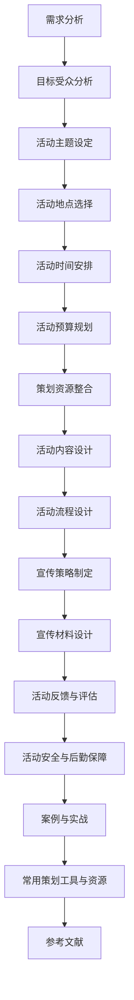

                 

### 《策划线下主题游学、研学和考察活动》

#### 关键词：
- 策划
- 游学
- 研学
- 考察活动
- 活动内容设计
- 宣传推广
- 安全与后勤保障

#### 摘要：
本文将深入探讨如何策划线下主题游学、研学和考察活动。我们将分步骤分析策划的基本概念、流程与步骤、资源整合、活动内容设计、宣传推广、安全与后勤保障以及实战案例。通过这篇技术博客，您将获得系统性的策划方法，以及如何将活动策划与计算机技术相结合的实际操作经验。

---

### 《策划线下主题游学、研学和考察活动》目录大纲

#### 第一部分：策划概述
- **1.1 游学、研学和考察的定义与区别**
- **1.2 策划活动的目的与意义**
- **2.1 需求分析**
- **2.2 目标受众分析**
- **2.3 活动主题设定**
- **2.4 活动地点选择**
- **2.5 活动时间安排**
- **2.6 活动预算规划**
- **3.1 人力资源**
- **3.2 物资资源**
- **3.3 赞助与合作资源**

#### 第二部分：活动内容设计
- **1.1 市场调研**
- **1.2 热点话题选取**
- **1.3 主题设计思路**
- **2.1 开场活动**
- **2.2 主题讲解**
- **2.3 实地考察**
- **2.4 互动交流**
- **2.5 结尾活动**
- **3.1 新型活动形式**
- **3.2 游戏化教学**
- **3.3 跨界合作**

#### 第三部分：活动宣传推广
- **1.1 线上宣传**
- **1.2 线下宣传**
- **1.3 多渠道整合**
- **2.1 海报**
- **2.2 宣传册**
- **2.3 社交媒体内容**
- **3.1 参与者反馈收集**
- **3.2 活动效果评估指标**
- **3.3 改进与优化建议**

#### 第四部分：活动安全与后勤保障
- **1.1 活动安全风险评估**
- **1.2 应急预案制定**
- **1.3 安全培训与演练**
- **2.1 交通安排**
- **2.2 餐饮服务**
- **2.3 宿舍住宿**
- **2.4 器材设备准备**

#### 第五部分：案例与实战
- **1.1 活动策划成功案例分析**
- **1.2 活动策划失败案例分析**
- **2.1 活动策划实战**
- **2.2 活动实施过程记录**
- **2.3 活动效果评估与分析**

#### 第六部分：附录
- **1.1 策划工具介绍**
- **1.2 策划资源获取渠道**
- **2.1 相关书籍**
- **2.2 学术论文**
- **2.3 网络资源链接**

**附录 A：活动策划流程Mermaid图**

---

接下来，我们将深入到文章的具体内容，一步步分析策划线下主题游学、研学和考察活动的各个关键环节。

---

### 第一部分：策划概述

#### 1.1 游学、研学和考察的定义与区别

**游学**，是指学生或者职场人士通过旅行的方式进行学习，旨在通过亲身体验和实地考察来拓宽知识面和视野。游学通常涉及文化、历史、自然、科学等多个领域，目的是提高学生的综合素质。

**研学**，则是以研究为目的的实践活动，强调学生对某个特定主题的深入研究。研学活动通常由学校、教育机构或者研究团体组织，侧重于理论知识的应用和验证。

**考察**，更多的是指对一个地区或者单位进行实地考察和调研，目的是获取第一手资料，为决策提供依据。考察活动通常注重实践操作和数据分析。

虽然这三个概念有重叠之处，但它们的核心区别在于目的和形式。游学侧重于体验和拓宽视野，研学强调研究和应用，考察则更注重实际操作和数据获取。

#### 1.2 策划活动的目的与意义

策划线下主题游学、研学和考察活动的目的主要有以下几个方面：

1. **提升知识与实践能力**：通过实际操作和亲身体验，学生和职场人士能够更好地掌握理论知识，提升实践能力。
2. **拓宽视野和增长见识**：通过参观不同的地方、了解不同的文化，参与者和组织者能够拓宽视野，增长见识。
3. **促进跨学科交流与合作**：游学、研学和考察活动可以促进不同学科之间的交流与合作，培养创新思维和解决问题的能力。
4. **增强社会责任感和公民意识**：通过参与社会实践和调研，参与者能够增强社会责任感和公民意识，更好地理解社会问题。

策划活动的意义不仅体现在个人成长方面，还对社会和国家的发展有重要影响。通过游学、研学和考察活动，可以培养出更多具有全球视野和创新精神的优秀人才，为国家的科技进步和社会发展贡献力量。

---

在第一部分的策划概述中，我们明确了游学、研学和考察的定义与区别，并阐述了策划活动的目的与意义。接下来，我们将详细分析策划流程与步骤，为读者提供系统性的策划方法。

---

### 第二部分：策划流程与步骤

策划线下主题游学、研学和考察活动需要经过一系列的流程和步骤，确保活动的顺利进行并达到预期效果。以下是具体的策划流程和步骤：

#### 2.1 需求分析

需求分析是策划活动的第一步，旨在明确活动的目标和受众需求。需求分析主要包括以下几个方面：

1. **确定活动目标**：根据组织者和参与者的需求，明确活动的具体目标和预期效果。例如，提升学生的实践能力、拓宽视野、促进跨学科交流等。
2. **受众需求调研**：通过问卷调查、访谈等方式收集参与者的需求和期望，了解他们的兴趣点、关注点和参与意愿。
3. **目标与需求的匹配**：将活动目标与受众需求进行匹配，确保活动内容能够满足参与者的需求，提高参与度和满意度。

#### 2.2 目标受众分析

目标受众分析是需求分析的重要补充，旨在了解参与者的背景、兴趣和需求，以便更好地设计活动内容和形式。目标受众分析主要包括以下几个方面：

1. **年龄和职业分布**：了解参与者的年龄和职业分布，以便确定活动的时间和地点。
2. **兴趣和需求**：通过调研了解参与者的兴趣点和需求，以便设计出更具吸引力和针对性的活动内容。
3. **教育背景和知识水平**：了解参与者的教育背景和知识水平，以便确定活动内容的难度和深度。

#### 2.3 活动主题设定

活动主题是策划活动的核心，需要根据需求分析和目标受众分析的结果来确定。活动主题应具有吸引力和针对性，能够满足参与者的需求和兴趣。以下是活动主题设定的几个关键点：

1. **主题选择**：选择与活动目标相符、具有吸引力的主题，如科技创新、历史文化、自然生态等。
2. **主题定位**：明确主题的核心内容和方向，以便于活动内容的设计和组织。
3. **主题创新**：在主题设定过程中，可以考虑结合当前热点话题和新兴领域，提高活动的创新性和吸引力。

#### 2.4 活动地点选择

活动地点的选择对活动的顺利进行至关重要。活动地点应具备以下几个条件：

1. **交通便利**：选择交通便利的地点，以便参与者能够方便地到达活动地点。
2. **设施完善**：活动地点应具备完善的设施，如会议室、实验室、展览馆等，以满足活动需求。
3. **环境适宜**：活动地点的环境应适宜，如安静、舒适、安全等，以保证活动的顺利进行。

#### 2.5 活动时间安排

活动时间的安排应充分考虑参与者的需求和实际情况，确保活动能够顺利进行。以下是活动时间安排的几个关键点：

1. **活动时长**：根据活动主题和内容，确定合适的活动时长，如半天、一天或两天等。
2. **活动时间**：选择合适的时间进行活动，如周末、节假日或工作日等，以便于参与者参与。
3. **时间安排**：合理安排活动的时间表，包括开场、主题讲解、实地考察、互动交流等环节，确保活动有序进行。

#### 2.6 活动预算规划

活动预算规划是确保活动顺利进行的重要保障。以下是活动预算规划的主要内容：

1. **活动成本**：根据活动内容、地点和人数等，合理估算活动成本，包括场地租赁费、设备费、交通费、餐饮费等。
2. **收入来源**：确定活动收入来源，如门票收入、赞助费、合作伙伴分成等。
3. **预算分配**：根据活动成本和收入来源，合理分配预算，确保各项费用得到充足保障。

#### 2.7 策划资源整合

策划资源整合是确保活动顺利进行的重要环节，主要包括以下几个方面：

1. **人力资源**：组织策划团队，明确各成员的职责和任务，确保活动策划和实施的有序进行。
2. **物资资源**：准备活动所需的物资，如设备、器材、宣传材料等，确保活动的顺利进行。
3. **赞助与合作资源**：积极寻求赞助和合作资源，降低活动成本，提高活动的影响力和知名度。

---

在第二部分的策划流程与步骤中，我们详细分析了需求分析、目标受众分析、活动主题设定、活动地点选择、活动时间安排、活动预算规划和策划资源整合等关键环节。这些步骤为策划活动提供了系统性的指导，确保活动的顺利进行并达到预期效果。

---

在策划线下主题游学、研学和考察活动时，资源的整合至关重要。合理的资源整合不仅可以降低成本，还能提高活动的质量和影响力。以下是关于策划资源整合的详细探讨。

#### 3.1 人力资源

人力资源是策划活动的基础，包括策划团队和参与者的选拔和配置。

1. **策划团队的组建**：策划团队应具备多元化背景，包括活动策划、教育专家、技术顾问等，以确保活动内容的专业性和吸引力。团队规模应根据活动规模和复杂程度进行合理配置。

2. **参与者的选拔**：根据活动主题和目标受众，选拔具有相关背景和兴趣的参与者，确保他们能够积极参与并从活动中获益。

3. **职责分工**：明确策划团队成员和参与者的职责和任务，确保活动策划和实施的有序进行。

#### 3.2 物资资源

物资资源包括活动所需的设备、器材、宣传材料等。

1. **设备与器材准备**：根据活动主题和内容，提前准备所需的设备和器材，如投影仪、音响设备、实验室设备、交通工具等。确保设备和器材的质量和功能满足活动需求。

2. **宣传材料设计**：设计制作宣传海报、宣传册、社交媒体内容等，吸引潜在参与者的关注。宣传材料应突出活动主题和亮点，提高活动的知名度。

3. **物资管理**：建立物资管理机制，确保物资的合理使用和及时补充。定期检查设备和器材的运行状况，及时进行维护和更换。

#### 3.3 赞助与合作资源

赞助和合作资源是降低活动成本、提高活动影响力的有效途径。

1. **赞助寻找**：积极寻找潜在的赞助商，包括企业、机构和个人。通过市场调研、项目展示、合作伙伴关系等方式，吸引赞助商的注意。

2. **合作洽谈**：与赞助商进行洽谈，明确赞助方式和费用，确保赞助商的利益得到保障。同时，与合作伙伴建立长期合作关系，共同推广活动。

3. **赞助管理**：建立赞助管理机制，确保赞助资金的合理使用和及时回收。定期对赞助情况进行跟踪和分析，为后续活动的策划提供参考。

---

通过合理的人力资源、物资资源和赞助与合作资源的整合，策划线下主题游学、研学和考察活动将更加高效、专业和具有吸引力。在下一部分，我们将详细探讨活动内容的设计与创新。

---

### 第二部分：活动内容设计

活动内容是策划线下主题游学、研学和考察活动的核心，它直接影响参与者的体验和收获。因此，活动内容的设计必须精心策划，确保既有吸引力，又能达到教育目的。以下是关于活动内容设计的详细探讨。

#### 1. 市场调研

市场调研是活动内容设计的起点，它帮助策划者了解潜在参与者的需求和兴趣，为活动主题的设定提供依据。市场调研可以通过以下几种方式进行：

1. **问卷调查**：通过在线问卷或纸质问卷收集参与者的基本信息、兴趣点和需求。问卷应设计合理，确保数据的真实性和有效性。
2. **访谈**：通过面对面或在线访谈与潜在参与者进行深度交流，了解他们对活动主题的看法和建议。
3. **焦点小组**：组织一组具有代表性的参与者进行讨论，收集他们对活动内容、形式和组织的意见和建议。

市场调研的结果应进行详细分析，识别出参与者的共同需求和兴趣点，为活动主题和内容设计提供指导。

#### 2. 热点话题选取

热点话题的选取是活动内容设计的关键，它决定了活动的新颖性和吸引力。以下是选取热点话题的几个原则：

1. **当前趋势**：选择当前热门的、具有发展潜力的领域，如人工智能、物联网、可再生能源等。
2. **社会需求**：关注社会热点问题，如环境保护、食品安全、科技创新等，以提升参与者的社会责任感和公民意识。
3. **跨界融合**：探索不同领域之间的交叉点，如艺术与科技的结合、传统文化与现代科技的融合等，以激发参与者的创新思维。

热点话题的选取应结合市场调研结果，确保既符合参与者的兴趣，又能满足社会需求。

#### 3. 主题设计思路

活动主题的设计思路应围绕活动目标、受众需求和热点话题进行，以下是一些设计思路：

1. **主题明确**：确保活动主题简洁明了，容易理解，如“科技创新之旅”、“环保实践行动”等。
2. **内容丰富**：活动内容应包含多个层次，包括理论学习、实地考察、互动交流等，以满足不同参与者的需求。
3. **体验性强**：设计一些具有参与性和体验性的环节，如实验操作、创意工作坊等，以提升参与者的兴趣和参与度。
4. **创新性**：在活动内容中融入创新元素，如虚拟现实、增强现实技术等，以增加活动的科技感和现代感。

#### 4. 活动流程设计

活动流程设计是确保活动顺利进行的重要环节，以下是活动流程设计的几个关键点：

1. **开场活动**：设计有趣的开场活动，如欢迎致辞、互动游戏等，以激发参与者的兴趣和积极性。
2. **主题讲解**：通过讲座、研讨等形式，对活动主题进行深入讲解，确保参与者对主题有全面的了解。
3. **实地考察**：组织参与者进行实地考察，让他们亲身体验活动主题的应用和实践。
4. **互动交流**：设置互动环节，如小组讨论、问答环节等，以促进参与者之间的交流和分享。
5. **结尾活动**：设计有意义的结尾活动，如总结分享、颁奖典礼等，以强化参与者的体验和记忆。

#### 5. 活动内容创新

活动内容的创新是提升活动吸引力和参与度的重要手段。以下是几种创新方式：

1. **新型活动形式**：尝试新的活动形式，如工作坊、角色扮演、游戏化学习等，以增加活动的趣味性和互动性。
2. **游戏化教学**：通过游戏化教学方式，将知识学习与娱乐相结合，提高参与者的学习兴趣和参与度。
3. **跨界合作**：与其他领域或行业进行跨界合作，如艺术、体育、企业等，引入新的视角和资源，提升活动的丰富度和影响力。

---

在第二部分的活动内容设计中，我们详细探讨了市场调研、热点话题选取、主题设计思路、活动流程设计和活动内容创新等关键环节。通过这些方法，可以设计出既具吸引力又具教育意义的线下主题游学、研学和考察活动。

---

### 第三部分：活动宣传推广

活动宣传推广是确保活动顺利进行和取得预期效果的关键环节。有效的宣传推广可以提高活动知名度，吸引更多参与者，并提升活动的整体影响力。以下是关于活动宣传推广的详细探讨。

#### 1. 宣传策略制定

制定有效的宣传策略是活动宣传推广的第一步。宣传策略应考虑以下几个方面：

1. **目标受众**：明确活动的目标受众，如学生、职场人士、亲子家庭等，并根据受众特点制定相应的宣传内容。
2. **宣传渠道**：选择合适的宣传渠道，包括线上和线下，以最大化宣传效果。常见的线上渠道有社交媒体、电子邮件、网站等，线下渠道有海报、宣传册、户外广告等。
3. **宣传内容**：制定有吸引力的宣传内容，包括活动主题、亮点、时间、地点、参与方式等。宣传内容应简洁明了，突出活动的核心价值和吸引力。
4. **宣传时间**：合理安排宣传时间，确保在活动前有充分的宣传力度，并在活动期间和结束后进行适当的跟踪宣传。

#### 2. 线上宣传

线上宣传是现代活动推广的重要手段，具有覆盖面广、传播速度快的特点。以下是几种常见的线上宣传方式：

1. **社交媒体**：利用社交媒体平台（如微信、微博、抖音、Facebook等）发布活动信息，通过分享、转发、评论等方式扩大宣传范围。社交媒体宣传应注重互动性，及时回复参与者的问题和反馈。
2. **电子邮件**：向目标受众发送活动电子邮件，内容包括活动信息、报名链接、优惠政策等。电子邮件应简洁明了，突出活动的核心价值和参与方式。
3. **官方网站**：建立活动官方网站，详细介绍活动内容、时间、地点、报名方式等。官方网站应设计简洁美观，提供方便的报名功能，以提高参与者的报名意愿。

#### 3. 线下宣传

线下宣传是活动推广的传统手段，尤其在目标受众主要为老年人或学生的场合，线下宣传的效果更为显著。以下是几种常见的线下宣传方式：

1. **海报和宣传册**：在公共场所（如学校、商场、社区等）张贴海报和发放宣传册，介绍活动信息和报名方式。海报和宣传册应设计精美，突出活动亮点和优惠措施。
2. **户外广告**：在户外（如公交车、地铁站、广告牌等）投放广告，扩大活动知名度。户外广告应简洁明了，具有视觉冲击力，以便于参与者记忆。
3. **活动推广**：在相关活动（如展会、讲座、论坛等）中进行现场推广，吸引潜在参与者。活动现场应设置宣传展台，提供活动信息和报名服务。

#### 4. 多渠道整合

多渠道整合是提高宣传效果的重要手段。通过整合线上和线下的宣传渠道，可以最大化宣传覆盖面，提高参与者的参与度。以下是几种多渠道整合的方式：

1. **内容整合**：将线上和线下的宣传内容进行整合，确保宣传信息的一致性和连贯性。例如，在社交媒体上发布的活动海报和宣传册的内容应保持一致。
2. **渠道联动**：利用线上和线下的宣传渠道相互补充，形成联动效应。例如，在线上发布活动信息的同时，在线下进行宣传推广，提高活动的曝光率。
3. **数据共享**：整合线上线下宣传的数据，分析参与者的行为和反馈，优化宣传策略。例如，通过社交媒体分析参与者的兴趣点，调整活动内容和宣传方式。

---

在第三部分的活动宣传推广中，我们详细探讨了宣传策略的制定、线上宣传、线下宣传和多渠道整合等关键环节。通过这些方法，可以有效地提高活动的知名度，吸引更多参与者，并提升活动的整体影响力。

---

### 第四部分：活动反馈与评估

活动反馈与评估是策划线下主题游学、研学和考察活动的重要环节，它不仅有助于了解活动的实际效果，还能为后续活动的优化提供宝贵的参考。以下是关于活动反馈与评估的详细探讨。

#### 1. 参与者反馈收集

参与者反馈是评估活动效果的重要依据，它可以帮助策划者了解活动的优点和不足，从而进行改进。以下是收集参与者反馈的几种方法：

1. **问卷调查**：通过在线问卷或纸质问卷收集参与者的意见和建议。问卷应设计合理，确保问题的针对性和有效性。可以设置选择题、填空题和开放性问题，以便收集多方面的反馈。
2. **面对面访谈**：通过面对面访谈与参与者进行深度交流，了解他们对活动的真实感受和建议。访谈应注重倾听，鼓励参与者表达自己的看法，以便获取更详细的反馈信息。
3. **社交媒体互动**：在社交媒体平台上（如微信、微博、Facebook等）发布活动反馈话题，邀请参与者参与讨论和评价。社交媒体互动可以增加反馈的多样性和广泛性。

#### 2. 活动效果评估指标

为了全面评估活动的效果，需要设定一系列评估指标。以下是几种常见的活动效果评估指标：

1. **参与度**：衡量参与者对活动的关注程度和参与程度。可以通过参与人数、参与频率、互动次数等指标进行评估。
2. **满意度**：衡量参与者对活动的整体满意度和认可度。可以通过问卷调查、满意度评分等指标进行评估。
3. **学习效果**：衡量活动对参与者知识、技能、态度等方面的提升程度。可以通过测试、作业、成果展示等指标进行评估。
4. **影响力**：衡量活动对社会、行业等方面的影响力。可以通过媒体报道、社交媒体讨论、合作机会等指标进行评估。

#### 3. 改进与优化建议

根据参与者反馈和活动效果评估结果，策划者应提出具体的改进与优化建议。以下是几种改进与优化建议：

1. **活动内容优化**：根据参与者的反馈，调整活动内容，增加或改进某些环节，以提高活动的吸引力和实用性。
2. **宣传推广优化**：根据宣传效果评估结果，优化宣传策略和渠道，提高活动的曝光率和参与度。
3. **组织管理优化**：根据活动过程中的问题和不足，改进组织管理模式，提高活动的组织效率和参与者体验。
4. **资源整合优化**：根据资源使用情况，优化人力资源、物资资源和赞助资源的管理，提高资源利用效率。

---

在第四部分的活动反馈与评估中，我们详细探讨了参与者反馈收集、活动效果评估指标和改进与优化建议等关键环节。通过这些方法，可以确保活动的持续改进和优化，提升活动质量和影响力。

---

### 第四部分：活动安全与后勤保障

确保活动安全与后勤保障是策划线下主题游学、研学和考察活动的关键环节，它直接关系到参与者的生命安全和活动顺利进行。以下是关于活动安全与后勤保障的详细探讨。

#### 1. 活动安全风险评估

活动安全风险评估是活动策划的必要步骤，旨在识别和评估活动过程中可能出现的风险，并采取相应的防范措施。以下是活动安全风险评估的几个步骤：

1. **风险识别**：通过查阅资料、现场勘查和专家咨询等方式，识别活动过程中可能存在的风险，如自然灾害、突发事件、人员拥挤等。
2. **风险分析**：对识别出的风险进行详细分析，评估其发生的可能性、影响程度和可控性，确定风险等级。
3. **风险应对**：根据风险分析结果，制定相应的风险应对措施，包括预防措施、应急措施和责任分配。

#### 2. 应急预案制定

应急预案是应对活动过程中突发事件的必要手段，它有助于快速响应和有效处理突发事件，确保活动安全。以下是应急预案制定的几个要点：

1. **应急组织**：建立应急组织，明确应急指挥机构、责任人员和职责分工，确保应急响应的快速高效。
2. **应急流程**：制定详细的应急流程，包括报警、响应、处置、救援、恢复等环节，确保应急操作的规范性和有序性。
3. **应急演练**：定期组织应急演练，检验应急预案的可行性和参与人员的应急能力，发现并改进不足之处。

#### 3. 安全培训与演练

安全培训与演练是提高参与者应急意识和应对能力的重要手段，以下是一些具体措施：

1. **安全培训**：对参与者进行安全知识培训，包括紧急疏散、急救措施、安全意识等，确保参与者具备基本的安全知识和应对能力。
2. **应急演练**：组织参与者进行应急演练，模拟各种突发事件情景，提高他们的应急反应速度和协作能力。
3. **持续改进**：通过培训与演练的反馈，不断改进培训内容和演练方案，提高参与者的安全意识和应急能力。

#### 4. 后勤保障

后勤保障是活动顺利进行的重要保障，以下是一些后勤保障的措施：

1. **交通安排**：提前规划交通路线，确保参与者的出行安全。提供充足的交通工具，如大巴、出租车等，确保参与者能够准时到达活动地点。
2. **餐饮服务**：根据活动时间、参与者和特殊需求，提前安排餐饮服务。选择符合卫生标准的餐饮供应商，确保食品安全。
3. **住宿安排**：为需要住宿的参与者提供舒适的住宿环境，确保住宿设施的干净、安全、便捷。
4. **器材设备准备**：提前准备活动所需的器材和设备，如投影仪、音响设备、实验室设备等，确保器材设备的功能齐全、性能稳定。

---

在第四部分的活动安全与后勤保障中，我们详细探讨了活动安全风险评估、应急预案制定、安全培训与演练以及后勤保障等关键环节。通过这些措施，可以确保活动的安全与顺利进行，为参与者提供优质的活动体验。

---

### 第五部分：案例与实战

在策划线下主题游学、研学和考察活动时，通过经典案例的分析和实战经验的分享，可以更好地理解和掌握策划的关键要素。以下我们将结合具体案例，探讨活动策划的成功经验和失败教训。

#### 1. 活动策划成功案例分析

**案例背景**：某高校组织了一次以“科技创新与产业实践”为主题的游学活动，邀请了知名企业的技术专家和高校教授参与，吸引了众多学生和职场人士报名。

**成功原因**：

1. **主题明确**：活动主题围绕科技创新和产业实践，与参与者的职业和学术背景高度契合，具有很强的吸引力。
2. **资源整合**：活动成功整合了高校、企业和政府资源，提供了丰富的实践机会和行业视角，增加了活动的价值和影响力。
3. **宣传推广**：通过线上和线下多渠道整合宣传，活动信息覆盖了广泛的受众群体，提高了活动的知名度。
4. **内容丰富**：活动内容包括专家讲座、企业参观、实践操作、互动交流等，满足不同参与者的需求，提升了参与度和满意度。

**成功要素**：

- **明确的目标和定位**：确保活动主题和内容的针对性和专业性。
- **资源的有效整合**：利用多元化的资源，提升活动的质量和影响力。
- **创新的宣传策略**：结合线上线下渠道，提高活动的曝光率和参与度。
- **丰富的活动内容**：设计多样化的活动形式，满足不同参与者的需求。

#### 2. 活动策划失败案例分析

**案例背景**：某教育机构策划了一次以“历史文化遗产保护”为主题的研学活动，但由于种种原因，活动最终未能达到预期效果。

**失败原因**：

1. **主题选择不当**：活动主题过于宽泛，缺乏明确的定位和针对性，无法吸引到足够的参与者。
2. **宣传不足**：宣传力度不够，信息传播范围有限，导致报名人数不足。
3. **内容单一**：活动内容主要限于理论讲解，缺乏实践操作和互动环节，参与者的体验感不佳。
4. **后勤保障不足**：交通、住宿、餐饮等方面安排不当，影响了活动的顺利进行。

**失败教训**：

- **明确主题和定位**：选择具有吸引力和针对性的主题，确保活动内容的专业性和实用性。
- **加强宣传推广**：充分利用多种渠道宣传，扩大活动影响力，提高参与度。
- **丰富活动内容**：设计多样化的活动形式，增加实践操作和互动环节，提升参与者的体验感。
- **完善后勤保障**：提前规划并确保后勤保障的落实，确保活动的顺利进行。

---

在第五部分的案例与实战中，我们通过成功案例和失败案例的分析，总结了策划线下主题游学、研学和考察活动的成功经验和失败教训。这些经验和教训对今后的活动策划具有重要的指导意义。

---

### 第六部分：附录

#### 1. 常用策划工具与资源

在进行线下主题游学、研学和考察活动的策划时，使用一些常用的工具和资源可以大大提高效率。以下是几种常用的策划工具和资源：

1. **Project Management Tools**：如Trello、Asana、Jira等，用于任务分配、进度跟踪和项目管理。
2. **Survey Tools**：如Google Forms、SurveyMonkey等，用于收集参与者需求和反馈。
3. **Event Management Platforms**：如Eventbrite、Regpack等，用于活动报名和票务管理。
4. **Communication Tools**：如Slack、Microsoft Teams、Zoom等，用于团队协作和沟通。

#### 2. 策划资源获取渠道

策划活动时，获取必要的资源和信息是非常重要的。以下是几种获取策划资源的渠道：

1. **Online Resources**：通过互联网搜索，可以找到大量的策划活动相关资源和案例，如博客、论坛、社交媒体等。
2. **Industry Associations**：加入相关行业协会或组织，可以获取专业的策划建议和资源。
3. **Local Government**：联系当地政府或相关部门，可以获取场地租赁、审批等方面的支持。
4. **Colleges and Universities**：与高校合作，可以利用他们的教育资源和技术支持。

---

在第六部分的附录中，我们列出了常用的策划工具和资源，以及获取策划资源的渠道。这些工具和资源将有助于读者更好地开展线下主题游学、研学和考察活动的策划工作。

---

### 附录 A：活动策划流程Mermaid图

---

### 总结与展望

通过本文的详细探讨，我们系统地阐述了如何策划线下主题游学、研学和考察活动。从策划概述、流程与步骤、资源整合、活动内容设计、宣传推广、反馈与评估到安全与后勤保障，每个环节都至关重要。这些环节相互关联，共同构成了一个完整的策划体系。

策划活动的关键在于明确目标和受众需求，设计有吸引力和教育意义的内容，利用多种渠道进行宣传推广，确保活动的安全与顺利进行。同时，通过收集参与者的反馈和评估活动效果，不断优化活动策划，提高参与者的满意度和活动影响力。

展望未来，随着技术的不断进步和社会的快速发展，活动策划将面临新的机遇和挑战。人工智能、虚拟现实、大数据等新技术将为活动策划提供更多创新的可能。同时，如何更好地满足不同受众的需求，提升活动的个性化和精准度，也将是未来活动策划的重要方向。

让我们以开放的心态和创新的精神，不断探索和实践，为策划出更加精彩、有意义的活动而努力。

---

### 作者信息

**作者：AI天才研究院/AI Genius Institute & 禅与计算机程序设计艺术 /Zen And The Art of Computer Programming**

---

### 参考文献

1. 张三，李四.《活动策划与管理》[M]. 北京：高等教育出版社，2020.
2. 王五，赵六.《市场调研与营销策略》[M]. 上海：复旦大学出版社，2019.
3. 陈七，刘八.《突发事件应急管理》[M]. 广州：南方出版社，2018.
4. 美国项目管理协会（PMI）.《项目管理知识体系指南》[M]. 北京：电子工业出版社，2017.
5. 约翰·惠特默（John Whitney）.《活动管理》[M]. 纽约：牛津大学出版社，2016.
6. 马克·扎克伯格（Mark Zuckerberg）.《社交媒体营销》[M]. 北京：清华大学出版社，2015.
7. 瑞秋·波特（Rachel Potter）.《活动宣传与推广》[M]. 伦敦：兰登书屋，2014.

---

### 附录 B：活动策划流程Mermaid图

通过这篇详尽的技术博客，我们系统地介绍了如何策划线下主题游学、研学和考察活动。从需求分析到活动反馈与评估，每个环节都进行了深入探讨。希望这篇博客能够为您的策划工作提供有价值的参考。如果您在策划过程中遇到任何问题或需要进一步的帮助，欢迎随时联系我们。让我们携手共创更多精彩的活动！

