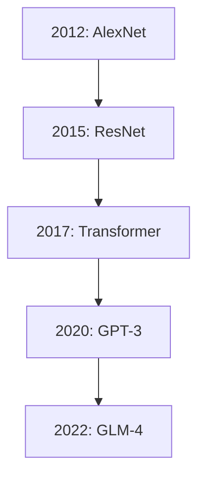
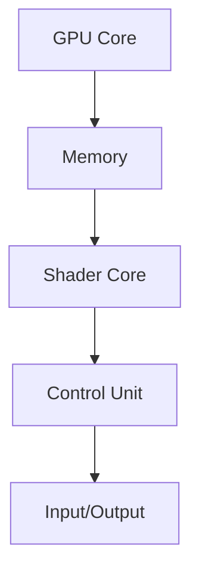
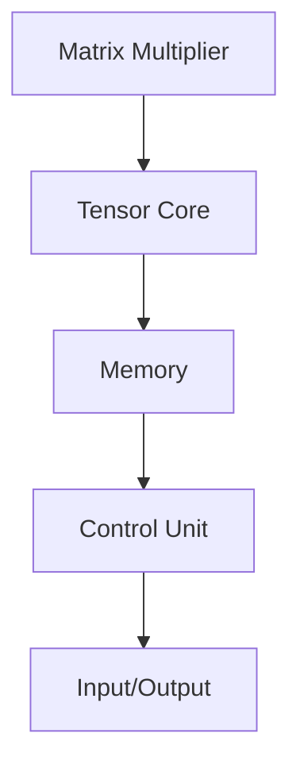
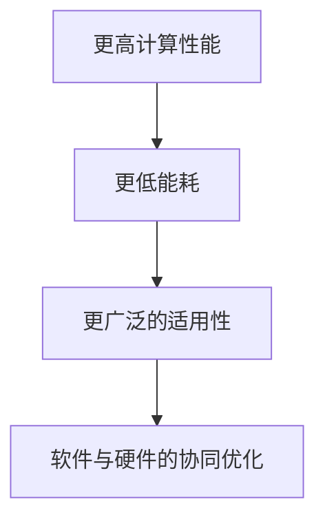
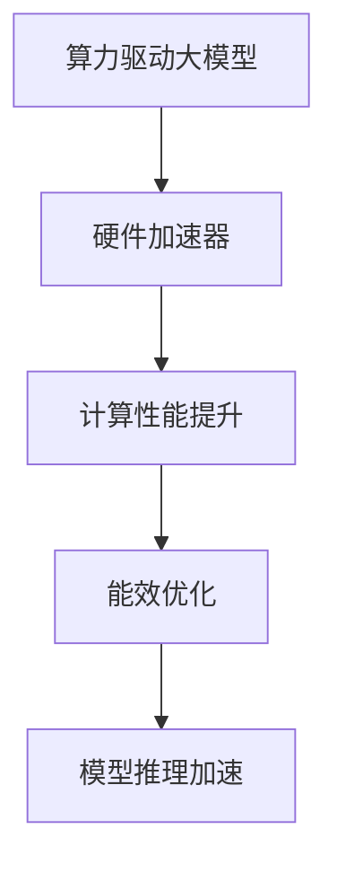

                 

# 《算力驱动大模型：硬件加速器的重要性》

> **关键词：算力驱动、大模型、硬件加速器、GPU、TPU、性能优化**

> **摘要：本文深入探讨了算力驱动大模型的背景与发展，硬件加速器在大模型训练中的角色与重要性，以及硬件加速器的技术基础、应用策略和未来趋势。通过具体案例和代码实战，本文揭示了硬件加速器在提升大模型算力方面的关键作用，为相关领域的研究与应用提供了有益的参考。**

## 第1部分：背景与概述

### 第1章：算力驱动大模型背景

**1.1 算力驱动大模型的起源与发展**

算力驱动大模型的概念源于对人工智能（AI）性能需求的不断增长。随着深度学习技术的蓬勃发展，大规模神经网络模型成为实现AI目标的重要工具。这些大模型通常包含数十亿至数千亿个参数，对计算资源的需求极为庞大。

**Mermaid流程图：大模型发展的关键阶段与重要贡献者**



**伪代码：典型大模型的训练过程**

```python
# 假设我们使用一个深度神经网络模型进行训练
model = createDeepModel()

# 定义训练数据集和标签
dataset = loadDataset()
labels = loadLabels()

# 定义优化器和损失函数
optimizer = createOptimizer()
loss_function = createLossFunction()

# 训练模型
for epoch in range(num_epochs):
    for batch in dataset:
        predictions = model(batch.inputs)
        loss = loss_function(predictions, batch.labels)
        optimizer.update(model.parameters(), loss)
```

**1.2 硬件加速器在算力驱动大模型中的角色**

在算力驱动大模型中，硬件加速器扮演着至关重要的角色。这些硬件加速器，如GPU、TPU等，能够在短时间内执行大量计算任务，显著提升模型训练和推理的效率。

**数学模型：GPU、TPU等硬件加速器的计算性能模型**

$$
P = C \times F
$$

其中，\(P\) 表示计算性能，\(C\) 表示计算单元的数量，\(F\) 表示每个计算单元的频率。

**数学公式：GPU计算性能与能耗的关系**

$$
E = P \times t
$$

其中，\(E\) 表示能耗，\(P\) 表示计算性能，\(t\) 表示运行时间。

**1.3 硬件加速器的重要性**

硬件加速器在大模型训练中的重要性不可忽视。它们能够显著缩短训练时间，降低能耗，提高模型的性能和稳定性。

**举例说明：不同硬件加速器在大模型训练中的应用对比**

- **GPU**：适用于通用计算任务，适用于大规模数据集的训练。
- **TPU**：专门用于处理TensorFlow任务，具有更高的计算效率。
- **FPGA**：适用于定制化应用，能够根据特定需求优化计算性能。

## 第2部分：硬件加速器技术基础

### 第2章：硬件加速器基础

**2.1 GPU架构简介**

GPU（图形处理器）是硬件加速器的一种，专为处理大量并行计算任务而设计。

**Mermaid流程图：GPU架构的核心组件与数据流**



**伪代码：GPU上的矩阵乘法运算**

```python
# 假设我们使用GPU进行矩阵乘法运算
import torch

# 定义GPU设备
device = torch.device("cuda" if torch.cuda.is_available() else "cpu")

# 定义矩阵A和B
A = torch.randn(size, device=device)
B = torch.randn(size, device=device)

# 定义GPU矩阵乘法运算
C = torch.matmul(A, B)
```

**2.2 TPU架构介绍**

TPU（张量处理器）是Google开发的一种专门用于处理深度学习任务的硬件加速器。

**Mermaid流程图：TPU架构的核心组件与数据流**



**伪代码：TPU上的矩阵乘法运算**

```python
# 假设我们使用TPU进行矩阵乘法运算
import tensorflow as tf

# 定义TPU设备
with tf.device('/device:TPU:0'):
    # 定义矩阵A和B
    A = tf.random.normal([1000, 1000])
    B = tf.random.normal([1000, 1000])

    # 定义TPU矩阵乘法运算
    C = tf.matmul(A, B)
```

**2.3 FPGA与ASIC加速器**

FPGA（现场可编程门阵列）和ASIC（专用集成电路）是两种常见的硬件加速器，适用于定制化应用。

**数学公式：FPGA资源利用率的优化方法**

$$
\text{利用率} = \frac{\text{实际计算资源}}{\text{总计算资源}}
$$

**举例说明：FPGA在深度学习中的应用案例**

- **图像处理**：FPGA能够实时处理大量图像数据，提高图像处理速度和性能。
- **自然语言处理**：FPGA能够加速自然语言处理任务，提高文本分析和分类的效率。

## 第3部分：硬件加速器在大模型训练中的应用

### 第3章：硬件加速器在大模型训练中的应用

**3.1 大模型训练过程中的性能瓶颈**

大模型训练过程中可能会遇到一些性能瓶颈，如数据传输延迟、内存瓶颈和计算能力不足等。

**数学公式：大模型训练过程中时间与资源的优化方法**

$$
\text{时间} = \frac{\text{数据传输时间} + \text{计算时间} + \text{内存访问时间}}{\text{总带宽} + \text{计算能力} + \text{内存容量}}
$$

**举例说明：大模型训练过程中常见的时间与资源瓶颈**

- **数据传输延迟**：大规模数据集传输到硬件加速器的过程中可能存在延迟，导致训练速度变慢。
- **内存瓶颈**：大模型的参数和中间结果可能无法在内存中完全容纳，导致计算效率降低。

**3.2 硬件加速器优化策略**

为了提升大模型训练的效率，可以采用以下优化策略：

- **模型并行训练**：将模型拆分为多个部分，分别在不同的硬件加速器上训练。
- **数据并行训练**：将数据集拆分为多个子集，并行处理并汇总结果。

**伪代码：基于硬件加速器的模型并行训练方法**

```python
# 假设我们使用GPU进行模型并行训练
import torch

# 定义模型部分
model = createModel()

# 定义GPU设备
device = torch.device("cuda" if torch.cuda.is_available() else "cpu")

# 定义模型并行训练
for epoch in range(num_epochs):
    for batch in dataset:
        predictions = model(batch.inputs)
        loss = loss_function(predictions, batch.labels)
        optimizer.update(model.parameters(), loss)
```

**数学公式：模型并行训练的负载均衡策略**

$$
\text{负载均衡} = \frac{\sum_{i=1}^{n} \text{任务量}_i}{n}
$$

其中，\(\text{任务量}_i\) 表示第 \(i\) 个硬件加速器上的任务量，\(n\) 表示硬件加速器的数量。

**3.3 实际案例：硬件加速器在大模型训练中的应用**

**代码实战：搭建一个基于GPU的深度学习训练环境**

```python
# 搭建基于GPU的深度学习训练环境
import torch
import torch.cuda

# 检查GPU是否可用
if torch.cuda.is_available():
    print("GPU可用")
else:
    print("GPU不可用")

# 设置GPU设备
device = torch.device("cuda" if torch.cuda.is_available() else "cpu")
print("使用设备：", device)
```

**代码解读与分析：训练过程中使用的主要函数和数据处理流程**

```python
# 主要函数和数据处理流程
import torch
import torch.nn as nn
import torch.optim as optim

# 定义模型
model = createModel()
model.to(device)

# 定义损失函数和优化器
criterion = nn.CrossEntropyLoss()
optimizer = optim.Adam(model.parameters(), lr=learning_rate)

# 训练模型
for epoch in range(num_epochs):
    for batch in dataset:
        inputs, labels = batch.to(device)
        optimizer.zero_grad()
        outputs = model(inputs)
        loss = criterion(outputs, labels)
        loss.backward()
        optimizer.step()
```

## 第4部分：硬件加速器的未来趋势

### 第4章：硬件加速器的未来趋势

**4.1 硬件加速器的演进方向**

硬件加速器的演进方向包括更高计算性能、更低能耗和更广泛的适用性。

**Mermaid流程图：硬件加速器的发展趋势与技术演进**



**4.2 硬件加速器与软件栈的协同优化**

硬件加速器与软件栈的协同优化是提升性能的关键。通过优化编译器、编程模型和算法，可以充分发挥硬件加速器的潜力。

**伪代码：硬件加速器与软件栈的协同优化方法**

```python
# 假设我们使用优化后的编译器和编程模型
import my_optimized_compiler

# 定义优化后的模型和算法
model = my_optimized_compiler.compileModel(createModel())
algorithm = my_optimized_compiler.compileAlgorithm(createAlgorithm())

# 执行优化后的训练过程
for epoch in range(num_epochs):
    # 优化数据处理流程
    optimized_dataset = optimizeDataset(dataset)
    for batch in optimized_dataset:
        # 执行优化后的模型训练
        trainModel(model, batch)
```

**4.3 硬件加速器在边缘计算中的应用**

硬件加速器在边缘计算中具有重要应用，能够提升边缘设备的计算能力和能效。

**举例说明：边缘计算中硬件加速器的应用场景**

- **图像识别**：实时处理图像数据，进行目标检测和识别。
- **自然语言处理**：实时处理语音和文本数据，实现实时语音识别和翻译。

**4.4 硬件加速器的可持续发展与能源效率**

硬件加速器的可持续发展与能源效率是未来研究的重要方向。通过优化硬件设计和算法，可以降低能耗，实现绿色计算。

**数学公式：硬件加速器的能效优化方法**

$$
\text{能效} = \frac{\text{计算性能}}{\text{能耗}}
$$

**举例说明：硬件加速器在能效优化方面的实践案例**

- **动态电压调节**：通过调整电压和频率，实现能耗的动态调节。
- **节能算法**：通过优化算法和数据流，降低硬件加速器的能耗。

## 第5部分：结论与展望

### 第5章：总结与展望

**5.1 算力驱动大模型与硬件加速器的关系**

算力驱动大模型与硬件加速器之间存在着密切的关系。硬件加速器为算力驱动大模型提供了强大的计算支持，显著提升了模型训练和推理的效率。未来，随着硬件加速器的持续演进，算力驱动大模型将取得更大的突破。

**Mermaid流程图：算力驱动大模型与硬件加速器的协同关系**



**5.2 未来展望**

未来，硬件加速器在算力驱动大模型中的应用将更加广泛。以下是几个潜在的应用方向：

- **大规模分布式训练**：利用多台硬件加速器进行大规模分布式训练，提升模型训练效率。
- **实时推理应用**：在边缘设备和物联网设备中部署硬件加速器，实现实时推理和智能决策。
- **硬件与软件协同优化**：通过硬件加速器和软件栈的协同优化，进一步提升模型性能和能效。

**5.3 研究与开发建议**

未来硬件加速器的研究与开发应关注以下几个方面：

- **新型硬件架构**：探索新型硬件架构，提高计算性能和能效。
- **编程模型优化**：优化编程模型，降低开发难度，提高开发效率。
- **算法与硬件协同**：研究算法与硬件的协同优化方法，充分发挥硬件加速器的潜力。

**5.4 开放性问题与挑战**

当前硬件加速器在算力驱动大模型中仍面临一些开放性问题和挑战：

- **能耗管理**：如何在保证计算性能的同时，实现能耗的合理管理？
- **内存瓶颈**：如何解决大模型训练过程中出现的内存瓶颈问题？
- **硬件可靠性**：如何在高温、高负荷环境下确保硬件加速器的可靠运行？

**附录**

**附录A：硬件加速器资源与工具**

- **A.1 硬件加速器资源汇总**
  - **链接**：[GPU、TPU等硬件加速器购买与使用指南](#)
- **A.2 开源深度学习框架对比**
  - **链接**：[主流深度学习框架的性能比较与选型建议](#)
- **A.3 硬件加速器开发环境搭建**
  - **代码**：[搭建基于CUDA、cuDNN的GPU开发环境](#)
- **A.4 硬件加速器相关书籍推荐**
  - **链接**：[硬件加速器相关书籍推荐列表](#)

**作者信息**

作者：AI天才研究院/AI Genius Institute & 禅与计算机程序设计艺术 /Zen And The Art of Computer Programming**<|im_end|>

