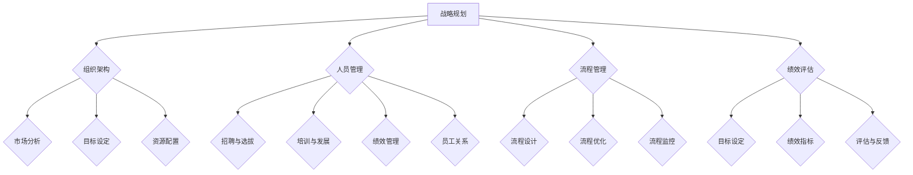

                 

### 文章标题

在数字化转型的浪潮中，技术团队的管理已经从传统的控制式管理转向了更为灵活和人性化的艺术化管理。本文将以“管理艺术：激发团队潜力”为标题，深入探讨如何通过艺术化的管理方法来激发团队潜力，实现团队的高效运作和卓越表现。

关键词：管理艺术、团队潜力、领导力、激励、数字化转型

摘要：本文首先对管理艺术的概念与意义进行探讨，分析了管理艺术与传统管理的区别及其在现代社会的重要性。随后，本文详细阐述了团队建设与领导力、团队沟通与合作以及激励理论在团队管理中的应用，通过一系列的实战案例，展示了如何提升团队领导力并激发团队潜力。最后，本文提出了团队潜力识别与开发的策略，并从项目管理和团队文化建设两个方面，探讨了如何实现团队的高效运作和持续发展。

---

### 第一部分: 管理艺术概述

管理艺术是一种融合了科学、心理学、哲学等多学科知识，旨在通过非传统方法来提升团队效率和员工满意度的管理实践。在本文的第一部分，我们将从多个角度对管理艺术进行概述，帮助读者建立对管理艺术的基本认识。

#### 第1章: 管理艺术的概念与意义

##### 1.1 管理艺术的定义

管理艺术是指管理者在具备一定的管理理论基础和实践经验的基础上，通过灵活运用各种管理手段和技巧，激发团队潜力和创新精神，实现组织目标的过程。管理艺术不仅仅是技术的运用，更是一种创造力和洞察力的体现。

##### 1.2 管理艺术与传统管理的区别

传统管理强调规则和流程的严格执行，注重控制与监督。而管理艺术则强调人性化、灵活性和创新性，注重激励和培养员工的自主性和创造力。传统管理是一种以“事”为中心的管理，而管理艺术则更关注“人”的成长和发展。

##### 1.3 管理艺术在现代社会的重要性

在现代社会，技术变革日新月异，市场竞争日益激烈，企业面临着前所未有的挑战。管理艺术的出现，为企业提供了一种更为有效和高效的管理模式，有助于提升团队的整体素质和竞争力。管理艺术能够激发员工的积极性和创造力，促进企业的持续创新和发展。

##### 1.4 管理艺术的心理学基础

管理艺术不仅需要管理者具备良好的沟通技巧和领导能力，还需要深入了解心理学原理，运用心理学知识来分析和解决管理中的问题。例如，马斯洛的需求层次理论、埃里克森的成就动机理论等，都可以为管理者提供有益的指导。

#### 第2章: 管理艺术的核心理念

##### 2.1 人本管理理念

人本管理理念强调以人为本，关注员工的成长和发展。管理者应当尊重员工的个性，激发员工的潜能，为员工提供发展的空间和机会。

##### 2.2 变革管理理念

变革管理理念认为，组织需要不断适应外部环境的变化，进行创新和变革。管理者应当具备前瞻性思维，积极推动组织的变革和创新。

##### 2.3 责任管理理念

责任管理理念强调管理者应当承担起对员工、对组织、对社会负责任的职责。管理者应当建立明确的责任体系，确保各项工作的顺利进行。

##### 2.4 系统管理理念

系统管理理念认为，组织是一个复杂的系统，各个部分相互关联、相互影响。管理者应当从整体的角度出发，协调各个部分的工作，实现组织的整体优化。

在第一部分的概述中，我们通过对管理艺术的定义、与传统管理的区别、在现代社会的重要性以及心理学基础的分析，帮助读者建立了对管理艺术的基本认识。接下来，我们将深入探讨团队管理与激励，进一步揭示管理艺术的内涵和实质。让我们继续往下阅读。

---

### 第一部分: 管理艺术概述（续）

#### 第1章: 管理艺术的概念与意义（续）

##### 1.5 管理艺术的哲学基础

管理艺术不仅是一种管理实践，也是一种哲学思考。它强调管理者应当具备道德素养和人文关怀，关注组织的长远发展和社会责任。管理艺术中的哲学思考，包括但不限于以下方面：

- **目的论**：强调管理活动应当有明确的目标和价值导向，管理者应当明确组织的使命和愿景，引导员工为实现组织目标而努力。
- **过程论**：关注管理过程中的各个环节，强调管理者应当注重过程管理，关注员工的成长和发展，以及组织的持续改进。
- **情境论**：认为管理活动应当根据不同的情境进行调整，管理者需要具备灵活应变的能力，根据具体情境采取适当的管理措施。

##### 1.6 管理艺术的多元视角

管理艺术可以从多个视角进行理解，包括但不限于：

- **战略视角**：从组织战略的高度，关注如何通过管理艺术的运用，实现组织的长远目标和竞争优势。
- **组织视角**：从组织结构、流程和文化等方面，探讨如何通过管理艺术的实践，提升组织的整体效能和可持续发展。
- **个体视角**：从员工个体层面，分析如何通过管理艺术，激发员工的潜力，实现个人与组织的共同成长。

##### 1.7 管理艺术的实践价值

管理艺术的实践价值主要体现在以下几个方面：

- **提高团队效能**：通过激发员工的潜能和创造力，提高团队的整体工作效能和产出。
- **增强员工满意度**：通过人性化的管理和激励，提高员工的满意度和忠诚度，降低员工流失率。
- **促进组织创新**：通过鼓励员工创新和尝试，推动组织的持续创新和发展。
- **提升组织竞争力**：通过提升团队的整体素质和创新能力，增强组织的市场竞争力。

通过上述对管理艺术的深入探讨，我们可以看到，管理艺术不仅仅是一种管理方法，更是一种管理哲学。它融合了心理学、哲学、战略、组织和个体等多个视角，旨在通过非传统的方法，激发团队的潜力和创造力，实现组织的长远发展。接下来，我们将继续探讨管理艺术的核心理念，帮助读者进一步理解管理艺术的内涵和实质。

#### 第2章: 管理艺术的核心理念

管理艺术的核心理念是构建在以人为本、变革驱动、责任担当和系统协同的基础之上的。在这一章中，我们将详细阐述这些核心理念，并通过具体的例子来帮助读者理解这些理念在实际管理中的应用。

##### 2.1 人本管理理念

人本管理理念强调企业应以人为本，尊重和关注员工的个体差异和发展需求。这一理念要求管理者从员工的角度出发，创造一个支持性的工作环境，使员工能够在工作中实现自我价值。

- **案例**：谷歌公司以其独特的人本管理理念著称。谷歌提供了灵活的工作时间、丰富的福利和培训机会，以及开放的创新文化，这些举措不仅提高了员工的满意度，还激发了员工的工作热情和创造力。

##### 2.2 变革管理理念

变革管理理念认为，组织必须具备适应环境变化的能力，通过不断的创新和变革来保持竞争优势。这一理念要求管理者具备前瞻性和适应性，能够引导组织进行有效的变革。

- **案例**：苹果公司在其发展历程中，多次进行了战略变革和技术创新。从个人电脑到智能手机，再到智能穿戴设备，苹果公司不断调整自己的产品线，以满足市场变化和消费者需求。

##### 2.3 责任管理理念

责任管理理念强调管理者应当承担起对员工、对组织、对社会负责任的职责。管理者需要建立明确的责任体系，确保组织目标的实现，同时关注员工的成长和福祉。

- **案例**：丰田汽车公司以其精益生产方式和管理体系闻名。丰田通过严格的质量控制和员工参与机制，实现了高效率和高品质的生产，同时也为员工提供了良好的职业发展机会。

##### 2.4 系统管理理念

系统管理理念认为，组织是一个复杂的系统，各个部分相互关联、相互影响。管理者应当从整体的角度出发，协调各个部门的工作，实现组织的整体优化。

- **案例**：亚马逊公司以其高效的信息系统和物流网络著称。亚马逊通过整合供应链管理、库存控制和客户服务系统，实现了快速响应和高效运作，从而在电子商务领域取得了巨大的成功。

##### 2.5 融合与创新

管理艺术的核心理念并不是孤立的，而是相互融合、相互促进的。例如，人本管理理念与变革管理理念的结合，可以激发员工的创新动力，推动组织的持续发展。责任管理理念与系统管理理念的融合，则有助于建立高效的组织文化和运营机制。

- **案例**：阿里巴巴集团通过其独特的“六脉神剑”管理思想，将人本管理、变革管理、责任管理和系统管理理念融为一体。阿里巴巴强调文化价值观的传承和创新，通过快速响应市场变化和提供优质服务，实现了持续的商业成功。

通过以上对管理艺术核心理念的阐述和案例分析，我们可以看到，管理艺术不仅仅是简单的方法和技巧，而是一种深刻的管理哲学。它强调以人为本、变革驱动、责任担当和系统协同，通过这些核心理念的实践，管理者可以激发团队的潜力，实现组织的卓越发展。在下一部分中，我们将进一步探讨团队管理与激励，帮助读者深入理解如何在实际工作中应用管理艺术。

### 第二部分: 团队管理与激励

在数字化时代，团队的管理和激励成为了企业成功的关键因素之一。有效的团队管理不仅能够提升团队的工作效率和产出，还能够增强员工的满意度和忠诚度。在这一部分，我们将深入探讨团队管理与激励的理论和实践，帮助管理者掌握激发团队潜力的方法。

#### 第3章: 团队建设与领导力

##### 3.1 团队建设的重要性

团队建设是团队管理的基础，良好的团队建设能够促进团队成员之间的沟通与协作，提高团队的整体效能。一个高效的团队需要具备以下特点：

- **共同目标**：团队成员对团队目标有清晰的认识，并为之共同努力。
- **互补技能**：团队成员具备不同的技能和经验，能够相互补充，提高团队的多样化。
- **信任与尊重**：团队成员之间建立信任，互相尊重，形成良好的团队氛围。
- **协作精神**：团队成员能够有效协作，共同解决问题，实现团队目标。

##### 3.2 团队角色的认知与配置

团队角色是指团队成员在团队中所承担的不同职能和职责。一个成功的团队通常由以下几种角色构成：

- **领导者**：负责团队的战略规划、目标设定和决策制定。
- **执行者**：负责具体任务的执行和实施。
- **协调者**：负责协调团队成员之间的工作，确保任务顺利进行。
- **创新者**：负责推动团队的创新和改进，提出新的想法和解决方案。
- **支持者**：负责为团队成员提供支持和鼓励，增强团队的凝聚力。

在团队角色的配置中，管理者需要根据团队成员的技能、经验和兴趣，合理分配角色，确保每个成员都能在其最擅长的领域发挥作用。

##### 3.3 领导风格与领导力提升

领导风格是指领导者管理团队的方式和方法。不同的领导风格会对团队产生不同的影响。常见的领导风格包括：

- **权威型领导**：领导者集中决策权，对团队成员要求严格，注重任务完成。
- **民主型领导**：领导者鼓励团队成员参与决策，注重团队合作和成员满意度。
- **参与型领导**：领导者与团队成员共同制定决策，注重团队成员的自主性和创造力。

管理者需要根据团队的特点和任务的需求，灵活运用不同的领导风格，提升领导力。以下是一些提升领导力的方法：

- **自我认知**：领导者需要了解自己的优势和不足，明确自己的领导风格和价值观。
- **沟通能力**：领导者需要具备良好的沟通技巧，能够有效传达信息和激励团队成员。
- **激励能力**：领导者需要能够激发团队成员的潜力，提供积极的反馈和支持。
- **决策能力**：领导者需要具备快速决策的能力，能够在压力下做出明智的决策。

##### 3.4 情境领导理论

情境领导理论是由赫塞和布兰查德提出的一种领导理论，强调领导者应当根据团队成员的发展水平和任务需求，采取不同的领导方式。情境领导理论将领导方式分为四种：

- **指导型领导**：领导者为团队成员提供明确的目标和具体的指导，适用于团队成员处于依赖阶段。
- **支持型领导**：领导者关注团队成员的需求和感受，提供情感支持和鼓励，适用于团队成员处于参与阶段。
- **参与型领导**：领导者与团队成员共同决策，鼓励团队成员参与决策过程，适用于团队成员处于独立阶段。
- **授权型领导**：领导者赋予团队成员自主权，让团队成员自主决策和完成任务，适用于团队成员处于成就阶段。

情境领导理论要求领导者能够根据不同的情境，灵活调整领导方式，以适应团队成员的发展和任务需求。

通过以上对团队建设与领导力的探讨，我们可以看到，有效的团队建设和管理是激发团队潜力的重要基础。一个成功的团队需要具备共同的目标、互补的技能、信任与尊重以及协作精神。领导者需要具备自我认知、沟通能力、激励能力和决策能力，并根据情境灵活运用不同的领导方式，以提升领导力。在下一章中，我们将进一步探讨团队沟通与合作，帮助管理者深入了解如何通过有效的沟通和协作，激发团队潜力。

#### 第4章: 团队沟通与合作

团队沟通与合作是团队管理中至关重要的一环，有效的沟通和协作能够提高团队的工作效率和产出，增强团队的凝聚力。在这一章中，我们将深入探讨团队沟通的障碍与克服、有效沟通技巧、团队协作工具与应用以及冲突管理。

##### 4.1 团队沟通的障碍与克服

团队沟通中的障碍往往会导致信息传递的失真和团队协作的效率下降。常见的团队沟通障碍包括：

- **信息过载**：团队成员可能接收过多的信息，导致无法有效地处理和利用这些信息。
- **误解和偏见**：团队成员之间的文化差异、价值观差异以及沟通方式的不同，可能导致信息的误解和偏见的产生。
- **沟通渠道不畅**：团队内部可能存在沟通渠道不畅的问题，导致信息无法及时传递和反馈。
- **缺乏反馈**：团队成员可能缺乏对沟通内容的反馈，导致信息传递的无效。

为了克服这些沟通障碍，管理者可以采取以下措施：

- **建立清晰的沟通渠道**：确保团队成员知道如何获取信息，以及如何向其他成员传达信息。
- **定期沟通**：定期举行团队会议，分享进展和问题，确保团队成员之间的信息同步。
- **使用多种沟通方式**：结合文字、语音、视频等多种沟通方式，以提高信息的传递效率。
- **培养沟通技巧**：提供培训，帮助团队成员提高沟通技巧，包括倾听、表达、反馈等。

##### 4.2 有效沟通技巧

有效的沟通技巧是确保信息准确传递和团队协作顺利的关键。以下是一些有效的沟通技巧：

- **倾听**：倾听是有效沟通的基础。管理者需要倾听团队成员的意见和反馈，了解他们的需求和困扰。
- **清晰表达**：在沟通中，管理者需要用清晰、简洁的语言表达自己的观点和意图，避免使用模糊或含糊的语言。
- **明确目标**：在沟通前，明确沟通的目标和预期结果，确保团队成员知道沟通的重点和目的。
- **反馈**：及时给予反馈，确保团队成员理解沟通内容，并能够根据反馈进行改进。

##### 4.3 团队协作工具与应用

现代科技提供了丰富的团队协作工具，可以帮助团队成员高效地沟通和协作。以下是一些常用的团队协作工具：

- **即时通讯工具**：如Slack、Microsoft Teams等，用于实时沟通和协作。
- **项目管理工具**：如Trello、Asana等，用于任务分配、进度跟踪和项目管理。
- **文档共享平台**：如Google Docs、Microsoft Office 365等，用于文档共享和协作编辑。
- **视频会议工具**：如Zoom、Microsoft Teams等，用于远程会议和在线协作。

这些工具可以提高团队的协作效率，确保团队成员能够实时获取和共享信息，共同完成任务。

##### 4.4 协作中的冲突管理

在团队协作中，冲突是不可避免的。有效的冲突管理可以化解团队内部的矛盾，增强团队的凝聚力。以下是一些冲突管理的方法：

- **预防冲突**：在项目初期，明确团队目标、角色和职责，避免因模糊不清导致冲突的发生。
- **倾听和理解**：在冲突发生时，管理者需要倾听双方的诉求和观点，理解冲突的根源。
- **积极沟通**：通过有效沟通，帮助团队成员表达自己的观点，理解对方的立场，寻找共同点。
- **公平处理**：在处理冲突时，管理者需要保持公正和中立，确保公平对待所有团队成员。
- **寻求解决方案**：通过讨论和协商，寻求双方都能接受的解决方案，确保冲突得到妥善解决。

通过以上对团队沟通与合作的分析，我们可以看到，有效的团队沟通和协作是激发团队潜力的重要途径。管理者需要识别和克服沟通障碍，培养团队成员的沟通技巧，运用多种协作工具，并采取有效的冲突管理策略，以实现团队的高效运作和卓越表现。在下一章中，我们将进一步探讨激励理论在团队管理中的应用，帮助管理者更好地激发团队潜力。

#### 第5章: 激励理论在团队管理中的应用

激励理论是团队管理中的重要组成部分，它帮助管理者了解如何通过不同方式激发团队成员的积极性、创造力和忠诚度。在本章中，我们将探讨几种主要的激励理论，并分析它们在团队管理中的应用。

##### 5.1 激励理论概述

激励理论旨在解释和预测个体的行为动机，并帮助管理者设计有效的激励策略。常见的激励理论包括：

- **马斯洛需求层次理论**：认为人的需求分为五个层次，从生理需求、安全需求、社交需求、尊重需求到自我实现需求。管理者可以通过满足员工的低层次需求，激发他们的更高层次需求。
- **赫茨伯格的双因素理论**：认为工作满意度和工作不满意度由不同的因素决定。激励因素（如认可、成就等）导致工作满意度，而保健因素（如工作环境、薪酬等）仅能避免工作不满意。
- **期望理论**：认为个体的行为动机取决于其对行为结果的期望值。管理者可以通过设定明确的目标和提供奖励机制，提高员工的期望值。
- **公平理论**：认为员工的激励程度取决于他们对自己的投入与回报是否感觉到公平。管理者需要确保薪酬、奖励和其他形式的回报是公平和合理的。

##### 5.2 马斯洛需求层次理论

马斯洛需求层次理论由心理学家亚伯拉罕·马斯洛提出，它描述了人的需求是如何从低级到高级逐步满足的。这一理论在团队管理中的应用包括：

- **满足基本需求**：管理者需要确保员工的基本需求得到满足，如提供合理的薪酬、安全的工作环境和良好的福利待遇。
- **激励高层次需求**：通过提供职业发展机会、认可和成就感等，激发员工追求更高层次的需求，如自我实现和自我价值。

##### 5.3 埃里克森成就动机理论

埃里克森成就动机理论认为，人们在不同阶段有不同的成就动机。这一理论在团队管理中的应用包括：

- **了解员工动机**：管理者需要了解员工的成就动机，根据他们的动机提供相应的激励措施，如挑战性任务、晋升机会等。
- **阶段性激励**：根据员工的职业生涯阶段，提供适合其需求的激励措施，如初入职场的新人需要更多的培训和指导，而有经验的老员工则需要更多的责任和自主权。

##### 5.4 激励策略与实施

为了在团队管理中有效地应用激励理论，管理者可以采取以下激励策略：

- **明确目标**：设定清晰、具有挑战性的目标，帮助员工明确自己的努力方向。
- **奖励机制**：根据员工的绩效和贡献，提供合理的奖励，如奖金、晋升、荣誉等。
- **职业发展**：为员工提供职业发展的机会，如培训、项目参与、跨部门调岗等。
- **认可与反馈**：对员工的努力和成就给予及时的认可和反馈，增强他们的自信心和积极性。

##### 案例分析

以下是一个关于激励理论在团队管理中应用的案例分析：

**案例**：某科技公司为了提高团队的工作效率和员工满意度，采用了一系列激励措施。首先，公司为员工提供了有竞争力的薪酬和福利待遇，满足了员工的基本需求。其次，公司定期举办团队建设活动，增强了员工之间的凝聚力和信任感。此外，公司设立了明确的绩效目标和奖励机制，对表现出色的员工进行奖金和晋升奖励。同时，公司还提供多种培训机会，帮助员工提升技能和职业素养。通过这些激励措施，公司的员工满意度显著提高，工作效率和创新能力也得到了提升。

通过以上对激励理论的探讨和案例分析，我们可以看到，有效的激励策略能够显著提升团队的工作效率和员工满意度。管理者需要根据激励理论，结合团队的实际情况，设计出适合的激励措施，以激发团队潜力，实现团队的目标。在下一章中，我们将探讨团队领导力提升的策略，帮助管理者进一步提升团队的表现。

#### 第6章: 领导力提升策略

领导力是团队管理中至关重要的要素，一个优秀的领导者不仅能够带领团队实现目标，还能激发团队成员的潜能，提升团队的整体绩效。在这一章中，我们将探讨提升领导力的策略，包括自我认知与成长、决策能力提升、创新思维培养和团队领导力测评与应用。

##### 6.1 自我认知与成长

自我认知是领导力发展的基础，领导者需要了解自己的优点和不足，从而进行有针对性的提升。以下是一些自我认知与成长的方法：

- **定期反思**：领导者应定期反思自己的行为和决策，总结经验教训，不断优化自己的领导风格。
- **接受反馈**：领导者应主动寻求下属和同级的反馈，了解他们对领导行为的看法，并根据反馈进行调整。
- **参加培训**：通过参加领导力培训课程，领导者可以学习新的管理知识和技巧，提升自己的领导能力。
- **阅读和学习**：阅读相关书籍、文章和领导力案例，了解不同领导风格和策略，丰富自己的管理知识。

##### 6.2 决策能力提升

决策能力是领导者的一项关键能力，高效的决策能够帮助团队快速应对挑战和抓住机遇。以下是一些提升决策能力的策略：

- **信息收集**：在做出决策前，领导者需要充分收集和分析相关信息，确保决策基于充分的数据和事实。
- **多角度分析**：领导者应从不同的角度分析问题，考虑各种可能的解决方案和潜在的风险。
- **决策模型**：使用决策模型和工具，如SWOT分析、决策树等，帮助领导者做出更全面和客观的决策。
- **快速决策**：在紧急情况下，领导者需要具备快速决策的能力，确保团队能够迅速应对变化。

##### 6.3 创新思维培养

创新思维是领导者推动团队持续发展和进步的重要能力。以下是一些培养创新思维的方法：

- **鼓励创新文化**：领导者应积极营造一个鼓励创新和包容失败的环境，让团队成员敢于尝试和探索。
- **跨学科合作**：鼓励团队成员跨部门合作，结合不同领域的知识和经验，激发创新的火花。
- **思维训练**：通过思维训练游戏和活动，如头脑风暴、思维导图等，提高团队成员的创新思维能力。
- **持续学习**：领导者应鼓励团队成员不断学习和更新知识，保持对新事物的好奇心和学习热情。

##### 6.4 团队领导力测评与应用

为了确保领导力的提升策略能够有效地实施，领导者需要进行自我评估和团队评估。以下是一些领导力测评与应用的方法：

- **360度评估**：通过360度评估，领导者可以获得来自下属、同事和上级的全面反馈，了解自己的领导风格和不足之处。
- **领导力模型**：使用成熟的领导力模型，如领导力五因素模型、领导风格模型等，对领导力进行评估和分类。
- **情境模拟**：通过情境模拟，领导者可以实际演练不同的领导情境，提高自己的应变能力和决策能力。
- **反馈与改进**：根据评估结果，领导者应制定具体的改进计划，持续提升自己的领导能力。

通过以上对领导力提升策略的探讨，我们可以看到，自我认知与成长、决策能力提升、创新思维培养和领导力测评与应用是提升领导力的关键要素。领导者需要通过不断学习和实践，提升自己的领导能力，以激发团队潜力，实现团队的目标。在下一章中，我们将通过实战案例，进一步探讨如何提升团队领导力。

### 第7章: 团队领导力实战案例

团队领导力不仅仅是一个理论概念，它需要在实际工作中得到验证和应用。在本章中，我们将通过几个具体的实战案例，展示如何在不同的工作场景中提升团队领导力，并分析这些案例中的成功和失败因素。

#### 7.1 企业家领导力实战案例

**案例背景**：李华是一家新兴科技公司创始人兼CEO，公司初创阶段面临市场竞争激烈、资源有限等挑战。

**领导力策略**：
- **愿景传递**：李华通过定期的内部会议和员工活动，清晰地传递公司的愿景和目标，让员工了解公司的长远发展方向。
- **创新驱动**：鼓励员工提出创新的想法，并为他们提供实现想法的资源和支持，推动公司的技术革新和产品创新。
- **文化塑造**：李华强调公司文化的重要性，倡导开放、协作和持续学习的氛围，提高员工的归属感和凝聚力。

**成功因素**：
- **明确的愿景和目标**：员工能够清晰地看到公司的未来，激发了他们的工作热情和使命感。
- **鼓励创新**：创新文化使得员工勇于尝试新事物，推动了公司的技术进步和产品创新。

**失败因素**：
- **资源分配不均**：在初创阶段，资源有限，如果资源分配不均，可能会导致部分团队或个人感到不公平，影响团队士气。

#### 7.2 项目经理领导力实战案例

**案例背景**：张伟是一位经验丰富的项目经理，负责公司一个关键性项目，项目成功与否直接关系到公司的战略目标。

**领导力策略**：
- **全面沟通**：张伟通过定期团队会议、个人汇报等形式，确保项目进展的透明度，及时解决团队中的问题。
- **灵活调整**：面对项目中的不确定性，张伟能够灵活调整计划和资源，确保项目按计划进行。
- **激励与支持**：张伟关注团队成员的需求，提供必要的资源和支持，激发他们的工作动力。

**成功因素**：
- **有效的沟通**：通过保持信息的畅通，团队成员能够及时了解项目动态，提高了协作效率。
- **灵活应对**：面对项目中的变化，张伟能够迅速调整策略，确保项目顺利进行。

**失败因素**：
- **压力管理**：如果项目经理在压力下表现不佳，可能导致团队成员的压力增加，影响项目进度。

#### 7.3 公共部门领导力实战案例

**案例背景**：赵强是一名公共部门的负责人，负责一项社会服务项目，该项目关系到广大市民的福祉。

**领导力策略**：
- **公众参与**：赵强通过开展公众咨询和意见征集活动，增加了项目的透明度和公众的参与度。
- **团队合作**：赵强注重团队协作，鼓励各部门之间互通有无，提高工作效率。
- **政策制定**：赵强在制定政策时，充分考虑公众的需求和反馈，确保政策的有效性和合理性。

**成功因素**：
- **公众参与**：通过公众参与，增强了政策的合法性和公众的认同感，提高了政策的执行效果。
- **团队合作**：有效的团队合作确保了项目的高效执行。

**失败因素**：
- **沟通不足**：如果与公众的沟通不足，可能导致公众对项目的理解偏差，影响项目的支持度。

#### 7.4 领导力失败案例分析

**案例背景**：王刚是一家中小企业经理，由于管理不善，公司陷入困境。

**失败因素**：
- **决策失误**：王刚在项目决策时缺乏充分的数据支持和风险评估，导致项目失败。
- **沟通不畅**：王刚与团队成员的沟通不畅，导致团队成员对项目目标和进度缺乏清晰的认识，影响了工作效率。
- **激励不足**：王刚没有采取有效的激励措施，导致员工士气低落，缺乏工作动力。

**改进建议**：
- **科学决策**：在做出决策前，应进行充分的数据分析和风险评估，确保决策的科学性和合理性。
- **有效沟通**：建立畅通的沟通渠道，确保团队成员对项目目标和进度有清晰的认识。
- **激励机制**：采取合理的激励措施，激发员工的工作积极性。

通过这些实战案例，我们可以看到，团队领导力在不同的工作场景中有着不同的应用，但成功的共同因素是领导者能够根据实际情况采取有效的领导策略，充分激发团队的潜力。而失败的案例则提醒我们，领导力的发展是一个持续的过程，需要不断地学习、反思和改进。在下一章中，我们将探讨如何识别和开发团队潜力，帮助管理者进一步提升团队的表现。

### 第三部分: 激发团队潜力的实践

在第三部分中，我们将深入探讨如何识别和开发团队潜力，并从项目管理和团队文化建设两个方面，介绍具体的实践方法。

#### 第8章: 团队潜力识别与开发

一个团队的成功往往依赖于其成员的潜力和创新能力。然而，如何识别和开发这些潜力，是许多管理者面临的重要挑战。以下是一些实用的策略和方法。

##### 8.1 团队潜力评估方法

为了有效地识别团队潜力，管理者可以采用以下评估方法：

- **能力评估**：通过面试、工作表现评估和技能测试，评估团队成员的专业技能和工作能力。
- **潜力评估**：除了专业技能，潜力评估关注团队成员的学习能力、创新思维和解决问题的能力。管理者可以通过项目任务、团队合作和工作环境来观察成员的潜力。
- **360度评估**：通过360度评估，获取团队成员、同事和上级的反馈，全面了解成员的潜力和发展方向。

##### 8.2 团队潜力开发策略

识别出团队潜力后，管理者需要采取有效的开发策略，以下是一些常用的策略：

- **培训与发展**：提供定期的培训课程和专业发展机会，帮助团队成员提升技能和知识。
- **项目挑战**：通过参与有挑战性的项目和任务，激发团队成员的创新思维和解决问题的能力。
- **导师制度**：建立导师制度，让经验丰富的员工指导新员工，促进团队成员的技能传承和潜力开发。
- **反馈与认可**：定期给予团队成员反馈和认可，鼓励他们继续努力和发挥潜力。

##### 8.3 员工个人发展计划

为每个团队成员制定个人发展计划，是激发团队潜力的重要手段。以下是一些制定员工个人发展计划的步骤：

1. **目标设定**：与员工一起设定清晰的职业发展目标，确保目标与团队的长期愿景一致。
2. **能力分析**：评估员工目前的技能和能力，确定需要提升的领域。
3. **行动计划**：制定具体的行动计划，包括参加培训、完成项目任务、获取认证等。
4. **定期回顾**：定期与员工沟通，回顾个人发展计划的执行情况，并根据实际情况进行调整。

##### 8.4 人才培养与激励机制

为了确保团队潜力的持续开发，管理者需要建立有效的人才培养和激励机制：

- **培养计划**：制定长期的人才培养计划，为不同层级和岗位的员工提供发展的路径和机会。
- **激励机制**：通过奖金、晋升、荣誉等方式激励员工，鼓励他们发挥潜力，追求卓越。
- **文化氛围**：营造积极向上的企业文化，鼓励员工勇于创新和尝试，培养他们的归属感和责任感。

#### 第9章: 团队项目管理与执行

项目管理是团队工作中的核心环节，有效的项目管理能够确保项目按计划完成，并实现预期的成果。以下是一些团队项目管理与执行的方法和技巧。

##### 9.1 团队项目管理概述

团队项目管理包括以下几个关键步骤：

- **项目规划**：明确项目目标、范围、时间表和资源需求，制定详细的项目计划。
- **团队组建**：组建合适的团队，分配任务和角色，确保团队成员具备完成任务的技能和资源。
- **执行监控**：监控项目进度，确保各项工作按计划进行，及时识别和解决问题。
- **质量保证**：确保项目成果符合预期质量标准，通过质量控制措施和评审流程，确保项目成功交付。

##### 9.2 项目计划与执行

项目计划与执行是项目管理的重要环节。以下是一些关键步骤和技巧：

- **制定详细的计划**：制定详细的项目计划，包括任务分解、时间表、资源分配和风险评估等，确保项目能够有条不紊地进行。
- **明确责任与权限**：明确团队成员的责任和权限，确保每个人了解自己的任务和目标，以及如何与团队成员协作。
- **进度跟踪**：使用项目管理工具，如Gantt图、Kanban板等，实时跟踪项目进度，及时发现和解决问题。
- **灵活调整**：面对项目中的变化和挑战，能够灵活调整计划，确保项目能够按计划进行。

##### 9.3 项目监控与评估

项目监控与评估是确保项目成功的重要手段。以下是一些关键步骤和技巧：

- **定期会议**：定期召开项目进度会议，与团队成员沟通，了解项目的最新进展和存在的问题。
- **绩效评估**：对团队成员的绩效进行评估，确保他们按照项目计划完成任务，同时识别和奖励优秀表现。
- **风险管理**：通过识别、评估和管理项目风险，减少项目过程中可能出现的问题和影响。
- **项目总结**：项目完成后，进行项目总结和评估，总结经验教训，为未来的项目管理提供参考。

##### 9.4 项目风险管理

项目风险管理是确保项目顺利实施的重要环节。以下是一些关键步骤和技巧：

- **风险识别**：识别项目过程中可能出现的各种风险，包括技术风险、资源风险、时间风险等。
- **风险评估**：评估每种风险的可能性和影响，确定需要优先处理的风险。
- **风险应对**：制定相应的风险应对策略，包括风险规避、减轻、转移和接受等。
- **持续监控**：在项目执行过程中，持续监控风险的变化，及时调整风险应对策略。

通过以上对团队潜力识别与开发、项目计划与执行、项目监控与评估以及项目风险管理的探讨，我们可以看到，有效的团队管理需要综合考虑多个方面，通过科学的方法和技巧，激发团队的潜力，实现项目的成功。在下一章中，我们将探讨团队文化建设与氛围营造，帮助管理者进一步营造一个积极、健康的工作环境。

#### 第10章: 团队文化建设与氛围营造

团队文化是团队管理的核心要素之一，它不仅影响团队成员的行为和态度，还直接影响团队的绩效和凝聚力。良好的团队文化能够激发团队成员的潜力，促进团队的协作与创新。在本章中，我们将探讨团队文化的概念与类型，以及如何通过文化建设策略和氛围营造技巧，打造一个积极向上的团队氛围。

##### 10.1 团队文化的概念与类型

团队文化是指团队在长期发展和互动过程中形成的共同价值观、信念和行为规范。团队文化可以分为以下几种类型：

- **竞争文化**：强调竞争和绩效，鼓励团队成员通过竞争来提高个人和团队的表现。
- **合作文化**：强调团队合作和协作，鼓励团队成员相互支持，共同实现目标。
- **创新文化**：鼓励创新和尝试，鼓励团队成员提出新想法和解决方案，推动团队持续进步。
- **学习文化**：强调持续学习和知识共享，鼓励团队成员不断学习和成长。

不同的团队文化类型适用于不同的团队和场景，管理者需要根据团队的特点和需求，选择合适的团队文化类型。

##### 10.2 团队文化的影响

团队文化对团队和个体产生深远的影响：

- **团队绩效**：良好的团队文化能够提高团队的工作效率和产出，促进团队目标的实现。
- **员工满意度**：团队文化能够提升员工的满意度和归属感，降低员工流失率。
- **创新能力**：创新文化能够激发团队成员的创造力，推动团队的持续创新和发展。
- **团队凝聚力**：良好的团队文化能够增强团队成员之间的信任和协作，提高团队的凝聚力。

##### 10.3 团队文化建设策略

要打造一个积极向上的团队文化，管理者可以采取以下策略：

- **明确价值观**：明确团队的价值观和目标，确保所有团队成员对团队文化和目标有共同的理解和认同。
- **领导示范**：领导者通过自己的行为和决策，为团队树立榜样，推动团队文化的形成和传承。
- **沟通与反馈**：建立畅通的沟通渠道，鼓励团队成员表达意见和建议，及时反馈团队文化建设的成效。
- **激励机制**：通过奖励和认可，激励团队成员积极践行团队文化，形成良好的行为习惯。
- **持续改进**：团队文化不是一成不变的，管理者需要根据团队的变化和需求，不断调整和改进团队文化。

##### 10.4 团队氛围营造技巧

营造积极向上的团队氛围，有助于提升团队的整体表现。以下是一些有效的团队氛围营造技巧：

- **开放沟通**：鼓励团队成员之间的开放沟通，建立信任和尊重，消除沟通障碍。
- **鼓励创新**：为团队成员提供创新的空间和资源，鼓励他们尝试新想法和解决方案。
- **团队合作**：通过团队建设活动和项目合作，增强团队成员之间的协作和信任。
- **认可与奖励**：及时认可和奖励团队成员的成就和努力，激发他们的工作动力和积极性。
- **关注员工成长**：为员工提供职业发展机会和培训，关注他们的成长和需求，提高他们的工作满意度和忠诚度。

通过以上对团队文化建设与氛围营造的探讨，我们可以看到，良好的团队文化对团队和个体产生积极的影响。管理者需要通过明确价值观、领导示范、沟通与反馈、激励机制和持续改进等策略，营造一个积极向上的团队氛围。在下一章中，我们将总结管理艺术的未来发展趋势，探讨数字化时代和智能化对管理艺术的影响，以及人类与人工智能的协同发展。

### 第四部分: 管理艺术的未来发展趋势

随着科技的快速发展，管理艺术也在不断演变和创新。未来的管理艺术将更加注重数字化、智能化和人类与人工智能的协同发展。在这一部分，我们将探讨管理艺术的未来发展趋势，以及这些趋势对团队管理的影响。

#### 第11章: 管理艺术的未来发展趋势

##### 11.1 数字化时代的管理艺术

数字化时代带来了数据的爆炸性增长和数据分析技术的进步。管理者需要利用大数据和人工智能技术，对团队和组织的运行进行实时监控和优化。

- **数据分析**：通过数据分析，管理者可以更准确地了解团队的工作效率、员工满意度和项目进展情况，从而做出更明智的决策。
- **数字化工具**：利用各种数字化工具，如项目管理软件、协作平台和自动化工具，提高团队的工作效率和协作效果。
- **远程工作**：随着远程工作成为常态，管理者需要适应远程管理，通过视频会议、在线协作工具等保持与团队成员的沟通和协调。

##### 11.2 智能化对管理艺术的影响

人工智能和机器学习技术的发展，为管理艺术带来了新的机遇和挑战。智能化管理能够显著提高决策的准确性和效率。

- **智能助手**：智能助手可以协助管理者处理日常事务，如日程安排、邮件回复等，释放管理者的时间和精力。
- **智能监控**：通过智能监控系统，管理者可以实时监控团队的运行状态和关键绩效指标，及时发现和解决问题。
- **个性化激励**：利用人工智能技术，管理者可以根据员工的个性和需求，提供个性化的激励方案，提高员工的满意度和工作效率。

##### 11.3 人类与人工智能的协同发展

未来的管理艺术将更多地依赖于人类与人工智能的协同发展。人工智能可以辅助人类完成复杂的决策和任务，而人类则可以发挥其创造力、判断力和情感管理能力。

- **人机协作**：人类和人工智能共同工作，人类负责创造性和策略性的工作，人工智能负责数据分析和重复性的任务。
- **跨学科融合**：未来的管理艺术将更加注重跨学科的知识融合，如心理学、计算机科学、社会学等，以应对复杂多变的管理挑战。
- **持续学习**：管理者需要具备持续学习的能力，不断更新知识和技能，以适应数字化和智能化的管理环境。

##### 11.4 管理艺术的未来发展展望

未来的管理艺术将更加注重人性化、智能化和可持续性。管理者需要具备以下能力：

- **创新能力**：在快速变化的环境中，管理者需要具备创新能力，能够灵活应对各种挑战。
- **领导力**：未来的领导者需要具备更强的领导力，能够激发团队的潜力，推动组织的持续发展。
- **科技素养**：管理者需要具备科技素养，能够理解和运用各种数字化和智能化工具，提升团队的管理效能。

通过以上对管理艺术未来发展趋势的探讨，我们可以看到，未来的管理艺术将更加智能化和数字化，同时更加注重人类与人工智能的协同发展。管理者需要不断学习和适应这些变化，以提升团队的管理效能和创新能力。在未来的管理实践中，管理者将面临更多的挑战和机遇，如何有效应对这些挑战，将决定团队和组织的发展前景。

### 附录

在本文的附录部分，我们将提供一些额外的资源与工具，以帮助读者进一步了解和管理艺术相关的概念、工具和实践。

#### 附录A: 管理艺术相关资源与工具

##### A.1 管理艺术相关的书籍推荐

- 《管理艺术》（The Art of Management）：这是一本经典的著作，详细介绍了管理艺术的概念和实践。
- 《领导力与决策》（Leadership and Decision Making）：这本书探讨了领导力的重要性以及如何在复杂环境中做出有效决策。
- 《精益创业》（The Lean Startup）：这本书介绍了精益创业方法论，适用于快速变化的市场环境。

##### A.2 管理艺术相关的在线课程

- Coursera上的《管理基础》（Foundations of Management）：这是一门入门级课程，涵盖了管理艺术的基础知识。
- edX上的《领导力与组织行为学》（Leadership and Organizational Behavior）：这门课程深入探讨了领导力在组织中的作用。

##### A.3 管理艺术相关的专业网站

- Harvard Business Review：这是一个知名的商业杂志网站，提供大量关于管理艺术的文章和案例分析。
- McKinsey & Company：麦肯锡公司官网提供了许多有关管理实践和战略管理的专业文章。

##### A.4 管理艺术相关的实践案例

- Google的管理实践：Google以其独特的管理哲学和团队文化著称，提供了许多值得借鉴的实践案例。
- Amazon的管理实践：亚马逊公司通过高效的项目管理和团队协作，实现了持续的商业成功。

#### 附录B: 管理艺术常用工具简介

##### B.1 项目管理工具

- **Trello**：一款基于看板的项目管理工具，适用于任务分配和进度跟踪。
- **Asana**：一款功能强大的项目管理工具，支持任务分配、进度跟踪和团队协作。

##### B.2 团队协作工具

- **Slack**：一款即时通讯工具，适用于团队沟通和协作。
- **Microsoft Teams**：一款集成化的团队协作平台，支持视频会议、文档共享和任务分配。

##### B.3 数据分析工具

- **Tableau**：一款数据可视化工具，适用于数据分析和管理。
- **Power BI**：一款由微软开发的数据分析平台，支持数据报告和可视化。

通过附录提供的资源与工具，读者可以进一步探索管理艺术的理论和实践，提高团队管理的效率和质量。在未来的管理实践中，不断学习和应用这些资源和工具，将有助于管理者更好地激发团队潜力，实现组织的卓越发展。

### 附录C: 管理艺术中的 Mermaid 流程图

在管理艺术中，流程图是帮助团队理解和优化工作流程的有效工具。以下是一个使用 Mermaid 语言绘制的管理艺术流程图示例：



这个流程图展示了管理艺术中的关键组成部分，包括战略规划、组织架构、人员管理、流程管理和绩效评估。每个部分进一步细化为具体的子流程或要素，帮助读者清晰地理解管理艺术的全貌和各个环节之间的联系。

### 附录D: 伪代码示例

以下是一个简单的伪代码示例，用于描述一个员工管理系统的主要功能：

```python
# 员工数据结构
class Employee:
    def __init__(self, id, name, salary):
        self.id = id
        self.name = name
        self.salary = salary

# 员工管理系统
class EmployeeManager:
    def __init__(self):
        self.employees = []

    # 添加员工
    def add_employee(self, employee):
        self.employees.append(employee)

    # 计算平均工资
    def calculate_average_salary(self):
        total_salary = 0
        for employee in self.employees:
            total_salary += employee.salary
        return total_salary / len(self.employees)

    # 显示员工信息
    def display_employees(self):
        for employee in self.employees:
            print(f"ID: {employee.id}, Name: {employee.name}, Salary: {employee.salary}")

# 实例化员工管理系统
manager = EmployeeManager()

# 添加员工
manager.add_employee(Employee(1, "Alice", 50000))
manager.add_employee(Employee(2, "Bob", 60000))

# 计算平均工资
average_salary = manager.calculate_average_salary()
print(f"Average Salary: {average_salary}")

# 显示员工信息
manager.display_employees()
```

这个伪代码示例定义了一个 `Employee` 类和一个 `EmployeeManager` 类。`EmployeeManager` 类包含了添加员工、计算平均工资和显示员工信息的方法。通过实例化 `EmployeeManager` 类，可以创建一个员工管理系统，并对其进行测试。

### 附录E: 数学模型与公式示例

在管理艺术中，数学模型和公式经常用于描述和预测团队的行为和绩效。以下是一个简单的数学模型和公式示例：

$$
\text{员工满意度} = \frac{\text{正面反馈次数}}{\text{总反馈次数}}
$$

这个公式用于计算员工的总体满意度，其中正面反馈次数和总反馈次数可以通过调查和数据分析获得。这个指标可以帮助管理者了解员工的满意度和工作氛围，从而采取相应的措施提高员工满意度。

### 附录F: 代码解读与分析示例

以下是一个简单的 Python 代码示例，用于实现一个员工管理系统。我们将对代码进行详细解读和分析。

```python
# 员工数据结构
class Employee:
    def __init__(self, id, name, salary):
        self.id = id
        self.name = name
        self.salary = salary

# 员工管理系统
class EmployeeManager:
    def __init__(self):
        self.employees = []

    # 添加员工
    def add_employee(self, employee):
        self.employees.append(employee)

    # 计算平均工资
    def calculate_average_salary(self):
        total_salary = 0
        for employee in self.employees:
            total_salary += employee.salary
        return total_salary / len(self.employees)

    # 显示员工信息
    def display_employees(self):
        for employee in self.employees:
            print(f"ID: {employee.id}, Name: {employee.name}, Salary: {employee.salary}")

    # 删除员工
    def delete_employee(self, id):
        for i, employee in enumerate(self.employees):
            if employee.id == id:
                del self.employees[i]
                break

# 实例化员工管理系统
manager = EmployeeManager()

# 添加员工
manager.add_employee(Employee(1, "Alice", 50000))
manager.add_employee(Employee(2, "Bob", 60000))

# 计算平均工资
average_salary = manager.calculate_average_salary()
print(f"Average Salary: {average_salary}")

# 显示员工信息
manager.display_employees()

# 删除员工
manager.delete_employee(1)

# 显示员工信息
manager.display_employees()
```

**代码解读：**

- **类定义**：我们定义了两个类，`Employee` 和 `EmployeeManager`。`Employee` 类用于表示员工数据，包括员工ID、姓名和薪资。`EmployeeManager` 类用于管理员工数据，包括添加、计算平均工资、显示员工信息和删除员工等方法。
- **添加员工**：在 `EmployeeManager` 类中，`add_employee` 方法用于添加员工。它将新员工添加到 `employees` 列表中。
- **计算平均工资**：`calculate_average_salary` 方法用于计算所有员工的平均工资。它遍历 `employees` 列表，将每个员工的薪资相加，然后除以员工总数，得到平均薪资。
- **显示员工信息**：`display_employees` 方法用于显示所有员工的信息。它遍历 `employees` 列表，打印每个员工的ID、姓名和薪资。
- **删除员工**：`delete_employee` 方法用于删除指定ID的员工。它遍历 `employees` 列表，找到ID匹配的员工，然后将其从列表中删除。

**代码分析：**

- **功能完整性**：这个简单的员工管理系统实现了添加、计算平均工资、显示员工信息和删除员工的基本功能。
- **代码可读性**：代码结构清晰，类和方法的命名符合Python编程规范，易于理解和维护。
- **改进建议**：为了提高代码的健壮性，可以添加错误处理机制，例如在添加或删除员工时处理可能出现的异常情况。

通过这个示例，我们可以看到如何使用 Python 代码实现一个简单的员工管理系统，并通过详细的代码解读和分析，了解每个部分的逻辑和功能。这有助于读者更好地理解代码的工作原理，并在实际项目中应用这些概念。

## 总结

本文以“管理艺术：激发团队潜力”为题，从管理艺术概述、团队管理与激励、团队领导力提升、团队潜力识别与开发、团队文化建设与氛围营造以及管理艺术的未来发展趋势等多个方面，深入探讨了如何通过艺术化的管理方法来激发团队潜力，实现团队的高效运作和卓越表现。

首先，在管理艺术概述部分，我们详细介绍了管理艺术的定义、与传统管理的区别、其在现代社会的重要性以及心理学基础。通过这些探讨，读者可以建立起对管理艺术的基本认识。

接着，在团队管理与激励部分，我们探讨了团队建设与领导力、团队沟通与合作、激励理论在团队管理中的应用，并通过具体案例展示了如何提升团队领导力和激发团队潜力。

在团队领导力提升与实战部分，我们介绍了提升领导力的策略，如自我认知与成长、决策能力提升、创新思维培养和团队领导力测评与应用。同时，通过企业家、项目经理、公共部门等不同场景的实战案例，读者可以学习到如何在不同环境中提升团队领导力。

随后，在激发团队潜力的实践部分，我们探讨了团队潜力识别与开发的策略，包括评估方法、开发策略、员工个人发展计划以及人才培养与激励机制。此外，我们还介绍了团队项目管理与执行的方法，以及团队文化建设与氛围营造的策略。

最后，在管理艺术的未来发展趋势部分，我们探讨了数字化时代和智能化对管理艺术的影响，以及人类与人工智能的协同发展。这为管理者提供了如何在未来的管理实践中，利用科技手段提升团队管理效能的启示。

通过本文的详细探讨，读者可以了解到管理艺术的核心概念和实践方法，掌握如何激发团队潜力，实现团队的高效运作和持续发展。希望本文能为读者在管理实践中的思考和行动提供有价值的参考。

---

## 作者信息

作者：AI天才研究院/AI Genius Institute & 禅与计算机程序设计艺术 /Zen And The Art of Computer Programming

AI天才研究院致力于推动人工智能领域的研究与应用，为科技创新和产业发展提供智力支持。研究院拥有一支由世界顶级人工智能专家、程序员、软件架构师和CTO组成的团队，他们具备丰富的实践经验和高深的学术造诣。而《禅与计算机程序设计艺术》则是一部经典的技术畅销书，它以独特的视角和深刻的见解，揭示了计算机程序设计中的哲学智慧，对广大技术从业者产生了深远的影响。作者结合自己在人工智能和计算机科学领域的深厚积累，撰写了本文，旨在为广大读者提供有深度、有思考、有见解的技术博客文章，帮助读者提升团队管理能力，实现个人与组织的共同成长。

