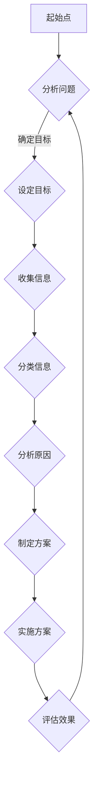
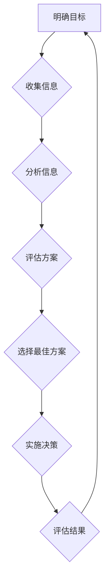
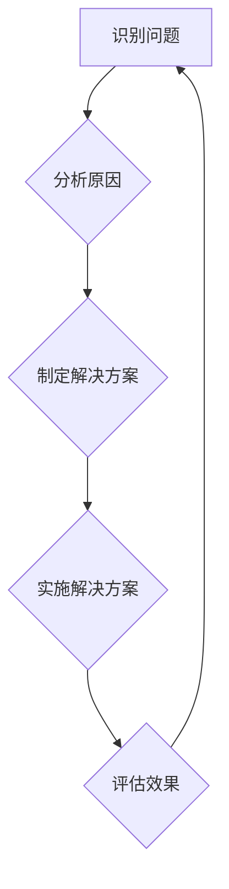
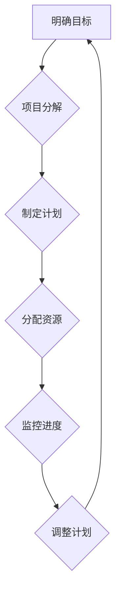
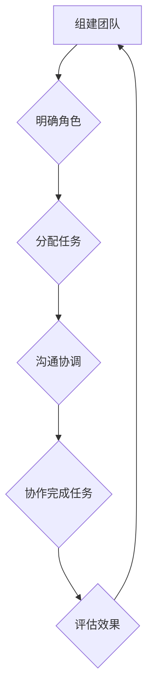
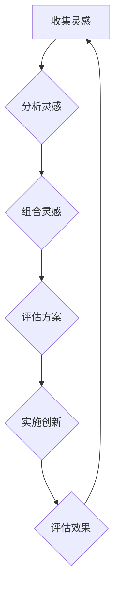
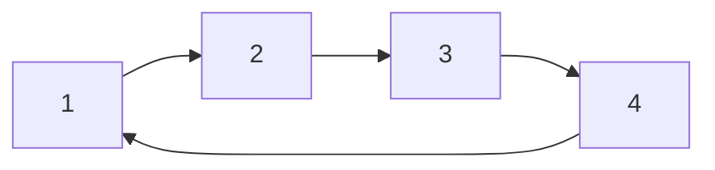

                 

# 《结构化思维原理与应用：掌握结构化思维的内核》

> 关键词：结构化思维、原理、应用、人工智能、项目管理、创新、教育、商业

> 摘要：本文深入探讨了结构化思维的原理与应用，从基本概念、原理、工具到具体应用场景，系统地阐述了结构化思维的核心价值。通过对结构化思维的全面剖析，旨在帮助读者掌握这一思维方式，提升决策能力、项目管理和创新能力，最终实现个人和组织的成长与发展。

## 第1章 结构化思维概述

结构化思维是一种逻辑清晰、层次分明的思维方式，它能够帮助人们有条理地组织信息、分析和解决问题。在这一章中，我们将探讨结构化思维的定义与重要性，了解其与线性思维的区别，并介绍结构化思维的基本原则和方法与工具。

### 1.1 结构化思维的定义与重要性

#### 1.1.1 结构化思维的概念

结构化思维是指按照一定的原则和方法，将复杂的信息进行整理、分类、归纳和整合，形成一个层次清晰、逻辑严密的思维框架。它强调从整体出发，注重系统性和整体性，能够有效地提升思维的质量和效率。

#### 1.1.2 结构化思维的重要性

结构化思维在各个领域都具有重要意义。首先，在决策过程中，结构化思维可以帮助人们避免盲目决策，提高决策的准确性和可靠性。其次，在项目管理和团队协作中，结构化思维能够确保任务有条不紊地进行，提高工作效率。此外，在创意与创新中，结构化思维有助于挖掘潜在的创意，提高创新的成功率。

#### 1.1.3 结构化思维与线性思维的比较

线性思维是一种顺序进行的思维方式，注重因果关系和逻辑推理，但往往容易忽视整体性和系统性。而结构化思维则更加强调整体性和系统性，通过分类、归纳和整合，形成一个完整的思维框架，从而提升思维的质量和效率。

### 1.2 结构化思维的基本原则

#### 1.2.1 整体性原则

整体性原则强调从整体出发，关注各个部分之间的相互关系和整体效果。在结构化思维中，整体性原则能够帮助人们把握问题的本质，避免片面化和局部化的思考。

#### 1.2.2 系统性原则

系统性原则强调对事物进行系统分析和分类，关注各个部分之间的相互作用和影响。通过系统性原则，结构化思维能够帮助人们深入理解问题的本质，找到解决问题的最佳途径。

#### 1.2.3 目标导向原则

目标导向原则强调以目标为导向，将思维集中在实现目标的关键环节上。通过目标导向原则，结构化思维能够帮助人们明确目标，集中精力解决问题，提高工作效率。

### 1.3 结构化思维的方法与工具

#### 1.3.1 概念图

概念图是一种通过图形化的方式来表示概念和概念之间关系的工具。它能够帮助人们清晰地表达思维过程，理清思路，从而更好地理解和解决问题。

#### 1.3.2 思维导图

思维导图是一种以中心主题为核心，通过分支和节点来扩展和细化主题的图形化工具。它能够帮助人们梳理思维，提高记忆效果，激发创造力。

#### 1.3.3 SWOT分析

SWOT分析是一种用于评估企业或项目优势、劣势、机会和威胁的工具。通过SWOT分析，结构化思维能够帮助人们全面了解问题，制定合理的策略。

## 第2章 结构化思维的原理

结构化思维的原理是理解和运用结构化思维的关键。在这一章中，我们将探讨人类思维的运作模式，深入理解结构化思维的核心原理，并通过Mermaid流程图展示其具体应用。

### 2.1 人类思维的运作模式

#### 2.1.1 直觉思维与逻辑思维

直觉思维是一种不依赖逻辑推理，基于经验和感知的思维方式。而逻辑思维则是一种遵循逻辑规则、通过推理和证明来得出结论的思维方式。在结构化思维中，直觉思维和逻辑思维相互补充，共同发挥作用。

#### 2.1.2 信息处理机制

信息处理机制是指人类大脑在接收、处理和存储信息的过程中所采用的机制。结构化思维通过信息处理机制，将复杂的信息进行分类、归纳和整合，从而形成有意义的思维框架。

#### 2.1.3 人类记忆与遗忘

人类记忆与遗忘是信息处理机制的重要组成部分。结构化思维通过将信息与已有的知识和经验相联系，提高记忆效果，同时通过遗忘非必要的细节，保持思维的清晰性。

### 2.2 结构化思维的核心原理

#### 2.2.1 分类与归类

分类与归类是结构化思维的基础。通过分类与归类，结构化思维能够将复杂的信息进行组织，形成一个层次分明的思维框架。

#### 2.2.2 比较与对比

比较与对比是结构化思维的重要方法。通过比较与对比，结构化思维能够发现事物之间的差异和联系，从而更好地理解问题的本质。

#### 2.2.3 因果关系与逻辑推理

因果关系与逻辑推理是结构化思维的核心。通过因果关系和逻辑推理，结构化思维能够分析问题的原因和结果，提出合理的解决方案。

### 2.3 结构化思维的Mermaid流程图

下面是一个简单的结构化思维Mermaid流程图，用于展示其基本原理：



## 第3章 结构化思维的应用场景

结构化思维的应用场景非常广泛，包括决策与问题解决、项目管理和团队协作、创意与创新等。在这一章中，我们将探讨这些应用场景，并通过实际案例来展示结构化思维的具体运用。

### 3.1 决策与问题解决

#### 3.1.1 决策过程中的结构化思维

在决策过程中，结构化思维能够帮助人们明确目标，收集信息，分析各种方案，并选择最佳方案。以下是一个简单的决策过程流程图：



#### 3.1.2 问题解决中的结构化思维

在问题解决过程中，结构化思维能够帮助人们快速定位问题，分析问题的原因，并找到解决问题的方法。以下是一个问题解决的基本流程图：



#### 3.1.3 实际案例分析

案例一：某公司计划推出一款新产品，如何确保产品的市场竞争力？

1. 明确目标：提高产品的市场竞争力。
2. 收集信息：分析竞争对手的产品特点、市场趋势、消费者需求等。
3. 分析信息：将收集到的信息进行分类和归纳，找出产品的关键特点。
4. 评估方案：根据分析结果，制定改进产品的方案。
5. 实施方案：根据方案，改进产品并投入市场。
6. 评估效果：收集市场反馈，评估产品的市场表现。

### 3.2 项目管理与团队协作

#### 3.2.1 项目规划与结构化思维

在项目规划中，结构化思维能够帮助项目团队明确项目目标，制定详细的计划，并确保项目按计划顺利进行。以下是一个项目规划的基本流程图：



#### 3.2.2 团队协作与沟通

在团队协作中，结构化思维能够帮助团队成员明确各自的角色和职责，提高沟通效率，确保项目顺利进行。以下是一个团队协作的基本流程图：



#### 3.2.3 实际应用场景

案例二：某公司在开发一款新软件，如何确保项目顺利进行？

1. 明确目标：开发一款高质量、具有竞争力的软件。
2. 项目分解：将项目划分为不同的模块和任务。
3. 制定计划：根据项目分解，制定详细的开发计划。
4. 分配资源：为每个任务分配合适的团队成员。
5. 监控进度：定期检查项目进度，确保按计划进行。
6. 调整计划：根据监控结果，调整项目计划。
7. 沟通协调：确保团队成员之间的沟通畅通，解决协作中的问题。

### 3.3 创意与创新

#### 3.3.1 创意思维与结构化思维

创意思维是一种探索新思路、发现新解决方案的思维方式。结构化思维能够帮助创意思维更好地组织信息，梳理思路，提高创新效率。以下是一个创意思维的基本流程图：



#### 3.3.2 创新的过程与方法

创新的过程包括灵感收集、方案评估、实施创新和效果评估等环节。结构化思维能够帮助在每个环节中更好地组织信息，提高创新效率。以下是一个创新过程的基本流程图：


#### 3.3.3 实际案例分享

案例三：某公司计划推出一款智能家居产品，如何实现创新？

1. 灵感收集：收集智能家居市场的趋势、消费者需求、竞争对手产品等信息。
2. 分析灵感：分析收集到的信息，找出潜在的创新点。
3. 组合灵感：将不同的灵感进行组合，形成新的产品概念。
4. 评估方案：评估产品概念的可行性，确定最佳方案。
5. 实施创新：根据最佳方案，进行产品开发。
6. 评估效果：评估产品的市场表现，优化产品。

## 第4章 结构化思维的工具与技巧

结构化思维的应用离不开有效的工具和技巧。在这一章中，我们将介绍几种常用的结构化思维工具和技巧，包括思维导图、概念图和SWOT分析，并展示它们在日常工作中的应用。

### 4.1 思维导图的应用

思维导图是一种图形化的思维工具，通过节点和分支来表示概念和概念之间的关系。它能够帮助人们清晰地表达思维过程，提高记忆效果和创造力。

#### 4.1.1 思维导图的绘制方法

1. 确定中心主题：首先确定思维导图的中心主题，并将其绘制在中央。
2. 添加分支：围绕中心主题，添加相关的分支，每个分支代表一个核心概念。
3. 绘制子分支：在每个分支下，可以继续添加子分支，细化每个概念。
4. 使用颜色和图标：使用不同的颜色和图标来区分不同的概念和关系，增强视觉效果。

#### 4.1.2 思维导图在日常工作中的应用

1. 记笔记：使用思维导图记录会议内容、学习笔记等，能够更好地整理思路，加深记忆。
2. 计划安排：使用思维导图制定工作计划、项目进度等，能够清晰展示任务之间的关系，提高工作效率。
3. 创意构思：使用思维导图进行创意构思，能够激发灵感，提高创新能力。

### 4.2 概念图的应用

概念图是一种以概念和概念之间的关系为核心，通过节点和箭头来表示概念和关系的图形化工具。它能够帮助人们更好地理解复杂的概念和知识体系。

#### 4.2.1 概念图的基本概念

1. 概念：概念图中的基本元素，表示一个具体的概念或知识点。
2. 关系：表示概念之间的联系，通过箭头表示。
3. 层次结构：概念图中的概念按照一定的层次结构排列，形成有层次的思维框架。

#### 4.2.2 概念图在知识管理中的应用

1. 知识梳理：使用概念图对知识进行梳理，能够清晰地展示知识之间的联系，便于理解和记忆。
2. 知识传递：通过概念图，将知识以图形化的方式传递给他人，提高知识传递的效率。
3. 知识创新：在概念图的基础上，通过重新组合和构建概念，实现知识的创新。

#### 4.2.3 概念图的绘制与使用技巧

1. 选择合适的工具：选择适合绘制概念图的软件或工具，如MindManager、Xmind等。
2. 明确主题：在绘制概念图之前，明确概念图的主题和核心概念。
3. 细化概念：将主题分解为更细化的概念，形成有层次的思维框架。
4. 使用清晰的箭头和标签：使用清晰的箭头和标签来表示概念之间的关系，避免歧义。

### 4.3 SWOT分析的运用

SWOT分析是一种常用的战略规划工具，用于分析企业的优势、劣势、机会和威胁。它能够帮助企业制定合理的战略规划，提高竞争力。

#### 4.3.1 SWOT分析的概念

1. 优势（Strengths）：企业内部的优势因素，如技术、品牌、资金等。
2. 劣势（Weaknesses）：企业内部的劣势因素，如管理、资源、技术等。
3. 机会（Opportunities）：企业外部的机会因素，如市场需求、政策支持等。
4. 威胁（Threats）：企业外部的威胁因素，如竞争、政策变化等。

#### 4.3.2 SWOT分析在实际项目中的应用

1. 企业战略规划：通过SWOT分析，了解企业的优势、劣势、机会和威胁，制定合理的战略规划。
2. 项目评估：通过SWOT分析，评估项目的可行性、风险和收益，为项目决策提供依据。
3. 团队协作：通过SWOT分析，明确团队成员的优势和劣势，优化团队协作，提高项目成功率。

#### 4.3.3 SWOT分析的注意事项

1. 客观性：在分析时，要尽量避免主观偏见，客观评估优势、劣势、机会和威胁。
2. 全面性：要全面考虑企业的内部和外部因素，确保分析结果的准确性。
3. 动态性：要关注市场环境和内部条件的变化，及时调整SWOT分析的结果。

## 第5章 结构化思维的实践与案例

结构化思维的实践是理解和运用这一思维方式的最佳途径。在这一章中，我们将探讨结构化思维的实践步骤和方法，分析实践中的常见问题与解决策略，并通过实际案例分享结构化思维的应用经验。

### 5.1 实践指南

#### 5.1.1 实践步骤与方法

1. 确定目标：明确需要解决的问题或达成的目标。
2. 收集信息：通过各种渠道收集与目标相关的信息。
3. 分析信息：对收集到的信息进行分类、归纳和整理。
4. 制定方案：根据分析结果，制定解决问题的方案。
5. 实施方案：按照方案执行，解决问题或达成目标。
6. 评估效果：对实施结果进行评估，总结经验教训。

#### 5.1.2 实践中的常见问题与解决策略

1. 信息过载：面对大量信息，容易出现迷茫和困惑。解决策略：使用结构化思维工具，如思维导图、概念图等，将信息进行分类和整理，提高信息处理效率。

2. 缺乏目标感：在实践过程中，容易偏离目标，导致效率低下。解决策略：明确目标，制定详细的计划，保持目标导向，确保实践方向正确。

3. 缺乏执行力：在实践过程中，容易遇到困难和挫折，缺乏执行力。解决策略：培养执行力，如制定可量化的目标、分解任务、设置奖励机制等。

#### 5.1.3 实践案例分享

案例一：某企业计划拓展新市场，如何制定合理的市场拓展策略？

1. 确定目标：拓展新市场，提高市场占有率。
2. 收集信息：分析新市场的市场容量、竞争态势、消费者需求等。
3. 分析信息：将收集到的信息进行分类，梳理出市场拓展的关键因素。
4. 制定方案：根据分析结果，制定市场拓展的方案，包括产品定位、市场推广策略等。
5. 实施方案：按照方案执行，实施市场拓展策略。
6. 评估效果：对市场拓展结果进行评估，总结经验教训，优化市场拓展策略。

案例二：某项目经理负责一个新项目的实施，如何确保项目顺利进行？

1. 确定目标：确保项目按计划完成，达到预期效果。
2. 收集信息：了解项目背景、需求、资源等。
3. 分析信息：将项目需求分解为具体的任务，制定项目计划。
4. 制定方案：根据项目计划，制定项目执行方案，包括任务分配、进度安排等。
5. 实施方案：按照方案执行，确保项目按计划进行。
6. 评估效果：对项目实施结果进行评估，总结经验教训，优化项目管理方法。

## 第6章 结构化思维的数学模型与公式解析

结构化思维不仅仅是一种逻辑和经验的运用，它也可以与数学模型和公式相结合，以更科学和精确的方式进行分析和决策。在这一章中，我们将介绍一些基本的数学模型与公式，并解释它们在结构化思维中的应用。

### 6.1 基本数学模型

#### 6.1.1 概率论模型

概率论模型在结构化思维中有着广泛的应用，可以帮助我们评估不确定事件的可能性。以下是一些基本的概率论模型和公式：

- 概率（Probability）: 表示某个事件发生的可能性，计算公式为：

  $$ P(A) = \frac{有利结果的数量}{所有可能结果的数量} $$

- 条件概率（Conditional Probability）: 在已知某个事件发生的条件下，另一个事件发生的概率。计算公式为：

  $$ P(B|A) = \frac{P(A \cap B)}{P(A)} $$

- 贝叶斯定理（Bayes' Theorem）: 用于在已知某些条件概率的情况下，计算某个事件发生的概率。计算公式为：

  $$ P(A|B) = \frac{P(B|A) \cdot P(A)}{P(B)} $$

#### 6.1.2 线性代数模型

线性代数模型在处理多维数据和信息时非常有用。以下是一些基本的线性代数模型和公式：

- 矩阵（Matrix）: 矩阵是一个二维数组，用于表示复杂数据集合。矩阵运算包括加法、减法、乘法和转置等。

- 矩阵乘法（Matrix Multiplication）: 两个矩阵相乘的结果是一个新的矩阵。计算公式为：

  $$ C = A \cdot B $$

- 矩阵转置（Transpose）: 矩阵的转置是将矩阵的行和列互换。计算公式为：

  $$ A^T = \begin{bmatrix}
  a_{21} & a_{31} \\
  a_{22} & a_{32}
  \end{bmatrix} $$

#### 6.1.3 图论模型

图论模型在处理网络结构和关系时非常有用。以下是一些基本的图论模型和公式：

- 图（Graph）: 图是由节点（Vertex）和边（Edge）组成的结构。节点表示实体，边表示实体之间的关系。

- 路径（Path）: 从一个节点到另一个节点的路径是一系列连续的边。

- 最短路径（Shortest Path）: 在一个图中，从起点到终点的最短路径是具有最小权重的路径。计算公式为：

  $$ d(v, w) = \min \{ d(u, w) + w(u, v) \mid u \in V \} $$

### 6.2 数学公式的应用

数学公式在结构化思维中的应用主要体现在以下几个方面：

- 数据分析：使用概率论模型和线性代数模型对大量数据进行统计分析，提取有价值的信息。
- 决策支持：利用数学模型进行预测和优化，为决策提供科学依据。
- 问题求解：使用图论模型求解复杂问题，如最短路径问题、最大流问题等。

#### 6.2.1 概率论公式的应用

假设有一个彩票游戏，中奖的概率是1/1000。购买一张彩票，计算中奖的概率：

```markdown
$$ P(\text{中奖}) = \frac{1}{1000} = 0.001 $$
```

#### 6.2.2 线性代数公式的应用

假设有两个向量 $A = \begin{bmatrix} 1 & 2 \end{bmatrix}$ 和 $B = \begin{bmatrix} 3 & 4 \end{bmatrix}$，计算它们的点积和距离：

```markdown
$$ A \cdot B = 1 \cdot 3 + 2 \cdot 4 = 11 $$
$$ \| A - B \| = \sqrt{(1 - 3)^2 + (2 - 4)^2} = \sqrt{4 + 4} = 2\sqrt{2} $$
```

#### 6.2.3 图论公式的应用

假设有一个图，节点 $V = \{1, 2, 3, 4\}$，边 $E = \{\{(1,2), (2,3), (3,4), (4,1)\}\}$，计算图中的最短路径：



使用Dijkstra算法计算最短路径：

```markdown
$$ d(1,2) = 1 $$
$$ d(2,3) = 1 + 2 = 3 $$
$$ d(3,4) = 3 + 1 = 4 $$
$$ d(4,1) = 4 + 1 = 5 $$
$$ \text{最短路径为 } 1 \rightarrow 2 \rightarrow 3 \rightarrow 4 $$
```

### 6.3 数学模型与结构化思维的结合

数学模型与结构化思维的结合，能够使我们的分析更加科学和精确。具体表现在以下几个方面：

- **数据分析**：通过数学模型，对大量结构化数据进行统计分析，提取有价值的信息，为决策提供支持。
- **问题求解**：利用数学模型，求解复杂问题，如优化问题、路径规划问题等。
- **模型预测**：建立数学模型，对未来的趋势进行预测，为战略规划提供依据。

## 第7章 结构化思维的未来发展趋势

随着技术的不断进步，结构化思维在各个领域的应用前景愈发广阔。未来，人工智能、大数据、云计算等新兴技术将为结构化思维带来更多的机遇和挑战。

### 7.1 技术进步对结构化思维的影响

#### 7.1.1 人工智能与结构化思维

人工智能（AI）技术的发展，将大大提升结构化思维的自动化和智能化水平。例如，通过自然语言处理（NLP）技术，AI可以自动分析文本，提取关键信息，生成结构化数据。此外，AI还可以通过机器学习算法，不断优化结构化思维模型，提高决策的准确性和效率。

#### 7.1.2 大数据与结构化思维

大数据技术的发展，为结构化思维提供了丰富的数据资源。通过数据挖掘和分析，结构化思维可以更加深入地挖掘数据背后的价值，发现潜在的问题和趋势，为决策提供有力的支持。

#### 7.1.3 云计算与结构化思维

云计算技术的普及，为结构化思维提供了强大的计算能力和存储资源。通过云计算平台，结构化思维可以更加高效地处理和分析海量数据，实现实时决策和优化。

### 7.2 结构化思维在教育领域的应用

#### 7.2.1 教育模式变革

随着结构化思维在教育领域的应用，传统的教育模式将逐渐向个性化、智能化转变。教师可以通过结构化思维工具，设计个性化的教学方案，满足学生的个性化需求。学生则可以通过结构化思维，更好地理解和掌握知识，提高学习效果。

#### 7.2.2 教学内容创新

结构化思维可以帮助教师设计和优化教学内容，使其更加系统、有序和有意义。同时，结构化思维还可以促进教学内容与实际应用相结合，培养学生的实践能力和创新意识。

#### 7.2.3 教学方法优化

结构化思维可以优化教学方法，提高教学效果。例如，通过思维导图、概念图等工具，教师可以更加清晰地表达教学思路，帮助学生更好地理解和记忆知识。学生也可以通过这些工具，梳理思路，提高学习效率。

### 7.3 结构化思维在商业领域的未来

#### 7.3.1 商业模式创新

结构化思维可以帮助企业重新审视和优化商业模式，发现新的商机和增长点。例如，通过SWOT分析、市场细分等工具，企业可以更好地了解市场环境和竞争对手，制定有针对性的战略。

#### 7.3.2 企业文化塑造

结构化思维可以帮助企业塑造积极、高效的企业文化。通过明确企业愿景、使命和价值观，企业可以更好地凝聚员工，提高团队协作和创新能力。

#### 7.3.3 管理效率提升

结构化思维可以帮助企业管理者更好地进行决策和执行。通过制定详细的项目计划、监控进度和评估效果，管理者可以更加高效地管理项目和团队，提高企业运营效率。

## 附录

### 附录A 结构化思维工具资源

#### A.1 常用工具简介

1. MindManager：一款功能强大的思维导图软件，支持多种平台，适合个人和团队使用。
2. Xmind：一款简洁易用的思维导图软件，具有丰富的模板和功能，适合各种场景。
3. Mural：一款协作型思维导图软件，支持多人实时协作，适合团队协作。
4. Lucidchart：一款在线图表和流程图绘制工具，支持多种图表类型和模板。

#### A.2 在线工具推荐

1. Draw.io：一款免费的在线图表绘制工具，支持各种图表类型和模板。
2. Gliffy：一款在线流程图和架构图绘制工具，支持多种平台和格式。
3. Creately：一款在线图表和流程图绘制工具，提供丰富的模板和功能。

#### A.3 实用技巧分享

1. 保持简洁：尽量使用简洁的语句和图标，避免过于复杂的结构。
2. 定期更新：定期更新思维导图和概念图，确保信息的准确性和时效性。
3. 团队协作：鼓励团队成员共同参与思维导图和概念图的绘制，提高团队协作效率。

### 附录B 结构化思维相关书籍推荐

#### B.1 基础读物推荐

1. 《思维导图》：作者：东尼·博赞
2. 《结构化思维》：作者：张一鸣
3. 《思维的艺术》：作者：理查德·萨勒

#### B.2 深入研究推荐

1. 《认知心理学及其启示》：作者：约翰·安德森
2. 《复杂性思维》：作者：迈尔·舍恩伯格
3. 《算法导论》：作者：托马斯·赫伯特·克罗克

#### B.3 实践指南推荐

1. 《项目实战指南》：作者：赵武
2. 《团队协作实战》：作者：史蒂夫·布兰克
3. 《创新思维与实践》：作者：田中卓志

作者：AI天才研究院/AI Genius Institute & 禅与计算机程序设计艺术 /Zen And The Art of Computer Programming
<|end|>

