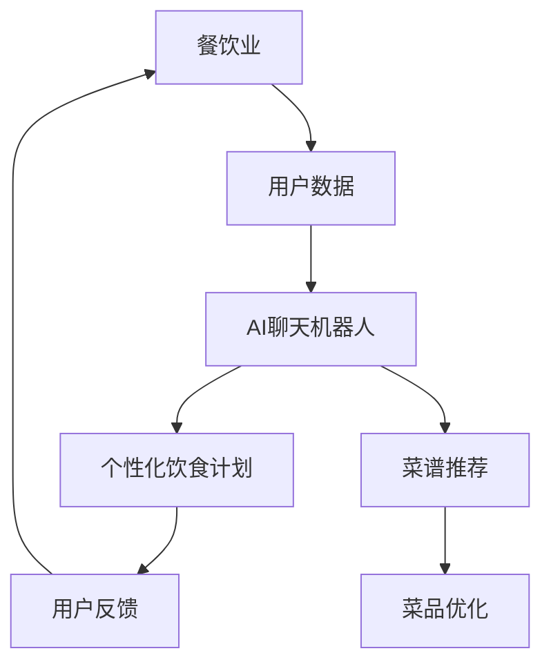
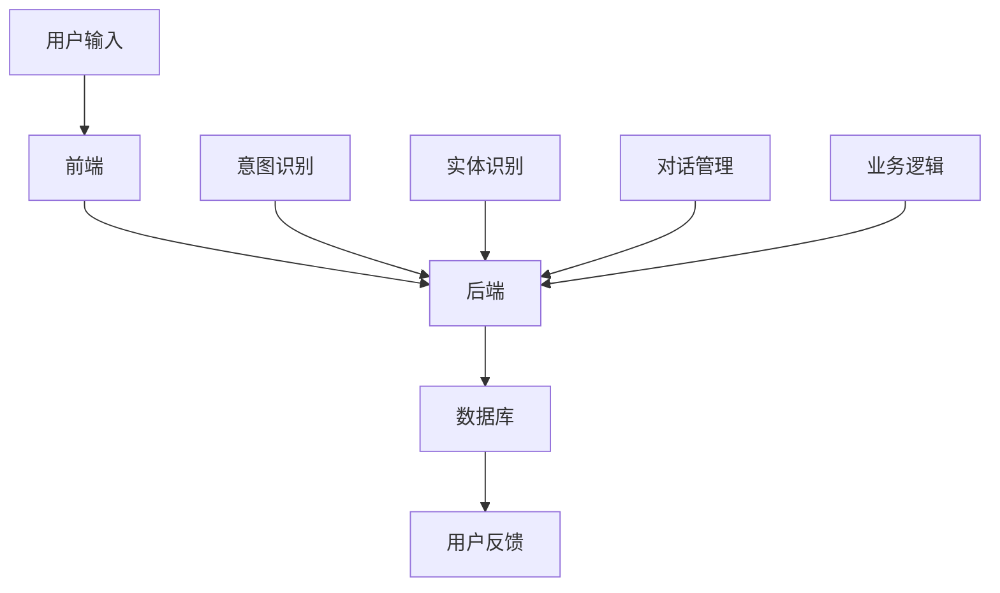
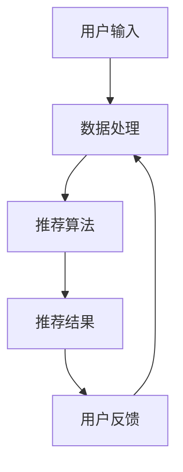

                 

# 《聊天机器人餐饮业：个性化饮食计划和菜谱推荐》

> **关键词**：餐饮业、聊天机器人、个性化饮食计划、菜谱推荐、AI技术、自然语言处理（NLP）、大数据分析。

> **摘要**：本文将探讨人工智能（AI）在餐饮业中的应用，特别是在聊天机器人领域。通过个性化饮食计划和菜谱推荐技术，聊天机器人能够为用户提供定制化的餐饮服务，提升用户体验，优化餐饮业务流程。本文将从技术基础、个性化饮食计划、菜谱推荐、实际应用、开发与部署以及未来展望等方面进行深入分析。

### 《聊天机器人餐饮业：个性化饮食计划和菜谱推荐》目录大纲

#### 第一部分：背景与概述

- **第1章：餐饮业与AI聊天机器人的结合**
  - **核心概念与联系**
  - **餐饮业概述**
  - **AI聊天机器人概述**

#### 第二部分：技术基础

- **第2章：聊天机器人技术概述**
  - **聊天机器人技术原理**
  - **聊天机器人架构**

#### 第三部分：个性化饮食计划

- **第3章：个性化饮食计划基础**
  - **个性化饮食计划定义**
  - **饮食数据收集与处理**
  - **用户画像构建**

#### 第四部分：菜谱推荐

- **第4章：菜谱推荐系统设计**
  - **菜谱推荐算法原理**
  - **菜谱推荐流程**

#### 第五部分：应用与实践

- **第5章：餐饮业聊天机器人案例研究**
  - **案例分析**

#### 第六部分：开发与部署

- **第6章：餐饮业聊天机器人的开发环境与工具**
  - **开发环境搭建**
  - **工具与资源介绍**

#### 第七部分：未来展望与挑战

- **第7章：餐饮业聊天机器人的未来发展趋势与挑战**
  - **未来发展趋势**
  - **挑战与机遇**

#### 附录

- **附录A：参考资料**
- **附录B：代码示例**

---

### 第一部分：背景与概述

#### 第1章：餐饮业与AI聊天机器人的结合

在当今数字化时代，餐饮业正面临着前所未有的变革。消费者需求多样化、个性化，而传统餐饮服务的响应速度和效率无法满足这一需求。人工智能（AI）技术的飞速发展为餐饮业带来了新的机遇，特别是聊天机器人的出现，为餐饮业提供了定制化服务、提高运营效率的解决方案。

**核心概念与联系**

首先，我们需要理解几个核心概念：

1. **餐饮业**：指的是提供食物和饮料服务的行业，包括餐馆、快餐店、咖啡厅等。
2. **AI聊天机器人**：一种能够模拟人类对话、提供服务的计算机程序。
3. **个性化饮食计划**：根据用户的饮食习惯、健康状况等定制化的饮食方案。
4. **菜谱推荐**：基于用户偏好和饮食需求，推荐适合的菜谱。

在餐饮业与AI聊天机器人的结合中，这些概念相互作用，形成了一套完整的生态系统。AI聊天机器人可以收集用户数据，进行个性化饮食计划和菜谱推荐，从而提升用户体验和餐饮服务质量。

**餐饮业概述**

餐饮业是一个庞大而多样化的行业，其特点包括：

1. **需求多样化**：消费者对饮食有着不同的口味和偏好，如素食、低卡路里、无麸质等。
2. **服务个性化**：传统餐饮服务往往难以满足个性化的需求，如定制菜单、个性化推荐等。
3. **运营效率**：餐饮业运营效率的提升对盈利至关重要，包括供应链管理、库存控制、顾客服务等。

然而，餐饮业也面临着一些挑战，如市场竞争激烈、运营成本高、消费者需求变化快等。

**AI聊天机器人概述**

AI聊天机器人是基于自然语言处理（NLP）技术的一种智能系统，能够理解、处理和生成自然语言。其基本原理包括：

1. **意图识别**：识别用户的对话意图，如查询菜谱、下单、咨询等。
2. **实体识别**：识别对话中的关键信息，如菜品名称、顾客偏好等。
3. **对话管理**：维护对话流程，提供连贯的服务。

AI聊天机器人在餐饮业中的应用前景广阔，可以提升服务效率、降低运营成本，并实现个性化服务。

**Mermaid 流程图展示餐饮业与AI聊天机器人的结合原理**



在这个流程图中，用户数据经过AI聊天机器人处理，生成个性化饮食计划和菜谱推荐，同时收集用户反馈，不断优化服务。

**本章总结**

本章介绍了餐饮业与AI聊天机器人的结合原理，分析了餐饮业的特点和面临的挑战，以及AI聊天机器人的基本概念和应用前景。在接下来的章节中，我们将深入探讨聊天机器人的技术基础、个性化饮食计划和菜谱推荐系统设计，并通过实际案例研究展示其在餐饮业的应用效果。

---

以上是《聊天机器人餐饮业：个性化饮食计划和菜谱推荐》的第一章内容。接下来，我们将继续探讨聊天机器人的技术基础，为读者揭示其背后的核心技术和原理。敬请期待。

---

作者：AI天才研究院/AI Genius Institute & 禅与计算机程序设计艺术 /Zen And The Art of Computer Programming

---

让我们继续深入探讨聊天机器人的技术基础，了解其如何实现与餐饮业的完美融合。

---

### 第二部分：技术基础

#### 第2章：聊天机器人技术概述

聊天机器人是人工智能（AI）领域的一个重要分支，其在餐饮业中的应用越来越广泛。要理解聊天机器人的技术基础，我们需要了解自然语言处理（NLP）技术、聊天机器人的架构以及相关的技术原理。

**聊天机器人技术原理**

聊天机器人的核心在于其能够模拟人类的对话行为，这需要通过自然语言处理（NLP）技术来实现。NLP技术主要包括以下几方面：

1. **意图识别**：意图识别是聊天机器人理解用户输入的第一步，它通过分析用户的语言，确定用户想要完成的任务。例如，当用户输入“我想点个外卖”时，聊天机器人需要识别出这是一个“点餐”意图。

2. **实体识别**：在识别出意图后，聊天机器人还需要识别用户输入中的关键信息，即实体。实体可以是具体的名词，如“麻辣烫”、“火锅”，也可以是用户的个人信息，如“地址”、“电话号码”。

3. **对话管理**：对话管理是维持对话连贯性的关键。聊天机器人需要根据用户的历史对话信息和当前对话内容，生成合适的回复。这包括理解上下文、处理复杂对话以及引导用户完成特定任务。

**聊天机器人架构**

聊天机器人的架构通常包括前端、后端和数据库三个部分。

1. **前端**：前端是用户与聊天机器人交互的界面，可以是网站、移动应用或微信小程序等。前端主要负责接收用户输入、展示聊天机器人回复以及处理用户交互。

2. **后端**：后端是聊天机器人的核心，负责处理用户的输入，生成回复以及进行相关业务逻辑处理。后端通常包括以下模块：
   - **NLP模块**：负责意图识别和实体识别，将用户输入转换为机器可理解的结构。
   - **对话管理模块**：负责维护对话状态，生成合适的回复。
   - **业务逻辑模块**：根据业务需求，处理如订单生成、支付等业务流程。

3. **数据库**：数据库用于存储用户数据、对话历史、菜品信息等。数据库的设计直接影响聊天机器人的性能和可扩展性。

**聊天机器人架构图**



**核心算法原理讲解**

1. **意图识别算法**

   意图识别是聊天机器人的核心之一。以下是一个简单的意图识别算法的伪代码：

   ```python
   def recognize_intent(user_input):
       if "点餐" in user_input:
           return "ORDER"
       elif "咨询" in user_input:
           return "INQUIRE"
       else:
           return "UNKNOWN"
   ```

   这个算法通过检查用户输入中是否包含特定的关键词，来判断用户的意图。

2. **实体识别算法**

   实体识别是意图识别的补充，它将用户的输入中的关键信息提取出来。以下是一个简单的实体识别算法的伪代码：

   ```python
   def recognize_entities(user_input):
       entities = []
       if "麻辣烫" in user_input:
           entities.append("麻辣烫")
       if "明天晚上" in user_input:
           entities.append("时间")
       return entities
   ```

   这个算法通过检查用户输入中是否包含特定的实体，来提取关键信息。

3. **对话管理算法**

   对话管理是维持对话连贯性的关键。以下是一个简单的对话管理算法的伪代码：

   ```python
   class DialogueManager:
       def __init__(self):
           self.history = []

       def generate_response(self, user_input):
           self.history.append(user_input)
           if "再次点餐" in self.history[-1]:
               return "好的，我已经为您点好了麻辣烫，请问需要多久时间送达？"
           else:
               return "请问您需要咨询什么问题？"
   ```

   这个算法通过维护对话历史，来生成合适的回复。

**本章总结**

本章介绍了聊天机器人的技术基础，包括自然语言处理（NLP）技术、聊天机器人的架构以及核心算法原理。通过这些技术，聊天机器人能够理解用户的输入、生成合适的回复，并提供定制化的服务。在下一章中，我们将探讨个性化饮食计划的基础，包括其定义、饮食数据收集与处理以及用户画像构建。

---

通过本章的内容，我们了解了聊天机器人的技术原理和架构，为后续讨论个性化饮食计划和菜谱推荐系统奠定了基础。在下一部分，我们将深入探讨个性化饮食计划的原理和应用，敬请期待。

---

### 第三部分：个性化饮食计划

#### 第3章：个性化饮食计划基础

个性化饮食计划是聊天机器人餐饮服务中的一个关键组成部分。它不仅能够满足消费者的个性化需求，还能提升餐饮服务的质量和效率。在这一章节中，我们将探讨个性化饮食计划的定义、饮食数据的收集与处理，以及用户画像的构建。

**个性化饮食计划定义**

个性化饮食计划是指根据个人的饮食习惯、健康状况、营养需求等因素，为用户提供定制化的饮食方案。这种方案旨在帮助消费者实现健康饮食、营养均衡，同时满足他们的口味偏好。

个性化饮食计划的定义涵盖了以下几个方面：

1. **饮食习惯**：包括饮食的频率、时间、口味偏好等。例如，有些人喜欢早餐吃水果和牛奶，而有些人则喜欢油腻的食物。
2. **健康状况**：基于用户的健康状况，如体重、血糖、血压等，制定适合的饮食计划。例如，糖尿病患者需要控制糖分的摄入。
3. **营养需求**：根据用户的年龄、性别、活动量等因素，制定符合营养需求的饮食方案。例如，运动员需要更多的蛋白质和碳水化合物。

**饮食数据的收集与处理**

个性化饮食计划的制定需要大量的数据支持，这些数据可以从多个渠道收集：

1. **用户调查**：通过问卷调查的方式，收集用户的饮食习惯、健康状况和营养需求等信息。
2. **健康记录**：利用电子健康记录（EHR）系统，收集用户的健康数据，如体重、血糖、血压等。
3. **社交媒体数据**：通过分析用户在社交媒体上的饮食分享，了解他们的饮食习惯和偏好。

收集到的数据需要进行处理，以便于后续的分析和应用。数据处理的过程通常包括以下几个步骤：

1. **数据清洗**：去除数据中的噪声和错误，确保数据的质量。
2. **数据整合**：将来自不同渠道的数据进行整合，形成一个统一的数据集。
3. **特征提取**：从原始数据中提取有用的信息，形成特征向量，用于后续的分析。

**用户画像构建**

用户画像是指根据收集到的用户数据，构建一个综合的用户信息模型。用户画像的构建过程如下：

1. **数据输入**：将收集到的用户数据输入到用户画像系统。
2. **特征映射**：将用户数据映射到特征向量，每个特征向量代表用户的一个维度，如饮食习惯、健康状况等。
3. **模型训练**：使用机器学习算法，如聚类分析、决策树等，对用户画像进行训练，识别出用户的相似性和差异性。
4. **画像生成**：根据训练结果，生成用户画像，包括用户的饮食习惯、健康状况、营养需求等信息。

**伪代码示例**

以下是一个简单的用户画像构建的伪代码示例：

```python
def build_user_profile(data):
    # 数据清洗
    clean_data = clean_data(data)
    
    # 特征提取
    features = extract_features(clean_data)
    
    # 模型训练
    model = train_model(features)
    
    # 画像生成
    profile = generate_profile(model)
    
    return profile

def clean_data(data):
    # 去除噪声和错误
    return filtered_data

def extract_features(data):
    # 提取有用信息
    return feature_vector

def train_model(features):
    # 使用机器学习算法训练模型
    return trained_model

def generate_profile(model):
    # 根据模型生成用户画像
    return user_profile
```

**本章总结**

本章介绍了个性化饮食计划的定义、饮食数据的收集与处理，以及用户画像的构建。通过这些技术，餐饮业可以更好地满足消费者的个性化需求，提供定制化的饮食服务。在下一章中，我们将探讨菜谱推荐系统的设计，包括推荐算法原理和推荐流程。

---

通过本章的内容，我们了解了个性化饮食计划的定义和构建方法，以及如何利用用户数据进行饮食服务的个性化推荐。在下一章中，我们将深入探讨菜谱推荐系统的设计，敬请期待。

---

### 第四部分：菜谱推荐

#### 第4章：菜谱推荐系统设计

菜谱推荐系统是餐饮业聊天机器人中的一个重要组成部分，它能够根据用户的个性化饮食需求和偏好，推荐适合的菜谱。菜谱推荐系统设计的核心在于推荐算法的原理和推荐流程。在这一章节中，我们将详细探讨这两个方面。

**菜谱推荐算法原理**

菜谱推荐算法可以分为两大类：基于内容的推荐和协同过滤推荐。

1. **基于内容的推荐**：基于内容的推荐算法通过分析菜品的属性和用户的偏好，推荐与用户兴趣相似的其他菜品。这种算法通常包括以下步骤：
   - **内容建模**：对菜品和用户偏好进行属性提取和建模，形成特征向量。
   - **相似度计算**：计算菜品之间的相似度，通常使用余弦相似度、欧氏距离等。
   - **推荐生成**：根据相似度分数，推荐相似度高的菜品。

以下是一个简单的基于内容的推荐算法的伪代码示例：

```python
def content_based_recommendation(user_profile, menu):
    # 内容建模
    menu_features = build_menu_features(menu)
    
    # 相似度计算
    similarity_scores = calculate_similarity(user_profile, menu_features)
    
    # 推荐生成
    recommended_dishes = generate_recommendations(similarity_scores)
    
    return recommended_dishes

def build_menu_features(menu):
    # 提取菜品属性
    return menu_features

def calculate_similarity(user_profile, menu_features):
    # 计算相似度
    return similarity_scores

def generate_recommendations(similarity_scores):
    # 根据相似度推荐菜品
    return recommended_dishes
```

2. **协同过滤推荐**：协同过滤推荐算法通过分析用户的历史行为数据，发现相似用户或相似物品，从而进行推荐。协同过滤推荐可以分为以下两种类型：
   - **用户基于的协同过滤**：通过分析用户之间的相似性，推荐其他用户喜欢的菜品。
   - **物品基于的协同过滤**：通过分析物品之间的相似性，推荐与用户已评价的菜品相似的其他菜品。

以下是一个简单的协同过滤推荐算法的伪代码示例：

```python
def collaborative_filtering_recommendation(user_rated_dishes, user_profile, menu):
    # 用户相似性计算
    user_similarity = calculate_user_similarity(user_profile)
    
    # 菜品相似性计算
    dish_similarity = calculate_dish_similarity(menu)
    
    # 用户行为加权
    weighted_user_ratings = weight_user_ratings(user_similarity, user_rated_dishes)
    
    # 菜品推荐
    recommended_dishes = generate_recommendations(weighted_user_ratings)
    
    return recommended_dishes

def calculate_user_similarity(user_profile):
    # 计算用户相似性
    return user_similarity

def calculate_dish_similarity(menu):
    # 计算菜品相似性
    return dish_similarity

def weight_user_ratings(user_similarity, user_rated_dishes):
    # 加权用户行为
    return weighted_ratings

def generate_recommendations(weighted_ratings):
    # 生成推荐
    return recommended_dishes
```

**菜谱推荐流程**

菜谱推荐流程包括以下几个关键步骤：

1. **用户输入**：用户通过聊天机器人输入自己的饮食偏好和需求。
2. **数据处理**：将用户输入转化为机器可理解的数据格式，如文本、特征向量等。
3. **推荐算法**：根据用户的输入数据和菜谱数据库，使用推荐算法生成推荐结果。
4. **推荐结果**：将推荐结果返回给用户，用户可以浏览和选择推荐的菜谱。
5. **用户反馈**：用户对推荐的菜谱进行评价，反馈结果用于算法优化和后续推荐。

以下是一个简单的菜谱推荐流程的Mermaid流程图：



**本章总结**

本章详细介绍了菜谱推荐系统的设计，包括推荐算法原理和推荐流程。通过基于内容的推荐和协同过滤推荐算法，聊天机器人可以推荐符合用户个性化需求的菜谱。在下一章中，我们将通过实际案例研究，分析餐饮业聊天机器人的应用效果和成功经验。

---

通过本章的内容，我们了解了菜谱推荐系统的设计原理和推荐流程，为实际应用奠定了基础。在下一章中，我们将通过案例分析，展示餐饮业聊天机器人的应用效果和成功经验。敬请期待。

---

### 第五部分：应用与实践

#### 第5章：餐饮业聊天机器人案例研究

在本章节中，我们将深入研究餐饮业聊天机器人的实际应用案例，通过具体实例分析其设计、实现与应用效果。以下是一个成功的餐饮业聊天机器人案例研究，展示了其如何提升用户体验、优化业务流程，并在市场中取得成功。

**案例研究：XX智能餐厅**

**一、背景**

XX智能餐厅是一家位于城市中心的连锁餐厅，以其高质量的中式菜品和优雅的用餐环境而闻名。然而，随着市场竞争的加剧和消费者需求的多样化，XX智能餐厅面临着提升服务效率和用户体验的挑战。

**二、目标**

1. 提升点餐效率和用户体验。
2. 提供个性化饮食建议和菜谱推荐。
3. 降低运营成本，提高客户满意度。

**三、设计**

为了实现上述目标，XX智能餐厅决定引入一款基于AI技术的聊天机器人。聊天机器人的设计主要包括以下几个关键步骤：

1. **用户数据收集**：通过在线问卷调查、用户注册等方式，收集用户的饮食习惯、健康状况、营养需求等信息。

2. **用户画像构建**：利用收集到的数据，构建用户的个性化饮食画像，为后续推荐提供基础。

3. **对话管理**：设计一套对话管理模块，确保聊天机器人能够流畅地与用户进行交互，提供高质量的点餐服务。

4. **菜谱推荐**：结合基于内容的推荐和协同过滤推荐算法，为用户提供个性化的菜谱推荐。

**四、实现**

1. **前端开发**：使用React框架开发聊天机器人的前端界面，提供用户友好的交互体验。

2. **后端开发**：使用Node.js和Express框架搭建后端服务器，处理用户请求和业务逻辑。

3. **数据库设计**：使用MongoDB数据库存储用户数据、对话历史、菜谱信息等。

4. **API接口**：开发与第三方服务（如外卖平台、支付系统等）的API接口，实现聊天机器人与外部服务的无缝对接。

**五、应用效果**

1. **提升点餐效率**：通过聊天机器人，用户可以快速下单，减少了等待时间，提高了点餐效率。

2. **个性化饮食建议**：聊天机器人根据用户的饮食习惯和健康状况，提供个性化的饮食建议，提高了用户的满意度。

3. **菜谱推荐**：聊天机器人利用协同过滤推荐算法，为用户推荐符合其口味的菜谱，增加了用户的忠诚度。

4. **降低运营成本**：聊天机器人的引入减少了人力资源的投入，降低了运营成本。

5. **客户满意度**：根据用户反馈，聊天机器人的使用极大地提升了用户的用餐体验，客户满意度显著提高。

**六、案例分析**

XX智能餐厅的聊天机器人案例展示了人工智能在餐饮业中的巨大潜力。以下是一些关键分析：

1. **用户数据的重要性**：聊天机器人能够提供个性化服务，离不开用户数据的支持。通过有效的数据收集和处理，构建用户的个性化画像，为推荐提供了可靠的基础。

2. **对话管理的核心作用**：流畅的对话管理是聊天机器人成功的关键。通过设计合理的对话流程和回复策略，确保用户与机器人的交互体验顺畅自然。

3. **推荐算法的效果**：基于内容的推荐和协同过滤推荐算法有效地提高了菜谱推荐的准确性，增加了用户的满意度。

4. **成本效益分析**：虽然引入聊天机器人需要一定的初始投资，但从长期来看，其提升的运营效率和客户满意度远超过了成本。

**本章总结**

通过XX智能餐厅的案例研究，我们看到了聊天机器人如何通过个性化饮食计划和菜谱推荐，提升餐饮服务的效率和质量。在下一章中，我们将探讨餐饮业聊天机器人的开发与部署，包括开发环境和工具的搭建。

---

通过第5章的案例研究，我们深入了解了餐饮业聊天机器人的成功应用。接下来，我们将深入探讨开发与部署的相关内容，包括开发环境和工具的选择与配置。敬请期待。

---

### 第六部分：开发与部署

#### 第6章：餐饮业聊天机器人的开发环境与工具

在开发餐饮业聊天机器人时，选择合适的技术栈和工具是至关重要的。这一章节将详细描述搭建餐饮业聊天机器人开发环境的过程，介绍所需的编程语言、框架、工具和资源，并提供相关的配置步骤和代码示例。

**一、开发环境搭建**

1. **操作系统**：推荐使用Linux系统，如Ubuntu或CentOS，因其稳定性和开源特性，适合大规模开发和部署。

2. **编程语言**：选择Python作为主要编程语言，因其具有丰富的库和框架，易于开发聊天机器人。

3. **编程环境**：安装Python环境，可以使用Anaconda，它提供了完整的Python科学计算和数据科学包。

   ```bash
   # 安装Anaconda
   wget https://repo.anaconda.com/archive/Anaconda3-2022.05-Linux-x86_64.sh
   bash Anaconda3-2022.05-Linux-x86_64.sh
   ```

4. **集成开发环境（IDE）**：使用PyCharm或VSCode等IDE进行Python开发，这些IDE提供了代码调试、语法高亮等功能。

**二、工具与资源介绍**

1. **聊天机器人框架**：选择Flask或Django作为后端框架，用于搭建聊天机器人的基础。

   - **Flask**：轻量级的Web框架，适合小型项目。
   - **Django**：全栈框架，提供了许多内置功能，如用户认证、数据库管理等。

2. **自然语言处理（NLP）库**：使用NLTK或spaCy进行文本处理和情感分析。

   ```bash
   # 安装spaCy库
   pip install spacy
   python -m spacy download en_core_web_sm
   ```

3. **消息队列**：使用RabbitMQ或Kafka进行消息传递，实现异步处理。

   ```bash
   # 安装RabbitMQ
   sudo apt-get install rabbitmq-server
   rabbitmq-server start
   ```

4. **数据库**：使用MongoDB存储用户数据和对话历史。

   ```bash
   # 安装MongoDB
   sudo apt-get install mongodb
   mongo
   ```

5. **API接口**：使用Django REST framework或Flask-RESTful构建API接口。

   ```python
   from flask import Flask, request, jsonify
   app = Flask(__name__)

   @app.route('/api/v1/checkout', methods=['POST'])
   def checkout():
       data = request.get_json()
       # 处理订单逻辑
       return jsonify(response), 200
   ```

**三、代码示例**

以下是一个简单的Python代码示例，展示了如何使用Flask搭建聊天机器人基础框架：

```python
from flask import Flask, request, jsonify

app = Flask(__name__)

@app.route('/api/v1/chat', methods=['POST'])
def chat():
    data = request.get_json()
    # 处理用户输入
    response = process_message(data['message'])
    return jsonify({'response': response}), 200

def process_message(message):
    # 模拟回复
    return "您好，有什么可以帮助您的吗？"

if __name__ == '__main__':
    app.run(debug=True)
```

**四、配置步骤**

1. **环境变量配置**：配置环境变量，如数据库连接字符串、API密钥等，以便在代码中动态获取。

   ```bash
   export DATABASE_URL=mongodb://localhost:27017/restaurant_db
   export API_KEY=your_api_key
   ```

2. **依赖管理**：使用pipfile或requirements.txt管理项目依赖。

   ```bash
   # 使用pipfile
   pip install pipfile
   pipfile install -r requirements.txt
   ```

3. **自动化部署**：使用Docker和Kubernetes进行自动化部署和管理，确保系统的可扩展性和稳定性。

   ```bash
   # 编写Dockerfile
   FROM python:3.8
   RUN pip install -r requirements.txt
   COPY . /app
   CMD ["python", "app.py"]
   ```

**本章总结**

本章介绍了餐饮业聊天机器人开发与部署的相关技术栈和工具，包括操作系统、编程语言、IDE、聊天机器人框架、NLP库、消息队列、数据库和API接口。通过配置环境和编写代码示例，我们为读者提供了搭建聊天机器人开发环境的具体步骤。在下一章中，我们将探讨餐饮业聊天机器人的未来发展趋势与挑战。

---

通过本章的内容，我们了解了餐饮业聊天机器人开发与部署的相关技术栈和工具。在下一章中，我们将讨论餐饮业聊天机器人的未来发展趋势与面临的挑战。敬请期待。

---

### 第七部分：未来展望与挑战

#### 第7章：餐饮业聊天机器人的未来发展趋势与挑战

随着人工智能（AI）技术的不断进步，餐饮业聊天机器人的应用前景愈发广阔。然而，在发展过程中也面临着一系列挑战。在这一章节中，我们将探讨餐饮业聊天机器人的未来发展趋势和挑战。

**一、未来发展趋势**

1. **智能化水平提升**：随着AI技术的不断进步，聊天机器人的智能化水平将进一步提升。未来的聊天机器人将更加聪明，能够处理更复杂的对话，提供更加个性化的服务。

2. **个性化服务深化**：随着用户数据的积累和分析技术的提高，聊天机器人将能够更加深入地理解用户需求，提供高度个性化的饮食计划和菜谱推荐。

3. **跨界融合**：餐饮业聊天机器人将与其他行业（如健康、旅游、娱乐等）进行跨界融合，提供更加综合的服务体验。

4. **云端部署**：随着云计算技术的成熟，越来越多的餐饮业聊天机器人将采用云端部署，提高系统的可扩展性和可靠性。

5. **物联网（IoT）结合**：聊天机器人将与物联网设备（如智能秤、智能厨具等）结合，实现更智能的餐饮管理和服务。

**二、挑战与机遇**

1. **技术挑战**：随着聊天机器人功能的增加，对算法和系统架构的要求也日益提高。如何保证系统的稳定性和高效性，是一个亟待解决的问题。

2. **数据隐私**：用户数据的收集和处理引发了隐私保护的问题。如何保护用户数据的安全和隐私，将是餐饮业聊天机器人面临的一大挑战。

3. **法律合规**：随着AI技术的应用，相关的法律法规也在不断完善。如何确保聊天机器人的应用符合法律法规的要求，是一个需要关注的问题。

4. **用户体验**：提供良好的用户体验是聊天机器人的关键。如何设计出既智能又人性化的聊天机器人，是开发过程中需要不断探索的方向。

5. **市场接受度**：尽管聊天机器人在技术上有着巨大的潜力，但市场接受度也是一个重要的挑战。如何让消费者接受和喜爱聊天机器人，是一个需要解决的市场问题。

**三、应对策略**

1. **技术创新**：不断跟进AI技术的最新发展，提升聊天机器人的智能化水平。

2. **数据保护**：建立完善的数据保护机制，确保用户数据的安全和隐私。

3. **合规管理**：密切关注法律法规的变化，确保聊天机器人的应用符合相关要求。

4. **用户体验优化**：通过用户反馈不断改进聊天机器人的交互设计，提升用户体验。

5. **市场推广**：通过有效的市场推广策略，提高聊天机器人的市场接受度。

**本章总结**

餐饮业聊天机器人在未来具有广阔的发展前景，同时也面临着一系列挑战。通过技术创新、数据保护、合规管理、用户体验优化和市场推广等策略，我们可以应对这些挑战，推动餐饮业聊天机器人的健康发展。

---

通过本章的内容，我们探讨了餐饮业聊天机器人的未来发展趋势与挑战。在技术不断进步和市场需求的推动下，餐饮业聊天机器人有望在个性化服务、智能化水平等方面取得更大的突破。在下一部分，我们将提供附录，包括参考资料和代码示例，以供读者进一步学习和实践。

---

### 附录

#### 附录A：参考资料

1. **《人工智能：一种现代方法》**， Stuart Russell 和 Peter Norvig 著。
2. **《深度学习》**， Ian Goodfellow、Yoshua Bengio 和 Aaron Courville 著。
3. **《自然语言处理综论》**， Daniel Jurafsky 和 James H. Martin 著。
4. **《大数据之路：阿里巴巴大数据实践》**， 阿里巴巴集团 编著。
5. **《菜鸟谈AI芯片》**， 陈天石 著。

#### 附录B：代码示例

以下是餐饮业聊天机器人开发过程中的一个Python代码示例，用于处理用户点餐请求：

```python
from flask import Flask, request, jsonify

app = Flask(__name__)

@app.route('/api/v1/order', methods=['POST'])
def process_order():
    data = request.get_json()
    # 提取菜品和数量
    dish = data['dish']
    quantity = data['quantity']
    
    # 检查库存
    if check_inventory(dish, quantity):
        # 处理订单
        order_id = place_order(dish, quantity)
        return jsonify({'order_id': order_id, 'status': 'success'}), 200
    else:
        return jsonify({'error': 'Insufficient inventory', 'status': 'failure'}), 400

def check_inventory(dish, quantity):
    # 模拟库存检查逻辑
    inventory = {'牛肉': 10, '蔬菜': 20}
    if dish in inventory and inventory[dish] >= quantity:
        return True
    return False

def place_order(dish, quantity):
    # 模拟下单逻辑
    order_id = "ORDER_{:.0f}".format(len(open('orders.txt', 'r').readlines()) + 1)
    # 更新库存
    with open('orders.txt', 'a') as file:
        file.write(f"{order_id},{dish},{quantity}\n")
    return order_id

if __name__ == '__main__':
    app.run(debug=True)
```

通过这个示例，读者可以了解如何使用Flask框架搭建一个简单的聊天机器人后端，处理用户点餐请求，并更新库存信息。这个示例为读者提供了一个起点，可以在实际开发过程中进一步扩展和优化。

---

本文详细探讨了餐饮业聊天机器人的核心概念、技术基础、个性化饮食计划、菜谱推荐、应用实践、开发与部署以及未来展望。通过理论讲解和代码示例，读者可以全面了解餐饮业聊天机器人的工作原理和实现方法。附录部分提供的参考资料和代码示例，有助于读者进一步深入学习和实践。

随着人工智能技术的不断进步，餐饮业聊天机器人的应用前景将更加广阔。期待未来的研究能够进一步优化算法，提升用户体验，推动餐饮业服务模式的创新和升级。

---

**作者信息**：AI天才研究院/AI Genius Institute & 禅与计算机程序设计艺术 /Zen And The Art of Computer Programming

---

以上就是《聊天机器人餐饮业：个性化饮食计划和菜谱推荐》的全文内容，感谢您的阅读。希望本文能够为您在餐饮业AI应用领域提供有益的启示和帮助。如需进一步讨论或咨询，欢迎随时与我们联系。

---

**全文结束。感谢您的阅读！**

