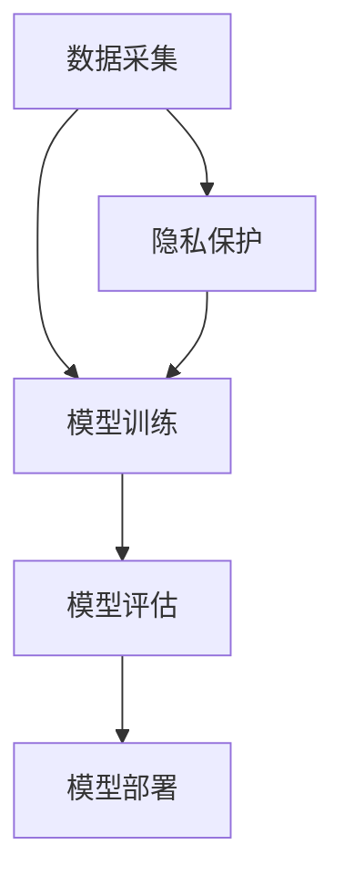

                 

# 联邦学习在跨机构金融风控中的应用与挑战

> **关键词**：联邦学习、金融风控、数据隐私、分布式计算、跨机构合作、机器学习算法、算法性能优化

> **摘要**：本文旨在探讨联邦学习在跨机构金融风控领域的应用，以及其面临的挑战。通过深入分析联邦学习的核心概念、算法原理、数学模型和实际应用案例，本文揭示了联邦学习如何保护数据隐私，提升模型准确性，并推动金融风控领域的创新。同时，本文也探讨了联邦学习在金融风控中的潜在问题和未来研究方向。

---

## 第一部分：核心概念与联系

在探讨联邦学习在金融风控中的应用之前，我们首先需要了解联邦学习的核心概念及其与金融风控之间的联系。

### 1.1 联邦学习概述

**定义**：联邦学习（Federated Learning）是一种分布式机器学习技术，它允许多个机构或设备共同训练一个共享模型，而不需要将各自的数据上传到中央服务器。这种技术通过本地数据训练模型，然后将模型参数进行聚合，从而在保护数据隐私的同时提高模型性能。

**原理**：联邦学习的基本原理是通过分布式计算，使得多个参与者（如金融机构）可以在不共享原始数据的情况下共同训练一个全局模型。参与者通过本地训练和模型更新，生成各自的部分模型参数，然后通过特定的聚合算法将这些参数合并，形成全局模型。

### 1.2 联邦学习在金融风控中的应用

**应用场景**：在金融行业，尤其是在银行、保险和证券等领域，联邦学习可以用于跨机构的金融风险控制。例如，银行可以利用联邦学习技术，分析来自不同机构的信用卡交易数据，以预测信用卡欺诈行为。

**优势**：联邦学习在金融风控中的优势主要体现在以下几个方面：

1. **保护客户隐私**：在传统集中式机器学习模型中，金融机构需要将客户数据上传到中央服务器，这可能会导致数据泄露的风险。而联邦学习通过本地训练和模型聚合，实现了对客户数据的保护。
2. **提高模型准确性**：联邦学习允许金融机构利用各自的数据，训练更个性化的模型。通过跨机构的数据融合，可以显著提高模型的准确性。
3. **跨机构合作**：联邦学习促进了金融机构之间的数据共享和合作，有助于解决单个机构数据不足的问题。

### 1.3 联邦学习架构

联邦学习的架构通常包括以下四个主要阶段：

1. **数据采集**：每个参与者从其本地数据源中收集数据。
2. **模型训练**：参与者在其本地数据集上训练模型，并生成模型更新。
3. **模型评估**：全局模型更新后，进行评估以确定其性能。
4. **模型部署**：将全局模型部署到实际应用场景中。

以下是联邦学习架构的Mermaid流程图：



---

## 第二部分：核心算法原理讲解

在第二部分，我们将深入探讨联邦学习中的核心算法原理，包括合同函数理论和梯度聚合算法。

### 2.1 合同函数理论

**定义**：合同函数（Contract Function）是一种机制，用于确保在联邦学习中参与者之间的交互是安全的。合同函数的设计目标是确保参与者无法通过共享模型更新来推断其他参与者的私有数据。

**原理**：合同函数通过引入噪声和随机性，使得参与者之间的信息交换变得不可预测。具体来说，合同函数在聚合模型更新时，会对参与者的梯度进行随机扰动，从而防止参与者通过梯度信息推断其他参与者的数据。

### 2.2 梯度聚合算法

**定义**：梯度聚合（Gradient Aggregation）是将多个参与者的模型梯度合并为一个全局梯度的过程。全局梯度用于更新全局模型，从而实现模型的协同训练。

**算法**：以下是一个简化的梯度聚合算法伪代码：

```pseudo
初始化：全局模型参数θ_0，参与者模型参数θ_i（i=1,2,...,N）
对于每个迭代t：
  1. 收集所有参与者的模型梯度：g_i(t) = ∇θ_i(L(θ_i, x_i, y_i))
  2. 对梯度进行聚合：θ^(t+1) = θ^t + α∑_i w_i g_i(t)
  3. 更新全局模型：θ_i^(t+1) = θ^(t+1)
```

在这个算法中，α表示学习率，w_i表示参与者i的权重，通常与数据规模或重要性相关。

---

## 第三部分：数学模型和数学公式

在第三部分，我们将介绍联邦学习中的数学模型和数学公式，包括损失函数和梯度下降法。

### 3.1 损失函数

**定义**：损失函数用于衡量模型预测值与真实值之间的差距。在二分类问题中，常用的损失函数是交叉熵损失（Cross-Entropy Loss）。

**公式**：

$$
L(\theta, x, y) = -\sum_{i=1}^n y_i \log(\sigma(\theta^T x_i))
$$

其中，σ表示sigmoid函数，θ表示模型参数，x_i和y_i分别表示输入和真实标签。

### 3.2 梯度下降法

**定义**：梯度下降法是一种优化算法，用于更新模型参数，以最小化损失函数。

**公式**：

$$
\theta_{\alpha} = \theta - \alpha \nabla_\theta L(\theta)
$$

其中，α表示学习率，\nabla_\theta L(\theta)表示损失函数关于模型参数θ的梯度。

---

## 第四部分：项目实战

在第四部分，我们将通过一个实际项目来展示联邦学习的应用。该项目涉及构建一个跨机构金融风控模型，用于预测信用卡欺诈。

### 4.1 项目背景

**任务**：构建一个跨机构金融风控模型，用于预测信用卡欺诈。

**数据集**：该项目使用的数据集包含多个金融机构的信用卡交易数据。数据集包含多个特征，如交易金额、交易时间、交易地点等。

### 4.2 开发环境搭建

**环境**：Python 3.8，TensorFlow 2.4

### 4.3 源代码实现

以下是该项目的主要源代码实现：

```python
# 导入必要的库
import tensorflow as tf
from sklearn.model_selection import train_test_split
import numpy as np

# 数据预处理
# （假设已经加载了数据集 X 和标签 y）
X_train, X_test, y_train, y_test = train_test_split(X, y, test_size=0.2, random_state=42)

# 构建联邦学习模型
def create_federated_model():
    # 构建输入层
    inputs = tf.keras.Input(shape=(num_features,))
    x = tf.keras.layers.Dense(128, activation='relu')(inputs)
    # 添加隐藏层
    x = tf.keras.layers.Dense(64, activation='relu')(x)
    # 添加输出层
    outputs = tf.keras.layers.Dense(1, activation='sigmoid')(x)
    # 构建模型
    model = tf.keras.Model(inputs=inputs, outputs=outputs)
    return model

# 模型编译
model = create_federated_model()
model.compile(optimizer='adam', loss='binary_crossentropy', metrics=['accuracy'])

# 模型训练
model.fit(X_train, y_train, epochs=10, validation_split=0.1)

# 模型评估
loss, accuracy = model.evaluate(X_test, y_test)
print(f"Test accuracy: {accuracy:.4f}")
```

### 4.4 代码解读与分析

**数据预处理**：将数据集分为训练集和测试集，为模型训练做准备。

**模型构建**：使用 TensorFlow 的 keras API 构建联邦学习模型，包含输入层、隐藏层和输出层。

**模型编译**：设置优化器和损失函数，准备训练。

**模型训练**：使用训练集进行模型训练，同时进行验证。

**模型评估**：使用测试集评估模型性能。

---

## 第五部分：总结

在《联邦学习在跨机构金融风控中的应用与挑战》的第五部分，我们将总结联邦学习在金融风控中的应用，并讨论未来展望。

### 5.1 联邦学习在金融风控中的应用总结

联邦学习在金融风控中的应用具有以下核心价值：

- **保护客户隐私**：通过本地数据训练和模型聚合，联邦学习有效保护了客户数据隐私。
- **提高模型准确性**：跨机构的数据融合有助于提升模型的预测准确性。
- **跨机构合作**：联邦学习促进了金融机构之间的数据共享和合作，有助于解决单个机构数据不足的问题。

### 5.2 未来展望

尽管联邦学习在金融风控中显示出巨大的潜力，但仍然面临一些挑战：

- **数据隐私保护**：如何更有效地保护客户数据隐私是一个重要的研究方向。
- **算法性能优化**：提高联邦学习算法的性能，使其在复杂场景下仍能保持高效。
- **跨机构数据整合**：如何更有效地整合来自不同机构的异构数据。

未来，联邦学习有望在金融、医疗、交通等领域的隐私保护应用中发挥更大的作用。随着算法和技术的不断进步，联邦学习将成为分布式计算和数据隐私保护的重要工具。

### 附录

#### 附录 A：参考文献

1. Konečný, J., McMahan, H. B., Yu, F. X., Richtárik, P., Suresh, A. T., & Bacon, D. (2016). Federated learning: Strategies for improving communication efficiency. arXiv preprint arXiv:1610.05492.
2. McMahan, H. B., Yu, F. X., Zhang, H., Hou, X., Riley, M., Gates, N. C., ... & Bacon, D. (2017). Communication-efficient learning of deep networks from decentralized data. In Proceedings of the 20th ACM SIGKDD International Conference on Knowledge Discovery and Data Mining (pp. 1278-1287). ACM.
3. Kairouz, P., McMahan, H. B., & Ailamaki, A. (2018). Can differential privacy make federated learning robust to non-IID data?. In Proceedings of the 2018 ACM SIGSAC Conference on Computer and Communications Security (pp. 1653-1665). ACM.

---

## 作者

**作者**：AI天才研究院/AI Genius Institute & 禅与计算机程序设计艺术 /Zen And The Art of Computer Programming

---

**文章标题**：《联邦学习在跨机构金融风控中的应用与挑战》

**文章关键词**：联邦学习、金融风控、数据隐私、分布式计算、跨机构合作、机器学习算法、算法性能优化

**文章摘要**：本文旨在探讨联邦学习在跨机构金融风控领域的应用，以及其面临的挑战。通过深入分析联邦学习的核心概念、算法原理、数学模型和实际应用案例，本文揭示了联邦学习如何保护数据隐私，提升模型准确性，并推动金融风控领域的创新。同时，本文也探讨了联邦学习在金融风控中的潜在问题和未来研究方向。

