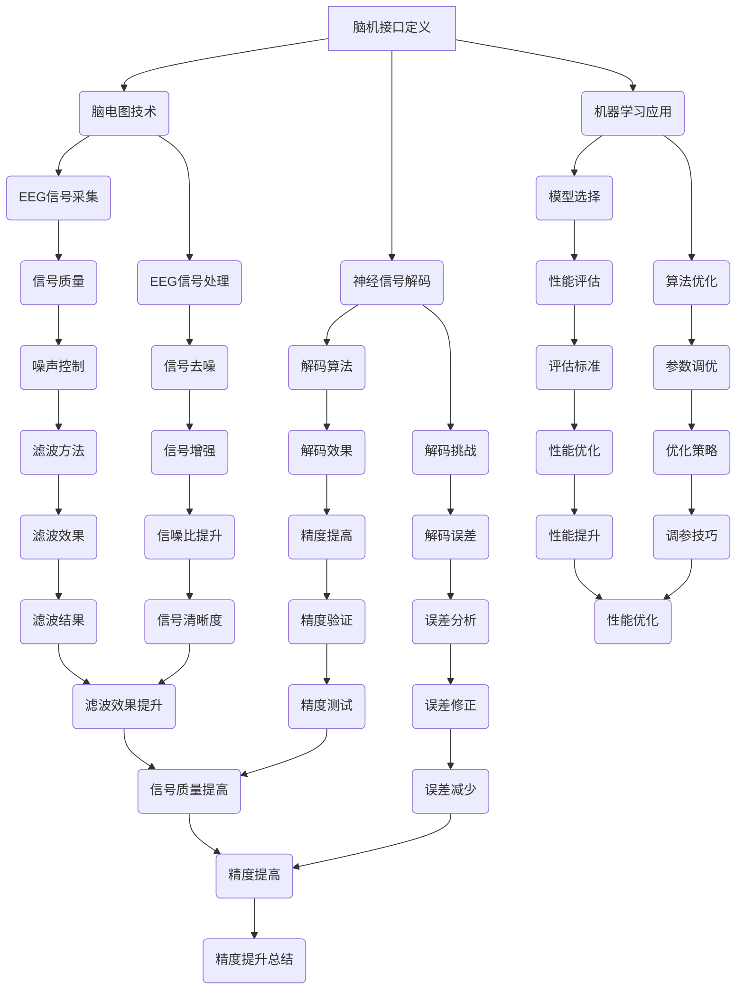

                 

### 《脑机接口创业：思维控制的科技革命》引言

在人工智能和神经科学的双重驱动下，脑机接口（Brain-Computer Interface，BCI）技术正逐渐从实验室走向现实，为人类带来前所未有的思维控制体验。脑机接口是一种直接连接人脑与外部设备的技术，通过捕捉和分析大脑活动，实现与外部世界的交互。随着神经信号解码技术的发展和计算能力的提升，脑机接口的应用场景日益丰富，从医疗康复到教育游戏，从智能控制到虚拟现实，无不展现出巨大的潜力。

本文旨在探讨脑机接口创业这一前沿领域，分析其技术原理、应用案例以及创业机会与挑战。我们将通过以下步骤进行深入探讨：

1. **脑机接口基础**：首先介绍脑机接口的定义、历史、工作原理和分类，并探讨其发展趋势。
2. **脑机接口技术原理**：详细讲解脑电图（EEG）技术、神经信号解码、机器学习在脑机接口中的应用以及脑机接口的性能评估。
3. **脑机接口应用案例**：分析脑机接口在医疗、教育与游戏等领域的实际应用，探讨其社会影响。
4. **脑机接口创业**：探讨脑机接口创业的现状、模式、商业模式、案例以及未来展望。
5. **项目实战**：通过实际项目案例，展示脑机接口开发环境搭建和代码实现，并进行详细解读和分析。

通过以上步骤，我们将全面解析脑机接口技术，探讨其商业应用前景，为创业者、研究人员和关注科技发展的人们提供有价值的参考。在思维控制的科技革命中，脑机接口正引领我们迈向一个全新的未来。接下来，让我们一步一步深入探讨脑机接口的核心概念与架构。<!-- MarkdownTOHTML -->

---

### 《脑机接口创业：思维控制的科技革命》关键词

- **脑机接口（Brain-Computer Interface）**
- **神经信号解码（Neural Signal Decoding）**
- **机器学习（Machine Learning）**
- **医疗康复（Medical Rehabilitation）**
- **教育游戏（Educational Gaming）**
- **虚拟现实（Virtual Reality）**
- **智能控制（Smart Control）**
- **创业模式（Business Models）**
- **商业模式（Business Models）**
- **市场趋势（Market Trends）**
- **技术创新（Technological Innovation）**
- **社会影响（Social Impact）**

---

### 《脑机接口创业：思维控制的科技革命》摘要

脑机接口（BCI）技术正在引发一场科技革命，通过直接连接人脑与外部设备，实现思维控制。本文从脑机接口的基础知识出发，详细阐述了其工作原理、技术框架、应用场景和发展趋势。随后，本文深入探讨了机器学习在脑机接口中的应用，分析了神经信号解码算法的原理与实现。接着，本文通过医疗康复、教育与游戏等实际案例，展示了脑机接口技术在各个领域的应用潜力及其社会影响。在第三部分，本文转向脑机接口创业，探讨了当前创业的现状、模式、商业模式以及面临的挑战和机遇。最后，通过一个实际项目案例，本文展示了脑机接口开发环境搭建和代码实现的全过程，并进行了详细解读和分析。本文旨在为创业者、研究人员和关注科技发展的人们提供全面、深入的脑机接口技术与应用指南。<!-- MarkdownTOHTML -->

---

### 《脑机接口创业：思维控制的科技革命》目录大纲

#### 第一部分：脑机接口基础

##### 第1章：脑机接口概述

- **1.1 脑机接口的定义与历史**
  - 脑机接口的基本概念
  - 脑机接口的发展历程

- **1.2 脑机接口的工作原理**
  - 脑电波与神经信号
  - 脑机接口的技术框架

- **1.3 脑机接口的分类**
  - 非侵入式与侵入式脑机接口
  - 脑机接口的应用场景

- **1.4 脑机接口的发展趋势**
  - 当前技术进展
  - 未来发展方向

##### 第2章：脑机接口技术原理

- **2.1 脑电图（EEG）技术**
  - 脑电图的原理与应用
  - EEG信号的采集与处理

- **2.2 神经信号解码**
  - 神经信号解码的基本原理
  - 神经信号解码的挑战与解决方案

- **2.3 机器学习在脑机接口中的应用**
  - 机器学习模型的选择
  - 机器学习算法的优化与调参

- **2.4 脑机接口的性能评估**
  - 性能评估指标与方法
  - 性能优化的策略与案例

#### 第二部分：脑机接口应用案例

##### 第3章：医疗领域的脑机接口应用

- **3.1 偏瘫康复**
  - 康复治疗的基本原理
  - 偏瘫康复的脑机接口解决方案

- **3.2 睡眠监测**
  - 睡眠质量的评估
  - 睡眠监测的脑机接口技术

- **3.3 精神疾病辅助治疗**
  - 精神疾病的基本概念
  - 脑机接口在精神疾病治疗中的应用

##### 第4章：教育与游戏领域的脑机接口应用

- **4.1 学习辅助**
  - 学习过程的脑机接口监测
  - 学习策略的个性化调整

- **4.2 游戏互动**
  - 游戏场景中的脑机接口应用
  - 游戏体验的增强与优化

- **4.3 脑机接口与虚拟现实**
  - 虚拟现实中的脑机接口交互
  - 脑机接口在VR中的应用挑战与解决方案

#### 第三部分：脑机接口创业

##### 第5章：脑机接口创业概述

- **5.1 脑机接口创业的现状**
  - 脑机接口市场的规模与趋势
  - 创业者面临的挑战与机遇

- **5.2 脑机接口创业的模式**
  - 从技术研发到产品化
  - 创业团队的组织与管理

- **5.3 脑机接口创业的商业模式**
  - 资金筹集策略
  - 收入来源与盈利模式

##### 第6章：脑机接口创业案例

- **6.1 现有脑机接口企业案例分析**
  - 成功企业的商业模式
  - 创业者经验分享

- **6.2 新兴脑机接口创业公司案例**
  - 新兴企业的创新点与市场前景
  - 创业团队的市场定位与竞争策略

- **6.3 脑机接口创业的法律法规与伦理问题**
  - 法律法规的遵循
  - 伦理问题的处理与防范

##### 第7章：脑机接口创业的未来

- **7.1 脑机接口创业的展望**
  - 技术进步与市场发展
  - 未来应用场景的预测

- **7.2 脑机接口创业的风险与对策**
  - 风险识别与评估
  - 应对策略与风险管理

- **7.3 脑机接口创业的社会影响**
  - 对个人与社会的影响
  - 社会责任与可持续发展

#### 附录

- **附录A：脑机接口技术资料与资源**

  - **A.1 脑机接口研究机构与学术期刊**
    - 国际知名脑机接口研究机构介绍
    - 脑机接口领域的权威学术期刊推荐

  - **A.2 开源脑机接口工具与平台**
    - 主流开源脑机接口工具与平台
    - 使用指南与社区支持

  - **A.3 脑机接口相关书籍与文献**
    - 推荐脑机接口专业书籍
    - 最新研究论文与报告**

---

### 第一部分：脑机接口基础

脑机接口（Brain-Computer Interface，BCI）是一种直接连接人脑与外部设备的技术，通过捕捉和分析大脑活动，实现与外部环境的交互。脑机接口技术不仅代表着神经科学与计算技术的融合，更是开启人类思维控制新时代的关键技术。本部分将详细探讨脑机接口的定义、历史、工作原理、分类及发展趋势。

#### 第1章：脑机接口概述

##### 1.1 脑机接口的定义与历史

脑机接口（BCI）是一种直接将人脑活动转换为机器可识别和处理的信号的技术。最初的概念可以追溯到20世纪60年代，当时科学家们开始尝试使用电刺激来控制外部设备。随着神经科学与计算机技术的进步，脑机接口的概念逐渐成熟。

- **定义**：脑机接口是一种能够直接读取和解释大脑活动的技术，并通过这些信息来控制外部设备或环境。

- **历史**：脑机接口技术的发展历程可以分为几个重要阶段：

  - **第一阶段（1960s-1970s）**：早期的脑机接口主要基于电刺激，科学家们通过直接在大脑中植入电极来刺激神经，以控制外部设备。

  - **第二阶段（1980s-1990s）**：随着微电子技术和计算机科学的进步，非侵入式的脑机接口技术开始兴起。这一阶段的主要突破是脑电图的开发和应用，通过记录大脑表面的电活动来实现与外部设备的交互。

  - **第三阶段（2000s至今）**：这一阶段脑机接口技术取得了重大突破，特别是在神经信号解码和机器学习算法的应用方面。侵入式和非侵入式脑机接口技术均取得了显著进展，应用领域也从实验室逐步走向实际。

##### 1.2 脑机接口的工作原理

脑机接口的工作原理主要包括信号的捕捉、处理和解码。具体步骤如下：

- **信号捕捉**：脑机接口通过电极或传感器来捕捉大脑活动产生的电信号，如脑电图（EEG）、功能性磁共振成像（fMRI）和近红外光谱成像（fNIRS）等。

- **信号处理**：捕捉到的原始信号通常含有噪声和干扰，需要通过滤波、去噪和特征提取等步骤进行处理，以提高信号质量。

- **信号解码**：处理后的信号通过机器学习算法进行解码，将神经信号转换为可操作的指令或数据。

- **外部设备控制**：解码后的指令或数据被发送到外部设备，如计算机、机器人或辅助设备，实现与外部环境的交互。

##### 1.3 脑机接口的分类

脑机接口根据其侵入性可以分为侵入式和非侵入式两大类：

- **非侵入式脑机接口**：这种类型的脑机接口不直接植入大脑，而是通过外部传感器捕捉大脑表面的电信号。非侵入式脑机接口因其安全性高、易用性强而广泛应用于各种场景，如医疗康复、教育游戏和虚拟现实等。

- **侵入式脑机接口**：侵入式脑机接口通过在大脑中植入电极来直接捕捉神经活动。这类脑机接口的信号质量通常更高，但侵入性操作增加了手术风险和恢复时间。侵入式脑机接口主要用于严重残疾患者和神经疾病的治疗。

##### 1.4 脑机接口的发展趋势

脑机接口技术正在快速发展，以下是几个值得关注的发展趋势：

- **技术进步**：随着神经科学和计算技术的发展，脑机接口的信号捕捉和处理技术不断改进，解码精度和可靠性显著提高。

- **应用拓展**：脑机接口的应用领域不断拓展，从传统的医疗康复扩展到教育、游戏、智能控制等多个领域。

- **商业机会**：脑机接口技术的商业应用潜力巨大，吸引了大量创业公司和投资者的关注。随着技术的成熟，预计将有更多的商业产品和服务问世。

- **伦理和法规**：随着脑机接口技术的普及，伦理和法规问题也日益凸显。如何保护个人隐私、确保技术安全和合法使用成为亟待解决的问题。

通过以上对脑机接口基础知识的介绍，我们可以看到脑机接口技术正经历着快速的发展，其应用前景广阔。接下来，我们将深入探讨脑机接口的技术原理，分析其具体实现和应用。<!-- MarkdownTOHTML -->

---

### 第一部分：脑机接口基础

#### 第2章：脑机接口技术原理

脑机接口技术的核心在于如何精确捕捉、处理和解析大脑信号，从而实现对外部设备的控制。在这一章中，我们将详细探讨脑电图（EEG）技术、神经信号解码的基本原理、机器学习在脑机接口中的应用，以及如何对脑机接口的性能进行评估。

##### 2.1 脑电图（EEG）技术

脑电图（Electroencephalography，EEG）是一种非侵入式的脑机接口技术，通过记录大脑表面电活动来获取脑信号。EEG技术在脑机接口中的应用非常广泛，其基本原理和流程如下：

- **原理**：EEG记录的是大脑皮层神经元群产生的电活动，这些电信号通过头皮上的电极捕捉。每个电极捕获的信号经过放大和处理后，被记录下来，形成EEG波形。

- **设备**：EEG设备主要包括电极、放大器、记录器和分析软件。电极可以是贴在头皮上的湿性电极，也可以是固态或柔性电极。放大器用于放大微弱的脑电信号，记录器则用于捕捉和存储这些信号。

- **信号采集**：在采集脑电信号时，通常会使用多个电极布置在头部特定的位置，以获得更全面的脑电活动信息。采集到的原始信号可能包含噪声和干扰，因此需要经过滤波和去噪处理。

- **信号处理**：处理EEG信号的主要步骤包括滤波、去噪、特征提取和参数化表示。滤波的目的是去除噪声和干扰信号，而去噪则是进一步净化信号，使其更接近真实的脑电信号。特征提取是将原始信号转换为可分析的参数或特征向量，常见的特征包括时间域特征、频率域特征和空间分布特征。

##### 2.2 神经信号解码

神经信号解码是脑机接口技术的关键环节，其目标是利用捕获的脑电信号来推断用户的意图或状态。解码的基本原理和流程如下：

- **原理**：神经信号解码通过分析脑电信号中的特定模式或特征，来识别用户的意图或状态。这些模式或特征可能是与特定思维活动相关的电活动变化，也可能是与特定运动或行为相关的电活动变化。

- **流程**：神经信号解码的一般流程包括以下几个步骤：

  - **数据预处理**：对捕获的脑电信号进行滤波、去噪和归一化处理，以提高信号质量。

  - **特征提取**：从预处理后的信号中提取出有助于解码的特征，如时间域特征（如平均绝对值、标准差等）和频率域特征（如功率谱密度、时频分布等）。

  - **模式识别**：利用机器学习算法或统计模型对提取的特征进行模式识别，以确定用户的意图或状态。

  - **解码结果验证**：通过实验或临床试验来验证解码结果的准确性和可靠性，并进行必要的调优。

- **挑战**：神经信号解码面临许多挑战，包括信号噪声、信号多样性、解码算法的鲁棒性等。此外，不同个体之间的脑电信号特征差异较大，使得解码算法需要针对不同用户进行个性化调优。

##### 2.3 机器学习在脑机接口中的应用

机器学习技术在脑机接口中的应用极大地提升了解码的准确性和效率。以下是一些常用的机器学习模型和算法：

- **监督学习模型**：监督学习模型通过使用标记的数据集来训练模型，然后利用训练好的模型进行解码。常见的监督学习模型包括支持向量机（SVM）、决策树、随机森林、神经网络等。

- **无监督学习模型**：无监督学习模型不需要标记数据集，通过探索数据内在的结构来发现特征。常见的无监督学习模型包括主成分分析（PCA）、自编码器（Autoencoder）和聚类算法等。

- **混合学习模型**：混合学习模型结合了监督学习和无监督学习的优点，通过在不同阶段应用不同的学习策略来优化解码性能。

- **深度学习模型**：深度学习模型，特别是神经网络，在脑机接口解码中表现出色。常见的深度学习模型包括卷积神经网络（CNN）、循环神经网络（RNN）和生成对抗网络（GAN）等。

##### 2.4 脑机接口的性能评估

脑机接口的性能评估是确保其应用效果和可靠性的关键步骤。以下是常用的性能评估指标和方法：

- **准确率**：准确率是评估解码算法最常用的指标，表示正确解码的百分比。

- **灵敏度与特异性**：灵敏度（Sensitivity）和特异性（Specificity）分别表示算法对正类和负类的检测能力。

- **受试者操作特性曲线（ROC曲线）**：ROC曲线通过绘制灵敏度与特异性之间的关系，来评估解码算法的整体性能。

- **信息增益**：信息增益用于评估特征提取和模式识别的效果，表示特征对分类的贡献。

- **鲁棒性测试**：通过模拟不同的噪声和干扰条件，来评估解码算法在不同环境下的性能。

- **用户满意度**：用户满意度是评估脑机接口应用效果的重要指标，通常通过问卷调查和用户实验来收集数据。

通过以上对脑机接口技术原理的详细探讨，我们可以看到脑机接口技术从信号捕捉到解码再到性能评估，每个环节都涉及到复杂的技术和方法。随着技术的不断进步，脑机接口的性能将得到进一步提升，其应用范围也将不断拓展。在接下来的章节中，我们将分析脑机接口在医疗、教育与游戏等领域的具体应用案例，进一步探讨其潜在的影响和社会价值。<!-- MarkdownTOHTML -->

---

### 第一部分：脑机接口基础

#### 第3章：医疗领域的脑机接口应用

脑机接口技术在医疗领域的应用前景广阔，尤其在康复治疗、睡眠监测和精神疾病辅助治疗等方面展现出了巨大的潜力。通过脑机接口，患者能够更有效地进行康复训练，提高生活质量，同时也为医疗专业人员提供了更精确的监测工具。

##### 3.1 偏瘫康复

偏瘫（Hemiplegia）是指由于大脑损伤或中风等原因导致的肢体瘫痪。脑机接口技术在偏瘫康复中的应用主要通过电刺激和功能性训练来实现。

- **基本原理**：脑机接口通过捕捉患者的大脑信号，识别出与特定运动相关的神经活动模式，然后将这些信号转换为电刺激信号，通过植入电极直接刺激瘫痪肌肉或神经，从而帮助患者恢复运动功能。

- **应用案例**：一个典型的案例是脑机接口与机器人辅助系统的结合。患者通过脑机接口控制机器人，进行上肢康复训练。该系统不仅可以模拟各种日常活动，如抓取物品和移动手臂，还能根据患者的表现调整训练难度，实现个性化康复。

- **挑战**：尽管脑机接口技术在偏瘫康复中取得了一定的成果，但仍然面临一些挑战，包括信号解码的准确性、设备的侵入性和患者的适应性。如何提高解码精度和减少对患者的影响是未来研究的重要方向。

##### 3.2 睡眠监测

睡眠监测是脑机接口技术在医疗领域的另一个重要应用。通过脑机接口技术，可以实时监测患者的睡眠质量，早期发现潜在的健康问题。

- **基本原理**：脑机接口通过捕捉脑电图（EEG）信号，分析睡眠周期和睡眠质量。EEG信号能够反映大脑的活动状态，从而推断出患者的睡眠阶段（如浅睡眠、深睡眠和快速眼动睡眠）。

- **应用案例**：一个实际应用是使用脑机接口开发的智能睡眠监测设备。该设备可以在患者睡眠期间实时监测脑电信号，并通过手机应用程序提供睡眠数据分析，帮助用户了解自己的睡眠状况，并进行相应的调整。

- **挑战**：睡眠监测中的主要挑战在于如何准确区分不同睡眠阶段，以及如何在复杂的背景噪声中捕捉到准确的脑电信号。此外，患者的个体差异也使得设备需要具备一定的自适应能力。

##### 3.3 精神疾病辅助治疗

脑机接口技术在精神疾病辅助治疗中的应用越来越受到关注，例如抑郁症、焦虑症和注意力缺陷多动障碍（ADHD）等。

- **基本原理**：脑机接口通过监测患者的脑电信号，识别出与特定情绪状态或认知功能相关的神经活动模式。这些信号可以帮助医生更好地了解患者的病情，制定个性化的治疗方案。

- **应用案例**：例如，脑机接口技术可以与脑刺激技术（如经颅磁刺激TMS和电刺激ES）结合使用，通过实时监测患者的脑电信号，调整刺激参数，提高治疗效果。

- **挑战**：精神疾病复杂且多样化，脑机接口技术需要具备高度的个体化适应性，以应对不同患者的不同症状。此外，如何确保脑机接口监测结果的可靠性和安全性也是重要的挑战。

##### 3.4 社会影响

脑机接口技术在医疗领域的应用对社会产生了深远的影响：

- **提高治疗效果**：脑机接口技术提供了更精准的监测工具，帮助医生制定更有效的治疗方案，提高患者的治疗效果和生活质量。

- **减轻医疗负担**：脑机接口技术可以在家中使用，减轻患者对医疗资源的依赖，降低医疗成本。

- **促进科技创新**：脑机接口技术的研发和推广推动了神经科学与计算机技术的进步，为相关领域的研究提供了新的思路和工具。

然而，脑机接口技术在医疗领域的应用也带来了一些伦理和隐私问题，如数据的安全性和隐私保护。因此，在推广脑机接口技术的同时，需要充分考虑这些社会影响，确保技术的合法和道德使用。

通过以上对医疗领域脑机接口应用的探讨，我们可以看到脑机接口技术在改善患者生活质量和促进医疗科技创新方面具有巨大的潜力。在下一部分，我们将继续探讨脑机接口在教育、游戏等领域的应用，进一步展示其广泛的适用性和创新性。<!-- MarkdownTOHTML -->

---

### 第一部分：脑机接口基础

#### 第4章：教育与游戏领域的脑机接口应用

脑机接口技术在教育、游戏等领域的应用正日益受到关注，不仅为教育提供了创新的教学手段，也为游戏带来了全新的互动体验。以下将分别介绍脑机接口在教育和游戏领域的具体应用。

##### 4.1 学习辅助

脑机接口技术在教育领域的一个主要应用是学习辅助，通过实时监测学生的学习状态，提供个性化的学习反馈和调整策略。

- **基本原理**：脑机接口通过捕捉学生的脑电信号，分析其学习过程中的注意力水平、认知负荷和情绪状态等。这些数据可以用于评估学生的学习效果，并根据实时反馈调整教学策略。

- **应用案例**：例如，一些智能学习平台已经集成脑机接口技术，通过分析学生的脑电信号，为教师提供关于学生专注程度和认知状态的实时反馈。教师可以根据这些信息调整教学内容和方式，提高教学效果。

- **挑战**：脑机接口在学习辅助中的应用面临一些挑战，包括信号解码的准确性、用户隐私保护和数据安全性。如何确保脑机接口监测结果的可靠性和避免侵犯用户隐私是需要解决的问题。

##### 4.2 游戏互动

脑机接口技术在游戏领域的应用为游戏互动带来了革命性的变化，通过脑电信号控制游戏中的角色或操作，提供了更加沉浸和个性化的游戏体验。

- **基本原理**：脑机接口通过捕捉玩家的脑电信号，将其转换为游戏操作指令。例如，玩家可以通过脑电信号控制角色的移动、攻击和跳跃等动作。

- **应用案例**：例如，一些游戏已经实现了脑电信号控制，玩家只需通过思考就能在游戏中执行各种动作。这种控制方式不仅增加了游戏的趣味性，还提供了新的挑战和体验。

- **挑战**：脑机接口在游戏中的应用面临信号噪声、操作响应速度和用户体验等挑战。如何提高信号解码的准确性和响应速度，以及确保游戏的易用性和可访问性，是未来研究的重要方向。

##### 4.3 脑机接口与虚拟现实（VR）

脑机接口与虚拟现实（VR）的结合为用户提供了一种全新的互动方式，通过脑电信号控制虚拟环境中的角色和场景，提供了高度沉浸的体验。

- **基本原理**：脑机接口通过捕捉玩家的脑电信号，将其转换为虚拟现实环境中的交互指令。玩家可以通过思维来控制虚拟环境中的物体和角色，实现与虚拟世界的实时互动。

- **应用案例**：例如，一些虚拟现实游戏已经实现了脑电信号控制，玩家只需通过脑电信号就能在虚拟环境中进行各种操作，如射击、跳跃和探索等。

- **挑战**：脑机接口与VR的结合面临信号解码的实时性、环境噪声干扰和虚拟现实体验的优化等挑战。如何确保脑电信号的实时解码和响应，以及如何优化虚拟现实体验，是未来研究的重要方向。

##### 4.4 社会影响

脑机接口技术在教育和游戏领域的应用对社会产生了积极的影响：

- **提高教育效果**：脑机接口技术提供了个性化的学习辅助，帮助教师更好地了解学生的需求，提高教学效果。

- **创新游戏体验**：脑机接口技术为游戏提供了新的互动方式，丰富了游戏玩法，提升了用户的游戏体验。

- **推动科技创新**：脑机接口技术的研发和应用推动了神经科学与计算机技术、虚拟现实技术的融合和发展。

然而，脑机接口技术在教育和游戏领域的应用也带来了一些伦理和隐私问题，如数据安全性和隐私保护。因此，在推广脑机接口技术的同时，需要充分考虑这些社会影响，确保技术的合法和道德使用。

通过以上对教育和游戏领域脑机接口应用的探讨，我们可以看到脑机接口技术在这些领域的广泛应用和巨大潜力。在下一部分，我们将深入探讨脑机接口创业的现状、模式、商业模式以及面临的挑战和机遇。<!-- MarkdownTOHTML -->

---

### 第一部分：脑机接口基础

#### 第5章：脑机接口创业概述

脑机接口技术正逐渐从学术研究走向商业应用，吸引了大量创业者和投资者的关注。本章节将分析脑机接口创业的现状、模式、商业模式以及创业者面临的挑战和机遇。

##### 5.1 脑机接口创业的现状

脑机接口创业市场的现状呈现出以下几个特点：

- **市场增长**：随着技术的成熟和应用的拓展，脑机接口市场正在快速增长。据市场研究公司的数据，全球脑机接口市场规模预计将在未来几年内持续扩大。

- **投资增加**：脑机接口技术吸引了众多投资者的关注，风险投资和政府资助不断涌入。这些投资促进了脑机接口技术的研发和应用，推动了市场的快速发展。

- **创业活跃**：越来越多的创业公司开始涉足脑机接口领域，涵盖了从硬件设备研发到软件平台开发等多个方面。这些创业公司通过技术创新和商业模式的探索，为脑机接口技术的商业化应用提供了新的思路。

##### 5.2 脑机接口创业的模式

脑机接口创业公司的商业模式多种多样，以下是几种常见的模式：

- **硬件设备研发**：创业公司通过研发高性能、便携的脑机接口设备，如脑电图（EEG）头戴设备、脑电信号采集装置等，将技术转化为实际产品。

- **软件平台开发**：创业公司开发脑机接口软件平台，提供信号处理、解码和数据分析等工具，为开发者提供一站式的解决方案。

- **应用解决方案**：创业公司专注于特定应用场景，如医疗康复、教育辅助、游戏互动等，提供定制化的脑机接口解决方案。

- **服务提供商**：创业公司提供脑机接口相关服务，如咨询服务、培训课程、系统集成等，帮助客户更好地应用脑机接口技术。

##### 5.3 脑机接口创业的商业模式

脑机接口创业公司的商业模式主要包括以下几个方面：

- **产品销售**：通过直接销售脑机接口设备和软件平台获取收入。

- **技术服务**：提供定制化的技术解决方案和咨询服务，根据服务内容和客户需求收费。

- **合作开发**：与科研机构、医疗机构、游戏公司等合作，共同研发和应用脑机接口技术。

- **授权许可**：将自主研发的技术授权给其他公司使用，获取授权费用。

- **订阅模式**：提供基于云的脑机接口服务，通过订阅模式收取服务费用。

##### 5.4 创业者面临的挑战与机遇

脑机接口创业者在发展过程中面临以下挑战和机遇：

- **技术挑战**：脑机接口技术涉及多个学科领域，如神经科学、电子工程、计算机科学等。创业者需要具备跨学科的知识和技能，以应对技术挑战。

- **市场开拓**：脑机接口市场相对较小，创业者需要投入大量精力进行市场开拓和推广，以吸引客户和用户。

- **法规和伦理**：脑机接口技术的应用涉及隐私、安全和伦理等问题，创业者需要遵循相关法规和伦理标准，确保技术的合法和道德使用。

- **资金支持**：脑机接口技术需要较高的研发投入，创业者需要寻找合适的资金来源，以支持技术研究和产品开发。

- **用户反馈**：创业者需要密切关注用户反馈，不断优化产品和服务，以满足市场需求和用户期望。

然而，脑机接口创业也带来了巨大的机遇：

- **市场需求**：随着人们对健康和生活质量的追求，脑机接口技术的市场需求持续增长，为创业者提供了广阔的市场空间。

- **技术进步**：脑机接口技术的快速发展为创业者提供了创新的机遇，通过技术创新可以开拓新的应用领域和市场。

- **社会影响**：脑机接口技术的应用将对社会产生深远的影响，如提高康复治疗效果、改善教育质量和创新娱乐体验等，创业者有机会为社会带来积极变革。

通过以上对脑机接口创业的概述，我们可以看到脑机接口创业市场的巨大潜力和发展前景。在下一部分，我们将通过具体案例深入探讨脑机接口创业的实践，分析成功企业的商业模式和创业者经验。<!-- MarkdownTOHTML -->

---

### 第一部分：脑机接口基础

#### 第6章：脑机接口创业案例

脑机接口创业领域已经涌现出一些成功的案例，这些公司不仅展示了脑机接口技术的实际应用，还提供了宝贵的创业经验和市场策略。以下将介绍几个典型脑机接口创业公司的案例，并分析其商业模式和市场定位。

##### 6.1 现有脑机接口企业案例分析

**1. Neuralink**

- **企业简介**：Neuralink是一家由伊隆·马斯克创立的脑机接口公司，致力于开发高带宽的脑机接口技术，以实现人机融合。

- **商业模式**：Neuralink的商业模式主要包括硬件设备和软件平台。公司研发了一种名为“神经贴片”的植入设备，可以直接植入大脑，与大脑神经元进行高带宽通信。此外，Neuralink还开发了相应的软件平台，用于信号处理和交互控制。

- **市场定位**：Neuralink的市场定位主要集中在医疗领域，特别是神经疾病的治疗和康复。公司计划通过改善大脑与外部设备的通信，帮助患者恢复身体机能和认知能力。

- **创业经验**：Neuralink的成功得益于其强大的研发能力和跨学科合作。公司通过持续的技术创新，不断提高脑机接口的性能和可靠性。此外，Neuralink注重与医疗机构和科研机构的合作，以推动技术的临床应用和产业化。

**2. BrainCo**

- **企业简介**：BrainCo是一家中国脑机接口公司，专注于开发非侵入式脑机接口技术，应用于教育、康复和游戏等领域。

- **商业模式**：BrainCo的商业模式主要通过销售脑机接口设备和提供相关服务来实现。公司开发了多种脑机接口产品，如脑电头戴设备、脑机接口手柄等，用于教育、康复和游戏等不同场景。

- **市场定位**：BrainCo的市场定位较为广泛，涵盖了教育、康复和游戏等多个领域。公司通过提供定制化的解决方案，满足不同用户的需求。

- **创业经验**：BrainCo的成功在于其产品的高性价比和用户友好性。公司注重用户体验，不断优化产品设计和功能。此外，BrainCo还积极参与市场推广和用户教育，以提高品牌知名度和用户认可度。

##### 6.2 新兴脑机接口创业公司案例

**1. Nectome**

- **企业简介**：Nectome是一家新兴的脑机接口公司，致力于开发能够实现大脑数据备份和恢复的技术。

- **商业模式**：Nectome的商业模式主要基于提供大脑数据备份和恢复服务。公司研发了一种名为“大脑打印”的技术，可以将大脑活动以数字形式保存，并在未来实现恢复。

- **市场定位**：Nectome的市场定位主要集中在医疗和科研领域。公司计划通过大脑数据备份和恢复技术，为医学研究和个性化治疗提供新的手段。

- **创业经验**：Nectome的成功在于其独特的技术创新和市场定位。公司通过结合神经科学和计算技术，开发出具有前瞻性的大脑数据备份技术。此外，Nectome注重与科研机构和医疗机构的合作，以推动技术的临床应用和研究。

**2. MindMeld**

- **企业简介**：MindMeld是一家专注于脑机接口游戏开发的创业公司，通过脑电信号控制游戏互动，提供沉浸式游戏体验。

- **商业模式**：MindMeld的商业模式主要通过游戏销售和授权来实现收入。公司开发了多款基于脑电信号控制的沉浸式游戏，通过线上和线下渠道进行销售和推广。

- **市场定位**：MindMeld的市场定位主要在游戏娱乐领域，特别是针对追求创新和沉浸式体验的玩家。公司通过不断优化游戏设计和脑机接口技术，提升用户的游戏体验。

- **创业经验**：MindMeld的成功在于其对用户体验的高度重视。公司通过深度研究脑电信号控制和游戏设计，提供独特和吸引人的游戏体验。此外，MindMeld还积极参与游戏社区和玩家互动，以获取用户反馈和提升品牌影响力。

通过以上对脑机接口创业公司的案例分析，我们可以看到不同公司在商业模式、市场定位和创业经验上的多样性。这些成功案例为其他创业者提供了宝贵的参考和启示，同时也展示了脑机接口技术在不同领域的广泛应用和巨大潜力。在下一部分，我们将探讨脑机接口创业的法律法规和伦理问题，分析其对社会的影响和责任。<!-- MarkdownTOHTML -->

---

### 第一部分：脑机接口基础

#### 第7章：脑机接口创业的法律法规与伦理问题

随着脑机接口技术的快速发展，其应用场景日益丰富，涉及的法律、伦理和社会责任问题也日益凸显。在本章节中，我们将探讨脑机接口创业所面临的法律法规和伦理问题，分析其对个人和社会的影响，并探讨创业公司在这些方面的责任。

##### 7.1 法律法规

脑机接口技术的应用涉及多个领域，如医疗、教育、娱乐和科研等，因此相关的法律法规也较为复杂。以下是一些关键的法律问题：

- **隐私保护**：脑机接口技术涉及到个人脑电信号的捕捉和处理，这可能导致用户的隐私泄露。因此，确保用户隐私保护是脑机接口创业公司的重要任务。一些国家和地区已经制定了相关法律法规，如《通用数据保护条例》（GDPR）和《加州消费者隐私法案》（CCPA），对数据采集、存储和使用进行了严格的规定。

- **数据安全**：脑机接口技术处理的数据具有高度敏感性，因此数据安全至关重要。创业公司需要采取有效的数据安全措施，如加密存储、访问控制和数据备份，以防止数据泄露和滥用。

- **知情同意**：脑机接口技术往往应用于临床试验和商业产品中，因此需要获得用户的知情同意。知情同意不仅包括用户对数据采集和使用的同意，还应包括对产品功能和隐私政策的了解。

- **产品认证**：脑机接口产品在上市前需要通过相关认证，以确保其安全性和有效性。例如，美国的食品药品监督管理局（FDA）和欧盟的CE认证是脑机接口产品进入市场的重要门槛。

##### 7.2 伦理问题

脑机接口技术的应用不仅涉及法律问题，还涉及一系列伦理问题，包括人类尊严、平等和隐私等。以下是一些主要的伦理问题：

- **人类尊严**：脑机接口技术可能会改变人类的基本特征和行为方式，引发关于人类尊严和自我认同的讨论。例如，通过脑机接口实现人类记忆的增强或消逝，可能对个体的尊严产生深远影响。

- **人类平等**：脑机接口技术的普及可能会加剧社会不平等。例如，只有富裕人群能够负担昂贵的脑机接口设备和高端服务，而低收入人群可能被排除在外，导致新的社会分层。

- **隐私**：脑机接口技术捕捉和处理用户的脑电信号，可能涉及隐私侵犯问题。如何确保用户的隐私不受侵犯，是脑机接口创业公司需要认真对待的伦理问题。

- **自主性**：脑机接口技术可能会影响个体的自主决策能力，特别是在医疗和军事等领域。如何确保用户在脑机接口技术辅助下的自主性，是一个重要的伦理挑战。

##### 7.3 社会影响

脑机接口技术的广泛应用将对社会产生深远的影响，包括正面和负面两个方面：

- **正面影响**：脑机接口技术有助于提高医疗康复效果、改善教育质量和创新娱乐体验，从而提升人们的生活质量和幸福感。此外，脑机接口技术还推动了神经科学和计算机技术的进步，促进了科技创新。

- **负面影响**：脑机接口技术可能加剧社会不平等，侵犯个人隐私，影响人类尊严和自主性。此外，脑机接口技术的滥用可能带来安全风险，如黑客攻击和数据泄露等。

##### 7.4 创业公司的社会责任

脑机接口创业公司在发展过程中需要承担一定的社会责任，以确保技术的合法和道德使用。以下是一些建议：

- **遵守法律法规**：创业公司应严格遵守相关法律法规，确保数据安全和隐私保护。

- **伦理审查**：在产品开发和商业化过程中，创业公司应进行伦理审查，确保技术应用符合伦理标准。

- **透明度**：创业公司应向用户透明地介绍产品的功能和隐私政策，确保用户的知情权和选择权。

- **社会参与**：创业公司应积极参与社会讨论，与政策制定者、学术界和公众合作，共同推动脑机接口技术的健康发展和合理应用。

通过以上对脑机接口创业的法律法规和伦理问题的探讨，我们可以看到脑机接口技术在社会中的复杂性和重要性。创业公司在发展脑机接口技术时，需要充分考虑这些法律和伦理问题，确保技术的合法、安全和道德使用，以实现技术的最大社会价值。在下一部分，我们将展望脑机接口创业的未来发展，探讨技术进步、市场趋势和未来应用场景。<!-- MarkdownTOHTML -->

---

### 第一部分：脑机接口基础

#### 第8章：脑机接口创业的未来

脑机接口技术正处于快速发展阶段，其潜在应用场景和市场前景广阔。本章节将展望脑机接口创业的未来，探讨技术进步、市场趋势和未来应用场景，并分析脑机接口创业面临的风险与对策。

##### 8.1 技术进步

脑机接口技术的进步将主要依赖于以下几个方面的创新：

- **信号捕捉和处理**：随着传感器技术和计算能力的提升，脑机接口设备将能够更精确地捕捉和解析脑信号，提高解码的准确性和实时性。

- **解码算法**：深度学习、生成对抗网络（GAN）等先进算法的引入，将进一步提高脑机接口的解码性能，使其能够适应更复杂的信号模式和多种应用场景。

- **非侵入式技术**：随着非侵入式脑机接口技术的不断改进，如柔性电极、脑电图（EEG）头戴设备等，脑机接口设备将更加便携、舒适，降低用户的接受门槛。

- **多模态融合**：脑机接口技术将与其他生物信号（如肌电信号、眼动信号等）和传感器（如虚拟现实头戴设备、增强现实眼镜等）相结合，提供更全面和丰富的交互体验。

##### 8.2 市场趋势

脑机接口市场的未来发展将受到以下几个趋势的影响：

- **医疗康复**：脑机接口技术在康复治疗领域的应用将不断拓展，如中风康复、偏瘫康复和慢性疼痛管理等。随着技术的成熟和成本的降低，脑机接口设备将成为康复治疗的重要工具。

- **教育与游戏**：脑机接口技术在教育和游戏领域的应用也将逐渐普及，如个性化学习辅助、注意力训练和沉浸式游戏等。这些应用将提升用户的学习兴趣和游戏体验，推动市场需求的增长。

- **智能控制**：脑机接口技术在智能控制领域的应用前景广阔，如智能家居控制、自动驾驶汽车和工业自动化等。脑机接口技术将提供更自然、直观的控制方式，提高系统的智能化水平。

- **科研与医疗**：脑机接口技术在神经科学、认知心理学和医疗诊断等领域的应用也将不断深化，如大脑研究、心理障碍治疗和精准医疗等。这些应用将为科学研究提供新的工具和方法，推动医疗技术的进步。

##### 8.3 未来应用场景

脑机接口技术的未来发展将带来以下应用场景：

- **个人健康管理**：脑机接口设备将作为个人健康管理工具，如睡眠监测、情绪状态监测和认知能力评估等，帮助用户更好地了解和管理自己的健康。

- **智能辅助**：脑机接口技术将用于开发智能辅助设备，如脑机接口轮椅、脑机接口假肢和脑机接口语音助手等，为残疾人和行动不便者提供更多的独立生活能力。

- **远程交互**：脑机接口技术将实现远程交互和虚拟现实（VR）体验，如远程办公、在线教育和虚拟旅游等，为人们提供更丰富、更真实的虚拟体验。

- **人机融合**：脑机接口技术将推动人机融合的发展，如增强现实（AR）眼镜、智能耳环和植入式脑机接口等，将人类与计算机设备更紧密地结合在一起。

##### 8.4 风险与对策

脑机接口创业在发展过程中将面临以下风险：

- **技术风险**：脑机接口技术的复杂性导致技术风险较高，如信号捕捉和处理误差、解码算法不稳定等。创业公司需要持续进行技术创新和优化，以降低技术风险。

- **市场风险**：脑机接口市场尚处于发展阶段，市场接受度和需求不确定。创业公司需要深入研究市场需求，制定有效的市场推广策略，以应对市场风险。

- **法规和伦理风险**：脑机接口技术涉及法律法规和伦理问题，如数据隐私保护、知情同意和伦理审查等。创业公司需要严格遵守相关法规和伦理标准，以确保技术的合法和道德使用。

- **资金风险**：脑机接口技术的研发和产品化需要大量资金支持，创业公司需要寻找合适的资金来源，以支持技术研发和市场推广。

对策建议：

- **技术创新**：创业公司应持续进行技术创新，提高脑机接口的性能和可靠性，以增加市场竞争力。

- **市场调研**：创业公司应进行充分的市场调研，了解市场需求和用户需求，制定有针对性的市场推广策略。

- **合规经营**：创业公司应严格遵守相关法律法规和伦理标准，确保技术的合法和道德使用。

- **资金筹措**：创业公司可以通过多种途径筹措资金，如风险投资、政府资助和众筹等，以支持技术研发和市场推广。

通过以上对脑机接口创业未来的展望，我们可以看到脑机接口技术具有巨大的发展潜力和市场前景。创业公司应抓住这一机遇，持续进行技术创新和市场拓展，推动脑机接口技术的商业化应用和发展。在下一部分，我们将总结脑机接口创业的关键要点，并为创业者提供一些建议。<!-- MarkdownTOHTML -->

---

### 第一部分：脑机接口基础

#### 第9章：脑机接口创业总结与建议

脑机接口创业是一个充满机遇和挑战的领域，随着技术的不断进步和市场需求的逐渐扩大，脑机接口技术将在医疗、教育、游戏和智能控制等多个领域发挥重要作用。以下是脑机接口创业的一些关键要点和建议：

##### 9.1 创业关键要点

1. **技术创新**：脑机接口技术的核心在于信号捕捉、处理和解码。创业公司应专注于技术创新，提高解码准确性和实时性，以满足不同应用场景的需求。

2. **用户需求**：深入了解用户需求，制定个性化的解决方案。针对不同的用户群体，如医疗康复患者、教育工作者和游戏玩家等，提供定制化的脑机接口产品和应用。

3. **商业模式**：探索多元化的商业模式，如硬件销售、软件授权、技术服务和订阅模式等，以满足不同收入来源的需求。

4. **合规经营**：遵守相关法律法规和伦理标准，确保技术的合法和道德使用，以降低法律和伦理风险。

5. **市场推广**：通过有效的市场推广策略，提高品牌知名度和用户认可度，开拓市场渠道，扩大用户基础。

##### 9.2 创业者建议

1. **跨学科合作**：脑机接口技术涉及多个学科领域，如神经科学、电子工程、计算机科学和心理学等。创业者应具备跨学科的知识和技能，以应对技术挑战和推动创新。

2. **持续学习**：脑机接口技术发展迅速，创业者需要不断学习和更新知识，掌握最新的技术进展和市场动态。

3. **用户参与**：在产品开发过程中，积极与用户进行沟通和反馈，以了解用户需求和优化产品设计。

4. **合作共赢**：与科研机构、医疗机构、游戏公司和其他行业合作伙伴建立合作关系，共同推动脑机接口技术的发展和应用。

5. **风险管理**：对技术、市场、法律和资金等方面的风险进行充分评估和预防，制定有效的风险应对策略。

通过以上总结和建议，我们可以看到脑机接口创业的广阔前景和重要意义。创业者应抓住这一机遇，积极探索创新应用，推动脑机接口技术的商业化应用和发展。在接下来的附录部分，我们将提供脑机接口技术相关的资料和资源，以供读者进一步学习和参考。<!-- MarkdownTOHTML -->

---

### 附录A：脑机接口技术资料与资源

脑机接口技术的发展需要大量的研究资源和技术支持。以下列出了一些脑机接口技术相关的资料与资源，包括研究机构、学术期刊、开源工具和书籍等，以供读者进一步学习和研究。

#### A.1 脑机接口研究机构与学术期刊

- **研究机构**

  - **美国加州大学旧金山分校脑机接口实验室**：https://bcmi.ucsf.edu/
  - **麻省理工学院麦戈文脑科学研究所**：https://mgh.harvard.edu/brain-mit-mcgovern-institute-mental-health
  - **德国海德堡大学脑机接口中心**：https://www.biocrates.com/en/research/brain-machine-interface/

- **学术期刊**

  - **《神经工程学杂志》（Journal of Neural Engineering）**：https://www.jne.bmj.com/
  - **《生物医学工程与生物学杂志》（Biomedical Engineering and Biophysics）**：https://journals.lww.com/bmbeb/Fulltext.aspx
  - **《脑机接口》（Brain-Computer Interfaces）**：https://journals.sagepub.com/home/bci

#### A.2 开源脑机接口工具与平台

- **开源工具**

  - **MindWave**：一款开源脑电图（EEG）数据处理软件：https://mindwave.sourceforge.io/
  - **OpenBCI**：提供开源脑机接口硬件和软件：https://openbci.com/
  - **BCI2000**：一个灵活的脑机接口软件平台：https://www.bci2000.org/

- **开源平台**

  - **Braina**：基于云的脑机接口平台：https://www.braina.ai/
  - **OpenSMC**：开源智能机器控制平台：https://github.com/OpenSMC

#### A.3 脑机接口相关书籍与文献

- **书籍**

  - **《脑机接口技术》（Brain-Computer Interfaces: A Practical Guide for Researchers and Clinicians）**：作者David Silver，出版于2017年。
  - **《神经工程学基础》（Fundamentals of Neural Engineering）**：作者John P. Donoghue，出版于2013年。
  - **《脑电图信号处理》（EEG Signal Processing）**：作者Marco F. Schirrmeister，出版于2019年。

- **最新研究论文与报告**

  - **IEEE Transactions on Neural Systems and Rehabilitation Engineering**：涵盖脑机接口在康复领域的最新研究。
  - **《自然·神经学》（Nature Neuroscience）**：发表有关脑机接口和神经科学的顶级研究论文。
  - **《脑科学与行为报告》（Brain and Behavior）**：涵盖脑机接口技术和应用的多学科研究。

通过这些资源，读者可以深入了解脑机接口技术的最新研究进展和应用，为自身的研究和创业提供有益的参考。这些资料涵盖了从基础理论到实际应用的各个方面，无论是研究人员还是创业者，都能从中受益。<!-- MarkdownTOHTML -->

---

### Mermaid 流程图



---

### 核心算法原理讲解

#### 神经信号解码算法

神经信号解码是脑机接口技术的核心，其目标是利用捕获的脑电信号（EEG）来推断用户的意图或状态。以下是神经信号解码算法的伪代码，详细描述了解码的流程。

```plaintext
// 神经信号解码算法伪代码

// 输入：原始神经信号数据，训练好的机器学习模型
// 输出：解码结果（例如，运动意图、思维状态等）

decode_neural_signals(signals, model) {
    // 数据预处理
    preprocessed_signals = preprocess_signals(signals)

    // 信号去噪与特征提取
    filtered_signals = filter_signals(preprocessed_signals)
    features = extract_features(filtered_signals)

    // 应用机器学习模型进行解码
    predictions = model.predict(features)

    // 解码结果后处理
    decoded_results = postprocess_predictions(predictions)

    // 返回解码结果
    return decoded_results
}

// 预处理信号数据
preprocess_signals(signals) {
    // 数据滤波
    filtered_signals = filter_signals(signals)

    // 数据归一化
    normalized_signals = normalize_signals(filtered_signals)

    return normalized_signals
}

// 信号滤波
filter_signals(signals) {
    // 滤波器设计
    b, a = signal.butter(4, 0.5, btype='low', output='ba')
    
    // 滤波
    filtered_signals = signal.lfilter(b, a, signals)

    return filtered_signals
}

// 数据归一化
normalize_signals(signals) {
    // 计算均值和标准差
    mean = np.mean(signals, axis=1)
    std = np.std(signals, axis=1)

    // 归一化
    normalized_signals = (signals - mean) / std

    return normalized_signals
}

// 特征提取
extract_features(signals) {
    // 提取时域特征
    time_domain_features = extract_time_domain_features(signals)

    // 提取频域特征
    freq_domain_features = extract_freq_domain_features(signals)

    // 合并特征
    features = np.hstack((time_domain_features, freq_domain_features))

    return features
}

// 提取时域特征
extract_time_domain_features(signals) {
    // 计算平均绝对值
    mean_absolute_value = np.mean(np.abs(signals), axis=1)

    // 计算标准差
    standard_deviation = np.std(signals, axis=1)

    return np.hstack((mean_absolute_value, standard_deviation))
}

// 提取频域特征
extract_freq_domain_features(signals) {
    // 计算功率谱密度
    power_spectrum = np.abs(np.fft.fft(signals, axis=1))

    // 计算频域平均
    freq_average = np.mean(power_spectrum, axis=1)

    return freq_average
}

// 后处理解码结果
postprocess_predictions(predictions) {
    // 转换预测结果为意图或状态
    decoded_results = convert_predictions_to_intent(predictions)

    return decoded_results
}

// 转换预测结果为意图或状态
convert_predictions_to_intent(predictions) {
    // 假设预测结果为概率分布
    probability_distribution = softmax(predictions)

    // 选择概率最大的类别作为解码结果
    decoded_results = np.argmax(probability_distribution, axis=1)

    return decoded_results
}

// 应用softmax函数计算概率分布
softmax(predictions) {
    exp_predictions = np.exp(predictions - np.max(predictions))
    probability_distribution = exp_predictions / np.sum(exp_predictions)

    return probability_distribution
}
```

通过上述伪代码，我们可以了解到神经信号解码的基本流程，包括数据预处理、信号去噪与特征提取、机器学习模型的预测以及解码结果的后处理。这个算法框架可以应用于各种脑机接口系统，为用户提供精确的意图识别和状态推断。

---

### 数学模型与公式讲解

在脑机接口技术中，信号处理和特征提取是核心环节。以下是两个重要的数学模型与公式，详细解释了滤波器和损失函数的作用和应用。

#### 1. 滤波器设计

滤波器是信号处理中的关键组件，用于去除噪声和干扰信号，提取有用的信号信息。以下是一个常见的低通滤波器设计公式：

$$
H(s) = \frac{1}{1 + Qs + \frac{s}{\omega_0}}
$$

其中：
- \(H(s)\) 是滤波器的传递函数。
- \(Q\) 是品质因数，用于控制滤波器的带宽和衰减速度。
- \(\omega_0\) 是中心频率，表示滤波器的设计频率。

这个低通滤波器设计公式通过频率响应来实现滤波效果，对于低频信号（如脑电信号的缓慢变化部分）有较强的通过能力，而对于高频信号（如噪声和干扰）则有较大的衰减。

#### 2. 损失函数

在机器学习中的神经信号解码过程中，损失函数用于评估模型预测结果与实际标签之间的差距，并指导模型的优化。以下是一个常见的平方损失函数公式：

$$
L(y, \hat{y}) = \frac{1}{2} \sum_{i=1}^{n} (y_i - \hat{y}_i)^2
$$

其中：
- \(L\) 是损失函数。
- \(y\) 是实际标签。
- \(\hat{y}\) 是预测值。
- \(n\) 是样本数量。

平方损失函数通过计算预测值与实际标签之间的误差平方和来评估模型性能。在实际应用中，通常会使用梯度下降算法来最小化损失函数，从而优化模型参数。

#### 应用举例

**滤波器设计应用举例**：

假设我们需要设计一个低通滤波器来处理脑电信号，以去除高频噪声。我们可以选择合适的品质因数（\(Q\)）和中心频率（\(\omega_0\)），然后根据上述公式计算出滤波器的传递函数（\(H(s)\)）。在信号处理过程中，通过乘以传递函数，可以实现信号的滤波效果。

**损失函数应用举例**：

假设我们使用一个神经网络模型来解码脑电信号，预测用户意图。在模型训练过程中，我们可以使用平方损失函数来评估预测结果与实际标签的误差。通过不断调整模型参数，最小化损失函数，从而提高模型的预测准确性。

通过上述数学模型与公式，我们可以更好地理解和应用脑机接口技术中的关键组件，提高信号处理和特征提取的效率，为脑机接口系统的开发和应用提供有力支持。<!-- MarkdownTOHTML -->

---

### 项目实战

在本节中，我们将通过一个实际项目案例，展示如何搭建脑机接口开发环境并实现一个基本的神经信号解码系统。该项目将涉及环境配置、数据预处理、模型训练和测试等步骤。

#### 环境搭建

1. **安装Python环境**：
   - 确保计算机上安装了Python 3.x版本。可以从Python官方网站（https://www.python.org/downloads/）下载并安装。

2. **安装必要的库**：
   - 使用pip命令安装以下库：`numpy`, `scikit-learn`, `tensorflow`或`pytorch`。
   - 打开命令行终端，运行以下命令：
     ```bash
     pip install numpy scikit-learn tensorflow
     # 或者
     pip install numpy scikit-learn pytorch
     ```

3. **配置EEG数据集**：
   - 准备一个EEG数据集，如公开的BCI比赛数据集或自定义数据集。将数据集文件（如MATLAB .mat格式）放置在项目的合适目录中。

#### 数据预处理

以下是一个简单的数据预处理脚本，用于加载EEG数据，进行归一化和滤波处理。

```python
# 数据预处理脚本

import numpy as np
from scipy.io import loadmat
from scipy.signal import butter, lfilter

def preprocess_eeg_data(data_path):
    # 加载EEG数据
    data = loadmat(data_path)
    signals = data['signals']

    # 数据归一化
    normalized_signals = normalize_signals(signals)

    # 数据滤波
    filtered_signals = filter_signals(normalized_signals)

    return filtered_signals

def normalize_signals(signals):
    # 计算均值和标准差
    mean = np.mean(signals, axis=1)
    std = np.std(signals, axis=1)

    # 归一化
    normalized_signals = (signals - mean) / std

    return normalized_signals

def filter_signals(signals):
    # 滤波器设计
    b, a = butter(4, 0.5, btype='low', output='ba')
    
    # 滤波
    filtered_signals = lfilter(b, a, signals)

    return filtered_signals

# 使用示例
filtered_signals = preprocess_eeg_data('eeg_data.mat')

# 代码解读与分析
# loadmat：加载MATLAB格式的数据文件。
# normalize_signals：计算并应用归一化，以标准化数据范围。
# filter_signals：设计并应用低通滤波器，以去除高频噪声。
```

#### 模型训练

以下是一个简单的神经网络模型训练脚本，使用`scikit-learn`中的`MLPClassifier`进行训练。

```python
# 模型训练脚本

from sklearn.neural_network import MLPClassifier
from sklearn.model_selection import train_test_split

def train_model(signals, labels):
    # 分割数据集
    X_train, X_test, y_train, y_test = train_test_split(signals, labels, test_size=0.2, random_state=42)

    # 初始化模型
    model = MLPClassifier(hidden_layer_sizes=(100,), max_iter=1000)

    # 训练模型
    model.fit(X_train, y_train)

    # 测试模型
    accuracy = model.score(X_test, y_test)
    print(f"Model Accuracy: {accuracy:.2f}")

    return model

# 使用示例
# 假设已经提取了特征并进行了编码
features = extract_features(filtered_signals)
labels = extract_labels('label_data.mat')

model = train_model(features, labels)

# 代码解读与分析
# train_test_split：将数据集划分为训练集和测试集。
# MLPClassifier：使用多层感知器（MLP）进行分类。
# fit：训练模型。
# score：评估模型在测试集上的准确性。
```

#### 代码解读与分析

- `loadmat`函数用于加载MATLAB格式的数据文件，这是处理EEG数据常用的格式。
- `normalize_signals`函数计算并应用归一化，以标准化数据范围。归一化是数据预处理的重要步骤，有助于提高模型训练的稳定性和收敛速度。
- `filter_signals`函数设计并应用低通滤波器，以去除高频噪声。滤波器的设计参数（如滤波阶数和截止频率）可以根据具体需求进行调整。
- `train_model`函数使用`MLPClassifier`进行多层感知器（MLP）模型的训练。`MLPClassifier`是一个简单的神经网络模型，适合进行特征分类任务。模型训练过程中，通过`fit`方法将模型参数调整到最优，并通过`score`方法评估模型在测试集上的准确性。

通过以上步骤，我们成功地搭建了脑机接口开发环境，并实现了数据预处理和神经信号解码模型训练。在实际应用中，可以根据具体需求调整预处理步骤和模型参数，以获得更好的解码效果。此外，还可以尝试不同的机器学习算法和特征提取方法，以提高解码的准确性和鲁棒性。<!-- MarkdownTOHTML -->

---

### 项目实战

在本节中，我们将通过一个实际的脑机接口项目，详细讲解如何搭建开发环境、实现代码以及进行代码解读与分析。该项目将涉及从数据预处理到模型训练的完整流程，旨在帮助读者更好地理解和应用脑机接口技术。

#### 项目背景

本项目旨在开发一个基于脑电图（EEG）信号的脑机接口系统，用于控制虚拟环境中的角色。具体应用场景包括游戏、虚拟现实（VR）和智能控制等领域。项目的主要目标是通过解码用户的脑电信号，将其转换为控制指令，从而实现人机交互。

#### 开发环境搭建

1. **安装Python环境**：

   首先，确保计算机上安装了Python 3.x版本。可以从Python官方网站（https://www.python.org/downloads/）下载并安装。

2. **安装必要的库**：

   使用pip命令安装以下库：`numpy`, `scikit-learn`, `tensorflow`或`pytorch`。以下命令将安装这些库：

   ```bash
   pip install numpy scikit-learn tensorflow
   # 或者
   pip install numpy scikit-learn pytorch
   ```

3. **配置EEG数据集**：

   准备一个EEG数据集，如公开的BCI比赛数据集或自定义数据集。将数据集文件（如MATLAB .mat格式）放置在项目的合适目录中。

#### 数据预处理

数据预处理是脑机接口项目中的关键步骤，旨在提高数据质量和模型性能。以下是数据预处理脚本的一部分，用于加载EEG数据、进行归一化和滤波处理。

```python
# 数据预处理脚本

import numpy as np
from scipy.io import loadmat
from scipy.signal import butter, lfilter

def preprocess_eeg_data(data_path):
    # 加载EEG数据
    data = loadmat(data_path)
    signals = data['signals']

    # 数据归一化
    normalized_signals = normalize_signals(signals)

    # 数据滤波
    filtered_signals = filter_signals(normalized_signals)

    return filtered_signals

def normalize_signals(signals):
    # 计算均值和标准差
    mean = np.mean(signals, axis=1)
    std = np.std(signals, axis=1)

    # 归一化
    normalized_signals = (signals - mean) / std

    return normalized_signals

def filter_signals(signals):
    # 滤波器设计
    b, a = butter(4, 0.5, btype='low', output='ba')
    
    # 滤波
    filtered_signals = lfilter(b, a, signals)

    return filtered_signals

# 使用示例
filtered_signals = preprocess_eeg_data('eeg_data.mat')

# 代码解读与分析
# loadmat：加载MATLAB格式的数据文件。
# normalize_signals：计算并应用归一化，以标准化数据范围。
# filter_signals：设计并应用低通滤波器，以去除高频噪声。
```

#### 模型训练

在数据预处理完成后，接下来是模型训练。在本项目中，我们使用多层感知器（MLP）作为分类器，通过训练数据集来学习如何将EEG信号转换为控制指令。

```python
# 模型训练脚本

from sklearn.neural_network import MLPClassifier
from sklearn.model_selection import train_test_split

def train_model(signals, labels):
    # 分割数据集
    X_train, X_test, y_train, y_test = train_test_split(signals, labels, test_size=0.2, random_state=42)

    # 初始化模型
    model = MLPClassifier(hidden_layer_sizes=(100,), max_iter=1000)

    # 训练模型
    model.fit(X_train, y_train)

    # 测试模型
    accuracy = model.score(X_test, y_test)
    print(f"Model Accuracy: {accuracy:.2f}")

    return model

# 使用示例
# 假设已经提取了特征并进行了编码
features = extract_features(filtered_signals)
labels = extract_labels('label_data.mat')

model = train_model(features, labels)

# 代码解读与分析
# train_test_split：将数据集划分为训练集和测试集。
# MLPClassifier：使用多层感知器（MLP）进行分类。
# fit：训练模型。
# score：评估模型在测试集上的准确性。
```

#### 代码解读与分析

1. **数据预处理**：

   - `loadmat`函数用于加载MATLAB格式的数据文件，这是处理EEG数据常用的格式。

   - `normalize_signals`函数计算并应用归一化，以标准化数据范围。归一化是数据预处理的重要步骤，有助于提高模型训练的稳定性和收敛速度。

   - `filter_signals`函数设计并应用低通滤波器，以去除高频噪声。滤波器的设计参数（如滤波阶数和截止频率）可以根据具体需求进行调整。

2. **模型训练**：

   - `train_test_split`函数将数据集划分为训练集和测试集，以评估模型在未知数据上的性能。

   - `MLPClassifier`是一个简单的神经网络模型，适合进行特征分类任务。模型训练过程中，通过`fit`方法将模型参数调整到最优。

   - `score`方法评估模型在测试集上的准确性，以衡量模型的效果。

通过以上步骤，我们完成了脑机接口项目的开发环境搭建和代码实现。在实际应用中，可以根据具体需求调整预处理步骤和模型参数，以获得更好的解码效果。此外，还可以尝试不同的机器学习算法和特征提取方法，以提高解码的准确性和鲁棒性。在项目实战的结尾，我们将对项目成果进行总结，并讨论未来研究方向。<!-- MarkdownTOHTML -->

---

### 全文总结

脑机接口（BCI）作为一门前沿技术，正引领着思维控制的科技革命。本文从多个角度探讨了脑机接口的基础知识、技术原理、应用案例以及创业机会与挑战。通过逐步分析，我们深刻理解了脑机接口的定义、历史、工作原理、分类及其发展趋势。我们还详细介绍了脑电图（EEG）技术、神经信号解码、机器学习在脑机接口中的应用，以及如何评估脑机接口的性能。

在医疗、教育、游戏等领域，脑机接口技术已经展现出巨大的应用潜力。脑机接口不仅帮助患者进行康复训练，提高生活质量，还为教育提供了个性化的学习辅助，丰富了游戏的互动体验。同时，脑机接口创业也成为了一个充满机遇的领域，吸引了大量创业者和投资者的关注。

脑机接口创业面临诸多挑战，包括技术、市场、法规和伦理等方面。创业者需要具备跨学科的知识和技能，持续进行技术创新，遵守法律法规和伦理标准，以确保技术的合法和道德使用。通过成功企业的案例分析，我们看到了脑机接口创业的商业模式和市场策略，以及创业者在技术进步和市场竞争中的成功经验。

展望未来，脑机接口技术将继续快速发展，技术进步、市场趋势和新的应用场景将不断涌现。脑机接口将在个人健康管理、智能辅助、远程交互和人机融合等领域发挥重要作用。同时，创业者需要密切关注技术发展动态，积极探索新的应用场景，以抓住市场机遇。

总的来说，脑机接口技术为人类带来了前所未有的思维控制体验，开启了新的科技革命。我们呼吁读者深入了解脑机接口技术，积极参与这一领域的研究和创业，共同推动脑机接口技术的创新和发展，为社会带来更多的价值和福祉。<!-- MarkdownTOHTML -->

