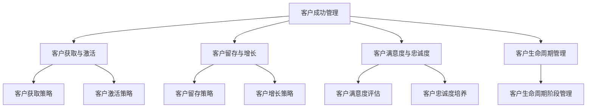

                 

### 引言

在当今数字化时代，自动化创业已经成为一种潮流，其不仅提升了企业的运营效率，还降低了成本。然而，尽管自动化带来了诸多优势，但如何有效地管理客户成功依然是一个挑战。客户成功管理（Customer Success Management）成为企业在自动化创业过程中不可或缺的一环。

本文旨在探讨自动化创业中的客户成功管理，通过系统的分析和详细的讲解，帮助读者了解并掌握这一关键领域的核心概念、策略和最佳实践。文章将分为五个主要部分：背景与重要性、关键流程、工具与方法、项目实战以及持续优化与成长。以下是对每个部分的简要概述。

#### 第一部分：自动化创业的背景与客户成功管理的重要性

在本部分，我们将深入探讨自动化创业的概念、发展趋势以及其在各个行业中的应用。随后，我们将介绍客户成功管理的核心概念，阐述其在自动化创业中的重要性，并探讨客户成功管理与客户关系管理的关系。

#### 第二部分：客户成功管理的关键流程

本部分将详细分析客户成功管理的核心流程，包括客户获取与激活、客户留存与增长、客户满意度与忠诚度以及客户生命周期管理。我们将通过具体的案例，展示这些流程在实际应用中的效果和挑战。

#### 第三部分：客户成功管理的工具与方法

在本部分，我们将介绍客户成功管理所需的工具和方法，包括客户关系管理系统（CRM）、客户成功管理系统（CSM）以及其他辅助工具。我们将重点讨论数据分析在客户成功管理中的应用，并分享一些成功的案例分析。

#### 第四部分：客户成功管理项目实战

通过实际的客户成功管理项目，我们将展示如何策划、执行和评估这些项目。我们将分享多个实战案例，包括企业级客户成功管理实施、中小企业客户成功管理实践以及B2B客户成功管理案例分析。

#### 第五部分：客户成功管理的持续优化与成长

最后，我们将探讨客户成功管理的持续优化策略和团队建设，并分享一些成长与拓展的成功案例。通过这些讨论，我们希望读者能够了解到如何不断提升客户成功管理的效率和质量。

在接下来的内容中，我们将逐一深入探讨这些部分，帮助读者全面了解自动化创业中的客户成功管理。

### 关键词

- 自动化创业
- 客户成功管理
- 数据驱动决策
- 客户关系管理系统（CRM）
- 客户生命周期管理
- 客户满意度与忠诚度
- 数据分析工具与方法

### 摘要

本文将探讨自动化创业中的客户成功管理，分析其核心概念、关键流程、工具与方法，并通过项目实战和持续优化策略，帮助读者理解和掌握这一重要领域。文章首先介绍了自动化创业的背景和客户成功管理的重要性，随后详细分析了客户成功管理的各个关键流程，包括客户获取与激活、客户留存与增长、客户满意度与忠诚度以及客户生命周期管理。接着，文章介绍了客户成功管理所需的工具与方法，重点讨论了数据分析在其中的应用。通过实际案例的分享，读者可以了解到客户成功管理的项目策划、执行和评估方法。最后，文章探讨了客户成功管理的持续优化和团队建设策略，以及成长与拓展的成功案例，旨在帮助读者提升客户成功管理的效率和效果。

## 《自动化创业中的客户成功管理》目录大纲

在本部分，我们将详细列出《自动化创业中的客户成功管理》的目录大纲，以帮助读者更好地把握文章的结构和内容。以下是详细的目录大纲：

### 第一部分：自动化创业的背景与客户成功管理的重要性

#### 1.1 自动化创业的概念与趋势

- **1.1.1 自动化创业的定义**
  - 自动化创业的定义及其在不同领域的应用
  - 自动化创业的核心要素和关键技术

- **1.1.2 自动化创业的发展历程**
  - 自动化创业的历史背景和发展过程
  - 自动化创业在不同发展阶段的特点和挑战

- **1.1.3 自动化创业的优势与挑战**
  - 自动化创业所带来的经济效益和社会影响
  - 自动化创业面临的重大挑战和解决方案

#### 1.2 客户成功管理的核心概念

- **1.2.1 客户成功的定义**
  - 客户成功的定义及其在不同企业的实际应用
  - 客户成功的衡量指标和评估方法

- **1.2.2 客户成功管理的重要性**
  - 客户成功管理在企业发展中的战略地位
  - 客户成功管理对业务增长和企业竞争力的影响

- **1.2.3 客户成功管理与客户关系管理的关系**
  - 客户成功管理与客户关系管理的区别与联系
  - 客户成功管理如何与客户关系管理协同工作

#### 1.3 客户成功管理在自动化创业中的应用

- **1.3.1 自动化工具在客户成功管理中的应用**
  - 自动化工具在客户成功管理中的角色和功能
  - 自动化工具在实际操作中的应用案例

- **1.3.2 数据驱动的客户成功管理**
  - 数据在客户成功管理中的关键作用
  - 数据驱动的决策模型和方法

- **1.3.3 客户成功管理在自动化创业中的战略意义**
  - 客户成功管理在自动化创业中的长期影响
  - 客户成功管理对业务创新和持续发展的贡献

### 第二部分：客户成功管理的关键流程

#### 2.1 客户获取与激活

- **2.1.1 客户获取策略**
  - 客户获取的渠道和方式
  - 客户获取效果评估与优化

- **2.1.2 客户激活策略**
  - 新客户激活的方法和技巧
  - 客户体验的优化与提升

- **2.1.3 客户获取与激活的案例分析**
  - 成功案例分析
  - 挑战与解决策略

#### 2.2 客户留存与增长

- **2.2.1 客户留存策略**
  - 客户留存的核心要素
  - 客户留存率的提升策略

- **2.2.2 客户增长策略**
  - 客户增长的目标与路径
  - 客户增长的驱动因素

- **2.2.3 客户留存与增长的案例分析**
  - 成功案例分析
  - 挑战与解决策略

#### 2.3 客户满意度与忠诚度

- **2.3.1 客户满意度评估**
  - 客户满意度的测量指标
  - 客户满意度调查与反馈机制

- **2.3.2 客户忠诚度培养**
  - 客户忠诚度的概念与衡量
  - 培养客户忠诚度的策略和方法

- **2.3.3 客户满意度与忠诚度的案例分析**
  - 成功案例分析
  - 挑战与解决策略

#### 2.4 客户生命周期管理

- **2.4.1 客户生命周期的概念**
  - 客户生命周期的定义和阶段
  - 客户生命周期管理的重要性

- **2.4.2 客户生命周期各阶段管理策略**
  - 获取阶段的管理策略
  - 成长阶段的管理策略
  - 留存阶段的管理策略

- **2.4.3 客户生命周期管理的案例分析**
  - 成功案例分析
  - 挑战与解决策略

### 第三部分：客户成功管理的工具与方法

#### 3.1 客户成功管理工具

- **3.1.1 客户关系管理系统（CRM）**
  - CRM的定义与功能
  - 常见CRM系统的介绍与比较

- **3.1.2 客户成功管理系统（CSM）**
  - CSM的定义与功能
  - 常见CSM系统的介绍与比较

- **3.1.3 其他辅助工具**
  - 数据分析工具
  - 客户反馈工具
  - 自动化工具

#### 3.2 数据分析与数据驱动决策

- **3.2.1 客户数据分析的重要性**
  - 数据分析在客户成功管理中的作用
  - 客户数据的类型与来源

- **3.2.2 数据分析的方法与技巧**
  - 数据分析的基本方法
  - 数据分析工具的使用技巧

- **3.2.3 数据驱动决策的案例分析**
  - 成功案例分析
  - 数据驱动决策的优势与挑战

#### 3.3 客户成功管理的最佳实践

- **3.3.1 成功案例分享**
  - 客户成功管理的优秀案例分享
  - 案例中的成功经验和教训

- **3.3.2 行业最佳实践**
  - 不同行业的客户成功管理最佳实践
  - 跨行业经验的借鉴与融合

- **3.3.3 客户成功管理的未来发展趋势**
  - 客户成功管理的趋势与前景
  - 未来技术的潜在影响与机会

### 第四部分：客户成功管理项目实战

#### 4.1 客户成功管理项目策划

- **4.1.1 项目目标设定**
  - 项目目标的确定与分解
  - 项目目标的可衡量性和可实现性

- **4.1.2 项目计划与执行**
  - 项目计划的制定与执行
  - 项目进度监控与风险管理

- **4.1.3 项目评估与优化**
  - 项目效果的评估方法
  - 项目优化与持续改进的策略

#### 4.2 客户成功管理实战案例

- **4.2.1 案例一：企业级客户成功管理实施**
  - 企业级客户成功管理的实际操作
  - 案例中的成功经验和挑战

- **4.2.2 案例二：中小企业客户成功管理实践**
  - 中小企业客户成功管理的具体做法
  - 案例中的经验与教训

- **4.2.3 案例三：B2B客户成功管理案例分析**
  - B2B客户成功管理的独特之处
  - 案例中的关键因素与策略

#### 4.3 客户成功管理中的挑战与解决策略

- **4.3.1 客户成功管理中的常见挑战**
  - 客户成功管理面临的主要挑战
  - 挑战的具体表现和原因

- **4.3.2 解决策略与实践**
  - 针对性解决策略和措施
  - 实践中的成功案例和经验

- **4.3.3 挑战与解决策略的案例分析**
  - 成功案例分享
  - 挑战与解决策略的反思与总结

### 第五部分：客户成功管理的持续优化与成长

#### 5.1 客户成功管理的持续优化

- **5.1.1 优化目标与指标**
  - 优化目标的设定与衡量
  - 关键性能指标的设定与监控

- **5.1.2 优化策略与方法**
  - 数据驱动优化策略
  - 客户体验优化策略

- **5.1.3 持续优化的案例分析**
  - 成功案例分享
  - 优化实践中的教训与启示

#### 5.2 客户成功管理的团队建设

- **5.2.1 团队角色与职责**
  - 客户成功管理团队的角色与职责
  - 团队协作与沟通机制

- **5.2.2 团队建设策略**
  - 团队建设的方法与技巧
  - 团队激励与发展的策略

- **5.2.3 团队协作与沟通**
  - 有效沟通的技巧与方法
  - 团队协作工具的应用与实践

#### 5.3 客户成功管理的成长与拓展

- **5.3.1 成长路径与策略**
  - 客户成功管理的成长路径
  - 成长策略的制定与执行

- **5.3.2 拓展市场的客户成功管理**
  - 拓展市场的挑战与机遇
  - 拓展市场的策略与实践

- **5.3.3 成长与拓展的案例分析**
  - 成功案例分享
  - 成长与拓展中的经验与教训

### 附录

#### 附录 A：客户成功管理相关资源与工具

- **A.1 CRM系统推荐**
  - 常见CRM系统的推荐与比较
  - 不同CRM系统的特点与适用场景

- **A.2 数据分析工具推荐**
  - 常见数据分析工具的推荐与比较
  - 数据分析工具的特点与适用场景

- **A.3 客户成功管理书籍推荐**
  - 推荐经典书籍与最新出版物
  - 书籍中的核心观点与实际应用

#### 附录 B：参考文献与扩展阅读

- **B.1 客户成功管理相关论文**
  - 推荐重要的学术论文与研究报告
  - 论文中的核心观点与实际应用

- **B.2 行业报告与分析**
  - 推荐权威的行业报告与分析
  - 行业发展趋势与市场动态

- **B.3 深度学习与数据分析技术书籍推荐**
  - 推荐深度学习与数据分析技术的优秀书籍
  - 技术原理与实际应用的结合

#### 附录 C：客户成功管理流程图

- **C.1 客户成功管理整体流程**
  - 客户成功管理的主要流程和步骤
  - 每个流程的关键节点与注意事项

- **C.2 客户获取与激活流程**
  - 客户获取与激活的具体流程和步骤
  - 流程中的关键策略与技巧

- **C.3 客户留存与增长流程**
  - 客户留存与增长的具体流程和步骤
  - 流程中的关键策略与技巧

- **C.4 客户满意度与忠诚度管理流程**
  - 客户满意度与忠诚度的管理流程和步骤
  - 流程中的关键策略与技巧

- **C.5 客户生命周期管理流程**
  - 客户生命周期管理的主要流程和步骤
  - 每个生命周期阶段的管理策略和技巧

#### 附录 D：核心算法与数学模型伪代码

- **D.1 客户留存预测算法**
  - 客户留存预测的基本算法
  - 算法的伪代码实现与解释

- **D.2 客户忠诚度评估算法**
  - 客户忠诚度评估的基本算法
  - 算法的伪代码实现与解释

- **D.3 数据分析中的常用算法**
  - 常见数据分析算法的伪代码实现
  - 算法在实际应用中的具体实现与优化

通过以上目录大纲，读者可以系统地了解自动化创业中的客户成功管理，掌握关键概念、策略和最佳实践，为自身的业务发展提供有力支持。

### 第一部分：自动化创业的背景与客户成功管理的重要性

#### 1.1 自动化创业的概念与趋势

**1.1.1 自动化创业的定义**

自动化创业，是指通过应用先进的技术手段，如人工智能、大数据、云计算等，来自动化完成传统商业模式中的某些环节或全部环节，从而提高运营效率、降低成本、增强客户体验的过程。自动化创业的核心在于利用技术手段将繁琐、重复的工作流程自动化，使企业能够更专注于核心业务和创新。

在自动化创业中，不同行业和领域的应用有所不同，但其核心要素和关键技术基本一致。这些要素包括：

- **人工智能（AI）**：通过机器学习、深度学习等技术，实现自动化决策和预测，提高运营效率和客户体验。
- **大数据**：通过对大量数据的收集、存储和分析，挖掘有价值的信息，为企业决策提供数据支持。
- **云计算**：通过云计算平台提供强大的计算能力和存储能力，支持海量数据的处理和存储。
- **物联网（IoT）**：通过物联网技术，实现设备之间的互联互通，提高设备的智能化和自动化水平。

**1.1.2 自动化创业的发展历程**

自动化创业的发展历程可以分为几个阶段：

1. **初步阶段（2000年代初期）**：
   - 这一时期，自动化创业的概念开始出现，企业开始尝试将一些简单的自动化工具应用于业务流程中，如自动化办公软件、简单的数据分析工具等。
   - 这时期的自动化创业主要侧重于提高效率和减少人工错误。

2. **发展阶段（2010年代）**：
   - 随着互联网和移动技术的普及，自动化创业进入快速发展阶段。大数据、人工智能、云计算等先进技术逐渐被应用于各个行业，自动化创业的范围和深度不断扩展。
   - 这一阶段的自动化创业不仅关注效率提升，更强调通过数据驱动的决策优化和客户体验提升。

3. **成熟阶段（2020年代至今）**：
   - 自动化创业已经从初期的尝试阶段走向成熟，成为许多企业转型和发展的核心战略。
   - 自动化创业不仅限于业务流程的自动化，还涵盖了全产业链的智能化升级，如智能制造、智慧供应链等。

**1.1.3 自动化创业的优势与挑战**

**优势**：

1. **提高效率**：
   - 自动化可以显著减少人工操作时间，提高业务处理速度，从而提高整体工作效率。

2. **降低成本**：
   - 通过自动化，企业可以减少对人力资源的依赖，从而降低运营成本。

3. **增强客户体验**：
   - 自动化技术可以帮助企业更好地了解客户需求，提供个性化的服务，从而提升客户满意度。

4. **数据驱动决策**：
   - 自动化过程中积累的大量数据，可以为企业提供宝贵的决策依据，使决策更加科学和准确。

**挑战**：

1. **技术挑战**：
   - 自动化创业需要掌握先进的技术，如人工智能、大数据等，这对企业的技术能力和研发投入提出了高要求。

2. **转型挑战**：
   - 企业从传统模式向自动化模式转型，需要改变传统的业务流程和思维模式，这往往面临巨大的阻力。

3. **数据安全与隐私**：
   - 在自动化过程中，数据的安全和隐私保护成为关键挑战。如何确保数据的保密性和安全性，是企业需要重点关注的问题。

4. **人才挑战**：
   - 自动化创业需要大量掌握先进技术的专业人才，但高端技术人才的培养和引进对企业来说是一个长期且具有挑战性的任务。

**1.2 客户成功管理的核心概念**

**1.2.1 客户成功的定义**

客户成功（Customer Success）是一个相对较新的概念，它强调企业通过提供优质的产品和服务，帮助客户实现其业务目标，从而实现双方的共赢。客户成功不仅仅是客户满意度的管理，更是一种以客户为中心、以业务结果为导向的思维方式。

客户成功的定义可以概括为：

- **客户成功**：是指通过帮助客户实现其业务目标和价值，建立长期、稳定、健康的客户关系，从而实现企业持续增长的过程。

**1.2.2 客户成功管理的重要性**

客户成功管理（Customer Success Management，简称CSM）是企业实现客户成功的关键手段。其重要性体现在以下几个方面：

1. **提升客户满意度**：
   - 客户成功管理通过深入了解客户需求，提供个性化的解决方案，从而提升客户满意度。

2. **增强客户忠诚度**：
   - 通过持续关注客户的使用情况和反馈，客户成功管理可以帮助企业建立与客户的长期合作关系，提高客户忠诚度。

3. **降低客户流失率**：
   - 客户成功管理通过有效的客户关怀和问题解决，可以显著降低客户流失率。

4. **驱动业务增长**：
   - 客户成功管理不仅关注现有客户的维护，还致力于通过客户推荐和新客户获取，实现业务增长。

**1.2.3 客户成功管理与客户关系管理的关系**

客户成功管理与客户关系管理（Customer Relationship Management，简称CRM）密切相关，但又有所不同。客户关系管理主要侧重于管理客户信息、维护客户关系、提高客户满意度，而客户成功管理则更注重通过帮助客户实现业务目标来驱动业务增长。

具体来说，两者之间的关系可以概括为：

- **客户成功管理是客户关系管理的一部分**：客户关系管理是客户成功管理的基础，通过有效的客户关系管理，企业可以更好地了解客户需求，为后续的客户成功管理提供支持。

- **客户成功管理是客户关系管理的延伸**：客户关系管理主要关注客户信息的收集和管理，而客户成功管理则在此基础上，通过提供个性化的解决方案和持续的客户关怀，实现客户价值的最大化。

**1.3 客户成功管理在自动化创业中的应用**

在自动化创业中，客户成功管理发挥着至关重要的作用。通过以下几个方面，我们可以看到客户成功管理在自动化创业中的具体应用：

**1.3.1 自动化工具在客户成功管理中的应用**

自动化工具在客户成功管理中具有广泛的应用，主要包括：

- **客户数据管理**：利用自动化工具收集、存储和分析客户数据，帮助企业更全面地了解客户需求和行为。
- **客户沟通与反馈**：通过自动化工具实现与客户的及时沟通和反馈，提高客户满意度。
- **客户服务**：利用自动化工具提供智能客服、自动化回复等功能，提高客户服务质量。
- **客户关怀**：通过自动化工具定期发送关怀信息、节日祝福等，保持与客户的良好关系。

**1.3.2 数据驱动的客户成功管理**

数据驱动是自动化创业的核心，也是客户成功管理的关键。通过以下方式，企业可以实现数据驱动的客户成功管理：

- **数据分析与预测**：利用大数据技术和人工智能算法，对客户数据进行分析和预测，发现客户潜在需求和问题，提前采取措施。
- **个性化服务**：基于客户数据分析，提供个性化的产品和服务，满足不同客户的需求。
- **业务决策**：利用数据驱动的决策模型，优化业务流程，提高运营效率。

**1.3.3 客户成功管理在自动化创业中的战略意义**

客户成功管理在自动化创业中的战略意义主要体现在以下几个方面：

- **提升竞争力**：通过有效的客户成功管理，企业可以提升客户满意度、增强客户忠诚度，从而在激烈的市场竞争中脱颖而出。
- **驱动业务增长**：客户成功管理不仅关注现有客户的维护，还致力于通过客户推荐和新客户获取，实现业务增长。
- **优化用户体验**：通过数据驱动的个性化服务和关怀，提高用户体验，为企业的长期发展奠定基础。

通过以上分析，我们可以看到，客户成功管理在自动化创业中具有不可替代的重要地位。在接下来的内容中，我们将进一步探讨客户成功管理的具体流程、工具和方法，帮助读者深入理解并掌握这一领域。

### 第二部分：客户成功管理的关键流程

在自动化创业中，客户成功管理的关键流程是实现客户价值最大化、提升客户满意度和忠诚度的重要手段。这一部分将详细分析客户成功管理的核心流程，包括客户获取与激活、客户留存与增长、客户满意度与忠诚度以及客户生命周期管理。通过这些流程的详细讲解和案例分析，我们将帮助读者理解客户成功管理的实践与应用。

#### 2.1 客户获取与激活

**2.1.1 客户获取策略**

客户获取是客户成功管理的起点，其目的是吸引潜在客户，将他们转化为实际用户。有效的客户获取策略可以显著提升企业的市场份额和收入。以下是一些常见的客户获取策略：

- **内容营销**：通过制作高质量的内容，如博客、白皮书、视频等，吸引潜在客户的注意力，建立品牌知名度。
- **社交媒体营销**：利用社交媒体平台（如微博、微信、LinkedIn等）进行品牌宣传和客户互动，扩大客户群体。
- **搜索引擎优化（SEO）**：通过优化网站内容和结构，提高在搜索引擎中的排名，吸引更多有意向的访客。
- **在线广告**：在搜索引擎、社交媒体和其他网站上投放广告，精准定位潜在客户。
- **口碑营销**：通过客户推荐和好评，建立口碑，吸引新客户。

**2.1.2 客户激活策略**

客户激活是指将新获取的客户转化为活跃用户的过程。激活策略的核心在于提升客户的初次使用体验，使其对产品或服务产生兴趣和依赖。以下是一些常见的客户激活策略：

- **引导式体验**：通过引导用户完成关键任务，如注册、登录、试用等，使其逐步熟悉产品或服务。
- **客户教育**：通过培训、教程、FAQ等形式，帮助客户了解产品或服务的功能和优势，提高其使用意愿。
- **优惠活动**：提供免费试用、限时折扣等优惠活动，激发客户的购买欲望。
- **客户关怀**：在新客户注册后，通过短信、邮件等方式进行关怀，解答疑问，提高客户满意度。
- **个性化推荐**：基于用户行为和偏好，提供个性化的产品或服务推荐，增加用户粘性。

**2.1.3 客户获取与激活的案例分析**

**案例一：某电商平台的客户获取与激活**

某电商平台通过以下策略进行客户获取与激活：

- **内容营销**：发布大量高质量的商品评测、购买指南等内容，吸引潜在客户。
- **社交媒体营销**：在微信、微博等平台发布优惠信息，与用户互动，扩大品牌影响力。
- **SEO**：优化网站内容，提高在搜索引擎中的排名，吸引更多访客。
- **在线广告**：在各大搜索引擎和社交媒体平台上投放广告，精准定位潜在客户。
- **客户引导式体验**：在用户注册时提供引导教程，帮助用户快速了解平台功能。
- **客户教育**：提供详细的商品说明、用户手册等，帮助用户了解商品和使用方法。
- **优惠活动**：提供免费试用、限时折扣等活动，激发购买欲望。
- **客户关怀**：在用户注册后，通过短信和邮件发送问候和优惠信息，提高用户满意度。

通过上述策略，该电商平台在短时间内实现了客户获取和激活，提高了用户留存率和转化率。

**2.1.4 客户获取与激活中的挑战与解决策略**

在客户获取与激活过程中，企业可能会面临以下挑战：

- **流量不足**：新平台或新产品在初期可能面临流量不足的问题，导致客户获取困难。
- **用户流失**：新客户在初次使用过程中可能遇到困难，导致流失。
- **资源限制**：客户获取与激活需要大量的人力和财力投入，对资源有限的企业可能构成挑战。

解决策略：

- **多渠道推广**：通过多种渠道（如内容营销、社交媒体营销、SEO、广告等）进行推广，提高曝光率。
- **优化用户体验**：通过改进产品功能和界面设计，提高用户体验，降低用户流失率。
- **合理分配资源**：根据市场情况和业务目标，合理分配资源，确保客户获取与激活的顺利进行。

#### 2.2 客户留存与增长

**2.2.1 客户留存策略**

客户留存是指企业通过持续提供价值，使客户持续使用产品或服务的过程。高客户留存率是业务健康发展的关键指标。以下是一些常见的客户留存策略：

- **个性化服务**：基于客户的行为和偏好，提供个性化的产品和服务，满足客户需求。
- **定期关怀**：通过电话、邮件、短信等方式，定期与客户沟通，关心他们的使用情况，解答疑问。
- **反馈机制**：建立有效的客户反馈机制，及时收集和处理客户的意见和需求，改进产品和服务。
- **忠诚度计划**：通过积分、优惠券、会员特权等手段，激励客户长期使用产品或服务。
- **客户成长路径**：设计合理的客户成长路径，逐步引导客户从初次使用到深度使用，提高客户粘性。

**2.2.2 客户增长策略**

客户增长是指企业通过多种手段，扩大客户规模，实现业务增长的过程。以下是一些常见的客户增长策略：

- **口碑营销**：通过客户的满意度和口碑，吸引新客户。
- **跨渠道营销**：通过线上线下多渠道整合，扩大客户接触面。
- **合作伙伴关系**：与相关企业建立合作伙伴关系，共同开发客户。
- **市场拓展**：进入新的市场领域，开拓新客户群体。
- **产品创新**：通过不断优化产品和服务，吸引更多客户。

**2.2.3 客户留存与增长的案例分析**

**案例二：某在线教育平台的客户留存与增长**

某在线教育平台通过以下策略进行客户留存与增长：

- **个性化服务**：根据学员的学习进度和兴趣，推荐合适的学习内容和课程，提高学习效果。
- **定期关怀**：通过短信和邮件，定期向学员发送学习提醒、课程优惠等信息，增强学员的归属感。
- **反馈机制**：建立学员反馈渠道，及时收集和处理学员的意见和建议，改进课程和服务。
- **忠诚度计划**：推出学员积分系统，学员通过完成任务和课程学习积累积分，兑换优惠券和会员特权。
- **口碑营销**：鼓励学员在社交媒体上分享学习体验和成果，吸引更多新学员。
- **跨渠道营销**：通过线上课程、线下活动、合作伙伴等多渠道推广，扩大品牌影响力。
- **产品创新**：不断优化课程内容和教学方式，满足学员的多样化需求。

通过上述策略，该在线教育平台在短时间内实现了客户留存与增长，提高了市场占有率和品牌知名度。

**2.2.4 客户留存与增长中的挑战与解决策略**

在客户留存与增长过程中，企业可能会面临以下挑战：

- **竞争加剧**：市场上竞争对手众多，客户获取和留存难度加大。
- **客户需求多变**：客户需求不断变化，企业需要快速响应和调整。
- **资源有限**：客户留存与增长需要大量的人力和财力投入，对资源有限的企业可能构成挑战。

解决策略：

- **持续创新**：通过不断优化产品和服务，满足客户需求，提高客户满意度。
- **强化客户关系**：通过建立良好的客户关系，提高客户忠诚度，降低流失率。
- **合理分配资源**：根据市场情况和业务目标，合理分配资源，确保客户留存与增长的顺利进行。

#### 2.3 客户满意度与忠诚度

**2.3.1 客户满意度评估**

客户满意度是衡量客户对企业产品和服务满意程度的重要指标。以下是一些常见的客户满意度评估方法：

- **问卷调查**：通过设计合理的问卷，收集客户对产品和服务各方面的满意度评价。
- **访谈**：与客户进行面对面的访谈，深入了解他们的使用体验和需求。
- **在线评价系统**：建立在线评价系统，让客户在购买或使用后对产品和服务进行评分和评论。
- **关键绩效指标（KPI）**：通过设定关键绩效指标，如客户满意度得分、投诉率、回复时间等，进行定量分析。

**2.3.2 客户忠诚度培养**

客户忠诚度是指客户对企业产品或服务的持续购买和忠诚程度。以下是一些常见的客户忠诚度培养策略：

- **个性化服务**：根据客户的历史数据和偏好，提供个性化的产品和服务，增强客户体验。
- **会员制度**：建立会员制度，提供会员专属优惠和特权，提高客户的归属感和忠诚度。
- **客户关怀**：通过定期关怀和互动，关心客户的使用情况，解答疑问，建立信任关系。
- **奖励机制**：通过积分、优惠券、礼品等手段，奖励忠诚客户，提高他们的购买意愿。
- **用户社区**：建立用户社区，鼓励客户分享使用经验和建议，增强客户之间的互动和归属感。

**2.3.3 客户满意度与忠诚度的案例分析**

**案例三：某电子商务平台的客户满意度与忠诚度**

某电子商务平台通过以下策略进行客户满意度与忠诚度管理：

- **问卷调查**：定期向客户发送满意度问卷，收集客户对产品和服务各方面的满意度评价。
- **在线评价系统**：建立在线评价系统，让客户在购买后对产品和服务进行评分和评论。
- **个性化服务**：根据客户的购物记录和偏好，推荐合适的产品和优惠券，提高购物体验。
- **会员制度**：推出会员制度，提供会员专属优惠和特权，增加客户的忠诚度。
- **客户关怀**：通过短信和邮件，定期向客户发送购物提醒、优惠券等信息，关心客户的使用情况。
- **用户社区**：建立用户社区，鼓励客户分享购物经验和建议，增强客户之间的互动和归属感。

通过上述策略，该电子商务平台在短时间内提高了客户满意度和忠诚度，降低了客户流失率，提高了市场竞争力。

**2.3.4 客户满意度与忠诚度管理中的挑战与解决策略**

在客户满意度与忠诚度管理过程中，企业可能会面临以下挑战：

- **客户期望变化**：客户期望不断变化，企业需要快速适应和调整。
- **资源有限**：客户满意度与忠诚度管理需要大量的人力和财力投入，对资源有限的企业可能构成挑战。
- **竞争压力**：市场上竞争对手众多，企业需要不断提升自身服务质量和客户满意度。

解决策略：

- **持续优化**：通过不断改进产品和服务，满足客户需求，提高客户满意度。
- **建立长期关系**：通过建立长期关系，增强客户忠诚度，降低流失率。
- **合理分配资源**：根据市场情况和业务目标，合理分配资源，确保客户满意度与忠诚度管理的顺利进行。

#### 2.4 客户生命周期管理

**2.4.1 客户生命周期的概念**

客户生命周期（Customer Life Cycle）是指客户与企业建立关系到关系结束的整个过程。客户生命周期包括以下几个阶段：

- **获取阶段**：企业通过各种手段吸引潜在客户，将其转化为实际用户。
- **成长阶段**：新客户开始使用产品或服务，企业需要提供引导和帮助，提高客户满意度和忠诚度。
- **成熟阶段**：客户对产品或服务的依赖程度逐渐提高，企业需要持续关注客户需求，提供优质服务，保持客户关系。
- **衰退阶段**：客户对产品或服务的需求逐渐减少，企业需要采取措施，如提供优惠、创新服务等，试图挽回客户。

**2.4.2 客户生命周期各阶段管理策略**

不同阶段的客户管理策略有所不同，企业需要根据客户特征和需求，制定相应策略：

- **获取阶段**：
  - **目标**：吸引潜在客户，增加客户数量。
  - **策略**：通过内容营销、社交媒体营销、SEO、广告等手段，提高品牌知名度和曝光率。

- **成长阶段**：
  - **目标**：提高客户满意度和忠诚度，促进客户成长。
  - **策略**：提供个性化服务，定期关怀客户，关注客户使用情况，解答疑问。

- **成熟阶段**：
  - **目标**：保持客户关系，提高客户转化率和复购率。
  - **策略**：提供优质的客户服务，建立客户关系，通过忠诚度计划和会员制度，增强客户忠诚度。

- **衰退阶段**：
  - **目标**：挽回客户，减少客户流失。
  - **策略**：提供优惠活动、创新服务，关注客户需求，尝试挽回客户的信任。

**2.4.3 客户生命周期管理的案例分析**

**案例四：某旅游预订平台的客户生命周期管理**

某旅游预订平台通过以下策略进行客户生命周期管理：

- **获取阶段**：
  - **目标**：增加新用户数量。
  - **策略**：通过搜索引擎优化、社交媒体营销、内容营销等手段，提高品牌知名度和曝光率。

- **成长阶段**：
  - **目标**：提高客户满意度和忠诚度。
  - **策略**：提供个性化服务，如根据客户偏好推荐合适的旅游产品，定期发送优惠信息和旅游资讯，关注客户使用情况，解答疑问。

- **成熟阶段**：
  - **目标**：保持客户关系，提高客户转化率和复购率。
  - **策略**：提供优质的客户服务，建立客户关系，通过会员制度和忠诚度计划，增强客户忠诚度。

- **衰退阶段**：
  - **目标**：挽回客户，减少客户流失。
  - **策略**：提供优惠活动，如会员专享折扣、节假日促销等，关注客户需求，尝试挽回客户的信任。

通过上述策略，该旅游预订平台在客户生命周期各阶段取得了显著成效，提高了客户满意度和忠诚度，降低了客户流失率。

**2.4.4 客户生命周期管理中的挑战与解决策略**

在客户生命周期管理过程中，企业可能会面临以下挑战：

- **客户需求变化**：客户需求不断变化，企业需要快速适应和调整。
- **资源分配**：客户生命周期管理需要大量的人力和财力投入，企业需要合理分配资源。
- **竞争压力**：市场上竞争对手众多，企业需要不断提升自身服务质量和客户满意度。

解决策略：

- **灵活调整策略**：根据客户需求和市场变化，灵活调整客户生命周期管理策略。
- **合理分配资源**：根据客户生命周期各阶段的重要性和资源需求，合理分配资源。
- **持续优化服务**：通过持续优化产品和服务，满足客户需求，提高客户满意度。

通过以上分析，我们可以看到，客户成功管理的关键流程在自动化创业中具有重要意义。通过有效实施客户获取与激活、客户留存与增长、客户满意度与忠诚度以及客户生命周期管理，企业可以提升客户价值，实现持续增长。在接下来的部分，我们将进一步探讨客户成功管理的工具与方法，帮助读者深入理解并掌握这一领域。

### 第三部分：客户成功管理的工具与方法

在现代企业运营中，客户成功管理已经成为企业战略的重要组成部分。为了实现客户成功管理的高效运作，企业需要借助一系列工具和方法，这些工具和方法不仅能够提升客户满意度，还能驱动业务增长。本部分将详细介绍客户成功管理中常用的工具和方法，包括客户关系管理系统（CRM）、客户成功管理系统（CSM）和其他辅助工具，同时探讨数据分析在客户成功管理中的应用。

#### 3.1 客户成功管理工具

**3.1.1 客户关系管理系统（CRM）**

客户关系管理系统（CRM）是一种集成了销售、营销、客户服务等多个功能的软件，帮助企业有效管理和分析客户信息，优化客户关系。CRM系统的主要功能包括：

- **客户信息管理**：收集、存储和管理客户的基本信息、购买历史、沟通记录等。
- **销售管理**：跟踪销售机会，管理销售流程，提高销售效率。
- **营销自动化**：自动化营销活动，提高营销效果和客户响应率。
- **客户服务**：提供客户服务支持，跟踪服务请求，提高客户满意度。

常见的CRM系统包括Salesforce、Microsoft Dynamics 365、HubSpot等。以下是这些系统的简要介绍和比较：

- **Salesforce**：Salesforce是全球领先的CRM平台，提供了丰富的功能模块，包括销售、营销、客户服务等，具有高度的可定制性。其云原生架构使其易于扩展和集成。
- **Microsoft Dynamics 365**：Microsoft Dynamics 365结合了CRM和ERP功能，提供全面的企业资源管理解决方案。它与Microsoft Office 365无缝集成，方便用户在熟悉的界面中工作。
- **HubSpot**：HubSpot是一个以营销自动化为核心的平台，提供了全面的CRM功能，适合小型企业。其开源的API使其易于与其他工具集成。

**3.1.2 客户成功管理系统（CSM）**

客户成功管理系统（CSM）是专门为支持客户成功管理而设计的软件，它可以帮助企业更好地理解客户需求，提高客户满意度和忠诚度。CSM系统的主要功能包括：

- **客户成功策略管理**：制定和跟踪客户成功策略，确保客户需求得到满足。
- **客户数据管理**：收集、分析和整合客户数据，提供全面的客户视图。
- **客户关怀**：通过定期的沟通和关怀活动，维护良好的客户关系。
- **客户成长路径管理**：设计和管理客户的成长路径，促进客户价值提升。

常见的CSM系统包括Gainsight、Vendavo、TouchTech等。以下是这些系统的简要介绍和比较：

- **Gainsight**：Gainsight是一个全面的客户成功平台，提供了从客户成功策略管理到客户数据管理的全套功能。其人工智能和机器学习技术使其能够提供智能化的客户成功建议。
- **Vendavo**：Vendavo专注于客户成功管理，提供了丰富的功能模块，包括客户成功策略管理、客户数据管理和客户关怀。其强大的分析和预测功能帮助企业做出更好的业务决策。
- **TouchTech**：TouchTech提供了一个灵活的客户成功管理平台，适合不同规模的企业。其定制化功能使其能够满足不同企业的独特需求。

**3.1.3 其他辅助工具**

除了CRM和CSM系统，还有一些其他辅助工具在客户成功管理中发挥着重要作用。以下是一些常见的辅助工具：

- **数据分析工具**：如Tableau、Google Analytics等，用于收集和分析客户数据，提供深入的洞察。
- **客户反馈工具**：如SurveyMonkey、Typeform等，用于收集客户反馈，了解客户需求和满意度。
- **自动化工具**：如Mailchimp、HubSpot等，用于自动化客户沟通和营销活动，提高效率。

#### 3.2 数据分析与数据驱动决策

数据分析在客户成功管理中起着至关重要的作用。通过分析客户数据，企业可以深入了解客户需求和行为，从而做出更准确、更科学的业务决策。以下是一些数据分析在客户成功管理中的应用：

**3.2.1 客户数据分析的重要性**

客户数据分析可以帮助企业：

- **了解客户需求**：通过分析客户行为和反馈，企业可以了解客户的需求和痛点，从而提供更有针对性的产品和服务。
- **预测客户行为**：通过分析历史数据，企业可以预测客户的未来行为，提前采取措施，减少客户流失。
- **优化客户体验**：通过分析客户互动数据，企业可以优化客户旅程，提高客户满意度和忠诚度。
- **驱动业务增长**：通过分析客户数据，企业可以识别新的市场机会和业务增长点，实现业务的持续增长。

**3.2.2 数据分析的方法与技巧**

数据分析的方法和技巧包括：

- **描述性分析**：通过统计和图表，描述客户数据的基本特征和趋势。
- **诊断性分析**：通过分析客户数据，识别问题和异常情况，提供解决方案。
- **预测性分析**：通过建立模型，预测客户的未来行为和需求。
- **回归分析**：通过分析变量之间的关系，预测某一变量的变化。

数据分析工具的使用技巧包括：

- **数据可视化**：使用图表和仪表盘，直观地展示数据分析结果。
- **数据清洗**：处理和清洗数据，确保数据质量和准确性。
- **自动化分析**：通过自动化脚本和流程，实现数据的持续分析和更新。

**3.2.3 数据驱动决策的案例分析**

**案例五：某电商平台的客户数据分析**

某电商平台通过以下方式利用客户数据分析：

- **描述性分析**：通过分析客户的购物行为和偏好，了解客户的购买习惯和喜好，优化产品推荐。
- **诊断性分析**：通过分析退货率和投诉率，识别问题产品和服务，及时改进。
- **预测性分析**：通过分析客户的购买历史和浏览行为，预测客户的下一步购买，提供个性化的推荐和优惠。
- **回归分析**：通过分析客户数据，建立模型预测客户的流失风险，提前采取措施，减少客户流失。

通过数据驱动决策，该电商平台在短时间内实现了销售额的提升和客户满意度的提高。

#### 3.3 客户成功管理的最佳实践

**3.3.1 成功案例分享**

以下是一些客户成功管理的成功案例：

- **案例六：某SaaS公司的客户成功管理**
  - **背景**：某SaaS公司通过实施全面的客户成功管理策略，提高了客户满意度和忠诚度。
  - **措施**：公司建立了客户成功团队，提供定制化的客户服务，定期与客户沟通，关注客户需求，及时解决客户问题。
  - **成果**：客户满意度显著提升，客户留存率提高，业务持续增长。

- **案例七：某金融科技公司的客户成功管理**
  - **背景**：某金融科技公司通过引入客户成功管理系统，提升了客户成功管理的效率。
  - **措施**：公司利用客户成功管理系统，整合客户数据，提供个性化的服务，建立强大的客户关系。
  - **成果**：客户满意度和忠诚度大幅提升，业务规模迅速扩大。

**3.3.2 行业最佳实践**

以下是一些行业最佳实践：

- **金融行业**：金融行业通过数据分析和风险管理，实现精准的客户成功管理。
- **零售行业**：零售行业通过客户关系管理系统和数据分析，优化客户体验，提升销售业绩。
- **科技行业**：科技行业通过创新技术和个性化服务，提高客户满意度和忠诚度。

**3.3.3 客户成功管理的未来发展趋势**

未来，客户成功管理将面临以下发展趋势：

- **智能化**：随着人工智能和大数据技术的发展，客户成功管理将更加智能化，能够提供更精准的服务。
- **全球化**：企业将更加注重全球化市场的客户成功管理，通过跨区域的数据分析和策略实施，提升全球客户满意度。
- **数字化转型**：企业将加速数字化转型，利用数字化工具和平台，实现客户成功管理的高效和智能化。

通过以上工具和方法的分析与实践，我们可以看到，客户成功管理在自动化创业中具有不可替代的重要地位。在接下来的部分，我们将通过实际案例，进一步探讨客户成功管理的具体实施过程和效果。

### 第四部分：客户成功管理项目实战

在实际运营中，客户成功管理项目不仅是理论知识的实践，更是企业战略实现的重要手段。通过精心策划、实施和评估客户成功管理项目，企业可以有效地提升客户满意度和忠诚度，从而实现业务的持续增长。本部分将详细介绍客户成功管理项目的各个关键环节，并通过实际案例分享，展示项目策划、执行和评估的方法与策略。

#### 4.1 客户成功管理项目策划

**4.1.1 项目目标设定**

项目目标设定是客户成功管理项目策划的第一步，明确项目目标有助于确保项目的方向和成果。设定项目目标时，需要遵循以下原则：

- **明确性**：目标应具体、明确，易于衡量。
- **可行性**：目标应具有可行性，能够在规定时间内实现。
- **相关性**：目标应与企业的整体战略和业务目标保持一致。
- **挑战性**：目标应具有一定的挑战性，以激励团队成员。

常见的项目目标包括提升客户满意度、提高客户留存率、降低客户流失率、增加客户复购率等。在设定目标时，企业可以使用SMART原则（具体、可衡量、可达成、相关性、时限性）来确保目标的科学性和可操作性。

**4.1.2 项目计划与执行**

项目计划与执行是客户成功管理项目成功的关键环节。一个良好的项目计划应包括以下几个方面：

- **项目范围**：明确项目的具体内容和范围，确保项目的实施不超出预期。
- **项目任务**：列出项目的主要任务和活动，明确各任务的执行顺序和依赖关系。
- **项目时间表**：制定项目的时间表，确定各任务的时间安排和进度要求。
- **项目资源**：确定项目所需的资源和人员安排，确保项目能够顺利进行。
- **风险管理**：识别项目可能面临的风险，并制定相应的应对策略。

在项目执行过程中，需要严格按照项目计划进行，同时保持灵活应对。以下是一些项目执行的关键步骤：

- **任务分解**：将项目任务分解为具体的工作单元，明确每个单元的责任人和完成时间。
- **进度监控**：定期检查项目进度，确保项目按计划进行，及时发现和解决问题。
- **资源协调**：确保项目资源充足，合理调配人员和其他资源，避免资源浪费。
- **团队协作**：建立有效的沟通和协作机制，确保团队成员之间的信息共享和工作协同。
- **问题解决**：建立问题解决机制，及时识别和处理项目中的问题，确保项目顺利进行。

**4.1.3 项目评估与优化**

项目评估与优化是确保项目达成预期目标和持续改进的重要环节。项目评估通常包括以下几个方面：

- **目标达成度**：评估项目目标的实现情况，是否达到了预期的效果。
- **项目效率**：评估项目执行过程中的效率，是否在规定时间内完成了任务。
- **资源利用**：评估项目资源的利用情况，是否存在资源浪费。
- **团队协作**：评估团队成员的协作情况，是否存在沟通不畅或资源冲突。
- **客户反馈**：收集客户的反馈意见，了解客户对项目的满意度和体验。

在项目评估的基础上，企业应进行项目优化，以提升未来项目的成功率和效果。以下是一些项目优化的策略：

- **总结经验**：总结项目成功和失败的经验教训，制定相应的改进措施。
- **优化流程**：优化项目流程，简化不必要的步骤，提高项目执行效率。
- **改进工具和方法**：根据项目评估结果，改进项目管理工具和方法，提高项目的可操作性和效果。
- **团队培训**：加强对团队成员的培训，提高他们的专业能力和协作能力。

#### 4.2 客户成功管理实战案例

**4.2.1 案例一：企业级客户成功管理实施**

**背景**：某大型企业客户在业务扩展过程中，面临客户需求多变、客户满意度不高等问题，急需通过客户成功管理提升客户体验和满意度。

**措施**：

- **项目目标设定**：明确提升客户满意度、降低客户流失率、提高客户留存率等目标。
- **项目计划与执行**：
  - **任务分解**：将项目任务分解为市场调研、客户关怀、问题解决等具体的工作单元。
  - **进度监控**：通过定期的项目进度会议，确保项目按计划进行，及时解决项目中的问题。
  - **资源协调**：合理调配企业内部资源，确保项目团队拥有足够的人力、财力和技术支持。
  - **团队协作**：建立高效的项目团队，加强团队成员之间的沟通和协作，提高项目执行效率。
- **项目评估与优化**：
  - **目标达成度**：通过客户满意度调查和客户流失率分析，评估项目目标的实现情况。
  - **项目效率**：分析项目执行过程中的效率问题，寻找优化空间。
  - **团队协作**：通过团队反馈和沟通，识别团队协作中的问题，制定改进措施。

**成果**：通过客户成功管理项目的实施，客户满意度显著提升，客户流失率降低，客户留存率提高，企业的市场竞争力得到增强。

**4.2.2 案例二：中小企业客户成功管理实践**

**背景**：某中小企业在市场竞争激烈的环境下，希望通过客户成功管理提升业务规模和市场占有率。

**措施**：

- **项目目标设定**：明确提升客户满意度、增加新客户数量、提高客户复购率等目标。
- **项目计划与执行**：
  - **任务分解**：将项目任务分解为市场调研、营销推广、客户关怀等具体的工作单元。
  - **进度监控**：通过定期的项目进度会议和报告，确保项目按计划进行，及时调整项目策略。
  - **资源协调**：合理调配企业内部资源，确保项目团队拥有足够的人力、财力和技术支持。
  - **团队协作**：建立高效的项目团队，加强团队成员之间的沟通和协作，提高项目执行效率。
- **项目评估与优化**：
  - **目标达成度**：通过客户满意度调查和市场数据分析，评估项目目标的实现情况。
  - **项目效率**：分析项目执行过程中的效率问题，寻找优化空间。
  - **团队协作**：通过团队反馈和沟通，识别团队协作中的问题，制定改进措施。

**成果**：通过客户成功管理项目的实施，客户满意度显著提升，新客户数量增加，客户复购率提高，企业的市场占有率和品牌知名度得到提升。

**4.2.3 案例三：B2B客户成功管理案例分析**

**背景**：某B2B企业在面对复杂的商业环境和多样化的客户需求时，希望通过客户成功管理提升客户满意度和忠诚度。

**措施**：

- **项目目标设定**：明确提升客户满意度、降低客户流失率、提高客户生命周期价值等目标。
- **项目计划与执行**：
  - **任务分解**：将项目任务分解为客户关系管理、市场拓展、解决方案定制等具体的工作单元。
  - **进度监控**：通过定期的项目进度会议和报告，确保项目按计划进行，及时调整项目策略。
  - **资源协调**：合理调配企业内部资源，确保项目团队拥有足够的人力、财力和技术支持。
  - **团队协作**：建立高效的项目团队，加强团队成员之间的沟通和协作，提高项目执行效率。
- **项目评估与优化**：
  - **目标达成度**：通过客户满意度调查和客户流失率分析，评估项目目标的实现情况。
  - **项目效率**：分析项目执行过程中的效率问题，寻找优化空间。
  - **团队协作**：通过团队反馈和沟通，识别团队协作中的问题，制定改进措施。

**成果**：通过客户成功管理项目的实施，客户满意度显著提升，客户流失率降低，客户生命周期价值提高，企业的市场竞争力和客户基础得到巩固和扩展。

#### 4.3 客户成功管理中的挑战与解决策略

**4.3.1 客户成功管理中的常见挑战**

在客户成功管理过程中，企业可能会面临以下常见挑战：

- **客户需求变化**：客户需求多变，企业需要快速适应和调整。
- **资源有限**：客户成功管理需要大量的人力和财力投入，企业资源有限。
- **市场竞争**：市场竞争激烈，企业需要不断提升服务质量和客户满意度。
- **数据质量**：客户数据质量不高，影响数据分析和决策。

**4.3.2 解决策略与实践**

针对上述挑战，企业可以采取以下解决策略：

- **灵活调整策略**：根据客户需求和市场变化，灵活调整客户成功管理策略，确保策略的针对性和有效性。
- **合理分配资源**：根据业务优先级和资源情况，合理分配资源，确保关键业务的优先支持。
- **提升服务质量**：通过持续改进和优化服务流程，提升客户服务质量，增强客户满意度。
- **数据治理**：建立完善的数据治理机制，确保客户数据的准确性和完整性，提高数据分析的质量。

**4.3.3 挑战与解决策略的案例分析**

**案例四：某科技公司的客户成功管理挑战与解决**

**背景**：某科技公司在新产品发布后，面临客户需求变化和市场竞争压力，客户满意度下降，客户流失率上升。

**解决策略**：

- **灵活调整策略**：公司根据客户反馈和市场变化，及时调整产品功能和服务策略，满足客户需求。
- **合理分配资源**：公司优先支持客户成功管理团队，确保他们有足够的资源和人力进行客户关系维护和问题解决。
- **提升服务质量**：公司通过培训提升客户成功管理团队的专业能力，优化服务流程，提高客户满意度。
- **数据治理**：公司建立了数据治理团队，定期清洗和更新客户数据，确保数据质量的准确性。

**成果**：通过上述解决策略，公司成功应对了客户成功管理中的挑战，客户满意度显著提升，客户流失率下降，市场竞争力得到增强。

通过以上客户成功管理项目实战的探讨，我们可以看到，客户成功管理项目的成功实施对于企业来说具有重要意义。在接下来的部分，我们将进一步探讨如何通过持续优化和团队建设，不断提升客户成功管理的效率和效果。

### 第五部分：客户成功管理的持续优化与成长

在客户成功管理的过程中，持续优化是提升效率、增强客户满意度和忠诚度的重要手段。通过优化目标与指标、优化策略与方法以及团队建设和沟通，企业可以不断改进客户成功管理的实践，实现长期的业务增长。以下是关于客户成功管理持续优化与成长的详细探讨。

#### 5.1 客户成功管理的持续优化

**5.1.1 优化目标与指标**

客户成功管理的优化目标通常包括提升客户满意度、降低客户流失率、提高客户生命周期价值和增强客户忠诚度等。为了实现这些目标，企业需要设定具体的优化指标，以便衡量和评估优化措施的有效性。以下是一些常见的优化指标：

- **客户满意度指标**：如净推荐值（NPS）、客户满意度评分（CSAT）、客户努力评分（CES）等。
- **客户流失率指标**：如月度、季度和年度的流失客户数量和流失率。
- **客户生命周期价值指标**：如客户平均生命周期价值（CLV）和客户终身价值（LTV）。
- **客户忠诚度指标**：如客户重复购买率、客户推荐率、客户保留率等。

**5.1.2 优化策略与方法**

为了实现客户成功管理的优化目标，企业可以采取以下策略和方法：

- **数据驱动的优化**：通过分析客户数据，识别影响客户满意度和忠诚度的关键因素，制定相应的优化措施。
- **流程优化**：优化客户成功管理的流程，简化不必要的步骤，提高工作效率和服务质量。
- **技术赋能**：利用先进的技术工具，如CRM系统、数据分析工具等，提升客户成功管理的效率和效果。
- **培训与培养**：加强团队成员的专业培训，提高他们的技能和素质，以更好地满足客户需求。

**5.1.3 持续优化的案例分析**

**案例一：某SaaS企业的客户成功管理优化**

某SaaS企业通过以下措施进行客户成功管理优化：

- **数据驱动的优化**：企业通过数据分析，发现客户流失的主要原因是产品功能不完善和客户服务不到位。基于这些发现，企业对产品功能和客户服务流程进行了优化。
- **流程优化**：企业简化了客户成功管理流程，将原有的多个步骤合并为更高效的几个步骤，提高了客户响应速度和服务质量。
- **技术赋能**：企业引入了先进的CRM系统，实现了客户数据的集中管理和自动化分析，提高了客户成功管理的效率和精准度。
- **培训与培养**：企业定期组织培训，提升客户成功管理团队成员的专业技能和客户沟通能力，增强了团队的协作效率和客户满意度。

通过这些优化措施，该企业的客户满意度显著提升，客户流失率降低，客户生命周期价值提高，实现了业务的持续增长。

#### 5.2 客户成功管理的团队建设

团队建设是客户成功管理成功的关键因素之一。一个高效、协作的客户成功管理团队可以更好地应对客户需求和市场变化。以下是关于团队建设的一些策略：

**5.2.1 团队角色与职责**

在客户成功管理团队中，常见的角色和职责包括：

- **客户成功经理**：负责总体客户成功策略的制定和执行，协调团队工作，确保客户需求得到满足。
- **客户支持工程师**：负责日常的客户支持和问题解决，提供专业的技术支持和客户服务。
- **客户数据分析专家**：负责分析客户数据，提供数据驱动的客户成功建议，支持决策制定。
- **客户体验设计师**：负责设计和管理客户互动体验，优化客户旅程和服务流程。

**5.2.2 团队建设策略**

为了建设高效、协作的客户成功管理团队，企业可以采取以下策略：

- **明确角色与职责**：确保每个团队成员都清楚自己的角色和职责，避免工作重叠和职责模糊。
- **建立共同目标**：确保团队成员的目标与企业的整体战略和客户成功目标一致，增强团队的凝聚力。
- **培训与发展**：提供定期的培训和发展机会，提高团队成员的专业技能和业务素养。
- **沟通与协作**：建立有效的沟通和协作机制，如定期团队会议、跨部门协作平台等，增强团队协作和沟通效率。

**5.2.3 团队协作与沟通

为了提升客户成功管理团队的协作效率和沟通效果，企业可以采取以下措施：

- **建立协作平台**：利用协作工具，如Slack、Trello等，实现团队成员之间的实时沟通和任务协作。
- **定期团队会议**：定期召开团队会议，讨论项目进展、客户需求和团队协作中的问题，确保团队工作有序进行。
- **透明化流程**：确保团队工作流程的透明化，让每个成员都能了解项目的进展和自己的职责，减少误解和冲突。
- **鼓励反馈与建议**：鼓励团队成员提出反馈和建议，共同改进团队工作方法和流程。

**5.2.4 团队建设的案例分析**

**案例二：某金融科技企业的团队建设**

某金融科技企业通过以下措施进行团队建设：

- **明确角色与职责**：企业明确了客户成功经理、客户支持工程师、客户数据分析专家和客户体验设计师的职责，确保每个团队成员都清楚自己的角色和职责。
- **建立共同目标**：企业将客户成功目标与企业的整体战略相结合，确保团队成员的目标一致，增强了团队的凝聚力。
- **培训与发展**：企业定期组织培训，提升团队成员的专业技能和业务素养，提高了团队的整体水平。
- **沟通与协作**：企业建立了协作平台，如Slack和Trello，实现了团队成员之间的实时沟通和任务协作，提高了团队的协作效率和沟通效果。

通过这些团队建设措施，该企业的客户成功管理团队表现出色，客户满意度和忠诚度显著提升，实现了业务的快速增长。

#### 5.3 客户成功管理的成长与拓展

客户成功管理不仅关注现有客户的维护，还致力于通过客户推荐和新客户获取实现业务的成长与拓展。以下是关于客户成功管理成长与拓展的一些策略：

**5.3.1 成长路径与策略**

为了实现客户成功管理的成长与拓展，企业可以采取以下策略：

- **客户推荐计划**：通过提供激励措施，鼓励现有客户推荐新客户，扩大客户基础。
- **市场拓展**：通过进入新的市场领域，开拓新客户群体，实现业务的多元化发展。
- **产品创新**：通过不断优化产品和服务，满足客户需求，提高客户满意度和忠诚度。
- **跨渠道营销**：通过线上线下多渠道整合，提高品牌曝光率和客户接触率。

**5.3.2 拓展市场的客户成功管理**

在拓展市场的过程中，客户成功管理需要特别关注以下几点：

- **本地化策略**：根据目标市场的特点和需求，制定本地化的客户成功策略，确保客户需求得到满足。
- **合作伙伴关系**：与当地企业或合作伙伴建立合作关系，共同开发市场和客户资源。
- **本地团队建设**：建立本地化的客户成功管理团队，提高对当地市场的响应速度和服务质量。
- **文化适应**：了解和适应目标市场的文化特点，提供符合当地文化和价值观的产品和服务。

**5.3.3 成长与拓展的案例分析**

**案例三：某全球企业的客户成功管理成长与拓展**

某全球企业在拓展国际市场时，采取以下措施：

- **客户推荐计划**：通过提供激励措施，鼓励现有客户推荐新客户，扩大了客户基础。
- **市场拓展**：通过进入新兴市场，如东南亚、中东等地区，开拓了新的客户群体，实现了业务的多元化发展。
- **本地化策略**：根据不同市场的特点和需求，制定本地化的客户成功策略，确保客户需求得到满足。
- **合作伙伴关系**：与当地企业或合作伙伴建立合作关系，共同开发市场和客户资源。
- **本地团队建设**：建立了本地化的客户成功管理团队，提高了对当地市场的响应速度和服务质量。
- **文化适应**：了解和适应目标市场的文化特点，提供了符合当地文化和价值观的产品和服务。

通过这些成长与拓展策略，该企业在国际市场上取得了显著的成功，客户满意度和忠诚度大幅提升，实现了全球业务的快速增长。

通过以上关于客户成功管理持续优化与成长的探讨，我们可以看到，持续优化、团队建设和成长拓展是实现客户成功管理成功的关键因素。在接下来的部分，我们将总结文章的主要观点，并提供一些实用建议，以帮助读者在实际工作中应用客户成功管理的理念和方法。

### 总结与建议

#### 总结

本文系统地探讨了自动化创业中的客户成功管理，从背景、核心流程、工具与方法、项目实战到持续优化与成长，全面解析了客户成功管理在自动化创业中的重要性和具体实践。通过分析自动化创业的概念与趋势，我们了解了自动化创业的核心要素和关键技术。同时，客户成功管理的核心概念、关键流程、工具和方法也被详细阐述，并通过实际案例展示了客户成功管理在不同行业和企业中的成功应用。

#### 建议与应用

为了在实际工作中更好地应用客户成功管理的理念和方法，以下是一些建议：

1. **数据驱动决策**：重视数据分析，通过数据驱动的决策模型，优化客户成功管理的策略和流程。

2. **个性化服务**：根据客户需求和行为，提供个性化的产品和服务，提高客户满意度和忠诚度。

3. **持续优化**：定期评估客户成功管理的效果，根据反馈和数据分析结果，持续优化客户成功管理策略和流程。

4. **团队建设**：建立高效、协作的客户成功管理团队，加强团队成员的培训和发展，提升团队整体素质。

5. **创新与成长**：不断探索新的市场机会和业务模式，通过创新和拓展，实现业务的持续增长。

通过以上建议，企业可以更好地实施客户成功管理，提升客户价值，实现业务的长期成功。

### 附录

#### 附录 A：客户成功管理相关资源与工具

**A.1 CRM系统推荐**

- **Salesforce**：全球领先的CRM平台，提供全面的销售、营销和客户服务功能。
- **Microsoft Dynamics 365**：结合CRM和ERP功能，适合大型企业。
- **HubSpot**：适合中小企业的CRM和营销自动化平台。

**A.2 数据分析工具推荐**

- **Tableau**：强大的数据可视化工具，适合企业级数据分析。
- **Google Analytics**：提供丰富的分析功能，适合互联网业务。
- **Power BI**：微软推出的数据分析工具，与Microsoft 365无缝集成。

**A.3 客户成功管理书籍推荐**

- **《客户成功管理：构建以客户为中心的企业》**：详细介绍了客户成功管理的核心概念和实践方法。
- **《客户成功手册：如何在竞争激烈的市场中保持优势》**：探讨了客户成功管理的策略和最佳实践。
- **《客户成功：如何通过客户成功管理赢得市场》**：提供了大量实际案例和成功经验。

#### 附录 B：参考文献与扩展阅读

**B.1 客户成功管理相关论文**

- **"Customer Success Management: A Review of Concepts, Frameworks, and Methods"**：综述了客户成功管理的相关理论和实践方法。
- **"Data-Driven Customer Success: A Roadmap for Business Growth"**：探讨了数据驱动在客户成功管理中的应用。

**B.2 行业报告与分析**

- **"2021 Customer Success Management Market Report"**：分析了客户成功管理市场的现状和未来趋势。
- **"Customer Success Management: A Global Status Report"**：提供了全球客户成功管理的调研结果。

**B.3 深度学习与数据分析技术书籍推荐**

- **《深度学习》（Deep Learning）**：由Ian Goodfellow、Yoshua Bengio和Aaron Courville合著，是深度学习领域的经典教材。
- **《Python数据分析》（Python Data Analysis）**：Wes McKinney著，介绍了Python在数据分析中的应用。
- **《机器学习实战》（Machine Learning in Action）**：Peter Harrington著，通过案例讲解了机器学习的实际应用。

#### 附录 C：客户成功管理流程图

以下为《客户成功管理》的整体流程图：



#### 附录 D：核心算法与数学模型伪代码

**D.1 客户留存预测算法**

```python
# 客户留存预测算法伪代码
def predict_customer_churn(customer_data):
    # 输入：customer_data（客户数据）
    # 输出：churn_prediction（客户留存预测结果）

    # 步骤1：数据预处理
    preprocessed_data = preprocess_data(customer_data)

    # 步骤2：特征工程
    features = extract_features(preprocessed_data)

    # 步骤3：模型训练
    model = train_model(features)

    # 步骤4：预测
    churn_prediction = model.predict(preprocessed_data)

    # 返回预测结果
    return churn_prediction
```

**D.2 客户忠诚度评估算法**

```python
# 客户忠诚度评估算法伪代码
def assess_customer_loyalty(customer_data):
    # 输入：customer_data（客户数据）
    # 输出：loyalty_score（客户忠诚度评分）

    # 步骤1：数据预处理
    preprocessed_data = preprocess_data(customer_data)

    # 步骤2：特征工程
    features = extract_features(preprocessed_data)

    # 步骤3：模型训练
    model = train_model(features)

    # 步骤4：评估
    loyalty_score = model.evaluate(preprocessed_data)

    # 返回评估结果
    return loyalty_score
```

**D.3 数据分析中的常用算法**

```python
# 数据分析常用算法伪代码
def perform_data_analysis(data):
    # 输入：data（数据集）
    # 输出：analysis_results（分析结果）

    # 步骤1：描述性分析
    descriptive_stats = describe_data(data)

    # 步骤2：诊断性分析
    diagnostic_tests = diagnose_data(data)

    # 步骤3：预测性分析
    predictive_model = build_predictive_model(data)

    # 步骤4：回归分析
    regression_results = perform_regression_analysis(data)

    # 返回分析结果
    return {
        "descriptive_stats": descriptive_stats,
        "diagnostic_tests": diagnostic_tests,
        "predictive_model": predictive_model,
        "regression_results": regression_results
    }
```

通过这些算法和模型的伪代码，读者可以更深入地理解数据分析在客户成功管理中的应用。实际应用时，可以根据具体数据集和业务需求，调整和优化算法和模型。

