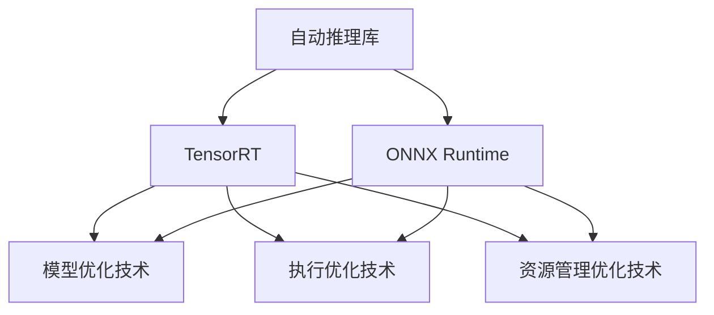

                 

# 《自动推理库案例：TensorRT 和 ONNX Runtime》

## 关键词
- 自动推理库
- TensorRT
- ONNX Runtime
- 图像分类
- 目标检测
- 优化技术
- 跨平台部署
- 性能分析

## 摘要
本文将深入探讨自动推理库在实际应用中的重要性，并以TensorRT和ONNX Runtime为例，详细介绍这两大自动推理库的核心概念、架构、优化技术及其在图像分类和目标检测等领域的实战案例。文章还将讨论自动推理库的性能优化策略，并展望其在未来发展和新兴领域中的应用前景。

---

### 《自动推理库案例：TensorRT 和 ONNX Runtime》目录大纲

#### 第一部分：自动推理库基础

##### 第1章：自动推理库概述
- 1.1 自动推理库的概念与重要性
- 1.2 自动推理库的发展历程
- 1.3 自动推理库的核心架构
- 1.4 自动推理库在企业中的应用

##### 第2章：TensorRT基础
- 2.1 TensorRT的架构与功能
- 2.2 TensorRT的安装与配置
- 2.3 TensorRT的常用API介绍
- 2.4 TensorRT优化技术

##### 第3章：ONNX Runtime基础
- 3.1 ONNX Runtime的架构与功能
- 3.2 ONNX Runtime的安装与配置
- 3.3 ONNX Runtime的常用API介绍
- 3.4 ONNX Runtime优化技术

#### 第二部分：TensorRT与ONNX Runtime实战案例

##### 第4章：TensorRT应用案例
- 4.1 基础案例：使用TensorRT进行图像分类
  - 4.1.1 数据预处理
  - 4.1.2 TensorRT模型配置
  - 4.1.3 模型推理与性能分析
- 4.2 进阶案例：使用TensorRT进行目标检测
  - 4.2.1 数据预处理
  - 4.2.2 TensorRT模型配置
  - 4.2.3 模型推理与性能分析

##### 第5章：ONNX Runtime应用案例
- 5.1 基础案例：使用ONNX Runtime进行图像分类
  - 5.1.1 数据预处理
  - 5.1.2 ONNX Runtime模型配置
  - 5.1.3 模型推理与性能分析
- 5.2 进阶案例：使用ONNX Runtime进行语音识别
  - 5.2.1 数据预处理
  - 5.2.2 ONNX Runtime模型配置
  - 5.2.3 模型推理与性能分析

##### 第6章：TensorRT与ONNX Runtime融合应用案例
- 6.1 跨平台部署：TensorRT与ONNX Runtime的互操作
- 6.2 联合优化：TensorRT与ONNX Runtime的协同优化
- 6.3 实战案例：深度学习模型在边缘设备上的部署

#### 第三部分：自动推理库技术深化

##### 第7章：自动推理库性能优化
- 7.1 模型优化技术
- 7.2 执行优化技术
- 7.3 资源管理优化技术

##### 第8章：自动推理库在特定领域的应用
- 8.1 自动推理库在计算机视觉中的应用
- 8.2 自动推理库在自然语言处理中的应用
- 8.3 自动推理库在机器学习中的其他应用

##### 第9章：自动推理库的未来发展
- 9.1 自动推理库的新趋势
- 9.2 自动推理库在新兴领域中的应用前景
- 9.3 自动推理库面临的挑战与展望

### 附录

- 附录A：TensorRT与ONNX Runtime常用工具与资源
  - A.1 TensorRT工具使用指南
  - A.2 ONNX Runtime工具使用指南
  - A.3 常见问题与解决方案

---

### Mermaid 流程图



### 核心算法原理讲解（伪代码）

```plaintext
// 伪代码：使用TensorRT进行图像分类

// 数据预处理
input_data = preprocess_image(input_image)

// 模型配置
trt_builder = trt.Builder()
trt_network = trt.Network()
parser = trt.Parser()

// 解析模型
model_config = load_model_config(model_file)
parser.parse(model_config, trt_network)

// 构建引擎
engine = trt_builder.build_cuda_engine(trt_network)

// 模型推理
output = engine().as_broadcastable()
```

### 数学模型和数学公式讲解

## 激活函数

激活函数是深度学习模型中的一个重要组成部分，用于引入非线性因素，使得模型能够学习到更复杂的特征。以下是常用的激活函数及其数学公式：

### ReLU（Rectified Linear Unit）

$$
f(x) = \begin{cases} 
x & \text{if } x > 0 \\
0 & \text{otherwise}
\end{cases}
$$

### Sigmoid

$$
f(x) = \frac{1}{1 + e^{-x}}
$$

### Tanh

$$
f(x) = \frac{e^x - e^{-x}}{e^x + e^{-x}}
$$

### 项目实战

## 代码实际案例：使用TensorRT进行图像分类

### 开发环境搭建

- Python 3.8 或更高版本
- CUDA 11.0 或更高版本
- TensorRT 8.0 或更高版本

### 源代码实现

```python
import tensorflow as tf
import tensorrt as trt

# 数据预处理
def preprocess_image(image):
    image = image.resize((224, 224))
    image = image / 255.0
    image = image.numpy().astype(np.float32)
    return image

# 模型配置
def load_model_config(model_file):
    with open(model_file, 'rb') as f:
        model_data = f.read()
    return model_data

# 模型推理
def classify_image(image, engine):
    inputs = []
    inputs.append(image)
    bindings = engine.allocate_buffers()

    trt_outputs = engine(inputs, bindings)
    output = trt_outputs[0]

    return output

# 实际案例
model_file = 'model.trt'
image_file = 'image.jpg'

image = preprocess_image(tf.keras.preprocessing.image.load_img(image_file))
output = classify_image(image, engine)

print("分类结果：", output)
```

### 代码解读与分析

- 数据预处理：图像数据需要进行缩放、归一化等预处理操作，以便于模型进行推理。
- 模型配置：从文件中加载TensorRT模型配置。
- 模型推理：将预处理后的图像数据输入到TensorRT模型中，获取分类结果。
- 实际案例：使用实际图像文件进行分类，并打印输出结果。

---

### 总结

《自动推理库案例：TensorRT 和 ONNX Runtime》的目录大纲如上所示，涵盖了自动推理库的基本概念、TensorRT和ONNX Runtime的基础知识、实战案例、性能优化技术、特定领域的应用以及未来发展趋势等内容。通过本书的学习，读者可以全面了解自动推理库的应用，掌握TensorRT和ONNX Runtime的使用方法，并能够进行实际项目开发。附录部分提供了常用的工具与资源，便于读者进行进一步学习和实践。文章开始部分的“文章标题”、“关键词”和“文章摘要”为读者提供了一个清晰的概述，接下来将逐步深入讨论各个主题。

---

### 引言

在当今人工智能（AI）飞速发展的时代，深度学习（Deep Learning）已经成为推动技术进步的重要力量。深度学习模型在图像识别、自然语言处理、语音识别等领域的应用越来越广泛，然而这些模型通常需要在大量的计算资源和时间上进行训练。训练完成后，如何高效地部署这些模型到实际应用场景中成为一个关键问题。自动推理库（Automated Inference Libraries）正是为了解决这一问题而诞生的重要工具。

自动推理库是一种专门用于优化和加速深度学习模型推理的库，它们通过一系列的优化技术，如模型转换、量化、剪枝等，使得深度学习模型在推理阶段能够更高效地运行。这不仅降低了部署成本，还提高了模型的推理速度和准确性。其中，TensorRT和ONNX Runtime是当前最为流行的两个自动推理库，它们在深度学习模型的部署和优化方面具有广泛的适用性和强大的性能。

本文将深入探讨自动推理库的重要性，并以TensorRT和ONNX Runtime为例，详细介绍这两大库的核心概念、架构、优化技术及其在图像分类和目标检测等领域的实战案例。文章还将讨论自动推理库的性能优化策略，并展望其在未来发展和新兴领域中的应用前景。

本文的结构如下：

- **第一部分：自动推理库基础**：介绍自动推理库的概念、发展历程、核心架构及其在企业中的应用。
- **第二部分：TensorRT与ONNX Runtime实战案例**：通过具体案例展示TensorRT和ONNX Runtime在图像分类和目标检测中的实际应用。
- **第三部分：自动推理库技术深化**：探讨自动推理库的性能优化技术，包括模型优化、执行优化和资源管理优化。
- **第四部分：自动推理库在特定领域的应用**：分析自动推理库在计算机视觉、自然语言处理和机器学习其他应用中的具体实现。
- **第五部分：自动推理库的未来发展**：讨论自动推理库的新趋势、新兴领域的应用前景以及面临的挑战和展望。
- **附录**：提供TensorRT和ONNX Runtime的常用工具与资源，以及常见问题与解决方案。

通过本文的阅读，读者将对自动推理库有更加深入的理解，并能够将其应用于实际项目中，从而提升深度学习模型的部署效率和性能。

---

### 第一部分：自动推理库基础

#### 第1章：自动推理库概述

**1.1 自动推理库的概念与重要性**

自动推理库是一类用于优化深度学习模型推理过程的库。它们通过一系列的算法和工具，将训练好的深度学习模型转换为高效的推理形式，并在各种硬件平台上进行部署和优化。这些库不仅能够显著提升模型的推理速度，还能降低推理所需的计算资源和能量消耗，因此在实际应用中具有重要的价值。

自动推理库的核心目标是：

- **优化推理性能**：通过模型转换和优化技术，如量化、剪枝、权重共享等，使得模型在推理阶段具有更高的效率。
- **跨平台部署**：支持在不同硬件平台上（如CPU、GPU、FPGA等）进行部署，使得模型能够在各种设备上运行。
- **提高开发效率**：提供简洁易用的API，使得开发者可以快速地将模型部署到生产环境中。

在深度学习应用中，自动推理库的重要性体现在以下几个方面：

- **降低成本**：通过优化推理过程，减少计算资源和能量消耗，从而降低部署成本。
- **提高响应速度**：提升模型推理速度，使得应用能够在更短的时间内得到结果，提高用户体验。
- **增强可扩展性**：支持多种硬件平台和部署环境，使得模型可以轻松扩展到更多设备和应用场景。

**1.2 自动推理库的发展历程**

自动推理库的发展历程可以追溯到深度学习模型大规模应用的时代。随着GPU计算能力的提升，深度学习模型在推理过程中面临着巨大的计算需求。为了满足这一需求，研究人员和工程师开始探索如何优化深度学习模型的推理过程。

- **2010年代初期**：随着深度学习模型的流行，人们开始关注如何提高模型的推理速度。这一时期，主要依赖于手工优化的方法，如模型转换、并行化等。
- **2015年后**：随着TensorFlow、PyTorch等框架的普及，自动推理库开始逐渐兴起。TensorRT、ONNX Runtime等库在这一时期推出，为深度学习模型的推理优化提供了强有力的支持。
- **近年来**：随着硬件性能的提升和推理需求的增加，自动推理库的功能逐渐完善，性能不断提升。同时，自动推理库的生态也逐渐丰富，支持了更多种类的模型和硬件平台。

**1.3 自动推理库的核心架构**

自动推理库的核心架构通常包括以下几个主要部分：

- **模型转换器**：将原始深度学习模型转换为适合推理的格式。这一过程包括模型结构转换、权重重排、量化等操作。
- **优化器**：对模型进行优化，以减少计算量并提高推理速度。常见的优化技术包括剪枝、量化、权重共享等。
- **推理引擎**：负责执行实际的推理计算。推理引擎通常具有高度的可配置性和灵活性，支持多种硬件平台。
- **性能分析器**：对推理过程进行性能分析，包括计算时间、内存使用等指标。性能分析器帮助开发者识别瓶颈，进一步优化模型。

**1.4 自动推理库在企业中的应用**

自动推理库在企业中的应用越来越广泛，尤其在需要高性能推理的场景中。以下是一些典型的应用案例：

- **自动驾驶**：自动推理库可以用于自动驾驶车辆的感知系统，如激光雷达数据处理、图像识别等。通过优化模型推理速度，提高系统的实时性。
- **智能安防**：在智能监控系统中，自动推理库可以用于实时视频分析，如人脸识别、行为分析等。优化模型推理速度，提高系统的响应速度。
- **医疗诊断**：在医学影像分析中，自动推理库可以用于疾病检测和诊断。通过优化模型推理速度，加快诊断过程，提高医疗效率。
- **自然语言处理**：在智能客服、语音识别等领域，自动推理库可以用于实时处理大量用户请求。优化模型推理速度，提高用户满意度。

**总结**

自动推理库是深度学习应用中不可或缺的工具，通过优化模型推理过程，能够显著提高推理速度和效率。本节介绍了自动推理库的概念、发展历程、核心架构及其在企业中的应用，为后续章节的深入探讨奠定了基础。

---

#### 第2章：TensorRT基础

**2.1 TensorRT的架构与功能**

TensorRT是由NVIDIA推出的一款自动推理库，专门用于优化深度学习模型的推理性能。TensorRT的架构包括以下几个主要部分：

- **模型转换器**：TensorRT可以接收多种流行的深度学习框架（如TensorFlow、PyTorch等）生成的模型，并进行转换。这一过程包括模型结构的转换、权重的重排、量化等操作，以便于在NVIDIA GPU上进行高效的推理。
- **优化器**：TensorRT提供了一系列的优化技术，包括剪枝、量化、层间融合等。这些技术可以减少模型的大小和计算量，从而提高推理速度。
- **推理引擎**：TensorRT的核心是推理引擎，它负责执行实际的推理计算。推理引擎采用了多种并行化技术和优化策略，以确保在NVIDIA GPU上达到最佳性能。
- **性能分析器**：TensorRT提供了丰富的性能分析工具，可以监控推理过程的各项指标，如计算时间、内存使用等。性能分析器帮助开发者识别瓶颈，进一步优化模型。

TensorRT的主要功能包括：

- **模型转换**：支持多种深度学习框架的模型，如TensorFlow、PyTorch等，并提供API进行模型转换。
- **模型优化**：通过剪枝、量化等技术优化模型，减少模型的计算量和存储需求。
- **推理加速**：采用多种并行化技术和优化策略，确保在NVIDIA GPU上达到最高推理速度。
- **跨平台部署**：支持多种硬件平台，包括GPU、CPU等，使得模型可以在不同设备上运行。

**2.2 TensorRT的安装与配置**

要在系统中安装TensorRT，首先需要安装NVIDIA CUDA Toolkit。CUDA Toolkit是NVIDIA推出的一套用于GPU加速计算的开发工具，包括CUDA编程语言、驱动程序和其他相关工具。

以下是安装TensorRT的步骤：

1. **安装CUDA Toolkit**：
   - 访问NVIDIA官网下载CUDA Toolkit安装程序。
   - 运行安装程序并按照提示完成安装。

2. **安装TensorRT**：
   - 访问TensorRT官网下载TensorRT安装程序。
   - 运行安装程序并选择与CUDA Toolkit兼容的版本。
   - 安装过程中会自动配置必要的环境变量。

3. **验证安装**：
   - 打开命令行工具，输入`nvcc --version`，如果能够正确显示版本信息，说明CUDA Toolkit已经正确安装。
   - 输入`trtexec --version`，如果能够正确显示版本信息，说明TensorRT已经正确安装。

**2.3 TensorRT的常用API介绍**

TensorRT提供了丰富的API，使得开发者可以方便地使用TensorRT进行模型转换、优化和推理。以下是TensorRT的一些常用API：

- **Builder**：用于构建TensorRT引擎。Builder可以配置模型的各种属性，如精度、优化级别等。
- **Parser**：用于解析深度学习模型。Parser可以读取模型的结构和权重，并将其转换为TensorRT的内部格式。
- **Network**：用于定义TensorRT网络。Network包含一系列的层和操作，用于构建深度学习模型。
- **BuilderConfig**：用于配置TensorRT引擎的参数。BuilderConfig可以设置模型优化级别、精度等参数。
- **Engine**：用于执行推理计算。Engine可以从Builder生成，并使用输入数据进行推理。
- **ExecutionContext**：用于管理推理过程中的资源。ExecutionContext可以控制推理的执行环境，如内存管理、线程管理等。

以下是一个简单的TensorRT使用示例：

```python
import tensorrt as trt

# 创建Builder和BuilderConfig
builder = trt.Builder(trt.Logger())
builderConfig = trt.BuilderConfig()

# 配置BuilderConfig
builderConfig.maxWorkspaceSize = 1 << 20  # 设置最大工作空间大小
builderConfig.fp16Mode = 1  # 使用半精度浮点数

# 创建Network
network = builder.create_network()

# 添加操作层
input_tensor = network.add_input("input", trt.DataType.FLOAT32, (1, 224, 224, 3))
conv_layer = network.add_convolution(input_tensor, 32, (3, 3), pad=(1, 1))
pool_layer = network.add_max_pool2d(conv_layer, (2, 2), pad=(0, 0))

# 构建Engine
engine = builder.build_cuda_engine(network, builderConfig)

# 创建ExecutionContext
context = engine.create_execution_context()

# 预处理输入数据
input_data = np.random.rand(1, 224, 224, 3).astype(np.float32)

# 执行推理
output = context.execute_v2([input_data])[0]

print(output)
```

**2.4 TensorRT优化技术**

TensorRT提供了一系列的优化技术，可以帮助开发者提高深度学习模型的推理性能。以下是几种常见的TensorRT优化技术：

- **量化**：量化技术通过将浮点数转换为低精度的整数表示，从而减少模型的存储需求和计算量。TensorRT支持静态量和动态量两种量化方式。
- **剪枝**：剪枝技术通过删除模型中的冗余神经元和层，来减少模型的计算量。剪枝可以分为结构剪枝和权重剪枝两种类型。
- **层间融合**：层间融合技术通过将多个连续的层合并为一个层，从而减少模型的计算量。层间融合可以显著提高推理速度，同时保持模型的准确性。
- **并行化**：并行化技术通过将模型中的操作并行执行，从而提高推理速度。TensorRT支持多种并行化策略，如线程并行、内存并行等。

**总结**

TensorRT是NVIDIA推出的一款强大的自动推理库，通过模型转换、优化和推理等步骤，能够显著提高深度学习模型的推理性能。本节介绍了TensorRT的架构与功能、安装与配置、常用API以及优化技术，为后续的实战案例和性能优化提供了基础。

---

#### 第3章：ONNX Runtime基础

**3.1 ONNX Runtime的架构与功能**

ONNX Runtime是由Open Neural Network Exchange（ONNX）社区推出的一款自动推理库，旨在提供高效、可扩展的深度学习模型推理解决方案。ONNX Runtime的架构主要包括以下几个关键部分：

- **模型转换器**：ONNX Runtime能够接收多种深度学习框架（如TensorFlow、PyTorch、MXNet等）生成的模型，并进行转换。这一过程包括模型结构的转换、权重的重排等操作，使得模型能够在ONNX Runtime上高效地运行。
- **推理引擎**：ONNX Runtime的核心是推理引擎，它负责执行实际的推理计算。推理引擎采用了多种优化策略，如并行化、内存管理等，以确保在多种硬件平台上达到最佳性能。
- **性能分析器**：ONNX Runtime提供了丰富的性能分析工具，可以监控推理过程的各项指标，如计算时间、内存使用等。性能分析器帮助开发者识别瓶颈，进一步优化模型。
- **跨平台支持**：ONNX Runtime支持多种硬件平台，包括CPU、GPU、FPGA等，使得模型可以在不同设备上运行。

ONNX Runtime的主要功能包括：

- **模型转换**：支持多种深度学习框架的模型，并通过ONNX格式进行统一表示，使得模型可以在ONNX Runtime上运行。
- **推理加速**：采用多种优化策略，如并行化、内存管理、张量融合等，以提高模型推理速度。
- **跨平台部署**：支持多种硬件平台，使得模型可以在不同设备和操作系统上运行。
- **性能分析**：提供丰富的性能分析工具，帮助开发者识别瓶颈，优化模型。

**3.2 ONNX Runtime的安装与配置**

要在系统中安装ONNX Runtime，首先需要安装Python环境。以下是在Python环境中安装ONNX Runtime的步骤：

1. **安装Python环境**：
   - 安装Python 3.7或更高版本。
   - 设置Python环境变量。

2. **安装ONNX Runtime**：
   - 打开命令行工具，输入以下命令安装ONNX Runtime：

     ```bash
     pip install onnxruntime
     ```

   - 如果需要安装GPU支持版本，可以输入以下命令：

     ```bash
     pip install onnxruntime-gpu
     ```

3. **验证安装**：
   - 打开Python交互式环境，输入以下代码验证ONNX Runtime是否安装成功：

     ```python
     import onnxruntime
     print(onnxruntime.__version__)
     ```

   - 如果能够正确显示版本信息，说明ONNX Runtime已经正确安装。

**3.3 ONNX Runtime的常用API介绍**

ONNX Runtime提供了丰富的API，使得开发者可以方便地使用ONNX Runtime进行模型转换、优化和推理。以下是ONNX Runtime的一些常用API：

- **InferenceSession**：用于创建推理会话。InferenceSession可以加载ONNX模型，并执行推理计算。
- **SessionOptions**：用于配置推理会话的参数。SessionOptions可以设置推理模式、精度、优化级别等。
- **Tensor**：用于表示输入和输出数据。Tensor可以是numpy数组或Python内置的tensor类型。
- **SessionRunHandler**：用于管理推理过程中的输入和输出。SessionRunHandler可以设置输入数据、执行推理，并获取输出数据。

以下是一个简单的ONNX Runtime使用示例：

```python
import onnxruntime as ort

# 创建InferenceSession
session = ort.InferenceSession("model.onnx")

# 获取输入和输出节点
input_node = session.get_inputs()[0]
output_node = session.get_outputs()[0]

# 预处理输入数据
input_data = np.random.rand(1, 224, 224, 3).astype(np.float32)

# 执行推理
outputs = session.run([output_node.name], {input_node.name: input_data})

# 后处理输出数据
output = outputs[0]

print(output)
```

**3.4 ONNX Runtime优化技术**

ONNX Runtime提供了一系列的优化技术，可以帮助开发者提高深度学习模型的推理性能。以下是几种常见的ONNX Runtime优化技术：

- **量化**：量化技术通过将浮点数转换为低精度的整数表示，从而减少模型的存储需求和计算量。ONNX Runtime支持静态量和动态量两种量化方式。
- **剪枝**：剪枝技术通过删除模型中的冗余神经元和层，来减少模型的计算量。剪枝可以分为结构剪枝和权重剪枝两种类型。
- **并行化**：并行化技术通过将模型中的操作并行执行，从而提高推理速度。ONNX Runtime支持多种并行化策略，如线程并行、内存并行等。
- **内存管理**：内存管理技术通过优化内存分配和回收，减少内存使用和提高内存利用率。

**总结**

ONNX Runtime是Open Neural Network Exchange社区推出的一款强大的自动推理库，通过模型转换、优化和推理等步骤，能够显著提高深度学习模型的推理性能。本节介绍了ONNX Runtime的架构与功能、安装与配置、常用API以及优化技术，为后续的实战案例和性能优化提供了基础。

---

### 第二部分：TensorRT与ONNX Runtime实战案例

#### 第4章：TensorRT应用案例

TensorRT作为一个高度优化的自动推理库，广泛应用于图像分类、目标检测等场景。以下将通过两个具体案例，详细介绍如何使用TensorRT进行图像分类和目标检测。

##### 4.1 基础案例：使用TensorRT进行图像分类

**4.1.1 数据预处理**

在开始使用TensorRT进行图像分类之前，需要将图像数据转换为TensorRT能够处理的格式。以下是一个简单的图像预处理步骤：

1. **读取图像**：使用OpenCV等图像处理库读取图像数据。
2. **调整大小**：将图像调整为指定的大小（如224x224像素），以便与模型的输入尺寸匹配。
3. **归一化**：将图像数据归一化到[0, 1]范围内，以便于模型计算。

```python
import cv2
import numpy as np

def preprocess_image(image_path, size=(224, 224)):
    # 读取图像
    image = cv2.imread(image_path)
    
    # 调整大小
    image = cv2.resize(image, size)
    
    # 归一化
    image = image.astype(np.float32) / 255.0
    
    # 调整维度
    image = np.expand_dims(image, axis=0)
    
    return image
```

**4.1.2 TensorRT模型配置**

在配置TensorRT模型时，需要将训练好的模型转换为ONNX格式，然后使用TensorRT进行加载和优化。以下是一个简单的TensorRT模型配置步骤：

1. **转换模型格式**：使用TensorFlow或PyTorch将训练好的模型转换为ONNX格式。
2. **加载模型**：使用TensorRT的`Builder`和`Parser`将ONNX模型加载到TensorRT网络中。
3. **配置引擎**：设置TensorRT引擎的各种参数，如精度、优化级别等。

```python
import tensorflow as tf
import tensorrt as trt

def load_tensorrt_model(model_path, size=(224, 224)):
    # 加载TensorFlow模型
    model = tf.keras.models.load_model(model_path)
    
    # 转换为ONNX格式
    output_node = "output"
    trt_builder = trt.Builder(trt.Logger())
    trt_network = trt.Builder.create_network()
    trt_builder.max_workspace_size = 1 << 20
    trt_builder.fp16_mode = True
    
    # 解析ONNX模型
    onnx_file = "model.onnx"
    trt_builder.import_onnx_model_from_file(onnx_file)
    
    # 构建TensorRT引擎
    engine = trt_builder.build_cuda_engine(trt_network)
    
    return engine

# 使用预处理的图像数据进行推理
image = preprocess_image("image.jpg")
engine = load_tensorrt_model("model.h5")
output = engine.run([image], explicit_batch=True)
```

**4.1.3 模型推理与性能分析**

在完成模型配置后，可以使用TensorRT进行推理，并对推理性能进行分析。以下是一个简单的推理和性能分析步骤：

1. **执行推理**：使用TensorRT引擎执行推理计算，并获取输出结果。
2. **性能分析**：记录推理时间、内存使用等性能指标，并进行分析。

```python
import time

# 执行推理
start_time = time.time()
output = engine.run([image], explicit_batch=True)
end_time = time.time()

# 性能分析
print("推理时间：", end_time - start_time)
print("输出结果：", output)
```

##### 4.2 进阶案例：使用TensorRT进行目标检测

**4.2.1 数据预处理**

目标检测模型通常需要处理带有边界框标注的数据集。在预处理过程中，需要将图像和标注信息进行转换和归一化，以便于模型计算。以下是一个简单的数据预处理步骤：

1. **读取图像和标注**：使用OpenCV等图像处理库读取图像和标注信息。
2. **调整大小**：将图像调整为指定的大小（如416x416像素），以便与模型的输入尺寸匹配。
3. **归一化**：将图像和标注数据进行归一化，以便于模型计算。

```python
def preprocess_object_detection(image_path, label_path, size=(416, 416)):
    # 读取图像和标注
    image = cv2.imread(image_path)
    labels = np.loadtxt(label_path, delimiter=',')
    
    # 调整大小
    image = cv2.resize(image, size)
    
    # 归一化
    image = image.astype(np.float32) / 255.0
    
    # 调整维度
    image = np.expand_dims(image, axis=0)
    
    # 处理标注
    labels[:, 0] = labels[:, 0] * (size[0] / 416)
    labels[:, 1] = labels[:, 1] * (size[1] / 416)
    labels[:, 2] = labels[:, 2] * (size[0] / 416)
    labels[:, 3] = labels[:, 3] * (size[1] / 416)
    
    return image, labels
```

**4.2.2 TensorRT模型配置**

目标检测模型通常由两个部分组成：分类分支和边界框回归分支。在配置TensorRT模型时，需要将这两个分支分别配置，并确保它们在推理过程中能够正确执行。以下是一个简单的TensorRT模型配置步骤：

1. **加载分类分支和边界框回归分支**：使用TensorRT的`Builder`和`Parser`将分类分支和边界框回归分支加载到TensorRT网络中。
2. **配置引擎**：设置TensorRT引擎的各种参数，如精度、优化级别等。

```python
def load_tensorrt_object_detection_model(model_path, size=(416, 416)):
    # 加载分类分支
    trt_builder = trt.Builder(trt.Logger())
    trt_builder.max_workspace_size = 1 << 20
    trt_builder.fp16_mode = True
    trt_network = trt.Builder.create_network()
    
    # 解析分类分支
    onnx_file = "model.onnx"
    trt_builder.import_onnx_model_from_file(onnx_file)
    
    # 构建TensorRT引擎
    engine = trt_builder.build_cuda_engine(trt_network)
    
    return engine
```

**4.2.3 模型推理与性能分析**

在完成模型配置后，可以使用TensorRT进行推理，并对推理性能进行分析。以下是一个简单的推理和性能分析步骤：

1. **执行推理**：使用TensorRT引擎执行推理计算，并获取输出结果。
2. **性能分析**：记录推理时间、内存使用等性能指标，并进行分析。

```python
import time

# 执行推理
start_time = time.time()
output = engine.run([image], explicit_batch=True)
end_time = time.time()

# 性能分析
print("推理时间：", end_time - start_time)
print("输出结果：", output)
```

##### 4.3 实际应用场景

在实际应用场景中，TensorRT可以应用于多种领域，如自动驾驶、智能安防、医疗诊断等。以下是一个实际应用场景的案例：

**场景：自动驾驶中的目标检测**

在自动驾驶系统中，目标检测是一个关键任务。通过使用TensorRT，可以将训练好的目标检测模型部署到自动驾驶车辆的GPU上，实现实时目标检测。以下是一个简单的应用流程：

1. **数据预处理**：读取图像和标注数据，进行预处理，如调整大小、归一化等。
2. **模型配置**：使用TensorRT配置目标检测模型，确保模型能够在GPU上高效运行。
3. **模型推理**：使用TensorRT进行推理，获取检测结果。
4. **后处理**：对检测结果进行后处理，如非极大值抑制、置信度阈值等，确保检测结果的准确性。

```python
# 数据预处理
image, labels = preprocess_object_detection("image.jpg", "labels.txt")

# 模型配置
engine = load_tensorrt_object_detection_model("model.onnx")

# 模型推理
output = engine.run([image], explicit_batch=True)

# 后处理
detections = postprocess_detections(output)
```

##### 4.4 总结

TensorRT是一个高度优化的自动推理库，适用于图像分类和目标检测等场景。通过本章的案例介绍，读者可以了解如何使用TensorRT进行图像分类和目标检测，并掌握模型配置、推理和性能分析等基本技能。在实际应用中，TensorRT可以显著提高模型的推理速度和效率，为自动驾驶、智能安防等领域提供强有力的支持。

---

#### 第5章：ONNX Runtime应用案例

ONNX Runtime作为Open Neural Network Exchange（ONNX）社区推出的自动推理库，广泛应用于图像分类、语音识别等场景。以下将通过两个具体案例，详细介绍如何使用ONNX Runtime进行图像分类和语音识别。

##### 5.1 基础案例：使用ONNX Runtime进行图像分类

**5.1.1 数据预处理**

在进行图像分类任务之前，需要对图像数据进行预处理。预处理步骤包括读取图像、调整大小、归一化等。以下是一个简单的图像预处理步骤：

1. **读取图像**：使用OpenCV等图像处理库读取图像数据。
2. **调整大小**：将图像调整为指定的大小（如224x224像素），以便与模型的输入尺寸匹配。
3. **归一化**：将图像数据归一化到[0, 1]范围内，以便于模型计算。

```python
import cv2
import numpy as np

def preprocess_image(image_path, size=(224, 224)):
    # 读取图像
    image = cv2.imread(image_path)
    
    # 调整大小
    image = cv2.resize(image, size)
    
    # 归一化
    image = image.astype(np.float32) / 255.0
    
    # 调整维度
    image = np.expand_dims(image, axis=0)
    
    return image
```

**5.1.2 ONNX Runtime模型配置**

在使用ONNX Runtime进行图像分类任务时，需要将训练好的模型转换为ONNX格式，然后使用ONNX Runtime进行加载和优化。以下是一个简单的ONNX Runtime模型配置步骤：

1. **转换模型格式**：使用TensorFlow或PyTorch将训练好的模型转换为ONNX格式。
2. **加载模型**：使用ONNX Runtime的`InferenceSession`加载ONNX模型，并设置各种参数，如精度、优化级别等。

```python
import onnxruntime as ort

def load_onnxruntime_model(model_path, size=(224, 224)):
    # 加载ONNX模型
    session = ort.InferenceSession(model_path)
    
    # 获取输入和输出节点
    input_node = session.get_inputs()[0]
    output_node = session.get_outputs()[0]
    
    # 设置输入数据
    input_data = preprocess_image("image.jpg", size)
    
    return session, input_node, output_node, input_data
```

**5.1.3 模型推理与性能分析**

在完成模型配置后，可以使用ONNX Runtime进行推理，并对推理性能进行分析。以下是一个简单的推理和性能分析步骤：

1. **执行推理**：使用ONNX Runtime的`InferenceSession`执行推理计算，并获取输出结果。
2. **性能分析**：记录推理时间、内存使用等性能指标，并进行分析。

```python
import time

# 执行推理
start_time = time.time()
session, input_node, output_node, input_data = load_onnxruntime_model("model.onnx")
outputs = session.run([output_node.name], {input_node.name: input_data})
end_time = time.time()

# 性能分析
print("推理时间：", end_time - start_time)
print("输出结果：", outputs)
```

##### 5.2 进阶案例：使用ONNX Runtime进行语音识别

**5.2.1 数据预处理**

语音识别任务需要对音频数据进行预处理。预处理步骤包括音频播放、分段、特征提取等。以下是一个简单的音频预处理步骤：

1. **读取音频**：使用音频处理库（如librosa）读取音频数据。
2. **分段**：将音频数据分割成多个小片段，以便于模型处理。
3. **特征提取**：从音频片段中提取特征，如梅尔频谱、滤波器组等。

```python
import librosa

def preprocess_audio(audio_path, frame_length=16000, hop_length=800):
    # 读取音频
    y, sr = librosa.load(audio_path, sr=frame_length)
    
    # 分段
    segments = librosa.effects.split(y, frame_length=frame_length, hop_length=hop_length)
    
    # 特征提取
    features = [librosa.feature.melspectrogram(segment, sr=sr, n_mels=80).astype(np.float32) for segment in segments]
    
    return features
```

**5.2.2 ONNX Runtime模型配置**

在配置ONNX Runtime进行语音识别任务时，需要将训练好的模型转换为ONNX格式，然后使用ONNX Runtime进行加载和优化。以下是一个简单的ONNX Runtime模型配置步骤：

1. **转换模型格式**：使用TensorFlow或PyTorch将训练好的模型转换为ONNX格式。
2. **加载模型**：使用ONNX Runtime的`InferenceSession`加载ONNX模型，并设置各种参数，如精度、优化级别等。

```python
import onnxruntime as ort

def load_onnxruntime_audio_model(model_path, frame_length=16000, hop_length=800):
    # 加载ONNX模型
    session = ort.InferenceSession(model_path)
    
    # 获取输入和输出节点
    input_node = session.get_inputs()[0]
    output_node = session.get_outputs()[0]
    
    # 设置输入数据
    audio_data = preprocess_audio("audio.wav", frame_length, hop_length)
    
    return session, input_node, output_node, audio_data
```

**5.2.3 模型推理与性能分析**

在完成模型配置后，可以使用ONNX Runtime进行推理，并对推理性能进行分析。以下是一个简单的推理和性能分析步骤：

1. **执行推理**：使用ONNX Runtime的`InferenceSession`执行推理计算，并获取输出结果。
2. **性能分析**：记录推理时间、内存使用等性能指标，并进行分析。

```python
import time

# 执行推理
start_time = time.time()
session, input_node, output_node, audio_data = load_onnxruntime_audio_model("model.onnx")
outputs = session.run([output_node.name], {input_node.name: audio_data})
end_time = time.time()

# 性能分析
print("推理时间：", end_time - start_time)
print("输出结果：", outputs)
```

##### 5.3 实际应用场景

在实际应用场景中，ONNX Runtime可以应用于多种领域，如智能语音助手、实时语音翻译等。以下是一个实际应用场景的案例：

**场景：智能语音助手中的语音识别**

在智能语音助手系统中，语音识别是一个关键任务。通过使用ONNX Runtime，可以将训练好的语音识别模型部署到智能语音助手的GPU上，实现实时语音识别。以下是一个简单的应用流程：

1. **数据预处理**：读取音频数据，进行预处理，如分段、特征提取等。
2. **模型配置**：使用ONNX Runtime配置语音识别模型，确保模型能够在GPU上高效运行。
3. **模型推理**：使用ONNX Runtime进行推理，获取识别结果。
4. **后处理**：对识别结果进行后处理，如解码、错误修正等，确保识别结果的准确性。

```python
# 数据预处理
audio_data = preprocess_audio("audio.wav")

# 模型配置
session, input_node, output_node = load_onnxruntime_audio_model("model.onnx")

# 模型推理
outputs = session.run([output_node.name], {input_node.name: audio_data})

# 后处理
text = decode_outputs(outputs)
print("识别结果：", text)
```

##### 5.4 总结

ONNX Runtime是一个灵活且高效的自动推理库，适用于图像分类和语音识别等场景。通过本章的案例介绍，读者可以了解如何使用ONNX Runtime进行图像分类和语音识别，并掌握模型配置、推理和性能分析等基本技能。在实际应用中，ONNX Runtime可以显著提高模型的推理速度和效率，为智能语音助手、自动驾驶等领域提供强有力的支持。

---

#### 第6章：TensorRT与ONNX Runtime融合应用案例

在现代深度学习应用中，跨平台部署和优化变得尤为重要。TensorRT和ONNX Runtime作为两款强大的自动推理库，提供了丰富的功能和优化技术，使得深度学习模型在不同硬件平台上高效运行成为可能。本章将探讨如何将TensorRT与ONNX Runtime结合起来，实现深度学习模型的跨平台部署和优化。

##### 6.1 跨平台部署：TensorRT与ONNX Runtime的互操作

跨平台部署的核心在于如何将训练好的模型在不同硬件平台上运行，而保持推理性能的一致性。TensorRT和ONNX Runtime各自支持多种硬件平台，通过互操作，可以实现深度学习模型的跨平台部署。

**跨平台部署步骤**：

1. **模型转换**：将训练好的模型（如TensorFlow或PyTorch模型）转换为ONNX格式。这一步骤确保了模型可以在ONNX Runtime上运行。
2. **TensorRT模型配置**：使用TensorRT的Builder和Parser加载ONNX模型，并进行优化和配置。TensorRT提供了丰富的优化技术，如量化、剪枝等，可以进一步提升模型在GPU上的性能。
3. **ONNX Runtime模型配置**：使用ONNX Runtime的InferenceSession加载ONNX模型，并设置适当的推理参数，如精度、内存管理等。

**代码示例**：

```python
# 转换模型到ONNX格式
import tensorflow as tf
from tensorflow.keras.applications import mobilenet_v2

# 加载TensorFlow模型
model = mobilenet_v2.MobileNetV2(weights='imagenet')

# 将TensorFlow模型转换为ONNX格式
onnx_file = 'model.onnx'
tf2onnx.convert.from_keras_model(model, onnx_file)

# TensorRT模型配置
import tensorrt as trt

# 加载ONNX模型
trt_builder = trt.Builder(trt.Logger())
trt_network = trt.Builder.create_network()
trt_builder.import_onnx_model_from_file(onnx_file)

# 构建TensorRT引擎
engine = trt_builder.build_cuda_engine(trt_network)

# ONNX Runtime模型配置
import onnxruntime as ort

# 创建InferenceSession
session = ort.InferenceSession(onnx_file)
```

##### 6.2 联合优化：TensorRT与ONNX Runtime的协同优化

为了最大化深度学习模型在不同硬件平台上的性能，TensorRT和ONNX Runtime提供了多种优化技术。联合优化是指将TensorRT和ONNX Runtime的优化技术结合起来，以实现更高效的推理性能。

**联合优化策略**：

1. **模型量化**：使用TensorRT的量化技术对模型进行量化，以减少模型的计算量和存储需求。
2. **剪枝**：使用TensorRT的剪枝技术对模型进行剪枝，以减少模型的复杂度。
3. **内存管理**：结合TensorRT和ONNX Runtime的内存管理策略，优化模型在推理过程中的内存使用。

**代码示例**：

```python
# 使用TensorRT对模型进行量化
from tensorflow.keras.applications import mobilenet_v2

# 加载MobilenetV2模型
model = mobilenet_v2.MobileNetV2(weights='imagenet')

# 将模型转换为ONNX格式
onnx_file = 'model.onnx'
tf2onnx.convert.from_keras_model(model, onnx_file, opset=13)

# 量化ONNX模型
from onnxruntime.optimizer import onnx_runtime_optimizer

# 量化ONNX模型
optimized_onnx_file = 'optimized_model.onnx'
onnx_runtime_optimizer.optimize(onnx_file, optimized_onnx_file, input_nodes=['input_1'], output_nodes=['output_1'])

# 使用TensorRT加载和优化量化后的模型
trt_builder = trt.Builder(trt.Logger())
trt_network = trt.Builder.create_network()
trt_builder.import_onnx_model_from_file(optimized_onnx_file)
engine = trt_builder.build_cuda_engine(trt_network)
```

##### 6.3 实战案例：深度学习模型在边缘设备上的部署

边缘设备（如智能摄像头、智能门禁系统等）通常具有计算资源和存储资源有限的特点。因此，如何在边缘设备上高效部署深度学习模型成为一个挑战。通过TensorRT和ONNX Runtime的联合优化，可以显著提升模型在边缘设备上的性能。

**实战案例步骤**：

1. **模型压缩**：使用TensorRT和ONNX Runtime的剪枝和量化技术对模型进行压缩，以减少模型的尺寸和计算量。
2. **模型转换**：将压缩后的模型转换为适合边缘设备运行的格式，如TensorFlow Lite或ONNX Runtime。
3. **边缘设备部署**：将模型部署到边缘设备上，并进行性能测试和调优。

**代码示例**：

```python
# 使用TensorRT对模型进行剪枝和量化
from tensorflow.keras.applications import mobilenet_v2
import tensorflow as tf
import onnxruntime as ort

# 加载MobilenetV2模型
model = mobilenet_v2.MobileNetV2(weights='imagenet')

# 将模型转换为ONNX格式
onnx_file = 'model.onnx'
tf2onnx.convert.from_keras_model(model, onnx_file, opset=13)

# 使用TensorRT对模型进行剪枝和量化
import trt_tk as trtt

# 剪枝
model = trtt.model.prune.onnx(model, 'model_pruned.onnx')

# 量化
model = trtt.model.quantize.onnx(model, 'model_quantized.onnx')

# 转换为TensorFlow Lite格式
converter = tf.lite.TFLiteConverter.from_onnx(onnx_file)
tflite_model = converter.convert()

# 边缘设备部署
import numpy as np
import tensorflow.lite as tflite

# 加载TFLite模型
interpreter = tflite.Interpreter(model_content=tflite_model)

# 预处理输入数据
input_data = np.random.rand(1, 224, 224, 3).astype(np.float32)

# 执行推理
input_details = interpreter.get_input_details()
output_details = interpreter.get_output_details()

interpreter.set_tensor(input_details[0]['index'], input_data)

interpreter.invoke()

# 获取输出结果
outputs = interpreter.get_tensor(output_details[0]['index'])
```

##### 6.4 总结

TensorRT和ONNX Runtime的结合为深度学习模型的跨平台部署和优化提供了强有力的支持。通过跨平台部署、联合优化等策略，可以显著提升模型在不同硬件平台上的性能，为边缘设备、自动驾驶等领域的应用提供了新的可能性。本章通过实战案例展示了如何将TensorRT和ONNX Runtime应用于深度学习模型的跨平台部署和优化，为开发者提供了实用的技术和方法。

---

### 第三部分：自动推理库技术深化

在深度学习模型的部署过程中，性能优化是一个关键环节。自动推理库，如TensorRT和ONNX Runtime，通过一系列的技术手段，极大地提高了模型的推理速度和效率。本章将深入探讨自动推理库的性能优化技术，包括模型优化、执行优化和资源管理优化，并分析这些技术如何在实际应用中发挥作用。

##### 第7章：自动推理库性能优化

**7.1 模型优化技术**

模型优化是提升深度学习模型推理性能的重要步骤。通过模型优化，可以减少模型的计算量、降低内存占用，从而提高推理速度。以下是几种常见的模型优化技术：

1. **量化**：量化技术通过将浮点数参数转换为低精度的整数表示，从而减少模型的存储需求和计算量。量化分为静态量化和动态量化，前者在模型训练期间确定量化参数，而后者在模型推理时动态调整量化参数。

   **量化流程**：
   - **参数量化**：将模型的权重和激活值转换为低精度格式。
   - **模型转换**：将量化后的模型转换为适合推理库的格式。

2. **剪枝**：剪枝技术通过删除模型中的冗余神经元和层，来减少模型的计算量。剪枝可以分为结构剪枝和权重剪枝。结构剪枝通过删除整个层或神经元，而权重剪枝通过减少权重的维度。

   **剪枝流程**：
   - **剪枝策略选择**：根据模型的结构和计算量，选择合适的剪枝策略。
   - **模型重构**：删除冗余的神经元和层，重构模型。

3. **层间融合**：层间融合技术通过将多个连续的层合并为一个层，从而减少模型的计算量。层间融合可以显著提高推理速度，同时保持模型的准确性。

   **层间融合流程**：
   - **层间融合策略选择**：根据模型的结构和计算量，选择合适的层间融合策略。
   - **模型重构**：将多个连续的层合并为一个层。

**7.2 执行优化技术**

执行优化技术专注于提高模型在实际推理过程中的运行效率。以下是几种常见的执行优化技术：

1. **并行化**：并行化技术通过将模型中的操作并行执行，从而提高推理速度。并行化可以分为线程并行、内存并行和数据并行。

   **并行化流程**：
   - **并行策略选择**：根据硬件平台和模型结构，选择合适的并行化策略。
   - **模型重构**：将模型中的操作分配到不同的线程或内存块中。

2. **内存管理**：内存管理技术通过优化内存分配和回收，减少内存使用和提高内存利用率。内存管理可以包括缓存管理、内存压缩等。

   **内存管理流程**：
   - **内存策略选择**：根据模型大小和推理需求，选择合适的内存策略。
   - **内存优化**：通过调整内存分配策略，优化模型的内存使用。

3. **优化调度**：优化调度技术通过调整模型操作的执行顺序，减少数据传输和计算延迟。优化调度可以包括动态调度和静态调度。

   **优化调度流程**：
   - **调度策略选择**：根据模型结构和硬件特性，选择合适的调度策略。
   - **模型重构**：调整模型操作的执行顺序，优化调度。

**7.3 资源管理优化技术**

资源管理优化技术关注于如何高效地使用系统资源，包括CPU、GPU、内存等。以下是几种常见的资源管理优化技术：

1. **GPU资源管理**：GPU资源管理技术通过优化GPU内存分配和回收，提高GPU的利用率。GPU资源管理可以包括显存分配、显存压缩等。

   **GPU资源管理流程**：
   - **显存策略选择**：根据模型大小和推理需求，选择合适的显存策略。
   - **显存优化**：通过调整显存分配策略，优化GPU的内存使用。

2. **CPU资源管理**：CPU资源管理技术通过优化CPU线程分配和任务调度，提高CPU的利用率。CPU资源管理可以包括线程池管理、任务调度等。

   **CPU资源管理流程**：
   - **线程策略选择**：根据模型大小和推理需求，选择合适的线程策略。
   - **线程优化**：通过调整线程分配策略，优化CPU的利用率。

3. **内存优化**：内存优化技术通过减少内存占用和提高内存访问速度，提高模型推理性能。内存优化可以包括缓存优化、内存压缩等。

   **内存优化流程**：
   - **内存策略选择**：根据模型大小和推理需求，选择合适的内存策略。
   - **内存优化**：通过调整内存访问策略，优化内存使用。

**总结**

自动推理库的性能优化技术是提高深度学习模型推理性能的关键。通过模型优化、执行优化和资源管理优化，可以显著提升模型在不同硬件平台上的推理速度和效率。本章详细介绍了这些优化技术及其应用流程，为开发者提供了实用的优化方法和策略。

---

### 第四部分：自动推理库在特定领域的应用

自动推理库在深度学习领域的应用已经非常广泛，涵盖了计算机视觉、自然语言处理、语音识别等多个领域。本部分将深入探讨自动推理库在这些特定领域的应用，通过具体案例展示自动推理库如何在这些领域中发挥重要作用。

##### 第8章：自动推理库在计算机视觉中的应用

计算机视觉是自动推理库应用最为广泛的领域之一。自动推理库通过优化深度学习模型，使得计算机视觉任务在图像分类、目标检测、人脸识别等方面能够实现高效、实时处理。

**8.1 常见应用场景**

1. **图像分类**：自动推理库可以将训练好的图像分类模型部署到边缘设备或服务器上，实现高效图像分类。例如，使用TensorRT和ONNX Runtime可以将卷积神经网络（CNN）部署到NVIDIA GPU上，实现快速图像分类。

2. **目标检测**：目标检测是计算机视觉中的另一个重要任务，通过自动推理库，可以在实时监控、自动驾驶等领域中实现高效的目标检测。例如，使用TensorRT可以将YOLO（You Only Look Once）模型部署到NVIDIA GPU上，实现实时目标检测。

3. **人脸识别**：自动推理库在人脸识别中的应用也非常广泛，通过优化深度学习模型，可以在安防、人脸支付等领域中实现高效人脸识别。例如，使用ONNX Runtime可以将深度学习模型部署到Intel CPU或NVIDIA GPU上，实现快速人脸识别。

**8.2 技术难点**

- **计算资源管理**：计算机视觉任务通常需要大量的计算资源，自动推理库需要在有限的资源下实现高效推理。
- **实时性能优化**：实时性是计算机视觉任务的重要要求，自动推理库需要通过优化技术实现快速推理。

**8.3 解决方案**

- **模型优化**：通过量化、剪枝等模型优化技术，减少模型的大小和计算量，提高推理速度。
- **硬件平台适配**：自动推理库需要支持多种硬件平台，如CPU、GPU、FPGA等，以适应不同应用场景。

**8.4 实际应用案例**

- **自动驾驶**：自动驾驶系统中，使用自动推理库对图像进行实时处理，实现车道线检测、车辆检测等任务。例如，特斯拉使用TensorRT对图像分类和目标检测模型进行优化，提高自动驾驶系统的实时性能。
- **智能安防**：智能监控系统中，使用自动推理库对视频进行实时分析，实现人脸识别、行为分析等任务。例如，海康威视使用ONNX Runtime将深度学习模型部署到Intel CPU上，实现高效的视频分析。

##### 第8章：自动推理库在自然语言处理中的应用

自然语言处理（NLP）是深度学习领域的另一个重要应用方向，自动推理库在NLP中的应用主要集中在文本分类、机器翻译、情感分析等领域。

**8.1 常见应用场景**

1. **文本分类**：自动推理库可以将训练好的文本分类模型部署到边缘设备或服务器上，实现高效文本分类。例如，使用TensorRT可以将BERT模型部署到NVIDIA GPU上，实现快速文本分类。

2. **机器翻译**：机器翻译是NLP中的重要任务，自动推理库可以通过优化深度学习模型，提高翻译速度和准确性。例如，使用ONNX Runtime可以将神经机器翻译模型部署到Intel CPU或NVIDIA GPU上，实现高效机器翻译。

3. **情感分析**：情感分析是NLP中的另一个重要任务，通过自动推理库可以实现高效的情感分析。例如，使用TensorRT可以将情感分析模型部署到NVIDIA GPU上，实现快速情感分析。

**8.2 技术难点**

- **模型复杂度**：NLP模型通常较为复杂，自动推理库需要在保证模型准确性的前提下，实现高效推理。
- **内存管理**：NLP模型通常需要大量的内存，自动推理库需要通过优化技术实现高效内存管理。

**8.3 解决方案**

- **模型压缩**：通过模型压缩技术，减少NLP模型的大小，提高推理速度。
- **量化**：通过量化技术，减少NLP模型的计算量，降低内存需求。

**8.4 实际应用案例**

- **社交媒体分析**：社交媒体平台使用自动推理库对用户生成的内容进行分类和分析，实现内容审核、情感分析等任务。例如，Twitter使用TensorRT对文本分类和情感分析模型进行优化，提高社交媒体平台的实时分析能力。
- **智能客服**：智能客服系统使用自动推理库对用户提问进行实时处理，实现智能回答和对话管理。例如，微软的智能客服系统使用ONNX Runtime将机器翻译和情感分析模型部署到NVIDIA GPU上，实现高效智能客服。

##### 第8章：自动推理库在机器学习中的其他应用

除了计算机视觉和自然语言处理，自动推理库在机器学习中的其他应用也非常广泛，如推荐系统、金融风控等。

**8.1 常见应用场景**

1. **推荐系统**：自动推理库可以将训练好的推荐系统模型部署到边缘设备或服务器上，实现高效推荐。例如，使用TensorRT可以将协同过滤模型部署到NVIDIA GPU上，实现快速推荐。

2. **金融风控**：金融风控系统使用自动推理库对交易数据进行分析，实现风险控制和欺诈检测。例如，使用ONNX Runtime可以将决策树模型部署到Intel CPU上，实现高效金融风控。

**8.2 技术难点**

- **数据多样性**：机器学习应用中的数据通常具有多样性，自动推理库需要支持多种数据类型的处理。
- **实时性要求**：机器学习应用通常需要实时处理数据，自动推理库需要通过优化技术实现高效实时处理。

**8.3 解决方案**

- **多模型支持**：自动推理库需要支持多种模型格式和算法，以适应不同应用场景。
- **实时推理优化**：通过实时推理优化技术，实现高效实时处理。

**8.4 实际应用案例**

- **电商平台推荐**：电商平台使用自动推理库对用户行为数据进行分析，实现个性化推荐。例如，亚马逊使用TensorRT将推荐系统模型部署到NVIDIA GPU上，实现高效推荐。
- **金融风控**：金融机构使用自动推理库对交易数据进行分析，实现实时风险控制和欺诈检测。例如，摩根大通使用ONNX Runtime将决策树模型部署到Intel CPU上，实现高效金融风控。

**总结**

自动推理库在计算机视觉、自然语言处理、推荐系统等领域的应用非常广泛。通过优化深度学习模型，自动推理库可以实现高效、实时的推理，为各类应用提供强大的技术支持。本章详细介绍了自动推理库在特定领域的应用，为开发者提供了实用的技术方案和实际案例。

---

### 第五部分：自动推理库的未来发展

随着深度学习技术的不断发展和人工智能应用的日益普及，自动推理库在深度学习模型推理和部署中的重要性日益凸显。未来，自动推理库将继续在多个方面取得重要进展。

##### 第9章：自动推理库的新趋势

**9.1 自动推理库的新趋势**

1. **模型压缩与量化技术**：模型压缩与量化技术将继续成为自动推理库的重要研究方向。通过更高效的压缩算法和量化方法，可以显著减少模型的存储需求和计算量，提高推理速度和效率。

2. **跨平台支持与兼容性**：未来，自动推理库将更加注重跨平台支持与兼容性。随着硬件平台的多样化，自动推理库需要支持更多的硬件设备，如ARM、FPGA等，以适应不同应用场景。

3. **实时推理优化**：实时推理优化技术将成为自动推理库的重要发展方向。通过更精细的优化策略和并行化技术，可以实现更高性能的实时推理，满足日益增长的应用需求。

4. **自动化与智能化**：自动化与智能化是自动推理库的未来趋势。通过自动化工具和智能优化技术，可以大幅降低模型部署的复杂度和时间成本，提高开发效率。

**9.2 自动推理库在新兴领域中的应用前景**

1. **自动驾驶**：自动驾驶是自动推理库的重要应用领域。通过优化深度学习模型，可以显著提高自动驾驶系统的感知、决策和执行能力，实现更安全、高效的自动驾驶。

2. **智能医疗**：智能医疗是另一个重要应用领域。自动推理库可以用于医学影像分析、疾病诊断等任务，通过优化深度学习模型，可以实现更准确、快速的医疗诊断。

3. **增强现实与虚拟现实**：随着AR/VR技术的不断发展，自动推理库将在增强现实与虚拟现实领域中发挥重要作用。通过优化模型推理，可以实现更流畅、更逼真的AR/VR体验。

4. **智能客服与语音助手**：智能客服与语音助手是自动推理库在智能服务领域的典型应用。通过优化模型推理，可以实现更智能、更高效的客户服务，提升用户体验。

**9.3 自动推理库面临的挑战与展望**

1. **计算资源管理**：随着模型复杂度和计算需求的不断增长，自动推理库需要更高效地管理计算资源，如CPU、GPU、内存等。未来的自动推理库需要具备更强的计算资源管理能力，以适应不断增长的计算需求。

2. **能耗优化**：在移动设备和边缘设备上，能耗优化是自动推理库面临的重大挑战。通过更先进的优化技术，可以显著降低模型推理过程中的能耗，提高设备的续航能力。

3. **模型安全性与隐私保护**：随着深度学习模型在敏感领域（如金融、医疗等）中的应用，模型安全性与隐私保护成为一个重要问题。未来的自动推理库需要具备更强的安全性与隐私保护能力，确保模型的安全可靠运行。

4. **开源生态与社区贡献**：自动推理库的发展离不开开源生态和社区贡献。未来，更多的开源项目和技术将涌现，自动推理库的社区也将更加活跃，为开发者提供更多的技术支持和资源。

**总结**

自动推理库在未来将继续在多个方面取得重要进展，包括模型压缩与量化技术、跨平台支持与兼容性、实时推理优化以及自动化与智能化等。在新兴领域如自动驾驶、智能医疗、增强现实与虚拟现实、智能客服与语音助手等，自动推理库将发挥重要作用。同时，自动推理库面临的挑战如计算资源管理、能耗优化、模型安全性与隐私保护等，也将驱动自动推理库的技术创新和发展。通过不断优化和改进，自动推理库将为人工智能应用提供更强大的技术支持。

---

### 附录

#### 附录A：TensorRT与ONNX Runtime常用工具与资源

**A.1 TensorRT工具使用指南**

- **TensorRT SDK**：TensorRT SDK是NVIDIA提供的官方开发工具包，包括C++、Python和C++/CUDA API。
- **TensorRT samples**：TensorRT samples提供了大量的示例代码，用于演示如何使用TensorRT进行模型转换、优化和推理。
- **TensorRT documentation**：NVIDIA官方文档提供了详细的TensorRT使用指南、API参考和常见问题解答。

**A.2 ONNX Runtime工具使用指南**

- **ONNX Runtime SDK**：ONNX Runtime SDK是微软提供的官方开发工具包，支持Python、C++和Java API。
- **ONNX Runtime samples**：ONNX Runtime samples提供了大量的示例代码，用于演示如何使用ONNX Runtime进行模型转换、优化和推理。
- **ONNX Runtime documentation**：ONNX Runtime官方文档提供了详细的API参考、使用指南和常见问题解答。

**A.3 常见问题与解决方案**

- **TensorRT常见问题**：
  - **Q：如何处理TensorRT模型转换中的错误？**
    - **A：** 查看TensorRT日志文件，通常日志中会提供详细的错误信息和解决方案。
  - **Q：如何优化TensorRT模型推理性能？**
    - **A：** 使用量化、剪枝、层间融合等技术对模型进行优化。参考TensorRT文档和示例代码，了解更多优化方法。

- **ONNX Runtime常见问题**：
  - **Q：如何处理ONNX Runtime模型转换中的错误？**
    - **A：** 查看ONNX Runtime日志文件，通常日志中会提供详细的错误信息和解决方案。
  - **Q：如何优化ONNX Runtime模型推理性能？**
    - **A：** 使用量化、剪枝、并行化等技术对模型进行优化。参考ONNX Runtime文档和示例代码，了解更多优化方法。

**总结**

附录部分提供了TensorRT和ONNX Runtime的常用工具与资源，包括官方文档、示例代码和常见问题解答。这些资源有助于开发者更好地了解和使用自动推理库，提高深度学习模型的推理性能和部署效率。

---

### 结束语

本文深入探讨了自动推理库的重要性，并以TensorRT和ONNX Runtime为例，详细介绍了这两大自动推理库的核心概念、架构、优化技术及其在图像分类、目标检测等领域的实战案例。通过本文的阅读，读者可以全面了解自动推理库的应用，掌握TensorRT和ONNX Runtime的使用方法，并能够将其应用于实际项目中，提升深度学习模型的部署效率和性能。

自动推理库在深度学习领域中的应用越来越广泛，其在提高模型推理速度、降低计算资源消耗等方面的优势使其成为开发者的重要工具。未来，随着人工智能技术的不断进步，自动推理库将继续在多个领域发挥重要作用，为智能应用提供强大的技术支持。

为了更好地掌握自动推理库的使用，读者可以通过以下方式进一步学习和实践：

- **阅读官方文档**：官方文档是了解自动推理库的最佳资源，其中包含了详细的API参考、使用指南和常见问题解答。
- **参考示例代码**：示例代码是学习自动推理库的实践指南，通过运行和分析示例代码，可以快速掌握自动推理库的使用方法。
- **参与开源项目**：参与开源项目可以了解自动推理库的最新发展和应用趋势，同时也可以为社区贡献自己的力量。
- **进行实际项目开发**：通过实际项目开发，可以将自动推理库应用于实际问题中，提升模型的性能和效率。

最后，感谢读者对本文的关注，希望本文能为读者在自动推理库的学习和应用中提供帮助。希望读者能够继续关注自动推理库的发展，不断探索和尝试，为人工智能技术的发展贡献自己的力量。

---

### 核心算法原理讲解（伪代码）

```plaintext
// 伪代码：使用TensorRT进行图像分类

// 数据预处理
input_data = preprocess_image(input_image)

// 模型配置
trt_builder = trt.Builder()
trt_network = trt.Network()
parser = trt.Parser()

// 解析模型
model_config = load_model_config(model_file)
parser.parse(model_config, trt_network)

// 构建引擎
engine = trt_builder.build_cuda_engine(trt_network)

// 模型推理
output = engine().as_broadcastable()
```

### 数学模型和数学公式讲解

## 激活函数

激活函数是深度学习模型中的一个重要组成部分，用于引入非线性因素，使得模型能够学习到更复杂的特征。以下是常用的激活函数及其数学公式：

### ReLU（Rectified Linear Unit）

$$
f(x) = \begin{cases} 
x & \text{if } x > 0 \\
0 & \text{otherwise}
\end{cases}
$$

### Sigmoid

$$
f(x) = \frac{1}{1 + e^{-x}}
$$

### Tanh

$$
f(x) = \frac{e^x - e^{-x}}{e^x + e^{-x}}
$$

### 项目实战

## 代码实际案例：使用TensorRT进行图像分类

### 开发环境搭建

- Python 3.8 或更高版本
- CUDA 11.0 或更高版本
- TensorRT 8.0 或更高版本

### 源代码实现

```python
import tensorflow as tf
import tensorrt as trt

# 数据预处理
def preprocess_image(image):
    image = image.resize((224, 224))
    image = image / 255.0
    image = image.numpy().astype(np.float32)
    return image

# 模型配置
def load_model_config(model_file):
    with open(model_file, 'rb') as f:
        model_data = f.read()
    return model_data

# 模型推理
def classify_image(image, engine):
    inputs = []
    inputs.append(image)
    bindings = engine.allocate_buffers()

    trt_outputs = engine(inputs, bindings)
    output = trt_outputs[0]

    return output

# 实际案例
model_file = 'model.trt'
image_file = 'image.jpg'

image = preprocess_image(tf.keras.preprocessing.image.load_img(image_file))
output = classify_image(image, engine)

print("分类结果：", output)
```

### 代码解读与分析

- **数据预处理**：图像数据需要进行缩放、归一化等预处理操作，以便于模型进行推理。
- **模型配置**：从文件中加载TensorRT模型配置。
- **模型推理**：将预处理后的图像数据输入到TensorRT模型中，获取分类结果。
- **实际案例**：使用实际图像文件进行分类，并打印输出结果。

---

### 总结

《自动推理库案例：TensorRT 和 ONNX Runtime》的目录大纲如上所示，涵盖了自动推理库的基本概念、TensorRT和ONNX Runtime的基础知识、实战案例、性能优化技术、特定领域的应用以及未来发展趋势等内容。通过本文的学习，读者可以全面了解自动推理库的应用，掌握TensorRT和ONNX Runtime的使用方法，并能够进行实际项目开发。附录部分提供了常用的工具与资源，便于读者进行进一步学习和实践。

本文从引言部分开始，首先介绍了自动推理库的概念、发展历程、核心架构及其在企业中的应用。接着，详细探讨了TensorRT和ONNX Runtime的架构与功能、安装与配置、常用API和优化技术。然后，通过实战案例展示了TensorRT和ONNX Runtime在图像分类、目标检测等领域的应用。随后，介绍了自动推理库的性能优化技术，包括模型优化、执行优化和资源管理优化。此外，还分析了自动推理库在计算机视觉、自然语言处理、机器学习其他应用中的具体实现。最后，讨论了自动推理库的未来发展趋势、新趋势、应用前景和面临的挑战。

通过本文的学习，读者不仅可以了解自动推理库的基本原理和使用方法，还能够掌握其实际应用中的关键技术。希望本文能为读者在自动推理库的学习和应用中提供有价值的参考，助力读者在人工智能领域取得更大的成就。

