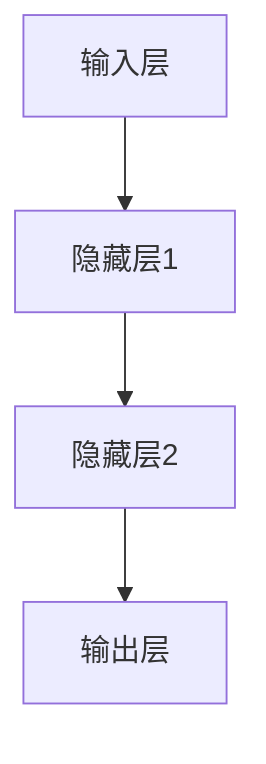
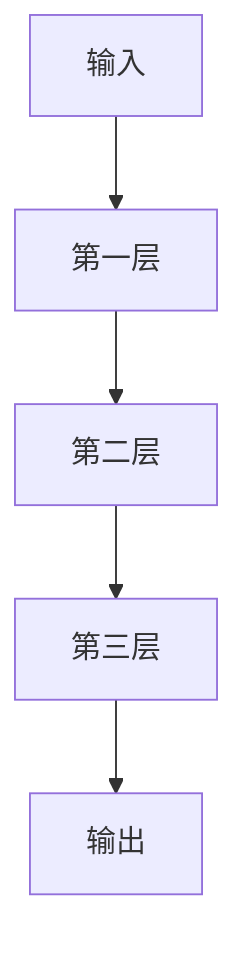
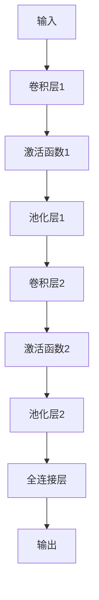
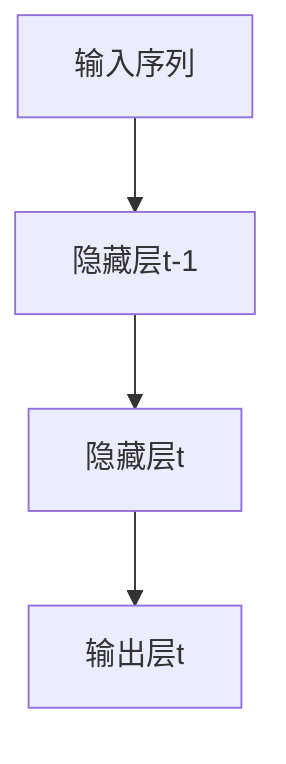
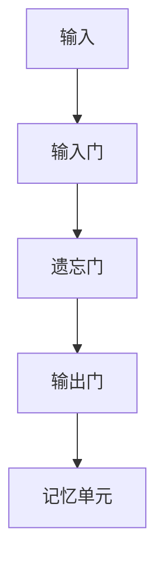
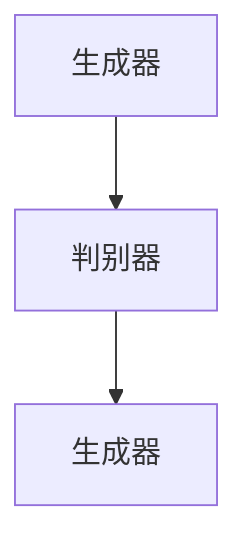
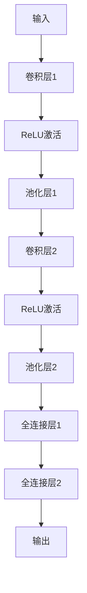
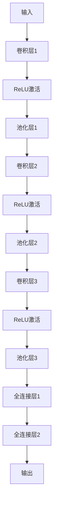
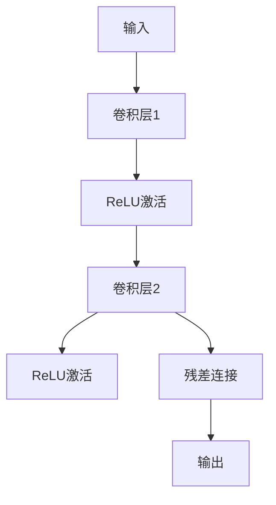
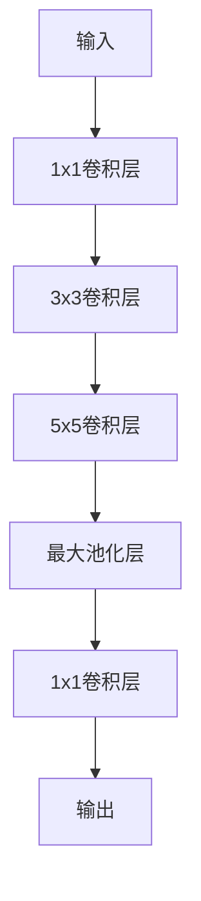

                 

### 文章标题

**自动驾驶中的深度学习模型泛化能力改进**

---

### 文章关键词

自动驾驶，深度学习，泛化能力，模型安全，性能优化，实战应用

---

### 文章摘要

本文深入探讨了自动驾驶系统中深度学习模型的泛化能力改进。首先，介绍了自动驾驶与深度学习的紧密联系及其结合的优势。随后，详细解析了深度学习模型的基本概念、核心算法原理，并通过伪代码和流程图进行了说明。接着，文章重点分析了深度学习模型在自动驾驶中的应用场景，探讨了当前深度学习模型泛化能力的挑战，并提出了多种改进方法，包括数据增强、自监督学习、跨域迁移学习和大规模预训练模型。此外，本文还分析了自动驾驶中深度学习模型的安全性，性能优化策略，以及具体的实战应用案例。通过本文的阅读，读者将全面了解深度学习模型在自动驾驶领域的应用与发展，并掌握提高模型泛化能力的有效方法。

---

### 第1章: 自驾驶中的深度学习模型

#### 1.1 自动驾驶与深度学习的关系

##### 1.1.1 自动驾驶技术的发展历程

自动驾驶技术经历了漫长的发展过程。最早期的自动驾驶系统主要依赖于机械自动化和简单的传感器，如雷达和激光测距仪。这些系统通常只能执行简单的任务，如自动泊车和车道保持。随着计算机技术和传感器技术的进步，基于规则的自动驾驶系统逐渐出现，这类系统通过预设的规则和算法来控制车辆的运行。然而，这些系统在面对复杂和未知环境时表现不佳，存在许多局限性。

近年来，深度学习技术的发展为自动驾驶带来了新的机遇。深度学习模型，尤其是卷积神经网络（CNN）、循环神经网络（RNN）和生成对抗网络（GAN）等，因其强大的特征提取和模式识别能力，被广泛应用于自动驾驶系统。这些模型能够通过大量的训练数据自动学习复杂的环境特征，从而实现更高层次的自动驾驶功能，如环境感知、路径规划和车辆控制。

##### 1.1.2 深度学习在自动驾驶中的角色

深度学习在自动驾驶系统中扮演着至关重要的角色。首先，深度学习模型被广泛应用于环境感知任务，如物体检测、语义分割和场景理解。通过分析摄像头、激光雷达和雷达等传感器采集的数据，深度学习模型能够识别道路标志、行人、车辆和其他障碍物，为自动驾驶系统提供准确的环境信息。

其次，深度学习模型在路径规划和决策方面也发挥了重要作用。基于深度学习模型，自动驾驶系统能够预测其他车辆和行人的行为，并根据实时环境信息制定合理的行驶策略。例如，通过分析交通信号灯的状态、道路标志和交通流量，深度学习模型可以自动调整车辆的行驶速度和方向，以确保行驶的安全和高效。

最后，深度学习模型还在车辆控制方面得到了广泛应用。通过实时监测车辆的传感器数据，如加速度、转向角度和速度等，深度学习模型可以精确控制车辆的加速度和转向，实现平稳、安全的驾驶体验。

##### 1.1.3 自动驾驶与深度学习结合的优势

自动驾驶与深度学习相结合，带来了许多显著的优势：

1. **更高的准确性和鲁棒性**：深度学习模型通过大量的训练数据自动学习环境特征，能够在复杂和未知的环境中实现更高的准确性和鲁棒性。这使得自动驾驶系统能够在各种天气条件和交通环境中保持稳定运行。

2. **更复杂的任务处理**：深度学习模型能够处理复杂的决策和执行任务，如路径规划、行为预测和车辆控制。这使得自动驾驶系统可以执行更复杂的驾驶任务，提高驾驶的安全性和舒适性。

3. **更短的研发周期**：深度学习模型可以快速迭代和优化，缩短了自动驾驶系统的研发周期。通过快速迭代和优化，开发者可以更快地将自动驾驶系统推向市场。

4. **更低的成本**：虽然深度学习模型需要大量的计算资源和训练数据，但随着硬件和算法的进步，这些成本正在逐渐降低。此外，深度学习模型的可重用性和通用性，也有助于降低研发成本。

##### 1.2 深度学习模型的泛化能力

##### 1.2.1 泛化能力的定义

泛化能力是指深度学习模型在未见过的数据上表现的能力。一个具有良好泛化能力的模型，不仅能在训练数据上取得优异的表现，还能在新的、未知的数据上保持稳定的表现。

在自动驾驶领域，深度学习模型的泛化能力尤为重要。因为自动驾驶系统需要在各种复杂、多变的环境中运行，如果模型只能在特定的数据集上表现良好，那么在实际应用中可能会面临诸多挑战。

##### 1.2.2 泛化能力的重要性

泛化能力对于自动驾驶系统的安全性和实用性至关重要。以下是泛化能力的重要意义：

1. **提高安全性**：良好的泛化能力能够确保模型在各种环境和条件下都能保持稳定和安全。这意味着自动驾驶系统在遇到未知或异常情况时，能够做出正确的决策，避免发生意外。

2. **提高实用性**：泛化能力使得深度学习模型能够适应不同的场景和任务，提高自动驾驶系统的实用性。例如，模型可以在不同的城市、不同的天气条件下运行，而不需要重新训练。

3. **减少数据需求**：具有良好泛化能力的模型，可以在较少的训练数据上实现优异的表现。这有助于减少自动驾驶系统的研发成本，降低对大规模标注数据的依赖。

##### 1.2.3 自动驾驶对泛化能力的需求

自动驾驶系统对泛化能力的需求主要体现在以下几个方面：

1. **多场景适应性**：自动驾驶系统需要在各种复杂、多变的环境中运行，如城市道路、高速公路、乡村道路等。模型需要在这些场景中都能保持稳定的表现。

2. **多任务适应性**：自动驾驶系统需要执行多种任务，如感知、决策、控制等。模型需要能够在不同任务中都能表现出良好的泛化能力。

3. **多传感器融合**：自动驾驶系统通常需要融合多种传感器数据，如摄像头、激光雷达、雷达等。模型需要能够处理这些多模态数据，并从中提取有效的信息。

4. **动态环境适应性**：自动驾驶系统需要能够适应动态环境，如交通堵塞、突发事件等。模型需要能够实时调整策略，以应对这些变化。

##### 1.3 深度学习模型在自动驾驶中的应用场景

##### 1.3.1 感知场景

在自动驾驶系统中，感知是关键的一环。深度学习模型在感知场景中的应用主要包括：

1. **物体检测**：通过分析摄像头或激光雷达数据，模型能够识别道路上的车辆、行人、交通标志等物体。
2. **语义分割**：模型能够将摄像头或激光雷达数据中的每个像素点分类，从而实现对环境的精确理解。
3. **场景理解**：模型能够分析环境数据，理解当前的道路情况、交通规则等，为后续的决策提供支持。

##### 1.3.2 决策场景

在决策场景中，深度学习模型需要根据感知到的环境信息，制定合理的行驶策略。具体应用包括：

1. **路径规划**：模型需要根据交通规则、道路状况和目标位置，规划出最优的行驶路径。
2. **行为预测**：模型需要预测其他车辆和行人的行为，以便调整自己的行驶策略。
3. **交通规则遵守**：模型需要确保车辆遵守交通规则，如让行、避让等。

##### 1.3.3 控制场景

在控制场景中，深度学习模型需要实时控制车辆的运动状态，包括速度、转向和加速度等。具体应用包括：

1. **加速度控制**：模型需要根据行驶策略调整车辆的加速度，以保持稳定的速度。
2. **转向控制**：模型需要根据道路情况和行驶策略调整车辆的转向角度。
3. **制动控制**：模型需要根据感知到的障碍物和交通状况，及时进行制动，确保行驶的安全。

##### 1.4 深度学习模型泛化能力改进的必要性

##### 1.4.1 当前深度学习模型泛化能力的挑战

尽管深度学习模型在自动驾驶系统中取得了显著成果，但其泛化能力仍面临许多挑战：

1. **数据依赖性**：深度学习模型通常需要大量的标注数据来进行训练。然而，自动驾驶系统面临的环境和场景多种多样，难以获取足够的标注数据。
2. **模型复杂度**：深度学习模型通常具有很高的复杂度，容易受到过拟合问题的影响，导致在未见过的数据上表现不佳。
3. **环境多样性**：自动驾驶系统需要在不同的环境条件下运行，如不同的天气、道路状况和交通流量等。模型需要能够适应这些多样化的环境。
4. **实时性要求**：自动驾驶系统需要在实时环境中做出决策，模型的计算速度和响应速度成为关键因素。

##### 1.4.2 自动驾驶安全性的要求

自动驾驶系统的安全性是首要考虑的问题。具有良好泛化能力的深度学习模型，能够在各种环境和场景下保持稳定和可靠的表现，从而提高系统的安全性。以下是提高泛化能力对自动驾驶安全性的重要性：

1. **减少事故风险**：良好的泛化能力能够确保模型在各种复杂和异常情况下都能做出正确的决策，减少交通事故的风险。
2. **提高用户信任**：用户对自动驾驶系统的信任取决于系统的安全性和可靠性。具有良好泛化能力的模型能够提供稳定的表现，增加用户的信任度。
3. **满足法律法规**：许多国家和地区对自动驾驶系统制定了严格的法律法规，要求系统在多种场景下保持稳定和安全。提高泛化能力是满足这些要求的关键。

##### 1.4.3 提高泛化能力的必要性和紧迫性

为了实现真正的自动驾驶，提高深度学习模型的泛化能力是必不可少的。以下是提高泛化能力的必要性和紧迫性：

1. **技术进步的需求**：随着自动驾驶技术的不断进步，系统需要能够应对更多复杂和未知的场景。提高泛化能力是满足这一需求的关键。
2. **市场竞争的驱动力**：自动驾驶领域竞争激烈，提高泛化能力能够帮助企业在市场竞争中脱颖而出。
3. **社会效益的体现**：自动驾驶技术的普及有望减少交通事故，提高交通效率，降低环境污染。提高泛化能力是实现这些社会效益的关键。

### 总结

深度学习模型在自动驾驶系统中具有广泛的应用，但泛化能力不足仍是当前面临的主要挑战。提高深度学习模型的泛化能力对于实现安全、可靠的自动驾驶至关重要。在接下来的章节中，我们将深入探讨深度学习模型的基本概念、算法原理和泛化能力改进方法，为读者提供全面的了解和指导。希望本文能为自动驾驶技术的发展贡献一份力量。---

## 第2章: 自动驾驶中的深度学习模型核心概念与联系

### 2.1 深度学习基本概念

##### 2.1.1 神经网络

神经网络（Neural Networks，简称NN）是深度学习的基础。神经网络模仿人脑中的神经元结构和工作方式，通过大量节点（称为神经元）和连接（称为权重）组成。每个神经元接收输入信号，通过权重进行加权求和，再经过激活函数处理后输出信号。

神经网络的基本结构包括输入层、隐藏层和输出层：

- **输入层**：接收外部输入数据，如图片、声音等。
- **隐藏层**：一层或多层，用于提取和转换输入特征。
- **输出层**：输出最终的结果，如分类标签、数值预测等。


**Mermaid流程图：**


##### 2.1.2 深层神经网络

深层神经网络（Deep Neural Networks，简称DNN）是指拥有多个隐藏层的神经网络。深层神经网络通过多层非线性变换，能够提取更复杂、更高层次的特征，从而在图像识别、语音识别和自然语言处理等任务中表现出色。

深层神经网络的优势包括：

1. **更好的特征提取能力**：多层网络可以逐步提取输入数据的抽象特征。
2. **更强的泛化能力**：多层网络能够更好地处理未见过的数据。

然而，深层神经网络也面临挑战，如过拟合和计算复杂度增加。

**Mermaid流程图：**


##### 2.1.3 反向传播算法

反向传播算法（Backpropagation）是深层神经网络训练的核心算法。它通过前向传播计算输出，然后通过反向传播计算梯度，以更新网络权重和偏置。

反向传播算法的基本步骤包括：

1. **前向传播**：计算输出和误差。
2. **反向传播**：计算梯度。
3. **权重更新**：根据梯度更新权重。

**伪代码：**
```python
def forward_propagation(input_data, weights, biases):
    # 前向传播计算
    output = activation_function(np.dot(input_data, weights) + biases)
    return output

def backward_propagation(output, expected_output, weights, biases):
    # 计算梯度
    error = expected_output - output
    d_output = activation_function_derivative(output)
    d_weights = np.dot(input_data.T, d_output)
    d_biases = d_output.sum(axis=0)
    return d_weights, d_biases

def update_weights(weights, biases, d_weights, d_biases, learning_rate):
    # 更新权重和偏置
    weights -= learning_rate * d_weights
    biases -= learning_rate * d_biases
    return weights, biases
```

### 2.2 深度学习模型分类

##### 2.2.1 卷积神经网络（CNN）

卷积神经网络（Convolutional Neural Networks，简称CNN）是专门用于处理图像数据的深度学习模型。CNN通过卷积层、池化层和全连接层等结构，能够自动提取图像特征，实现图像分类、物体检测和语义分割等任务。

**Mermaid流程图：**


##### 2.2.2 循环神经网络（RNN）

循环神经网络（Recurrent Neural Networks，简称RNN）是一种能够处理序列数据的深度学习模型。RNN通过递归结构，将前一个时间步的输出作为当前时间步的输入，从而具有记忆能力。

**Mermaid流程图：**


##### 2.2.3 长短期记忆网络（LSTM）

长短期记忆网络（Long Short-Term Memory，简称LSTM）是RNN的一种改进模型，专门用于处理长序列数据。LSTM通过引入门控机制，有效地解决了RNN的梯度消失和长期依赖问题。

**Mermaid流程图：**


##### 2.2.4 生成对抗网络（GAN）

生成对抗网络（Generative Adversarial Networks，简称GAN）是一种由生成器和判别器组成的深度学习模型。生成器生成数据，判别器判断数据是真实还是生成。两者相互竞争，最终生成器生成逼真的数据。

**Mermaid流程图：**


### 2.3 深度学习模型架构

##### 2.3.1 AlexNet

AlexNet是深度学习历史上的一个重要里程碑，由Alex Krizhevsky等人提出。AlexNet通过使用多个卷积层和池化层，实现了图像分类的突破性成果。

**Mermaid流程图：**


##### 2.3.2 VGGNet

VGGNet由牛津大学视觉几何组（Visual Geometry Group）提出，通过使用多个卷积层和较小的卷积核尺寸，实现了图像分类的进一步改进。

**Mermaid流程图：**


##### 2.3.3 ResNet

ResNet由微软研究院提出，通过引入残差块（Residual Block）解决了深层网络训练中的梯度消失问题，实现了图像分类的又一突破。

**Mermaid流程图：**


##### 2.3.4 InceptionNet

InceptionNet通过引入多尺度卷积和池化层，提高了图像特征提取的效率和准确性，进一步推动了图像分类的发展。

**Mermaid流程图：**


### 2.4 深度学习模型与自动驾驶的关联

##### 2.4.1 深度学习模型在自动驾驶中的应用

深度学习模型在自动驾驶系统中有着广泛的应用，主要包括：

1. **感知系统**：通过卷积神经网络（CNN）等模型，处理摄像头、激光雷达等传感器数据，实现物体检测、场景理解等任务。
2. **决策系统**：通过循环神经网络（RNN）和长短期记忆网络（LSTM）等模型，分析感知系统提供的信息，实现路径规划、行为预测等任务。
3. **控制系统**：通过神经网络控制算法，实现车辆的加速度、转向等控制。

##### 2.4.2 自动驾驶任务与深度学习模型的选择

不同的自动驾驶任务需要不同的深度学习模型，以下是一些常见任务与模型的选择：

1. **物体检测**：常用的模型包括YOLO、SSD、Faster R-CNN等。
2. **路径规划**：常用的模型包括A*算法、Dijkstra算法等。
3. **行为预测**：常用的模型包括LSTM、GRU等。
4. **车辆控制**：常用的模型包括PID控制器、神经网络控制算法等。

##### 2.4.3 深度学习模型泛化能力的挑战

在自动驾驶领域，深度学习模型的泛化能力面临以下挑战：

1. **数据多样性**：自动驾驶系统需要处理多种多样的数据，包括不同的天气、道路条件和交通状况。
2. **动态环境**：自动驾驶系统需要适应动态变化的交通环境，包括其他车辆的移动和行人的行为。
3. **数据标注**：自动驾驶系统需要大量的标注数据来训练模型，但获取高质量的标注数据成本高昂。

##### 2.4.4 提高泛化能力的策略

为了提高深度学习模型的泛化能力，可以采用以下策略：

1. **数据增强**：通过旋转、缩放、裁剪等操作，增加训练数据的多样性。
2. **自监督学习**：利用未标注的数据进行训练，提高模型的泛化能力。
3. **迁移学习**：将一种任务学到的知识应用到不同但相关的任务中。
4. **多任务学习**：同时训练多个任务，提高模型的泛化能力。

### 2.4.5 自监督学习在自动驾驶中的应用

自监督学习（Self-Supervised Learning）是一种无需标注数据，通过学习数据中的相关性来提高模型泛化能力的方法。在自动驾驶领域，自监督学习可以应用于以下方面：

1. **数据预处理**：通过自监督学习进行数据增强，提高训练数据的多样性。
2. **特征提取**：通过自监督学习提取通用特征，提高模型的泛化能力。
3. **行为预测**：通过自监督学习预测其他车辆和行人的行为，提高自动驾驶系统的安全性。

### 2.4.6 大规模预训练模型的应用

大规模预训练模型（Large-scale Pretrained Models）通过在大规模数据集上进行预训练，然后通过微调适用于特定任务的模型。在自动驾驶领域，大规模预训练模型可以应用于以下方面：

1. **物体检测**：通过预训练模型提取高层次的语义特征，提高物体检测的准确性。
2. **场景理解**：通过预训练模型理解复杂场景，提高自动驾驶系统的决策能力。
3. **语音识别**：通过预训练模型提取语音特征，提高语音识别的准确性。

### 总结

深度学习模型在自动驾驶系统中扮演着重要角色，从感知、决策到控制，深度学习模型都发挥了关键作用。然而，深度学习模型的泛化能力仍面临挑战，需要采用多种策略来提高。在接下来的章节中，我们将深入探讨深度学习模型在自动驾驶中的应用算法原理和泛化能力改进方法。希望本文能帮助读者更好地理解和应用深度学习技术于自动驾驶领域。---

## 第3章: 自动驾驶中的深度学习模型算法原理详解

### 3.1 卷积神经网络（CNN）算法原理

卷积神经网络（CNN）是一种特别适用于处理图像数据的深度学习模型。其核心思想是通过卷积层、池化层和全连接层等结构，自动提取图像特征，实现图像分类、物体检测和语义分割等任务。

#### 3.1.1 CNN基本结构

CNN的基本结构包括以下几个部分：

1. **输入层**：接收输入图像，通常是一个三维数组（宽、高、通道数）。
2. **卷积层**：通过卷积操作提取图像特征。卷积层由多个卷积核组成，每个卷积核都负责提取图像中的不同特征。
3. **激活函数**：对卷积层的输出进行非线性变换，常用的激活函数包括ReLU（Rectified Linear Unit）。
4. **池化层**：对卷积层的输出进行下采样，减少数据维度，提高计算效率。常用的池化操作包括最大池化和平均池化。
5. **全连接层**：将卷积层和池化层提取的高维特征映射到输出层，实现最终的分类或预测。
6. **输出层**：输出分类结果或预测值。

**Mermaid流程图：**

```mermaid
graph TD
A[输入] --> B[卷积层1]
B --> C[ReLU激活]
C --> D[池化层1]
D --> E[卷积层2]
E --> F[ReLU

