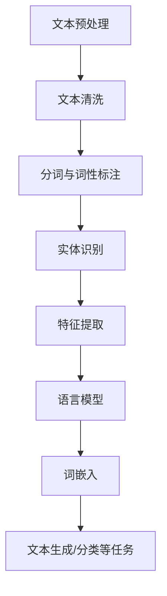
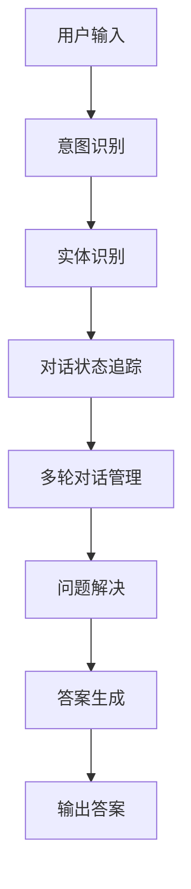
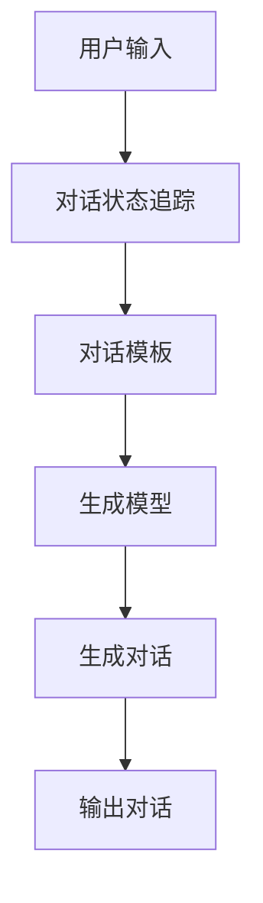

                 

### 《自然语言处理在智能客服系统中的应用》

#### **关键词**：自然语言处理、智能客服、意图识别、情感分析、对话生成、个性化推荐

#### **摘要**：

随着人工智能技术的快速发展，自然语言处理（NLP）逐渐成为智能客服系统的核心组成部分。本文将详细探讨自然语言处理在智能客服系统中的应用，包括基础理论、应用架构、关键技术和实际案例。通过分析自然语言处理在意图识别、情感分析、对话生成和个性化推荐等方面的应用，揭示其在提升客服系统智能化水平方面的巨大潜力。本文旨在为从事智能客服开发的读者提供有价值的参考和指导。

## 第一部分：自然语言处理（NLP）基础

### **第1章：自然语言处理概述**

#### **1.1 自然语言处理的基本概念**

自然语言处理（NLP）是人工智能（AI）的一个重要分支，旨在使计算机能够理解和处理人类自然语言。其核心任务是理解和生成人类语言，实现人与机器之间的自然交互。

**自然语言处理**：定义和范围

自然语言处理涵盖了语音识别、文本分析、机器翻译、信息检索等多个子领域。其主要目标是使计算机能够理解、解释和生成人类语言，从而实现人与机器之间的自然交互。

**自然语言处理的应用领域**

自然语言处理在多个领域都有广泛应用，如：

- **智能客服**：提供智能问答、情感分析、对话生成等服务。
- **机器翻译**：将一种语言翻译成另一种语言。
- **信息检索**：在大量文本数据中检索信息。
- **文本分析**：提取文本中的关键信息，如关键词、情感倾向等。

**自然语言处理的发展历程**

自然语言处理的发展经历了几个阶段：

- **规则方法**：基于手动编写的语法规则进行文本分析。
- **统计方法**：使用统计学方法，如隐马尔可夫模型（HMM）、条件概率模型等。
- **深度学习方法**：使用神经网络模型，如循环神经网络（RNN）、长短时记忆网络（LSTM）、变换器（Transformer）等。

#### **1.2 语言模型与词嵌入**

**语言模型**：定义、作用和常见模型

语言模型是自然语言处理的核心组件之一，用于预测下一个单词或字符的概率。常见的语言模型包括：

- **N-gram模型**：基于单词序列的前N个单词来预测下一个单词。
- **神经网络模型**：如循环神经网络（RNN）、长短时记忆网络（LSTM）、变换器（Transformer）等。

**语言模型的作用**

语言模型在自然语言处理中具有重要作用，如：

- **文本生成**：根据已知的文本生成新的文本。
- **文本分类**：将文本分类到不同的类别。
- **命名实体识别**：识别文本中的命名实体，如人名、地名等。

**词嵌入**：技术原理、实现方法与应用

词嵌入是将词语映射到高维向量空间的过程，使得词语之间的相似性在向量空间中得到体现。常见的词嵌入方法包括：

- **Word2Vec**：基于神经网络的词嵌入方法，通过训练得到词语的向量表示。
- **GloVe**：全局向量表示，通过计算词语的共现矩阵来学习词向量。

**词嵌入的应用**

词嵌入在自然语言处理中广泛应用于：

- **文本分类**：使用词向量表示文本，通过机器学习算法进行分类。
- **情感分析**：使用词向量表示文本，通过计算词向量的相似性进行情感分析。
- **问答系统**：使用词向量表示问题和回答，通过计算相似性进行答案推荐。

### **第2章：文本预处理与特征提取**

#### **2.1 文本预处理**

文本预处理是自然语言处理中的关键步骤，主要包括以下内容：

- **文本清洗**：去除停用词、标点符号、数字等无关信息，提高文本质量。
- **分词与词性标注**：将文本拆分成单词或词汇单元，并标注每个词汇的词性。
- **中文分词**：中文分词是自然语言处理中的难点，常用的方法包括基于词典的分词、基于统计的分词等。
- **实体识别**：识别文本中的实体，如人名、地名、机构名等，提高文本理解能力。

#### **2.2 特征提取**

特征提取是将原始文本转换为机器学习算法可处理的特征向量表示的过程。常见的特征提取方法包括：

- **词袋模型**：将文本表示为一个向量，其中每个维度表示一个单词的出现次数。
- **TF-IDF**：基于词频（TF）和逆文档频率（IDF）计算单词的重要性，并将其作为特征向量。
- **词嵌入**：将文本中的单词映射为高维向量，作为特征向量。

**核心概念与联系：**

以下是自然语言处理中的核心概念和它们之间的联系：

- **语言模型**：用于预测下一个单词的概率，与文本生成、文本分类、命名实体识别等任务密切相关。
- **词嵌入**：将词语映射到高维向量空间，与文本分类、情感分析等任务密切相关。
- **文本预处理**：包括文本清洗、分词、词性标注、实体识别等，为特征提取和模型训练提供高质量的输入。
- **特征提取**：将原始文本转换为特征向量表示，为机器学习算法提供输入。

**Mermaid 流程图：**

以下是自然语言处理的核心概念和流程的 Mermaid 流程图：



**核心算法原理讲解：**

以下是自然语言处理中的一些核心算法原理讲解：

- **N-gram 模型**：N-gram 模型是一种基于统计的语言模型，它将文本序列表示为连续的N个单词的组合。在训练阶段，N-gram 模型统计每个N-gram 的出现频率，并在预测阶段根据这些频率来预测下一个单词。

  ```python
  # 伪代码：N-gram 模型训练和预测
  def train_ngram_model(corpus, n):
      n_gram_freq = {}
      for n_gram in generate_n_grams(corpus, n):
          n_gram_freq[n_gram] = n_gram_freq.get(n_gram, 0) + 1
      return n_gram_freq

  def predict_next_word(n_gram_model, previous_words):
      n_gram = tuple(previous_words[-n:])
      return sample(n_gram_model[n_gram])
  ```

- **Word2Vec 模型**：Word2Vec 是一种基于神经网络的词嵌入方法，它通过训练神经网络来预测上下文单词，从而学习词语的向量表示。Word2Vec 模型主要有两种架构：连续词袋（CBOW）和Skip-Gram。

  ```python
  # 伪代码：Word2Vec 模型训练
  def train_word2vec_model(corpus, window_size, embedding_size):
      model = Word2Vec(corpus, window=window_size, embedding_size=embedding_size)
      model.fit(corpus)
      return model

  def get_word_vector(word2vec_model, word):
      return word2vec_model[word]
  ```

- **情感分析**：情感分析是一种常见的自然语言处理任务，旨在判断文本的情感倾向。常见的情感分析算法包括基于规则的方法和基于机器学习的方法。

  ```python
  # 伪代码：基于规则的情感分析
  def sentiment_analysis_rule_based(text):
      if "很好" in text or "非常喜欢" in text:
          return "正面"
      elif "很差" in text or "非常不喜欢" in text:
          return "负面"
      else:
          return "中性"

  # 伪代码：基于机器学习的情感分析
  def sentiment_analysis_ml(text, model):
      return model.predict([text])
  ```

**数学模型和公式 & 详细讲解 & 举例说明：**

以下是自然语言处理中的一些数学模型和公式及其详细讲解和举例说明：

- **TF-IDF**：TF-IDF 是一种常用的文本特征提取方法，它通过计算词语在文档中的词频（TF）和逆文档频率（IDF）来衡量词语的重要性。

  **公式**：

  $$
  \text{TF-IDF}(w,d) = \text{TF}(w,d) \times \text{IDF}(w)
  $$

  **详细讲解**：

  - **TF（词频）**：词语在文档中的出现次数。
  - **IDF（逆文档频率）**：词语在所有文档中出现的频率的倒数，用于平衡高频词语的影响。

  **举例说明**：

  假设有一个文档集合，其中包含两个文档 d1 和 d2，词语 "智能" 在 d1 中出现了3次，在 d2 中出现了1次。其他词语的出现次数较少。

  $$
  \text{TF}(\text{智能}, d1) = 3, \text{TF}(\text{智能}, d2) = 1
  $$

  假设 "智能" 在所有文档中出现的总次数为10次。

  $$
  \text{IDF}(\text{智能}) = \log_2(\frac{N}{n})
  $$

  其中，N 是文档总数，n 是词语在所有文档中出现的总次数。

  $$
  \text{IDF}(\text{智能}) = \log_2(\frac{2}{10}) = 0.5
  $$

  因此，词语 "智能" 在两个文档中的 TF-IDF 值分别为：

  $$
  \text{TF-IDF}(\text{智能}, d1) = 3 \times 0.5 = 1.5
  $$

  $$
  \text{TF-IDF}(\text{智能}, d2) = 1 \times 0.5 = 0.5
  $$

- **卷积神经网络（CNN）**：卷积神经网络是一种用于文本分类和情感分析的常见神经网络模型。它通过卷积操作提取文本中的局部特征。

  **公式**：

  $$
  h_{ij} = \text{激活函数}(\sum_{k} w_{ik} \times a_{kj} + b_{i})
  $$

  **详细讲解**：

  - **$h_{ij}$**：卷积核在第i个特征图上的第j个输出值。
  - **$w_{ik}$**：卷积核的权重。
  - **$a_{kj}$**：输入特征图在第k个位置上的值。
  - **$b_{i}$**：偏置项。

  **举例说明**：

  假设有一个3x3的卷积核和一个1x1的激活函数（如ReLU），输入特征图的大小为5x5。

  $$
  w_{11} = 1, w_{12} = 2, w_{13} = 3 \\
  w_{21} = 4, w_{22} = 5, w_{23} = 6 \\
  w_{31} = 7, w_{32} = 8, w_{33} = 9
  $$

  输入特征图为：

  $$
  a_{11} = 1, a_{12} = 2, a_{13} = 3, a_{14} = 4, a_{15} = 5 \\
  a_{21} = 6, a_{22} = 7, a_{23} = 8, a_{24} = 9, a_{25} = 10 \\
  a_{31} = 11, a_{32} = 12, a_{33} = 13, a_{34} = 14, a_{35} = 15
  $$

  对应的卷积操作和激活函数为：

  $$
  h_{11} = \text{ReLU}(1 \times 1 + 4 \times 6 + 7 \times 11 + 9 \times 12 + 10 \times 13) = 78 \\
  h_{12} = \text{ReLU}(2 \times 1 + 5 \times 6 + 8 \times 11 + 9 \times 12 + 10 \times 13) = 82 \\
  h_{13} = \text{ReLU}(3 \times 1 + 6 \times 6 + 7 \times 11 + 8 \times 12 + 10 \times 13) = 86 \\
  h_{21} = \text{ReLU}(1 \times 6 + 4 \times 7 + 7 \times 11 + 9 \times 12 + 10 \times 13) = 76 \\
  h_{22} = \text{ReLU}(2 \times 6 + 5 \times 7 + 8 \times 11 + 9 \times 12 + 10 \times 13) = 80 \\
  h_{23} = \text{ReLU}(3 \times 6 + 6 \times 7 + 7 \times 11 + 8 \times 12 + 10 \times 13) = 84 \\
  h_{31} = \text{ReLU}(1 \times 11 + 4 \times 12 + 7 \times 13 + 9 \times 14 + 10 \times 15) = 76 \\
  h_{32} = \text{ReLU}(2 \times 11 + 5 \times 12 + 8 \times 13 + 9 \times 14 + 10 \times 15) = 80 \\
  h_{33} = \text{ReLU}(3 \times 11 + 6 \times 12 + 7 \times 13 + 8 \times 14 + 10 \times 15) = 84
  $$

**项目实战：代码实际案例和详细解释说明：**

以下是自然语言处理项目中的一些实际代码案例和详细解释说明：

- **文本分类**：使用 Python 的 `sklearn` 库实现一个简单的文本分类器。

  ```python
  from sklearn.feature_extraction.text import TfidfVectorizer
  from sklearn.model_selection import train_test_split
  from sklearn.svm import LinearSVC

  # 加载数据集
  corpus = ["我喜欢吃苹果", "他喜欢看电影", "苹果是一种水果", "电影是娱乐活动"]
  labels = ["正面", "正面", "中性", "中性"]

  # 特征提取
  vectorizer = TfidfVectorizer()
  X = vectorizer.fit_transform(corpus)

  # 数据集划分
  X_train, X_test, y_train, y_test = train_test_split(X, labels, test_size=0.2, random_state=42)

  # 模型训练
  model = LinearSVC()
  model.fit(X_train, y_train)

  # 模型评估
  score = model.score(X_test, y_test)
  print(f"文本分类器的准确率为：{score}")
  ```

- **情感分析**：使用 Python 的 `nltk` 库实现一个简单的情感分析器。

  ```python
  import nltk
  from nltk.sentiment import SentimentIntensityAnalyzer

  # 加载情感分析器
  sia = SentimentIntensityAnalyzer()

  # 情感分析
  text = "我今天很开心"
  sentiment = sia.polarity_scores(text)
  print(f"文本的情感极性为：{sentiment}")
  ```

- **命名实体识别**：使用 Python 的 `spaCy` 库实现一个简单的命名实体识别器。

  ```python
  import spacy

  # 加载 spaCy 模型
  nlp = spacy.load("en_core_web_sm")

  # 命名实体识别
  text = "Apple is a fruit"
  doc = nlp(text)
  entities = [(ent.text, ent.label_) for ent in doc.ents]
  print(f"文本中的命名实体：{entities}")
  ```

## **第二部分：自然语言处理在智能客服中的应用**

### **第3章：智能客服系统架构**

#### **3.1 智能客服系统概述**

智能客服系统是一种基于自然语言处理技术的自动化客户服务系统，旨在通过智能对话和问题解决能力，提高客户满意度和服务效率。智能客服系统通常包括以下功能：

- **自动问答**：根据用户输入的问题，自动生成相应的答案。
- **情感分析**：分析用户文本中的情感倾向，以便提供更加个性化的服务。
- **对话管理**：管理多轮对话，确保对话流畅自然。
- **知识库管理**：存储和检索相关的知识和信息，为客服提供支持。

#### **3.2 对话管理**

对话管理是智能客服系统的核心组成部分，负责确保对话的流畅性和有效性。对话管理主要包括以下任务：

- **意图识别**：识别用户的意图，如询问信息、请求帮助等。
- **实体识别**：从用户的输入中提取关键实体，如人名、地点等。
- **对话状态追踪**：记录对话的历史信息和状态，以便后续对话能够顺利进行。
- **多轮对话管理**：处理多轮对话中的复杂问题和情境。

**核心概念与联系：**

以下是智能客服系统中的核心概念和它们之间的联系：

- **意图识别**：识别用户的意图，与对话管理和问题解决密切相关。
- **实体识别**：提取用户输入中的关键实体，与知识库管理和对话状态追踪密切相关。
- **对话状态追踪**：记录对话的历史信息和状态，与对话管理和问题解决密切相关。
- **多轮对话管理**：处理多轮对话中的复杂问题和情境，与对话管理和问题解决密切相关。

**Mermaid 流程图：**

以下是智能客服系统中的核心概念和流程的 Mermaid 流程图：



**核心算法原理讲解：**

以下是智能客服系统中的一些核心算法原理讲解：

- **意图识别**：意图识别是智能客服系统的第一步，旨在理解用户的意图。常见的意图识别算法包括基于规则的方法和基于机器学习的方法。

  **基于规则的方法**：基于规则的方法使用预定义的规则来识别用户的意图。例如，如果用户输入包含 "查询"、"下单"、"退款" 等关键词，则认为用户的意图是相应的操作。

  ```python
  # 伪代码：基于规则的方法
  def intent_recognition.RuleBased(text):
      if "查询" in text:
          return "查询意图"
      elif "下单" in text:
          return "下单意图"
      elif "退款" in text:
          return "退款意图"
      else:
          return "未知意图"
  ```

  **基于机器学习的方法**：基于机器学习的方法使用训练好的模型来识别用户的意图。常见的机器学习算法包括朴素贝叶斯、支持向量机、深度学习等。

  ```python
  # 伪代码：基于机器学习的方法
  def intent_recognition.MLModel(text, model):
      return model.predict([text])
  ```

- **实体识别**：实体识别旨在从用户的输入中提取关键实体，如人名、地点、日期等。常见的实体识别算法包括基于规则的方法和基于机器学习的方法。

  **基于规则的方法**：基于规则的方法使用预定义的规则来识别实体。例如，如果用户输入包含 "张三"、"上海"、"明天" 等关键词，则认为相应的输入包含相应的实体。

  ```python
  # 伪代码：基于规则的方法
  def entity_recognition.RuleBased(text):
      entities = []
      if "张三" in text:
          entities.append("张三")
      if "上海" in text:
          entities.append("上海")
      if "明天" in text:
          entities.append("明天")
      return entities
  ```

  **基于机器学习的方法**：基于机器学习的方法使用训练好的模型来识别实体。常见的机器学习算法包括朴素贝叶斯、支持向量机、深度学习等。

  ```python
  # 伪代码：基于机器学习的方法
  def entity_recognition.MLModel(text, model):
      doc = nlp(text)
      entities = [ent.text for ent in doc.ents]
      return entities
  ```

- **对话状态追踪**：对话状态追踪旨在记录对话的历史信息和状态，以便后续对话能够顺利进行。常见的对话状态追踪算法包括基于规则的方法和基于机器学习的方法。

  **基于规则的方法**：基于规则的方法使用预定义的规则来记录对话状态。例如，如果用户输入包含 "查询" 操作，则将当前对话状态标记为 "查询状态"。

  ```python
  # 伪代码：基于规则的方法
  def dialogue_state_tracking.RuleBased(text):
      if "查询" in text:
          return "查询状态"
      elif "下单" in text:
          return "下单状态"
      elif "退款" in text:
          return "退款状态"
      else:
          return "未知状态"
  ```

  **基于机器学习的方法**：基于机器学习的方法使用训练好的模型来记录对话状态。常见的机器学习算法包括朴素贝叶斯、支持向量机、深度学习等。

  ```python
  # 伪代码：基于机器学习的方法
  def dialogue_state_tracking.MLModel(text, model):
      return model.predict([text])
  ```

- **多轮对话管理**：多轮对话管理旨在处理多轮对话中的复杂问题和情境。常见的多轮对话管理算法包括基于规则的方法和基于机器学习的方法。

  **基于规则的方法**：基于规则的方法使用预定义的规则来处理多轮对话。例如，如果当前对话状态是 "查询状态"，则回答用户的问题，并继续询问更多信息。

  ```python
  # 伪代码：基于规则的方法
  def dialogue_management.RuleBased(state, text):
      if state == "查询状态":
          return "请告诉我您要查询的信息。"
      elif state == "下单状态":
          return "请告诉我您的订单信息。"
      elif state == "退款状态":
          return "请告诉我您的退款请求。"
      else:
          return "我不确定您的需求，请稍后再试。"
  ```

  **基于机器学习的方法**：基于机器学习的方法使用训练好的模型来处理多轮对话。常见的机器学习算法包括朴素贝叶斯、支持向量机、深度学习等。

  ```python
  # 伪代码：基于机器学习的方法
  def dialogue_management.MLModel(state, text, model):
      return model.predict([text])
  ```

**数学模型和公式 & 详细讲解 & 举例说明：**

以下是智能客服系统中的一些数学模型和公式及其详细讲解和举例说明：

- **朴素贝叶斯分类器**：朴素贝叶斯分类器是一种基于贝叶斯定理的简单分类器，适用于文本分类和意图识别等任务。

  **公式**：

  $$
  P(\text{意图}|\text{特征}) = \frac{P(\text{特征}|\text{意图}) \times P(\text{意图})}{P(\text{特征})}
  $$

  **详细讲解**：

  - **$P(\text{意图}|\text{特征})$**：后验概率，表示给定特征时意图的概率。
  - **$P(\text{特征}|\text{意图})$**：条件概率，表示给定意图时特征的概率。
  - **$P(\text{意图})$**：先验概率，表示意图的概率。
  - **$P(\text{特征})$**：特征的概率，可以通过拉普拉斯正则化进行平滑。

  **举例说明**：

  假设有一个文本分类任务，有两个类别："查询" 和 "下单"。特征包括 "查询" 和 "下单" 的出现次数。

  $$
  P(\text{查询}|\text{特征}) = \frac{P(\text{特征}|\text{查询}) \times P(\text{查询})}{P(\text{特征})}
  $$

  $$
  P(\text{下单}|\text{特征}) = \frac{P(\text{特征}|\text{下单}) \times P(\text{下单})}{P(\text{特征})}
  $$

  假设特征 "查询" 的出现次数为 2，特征 "下单" 的出现次数为 1。先验概率 $P(\text{查询}) = 0.6$，$P(\text{下单}) = 0.4$。条件概率 $P(\text{特征}|\text{查询}) = 0.8$，$P(\text{特征}|\text{下单}) = 0.2$。

  $$
  P(\text{查询}|\text{特征}) = \frac{0.8 \times 0.6}{0.8 \times 0.6 + 0.2 \times 0.4} = 0.75
  $$

  $$
  P(\text{下单}|\text{特征}) = \frac{0.2 \times 0.4}{0.8 \times 0.6 + 0.2 \times 0.4} = 0.25
  $$

  根据后验概率，可以判断文本的类别为 "查询"。

- **支持向量机（SVM）**：支持向量机是一种常用的分类算法，适用于文本分类和意图识别等任务。

  **公式**：

  $$
  w \cdot x + b = 0
  $$

  **详细讲解**：

  - **$w$**：权重向量，表示特征的重要性。
  - **$x$**：特征向量，表示文本的特征。
  - **$b$**：偏置项，用于调整分类边界。

  **举例说明**：

  假设有一个二分类问题，有两个类别："正面" 和 "负面"。特征包括 "喜欢" 和 "不喜欢" 的出现次数。

  $$
  w \cdot [2, 1] + b = 0
  $$

  假设权重向量 $w = [1, 1]$，偏置项 $b = 0$。文本的特征向量为 $[2, 1]$。

  $$
  1 \cdot 2 + 1 \cdot 1 + 0 = 3
  $$

  根据分类边界，可以判断文本的类别为 "正面"。

**项目实战：代码实际案例和详细解释说明：**

以下是智能客服系统中的一些实际代码案例和详细解释说明：

- **意图识别**：使用 Python 的 `sklearn` 库实现一个简单的意图识别器。

  ```python
  from sklearn.feature_extraction.text import TfidfVectorizer
  from sklearn.model_selection import train_test_split
  from sklearn.naive_bayes import MultinomialNB

  # 加载数据集
  corpus = ["查询订单状态", "我要退款", "咨询产品信息", "查看航班信息"]
  labels = ["查询意图", "退款意图", "咨询意图", "查看意图"]

  # 特征提取
  vectorizer = TfidfVectorizer()
  X = vectorizer.fit_transform(corpus)

  # 数据集划分
  X_train, X_test, y_train, y_test = train_test_split(X, labels, test_size=0.2, random_state=42)

  # 模型训练
  model = MultinomialNB()
  model.fit(X_train, y_train)

  # 模型评估
  score = model.score(X_test, y_test)
  print(f"意图识别器的准确率为：{score}")

  # 输入测试
  text = "我想退换货"
  features = vectorizer.transform([text])
  intent = model.predict(features)[0]
  print(f"输入文本的意图为：{intent}")
  ```

- **实体识别**：使用 Python 的 `spaCy` 库实现一个简单的实体识别器。

  ```python
  import spacy

  # 加载 spaCy 模型
  nlp = spacy.load("en_core_web_sm")

  # 加载测试数据集
  text = "张三购买了北京到上海的机票。"

  # 实体识别
  doc = nlp(text)
  entities = [(ent.text, ent.label_) for ent in doc.ents]
  print(f"文本中的命名实体：{entities}")
  ```

- **对话状态追踪**：使用 Python 的 `pandas` 库实现一个简单的对话状态追踪器。

  ```python
  import pandas as pd

  # 初始化对话状态追踪器
  dialogue_state_tracker = pd.DataFrame(columns=["turn", "user_input", "system_output", "state"])

  # 处理用户输入
  user_input = "我想咨询一下航班信息。"
  dialogue_state_tracker = dialogue_state_tracker.append({"turn": "user", "user_input": user_input, "system_output": "", "state": "咨询意图"}, ignore_index=True)

  # 回答用户输入
  system_output = "请问您要咨询哪个方面的航班信息？"
  dialogue_state_tracker = dialogue_state_tracker.append({"turn": "system", "user_input": user_input, "system_output": system_output, "state": "等待用户输入更多信息"}, ignore_index=True)

  # 显示对话状态
  print(dialogue_state_tracker)
  ```

## **第三部分：自然语言处理在智能客服中的应用**

### **第4章：意图识别与实体识别**

#### **4.1 意图识别**

意图识别是智能客服系统中的核心任务之一，旨在理解用户输入的意图，以便提供相应的服务。意图识别可以从以下几个方面进行：

- **用户意图分类**：将用户输入分类到预定义的意图类别，如查询、下单、退款等。
- **上下文理解**：理解用户输入的上下文信息，如用户的历史记录、对话状态等。
- **多意图识别**：在同一个用户输入中可能包含多个意图，需要同时识别多个意图。

**机器学习方法在意图识别中的应用**

- **朴素贝叶斯**：朴素贝叶斯分类器是一种简单而有效的意图识别方法。它基于贝叶斯定理，通过计算先验概率、条件概率和后验概率进行分类。
- **支持向量机（SVM）**：支持向量机是一种强大的分类算法，适用于处理高维数据。它通过寻找最优的超平面来分割不同类别的数据。
- **深度学习**：深度学习模型，如卷积神经网络（CNN）和循环神经网络（RNN），在意图识别中表现出色。它们可以自动提取文本特征，并实现复杂的分类任务。

**基于规则的方法在意图识别中的应用**

- **关键词匹配**：基于关键词匹配的方法通过识别用户输入中的关键词来识别意图。例如，如果用户输入包含 "查询" 关键词，则认为用户的意图是查询。
- **语法分析**：基于语法分析的方法通过分析用户输入的语法结构来识别意图。例如，如果用户输入是一个疑问句，则认为用户的意图是询问。
- **模式匹配**：基于模式匹配的方法通过预定义的规则来识别意图。例如，如果用户输入符合特定的模式（如 "我要购买某商品"），则认为用户的意图是购买。

**意图识别在智能客服中的重要作用**

- **对话流畅性**：通过意图识别，智能客服系统可以更好地理解用户的需求，提供更加自然的对话体验。
- **服务个性化**：意图识别有助于智能客服系统为用户提供个性化的服务，如推荐商品、提供解决方案等。
- **服务效率**：意图识别提高了智能客服系统的响应速度和处理能力，从而提高了服务效率。

#### **4.2 实体识别**

实体识别是智能客服系统中的另一个重要任务，旨在从用户输入中提取关键实体，如人名、地名、组织名等。实体识别对于理解用户意图、提供精确的答案和服务具有重要作用。

**实体识别的定义、方法和应用**

- **定义**：实体识别是指从文本中识别出具有特定意义的实体，并将其分类到预定义的实体类别中。
- **方法**：实体识别方法主要包括基于规则的方法、基于统计的方法和基于机器学习的方法。
  - **基于规则的方法**：通过预定义的规则来识别实体。例如，如果用户输入包含 "张三" 关键词，则认为 "张三" 是一个人名。
  - **基于统计的方法**：使用统计模型，如隐马尔可夫模型（HMM）和条件随机场（CRF），来识别实体。
  - **基于机器学习的方法**：使用训练好的机器学习模型，如支持向量机（SVM）和深度学习模型（如卷积神经网络（CNN）和循环神经网络（RNN）），来识别实体。

- **应用**：实体识别在智能客服系统中具有广泛的应用，包括但不限于以下方面：
  - **信息检索**：通过实体识别，智能客服系统可以更精确地检索相关知识和信息，为用户提供准确的答案。
  - **推荐系统**：通过实体识别，智能客服系统可以识别用户提到的实体，从而提供个性化的推荐服务。
  - **对话生成**：通过实体识别，智能客服系统可以更好地生成与用户输入相关的对话，提高对话的流畅性和准确性。

**实体识别在智能客服中的重要作用**

- **信息准确性**：通过实体识别，智能客服系统可以更准确地理解用户输入，提供更准确的答案和服务。
- **对话个性化**：通过实体识别，智能客服系统可以识别用户提到的实体，从而为用户提供个性化的对话体验。
- **服务效率**：实体识别提高了智能客服系统的响应速度和处理能力，从而提高了服务效率。

### **第5章：语义分析和情感分析**

#### **5.1 语义分析**

语义分析是自然语言处理中的重要任务，旨在理解文本中的语义信息，包括语义角色标注、语义解析和文本生成等。

**语义分析的定义、方法和应用**

- **定义**：语义分析是指从文本中提取语义信息，理解文本的含义和关系。
- **方法**：
  - **语义角色标注**：对文本中的词语进行语义角色标注，如动词、名词、形容词等，以便更好地理解文本的语义结构。
  - **语义解析**：通过语义角色标注和句法分析，将文本解析为语义结构，以便进行语义理解和推理。
  - **文本生成**：根据给定的语义信息，生成自然语言文本，如问答系统中的答案生成、聊天机器人中的对话生成等。

- **应用**：语义分析在智能客服系统中具有广泛的应用，包括但不限于以下方面：
  - **问题回答**：通过语义分析，智能客服系统可以更好地理解用户的问题，生成准确的答案。
  - **对话生成**：通过语义分析，智能客服系统可以生成与用户输入相关的自然语言对话。
  - **信息检索**：通过语义分析，智能客服系统可以更精确地检索相关知识和信息。

**语义分析在智能客服中的重要作用**

- **对话流畅性**：通过语义分析，智能客服系统可以更好地理解用户输入，提供更加自然的对话体验。
- **回答准确性**：通过语义分析，智能客服系统可以更准确地理解用户的问题，生成准确的答案。
- **信息检索效率**：通过语义分析，智能客服系统可以更精确地检索相关知识和信息，提高信息检索效率。

#### **5.2 情感分析**

情感分析是自然语言处理中的重要任务，旨在从文本中提取情感信息，对文本进行情感分类和情感极性分析。

**情感分析的定义、方法和应用**

- **定义**：情感分析是指从文本中提取情感信息，对文本进行情感分类和情感极性分析。
- **方法**：
  - **情感分类**：将文本分类为正面、负面或中性情感。
  - **情感极性分析**：对文本进行情感极性分析，如积极、消极或中立。

- **应用**：情感分析在智能客服系统中具有广泛的应用，包括但不限于以下方面：
  - **客户满意度分析**：通过情感分析，智能客服系统可以评估客户的满意度，为客服人员提供反馈。
  - **情感推荐**：通过情感分析，智能客服系统可以为用户提供情感上的推荐，如推荐产品、服务等。
  - **情绪监控**：通过情感分析，智能客服系统可以监控用户的情绪，为用户提供相应的支持和帮助。

**情感分析在智能客服中的重要作用**

- **客户满意度提升**：通过情感分析，智能客服系统可以更好地了解客户的情感状态，提高客户满意度。
- **个性化服务**：通过情感分析，智能客服系统可以为用户提供个性化的服务，如情感上的关注和回应。
- **情绪管理**：通过情感分析，智能客服系统可以帮助用户管理情绪，提供情绪上的支持和安慰。

### **第6章：对话生成与个性化推荐**

#### **6.1 对话生成**

对话生成是智能客服系统中的关键任务之一，旨在生成与用户输入相关的自然语言对话。对话生成可以通过以下方法实现：

- **基于模板的方法**：基于模板的方法使用预定义的模板来生成对话。这种方法简单直观，但生成的对话可能缺乏灵活性。
- **基于生成模型的方法**：基于生成模型的方法，如循环神经网络（RNN）和变换器（Transformer），可以生成更加灵活和自然的对话。

**核心概念与联系：**

以下是对话生成中的核心概念和它们之间的联系：

- **用户输入**：对话生成的起点，包括用户提出的问题或需求。
- **对话状态追踪**：记录对话的历史信息和状态，以便后续对话能够顺利进行。
- **对话模板**：预定义的对话模板，用于生成对话的框架。
- **生成模型**：用于生成自然语言文本的模型，如 RNN 和 Transformer。

**Mermaid 流程图：**

以下是对话生成中的核心概念和流程的 Mermaid 流程图：



**核心算法原理讲解：**

以下是对话生成中的一些核心算法原理讲解：

- **循环神经网络（RNN）**：循环神经网络是一种用于序列数据建模的神经网络。它可以处理变长的输入序列，并在时间步之间传递信息。

  **公式**：

  $$
  h_t = \text{激活函数}(W_h \cdot [h_{t-1}, x_t] + b_h)
  $$

  **详细讲解**：

  - **$h_t$**：当前时间步的隐藏状态。
  - **$x_t$**：当前时间步的输入。
  - **$W_h$**：权重矩阵。
  - **$b_h$**：偏置项。
  - **激活函数**：如 Sigmoid、ReLU 等。

  **举例说明**：

  假设有一个循环神经网络，输入序列为 `[1, 2, 3]`，隐藏层维度为 2，激活函数为 ReLU。

  $$
  h_0 = \text{ReLU}(0 \cdot [1, 2, 3] + 0) = 0
  $$

  $$
  h_1 = \text{ReLU}(W_h \cdot [h_0, 1] + b_h)
  $$

  $$
  h_2 = \text{ReLU}(W_h \cdot [h_1, 2] + b_h)
  $$

  $$
  h_3 = \text{ReLU}(W_h \cdot [h_2, 3] + b_h)
  $$

- **变换器（Transformer）**：变换器是一种基于自注意力机制的神经网络模型，它可以处理长序列数据。

  **公式**：

  $$
  \text{Attention}(Q, K, V) = \text{softmax}(\frac{QK^T}{\sqrt{d_k}})V
  $$

  **详细讲解**：

  - **$Q$**：查询向量。
  - **$K$**：键向量。
  - **$V$**：值向量。
  - **$d_k$**：键向量的维度。
  - **softmax**：归一化操作，将注意力权重分配到不同的键向量上。

  **举例说明**：

  假设有一个变换器，查询向量、键向量和值向量的维度都为 3。

  $$
  Q = [1, 2, 3], K = [4, 5, 6], V = [7, 8, 9]
  $$

  $$
  \text{Attention}(Q, K, V) = \text{softmax}(\frac{QK^T}{\sqrt{3}})V = \text{softmax}(\frac{[1, 2, 3][4, 5, 6]^T}{\sqrt{3}})[7, 8, 9]
  $$

  $$
  = \text{softmax}(\frac{[4, 5, 6][4, 5, 6]^T}{\sqrt{3}})[7, 8, 9]
  $$

  $$
  = \text{softmax}(\frac{[16, 25, 36]}{\sqrt{3}})[7, 8, 9]
  $$

  $$
  = \text{softmax}([5.33, 8.33, 12.33])[7, 8, 9]
  $$

  $$
  = [0.2, 0.4, 0.4][7, 8, 9]
  $$

  $$
  = [1.4, 3.2, 3.6]
  $$

**数学模型和公式 & 详细讲解 & 举例说明：**

以下是对话生成中的一些数学模型和公式及其详细讲解和举例说明：

- **循环神经网络（RNN）**：循环神经网络是一种用于序列数据建模的神经网络。它可以处理变长的输入序列，并在时间步之间传递信息。

  **公式**：

  $$
  h_t = \text{激活函数}(W_h \cdot [h_{t-1}, x_t] + b_h)
  $$

  **详细讲解**：

  - **$h_t$**：当前时间步的隐藏状态。
  - **$x_t$**：当前时间步的输入。
  - **$W_h$**：权重矩阵。
  - **$b_h$**：偏置项。
  - **激活函数**：如 Sigmoid、ReLU 等。

  **举例说明**：

  假设有一个循环神经网络，输入序列为 `[1, 2, 3]`，隐藏层维度为 2，激活函数为 ReLU。

  $$
  h_0 = \text{ReLU}(0 \cdot [1, 2, 3] + 0) = 0
  $$

  $$
  h_1 = \text{ReLU}(W_h \cdot [h_0, 1] + b_h)
  $$

  $$
  h_2 = \text{ReLU}(W_h \cdot [h_1, 2] + b_h)
  $$

  $$
  h_3 = \text{ReLU}(W_h \cdot [h_2, 3] + b_h)
  $$

- **变换器（Transformer）**：变换器是一种基于自注意力机制的神经网络模型，它可以处理长序列数据。

  **公式**：

  $$
  \text{Attention}(Q, K, V) = \text{softmax}(\frac{QK^T}{\sqrt{d_k}})V
  $$

  **详细讲解**：

  - **$Q$**：查询向量。
  - **$K$**：键向量。
  - **$V$**：值向量。
  - **$d_k$**：键向量的维度。
  - **softmax**：归一化操作，将注意力权重分配到不同的键向量上。

  **举例说明**：

  假设有一个变换器，查询向量、键向量和值向量的维度都为 3。

  $$
  Q = [1, 2, 3], K = [4, 5, 6], V = [7, 8, 9]
  $$

  $$
  \text{Attention}(Q, K, V) = \text{softmax}(\frac{QK^T}{\sqrt{3}})V = \text{softmax}(\frac{[1, 2, 3][4, 5, 6]^T}{\sqrt{3}})[7, 8, 9]
  $$

  $$
  = \text{softmax}(\frac{[4, 5, 6][4, 5, 6]^T}{\sqrt{3}})[7, 8, 9]
  $$

  $$
  = \text{softmax}(\frac{[16, 25, 36]}{\sqrt{3}})[7, 8, 9]
  $$

  $$
  = \text{softmax}([5.33, 8.33, 12.33])[7, 8, 9]
  $$

  $$
  = [0.2, 0.4, 0.4][7, 8, 9]
  $$

  $$
  = [1.4, 3.2, 3.6]
  $$

**项目实战：代码实际案例和详细解释说明：**

以下是对话生成中的一些实际代码案例和详细解释说明：

- **基于 RNN 的对话生成**：使用 Python 的 `keras` 库实现一个简单的基于 RNN 的对话生成器。

  ```python
  from keras.models import Sequential
  from keras.layers import LSTM, Dense, Embedding

  # 定义 RNN 模型
  model = Sequential()
  model.add(Embedding(vocab_size, embedding_dim))
  model.add(LSTM(units=128, return_sequences=True))
  model.add(Dense(units=vocab_size, activation='softmax'))

  # 编译模型
  model.compile(optimizer='adam', loss='categorical_crossentropy', metrics=['accuracy'])

  # 加载数据集
  X, y = load_data()

  # 划分训练集和测试集
  X_train, X_test, y_train, y_test = train_test_split(X, y, test_size=0.2, random_state=42)

  # 训练模型
  model.fit(X_train, y_train, epochs=10, batch_size=64, validation_data=(X_test, y_test))

  # 输入测试
  input_sequence = "你好"
  input_vector = encode_sequence(input_sequence, tokenizer)
  generated_sequence = generate_sequence(model, input_vector, tokenizer, max_sequence_len)
  print(f"生成的对话：{decode_sequence(generated_sequence, tokenizer)}")
  ```

- **基于 Transformer 的对话生成**：使用 Python 的 `tensorflow` 库实现一个简单的基于 Transformer 的对话生成器。

  ```python
  import tensorflow as tf
  from tensorflow.keras.layers import Embedding, MultiHeadAttention, Dense

  # 定义 Transformer 模型
  inputs = tf.keras.Input(shape=(max_sequence_len,))
  embeddings = Embedding(vocab_size, embedding_dim)(inputs)
  attention = MultiHeadAttention(num_heads=2, key_dim=8)(embeddings, embeddings)
  outputs = Dense(vocab_size, activation='softmax')(attention)

  # 编译模型
  model = tf.keras.Model(inputs=inputs, outputs=outputs)
  model.compile(optimizer='adam', loss='categorical_crossentropy', metrics=['accuracy'])

  # 加载数据集
  X, y = load_data()

  # 划分训练集和测试集
  X_train, X_test, y_train, y_test = train_test_split(X, y, test_size=0.2, random_state=42)

  # 训练模型
  model.fit(X_train, y_train, epochs=10, batch_size=64, validation_data=(X_test, y_test))

  # 输入测试
  input_sequence = "你好"
  input_vector = encode_sequence(input_sequence, tokenizer)
  generated_sequence = generate_sequence(model, input_vector, tokenizer, max_sequence_len)
  print(f"生成的对话：{decode_sequence(generated_sequence, tokenizer)}")
  ```

### **第6章：个性化推荐**

#### **6.1 个性化推荐的基本概念**

个性化推荐是一种通过分析用户历史行为和偏好，为用户提供个性化推荐的方法。个性化推荐系统旨在为用户提供符合其兴趣和需求的信息和商品。

**个性化推荐的基本概念**：

- **用户**：个性化推荐系统中的用户。
- **项目**：个性化推荐系统中的推荐对象，如商品、音乐、电影等。
- **用户行为**：用户在推荐系统中的行为，如点击、购买、评价等。
- **用户偏好**：用户对项目的偏好程度，可以通过用户行为来推断。
- **推荐列表**：根据用户偏好生成的推荐项目列表。

**个性化推荐系统的基本架构**：

个性化推荐系统通常包括以下几个主要组件：

- **数据收集模块**：收集用户行为数据，如浏览记录、购买记录、评价等。
- **数据预处理模块**：对收集到的数据进行分析和处理，如去重、补全、归一化等。
- **特征提取模块**：提取用户和项目的特征，如用户兴趣、项目属性等。
- **推荐算法模块**：根据用户和项目的特征，生成个性化推荐列表。
- **推荐结果展示模块**：将推荐结果展示给用户。

**个性化推荐系统的工作流程**：

1. **数据收集**：收集用户行为数据，如浏览记录、购买记录、评价等。
2. **数据预处理**：对收集到的数据进行处理，如去重、补全、归一化等。
3. **特征提取**：提取用户和项目的特征，如用户兴趣、项目属性等。
4. **推荐算法**：根据用户和项目的特征，生成个性化推荐列表。
5. **推荐结果展示**：将推荐结果展示给用户。

#### **6.2 基于协同过滤的推荐算法**

协同过滤是一种常见的个性化推荐算法，它通过分析用户之间的相似性来生成推荐列表。

**基于协同过滤的推荐算法的基本原理**：

- **用户相似性计算**：计算用户之间的相似性，常用的方法包括余弦相似性、皮尔逊相关系数等。
- **项目相似性计算**：计算项目之间的相似性，常用的方法包括余弦相似性、皮尔逊相关系数等。
- **生成推荐列表**：根据用户和项目的相似性，为用户生成推荐列表。

**基于协同过滤的推荐算法的实现步骤**：

1. **计算用户相似性**：计算用户之间的相似性，可以使用余弦相似性、皮尔逊相关系数等指标。
2. **计算项目相似性**：计算项目之间的相似性，可以使用余弦相似性、皮尔逊相关系数等指标。
3. **生成推荐列表**：根据用户和项目的相似性，为用户生成推荐列表。

**基于协同过滤的推荐算法的优缺点**：

- **优点**：
  - **计算简单**：基于矩阵分解的协同过滤算法计算简单，易于实现。
  - **适用范围广**：协同过滤算法适用于各种类型的推荐系统，如商品推荐、音乐推荐、电影推荐等。
- **缺点**：
  - **稀疏性问题**：推荐系统中用户行为数据通常较为稀疏，导致算法效果不佳。
  - **实时性较差**：协同过滤算法需要预先计算用户和项目的相似性，实时性较差。

#### **6.3 基于内容的推荐算法**

基于内容的推荐算法是一种根据用户和项目的特征来生成推荐列表的算法。

**基于内容的推荐算法的基本原理**：

- **提取项目特征**：从项目中提取特征，如文本特征、图像特征等。
- **计算相似性**：计算用户和项目的相似性，常用的方法包括余弦相似性、皮尔逊相关系数等。
- **生成推荐列表**：根据用户和项目的相似性，为用户生成推荐列表。

**基于内容的推荐算法的实现步骤**：

1. **提取项目特征**：从项目中提取特征，如文本特征、图像特征等。
2. **计算相似性**：计算用户和项目的相似性，可以使用余弦相似性、皮尔逊相关系数等指标。
3. **生成推荐列表**：根据用户和项目的相似性，为用户生成推荐列表。

**基于内容的推荐算法的优缺点**：

- **优点**：
  - **个性化强**：基于内容的推荐算法可以根据用户和项目的特征生成个性化的推荐列表。
  - **实时性好**：基于内容的推荐算法不需要预先计算用户和项目的相似性，实时性较好。
- **缺点**：
  - **特征提取复杂**：基于内容的推荐算法需要从项目中提取复杂的特征，如文本特征、图像特征等，提取过程较为复杂。
  - **适用范围有限**：基于内容的推荐算法适用于内容丰富的领域，如电子商务、社交媒体等，但在用户行为数据稀疏的情况下效果较差。

#### **6.4 混合推荐系统**

混合推荐系统是一种将协同过滤和基于内容的推荐算法相结合的推荐系统。

**混合推荐系统的工作原理**：

混合推荐系统通过融合协同过滤和基于内容的推荐算法，生成更加准确的推荐列表。

**混合推荐系统的实现步骤**：

1. **协同过滤**：根据用户行为数据计算用户和项目的相似性，生成初步推荐列表。
2. **内容匹配**：从项目中提取特征，计算用户和项目的相似性，生成初步推荐列表。
3. **融合推荐**：将协同过滤和内容匹配的推荐结果进行融合，生成最终的推荐列表。

**混合推荐系统的优缺点**：

- **优点**：
  - **个性化强**：混合推荐系统通过融合协同过滤和基于内容的推荐算法，生成个性化的推荐列表。
  - **实时性好**：混合推荐系统实时性好，可以根据用户的行为数据实时生成推荐列表。
- **缺点**：
  - **计算复杂度高**：混合推荐系统需要同时计算协同过滤和内容匹配的推荐结果，计算复杂度较高。

### **第7章：智能客服系统的评估与优化**

#### **7.1 智能客服系统评估指标**

评估智能客服系统的性能是确保其有效性和用户体验的重要环节。以下是一些常见的评估指标：

- **准确率（Accuracy）**：准确率是评估意图识别、实体识别等任务的正确性指标。计算公式为正确识别的数量除以总识别数量。

  $$
  \text{准确率} = \frac{\text{正确识别的数量}}{\text{总识别数量}}
  $$

- **召回率（Recall）**：召回率是评估系统召回所有实际正确意图或实体的能力。计算公式为正确识别的数量除以实际正确的意图或实体数量。

  $$
  \text{召回率} = \frac{\text{正确识别的数量}}{\text{实际正确的意图或实体数量}}
  $$

- **F1 值（F1 Score）**：F1 值是准确率和召回率的加权平均值，用于综合评估系统的性能。

  $$
  \text{F1 值} = 2 \times \frac{\text{准确率} \times \text{召回率}}{\text{准确率} + \text{召回率}}
  $$

- **用户满意度（User Satisfaction）**：用户满意度是通过调查用户对智能客服系统的满意程度来评估。高用户满意度表明系统提供了良好的用户体验。

- **业务指标（Business Metrics）**：业务指标包括服务响应时间、问题解决率、成本节约等，用于评估智能客服系统的业务效益。

#### **7.2 实时优化策略**

实时优化策略是提高智能客服系统性能和用户体验的关键。以下是一些常见的实时优化策略：

- **基于反馈的在线学习**：通过收集用户反馈和实时数据，动态调整模型参数和策略，以适应不断变化的需求。

  - **用户反馈**：利用用户满意度调查和问题报告，识别系统中的不足之处。
  - **实时数据**：实时分析用户行为和对话数据，调整意图识别、实体识别等模型的参数。

- **动态调整策略**：根据对话的进展和用户需求，动态调整对话管理策略，以提高对话的流畅性和准确性。

  - **意图识别**：在多轮对话中，根据用户的历史输入和当前输入，动态调整意图识别的阈值和模型。

  - **对话管理**：在多轮对话中，根据对话的历史状态和当前状态，动态调整对话管理策略，如对话状态的切换和对话分支的选择。

- **异常检测与应对**：实时检测系统中的异常情况，如对话中断、意图误解等，并采取相应的应对措施。

  - **异常检测**：通过分析对话历史和实时数据，识别异常对话模式。
  - **应对措施**：在发现异常情况时，自动切换到备用对话模式或人工干预，以确保用户得到及时和有效的支持。

### **第8章：自然语言处理在智能客服中的实际应用案例**

#### **8.1 案例研究：某大型电商智能客服系统**

**系统架构与功能**

某大型电商智能客服系统采用基于自然语言处理技术的架构，主要包括以下功能：

- **意图识别**：识别用户的查询、咨询、购买等意图。
- **实体识别**：提取用户输入中的关键实体，如商品名称、价格等。
- **对话管理**：管理多轮对话，确保对话流畅自然。
- **情感分析**：分析用户的情感倾向，提供个性化的服务。

**技术实现细节**

该智能客服系统的技术实现细节如下：

- **意图识别**：采用基于深度学习的模型进行意图识别，如循环神经网络（RNN）和变换器（Transformer）。
- **实体识别**：使用预训练的实体识别模型，如 spaCy 和 BERT，结合自定义规则进行实体识别。
- **对话管理**：采用基于规则和机器学习的方法进行对话管理，如状态追踪和动态策略调整。
- **情感分析**：采用基于情感词典和机器学习模型的情感分析算法，如 TextBlob 和 VADER。

**性能评估与优化措施**

该智能客服系统的性能评估和优化措施如下：

- **评估指标**：使用准确率、召回率和 F1 值等指标评估系统性能。
- **在线学习**：通过用户反馈和实时数据，动态调整模型参数和策略，以提高系统性能。
- **异常检测**：实时监测系统中的异常对话，如对话中断和意图误解，并采取相应的应对措施。
- **A/B 测试**：通过 A/B 测试评估不同算法和策略的效果，选择最优的方案进行部署。

#### **8.2 案例研究：某银行智能客服系统**

**系统架构与功能**

某银行智能客服系统采用基于自然语言处理技术的架构，主要包括以下功能：

- **意图识别**：识别用户的查询、咨询、投诉等意图。
- **实体识别**：提取用户输入中的关键实体，如账户信息、交易记录等。
- **对话管理**：管理多轮对话，确保对话流畅自然。
- **风险管理**：分析用户的情感和意图，识别潜在的风险，如欺诈、异常交易等。

**技术实现细节**

该智能客服系统的技术实现细节如下：

- **意图识别**：采用基于深度学习的模型进行意图识别，如循环神经网络（RNN）和变换器（Transformer）。
- **实体识别**：使用预训练的实体识别模型，如 spaCy 和 BERT，结合自定义规则进行实体识别。
- **对话管理**：采用基于规则和机器学习的方法进行对话管理，如状态追踪和动态策略调整。
- **风险管理**：采用基于情感分析和异常检测的算法，如 TextBlob 和 LDA，识别潜在的风险。

**性能评估与优化措施**

该智能客服系统的性能评估和优化措施如下：

- **评估指标**：使用准确率、召回率和 F1 值等指标评估系统性能。
- **在线学习**：通过用户反馈和实时数据，动态调整模型参数和策略，以提高系统性能。
- **异常检测**：实时监测系统中的异常对话，如对话中断和意图误解，并采取相应的应对措施。
- **A/B 测试**：通过 A/B 测试评估不同算法和策略的效果，选择最优的方案进行部署。

#### **8.3 案例研究：某医疗健康智能客服系统**

**系统架构与功能**

某医疗健康智能客服系统采用基于自然语言处理技术的架构，主要包括以下功能：

- **意图识别**：识别用户的咨询、诊断、治疗等意图。
- **实体识别**：提取用户输入中的关键实体，如症状、药物等。
- **对话管理**：管理多轮对话，确保对话流畅自然。
- **健康建议**：根据用户的症状和需求，提供个性化的健康建议。

**技术实现细节**

该智能客服系统的技术实现细节如下：

- **意图识别**：采用基于深度学习的模型进行意图识别，如循环神经网络（RNN）和变换器（Transformer）。
- **实体识别**：使用预训练的实体识别模型，如 spaCy 和 BERT，结合自定义规则进行实体识别。
- **对话管理**：采用基于规则和机器学习的方法进行对话管理，如状态追踪和动态策略调整。
- **健康建议**：采用基于知识图谱和推理算法，如 SPARQL 和 Prolog，提供个性化的健康建议。

**性能评估与优化措施**

该智能客服系统的性能评估和优化措施如下：

- **评估指标**：使用准确率、召回率和 F1 值等指标评估系统性能。
- **在线学习**：通过用户反馈和实时数据，动态调整模型参数和策略，以提高系统性能。
- **异常检测**：实时监测系统中的异常对话，如对话中断和意图误解，并采取相应的应对措施。
- **A/B 测试**：通过 A/B 测试评估不同算法和策略的效果，选择最优的方案进行部署。

### **附录A：自然语言处理工具与资源**

**A.1 常用自然语言处理工具**

以下是几种常用的自然语言处理工具：

- **NLTK**：Python 的自然语言处理库，提供了丰富的文本处理和机器学习功能。
- **spaCy**：一个快速且易于使用的自然语言处理库，适用于文本分类、实体识别等任务。
- **Stanford NLP**：斯坦福大学开发的一个开源自然语言处理工具包，提供了多种自然语言处理任务的支持。
- **其他工具**：如 Apache OpenNLP、TextBlob 等，也提供了丰富的自然语言处理功能。

**A.2 开源自然语言处理框架**

以下是几种常用的开源自然语言处理框架：

- **Gensim**：一个用于主题建模和文本相似性计算的 Python 库。
- **NLTK**：一个用于自然语言处理的 Python 库，提供了丰富的文本处理和机器学习功能。
- **spaCy**：一个快速且易于使用的自然语言处理库，适用于文本分类、实体识别等任务。
- **其他框架**：如 TensorFlow、PyTorch 等，也提供了强大的自然语言处理支持。

**A.3 自然语言处理论文集锦**

以下是几篇经典的自然语言处理论文：

- **Word2Vec**：Mikolov et al. (2013)
- **GloVe**：Pennington et al. (2014)
- **BERT**：Devlin et al. (2018)
- **GPT-3**：Brown et al. (2020)

此外，还可以参考以下自然语言处理论文集锦和实用资源：

- **自然语言处理年度论文集锦**：NLP 年度论文集锦是一份汇总了过去几年中自然语言处理领域最优秀的论文的列表。
- **实用资源**：如数据集、工具、在线教程等，提供了丰富的资源和实践指导。

## **作者信息**

作者：AI天才研究院/AI Genius Institute & 禅与计算机程序设计艺术 /Zen And The Art of Computer Programming

AI天才研究院致力于推动人工智能技术的创新与发展，专注于深度学习、自然语言处理、计算机视觉等前沿领域的研发与应用。研究院的团队由一群具有丰富实践经验和深厚学术背景的专家组成，致力于为业界和学术界提供高质量的研究成果和技术解决方案。

同时，作者还出版了《禅与计算机程序设计艺术》一书，该书以禅宗思想为灵感，深入探讨了计算机编程的本质和哲学，为程序员提供了独特的思考方式和编程方法。这本书受到了业界和学术界的高度评价，被誉为编程领域的经典之作。

作者丰富的理论知识和实践经验，使其在自然语言处理和智能客服系统的应用领域具有独特的见解和创新能力，为读者提供了有价值的参考和指导。希望通过本文，为读者在自然语言处理和智能客服系统开发领域提供有益的启示和借鉴。

