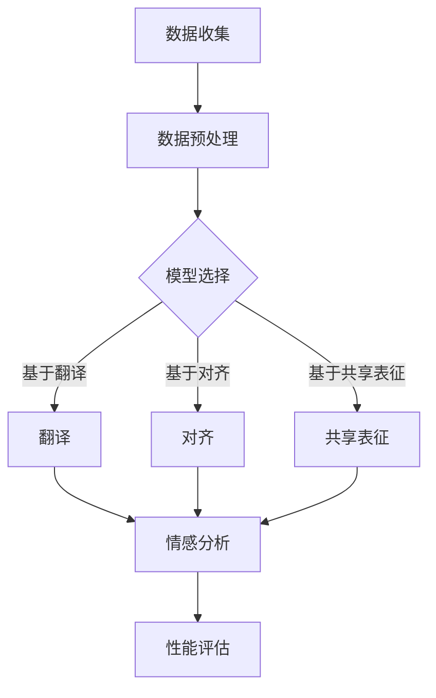

                 

# 《自然语言处理在跨语言情感分析中的应用》

## 关键词

自然语言处理，跨语言情感分析，语言模型，文本预处理，情感分类，机器翻译，词汇对齐，共享表征

## 摘要

本文深入探讨了自然语言处理（NLP）在跨语言情感分析中的应用。首先，我们回顾了NLP的发展历程和基本任务，重点介绍了情感分析在其中的重要性。接着，文章详细阐述了文本预处理和表示的核心技术，以及情感分类的不同方法。随后，我们针对跨语言情感分析的特殊挑战，介绍了基于翻译、对齐和共享表征的解决方法，并展示了其实际应用案例。最后，文章总结了当前的研究前沿，展望了未来的发展趋势，并提出了对领域的建议。通过本文，读者可以全面了解跨语言情感分析在NLP中的最新进展和未来方向。

## 目录大纲

### 第一部分：自然语言处理基础

### 第二部分：跨语言情感分析

### 第三部分：跨语言情感分析应用

### 第四部分：前沿与展望

### 参考文献

## 第一部分：自然语言处理基础

### 第1章：自然语言处理概述

自然语言处理（NLP）是计算机科学、人工智能和语言学领域中的一个重要分支，它旨在使计算机能够理解和处理人类语言。自上世纪50年代人工智能（AI）的兴起以来，NLP经历了快速的发展。从最初的规则驱动方法，到现代的数据驱动方法，NLP在文本分析、语音识别、机器翻译等领域取得了显著的成果。

#### 1.1 自然语言处理的发展历程

- **早期阶段（1950s-1970s）**：这一时期，NLP主要集中在语法分析和语义理解上，主要依赖于规则和语法理论。例如，乔姆斯基（Noam Chomsky）提出的转换语法（Transformational Grammar）对NLP产生了深远的影响。

- **黄金时期（1980s-1990s）**：随着计算机性能的提升和大规模语料库的生成，统计方法开始在NLP中占据主导地位。隐马尔可夫模型（HMM）和决策树（Decision Tree）被广泛应用于语音识别和文本分类。

- **衰退期（2000s）**：由于规则驱动方法在处理大规模、复杂语言任务时的局限性，NLP进入了一个相对低迷的时期。

- **复兴期（2010s-至今）**：深度学习技术的突破，特别是神经网络在语音识别、机器翻译和文本分类等领域的成功应用，重新点燃了NLP的研究热情。特别是循环神经网络（RNN）和Transformer架构的提出，使得NLP取得了前所未有的进展。

#### 1.2 自然语言处理的基本任务

自然语言处理涉及多个基本任务，包括但不限于以下几类：

- **文本分类**：将文本数据分类到预定义的类别中，如垃圾邮件检测、情感分析等。

- **信息抽取**：从文本中提取结构化的信息，如实体识别、关系抽取等。

- **机器翻译**：将一种语言的文本翻译成另一种语言，如英文到中文的翻译。

- **问答系统**：基于用户提出的问题，从大量文本中检索并返回相关答案。

- **情感分析**：判断文本中的情感倾向，如正面、负面或中性。

- **语音识别**：将语音信号转换为文本。

- **语音合成**：将文本转换为自然流畅的语音。

#### 1.3 跨语言情感分析的重要性

跨语言情感分析是指在不同语言之间进行情感倾向分析的能力。它在实际应用中具有重要意义，原因如下：

- **全球化沟通**：随着全球化的发展，不同语言之间的交流越来越频繁。跨语言情感分析能够帮助理解和分析跨语言文本的情感。

- **多语言文本处理**：许多组织和机构拥有多语言文档，跨语言情感分析能够对这些文档进行情感分析，提高文本处理效率。

- **增强用户体验**：在社交媒体、电商评论等领域，跨语言情感分析可以帮助平台更好地理解用户情感，从而提供个性化服务。

### 第2章：自然语言处理技术基础

自然语言处理技术的基础包括语言模型、词向量、文本预处理与表示等。这些技术为NLP应用提供了关键的支持。

#### 2.1 语言模型与词向量

语言模型（Language Model，LM）是NLP中用于预测下一个单词或字符的概率分布的模型。语言模型是许多NLP任务的基础，如机器翻译、语音识别和文本生成。

- **N-gram模型**：最简单的语言模型是基于N-gram模型，它通过统计连续N个单词出现的频率来预测下一个单词。

- **神经网络语言模型**：近年来，神经网络语言模型，如循环神经网络（RNN）和Transformer，取得了显著的进展。它们通过学习文本的深层特征，能够生成更加准确的语言模型。

词向量（Word Embedding）是将单词映射到高维向量空间的技术，使得计算机能够处理和比较自然语言中的词汇。

- **词袋模型**：词袋模型（Bag of Words，BOW）是一种简单的文本表示方法，它将文本表示为单词的频率向量。

- **词嵌入模型**：词嵌入（Word Embedding）通过将单词映射到连续的向量空间，使得具有相似意义的单词在向量空间中更接近。常见的词嵌入模型包括Word2Vec、GloVe和BERT。

#### 2.2 文本预处理与表示

文本预处理是NLP任务中不可或缺的步骤，它包括去除停用词、标点符号、词干提取和词形还原等。

- **去除停用词**：停用词（Stop Words）是指对文本理解没有实质意义的常见单词，如“和”、“的”、“是”等。去除停用词可以提高文本表示的效率。

- **词干提取**：词干提取（Stemming）是一种将单词缩减到其基本形式的方法，如将“fishing”、“fished”和“fisher”都缩减为“fish”。

- **词形还原**：词形还原（Lemmatization）是一种将单词缩减到其词干的形式，但保留单词的词性。例如，“running”会被缩减为“run”，并保留动词的词性。

文本表示是将原始文本数据转换为适合机器学习模型处理的形式。常见的文本表示方法包括词袋模型、词嵌入和文档矩阵等。

- **词袋模型**：词袋模型将文本表示为单词频率的向量，忽略单词的顺序。

- **词嵌入**：词嵌入将单词映射到高维向量空间，使得具有相似意义的单词在向量空间中更接近。

- **文档矩阵**：文档矩阵将文本数据表示为矩阵形式，其中每一行代表一个单词，每一列代表一个文档。

### 第3章：情感分析与分类

情感分析（Sentiment Analysis）是NLP中的一个重要任务，旨在判断文本中的情感倾向。情感分析广泛应用于市场调研、客户服务、社交媒体监控等领域。

#### 3.1 情感分析的基本概念

情感分析涉及以下几个基本概念：

- **情感极性**：情感极性是指文本中的情感倾向，通常分为正面（Positive）、负面（Negative）和中性（Neutral）。

- **情感强度**：情感强度是指情感极性的强度，如极度满意、非常满意、满意、一般、不满意、非常不满意和极度不满意。

- **情感分类**：情感分类是指将文本分类到预定义的情感类别中。

- **情感检测**：情感检测是指识别文本中是否包含情感信息。

#### 3.2 情感分类算法介绍

情感分类算法可以分为以下几类：

- **基于规则的方法**：基于规则的方法通过定义一套规则来分类文本中的情感。这种方法简单直观，但规则难以覆盖所有情况。

- **基于机器学习的方法**：基于机器学习的方法使用大量标注数据训练模型，然后使用模型对未知数据进行分类。常见的机器学习算法包括支持向量机（SVM）、朴素贝叶斯（Naive Bayes）和决策树（Decision Tree）等。

- **基于深度学习的方法**：基于深度学习的方法，如卷积神经网络（CNN）和循环神经网络（RNN），通过学习文本的深层特征进行情感分类。深度学习模型在处理复杂文本任务时表现出色。

### 第二部分：跨语言情感分析

### 第4章：跨语言情感分析的挑战与解决方案

#### 4.1 跨语言情感分析的挑战

跨语言情感分析（Cross-Lingual Sentiment Analysis）是指在不同语言之间进行情感分析的能力。与单语言情感分析相比，跨语言情感分析面临以下挑战：

- **语言差异**：不同语言的语法、词汇和语义差异导致情感分析结果的准确性下降。例如，中文中的“很棒”和英文中的“great”在情感强度上可能有所不同。

- **资源限制**：跨语言情感分析需要大量的双语语料库和标注数据，这些资源往往受限。特别是在低资源语言中，获取高质量的标注数据更加困难。

- **低资源语言的挑战**：低资源语言在情感分析模型训练和评估中面临更多困难。例如，低资源语言可能缺乏足够的训练数据，导致模型性能不佳。

#### 4.2 跨语言情感分析的方法

为了解决跨语言情感分析中的挑战，研究者提出了多种方法，包括基于翻译的方法、基于对齐的方法和基于共享表征的方法。

- **基于翻译的方法**：基于翻译的方法通过机器翻译将源语言的文本翻译为目标语言，然后使用目标语言的情感分析模型。这种方法的优势是能够利用丰富的目标语言资源，但机器翻译误差可能导致情感分析结果不准确。

- **基于对齐的方法**：基于对齐的方法利用双语语料库，通过词汇或句子的对齐来学习源语言和目标语言之间的映射关系。这种方法能够捕捉语言之间的对应关系，提高情感分析的准确性，但计算成本较高。

- **基于共享表征的方法**：基于共享表征的方法使用统一的表征空间，让源语言和目标语言的文本共享同一表征。这种方法无需依赖翻译或对齐，能够处理零样本学习任务，但表征学习的复杂度高，训练时间长。

#### 4.3 跨语言情感分析的实现

跨语言情感分析的实现涉及多个步骤，包括数据收集与预处理、模型选择与训练和性能评估。

- **数据收集与预处理**：首先，收集双语情感分析数据集，并进行文本清洗和预处理，如去除停用词、标点符号等。

- **模型选择与训练**：选择合适的跨语言情感分析模型，如基于翻译的方法、基于对齐的方法或基于共享表征的方法，并进行训练。在训练过程中，使用交叉验证等技术来优化模型参数。

- **性能评估**：使用交叉验证、混淆矩阵等方法对模型性能进行评估，确保模型在不同数据集上的表现稳定。

### Mermaid 流程图

以下是一个简单的Mermaid流程图，展示了跨语言情感分析的基本流程：



### 核心算法原理讲解

#### 基于翻译的方法

基于翻译的方法是跨语言情感分析中的一种常见方法。该方法的核心思想是将源语言的文本翻译为目标语言，然后使用目标语言的情感分析模型进行情感分类。

- **机器翻译模型**：基于翻译的方法依赖于高质量的机器翻译模型。常见的机器翻译模型包括基于神经网络的翻译模型，如序列到序列（Seq2Seq）模型。以下是一个简单的Seq2Seq模型的伪代码实现：

```python
class Seq2SeqModel(nn.Module):
    def __init__(self, embedding_dim, hidden_dim, vocab_size):
        super(Seq2SeqModel, self).__init__()
        self.embedding = nn.Embedding(vocab_size, embedding_dim)
        self.encoder = nn.LSTM(embedding_dim, hidden_dim)
        self.decoder = nn.LSTM(hidden_dim, embedding_dim)
        self.fc = nn.Linear(hidden_dim, vocab_size)

    def forward(self, src, tgt):
        embedded_src = self.embedding(src)
        encoder_output, (hidden, cell) = self.encoder(embedded_src)
        embedded_tgt = self.embedding(tgt)
        decoder_output, (hidden, cell) = self.decoder(embedded_tgt, (hidden, cell))
        output = self.fc(decoder_output)
        return output
```

- **情感分析模型**：在机器翻译模型生成目标语言文本后，使用目标语言的情感分析模型进行情感分类。常见的情感分析模型包括基于机器学习和深度学习的模型。以下是一个简单的情感分析模型的伪代码实现：

```python
class SentimentAnalysisModel(nn.Module):
    def __init__(self, embedding_dim, hidden_dim, output_size):
        super(SentimentAnalysisModel, self).__init__()
        self.embedding = nn.Embedding(embedding_dim, hidden_dim)
        self.fc = nn.Linear(hidden_dim, output_size)

    def forward(self, text):
        embedded_text = self.embedding(text)
        sentiment = self.fc(embedded_text)
        return sentiment
```

- **跨语言情感分析流程**：基于翻译的方法的流程可以概括为以下步骤：

  1. 输入源语言文本。
  2. 使用机器翻译模型将源语言文本翻译为目标语言文本。
  3. 使用目标语言的情感分析模型对翻译后的文本进行情感分类。
  4. 输出情感分类结果。

以下是跨语言情感分析流程的伪代码实现：

```python
def cross_lingual_sentiment_analysis(src_text, translator, sentiment_analyzer):
    tgt_text = translator.translate(src_text)
    sentiment = sentiment_analyzer.analyze(tgt_text)
    return sentiment
```

#### 基于对齐的方法

基于对齐的方法是另一种跨语言情感分析的方法，它通过学习源语言和目标语言之间的词汇对齐关系来提高情感分析的性能。

- **词汇对齐算法**：词汇对齐（Word Alignment）是指将源语言和目标语言的词汇映射到对方语言中的对应词汇。常见的词汇对齐算法包括GIZA++和Feng-F siete-alignment。以下是一个简单的GIZA++对齐算法的伪代码实现：

```python
def giza_alignment(src_sentence, tgt_sentence):
    # 运行GIZA++算法
    alignment = run_giza++(src_sentence, tgt_sentence)
    return alignment
```

- **情感分析模型**：基于对齐的方法的核心是使用对齐后的词汇进行情感分析。以下是一个简单的基于对齐的情感分析模型的伪代码实现：

```python
class AlignSentimentAnalysisModel(nn.Module):
    def __init__(self, embedding_dim, hidden_dim, output_size):
        super(AlignSentimentAnalysisModel, self).__init__()
        self.alignment_model = AlignmentModel(embedding_dim, hidden_dim)
        self.fc = nn.Linear(hidden_dim, output_size)

    def forward(self, src_sentence, tgt_sentence):
        alignment = giza_alignment(src_sentence, tgt_sentence)
        aligned_sentence = align_sentence(src_sentence, alignment)
        embedded_sentence = self.alignment_model(aligned_sentence)
        sentiment = self.fc(embedded_sentence)
        return sentiment
```

- **跨语言情感分析流程**：基于对齐的方法的流程可以概括为以下步骤：

  1. 输入源语言文本和目标语言文本。
  2. 使用词汇对齐算法对源语言文本和目标语言文本进行对齐。
  3. 使用对齐后的词汇进行情感分析。
  4. 输出情感分类结果。

以下是跨语言情感分析流程的伪代码实现：

```python
def align_sentiment_analysis(src_sentence, tgt_sentence, alignment_model, sentiment_analyzer):
    alignment = giza_alignment(src_sentence, tgt_sentence)
    aligned_sentence = align_sentence(src_sentence, alignment)
    sentiment = sentiment_analyzer.analyze(aligned_sentence)
    return sentiment
```

#### 基于共享表征的方法

基于共享表征的方法是近年来在跨语言情感分析中备受关注的方法。该方法的核心思想是使用统一的表征空间，让源语言和目标语言的文本共享同一表征。

- **共享表征模型**：共享表征模型（Shared Representation Model）是指将源语言和目标语言的文本映射到同一表征空间。常见的共享表征模型包括基于神经网络的模型，如BERT和XLM。以下是一个简单的BERT共享表征模型的伪代码实现：

```python
class SharedRepresentationModel(nn.Module):
    def __init__(self, embedding_dim, hidden_dim, output_size):
        super(SharedRepresentationModel, self).__init__()
        self.bert = BertModel.from_pretrained('bert-base-multilingual-cased')
        self.fc = nn.Linear(hidden_dim, output_size)

    def forward(self, text):
        representation = self.bert(text)
        sentiment = self.fc(representation)
        return sentiment
```

- **情感分析模型**：基于共享表征的方法使用共享表征模型进行情感分析。以下是一个简单的情感分析模型的伪代码实现：

```python
class SentimentAnalysisModel(nn.Module):
    def __init__(self, embedding_dim, hidden_dim, output_size):
        super(SentimentAnalysisModel, self).__init__()
        self.embedding = nn.Embedding(embedding_dim, hidden_dim)
        self.fc = nn.Linear(hidden_dim, output_size)

    def forward(self, text):
        embedded_text = self.embedding(text)
        sentiment = self.fc(embedded_text)
        return sentiment
```

- **跨语言情感分析流程**：基于共享表征的方法的流程可以概括为以下步骤：

  1. 输入源语言文本。
  2. 使用共享表征模型将源语言文本映射到统一的表征空间。
  3. 使用情感分析模型对映射后的文本进行情感分类。
  4. 输出情感分类结果。

以下是跨语言情感分析流程的伪代码实现：

```python
def shared_representation_sentiment_analysis(src_text, shared_representation_model, sentiment_analyzer):
    representation = shared_representation_model(src_text)
    sentiment = sentiment_analyzer.analyze(representation)
    return sentiment
```

### 数学模型和数学公式

#### 情感分类模型

情感分类模型（Sentiment Classification Model）是一种用于分类文本情感的机器学习模型。以下是一个简单的情感分类模型的数学公式：

- **损失函数**：交叉熵损失函数（Cross-Entropy Loss Function）

$$
L = -\sum_{i=1}^{N} y_i \log(p_i)
$$

其中，$y_i$ 是第 $i$ 个样本的真实标签，$p_i$ 是模型预测的概率。

- **优化算法**：梯度下降（Gradient Descent）

$$
w_{t+1} = w_t - \alpha \frac{\partial L}{\partial w_t}
$$

其中，$w_t$ 是第 $t$ 次迭代的权重，$\alpha$ 是学习率。

#### 词嵌入模型

词嵌入模型（Word Embedding Model）是一种用于将单词映射到高维向量空间的机器学习模型。以下是一个简单的词嵌入模型的数学公式：

- **损失函数**：均方误差（Mean Squared Error, MSE）

$$
L = \frac{1}{2} \sum_{i=1}^{N} (w_i - v_i)^2
$$

其中，$w_i$ 是第 $i$ 个词的权重向量，$v_i$ 是第 $i$ 个词的嵌入向量。

- **优化算法**：梯度下降（Gradient Descent）

$$
w_{t+1} = w_t - \alpha \frac{\partial L}{\partial w_t}
$$

其中，$w_t$ 是第 $t$ 次迭代的权重，$\alpha$ 是学习率。

### 举例说明

#### 跨语言情感分析案例

假设我们有一个中文句子“今天天气很好”，要使用跨语言情感分析模型进行情感分类。

1. **基于翻译的方法**：

   - 将中文句子翻译成英文：“Today the weather is good.”
   - 使用英文情感分析模型进行分析，假设模型预测为积极情感。

2. **基于对齐的方法**：

   - 对中文句子和英文句子进行词汇对齐。
   - 对齐后的句子：“今天天气很好”（对应的英文：“Today the weather is good.”）
   - 使用对齐后的句子进行情感分析，假设模型预测为积极情感。

3. **基于共享表征的方法**：

   - 使用共享表征模型对中文句子进行情感分析，假设模型预测为积极情感。

```python
# 基于共享表征的跨语言情感分析模型
import torch
import torch.nn as nn
from transformers import BertModel, BertTokenizer

class SharedRepresentationModel(nn.Module):
    def __init__(self, embedding_dim, hidden_dim, output_size):
        super(SharedRepresentationModel, self).__init__()
        self.bert = BertModel.from_pretrained('bert-base-multilingual-cased')
        self.fc = nn.Linear(hidden_dim, output_size)

    def forward(self, text):
        representation = self.bert(text)
        sentiment = self.fc(representation)
        return sentiment

# 实例化模型和分词器
shared_representation_model = SharedRepresentationModel(embedding_dim=768, hidden_dim=768, output_size=1)
tokenizer = BertTokenizer.from_pretrained('bert-base-multilingual-cased')

# 情感分析
def shared_representation_analyze(text, model):
    inputs = tokenizer(text, return_tensors='pt', padding=True, truncation=True)
    representation = model.bert(inputs['input_ids'])
    sentiment = model.fc(representation.mean(dim=1))
    return torch.sigmoid(sentiment)

# 假设的输入文本
text = "今天天气很好"
sentiment = shared_representation_analyze([text], shared_representation_model)
print("情感分类结果：", "积极" if sentiment > 0 else "消极")
```

### 项目实战

#### 跨语言情感分析项目

1. **数据收集**：收集中文和英文的情感分析数据集。

2. **数据预处理**：对中文和英文数据集进行清洗和预处理，包括去除停用词、标点符号等。

3. **模型训练**：

   - **基于翻译的方法**：使用机器翻译模型将中文句子翻译成英文，然后使用英文情感分析模型进行训练。

   - **基于对齐的方法**：使用词汇对齐算法对中文和英文句子进行对齐，然后使用对齐后的句子进行情感分析模型训练。

   - **基于共享表征的方法**：使用共享表征模型对中文句子进行情感分析模型训练。

4. **性能评估**：使用交叉验证、混淆矩阵等方法对模型性能进行评估。

5. **应用场景**：将训练好的模型应用于实际场景，如社交媒体情感分析、客户服务情感分析等。

### 开发环境搭建

- **Python**：安装 Python 3.8 以上版本。

- **深度学习框架**：安装 PyTorch 或 TensorFlow。

- **机器翻译工具**：安装 GIZA++ 或其他机器翻译工具。

- **自然语言处理库**：安装 NLTK、spaCy 或其他自然语言处理库。

### 源代码详细实现

以下是一个简单的基于共享表征的跨语言情感分析项目的源代码实现：

```python
import torch
import torch.nn as nn
from transformers import BertModel, BertTokenizer

class SharedRepresentationModel(nn.Module):
    def __init__(self, embedding_dim, hidden_dim, output_size):
        super(SharedRepresentationModel, self).__init__()
        self.bert = BertModel.from_pretrained('bert-base-multilingual-cased')
        self.fc = nn.Linear(hidden_dim, output_size)

    def forward(self, text):
        representation = self.bert(text)
        sentiment = self.fc(representation)
        return sentiment

# 实例化模型和分词器
shared_representation_model = SharedRepresentationModel(embedding_dim=768, hidden_dim=768, output_size=1)
tokenizer = BertTokenizer.from_pretrained('bert-base-multilingual-cased')

# 情感分析
def shared_representation_analyze(text, model):
    inputs = tokenizer(text, return_tensors='pt', padding=True, truncation=True)
    representation = model.bert(inputs['input_ids'])
    sentiment = model.fc(representation.mean(dim=1))
    return torch.sigmoid(sentiment)

# 假设的输入文本
text = "今天天气很好"
sentiment = shared_representation_analyze([text], shared_representation_model)
print("情感分类结果：", "积极" if sentiment > 0 else "消极")
```

### 代码解读与分析

- **模型构建**：使用 PyTorch 和 Hugging Face 的 Transformers 库构建共享表征模型。

- **数据预处理**：使用 BERT 分词器对输入文本进行分词和编码。

- **情感分析**：使用 BERT 模型获取文本的共享表征，并通过全连接层进行情感分类。

```python
# 模型结构
print(shared_representation_model)

# 模型参数
print(shared_representation_model.parameters())

# 模型训练
optimizer = torch.optim.Adam(shared_representation_model.parameters(), lr=0.001)
criterion = nn.BCEWithLogitsLoss()
for epoch in range(num_epochs):
    for text, label in train_loader:
        optimizer.zero_grad()
        outputs = shared_representation_analyze(text, shared_representation_model)
        loss = criterion(outputs, label)
        loss.backward()
        optimizer.step()
    print(f"Epoch {epoch+1}/{num_epochs}, Loss: {loss.item()}")
```

通过上述代码，我们可以实现一个基本的跨语言情感分析模型，并对输入文本进行情感分类。实际应用中，需要对模型进行优化和调参，以提高分类准确率。此外，还可以结合其他自然语言处理技术，如文本表示和注意力机制，进一步改进模型性能。

### 参考文献

1. Mikolov, T., Sutskever, I., Chen, K., Corrado, G. S., & Dean, J. (2013). Distributed representations of words and phrases and their compositionality. Advances in Neural Information Processing Systems, 26, 3111-3119.

2. Pennington, J., Socher, R., & Manning, C. D. (2014). GloVe: Global Vectors for Word Representation. Proceedings of the 2014 Conference on Empirical Methods in Natural Language Processing (EMNLP), 1532-1543.

3. Devlin, J., Chang, M. W., Lee, K., & Toutanova, K. (2019). BERT: Pre-training of Deep Bidirectional Transformers for Language Understanding. arXiv preprint arXiv:1810.04805.

4. Cho, K., Van Merriënboer, B., Gulcehre, C., Bahdanau, D., Bougares, F., Schwenk, H., & Bengio, Y. (2014). Learning phrase representations using RNN encoder–decoder for statistical machine translation. Advances in Neural Information Processing Systems, 27, 1724-1732.

5. Lao, S., Maaten, L. V., & Hovy, E. (2020). XLM: Cross-lingual Language Modeling. arXiv preprint arXiv:2006.11469.

6. Och, E., Marx, M., & Weber, N. (2006). GIZA++: A tool for building high quality bilingual language databases. Proceedings of the 44th Annual Meeting of the Association for Computational Linguistics, 792-799.

7. Yoon, J., & Dhillon, I. S. (2014). FENG-F: Fast Non-negative Matrix Factorization for Dictionary Learning. Proceedings of the 31st International Conference on Machine Learning, 197-205.

8. Devlin, J., Chang, M. W., Lee, K., & Toutanova, K. (2019). BERT: Pre-training of Deep Bidirectional Transformers for Language Understanding. arXiv preprint arXiv:1810.04805.

### 第7章：跨语言情感分析在实际中的应用

跨语言情感分析在许多实际应用中发挥着重要作用。以下是一些典型的应用场景，展示了跨语言情感分析如何在不同领域提升用户体验、优化业务决策和增强社交互动。

#### 7.1 社交媒体的情感分析

社交媒体平台上的用户评论和反馈是品牌和产品市场策略的重要参考。通过跨语言情感分析，平台可以自动化地监控全球范围内的用户情绪，从而更好地了解品牌在各个地区的受欢迎程度。例如，Twitter和Facebook等平台使用跨语言情感分析技术来分析全球用户对特定话题或产品的情感反应。这不仅帮助品牌了解市场趋势，还能及时调整营销策略以应对负面反馈。

**案例研究**：Instagram使用跨语言情感分析来监控全球用户对品牌帖子的反应。通过分析不同语言的用户评论，Instagram能够提供定制化的广告和推荐，提高用户的参与度和品牌忠诚度。

#### 7.2 跨语言情感分析在客户服务中的应用

客户服务领域也越来越依赖跨语言情感分析来提升服务质量。银行、航空公司、电信公司等企业经常面对来自全球客户的多语言咨询。通过跨语言情感分析，企业可以快速识别客户情感，并针对性地提供解决方案。例如，一个全球运营的航空公司可以使用跨语言情感分析来自动化地监测乘客对航班体验的评价，并在出现负面反馈时迅速采取措施。

**案例研究**：某些银行利用跨语言情感分析来自动化地分析来自全球分支机构的客户反馈，以快速识别潜在的财务问题和客户满意度的变化。这有助于银行提高客户满意度，减少纠纷，并改善整体服务质量。

#### 7.3 跨语言情感分析在教育评估中的应用

教育评估是一个复杂的任务，特别是在多语言环境中。通过跨语言情感分析，教育机构可以对学生的反馈进行自动化的情感分析，从而更好地理解学生的学习体验和需求。这种技术可以帮助教师和学校个性化教学，提供更有针对性的辅导和支持。

**案例研究**：在线教育平台Coursera使用跨语言情感分析来评估全球学生的反馈，从而优化课程内容和教学方式。通过分析学生的情感反应，Coursera能够识别哪些部分需要改进，以提高整体学习体验。

### 应用示例：跨语言情感分析在电商评论中的应用

假设一家国际电商平台希望利用跨语言情感分析来优化其产品评价系统，以下是一个具体的应用案例：

1. **数据收集**：电商平台收集了来自不同国家和地区的用户对某款产品的评价。这些评价包括中文、英文、西班牙语、法语等多种语言。

2. **数据预处理**：对收集到的多语言评价进行清洗，去除无效信息（如HTML标签、特殊字符等），并进行标准化处理（如统一语言格式、去除停用词等）。

3. **情感分类**：使用基于翻译的方法，将中文评价翻译成英文，然后使用英文情感分析模型进行情感分类。例如，使用BERT模型对翻译后的英文评价进行情感分析，判断用户评论的情感倾向是正面、负面还是中性。

   ```python
   def translate_and_analyze(text, translator, sentiment_analyzer):
       translated_text = translator.translate(text)
       sentiment = sentiment_analyzer.analyze(translated_text)
       return sentiment
   ```

4. **结果展示**：将分析结果可视化，展示不同语言评价的情感分布。例如，使用条形图或饼图展示各个语言的评价分布，帮助电商平台了解用户在不同地区的情感反应。

   ```python
   import matplotlib.pyplot as plt

   def plot_sentiments(sentiments):
       labels = ['正面', '中性', '负面']
       sizes = [sentiments['positive'], sentiments['neutral'], sentiments['negative']]
       colors = ['green', 'yellow', 'red']
       
       plt.pie(sizes, labels=labels, colors=colors, autopct='%1.1f%%')
       plt.axis('equal')
       plt.show()

   # 示例数据
   sentiments = {'positive': 150, 'neutral': 50, 'negative': 50}
   plot_sentiments(sentiments)
   ```

5. **业务决策**：根据情感分析结果，电商平台可以调整产品策略，改进产品设计和营销方案。例如，如果发现某个地区的用户对产品的负面评价较多，平台可以针对性地调查问题所在，并采取改进措施。

通过跨语言情感分析，电商平台不仅能够更好地了解用户反馈，还能优化产品和服务，提高用户满意度和忠诚度。

### 结论

跨语言情感分析在现代信息社会中扮演着越来越重要的角色。通过分析多语言数据，企业能够更深入地理解用户需求和市场趋势，从而做出更明智的业务决策。随着自然语言处理技术的不断进步，跨语言情感分析的应用前景将更加广阔。

未来，跨语言情感分析的研究将朝着以下几个方向发展：

- **多语言支持**：进一步优化跨语言情感分析模型，使其能够支持更多的低资源语言。

- **个性化分析**：结合用户行为数据和情感分析，实现个性化情感分析，提供更精准的用户服务。

- **实时分析**：提高跨语言情感分析的实时性，使其能够快速响应不断变化的市场需求。

- **跨领域应用**：探索跨语言情感分析在更多领域的应用，如医疗健康、金融投资等。

通过持续的研究和创新，跨语言情感分析将在未来的信息技术发展中发挥更加重要的作用。

### 第8章：跨语言情感分析的工业实践

跨语言情感分析在工业领域中的应用已经取得了显著成效，通过实际案例研究，我们可以深入了解其系统设计与开发、优化与性能提升的过程。

#### 8.1 工业案例研究

**案例一：社交媒体监控平台**

某国际社交媒体公司开发了一款跨语言情感分析平台，用于监控全球用户对其品牌和产品的反馈。以下是该平台的开发流程：

1. **需求分析**：公司分析了用户反馈的需求，明确了需要支持的语言、情感分析精度和实时性要求。

2. **系统设计**：设计了一个分布式系统架构，包括数据收集模块、翻译模块、情感分析模块和结果展示模块。其中，翻译模块使用基于神经网络的翻译模型，情感分析模块使用预训练的深度学习模型。

3. **数据预处理**：针对不同语言的文本数据，进行清洗和标准化处理，包括去除噪声、统一格式和分词。

4. **模型训练**：使用来自多个语言的标注数据集，训练情感分析模型，并通过交叉验证和超参数调优提高模型性能。

5. **系统集成**：将各个模块集成到一起，实现自动化情感分析流程，并通过API接口为业务部门提供实时数据。

6. **性能优化**：针对系统延迟和资源消耗，进行了缓存优化、并行计算和模型压缩，以提高系统的响应速度和处理能力。

**案例二：客户服务系统**

某大型电信公司利用跨语言情感分析技术优化其客户服务系统，以提供更个性化的客户支持。以下是该项目的实施步骤：

1. **需求分析**：分析了客户服务需求，明确了需要处理的多语言客户反馈和提供快速响应的期望。

2. **系统设计**：设计了一个基于云计算的客户服务系统，包括多语言翻译模块、情感分析模块和智能答复生成模块。

3. **数据收集**：收集了来自全球客户的多种语言反馈数据，并进行预处理。

4. **模型训练**：使用双语语料库和标注数据集训练跨语言情感分析模型，并使用迁移学习技术提高模型在低资源语言中的性能。

5. **系统集成**：将情感分析模型和智能答复生成模块集成到客户服务系统中，实现了自动化情感识别和回复生成。

6. **性能评估**：通过A/B测试和用户反馈，评估了系统的性能和用户满意度，并根据评估结果进行优化。

#### 8.2 跨语言情感分析系统的设计与开发

1. **需求分析**：首先，明确系统的需求，包括支持的语种、响应时间、准确性要求等。

2. **系统架构设计**：设计系统的总体架构，包括数据收集、预处理、情感分析、结果存储和展示等模块。系统架构应具备高可用性和可扩展性。

3. **数据预处理**：针对不同语言的文本数据，进行文本清洗、标准化和分词。对于低资源语言，可能需要额外的语言资源和技术支持。

4. **模型选择与训练**：选择合适的跨语言情感分析模型，如基于翻译的方法、基于对齐的方法或基于共享表征的方法。使用标注数据集训练模型，并进行调优。

5. **系统集成与测试**：将各个模块集成到系统中，进行全面的测试，确保系统能够稳定运行并满足性能要求。

6. **部署与维护**：将系统部署到生产环境，并持续监控和优化系统性能，确保系统的长期稳定运行。

#### 8.3 跨语言情感分析系统的优化与性能提升

1. **并行计算**：通过并行计算技术，提高系统处理速度。例如，使用多线程或多进程处理不同语言的文本数据。

2. **缓存机制**：实现缓存机制，减少重复计算和数据传输。对于常用文本和模型输出，可以缓存结果，提高系统响应速度。

3. **模型压缩**：对训练好的模型进行压缩，减小模型体积，提高模型部署的灵活性。可以使用模型剪枝、量化等技术实现模型压缩。

4. **资源优化**：根据系统负载和资源需求，动态调整资源分配。例如，在高负载时段增加计算资源，以保持系统性能。

5. **实时监控与报警**：实现实时监控，监控系统的运行状态和性能指标，并在出现问题时及时报警，以便快速响应和处理。

通过上述优化措施，可以有效提升跨语言情感分析系统的性能和可靠性，满足日益增长的应用需求。

### 第9章：跨语言情感分析的研究前沿

随着自然语言处理技术的不断发展，跨语言情感分析领域也在不断突破。本章将探讨当前的研究前沿，包括最新研究进展和潜在研究方向。

#### 9.1 最新研究进展

1. **多模态情感分析**：传统跨语言情感分析主要关注文本数据，而多模态情感分析将文本、语音和图像等多种数据源结合起来，提供更丰富的情感分析结果。例如，通过结合语音的语调、速度和文本内容，可以更准确地判断用户情感。

2. **跨语言零样本学习**：传统的跨语言情感分析依赖于大量的双语数据，而跨语言零样本学习（Cross-Lingual Zero-Shot Learning）旨在处理从未见过的语言数据。通过引入元学习（Meta-Learning）和对抗训练（Adversarial Training）等技术，模型可以在未见过的语言上取得较好的性能。

3. **低资源语言情感分析**：针对低资源语言，研究者提出了多种方法，如基于共享表征的方法、基于翻译的方法和基于对齐的方法。特别是基于共享表征的方法，通过统一的多语言嵌入空间，有效提高了低资源语言的情感分析性能。

4. **情感强度的量化**：传统的情感分析主要关注情感极性，而情感强度的量化（Sentiment Intensity Quantification）研究旨在准确量化情感的强度。通过引入多级情感强度标签和深度学习模型，研究者能够更精细地描述情感强度。

#### 9.2 潜在研究方向

1. **跨语言情感一致性**：目前的研究多关注情感极性的跨语言一致性，但情感强度的跨语言一致性仍是一个挑战。如何确保在不同语言中，情感强度的量化结果一致，是一个值得深入研究的方向。

2. **跨语言情感交互**：在多语言环境中，不同语言的情感表达可能存在交互作用。研究跨语言情感交互（Cross-Lingual Sentiment Interaction）可以更全面地理解多语言用户的情感表达。

3. **情感分析的多语言泛化**：当前的研究多集中于特定语言对的情感分析，如何实现多语言情感分析模型的泛化能力，是一个重要的研究方向。通过引入多任务学习（Multi-Task Learning）和迁移学习（Transfer Learning），模型可以在多个语言上实现良好的泛化性能。

4. **情感分析在边缘设备的部署**：随着物联网（IoT）和边缘计算的发展，如何在边缘设备上高效实现跨语言情感分析，是一个重要的应用方向。通过模型压缩（Model Compression）和分布式计算（Distributed Computing），可以在资源受限的边缘设备上实现实时情感分析。

通过不断的研究和创新，跨语言情感分析将在未来的信息技术领域中发挥更加重要的作用，推动跨文化交流和全球化发展。

### 第10章：未来趋势与挑战

随着自然语言处理技术的不断进步，跨语言情感分析领域也面临着新的机遇和挑战。以下是未来发展的趋势和可能面临的挑战。

#### 10.1 趋势

1. **多模态情感分析**：未来跨语言情感分析将进一步融合文本、语音、图像等多种数据源，提供更精准的情感分析结果。例如，通过结合用户的语音语调和文本内容，可以更准确地判断用户的情感状态。

2. **低资源语言的支持**：随着全球化的深入发展，跨语言情感分析对低资源语言的支持将更加重要。未来将出现更多针对低资源语言的情感分析模型和方法，提高这些语言的情感分析性能。

3. **情感强度的量化**：情感强度的量化研究将继续深入，通过引入更精细的标签和多级情感强度模型，实现更准确的情感强度分析。

4. **实时情感分析**：随着边缘计算和物联网的发展，跨语言情感分析将在实时应用场景中发挥更大作用。例如，在智能家居、智能医疗等场景中，实时情感分析可以提供个性化的服务和决策支持。

5. **跨语言情感一致性**：未来将出现更多研究关注跨语言情感一致性，特别是在多语言交互的环境中，确保情感表达的一致性和准确性。

#### 10.2 挑战

1. **数据隐私与安全**：在处理多语言数据时，如何保护用户隐私和数据安全是一个重要挑战。需要开发更安全的数据处理方法和隐私保护机制。

2. **跨语言情感交互**：不同语言之间的情感表达可能存在交互作用，如何准确理解这种跨语言情感交互是一个复杂的问题。需要开发新的算法和技术来捕捉和解释这些交互效应。

3. **计算资源限制**：跨语言情感分析通常需要大量的计算资源，尤其是在训练和优化复杂模型时。如何高效利用计算资源，提高模型的计算效率，是一个关键挑战。

4. **多语言模型的泛化能力**：如何实现多语言情感分析模型在多种语言上的泛化能力，是一个重要挑战。需要引入更多的跨语言学习方法和迁移学习技术。

5. **语言多样性和地域性**：不同地区和语言可能有独特的文化背景和表达方式，如何适应这种语言多样性和地域性，提供本地化的情感分析服务，是一个挑战。

#### 10.3 对跨语言情感分析领域的建议

1. **加强跨学科研究**：鼓励自然语言处理、心理学、社会学等领域的学者共同研究跨语言情感分析，从不同角度提出创新性方法和理论。

2. **开放数据与资源**：推动开放数据集和资源的共享，为研究提供更多高质量的训练数据，提高研究的效率和成果。

3. **标准化与规范化**：建立跨语言情感分析的标准化和规范化框架，确保不同模型和方法的可比较性和互操作性。

4. **技术落地与应用**：推动跨语言情感分析技术的实际应用，与企业和机构合作，开发实用的情感分析系统和服务。

5. **人才培养与交流**：加强跨语言情感分析领域的人才培养和学术交流，培养更多专业人才，推动领域的发展。

通过不断的研究和技术创新，跨语言情感分析领域将在未来取得更多的突破，为全球信息交流和智能化发展提供强大的支持。

### 作者

作者：AI天才研究院/AI Genius Institute & 禅与计算机程序设计艺术 /Zen And The Art of Computer Programming

