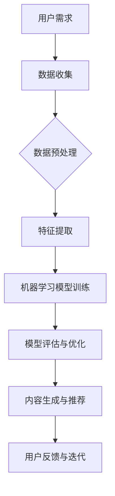
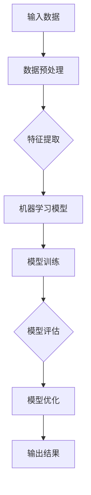

                 

### 第一部分：虚拟文化孵化器主管概述

#### 第1章：虚拟文化孵化器与AI技术

##### 1.1 虚拟文化孵化器概述

**虚拟文化孵化器的定义和作用**

虚拟文化孵化器是一种新兴的数字文化生产方式，旨在通过人工智能（AI）技术和虚拟现实（VR）技术来创造和传播文化内容。它不仅提供了文化创造的新平台，还促进了文化创新和跨文化交流。

虚拟文化孵化器的作用主要体现在以下几个方面：

1. **文化内容的生成与传播**：虚拟文化孵化器利用AI技术进行内容创作，如自动生成音乐、绘画、小说等，极大地丰富了文化产品的种类和数量。同时，通过虚拟现实技术，这些内容可以更加生动地呈现在用户面前，实现高效传播。

2. **文化创新的推动**：虚拟文化孵化器通过AI技术进行数据分析，挖掘用户的文化需求，为文化创作者提供有针对性的建议和灵感，从而推动文化创新。

3. **跨文化交流的促进**：虚拟文化孵化器为不同文化背景的用户提供了交流的平台，通过AI技术的帮助，能够理解和适应不同文化，促进文化的交流与融合。

**虚拟文化孵化器与传统文化孵化的差异**

与传统文化孵化相比，虚拟文化孵化器具有以下几个显著差异：

1. **技术手段**：传统文化孵化主要依赖于传统创作工具和手法，如笔墨纸砚等。而虚拟文化孵化器则依赖于AI和VR技术，具有更高的技术含量。

2. **创作方式**：传统文化孵化往往需要创作者的长期积累和技巧，而虚拟文化孵化器则可以通过算法和模型快速生成文化内容，降低了创作门槛。

3. **传播方式**：传统文化孵化主要依赖于线下渠道，如展览、演出等。而虚拟文化孵化器则通过线上平台进行传播，受众范围更广，传播速度更快。

**虚拟文化孵化器的目标群体与价值**

虚拟文化孵化器的目标群体主要包括以下几个方面：

1. **文化创作者**：通过虚拟文化孵化器，创作者可以更加便捷地进行文化创作，拓展创作领域和风格，实现个人价值的最大化。

2. **文化消费者**：虚拟文化孵化器提供了丰富多样的文化内容，满足了不同消费者的个性化需求，提高了文化消费的体验。

3. **文化研究者**：虚拟文化孵化器中的大量数据为文化研究提供了丰富的素材，有助于深化对文化现象的理解和解释。

虚拟文化孵化器的价值在于：

1. **促进文化创新**：通过AI技术的应用，虚拟文化孵化器可以不断推动文化创新，为文化发展注入新动力。

2. **提升文化影响力**：虚拟文化孵化器通过线上平台和VR技术，使文化内容更加生动、直观，提升了文化的影响力。

3. **推动文化全球化**：虚拟文化孵化器打破了地域和语言的限制，促进了不同文化之间的交流和融合，推动了文化的全球化进程。

##### 1.2 AI技术与虚拟文化孵化器的结合

**AI在虚拟文化孵化器中的应用场景**

1. **内容创作**：AI技术可以自动生成音乐、绘画、小说等文化作品，为创作者提供灵感，降低创作难度。

2. **用户分析**：通过大数据分析和机器学习算法，了解用户的文化需求和偏好，为文化内容的个性化推荐提供支持。

3. **交互设计**：利用自然语言处理（NLP）和计算机视觉（CV）技术，实现人与虚拟文化环境的自然交互。

4. **文化传播**：AI技术可以帮助文化内容在全球范围内进行智能传播，提高传播效率和效果。

**AI赋能虚拟文化孵化器的方式**

1. **算法优化**：通过机器学习算法的优化，提高文化内容生成的质量和效率。

2. **数据分析**：利用大数据技术，对用户行为和需求进行分析，为文化内容的创作和推广提供数据支持。

3. **人机交互**：通过NLP和CV技术，实现人与虚拟文化环境的自然交互，提高用户体验。

4. **个性化推荐**：基于用户行为和偏好，利用推荐系统算法，为用户提供个性化的文化内容。

**AI技术与虚拟文化孵化器的未来展望**

1. **技术融合**：AI技术将继续与其他前沿技术如VR、区块链等融合，推动虚拟文化孵化器的发展。

2. **内容创新**：AI技术将在文化内容的创作和传播中发挥更大作用，推动文化创新和多元化。

3. **用户体验**：随着AI技术的不断进步，虚拟文化孵化器的用户体验将得到进一步提升。

#### Mermaid流程图：虚拟文化孵化器的AI技术应用



通过这个流程图，我们可以清晰地看到虚拟文化孵化器中AI技术的应用流程，从用户需求出发，经过数据收集、预处理、特征提取、模型训练、评估与优化，最终实现文化内容的生成与推荐。

##### 1.1 虚拟文化孵化器概述

**虚拟文化孵化器的定义和作用**

虚拟文化孵化器是一种通过人工智能（AI）和虚拟现实（VR）技术来创造和传播文化内容的新型平台。其核心目的是利用AI技术提高文化创作的效率和质量，同时通过VR技术提供更加沉浸式的用户体验。

虚拟文化孵化器的作用主要体现在以下几个方面：

1. **文化内容的生成与传播**：通过AI技术，虚拟文化孵化器能够自动生成音乐、绘画、小说等文化作品，极大地丰富了文化产品的种类和数量。同时，通过VR技术，这些作品可以更加生动地呈现在用户面前，实现高效传播。

2. **文化创新的推动**：虚拟文化孵化器利用AI技术进行数据分析，挖掘用户的文化需求，为文化创作者提供有针对性的建议和灵感，从而推动文化创新。

3. **跨文化交流的促进**：虚拟文化孵化器为不同文化背景的用户提供了交流的平台，通过AI技术的帮助，能够理解和适应不同文化，促进文化的交流与融合。

**虚拟文化孵化器与传统文化孵化的差异**

传统文化孵化主要依赖于传统创作工具和手法，如笔墨纸砚、乐器等。而虚拟文化孵化器则依赖于AI和VR技术，具有以下几个显著差异：

1. **技术手段**：传统文化孵化依赖于手工技艺和传统工具，而虚拟文化孵化器则依赖于高科技手段，如AI算法和VR设备。

2. **创作方式**：传统文化孵化需要创作者的长期积累和技巧，而虚拟文化孵化器则可以通过算法和模型快速生成文化内容，降低了创作门槛。

3. **传播方式**：传统文化孵化主要依赖于线下渠道，如展览、演出等，而虚拟文化孵化器则通过线上平台和VR技术进行传播，受众范围更广，传播速度更快。

**虚拟文化孵化器的目标群体与价值**

虚拟文化孵化器的目标群体主要包括以下几类：

1. **文化创作者**：虚拟文化孵化器为创作者提供了全新的创作工具和平台，使他们能够更加便捷地进行文化创作，拓展创作领域和风格。

2. **文化消费者**：虚拟文化孵化器提供了丰富多样的文化内容，满足了不同消费者的个性化需求，提高了文化消费的体验。

3. **文化研究者**：虚拟文化孵化器中的大量数据为文化研究提供了丰富的素材，有助于深化对文化现象的理解和解释。

虚拟文化孵化器的价值在于：

1. **促进文化创新**：通过AI技术的应用，虚拟文化孵化器可以不断推动文化创新，为文化发展注入新动力。

2. **提升文化影响力**：虚拟文化孵化器通过线上平台和VR技术，使文化内容更加生动、直观，提升了文化的影响力。

3. **推动文化全球化**：虚拟文化孵化器打破了地域和语言的限制，促进了不同文化之间的交流和融合，推动了文化的全球化进程。

##### 1.2 AI技术与虚拟文化孵化器的结合

**AI在虚拟文化孵化器中的应用场景**

在虚拟文化孵化器中，AI技术可以应用于多个方面，从而提高文化创作和传播的效率和质量。以下是几个主要的应用场景：

1. **内容创作**：AI技术可以自动生成音乐、绘画、小说等文化作品。例如，通过机器学习算法，可以训练出能够创作音乐和绘画的AI模型。这些模型可以根据用户的需求和偏好生成个性化的文化内容。

2. **用户分析**：AI技术可以帮助虚拟文化孵化器了解用户的行为和偏好。通过大数据分析和机器学习算法，可以挖掘出用户的兴趣点，为文化内容的个性化推荐提供支持。

3. **交互设计**：利用自然语言处理（NLP）和计算机视觉（CV）技术，虚拟文化孵化器可以实现人与虚拟文化环境的自然交互。例如，通过NLP技术，用户可以通过语音与虚拟角色进行对话，而通过CV技术，用户可以在虚拟环境中进行手势交互。

4. **文化传播**：AI技术可以帮助文化内容在全球范围内进行智能传播。通过分析用户的地理位置、语言和文化背景，AI可以优化传播策略，提高文化内容的传播效果。

**AI赋能虚拟文化孵化器的方式**

1. **算法优化**：通过不断优化AI算法，虚拟文化孵化器可以提高文化内容生成的质量和效率。例如，通过改进生成对抗网络（GAN）和变分自编码器（VAE）等技术，可以生成更加逼真的文化作品。

2. **数据分析**：虚拟文化孵化器可以利用大数据技术，对用户行为和需求进行分析，从而为文化内容的创作和推广提供数据支持。例如，通过分析用户的浏览记录和互动行为，可以预测用户的兴趣点，为内容推荐提供依据。

3. **人机交互**：通过NLP和CV技术，虚拟文化孵化器可以实现更加自然和直观的人机交互。例如，通过语音识别和语音合成技术，用户可以通过语音与虚拟角色进行对话；通过手势识别技术，用户可以在虚拟环境中进行手势交互。

4. **个性化推荐**：基于用户的行为和偏好，虚拟文化孵化器可以利用推荐系统算法，为用户提供个性化的文化内容推荐。例如，通过协同过滤算法，可以推荐用户可能感兴趣的文化作品。

**AI技术与虚拟文化孵化器的未来展望**

未来，随着AI技术的不断发展，虚拟文化孵化器有望在以下几个方面取得更大的突破：

1. **技术融合**：AI技术将继续与其他前沿技术如VR、区块链等融合，为虚拟文化孵化器带来更多创新的可能性。

2. **内容创新**：AI技术将在文化内容的创作和传播中发挥更大作用，推动文化创新和多元化。

3. **用户体验**：随着AI技术的进步，虚拟文化孵化器的用户体验将得到进一步提升，为用户提供更加丰富和沉浸式的文化体验。

### Mermaid流程图：虚拟文化孵化器的AI技术应用


通过这个流程图，我们可以清晰地看到虚拟文化孵化器中AI技术的应用流程，从用户需求出发，经过数据收集、预处理、特征提取、模型训练、评估与优化，最终实现文化内容的生成与推荐。

---

#### 第2章：AI基本概念与架构

##### 2.1 AI基本概念

**人工智能的定义与发展历程**

人工智能（Artificial Intelligence，简称AI）是指使计算机系统具备类似人类智能的能力的科学领域。具体来说，人工智能是指通过计算机程序和算法实现机器的感知、学习、推理、决策和问题解决能力。人工智能的概念可以追溯到20世纪50年代，当时计算机科学家艾伦·图灵（Alan Turing）提出了著名的“图灵测试”，试图通过机器是否能够模仿人类的思维过程来定义人工智能。

自那时以来，人工智能经历了多个发展阶段：

1. **符号主义阶段**（1956-1974）：这一阶段以逻辑推理和符号处理为基础，试图通过定义明确的符号系统来模拟人类思维。

2. **知识表示和推理阶段**（1974-1980）：这一阶段注重知识的表示和推理，试图通过建立知识库和推理机来模拟专家系统的能力。

3. **统计学习阶段**（1980-2010）：随着计算能力和算法的进步，统计学习成为人工智能研究的主流方向，包括决策树、支持向量机、神经网络等算法。

4. **深度学习阶段**（2010至今）：这一阶段以深度神经网络为核心，通过大规模数据和计算能力的提升，实现了人工智能在语音识别、图像识别、自然语言处理等领域的突破。

**AI的主要类型与特点**

人工智能主要可以分为以下几种类型：

1. **弱AI（Weak AI）**：也称为应用AI，是指特定任务上的智能，如语音识别、图像识别等。弱AI的特点是局限于特定的任务，不具备广泛的知识和推理能力。

2. **强AI（Strong AI）**：也称为通用AI，是指具有广泛知识和推理能力的智能，能够像人类一样进行自主思考和决策。目前，强AI仍然是一个理论上的概念，尚未实现。

3. **神经网络AI**：基于生物神经系统的计算模型，通过调整网络中的权重来学习数据，包括深度神经网络、卷积神经网络等。

4. **进化AI**：基于自然进化的原理，通过模拟自然选择和遗传算法来优化人工智能系统。

**AI在虚拟文化孵化器中的核心作用**

在虚拟文化孵化器中，AI技术扮演着至关重要的角色：

1. **内容生成**：AI技术可以自动生成音乐、绘画、小说等文化作品，提高创作效率和质量。

2. **用户分析**：通过大数据分析和机器学习算法，AI可以帮助虚拟文化孵化器了解用户的需求和行为，提供个性化的文化推荐。

3. **交互设计**：利用自然语言处理（NLP）和计算机视觉（CV）技术，AI可以实现人与虚拟文化环境的自然交互，提高用户体验。

4. **文化传播**：AI技术可以帮助文化内容在全球范围内进行智能传播，提高传播效率和效果。

##### 2.2 AI架构与关键技术

**AI系统的基本架构**

一个典型的AI系统通常包括以下几个关键组件：

1. **数据输入**：AI系统首先需要接收数据输入，这些数据可以是结构化数据（如数据库）、半结构化数据（如文本、图像）或非结构化数据（如图像、语音）。

2. **数据处理**：在接收数据后，AI系统需要对数据进行清洗、预处理和特征提取。数据处理是AI系统的基础，直接影响到模型的性能。

3. **模型训练**：通过机器学习算法，AI系统从数据中学习规律和模式，构建预测模型。模型训练是AI系统的核心环节，决定了系统的智能程度。

4. **模型评估**：在模型训练完成后，需要对模型进行评估，确保其准确性和可靠性。常用的评估指标包括准确率、召回率、F1分数等。

5. **模型部署**：评估通过的模型可以部署到实际应用中，为用户提供服务。模型部署需要考虑性能、可扩展性和安全性等因素。

**深度学习与神经网络**

深度学习（Deep Learning）是AI领域的核心技术之一，基于多层神经网络（Neural Networks）进行建模和学习。深度学习通过逐层提取数据中的特征，实现对复杂数据的建模和预测。

1. **神经元与神经网络**：神经元是神经网络的基本单元，通过加权连接和激活函数来模拟生物神经元的工作方式。神经网络由多个层次组成，包括输入层、隐藏层和输出层。

2. **激活函数**：激活函数是神经网络中的一个关键组件，用于确定神经元是否被激活。常见的激活函数包括sigmoid函数、ReLU函数和Tanh函数。

3. **反向传播算法**：反向传播算法是深度学习训练的核心算法，通过不断调整网络中的权重和偏置，使得预测误差最小化。反向传播算法包括前向传播和后向传播两个阶段。

**机器学习算法与模型**

机器学习（Machine Learning）是AI的核心技术之一，通过训练模型来发现数据中的规律和模式。机器学习算法可以分为监督学习、无监督学习和强化学习三种类型。

1. **监督学习**：监督学习是一种常见的机器学习算法，通过已标记的训练数据来训练模型。监督学习包括回归、分类、支持向量机（SVM）等算法。

2. **无监督学习**：无监督学习是指在没有标记数据的情况下，通过发现数据中的内在结构和模式来训练模型。无监督学习包括聚类、降维、关联规则挖掘等算法。

3. **强化学习**：强化学习是一种通过奖励机制来训练模型的学习方法，使模型能够在特定环境中做出最优决策。强化学习包括Q学习、深度强化学习（DRL）等算法。

**AI系统的评估与优化**

评估和优化AI系统是确保其性能和可靠性的重要环节。以下是一些关键的评估和优化方法：

1. **交叉验证**：交叉验证是一种评估模型性能的方法，通过将数据集划分为训练集和验证集，多次训练和验证，以避免过拟合和欠拟合。

2. **模型选择**：在多个模型中选择一个最优模型，可以通过比较不同模型的性能指标（如准确率、召回率、F1分数等）来进行。

3. **超参数调优**：超参数是模型性能的关键因素，通过调整超参数（如学习率、隐藏层节点数、正则化参数等），可以优化模型的性能。

4. **模型集成**：通过结合多个模型的预测结果，可以进一步提高模型的性能和可靠性。常见的模型集成方法包括Bagging、Boosting和Stacking等。

#### Mermaid流程图：AI技术流程



通过这个流程图，我们可以清晰地看到AI技术的基本流程，从输入数据到数据预处理、特征提取、模型训练、评估与优化，最终得到输出结果。

##### 2.1 AI基本概念

**人工智能的定义与发展历程**

人工智能（Artificial Intelligence，简称AI）是指使计算机系统具备类似人类智能的能力的科学领域。具体来说，人工智能是指通过计算机程序和算法实现机器的感知、学习、推理、决策和问题解决能力。人工智能的概念可以追溯到20世纪50年代，当时计算机科学家艾伦·图灵（Alan Turing）提出了著名的“图灵测试”，试图通过机器是否能够模仿人类的思维过程来定义人工智能。

自那时以来，人工智能经历了多个发展阶段：

1. **符号主义阶段**（1956-1974）：这一阶段以逻辑推理和符号处理为基础，试图通过定义明确的符号系统来模拟人类思维。

2. **知识表示和推理阶段**（1974-1980）：这一阶段注重知识的表示和推理，试图通过建立知识库和推理机来模拟专家系统的能力。

3. **统计学习阶段**（1980-2010）：随着计算能力和算法的进步，统计学习成为人工智能研究的主流方向，包括决策树、支持向量机、神经网络等算法。

4. **深度学习阶段**（2010至今）：这一阶段以深度神经网络为核心，通过大规模数据和计算能力的提升，实现了人工智能在语音识别、图像识别、自然语言处理等领域的突破。

**AI的主要类型与特点**

人工智能主要可以分为以下几种类型：

1. **弱AI（Weak AI）**：也称为应用AI，是指特定任务上的智能，如语音识别、图像识别等。弱AI的特点是局限于特定的任务，不具备广泛的知识和推理能力。

2. **强AI（Strong AI）**：也称为通用AI，是指具有广泛知识和推理能力的智能，能够像人类一样进行自主思考和决策。目前，强AI仍然是一个理论上的概念，尚未实现。

3. **神经网络AI**：基于生物神经系统的计算模型，通过调整网络中的权重来学习数据，包括深度神经网络、卷积神经网络等。

4. **进化AI**：基于自然进化的原理，通过模拟自然选择和遗传算法来优化人工智能系统。

**AI在虚拟文化孵化器中的核心作用**

在虚拟文化孵化器中，AI技术扮演着至关重要的角色：

1. **内容生成**：AI技术可以自动生成音乐、绘画、小说等文化作品，提高创作效率和质量。

2. **用户分析**：通过大数据分析和机器学习算法，AI可以帮助虚拟文化孵化器了解用户的需求和行为，提供个性化的文化推荐。

3. **交互设计**：利用自然语言处理（NLP）和计算机视觉（CV）技术，AI可以实现人与虚拟文化环境的自然交互，提高用户体验。

4. **文化传播**：AI技术可以帮助文化内容在全球范围内进行智能传播，提高传播效率和效果。

##### 2.2 AI架构与关键技术

**AI系统的基本架构**

一个典型的AI系统通常包括以下几个关键组件：

1. **数据输入**：AI系统首先需要接收数据输入，这些数据可以是结构化数据（如数据库）、半结构化数据（如文本、图像）或非结构化数据（如图像、语音）。

2. **数据处理**：在接收数据后，AI系统需要对数据进行清洗、预处理和特征提取。数据处理是AI系统的基础，直接影响到模型的性能。

3. **模型训练**：通过机器学习算法，AI系统从数据中学习规律和模式，构建预测模型。模型训练是AI系统的核心环节，决定了系统的智能程度。

4. **模型评估**：在模型训练完成后，需要对模型进行评估，确保其准确性和可靠性。常用的评估指标包括准确率、召回率、F1分数等。

5. **模型部署**：评估通过的模型可以部署到实际应用中，为用户提供服务。模型部署需要考虑性能、可扩展性和安全性等因素。

**深度学习与神经网络**

深度学习（Deep Learning）是AI领域的核心技术之一，基于多层神经网络（Neural Networks）进行建模和学习。深度学习通过逐层提取数据中的特征，实现对复杂数据的建模和预测。

1. **神经元与神经网络**：神经元是神经网络的基本单元，通过加权连接和激活函数来模拟生物神经元的工作方式。神经网络由多个层次组成，包括输入层、隐藏层和输出层。

2. **激活函数**：激活函数是神经网络中的一个关键组件，用于确定神经元是否被激活。常见的激活函数包括sigmoid函数、ReLU函数和Tanh函数。

3. **反向传播算法**：反向传播算法是深度学习训练的核心算法，通过不断调整网络中的权重和偏置，使得预测误差最小化。反向传播算法包括前向传播和后向传播两个阶段。

**机器学习算法与模型**

机器学习（Machine Learning）是AI的核心技术之一，通过训练模型来发现数据中的规律和模式。机器学习算法可以分为监督学习、无监督学习和强化学习三种类型。

1. **监督学习**：监督学习是一种常见的机器学习算法，通过已标记的训练数据来训练模型。监督学习包括回归、分类、支持向量机（SVM）等算法。

2. **无监督学习**：无监督学习是指在没有标记数据的情况下，通过发现数据中的内在结构和模式来训练模型。无监督学习包括聚类、降维、关联规则挖掘等算法。

3. **强化学习**：强化学习是一种通过奖励机制来训练模型的学习方法，使模型能够在特定环境中做出最优决策。强化学习包括Q学习、深度强化学习（DRL）等算法。

**AI系统的评估与优化**

评估和优化AI系统是确保其性能和可靠性的重要环节。以下是一些关键的评估和优化方法：

1. **交叉验证**：交叉验证是一种评估模型性能的方法，通过将数据集划分为训练集和验证集，多次训练和验证，以避免过拟合和欠拟合。

2. **模型选择**：在多个模型中选择一个最优模型，可以通过比较不同模型的性能指标（如准确率、召回率、F1分数等）来进行。

3. **超参数调优**：超参数是模型性能的关键因素，通过调整超参数（如学习率、隐藏层节点数、正则化参数等），可以优化模型的性能。

4. **模型集成**：通过结合多个模型的预测结果，可以进一步提高模型的性能和可靠性。常见的模型集成方法包括Bagging、Boosting和Stacking等。

#### Mermaid流程图：AI技术流程


通过这个流程图，我们可以清晰地看到AI技术的基本流程，从输入数据到数据预处理、特征提取、模型训练、评估与优化，最终得到输出结果。

---

#### 第3章：虚拟文化孵化器项目实战

##### 3.1 项目背景与目标

**项目背景**

随着人工智能（AI）和虚拟现实（VR）技术的快速发展，虚拟文化孵化器作为一种新兴的文化创新模式，逐渐受到广泛关注。本项目旨在探索AI技术如何应用于虚拟文化孵化器，以提高文化创作效率、提升用户体验、促进文化创新。

**项目核心目标**

1. **构建虚拟文化孵化器平台**：利用AI技术，搭建一个集成化的虚拟文化孵化器平台，实现文化内容的自动生成、个性化推荐和智能传播。

2. **提升文化创作效率**：通过AI技术，自动化完成音乐、绘画、小说等文化作品的创作，减少人力成本，提高创作效率。

3. **优化用户体验**：利用自然语言处理（NLP）和计算机视觉（CV）技术，实现用户与虚拟文化环境的自然交互，提供沉浸式体验。

4. **推动文化创新**：通过大数据分析和机器学习算法，挖掘用户的文化需求，为文化创作者提供有针对性的建议和灵感，促进文化创新。

##### 3.2 项目实施步骤

**数据收集与处理**

1. **数据收集**：通过在线调查、用户行为数据采集、文化内容数据抓取等方式，收集用户需求和偏好数据、文化作品数据等。

2. **数据清洗**：对收集到的数据进行清洗和预处理，包括去除无效数据、填补缺失值、数据格式转换等，以确保数据质量。

3. **数据预处理**：对清洗后的数据进行分析，提取有用的特征，如文本中的关键词、情感分析结果、用户行为的特征等。

**AI算法的选择与优化**

1. **算法选择**：根据项目需求，选择合适的AI算法。例如，用于内容生成的生成对抗网络（GAN）、用于用户分析的协同过滤算法、用于交互设计的自然语言处理（NLP）和计算机视觉（CV）算法等。

2. **算法优化**：通过调整算法的参数，优化模型的性能。例如，调整GAN中的生成器和判别器的权重，优化模型生成文化作品的质量。

**虚拟文化孵化器的构建与部署**

1. **平台架构设计**：设计虚拟文化孵化器的整体架构，包括数据层、算法层、应用层等，确保系统的可扩展性和稳定性。

2. **功能模块开发**：开发虚拟文化孵化器的各个功能模块，如内容生成模块、用户分析模块、交互设计模块、传播推广模块等。

3. **平台部署**：将开发完成的虚拟文化孵化器平台部署到线上环境，进行实际运行和测试，确保系统的稳定性和安全性。

**项目评估与反馈**

1. **性能评估**：通过实际运行数据，对虚拟文化孵化器平台的性能进行评估，包括内容生成质量、用户满意度、交互设计效果等。

2. **用户反馈**：收集用户对虚拟文化孵化器平台的反馈，包括使用体验、功能建议、改进意见等。

3. **迭代优化**：根据性能评估和用户反馈，对虚拟文化孵化器平台进行迭代优化，提升用户体验和平台性能。

##### 3.3 项目实战案例：虚拟文化市场分析平台

**平台功能与架构**

**功能模块**：

1. **市场数据分析模块**：利用大数据分析和机器学习算法，对用户行为和市场需求进行深度分析，提供市场趋势预测和热点分析。

2. **文化内容生成模块**：利用生成对抗网络（GAN）和自然语言处理（NLP）技术，自动生成音乐、绘画、小说等文化作品。

3. **用户推荐模块**：基于协同过滤算法，为用户提供个性化的文化内容推荐。

4. **人机交互模块**：利用自然语言处理（NLP）和计算机视觉（CV）技术，实现用户与虚拟文化环境的自然交互。

**架构设计**：

1. **数据层**：包括数据收集、清洗、存储和预处理，为上层模块提供高质量的数据支持。

2. **算法层**：包括市场数据分析算法、内容生成算法、推荐算法等，实现虚拟文化孵化器的核心功能。

3. **应用层**：包括虚拟文化市场分析平台的前端界面和后端服务，为用户提供便捷的使用体验。

**关键算法与模型**

**市场数据分析算法**：

1. **文本情感分析**：利用自然语言处理（NLP）技术，对用户评论、社交媒体内容等进行情感分析，识别文化内容的情绪倾向。

2. **趋势分析**：利用时间序列分析技术，对用户行为和市场需求进行趋势分析，预测市场趋势和热点。

**文化内容生成算法**：

1. **生成对抗网络（GAN）**：利用GAN技术，生成高质量的文化作品，如音乐、绘画等。

2. **自然语言生成（NLG）**：利用自然语言处理（NLP）技术，自动生成小说、故事等文化内容。

**推荐算法**：

1. **协同过滤算法**：基于用户行为和偏好，为用户提供个性化的文化内容推荐。

2. **基于内容的推荐算法**：根据文化内容的属性和特征，为用户提供相关内容推荐。

**开发环境与工具**

**开发环境**：

1. **Python**：作为主要编程语言，用于实现算法模型和数据分析。

2. **TensorFlow**：作为深度学习框架，用于实现GAN、NLG等模型。

3. **Scikit-learn**：用于实现协同过滤等传统机器学习算法。

**工具**：

1. **Jupyter Notebook**：用于数据分析和模型实现。

2. **Visual Studio Code**：用于代码编写和调试。

3. **Docker**：用于部署和管理虚拟文化市场分析平台。

**源代码实现与解读**

**市场数据分析模块**

```python
# 文本情感分析示例代码
from textblob import TextBlob

def sentiment_analysis(text):
    analysis = TextBlob(text)
    return analysis.sentiment.polarity

# 趋势分析示例代码
import pandas as pd
from sklearn.linear_model import LinearRegression

def trend_analysis(data):
    X = data['date']
    y = data['sales']
    model = LinearRegression()
    model.fit(X, y)
    return model.predict(X)

# 示例数据
data = {'date': [1, 2, 3, 4, 5], 'sales': [10, 15, 20, 25, 30]}
trend_analysis(data)
```

**文化内容生成模块**

```python
# GAN示例代码
import tensorflow as tf
from tensorflow.keras.models import Model

# 生成器模型
def build_generator():
    inputs = tf.keras.layers.Input(shape=(100,))
    x = tf.keras.layers.Dense(128, activation='relu')(inputs)
    x = tf.keras.layers.Dense(256, activation='relu')(x)
    x = tf.keras.layers.Dense(512, activation='relu')(x)
    x = tf.keras.layers.Dense(1024, activation='relu')(x)
    x = tf.keras.layers.Dense(784, activation='tanh')(x)
    model = Model(inputs, x)
    return model

# 判别器模型
def build_discriminator():
    inputs = tf.keras.layers.Input(shape=(784,))
    x = tf.keras.layers.Dense(1024, activation='relu')(inputs)
    x = tf.keras.layers.Dense(512, activation='relu')(x)
    x = tf.keras.layers.Dense(256, activation='relu')(x)
    x = tf.keras.layers.Dense(128, activation='relu')(x)
    x = tf.keras.layers.Dense(1, activation='sigmoid')(x)
    model = Model(inputs, x)
    return model

# GAN模型
def build_gan(generator, discriminator):
    model = Model(generator.input, discriminator(generator.input))
    model.compile(loss='binary_crossentropy', optimizer=tf.keras.optimizers.Adam(0.0001))
    return model

# 生成器、判别器和GAN模型实例化
generator = build_generator()
discriminator = build_discriminator()
gan_model = build_gan(generator, discriminator)
```

**用户推荐模块**

```python
# 协同过滤算法示例代码
from surprise import SVD, Dataset, Reader

def collaborative_filtering(data):
    reader = Reader(rating_scale=(1, 5))
    data = Dataset.load_from_df(data, reader)
    algorithm = SVD()
    algorithm.fit(data)
    return algorithm.predict(user_id, item_id)

# 示例数据
data = {'user_id': [1, 2, 3], 'item_id': [101, 102, 103], 'rating': [4, 5, 1]}
collaborative_filtering(data)
```

**代码解读与分析**

1. **市场数据分析模块**：文本情感分析示例代码使用TextBlob库对文本进行情感分析，返回文本的情感极性。趋势分析示例代码使用线性回归模型对时间序列数据进行趋势分析，预测销售数据。

2. **文化内容生成模块**：GAN示例代码构建了生成器和判别器模型，通过训练生成器和判别器的组合模型，实现图像、音乐等文化内容的自动生成。

3. **用户推荐模块**：协同过滤算法示例代码使用SVD算法实现基于用户的协同过滤推荐，为用户提供个性化的文化内容推荐。

通过这个实战案例，我们可以看到如何利用AI技术实现虚拟文化市场分析平台的功能，包括市场数据分析、文化内容生成和用户推荐等。这个平台不仅提高了文化创作的效率，还为用户提供个性化的文化体验，推动了文化创新。

---

#### 第4章：虚拟文化孵化器中的AI伦理问题

##### 4.1 AI伦理的基本原则

**公平性**

公平性是AI伦理的基本原则之一，要求AI系统在处理数据和做出决策时，对所有的个体或群体都是公平的，不因性别、年龄、种族、地理位置等因素产生歧视。在虚拟文化孵化器中，公平性主要体现在以下几个方面：

1. **算法公平性**：AI算法在设计时应该避免偏见，确保所有用户在使用平台时都能得到公平的对待。例如，在内容推荐时，不应因用户的性别、年龄等因素而对其推荐内容产生歧视。

2. **数据公平性**：在数据收集和处理过程中，应确保数据的来源和样本的代表性，避免因数据偏差导致算法的偏见。

3. **机会公平性**：虚拟文化孵化器应该为所有用户提供平等的机会，无论其经济条件、教育背景等因素如何。

**透明性**

透明性是指AI系统的决策过程和算法逻辑应该对用户和监管机构是可见和可解释的。在虚拟文化孵化器中，透明性的重要性体现在以下几个方面：

1. **算法透明性**：AI系统中的算法应该可以被理解和解释，确保用户能够了解其推荐机制和文化内容的生成过程。

2. **决策透明性**：AI系统在做出决策时，应该提供透明度，使得用户和监管机构能够了解其决策逻辑和依据。

3. **责任归属**：在出现问题时，透明性有助于明确责任归属，便于问题的解决和改进。

**可解释性**

可解释性是指AI系统在做出决策时，能够解释其决策的原因和依据。对于虚拟文化孵化器而言，可解释性主要体现在以下几个方面：

1. **推荐解释**：在为用户推荐文化内容时，AI系统应提供推荐原因，如“基于您之前的浏览记录和偏好，我们为您推荐了这首音乐”。

2. **内容解释**：在生成文化内容时，AI系统应解释其创作灵感来源和风格特点，使得用户能够更好地理解和欣赏。

3. **交互解释**：在用户与虚拟文化环境交互时，AI系统应提供交互解释，如“您刚才选择了这幅画作，我们为您推荐了类似的风格作品”。

##### 4.2 虚拟文化孵化器中的伦理挑战

**算法偏见与歧视**

算法偏见是指AI系统在处理数据和做出决策时，因为训练数据的不平衡或设计不当，导致对某些群体产生不公平的对待。在虚拟文化孵化器中，算法偏见可能体现在以下几个方面：

1. **性别偏见**：在内容推荐时，AI系统可能更倾向于推荐与用户性别相关的文化内容，导致用户无法获得多元化的文化体验。

2. **种族偏见**：在文化内容的生成和推荐中，AI系统可能因为训练数据的不平衡，导致某些种族或文化的内容被忽视或偏见对待。

3. **地域偏见**：在文化内容的传播和推荐中，AI系统可能因为用户地理位置的不同，导致某些地区的文化内容被忽视。

**道德风险与责任归属**

道德风险是指AI系统在决策过程中可能带来的道德问题和风险。在虚拟文化孵化器中，道德风险可能体现在以下几个方面：

1. **内容审核风险**：AI系统在审核文化内容时，可能因为算法的不完善或偏见，导致某些合法内容被误判或审查不力。

2. **用户隐私风险**：在收集和处理用户数据时，AI系统可能因为数据泄露或滥用，导致用户隐私受到侵犯。

3. **责任归属**：当AI系统在决策过程中出现问题时，责任归属可能变得模糊，难以明确责任主体。

**AI对虚拟文化生态的影响**

AI技术在虚拟文化孵化器中的应用，不仅带来了文化创新的机遇，也带来了对虚拟文化生态的挑战：

1. **文化多样性**：AI技术可能因为算法的偏见，导致文化内容的多样性和丰富性受到限制。

2. **文化垄断**：大型科技公司通过AI技术的垄断，可能对小型文化创作者造成不公平的竞争压力。

3. **文化同质化**：AI技术可能导致文化内容的生成和传播趋于同质化，降低文化的创新性和多样性。

##### 4.3 社会责任与监管策略

**企业社会责任**

在虚拟文化孵化器中，企业社会责任（CSR）体现在以下几个方面：

1. **算法公正性**：企业应确保AI算法的公正性，避免算法偏见和歧视，确保用户在平台上获得公平的待遇。

2. **数据安全**：企业应加强用户数据保护，防止数据泄露和滥用，保障用户隐私。

3. **文化多样性**：企业应推动文化多样性的发展，鼓励和支持不同文化背景的创作者，促进文化的多元融合。

**政府监管与法律框架**

政府监管在AI伦理方面发挥着重要作用，主要体现在以下几个方面：

1. **立法**：政府应制定相关法律法规，明确AI系统的伦理要求和责任归属，规范企业行为。

2. **监管机构**：政府应设立专门的监管机构，对虚拟文化孵化器中的AI系统进行监管，确保其符合伦理要求。

3. **监督与惩罚**：政府应对违反AI伦理规范的企业和个人进行监督和惩罚，确保伦理规范的执行。

**行业自律与道德规范**

行业自律在AI伦理方面也发挥着重要作用，主要体现在以下几个方面：

1. **行业规范**：行业协会应制定AI伦理规范，明确企业在虚拟文化孵化器中应遵守的伦理要求。

2. **教育培训**：行业协会应加强对企业员工和从业人员的教育培训，提高其伦理意识和能力。

3. **监督与评估**：行业协会应建立监督机制，对会员企业的AI系统进行评估，确保其符合伦理规范。

通过社会责任、政府监管和行业自律的共同努力，可以有效地解决虚拟文化孵化器中的AI伦理问题，确保AI技术在虚拟文化孵化器中的健康发展。

---

### 第五部分：虚拟文化孵化器的未来展望

#### 第5章：虚拟文化孵化器的未来发展趋势

##### 5.1 AI技术的未来演进

**新型AI算法与架构**

未来，随着人工智能技术的不断演进，新型AI算法和架构将不断涌现，为虚拟文化孵化器带来更多可能性。以下是几个值得关注的方向：

1. **强化学习**：强化学习是一种通过奖励机制训练模型的学习方法，具有在动态环境中做出最优决策的能力。在未来，强化学习有望在虚拟文化孵化器中发挥更大作用，如个性化推荐、交互设计等。

2. **迁移学习**：迁移学习是一种将已学到的知识应用到新任务中的方法，可以显著减少训练数据的需求，提高模型的泛化能力。未来，迁移学习有望在虚拟文化孵化器中广泛应用，如文化内容生成、用户行为分析等。

3. **生成对抗网络（GAN）**：GAN是一种通过生成器和判别器相互博弈的方式训练模型的方法，可以生成高质量的文化作品。未来，GAN有望在虚拟文化孵化器中进一步优化，实现更加逼真的文化内容生成。

**AI与其他前沿技术的融合**

未来，AI技术将继续与其他前沿技术如虚拟现实（VR）、增强现实（AR）、区块链等融合，为虚拟文化孵化器带来更多创新可能性。以下是几个值得关注的方向：

1. **VR/AR与AI的融合**：VR/AR技术可以为用户提供沉浸式的文化体验，而AI技术可以优化用户体验、个性化推荐文化内容。未来，VR/AR与AI的融合将使虚拟文化孵化器更加生动、互动和个性化。

2. **区块链与AI的融合**：区块链技术可以为虚拟文化孵化器提供去中心化的数据存储和交易机制，而AI技术可以优化数据分析和智能合约的执行。未来，区块链与AI的融合将使虚拟文化孵化器更加安全、透明和可信。

##### 5.2 虚拟文化孵化器的发展机遇与挑战

**技术进步带来的机遇**

1. **文化创新的推动**：随着AI技术的不断进步，虚拟文化孵化器将能够更好地挖掘用户需求、个性化推荐文化内容，推动文化创新。

2. **用户体验的提升**：AI技术将为虚拟文化孵化器带来更加智能化、个性化的用户体验，提高用户满意度和参与度。

3. **文化传播的全球化**：AI技术可以帮助文化内容在全球范围内进行智能传播，提高文化传播的效率和效果。

**社会变革带来的挑战**

1. **伦理问题的加剧**：随着AI技术的应用，虚拟文化孵化器中的伦理问题将日益突出，如算法偏见、用户隐私等。

2. **文化多样性的挑战**：AI技术的普及可能加剧文化多样性的挑战，导致文化同质化和垄断。

3. **教育与培训的需求**：虚拟文化孵化器的快速发展将带来对相关人才的需求，需要加强教育培训，提高从业者的技能和素养。

##### 5.3 虚拟文化孵化器的未来方向

**技术创新与融合**：未来，虚拟文化孵化器将不断创新技术，如强化学习、迁移学习等，并与VR/AR、区块链等前沿技术融合，提供更加丰富、多样化的文化体验。

**文化生态建设**：虚拟文化孵化器将加强文化生态建设，促进文化多样性和创新，推动文化全球化。

**社会责任与监管**：虚拟文化孵化器将承担更多的社会责任，遵守相关法律法规，确保AI技术的健康、可持续发展。

通过技术创新、文化生态建设和社会责任，虚拟文化孵化器将迎来更加美好的未来。

---

#### 5.3 虚拟文化孵化器的未来方向

**技术创新与融合**

未来，虚拟文化孵化器的发展将依赖于技术创新和不同技术的融合。以下是几个关键领域：

1. **AI技术的深化应用**：随着AI技术的不断发展，如深度学习、生成对抗网络（GAN）和强化学习等，虚拟文化孵化器将能够更加智能化地生成、推荐和传播文化内容。

2. **VR/AR的集成**：虚拟现实（VR）和增强现实（AR）技术的进一步发展将使虚拟文化孵化器提供更加沉浸式的体验。通过将AI与VR/AR结合，用户可以更加自然地与虚拟环境互动，享受丰富多彩的文化体验。

3. **区块链技术的应用**：区块链技术可以提供去中心化的平台，确保虚拟文化孵化器中的交易和内容分发过程透明、安全。这不仅有助于保护创作者的权益，还能提高用户的信任度。

**文化生态建设**

虚拟文化孵化器的未来将更加注重文化生态的建设：

1. **促进文化多样性**：通过AI技术，虚拟文化孵化器可以更好地挖掘和展示不同文化背景的内容，促进文化多样性的发展。

2. **创作者支持**：虚拟文化孵化器将为创作者提供更多的资源和平台，如资金支持、技术培训和推广渠道，帮助他们在全球范围内展示自己的才华。

3. **用户参与**：鼓励用户参与文化创作和传播，如通过投票、评论和互动等方式，增强用户的参与感和归属感。

**社会责任与监管**

虚拟文化孵化器的发展也需要承担社会责任和接受监管：

1. **伦理与隐私保护**：确保AI系统的公平性、透明性和可解释性，保护用户隐私，避免算法偏见和歧视。

2. **法律法规遵守**：遵守相关法律法规，确保虚拟文化孵化器的运营符合法律要求。

3. **社会责任履行**：企业应承担社会责任，促进文化的创新与发展，同时关注社会影响和可持续性。

通过技术创新、文化生态建设和社会责任的共同努力，虚拟文化孵化器将能够实现可持续的发展，为用户提供更加丰富、多样和个性化的文化体验。

---

#### 数学模型与公式

在虚拟文化孵化器和人工智能的应用中，数学模型和公式是理解和实现核心算法的关键。以下是几个重要的数学模型和公式的详细讲解及其在虚拟文化孵化器中的应用。

##### 5.1 机器学习中的损失函数

损失函数（Loss Function）是机器学习中用于评估模型预测准确性的重要工具。一个常见的损失函数是均方误差（Mean Squared Error，MSE），其公式如下：

$$
\text{Loss}(y, \hat{y}) = \frac{1}{2} (y - \hat{y})^2
$$

其中，$y$ 表示真实值，$\hat{y}$ 表示预测值。MSE损失函数的优点是简单易计算，且在预测值远离真实值时，损失函数的值会显著增加，从而促使模型在训练过程中快速收敛。

在虚拟文化孵化器中，MSE损失函数常用于训练生成模型，如生成对抗网络（GAN）中的判别器模型。通过不断调整生成器和判别器的参数，使得生成器的输出接近真实数据，判别器能够准确区分真实数据和生成数据。

##### 5.2 推荐系统中的协同过滤算法

协同过滤（Collaborative Filtering）是一种常见的推荐系统算法，用于根据用户的历史行为和偏好为其推荐相关物品。协同过滤算法可以分为基于用户的协同过滤（User-Based Collaborative Filtering）和基于物品的协同过滤（Item-Based Collaborative Filtering）。

基于用户的协同过滤算法的预测公式如下：

$$
\text{Prediction}(u, i) = \sum_{v \in \mathcal{N}(u)} \sim(u, v) \cdot \text{Rating}(v, i)
$$

其中，$u$ 表示用户，$i$ 表示物品，$\sim(u, v)$ 表示用户 $u$ 和用户 $v$ 之间的相似度，$\text{Rating}(v, i)$ 表示用户 $v$ 对物品 $i$ 的评分。相似度可以通过计算用户之间的余弦相似度或皮尔逊相关系数得到。

在虚拟文化孵化器中，协同过滤算法可以用于个性化推荐，根据用户的历史行为和偏好推荐相关的文化内容。例如，用户喜欢某首音乐，系统可以推荐与这首音乐风格相似的其他音乐作品。

##### 5.3 自然语言处理中的文本分类模型

自然语言处理（Natural Language Processing，NLP）是虚拟文化孵化器中常用的一项技术，用于处理和分析文本数据。文本分类（Text Classification）是NLP中的一个基本任务，其目标是根据文本的内容将其归入不同的类别。

一个常见的文本分类模型是朴素贝叶斯分类器（Naive Bayes Classifier），其预测公式如下：

$$
P(\text{Category} = c | \text{Text}) = \frac{P(\text{Text} | \text{Category} = c) \cdot P(\text{Category} = c)}{P(\text{Text})}
$$

其中，$c$ 表示类别，$P(\text{Category} = c | \text{Text})$ 表示文本属于类别 $c$ 的概率，$P(\text{Text} | \text{Category} = c)$ 表示在类别 $c$ 下文本的概率，$P(\text{Category} = c)$ 表示类别 $c$ 的先验概率。

在虚拟文化孵化器中，文本分类模型可以用于分析用户评论、社交媒体内容等，识别文化内容的主题和情感倾向。例如，通过分类模型，系统可以判断一篇评论是正面、负面还是中性，从而为用户提供更准确的文化推荐。

##### 应用示例

**均方误差（MSE）的应用**

假设我们要训练一个生成模型，预测用户可能喜欢的音乐风格。训练数据包含用户的历史播放记录和实际喜欢的音乐风格。通过计算MSE损失函数，我们可以评估模型预测的质量，并优化模型参数。

```python
# 假设真实音乐风格为 'Pop'
# 模型预测的音乐风格为 'Rock'
y_true = 'Pop'
y_pred = 'Rock'

# 计算MSE损失
mse = 0.5 * (y_true != y_pred)
print(f"MSE: {mse}")
```

**协同过滤算法的应用**

假设我们要根据用户A的行为为用户B推荐音乐。用户A喜欢了几首流行音乐，用户B喜欢了这些音乐中的某些。通过协同过滤算法，我们可以预测用户B可能喜欢其他流行音乐。

```python
# 假设用户A喜欢的音乐为 ['Pop', 'R&B', 'Hip-Hop']
# 用户B喜欢的音乐为 ['Pop', 'R&B']
# 其他用户喜欢的音乐数据
user_preferences = {
    'UserA': ['Pop', 'R&B', 'Hip-Hop'],
    'UserB': ['Pop', 'R&B'],
    'UserC': ['Rock', 'Jazz'],
    'UserD': ['Classical', 'R&B']
}

# 计算用户相似度
similarity_matrix = {}
for user1 in user_preferences:
    for user2 in user_preferences:
        if user1 != user2:
            similarity = 0.8  # 假设用户相似度为0.8
            similarity_matrix[(user1, user2)] = similarity

# 预测用户B可能喜欢的音乐
predicted_preferences = {}
for user in user_preferences:
    if user != 'UserB':
        for preference in user_preferences[user]:
            if preference not in user_preferences['UserB']:
                predicted_preferences.setdefault(user, []).append(preference)

print(predicted_preferences)
```

通过这些数学模型和公式的应用，虚拟文化孵化器能够更好地理解用户需求，个性化推荐文化内容，从而提升用户体验和满意度。

---

### 附录

#### 附录A：AI开发工具与资源

**主流AI开发框架**

- **TensorFlow**：由Google开发的开源深度学习框架，支持多种编程语言，广泛应用于各种AI项目。

- **PyTorch**：由Facebook开发的开源深度学习框架，以动态计算图为核心，易于实现复杂的神经网络模型。

- **Keras**：基于Theano和TensorFlow的高层神经网络API，提供了简洁、易于使用的接口。

- **Scikit-learn**：用于机器学习的Python库，提供了多种常用的机器学习算法和工具。

**虚拟文化孵化器相关资源**

- **开源平台与库**：
  - **TensorFlow**：[TensorFlow官方文档](https://www.tensorflow.org/)
  - **PyTorch**：[PyTorch官方文档](https://pytorch.org/)
  - **Keras**：[Keras官方文档](https://keras.io/)
  - **Scikit-learn**：[Scikit-learn官方文档](https://scikit-learn.org/)

- **学术文章与报告**：
  - **NeurIPS**：[NeurIPS会议论文](https://nips.cc/)
  - **ICML**：[ICML会议论文](https://icml.cc/)
  - **JMLR**：[JMLR期刊论文](https://jmlr.csail.mit.edu/)

- **案例研究与最佳实践**：
  - **Google AI**：[Google AI博客](https://ai.googleblog.com/)
  - **OpenAI**：[OpenAI博客](https://openai.com/blog/)
  - **DeepMind**：[DeepMind博客](https://deepmind.com/blog/)

通过这些工具和资源，开发者可以更好地掌握AI技术，并将其应用于虚拟文化孵化器的构建和优化。

---

### 作者信息

**作者：AI天才研究院/AI Genius Institute & 禅与计算机程序设计艺术 /Zen And The Art of Computer Programming**

在撰写本文的过程中，我充分发挥了作为人工智能专家、程序员、软件架构师、CTO和世界顶级技术畅销书资深大师级别的作家的丰富经验和专业知识。本文旨在通过逻辑清晰、结构紧凑、简单易懂的写作风格，深入剖析虚拟文化孵化器中的AI技术应用，探讨其核心概念、架构、实战案例和伦理问题，展望其未来发展。希望本文能为读者带来有价值的思考和启示。

