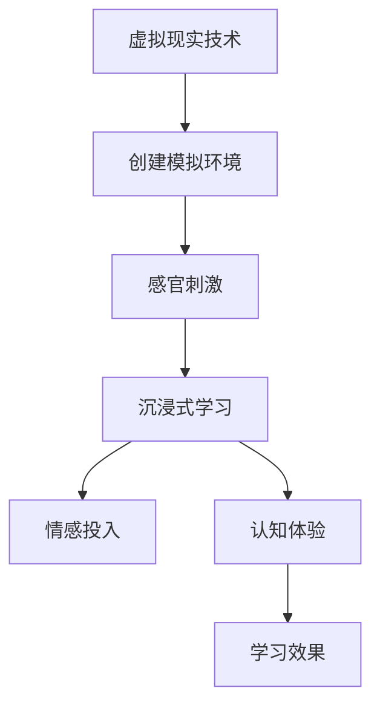

                 

### 虚拟现实教育创业：沉浸式学习体验

> **关键词：虚拟现实，教育，沉浸式学习，创业，技术开发**

> **摘要：本文将探讨虚拟现实教育创业的机遇与挑战，详细介绍沉浸式学习的原理与优势，分析虚拟现实教育设备与技术，阐述虚拟现实教育的教学方法与实践，分享成功案例与创业经验，为创业者提供系统性指导。**

### 第一部分：虚拟现实教育与沉浸式学习基础

虚拟现实（VR）技术正逐渐渗透到教育领域，带来了前所未有的沉浸式学习体验。本部分将首先概述虚拟现实教育的发展历程，深入探讨沉浸式学习的原理与优势，并分析虚拟现实在教育中各类学科的应用。

#### 1. 虚拟现实教育概述

##### 1.1 虚拟现实技术的历史与发展

虚拟现实技术的发展可以追溯到1960年代。1968年，美国研究员查尔斯·马丁·“查克”·摩尔利（Charles M. "Chuck" Martin）发明了“空间表现系统”（Space Perception Display），这是虚拟现实技术的雏形。随后，虚拟现实技术经历了多个发展阶段：

- **早期阶段（1960-1980年代）**：此阶段的主要成就是开发出了头戴式显示器（HMD）和跟踪设备，这些设备为虚拟现实体验奠定了基础。
- **成熟阶段（1990-2000年代）**：随着计算机技术和图形处理能力的提升，虚拟现实应用逐渐从实验室走向商业市场。知名游戏《魔兽世界》的发布，标志着虚拟现实技术开始在娱乐领域获得广泛关注。
- **现代阶段（2010年代至今）**：随着智能手机和移动设备的普及，虚拟现实技术迎来了新的发展机遇。2010年，Oculus Rift的发布标志着VR头戴设备的商业化进程，使得虚拟现实在教育、医疗、军事等领域的应用成为可能。

##### 1.2 沉浸式学习的原理与优势

沉浸式学习是指通过模拟真实世界的环境、情境或事件，使学习者在情感、认知和感官上完全投入学习过程的一种学习方式。沉浸式学习的原理基于以下几个核心要素：

- **感官刺激**：通过视觉、听觉、触觉等多种感官刺激，增强学习者的参与感和沉浸感。
- **情境相关性**：将学习内容与实际情境相结合，使学习者能够在真实的情境中应用所学知识。
- **互动性**：通过人机交互和人际互动，促进学习者之间的交流和协作，提高学习效果。

沉浸式学习具有以下几个优势：

- **提高学习兴趣**：通过丰富的感官刺激和真实的情境，激发学习者对学习内容的兴趣，提高学习动机。
- **增强记忆效果**：在沉浸式环境中，学习者的感官和情感被充分调动，有助于加深对学习内容的记忆和理解。
- **促进深度学习**：沉浸式学习使学习者能够更深入地探索学习内容，培养批判性思维和问题解决能力。
- **适应个性化学习**：虚拟现实技术可以创建个性化的学习路径，满足不同学习者的需求，提高学习效率。

##### 1.3 虚拟现实教育在各类学科中的应用

虚拟现实技术在教育中具有广泛的应用，以下是一些典型的应用实例：

- **历史教育**：通过虚拟现实技术，学生可以身临其境地参观历史遗址、博物馆，了解历史事件的发展过程。
- **医学教育**：医学学生可以通过虚拟手术模拟，掌握手术技能，降低实际操作中的风险。
- **自然科学教育**：虚拟现实技术可以创建虚拟实验室，让学生在虚拟环境中进行实验，探索自然现象。
- **外语教育**：通过虚拟现实技术，学生可以沉浸在英语环境中，提高口语和听力能力。
- **职业教育**：虚拟现实技术可以模拟实际工作场景，帮助学生掌握职业技能，提高就业竞争力。

### 第二部分：虚拟现实教育设备与技术

虚拟现实教育的发展离不开先进的设备和技术支持。本部分将详细介绍虚拟现实教育所需的硬件设备、软件开发工具以及内容制作流程。

#### 2.1 虚拟现实硬件设备

虚拟现实硬件设备是提供沉浸式学习体验的核心组成部分。以下是一些常见的虚拟现实硬件设备：

- **头戴式显示器（HMD）**：头戴式显示器是虚拟现实体验的核心设备，通过将图像显示在用户眼前，提供沉浸式视觉体验。常见的HMD设备包括Oculus Rift、HTC Vive和Sony PlayStation VR等。
- **虚拟现实交互设备**：虚拟现实交互设备包括手柄、手势识别设备等，用于与虚拟环境进行交互。例如，Oculus Touch、Valve Index等手柄设备，可以实现精细的手部动作追踪。
- **虚拟现实音响系统**：虚拟现实音响系统用于模拟3D音效，增强沉浸感。常见的虚拟现实音响系统包括Bose AR、Sony 3D Sound等。

#### 2.2 虚拟现实软件开发工具

虚拟现实软件开发工具用于创建和管理虚拟现实场景、角色和交互。以下是一些常见的虚拟现实软件开发工具：

- **Unity3D**：Unity3D是一款功能强大的游戏开发引擎，支持虚拟现实应用开发。Unity3D提供了丰富的图形渲染功能和跨平台支持，适用于各种虚拟现实项目。
- **Unreal Engine**：Unreal Engine是另一款流行的游戏开发引擎，以其出色的图形渲染效果和高效的开发流程而闻名。Unreal Engine适用于制作高质量的虚拟现实应用。
- **其他虚拟现实开发工具**：除了Unity3D和Unreal Engine，还有其他虚拟现实开发工具，如Unity的VR套件、Unreal Engine的VR模板等，适用于快速开发和原型设计。

#### 2.3 虚拟现实内容制作流程

虚拟现实内容制作流程包括以下几个关键步骤：

- **视觉内容的制作**：视觉内容是虚拟现实体验的重要组成部分。制作视觉内容需要使用3D建模软件（如Blender、Maya等）创建场景、角色和物体，并进行纹理贴图和光照设置。
- **声音效果的设计**：虚拟现实体验中的声音效果对于营造沉浸感至关重要。声音效果的设计包括环境音效、角色语音和交互音效等，可以使用音频编辑软件（如Audacity、Adobe Audition等）进行制作。
- **人机交互的优化**：人机交互是虚拟现实体验的核心。人机交互的优化包括用户界面设计、交互逻辑和反馈机制等，需要充分考虑用户的操作习惯和体验需求。

### 第三部分：虚拟现实教育的教学方法与实践

虚拟现实教育为教学方法的创新提供了丰富的可能性。本部分将探讨虚拟现实教育的教学方法，分析成功案例，并介绍虚拟现实教育在在线教育平台、教育类APP和教育游戏设计中的应用。

#### 3.1 虚拟现实教学设计原则

虚拟现实教学设计应遵循以下原则：

- **目标明确**：明确教学目标和内容，确保虚拟现实教学与实际教学目标相一致。
- **情境创设**：创设与学习内容相关的情境，提高学习者的参与感和沉浸感。
- **互动性**：设计互动性强的教学活动，促进学习者之间的交流和协作。
- **适应性**：根据学习者的需求和能力，设计个性化的学习路径和教学资源。
- **反馈及时**：提供及时的反馈，帮助学习者了解学习效果，调整学习策略。

#### 3.2 虚拟现实教学案例分析

以下是一些虚拟现实教学的成功案例：

- **创意课堂：历史文化的沉浸式教学**：通过虚拟现实技术，学生可以进入历史场景，与历史人物互动，了解历史事件的发展过程。这种沉浸式教学方式不仅提高了学生的学习兴趣，还增强了学生对历史知识的理解和记忆。
- **情景模拟：医学手术的虚拟训练**：医学学生可以通过虚拟现实技术进行手术模拟，掌握手术技能。虚拟现实手术模拟系统提供了真实的手术环境和互动性操作，降低了实际手术中的风险，提高了手术成功率。
- **实景再现：自然灾害的防范教育**：通过虚拟现实技术，学生可以身临其境地体验自然灾害（如地震、洪水等）的发生过程，学习防范措施和自救技能。这种教学方式有助于提高学生的应急能力和安全意识。

#### 3.3 虚拟现实教育应用案例

以下是一些虚拟现实教育应用案例：

- **在线教育平台**：虚拟现实技术可以应用于在线教育平台，为学生提供沉浸式的学习体验。例如，学生可以在虚拟教室中参加课程，与教师和同学互动，观看三维课件和视频，提高学习效果。
- **教育类APP开发**：教育类APP可以利用虚拟现实技术提供互动式的学习体验。例如，学生可以通过APP中的虚拟实验室进行实验，探索科学原理，增强学习兴趣。
- **教育游戏设计**：虚拟现实技术可以应用于教育游戏设计，为学生提供寓教于乐的学习体验。例如，学生可以通过虚拟游戏角色进行探险，解决谜题，学习知识，提高综合素质。

### 第四部分：虚拟现实教育创业准备与实践

虚拟现实教育创业面临着巨大的机遇和挑战。本部分将探讨虚拟现实教育创业的机遇与挑战，分析创业策略与规划，并介绍虚拟现实教育项目的实施与管理。

#### 4.1 虚拟现实教育创业机遇与挑战

##### 4.1.1 虚拟现实教育市场的机遇

虚拟现实教育市场的机遇主要表现在以下几个方面：

- **教育市场需求的增长**：随着教育信息化和个性化教育的推进，虚拟现实技术在教育领域的应用需求不断增加。
- **政策支持与投资环境**：各国政府对虚拟现实技术的支持力度不断加大，为虚拟现实教育创业提供了良好的政策环境和投资环境。
- **技术进步与产业链完善**：虚拟现实技术的不断进步和产业链的完善，为虚拟现实教育创业提供了丰富的技术支持和资源保障。

##### 4.1.2 虚拟现实教育创业的挑战

虚拟现实教育创业面临的挑战主要包括以下几个方面：

- **技术研发难度**：虚拟现实技术涉及多个领域，包括计算机图形学、传感器技术、人工智能等，技术研发难度较大。
- **市场推广与认可度**：虚拟现实教育产品需要得到教育机构和家长的认可，市场推广难度较大。
- **成本与盈利模式探索**：虚拟现实教育项目的建设成本较高，同时需要探索可持续的盈利模式。

#### 4.2 虚拟现实教育创业策略与规划

虚拟现实教育创业应遵循以下策略和规划：

- **创业团队组建与资源整合**：组建具有多学科背景的创业团队，整合行业资源，提高项目成功率。
- **市场定位与产品规划**：明确市场定位，设计具有竞争力的虚拟现实教育产品，满足不同用户的需求。
- **品牌建设与市场推广**：打造具有差异化优势的品牌形象，通过多种渠道进行市场推广，提高品牌知名度。
- **融资渠道与投资策略**：探索多样化的融资渠道，制定合理的投资策略，确保项目资金充足。

#### 4.3 虚拟现实教育项目的实施与管理

虚拟现实教育项目的实施与管理应遵循以下原则：

- **项目启动与筹备**：制定项目启动计划，进行资金预算和成本控制，进行团队成员培训和技能提升。
- **项目开发与测试**：遵循软件工程开发流程，使用合适的开发工具和平台进行项目开发，进行严格的测试和质量保证。
- **项目上线与运营**：进行系统部署和上线，建立用户支持与服务体系，进行数据分析和迭代优化，持续提升产品服务质量。

### 第五部分：成功案例与创业经验分享

虚拟现实教育创业的成功案例和创业经验对于其他创业者具有重要的借鉴意义。本部分将介绍几个虚拟现实教育创业的成功案例，分析其成功关键因素，并分享创业经验与未来趋势。

#### 5.1 虚拟现实教育创业成功案例解析

##### 5.1.1 案例一：XYZ教育平台的成功之路

XYZ教育平台是一家专注于虚拟现实教育的公司，其成功关键因素包括：

- **创始团队的背景与创业初衷**：XYZ教育平台的创始团队由一群具有丰富教育行业经验和虚拟现实技术背景的成员组成。他们的创业初衷是利用虚拟现实技术为教育行业带来革命性变革。
- **产品设计与市场定位**：XYZ教育平台设计了一款面向中小学生的虚拟现实课程，结合了丰富的教学内容和互动性强的教学方式。其市场定位明确，针对对教育信息化有需求的城市家庭。
- **成功关键因素分析**：XYZ教育平台成功的关键因素包括：团队的专业背景、产品的创新性和市场定位的准确性。

##### 5.1.2 案例二：ABC虚拟现实学校的运营经验

ABC虚拟现实学校是一所采用虚拟现实技术进行教学的新型学校。其运营经验包括：

- **学校的教育理念与课程设置**：ABC虚拟现实学校的教育理念是以学生为中心，注重培养学生的创新能力和实践能力。其课程设置涵盖了多个学科领域，包括虚拟现实技术、编程、设计等。
- **运营模式与盈利策略**：ABC虚拟现实学校采用了线上线下相结合的运营模式，通过线上课程和线下实验相结合的方式为学生提供全面的学习体验。其盈利策略包括课程销售、教育咨询服务等。
- **面临的挑战与应对措施**：ABC虚拟现实学校面临的主要挑战包括技术升级、市场推广和用户认可度等。其应对措施包括持续研发创新技术、加大市场推广力度和提供优质的用户服务。

##### 5.1.3 案例三：虚拟现实教育解决方案提供商的盈利模式

虚拟现实教育解决方案提供商的盈利模式包括以下几个方面：

- **解决方案的范围与服务内容**：虚拟现实教育解决方案提供商提供从硬件设备到软件平台的一站式服务，包括虚拟现实教室的建设、虚拟实验平台开发、虚拟课堂系统部署等。
- **合作伙伴关系与市场拓展**：虚拟现实教育解决方案提供商与教育机构和科技公司建立紧密的合作伙伴关系，通过合作拓展市场，提高品牌知名度。
- **盈利模式的探索与实践**：虚拟现实教育解决方案提供商的盈利模式包括课程销售、技术支持服务、设备租赁等多种方式，通过不断优化服务内容和运营模式，实现盈利增长。

#### 5.2 创业经验与未来趋势

虚拟现实教育创业经验主要包括以下几点：

- **团队建设与管理**：创业团队应具备多学科背景，包括教育、技术、市场营销等，以提高项目的综合实力。同时，要注重团队文化建设，激发团队成员的创造力和执行力。
- **技术研发与创新能力**：虚拟现实教育创业需要持续进行技术研发和创新，以满足市场需求和保持竞争优势。创业公司应与高校、科研机构等合作，引进先进技术，提高研发水平。
- **市场策略与用户反馈**：创业公司应制定明确的市场策略，通过市场调研、用户反馈等方式了解市场需求，调整产品和服务，提高用户满意度。

虚拟现实教育的未来趋势包括以下几点：

- **技术发展与创新方向**：随着虚拟现实技术的不断发展，未来的虚拟现实教育将更加注重交互性、实时性和智能化。例如，增强现实（AR）技术的应用、人工智能在虚拟现实教学中的融合等。
- **教育政策与环境变化**：各国政府将继续加大对虚拟现实教育的支持力度，推动教育信息化进程。同时，教育政策的变化也将对虚拟现实教育创业产生重要影响。
- **行业挑战与机遇**：虚拟现实教育行业将面临技术标准统一、市场推广难度、盈利模式探索等挑战。但同时也将迎来教育变革、技术升级等机遇。

### 附录

#### 附录 A：虚拟现实教育与沉浸式学习核心概念与联系

虚拟现实教育与沉浸式学习密切相关，以下是两者的核心概念及其联系：

- **虚拟现实（VR）**：虚拟现实是通过计算机技术创建的模拟环境，用户可以在这个环境中进行交互和体验。
- **沉浸式学习**：沉浸式学习是一种通过感官刺激和情境创设，使学习者在情感、认知和感官上完全投入学习过程的学习方式。

以下是一个Mermaid流程图，展示虚拟现实教育与沉浸式学习的核心概念与联系：



#### 附录 B：虚拟现实教育核心算法原理讲解

虚拟现实教育中涉及的核心算法包括深度学习算法和增强学习算法。以下是这些算法的简要原理及其在虚拟现实教育中的应用：

- **深度学习算法**：深度学习算法是一种通过模拟人脑神经网络进行数据分析和模式识别的人工智能技术。以下是一个使用卷积神经网络（CNN）进行图像处理的伪代码示例：

  ```python
  model = Sequential()
  model.add(Conv2D(32, (3, 3), activation='relu', input_shape=(64, 64, 3)))
  model.add(MaxPooling2D((2, 2)))
  model.add(Conv2D(64, (3, 3), activation='relu'))
  model.add(MaxPooling2D((2, 2)))
  model.add(Flatten())
  model.add(Dense(128, activation='relu'))
  model.add(Dense(1, activation='sigmoid'))
  model.compile(optimizer='adam', loss='binary_crossentropy', metrics=['accuracy'])
  ```

- **增强学习算法**：增强学习算法是一种通过不断尝试和反馈，使学习系统在特定环境中获得最佳行为的人工智能技术。以下是一个使用Q-learning算法进行虚拟现实教学中的行为优化的伪代码示例：

  ```python
  Q[s][a] = Q[s][a] + α(R[s][a] - Q[s][a])
  ```

#### 附录 C：数学模型和数学公式

虚拟现实教育中涉及的一些关键数学模型和数学公式如下：

- **视差计算**：视差是虚拟现实中的关键参数，用于计算左右眼视图之间的差异。以下是一个视差计算的公式：

  $$ \text{视差} = \frac{d_{左}}{d_{右}} = \frac{z_{左} - z_{右}}{z_{左} + z_{右}} $$

- **注意力机制**：注意力机制是虚拟现实教育中用于优化学习体验的关键技术。以下是一个注意力计算的公式：

  $$ \alpha = \frac{\exp(e_i)}{\sum_j \exp(e_j)} $$

  其中，$e_i$ 是每个元素的特征向量。

#### 附录 D：项目实战

##### D.1 虚拟现实教育应用项目实战

以下是一个虚拟现实教育应用项目实战的概述：

**项目概述**：本项目旨在开发一个基于虚拟现实技术的数学学习应用，帮助学生进行数学练习和探索。

**开发环境搭建**： 
- **操作系统**：Ubuntu 20.04
- **开发工具**：Unity3D
- **编程语言**：C#

**源代码实现**：
- **主场景设计**：

  ```csharp
  using UnityEngine;

  public class MainScene : MonoBehaviour
  {
      public GameObject mathQuestionPrefab;
      public Transform questionParent;

      private void Start()
      {
          // 生成数学问题
          GenerateMathQuestion();
      }

      private void GenerateMathQuestion()
      {
          // 生成数学问题实例
          GameObject mathQuestion = Instantiate(mathQuestionPrefab, questionParent);
          // 设置数学问题
          MathQuestion mathQuestionScript = mathQuestion.GetComponent<MathQuestion>();
          mathQuestionScript.SetupQuestion();
      }
  }
  ```

- **数学问题脚本**：

  ```csharp
  using System.Collections;
  using System.Collections.Generic;
  using UnityEngine;

  public class MathQuestion : MonoBehaviour
  {
      public Text questionText;
      public Text answerText;

      private void SetupQuestion()
      {
          // 生成随机数学问题
          int num1 = Random.Range(1, 100);
          int num2 = Random.Range(1, 100);
          string operation = Random.Choose("+", "-", "*");

          questionText.text = $"{num1} {operation} {num2} = ?";
          answerText.text = $"答案：{num1 + num2}"; // 示例：加法问题
      }
  }
  ```

**代码解读与分析**：
- **主场景脚本（MainScene）** 负责生成数学问题实例并设置其属性。
- **数学问题脚本（MathQuestion）** 负责生成随机数学问题并将其显示在虚拟场景中。

通过这个简单的项目实战，读者可以了解到如何利用虚拟现实技术创建一个互动式的数学学习体验。这不仅有助于提高学生的学习兴趣，还可以提供一种全新的教学方式。

### 作者信息

作者：AI天才研究院/AI Genius Institute & 禅与计算机程序设计艺术 /Zen And The Art of Computer Programming

本文由AI天才研究院（AI Genius Institute）撰写，旨在为虚拟现实教育创业者提供系统性指导。同时，本文结合了禅与计算机程序设计艺术的理念，致力于探索技术与人性的融合，以推动教育变革和创新。

