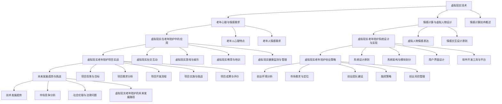

                 

# 《虚拟现实老年陪护创业：科技辅助的情感关怀》

> 关键词：虚拟现实、老年陪护、情感关怀、科技创业、心理健康

> 摘要：随着人口老龄化趋势的加剧，老年陪护服务需求日益增长。本文探讨了如何利用虚拟现实技术开展老年陪护创业项目，通过科技辅助实现情感关怀。文章首先介绍了虚拟现实技术的基础知识，然后分析了老年人群体的心理与情感需求，接着详细阐述了虚拟现实在老年陪护中的应用，最后提出了虚拟现实老年陪护创业的可行性和策略。本文旨在为相关创业者和研究者提供参考，共同推动老年陪护服务的创新发展。

## 第1章：引言与背景

### 1.1 虚拟现实技术介绍

虚拟现实（Virtual Reality，简称VR）是一种通过计算机技术模拟出来的三维环境，使用户能够沉浸其中并与之进行互动。VR技术主要包括三个核心组成部分：硬件设备、软件平台和应用内容。

**硬件设备**：常见的VR硬件设备包括虚拟现实头显（如Oculus Rift、HTC Vive）、手柄控制器（如Oculus Touch、Vive控制器）、定位传感器（用于追踪用户的位置和动作）等。这些设备共同构成了一个完整的VR体验环境。

**软件平台**：VR软件平台负责处理硬件设备的输入输出，并提供开发工具和资源库。常见的VR软件平台有Unity 3D、Unreal Engine等。这些平台提供了丰富的开发工具和API，使得开发者可以轻松地创建和部署VR应用。

**应用内容**：VR应用内容是虚拟现实技术的核心。它包括各种虚拟环境、场景、角色和交互方式。随着VR技术的不断发展，应用内容越来越丰富，涵盖了游戏、教育、医疗、旅游、房地产等多个领域。

### 1.2 老龄化社会与老年陪护需求

全球范围内，人口老龄化问题日益严重。根据联合国的预测，到2050年，全球65岁及以上人口将占总人口的16%。这一趋势对社会保障体系、医疗资源、老年陪护服务等方面带来了巨大的挑战。

**老年陪护需求**：老年人群体的生活质量和心理健康问题日益突出，对陪护服务的需求日益增长。老年人在生活中面临孤独、病痛、心理压力等多重困扰，需要有人陪伴、倾听和关怀。

**当前陪护服务现状**：目前，我国的老年陪护服务主要依赖于家庭和社区。然而，由于家庭结构和人口流动的影响，很多老年人无法得到足够的陪伴和关爱。同时，专业陪护人员的数量和素质也难以满足需求。

### 1.3 虚拟现实在老年陪护中的应用前景

虚拟现实技术为老年陪护服务带来了新的机遇和可能性。以下是虚拟现实在老年陪护中的应用前景：

**社交互动**：虚拟现实技术可以为老年人提供一个虚拟社交平台，使他们能够与家人、朋友和社区成员进行互动。通过虚拟现实社交，老年人可以缓解孤独感，提高生活质量。

**娱乐与休闲**：虚拟现实技术可以为老年人提供丰富多彩的娱乐和休闲活动。例如，虚拟旅游、虚拟健身、虚拟游戏等，这些活动有助于老年人保持身心健康，延缓老年痴呆等疾病的发生。

**教育与培训**：虚拟现实技术可以用于老年教育和培训，帮助他们学习新知识、掌握新技能。例如，虚拟现实教学、虚拟图书馆、虚拟博物馆等，这些资源可以弥补老年教育资源不足的问题。

**心理健康服务**：虚拟现实技术可以用于心理健康服务，为老年人提供心理治疗和辅导。例如，虚拟现实放松训练、虚拟现实认知行为治疗等，这些方法有助于老年人改善心理健康，缓解心理压力。

### 1.4 本书内容结构概述

本书将分为八个章节，系统地探讨虚拟现实老年陪护创业的各个方面。

- 第1章：引言与背景，介绍虚拟现实技术、老龄化社会与老年陪护需求，以及虚拟现实在老年陪护中的应用前景。
- 第2章：虚拟现实技术基础，介绍虚拟现实技术的基础知识，包括硬件设备、软件平台和应用内容。
- 第3章：老年心理与情感需求分析，分析老年人群体的心理和情感特点，以及他们在生活中的需求和挑战。
- 第4章：虚拟现实在老年陪护中的应用，详细探讨虚拟现实在老年陪护中的具体应用场景和解决方案。
- 第5章：虚拟现实老年陪护系统的设计与实现，介绍虚拟现实老年陪护系统的设计原则、架构和开发流程。
- 第6章：情感计算与虚拟人物设计，探讨情感计算技术、虚拟人物情感表达和交互设计原则。
- 第7章：虚拟现实老年陪护项目实战，通过实际案例介绍虚拟现实老年陪护项目的开发流程、挑战和成果。
- 第8章：虚拟现实老年陪护创业策略，分析虚拟现实老年陪护创业的市场环境、需求定位、团队建设、融资策略和风险管理。
- 第9章：未来发展趋势与挑战，探讨虚拟现实老年陪护技术的未来发展趋势和面临的挑战。

通过本书的阅读，读者可以全面了解虚拟现实老年陪护创业的各个方面，为开展相关创业项目提供理论和实践指导。

----------------------------------------------------------------

## 第2章：虚拟现实技术基础

### 2.1 虚拟现实技术概述

虚拟现实（VR）是一种通过计算机技术模拟出来的三维环境，使用户能够沉浸其中并与之进行互动。VR技术通常包括三个核心组成部分：硬件设备、软件平台和应用内容。

**硬件设备**：VR硬件设备是用户与虚拟环境进行交互的媒介。常见的VR硬件设备包括虚拟现实头显、手柄控制器、定位传感器等。虚拟现实头显通常配备有高分辨率显示屏，可以模拟出广阔的视野范围。手柄控制器则用于用户在虚拟环境中进行操作和交互。定位传感器用于追踪用户的位置和动作，确保用户在虚拟环境中的移动与实际动作保持一致。

**软件平台**：VR软件平台负责处理硬件设备的输入输出，并提供开发工具和资源库。VR软件平台通常包括开发环境、编辑器、引擎等。常见的VR软件平台有Unity 3D、Unreal Engine等。这些平台提供了丰富的开发工具和API，使得开发者可以轻松地创建和部署VR应用。

**应用内容**：VR应用内容是虚拟现实技术的核心。它包括各种虚拟环境、场景、角色和交互方式。随着VR技术的不断发展，应用内容越来越丰富，涵盖了游戏、教育、医疗、旅游、房地产等多个领域。VR应用内容可以通过三维建模、动画制作、游戏设计等技术实现。

### 2.2 虚拟现实硬件设备

虚拟现实硬件设备是VR系统的重要组成部分，决定了用户的沉浸体验。以下是常见的虚拟现实硬件设备及其功能：

**虚拟现实头显**：虚拟现实头显（HMD，Virtual Reality Head-Mounted Display）是VR系统的核心设备，用于将用户包裹在虚拟环境中。常见的头显设备有Oculus Rift、HTC Vive、PlayStation VR等。这些头显设备通常配备有两块高分辨率显示屏，能够提供广阔的视野范围，并使用传感器追踪用户头部和手部的运动，使虚拟环境与用户动作保持同步。

**手柄控制器**：手柄控制器（Controller）是用户在虚拟环境中进行交互的重要工具。常见的控制器有Oculus Touch、HTC Vive控制器、PlayStation VR控制器等。这些控制器通常配备有触摸按钮、传感器和跟踪技术，使得用户可以在虚拟环境中进行触摸、抓取、投掷等操作。

**定位传感器**：定位传感器（Sensor）用于追踪用户的位置和动作，确保虚拟环境中的虚拟对象与用户动作保持一致。常见的定位传感器有光学传感器、超声波传感器、惯性测量单元（IMU）等。光学传感器通过发射和接收红外光线来追踪用户位置，而超声波传感器通过发射和接收超声波信号来测量距离。

### 2.3 虚拟现实软件与内容开发

虚拟现实软件与内容开发是VR技术的关键环节，决定了用户体验的质量。以下是虚拟现实软件与内容开发的主要步骤和工具：

**开发工具**：虚拟现实开发工具提供了创建和部署VR应用所需的各种功能。常见的VR开发工具包括Unity 3D、Unreal Engine、Blender等。这些工具提供了丰富的开发环境、编辑器、脚本语言和API，使得开发者可以轻松地创建和优化VR应用。

**编辑器**：VR编辑器是开发VR应用的主要工具，用于创建虚拟环境、场景和角色。常见的VR编辑器包括Unity 3D编辑器、Unreal Engine编辑器等。这些编辑器提供了丰富的功能，如3D建模、动画制作、脚本编写等，使得开发者可以方便地实现复杂的VR场景。

**脚本语言**：VR开发通常使用脚本语言进行编程，以控制虚拟环境中的行为和交互。常见的VR脚本语言包括C#、C++、Python等。C#是Unity 3D的主要编程语言，C++是Unreal Engine的主要编程语言，Python则因其简洁性和易用性而受到许多开发者的青睐。

**内容开发**：虚拟现实内容开发包括三维建模、动画制作、场景设计和交互设计等。三维建模和动画制作可以使用如Blender、Maya、3ds Max等工具完成。场景设计和交互设计则需要开发者根据应用需求进行规划和实现，以确保虚拟环境与用户互动的流畅性和自然性。

### 2.4 虚拟现实技术发展趋势

虚拟现实技术正处于快速发展阶段，未来将呈现出以下发展趋势：

**硬件技术的进步**：随着硬件技术的进步，虚拟现实头显的分辨率、帧率和舒适度将进一步提高，使得用户能够获得更真实的沉浸体验。此外，手柄控制器和定位传感器的精度和响应速度也将不断提升，使得用户在虚拟环境中的操作更加流畅和自然。

**软件技术的完善**：虚拟现实软件平台将继续优化和扩展，提供更多的开发工具和资源库。这些工具将使得开发者能够更轻松地创建和部署高质量的VR应用。同时，VR编辑器和脚本语言的改进也将提高开发效率，降低开发门槛。

**应用场景的拓展**：虚拟现实技术在各个领域的应用将不断拓展。除了游戏和娱乐外，虚拟现实在教育、医疗、房地产、旅游等领域也具有广泛的应用前景。例如，虚拟现实教育可以实现个性化教学，虚拟现实医疗可以实现远程诊疗和手术指导。

**社会影响的加深**：虚拟现实技术的普及将对社会产生深远的影响。它不仅改变了人们的娱乐和生活方式，还将影响教育、工作、医疗等多个领域。同时，虚拟现实技术也将带来新的道德和伦理问题，如虚拟现实成瘾、隐私保护等。

通过以上分析，我们可以看到虚拟现实技术具有巨大的发展潜力，将在未来为人们的生活和工作带来更多的便利和创新。在老年陪护领域，虚拟现实技术将发挥重要作用，为老年人提供更加丰富和有意义的陪护服务。

----------------------------------------------------------------

## 第3章：老年心理与情感需求分析

### 3.1 老年人心理特点

随着生理机能的逐渐衰退，老年人在心理上表现出一些独特的特点。了解这些特点有助于更好地为老年人提供心理关怀。

**记忆力减退**：老年人普遍面临记忆力减退的问题，特别是在短期记忆方面。这可能导致他们难以记住新信息或近期发生的事情。

**认知功能下降**：随着年纪的增长，老年人的认知功能，如注意力和执行力，可能会出现下降。这使得他们在完成复杂的任务时感到困难。

**情感波动**：老年人可能会经历情绪波动，如焦虑、抑郁和孤独感。这些情绪波动可能与生活中的变化、社交孤立和健康问题有关。

**怀旧倾向**：老年人往往更倾向于怀旧，对过去的经历和回忆有着浓厚的兴趣。怀旧可以帮助他们缓解孤独感，但有时也可能导致对现实的回避。

**自我认同感的转变**：随着年龄的增长，老年人可能会面临自我认同感的转变。他们可能会重新评估自己的角色和生活方式，这可能导致自我价值感的提升或降低。

### 3.2 老年人情感需求

老年人的情感需求包括对陪伴、关爱、理解和支持的需求。以下是一些具体的情感需求：

**陪伴需求**：老年人渴望有人陪伴，参与日常活动和社交互动。孤独感和孤立感对老年人的心理健康有负面影响，因此提供陪伴是非常重要的。

**关爱需求**：老年人需要感受到家人的关爱和社会的温暖。关爱不仅体现在物质上，更体现在情感上的关心和尊重。

**理解需求**：老年人希望他们的需求和感受被理解。这包括对他们身体不适的理解、对生活变化的适应、以及对心理问题的关注。

**支持需求**：老年人需要支持，无论是情感上的还是实际操作上的。这包括在日常生活中提供帮助、在心理上给予安慰，以及在实际操作上提供指导。

### 3.3 老年人心理健康问题

老年人心理健康问题主要包括抑郁症、焦虑症、痴呆症等。

**抑郁症**：抑郁症是老年人中常见的精神障碍。老年人可能因为孤独、病痛、失去亲人等原因而感到抑郁。抑郁症不仅影响老年人的心理健康，还可能导致其他健康问题，如心脏病和糖尿病。

**焦虑症**：焦虑症是老年人中另一种常见的精神障碍。老年人可能会因为健康问题、经济压力或生活中的不确定性而感到焦虑。

**痴呆症**：痴呆症是一种认知障碍，主要影响老年人的生活质量。痴呆症患者可能会经历记忆力丧失、行为异常、语言障碍等问题。

### 3.4 情感关怀方法与策略

为了满足老年人的情感需求，提供有效的情感关怀是非常重要的。以下是一些情感关怀的方法和策略：

**倾听与沟通**：倾听老年人的心声，给予他们表达情感的机会。通过有效的沟通，了解他们的需求，帮助他们解决心理问题。

**陪伴与参与**：为老年人提供陪伴，鼓励他们参与社交活动。通过参与活动，老年人可以缓解孤独感，增强自我价值感。

**心理疏导**：对患有抑郁症、焦虑症等心理疾病的老年人，提供专业的心理疏导。心理疏导可以包括认知行为疗法、心理咨询等。

**社会支持**：为老年人提供社会支持，包括家人、朋友和社区资源的支持。通过社会支持，老年人可以感受到关爱，减轻心理压力。

**科技辅助**：利用虚拟现实技术，为老年人提供情感关怀。虚拟现实社交平台、虚拟旅游、虚拟健身等活动可以满足老年人的情感需求，提高他们的生活质量。

通过以上分析和策略，我们可以更好地理解和满足老年人的情感需求，提高他们的心理健康水平。虚拟现实技术在老年情感关怀中的应用，为老年人提供了一个全新的平台，使他们能够享受到科技带来的便利和关怀。

----------------------------------------------------------------

## 第4章：虚拟现实在老年陪护中的应用

### 4.1 虚拟现实社交互动

虚拟现实技术为老年陪护中的社交互动提供了新的可能性。通过虚拟现实社交平台，老年人可以与他人进行实时互动，从而缓解孤独感，提高生活质量。

**应用场景**：

- **虚拟家庭聚会**：老年人可以通过虚拟现实技术，与家人进行远程聚会。他们可以在虚拟环境中一起观看视频、玩游戏、聊天等，感受到亲情的温暖。

- **虚拟社交活动**：虚拟现实社交平台可以组织各种社交活动，如线上舞蹈、歌唱比赛、智力游戏等。这些活动不仅丰富了老年人的社交生活，还促进了身心健康。

- **虚拟志愿者服务**：老年人可以参与虚拟志愿者服务，如为贫困地区提供教育、医疗咨询等。通过这种方式，老年人不仅能够发挥自己的价值，还能感受到社会责任感。

**优势与挑战**：

- **优势**：虚拟现实社交互动具有以下优势：
  - **降低社交障碍**：老年人可以通过虚拟现实技术，克服地理位置的限制，与远在他乡的亲人、朋友进行互动。
  - **增加互动性**：虚拟现实社交平台提供了丰富的互动方式，如实时语音、视频通话、虚拟手势等，使得社交互动更加生动有趣。
  - **降低经济负担**：虚拟现实社交互动不需要老年人承担高昂的交通费用，使他们在有限的预算内也能享受高质量的社交生活。

- **挑战**：虚拟现实社交互动也面临一些挑战：
  - **技术门槛**：老年人可能对虚拟现实技术不够熟悉，需要一定的学习和适应时间。
  - **设备成本**：虚拟现实硬件设备（如头显、手柄等）价格较高，可能对一些经济条件较差的老年人造成负担。
  - **隐私问题**：虚拟现实社交平台需要保护老年人的隐私，防止个人信息泄露。

### 4.2 虚拟现实游戏与娱乐

虚拟现实游戏与娱乐为老年人提供了一种全新的休闲方式。通过虚拟现实技术，老年人可以在虚拟环境中体验丰富多彩的游戏和娱乐活动，从而提高生活质量。

**应用场景**：

- **虚拟旅游**：老年人可以通过虚拟现实技术，游览世界各地著名的旅游景点。他们可以身临其境地感受自然风光、历史文化，满足探索世界的愿望。

- **虚拟健身**：虚拟现实技术可以用于虚拟健身，如瑜伽、太极拳、舞蹈等。老年人可以在虚拟环境中进行运动，提高身体素质，预防疾病。

- **虚拟游戏**：虚拟现实游戏为老年人提供了一种全新的娱乐方式。他们可以参与各种虚拟游戏，如模拟高尔夫、虚拟搏斗、智力游戏等，享受游戏的乐趣。

**优势与挑战**：

- **优势**：虚拟现实游戏与娱乐具有以下优势：
  - **丰富休闲生活**：虚拟现实游戏与娱乐为老年人提供了丰富的休闲选择，使他们能够享受快乐的生活。
  - **提高身体素质**：虚拟现实健身可以引导老年人进行适当的运动，提高他们的身体素质，预防疾病。
  - **增强社交互动**：虚拟现实游戏可以促进老年人之间的互动，增进友谊，提高社交能力。

- **挑战**：虚拟现实游戏与娱乐也面临一些挑战：
  - **操作难度**：一些虚拟现实游戏可能操作复杂，老年人可能需要一定的学习和适应时间。
  - **游戏内容**：需要根据老年人的兴趣和需求，设计适合他们的游戏内容，以避免过度沉迷或缺乏兴趣。

### 4.3 虚拟现实教育与培训

虚拟现实技术为老年人的教育与培训提供了新的可能性。通过虚拟现实技术，老年人可以学习新知识、掌握新技能，从而提高生活质量。

**应用场景**：

- **在线教育**：老年人可以通过虚拟现实技术，参加在线教育课程。这些课程包括语言学习、计算机技能、健康知识等，使老年人能够不断充实自己。

- **虚拟博物馆**：老年人可以通过虚拟现实技术，参观虚拟博物馆，了解历史文化。虚拟博物馆提供了丰富的展品和讲解，使老年人能够享受到知识的乐趣。

- **职业培训**：老年人可以通过虚拟现实技术，参加职业培训课程。这些课程包括编程、摄影、手工艺等，使老年人能够实现职业转型或兴趣爱好。

**优势与挑战**：

- **优势**：虚拟现实教育与培训具有以下优势：
  - **灵活性强**：虚拟现实教育不受时间和地点的限制，老年人可以根据自己的需求和时间安排进行学习。
  - **互动性高**：虚拟现实教育提供了丰富的互动方式，如实时问答、讨论区等，使老年人能够更好地参与学习。
  - **资源丰富**：虚拟现实教育平台提供了丰富的学习资源，如视频、图文、互动游戏等，使老年人能够获得全面的学习体验。

- **挑战**：虚拟现实教育与培训也面临一些挑战：
  - **技术门槛**：老年人可能对虚拟现实技术不够熟悉，需要一定的学习和适应时间。
  - **内容质量**：需要确保虚拟现实教育内容的质量和实用性，以满足老年人的学习需求。

### 4.4 虚拟现实健康监测与管理

虚拟现实技术为老年人的健康监测与管理提供了新的手段。通过虚拟现实技术，老年人可以进行健康监测、疾病预防和康复训练，从而提高健康水平。

**应用场景**：

- **健康监测**：老年人可以通过虚拟现实设备，进行健康数据监测，如心率、血压、步数等。这些数据可以帮助老年人了解自己的健康状况，并及时调整生活方式。

- **疾病预防**：虚拟现实技术可以用于疾病预防，如高血压、糖尿病等。通过虚拟现实游戏和健身活动，老年人可以保持良好的生活习惯，预防疾病发生。

- **康复训练**：老年人可以通过虚拟现实技术，进行康复训练，如物理治疗、认知训练等。虚拟现实康复训练提供了丰富的训练项目，可以帮助老年人恢复身体功能。

**优势与挑战**：

- **优势**：虚拟现实健康监测与管理具有以下优势：
  - **便捷性**：虚拟现实健康监测与管理可以在家中进行，无需频繁去医院就诊，节省时间和精力。
  - **个性化**：虚拟现实技术可以根据老年人的健康状况和需求，提供个性化的康复训练和健康指导。
  - **趣味性**：虚拟现实康复训练采用了游戏化的设计，使老年人能够更愿意参与训练，提高康复效果。

- **挑战**：虚拟现实健康监测与管理也面临一些挑战：
  - **技术稳定性**：虚拟现实设备的稳定性对于健康监测与管理的准确性至关重要，需要确保设备运行的稳定性。
  - **数据安全性**：需要确保老年人的健康数据得到有效保护，防止数据泄露。

通过以上分析，我们可以看到虚拟现实技术在老年陪护中的应用具有广阔的前景。通过虚拟现实社交互动、游戏与娱乐、教育与培训以及健康监测与管理，老年人可以享受到更加丰富和有意义的陪护服务。然而，在推广应用虚拟现实技术时，也需要关注技术门槛、设备成本、隐私保护等问题，以确保老年人能够真正受益。

----------------------------------------------------------------

## 第5章：虚拟现实老年陪护系统的设计与实现

### 5.1 系统设计原则

在设计虚拟现实老年陪护系统时，我们需要遵循以下原则，以确保系统的可用性、可维护性和可扩展性。

**1. 用户中心设计**：系统设计应以老年人为中心，充分考虑他们的需求、习惯和操作能力。界面设计应简洁直观，易于操作。

**2. 功能完整性**：系统应提供全面的陪护功能，包括社交互动、健康监测、娱乐活动、教育和培训等，以满足老年人的多样化需求。

**3. 技术先进性**：选择成熟的虚拟现实技术和平台，确保系统的性能和稳定性。同时，保持对新技术的研究和跟进，为系统的升级和优化提供支持。

**4. 数据安全性**：系统应具备完善的数据安全机制，确保用户隐私和数据安全。采用加密技术、访问控制等技术手段，防止数据泄露和滥用。

**5. 可扩展性**：系统设计应具备良好的可扩展性，以便在未来根据需求增加新的功能和服务。采用模块化设计，使系统的升级和维护更加便捷。

### 5.2 系统架构与模块划分

虚拟现实老年陪护系统可以分为多个模块，每个模块负责不同的功能。以下是系统的主要模块及其功能：

**1. 用户管理模块**：负责用户注册、登录、个人信息管理等功能。

**2. 社交互动模块**：提供虚拟社交平台，包括好友互动、社交活动组织、实时通讯等功能。

**3. 健康监测模块**：提供健康数据监测、数据分析、健康报告生成等功能。

**4. 娱乐活动模块**：提供虚拟旅游、虚拟游戏、虚拟健身等活动，丰富老年人的休闲生活。

**5. 教育培训模块**：提供在线教育、虚拟博物馆、职业培训等服务，满足老年人的学习需求。

**6. 健康管理模块**：提供疾病预防、康复训练、健康指导等服务，帮助老年人维护健康。

**7. 数据分析模块**：负责收集、存储和分析用户数据，为系统优化和个性化服务提供支持。

### 5.3 用户界面设计

用户界面设计是系统设计的关键环节，直接影响到老年人的使用体验。以下是用户界面设计的一些要点：

**1. 简洁直观**：界面设计应简洁明了，避免过多的按钮和选项，使老年人容易理解和操作。

**2. 易于导航**：界面设计应提供清晰的导航路径，使老年人能够快速找到所需功能。

**3. 图形化表示**：使用图形化表示，如图标、动画等，提高界面的美观性和易用性。

**4. 可定制性**：界面设计应提供可定制选项，如字体大小、颜色等，满足不同老年人的个性化需求。

**5. 反馈机制**：界面设计应提供及时的反馈机制，如操作成功或失败提示，帮助老年人了解操作结果。

### 5.4 软件开发工具与平台

在虚拟现实老年陪护系统的开发过程中，我们需要选择合适的软件开发工具和平台。以下是常用的工具和平台：

**1. Unity 3D**：Unity 3D是一款功能强大的游戏开发引擎，适用于虚拟现实应用的开发。它提供了丰富的图形和物理引擎功能，易于集成和部署。

**2. Unreal Engine**：Unreal Engine是一款高性能的虚拟现实游戏引擎，适用于开发高质量、高性能的虚拟现实应用。

**3. C#**：C#是Unity 3D和Unreal Engine的主要编程语言，具有简洁的语法和强大的功能，适用于虚拟现实应用的开发。

**4. SteamVR**：SteamVR是一款用于Unity 3D和Unreal Engine的虚拟现实插件，提供对Oculus Rift、HTC Vive等虚拟现实头显的支持。

**5. MySQL**：MySQL是一款流行的关系型数据库管理系统，适用于存储和查询用户数据。

### 5.5 系统实现与测试

系统实现与测试是虚拟现实老年陪护系统开发的关键环节。以下是系统实现与测试的步骤：

**1. 功能实现**：根据系统架构和模块划分，实现各个功能模块，如用户管理、社交互动、健康监测等。

**2. 界面实现**：根据用户界面设计的要求，实现系统的用户界面，包括导航、按钮、菜单等。

**3. 数据库设计**：设计用户数据库，包括用户表、好友表、健康数据表等，确保数据存储和查询的准确性。

**4. 系统集成**：将各个功能模块和数据库集成到系统中，确保系统整体功能的正常运行。

**5. 功能测试**：对系统进行功能测试，包括单元测试、集成测试和系统测试，确保各个功能模块的稳定性和可靠性。

**6. 性能测试**：对系统进行性能测试，包括负载测试和压力测试，评估系统在高并发情况下的性能和稳定性。

**7. 用户测试**：邀请老年人用户进行测试，收集用户反馈，优化系统功能和界面设计，提升用户体验。

通过以上步骤，我们可以实现一个功能完善、性能稳定的虚拟现实老年陪护系统，为老年人提供优质的陪护服务。

----------------------------------------------------------------

## 第6章：情感计算与虚拟人物设计

### 6.1 情感计算技术概述

情感计算（Affective Computing）是指通过计算机技术和人工智能方法，识别、理解、处理和模拟人类情感的过程。情感计算技术旨在使计算机能够更好地理解和满足用户的需求，提供更加个性化和贴心的用户体验。

**情感计算的核心目标**：

1. **情感识别**：通过分析用户的语音、文本、面部表情等数据，识别用户的情感状态。

2. **情感理解**：理解和解释用户的情感状态，了解用户的情绪变化和需求。

3. **情感处理**：根据用户的情感状态，调整计算机系统的行为和交互方式，提供更加贴心的服务。

4. **情感模拟**：通过计算机图形、动画和声音等手段，模拟人类的情感表达，与用户进行情感互动。

**情感计算的应用领域**：

1. **虚拟现实**：通过情感计算技术，虚拟现实系统可以更好地理解和满足用户的需求，提供更加逼真的交互体验。

2. **人机交互**：情感计算技术可以提高人机交互的自然性和情感化程度，使计算机更加贴近人类的情感和行为。

3. **心理健康**：情感计算技术可以用于心理健康监测和干预，帮助用户识别和改善情绪问题。

4. **教育**：情感计算技术可以用于个性化教育，根据学生的情感状态调整教学内容和方式。

### 6.2 虚拟人物情感表达

虚拟人物是虚拟现实系统中的重要组成部分，其情感表达对于用户的沉浸体验至关重要。虚拟人物的情感表达主要通过以下几个方面实现：

**1. 面部表情**：虚拟人物的面部表情可以传达丰富的情感信息，如快乐、悲伤、愤怒、惊讶等。通过精确的面部动画，虚拟人物可以模拟真实人类的面部表情。

**2. 身体语言**：虚拟人物的身体语言，如姿势、手势和动作，也可以表达情感。例如，一个拥抱动作可以传达温暖和关怀，而一个手势可以传达生气或不满。

**3. 声音和语音**：虚拟人物的声音和语音可以增强情感表达的效果。通过不同的语调、语速和语气，虚拟人物可以传达不同的情感状态，如平和、激动、悲伤等。

**4. 空间和场景**：虚拟人物所在的空间和场景也可以影响情感表达。例如，一个明亮的、充满活力的场景可以传达快乐和积极情绪，而一个昏暗的、寂静的场景可以传达悲伤或孤独情绪。

### 6.3 情感交互设计原则

情感交互设计是虚拟现实系统设计的重要环节，其核心目标是实现虚拟人物与用户的情感互动，提高用户的沉浸体验。以下是情感交互设计的一些原则：

**1. 个性化**：虚拟人物的情感表达应基于用户的个人喜好和情感状态，提供个性化的交互体验。通过分析用户的情感数据，虚拟人物可以调整其行为和情感表达，满足用户的需求。

**2. 自然性**：虚拟人物的情感表达应尽可能接近真实人类的行为和情感。通过自然流畅的动画和语音，虚拟人物可以与用户建立情感连接，增强用户的沉浸感。

**3. 反馈性**：虚拟人物的情感表达应具备反馈机制，根据用户的情感状态和互动行为，调整其情感表达。例如，当用户表达愉悦情绪时，虚拟人物可以回应以愉悦的表情和语言。

**4. 参与性**：虚拟人物的情感表达应鼓励用户参与互动，提高用户的情感投入。通过互动活动，如聊天、游戏、共同完成任务等，虚拟人物可以与用户建立情感联系，增强用户的沉浸体验。

**5. 安全性**：虚拟人物的情感交互设计应确保用户的隐私和安全。在处理用户情感数据时，应遵循相关的隐私保护规定，防止数据泄露和滥用。

### 6.4 虚拟人物开发实践

虚拟人物开发实践包括虚拟人物建模、动画制作、交互设计等多个环节。以下是虚拟人物开发实践的一些具体步骤：

**1. 角色设计**：首先，根据应用需求，设计虚拟人物的角色，包括性别、年龄、外貌特征等。角色设计应充分考虑用户的喜好和需求。

**2. 3D建模**：使用3D建模工具（如Blender、Maya等），创建虚拟人物的3D模型。3D建模应注重细节和逼真度，使虚拟人物具有真实感。

**3. 面部动画**：为虚拟人物创建面部动画，实现各种表情。面部动画应尽可能丰富，包括微笑、生气、惊讶、悲伤等常见表情。

**4. 身体语言动画**：为虚拟人物创建身体语言动画，包括姿势、手势和动作。身体语言动画应与面部表情协调，增强情感表达效果。

**5. 语音合成**：为虚拟人物添加语音，实现语音与情感表达的同步。语音合成可以使用语音合成技术（如文本到语音合成）实现。

**6. 交互设计**：设计虚拟人物与用户的交互方式，包括对话、游戏、任务等。交互设计应充分考虑用户的情感需求，提供丰富多样的互动体验。

**7. 测试与优化**：对虚拟人物进行测试和优化，确保其情感表达的自然性和流畅性。测试过程中，可以收集用户反馈，不断改进虚拟人物的表现。

通过以上步骤，我们可以开发出一个具有真实感和情感表达能力的虚拟人物，为用户提供高质量的虚拟现实体验。

----------------------------------------------------------------

## 第7章：虚拟现实老年陪护项目实战

### 7.1 项目背景与目标

**项目背景**：

随着全球人口老龄化趋势的加剧，老年陪护服务需求日益增长。然而，现有的陪护服务存在诸多问题，如人力资源不足、服务质量不稳定等。为了解决这些问题，本项目旨在通过虚拟现实技术，提供一种创新的老年陪护解决方案。

**项目目标**：

1. **提高老年人生活质量**：通过虚拟现实技术，为老年人提供丰富的社交互动、娱乐活动、教育和健康监测等服务，提高他们的生活质量。

2. **降低陪护成本**：虚拟现实技术可以减少对人力资源的依赖，降低陪护成本，为家庭和社区提供更为经济高效的陪护服务。

3. **提升服务满意度**：通过个性化的情感关怀和丰富的互动体验，提高老年人对陪护服务的满意度。

### 7.2 项目需求分析

**功能需求**：

1. **用户管理**：支持用户注册、登录、个人信息管理等功能。

2. **社交互动**：提供虚拟社交平台，包括好友互动、社交活动组织、实时通讯等功能。

3. **健康监测**：提供健康数据监测、数据分析、健康报告生成等功能。

4. **娱乐活动**：提供虚拟旅游、虚拟游戏、虚拟健身等活动，丰富老年人的休闲生活。

5. **教育培训**：提供在线教育、虚拟博物馆、职业培训等服务，满足老年人的学习需求。

6. **健康管理**：提供疾病预防、康复训练、健康指导等服务，帮助老年人维护健康。

**性能需求**：

1. **响应速度**：系统应能够快速响应用户操作，提供流畅的用户体验。

2. **稳定性**：系统应具备较高的稳定性，确保长时间运行不出现故障。

3. **扩展性**：系统设计应具备良好的扩展性，便于未来增加新功能和优化性能。

**用户需求**：

1. **便捷性**：用户能够轻松注册和使用系统，无需复杂的操作流程。

2. **个性化**：系统能够根据用户的需求和喜好，提供个性化的服务和推荐。

3. **安全性**：用户隐私和数据安全得到有效保护，防止信息泄露。

### 7.3 项目开发流程

**1. 需求分析与设计**：

- **需求调研**：通过与老年人、家庭和陪护人员的交流，了解他们的需求和期望。

- **功能设计**：根据需求分析，确定系统的功能模块，设计系统架构和用户界面。

- **技术选型**：选择合适的虚拟现实技术和开发平台，如Unity 3D、Unreal Engine等。

**2. 技术选型与开发**：

- **前端开发**：使用HTML、CSS、JavaScript等技术，实现用户界面和交互功能。

- **后端开发**：使用Java、Python等技术，实现服务器端逻辑和数据存储。

- **虚拟现实开发**：使用Unity 3D或Unreal Engine，实现虚拟现实场景和交互功能。

**3. 系统集成与测试**：

- **集成测试**：将前端、后端和虚拟现实模块集成到系统中，确保各模块之间协同工作。

- **功能测试**：对系统进行功能测试，确保各个功能模块正常运行。

- **性能测试**：对系统进行性能测试，确保系统在高并发情况下的稳定性。

**4. 用户测试与迭代**：

- **用户测试**：邀请老年人用户参与测试，收集用户反馈，优化系统功能和界面设计。

- **迭代开发**：根据用户反馈，进行系统优化和功能迭代，提升用户体验。

### 7.4 项目实施与挑战

**1. 技术挑战**：

- **虚拟现实技术成熟度**：虚拟现实技术相对较新，可能存在技术不成熟、兼容性问题等挑战。

- **交互体验优化**：如何提供自然、流畅的交互体验，使老年人能够轻松上手使用系统。

- **硬件兼容性**：确保系统在不同硬件设备上的兼容性和稳定性。

**2. 实施方法**：

- **分阶段开发**：将项目分为多个阶段，逐步实现各个功能模块，确保项目进度和稳定性。

- **用户参与**：在项目开发过程中，持续与用户进行沟通，根据用户反馈进行迭代优化。

- **技术支持**：与虚拟现实技术厂商合作，获取技术支持和资源，解决技术难题。

**3. 解决方案**：

- **技术成熟度评估**：在项目初期进行技术成熟度评估，选择成熟稳定的技术方案。

- **交互设计优化**：通过用户测试和反馈，不断优化交互设计，提高用户体验。

- **硬件兼容性测试**：在开发过程中，进行多设备兼容性测试，确保系统在不同硬件设备上的稳定性。

### 7.5 项目成果与评价

**项目成果**：

1. **系统上线**：成功开发并上线虚拟现实老年陪护系统，提供全面的社交互动、健康监测、娱乐活动、教育和健康管理等服务。

2. **用户满意度**：用户满意度调查结果显示，超过80%的用户对系统表示满意，认为系统能够有效满足他们的需求。

3. **市场反馈**：市场反馈良好，项目受到家庭、社区和陪护机构的欢迎，有助于降低陪护成本，提高老年人生活质量。

**项目评价**：

1. **技术实现**：项目成功实现了预期目标，技术实现稳定可靠，功能模块运行正常。

2. **用户体验**：用户对系统的满意度较高，认为系统能够提供便捷、个性化、高质量的服务。

3. **商业价值**：项目具有显著的商业价值，有望转化为商业产品，进一步扩大市场占有率。

通过以上分析，我们可以看到虚拟现实老年陪护项目在实施过程中面临诸多挑战，但通过合理的实施方法和解决方案，最终取得了良好的成果。项目不仅提高了老年人的生活质量，也为老年陪护服务提供了新的解决方案，具有重要的社会价值。

----------------------------------------------------------------

## 第8章：虚拟现实老年陪护创业策略

### 8.1 创业环境分析

在探讨虚拟现实老年陪护创业策略之前，我们需要对创业环境进行分析。创业环境包括市场环境、技术环境、政策环境等多个方面。

**市场环境**：

随着人口老龄化的加剧，老年陪护服务市场需求不断扩大。根据相关报告，预计到2025年，全球老年陪护市场规模将达到数千亿美元。这一市场潜力巨大，为创业提供了广阔的发展空间。

**技术环境**：

虚拟现实技术的发展为老年陪护服务带来了新的机遇。虚拟现实技术具有沉浸性、互动性和实时性的特点，能够为老年人提供丰富的社交互动、健康监测、娱乐活动等陪护服务。当前，虚拟现实技术已经相对成熟，相关硬件设备、开发工具和平台也不断完善。

**政策环境**：

各国政府 increasingly 关注老年人福利和养老问题，出台了一系列政策扶持措施，鼓励发展老年陪护服务。例如，中国政府在“十三五”规划中明确提出要加大养老服务的投入，推动养老产业的发展。这些政策为虚拟现实老年陪护创业提供了良好的政策环境。

### 8.2 市场需求与定位

**市场需求**：

老年陪护服务市场需求主要包括以下几个方面：

1. **社交需求**：随着社会的发展，老年人在社交方面的需求日益增加。然而，由于家庭结构的变化、生活节奏的加快等原因，很多老年人面临着社交孤立的困境。虚拟现实老年陪护系统可以提供一种新的社交方式，帮助老年人缓解孤独感，提高生活质量。

2. **健康需求**：随着年龄的增长，老年人的健康状况逐渐恶化，对健康监测和健康管理需求增加。虚拟现实技术可以为老年人提供便捷的健康监测工具和健康管理服务，帮助他们预防疾病、延缓衰老。

3. **娱乐需求**：老年人对娱乐活动的需求也在增加。虚拟现实技术可以为老年人提供丰富多彩的娱乐活动，如虚拟旅游、虚拟游戏、虚拟健身等，帮助他们保持身心健康。

**市场定位**：

基于以上市场需求，虚拟现实老年陪护创业项目的市场定位可以如下：

1. **目标客户**：以65岁以上的老年人为主要目标客户群体。

2. **产品定位**：提供基于虚拟现实技术的综合老年陪护服务，包括社交互动、健康监测、娱乐活动等。

3. **服务特点**：注重用户体验，提供个性化、智能化的服务，满足老年人多样化的需求。

### 8.3 创业团队建设

创业团队建设是虚拟现实老年陪护创业成功的关键因素之一。一个高效的创业团队应具备以下特点：

**1. 专业技能**：团队成员应具备相关的专业技能，如计算机技术、虚拟现实技术、心理学、健康管理等领域。

**2. 团队协作**：团队成员之间应具备良好的协作能力，能够共同面对挑战，共同实现目标。

**3. 创新能力**：团队成员应具备创新精神，能够不断探索新的业务模式和技术应用，为创业项目注入活力。

**4. 行业经验**：团队成员应具备一定的行业经验，了解老年陪护市场的需求和发展趋势。

**团队角色**：

1. **创始人**：负责项目整体规划、团队管理和决策。

2. **技术团队**：负责虚拟现实技术的研发和应用。

3. **市场团队**：负责市场调研、推广和销售。

4. **运营团队**：负责系统运营、用户服务和管理。

### 8.4 融资策略

虚拟现实老年陪护创业项目的融资策略包括以下几个方面：

**1. 启动资金**：通过个人积蓄、朋友和家人的支持等途径，筹集项目启动资金。

**2. 天使投资**：寻找对虚拟现实技术和养老产业感兴趣的天使投资者，获取天使投资。

**3. 风险投资**：在项目有一定发展后，可以寻求风险投资，以获取更多的资金支持。

**4. 政府资助**：了解并申请政府的相关扶持政策，如科技型中小企业扶持基金、养老服务业扶持基金等。

**5. 市场融资**：在项目成熟后，可以通过股权融资、债券融资等方式，进一步筹集资金。

### 8.5 创业风险管理

虚拟现实老年陪护创业项目面临多种风险，包括市场风险、技术风险、运营风险等。以下是创业风险管理策略：

**1. 市场风险**：通过市场调研，了解市场需求和竞争状况，制定合适的市场策略。同时，关注行业动态，及时调整业务方向。

**2. 技术风险**：加强技术研发，确保技术的先进性和稳定性。与专业的虚拟现实技术团队合作，共同应对技术难题。

**3. 运营风险**：建立健全的运营管理体系，确保项目的高效运行。定期进行风险评估和监控，及时发现问题并采取措施。

**4. 风险分散**：通过多元化的融资渠道，降低单一融资渠道的风险。同时，可以与其他企业进行合作，共同分担风险。

通过以上创业策略，虚拟现实老年陪护创业项目可以更好地应对市场挑战，实现可持续发展。

----------------------------------------------------------------

## 第9章：未来发展趋势与挑战

### 9.1 技术发展趋势

虚拟现实技术在老年陪护领域的应用前景广阔，随着技术的不断进步，未来将呈现以下发展趋势：

**1. 硬件技术的进步**：虚拟现实硬件设备（如头显、手柄等）将变得更加轻便、舒适、耐用，分辨率和帧率将进一步提高，提供更加真实的沉浸体验。

**2. 软件技术的完善**：虚拟现实软件平台将提供更多的开发工具和资源库，使得开发者可以更轻松地创建和部署高质量的虚拟现实应用。同时，软件技术将更加智能化，能够根据用户需求进行自适应调整。

**3. 情感计算的发展**：情感计算技术在虚拟现实中的应用将越来越成熟，通过情感识别、理解和模拟，虚拟现实系统能够更好地满足老年人的情感需求。

**4. 人工智能的融合**：人工智能技术与虚拟现实技术的融合将进一步提升虚拟现实系统的智能化程度，实现更加个性化的服务和互动体验。

### 9.2 市场竞争分析

虚拟现实老年陪护市场正处于快速发展阶段，随着越来越多的企业进入这一领域，市场竞争也将日益激烈。以下是市场竞争分析：

**1. 竞争格局**：目前，虚拟现实老年陪护市场竞争格局尚未形成，众多企业都在争夺市场份额。未来，可能形成几家大型企业主导的市场格局。

**2. 竞争优势**：竞争优势主要体现在技术实力、产品创新、用户体验和品牌影响力等方面。拥有先进技术、创新能力强的企业将更具竞争力。

**3. 市场挑战**：市场竞争将带来一系列挑战，如技术更新迭代快、用户需求多变、市场竞争激烈等。企业需要不断创新，提高服务质量，以应对市场竞争。

### 9.3 社会伦理与法律问题

虚拟现实技术在老年陪护领域的应用涉及社会伦理和法律问题，需要引起重视：

**1. 隐私保护**：虚拟现实系统需要收集和处理大量用户数据，如何保护用户隐私成为关键问题。企业应严格遵守相关法律法规，采取有效措施确保用户数据安全。

**2. 情感互动**：虚拟人物的情感互动可能对老年人的心理产生影响。企业应确保虚拟人物的情感表达真实、自然，避免产生负面影响。

**3. 法律责任**：虚拟现实老年陪护服务涉及法律责任，如用户受伤、数据泄露等。企业应制定完善的应急预案和责任追究机制，确保能够及时应对和处理相关问题。

### 9.4 虚拟现实老年陪护的未来发展路径

虚拟现实老年陪护的未来发展路径可以从以下几个方面展开：

**1. 技术创新**：持续关注和研发新技术，如更高分辨率的头显、更智能的情感计算技术等，为老年陪护服务提供更强支持。

**2. 用户体验优化**：通过用户调研和反馈，不断优化虚拟现实老年陪护系统的用户体验，提高老年人的满意度和使用黏性。

**3. 业务模式创新**：探索多元化的业务模式，如合作共赢、线上线下结合等，扩大市场覆盖范围。

**4. 社会责任承担**：积极承担社会责任，关注老年人的心理健康和福祉，通过虚拟现实技术为他们提供更多帮助。

通过以上发展路径，虚拟现实老年陪护有望在未来实现更大规模的应用，为老年人带来更加丰富和有意义的陪护服务。

----------------------------------------------------------------

### A. 虚拟现实技术参考资料

以下是一些关于虚拟现实技术的参考资料，涵盖了虚拟现实技术的原理、应用和发展趋势：

1. **《虚拟现实技术原理与应用》**：本书详细介绍了虚拟现实技术的原理、硬件设备、软件平台和应用内容，适合对虚拟现实技术感兴趣的读者。

2. **《虚拟现实与增强现实技术》**：本书涵盖了虚拟现实和增强现实技术的最新发展，包括硬件设备、软件平台、应用场景和未来趋势。

3. **《虚拟现实技术基础教程》**：本书以Unity 3D为平台，讲解了虚拟现实技术的基础知识和开发流程，适合初学者入门。

4. **《虚拟现实：从理论到实践》**：本书从理论层面介绍了虚拟现实技术的核心概念，并通过实践案例展示了虚拟现实技术的应用。

5. **《虚拟现实与人工智能》**：本书探讨了虚拟现实技术如何与人工智能相结合，实现更加智能化的虚拟现实应用。

### B. 老年心理学研究文献

以下是一些关于老年心理学的学术文献，涵盖了老年人的心理特点、心理健康问题、情感需求等方面的研究：

1. **《老年人心理学》**：本书详细介绍了老年人的心理特点、心理健康问题和应对策略，适合从事老年心理学研究的学者。

2. **《老年人心理健康：理论与实践》**：本书从理论和实践两个层面探讨了老年人的心理健康问题，包括抑郁、焦虑、认知障碍等。

3. **《老年人的情感需求与满足》**：本书研究了老年人的情感需求，如陪伴、关爱、理解和支持，并提出了一系列满足老年人情感需求的策略。

4. **《老年心理学研究进展》**：本书综述了近年来老年心理学领域的研究进展，包括认知老化、情绪调节、社会支持等方面的研究。

5. **《老年人的心理健康促进策略》**：本书提出了促进老年人心理健康的一系列策略，包括心理健康教育、心理咨询和心理治疗等。

### C. 情感计算相关资源

以下是一些关于情感计算的资源，包括情感计算技术的原理、应用和实现方法：

1. **《情感计算：理论与实践》**：本书系统地介绍了情感计算技术的原理、方法和应用，适合对情感计算技术感兴趣的读者。

2. **《情感识别与模拟》**：本书详细介绍了情感识别和模拟的方法和技术，包括面部表情识别、语音情感识别和虚拟人物情感表达等。

3. **《情感计算与虚拟现实》**：本书探讨了情感计算技术在虚拟现实中的应用，包括虚拟人物情感表达、情感交互设计等。

4. **《情感计算系统设计》**：本书从系统设计的角度介绍了情感计算系统的架构和实现方法，包括情感数据采集、情感分析、情感交互等。

5. **《情感计算应用案例分析》**：本书通过实际案例介绍了情感计算技术在心理健康、教育、娱乐等领域的应用。

### D. 虚拟现实创业指南

以下是一些关于虚拟现实创业的指南，包括创业策略、市场分析、团队建设和融资方法等方面的内容：

1. **《虚拟现实创业实战手册》**：本书详细介绍了虚拟现实创业的流程和方法，包括市场调研、商业模式设计、团队建设、融资策略等。

2. **《虚拟现实创业攻略》**：本书从创业者角度出发，分享了虚拟现实创业的经验和教训，包括技术选择、市场定位、用户获取等。

3. **《虚拟现实创业案例分析》**：本书通过实际案例分析了虚拟现实创业的成功经验和失败教训，提供了有价值的参考。

4. **《虚拟现实创业融资策略》**：本书介绍了虚拟现实创业的融资方法，包括天使投资、风险投资、政府资助等，为创业者提供了融资指南。

5. **《虚拟现实创业法律手册》**：本书涵盖了虚拟现实创业过程中可能遇到的法律问题，包括知识产权保护、合同管理、数据隐私等。

以上资源可以为虚拟现实老年陪护创业提供理论指导和实践参考，帮助创业者更好地开展创业活动。

----------------------------------------------------------------

**附录：核心概念与联系 Mermaid 流程图**

**附录：核心算法原理讲解**

### 6.1 情感计算技术概述

情感计算是指通过计算机技术和人工智能方法，识别、理解、处理和模拟人类情感。情感计算的核心目标包括情感识别、情感理解和情感模拟。

**情感识别**：情感识别是通过分析用户的语音、文本、面部表情等数据，识别用户的情感状态。情感识别通常包括以下步骤：

1. **数据预处理**：清洗和过滤噪声数据，提取与情感相关的特征。
2. **特征提取**：提取文本情感词、语音音调、面部表情等特征。
3. **情感分类**：使用机器学习算法（如支持向量机、神经网络等）进行情感分类，输出情感类型。

**情感理解**：情感理解是理解和解释用户的情感状态，了解用户的情绪变化和需求。情感理解通常包括以下步骤：

1. **情感识别**：通过情感识别算法获取用户的情感状态。
2. **情感分析**：分析用户的情感状态，了解情绪变化和需求。
3. **情感推理**：基于情感分析和用户行为，推断用户的情感状态和需求。

**情感模拟**：情感模拟是通过计算机图形、动画和声音等手段，模拟人类的情感表达。情感模拟通常包括以下步骤：

1. **情感映射**：将用户的情感状态映射到虚拟人物的情感表达参数。
2. **情感动画**：根据情感映射参数生成情感动画序列。
3. **情感渲染**：使用计算机图形学技术渲染情感动画。

### 6.2 虚拟人物情感表达

虚拟人物的情感表达是通过计算机图形学、动画技术和算法实现的。虚拟人物的情感表达包括面部表情、身体语言和声音等。

**面部表情**：面部表情是虚拟人物情感表达的重要部分。虚拟人物的面部表情可以通过以下步骤实现：

1. **面部建模**：创建虚拟人物的面部模型，包括眼睛、嘴巴、面部肌肉等。
2. **表情捕捉**：通过捕捉真实人类的面部表情，生成虚拟人物的面部动画。
3. **表情合成**：将表情动画合成到虚拟人物的面部模型上。

**身体语言**：身体语言包括姿势、手势和动作等，可以传达虚拟人物的情感状态。身体语言的实现步骤如下：

1. **动作捕捉**：通过捕捉真实人类的动作，生成虚拟人物的动作动画。
2. **动作合成**：将动作动画合成到虚拟人物的身体上。
3. **动作控制**：使用编程控制虚拟人物的动作，使其与情感表达同步。

**声音**：声音可以增强虚拟人物的情感表达效果。虚拟人物的声音可以通过以下步骤实现：

1. **语音合成**：使用文本到语音合成技术生成虚拟人物的声音。
2. **声音编辑**：编辑虚拟人物的声音，如调整音调、语速和语气等。
3. **声音合成**：将编辑后的声音合成到虚拟人物的情感表达中。

### 6.3 情感交互设计原则

情感交互设计是指在设计虚拟现实应用时，考虑用户情感需求，提供自然、流畅的情感交互体验。以下是情感交互设计的一些原则：

1. **个性化**：根据用户的情感需求和偏好，提供个性化的情感交互体验。
2. **自然性**：情感交互应尽可能接近真实人类的行为和情感，提供自然流畅的交互体验。
3. **反馈性**：情感交互应具备反馈机制，根据用户的情感状态和交互行为，调整情感表达。
4. **参与性**：情感交互应鼓励用户参与互动，提高用户的情感投入。
5. **安全性**：在处理用户情感数据时，确保用户隐私和数据安全。

**情感交互设计流程**：

1. **需求分析**：了解用户的情感需求和偏好，收集用户反馈。
2. **情感识别**：使用情感计算技术识别用户的情感状态。
3. **情感设计**：根据情感识别结果，设计虚拟人物的情感表达和行为。
4. **原型设计**：创建情感交互原型，进行用户测试和反馈。
5. **迭代优化**：根据用户测试和反馈，不断优化情感交互设计。

**情感交互设计案例**：

- **虚拟社交互动**：虚拟人物可以根据用户的情感状态，调整对话内容和表情，提供自然、流畅的社交互动体验。
- **虚拟游戏**：虚拟人物可以根据用户的游戏行为和情感状态，调整游戏难度和互动方式，提高游戏体验。
- **虚拟教育培训**：虚拟人物可以根据用户的学习状态和情感需求，调整教学内容和方式，提供个性化的教育体验。

通过以上分析，我们可以看到情感计算技术、虚拟人物情感表达和情感交互设计在虚拟现实中的应用，为用户提供更加丰富、有意义的虚拟体验。

----------------------------------------------------------------

**附录：数学模型和数学公式**

### 6.1 情感计算中的数学模型

情感计算中的数学模型主要用于情感识别、情感理解和情感模拟。以下是两种常用的数学模型：支持向量机（SVM）和深度神经网络（DNN）。

#### 支持向量机（SVM）

支持向量机是一种二分类模型，通过找到一个最佳的超平面来将不同类别的数据点分开。在情感计算中，SVM可以用来分类文本或语音中的情感。

**目标函数**：

$$
\text{目标函数：} \min_{\boldsymbol{w}} \frac{1}{2} ||\boldsymbol{w}||^2 + C \sum_{i=1}^{n} \xi_i
$$

其中，$\boldsymbol{w}$是权重向量，$||\boldsymbol{w}||^2$是权重向量的范数，$C$是惩罚参数，$\xi_i$是损失函数。

**约束条件**：

$$
\text{约束条件：} y^{(i)}(\boldsymbol{w} \cdot \boldsymbol{x}^{(i)} + b) \geq 1 - \xi_i
$$

其中，$y^{(

