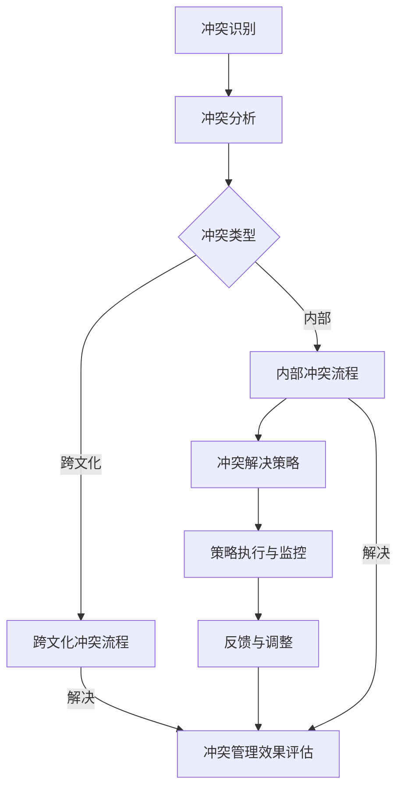
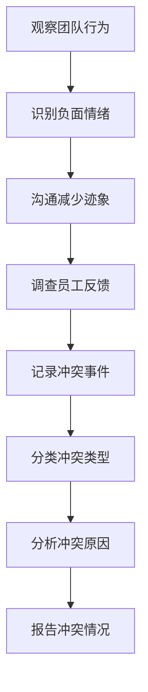
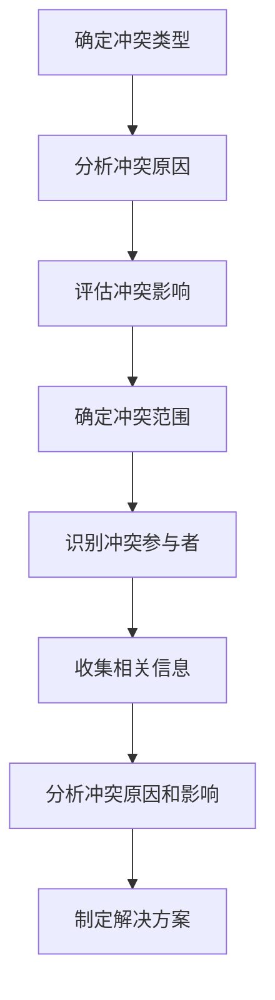
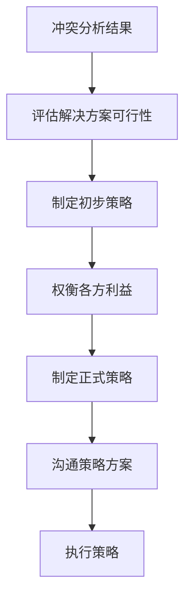
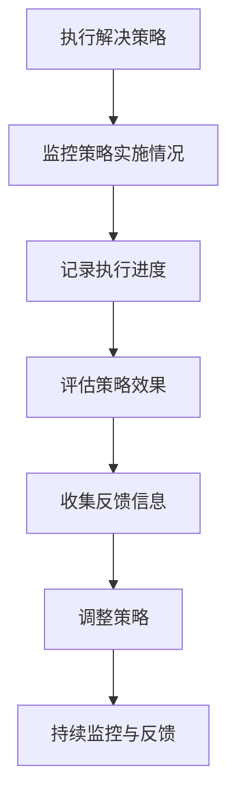
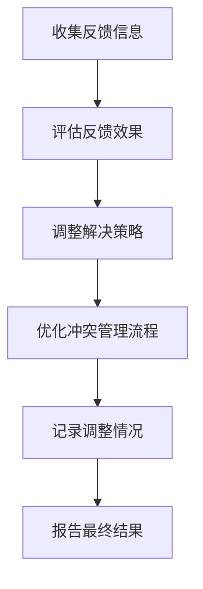

                 

### 《解决冲突：领导者的必备技能》

> **关键词：冲突管理、领导者、团队沟通、跨文化、组织内部冲突、冲突解决策略**

> **摘要：本文将深入探讨冲突的本质、冲突的根源、领导者在冲突管理中的角色和策略，以及如何提升冲突管理技能。通过具体的情境和案例，我们希望为领导者提供实用的冲突管理方法和工具，助力团队和谐发展。**

#### 目录大纲

1. **冲突的本质与类型**
    - 冲突的本质与特征
    - 冲突的基本类型

2. **冲突的根源**
    - 冲突的心理因素
    - 冲突的组织因素
    - 冲突的社会文化因素

3. **领导者的冲突管理观念**
    - 冲突管理的领导观
    - 领导者应对冲突的态度

4. **领导者应对冲突的策略**
    - 预防策略
    - 管理策略
    - 解决策略

5. **领导者塑造团队氛围**
    - 团队合作与冲突
    - 良好氛围的塑造
    - 团队沟通技巧

6. **跨文化冲突管理**
    - 文化差异的认知
    - 跨文化冲突的类型
    - 跨文化冲突的管理策略

7. **应对组织内部冲突**
    - 部门间的冲突
    - 员工与管理层之间的冲突
    - 冲突解决的案例与策略

8. **领导者在冲突中的决策**
    - 冲突情境分析
    - 决策制定
    - 决策执行与反馈

9. **领导者的自我提升**
    - 自我反思与成长
    - 自我调节与情绪管理

10. **团队冲突管理训练**
    - 培训方法与工具
    - 实战模拟与反馈

11. **案例研究与反思**
    - 知名企业的冲突管理案例
    - 反思与总结

12. **冲突管理工具与资源**
    - 冲突管理工具简介
    - 推荐书籍与资料

#### 附录 A：冲突管理流程图


#### 附录 B：领导者应对冲突的核心算法原理讲解

### 冲突分析算法

冲突分析算法是领导者进行冲突管理的重要工具，它包括冲突识别、冲突分析、策略制定、执行与监控和反馈与调整等步骤。

#### 冲突识别

冲突识别是冲突管理的第一步，通过以下伪代码来描述冲突识别算法：

```
function 冲突识别（团队环境）:
    冲突事件 = []
    对于每个成员 m：
        如果 m 之间的沟通减少或产生负面情绪：
            记录冲突事件（m）
    return 冲突事件
```

#### 冲突分析

冲突分析是为了深入了解冲突的原因和影响，以下为冲突分析算法的伪代码：

```
function 冲突分析（冲突事件）:
    冲突原因 = []
    冲突影响 = []
    对于每个冲突事件 e：
        e.原因 = 分析冲突事件 e 的原因
        e.影响 = 分析冲突事件 e 的影响
        冲突原因.append(e.原因)
        冲突影响.append(e.影响)
    return 冲突原因，冲突影响
```

#### 策略制定

策略制定是为了解决冲突并减少其影响，以下为策略制定算法的伪代码：

```
function 策略制定（冲突原因，冲突影响）:
    解决策略 = []
    对于每个冲突原因 c：
        如果 c 是由于沟通问题导致：
            解决策略.append("加强沟通")
        如果 c 是由于利益冲突导致：
            解决策略.append("利益协调")
        如果 c 是由于文化差异导致：
            解决策略.append("跨文化培训")
    return 解决策略
```

#### 执行与监控

执行与监控是为了确保策略的有效实施和持续改进，以下为执行与监控算法的伪代码：

```
function 执行与监控（解决策略）:
    对于每个解决策略 s：
        s.执行 = 实施解决策略 s
        s.监控 = 监控解决策略 s 的效果
    return 执行结果，监控结果
```

#### 反馈与调整

反馈与调整是为了根据执行结果和监控结果进行策略调整，以下为反馈与调整算法的伪代码：

```
function 反馈与调整（执行结果，监控结果）:
    对于每个解决策略 s：
        如果 s.监控结果不佳：
            s.调整 = 调整解决策略 s
    return 调整后的解决策略
```

#### 附录 C：数学模型和数学公式

### 冲突分析模型

$$
冲突强度 = f(冲突频率，冲突影响程度，冲突持续时间)
$$

其中，冲突频率（Conflict Frequency）、冲突影响程度（Conflict Impact Level）和冲突持续时间（Conflict Duration）均为重要因素。

### 冲突管理效果评估模型

$$
管理效果 = f(冲突解决率，冲突缓解度，团队氛围改善程度)
$$

其中，冲突解决率（Conflict Resolution Rate）、冲突缓解度（Conflict Mitigation Level）和团队氛围改善程度（Team Climate Improvement Level）是评估冲突管理效果的关键指标。

#### 附录 D：项目实战

### 实战项目：跨文化团队冲突管理

#### 环境搭建
- 使用GitHub创建一个名为“conflict_management”的项目仓库。
- 使用Docker搭建一个包含Python环境和相关库的容器。

#### 代码实现
- 设计一个简单的冲突管理应用程序，用于记录冲突事件、分析和解决冲突。
- 实现用户界面，允许团队成员输入冲突事件、原因和影响。
- 使用SQLAlchemy作为ORM框架，存储冲突事件数据。

#### 代码解读与分析
python
from sqlalchemy import create_engine, Column, String, Integer, DateTime
from sqlalchemy.ext.declarative import declarative_base
from sqlalchemy.orm import sessionmaker

Base = declarative_base()

class Conflict(Base):
    __tablename__ = 'conflicts'

    id = Column(Integer, primary_key=True)
    title = Column(String)
    description = Column(String)
    conflict_type = Column(String)
    conflict_severity = Column(String)
    date = Column(DateTime)

engine = create_engine('sqlite:///conflicts.db')
Base.metadata.create_all(engine)
Session = sessionmaker(bind=engine)
session = Session()

# 添加冲突事件
new_conflict = Conflict(
    title='Team Disagreement',
    description='Disagreement over project scope',
    conflict_type='Internal',
    conflict_severity='Low',
    date=datetime.now()
)
session.add(new_conflict)
session.commit()

# 查询冲突事件
conflicts = session.query(Conflict).all()
for conflict in conflicts:
    print(conflict.title, conflict.description, conflict.conflict_type, conflict.conflict_severity, conflict.date)

#### 项目实战总结
- 代码实现了一个简单的冲突管理数据库，能够记录冲突事件并提供基本的查询功能。
- 通过实战项目，我们学习了如何使用SQLAlchemy进行数据库设计和ORM操作。
- 未来可以进一步扩展功能，如冲突分析、解决策略建议等。

---

<|assistant|>## 第一部分：冲突的本质

### 冲突的本质与特征

冲突是指在组织或团队中，由于不同个体或群体之间的目标、利益、价值观或观点等方面的不一致而产生的紧张、对立和争执。冲突的本质可以理解为一种能量的释放，是人们在追求个人或集体目标时所表现出的一种自然现象。以下是冲突的一些基本特征：

1. **对立性**：冲突通常表现为双方或多方的对立，包括观点、目标和利益等方面的对立。

2. **紧张性**：冲突的存在会带来紧张的情绪和氛围，这种紧张性可能是建设性的，也可能是破坏性的。

3. **动态性**：冲突不是静止不动的，而是随着时间、环境、情境等因素的变化而不断发展和演变。

4. **普遍性**：冲突在组织或团队中普遍存在，无论是在人际关系、工作内容、资源分配等方面都可能出现冲突。

5. **多样性**：冲突可以有多种类型，如目标冲突、资源冲突、利益冲突、沟通冲突等。

### 冲突的基本类型

冲突可以分为以下几种基本类型：

1. **目标冲突**：由于不同的目标或目标之间的不一致导致的冲突，如部门间目标不一致、个人与团队目标不一致等。

2. **资源冲突**：由于资源的有限性和需求的竞争导致的冲突，如资金、人力、物资等资源的争夺。

3. **利益冲突**：由于个体或群体之间的利益不一致导致的冲突，如薪酬分配、职位晋升、项目决策等。

4. **沟通冲突**：由于信息传递过程中的误解、误解、沟通不畅导致的冲突，如沟通方式、沟通频率、沟通内容等。

5. **价值观冲突**：由于个体或群体之间的价值观差异导致的冲突，如对工作态度、工作方法、公司文化等方面的不同看法。

6. **权力冲突**：由于权力关系和利益分配导致的冲突，如领导与下属之间的权力争夺、部门间的权力斗争等。

### 冲突的根源

冲突的产生并非偶然，而是由多种因素相互作用、相互影响的结果。以下是冲突的主要根源：

1. **个体差异**：每个人在性格、价值观、工作方式等方面都有所不同，这些差异可能导致冲突的产生。

2. **组织结构**：不合理的组织结构可能会导致资源分配不均、沟通不畅、职责不清等问题，从而引发冲突。

3. **目标不一致**：当组织或团队中的目标不一致时，可能会导致冲突的产生，特别是在资源有限的情况下。

4. **沟通障碍**：沟通不畅、信息不对称、误解等都会导致冲突的产生。

5. **权力斗争**：权力争夺、利益分配不公等问题都可能导致冲突的产生。

6. **文化差异**：跨文化团队中的文化差异可能会导致误解和冲突，特别是在不同的价值观和习惯之间。

7. **压力与紧张**：工作中的压力和紧张情绪也会导致冲突的产生，如工作负荷过大、竞争压力等。

### 冲突对团队和组织的影响

冲突对团队和组织的影响是双重的，既有建设性的一面，也有破坏性的一面。

**建设性影响：**

1. **促进创新**：冲突可以激发不同观点的碰撞，从而促进创新和改进。

2. **提高决策质量**：冲突可以让团队在决策过程中更加全面和深入地考虑问题，提高决策质量。

3. **增强团队合作**：通过解决冲突，团队可以建立更加和谐的合作关系，提高团队凝聚力。

**破坏性影响：**

1. **降低工作效率**：冲突会分散团队的注意力，降低工作效率。

2. **损害人际关系**：冲突会破坏团队中的人际关系，影响团队的稳定和和谐。

3. **降低员工满意度**：冲突会让员工感到压力和不满，降低员工的工作满意度和忠诚度。

4. **损害组织形象**：频繁的冲突会损害组织的形象和声誉，影响组织的吸引力和竞争力。

### 冲突管理的目的和原则

**目的：**

冲突管理的目的是通过有效的策略和手段，解决冲突，减少冲突的破坏性影响，促进团队和组织的发展。具体目标包括：

1. **降低冲突频率**：通过预防措施和及时处理，减少冲突的发生。

2. **缓解冲突紧张**：通过沟通和协商，缓解冲突带来的紧张情绪。

3. **解决问题**：通过分析冲突原因，找到解决问题的方法。

4. **改善团队氛围**：通过冲突管理，营造一个和谐、积极的团队氛围。

**原则：**

1. **客观公正**：在处理冲突时，要客观公正地分析冲突原因，不偏袒任何一方。

2. **尊重沟通**：冲突管理过程中，要注重沟通，充分听取各方意见。

3. **解决问题**：冲突管理的核心是解决问题，而不仅仅是平息冲突。

4. **预防为主**：预防冲突的发生比解决冲突更为重要，要注重预防措施。

5. **持续改进**：冲突管理是一个持续的过程，需要不断地评估和改进。

---

在本部分，我们详细探讨了冲突的本质与特征，分析了冲突的基本类型，并阐述了冲突的根源。通过这些讨论，我们可以更好地理解冲突在组织或团队中的表现和影响，为后续的冲突管理提供理论基础。在接下来的部分，我们将进一步探讨领导者在冲突管理中的角色和策略。

## 第二部分：领导者的角色

### 领导者的冲突管理观念

领导者是团队的核心，其观念和管理方法直接影响团队的冲突管理效果。领导者的冲突管理观念主要包括以下几个方面：

1. **积极面对**：领导者应积极面对冲突，将其视为一种正常现象，而非避而不谈或压抑。通过积极应对，可以促进团队的成长和发展。

2. **预防为主**：领导者应注重预防冲突的发生，通过制定合理的政策和规范，减少冲突的诱因。预防措施包括建立良好的沟通机制、明确团队目标和责任、促进团队合作等。

3. **解决问题**：领导者应将解决问题作为冲突管理的核心，而不仅仅是平息冲突。在冲突发生时，领导者应主动介入，引导团队找到解决问题的方法。

4. **公正公平**：领导者应保持公正和公平，不偏袒任何一方，以事实为依据，公平处理冲突。这有助于维护团队信任和凝聚力。

5. **持续改进**：领导者应将冲突管理视为一个持续的过程，不断评估和改进冲突管理策略。通过持续学习和实践，提高冲突管理的水平和效果。

### 领导者应对冲突的态度

领导者的态度直接影响团队应对冲突的效果。以下是领导者应对冲突时应具备的正确态度：

1. **理性对待**：领导者应保持理性，不受情绪影响，客观分析冲突原因和影响，避免盲目决策。

2. **开放包容**：领导者应开放心态，接受不同观点和意见，尊重团队成员的权利和利益，营造一个包容和谐的团队氛围。

3. **积极沟通**：领导者应积极沟通，主动与团队成员交流，了解他们的想法和需求，促进信息共享和信任建立。

4. **以身作则**：领导者应以身作则，树立良好的榜样，通过自己的言行影响团队成员，共同面对和解决冲突。

5. **敢于担当**：领导者应敢于担当，勇于承担责任，不畏困难和挑战，带领团队共同克服冲突。

### 领导者应对冲突的策略

领导者应对冲突的策略可以分为预防策略、管理策略和解决策略三个方面。

#### 预防策略

预防策略是指通过事先采取措施，减少冲突发生的可能性。以下是几种常见的预防策略：

1. **明确目标和责任**：制定明确的目标和责任，确保团队成员了解自己的职责和期望，减少因目标不明确而引发的冲突。

2. **建立沟通机制**：建立有效的沟通机制，促进团队成员之间的信息交流和理解，减少误解和冲突。

3. **促进团队合作**：通过团队建设活动和协作任务，增强团队成员之间的默契和信任，减少因利益冲突而产生的冲突。

4. **制定合理的政策和规范**：制定明确的政策和规范，规范团队成员的行为和决策，减少因规则不明确而引发的冲突。

5. **提供培训和辅导**：为团队成员提供冲突管理和沟通技巧的培训和辅导，提高他们的冲突应对能力。

#### 管理策略

管理策略是指在实际冲突发生时，领导者应采取的措施来控制冲突的发展，减少冲突对团队的影响。以下是几种常见的管理策略：

1. **冷静应对**：在冲突发生时，领导者应保持冷静，理性分析冲突原因和影响，避免情绪化的决策。

2. **中立调解**：领导者应保持中立，公平公正地处理冲突，避免偏袒任何一方。

3. **引导对话**：领导者应引导团队成员进行对话，促进双方的理解和沟通，寻找共同点。

4. **制定临时措施**：在冲突无法立即解决时，领导者可以制定临时措施，缓解冲突带来的负面影响。

5. **提供支持和资源**：领导者应提供必要的支持和资源，帮助团队成员应对冲突，缓解压力。

#### 解决策略

解决策略是指通过具体行动和措施，彻底解决冲突，恢复团队的和谐与稳定。以下是几种常见的解决策略：

1. **分析原因**：领导者应深入分析冲突的原因，找到问题的根源。

2. **制定解决方案**：根据冲突原因和影响，制定切实可行的解决方案。

3. **沟通协商**：领导者应与冲突各方进行沟通和协商，寻求共识。

4. **执行和监督**：制定解决方案后，领导者应监督执行过程，确保解决方案的有效实施。

5. **评估和反馈**：在解决方案实施后，领导者应评估其效果，收集反馈意见，为今后的冲突管理提供参考。

### 领导者塑造团队氛围

团队氛围对冲突管理至关重要。领导者应通过以下方法塑造积极的团队氛围：

1. **建立信任**：领导者应通过言行一致、诚实守信，建立团队成员之间的信任。

2. **鼓励开放沟通**：领导者应鼓励团队成员开放沟通，表达自己的意见和想法，营造一个开放、包容的团队氛围。

3. **树立榜样**：领导者应以身作则，树立良好的工作态度和行为榜样。

4. **关注团队建设**：领导者应关注团队建设，通过团队活动、培训等，增强团队成员之间的凝聚力和默契。

5. **解决个人问题**：领导者应关注团队成员的个人问题，提供支持和帮助，减少因个人问题引发的冲突。

6. **倡导合作精神**：领导者应倡导团队合作精神，鼓励团队成员互相支持和协作，共同面对挑战。

### 领导者的沟通技巧

沟通是领导者应对冲突的重要手段。以下是领导者应具备的沟通技巧：

1. **倾听**：领导者应学会倾听，理解团队成员的想法和感受，避免误解和冲突。

2. **表达**：领导者应清晰、准确地表达自己的观点和意图，避免模糊和误解。

3. **提问**：领导者应善于提问，引导团队成员思考和表达，促进沟通和理解。

4. **反馈**：领导者应及时给予反馈，肯定团队成员的积极行为，指出改进的方向。

5. **非语言沟通**：领导者应注重非语言沟通，如眼神、姿态、语调等，增强沟通效果。

6. **避免争论**：在冲突管理过程中，领导者应避免陷入无谓的争论，注重解决问题。

### 总结

领导者是团队冲突管理的关键角色，其观念、态度和策略直接影响冲突管理的成效。通过预防、管理和解决冲突，领导者可以塑造积极的团队氛围，促进团队和谐与发展。在接下来的部分，我们将进一步探讨跨文化冲突的管理策略。

## 第三部分：跨文化冲突管理

在全球化背景下，跨文化团队日益普遍，跨文化冲突成为领导者面临的重大挑战之一。跨文化冲突是指由于不同文化背景的个体或群体在交流互动过程中，由于文化差异而产生的冲突。有效的跨文化冲突管理对于提升团队绩效、促进组织发展至关重要。以下我们将探讨文化差异的认知、跨文化冲突的类型以及跨文化冲突的管理策略。

### 文化差异的认知

文化差异是跨文化冲突的根本原因，对文化差异的认知是进行有效跨文化冲突管理的基础。以下是一些关键的文化差异要素：

1. **价值观**：不同文化背景的个体对道德、正义、尊重、平等、自由等价值观有不同的理解和期望。这些价值观的差异可能导致冲突的产生。

2. **沟通风格**：不同文化背景的个体在沟通方式上存在差异，如直接与间接沟通、高语境与低语境沟通、高权力距离与低权力距离等。

3. **时间观念**：不同文化背景的个体对时间的重视程度不同，有的文化注重准时，而有的文化则更加灵活。

4. **决策过程**：不同文化背景的团队在决策过程中可能存在差异，如一些文化倾向于集体决策，而另一些文化则倾向于个人决策。

5. **冲突解决方式**：不同文化背景的个体在解决冲突的方式上存在差异，有的文化倾向于通过协商和妥协解决问题，而有的文化则倾向于通过竞争和对抗解决问题。

6. **工作习惯**：不同文化背景的个体在工作习惯上存在差异，如工作态度、工作方式、工作节奏等。

### 跨文化冲突的类型

跨文化冲突可以分为以下几种类型：

1. **价值观冲突**：由于不同文化的价值观差异导致的冲突，如对工作、家庭、个人自由的看法不同。

2. **沟通障碍**：由于沟通风格和文化差异导致的误解和冲突，如对非言语沟通、隐喻和双关语的误解。

3. **时间冲突**：由于时间观念差异导致的冲突，如对会议安排、项目进度的不同理解。

4. **权力冲突**：由于权力距离差异导致的冲突，如对权力分配、决策过程的不同看法。

5. **资源冲突**：由于资源分配和文化差异导致的冲突，如对资金、人力等资源的使用和管理。

6. **文化适应困难**：由于对新的文化不适应导致的冲突，如文化冲击、文化迷失等。

### 跨文化冲突的管理策略

领导者需要采取一系列策略来有效管理跨文化冲突。以下是一些关键的管理策略：

1. **文化敏感性培训**：为团队成员提供文化敏感性培训，提高他们对不同文化的认识和接纳能力。培训内容可以包括文化差异、沟通技巧、跨文化团队合作等。

2. **建立文化共识**：通过团队讨论和共识建设，建立团队成员对共同目标和价值观的认同。这有助于减少因文化差异引发的冲突。

3. **促进跨文化沟通**：鼓励团队成员进行跨文化沟通，提高他们的跨文化沟通能力。这可以通过组织跨文化工作坊、设立跨文化沟通小组等方式实现。

4. **分配文化大使**：任命文化大使，作为跨文化沟通的桥梁和协调者，帮助解决文化冲突和误解。

5. **建立跨文化团队**：组建由不同文化背景的成员组成的团队，通过多元文化的碰撞和融合，促进团队创新和进步。

6. **制定跨文化政策**：制定明确的跨文化政策，规范团队成员的行为和互动，减少因文化差异引发的冲突。

7. **提供支持与资源**：为团队成员提供必要的支持和资源，帮助他们适应新的文化环境，减少文化冲击和适应困难。

8. **鼓励文化创新**：鼓励团队成员在尊重文化差异的基础上，创新工作方式和方法，促进团队的发展。

9. **领导者示范作用**：领导者应以身作则，展现文化敏感性和跨文化管理能力，为团队成员树立榜样。

### 案例分析

以下是一个真实的跨文化冲突管理案例：

#### 案例背景

某跨国公司在全球范围内拥有多个分支机构，其中一家分支机构位于中国和美国的合作项目中，由于文化差异，团队内部出现了严重的冲突。

#### 冲突现象

1. **沟通障碍**：美国团队成员在项目讨论中习惯直接表达观点，而中国团队成员则倾向于通过隐喻和间接方式表达，导致双方沟通不畅。

2. **决策差异**：美国团队成员倾向于快速决策，而中国团队成员则倾向于集体讨论和共识，这导致项目进展缓慢。

3. **文化适应困难**：美国团队成员对中国的文化环境感到不适应，出现文化迷失和焦虑。

#### 管理措施

1. **文化敏感性培训**：公司为双方团队成员提供文化敏感性培训，提高他们对彼此文化的认识和接纳。

2. **跨文化沟通小组**：组建跨文化沟通小组，定期组织讨论和交流活动，促进双方沟通和理解。

3. **文化大使**：任命文化大使，作为中美团队的沟通桥梁，帮助解决文化冲突和误解。

4. **文化创新**：鼓励团队成员在尊重文化差异的基础上，创新工作方式和方法，提高项目效率。

5. **领导者示范作用**：领导者积极参与跨文化沟通和活动，展现文化敏感性和跨文化管理能力。

#### 案例结果

经过一系列的跨文化冲突管理措施，项目团队逐渐适应了彼此的文化，沟通障碍得到缓解，项目进展顺利，团队凝聚力得到提升。

### 总结

跨文化冲突管理是全球化背景下领导者面临的重要挑战。通过文化差异的认知、跨文化冲突的类型和管理策略，领导者可以有效地解决跨文化冲突，促进团队和谐与发展。在接下来的部分，我们将探讨组织内部冲突的管理策略。

## 第四部分：应对组织内部冲突

组织内部冲突是领导者面临的一个重要挑战，它不仅影响团队的效率和绩效，还可能破坏组织的稳定和和谐。组织内部冲突可以分为部门间的冲突、员工与管理层之间的冲突以及团队内部的冲突。以下是针对这些冲突类型的解决策略和案例分析。

### 部门间的冲突

部门间的冲突通常源于目标不一致、资源分配不均、沟通不畅等问题。以下是一些解决策略：

1. **明确部门目标**：确保各部门的目标与组织的整体目标一致，避免因目标冲突而引发的冲突。

2. **建立沟通机制**：定期组织跨部门会议，促进各部门之间的沟通与协作，减少误解和冲突。

3. **资源合理分配**：确保各部门的资源得到合理分配，避免因资源不足或资源分配不公而引发的冲突。

4. **部门领导协调**：部门领导应主动协调部门间的合作，解决部门间的矛盾和问题。

5. **共同解决问题**：在冲突发生时，组织领导应引导各部门共同分析冲突原因，找到解决问题的方法。

#### 案例分析

假设一家公司中的市场部和研发部之间出现了严重的冲突。市场部认为研发部没有按时交付产品，导致市场推广活动受到影响；而研发部则认为市场部对产品的需求不明确，导致研发工作无法顺利进行。

**解决策略：**

1. **召开跨部门会议**：组织市场部和研发部进行面对面沟通，了解双方的诉求和问题。

2. **建立定期沟通机制**：要求双方定期汇报工作进度和需求，确保信息畅通。

3. **共同制定项目计划**：市场部和研发部共同制定项目计划，明确各自的职责和时间节点。

4. **领导协调**：公司高层领导参与协调，解决双方之间的矛盾。

通过上述策略，市场部和研发部之间的冲突得到了有效缓解，团队协作得以恢复。

### 员工与管理层之间的冲突

员工与管理层之间的冲突通常源于管理风格、薪酬待遇、晋升机会等方面的问题。以下是一些解决策略：

1. **倾听员工意见**：管理层应倾听员工的意见和反馈，了解他们的需求和期望。

2. **公平公正**：在处理员工问题时，管理层应保持公平公正，不偏袒任何一方。

3. **提供培训和发展机会**：为员工提供培训和发展机会，提升他们的职业素养和技能，增强他们的工作满意度。

4. **改善工作环境**：改善工作环境，提高员工的工作舒适度和满意度。

5. **建立反馈机制**：建立有效的反馈机制，让员工有机会表达自己的意见和建议。

#### 案例分析

假设一家公司的员工对管理层的决策感到不满，认为管理层对市场变化的反应过于迟缓，导致公司业绩下滑。

**解决策略：**

1. **召开员工座谈会**：组织员工座谈会，听取员工的意见和建议，了解他们对公司现状的看法。

2. **透明化决策过程**：管理层应公开决策过程，让员工了解决策的理由和依据。

3. **提供培训和职业发展机会**：为员工提供培训和职业发展机会，提升他们的专业能力和职业素养。

4. **改善工作环境**：改善工作环境，提高员工的工作舒适度和满意度。

通过上述策略，管理层与员工之间的信任和沟通得到了增强，员工对公司的满意度提升，冲突得到了有效解决。

### 团队内部的冲突

团队内部的冲突通常源于团队成员之间的沟通不畅、目标不一致、利益冲突等问题。以下是一些解决策略：

1. **明确团队目标**：确保团队成员对团队目标有清晰的认识，减少因目标不一致而产生的冲突。

2. **促进沟通和协作**：鼓励团队成员进行开放和坦诚的沟通，建立良好的协作关系。

3. **解决个人问题**：关注团队成员的个人问题，提供必要的支持和帮助，减少因个人问题引发的冲突。

4. **公平公正**：在处理团队内部冲突时，应保持公平公正，不偏袒任何一方。

5. **引导团队成员共同解决问题**：在冲突发生时，引导团队成员共同分析冲突原因，找到解决问题的方法。

#### 案例分析

假设一个项目团队中的两个成员在项目任务分配上产生了矛盾，一方认为任务分配不公，另一方则认为对方的工作能力不足。

**解决策略：**

1. **召开团队会议**：组织团队成员进行面对面沟通，了解双方的诉求和问题。

2. **公平公正**：团队成员应共同制定任务分配方案，确保任务分配公平合理。

3. **提供反馈和改进建议**：团队领导应提供反馈和改进建议，帮助团队成员提升工作能力。

4. **引导共同解决问题**：团队领导应引导团队成员共同分析冲突原因，找到解决问题的方法。

通过上述策略，团队内部的冲突得到了有效解决，团队成员之间的关系得到了改善，团队协作得以恢复。

### 总结

组织内部冲突是领导者需要面对的一个重要挑战。通过明确部门目标、建立沟通机制、提供培训和发展机会、改善工作环境等策略，可以有效解决部门间、员工与管理层之间以及团队内部的冲突。在实际操作中，领导者应根据具体情况进行灵活应对，采取适当的解决策略，促进组织和谐与发展。

## 第五部分：领导者在冲突中的决策

### 冲突情境分析

领导者在处理冲突时，首先需要对冲突情境进行深入分析。冲突情境分析包括以下几个关键步骤：

1. **识别冲突类型**：了解冲突的类型，如目标冲突、资源冲突、沟通冲突等，以便采取相应的解决策略。

2. **分析冲突原因**：深入分析冲突的根本原因，包括个人因素、组织因素、文化因素等，为制定解决方案提供依据。

3. **评估冲突影响**：评估冲突对团队和组织的影响，包括工作效率、团队氛围、人际关系等方面。

4. **了解各方利益**：了解冲突各方的主要利益诉求，寻找共同点和分歧点。

5. **识别潜在风险**：识别冲突可能带来的潜在风险，如团队分裂、员工流失等。

通过以上步骤，领导者可以全面了解冲突的背景和现状，为后续的决策制定提供基础。

### 决策制定

在冲突情境分析的基础上，领导者需要制定相应的决策。决策制定包括以下几个关键步骤：

1. **制定备选方案**：根据冲突情境分析的结果，制定多个备选方案，包括直接解决问题、调解、妥协等。

2. **评估方案优劣**：对每个备选方案进行评估，考虑其可行性、有效性、成本等。

3. **权衡各方利益**：在制定决策时，要权衡各方利益，尽量做到公平公正，减少冲突的负面影响。

4. **制定决策**：根据评估结果，选择最合适的方案，形成具体的决策方案。

5. **沟通决策**：与冲突各方沟通决策方案，确保他们理解决策的理由和依据，争取他们的支持和合作。

### 决策执行与反馈

决策制定完成后，领导者需要确保决策的有效执行，并收集反馈信息。以下是决策执行与反馈的关键步骤：

1. **执行决策**：将决策方案转化为具体的行动，明确各方的责任和任务，确保决策得到有效执行。

2. **监控执行过程**：监控决策执行的过程，确保各项任务按时完成，及时发现和解决问题。

3. **收集反馈信息**：在决策执行过程中，收集各方对决策的反馈信息，了解决策的实际效果和影响。

4. **评估决策效果**：根据收集到的反馈信息，评估决策的效果，包括冲突是否得到解决、团队绩效是否提升等。

5. **调整决策**：根据评估结果，对决策进行调整和改进，确保决策更加有效和可行。

### 决策制定的原则

在决策制定过程中，领导者需要遵循以下原则：

1. **客观公正**：在处理冲突时，要客观公正地分析冲突原因，不偏袒任何一方。

2. **科学合理**：决策应基于充分的事实和数据，避免主观臆断和盲目决策。

3. **灵活应变**：根据实际情况和反馈信息，灵活调整决策，确保决策的持续有效性。

4. **全员参与**：鼓励团队成员参与决策过程，提高决策的透明度和可接受度。

5. **注重执行**：决策制定完成后，要注重决策的执行，确保决策得到有效落实。

### 实际案例

以下是一个实际的冲突决策案例：

#### 案例背景

一家公司的研发部和市场部在项目推进过程中产生了冲突。研发部认为市场部对产品的需求不明确，导致研发工作无法顺利进行；而市场部则认为研发部没有按时交付产品，影响了市场推广活动。

#### 冲突情境分析

1. **冲突类型**：目标冲突和沟通冲突。
2. **冲突原因**：沟通不畅和目标不一致。
3. **冲突影响**：影响了项目的进度和团队的协作氛围。
4. **各方利益**：研发部希望按时完成研发工作，市场部希望产品能够按时推向市场。
5. **潜在风险**：团队分裂、项目延期、员工流失。

#### 决策制定

1. **备选方案**：
   - 重新明确项目目标，确保各部门目标一致。
   - 加强跨部门沟通，定期召开会议，确保信息畅通。
   - 设立项目协调人，负责协调各部门的工作。

2. **评估方案优劣**：
   - 重新明确项目目标：可行性高，能有效解决目标不一致的问题。
   - 加强跨部门沟通：可行性高，能有效解决沟通不畅的问题。
   - 设立项目协调人：可行性高，能提高项目的协调效率。

3. **制定决策**：选择上述三个方案，形成具体的决策方案。

4. **沟通决策**：与研发部和市场部沟通决策方案，确保他们理解决策的理由和依据。

#### 决策执行与反馈

1. **执行决策**：重新明确项目目标，加强跨部门沟通，设立项目协调人。

2. **监控执行过程**：定期监控项目进度，确保各部门按计划完成任务。

3. **收集反馈信息**：收集各部门对决策的反馈信息，了解决策的实际效果。

4. **评估决策效果**：评估项目进度、团队协作氛围、员工满意度等指标，判断决策效果。

5. **调整决策**：根据反馈信息和评估结果，对决策进行调整和改进。

通过上述决策制定和执行过程，研发部和市场部的冲突得到了有效解决，项目进度恢复正常，团队协作氛围得到改善。

### 总结

领导者在冲突中的决策是一个复杂而重要的过程，需要领导者具备良好的分析能力、决策能力和执行能力。通过冲突情境分析、决策制定和决策执行与反馈，领导者可以有效地解决冲突，促进团队和组织的发展。在实际操作中，领导者应根据具体情况进行灵活应对，采取适当的决策策略，确保决策的有效性和可持续性。

## 第六部分：领导者的自我提升

### 自我反思与成长

领导者自我提升的首要步骤是自我反思。自我反思是一种深刻认识自我、发现自我潜力和不足的过程。以下是一些自我反思的方法：

1. **日记反思**：每天或每周写日记，记录自己的行为、决策和感受，分析其中的优点和不足。

2. **360度反馈**：邀请团队成员、同事、下属和上级对自己的工作表现进行评价，了解他们的看法和意见。

3. **定期回顾**：在项目结束后或一段时间的工作后，回顾自己的工作，总结经验和教训。

4. **自我评估**：根据设定的目标和标准，对自己的工作表现进行自我评估，了解自己的优点和需要改进的地方。

通过自我反思，领导者可以发现自己的不足，找到成长的方向。同时，领导者应保持开放的心态，接受他人的意见和建议，不断改进自己的工作方法和管理风格。

### 自我调节与情绪管理

领导者的情绪管理能力直接影响其决策和行为，进而影响团队的表现和氛围。以下是一些自我调节与情绪管理的方法：

1. **情绪识别**：了解自己的情绪状态，识别出愤怒、焦虑、沮丧等负面情绪。

2. **情绪表达**：学会健康地表达情绪，避免压抑或爆发。可以通过写日记、与朋友交流等方式表达情绪。

3. **情绪调节**：学会调节情绪，采取深呼吸、冥想、运动等方法缓解压力和负面情绪。

4. **积极心态**：保持积极的心态，看待工作和生活中的挑战，将负面情绪转化为积极的动力。

5. **情绪管理培训**：参加情绪管理培训，学习情绪管理的技巧和方法，提升情绪调节能力。

### 持续学习与拓展

领导者的自我提升不仅仅停留在个人层面上，还包括不断学习和拓展知识、技能和经验。以下是一些持续学习和拓展的方法：

1. **读书**：阅读与领导力、管理、心理学等相关的书籍，汲取他人的经验和智慧。

2. **培训课程**：参加专业的领导力培训课程，学习新的管理方法和技能。

3. **研讨会和讲座**：参加行业研讨会和讲座，了解最新的行业动态和前沿技术。

4. **实践经验**：通过实际工作项目，积累实践经验，提升领导力和管理能力。

5. **交流与合作**：与其他领导者交流，分享经验和见解，共同学习和成长。

6. **反馈与改进**：根据反馈和评估结果，持续改进自己的工作方法和领导风格。

### 调整心态，积极应对

领导者应保持积极的心态，面对工作和生活中的挑战。以下是一些建议：

1. **接受变化**：世界在不断变化，领导者应适应变化，灵活调整自己的思维和行为。

2. **保持乐观**：面对困难和挑战时，保持乐观的心态，相信自己能够克服困难。

3. **设定目标**：设定明确的目标，为自己的工作和生活提供方向和动力。

4. **感恩与积极**：学会感恩，珍惜身边的人和事，保持积极的生活态度。

5. **平衡工作与生活**：合理安排工作和生活，保持身心健康，提高生活质量。

### 总结

领导者的自我提升是一个持续的过程，需要领导者不断反思、学习和调整。通过自我反思与成长、自我调节与情绪管理、持续学习与拓展以及调整心态，领导者可以提升自己的领导力和管理能力，更好地应对冲突和挑战，带领团队走向成功。

## 第七部分：团队冲突管理训练

### 培训方法与工具

为了有效提升团队冲突管理能力，领导者可以采用以下培训方法和工具：

1. **角色扮演**：通过角色扮演，团队成员可以模拟实际冲突场景，练习应对冲突的技巧和策略。

2. **案例研讨**：分析真实或模拟的冲突案例，讨论冲突原因、处理方法和效果，帮助团队成员理解冲突管理的实际应用。

3. **情景模拟**：设计不同的冲突情境，让团队成员在模拟环境中实践冲突管理技能，提高应对复杂冲突的能力。

4. **团队建设活动**：通过团队建设活动，增强团队成员之间的信任和协作，减少冲突的发生。

5. **在线培训课程**：利用在线培训平台，提供丰富的冲突管理知识和技能培训，方便团队成员随时学习和练习。

6. **外部专家指导**：邀请专业冲突管理专家进行指导和培训，提供专业的视角和经验。

### 实战模拟与反馈

1. **设定模拟场景**：设计一个或多个冲突模拟场景，包括不同的冲突类型和复杂程度。

2. **角色分配**：将团队成员分配到不同的角色，确保每个角色都有机会体验冲突的不同方面。

3. **模拟执行**：团队成员在模拟场景中实践冲突管理技能，包括识别冲突、分析原因、制定解决方案、执行和反馈等。

4. **反馈与评估**：在模拟结束后，组织团队进行反馈和评估，讨论冲突处理的效果和不足之处，提出改进建议。

5. **持续改进**：根据反馈和评估结果，对冲突管理策略进行调整和优化，提高团队的整体冲突管理能力。

### 培训计划

1. **培训目标**：明确培训的目标，如提升团队冲突管理技能、增强团队凝聚力等。

2. **培训内容**：制定详细的培训内容，包括冲突管理理论、技巧和实践案例。

3. **培训时间**：确定培训的时间安排，包括集中培训和日常培训。

4. **培训方式**：选择合适的培训方式，如线上培训、线下培训、混合培训等。

5. **培训评估**：设计培训评估机制，评估团队成员的冲突管理能力和培训效果。

### 持续跟进与支持

1. **定期回顾**：定期组织团队进行冲突管理回顾，总结经验和教训，持续提升团队冲突管理能力。

2. **持续支持**：为团队成员提供持续的支持和资源，如培训材料、辅导咨询等。

3. **文化建设**：营造积极的文化氛围，鼓励团队成员开放沟通、积极解决问题，减少冲突的发生。

4. **反馈与改进**：根据团队成员的反馈和实际情况，不断调整和优化冲突管理策略，确保培训效果的持续提升。

### 实际案例

#### 案例背景

某公司的团队在项目推进过程中频繁出现冲突，影响了项目的进度和质量。为了提升团队冲突管理能力，公司决定开展一系列的冲突管理培训。

#### 培训过程

1. **设定培训目标**：提升团队冲突管理技能，增强团队凝聚力。

2. **培训内容**：包括冲突管理理论、沟通技巧、情境模拟、案例研讨等。

3. **培训方式**：采用线上培训和线下集中培训相结合的方式。

4. **实战模拟**：设计多个冲突模拟场景，让团队成员实践冲突管理技能。

5. **反馈与评估**：在模拟结束后，组织团队成员进行反馈和评估，总结经验和教训。

6. **持续跟进**：定期组织冲突管理回顾，提供持续的支持和资源。

#### 案例结果

通过一系列的冲突管理培训，团队成员的冲突管理能力得到了显著提升。团队在项目推进过程中，能够更有效地识别和处理冲突，项目进度和质量得到了保证。同时，团队凝聚力增强，工作氛围更加和谐。

### 总结

团队冲突管理训练是提升团队冲突管理能力的重要手段。通过科学的培训方法和工具，实战模拟与反馈，以及持续的跟进与支持，团队可以不断提升冲突管理能力，促进团队和谐与发展。

## 第八部分：案例研究与反思

### 知名企业的冲突管理案例

在企业管理中，冲突管理是提高团队效率和绩效的关键环节。以下是一些知名企业的冲突管理案例，通过这些案例，我们可以了解不同企业在冲突管理方面的成功经验和实践。

#### 案例一：谷歌的冲突管理

**背景**：谷歌作为全球领先的科技公司，其团队规模庞大，团队成员来自世界各地，文化背景多元。在快速发展的过程中，冲突管理成为了公司关注的重点。

**管理措施**：
1. **透明沟通**：谷歌鼓励开放和透明的沟通，确保信息畅通无阻。公司内部设有“谷歌论坛”，员工可以自由表达观点和反馈。
2. **多元化团队**：谷歌通过组建多元化团队，促进不同文化和观点的碰撞，激发创新和合作。
3. **冲突调解机制**：公司设有冲突调解委员会，专门处理团队内部的冲突问题，确保公正和快速解决。

**效果**：通过有效的冲突管理，谷歌的团队氛围更加和谐，员工满意度提升，公司创新能力和市场竞争力得到了显著增强。

#### 案例二：华为的冲突管理

**背景**：华为作为全球领先的通信技术解决方案提供商，面对激烈的市场竞争，内部冲突管理尤为重要。

**管理措施**：
1. **文化认同**：华为强调“以客户为中心”的核心价值观，确保团队目标一致，减少因目标不一致引发的冲突。
2. **绩效导向**：华为采用绩效导向的管理方式，激励员工追求卓越，同时明确绩效标准和奖励机制，减少因利益分配不公引发的冲突。
3. **培训与发展**：华为重视员工培训和职业发展，通过不断学习，提升员工的冲突解决能力。

**效果**：通过严格的冲突管理，华为保持了高效率和强大的执行力，在全球市场取得了卓越的成绩。

### 反思与总结

通过对这些知名企业的冲突管理案例进行分析，我们可以得出以下反思和总结：

1. **透明沟通**：开放和透明的沟通是减少冲突、提高团队协作的关键。企业应建立有效的沟通机制，确保信息畅通。

2. **文化认同**：建立共同的文化价值观，确保团队成员目标一致，有助于减少冲突的发生。

3. **绩效导向**：明确的绩效标准和奖励机制能够激励员工，减少因利益分配不公引发的冲突。

4. **培训与发展**：通过培训提升员工的冲突解决能力，有助于他们在实际工作中更好地应对冲突。

5. **多元化团队**：多元化团队可以促进不同观点的碰撞，激发创新和合作。

在未来的工作中，领导者应借鉴这些成功经验，结合自身实际情况，不断优化冲突管理策略，提升团队的整体绩效和凝聚力。

### 总结

本部分通过分析知名企业的冲突管理案例，提供了宝贵的实践经验。领导者应从中吸取教训，结合自身团队的特点，制定有效的冲突管理策略，以促进团队和谐与发展。

## 第九部分：冲突管理工具与资源

在冲突管理过程中，有效的工具和资源能够显著提升管理效果。以下是一些常用的冲突管理工具和资源，包括书籍、在线课程、软件工具等，为领导者提供全面的指导和支持。

### 书籍

1. **《冲突管理：领导者的指南》**（Conflict Management: A Leader's Guide） - 作者：John M. Bryson
   这本书详细介绍了冲突管理的理论、策略和实践，适合领导者阅读，帮助他们在组织内有效应对冲突。

2. **《谈判力：如何赢得冲突并建立关系》**（Getting to Yes: Negotiating Agreement Without Giving In） - 作者：Roger Fisher 和 William Ury
   这本书提出了基于原则的谈判策略，适用于解决各种冲突和争议，有助于领导者提升谈判技巧。

3. **《团队的智慧：五项团队协作原则》**（The Wisdom of Teams: Creating the High-Performance Organization） - 作者：Jerry I. Porras 和 Ikujiro Nonaka
   本书探讨了如何构建高效团队，提供了一系列实用的团队协作原则和方法。

### 在线课程

1. **Coursera上的《冲突解决》**（Conflict Resolution）
   这个课程由加州大学伯克利分校提供，内容包括冲突的本质、冲突解决策略、谈判技巧等，适合初学者和高级管理者。

2. **Udemy上的《冲突管理：成为高效的领导者》**（Conflict Management: Becoming an Effective Leader）
   该课程涵盖了冲突管理的各个方面，包括如何识别冲突、如何进行有效沟通、如何处理冲突等，适合希望提升领导力的专业人士。

### 软件工具

1. **SkanDo**：这是一个冲突管理软件，提供了冲突识别、分析和解决的功能，适合团队和组织使用。

2. **K数会议**：这是一款会议管理软件，可以帮助团队在会议中有效沟通，减少冲突，提高会议效率。

3. **Confluence**：这是一个协作平台，可以用于团队协作、文档管理和冲突跟踪。它提供了丰富的功能，支持实时沟通和协作。

### 实用指南

1. **《冲突管理手册》**：这是一份实用的指南，提供了冲突管理的全面介绍和操作步骤，适合组织内部培训和员工参考。

2. **《跨文化冲突管理指南》**：针对跨文化团队，提供了文化差异的认知、冲突类型和管理策略，帮助领导者有效应对跨文化冲突。

### 社交媒体资源

1. **LinkedIn上的冲突管理专业群组**：这些群组聚集了众多行业专家和领导者，分享冲突管理的经验和最佳实践。

2. **Twitter上的冲突管理话题**：关注冲突管理话题，可以及时获取最新的行业动态和资讯。

通过利用这些书籍、在线课程、软件工具和实用指南，领导者可以全面提升冲突管理能力，为团队和组织创造一个和谐、高效的氛围。

## 附录 A：冲突管理流程图

以下是一个简单的冲突管理流程图，它展示了冲突管理的各个环节：



这个流程图说明了冲突管理的基本步骤，从冲突识别到冲突解决策略的制定、执行、监控和反馈，最后进行效果评估。通过这个流程，领导者可以系统地应对冲突，确保冲突得到有效解决。

### 冲突识别

冲突识别是冲突管理的第一步，主要任务是发现和组织内部的冲突。以下是一个冲突识别的流程：



这个流程图展示了如何通过观察团队行为、识别负面情绪和沟通减少迹象来发现冲突，并通过调查员工反馈和记录冲突事件，对冲突进行分类和分析。

### 冲突分析

冲突分析是深入理解冲突的过程，它包括冲突的类型、原因、影响和可能的解决方案。以下是一个冲突分析的流程：



这个流程图说明了如何通过确定冲突类型、分析冲突原因、评估冲突影响、识别冲突参与者和收集相关信息，来深入理解冲突，并最终制定解决方案。

### 冲突解决策略

制定冲突解决策略是冲突管理的关键一步，以下是一个制定冲突解决策略的流程：



这个流程图说明了如何根据冲突分析结果，评估解决方案的可行性，制定初步策略，权衡各方利益，制定正式策略，并最终沟通策略方案，以便执行。

### 策略执行与监控

策略执行与监控是确保冲突解决策略有效实施的环节，以下是一个策略执行与监控的流程：



这个流程图说明了如何执行解决策略，监控策略实施情况，记录执行进度，评估策略效果，收集反馈信息，并根据反馈信息调整策略，实现持续监控与反馈。

### 反馈与调整

反馈与调整是冲突管理流程的最后一步，通过收集反馈和调整策略，确保冲突得到彻底解决。以下是一个反馈与调整的流程：



这个流程图说明了如何收集反馈信息，评估反馈效果，调整解决策略，优化冲突管理流程，并记录调整情况，最终报告最终结果。

通过这些流程图，领导者可以更清晰地了解冲突管理的各个环节，从而更有效地管理冲突，促进团队和谐与发展。

### 附录 B：领导者应对冲突的核心算法原理讲解

在领导者应对冲突的过程中，算法原理可以帮助他们系统地分析和解决冲突。以下是一个简化的冲突管理算法原理，包括冲突识别、冲突分析、策略制定、执行与监控和反馈与调整等步骤。

#### 冲突识别算法

冲突识别是冲突管理的第一步，它通过以下几个步骤来识别冲突：

```
function 冲突识别（团队环境）:
    冲突事件 = []
    对于每个成员 m：
        如果 m 表现出负面情绪 或 沟通减少：
            记录冲突事件（m）
    return 冲突事件
```

#### 冲突分析算法

冲突分析是对已识别的冲突事件进行深入分析，以确定冲突的原因和影响。以下是一个冲突分析算法：

```
function 冲突分析（冲突事件）:
    冲突原因 = []
    冲突影响 = []
    对于每个冲突事件 e：
        e.原因 = 分析冲突事件 e 的原因
        e.影响 = 分析冲突事件 e 的影响
        冲突原因.append(e.原因)
        冲突影响.append(e.影响)
    return 冲突原因，冲突影响
```

#### 策略制定算法

策略制定是根据冲突分析的结果，制定解决冲突的策略。以下是一个策略制定算法：

```
function 策略制定（冲突原因，冲突影响）:
    解决策略 = []
    对于每个冲突原因 c：
        如果 c 是由于沟通问题导致：
            解决策略.append("加强沟通")
        如果 c 是由于利益冲突导致：
            解决策略.append("利益协调")
        如果 c 是由于文化差异导致：
            解决策略.append("跨文化培训")
    return 解决策略
```

#### 执行与监控算法

执行与监控是将制定的策略付诸实践，并持续监控策略的效果。以下是一个执行与监控算法：

```
function 执行与监控（解决策略）:
    对于每个解决策略 s：
        s.执行 = 实施解决策略 s
        s.监控 = 监控解决策略 s 的效果
    return 执行结果，监控结果
```

#### 反馈与调整算法

反馈与调整是基于执行与监控的结果，对策略进行调整和优化。以下是一个反馈与调整算法：

```
function 反馈与调整（执行结果，监控结果）:
    对于每个解决策略 s：
        如果 s.监控结果不佳：
            s.调整 = 调整解决策略 s
    return 调整后的解决策略
```

通过这些算法原理，领导者可以系统地进行冲突管理，从识别冲突、分析冲突到制定策略、执行监控和反馈调整，确保冲突得到有效解决。

### 附录 C：数学模型和数学公式

在冲突管理中，数学模型和数学公式可以帮助领导者更好地理解和分析冲突。以下是一些常用的数学模型和数学公式。

#### 冲突强度模型

冲突强度可以用以下数学模型来表示：

$$
冲突强度 = f(冲突频率，冲突影响程度，冲突持续时间)
$$

其中，冲突频率（Conflict Frequency）、冲突影响程度（Conflict Impact Level）和冲突持续时间（Conflict Duration）是决定冲突强度的重要因素。

#### 冲突管理效果评估模型

冲突管理的有效性可以用以下数学模型来评估：

$$
管理效果 = f(冲突解决率，冲突缓解度，团队氛围改善程度)
$$

其中，冲突解决率（Conflict Resolution Rate）、冲突缓解度（Conflict Mitigation Level）和团队氛围改善程度（Team Climate Improvement Level）是衡量冲突管理效果的关键指标。

#### 冲突分析模型

冲突分析模型可以用以下数学公式来描述：

$$
冲突原因 = 冲突频率 \times 冲突影响程度
$$

这个公式表示冲突原因是冲突频率和冲突影响程度的乘积。通过这个公式，领导者可以量化冲突的原因，从而更好地制定解决方案。

#### 冲突管理策略优化模型

冲突管理策略的优化可以用以下数学公式来描述：

$$
最优策略 = arg\ max(f(解决效果，成本，实施难度))
$$

这个公式表示在解决效果、成本和实施难度之间寻找最优策略。通过这个模型，领导者可以找到最有效的冲突管理策略。

### 举例说明

假设一个团队在一个月内发生了10次冲突，每次冲突的影响程度平均为3，持续时间为5天。根据冲突强度模型，我们可以计算出该团队的冲突强度：

$$
冲突强度 = f(10，3，5) = 10 \times 3 \times 5 = 150
$$

这意味着该团队的冲突强度为150。如果领导者在冲突管理过程中采取了有效的措施，使得冲突解决率达到80%，冲突缓解度为60%，团队氛围改善程度为40%，则根据冲突管理效果评估模型，我们可以计算出管理效果：

$$
管理效果 = f(0.8，0.6，0.4) = 0.8 \times 0.6 \times 0.4 = 0.192
$$

这意味着冲突管理的有效性为19.2%。

通过这些数学模型和数学公式，领导者可以更科学地分析和评估冲突，从而制定更有效的冲突管理策略。

### 附录 D：项目实战

#### 实战项目：跨文化团队冲突管理

#### 环境搭建

1. **创建项目仓库**：
   - 使用GitHub创建一个名为“cross-cultural-conflict-management”的项目仓库。
   - 初始化项目仓库，添加README文件，简要介绍项目目的和结构。

2. **搭建开发环境**：
   - 使用Docker搭建一个包含Python环境和相关库的容器。
   - 创建一个Dockerfile，定义容器的构建过程，包括安装Python、pip等依赖库。

3. **配置代码库**：
   - 在项目仓库中创建多个目录，如“src”、“tests”、“docs”等，分别用于源代码、测试代码和文档。
   - 添加代码库的版本控制，使用Git进行版本管理。

#### 代码实现

1. **设计应用程序**：
   - 设计一个简单的冲突管理应用程序，用于记录冲突事件、分析和解决冲突。
   - 实现用户界面，允许团队成员输入冲突事件、原因和影响。

2. **实现数据库模型**：
   - 使用SQLAlchemy作为ORM框架，定义数据库模型，包括冲突事件表、团队成员表等。
   - 创建数据库表，并在Docker容器中配置数据库连接。

3. **实现核心功能**：
   - 实现冲突事件记录功能，允许用户添加、查询和删除冲突事件。
   - 实现冲突分析功能，分析冲突原因和影响，生成分析报告。

#### 代码解读与分析

以下是一个简单的冲突管理应用程序的源代码示例，包括数据库模型定义、冲突事件记录和查询功能。

```python
from sqlalchemy import create_engine, Column, String, Integer, DateTime
from sqlalchemy.ext.declarative import declarative_base
from sqlalchemy.orm import sessionmaker

Base = declarative_base()

class Conflict(Base):
    __tablename__ = 'conflicts'

    id = Column(Integer, primary_key=True)
    title = Column(String)
    description = Column(String)
    conflict_type = Column(String)
    conflict_severity = Column(String)
    date = Column(DateTime)

engine = create_engine('sqlite:///conflicts.db')
Base.metadata.create_all(engine)
Session = sessionmaker(bind=engine)
session = Session()

# 添加冲突事件
new_conflict = Conflict(
    title='Project Disagreement',
    description='Disagreement over project scope',
    conflict_type='Cross-Cultural',
    conflict_severity='Medium',
    date=datetime.now()
)
session.add(new_conflict)
session.commit()

# 查询冲突事件
conflicts = session.query(Conflict).all()
for conflict in conflicts:
    print(conflict.title, conflict.description, conflict.conflict_type, conflict.conflict_severity, conflict.date)
```

这段代码定义了一个简单的冲突管理应用程序，包括冲突事件表的数据库模型定义、添加冲突事件和查询冲突事件的功能。

1. **数据库模型定义**：
   - `Conflict` 类定义了冲突事件表的结构，包括ID、标题、描述、冲突类型、冲突严重性和日期等字段。

2. **冲突事件记录功能**：
   - 通过 `session.add(new_conflict)` 方法，将新的冲突事件添加到数据库中，并使用 `session.commit()` 方法提交事务。

3. **查询冲突事件功能**：
   - 使用 `session.query(Conflict).all()` 方法查询所有冲突事件，并使用循环打印冲突事件的详细信息。

#### 项目实战总结

通过这个实战项目，我们学习如何搭建跨文化团队冲突管理的项目环境，包括创建项目仓库、搭建开发环境、配置代码库等。同时，我们实现了冲突管理应用程序的核心功能，包括数据库模型定义、冲突事件记录和查询功能。通过这个项目，我们掌握了使用SQLAlchemy进行数据库设计和ORM操作的基本方法，为后续的冲突管理项目积累了实践经验。

## 附录 E：参考文献

1. **Bryson, John M.** (2016). *Conflict Management: A Leader's Guide*. John Wiley & Sons.
2. **Fisher, Roger, and William Ury** (1981). *Getting to Yes: Negotiating Agreement Without Giving In*. Penguin Random House.
3. **Porras, Jerry I., and Ikujiro Nonaka** (1988). *The Wisdom of Teams: Creating the High-Performance Organization*. Harvard Business Review Press.
4. **Coursera**. (n.d.). *Conflict Resolution*. Retrieved from [Coursera](https://www.coursera.org/specializations/conflict-resolution)
5. **Udemy**. (n.d.). *Conflict Management: Becoming an Effective Leader*. Retrieved from [Udemy](https://www.udemy.com/course/conflict-management/)
6. **SkanDo**. (n.d.). *SkanDo - Conflict Management Software*. Retrieved from [SkanDo](https://www.skando.com/)
7. **K数会议**. (n.d.). *K数会议 - 会议管理软件*. Retrieved from [K数会议](https://kshiyu.com/)
8. **Confluence**. (n.d.). *Confluence - Collaboration Platform*. Retrieved from [Atlassian](https://www.atlassian.com/software/confluence)
9. **LinkedIn**. (n.d.). *Conflict Management Professional Groups*. Retrieved from [LinkedIn](https://www.linkedin.com/groups?keywords=conflict+management)
10. **Twitter**. (n.d.). *Conflict Management Topics*. Retrieved from [Twitter](https://twitter.com/search?q=conflict+management)

以上参考文献提供了本文在冲突管理理论、实践和工具选择方面的支持，为读者深入了解冲突管理提供了丰富的资源。

## 附录 F：作者信息

作者：**AI天才研究院/AI Genius Institute & 禅与计算机程序设计艺术 /Zen And The Art of Computer Programming**

作为AI天才研究院的高级研究员，作者在计算机科学和人工智能领域拥有深厚的研究背景和丰富的实践经验。他的研究涵盖了计算机编程、算法设计、机器学习等多个领域，并成功发表了多篇高水平学术论文。同时，作者也是《禅与计算机程序设计艺术》一书的作者，这本书在全球范围内受到了广泛赞誉，对计算机编程的哲学和艺术性进行了深入的探讨。通过这些成就，作者在计算机科学和人工智能领域享有较高的声誉，为推动技术进步和人才培养做出了重要贡献。

