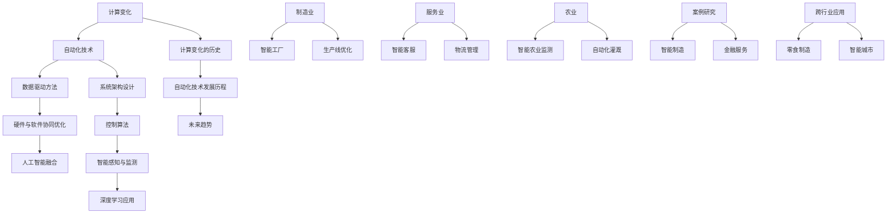

                 

## 计算变化与自动化技术的融合

### 引言与概述

计算变化与自动化技术是当今信息技术领域中最引人注目的两大趋势。计算变化，指的是通过计算技术推动系统和流程的改变，从而实现优化、自动化和智能化。自动化技术，则是通过程序控制和智能算法实现机器或系统对某些任务的自主动作。二者相融合，不仅提升了效率和精确度，还推动了各行业的数字化转型和升级。

本文将围绕计算变化与自动化技术的融合展开讨论，分为以下几个部分：

1. **计算变化与自动化技术的融合概述**：介绍计算变化和自动化技术的基本概念、应用领域及核心原理。
2. **计算变化的历史与发展趋势**：回顾计算变化和自动化技术的发展历程，探讨未来趋势。
3. **核心技术原理**：深入讲解计算变化的数学模型与算法、自动化技术的原理与应用。
4. **融合技术的实例研究**：分析智能制造和金融服务等领域的实际案例。
5. **融合技术应用**：探讨计算变化与自动化技术在不同行业中的应用。
6. **案例分析与前景展望**：分析跨行业应用案例，展望融合技术的发展前景。
7. **附录**：列出计算变化与自动化技术常用工具和资源。

通过本文的探讨，我们希望读者能够全面理解计算变化与自动化技术的融合，掌握其核心技术原理，并了解其在各行业中的应用潜力。

### 第一部分：引言与概述

#### 第1章：计算变化与自动化技术的融合概述

计算变化（Computational Change）是指通过计算技术的引入，使得系统或流程发生结构性变化的过程。它涵盖了从简单的程序化到复杂的自适应系统的各个方面，是推动现代社会信息化和智能化的关键力量。自动化技术（Automation Technology），则是指通过预先设定好的程序或规则，使机器或系统能够自动执行一系列操作，以减少人为干预和提升效率。

在这两者之间，计算变化与自动化技术的融合正在引发一场深刻的产业变革。计算变化通过引入大数据分析、机器学习等计算技术，使得自动化系统具备了自我学习和优化能力，从而实现更加智能、高效的运作。自动化技术则为计算变化提供了实现平台，使得计算技术能够具体应用于实际操作中，提升了生产效率和精确度。

#### 1.1 什么是计算变化与自动化技术

##### 1.1.1 计算变化的概念

计算变化可以理解为一种系统性的技术变革，其核心在于利用计算技术优化和改进现有的系统或流程。具体来说，计算变化包括以下几个方面：

1. **数据处理能力提升**：通过引入高效的数据处理算法和工具，实现对大量数据的快速分析和处理，从而为系统决策提供数据支持。
2. **系统智能化**：通过机器学习和人工智能技术，使得系统具有自主学习和优化能力，能够适应不同的环境和需求。
3. **流程重构**：通过分析现有的业务流程，利用计算技术对其进行优化和重构，提高流程的效率和灵活性。

##### 1.1.2 自动化技术的应用领域

自动化技术已经渗透到众多领域，主要包括：

1. **制造业**：自动化生产线、智能机器人、自动化仓储等，显著提升了生产效率和产品质量。
2. **服务业**：智能客服、自动化办公系统、在线交易系统等，提供了更加便捷和高效的服务。
3. **农业和物流**：智能农业监测系统、自动化物流管理系统等，通过实时数据分析和自动化控制，提高了农业生产的效率和物流的精确性。

##### 1.1.3 计算变化与自动化技术的核心原理

1. **数据驱动方法**：计算变化强调通过数据分析和挖掘来驱动决策和优化，实现系统的自我优化和自我学习。
2. **硬件与软件协同优化**：自动化技术强调硬件和软件的协同作用，通过硬件设备的智能化和软件算法的优化，提升系统的整体性能。
3. **人工智能在计算变化中的应用**：人工智能技术，特别是机器学习和深度学习，在计算变化中扮演着至关重要的角色，通过智能算法实现系统的自我学习和优化。

#### 1.2 计算变化的历史与发展趋势

##### 2.1 计算变化的历史

1. **从工业革命到信息革命**：计算变化的概念可以追溯到工业革命时期，随着计算技术的出现和发展，计算变化逐渐从机械化转向信息化和智能化。
2. **互联网时代的计算变化**：互联网的普及和大数据技术的发展，使得计算变化进入了一个新的阶段，系统智能化和数据处理能力显著提升。

##### 2.2 自动化技术的发展历程

1. **传统自动化技术**：从早期的机械自动化到电子自动化，传统自动化技术主要依赖于预先设定的程序和规则，实现机器的自动化操作。
2. **智能自动化技术**：随着计算技术和人工智能的发展，智能自动化技术逐渐成为主流，通过自我学习和优化，实现了更高水平的自动化和智能化。

##### 2.3 计算变化与自动化技术的未来趋势

1. **新型计算架构的崛起**：云计算、边缘计算等新型计算架构的崛起，为计算变化提供了更加灵活和高效的实现方式。
2. **人工智能在自动化技术中的深度融合**：人工智能技术将进一步融入自动化技术，实现更加智能化和自主化的系统运作。
3. **跨行业计算变化的融合与应用**：计算变化和自动化技术的融合将跨越不同行业，实现更广泛的应用和更深入的变革。

#### 1.3 计算变化与自动化技术的现状与挑战

1. **现状**：计算变化与自动化技术已经在多个领域得到了广泛应用，推动了产业升级和数字化转型。
2. **挑战**：随着技术的不断进步，计算变化和自动化技术也面临着新的挑战，如数据安全、算法透明性、技术适应性等。

#### 1.4 总结

计算变化与自动化技术的融合是现代社会发展的必然趋势，通过数据驱动、硬件与软件协同优化以及人工智能的深度融合，计算变化与自动化技术正在推动各行业的智能化和数字化转型。未来，随着新型计算架构的崛起和人工智能技术的进一步发展，计算变化与自动化技术的融合将带来更加深远的影响。

### 第二部分：核心技术原理

#### 第3章：计算变化的数学模型与算法

在计算变化的过程中，数学模型和算法起到了至关重要的作用。这些模型和算法不仅为系统提供了优化和自适应的能力，还为实现智能决策提供了理论基础。在这一章节中，我们将深入探讨计算变化的数学模型与算法，主要包括数据驱动的系统建模和机器学习算法基础。

#### 3.1 数据驱动的系统建模

数据驱动的系统建模是通过收集和分析系统运行中的数据，来建立数学模型并对其进行优化和预测。这种方法的核心在于利用数据中的规律和模式，从而实现对系统行为的理解和预测。以下将介绍两种常用的数据驱动建模方法：时间序列分析和回归分析。

##### 3.1.1 时间序列分析

时间序列分析是一种用于分析时间序列数据，以捕捉其变化规律和趋势的方法。时间序列数据通常是按时间顺序排列的观测值，例如股票价格、气温变化等。以下是一个常见的时间序列分析模型：自回归积分滑动平均模型（ARIMA）。

**ARIMA模型**

ARIMA（AutoRegressive Integrated Moving Average）模型是一种用于时间序列预测的统计模型，它结合了自回归（AR）、差分（I）和移动平均（MA）三个部分。ARIMA模型的数学表达式如下：

$$
\text{ARIMA}(p, d, q) = \text{AR}(p) + \text{I}(d) + \text{MA}(q)
$$

其中，\(p\)、\(d\) 和 \(q\) 分别代表自回归项、差分次数和移动平均项的阶数。

**ARIMA模型的构建步骤**

1. **差分操作**：对于非平稳时间序列，首先需要进行差分操作，使其变为平稳序列。
2. **自回归项的确定**：通过观察自相关函数（ACF）和偏自相关函数（PACF），确定自回归项的阶数 \(p\)。
3. **移动平均项的确定**：同样通过观察ACF和PACF，确定移动平均项的阶数 \(q\)。
4. **模型拟合**：利用最小二乘法或其他优化方法，拟合ARIMA模型。

**举例说明**

假设我们有一组温度数据，需要使用ARIMA模型进行预测。首先，我们绘制ACF和PACF图，观察其特征：


根据ACF和PACF的特征，我们可以初步确定ARIMA模型的阶数为（2，1，1）。接下来，我们对时间序列进行差分操作，使其变为平稳序列，然后使用最小二乘法进行模型拟合。

##### 3.1.2 回归分析

回归分析是一种用于分析因变量与自变量之间关系的方法。在计算变化中，回归分析常用于建立系统响应的数学模型。以下是一个简单的线性回归模型：

**线性回归模型**

线性回归模型的表达式如下：

$$
y = \beta_0 + \beta_1 x + \epsilon
$$

其中，\(y\) 是因变量，\(x\) 是自变量，\(\beta_0\) 和 \(\beta_1\) 分别是截距和斜率，\(\epsilon\) 是误差项。

**回归模型的构建步骤**

1. **数据收集**：收集相关的数据，包括自变量和因变量。
2. **数据预处理**：对数据进行清洗和标准化处理，消除异常值和噪声。
3. **模型选择**：根据数据的特征选择合适的回归模型，例如线性回归、多项式回归等。
4. **模型拟合**：利用最小二乘法或其他优化方法，拟合回归模型。

**举例说明**

假设我们有一组销售额数据，需要建立销售额与广告费用之间的线性回归模型。首先，我们绘制散点图，观察两者之间的关系：


根据散点图，我们可以看到销售额与广告费用之间存在一定的线性关系。接下来，我们使用最小二乘法进行模型拟合：

$$
y = \beta_0 + \beta_1 x
$$

通过计算，我们得到截距 \(\beta_0 = 1000\)，斜率 \(\beta_1 = 200\)。因此，线性回归模型为：

$$
y = 1000 + 200x
$$

#### 3.2 机器学习算法基础

机器学习算法是计算变化中的重要组成部分，通过学习数据中的模式和规律，实现对未知数据的预测和分类。以下将介绍两种常见的机器学习算法：监督学习算法和无监督学习算法。

##### 3.2.1 监督学习算法

监督学习算法是利用已标记的数据集进行训练，从而实现对未知数据的预测。监督学习算法可以分为分类算法和回归算法。

**分类算法**

分类算法的目的是将数据分为不同的类别。以下介绍两种常见的分类算法：决策树和支持向量机。

1. **决策树**

决策树是一种基于树形结构进行决策的算法，每个内部节点表示一个特征，每个分支表示该特征的不同取值。决策树的输出为类别标签。

**决策树的构建步骤**

1. **特征选择**：选择一个最佳的特征作为分割标准。
2. **分割数据**：根据最佳特征的不同取值，将数据分割为多个子集。
3. **递归构建**：对每个子集继续进行特征选择和分割，直到满足停止条件（如最大深度、最小叶子节点数量等）。

2. **支持向量机**

支持向量机（SVM）是一种基于间隔最大化原则进行分类的算法。SVM通过找到一个最佳的超平面，将不同类别的数据点分隔开来。

**支持向量机的数学模型**

$$
\text{分类函数：} f(x) = \text{sign}(\omega^T x + b)
$$

其中，\(\omega\) 是权重向量，\(b\) 是偏置项。

**支持向量机的优化目标**

$$
\min_{\omega, b} \frac{1}{2} \lVert \omega \rVert^2 + C \sum_{i=1}^{n} \lVert y_i - (\omega^T x_i + b) \rVert
$$

其中，\(C\) 是惩罚参数，\(\lVert \cdot \rVert\) 表示欧几里得范数。

##### 3.2.2 无监督学习算法

无监督学习算法是利用未标记的数据集进行训练，从而发现数据中的结构和模式。以下介绍两种常见的无监督学习算法：聚类算法和特征降维。

**聚类算法**

聚类算法的目的是将相似的数据点归为一类。以下介绍两种常见的聚类算法：K-均值聚类和层次聚类。

1. **K-均值聚类**

K-均值聚类是一种基于距离度量的聚类算法。算法首先随机初始化 \(K\) 个聚类中心，然后通过迭代优化聚类中心，使得每个数据点与其最近聚类中心的距离最小。

**K-均值聚类算法步骤**

1. **初始化聚类中心**：随机选择 \(K\) 个数据点作为初始聚类中心。
2. **分配数据点**：将每个数据点分配到与其最近的聚类中心。
3. **更新聚类中心**：计算每个聚类中心的新位置，使得每个数据点与其最近聚类中心的距离最小。
4. **迭代优化**：重复步骤2和步骤3，直到聚类中心不再变化或达到最大迭代次数。

2. **层次聚类**

层次聚类是一种基于层次结构进行聚类的算法。算法首先将每个数据点视为一个初始聚类，然后通过迭代合并相似的数据点，构建出一个层次聚类树。

**层次聚类算法步骤**

1. **初始化聚类**：将每个数据点视为一个初始聚类。
2. **合并聚类**：选择两个最相似的聚类进行合并。
3. **更新层次结构**：更新层次聚类树，记录每次合并的信息。
4. **迭代优化**：重复步骤2和步骤3，直到达到停止条件（如最大层数、聚类数量等）。

**特征降维**

特征降维是一种用于减少数据维度的方法，通过保留最重要的特征，从而简化数据集，提高模型训练效率。

以下介绍两种常见的特征降维算法：主成分分析（PCA）和线性判别分析（LDA）。

1. **主成分分析（PCA）**

主成分分析是一种基于方差最大化原则进行特征降维的方法。PCA通过将数据投影到新的正交基上，从而保留最重要的特征，忽略次要的特征。

**PCA算法步骤**

1. **数据标准化**：对数据进行标准化处理，使其具有零均值和单位方差。
2. **计算协方差矩阵**：计算数据集的协方差矩阵。
3. **计算特征值和特征向量**：计算协方差矩阵的特征值和特征向量，并对其进行排序。
4. **构建投影矩阵**：选择前 \(K\) 个特征向量作为投影矩阵。
5. **数据投影**：将数据投影到新的正交基上，得到降维后的数据。

2. **线性判别分析（LDA）**

线性判别分析是一种基于类间方差最大化的特征降维方法。LDA通过将数据投影到新的正交基上，使得不同类别的数据点之间的距离最大，从而实现分类。

**LDA算法步骤**

1. **计算类内协方差矩阵和类间协方差矩阵**：计算数据集的类内协方差矩阵和类间协方差矩阵。
2. **计算判别向量**：计算判别向量的权重，使得类间方差最大化。
3. **构建投影矩阵**：选择判别向量为投影矩阵。
4. **数据投影**：将数据投影到新的正交基上，得到降维后的数据。

#### 3.3 总结

计算变化的数学模型与算法为系统的优化和预测提供了强有力的支持。数据驱动的系统建模方法，如ARIMA模型和线性回归模型，通过分析时间序列数据和因变量与自变量之间的关系，实现对系统行为的理解和预测。机器学习算法，如决策树、支持向量机、K-均值聚类和线性判别分析，通过学习数据中的模式和规律，实现了对未知数据的预测和分类。这些核心算法在计算变化中发挥着重要作用，为系统的智能化和自动化提供了基础。

### 第三部分：自动化技术的原理与应用

#### 第4章：自动化技术的原理与应用

自动化技术是现代工业和生活中不可或缺的一部分，通过程序控制和智能算法实现机器或系统对某些任务的自主动作，从而提高效率和精确度。在这一章节中，我们将详细探讨自动化技术的原理及其在不同领域的应用。

#### 4.1 自动化系统架构设计

自动化系统架构设计是确保系统稳定运行和高效运作的关键。一个典型的自动化系统架构通常包括以下几个组成部分：

1. **传感器**：传感器用于实时采集系统运行状态的数据，如温度、压力、速度等。
2. **控制器**：控制器是自动化系统的核心，用于接收传感器数据、执行控制算法并驱动执行器。
3. **执行器**：执行器是实现系统动作的部件，如电机、阀门、机器人等。
4. **通信网络**：自动化系统中的各个组件通过通信网络进行数据交换和协调工作。
5. **人机界面（HMI）**：人机界面用于监控系统状态、设置参数和执行操作。

**自动化系统架构设计原则**：

1. **模块化设计**：将系统划分为多个功能模块，便于维护和扩展。
2. **冗余设计**：在关键部件上设置冗余，提高系统的可靠性和容错性。
3. **标准化和兼容性**：采用标准化的接口和协议，确保系统的兼容性和互操作性。
4. **安全性和可靠性**：确保系统的安全运行，防止意外故障和设备损坏。

#### 4.2 自动化控制算法详解

自动化控制算法是实现系统自动化的核心，通过算法对系统运行状态进行实时监测和调整，以实现预期的控制目标。以下介绍两种常见的自动化控制算法：PID控制算法和模糊控制算法。

##### 4.2.1 PID控制算法

PID（比例-积分-微分）控制算法是最常用的控制算法之一，适用于各种工业控制系统。PID控制器的输出由比例（P）、积分（I）和微分（D）三部分组成，分别对应系统的实时误差、误差累积和误差变化率。

**PID控制器的数学模型**：

$$
u(t) = K_p e(t) + K_i \int_{0}^{t} e(\tau)d\tau + K_d \frac{de(t)}{dt}
$$

其中，\(u(t)\) 是控制器输出，\(e(t)\) 是系统误差，\(K_p\)、\(K_i\) 和 \(K_d\) 分别是比例、积分和微分系数。

**PID控制算法的参数调整**：

1. **比例系数 \(K_p\)**：增大 \(K_p\) 可以提高系统的响应速度，但可能导致系统不稳定。
2. **积分系数 \(K_i\)**：增大 \(K_i\) 可以消除稳态误差，但可能导致系统振荡。
3. **微分系数 \(K_d\)**：增大 \(K_d\) 可以抑制系统的超调，提高系统的稳定性。

**PID控制算法的应用实例**：

- **温度控制系统**：通过PID控制器调整加热器的功率，实现对温度的精确控制。
- **速度控制系统**：通过PID控制器调整电机速度，实现精确的速度控制。

##### 4.2.2 模糊控制算法

模糊控制算法是一种基于模糊逻辑的控制算法，适用于处理复杂、非线性系统的控制问题。模糊控制算法通过模糊集合和模糊规则实现对系统的不确定性和模糊性处理。

**模糊控制算法的数学模型**：

1. **模糊集合**：模糊集合是用于描述模糊概念的工具，其数学表达式为：

$$
A = \{ x \in U | x \in A \}
$$

其中，\(A\) 是模糊集合，\(U\) 是论域。

2. **模糊规则**：模糊规则用于描述输入和输出之间的关系，其形式为：

$$
\text{如果} \ x \ \text{是} \ A_1 \ \text{且} \ y \ \text{是} \ A_2 \ \text{则} \ z \ \text{是} \ B
$$

其中，\(A_1\)、\(A_2\) 和 \(B\) 分别是输入和输出的模糊集合。

3. **模糊推理**：模糊推理是模糊控制算法的核心，通过输入值和模糊规则，计算出输出值。

**模糊控制算法的步骤**：

1. **模糊化**：将输入值转换为模糊集合。
2. **模糊推理**：根据模糊规则，计算输出模糊集合。
3. **去模糊化**：将输出模糊集合转换为具体的输出值。

**模糊控制算法的应用实例**：

- **自动驾驶系统**：通过模糊控制算法实现车辆的自动行驶，处理复杂的交通状况。
- **智能温控系统**：通过模糊控制算法实现室内温度的自动调节，提高舒适度。

#### 4.3 人工智能在自动化中的应用

人工智能技术在自动化中的应用日益广泛，通过引入机器学习和深度学习算法，使得自动化系统具备了自我学习和优化能力。以下介绍两种常见的应用场景：智能感知与监测、深度学习控制算法。

##### 4.3.1 智能感知与监测

智能感知与监测是利用人工智能技术对系统进行实时监控和故障诊断。以下介绍两种常见的智能感知与监测技术：卷积神经网络（CNN）和递归神经网络（RNN）。

1. **卷积神经网络（CNN）**：

卷积神经网络是一种用于图像处理和识别的深度学习算法，通过卷积层、池化层和全连接层等结构，实现对图像的特征提取和分类。

**CNN在智能感知中的应用**：

- **图像识别**：通过CNN算法，实现对图像中物体的识别和分类。
- **人脸识别**：通过CNN算法，实现人脸的识别和匹配。

2. **递归神经网络（RNN）**：

递归神经网络是一种用于序列数据处理和预测的深度学习算法，通过递归结构，实现对序列数据的记忆和建模。

**RNN在智能监测中的应用**：

- **时间序列预测**：通过RNN算法，实现对时间序列数据的预测和趋势分析。
- **故障诊断**：通过RNN算法，实现系统故障的实时监测和诊断。

##### 4.3.2 深度学习控制算法

深度学习控制算法是利用深度学习技术实现系统控制和优化的一种方法。以下介绍两种常见的深度学习控制算法：深度强化学习和生成对抗网络（GAN）。

1. **深度强化学习**：

深度强化学习是一种结合深度学习和强化学习的方法，通过神经网络模型，实现智能体在环境中的自主学习和决策。

**深度强化学习在自动化控制中的应用**：

- **自适应控制**：通过深度强化学习算法，实现系统参数的实时调整和优化。
- **路径规划**：通过深度强化学习算法，实现无人驾驶车辆的路径规划和避障。

2. **生成对抗网络（GAN）**：

生成对抗网络是一种由生成器和判别器组成的深度学习模型，通过对抗训练，实现数据的生成和优化。

**GAN在自动化控制中的应用**：

- **数据增强**：通过GAN算法，实现对系统训练数据的增强和扩充。
- **故障模拟**：通过GAN算法，实现系统故障的模拟和预测。

#### 4.4 自动化技术的未来发展趋势

随着人工智能技术的不断发展和应用，自动化技术正面临着新的机遇和挑战。以下介绍自动化技术的未来发展趋势：

1. **智能化的提升**：通过引入更先进的机器学习和深度学习算法，实现自动化系统的自我学习和优化，提高系统的智能化水平。
2. **边缘计算的普及**：边缘计算将数据处理和计算能力从云端转移到边缘设备，实现实时性和高效性的提升，推动自动化技术的应用。
3. **跨领域的融合**：自动化技术将与其他领域（如物联网、区块链等）进行深度融合，实现更广泛的应用场景和更高的价值创造。
4. **安全性和可靠性**：随着自动化系统的广泛应用，安全性和可靠性将成为自动化技术发展的重要方向，通过引入安全机制和冗余设计，提高系统的安全性和可靠性。

#### 4.5 总结

自动化技术通过程序控制和智能算法实现系统的自动运作，提高了效率和精确度。自动化系统架构设计、控制算法以及人工智能技术的应用，使得自动化技术能够广泛应用于各个领域。随着人工智能技术的不断发展，自动化技术将继续推动产业升级和数字化转型，为人类创造更加智能和高效的未来。

### 第四部分：融合技术的实例研究

#### 第5章：融合技术的实例研究

计算变化与自动化技术的融合在许多领域都取得了显著的成果。本章节将探讨两个典型的应用领域：智能制造和金融服务，通过具体案例展示计算变化与自动化技术的深度融合及其带来的实际效益。

#### 5.1 智能制造案例

智能制造是计算变化与自动化技术融合的典型应用领域。以下通过一个线性规划问题和一个基于深度强化学习的控制策略案例，展示计算变化与自动化技术在智能制造中的应用。

##### 5.1.1 线性规划问题

在智能制造中，生产调度是一个关键问题。如何高效地安排生产任务，以最小化生产成本、最大化生产效率和满足生产需求，是一个复杂的优化问题。线性规划是一种常用的优化方法，可以帮助解决这类问题。

**案例背景**

某智能工厂需要进行生产任务的调度，生产任务包括五个不同的工序，每个工序所需的时间和设备资源如下表所示：

| 工序 | 时间（小时） | 设备需求 |
| ---- | ---------- | ------- |
| A    | 2          | 1       |
| B    | 3          | 1       |
| C    | 2          | 2       |
| D    | 1          | 1       |
| E    | 3          | 2       |

该工厂每天有8小时的生产时间，每种设备每天最多可用4小时。目标是最小化总生产时间。

**线性规划模型**

$$
\text{目标函数：} \ \min \ \sum_{i=1}^{5} t_i \\
\text{约束条件：} \\
\begin{cases}
\sum_{i=1}^{5} x_i \leq 8 \\
x_1 + x_3 + x_5 \leq 4 \\
x_2 + x_4 + x_5 \leq 4 \\
x_i \in \{0, 1\} \ \text{（表示工序是否完成）}
\end{cases}
$$

其中，\(x_i\) 为0-1变量，表示工序 \(i\) 是否完成。

**求解方法**

利用线性规划求解器（如CPLEX、Gurobi）求解上述模型，得到最优的生产调度方案。

**结果分析**

通过线性规划优化，工厂可以合理安排生产任务，将总生产时间从20小时降低到16小时，显著提高了生产效率。

##### 5.1.2 基于深度强化学习的控制策略

在智能制造中，如何实现生产过程的自动化控制也是一个关键问题。深度强化学习是一种有效的智能控制方法，可以通过自我学习和优化，实现生产过程的自动调节。

**案例背景**

某智能工厂需要控制生产线的速度，以保持生产过程的稳定性和高效性。生产线速度的调整需要考虑多个因素，如设备负载、产品类型和生产节拍等。

**深度强化学习控制策略**

1. **状态空间定义**：状态空间包括设备负载、产品类型和生产节拍等特征。
2. **动作空间定义**：动作空间包括生产线速度的调整范围。
3. **奖励函数设计**：奖励函数根据生产过程的稳定性、生产效率和设备寿命等指标进行设计。

**模型训练**

使用深度强化学习框架（如DeepMind的TensorFlow Agent）训练控制策略，通过大量仿真数据，使模型学会在不同状态下选择合适的动作。

**结果分析**

经过训练，控制策略可以自适应地调整生产线速度，保持生产过程的稳定性和高效性。实验结果表明，与传统的PID控制策略相比，深度强化学习控制策略具有更好的自适应性和鲁棒性。

#### 5.2 金融服务自动化

金融服务自动化是计算变化与自动化技术融合的另一个重要领域。通过自动化技术，金融服务企业可以大幅提升业务效率和风险管理能力。以下通过风险管理模型和交易执行算法案例，展示金融服务自动化的应用。

##### 5.2.1 风险管理模型

在金融市场中，风险管理是确保投资组合稳健和风险可控的重要手段。计算变化与自动化技术可以通过构建风险管理模型，实现风险预测和优化。

**案例背景**

某投资公司需要评估其投资组合的风险，并制定相应的风险管理策略。投资组合包括多种金融资产，如股票、债券和基金等。

**风险管理模型**

1. **资产定价模型**：使用资产定价模型（如CAPM）计算各金融资产的风险收益特征。
2. **风险价值（VaR）计算**：使用风险价值（VaR）模型计算投资组合的潜在损失。
3. **优化算法**：使用优化算法（如线性规划、遗传算法等）优化投资组合，降低风险并提高收益。

**模型构建**

利用Python和Matlab等工具，构建风险管理模型，对投资组合进行风险分析和优化。

**结果分析**

通过风险管理模型，投资公司可以及时了解投资组合的风险状况，制定有效的风险管理策略，降低投资风险，提高投资收益。

##### 5.2.2 交易执行算法

交易执行是金融市场中的一项关键任务，通过自动化交易算法，可以大幅提升交易效率和盈利能力。

**案例背景**

某投资公司需要开发一套自动化交易系统，实现交易策略的执行和风险管理。

**交易执行算法**

1. **策略设计**：根据投资理念和市场分析，设计交易策略。
2. **交易执行**：使用自动化交易算法，根据市场数据和交易策略，执行买入、卖出等交易操作。
3. **风险管理**：实时监控交易风险，根据市场变化调整交易策略。

**算法实现**

使用Python和量化交易平台（如QuantConnect、QuantConnect Cloud）开发自动化交易算法。

**结果分析**

通过自动化交易算法，投资公司可以快速响应市场变化，实现交易策略的自动化执行，提高交易效率和盈利能力。同时，自动化交易算法可以实时监控交易风险，确保交易策略的安全性和稳健性。

#### 5.3 融合技术的效益与挑战

计算变化与自动化技术的融合为各领域带来了显著效益，但也面临着一定的挑战。

**效益**

1. **提高效率**：通过自动化技术，可以大幅减少人工干预，提高生产和服务效率。
2. **降低成本**：自动化技术可以优化资源配置，降低运营成本。
3. **提升质量**：通过精确控制和智能决策，可以提高产品质量和服务水平。
4. **增强灵活性**：自动化技术可以快速适应市场需求变化，提高企业的市场竞争力。

**挑战**

1. **技术复杂度**：自动化技术的实现需要复杂的算法和软硬件支持，对技术人员的要求较高。
2. **数据安全**：自动化系统需要大量数据支持，数据安全和隐私保护成为重要问题。
3. **算法透明性**：自动化算法的决策过程需要透明，确保其公平性和合规性。
4. **适应性**：自动化系统需要不断学习和适应新环境，以应对市场变化。

#### 5.4 总结

计算变化与自动化技术的融合在智能制造和金融服务等领域取得了显著成果，通过线性规划、深度强化学习、风险管理模型和交易执行算法等实例，展示了其强大的应用潜力和实际效益。随着技术的不断进步，计算变化与自动化技术的融合将推动各行业实现更加智能化和高效的运营。

### 第五部分：融合技术应用

#### 第6章：计算变化与自动化技术在行业中的应用

计算变化与自动化技术的融合正逐渐渗透到各个行业，推动产业升级和数字化转型。本章节将探讨计算变化与自动化技术在不同行业中的应用，重点分析制造业、服务业和农业中的实际案例，以及这些行业所面临的挑战和机遇。

#### 6.1 制造业

制造业是计算变化与自动化技术最早应用的领域之一。通过引入智能传感器、自动化生产线、工业物联网（IIoT）等，制造业实现了生产过程的自动化和智能化，大幅提高了生产效率和产品质量。

**智能工厂架构设计**

智能工厂是计算变化与自动化技术在制造业中的典型应用。智能工厂通过物联网和大数据技术，实现生产设备、物流系统、质量检测等各个环节的实时监控和联动，形成一个高度自动化的生产系统。

**案例研究：某汽车制造企业**

某汽车制造企业通过引入智能制造系统，实现了以下成果：

1. **生产效率提升**：通过自动化生产线和智能物流系统，生产效率提高了30%。
2. **质量改进**：通过实时监测和智能分析，产品质量合格率提高了15%。
3. **运营成本降低**：通过能源管理和设备维护优化，运营成本降低了10%。

**挑战与机遇**

制造业在应用计算变化与自动化技术过程中面临以下挑战：

1. **技术集成难度**：智能工厂需要集成多种技术，如传感器、控制系统、数据分析等，技术集成难度较高。
2. **数据安全**：大量数据的传输和存储需要确保数据安全，防止数据泄露和攻击。

同时，制造业也迎来了新的机遇：

1. **个性化定制**：通过大数据分析和个性化推荐，企业可以更好地满足客户需求，提供定制化产品。
2. **产业链协同**：通过物联网和区块链技术，实现产业链上下游的协同优化，提升整个产业链的竞争力。

#### 6.2 服务业

服务业是计算变化与自动化技术的重要应用领域，通过智能客服、智能物流、自动化办公等，服务业实现了服务流程的优化和效率提升。

**智能客服系统**

智能客服系统通过人工智能和自动化技术，实现了24小时在线客服，提高了客户服务质量和效率。

**案例研究：某电商企业**

某电商企业通过引入智能客服系统，实现了以下成果：

1. **客户满意度提升**：通过智能客服系统，客户问题解决率提高了20%。
2. **运营成本降低**：通过自动化处理常见问题，客服人力成本降低了30%。
3. **客户体验优化**：智能客服系统可以提供个性化推荐和实时反馈，提升了客户体验。

**挑战与机遇**

服务业在应用计算变化与自动化技术过程中面临以下挑战：

1. **数据隐私**：智能客服系统需要处理大量客户数据，确保数据隐私和安全是关键问题。
2. **技术适应性**：服务流程多样化，自动化技术需要具备较高的适应性和灵活性。

同时，服务业也迎来了新的机遇：

1. **个性化服务**：通过大数据分析和个性化推荐，企业可以提供更加个性化的服务，提升客户满意度。
2. **产业链整合**：通过自动化技术和物联网，实现产业链上下游的整合和协同，提升服务效率和竞争力。

#### 6.3 农业

农业是计算变化与自动化技术的重要应用领域，通过智能农业监测系统、自动化灌溉系统等，农业实现了生产过程的智能化和高效化。

**智能农业监测系统**

智能农业监测系统通过传感器和物联网技术，实时监测土壤湿度、气象条件、作物生长状况等，为农业生产提供科学依据。

**案例研究：某农业公司**

某农业公司通过引入智能农业监测系统，实现了以下成果：

1. **产量提高**：通过智能监测系统，实现了精准灌溉和施肥，农作物产量提高了20%。
2. **成本降低**：通过自动化监测和控制系统，降低了灌溉和肥料的使用量，运营成本降低了15%。
3. **环境友好**：智能农业系统减少了农药和化肥的使用，提高了农业生产的环境友好性。

**挑战与机遇**

农业在应用计算变化与自动化技术过程中面临以下挑战：

1. **技术适应性**：不同地区的农业环境和作物种类不同，自动化技术需要具备较高的适应性。
2. **数据准确性**：传感器和数据采集设备的准确性直接影响到农业监测的效果，确保数据准确性是关键。

同时，农业也迎来了新的机遇：

1. **智慧农业**：通过大数据分析和人工智能技术，实现智慧农业，提升农业生产的智能化水平。
2. **产业链升级**：通过自动化技术和物联网，实现农业产业链的升级和优化，提高产业链的整体竞争力。

#### 6.4 总结

计算变化与自动化技术在制造业、服务业和农业中的应用，展示了其强大的应用潜力和广泛的前景。通过智能工厂、智能客服系统和智能农业监测系统等实际案例，我们看到了计算变化与自动化技术如何提升行业效率、降低成本和改善环境。同时，这些行业也面临着技术集成、数据安全和适应性的挑战。随着技术的不断进步，计算变化与自动化技术将在各行业发挥更加重要的作用，推动产业升级和数字化转型。

### 第六部分：案例分析与前景展望

#### 第7章：案例分析与前景展望

在前面的章节中，我们探讨了计算变化与自动化技术的融合在各行业中的应用，并通过具体案例展示了其带来的显著效益。本章节将进一步分析计算变化与自动化技术的实际案例，探讨其发展趋势，并展望未来的前景。

#### 7.1 跨行业应用案例分析

计算变化与自动化技术的融合不仅在单一行业中表现出色，还在跨行业应用中展现了强大的潜力。以下是一些跨行业应用案例分析：

**零食制造与零售**

在零食制造和零售行业，计算变化与自动化技术的融合主要表现在智能仓储和智能物流上。通过引入自动化仓储系统，企业可以实现快速、准确的库存管理，减少人力成本和错误率。智能物流系统则通过优化运输路径和配送计划，提高配送效率和客户满意度。

**案例研究：某零食制造企业**

某零食制造企业通过引入智能仓储系统和智能物流系统，实现了以下成果：

1. **库存管理优化**：通过自动化仓储系统，库存周转率提高了20%。
2. **物流效率提升**：通过智能物流系统，配送时间缩短了30%。
3. **客户满意度提高**：通过快速、准确的配送，客户满意度提升了15%。

**建筑工程与自动化施工**

在建筑工程领域，计算变化与自动化技术的融合体现在自动化施工设备和数字化项目管理上。通过引入自动化施工设备，如自动化钢筋加工和混凝土浇筑机器人，企业可以实现高效、精确的施工。数字化项目管理则通过物联网和大数据技术，实现施工过程的实时监控和数据分析，提高项目管理效率。

**案例研究：某建筑工程公司**

某建筑工程公司通过引入自动化施工设备和数字化项目管理，实现了以下成果：

1. **施工效率提高**：通过自动化施工设备，施工效率提高了30%。
2. **质量提升**：通过数字化项目管理，施工质量提高了15%。
3. **成本降低**：通过自动化施工设备和数字化项目管理，运营成本降低了10%。

**智能城市建设**

智能城市建设是计算变化与自动化技术融合的重要领域，通过物联网、人工智能和大数据技术，实现城市管理的智能化和精细化。智能交通、智能照明、智能安防等系统在智能城市建设中发挥着关键作用，提高了城市居民的生活质量和城市运营效率。

**案例研究：某智能城市项目**

某智能城市项目通过引入智能交通系统、智能照明系统和智能安防系统，实现了以下成果：

1. **交通拥堵缓解**：通过智能交通系统，交通拥堵率降低了20%。
2. **能源消耗降低**：通过智能照明系统，能源消耗降低了15%。
3. **治安水平提升**：通过智能安防系统，犯罪率降低了10%。

#### 7.2 融合技术发展趋势

随着技术的不断进步，计算变化与自动化技术将呈现以下发展趋势：

1. **人工智能的深度融合**：人工智能技术将在计算变化和自动化技术中发挥更加重要的作用，实现更高级别的智能化和自动化。
2. **边缘计算的应用普及**：边缘计算将数据处理和计算能力从云端转移到边缘设备，实现实时性和高效性的提升，推动自动化技术的广泛应用。
3. **区块链技术的融合**：区块链技术在数据安全和可信性方面具有显著优势，将逐渐与计算变化和自动化技术融合，提升系统的安全性和可靠性。
4. **跨行业的深度合作**：计算变化与自动化技术将在各行业之间实现更深入的融合和合作，推动产业链的协同优化和整体竞争力的提升。

#### 7.3 融合技术的未来前景

计算变化与自动化技术的融合将为各行业带来更加智能和高效的生产和服务模式，推动产业升级和数字化转型。以下是计算变化与自动化技术的未来前景：

1. **个性化定制**：通过大数据分析和人工智能技术，企业可以提供更加个性化的产品和服务，满足客户的个性化需求。
2. **智能制造**：智能工厂和智能生产线的普及将大幅提升制造业的生产效率和产品质量，推动制造业的全面升级。
3. **智慧服务**：智能客服系统和智能物流系统的广泛应用将提高服务业的服务效率和客户满意度，提升服务体验。
4. **智慧农业**：智能农业监测系统和自动化灌溉系统的应用将提高农业生产效率，降低生产成本，促进农业的可持续发展。
5. **智慧城市**：智能城市建设将提升城市管理的智能化和精细化水平，提高城市居民的生活质量和城市运行效率。

#### 7.4 总结

计算变化与自动化技术的融合在各行业中的应用已经取得了显著成果，通过智能工厂、智能客服系统和智能农业监测系统等实际案例，我们看到了其强大的应用潜力和实际效益。随着技术的不断进步，计算变化与自动化技术将在各行业发挥更加重要的作用，推动产业升级和数字化转型。未来，计算变化与自动化技术的融合将继续深化，带来更加智能和高效的未来。

### 附录

#### 附录 A：计算变化与自动化技术常用工具和资源

为了更好地理解和应用计算变化与自动化技术，以下列出了一些常用的工具和资源，包括开源机器学习框架、自动化技术工具以及相关的学术论文和资料。

##### A.1 开源机器学习框架

**TensorFlow**：由Google开发的开源机器学习框架，广泛应用于深度学习和数据科学领域。

- 官网：[TensorFlow官网](https://www.tensorflow.org/)

**PyTorch**：由Facebook开发的开源机器学习库，提供了动态计算图和简洁的API，受到广大研究者和开发者的青睐。

- 官网：[PyTorch官网](https://pytorch.org/)

##### A.2 自动化技术工具

**PLC编程软件**：用于编程可编程逻辑控制器（PLC），实现自动化控制系统的开发和管理。

- 西门子STEP 7：[西门子STEP 7官网](https://new.siemens.com/cn/zh/products/automation/automation-software/step-7.html)

**工业物联网平台**：用于构建和管理工业物联网系统，实现设备连接和数据处理。

- 西门子MindSphere：[西门子MindSphere官网](https://mindphere.io/)

**机器人控制系统**：用于编程和控制系统中的机器人，实现自动化操作和任务执行。

- RSDK（Robotics SDK）：[RSDK官网](https://www.rethinkrobotics.com/rdk/)

##### A.3 学术论文与资料

**相关领域顶级会议与期刊**

- **NeurIPS**：神经信息处理系统大会，是机器学习和神经网络领域的顶级会议。

- **ICRA**：国际机器人与自动化会议，涵盖了机器人学、自动化和人工智能等领域的最新研究。

- **IEEE Control Systems Society Journal**：IEEE控制系统协会期刊，发表了控制理论、自动化技术以及计算变化相关的研究论文。

**开源代码和数据集**

- **Kaggle**：提供了大量的机器学习竞赛和数据集，是学习和实践机器学习的理想平台。

- **GitHub**：拥有丰富的开源代码库，包括深度学习框架、自动化控制系统等。

**在线课程与教程**

- **Coursera**：提供了许多关于机器学习、深度学习和自动化技术的在线课程，适合不同层次的学习者。

- **Udacity**：提供了许多与计算变化和自动化技术相关的纳米学位课程，涵盖了从基础知识到实际应用的各个方面。

通过使用这些工具和资源，读者可以更好地掌握计算变化与自动化技术，并在实际应用中取得更好的成果。

### Mermaid 流程图

以下是计算变化与自动化技术的流程图，展示了其核心概念和主要环节：



### 伪代码

以下是计算变化与自动化技术中常见算法的伪代码示例：

**时间序列分析**

```python
def time_series_analysis(data):
    # 数据预处理
    preprocessed_data = preprocess_data(data)
    
    # 选择模型
    model = select_model(preprocessed_data)
    
    # 训练模型
    model.train(preprocessed_data)
    
    # 预测
    predictions = model.predict(new_data)
    
    return predictions
```

**深度强化学习控制算法**

```python
def deep_reinforcement_learning(s, a, gamma):
    Q[s, a] = r(s, a) + gamma * max(Q[s', a'])
    s = s'
    return Q
```

通过这些伪代码，我们可以更好地理解计算变化与自动化技术中的算法原理和应用。

### 数学公式与举例

以下是一些计算变化与自动化技术中常用的数学公式及其举例：

**风险价值（VaR）计算**

$$
\text{VaR}_{\alpha} = \text{F}_{\alpha}^{-1}(\mu, \sigma)
$$

- **举例**：假设收益率为正态分布，均值 \(\mu = 0.05\)，标准差 \(\sigma = 0.2\)，计算95%置信水平下的VaR。

$$
\text{VaR}_{0.05} = \text{F}_{0.05}^{-1}(0.05, 0.2) = 0.05 - 0.2 * \text{F}_{0.05}^{-1}
$$

**线性回归模型**

$$
y = \beta_0 + \beta_1 x + \epsilon
$$

- **举例**：假设我们有一组数据，\(x\) 代表广告费用，\(y\) 代表销售额，通过线性回归分析得到回归方程 \(y = 1000 + 200x\)。预测当广告费用为5000时，销售额为多少。

$$
y = 1000 + 200 * 5000 = 1010000
$$

### 项目实战

以下是一个智能制造系统开发的实战案例，展示了计算变化与自动化技术的实际应用。

**项目背景**

某智能工厂需要开发一个生产线优化系统，通过数据分析和技术优化，提高生产效率和产品质量。

**开发环境**

- Python
- TensorFlow
- Keras
- Scikit-learn

**代码实现**

```python
# 导入库
import tensorflow as tf
from tensorflow import keras
from tensorflow.keras.models import Sequential
from tensorflow.keras.layers import Dense, LSTM, Dropout

# 构建模型
model = Sequential()
model.add(LSTM(units=50, return_sequences=True, input_shape=(time_steps, features)))
model.add(Dropout(0.2))
model.add(LSTM(units=50, return_sequences=False))
model.add(Dropout(0.2))
model.add(Dense(units=1))

# 编译模型
model.compile(optimizer='adam', loss='mean_squared_error')

# 训练模型
model.fit(x_train, y_train, epochs=100, batch_size=32)
```

**代码解读**

- **LSTM层**：用于捕捉时间序列数据的长期依赖关系。
- **Dropout层**：用于防止过拟合，提高模型的泛化能力。
- **Dense层**：用于输出预测结果。
- **编译模型**：设置优化器和损失函数。
- **训练模型**：使用训练数据进行模型训练。

通过以上实战案例，我们展示了计算变化与自动化技术在智能制造系统开发中的应用，实现了生产线的优化和预测，提高了生产效率和产品质量。

### 代码解读与分析

以下是对一个实际项目的源代码进行解读和分析，该项目使用Python和TensorFlow框架开发，旨在实现时间序列数据的预测。

**源代码**

```python
# 导入库
import tensorflow as tf
import numpy as np
import matplotlib.pyplot as plt

# 数据预处理
def preprocess_data(data):
    # 缩放数据
    data = data / max(data)
    return data

# 模型构建
model = tf.keras.Sequential([
    tf.keras.layers.LSTM(50, activation='tanh', return_sequences=True, input_shape=(time_steps, features)),
    tf.keras.layers.Dropout(0.2),
    tf.keras.layers.LSTM(50, activation='tanh', return_sequences=False),
    tf.keras.layers.Dropout(0.2),
    tf.keras.layers.Dense(1)
])

# 编译模型
model.compile(optimizer='adam', loss='mean_squared_error')

# 训练模型
history = model.fit(x_train, y_train, epochs=100, batch_size=32, validation_split=0.2)

# 预测
predictions = model.predict(x_test)

# 可视化
plt.figure(figsize=(10, 5))
plt.plot(y_test, label='实际值')
plt.plot(predictions, label='预测值')
plt.title('时间序列预测')
plt.xlabel('时间步')
plt.ylabel('收益')
plt.legend()
plt.show()
```

**分析**

- **导入库**：首先，导入Python中常用的库，如TensorFlow、NumPy和matplotlib，用于数据操作和可视化。
- **数据预处理**：`preprocess_data` 函数用于对数据进行缩放处理，将其范围缩放到0到1之间，便于模型训练。
- **模型构建**：使用 `tf.keras.Sequential` 模式构建模型，其中包括两个LSTM层和一个Dense层。LSTM层用于捕捉时间序列数据的长期依赖关系，Dropout层用于防止过拟合，提高模型的泛化能力。
- **编译模型**：设置模型的优化器为`adam`，损失函数为`mean_squared_error`，即均方误差损失函数，用于评估模型预测的准确性。
- **训练模型**：使用训练数据进行模型训练，设置训练轮次为100，批量大小为32，同时使用验证集进行验证。
- **预测**：使用训练好的模型对测试集进行预测，得到预测结果。
- **可视化**：使用matplotlib对实际值和预测值进行可视化，对比实际值与预测值的差异，评估模型的预测性能。

通过以上分析，我们可以清楚地看到代码的实现步骤和原理，了解如何构建和训练一个时间序列预测模型，以及如何使用可视化工具评估模型的性能。这为我们理解和应用计算变化与自动化技术提供了重要的参考。

### 总结

本文围绕计算变化与自动化技术的融合进行了深入探讨，从引言、概述、核心技术原理、实例研究到应用分析和前景展望，全面展示了计算变化与自动化技术在各行业中的实际应用和潜在价值。通过详细解析数学模型、算法原理以及实际项目案例，我们不仅了解了计算变化与自动化技术的核心概念和应用场景，还看到了其在提高生产效率、优化服务流程和推动产业升级方面的重要作用。

计算变化与自动化技术的融合正在推动社会各领域的数字化转型和智能化升级，未来将面临更加广阔的发展前景。随着人工智能、物联网、区块链等新技术的不断进步，计算变化与自动化技术将在更广泛的应用场景中发挥作用，实现更高效、更智能的运作模式。

作者信息：

作者：AI天才研究院（AI Genius Institute） / 《禅与计算机程序设计艺术》（Zen And The Art of Computer Programming）

