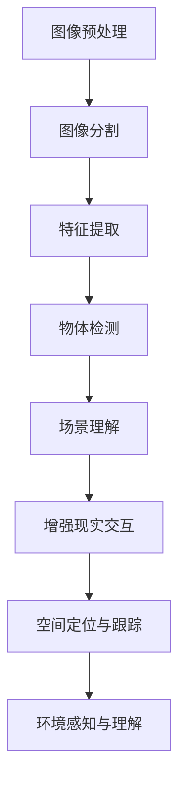
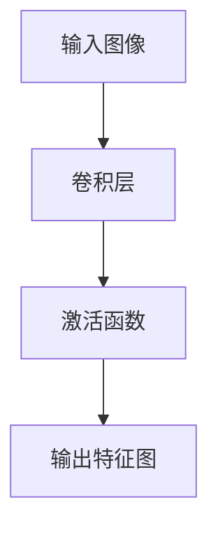
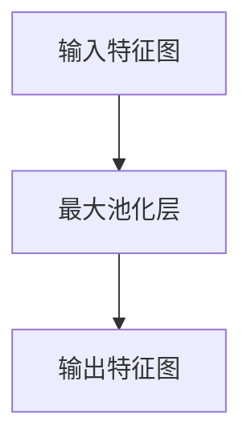
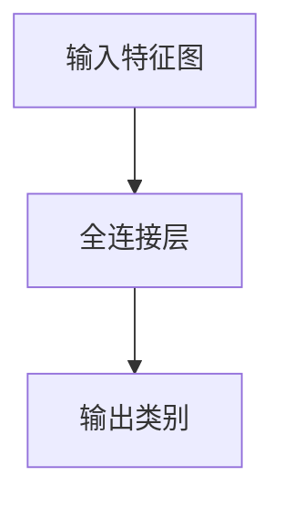
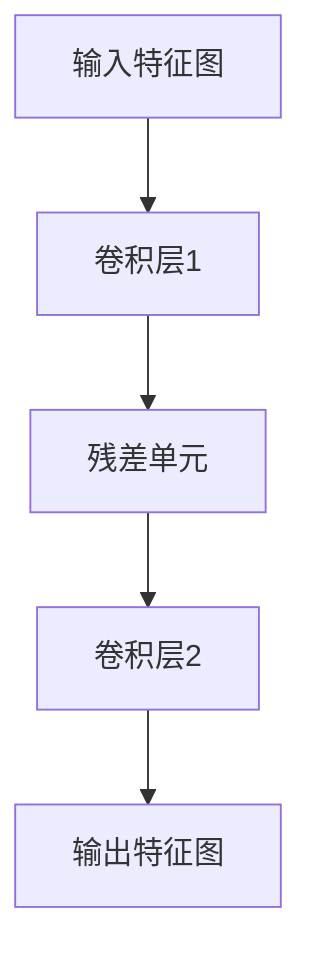
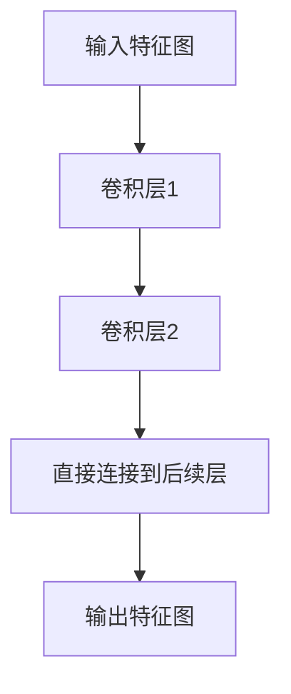
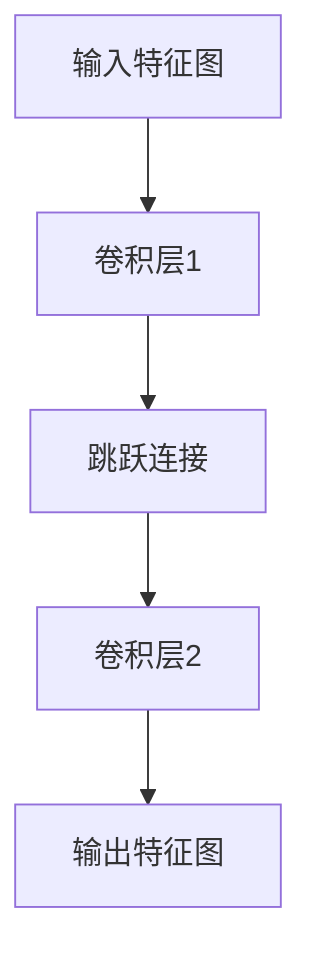
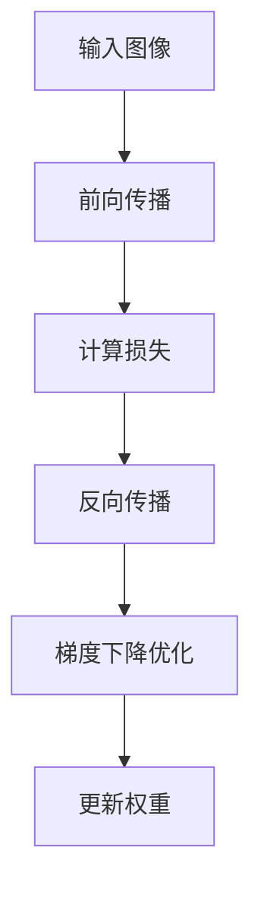
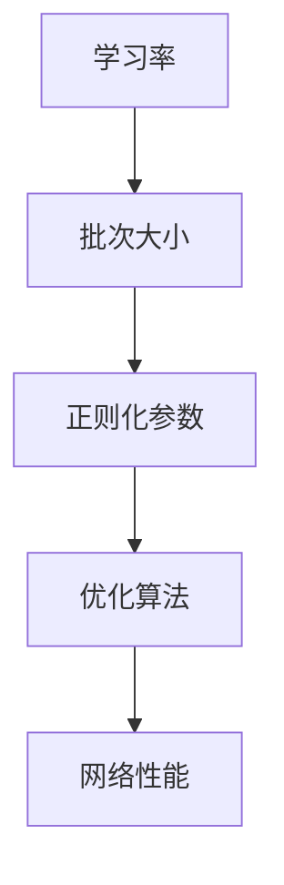

                 

### 第一部分：基础知识

#### 第1章：计算机视觉与增强现实概述

##### 1.1 计算机视觉的基本概念

计算机视觉是指让计算机模拟人类的视觉感知能力，通过图像或视频数据进行分析和处理，从中提取出有用的信息和知识。计算机视觉是一门综合性的技术，涉及多个学科，包括数学、计算机科学、物理学、心理学和认知科学等。

###### 1.1.1 图像处理与计算机视觉的区别

图像处理是计算机视觉的一个重要分支，它主要关注于图像的预处理、增强、滤波、分割、特征提取和图像压缩等方面。图像处理的目标是改善图像的质量，使其更适合后续的计算机视觉任务。

相比之下，计算机视觉的目标更加宏观，它不仅涉及图像的处理，还包括理解图像的内容，识别物体、场景和动作，以及进行视觉推理等。

###### 1.1.2 计算机视觉的关键技术

计算机视觉的关键技术包括：

1. **图像预处理**：包括图像的缩放、旋转、裁剪、滤波等，以去除噪声和提高图像质量。
2. **图像分割**：将图像分割成多个区域，以便更好地分析和理解图像内容。
3. **特征提取**：从图像中提取出具有鉴别性的特征，如颜色、纹理、形状等，用于后续的物体识别和分类。
4. **物体检测**：定位图像中的物体，并确定它们的位置、大小和形状。
5. **场景理解**：对整个场景进行语义理解，包括场景分类、场景布局分析等。

##### 1.2 增强现实的定义与特点

增强现实（Augmented Reality，简称AR）是一种通过计算机技术将虚拟信息与现实世界进行叠加的技术。AR系统通过摄像头捕捉现实世界的图像，然后利用计算机图形技术将虚拟信息叠加到这些图像上，使得用户可以看到一个虚实结合的世界。

###### 1.2.1 增强现实的发展历程

增强现实技术最早可以追溯到20世纪60年代。最初的AR系统主要用于军事和科研领域。随着计算机技术和显示技术的不断发展，AR技术在21世纪初逐渐走向民用，并开始应用于教育、医疗、娱乐等领域。

###### 1.2.2 增强现实的核心技术

增强现实的核心技术包括：

1. **图像识别与跟踪**：通过图像识别技术识别现实世界中的物体或场景，并通过跟踪技术维持虚拟信息与现实世界之间的对应关系。
2. **实时渲染**：利用计算机图形技术实时渲染虚拟信息，并使其与真实世界的内容进行融合。
3. **用户交互**：提供自然的人机交互方式，如手势、声音、触摸等，以增强用户体验。

##### 1.3 计算机视觉在增强现实中的应用场景

计算机视觉在增强现实中有广泛的应用场景，包括：

1. **虚拟现实与增强现实的交互**：利用计算机视觉技术实现虚拟现实和增强现实之间的无缝交互。
2. **空间定位与跟踪**：通过计算机视觉技术实现虚拟信息在现实世界中的精确定位和跟踪。
3. **环境感知与理解**：利用计算机视觉技术理解和分析现实世界的环境，为增强现实应用提供更加丰富的内容。

**Mermaid 流程图：**



以上是第一部分的基础知识概述，接下来我们将深入探讨计算机视觉和增强现实的核心技术。在接下来的章节中，我们将逐步分析这些技术的基本概念、原理和应用。

---

## 第二部分：核心技术

### 第2章：深度学习与计算机视觉

深度学习是一种重要的机器学习技术，它通过模拟人脑的神经网络结构来实现对数据的自动学习和特征提取。深度学习在计算机视觉领域取得了显著的成果，成为实现计算机视觉任务的核心技术之一。

#### 2.1 深度学习在计算机视觉中的应用

深度学习在计算机视觉中的应用非常广泛，涵盖了图像分类、物体检测、图像分割、图像增强等多个方面。

##### 2.1.1 卷积神经网络（CNN）基础

卷积神经网络（Convolutional Neural Network，简称CNN）是一种专门用于处理图像数据的深度学习模型。它通过卷积层、池化层和全连接层的组合，实现对图像的自动特征提取和分类。

###### 2.1.1.1 卷积层

卷积层是CNN的核心部分，它通过卷积运算从输入图像中提取局部特征。卷积运算的基本思想是，将一个小的局部感受野（kernel）在图像上滑动，计算感受野内像素的加权和，并通过激活函数（如ReLU函数）进行非线性变换。



###### 2.1.1.2 池化层

池化层用于减小特征图的尺寸，减少模型的参数数量，并提高模型的泛化能力。常用的池化操作包括最大池化和平均池化，它们通过在特征图上的滑动窗口计算局部最大值或平均值来生成新的特征图。



###### 2.1.1.3 全连接层

全连接层将前一层特征图中的所有元素映射到输出类别，实现对图像的最终分类。全连接层的权重和偏置通过反向传播算法进行优化，以最小化损失函数。



##### 2.1.2 卷积神经网络的变种

为了解决不同类型的计算机视觉任务，研究人员提出了许多卷积神经网络的变种，如残差网络（ResNet）、密集连接网络（DenseNet）、跳跃连接网络（SkipNet）等。

###### 2.1.2.1 残差网络（ResNet）

残差网络通过引入残差单元，解决了深层网络中的梯度消失问题。残差单元通过跳过部分网络的直接连接，使得梯度可以更好地传播到网络的前端。



###### 2.1.2.2 密集连接网络（DenseNet）

密集连接网络通过在每个卷积层之后增加一个直接连接到后续所有层的连接，实现了信息的跨层传递。这种跨层连接机制提高了模型的训练效率和性能。



###### 2.1.2.3 跳跃连接网络（SkipNet）

跳跃连接网络通过在卷积层之间引入跳跃连接，使得高层特征可以直接传递到低层特征，从而提高了特征提取的效果。



##### 2.1.3 卷积神经网络的训练与优化

卷积神经网络的训练过程涉及前向传播、反向传播和梯度下降优化算法。前向传播用于计算网络的输出，反向传播用于计算梯度，并利用梯度下降优化算法更新网络的权重和偏置。



##### 2.1.4 卷积神经网络的优化算法与超参数调优

卷积神经网络的优化过程涉及多个超参数，如学习率、批次大小、正则化参数等。合理设置这些超参数可以提高网络的训练效率和性能。



在接下来的章节中，我们将继续探讨计算机视觉中的数学模型和深度学习在增强现实中的应用。通过逐步分析这些核心技术，我们将更好地理解计算机视觉在增强现实中的创新应用。

---

## 第三部分：增强现实与计算机视觉的融合应用

### 第3章：增强现实中的计算机视觉应用

增强现实（AR）技术通过将虚拟信息与现实世界相结合，为用户提供了丰富的交互体验。计算机视觉技术在增强现实中的应用至关重要，它不仅能够实现虚拟信息的精确叠加，还能增强用户的交互体验和环境理解能力。

#### 3.1 增强现实中的图像识别与物体检测

图像识别和物体检测是计算机视觉中的基础任务，在增强现实中也发挥着重要作用。

##### 3.1.1 图像识别算法与实现

图像识别是指通过算法从图像中提取具有鉴别性的特征，并将其映射到相应的标签或类别。在增强现实应用中，图像识别技术用于识别现实世界中的特定物体或场景，并将其作为虚拟信息叠加的依据。

###### 3.1.1.1 主流图像识别算法

常见的图像识别算法包括卷积神经网络（CNN）、支持向量机（SVM）和循环神经网络（RNN）等。

1. **卷积神经网络（CNN）**：CNN通过卷积层、池化层和全连接层的组合，实现对图像的自动特征提取和分类。它具有强大的特征提取能力和分类性能，在图像识别任务中广泛应用。

2. **支持向量机（SVM）**：SVM是一种基于统计学习理论的分类算法，通过找到一个最优的超平面，将不同类别的图像分开。SVM在处理高维数据时具有较好的性能，但在图像识别任务中，通常需要与特征提取技术结合使用。

3. **循环神经网络（RNN）**：RNN是一种能够处理序列数据的神经网络，通过递归结构实现对图像序列的分析和理解。RNN在图像识别任务中，可以用于处理视频序列或连续帧的图像识别。

###### 3.1.1.2 图像识别算法的实现

图像识别算法的实现通常包括以下步骤：

1. **数据预处理**：对图像进行缩放、裁剪、翻转等预处理操作，以增加数据的多样性和模型的泛化能力。

2. **特征提取**：使用卷积神经网络、SVM或其他特征提取算法，从图像中提取具有鉴别性的特征。

3. **模型训练**：使用已标记的图像数据集，通过反向传播算法训练图像识别模型，以最小化分类误差。

4. **模型评估**：使用验证数据集对训练好的模型进行评估，评估指标包括准确率、召回率、F1分数等。

##### 3.1.2 物体检测算法与实现

物体检测是指从图像中识别并定位多个物体，并确定它们的位置、大小和形状。在增强现实应用中，物体检测技术用于实现对现实世界中的物体进行跟踪和识别，以便叠加虚拟信息。

###### 3.1.2.1 主流物体检测算法

常见的物体检测算法包括单阶段检测算法和两阶段检测算法。

1. **单阶段检测算法**：单阶段检测算法在单次前向传播中同时完成特征提取和物体定位。常见的单阶段检测算法包括SSD（Single Shot MultiBox Detector）和YOLO（You Only Look Once）等。

2. **两阶段检测算法**：两阶段检测算法分为两个步骤：首先使用区域提议网络（Region Proposal Network，RPN）生成候选区域，然后对候选区域进行分类和定位。常见的两阶段检测算法包括Faster R-CNN、R-FCN和Mask R-CNN等。

###### 3.1.2.2 物体检测算法的实现

物体检测算法的实现通常包括以下步骤：

1. **数据预处理**：对图像进行缩放、裁剪、翻转等预处理操作，以增加数据的多样性和模型的泛化能力。

2. **区域提议**：使用区域提议网络（RPN）或其他方法生成候选区域。

3. **特征提取**：使用卷积神经网络或其他特征提取算法，从候选区域和背景中提取特征。

4. **分类与定位**：对提取的特征进行分类和定位，以识别和定位图像中的物体。

5. **模型训练**：使用已标记的图像数据集，通过反向传播算法训练物体检测模型，以最小化分类误差。

6. **模型评估**：使用验证数据集对训练好的模型进行评估，评估指标包括准确率、召回率、F1分数等。

##### 3.1.3 图像识别与物体检测的应用案例

图像识别与物体检测在增强现实中有广泛的应用，如：

1. **增强现实游戏**：在增强现实游戏中，图像识别和物体检测技术可以用于识别和跟踪游戏中的虚拟角色和道具，实现更加丰富的游戏体验。

2. **增强现实导航**：在增强现实导航应用中，图像识别和物体检测技术可以用于识别地标和路线，为用户提供准确的导航信息。

3. **增强现实交互**：在增强现实交互应用中，图像识别和物体检测技术可以用于识别用户的手势和动作，实现更加自然和直观的交互体验。

在接下来的章节中，我们将继续探讨增强现实中的手势识别与交互、场景重建与追踪等应用。通过逐步分析这些核心技术，我们将更好地理解增强现实与计算机视觉的融合应用，为用户提供更加丰富和自然的交互体验。

---

### 3.2 增强现实中的手势识别与交互

手势识别是增强现实（AR）技术中的一项重要应用，它通过计算机视觉技术捕捉用户的手部动作，并将其转化为虚拟交互指令，实现人与虚拟世界的自然交互。

##### 3.2.1 手势识别算法与实现

手势识别算法主要基于计算机视觉和机器学习技术，通过对视频数据进行分析和处理，识别出用户的手势动作。以下介绍几种常见的手势识别算法：

###### 3.2.1.1 基于机器学习的方法

1. **支持向量机（SVM）**：SVM通过建立一个超平面来分类不同的手势。这种方法需要大量的手势数据和标记，以训练出一个准确的模型。

2. **决策树**：决策树通过一系列规则来识别手势。这种方法简单直观，但可能无法处理复杂的手势。

3. **神经网络**：神经网络，特别是深度学习模型，如卷积神经网络（CNN）和循环神经网络（RNN），可以自动学习手势的特征，从而实现更准确的手势识别。

###### 3.2.1.2 基于模型的方法

1. **骨骼追踪**：使用人体骨骼追踪技术，如OpenPose，可以精确地捕捉用户的手部骨骼点。通过分析这些骨骼点的位置和运动轨迹，可以识别出手势。

2. **模板匹配**：通过将捕捉到的手势与预先定义的手势模板进行匹配，可以识别出手势。这种方法对模板的精确度和数据库的大小有较高要求。

##### 3.2.1.3 手势识别算法的实现步骤

1. **数据收集与预处理**：收集用户的手势数据，并对数据进行预处理，如缩放、裁剪和去噪等。

2. **特征提取**：从预处理后的数据中提取有助于识别手势的特征，如手部轮廓、骨骼点坐标等。

3. **模型训练**：使用提取的特征训练手势识别模型，如SVM、决策树或神经网络。

4. **模型评估与优化**：使用验证数据集评估模型的性能，并进行优化，以提高识别准确率。

##### 3.2.2 增强现实手势交互设计

手势交互设计是增强现实应用中至关重要的一环，它决定了用户能否自然、高效地与虚拟世界进行交互。以下是一些关键设计原则：

1. **直观性**：设计的手势应尽可能直观易懂，用户不需要过多的学习和适应就能掌握。

2. **一致性**：不同手势应具有一致性，避免产生混淆。例如，同一操作应使用相同的手势。

3. **反馈**：在用户执行手势后，应提供即时的视觉或声音反馈，以确认手势已被识别并执行。

4. **灵活性**：设计应考虑到用户的个体差异，如手的大小、动作的快慢等，以适应不同的用户。

5. **安全性**：确保手势交互不会引发安全隐患，如误操作或隐私泄露。

##### 3.2.3 手势识别与交互的应用案例

手势识别在增强现实中的应用非常广泛，以下是一些典型的应用案例：

1. **虚拟现实游戏**：在虚拟现实游戏中，手势识别可以用于控制角色动作、选择道具等，提供更加沉浸式和互动性的体验。

2. **智能家居控制**：在智能家居应用中，用户可以通过手势控制家电设备，如开关灯、调节温度等。

3. **医疗康复**：在医疗康复训练中，手势识别可以用于辅助患者进行康复训练，如手部运动训练、动作识别等。

4. **远程控制**：在远程控制和监控应用中，用户可以通过手势远程控制机器人或无人机，进行实时监控和操作。

通过上述内容，我们可以看到手势识别与交互在增强现实中的应用前景广阔，它不仅提升了用户体验，还为增强现实技术带来了更多的创新和可能性。在接下来的章节中，我们将继续探讨增强现实中的其他重要应用，如场景重建与追踪，以进一步了解计算机视觉技术在增强现实中的融合应用。

---

### 3.3 增强现实中的场景重建与追踪

场景重建与追踪是增强现实（AR）中至关重要的一环，它使得虚拟信息能够准确地叠加到现实世界中，提供更加真实和自然的交互体验。这一部分将详细介绍场景重建和追踪的算法原理及其实际应用。

#### 3.3.1 场景重建算法与实现

场景重建是指通过计算机视觉技术从现实场景中提取三维信息，重建出场景的三维模型。以下介绍几种常见的场景重建算法：

##### 3.3.1.1 结构光法

结构光法通过投影结构光图案到场景上，利用图像中的结构光条纹恢复场景的深度信息。常见的结构光图案包括格雷码、圆点图案等。实现步骤如下：

1. **投影**：使用投影设备（如激光投影仪）将结构光图案投影到场景上。
2. **采集**：使用相机采集带有结构光图案的场景图像。
3. **配准**：将采集到的多幅图像进行配准，以消除图像间的视差。
4. **深度恢复**：利用结构光条纹的相位或频率变化，恢复场景的深度信息。
5. **建模**：使用三角测量法或其他方法，将深度信息转化为三维模型。

**伪代码：**

```python
def reconstruct_scene(projections, images):
    registered_images = register_images(images)
    depth_maps = []
    for image in registered_images:
        depth_map = recover_depth(image, projection)
        depth_maps.append(depth_map)
    points = triangulate_points(depth_maps)
    model = create_3d_model(points)
    return model
```

##### 3.3.1.2 多视图立体法

多视图立体法通过从多个视角捕捉场景图像，利用视差和立体匹配算法重建场景的三维模型。实现步骤如下：

1. **采集**：使用多个相机从不同视角捕捉场景图像。
2. **预处理**：对图像进行去噪、去畸变和归一化等预处理。
3. **视差计算**：利用视差算法计算不同视角图像之间的视差图。
4. **深度估计**：利用视差图和相机参数估计场景的深度信息。
5. **建模**：使用三角测量法或其他方法，将深度信息转化为三维模型。

**伪代码：**

```python
def reconstruct_scene(images, camera_params):
    preprocessed_images = preprocess_images(images)
    disparity_maps = calculate_disparity(preprocessed_images)
    depth_maps = estimate_depth(disparity_maps, camera_params)
    points = triangulate_points(depth_maps)
    model = create_3d_model(points)
    return model
```

##### 3.3.1.3 点云法

点云法通过从图像中提取特征点，构建场景的点云模型。实现步骤如下：

1. **特征提取**：使用特征检测算法（如SIFT、SURF）提取图像的特征点。
2. **匹配**：利用特征点匹配算法（如FLANN）匹配不同视角的特征点。
3. **三角化**：使用三角测量法计算特征点的三维坐标。
4. **优化**：使用优化算法（如ICP）对点云进行优化，以提高重建精度。
5. **建模**：将点云转化为三维模型。

**伪代码：**

```python
def reconstruct_scene(images, camera_params):
    keypoints = extract_keypoints(images)
    matches = match_keypoints(keypoints)
    points = triangulate_points(matches, camera_params)
    optimized_points = optimize_points(points)
    model = create_3d_model(optimized_points)
    return model
```

#### 3.3.2 追踪算法与实现

追踪是指在增强现实应用中，持续跟踪和定位虚拟信息在现实世界中的位置和姿态。以下介绍几种常见的追踪算法：

##### 3.3.2.1 基于视觉特征的方法

基于视觉特征的方法通过实时提取图像中的视觉特征，并利用特征匹配算法进行追踪。实现步骤如下：

1. **特征提取**：实时提取图像中的视觉特征，如SIFT、SURF等。
2. **特征匹配**：使用特征匹配算法（如FLANN）匹配当前帧和前一帧的特征点。
3. **运动估计**：利用匹配的特征点计算运动向量，估计虚拟信息的位置和姿态。
4. **更新状态**：根据运动估计结果更新虚拟信息的跟踪状态。

**伪代码：**

```python
def track_object(frame, previous_frame, feature_extractor, matcher):
    current_features = feature_extractor(frame)
    matched_features = matcher(current_features, previous_features)
    motion_vector = estimate_motion(matched_features)
    updated_state = update_state(previous_state, motion_vector)
    return updated_state
```

##### 3.3.2.2 基于标记物的方法

基于标记物的方法通过在现实世界中放置特定的标记物，利用标记物识别和追踪算法进行追踪。实现步骤如下：

1. **标记物识别**：使用相机捕获标记物图像，并利用标记物识别算法（如条码识别、AR标签识别）识别标记物。
2. **位置与姿态估计**：利用标记物的位置和方向信息，计算虚拟信息的位置和姿态。
3. **更新状态**：根据估计的位置和姿态更新虚拟信息的跟踪状态。

**伪代码：**

```python
def track_object(frame, marker_recognizer, pose_estimator):
    markers = marker_recognizer(frame)
    pose = pose_estimator(markers)
    updated_state = update_state(previous_state, pose)
    return updated_state
```

##### 3.3.2.3 基于SLAM的方法

基于SLAM（Simultaneous Localization and Mapping）的方法在追踪的同时进行场景重建，通过融合视觉信息和其他传感器数据，实现实时定位和场景建模。实现步骤如下：

1. **特征提取与匹配**：实时提取图像中的视觉特征，并利用特征匹配算法匹配当前帧和前一帧的特征点。
2. **地图构建**：利用匹配的特征点构建场景地图。
3. **定位与姿态估计**：使用地图和特征匹配结果，计算虚拟信息的位置和姿态。
4. **地图更新**：根据新的定位结果更新场景地图。

**伪代码：**

```python
def track_object(frame, previous_frame, feature_extractor, matcher, mapper):
    current_features = feature_extractor(frame)
    matched_features = matcher(current_features, previous_features)
    map = mapper(matched_features)
    pose = estimate_motion(map)
    updated_state = update_state(previous_state, pose)
    map = mapper.update_map(map, updated_state)
    return updated_state, map
```

#### 3.3.3 场景重建与追踪的应用案例

场景重建与追踪在增强现实中有广泛的应用，以下是一些典型的应用案例：

1. **增强现实游戏**：在增强现实游戏中，场景重建与追踪技术可以用于创建虚拟角色和场景，并实时跟踪用户的位置和动作，提供沉浸式的游戏体验。

2. **增强现实导航**：在增强现实导航应用中，场景重建与追踪技术可以用于识别和跟踪地标，提供准确的导航信息。

3. **增强现实教育**：在增强现实教育应用中，场景重建与追踪技术可以用于创建虚拟模型和场景，帮助学生更好地理解和掌握知识。

4. **增强现实交互**：在增强现实交互应用中，场景重建与追踪技术可以用于识别用户的手势和动作，提供自然和直观的交互方式。

通过上述内容，我们可以看到场景重建与追踪技术在增强现实中的应用前景广阔。在接下来的章节中，我们将继续探讨计算机视觉在增强现实中的其他创新应用，为用户提供更加丰富和自然的交互体验。

---

## 第四部分：实战项目

### 第4章：计算机视觉在增强现实中的创新应用项目实战

在第四部分，我们将通过两个具体的实战项目，深入探讨计算机视觉在增强现实（AR）中的实际应用。这两个项目分别是基于深度学习的增强现实游戏开发和基于计算机视觉的增强现实导航系统。

### 4.1 项目一：基于深度学习的增强现实游戏开发

#### 4.1.1 游戏需求分析

在开发一款基于深度学习的增强现实游戏时，我们需要明确游戏的核心玩法和功能需求。以下是一个典型游戏需求分析：

- **目标用户**：儿童和青少年
- **核心玩法**：用户通过AR眼镜或手机摄像头，在现实世界中捕捉并击败虚拟怪兽
- **功能需求**：
  - 实时识别并跟踪用户在现实世界中的位置和动作
  - 生成和渲染虚拟怪兽，并使其在现实世界中移动和攻击
  - 实现用户与虚拟怪兽的交互，如击打、跳跃等动作
  - 记录游戏成绩和用户进度，提供排行榜功能

#### 4.1.2 游戏开发环境搭建

为了实现上述功能，我们需要搭建一个合适的游戏开发环境。以下是一个典型的环境搭建步骤：

- **操作系统**：Windows 10 或 macOS
- **开发语言**：Python
- **深度学习框架**：TensorFlow 或 PyTorch
- **增强现实框架**：ARKit（iOS）或 ARCore（Android）
- **游戏引擎**：Unity 或 Unreal Engine

**环境搭建步骤：**

1. 安装操作系统和开发语言
2. 安装深度学习框架和增强现实框架
3. 安装游戏引擎，并配置相关插件
4. 创建一个新的游戏项目，并设置项目环境

#### 4.1.3 深度学习模型设计与实现

在游戏开发中，深度学习模型主要用于实现实时识别和跟踪用户的位置和动作。以下是一个典型的模型设计与实现步骤：

- **输入数据**：摄像头捕获的实时视频流
- **输出数据**：用户位置和动作的坐标

**模型设计步骤：**

1. **数据预处理**：对视频流进行缩放、裁剪和归一化处理，使其符合模型的输入要求。
2. **特征提取**：使用卷积神经网络（CNN）提取视频流中的特征。
3. **动作识别**：使用循环神经网络（RNN）或长短期记忆网络（LSTM）对提取的特征进行分类，以识别用户的动作。
4. **位置跟踪**：使用运动估计算法，如卡尔曼滤波或粒子滤波，对用户的位置进行实时跟踪。

**伪代码：**

```python
import tensorflow as tf
import cv2

# 数据预处理
def preprocess_video(frame):
    resized_frame = cv2.resize(frame, (224, 224))
    normalized_frame = resized_frame / 255.0
    return normalized_frame

# 特征提取
def extract_features(frame):
    model = tf.keras.applications.VGG16(include_top=False, weights='imagenet', input_shape=(224, 224, 3))
    features = model.predict(frame)
    return features

# 动作识别
def recognize_action(features):
    model = tf.keras.Sequential([
        tf.keras.layers.Dense(64, activation='relu'),
        tf.keras.layers.Dense(32, activation='relu'),
        tf.keras.layers.Dense(1, activation='sigmoid')
    ])
    model.compile(optimizer='adam', loss='binary_crossentropy', metrics=['accuracy'])
    action = model.predict(features)
    return action

# 位置跟踪
def track_position(action):
    # 使用卡尔曼滤波或其他运动估计算法
    position = estimate_position(action)
    return position

# 主函数
def main():
    cap = cv2.VideoCapture(0)
    while True:
        ret, frame = cap.read()
        if not ret:
            break
        preprocessed_frame = preprocess_video(frame)
        features = extract_features(preprocessed_frame)
        action = recognize_action(features)
        position = track_position(action)
        # 更新虚拟怪兽的位置和动作
        # ...
    cap.release()

if __name__ == "__main__":
    main()
```

#### 4.1.4 游戏开发与测试

在完成深度学习模型的设计与实现后，我们需要将其集成到游戏引擎中，并编写游戏逻辑代码。以下是一个典型的游戏开发与测试步骤：

1. **集成深度学习模型**：将深度学习模型与游戏引擎进行集成，实现实时动作识别和位置跟踪。
2. **编写游戏逻辑**：编写游戏的主要逻辑代码，包括用户与虚拟怪兽的交互、游戏规则的实现等。
3. **测试与调试**：进行功能测试和性能测试，修复发现的错误和缺陷。
4. **优化**：对游戏进行优化，提高用户体验和性能。

通过上述步骤，我们可以开发出一款基于深度学习的增强现实游戏，为用户提供丰富的游戏体验。

---

### 4.2 项目二：基于计算机视觉的增强现实导航系统

#### 4.2.1 导航系统需求分析

在开发一款基于计算机视觉的增强现实导航系统时，我们需要明确系统的核心功能和性能需求。以下是一个典型需求分析：

- **目标用户**：行人和驾驶员
- **核心功能**：
  - **定位与导航**：实时获取用户的位置，并提供路径规划和导航信息
  - **地标识别**：识别并标记重要的地标和道路信息
  - **语音交互**：提供语音导航和语音识别功能，实现人与导航系统的自然交互
  - **个性化推荐**：根据用户的历史轨迹和偏好，提供个性化的导航建议
- **性能需求**：
  - **实时性**：在低延迟条件下提供准确的定位和导航信息
  - **准确性**：高精度地识别地标和道路信息
  - **鲁棒性**：在复杂环境中，如光线不足或遮挡严重时，仍能保持良好的性能

#### 4.2.2 导航系统开发环境搭建

为了实现上述功能，我们需要搭建一个合适的开发环境。以下是一个典型的环境搭建步骤：

- **操作系统**：Windows 10 或 macOS
- **编程语言**：C++ 或 Python
- **计算机视觉库**：OpenCV 或 TensorFlow
- **增强现实框架**：ARKit（iOS）或 ARCore（Android）
- **导航引擎**：使用现有的开源导航引擎，如OpenRouteService或Google Maps API

**环境搭建步骤：**

1. 安装操作系统和编程语言
2. 安装计算机视觉库和增强现实框架
3. 配置导航引擎，并集成到开发环境中
4. 创建一个新的导航项目，并设置项目环境

#### 4.2.3 计算机视觉算法设计与实现

在导航系统中，计算机视觉算法主要用于实现地标识别和实时定位。以下是一个典型的算法设计与实现步骤：

- **输入数据**：摄像头捕获的实时视频流
- **输出数据**：地标识别结果和用户位置坐标

**算法设计步骤：**

1. **图像预处理**：对视频流进行去噪、增强和缩放处理，以提高图像质量和识别准确性。
2. **特征提取**：使用卷积神经网络（CNN）提取视频流中的特征。
3. **地标识别**：使用卷积神经网络（CNN）或支持向量机（SVM）进行地标识别。
4. **位置跟踪**：使用粒子滤波或其他跟踪算法，结合地标识别结果，实现用户位置的实时跟踪。

**伪代码：**

```python
import cv2
import numpy as np

# 图像预处理
def preprocess_image(image):
    blurred_image = cv2.GaussianBlur(image, (5, 5), 0)
    resized_image = cv2.resize(blurred_image, (224, 224))
    return resized_image

# 特征提取
def extract_features(image):
    model = cv2.dnn.readNetFromTensorFlow('model.pb')
    blob = cv2.dnn.blobFromImage(image, 1.0, (224, 224), [104, 117, 123], True, False)
    features = model.forward(blob)
    return features

# 地标识别
def recognize_landmark(features):
    model = cv2.dnn.readNetFromTensorFlow('landmark_model.pb')
    detections = model.forward(features)
    landmark = detections[0, 0, 0, 1]
    return landmark

# 位置跟踪
def track_position(landmark):
    # 使用粒子滤波或其他跟踪算法
    position = estimate_position(landmark)
    return position

# 主函数
def main():
    cap = cv2.VideoCapture(0)
    while True:
        ret, frame = cap.read()
        if not ret:
            break
        preprocessed_frame = preprocess_image(frame)
        features = extract_features(preprocessed_frame)
        landmark = recognize_landmark(features)
        position = track_position(landmark)
        # 更新导航信息
        # ...
    cap.release()

if __name__ == "__main__":
    main()
```

#### 4.2.4 导航系统开发与测试

在完成计算机视觉算法的设计与实现后，我们需要将其集成到导航系统中，并编写导航逻辑代码。以下是一个典型的开发与测试步骤：

1. **集成计算机视觉算法**：将计算机视觉算法与导航系统进行集成，实现地标识别和实时定位。
2. **编写导航逻辑**：编写导航的主要逻辑代码，包括路径规划、导航信息显示和语音交互等。
3. **测试与调试**：进行功能测试和性能测试，修复发现的错误和缺陷。
4. **优化**：对导航系统进行优化，提高用户体验和性能。

通过上述步骤，我们可以开发出一款基于计算机视觉的增强现实导航系统，为用户提供实时、准确的导航服务。

---

通过以上两个实战项目，我们可以看到计算机视觉在增强现实中的实际应用和创新潜力。在未来的发展过程中，随着技术的不断进步，计算机视觉在增强现实中的应用将更加广泛和深入，为各行各业带来新的变革和发展机遇。

---

## 第五部分：未来展望与趋势

### 第5章：计算机视觉在增强现实中的未来发展趋势

随着科技的不断进步和计算机视觉技术的日益成熟，计算机视觉在增强现实（AR）中的应用前景愈发广阔。本章节将探讨计算机视觉在AR领域的未来发展趋势，以及可能面临的技术创新与挑战。

#### 5.1 计算机视觉技术在增强现实中的应用前景

计算机视觉技术在AR中的应用有着巨大的潜力，以下是其几个主要的应用前景：

1. **增强现实游戏**：随着深度学习和计算机视觉技术的进步，增强现实游戏将更加沉浸式和互动。未来，我们可以期待更加智能和自适应的游戏体验，如根据玩家的动作和环境动态调整游戏难度和场景。

2. **工业与制造业**：计算机视觉技术将在工业和制造业中发挥重要作用，通过AR技术实现虚拟辅助制造和远程协作。工人在进行复杂操作时，可以通过AR眼镜实时查看操作步骤、技术参数和安全提示，从而提高生产效率和安全性。

3. **医疗与健康**：计算机视觉技术可以用于医疗诊断和辅助手术。通过AR技术，医生可以在患者身上叠加医学影像和手术指导，实现更加精准和高效的医疗服务。此外，康复训练和远程医疗也将受益于AR技术的应用。

4. **教育**：增强现实技术可以为教育提供全新的教学方式。学生可以通过AR眼镜探索虚拟实验室、历史场景和科学现象，实现更加生动和直观的学习体验。

5. **市场营销与广告**：随着消费者对个性化体验的需求增加，增强现实广告将成为一种重要的营销手段。品牌可以通过AR技术创造出互动性强、体验感好的广告内容，吸引消费者的注意。

#### 5.2 未来技术创新与挑战

尽管计算机视觉在AR领域有着广泛的应用前景，但未来的发展仍然面临诸多技术创新和挑战。

1. **光场显示技术**：光场显示技术是一种能够再现真实光线传播和感知效果的技术，它有望大幅提升AR设备的显示效果。然而，光场显示技术的高成本和复杂性是目前面临的主要挑战。

2. **全息技术**：全息技术可以创建三维图像，使得虚拟信息与现实世界的交互更加直观和自然。全息技术的研究和应用将极大地推动AR技术的发展。然而，全息显示设备的成本和体积仍是需要解决的问题。

3. **虚拟与现实的深度融合**：未来的AR技术将致力于实现虚拟信息与现实世界的无缝融合。这需要解决视觉感知、交互体验、数据处理和实时计算等多方面的技术挑战。

4. **计算资源与功耗**：随着AR应用场景的多样化，对计算资源和功耗的要求越来越高。开发更加高效和节能的处理器和计算架构，将有助于提升AR设备的性能和用户体验。

5. **隐私与安全**：AR应用涉及到大量的用户数据和个人隐私，如何确保数据安全和用户隐私是一个重要的问题。未来的AR技术需要在数据保护和用户隐私方面做出更多努力。

6. **标准化与互操作性**：不同AR设备和平台之间的标准化和互操作性是推动AR技术普及的关键。通过建立统一的AR技术标准和协议，可以促进不同设备和平台之间的协作和兼容性。

总之，计算机视觉在增强现实中的应用前景广阔，未来的技术创新将不断推动AR技术的发展。然而，要实现虚拟与现实的深度融合，还需要克服诸多技术挑战。随着技术的不断进步，我们可以期待AR技术为各行各业带来更多创新和变革。

---

## 附录 A：资源与工具

### A.1 主流计算机视觉框架

1. **OpenCV**：OpenCV是一个开源的计算机视觉和机器学习软件库，它支持包括图像处理、物体识别、面部识别、运动跟踪等功能。OpenCV具有跨平台的特点，可以在多种操作系统上运行。

2. **TensorFlow**：TensorFlow是由Google开发的开源机器学习框架，它提供了丰富的工具和API，用于构建和训练深度学习模型。TensorFlow广泛应用于图像识别、物体检测和增强现实等场景。

3. **PyTorch**：PyTorch是一个基于Python的深度学习框架，它提供了灵活和动态的计算图，使得模型设计和调试更加便捷。PyTorch在计算机视觉和自然语言处理等领域具有广泛的应用。

### A.2 增强现实开发工具

1. **ARKit**：ARKit是Apple开发的增强现实开发框架，用于iOS和macOS平台。ARKit提供了强大的AR功能，包括环境感知、物体识别和实时渲染。

2. **ARCore**：ARCore是由Google开发的增强现实开发框架，支持Android和iOS平台。ARCore提供了实时定位、环境映射和3D物体渲染等功能。

3. **Unity**：Unity是一个跨平台的游戏和实时3D内容开发引擎，它支持AR内容的创建和渲染。Unity提供了丰富的AR功能，包括虚拟物体的叠加、用户交互和环境追踪。

4. **Unreal Engine**：Unreal Engine是由Epic Games开发的实时3D游戏引擎，它支持复杂的AR场景的创建和渲染。Unreal Engine提供了强大的视觉效果和物理引擎，适用于高端AR应用。

### A.3 开发者资源与社区

1. **GitHub**：GitHub是一个代码托管平台，许多计算机视觉和增强现实项目都在这里开源。开发者可以通过GitHub获取最新的项目代码和技术文档。

2. **Stack Overflow**：Stack Overflow是一个问答社区，开发者可以在这里提问和解答关于计算机视觉和增强现实的技术问题。

3. **Reddit**：Reddit是一个讨论社区，许多开发者在这里分享增强现实相关的资源和讨论。

4. **AR/VR Developers Conference**：这是一个专注于增强现实和虚拟现实开发的国际会议，汇聚了行业专家和开发者，分享最新的技术和应用案例。

### A.4 未来研究方向与趋势预测

1. **智能增强现实**：未来的AR技术将更加智能，能够理解用户的意图和行为，提供个性化的交互体验。

2. **融合现实**：随着光场显示和全息技术的发展，虚拟信息和现实世界的边界将变得更加模糊，实现更加真实的融合现实体验。

3. **边缘计算与云计算**：结合边缘计算和云计算的AR应用将提供更低的延迟和更高的计算能力，为复杂的AR应用提供支持。

4. **隐私保护与安全**：随着AR应用的普及，隐私保护和数据安全将变得越来越重要。未来的技术将致力于提供更加安全可靠的AR解决方案。

5. **开源生态**：随着开源技术的不断发展，未来将有更多的AR工具和框架开源，为开发者提供更丰富的资源和支持。

通过附录中的资源和工具，开发者可以更好地了解计算机视觉和增强现实的技术发展动态，掌握相关的开发技能，并为未来的创新应用做好准备。

