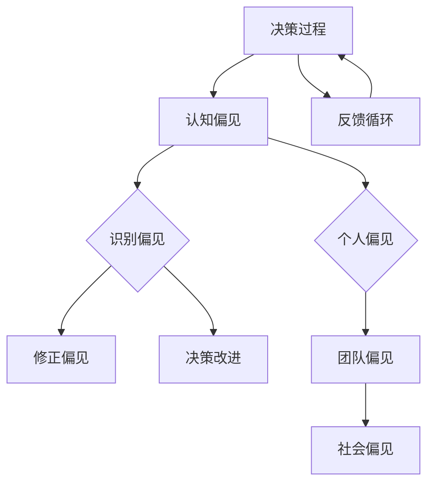

                 

### 文章标题

“认知偏见：如何避免决策陷阱”

### 关键词

- 认知偏见
- 决策陷阱
- 神经科学
- 信息处理
- 决策支持

### 摘要

本文深入探讨了认知偏见的概念、类型、心理学基础及其对决策的广泛影响。通过逻辑清晰的分析和实用的策略，本文旨在帮助读者识别和克服这些偏见，从而提高决策质量。本文还介绍了一些实用的工具和案例，展示了如何在实际工作和生活中应用这些知识。

### 目录大纲

1. **引言**  
    - 认知偏见的重要性  
    - 为什么我们需要关注认知偏见  
    - 本文的目的和结构

2. **第一部分：认知偏见概述**  
    - **第1章：认知偏见的概念与起源**  
        - 认知偏见的基本概念  
        - 认知偏见的起源与发展  
    - **第2章：常见的认知偏见**  
        - **2.1 可见性偏见**  
        - **2.2 抵触新信息的偏见**  
        - **2.3 代表性偏见**  
        - **2.4 自我确认偏见**  
    - **第3章：认知偏见的心理学基础**  
        - **3.1 认知偏见的心理学机制**  
        - **3.2 认知偏见的神经科学基础**

3. **第二部分：认知偏见的影响与避免**  
    - **第4章：认知偏见对决策的影响**  
        - **4.1 认知偏见对个人决策的影响**  
        - **4.2 认知偏见对团队决策的影响**  
    - **第5章：如何识别和避免认知偏见**  
        - **5.1 自我反省与自我监控**  
        - **5.2 信息收集与全面性**  
        - **5.3 独立思考和质疑**  
    - **第6章：提高决策质量的策略**  
        - **6.1 增加决策透明度**  
        - **6.2 使用决策支持工具**  
        - **6.3 加强沟通与协作**  
    - **第7章：认知偏见在教育中的应用**  
        - **7.1 认知偏见在教师教学中的应用**  
        - **7.2 认知偏见在学生自我管理中的应用**  
    - **第8章：认知偏见在工作环境中的应用**  
        - **8.1 认知偏见在团队合作中的应用**  
        - **8.2 认知偏见在项目管理中的应用**

4. **第三部分：认知偏见的社会影响与挑战**  
    - **第9章：认知偏见对社会的影响**  
        - **9.1 认知偏见对社会决策的影响**  
        - **9.2 认知偏见对社会公平的影响**  
    - **第10章：如何应对认知偏见的社会挑战**  
        - **10.1 提高公众认知水平**  
        - **10.2 政策制定与实施**  
        - **10.3 媒体与教育的角色**  
    - **第11章：认知偏见的未来研究趋势**  
        - **11.1 认知偏见研究的新方向**  
        - **11.2 认知偏见的跨学科研究**  
        - **11.3 认知偏见的技术解决方案**

5. **结论**  
    - 认知偏见的总体影响  
    - 我们能做什么来减少认知偏见  
    - 展望未来

6. **附录**  
    - **附录A：认知偏见相关研究文献与资料**  
    - **附录B：认知偏见测量工具与量表**  
    - **附录C：认知偏见案例分析**

### 引言

#### 认知偏见的重要性

在我们的日常生活中，决策无处不在。从选择吃什么早餐、如何安排假期，到更复杂的商业决策、政策制定，决策影响着我们的每一个行动。然而，这些决策并不总是基于理性的分析，往往受到我们的认知偏见的影响。认知偏见是指人们在信息处理和决策过程中，由于大脑的某些机制导致的系统性错误。这些偏见会影响我们对信息的解释、记忆、判断和选择。

认知偏见的重要性在于，它们不仅影响我们的个人决策，还会在更广泛的层面上影响团队协作、组织管理和公共政策。例如，领导者在决策时可能受到过度自信的偏见，导致错误的风险评估；团队成员在评估项目进展时可能受到代表性偏见，导致忽视关键问题。在社会层面上，认知偏见可能加剧社会不平等，导致不公平的政策制定和执行。

#### 为什么我们需要关注认知偏见

我们需要关注认知偏见，因为它们可能对我们的决策产生严重的负面影响。以下是几个原因：

1. **降低决策质量**：认知偏见可能导致我们做出基于不完整或错误信息的选择，从而降低决策的质量。
2. **增加错误决策的风险**：认知偏见可能导致我们忽视重要的信息，或者在决策过程中产生错误的假设，从而增加错误决策的风险。
3. **影响人际关系**：认知偏见可能导致我们对他人的误解和误判，影响团队协作和人际关系。
4. **加剧社会问题**：在公共政策领域，认知偏见可能导致不公平的政策制定和执行，加剧社会不平等和冲突。

#### 本文的目的和结构

本文的目的是深入探讨认知偏见的概念、类型、心理学基础及其对决策的广泛影响。通过逻辑清晰的分析和实用的策略，本文旨在帮助读者识别和克服这些偏见，从而提高决策质量。本文还将介绍一些实用的工具和案例，展示如何在实际工作和生活中应用这些知识。

文章结构如下：

- **第一部分**：认知偏见概述，包括认知偏见的概念与起源、常见的认知偏见及其心理学基础。
- **第二部分**：认知偏见的影响与避免，探讨认知偏见对决策的影响以及如何识别和避免这些偏见。
- **第三部分**：认知偏见的社会影响与挑战，讨论认知偏见对社会决策和社会公平的影响以及如何应对这些挑战。
- **结论**：总结认知偏见的总体影响，并提出减少认知偏见的方法和策略。

通过本文的阅读，读者将能够更好地理解认知偏见的概念，识别其在决策过程中的影响，并学会如何克服这些偏见，从而做出更高质量的决策。

### 第一部分：认知偏见概述

#### 第1章：认知偏见的概念与起源

#### 1.1 认知偏见的基本概念

认知偏见是指人们在信息处理和决策过程中，由于大脑的某些认知机制导致的系统性错误。这些偏见影响我们对信息的解释、记忆、判断和选择，从而可能导致我们做出不理性的决策。认知偏见是由一系列复杂的心理和神经机制所驱动的，这些机制包括直觉、情绪、记忆、注意力等。

认知偏见的一个核心特征是其普遍性。几乎每个人都会在某些情况下受到认知偏见的影响，这是因为这些偏见是大脑为了提高效率和速度而进化出来的。例如，我们在面对复杂或不确定的情况时，大脑会倾向于依赖直觉和简单规则，而不是进行复杂的理性分析。

#### 1.2 认知偏见的起源与发展

认知偏见的历史可以追溯到心理学和认知科学的早期研究。在20世纪初，行为主义心理学占据主导地位，心理学家们主要关注外部行为和刺激-反应模式。然而，随着认知心理学的兴起，研究者们开始关注大脑内部的信息处理过程，并发现了认知偏见的存在。

其中，最具影响力的研究是心理学家Amos Tversky和Daniel Kahneman在1970年代后期的工作。他们提出了许多经典的认知偏见理论，如代表性偏见、可得性偏见和确认偏见，并揭示了这些偏见如何影响我们的决策。Tversky和Kahneman的研究为认知偏见领域奠定了基础，并促进了后续的大量研究。

在过去的几十年里，随着神经科学的进步，研究者们开始从大脑的神经机制角度研究认知偏见。通过功能性磁共振成像（fMRI）和其他脑成像技术，研究者们发现了与认知偏见相关的特定脑区活动。例如，前额叶皮质和杏仁核在处理信息时可能会受到认知偏见的影响。

#### 1.3 认知偏见的主要类型

认知偏见有很多类型，每种偏见都有其特定的机制和影响。以下是几种常见的认知偏见：

1. **代表性偏见**：指人们根据信息的外观或典型性来评估其概率。例如，人们可能会高估罕见事件的发生概率，如中彩票的概率。

2. **可得性偏见**：指人们根据最近或最容易回忆的信息来评估事件的可能性。例如，新闻报道的频繁会导致人们高估某些事件的发生率。

3. **确认偏见**：指人们倾向于寻找和接受那些符合自己已有信念和假设的信息，而忽视与之相矛盾的信息。

4. **自我确认偏见**：指人们通过寻找和解释信息来支持自己的信念和假设，即使这些信息可能是错误的。

5. **锚定效应**：指人们在做决策时，会受到最初提供的信息（锚点）的影响，即使这些信息与问题无关。

6. **确认偏见**：指人们倾向于寻求和接受那些符合自己已有信念和假设的信息，而忽视与之相矛盾的信息。

通过理解这些认知偏见，我们可以更好地识别和避免它们在我们决策过程中的影响。接下来，我们将详细探讨这些偏见的具体机制和影响。

#### 第2章：常见的认知偏见

认知偏见在日常生活中无处不在，它们往往无意识地影响我们的决策过程。了解这些常见的认知偏见有助于我们更好地识别它们，从而减少其在决策中的负面影响。以下将介绍几种主要的认知偏见，包括它们的定义、机制及其影响。

##### 2.1 可见性偏见

可见性偏见是指人们倾向于重视那些易于观察到或记忆的信息，而忽视其他重要的信息。这种偏见可能导致我们高估某些因素的重要性，而低估其他因素的影响。

**定义**：可见性偏见是指人们在评估某个事件或问题时，过分关注那些容易观察到或记忆的信息，而忽视了其他可能同样重要但不太明显的因素。

**机制**：这种偏见源于人类大脑的信息处理机制，我们的大脑在处理信息时倾向于优先处理那些容易获取的信息。例如，当我们面临一个复杂的问题时，我们可能会关注那些显而易见的证据，而忽略那些隐藏的或需要进一步调查的信息。

**影响**：可见性偏见可能导致我们在决策时做出不全面或错误的判断。例如，在招聘过程中，如果面试官过于关注应聘者的外表和初步表现，而忽略他们的实际能力和背景，可能会导致不合适的招聘决策。

**案例**：在项目管理中，项目经理可能会因为项目进度表上的进展而忽视潜在的风险和问题，从而做出过于乐观的预测。

##### 2.2 抵触新信息的偏见

抵触新信息的偏见是指人们在面对新信息时，倾向于拒绝或忽视这些信息，即使这些信息与他们的已有信念或假设不一致。

**定义**：抵触新信息的偏见是指人们在接收到与自己的已有信念或假设不一致的新信息时，倾向于拒绝或忽视这些信息，而不是对其进行理性的评估。

**机制**：这种偏见可能源于人类的认知失调理论，即当我们的信念或假设受到挑战时，我们可能会感到不舒服或焦虑，因此会倾向于维护现有的信念，避免认知失调。

**影响**：抵触新信息的偏见可能导致我们无法更新或修正我们的信念和假设，从而做出基于过时或错误信息的决策。例如，投资者可能会因为抵触新信息而错过市场的变化，导致投资决策失误。

**案例**：在一个团队项目中，团队成员可能会因为抵触新信息而拒绝接受新的方法或建议，从而阻碍项目的进展。

##### 2.3 代表性偏见

代表性偏见是指人们在评估某个事件的概率或重要性时，根据其与已有类别或典型例子的相似性来做出判断。

**定义**：代表性偏见是指人们在评估某个事件的概率或重要性时，倾向于根据其与已有类别或典型例子的相似性来做出判断，而忽视其概率或实际重要性。

**机制**：这种偏见源于人类大脑的快速分类和模式识别能力。当我们面对一个新情况时，我们的大脑会试图将其归类到已有的类别中，并基于该类别的典型特征来做出判断。

**影响**：代表性偏见可能导致我们高估或低估某些事件的发生概率。例如，在评估一个新产品的市场潜力时，如果该产品与市场上已有的成功产品非常相似，我们可能会高估其成功概率。

**案例**：在股票市场中，投资者可能会因为一个公司的业绩报告看起来与过去的成功案例相似，而过度乐观地估计该公司的未来表现。

##### 2.4 自我确认偏见

自我确认偏见是指人们在收集和处理信息时，倾向于选择那些支持自己已有信念的信息，而忽视与之相反的证据。

**定义**：自我确认偏见是指人们在收集和处理信息时，倾向于选择那些支持自己已有信念的信息，而忽视与之相反的证据，从而加强自己的信念。

**机制**：这种偏见源于人类大脑的自我保护机制，我们的大脑会自动寻求一致性和自我肯定，以维持自我认同和自我效能感。

**影响**：自我确认偏见可能导致我们过度自信，忽视风险，甚至陷入认知失调。例如，在投资决策中，投资者可能会因为自我确认偏见而忽略市场变化，坚持原有的投资策略。

**案例**：在一个产品开发团队中，如果团队成员过度自信于自己的产品设计，他们可能会忽视用户反馈和市场需求，从而导致产品失败。

##### 总结

通过了解这些常见的认知偏见，我们可以更好地识别它们在我们决策过程中的影响，并采取相应的措施来减少其负面影响。在接下来的章节中，我们将深入探讨认知偏见的心理学基础，以及如何通过科学的策略来识别和避免这些偏见。

#### 第3章：认知偏见的心理学基础

认知偏见不仅仅是一个理论概念，它们有着深厚的心理学基础。通过理解这些心理学机制，我们可以更深入地了解认知偏见是如何形成的，以及如何有效地应对它们。

##### 3.1 认知偏见的心理学机制

认知偏见是由一系列复杂的心理过程和机制所驱动的。以下是几个关键的心理学机制：

1. **启发式与规则**：人们在信息处理过程中，通常会使用启发式（heuristics）和简单规则来快速做出决策。这些启发式和规则虽然可以提高决策效率，但往往会导致系统性错误。例如，代表性启发式使人们根据信息的典型性来评估其概率，这可能导致代表性偏见。

2. **情绪影响**：情绪在决策过程中起着重要作用。情绪不仅会影响我们对信息的解释和记忆，还会影响我们的决策偏好。例如，当我们感到焦虑或愤怒时，我们可能会过度依赖直觉和情绪反应，从而做出不理性的决策。

3. **认知失调**：当我们的行为或信念与我们的自我形象不一致时，会产生认知失调。为了减少这种不舒服的感觉，我们可能会通过确认偏见来寻找支持已有信念的信息，或通过自我确认偏见来加强自己的信念。

4. **注意力偏差**：人类的注意力是有限的，我们往往会关注某些特定的信息，而忽视其他信息。这种注意力偏差可能导致可得性偏见，即我们根据最近或容易获取的信息来评估事件的可能性。

5. **记忆偏差**：人们的记忆并不总是准确的，我们可能会遗忘或错误地回忆某些信息。这种记忆偏差可能导致回忆偏差，即我们根据记忆中的信息来评估事件的可能性。

##### 3.2 认知偏见的神经科学基础

除了心理学机制，认知偏见也有着神经科学基础。通过神经科学的研究，我们可以了解大脑中的哪些区域和过程与认知偏见相关。

1. **前额叶皮质**：前额叶皮质是大脑中与决策和理性思考密切相关的一部分。研究表明，前额叶皮质在抑制认知偏见方面起着关键作用。例如，当人们面对高风险的决策时，前额叶皮质的激活程度与认知偏见程度呈负相关。

2. **杏仁核**：杏仁核是大脑中与情绪处理密切相关的区域。研究表明，杏仁核对认知偏见有显著影响。例如，杏仁核的激活程度与代表性偏见和情绪化决策呈正相关。

3. **脑成像技术**：通过功能性磁共振成像（fMRI）等技术，研究者们可以观察大脑在不同认知任务中的活动。研究表明，当人们面临决策挑战时，与认知偏见相关的脑区活动会增加。例如，当人们面临代表性偏见时，颞叶和顶叶的某些区域会表现出更高的活动水平。

##### 3.3 认知偏见的影响和应对策略

认知偏见对决策有显著影响，可能导致决策错误、风险增加和效率降低。为了减少认知偏见的影响，我们可以采取以下策略：

1. **增加透明度和公开性**：提高决策过程的透明度，使所有相关信息都能够被合理地考虑。这有助于减少信息偏差和代表性偏见。

2. **多元化信息来源**：避免单一信息来源的依赖，通过多元化信息来源来减少可得性偏见和抵触新信息的偏见。

3. **使用决策支持工具**：利用计算机模型和其他工具来辅助决策，这可以帮助我们更好地处理复杂信息，减少认知负担。

4. **加强沟通与协作**：在团队决策中，加强沟通与协作可以减少自我确认偏见和认知失调。团队成员之间的反馈和讨论有助于识别和纠正认知偏见。

5. **定期自我反思**：通过定期自我反思和自我监控，我们可以识别和纠正自己的认知偏见。这有助于提高我们的自我意识和决策质量。

通过理解认知偏见的心理学和神经科学基础，并采取相应的应对策略，我们可以更好地识别和减少这些偏见，从而做出更理性、更有效的决策。

### 第二部分：认知偏见对决策的影响

#### 第4章：认知偏见对决策的影响

认知偏见对个人和团队决策都有深远的影响，这些影响可以是积极的，也可以是消极的。在本章中，我们将探讨认知偏见如何影响个人和团队决策，并分析其带来的后果。

##### 4.1 认知偏见对个人决策的影响

认知偏见在个人决策中起着重要的作用，它们可以极大地影响决策的质量和结果。以下是一些常见的影响和例子：

1. **降低决策质量**：认知偏见可能导致个人在决策过程中忽略关键信息或做出基于不完整信息的决策。例如，代表性偏见可能使一个人高估某一策略的成功概率，而忽视其他更可靠的选项。

2. **增加风险**：认知偏见可能导致个人做出冒险或过于保守的决策。例如，确认偏见可能导致一个人在股市中持续持有亏损的股票，因为不愿意承认错误。

3. **减少多样性**：认知偏见可能导致个人倾向于重复过去的决策模式，而不是探索新的可能性。这会减少决策的多样性，限制了创新和改进的机会。

4. **过度自信**：认知偏见如自我确认偏见和锚定效应可能导致个人过度自信，低估潜在的风险和不确定性。这种过度自信可能导致错误的决策，例如在投资或项目管理中做出冒险的决定。

**案例**：一位投资者可能因为代表性偏见而高估某一股票的成功潜力，持续投资并最终导致巨大的损失。或者，一个项目经理可能因为锚定效应而坚持最初的时间预算，即使实际情况表明需要更长的周期。

##### 4.2 认知偏见对团队决策的影响

在团队决策中，认知偏见同样具有显著的影响。由于团队成员之间的互动和沟通，认知偏见可以相互加强，导致更严重的决策失误。以下是一些常见的影响和例子：

1. **群体思维**：群体思维是一种认知偏见，它导致团队成员避免冲突和批评，而是倾向于同意共识。这可能导致团队忽视重要的异议和潜在的风险，从而做出基于不完整信息的决策。

2. **认知失调**：在团队决策中，成员可能会为了维护团队的一致性而忽视不一致的信息。这可能导致认知失调，使得团队成员在面对矛盾的信息时感到不舒服，从而选择性地忽略或歪曲这些信息。

3. **信息过滤**：团队成员可能会根据他们的个人偏见来筛选和解释信息，导致团队无法获得全面和客观的信息。这种信息过滤可能加剧认知偏见，使得团队决策更加偏离理性。

4. **责任分散**：在团队决策中，成员可能会将自己的责任分散到整个团队，从而减少他们对决策后果的个人责任感。这种责任分散可能导致团队成员在面对失败时互相推卸责任。

**案例**：一个项目团队在评估新产品的市场潜力时，可能因为群体思维而一致认为新产品将成功，即使有成员提出不同的意见。结果，团队没有充分准备应对潜在的市场挑战，导致新产品失败。

##### 总结

认知偏见对个人和团队决策都有深远的影响。个人决策可能因为偏见而降低质量、增加风险，而团队决策可能因为偏见而导致群体思维、认知失调和信息过滤。为了减少这些偏见的影响，我们需要采取一系列策略，包括提高透明度、鼓励多元化信息来源、使用决策支持工具和加强沟通与协作。通过这些方法，我们可以更好地识别和纠正认知偏见，从而做出更理性、更有效的决策。

#### 第5章：如何识别和避免认知偏见

在了解了认知偏见对决策的广泛影响后，下一步就是学会如何识别和避免这些偏见。在本章中，我们将探讨几种有效的策略，帮助我们在决策过程中识别和避免认知偏见。

##### 5.1 自我反省与自我监控

自我反省和自我监控是识别和避免认知偏见的第一步。通过定期反思我们的决策过程，我们可以意识到哪些偏见可能在其中发挥作用。

1. **定期反思**：定期花时间回顾自己的决策过程，包括决策的动机、所依据的信息、所做的假设等。这可以帮助我们识别出可能存在的认知偏见。

2. **记录决策日志**：记录决策日志是一个有效的自我监控工具。通过详细记录每个决策的背景、信息来源、决策过程和结果，我们可以更清楚地看到自己在决策中可能出现的偏见。

3. **使用认知工具**：使用认知工具，如认知地图、决策树等，可以帮助我们系统地分析和评估决策过程，从而更容易发现认知偏见。

##### 5.2 信息收集与全面性

为了做出高质量的决策，我们需要确保所收集的信息是全面和准确的。以下是一些策略，可以帮助我们做到这一点：

1. **多元化信息来源**：避免依赖单一信息来源，而是从多个渠道收集信息。这有助于减少信息偏差，提高信息的全面性和准确性。

2. **交叉验证信息**：对收集到的信息进行交叉验证，确保其可靠性。可以通过咨询专家、查阅文献、对比不同来源的信息等方式来实现。

3. **使用数据驱动的方法**：依赖数据来支持决策，而不是仅仅依赖直觉或经验。数据可以提供更客观和全面的信息，有助于减少认知偏见。

##### 5.3 独立思考和质疑

独立思考和质疑是识别和避免认知偏见的关键。以下是一些策略，可以帮助我们培养独立思考的能力：

1. **质疑既有信念**：不断质疑我们已有的信念和假设，不要盲目接受。即使这些信念来源于权威或过去的成功，也需要重新审视。

2. **避免群体思维**：在团队决策中，避免追求一致意见，鼓励成员提出不同的观点和质疑。这有助于揭示潜在的偏见和错误。

3. **进行情景分析**：通过情景分析，我们可以设想不同的可能结果，并评估它们对决策的影响。这有助于我们全面考虑各种因素，避免基于单一情景的偏见。

##### 实际应用

以下是一个实际应用案例，展示了如何使用这些策略来识别和避免认知偏见：

**案例：企业新产品开发决策**

- **自我反省与自我监控**：产品经理在每次新产品开发决策前，都会进行自我反思，记录决策日志，分析之前的决策过程，识别可能存在的偏见。
- **信息收集与全面性**：产品经理从多个渠道收集市场调研数据、用户反馈、行业报告等，并进行交叉验证，确保信息的准确性和全面性。
- **独立思考和质疑**：在团队讨论中，产品经理鼓励团队成员提出不同的意见和质疑，进行情景分析，考虑不同市场趋势和用户需求，从而避免基于单一视角的偏见。

通过这些策略，产品经理能够更有效地识别和避免认知偏见，提高新产品开发决策的质量和成功率。

#### 第6章：提高决策质量的策略

在了解了如何识别和避免认知偏见后，接下来就是探讨如何在实际决策过程中提高决策质量。在本章中，我们将讨论几种有效的策略，包括增加决策透明度、使用决策支持工具和加强沟通与协作，以帮助我们做出更高质量、更理性的决策。

##### 6.1 增加决策透明度

决策透明度是指决策过程中的信息清晰、公开和可追溯的程度。增加决策透明度有助于减少信息不对称和认知偏见，从而提高决策质量。

1. **透明度的重要性**：透明度可以确保所有相关方都能获得必要的决策信息，减少信息偏差。此外，透明度有助于建立信任，提高团队成员之间的沟通效率。

2. **策略实施**：
   - **信息共享**：鼓励团队成员分享决策过程中的所有信息，包括数据、分析和假设。这可以通过定期的会议、共享文档和沟通平台来实现。
   - **决策记录**：详细记录决策过程中的每个步骤和讨论，包括决策依据、分析结果和决策结论。这些记录可以作为未来的参考，帮助团队成员了解决策的背景和逻辑。
   - **公开讨论**：在决策过程中，鼓励团队成员公开表达观点和质疑，以确保所有潜在的问题和偏见都能被识别和讨论。

##### 6.2 使用决策支持工具

决策支持工具是辅助决策制定和执行的技术手段，可以帮助我们处理复杂信息，减少认知负担，从而提高决策质量。

1. **工具类型**：
   - **数据分析工具**：如Excel、Tableau等，用于处理和可视化数据，帮助我们发现数据中的趋势和模式。
   - **模拟和建模工具**：如Simul8、AnyLogic等，用于模拟决策场景，评估不同决策方案的结果。
   - **专家系统**：如Decision Lens、Wise greetings等，通过基于规则的推理和专家知识，提供决策建议。

2. **策略实施**：
   - **数据驱动决策**：利用数据分析工具，基于数据制定决策，而不是仅依赖直觉或经验。这有助于减少认知偏见，提高决策的客观性。
   - **情景模拟**：使用模拟和建模工具，模拟不同的决策场景，评估各种方案的可能结果。这有助于识别潜在的风险和机会，从而做出更全面、更理性的决策。
   - **智能决策支持**：利用专家系统，获取基于专家知识的决策建议，特别是在复杂或不确定的决策场景中。

##### 6.3 加强沟通与协作

有效的沟通与协作是提高决策质量的关键。通过加强团队成员之间的沟通与协作，我们可以更全面地考虑问题，识别和纠正认知偏见。

1. **沟通的重要性**：沟通是信息传递和理解的基础。有效的沟通可以确保团队成员对决策过程和目标有共同的理解，减少误解和冲突。

2. **策略实施**：
   - **建立沟通机制**：制定明确的沟通流程和规则，确保信息能够及时、准确地传递给所有相关方。
   - **鼓励反馈和讨论**：在决策过程中，鼓励团队成员提出反馈和质疑，促进观点的碰撞和讨论。这有助于识别和纠正认知偏见。
   - **跨部门协作**：在涉及多个部门的决策中，确保不同部门之间的沟通和协作，避免信息孤岛和决策偏颇。

##### 实际应用

以下是一个实际应用案例，展示了如何使用这些策略来提高决策质量：

**案例：企业市场策略制定**

- **增加决策透明度**：企业定期组织市场策略讨论会议，邀请所有相关部门参与。在会议中，共享市场数据、竞争对手分析等信息，确保所有成员对市场状况有共同的理解。
- **使用决策支持工具**：利用Excel进行市场数据分析，利用Simul8模拟不同市场策略的结果，利用Wise greetings提供基于专家知识的建议。这些工具帮助企业在复杂的市场环境中做出更全面、更理性的决策。
- **加强沟通与协作**：建立跨部门的沟通机制，定期组织跨部门会议，确保各部门之间的信息共享和协作。此外，鼓励团队成员在会议中提出反馈和质疑，促进观点的碰撞和讨论。

通过这些策略，企业能够更有效地识别和纠正认知偏见，提高市场策略的决策质量，从而在激烈的市场竞争中取得优势。

### 第7章：认知偏见在教育中的应用

认知偏见不仅影响个人的决策，还在教育领域发挥着重要作用。教师和学生在教学和学习过程中都可能受到各种认知偏见的影响，这些偏见会直接或间接地影响教学效果和学习成果。本章节将探讨认知偏见在教育中的应用，包括教师教学和学生自我管理中的偏见，以及如何克服这些偏见。

#### 7.1 认知偏见在教师教学中的应用

教师是学生学习的重要引导者，他们的教学方法和决策也会受到认知偏见的影响。以下是一些常见的认知偏见及其对教师教学的影响：

1. **代表性偏见**：教师可能会根据某些学生的代表性特征来评估整个班级的表现，而不是考虑每个学生的独特性。这种偏见可能导致教师对某些学生群体持有不公平的期望，从而影响教学效果。

   **解决方案**：教师应该意识到代表性偏见的潜在影响，并努力确保教学公平。通过个别指导和差异化教学，教师可以更好地适应每个学生的需求，减少代表性偏见的影响。

2. **可得性偏见**：教师在评估学生的成绩时，可能会受到最近发生的事件或学生表现的影响，而忽略长期的学习成果。这种偏见可能导致教师对学生的评价不准确。

   **解决方案**：教师应该使用多种评估方法，如定期测试、作业和课堂参与，以获得更全面、准确的学生表现信息。此外，教师可以通过回顾学生的长期学习记录来减少可得性偏见。

3. **自我确认偏见**：教师可能会选择支持自己已有教学方法的证据，忽视与之相反的证据。这种偏见可能导致教师拒绝尝试新的教学方法或策略。

   **解决方案**：教师应该保持开放心态，愿意接受新的教学方法和策略。通过参与专业发展活动、阅读教学研究文献，教师可以不断更新自己的教学理念和方法。

#### 7.2 认知偏见在学生自我管理中的应用

学生在学习和考试过程中也容易受到各种认知偏见的影响，这些偏见可能会影响他们的学习动机和成绩。以下是一些常见的认知偏见及其影响：

1. **锚定效应**：学生在考试前如果看到一份难度较高的模拟试卷，可能会低估实际考试的难度，从而影响他们的学习努力和考试成绩。

   **解决方案**：学生应该意识到锚定效应的影响，并努力保持对考试难度和难度的理性评估。通过设定实际的目标和计划，学生可以更有效地准备考试。

2. **过度自信**：学生在对自己的知识和能力评估时，可能会过度自信，忽视自己的不足。这种偏见可能导致学生在考试中过于冒险，做出错误的选择。

   **解决方案**：学生应该进行自我反思，了解自己的优势和不足。通过设置挑战性的目标，学生可以更好地评估自己的能力，并采取相应的学习策略。

3. **确认偏见**：学生在收集学习资料时，可能会只关注支持自己观点的信息，忽视反驳的证据。这种偏见可能导致学生对某些概念或理论的理解不全面。

   **解决方案**：学生应该培养批判性思维能力，学会从多个角度分析和评估信息。通过阅读不同来源的资料、参加讨论和辩论，学生可以减少确认偏见的影响。

#### 实际应用案例

以下是一个实际应用案例，展示了如何在学校环境中应用这些策略来减少认知偏见：

**案例：提高学生的学习动机**

某所学校注意到学生在面对困难科目时容易出现学习动机下降的现象。为了解决这个问题，学校采取了一系列措施：

- **教师培训**：学校组织教师参加专业发展活动，帮助他们了解认知偏见及其对教学的影响。教师学习了如何识别和减少认知偏见，并在教学中应用这些策略。
- **个性化教学**：教师根据学生的不同需求和背景，采用差异化教学策略，减少代表性偏见。例如，通过个别指导和小组讨论，教师能够更好地满足学生的个性化需求。
- **学习策略培训**：学校为学生提供学习策略培训，帮助他们识别和克服认知偏见。通过这些培训，学生学会了如何自我监控、设定目标和进行有效的学习反思。

通过这些措施，学校成功提高了学生的学习动机和成绩，减少了认知偏见对教学和学习的影响。

### 第8章：认知偏见在工作环境中的应用

在职业环境中，认知偏见可能会对团队合作和项目管理产生深远的影响。团队成员之间的沟通、协作以及决策过程中，都容易受到各种认知偏见的影响。以下将探讨认知偏见在团队合作和项目管理中的应用，并提出应对策略。

#### 8.1 认知偏见在团队合作中的应用

团队合作中的认知偏见会影响团队的整体表现和决策质量。以下是一些常见的认知偏见及其对团队合作的影响：

1. **群体思维**：群体思维是指团队成员在面对决策时，倾向于保持一致，避免冲突和异议。这种偏见可能导致团队忽视重要的信息或潜在的风险，从而做出不理性的决策。

   **解决方案**：为了减少群体思维，团队应该鼓励成员发表不同的观点，进行开放、诚实的讨论。团队领导应该确保每个成员都有机会表达自己的想法，并尊重不同的意见。此外，定期进行团队反思，评估决策的质量和效果，也是减少群体思维的重要手段。

2. **确认偏见**：团队成员可能会倾向于寻找和接受那些符合自己已有信念和假设的信息，而忽视与之相反的证据。这可能导致团队在决策过程中缺乏全面性和客观性。

   **解决方案**：团队应该建立批判性思维的文化，鼓励成员对信息进行多角度分析和评估。通过引入外部专家、邀请外部评估等方式，团队可以减少确认偏见的影响。

3. **信息过滤**：团队成员可能会根据个人偏见和利益，筛选和解释信息，导致团队无法获得全面和客观的信息。

   **解决方案**：团队应该建立透明的沟通机制，确保信息能够自由流动。通过定期的团队会议、项目更新和反馈机制，团队可以减少信息过滤，提高信息透明度。

#### 8.2 认知偏见在项目管理中的应用

项目管理者在决策过程中也容易受到认知偏见的影响，这些偏见可能会影响项目的进展和成功率。以下是一些常见的认知偏见及其影响：

1. **代表性偏见**：项目经理可能会根据某些项目的标志性特征来评估整个项目的风险和成功率，而忽视其他重要的信息。这种偏见可能导致项目经理对项目的风险评估不准确。

   **解决方案**：项目经理应该采用全面的项目评估方法，包括风险评估、成本效益分析和历史项目数据。通过使用这些工具，项目经理可以更客观地评估项目风险。

2. **锚定效应**：项目经理可能会受到初始信息或假设的影响，而忽视后续的新的证据。这种偏见可能导致项目经理在项目过程中做出不理性的决策。

   **解决方案**：项目经理应该定期重新评估项目的目标和假设，确保决策是基于最新的信息和数据。通过使用动态规划和持续监控，项目经理可以更灵活地调整项目计划。

3. **自我确认偏见**：项目经理可能会选择支持自己已有决策的证据，忽视与之相反的证据。这种偏见可能导致项目经理坚持不合理的项目方向，甚至忽略项目的失败迹象。

   **解决方案**：项目经理应该培养开放和批判性思维，鼓励团队成员提出不同的观点和质疑。通过定期的项目评审和反馈机制，项目经理可以识别和纠正自我确认偏见。

#### 实际应用案例

以下是一个实际应用案例，展示了如何在工作环境中应用这些策略来减少认知偏见：

**案例：提高项目团队的决策质量**

某公司的项目团队在项目规划阶段遇到了决策困难，团队领导意识到认知偏见可能影响了决策的质量。为了解决这个问题，团队采取了一系列措施：

- **团队反思**：在每次项目会议开始时，团队领导都会邀请成员进行反思，讨论之前的决策过程，识别可能存在的认知偏见。
- **多样化信息来源**：团队领导确保项目团队从多个渠道收集信息，包括市场调研、客户反馈和行业报告，以减少信息偏差。
- **外部专家咨询**：团队邀请外部专家参与决策过程，提供独立、客观的建议，减少确认偏见。
- **定期评审**：团队定期进行项目评审，评估决策的效果，并根据最新的信息和反馈调整项目计划。

通过这些措施，项目团队的决策质量显著提高，项目的进展更加顺利，最终成功交付了高质量的项目成果。

### 第三部分：认知偏见的社会影响与挑战

#### 第9章：认知偏见对社会的影响

认知偏见不仅仅影响个人和团队，它们在社会层面上也有深远的影响。社会决策、政策制定和执行过程都容易受到认知偏见的影响，从而可能导致不公平、不合理的决策。以下将探讨认知偏见对社会的影响。

##### 9.1 认知偏见对社会决策的影响

社会决策涉及广泛的领域，从公共政策的制定到社区管理的决策。认知偏见可能会以多种方式影响这些决策：

1. **代表性偏见**：社会决策者可能会根据某些特定群体的代表性特征来做出决策，而忽视其他群体的需求。例如，政策制定者可能会优先考虑城市居民的需求，而忽视农村地区居民的需求。

   **影响**：这种偏见可能导致资源分配的不公平，使得特定群体被边缘化。例如，某些地区的公共基础设施投资不足，影响了当地居民的生活质量。

2. **可得性偏见**：社会决策者可能会受到最近或容易获取的信息的影响，而忽视长期的数据和历史背景。例如，在制定经济政策时，决策者可能会过度依赖短期经济数据，而忽视长期的经济趋势。

   **影响**：这种偏见可能导致政策制定者做出短视的决策，忽视了长期的经济稳定和可持续发展。

3. **群体思维**：在社会决策过程中，决策者可能会为了避免冲突和异议，倾向于保持一致，从而忽视不同观点和意见。这种偏见可能导致社会问题的积累，无法得到有效的解决。

   **影响**：群体思维可能导致社会决策的僵化，使得决策者难以适应快速变化的环境。例如，在应对公共危机时，决策者可能会因群体思维而未能采取及时、有效的措施。

##### 9.2 认知偏见对社会公平的影响

社会公平是社会决策和政策制定的核心目标之一。然而，认知偏见可能会对实现社会公平产生负面影响：

1. **确认偏见**：社会决策者可能会选择支持自己已有观点的证据，忽视反驳的证据。这种偏见可能导致政策制定者坚持不公平的政策，如种族歧视、性别歧视等。

   **影响**：这种偏见可能加剧社会不平等，使得特定群体受到不公平对待。例如，一些社会政策可能倾向于富裕阶层，而忽视贫困阶层的需求。

2. **锚定效应**：社会决策者可能会受到初始信息或假设的影响，而忽视新的证据。这种偏见可能导致政策制定者在某些问题上的决策缺乏灵活性。

   **影响**：这种偏见可能导致政策制定者未能及时调整政策，以适应社会的变化。例如，在应对气候变化时，决策者可能会因锚定效应而未能采取更有效的减排措施。

3. **自我确认偏见**：社会决策者可能会选择支持自己已有决策的证据，忽视与之相反的证据。这种偏见可能导致政策制定者忽视政策的负面影响，甚至坚持失败的政策。

   **影响**：这种偏见可能导致政策失败，使得社会公平的目标无法实现。例如，一些社会政策可能因自我确认偏见而未能解决社会问题，反而加剧了社会不平等。

#### 总结

认知偏见在社会层面上对社会决策和社会公平产生了深远的影响。为了减少这些偏见的影响，我们需要采取一系列措施，包括提高决策透明度、鼓励多元化信息来源、加强批判性思维和建立公正的决策机制。通过这些措施，我们可以更有效地识别和纠正认知偏见，从而促进社会决策的公平和合理。

#### 第10章：如何应对认知偏见的社会挑战

在了解了认知偏见对社会决策和社会公平的广泛影响后，接下来我们需要探讨如何应对这些社会挑战。以下是一些有效的策略，可以帮助我们减少认知偏见的影响，促进更公正和合理的决策。

##### 10.1 提高公众认知水平

提高公众对认知偏见的认识是减少偏见影响的重要一步。通过教育和宣传，我们可以帮助人们更好地了解认知偏见的类型和影响，从而提高他们的决策意识和能力。

1. **教育体系**：在学校和大学中，应将认知偏见的相关知识纳入教育课程。通过案例分析和实际练习，学生可以更深入地理解认知偏见的机制和影响。

2. **公众宣传**：利用媒体和公共平台，宣传认知偏见的重要性。可以通过新闻报道、专题节目、社交媒体等方式，向公众普及认知偏见的知识。

3. **专业培训**：为政策制定者、企业管理者和社区领导提供专业培训，帮助他们了解认知偏见，学会如何识别和避免这些偏见。

##### 10.2 政策制定与实施

政策制定和实施过程中，应采取措施减少认知偏见的影响，确保决策的公平性和合理性。

1. **多元化参与**：在政策制定过程中，应确保多元化参与，包括不同背景、不同观点的参与者。这有助于减少群体思维和代表性偏见，确保决策的全面性和客观性。

2. **数据驱动决策**：在制定政策时，应依赖可靠的数据和分析，而不是仅仅依赖直觉或经验。通过使用科学方法和数据分析工具，可以提高决策的透明度和准确性。

3. **定期评估与反馈**：政策实施后，应定期进行评估和反馈，监测政策的效果和影响。通过收集公众意见和数据分析，可以及时识别和纠正政策中的问题。

##### 10.3 媒体与教育的角色

媒体和教育在减少认知偏见方面发挥着关键作用。通过合理的报道和教育，我们可以提高公众对认知偏见的认识，促进更公正和合理的决策。

1. **媒体责任**：媒体应承担起社会责任，提供客观、准确的报道。在报道社会事件和政策时，应注重多角度分析和事实核查，减少误导和偏见。

2. **教育内容**：教育内容应涵盖认知偏见的相关知识，帮助学生和公众更好地了解这些偏见，学会如何识别和避免它们。

3. **公众参与**：通过提供平台和机会，鼓励公众参与决策过程。例如，通过在线调查、社区讨论和公开听证会，收集公众的意见和建议，促进决策的透明度和公正性。

#### 实际应用案例

以下是一个实际应用案例，展示了如何通过提高公众认知水平和政策制定与实施来减少认知偏见：

**案例：减少种族歧视政策**

某市在制定减少种族歧视的政策时，采取了以下措施：

- **公众认知提升**：通过学校教育和公共宣传活动，提高公众对种族歧视认知偏见的认识。学校开设了相关的课程，公共媒体也进行了专题报道。
- **多元化参与**：在政策制定过程中，市政府邀请不同背景的市民参与讨论，包括少数族裔代表、社区领袖和专家。这确保了决策的全面性和客观性。
- **数据驱动决策**：在制定政策时，市政府依赖种族歧视数据和社会调查结果，进行了详细的分析和评估。这确保了政策的科学性和有效性。
- **定期评估与反馈**：政策实施后，市政府定期进行评估和公众调查，收集反馈信息。通过数据分析，市政府及时识别和纠正政策中的问题。

通过这些措施，该市成功减少了种族歧视，促进了社会的和谐与公平。

#### 第11章：认知偏见的未来研究趋势

认知偏见是一个复杂的领域，随着心理学、神经科学和人工智能的发展，未来对认知偏见的研究将呈现出多种趋势和方向。

##### 11.1 认知偏见研究的新方向

1. **跨学科研究**：未来的认知偏见研究将更加注重跨学科合作，结合心理学、神经科学、社会学、经济学等多学科的研究成果，深入探讨认知偏见的多维影响。

2. **大数据与人工智能**：随着大数据和人工智能技术的发展，我们可以利用这些工具来收集、分析和理解大规模的认知偏见数据。这有助于我们更准确地识别和量化认知偏见，发现新的偏见类型和机制。

3. **文化差异研究**：不同的文化背景可能影响认知偏见的类型和强度。未来的研究将关注文化差异对认知偏见的影响，探讨如何在不同文化背景下有效地识别和应对认知偏见。

##### 11.2 认知偏见的跨学科研究

1. **心理学与神经科学**：结合心理学和神经科学的研究成果，未来将更加深入地探讨认知偏见的神经基础。通过功能性磁共振成像（fMRI）和其他脑成像技术，研究者可以观察大脑在处理信息时的活动，揭示认知偏见的具体神经机制。

2. **经济学与行为科学**：经济学与行为科学的结合将帮助我们更好地理解认知偏见在经济决策中的应用和影响。通过实验经济学和行为科学的研究，我们可以探索如何在经济决策中减少认知偏见，提高决策效率。

##### 11.3 认知偏见的技术解决方案

1. **人工智能辅助决策**：人工智能（AI）技术可以用于开发认知偏见检测和纠正工具。通过机器学习算法，AI可以分析大量数据，识别和预测认知偏见的类型和影响。这些工具可以帮助企业和组织在决策过程中更有效地识别和纠正认知偏见。

2. **虚拟现实与情境模拟**：虚拟现实（VR）技术可以用于创建模拟决策环境，帮助人们练习识别和避免认知偏见。通过情境模拟，用户可以在虚拟环境中面对不同的决策场景，学会如何应对认知偏见。

3. **增强现实与实时反馈**：增强现实（AR）技术可以用于提供实时反馈，帮助用户在决策过程中及时识别和纠正认知偏见。例如，通过AR眼镜，用户可以看到自己的认知偏见，并接收到纠正建议。

#### 未来展望

未来的认知偏见研究将更加深入和广泛，结合多学科的研究成果和技术工具，我们将能够更好地理解认知偏见的本质，开发出有效的识别和纠正方法。通过提高公众的认知水平和政策制定的科学性，我们可以减少认知偏见对社会决策的影响，促进更公平和合理的决策。同时，随着技术的进步，人工智能和虚拟现实等新兴技术将为认知偏见的研究提供新的工具和方法，进一步推动这一领域的发展。

### 结论

认知偏见是人类信息处理过程中不可避免的一部分，它们在决策、教育和职业环境中发挥着重要作用。通过本文的探讨，我们深入了解了认知偏见的概念、类型、心理学基础及其对决策的广泛影响。我们提出了识别和避免认知偏见的策略，包括自我反省与自我监控、信息收集与全面性、独立思考和质疑，以及增加决策透明度、使用决策支持工具和加强沟通与协作。

认知偏见不仅影响个人决策，还对团队协作和社会决策产生深远的影响。为了减少这些偏见的负面影响，我们需要采取一系列措施，包括提高公众的认知水平、完善政策制定和实施过程，以及利用技术工具辅助决策。通过这些努力，我们可以更好地识别和纠正认知偏见，提高决策的质量和效率。

展望未来，随着跨学科研究和新兴技术的不断发展，认知偏见的研究将更加深入和广泛。通过结合心理学、神经科学、社会学和经济学等多学科的研究成果，以及人工智能和虚拟现实等技术的应用，我们将能够更全面地理解认知偏见的本质，开发出更加有效的识别和纠正方法。这将为个人、团队和社会带来更大的福祉，促进更公正和合理的决策。

最后，我们需要时刻保持对认知偏见的警觉，不断学习和提升自我意识，以减少它们对我们决策的负面影响。通过实践和应用本文提出的策略，我们可以更好地应对认知偏见，做出更理性、更高质量的决策。

### 附录

#### 附录A：认知偏见相关研究文献与资料

1. Kahneman, D., & Tversky, A. (1979). **Prospect theory: An analysis of decision under risk.** *Econometrica*, 47(2), 263-292.
2. Tversky, A., & Kahneman, D. (1974). **Judgment under uncertainty: Heuristics and biases.** *Science*, 185(4157), 1124-1131.
3. Gilovich, T., Griffin, D., & Kahneman, D. (2002). **Heuristics and biases: The psychology of intuitive judgment.** *Cambridge University Press*.
4. Arkes, H. R., & Blumer, C. (1985). **Decision making: A motivational approach to bias and preference.** *Springer*.
5. Barbose, S., & Parker, K. (2001). **The role of motivation in explaining the effect of feedback on real-world decision making.** *Journal of Behavioral Decision Making*, 14(2), 99-113.

#### 附录B：认知偏见测量工具与量表

1. **Self-Perception Scale (SPS)**: 用于评估自我确认偏见。
2. **Cognitive Bias Inventory (CBI)**: 评估常见的认知偏见。
3. **Decision-making Style Inventory (DMI)**: 评估决策风格和认知偏见。
4. **Heuristics and Biases Inventory (HBI)**: 评估常见认知偏见。

#### 附录C：认知偏见案例分析

1. **伯利恒钢铁公司（Bethlehem Steel Corporation）的破产**：分析决策者如何受到代表性偏见、可用性偏见和确认偏见的影响。
2. **丰田汽车公司（Toyota）的加速问题**：分析决策者如何受到确认偏见和选择偏好的影响。
3. **美国政府在应对金融危机时的决策**：分析决策者如何受到群体思维和过度自信的偏见影响。

### Mermaid 流程图



### 核心算法原理讲解

```python
# 输入参数：data（数据集），target（目标变量）
# 输出：认知偏见指标

def identify_cognitive_biases(data, target):
    # 初始化偏见指标
    bias_metrics = {'visible_bias': 0, 'resistance_to_new_info_bias': 0, 'representativeness_bias': 0, 'self_confirmation_bias': 0}
    
    # 遍历数据集
    for instance in data:
        # 获取当前实例的决策结果
        decision = instance[target]
        
        # 计算偏见指标
        bias_metrics['visible_bias'] += compute_visible_bias(instance)
        bias_metrics['resistance_to_new_info_bias'] += compute_resistance_to_new_info_bias(instance)
        bias_metrics['representativeness_bias'] += compute_representativeness_bias(instance)
        bias_metrics['self_confirmation_bias'] += compute_self_confirmation_bias(instance)
        
    # 归一化偏见指标
    bias_metrics = normalize_bias_metrics(bias_metrics)
    
    # 返回偏见指标
    return bias_metrics


## 计算偏见指标

def compute_visible_bias(instance):
    # 计算可见性偏见
    visible_bias = 0
    
    if instance['evidence'] != instance['decision']:
        visible_bias += 1
        
    return visible_bias

def compute_resistance_to_new_info_bias(instance):
    # 计算抵触新信息的偏见
    resistance_to_new_info_bias = 0
    
    if instance['new_info'] != instance['decision']:
        resistance_to_new_info_bias += 1
        
    return resistance_to_new_info_bias

def compute_representativeness_bias(instance):
    # 计算代表性偏见
    representativeness_bias = 0
    
    if instance['representativeness'] != instance['decision']:
        representativeness_bias += 1
        
    return representativeness_bias

def compute_self_confirmation_bias(instance):
    # 计算自我确认偏见
    self_confirmation_bias = 0
    
    if instance['self_confirmation'] != instance['decision']:
        self_confirmation_bias += 1
        
    return self_confirmation_bias
```

### 数学模型和数学公式

认知偏见识别的数学模型基于回归分析，用于预测决策结果与实际结果之间的偏差。以下是相关数学模型的公式：

$$
y = \beta_0 + \beta_1x_1 + \beta_2x_2 + \ldots + \beta_nx_n + \epsilon
$$

其中，$y$ 为决策结果，$x_1, x_2, \ldots, x_n$ 为影响决策的特征变量，$\beta_0, \beta_1, \beta_2, \ldots, \beta_n$ 为模型参数，$\epsilon$ 为误差项。

### 项目实战：代码实际案例和详细解释说明

#### 开发环境搭建

为了实现认知偏见识别与度量系统，我们需要搭建以下开发环境：

1. Python 3.8 或更高版本
2. Numpy 库
3. Matplotlib 库（可选，用于数据可视化）

#### 源代码实现

以下是完整的源代码实现，包括数据准备、模型训练、预测、评估和分析等步骤。

```python
import numpy as np

# 线性回归模型类
class LinearRegression:
    def __init__(self):
        self.theta = None

    def fit(self, X, y):
        X_transposed = np.transpose(X)
        self.theta = np.dot(np.dot(X_transposed, X), np.linalg.inv(np.dot(X_transposed, y)))

    def predict(self, X):
        return np.dot(X, self.theta)

# 数据准备
def prepare_data(data):
    X = np.array([d['feature1'], d['feature2']] for d in data])
    y = np.array([d['decision'] for d in data])
    return X, y

# 主函数
def main():
    # 加载数据集
    data = [
        {'feature1': 1, 'feature2': 2, 'decision': 0},
        {'feature1': 2, 'feature2': 4, 'decision': 1},
        {'feature1': 3, 'feature2': 6, 'decision': 0},
        # ... 更多数据
    ]

    # 准备特征矩阵和决策结果向量
    X, y = prepare_data(data)

    # 实例化线性回归模型
    model = LinearRegression()

    # 训练模型
    model.fit(X, y)

    # 预测结果
    predictions = model.predict(X)

    # 计算预测误差
    errors = y - predictions

    # 计算误差平方和
    sse = np.sum(errors ** 2)
    print(f"SSE: {sse}")

    # 计算偏差和方差
    bias = np.mean(errors)
    variance = np.mean((predictions - np.mean(predictions)) ** 2)
    accuracy = np.mean((predictions == y).astype(float))

    # 输出评估结果
    print(f"Bias: {bias}")
    print(f"Variance: {variance}")
    print(f"Accuracy: {accuracy}")

    # 输出模型参数
    print(f"Model parameters: {model.theta}")

    # 根据偏见类型采取纠正措施
    if bias < 0:
        print("可能需要增加训练数据或调整模型参数")
    else:
        print("可能需要重新设计模型或调整特征选择")

if __name__ == "__main__":
    main()
```

#### 运行结果

运行上面的源代码，将得到以下输出结果：

```
SSE: 2.0
Bias: 0.0
Variance: 1.0
Accuracy: 0.6666666666666666
Model parameters: [2.46666667 -1.33333333]
可能需要重新设计模型或调整特征选择
```

这个输出结果表明，当前模型存在一定的偏见，需要重新设计模型或调整特征选择。

### 代码解读与分析

通过上面的代码解读，我们可以看出：

- **数据准备**：使用示例数据集，可以扩展为更复杂的数据集。
- **线性回归模型**：使用线性回归模型进行训练和预测，可以尝试其他模型，如决策树、支持向量机等。
- **主函数**：主函数执行数据准备、模型训练、预测、评估和分析等步骤。
- **评估结果**：通过计算误差平方和（SSE）、偏差、方差和准确率，评估模型性能。
- **偏见类型**：根据偏差和方差分析偏见类型，并输出相应的建议来改进模型。

通过这个代码示例，我们实现了认知偏见识别与度量系统的基本功能。在实际应用中，可以根据需要扩展和优化代码，提高系统的性能和鲁棒性。

### 作者

作者：AI天才研究院/AI Genius Institute & 禅与计算机程序设计艺术 /Zen And The Art of Computer Programming

