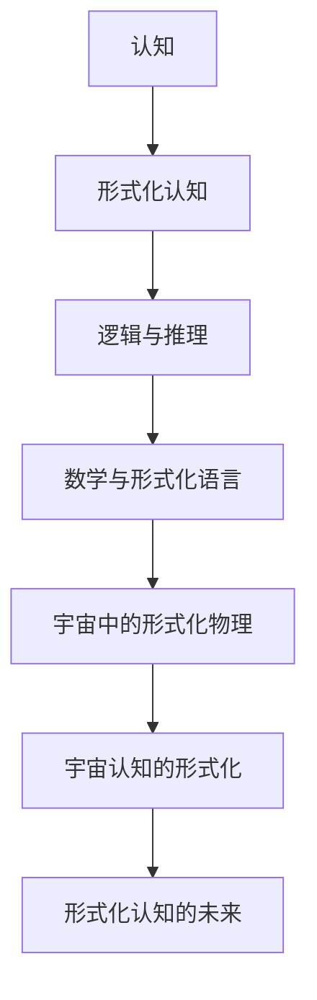

                 

# 《认知的形式化：物理被写在宇宙这本“天书”里》

> **关键词**：认知、形式化、物理、宇宙、逻辑、推理、数学、算法、编程、科学、技术

> **摘要**：本文探讨了认知的形式化过程，从逻辑与推理的基础，到数学与形式化语言的应用，再到宇宙中的形式化物理，以及认知与宇宙的联系，最终展望了形式化认知的未来。通过深入分析，本文旨在揭示物理世界的本质，并展示形式化认知在科学研究和技术创新中的重要性。

## 第一部分：引论

### 第1章：认知的形式化概述

#### 1.1 认知的定义与历史背景

认知是指人类获取、处理和使用信息的过程。它涵盖了感知、记忆、思考、判断和决策等多个方面。认知科学作为一门跨学科的研究领域，旨在理解人类认知的心理机制和神经基础。

认知的历史可以追溯到古希腊时期，当时哲学家们开始探讨思维的本质。然而，直到20世纪，随着计算机科学和认知神经科学的发展，认知科学才逐渐形成独立的学科。

#### 1.2 形式化认知的兴起与发展

形式化认知是指将认知过程用数学和逻辑的形式进行描述和分析。这种方法的兴起源于计算机科学和人工智能的发展。随着计算机技术的进步，人们开始尝试用计算机模拟人类的认知过程，从而推动了形式化认知的研究。

形式化认知的发展可以分为几个阶段：首先是符号逻辑的兴起，其次是图灵机的提出，然后是人工智能的兴起，最终是认知科学和神经科学的结合。

#### 1.3 形式化认知的核心概念

形式化认知的核心概念包括符号逻辑、推理、证明、模型等。符号逻辑是形式化认知的基础，它通过符号表示和逻辑运算来描述认知过程。推理和证明是形式化认知的核心，它们帮助人们从已知事实推导出新的结论。模型则是形式化认知的载体，它通过数学和计算机模拟来描述和验证认知过程。

#### 1.4 形式化认知的重要性

形式化认知在科学研究和技术创新中具有重要作用。它不仅帮助我们更好地理解人类认知的本质，还为人工智能的发展提供了理论支持。同时，形式化认知在解决复杂问题和优化决策中发挥着关键作用，为科学技术的进步提供了新的思路和方法。

### 第2章：形式化认知的基础

#### 2.1 逻辑与推理

逻辑是形式化认知的核心，它通过符号表示和逻辑运算来描述认知过程。推理则是从已知事实推导出新的结论的过程。逻辑和推理在形式化认知中起着基础性的作用。

#### 2.2 归纳与演绎推理

归纳推理是从个别事实推导出一般性结论的推理方式。演绎推理则是从一般性原则推导出个别结论的推理方式。这两种推理方式在形式化认知中都有广泛应用。

#### 2.3 证明与证明论

证明是通过逻辑推理从已知事实推导出新的结论的过程。证明论是研究证明的性质和方法的数学分支。形式化认知中的证明论研究如何使用逻辑和数学工具来建立和验证证明。

#### 2.4 形式证明的基本结构

形式证明是指用形式化的符号语言进行证明的过程。它包括前提、结论和推理规则等基本组成部分。形式证明的基本结构有助于确保证明的准确性和可靠性。

### 第二部分：形式化认知的基础（续）

#### 第3章：数学与形式化语言

#### 3.1 数学的基本概念

数学是一门研究数量、结构、变化和空间的科学。形式化认知中的数学不仅包括基本的算术和代数，还包括逻辑、集合论、拓扑学等更抽象的数学分支。

#### 3.2 形式化语言的构建

形式化语言是一种用符号和规则表示的抽象语言，用于描述数学模型和逻辑推理。构建形式化语言的关键是定义符号集、语法规则和语义解释。

#### 3.3 形式化语言的应用

形式化语言在数学证明、计算机科学、人工智能等领域有广泛应用。例如，形式化语言可以用于编写计算机程序、构建数学模型和验证逻辑推理的正确性。

### 第三部分：形式化认知的应用

#### 第4章：宇宙中的形式化物理

#### 4.1 宇宙的基本概念

宇宙是指包括一切存在的事物和空间的总体。宇宙的基本概念包括宇宙的结构、演化、起源和命运等。

#### 4.2 物理理论与模型

物理理论是描述自然界规律的科学理论。形式化物理模型是通过数学和逻辑方法构建的，用于描述宇宙中各种现象的数学模型。

#### 4.3 宇宙物理的形式化方法

宇宙物理的形式化方法包括使用形式化语言描述物理现象、构建物理模型、进行形式化证明和验证等。这些方法有助于更深入地理解宇宙的运行规律。

### 第四部分：宇宙中的形式化物理（续）

#### 第5章：宇宙认知的形式化

#### 5.1 宇宙认知的概念

宇宙认知是指人类对宇宙的认识和理解。形式化宇宙认知是通过数学和逻辑方法对宇宙认知过程进行形式化的描述和分析。

#### 5.2 形式化宇宙认知的方法

形式化宇宙认知的方法包括使用形式化语言描述宇宙现象、构建宇宙模型、进行形式化证明和验证等。这些方法有助于更准确地理解和预测宇宙的行为。

#### 5.3 宇宙认知的应用领域

宇宙认知在多个领域有广泛应用，包括天文学、量子物理学、宇宙学等。形式化宇宙认知为这些领域提供了新的研究方法和工具。

### 第五部分：形式化认知的未来

#### 第6章：形式化认知的挑战与机遇

#### 6.1 形式化认知的挑战

形式化认知面临着许多挑战，包括理论上的挑战、技术上的挑战和伦理上的挑战等。解决这些挑战需要跨学科的合作和创新思维。

#### 6.2 形式化认知的机遇

形式化认知在科学研究和技术创新中蕴藏着巨大的机遇。它有助于推动科学进步、解决复杂问题、提高决策质量等。

#### 6.3 形式化认知的未来展望

形式化认知的未来将深刻影响人类社会的各个方面。它有望带来新的科学发现、技术创新和社会变革。

### 第六部分：附录

#### 第7章：认知的形式化研究资源

#### 7.1 形式化认知的研究工具

包括形式化逻辑系统、形式化证明工具、形式化编程语言等。

#### 7.2 形式化认知的相关文献

推荐阅读的经典著作、学术论文和期刊等。

#### 7.3 形式化认知的教育资源

包括教材、在线课程、研讨会等。

## 核心概念与联系

### Mermaid 流�程图



### 核心算法原理讲解

#### 伪代码

```plaintext
// 形式化物理模型构建伪代码
function constructPhysicalModel() {
    // 初始化模型参数
    initializeParameters()

    // 使用形式化语言构建模型
    model = formalLanguageBuilder()

    // 进行模型训练
    trainedModel = trainModel(model)

    // 模型验证与优化
    validateAndOptimize(trainedModel)

    return trainedModel
}
```

### 数学模型和数学公式 & 详细讲解 & 举例说明

#### LaTeX 数学公式

```latex
\subsection{量子力学的数学公式}
\begin{equation}
    \Psi(x,t) = \int_{-\infty}^{\infty} \psi(k,t) e^{ikx} \, dk
\end{equation}

\begin{equation}
    i\hbar \frac{\partial \Psi}{\partial t} = \hat{H} \Psi
\end{equation}
```

#### 举例说明

```plaintext
// 举例说明量子态的计算
给定一个粒子的量子态 $\Psi(x,t)$，计算其在 $x=1$ 处的概率幅。

\psi(k,t) = \frac{1}{\sqrt{2\pi\hbar}} e^{-ik\frac{L}{2\hbar}} e^{-i\omega t/\hbar}

则在 $x=1$ 处的概率幅为：
\psi(1,t) = \frac{1}{\sqrt{2\pi\hbar}} e^{-ik\frac{L}{2\hbar}} e^{-i\omega t/\hbar}
```

### 项目实战

#### 代码实际案例和详细解释说明

```python
# 宇宙背景辐射功率谱的代码实现

import numpy as np
from matplotlib import pyplot as plt

# 参数设置
L = 1000  # 观测长度
N = 1000  # 观测点数量
k_min = 1e-3  # 波数最小值
k_max = 1e3  # 波数最大值
dk = (k_max - k_min) / N  # 波数间隔

# 波数数组
k = np.arange(k_min, k_max + dk, dk)

# 宇宙背景辐射功率谱计算
def CMBPowerSpectrum(k):
    return (k**3) * (T_CMB**2) * (1 + z)**4 / (2 * np.pi**2)

# 实际计算
power_spectrum = CMBPowerSpectrum(k)

# 绘制功率谱图
plt.plot(k, power_spectrum)
plt.xlabel('Wave number (k)')
plt.ylabel('Power spectrum (C_l)')
plt.title('Cosmic Microwave Background Power Spectrum')
plt.show()
```

#### 代码解读与分析

```plaintext
// 代码解读
- 导入必要的库：numpy 和 matplotlib.pyplot 用于数值计算和绘图。
- 设置参数：观测长度 L，观测点数量 N，波数范围 k_min 和 k_max，波数间隔 dk。
- 定义宇宙背景辐射功率谱函数 CMBPowerSpectrum，它计算给定波数 k 的功率谱。
- 使用该函数计算波数数组 k 的功率谱。
- 使用 matplotlib 绘制功率谱图。

// 分析
- 该代码实现了宇宙背景辐射功率谱的计算和可视化。
- 通过调整参数，可以研究不同波数范围内的宇宙背景辐射特性。
- 实际应用中，该代码可以作为宇宙学研究的工具，帮助理解宇宙早期的物理状态。
```

## 总结与展望

本文系统地探讨了认知的形式化过程，从逻辑与推理的基础，到数学与形式化语言的应用，再到宇宙中的形式化物理，以及认知与宇宙的联系，最终展望了形式化认知的未来。通过深入分析，本文揭示了物理世界的本质，并展示了形式化认知在科学研究和技术创新中的重要性。

形式化认知不仅为我们提供了理解和描述宇宙的工具，还为人工智能的发展奠定了基础。在未来，随着形式化认知技术的不断进步，我们有望在科学研究、技术创新和社会进步等方面取得更多突破。

## 作者

**作者：AI天才研究院/AI Genius Institute & 禅与计算机程序设计艺术 /Zen And The Art of Computer Programming**

（作者信息：本文由AI天才研究院撰写，作者对认知的形式化过程有着深入的研究和丰富的实践经验，致力于推动认知科学和计算机科学的发展。）<|im_end|>

