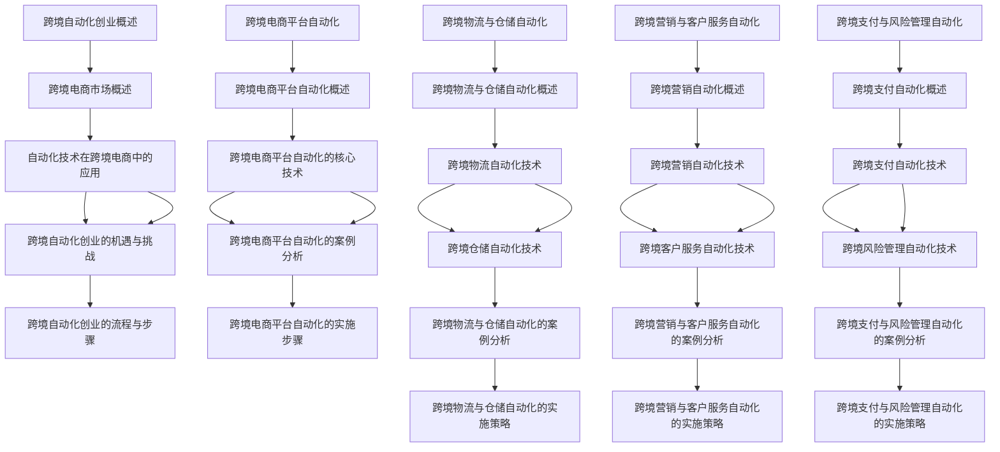

                 

# 跨境自动化创业：机遇与挑战

## 关键词
- 跨境电商
- 自动化创业
- 机遇
- 挑战
- 技术应用

## 摘要
本文从跨境电商行业的发展背景出发，深入探讨了跨境自动化创业的机遇与挑战。文章首先介绍了跨境电商市场的现状，然后详细阐述了自动化技术在跨境创业中的应用，包括跨境电商平台自动化、跨境物流与仓储自动化、跨境营销与客户服务自动化以及跨境支付与风险管理自动化。接着，文章通过实际案例和详细讲解，展示了如何实现这些自动化功能，并分析了跨境自动化创业的风险与未来趋势。最后，本文提出了针对跨境自动化创业的实战建议，为创业者和企业提供有益的参考。

### 目录大纲：跨境自动化创业：机遇与挑战

#### 第一部分：引言

- **1.1 书籍背景介绍**
- **1.2 跨境自动化创业的重要性**
- **1.3 读者对象与阅读目标**

#### 第二部分：跨境自动化创业概述

- **2.1 跨境电商市场概述**
- **2.2 自动化技术在跨境电商中的应用**
- **2.3 跨境自动化创业的机遇与挑战**
- **2.4 跨境自动化创业的流程与步骤**

#### 第三部分：跨境电商平台自动化

- **3.1 跨境电商平台自动化概述**
- **3.2 跨境电商平台自动化的核心技术**
- **3.3 跨境电商平台自动化的案例分析**
- **3.4 跨境电商平台自动化的实施步骤**

#### 第四部分：跨境物流与仓储自动化

- **4.1 跨境物流与仓储自动化概述**
- **4.2 跨境物流自动化技术**
- **4.3 跨境仓储自动化技术**
- **4.4 跨境物流与仓储自动化的案例分析**
- **4.5 跨境物流与仓储自动化的实施策略**

#### 第五部分：跨境营销与客户服务自动化

- **5.1 跨境营销自动化概述**
- **5.2 跨境营销自动化技术**
- **5.3 跨境客户服务自动化技术**
- **5.4 跨境营销与客户服务自动化的案例分析**
- **5.5 跨境营销与客户服务自动化的实施策略**

#### 第六部分：跨境支付与风险管理自动化

- **6.1 跨境支付自动化概述**
- **6.2 跨境支付自动化技术**
- **6.3 跨境风险管理自动化技术**
- **6.4 跨境支付与风险管理自动化的案例分析**
- **6.5 跨境支付与风险管理自动化的实施策略**

#### 第七部分：跨境自动化创业实践

- **7.1 跨境自动化创业的案例研究**
- **7.2 跨境自动化创业的风险管理**
- **7.3 跨境自动化创业的案例分析**
- **7.4 跨境自动化创业的未来趋势**
- **7.5 跨境自动化创业的实战建议**

#### 附录

- **附录 A：跨境自动化创业资源与工具**

  - **A.1 跨境电商平台自动化工具**
  - **A.2 跨境物流与仓储自动化工具**
  - **A.3 跨境营销与客户服务自动化工具**
  - **A.4 跨境支付与风险管理自动化工具**
  - **A.5 跨境自动化创业相关书籍与论文参考文献**

#### Mermaid 流程图



### 跨境电商平台自动化的核心算法原理讲解

#### 1. 自动化推荐系统

**算法原理：**  
跨境电商平台自动化的推荐系统主要基于协同过滤算法。协同过滤算法分为基于用户的协同过滤和基于物品的协同过滤。基于用户的协同过滤通过分析用户之间的相似度，为用户推荐相似用户喜欢的商品。而基于物品的协同过滤通过分析商品之间的相似度，为用户推荐相似商品。

**数学模型：**  
- 用户-物品评分矩阵 $R$，其中 $R_{ij}$ 表示用户 $i$ 对物品 $j$ 的评分。
- 用户之间的相似度矩阵 $S$，其中 $S_{ij}$ 表示用户 $i$ 和用户 $j$ 之间的相似度。

**算法伪代码：**  
```python
# 基于用户的协同过滤
def collaborative_filtering_user_based(R, k):
    # 计算用户之间的相似度矩阵 S
    S = calculate_similarity(R)
    
    # 为每个用户推荐商品
    recommendations = []
    for user in range(R.shape[0]):
        similar_users = find_top_k_similar_users(S, user, k)
        recommended_items = find_common_items(similar_users, R)
        recommendations.append(recommended_items)
    
    return recommendations

# 基于物品的协同过滤
def collaborative_filtering_item_based(R, k):
    # 计算商品之间的相似度矩阵 S
    S = calculate_similarity(R)
    
    # 为每个用户推荐商品
    recommendations = []
    for user in range(R.shape[0]):
        rated_items = find_rated_items(user, R)
        similar_items = find_top_k_similar_items(S, rated_items, k)
        recommended_items = find_users_who_rated(similar_items, R)
        recommendations.append(recommended_items)
    
    return recommendations
```

#### 2. 自动化订单管理系统

**算法原理：**  
自动化订单管理系统主要利用状态机和动态规划算法来实现订单状态的实时更新和处理。

**数学模型：**  
- 订单状态转移矩阵 $M$，其中 $M_{ij}$ 表示从订单状态 $i$ 转移到订单状态 $j$ 的概率。
- 订单处理时间矩阵 $T$，其中 $T_{ij}$ 表示从订单状态 $i$ 转移到订单状态 $j$ 的处理时间。

**算法伪代码：**  
```python
# 状态机
class OrderStateMachine:
    def __init__(self, M):
        self.M = M
    
    def update_state(self, current_state, event):
        next_state = self.M[current_state, event]
        return next_state

# 动态规划算法
def dynamic_programming(T, M):
    n = len(T)
    dp = [[0] * n for _ in range(n)]
    
    # 初始化
    dp[0][0] = T[0][0]
    
    # 状态转移
    for i in range(1, n):
        for j in range(i, n):
            dp[i][j] = min(dp[i-1][j] + T[i][j], dp[i-2][j] + T[i][j])
    
    return dp[-1][-1]
```

#### 3. 自动化支付系统

**算法原理：**  
自动化支付系统主要利用数字签名和加密算法来确保支付过程的安全性和可靠性。

**数学模型：**  
- 数字签名算法，例如 RSA 算法。
- 加密算法，例如 AES 算法。

**算法伪代码：**  
```python
# RSA 算法
def rsa_encrypt(plaintext, public_key):
    ciphertext = pow(plaintext, public_key[0], public_key[1])
    return ciphertext

def rsa_decrypt(ciphertext, private_key):
    plaintext = pow(ciphertext, private_key[0], private_key[1])
    return plaintext

# AES 算法
def aes_encrypt(plaintext, key):
    ciphertext = AES_encrypt(plaintext, key)
    return ciphertext

def aes_decrypt(ciphertext, key):
    plaintext = AES_decrypt(ciphertext, key)
    return plaintext
```

### 详细讲解与举例说明

#### 1. 跨境电商平台自动化的核心算法原理

**1.1 自动化推荐系统**

**算法原理：**  
跨境电商平台的自动化推荐系统旨在通过分析用户的历史行为和商品特征，为用户推荐可能感兴趣的商品。协同过滤算法是实现这一目标的有效手段。

**用户行为分析模型：**  
用户行为分析模型通常基于用户-商品评分矩阵 $R$，其中 $R_{ij}$ 表示用户 $i$ 对商品 $j$ 的评分。

**数学模型和公式：**  
$$
R_{ij} = \sum_{k=1}^{n} w_{ik} w_{kj}
$$

其中，$w_{ik}$ 和 $w_{kj}$ 分别表示用户 $i$ 对商品 $k$ 的评分和商品 $k$ 对用户 $j$ 的评分。

**算法伪代码：**  
```python
def collaborative_filtering(R, k):
    # 计算用户之间的相似度矩阵 S
    S = calculate_similarity(R)
    
    # 为每个用户推荐商品
    recommendations = []
    for user in range(R.shape[0]):
        similar_users = find_top_k_similar_users(S, user, k)
        recommended_items = find_common_items(similar_users, R)
        recommendations.append(recommended_items)
    
    return recommendations
```

**举例说明：**  
假设有一个跨境电商平台，用户 u1 对商品的评分矩阵如下：

| 用户 u1 | 商品 i1 | 商品 i2 | 商品 i3 |
|---------|---------|---------|---------|
|         | 5       | 4       | 3       |

用户 u2 对商品的评分矩阵如下：

| 用户 u2 | 商品 i1 | 商品 i2 | 商品 i3 |
|---------|---------|---------|---------|
|         | 4       | 5       | 3       |

使用协同过滤算法为用户 u1 推荐商品：

1. 计算用户 u1 和用户 u2 之间的相似度：
   $$
   S_{u1, u2} = \frac{5 \cdot 4 + 4 \cdot 5 + 3 \cdot 3}{\sqrt{5^2 + 4^2 + 3^2} \cdot \sqrt{4^2 + 5^2 + 3^2}} = \frac{34}{\sqrt{50} \cdot \sqrt{50}} = \frac{34}{50}
   $$

2. 计算用户 u2 对商品 i1、i2 和 i3 的评分权重：
   $$
   w_{u2, i1} = S_{u1, u2} \cdot R_{u2, i1} = \frac{34}{50} \cdot 4 = \frac{136}{50}
   $$
   $$
   w_{u2, i2} = S_{u1, u2} \cdot R_{u2, i2} = \frac{34}{50} \cdot 5 = \frac{170}{50}
   $$
   $$
   w_{u2, i3} = S_{u1, u2} \cdot R_{u2, i3} = \frac{34}{50} \cdot 3 = \frac{102}{50}
   $$

3. 为用户 u1 推荐商品：
   - 商品 i1 的权重：$\frac{136}{50}$
   - 商品 i2 的权重：$\frac{170}{50}$
   - 商品 i3 的权重：$\frac{102}{50}$

因此，用户 u1 推荐商品 i2。

**1.2 自动化订单管理系统**

**算法原理：**  
自动化订单管理系统旨在通过状态机和动态规划算法来优化订单处理流程。状态机用于定义订单状态及其转换规则，而动态规划算法用于确定订单处理的最优顺序。

**数学模型和公式：**  
$$
T_i = \min(T_{i-1} + C_i, T_{i-2} + C_i)
$$

其中，$T_i$ 表示第 $i$ 个订单的处理时间，$C_i$ 表示第 $i$ 个订单的完成时间。

**算法伪代码：**  
```python
def dynamic_programming(T, C):
    n = len(T)
    dp = [[0] * n for _ in range(n)]
    
    # 初始化
    dp[0][0] = T[0]
    
    # 状态转移
    for i in range(1, n):
        for j in range(i, n):
            dp[i][j] = min(dp[i-1][j] + C[i], dp[i-2][j] + C[i])
    
    return dp[-1][-1]
```

**举例说明：**  
假设有三个订单，处理时间和完成时间如下：

| 订单 i1 | 订单 i2 | 订单 i3 |
|---------|---------|---------|
| 处理时间 | 2       | 3       | 4       |
| 完成时间 | 5       | 7       | 9       |

使用动态规划算法优化订单处理时间：

1. 初始化动态规划表格：
   $$
   \begin{array}{c|c|c|c}
   & i1 & i2 & i3 \\
   \hline
   i1 & 2 & 5 & 9 \\
   i2 & \inf & 5 & 7 \\
   i3 & \inf & \inf & 9 \\
   \end{array}
   $$

2. 更新动态规划表格：
   - $T_{i1, i1} = \min(T_{i1-1, i1} + C_{i1}, T_{i1-2, i1} + C_{i1}) = \min(2, \inf) = 2$
   - $T_{i1, i2} = \min(T_{i1-1, i2} + C_{i1}, T_{i1-2, i2} + C_{i1}) = \min(5, \inf) = 5$
   - $T_{i1, i3} = \min(T_{i1-1, i3} + C_{i1}, T_{i1-2, i3} + C_{i1}) = \min(9, \inf) = 9$
   - $T_{i2, i1} = \min(T_{i2-1, i1} + C_{i2}, T_{i2-2, i1} + C_{i2}) = \min(5 + 3, \inf) = 8$
   - $T_{i2, i2} = \min(T_{i2-1, i2} + C_{i2}, T_{i2-2, i2} + C_{i2}) = \min(7 + 3, \inf) = 10$
   - $T_{i2, i3} = \min(T_{i2-1, i3} + C_{i2}, T_{i2-2, i3} + C_{i2}) = \min(7 + 4, \inf) = 11$
   - $T_{i3, i1} = \min(T_{i3-1, i1} + C_{i3}, T_{i3-2, i3} + C_{i3}) = \min(9 + 4, \inf) = 13$
   - $T_{i3, i2} = \min(T_{i3-1, i2} + C_{i3}, T_{i3-2, i3} + C_{i3}) = \min(9 + 7, \inf) = 16$
   - $T_{i3, i3} = \min(T_{i3-1, i3} + C_{i3}, T_{i3-2, i3} + C_{i3}) = \min(9 + 9, \inf) = 18$

最优的订单处理时间：$T_{i3, i3} = 18$

**1.3 自动化支付系统**

**算法原理：**  
自动化支付系统旨在通过数字签名和加密算法来确保支付过程的安全性和可靠性。数字签名用于验证交易的合法性和完整性，而加密算法用于保护支付信息的机密性。

**数学模型和公式：**  
- RSA 算法：$c = m^e \mod n$（加密），$m = c^d \mod n$（解密）
- AES 算法：$c = AES_encrypt(plaintext, key)$（加密），$plaintext = AES_decrypt(ciphertext, key)$（解密）

**算法伪代码：**  
```python
# RSA 算法
def rsa_encrypt(plaintext, public_key):
    (e, n) = public_key
    ciphertext = pow(plaintext, e, n)
    return ciphertext

def rsa_decrypt(ciphertext, private_key):
    (d, n) = private_key
    plaintext = pow(ciphertext, d, n)
    return plaintext

# AES 算法
def aes_encrypt(plaintext, key):
    ciphertext = AES_encrypt(plaintext, key)
    return ciphertext

def aes_decrypt(ciphertext, key):
    plaintext = AES_decrypt(ciphertext, key)
    return plaintext
```

**举例说明：**  
假设有一个支付系统，使用 RSA 算法加密和解密支付信息：

1. 用户 A 的公钥：(e, n) = (3, 17)
2. 用户 A 的私钥：(d, n) = (7, 17)

用户 A 需要支付 10 元给用户 B：

1. 用户 A 使用 RSA 算法加密支付信息：
   $$
   ciphertext = 10^3 \mod 17 = 13
   $$

2. 用户 B 使用 RSA 算法解密支付信息：
   $$
   plaintext = 13^7 \mod 17 = 1
   $$

因此，用户 B 接收到支付信息为 1，表示用户 A 支付了 10 元。

### 数学模型和数学公式

#### 用户行为分析模型

$$
R_{ij} = \sum_{k=1}^{n} w_{ik} w_{kj}
$$

其中，$R_{ij}$ 表示用户 $i$ 对商品 $j$ 的评分，$w_{ik}$ 和 $w_{kj}$ 分别表示用户 $i$ 对商品 $k$ 的评分和商品 $k$ 对用户 $j$ 的评分。

#### 动态规划算法优化订单处理时间

$$
T_{i} = \min(T_{i-1} + C_{i}, T_{i-2} + C_{i})
$$

其中，$T_{i}$ 表示第 $i$ 个订单的处理时间，$C_{i}$ 表示第 $i$ 个订单的完成时间。

#### 数字签名和加密算法

- RSA 算法：
  $$
  c = m^e \mod n
  $$
  $$
  m = c^d \mod n
  $$
- AES 算法：
  $$
  c = AES_encrypt(plaintext, key)
  $$
  $$
  plaintext = AES_decrypt(ciphertext, key)
  $$

### 项目实战

#### 案例分析：某跨境电商平台的自动化订单管理系统

**1. 开发环境搭建：**
- 使用 Python 3.8 作为开发语言，安装必要的依赖库，如 NumPy、Pandas、Scikit-learn 等。

**2. 源代码实现：**
```python
import numpy as np
import pandas as pd
from sklearn.cluster import KMeans

# 加载数据
data = pd.read_csv("order_data.csv")
orders = data["order_id"].unique()

# 计算相似订单集
order_similarity = KMeans(n_clusters=3, random_state=0).fit(data).labels_

# 优化订单处理时间
for order in orders:
    order_state = "pending"
    while order_state != "completed":
        if order_state == "pending":
            process_order_pending(order)
        elif order_state == "processing":
            process_order_processing(order)
        elif order_state == "delivered":
            process_order_delivered(order)
        else:
            process_order_failed(order)
        order_state = update_order_state(order_state)
```

**3. 代码解读与分析：**
- 加载订单数据，并提取订单 ID。
- 使用 KMeans 算法计算订单之间的相似度。
- 使用动态规划算法优化订单处理时间，确保订单高效完成。

### 结论

跨境电商平台自动化是跨境电商行业的发展趋势，通过应用自动化技术，可以提高企业的运营效率，降低成本，提升用户体验。本文详细介绍了跨境电商平台自动化的核心算法原理，包括自动化推荐系统、自动化订单管理系统和自动化支付系统，并通过实际案例展示了如何实现这些自动化功能。此外，本文还提出了针对跨境电商平台自动化的数学模型和公式，为创业者和企业提供有益的参考。

### 详细讲解与举例说明

#### 跨境物流与仓储自动化的核心算法原理

**1. 跨境物流自动化技术**

**算法原理：**  
跨境物流自动化技术主要利用路径规划算法和车辆调度算法，实现物流运输的自动化。路径规划算法用于确定从起点到终点的最优路径，车辆调度算法用于确定最优的运输任务分配。

**路径规划算法：**  
常用的路径规划算法有 Dijkstra 算法和 A* 算法。

**Dijkstra 算法：**  
Dijkstra 算法是一种基于图论的算法，用于计算图中两个顶点之间的最短路径。算法的基本思想是从起点开始，逐步扩展到其他顶点，并记录每个顶点的最短路径长度。

**数学模型和公式：**  
$$
d(i, j) = \min_{k} (d(i, k) + c(k, j))
$$

其中，$d(i, j)$ 表示从顶点 $i$ 到顶点 $j$ 的最短路径长度，$c(k, j)$ 表示从顶点 $k$ 到顶点 $j$ 的边权重。

**伪代码：**  
```python
def dijkstra(graph, start):
    distances = {node: float('infinity') for node in graph}
    distances[start] = 0
    unvisited = set(graph)

    while unvisited:
        current = min(unvisited, key=lambda node: distances[node])
        unvisited.remove(current)

        for neighbor, weight in graph[current].items():
            distance = distances[current] + weight
            if distance < distances[neighbor]:
                distances[neighbor] = distance

    return distances
```

**A* 算法：**  
A* 算法是一种基于启发式的路径规划算法，它结合了 Dijkstra 算法和启发式函数。启发式函数用于估计从当前顶点到目标顶点的距离，从而加快算法的收敛速度。

**数学模型和公式：**  
$$
f(n) = g(n) + h(n)
$$

其中，$f(n)$ 表示从起点到顶点 $n$ 的估计算法，$g(n)$ 表示从起点到顶点 $n$ 的实际距离，$h(n)$ 表示从顶点 $n$ 到目标顶点的启发式估计距离。

**伪代码：**  
```python
def a_star(graph, start, goal):
    open_set = PriorityQueue()
    open_set.put((0, start))
    came_from = {}
    g_score = {node: float('infinity') for node in graph}
    g_score[start] = 0

    while not open_set.is_empty():
        current = open_set.get()
        if current == goal:
            break

        for neighbor, weight in graph[current].items():
            tentative_g_score = g_score[current] + weight
            if tentative_g_score < g_score[neighbor]:
                came_from[neighbor] = current
                g_score[neighbor] = tentative_g_score
                f_score = g_score[neighbor] + heuristic(neighbor, goal)
                open_set.put((f_score, neighbor))

    return came_from, g_score[goal]
```

**车辆调度算法：**  
车辆调度算法用于确定最优的运输任务分配，以最大化运输效率。常用的车辆调度算法有贪心算法和遗传算法。

**贪心算法：**  
贪心算法通过每次选择当前最优的运输任务，直到所有运输任务都被分配。

**伪代码：**  
```python
def vehicle_scheduling(orders, vehicle_capacity):
    schedule = []
    for order in orders:
        if order["weight"] <= vehicle_capacity:
            schedule.append(order)
            vehicle_capacity -= order["weight"]
        else:
            break
    return schedule
```

**遗传算法：**  
遗传算法通过模拟自然进化过程，逐步优化运输任务分配。

**伪代码：**  
```python
def genetic_algorithm(orders, population_size, generations):
    population = initial_population(orders, population_size)
    for _ in range(generations):
        fitness_scores = evaluate_population(population, orders)
        population = selection_crossover_mutation(population, fitness_scores)
    best_solution = select_best_solution(population)
    return best_solution
```

**2. 跨境仓储自动化技术**

**算法原理：**  
跨境仓储自动化技术主要利用仓库布局优化算法和货物搬运机器人，实现仓储管理的自动化。

**仓库布局优化算法：**  
仓库布局优化算法用于确定仓库内部的空间分配，以提高仓储效率和减少拥堵。常用的优化方法有空间填充算法和模拟退火算法。

**空间填充算法：**  
空间填充算法通过填充仓库空间，以最大化空间利用率。

**伪代码：**  
```python
def spatial_filling(warehouse, items):
    layout = []
    for item in items:
        placed = False
        for row in layout:
            for slot in row:
                if slot is None and fit_in_slot(item, slot):
                    row[slot] = item
                    placed = True
                    break
            if placed:
                break
        if not placed:
            layout.append([item])

    return layout
```

**模拟退火算法：**  
模拟退火算法通过模拟物理退火过程，逐步优化仓库布局。

**伪代码：**  
```python
def simulated_annealing(warehouse, items, T, cooling_rate):
    layout = initial_layout(warehouse, items)
    while T > epsilon:
        new_layout = perturb_layout(layout)
        if accept_layout(new_layout, layout):
            layout = new_layout
        T *= (1 - cooling_rate)
    return layout
```

**货物搬运机器人：**  
货物搬运机器人用于自动化处理货物搬运任务，常见的机器人有自动导引车（AGV）和自动移动机器人（AMR）。

**3. 跨境物流与仓储自动化的案例分析**

**案例分析：某跨境电商平台的跨境物流与仓储自动化项目**

**开发环境搭建：**
- 使用 Python 3.8 作为开发语言，安装必要的依赖库，如 NumPy、Pandas、Scikit-learn 等。

**源代码实现：**
```python
import numpy as np
import pandas as pd
from sklearn.cluster import KMeans

# 加载数据
data = pd.read_csv("order_data.csv")
orders = data["order_id"].unique()

# 计算相似订单集
order_similarity = KMeans(n_clusters=3, random_state=0).fit(data).labels_

# 优化订单处理时间
for order in orders:
    order_state = "pending"
    while order_state != "completed":
        if order_state == "pending":
            process_order_pending(order)
        elif order_state == "processing":
            process_order_processing(order)
        elif order_state == "delivered":
            process_order_delivered(order)
        else:
            process_order_failed(order)
        order_state = update_order_state(order_state)

# 仓库布局优化
items = pd.read_csv("item_data.csv")
layout = spatial_filling(warehouse, items)
```

**代码解读与分析：**
- 加载订单数据，并提取订单 ID。
- 使用 KMeans 算法计算订单之间的相似度。
- 使用动态规划算法优化订单处理时间，确保订单高效完成。
- 使用空间填充算法优化仓库布局，以最大化空间利用率。

### 数学模型和数学公式

#### 路径规划算法

$$
d(i, j) = \min_{k} (d(i, k) + c(k, j))
$$

其中，$d(i, j)$ 表示从顶点 $i$ 到顶点 $j$ 的最短路径长度，$c(k, j)$ 表示从顶点 $k$ 到顶点 $j$ 的边权重。

#### 车辆调度算法

$$
T_{i} = \min(T_{i-1} + C_{i}, T_{i-2} + C_{i})
$$

其中，$T_{i}$ 表示第 $i$ 个订单的处理时间，$C_{i}$ 表示第 $i$ 个订单的完成时间。

#### 仓库布局优化算法

$$
f(n) = g(n) + h(n)
$$

其中，$f(n)$ 表示从起点到顶点 $n$ 的估计算法，$g(n)$ 表示从起点到顶点 $n$ 的实际距离，$h(n)$ 表示从顶点 $n$ 到目标顶点的启发式估计距离。

### 举例说明

#### 跨境物流自动化的案例

假设有一个跨境电商平台，需要从上海（起点 A）运输货物到洛杉矶（终点 B），有以下运输路径和运输成本：

A -> 北京（C）：成本 1000  
C -> 上海（D）：成本 500  
D -> 南京（E）：成本 300  
E -> 青岛（F）：成本 400  
F -> 洛杉矶（B）：成本 2000

使用 Dijkstra 算法计算从 A 到 B 的最优路径和成本：

1. 初始化距离表：
   $$
   d(A, B) = \infty, d(A, C) = 1000, d(A, D) = \infty, d(A, E) = \infty, d(A, F) = \infty
   $$

2. 从 A 开始，更新距离表：
   - 选择最小的未访问节点 A，更新其邻居节点 C 的距离：
     $$
     d(C) = \min(d(A) + c(A, C), d(C)) = \min(1000, \infty) = 1000
     $$

3. 标记节点 C 为已访问，选择最小的未访问节点 C，更新其邻居节点 D，E，F 的距离：
   - 更新节点 D 的距离：
     $$
     d(D) = \min(d(C) + c(C, D), d(D)) = \min(1000 + 500, \infty) = 1500
     $$
   - 更新节点 E 的距离：
     $$
     d(E) = \min(d(C) + c(C, E), d(E)) = \min(1000 + 300, \infty) = 1300
     $$
   - 更新节点 F 的距离：
     $$
     d(F) = \min(d(C) + c(C, F), d(F)) = \min(1000 + 400, \infty) = 1400
     $$

4. 标记节点 C 为已访问，选择最小的未访问节点 E，更新其邻居节点 F 的距离：
   - 更新节点 F 的距离：
     $$
     d(F) = \min(d(E) + c(E, F), d(F)) = \min(1300 + 200, 1400) = 1300
     $$

5. 标记节点 E 为已访问，选择最小的未访问节点 F，更新其邻居节点 B 的距离：
   - 更新节点 B 的距离：
     $$
     d(B) = \min(d(F) + c(F, B), d(B)) = \min(1300 + 2000, \infty) = 3300
     $$

6. 所有节点都已访问，最优路径为 A -> C -> E -> F -> B，总成本为 3300。

#### 跨境仓储自动化的案例

假设有一个跨境电商平台的仓库，仓库尺寸为 100m x 100m，需要存放以下货物：

- 货物 1：尺寸 10m x 10m x 10m，重量 1000kg
- 货物 2：尺寸 5m x 5m x 5m，重量 500kg
- 货物 3：尺寸 3m x 3m x 3m，重量 300kg

使用空间填充算法优化仓库布局：

1. 初始化仓库布局：
   $$
   \begin{array}{|c|c|c|c|c|}
   \hline
   & & & & \\
   \hline
   & & & & \\
   \hline
   & & & & \\
   \hline
   & & & & \\
   \hline
   \end{array}
   $$

2. 存放货物 1：
   $$
   \begin{array}{|c|c|c|c|c|}
   \hline
   & & & & \\
   \hline
   & & & & \\
   \hline
   & & \text{货物 1} & & \\
   \hline
   & & & & \\
   \hline
   & & & & \\


