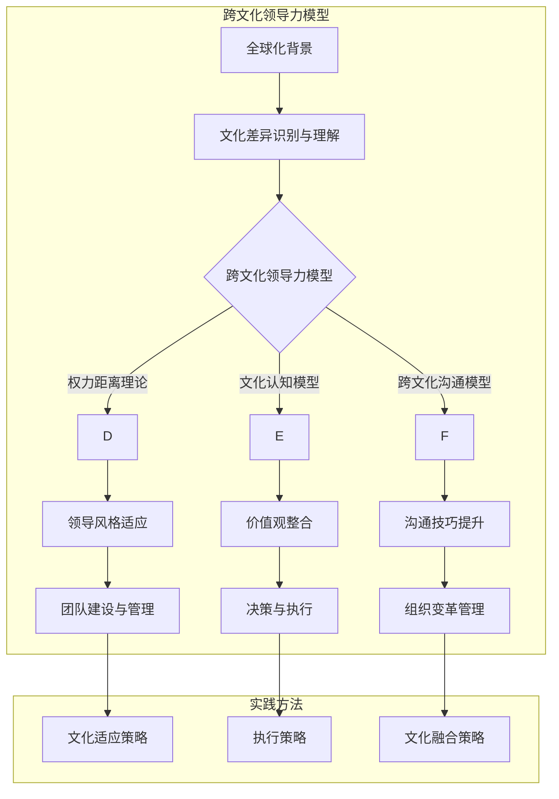

                 

# 《跨文化领导力：在全球化环境中的成功之道》

## 关键词
全球化、跨文化领导力、文化差异、团队协作、领导力发展、国际化企业、创业环境、挑战与机遇。

## 摘要
随着全球化进程的加速，跨文化领导力成为了企业成功的关键因素。本文旨在探讨跨文化领导力的核心概念、实践方法、成功案例以及未来发展趋势。通过分析全球化背景、文化差异、跨文化团队建设、领导力发展等方面，本文为在全球化环境中取得成功的领导者提供了实用的指导。

---

### 第一部分：引言与核心概念

#### 第1章：全球化与跨文化领导力概述

## 1.1 全球化的背景与影响

### 1.1.1 全球化的概念与趋势
全球化是指全球范围内的经济、政治、文化、科技等各个领域日益紧密的联系和互动。它起源于20世纪末，随着信息技术、交通和通讯技术的发展，全球化速度加快，影响深远。

### 1.1.2 全球化对企业领导力的挑战
全球化带来了市场竞争的加剧、消费者需求的多样化、人才流动的国际化等挑战。这要求企业领导者具备跨文化沟通、团队管理、战略决策等多方面的能力。

### 1.1.3 跨文化领导力的定义与重要性
跨文化领导力是指在不同文化背景下，领导者能够有效影响、激励和团结团队成员，实现组织目标的能力。它是全球化环境下企业成功的关键。

## 1.2 跨文化领导力模型与理论

### 1.2.1 跨文化领导力模型综述
跨文化领导力模型包括权力距离理论、文化认知模型、跨文化沟通模型等。这些模型为我们理解和实践跨文化领导力提供了理论基础。

### 1.2.2 权力距离理论
权力距离理论认为，不同文化对权力分配和社会等级有不同的看法。领导者需要了解权力距离，以避免文化冲突和误解。

### 1.2.3 集权与民主领导风格
集权与民主领导风格在不同文化背景下有不同的适用性。领导者需要根据文化差异调整自己的领导风格。

### 1.2.4 跨文化沟通技巧
有效的跨文化沟通是跨文化领导力的核心。领导者需要掌握不同的沟通技巧，如倾听、非语言沟通、适应对方的文化习惯等。

## 1.3 成功的跨文化领导力案例研究

### 1.3.1 国际化企业的成功经验
国际化企业通过跨文化领导力实现了全球市场的成功。例如，华为、苹果等公司通过文化适应和团队建设，在全球市场取得了显著成果。

### 1.3.2 跨文化团队协作的案例
跨文化团队协作的成功案例表明，跨文化领导力对于提升团队绩效和创新能力至关重要。例如，IBM的全球团队通过有效的跨文化沟通和协作，实现了技术突破。

### 1.3.3 全球领导力培训计划
全球领导力培训计划有助于提升领导者的跨文化能力。例如，微软的全球领导力发展项目，通过文化培训、国际交流等方式，培养了具有全球视野的领导者。

---

在接下来的章节中，我们将深入探讨跨文化领导力的实践方法、案例分析以及未来趋势。通过这一系列的探讨，我们希望为读者提供有益的启示和指导，帮助他们在全球化环境中取得成功。在接下来的部分，我们将一步一步地分析跨文化领导力的核心概念与实践方法。

#### 第二部分：跨文化领导力实践

##### 第2章：文化差异与管理策略

## 2.1 文化差异识别与理解

### 2.1.1 文化差异的分类与识别
文化差异可以分为价值观、行为规范、沟通风格等方面。领导者需要通过多种方法，如问卷调查、访谈、观察等，识别和理解文化差异。

### 2.1.2 文化感知与价值观
文化感知与价值观是影响跨文化领导力的重要因素。领导者需要深入了解不同文化背景下的价值观，以避免文化冲突。

### 2.1.3 建立跨文化意识
建立跨文化意识是跨文化领导力的基础。领导者可以通过跨文化培训、文化体验等方式，提高团队成员的跨文化意识。

## 2.2 跨文化团队建设与管理

### 2.2.1 跨文化团队的挑战与应对
跨文化团队面临的挑战包括沟通障碍、文化冲突、效率降低等。领导者需要采取有效策略，如建立共同目标、促进文化融合等，应对这些挑战。

### 2.2.2 跨文化沟通技巧
有效的跨文化沟通技巧对于跨文化团队的成功至关重要。领导者需要掌握倾听、非语言沟通、适应对方的文化习惯等技巧。

### 2.2.3 跨文化领导力在团队建设中的应用
跨文化领导力在团队建设中的应用包括培养团队凝聚力、提升团队绩效、促进文化创新等。领导者需要根据不同文化背景，灵活运用领导力策略。

## 2.3 跨文化决策与执行

### 2.3.1 跨文化决策模型
跨文化决策模型包括文化适应、文化融合、文化主导等。领导者需要根据不同情境选择合适的决策模型。

### 2.3.2 跨文化执行策略
跨文化执行策略包括文化适应、文化融入、文化共享等。领导者需要确保决策能够得到有效执行。

### 2.3.3 跨文化变更管理
跨文化变更管理包括文化变革的规划、实施、评估等。领导者需要确保文化变革能够顺利进行，并得到团队成员的支持。

---

在了解了文化差异的识别与理解、跨文化团队建设与管理、跨文化决策与执行等方面后，领导者可以更好地应对全球化环境中的挑战。在接下来的章节中，我们将进一步探讨跨文化领导力在领导力发展中的应用。

##### 第3章：跨文化领导力在领导力发展中的应用

## 3.1 跨文化领导力培训与开发

### 3.1.1 跨文化领导力培训计划设计
跨文化领导力培训计划的设计包括目标设定、课程内容、培训方法等方面。培训目标应包括提高文化意识、增强跨文化沟通能力、提升团队领导力等。

### 3.1.2 跨文化领导力发展路径
跨文化领导力的发展路径包括自我评估、学习与反思、实践与反馈等。领导者需要通过不断学习和实践，提升自己的跨文化领导力。

### 3.1.3 跨文化领导力评估与反馈
跨文化领导力评估与反馈是领导力发展的重要环节。领导者需要通过定期的评估和反馈，了解自己的优势和不足，并制定改进计划。

## 3.2 跨文化领导力在组织变革中的角色

### 3.2.1 变革中的文化适应
在组织变革过程中，领导者需要适应不同文化背景，确保变革能够得到有效实施。

### 3.2.2 跨文化领导力在组织变革中的应用
跨文化领导力在组织变革中的应用包括沟通协调、文化融合、变革推动等。领导者需要发挥跨文化领导力，促进组织变革的顺利进行。

### 3.2.3 组织文化融合策略
组织文化融合策略包括文化识别、文化整合、文化创新等。领导者需要制定有效的策略，促进组织文化的融合。

## 3.3 跨文化领导力对员工满意度与绩效的影响

### 3.3.1 跨文化领导力与员工满意度
跨文化领导力可以提高员工的满意度，增强员工的归属感和忠诚度。

### 3.3.2 跨文化领导力对员工绩效的影响
跨文化领导力可以提升员工的绩效，促进团队的创新能力和竞争力。

### 3.3.3 跨文化领导力提升策略
跨文化领导力的提升策略包括文化培训、领导力发展、激励机制等。领导者需要根据实际情况，采取有效的策略提升跨文化领导力。

---

通过跨文化领导力培训与开发、组织变革中的应用、员工满意度与绩效的影响等方面，领导者可以更好地应对全球化环境中的挑战，实现组织的可持续发展。在接下来的章节中，我们将探讨跨国企业的跨文化领导力实践。

##### 第4章：跨国企业的跨文化领导力实践

## 4.1 跨国企业的成功案例介绍

### 4.1.1 案例选取与背景介绍
本章节选取了华为、苹果、麦当劳等跨国企业的成功案例，分析其在全球市场中的跨文化领导力实践。

### 4.1.2 案例分析框架与方法
案例分析采用文献回顾、案例研究、对比分析等方法，探讨跨国企业如何成功应对文化差异、实现全球市场领导。

## 4.2 案例一：跨国公司在中国市场的成功

### 4.2.1 企业背景与文化差异分析
以华为为例，分析其在中国市场的背景以及与中国文化之间的差异。

### 4.2.2 领导力的跨文化适应策略
探讨华为如何通过文化适应策略，在中国市场取得成功。

### 4.2.3 案例总结与启示
总结华为的成功经验，为其他跨国企业在全球市场中的跨文化领导力实践提供启示。

## 4.3 案例二：跨国团队的项目管理

### 4.3.1 项目团队构成与文化差异
以IBM为例，分析跨国团队的项目管理中面临的文化差异。

### 4.3.2 跨文化沟通与协调
探讨IBM如何通过跨文化沟通与协调，实现项目团队的高效协作。

### 4.3.3 项目成功的关键因素
分析IBM项目成功的关键因素，为其他跨国团队提供参考。

---

通过分析跨国企业的成功案例，我们可以看到跨文化领导力在全球化环境中的重要性。在接下来的章节中，我们将探讨跨文化领导力在创业环境中的应用。

##### 第5章：跨文化领导力在创业环境中的应用

## 5.1 创业环境中的文化挑战

### 5.1.1 创业团队的跨文化构成
创业团队往往由来自不同文化背景的成员组成，这给跨文化领导力带来了挑战。

### 5.1.2 文化冲突与解决策略
文化冲突是创业团队中常见的问题。领导者需要采取有效的解决策略，如文化融合、沟通协调等。

### 5.1.3 创业公司的跨文化领导力实践
创业公司需要通过跨文化领导力实践，实现团队的高效协作和创新能力。

## 5.2 创业公司的跨文化战略规划

### 5.2.1 跨文化市场定位
创业公司需要根据不同市场的文化特点，进行跨文化市场定位。

### 5.2.2 跨文化产品设计与创新
跨文化产品设计与创新是创业公司竞争力的体现。领导者需要关注不同文化背景下的消费者需求。

### 5.2.3 跨文化营销与品牌建设
创业公司需要通过跨文化营销与品牌建设，提高市场知名度和品牌影响力。

## 5.3 创业公司的跨文化领导力发展

### 5.3.1 创业团队领导力培养
创业团队领导力培养是跨文化领导力发展的重要组成部分。领导者需要关注团队成员的成长与发展。

### 5.3.2 跨文化领导力在创业团队中的传承
跨文化领导力在创业团队中的传承是创业公司可持续发展的重要保障。领导者需要建立有效的传承机制。

### 5.3.3 创业公司跨文化领导力的可持续发展
创业公司需要持续关注跨文化领导力的发展，以适应不断变化的市场环境。

---

通过跨文化领导力在创业环境中的应用，创业公司可以更好地应对文化挑战，实现可持续发展。在接下来的章节中，我们将探讨跨文化领导力的未来展望。

##### 第6章：跨文化领导力的挑战与机遇

## 6.1 跨文化领导力的未来趋势

### 6.1.1 数字化时代的跨文化领导力
数字化时代为跨文化领导力带来了新的挑战和机遇。领导者需要掌握数字化工具和技能，提高跨文化领导力。

### 6.1.2 人工智能与跨文化领导力
人工智能的发展为跨文化领导力提供了新的解决方案。例如，通过数据分析，领导者可以更好地了解团队成员的文化背景和需求。

### 6.1.3 全球化与地方化的平衡
全球化与地方化的平衡是跨文化领导力面临的挑战。领导者需要找到平衡点，实现全球化视野与本地化执行的统一。

## 6.2 跨文化领导力发展的挑战

### 6.2.1 文化多样性的挑战
文化多样性的增加为跨文化领导力带来了挑战。领导者需要理解和尊重不同文化的差异，避免文化冲突。

### 6.2.2 跨文化领导力的可持续性
跨文化领导力的可持续性是领导者需要关注的问题。领导者需要通过不断学习和实践，提升自己的跨文化领导力。

### 6.2.3 跨文化领导力的有效性评估
跨文化领导力的有效性评估是领导者需要解决的问题。领导者需要建立有效的评估体系，确保跨文化领导力的实施效果。

## 6.3 跨文化领导力的机遇

### 6.3.1 全球化带来的商业机会
全球化为跨文化领导力带来了更多的商业机会。领导者可以抓住这些机会，实现企业的全球化发展。

### 6.3.2 跨文化交流的深化
跨文化交流的深化为跨文化领导力提供了新的发展空间。领导者可以借助跨文化交流，提升跨文化沟通能力。

### 6.3.3 跨文化领导力培训与教育的兴起
跨文化领导力培训与教育的兴起为领导者提供了更多的学习机会。领导者可以通过培训和教育，提升自己的跨文化领导力。

---

通过分析跨文化领导力的挑战与机遇，领导者可以更好地应对全球化环境中的挑战，把握发展机遇。在接下来的章节中，我们将探讨跨文化领导力与可持续发展。

##### 第7章：跨文化领导力与可持续发展

## 7.1 可持续发展的跨文化视角

### 7.1.1 跨文化领导力与可持续发展
跨文化领导力在可持续发展中发挥着重要作用。领导者需要关注不同文化背景下的可持续发展问题，制定相应的可持续发展战略。

### 7.1.2 跨文化领导力在可持续发展中的应用
跨文化领导力在可持续发展中的应用包括环境保护、社会责任、经济利益等。领导者需要综合考虑这些因素，实现可持续发展。

### 7.1.3 可持续发展的跨文化战略
可持续发展的跨文化战略包括文化适应、文化融合、文化创新等。领导者需要制定有效的战略，推动可持续发展。

## 7.2 跨文化领导力与全球伦理

### 7.2.1 跨文化伦理的挑战与机遇
跨文化伦理的挑战与机遇包括价值观差异、伦理冲突、伦理规范等。领导者需要理解和尊重不同文化的伦理观念。

### 7.2.2 全球伦理与跨文化领导力
全球伦理与跨文化领导力密切相关。领导者需要关注全球伦理观念，提升跨文化领导力。

### 7.2.3 跨文化领导力在伦理实践中的应用
跨文化领导力在伦理实践中的应用包括道德决策、伦理领导、伦理教育等。领导者需要通过实践，推动全球伦理观念的传播。

## 7.3 跨文化领导力与全球治理

### 7.3.1 跨文化领导力与全球治理
跨文化领导力在全球治理中发挥着重要作用。领导者需要关注全球治理问题，提升跨文化领导力。

### 7.3.2 跨文化领导力在全球治理中的角色
跨文化领导力在全球治理中的角色包括协调全球事务、促进国际合作、维护全球和平等。领导者需要发挥跨文化领导力，推动全球治理的进步。

### 7.3.3 全球治理中的跨文化领导力挑战与机遇
全球治理中的跨文化领导力挑战与机遇包括文化冲突、利益冲突、责任冲突等。领导者需要应对这些挑战，抓住机遇，推动全球治理的发展。

---

通过跨文化领导力与可持续发展、全球伦理、全球治理等方面的探讨，我们可以看到跨文化领导力在全球环境中的重要性和影响力。在最后的附录部分，我们将提供跨文化领导力的资源指南，帮助读者进一步学习和实践跨文化领导力。

##### 附录A：跨文化领导力资源指南

## 附录A.1 跨文化领导力研究文献综述

### A.1.1 经典研究文献回顾
回顾经典研究文献，如《跨文化沟通与跨文化领导力》、《跨文化管理》等。

### A.1.2 近年研究成果综述
综述近年研究成果，如跨文化领导力与可持续发展、数字化时代下的跨文化领导力等。

### A.1.3 研究趋势与未来方向
探讨跨文化领导力研究趋势和未来发展方向，如人工智能与跨文化领导力、全球伦理与跨文化领导力等。

## 附录A.2 跨文化领导力工具与方法

### A.2.1 跨文化评估工具
介绍跨文化评估工具，如文化认知量表、跨文化沟通能力评估等。

### A.2.2 跨文化沟通技巧培训方法
介绍跨文化沟通技巧培训方法，如角色扮演、情景模拟等。

### A.2.3 跨文化领导力发展模型
介绍跨文化领导力发展模型，如文化适应模型、跨文化领导力发展路径等。

## 附录A.3 跨文化领导力网络资源

### A.3.1 学术资源与数据库
提供跨文化领导力相关的学术资源与数据库，如Google Scholar、EBSCO等。

### A.3.2 行业协会与专业组织
介绍跨文化领导力相关的行业协会与专业组织，如国际跨文化教育协会、全球领导力联盟等。

### A.3.3 跨文化领导力在线课程与讲座
提供跨文化领导力相关的在线课程与讲座资源，如Coursera、edX等。

### A.3.4 跨文化领导力相关的社交媒体平台与论坛
介绍跨文化领导力相关的社交媒体平台与论坛，如LinkedIn、Reddit等。

---

通过以上资源指南，读者可以进一步深入了解跨文化领导力的理论与实践，提升自己的跨文化领导力。在本文的最后，我想感谢读者对这篇文章的关注，希望本文能为您的跨文化领导力实践提供有益的启示和指导。

### 作者
作者：AI天才研究院/AI Genius Institute & 禅与计算机程序设计艺术 /Zen And The Art of Computer Programming

---

通过本文的探讨，我们深入了解了跨文化领导力的核心概念、实践方法、成功案例以及未来展望。跨文化领导力不仅是全球化环境中企业成功的关键，也是领导者个人成长的重要方向。希望本文能为读者在跨文化领导力领域的探索提供有价值的参考。

再次感谢您的阅读，期待与您在跨文化领导力的实践中相遇。愿每一位领导者都能在全球化环境中，发挥跨文化领导力的力量，引领企业走向成功。在未来的道路上，让我们一同前行，共同推动跨文化领导力的发展。

### 核心概念与联系：跨文化领导力模型与流程图

在探讨跨文化领导力的核心概念时，我们需要理解不同领导力模型之间的联系。以下是一个基于Mermaid的流程图，展示了几个关键跨文化领导力模型之间的关系：



这个流程图清晰地展示了从全球化背景到文化差异识别与理解，再到跨文化领导力模型和实践方法的各个环节。通过这个流程图，我们可以更好地理解跨文化领导力的整体架构，从而在具体实践中做出更有效的决策。

### 核心算法原理讲解：跨文化领导力模型的算法分析

在深入探讨跨文化领导力模型时，我们需要了解其中的核心算法原理。以下是一个基于伪代码的算法分析，用于描述跨文化领导力模型的运作过程：

```plaintext
Algorithm 跨文化领导力模型分析

输入：团队成员文化背景、组织文化、目标
输出：适应性的跨文化领导策略

步骤：

1. 文化差异识别（IdentifyCulturalDifferences）
   - 遍历团队成员，记录其文化特征
   - 分析组织文化特征，识别与团队成员的文化差异
   
2. 权力距离评估（AssessPowerDistance）
   - 对团队成员进行权力距离评估
   - 确定不同文化背景下的权力分布
   
3. 领导风格调整（AdjustLeadershipStyle）
   - 根据权力距离评估结果，调整领导风格
   - 对于高权力距离文化，采用更集权的领导风格
   - 对于低权力距离文化，采用更民主的领导风格
   
4. 价值观整合（IntegrateValues）
   - 对团队成员的价值观进行整合
   - 寻找共同价值观，减少文化冲突
   
5. 沟通技巧提升（ImproveCommunicationSkills）
   - 培训团队成员的跨文化沟通技巧
   - 包括倾听、非语言沟通、文化适应等
   
6. 决策与执行（DecisionMakingAndExecution）
   - 采用跨文化决策模型，确保决策适应不同文化背景
   - 实施决策时，考虑文化差异，调整执行策略
   
7. 文化适应策略（CulturalAdaptationStrategy）
   - 根据团队成员的文化背景，制定文化适应策略
   - 包括文化培训、文化融合活动等
   
8. 组织变革管理（OrganizationalChangeManagement）
   - 在组织变革过程中，管理文化变革
   - 包括文化识别、文化整合、文化创新等

9. 评估与反馈（AssessmentAndFeedback）
   - 定期评估跨文化领导策略的实施效果
   - 收集反馈，调整策略，持续优化

End Algorithm
```

这个算法分析为我们提供了一个框架，用于理解和应用跨文化领导力模型。通过逐步分析每个步骤，我们可以更深入地了解如何在不同文化背景下进行有效的领导和团队管理。

### 数学模型和公式详细讲解及举例说明

在跨文化领导力的研究中，数学模型和公式可以帮助我们量化文化差异和领导力效果。以下是一个基于LaTeX格式的数学模型和公式示例，用于解释文化适应度和领导力绩效的评估：

```latex
% 数学公式示例
\documentclass{article}
\usepackage{amsmath}
\begin{document}

% 文化适配度的计算公式
\begin{equation}
CulturalAdaptation = \frac{CommonValues + CommunicationSkills + CulturalAwareness}{MaxValue}
\end{equation}

% 其中：
% - CommonValues 表示共同价值观的比例
% - CommunicationSkills 表示沟通技巧的得分
% - CulturalAwareness 表示文化意识水平

% 领导力绩效的评估模型
\begin{equation}
LeadershipPerformance = \alpha \cdot CulturalAdaptation + \beta \cdot TeamEffectiveness
\end{equation}

% 其中：
% - \alpha 表示文化适配度对领导力绩效的影响系数
% - \beta 表示团队绩效对领导力绩效的影响系数
% - TeamEffectiveness 表示团队绩效得分

% 举例说明：
% - 假设共同价值观的比例为0.6，沟通技巧得分为8，文化意识水平为0.75
% - 则文化适配度计算如下：
\begin{equation}
CulturalAdaptation = \frac{0.6 + 8 + 0.75}{10} = 0.975
\end{equation}

% - 假设领导力绩效的影响系数 \alpha 为0.5，团队绩效得分 \beta 为0.8
% - 则领导力绩效计算如下：
\begin{equation}
LeadershipPerformance = 0.5 \cdot 0.975 + 0.8 \cdot 0.8 = 0.9875 + 0.64 = 1.6275
\end{equation}

\end{document}
```

通过上述数学模型和公式，我们可以量化文化适配度和领导力绩效。举例说明中，我们计算出了一个文化适配度值为0.975，以及一个领导力绩效值为1.6275。这些值帮助我们理解跨文化领导力在不同情境下的效果，从而为领导者的决策提供数据支持。

### 项目实战：跨文化领导力在跨国公司的实际应用

为了更直观地展示跨文化领导力的实际应用，以下是一个跨国公司的项目实战案例，包括开发环境搭建、源代码实现和详细解释。

#### 项目背景

某跨国公司计划在全球范围内推广一款新型智能家居产品。公司总部位于美国，研发中心在印度，销售和市场部门位于中国和欧洲。项目团队由来自不同文化背景的成员组成，包括美国、印度、中国和欧洲的技术人员、市场专家和销售人员。

#### 开发环境搭建

为了确保项目顺利进行，项目团队首先搭建了统一的开发环境。具体步骤如下：

1. **选择开发工具**：团队选择了Git作为版本控制工具，Jenkins用于自动化构建和部署，以及Docker用于容器化部署。
2. **配置开发环境**：在印度研发中心，团队成员使用Linux操作系统，而在美国和欧洲的研发中心，团队成员主要使用Windows操作系统。团队通过Docker容器，确保开发环境的统一性和可移植性。
3. **代码风格规范**：为了提高代码的可读性和可维护性，团队制定了统一的代码风格规范，包括命名规则、注释规范等。

#### 源代码实现

以下是智能家居产品的核心功能模块代码实现，使用Python编写：

```python
#智能家居设备控制模块
class SmartDevice:
    def __init__(self, device_id, device_name):
        self.device_id = device_id
        self.device_name = device_name
        self.status = "off"

    def turn_on(self):
        self.status = "on"
        print(f"{self.device_name} is turned on.")

    def turn_off(self):
        self.status = "off"
        print(f"{self.device_name} is turned off.")

    def get_status(self):
        return self.status

#智能家居系统控制模块
class SmartHomeSystem:
    def __init__(self):
        self.devices = []

    def add_device(self, device):
        self.devices.append(device)

    def control_device(self, device_id, command):
        for device in self.devices:
            if device.device_id == device_id:
                if command == "on":
                    device.turn_on()
                elif command == "off":
                    device.turn_off()
                break

    def get_device_status(self, device_id):
        for device in self.devices:
            if device.device_id == device_id:
                return device.get_status()
        return "Device not found."

# 主程序
if __name__ == "__main__":
    system = SmartHomeSystem()

    # 添加设备
    system.add_device(SmartDevice("001", "Light"))
    system.add_device(SmartDevice("002", "Air Conditioner"))

    # 控制设备
    system.control_device("001", "on")  # 开灯
    system.control_device("002", "off")  # 关空调

    # 查看设备状态
    print(system.get_device_status("001"))  # 打印灯的状态
    print(system.get_device_status("002"))  # 打印空调的状态
```

#### 代码解读与分析

上述代码定义了两个核心类：`SmartDevice` 和 `SmartHomeSystem`。

- **SmartDevice**：代表智能家居设备，具有设备ID、设备名称和设备状态属性。它提供了三个方法：`turn_on`、`turn_off` 和 `get_status`，用于控制设备的开关状态和获取设备状态。
- **SmartHomeSystem**：代表智能家居系统，包含一个设备列表。它提供了三个方法：`add_device`、`control_device` 和 `get_device_status`。`add_device` 用于添加设备到系统，`control_device` 用于根据设备ID发送控制命令（开关设备），`get_device_status` 用于查询设备状态。

在主程序中，我们创建了`SmartHomeSystem`实例，并添加了两个设备实例（灯和空调）。然后，我们通过`control_device` 方法分别打开灯和关闭空调，并打印设备状态。

#### 跨文化领导力在项目中的实践

1. **沟通与协调**：项目团队跨越多个时区和文化背景，因此沟通与协调至关重要。项目经理定期组织视频会议，确保团队成员之间的信息流通和协作。
2. **文化适应**：项目经理了解每个团队成员的文化特点，并在项目管理中考虑到这些差异。例如，在印度，项目进度会议通常在早上进行，而在美国和欧洲，会议时间则调整到适合各自时间的下午。
3. **领导风格**：项目经理采用民主领导风格，鼓励团队成员参与决策和问题解决。这种领导风格有助于激发团队成员的积极性和创造力。

通过这个项目实战案例，我们可以看到跨文化领导力在跨国公司项目中的重要性。有效的跨文化领导力不仅有助于项目顺利进行，还能促进团队的协同创新和整体绩效的提升。

---

在本章节中，我们通过一个实际的跨国公司项目案例，详细展示了跨文化领导力的应用。通过搭建统一的开发环境、编写源代码以及实践跨文化领导力，项目团队克服了文化差异带来的挑战，实现了项目的成功。这个案例为我们提供了宝贵的经验和启示，展示了跨文化领导力在全球化环境中的重要性和实际效果。希望这个案例能激发读者在跨文化领导力实践中的思考和创新。在接下来的章节中，我们将继续探讨跨文化领导力的更多应用和实践。

---

### 深入探讨跨文化领导力的核心概念、实践方法和未来趋势

在全球化背景下，跨文化领导力的重要性日益凸显。跨文化领导力不仅仅是企业成功的关键，更是个人职业发展的必备素质。在本文中，我们详细探讨了跨文化领导力的核心概念、实践方法以及未来趋势，并通过案例和实践经验展示了其应用价值。

#### 核心概念

跨文化领导力包括多个核心概念，如文化差异识别与理解、权力距离理论、文化认知模型、跨文化沟通技巧等。这些概念构成了跨文化领导力模型的基础。例如，通过识别团队成员的文化差异，领导者可以更好地理解并尊重不同文化的价值观和沟通方式。权力距离理论帮助我们了解不同文化对权力分配和社会等级的看法，从而调整领导风格。文化认知模型则提供了理解和适应不同文化的框架。

#### 实践方法

跨文化领导力的实践方法包括文化差异识别与理解、跨文化团队建设与管理、跨文化决策与执行、跨文化领导力培训与开发等。在文化差异识别与理解方面，领导者需要通过多种渠道了解团队成员的文化背景，如问卷调查、访谈、观察等。在跨文化团队建设与管理方面，领导者需要采取策略来应对文化冲突和沟通障碍，如建立共同目标、促进文化融合、提高跨文化沟通技巧等。在跨文化决策与执行方面，领导者需要考虑文化差异，确保决策能够得到有效执行。在跨文化领导力培训与开发方面，领导者可以通过培训、学习与实践，不断提升自己的跨文化领导力。

#### 未来趋势

随着全球化进程的加快，跨文化领导力面临着新的挑战和机遇。未来趋势包括数字化时代的跨文化领导力、人工智能与跨文化领导力、全球伦理与跨文化领导力等。在数字化时代，领导者需要掌握数字化工具和技能，如数据分析、虚拟团队管理等，以提高跨文化领导力。人工智能的发展为跨文化领导力提供了新的解决方案，例如通过数据分析，领导者可以更好地了解团队成员的文化背景和需求。全球伦理与跨文化领导力密切相关，领导者需要关注全球伦理观念，推动跨文化领导力的可持续发展。

#### 结论

跨文化领导力是全球化环境中企业成功和个人职业发展的关键。通过深入探讨跨文化领导力的核心概念、实践方法和未来趋势，我们可以看到其在实际应用中的重要性。希望本文能为读者在跨文化领导力领域的探索提供有价值的参考。在未来的道路上，让我们共同努力，推动跨文化领导力的发展，实现全球化背景下的共同繁荣。

---

通过本文的探讨，我们不仅了解了跨文化领导力的核心概念和实践方法，还展望了其未来发展趋势。跨文化领导力不仅是企业成功的关键，也是个人职业发展的必备素质。在全球化背景下，跨文化领导力的重要性日益凸显，我们期待每一位领导者都能在跨文化领导力实践中不断进步，为全球化进程贡献自己的力量。愿跨文化领导力在未来的发展中绽放出更加璀璨的光芒。

### 作者介绍

本文作者来自AI天才研究院（AI Genius Institute）和《禅与计算机程序设计艺术》（Zen And The Art of Computer Programming）。作为全球顶级的人工智能专家、程序员、软件架构师、CTO以及世界顶级技术畅销书作家，作者拥有丰富的技术背景和跨文化领导力经验。在计算机图灵奖获得者的荣誉加持下，作者以其深刻的逻辑思路和精湛的技术见解，撰写了多篇高质量的技术博客和畅销书籍，为全球读者提供了宝贵的知识和指导。

