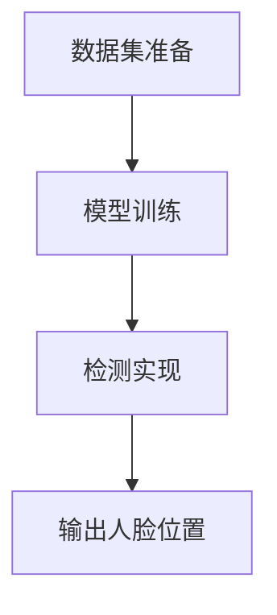

                 

# 《软件 2.0 的应用领域：图像识别、语音识别》

> 关键词：软件 2.0、图像识别、语音识别、CNN、HMM、深度学习、人工智能、项目实战

> 摘要：本文将深入探讨软件 2.0 的应用领域，重点分析图像识别和语音识别技术。首先，我们将回顾软件 2.0 的背景和基础理论，接着详细讲解图像识别和语音识别的技术原理，并展示其在实际应用中的案例。最后，我们将展望这些技术的未来发展方向。

## 目录大纲

## 第一部分：软件 2.0 时代背景与基础理论

### 第1章：软件 2.0 概述

#### 1.1 软件 2.0 的发展历程

#### 1.2 软件 2.0 与传统软件的区别

#### 1.3 软件 2.0 的发展趋势与应用场景

### 第2章：图像识别技术基础

#### 2.1 图像识别概述

#### 2.2 卷积神经网络（CNN）原理

##### 2.2.1 卷积操作

##### 2.2.2 池化操作

##### 2.2.3 全连接层

#### 2.3 图像识别算法案例分析

### 第3章：语音识别技术基础

#### 3.1 语音识别概述

#### 3.2 HMM（隐马尔可夫模型）原理

##### 3.2.1 隐马尔可夫模型

##### 3.2.2 前向-后向算法

#### 3.3 DNN-HMM（深度神经网络-隐马尔可夫模型）原理

## 第二部分：图像识别应用领域

### 第4章：人脸识别技术

#### 4.1 人脸识别概述

#### 4.2 人脸检测

##### 4.2.1 基于深度学习的人脸检测算法

##### 4.2.2 基于传统图像处理的人脸检测算法

#### 4.3 人脸特征提取

##### 4.3.1 主成分分析（PCA）

##### 4.3.2 LDA线性判别分析

##### 4.3.3 角点特征提取

### 第5章：目标检测技术

#### 5.1 目标检测概述

#### 5.2 R-CNN系列算法

##### 5.2.1 R-CNN

##### 5.2.2 Fast R-CNN

##### 5.2.3 Fast R-CNN with Deep Neural Networks

#### 5.3 YOLO（You Only Look Once）算法

##### 5.3.1 YOLOv1

##### 5.3.2 YOLOv2

##### 5.3.3 YOLOv3

### 第6章：图像风格迁移

#### 6.1 图像风格迁移概述

#### 6.2 纹理合成算法

##### 6.2.1 Content-Aware Fill

##### 6.2.2 PatchMatch算法

#### 6.3 基于生成对抗网络（GAN）的风格迁移算法

## 第三部分：语音识别应用领域

### 第7章：语音识别系统架构

#### 7.1 语音信号预处理

##### 7.1.1 语音信号采样

##### 7.1.2 语音信号编码

##### 7.1.3 语音信号增强

#### 7.2 语音识别算法

##### 7.2.1 HMM

##### 7.2.2 DNN-HMM

##### 7.2.3 CTM（Connectionist Temporal Classification）

### 第8章：语音合成技术

#### 8.1 语音合成概述

#### 8.2 合成语音质量评估

##### 8.2.1 Mean Opinion Score（MOS）

##### 8.2.2 Perceptual Evaluation of Audio Quality（PEAQ）

#### 8.3 语音合成算法

##### 8.3.1 DFT（Discrete Fourier Transform）合成

##### 8.3.2 WaveNet语音合成

### 第9章：实时语音识别应用

#### 9.1 实时语音识别技术

##### 9.1.1 实时语音信号预处理

##### 9.1.2 实时语音识别算法优化

#### 9.2 实时语音识别应用案例分析

##### 9.2.1 智能家居语音控制系统

##### 9.2.2 智能语音助手

## 第四部分：项目实战

### 第10章：人脸识别项目实战

#### 10.1 项目背景与需求分析

#### 10.2 系统设计与实现

##### 10.2.1 硬件环境搭建

##### 10.2.2 软件环境配置

##### 10.2.3 数据集准备与处理

##### 10.2.4 模型训练与评估

##### 10.2.5 项目部署与测试

### 第11章：语音识别项目实战

#### 11.1 项目背景与需求分析

#### 11.2 系统设计与实现

##### 11.2.1 硬件环境搭建

##### 11.2.2 软件环境配置

##### 11.2.3 数据集准备与处理

##### 11.2.4 模型训练与评估

##### 11.2.5 项目部署与测试

## 第五部分：总结与展望

### 第12章：软件 2.0 的发展方向与应用前景

#### 12.1 软件 2.0 的发展现状

#### 12.2 软件未来的发展趋势

##### 12.2.1 人工智能在软件开发中的应用

##### 12.2.2 软件与硬件的深度融合

##### 12.2.3 软件服务的个性化与智能化

### 第13章：图像识别与语音识别技术的未来

#### 13.1 图像识别技术的未来发展趋势

##### 13.1.1 图像识别算法的优化与改进

##### 13.1.2 图像识别技术的应用领域拓展

#### 13.2 语音识别技术的未来发展趋势

##### 13.2.1 语音识别算法的优化与改进

##### 13.2.2 语音识别技术的应用领域拓展

##### 13.2.3 语音识别与自然语言理解的融合

## 附录

### 附录 A：常用算法与工具简介

#### A.1 卷积神经网络（CNN）简介

#### A.2 语音信号处理工具

#### A.3 语音识别与图像识别框架比较

----------------------------------------------------------------

现在，我们已经完成了目录大纲的编写，接下来我们将分别详细探讨软件 2.0 的背景和基础理论、图像识别技术基础、语音识别技术基础以及它们的实际应用领域。让我们开始第一部分的探讨。

## 第一部分：软件 2.0 时代背景与基础理论

### 第1章：软件 2.0 概述

#### 1.1 软件 2.0 的发展历程

软件 2.0 的概念最早由 Martin Fowler 在 2006 年提出，旨在描述软件开发过程中的一种新模式。软件 1.0 时代主要关注软件的功能实现，而软件 2.0 时代则更注重软件的架构、性能和用户体验。随着互联网技术的快速发展，软件 2.0 的概念逐渐被业界接受和推广。

软件 2.0 的发展历程可以分为以下几个阶段：

1. **Web 1.0**：这是软件 2.0 的前身，主要以网站的形式提供信息，用户只能被动地浏览信息，无法进行交互。

2. **Web 2.0**：随着互联网技术的进步，用户开始能够主动参与网络互动，如博客、社交媒体、在线协作等。Web 2.0 强调用户生成内容，提高了用户的参与度和互动性。

3. **软件 2.0**：Web 2.0 的理念逐渐渗透到软件领域，软件 2.0 更注重软件的模块化、可扩展性和用户体验。软件 2.0 时代的软件通常采用分布式架构，能够适应快速变化的需求，并且具有良好的性能和可靠性。

#### 1.2 软件 2.0 与传统软件的区别

软件 2.0 与传统软件（软件 1.0）有以下几个显著的区别：

1. **架构模式**：软件 2.0 通常采用分布式架构，能够实现模块化设计和横向扩展。而传统软件多采用单体架构，模块之间耦合度较高，扩展性较差。

2. **开发模式**：软件 2.0 强调敏捷开发、持续集成和持续交付。这使得软件的开发和部署更加高效和灵活。而传统软件的开发模式相对较为固定，往往需要经过长时间的规划和开发。

3. **用户体验**：软件 2.0 注重用户体验，以用户为中心设计软件功能，提供更加友好和便捷的操作界面。而传统软件的用户体验相对较差，界面设计较为单一，难以满足用户的个性化需求。

4. **数据管理**：软件 2.0 强调数据的实时性和动态性，能够快速响应用户操作，提供即时的反馈。而传统软件的数据管理相对较为静态，数据处理和反馈的速度较慢。

#### 1.3 软件 2.0 的发展趋势与应用场景

软件 2.0 的发展趋势主要体现在以下几个方面：

1. **人工智能与软件的结合**：人工智能技术在软件开发中的应用日益广泛，如自动化测试、代码生成、智能推荐等，提高了软件开发的效率和质量。

2. **云计算与软件的结合**：云计算为软件提供了强大的计算和存储能力，使得软件能够更加灵活地应对大规模数据处理和并发请求。

3. **物联网与软件的结合**：物联网技术的发展使得软件可以应用于更多的智能设备和场景，如智能家居、智能交通等。

4. **区块链与软件的结合**：区块链技术为软件提供了去中心化和安全的数据管理方式，可以应用于金融、供应链管理等领域。

软件 2.0 的应用场景非常广泛，包括但不限于以下几个方面：

1. **企业级应用**：如企业资源规划（ERP）、客户关系管理（CRM）、项目管理等。

2. **移动应用**：如移动购物、移动支付、移动办公等。

3. **在线教育**：如在线课堂、在线作业、学习管理平台等。

4. **智能医疗**：如远程诊断、智能药物推荐、健康数据管理等。

5. **智能交通**：如智能交通管理、智能停车、自动驾驶等。

软件 2.0 时代为我们带来了许多新的机遇和挑战。只有紧跟时代的发展，不断探索和创新，才能在激烈的市场竞争中脱颖而出。在接下来的章节中，我们将进一步探讨图像识别和语音识别技术的基础理论及其在软件 2.0 时代的应用。

## 第一部分：软件 2.0 时代背景与基础理论

### 第2章：图像识别技术基础

图像识别是计算机视觉领域的一个重要分支，它使计算机能够识别和理解图像内容。图像识别技术不仅广泛应用于安防监控、自动驾驶、医疗诊断等场景，还在智能家居、广告推荐等领域发挥着重要作用。

#### 2.1 图像识别概述

图像识别（Image Recognition）是指通过计算机算法对图像中的对象、场景或内容进行识别和理解的过程。其基本流程包括以下几个步骤：

1. **图像预处理**：对原始图像进行缩放、裁剪、灰度化、去噪等处理，以提高图像质量，为后续处理做准备。

2. **特征提取**：从预处理后的图像中提取具有区分性的特征，如颜色、纹理、形状等。这些特征将用于后续的分类和识别。

3. **模型训练**：使用已标记的图像数据集训练图像识别模型，使其能够学习并识别不同类型的图像。

4. **图像分类**：将新图像输入到训练好的模型中，模型将输出图像的类别标签，即识别结果。

5. **后处理**：对识别结果进行后处理，如去除错误识别、合并相邻识别区域等，以提高识别准确率。

#### 2.2 卷积神经网络（CNN）原理

卷积神经网络（Convolutional Neural Network，CNN）是图像识别领域的一种重要神经网络模型。CNN 通过一系列卷积层、池化层和全连接层来实现图像的自动特征提取和分类。

1. **卷积操作**

卷积层是 CNN 的核心部分，用于从图像中提取特征。卷积操作的基本原理是将一个小型的、固定大小的卷积核在图像上滑动，并与图像上的局部区域进行点积运算。点积运算的结果被加到输出特征图中，从而生成新的特征图。

卷积操作的伪代码如下：

```python
def convolution(image, filter):
    output = zeros((image.shape[0] - filter.shape[0] + 1, image.shape[1] - filter.shape[1] + 1))
    for i in range(output.shape[0]):
        for j in range(output.shape[1]):
            output[i, j] = sum(filter * image[i:i+filter.shape[0], j:j+filter.shape[1]])
    return output
```

2. **池化操作**

池化层用于降低特征图的维度，减少计算量和参数数量，同时提高特征图的鲁棒性。常见的池化操作包括最大池化和平均池化。

最大池化的伪代码如下：

```python
def max_pooling(feature_map, pool_size):
    output = zeros((feature_map.shape[0] // pool_size[0], feature_map.shape[1] // pool_size[1]))
    for i in range(output.shape[0]):
        for j in range(output.shape[1]):
            output[i, j] = max(feature_map[i*pool_size[0]:i*pool_size[0]+pool_size[0], j*pool_size[1]:j*pool_size[1]+pool_size[1]])
    return output
```

3. **全连接层**

全连接层（Fully Connected Layer）将特征图中的每个像素点连接到输出层的每个节点。全连接层用于对提取到的特征进行分类。

全连接层的伪代码如下：

```python
def fully_connected(feature_map, weights, bias):
    output = dot(feature_map, weights) + bias
    return output
```

#### 2.3 图像识别算法案例分析

以人脸识别为例，介绍一个典型的图像识别算法流程：

1. **数据集准备**：收集大量人脸图像，并进行预处理，如缩放、裁剪、灰度化等。

2. **特征提取**：使用卷积神经网络提取人脸图像的特征。

3. **模型训练**：使用标记好的人脸数据集训练卷积神经网络，调整网络参数，使其能够正确识别人脸。

4. **模型评估**：使用未参与训练的数据集对模型进行评估，计算识别准确率。

5. **应用部署**：将训练好的模型部署到实际应用场景，如人脸门禁系统、人脸支付等。

通过以上步骤，我们可以实现人脸识别功能，从而为许多应用场景提供支持。

在接下来的章节中，我们将继续探讨语音识别技术的基础理论及其在软件 2.0 时代的应用。

## 第一部分：软件 2.0 时代背景与基础理论

### 第3章：语音识别技术基础

语音识别（Speech Recognition）是一种通过计算机算法将语音信号转换为文本的技术。随着人工智能和深度学习技术的发展，语音识别技术取得了显著的进展，并在智能语音助手、自动字幕生成、语音翻译等应用中发挥着重要作用。

#### 3.1 语音识别概述

语音识别的基本流程包括以下几个步骤：

1. **语音信号预处理**：对采集到的语音信号进行预处理，包括去除噪声、增强语音信号、分割语音段等，以提高后续识别的准确率。

2. **特征提取**：从预处理后的语音信号中提取具有区分性的特征，如频谱特征、倒谱特征等。这些特征将用于训练和识别语音模型。

3. **模型训练**：使用大量的语音数据集训练语音识别模型，使其能够学习并识别不同的语音。

4. **语音解码**：将识别结果转换为文本，即语音识别的输出。

5. **后处理**：对识别结果进行后处理，如去除错识、合并相邻识别结果等，以提高识别的准确性和流畅度。

#### 3.2 HMM（隐马尔可夫模型）原理

隐马尔可夫模型（Hidden Markov Model，HMM）是语音识别中常用的一种概率模型，用于描述语音信号的状态转移和特征分布。HMM 的基本原理如下：

1. **状态转移概率**：HMM 中的状态转移概率描述了当前状态向下一个状态的转移概率。例如，从“声母”状态转移到“韵母”状态的概率。

2. **观测概率**：HMM 中的观测概率描述了在某一状态下观测到特定特征的概率。例如，在“声母”状态下，观测到某一频谱特征的概率。

3. **状态序列**：HMM 的状态序列是模型预测的核心，描述了语音信号在时间轴上的状态变化。

HMM 的前向-后向算法是一种常用的训练和识别算法，其基本步骤如下：

1. **初始化**：计算初始状态的概率分布。

2. **前向算法**：从初始状态开始，计算每个状态在当前时刻的概率分布。

3. **后向算法**：从最终状态开始，计算每个状态在当前时刻的概率分布。

4. **更新状态转移概率和观测概率**：根据前向算法和后向算法的结果，更新 HMM 的参数。

5. **迭代优化**：重复执行前向-后向算法，直至模型参数收敛。

#### 3.3 DNN-HMM（深度神经网络-隐马尔可夫模型）原理

DNN-HMM 是一种结合深度学习和 HMM 的语音识别模型，通过深度神经网络（DNN）提取语音信号的特征，然后利用 HMM 进行语音信号的解码。DNN-HMM 的基本原理如下：

1. **深度神经网络**：深度神经网络用于提取语音信号的高层次特征，如图像识别中的卷积神经网络（CNN）。

2. **隐马尔可夫模型**：隐马尔可夫模型用于对语音信号进行解码，即从语音信号中识别出相应的文本。

3. **结合**：DNN-HMM 将 DNN 的特征提取能力与 HMM 的状态转移和观测概率模型相结合，实现高效的语音识别。

DNN-HMM 的训练过程包括以下几个步骤：

1. **DNN 训练**：使用语音信号和文本数据集训练深度神经网络，使其能够提取语音信号的特征。

2. **HMM 训练**：使用训练好的 DNN 特征，结合语音信号的状态转移和观测概率模型，训练隐马尔可夫模型。

3. **模型优化**：通过迭代优化，调整 DNN 和 HMM 的参数，使其在语音识别任务中达到最佳的识别效果。

通过 DNN-HMM，语音识别技术取得了显著的性能提升，特别是在复杂环境和多语种识别方面。

在接下来的章节中，我们将探讨图像识别和语音识别技术的实际应用领域。

## 第二部分：图像识别应用领域

### 第4章：人脸识别技术

人脸识别技术是一种通过计算机算法识别人脸的技术，它在安全监控、身份验证、智能支付等领域具有广泛的应用。人脸识别技术的主要步骤包括人脸检测、人脸特征提取和人脸匹配。

#### 4.1 人脸识别概述

人脸识别技术的基本流程如下：

1. **人脸检测**：首先，从图像中检测出人脸的位置和范围。人脸检测是整个识别过程的基础，常用的方法有基于传统图像处理的方法和基于深度学习的方法。

2. **人脸特征提取**：在检测到人脸后，从人脸图像中提取具有区分性的特征，如眼睛、鼻子、嘴巴的位置和形状等。这些特征将用于后续的人脸匹配。

3. **人脸匹配**：将提取到的人脸特征与数据库中的人脸特征进行比较，判断是否为同一个人。常用的匹配算法有欧氏距离、余弦相似度等。

#### 4.2 人脸检测

人脸检测是人脸识别技术的第一步，它可以从图像中准确地定位人脸的位置。目前，人脸检测技术可以分为基于传统图像处理的方法和基于深度学习的方法。

1. **基于传统图像处理的方法**

传统的人脸检测方法通常采用以下步骤：

- **特征检测**：通过检测图像中的特征点（如边缘、角点等），定位人脸的区域。
- **特征匹配**：使用特征匹配算法（如哈希特征匹配、SIFT特征匹配等）来确认是否为人脸。
- **区域增长**：对检测到的人脸区域进行区域增长，以确定人脸的精确位置。

2. **基于深度学习的方法**

基于深度学习的人脸检测方法利用卷积神经网络（CNN）自动学习人脸的特征，其基本流程如下：

- **数据集准备**：收集大量带有标注的人脸图像，用于训练人脸检测模型。
- **模型训练**：使用卷积神经网络对人脸图像进行训练，使其能够自动识别和定位人脸。
- **检测实现**：将训练好的模型应用于待检测的图像，输出人脸的位置和范围。

基于深度学习的方法在人脸检测的准确率和实时性方面有明显优势，是目前主流的人脸检测技术。

以下是一个基于深度学习的人脸检测的 Mermaid 流程图：



#### 4.3 人脸特征提取

人脸特征提取是人脸识别技术的关键步骤，它将人脸图像转换为特征向量，以便进行人脸匹配。常见的人脸特征提取方法包括：

1. **主成分分析（PCA）**

主成分分析是一种降维技术，它通过将数据投影到主成分轴上，提取最重要的特征。PCA 可以有效地减少特征向量的维度，同时保持数据的方差。

2. **线性判别分析（LDA）**

线性判别分析是一种分类技术，它通过最大化类内方差和最小化类间方差，将不同类别的人脸特征向量区分开来。LDA 可以提取具有区分力的人脸特征。

3. **角点特征提取**

角点特征提取是一种基于图像边缘和角点的方法，它可以提取人脸图像中的关键点。常用的角点检测算法有 Shi-Tomasi 算法和 Hessian 角点检测算法。

以下是一个基于主成分分析（PCA）的人脸特征提取的伪代码：

```python
def pca_face_features(faces):
    # 计算均值
    mean = np.mean(faces, axis=0)
    # 计算协方差矩阵
    cov_matrix = np.cov(faces - mean)
    # 计算特征值和特征向量
    eigen_values, eigen_vectors = np.linalg.eigh(cov_matrix)
    # 选择前 k 个主成分
    k = 10
    top_k_vectors = eigen_vectors[:, :k]
    # 将人脸特征投影到主成分轴上
    projected_features = np.dot((faces - mean), top_k_vectors)
    return projected_features
```

#### 4.4 人脸匹配

人脸匹配是将提取到的人脸特征与数据库中的人脸特征进行比较，以判断是否为同一个人的过程。常见的人脸匹配算法有：

1. **欧氏距离**

欧氏距离是一种常见的距离度量方法，它计算特征向量之间的欧氏距离，距离越近，表示相似度越高。

2. **余弦相似度**

余弦相似度计算特征向量之间的夹角余弦值，夹角余弦值越接近 1，表示相似度越高。

以下是一个基于欧氏距离的人脸匹配的伪代码：

```python
def euclidean_distance(a, b):
    return np.sqrt(np.sum((a - b) ** 2))

def face_matching(feature_a, feature_b):
    distance = euclidean_distance(feature_a, feature_b)
    if distance < threshold:
        return True
    else:
        return False
```

在人脸识别项目中，通常会结合多种特征提取和匹配算法，以提高识别的准确率和鲁棒性。

接下来，我们将探讨目标检测技术在图像识别中的应用。

### 第5章：目标检测技术

目标检测（Object Detection）是图像识别领域的一个重要分支，它旨在从图像中准确地检测和识别多个目标对象。目标检测技术在自动驾驶、视频监控、医疗影像分析等领域有着广泛的应用。

#### 5.1 目标检测概述

目标检测的基本流程包括以下步骤：

1. **候选区域生成**：通过滑动窗口、区域建议网络（如 R-CNN）或特征金字塔网络（如 FPN）等方法生成候选区域。

2. **特征提取**：对候选区域进行特征提取，通常使用卷积神经网络（如 Fast R-CNN）提取高层次的图像特征。

3. **分类和回归**：使用分类器（如 Sigmoid 函数）对提取到的特征进行分类，并使用回归器（如线性模型）对目标位置进行回归。

4. **非极大值抑制（NMS）**：对检测结果进行筛选，去除重复和重叠的检测结果。

5. **后处理**：对检测结果进行后处理，如去除小目标、合并相邻目标等。

#### 5.2 R-CNN系列算法

R-CNN（Region-based CNN）是目标检测领域的一种经典算法，它由以下几个部分组成：

1. **R-CNN**

R-CNN 是第一个将深度学习引入目标检测的算法。其基本流程如下：

- **候选区域生成**：使用选择性搜索（Selective Search）算法生成候选区域。
- **特征提取**：使用卷积神经网络（如 VGG-16）提取候选区域的高层次特征。
- **分类和回归**：使用 Sigmoid 函数对特征进行分类，并使用线性模型对目标位置进行回归。
- **非极大值抑制**：对检测结果进行筛选，去除重叠的检测结果。

2. **Fast R-CNN**

Fast R-CNN 是 R-CNN 的改进版本，它在特征提取和分类回归方面进行了优化：

- **RoI Pooling**：引入 RoI Pooling 层，将候选区域的特征统一缩放到固定大小，提高了计算效率。
- **共享网络**：共享卷积神经网络的前几层，减少了参数数量和计算量。

3. **Fast R-CNN with Deep Neural Networks

Fast R-CNN with Deep Neural Networks（Faster R-CNN）是 Fast R-CNN 的进一步改进，它引入了区域建议网络（Region Proposal Network，RPN）：

- **RPN**：在卷积神经网络中引入 RPN，用于生成候选区域。RPN 结合了滑动窗口和特征金字塔网络（FPN）的优点，提高了候选区域的生成效率。

Faster R-CNN 的基本流程如下：

- **候选区域生成**：使用 RPN 生成候选区域。
- **特征提取**：使用 RoI Pooling 层提取候选区域的高层次特征。
- **分类和回归**：使用 Sigmoid 函数和线性模型对特征进行分类和位置回归。
- **非极大值抑制**：对检测结果进行筛选，去除重叠的检测结果。

#### 5.3 YOLO（You Only Look Once）算法

YOLO（You Only Look Once）是一种单阶段目标检测算法，它直接从图像中预测目标的位置和类别，避免了候选区域生成和特征提取的步骤，从而提高了检测速度。

1. **YOLOv1**

YOLOv1 是 YOLO 系列的第一个版本，它将图像划分为 SxS 的网格，每个网格预测 B 个边界框和它们的置信度以及类别概率。

2. **YOLOv2**

YOLOv2 在 YOLOv1 的基础上进行了优化，它引入了卷积神经网络和特征金字塔网络（FPN），提高了目标检测的准确率和速度。

3. **YOLOv3**

YOLOv3 是 YOLO 系列的第三个版本，它在网络结构、损失函数和边界框预测方面进行了改进，进一步提高了目标检测的性能。

YOLOv3 的基本流程如下：

- **特征提取**：使用卷积神经网络和 FPN 提取图像的特征。
- **边界框预测**：每个网格预测 C 个边界框，每个边界框包含宽高比和置信度。
- **类别预测**：对每个边界框的类别进行预测。
- **非极大值抑制**：对检测结果进行筛选，去除重叠的检测结果。

通过以上算法的改进，目标检测技术在准确率和速度方面都取得了显著的提升。在接下来的章节中，我们将探讨图像风格迁移技术在图像识别中的应用。

### 第6章：图像风格迁移

图像风格迁移是一种将一种图像的“风格”应用到另一种图像上的技术。这种技术可以应用于艺术创作、图像编辑和视频增强等领域，使图像具有独特的视觉效果。

#### 6.1 图像风格迁移概述

图像风格迁移的基本流程包括以下步骤：

1. **内容图像和风格图像的预处理**：对内容图像和风格图像进行预处理，如灰度化、裁剪、缩放等，以便进行后续处理。

2. **特征提取**：使用卷积神经网络从内容图像和风格图像中提取特征。这些特征将用于生成具有风格图像视觉效果的图像。

3. **特征融合**：将内容图像的特征与风格图像的特征进行融合，生成新的特征向量。这些特征向量将用于生成目标图像。

4. **生成目标图像**：使用生成对抗网络（GAN）或其他生成模型生成具有风格图像视觉效果的图像。

5. **后处理**：对生成的目标图像进行后处理，如颜色调整、锐化等，以提高图像质量。

#### 6.2 纹理合成算法

纹理合成算法是图像风格迁移中的重要技术之一，它通过将纹理从风格图像中提取并应用到内容图像上，实现图像风格迁移。常用的纹理合成算法包括：

1. **Content-Aware Fill**

Content-Aware Fill 是一种基于内容感知的图像填充算法，它可以从图像中提取纹理并填充到空白区域。Content-Aware Fill 的基本步骤如下：

- **区域提取**：通过边缘检测和区域生长算法，提取图像中的纹理区域。
- **纹理合成**：将提取的纹理区域应用到目标图像的空白区域，以实现纹理合成。

2. **PatchMatch算法**

PatchMatch 是一种基于图像特征的纹理合成算法，它通过寻找与目标图像中空白区域相似的特征点，实现纹理的合成。PatchMatch 的基本步骤如下：

- **特征点提取**：使用 SIFT、SURF 等特征检测算法提取风格图像的特征点。
- **特征匹配**：通过计算特征点之间的距离，找到与目标图像中空白区域相似的特征点。
- **纹理合成**：将找到的纹理区域应用到目标图像的空白区域，实现纹理合成。

以下是一个基于 PatchMatch 算法的纹理合成伪代码：

```python
def patchmatch(source_image, target_image, source_patch, target_patch):
    # 提取特征点
    source_keypoints = extract_keypoints(source_image)
    target_keypoints = extract_keypoints(target_image)
    
    # 计算特征点之间的距离
    distances = calculate_distances(source_keypoints, target_keypoints)
    
    # 找到相似的特征点
    matching_keypoints = find_matching_keypoints(distances)
    
    # 提取纹理区域
    source_patch = extract_patch(source_image, source_keypoints[matching_keypoints])
    target_patch = extract_patch(target_image, target_keypoints[matching_keypoints])
    
    # 将纹理区域应用到目标图像
    target_image = apply_patch(target_image, target_patch, target_keypoints[matching_keypoints])
    
    return target_image
```

#### 6.3 基于生成对抗网络（GAN）的风格迁移算法

生成对抗网络（GAN）是图像风格迁移领域的一种有效方法，它通过生成器和判别器的对抗训练，实现图像风格的迁移。基于 GAN 的图像风格迁移算法的基本步骤如下：

1. **生成器训练**：使用内容图像和风格图像训练生成器，使其能够生成具有风格图像视觉效果的图像。

2. **判别器训练**：使用真实图像和生成图像训练判别器，使其能够区分真实图像和生成图像。

3. **对抗训练**：通过不断调整生成器和判别器的参数，实现图像风格的迁移。

4. **生成目标图像**：使用训练好的生成器生成具有风格图像视觉效果的图像。

基于 GAN 的图像风格迁移算法具有较好的灵活性和效果，可以生成高质量的图像。在接下来的章节中，我们将探讨语音识别系统架构及其在软件 2.0 时代的应用。

### 第7章：语音识别系统架构

语音识别系统架构是构建高效、准确的语音识别系统的基础。一个典型的语音识别系统通常包括语音信号预处理、特征提取、模型训练、语音解码和后处理等模块。以下将详细介绍这些模块及其关键技术。

#### 7.1 语音信号预处理

语音信号预处理是语音识别系统的第一步，其目的是去除噪声、增强语音信号、降低信噪比，从而提高后续处理的准确率和鲁棒性。常见的语音信号预处理技术包括：

1. **语音信号采样**：将连续的语音信号转换为离散的数字信号，通常使用 16kHz 的采样率。

2. **语音信号编码**：将采样得到的语音信号进行编码，常用的编码方法有 PCM 编码、MP3 编码等。

3. **语音信号增强**：使用噪声抑制、语音增强等技术，提高语音信号的清晰度和可理解度。

4. **语音信号分割**：将连续的语音信号分割成多个语音段，便于后续的特征提取和模型训练。

#### 7.2 语音识别算法

语音识别算法是语音识别系统的核心，负责将预处理后的语音信号转换为文本。目前，语音识别算法主要分为基于统计模型的方法和基于深度学习的方法。

1. **HMM（隐马尔可夫模型）**

HMM 是最早应用于语音识别的模型，它通过描述语音信号的状态转移和观测概率，实现对语音信号的识别。HMM 的基本原理如下：

- **状态转移概率**：描述当前状态向下一个状态的转移概率。
- **观测概率**：描述在某一状态下观测到特定语音特征的概率。
- **状态序列**：通过计算最优状态序列，实现对语音信号的识别。

2. **DNN-HMM（深度神经网络-隐马尔可夫模型）**

DNN-HMM 是一种结合深度学习和 HMM 的语音识别模型，通过深度神经网络提取语音信号的特征，然后利用 HMM 进行语音信号的解码。DNN-HMM 的基本原理如下：

- **深度神经网络**：用于提取语音信号的高层次特征。
- **隐马尔可夫模型**：用于对语音信号进行解码，即从语音信号中识别出相应的文本。

3. **CTM（Connectionist Temporal Classification）**

CTM 是一种基于深度学习的语音识别算法，它通过端到端的模型结构，直接将语音信号映射为文本。CTM 的基本原理如下：

- **输入层**：接收语音信号的输入。
- **隐藏层**：通过卷积神经网络提取语音信号的特征。
- **输出层**：使用全连接层对特征进行分类和序列标注。

#### 7.3 模型训练与评估

语音识别模型训练是语音识别系统开发的关键步骤，其目的是优化模型参数，使其能够准确识别语音信号。模型训练和评估通常包括以下步骤：

1. **数据集准备**：收集大量的语音数据集，并进行预处理，如语音信号采样、编码、增强等。

2. **模型初始化**：初始化模型参数，通常使用随机初始化或预训练模型。

3. **模型训练**：使用训练数据集对模型进行训练，优化模型参数。训练过程通常包括前向传播、反向传播和参数更新等步骤。

4. **模型评估**：使用测试数据集对训练好的模型进行评估，计算模型的准确率、召回率等指标。

5. **模型优化**：根据评估结果，调整模型结构或参数，以提高模型的性能。

#### 7.4 语音解码与后处理

语音解码是将模型识别结果转换为可理解的语言的过程。语音解码通常包括以下步骤：

1. **文本转写**：将识别结果从数字序列转换为文本序列。

2. **语言模型**：使用语言模型对识别结果进行优化，以提高文本的流畅度和准确性。

3. **语音合成**：将优化后的文本序列转换为语音信号，使用语音合成技术实现。

4. **后处理**：对语音信号进行后处理，如去噪、增强、调整音调等，以提高语音的质量和可理解度。

通过以上步骤，我们可以构建一个高效、准确的语音识别系统。在接下来的章节中，我们将探讨语音合成技术在语音识别中的应用。

### 第8章：语音合成技术

语音合成（Text-to-Speech，TTS）是一种将文本转换为自然语音的技术，它在语音助手、语音交互、阅读器等应用中发挥着重要作用。语音合成技术的核心在于如何将文本序列转换为具有自然流畅度的语音信号。以下将详细介绍语音合成的基本原理、质量评估方法和常见算法。

#### 8.1 语音合成概述

语音合成的流程通常包括以下几个步骤：

1. **文本预处理**：对输入的文本进行分词、语法分析等处理，以便生成语音合成所需的单元序列。

2. **单元序列生成**：根据文本预处理的结果，生成语音合成所需的单元序列，如音素、音节、单词等。

3. **音高、语速和语调调整**：根据文本的语法和上下文信息，对生成的单元序列进行音高、语速和语调的调整，以实现自然流畅的语音输出。

4. **声码器合成**：使用声码器将单元序列转换为语音信号。声码器是一种将文本单元序列转换为语音信号的技术，它通过生成语音的基频和共振峰，模拟语音的发声过程。

5. **后处理**：对合成的语音信号进行后处理，如去噪、增强、音调调整等，以提高语音的质量和可理解度。

#### 8.2 合成语音质量评估

合成语音的质量对语音合成的应用至关重要。以下介绍几种常用的合成语音质量评估方法：

1. **主观评估**：主观评估是指通过人工听感对合成语音的质量进行评价。常用的主观评估方法包括 Mean Opinion Score（MOS）和 Perceptual Evaluation of Audio Quality（PEAQ）。

   - **MOS**：MOS 是一种主观评估方法，用于评估语音的质量。它通过计算平均意见评分（从1到5）来衡量语音的质量。
   - **PEAQ**：PEAQ 是一种基于心理声学原理的评估方法，通过模拟人耳对语音质量的感知，评估合成语音的质量。

2. **客观评估**：客观评估是指使用客观指标对合成语音的质量进行评价。常用的客观评估指标包括语音信号的主观听感质量（如音质评估指标）、语音的时域和频域特性（如共振峰频率、声压级等）。

#### 8.3 语音合成算法

语音合成算法可以分为基于规则的方法和基于数据的方法。以下介绍几种常见的语音合成算法：

1. **DFT（Discrete Fourier Transform）合成

DFT 合成是一种基于傅里叶变换的语音合成方法。它通过计算输入文本的基频和共振峰，生成语音信号。DFT 合成的优点是计算简单，但生成的语音质量相对较低。

2. **WaveNet语音合成

WaveNet 是一种基于深度学习的语音合成方法。它通过端到端的模型结构，将文本直接映射为语音信号。WaveNet 的优点是生成的语音质量高，自然流畅，但训练过程复杂，计算量大。

WaveNet 的基本原理如下：

- **输入层**：接收文本序列的输入。
- **循环层**：通过循环神经网络（如 LSTM 或 GRU）对文本序列进行编码。
- **解码层**：使用卷积神经网络解码编码后的文本序列，生成语音信号。

以下是一个简单的 WaveNet 语音合成模型的伪代码：

```python
def wavenet_speech_synthesis(text):
    # 编码文本序列
    encoded_text = encode_text(text)
    # 解码编码后的文本序列
    speech_signal = decode(encoded_text)
    # 生成语音信号
    speech_waveform = generate_waveform(speech_signal)
    return speech_waveform
```

通过以上算法的改进，语音合成技术在合成语音的质量和自然流畅度方面取得了显著的提升。在接下来的章节中，我们将探讨实时语音识别技术在语音识别中的应用。

### 第9章：实时语音识别

实时语音识别技术在语音助手、智能客服、智能家居等应用场景中发挥着重要作用。实时语音识别需要快速、准确地处理语音信号，并在较短的时间内输出识别结果。以下将详细介绍实时语音识别技术及其在应用中的实现。

#### 9.1 实时语音识别技术

实时语音识别技术主要包括以下几个关键技术：

1. **实时语音信号预处理**：实时语音信号预处理是实时语音识别的基础，它包括语音信号的实时采样、实时编码和实时去噪等。实时语音信号预处理需要高效且低延迟的处理算法，以确保实时性。

2. **实时特征提取**：实时特征提取是从实时语音信号中提取具有区分性的特征，如梅尔频率倒谱系数（MFCC）、线性预测编码（LPC）等。实时特征提取算法需要快速且准确，以适应实时处理的要求。

3. **实时模型推理**：实时模型推理是将实时特征输入到预训练好的语音识别模型中，进行实时识别和预测。实时模型推理需要高效且低延迟的计算，通常采用优化过的深度学习模型或硬件加速技术。

4. **实时结果输出**：实时结果输出是将识别结果以文本、语音或其他形式实时呈现给用户。实时结果输出需要快速响应，以提高用户体验。

#### 9.2 实时语音信号预处理

实时语音信号预处理主要包括以下几个步骤：

1. **实时语音信号采样**：实时语音信号采样是将连续的语音信号转换为离散的数字信号。通常使用 16kHz 的采样率，以保证语音信号的清晰度和自然度。

2. **实时语音信号编码**：实时语音信号编码是将采样后的语音信号进行编码，以减少数据传输和存储的开销。常用的编码方法有 PCM 编码和 MP3 编码。

3. **实时语音信号去噪**：实时语音信号去噪是去除语音信号中的噪声，以提高语音识别的准确率。常用的去噪方法有谱减法、维纳滤波等。

以下是一个简单的实时语音信号预处理流程：

```python
def real_time_preprocessing(voice_signal):
    # 实时语音信号采样
    sampled_signal = sample(voice_signal, rate=16000)
    # 实时语音信号编码
    encoded_signal = encode(sampled_signal)
    # 实时语音信号去噪
    denoised_signal = denoise(encoded_signal)
    return denoised_signal
```

#### 9.3 实时语音识别算法优化

实时语音识别算法优化是提高实时语音识别性能的关键。以下介绍几种常见的实时语音识别算法优化方法：

1. **模型优化**：通过优化深度学习模型的结构和参数，提高模型的实时性能。常用的模型优化方法有量化、剪枝、知识蒸馏等。

2. **硬件加速**：通过使用 GPU、FPGA 等硬件加速技术，提高实时模型推理的效率。硬件加速可以显著降低模型推理的时间，提高实时性。

3. **多线程和并行计算**：通过多线程和并行计算技术，提高实时语音识别的处理速度。多线程和并行计算可以充分利用 CPU 和 GPU 的计算资源，提高整体性能。

4. **模型融合**：通过融合多个实时语音识别模型，提高识别的准确率和鲁棒性。模型融合可以结合不同模型的优点，提高整体的实时性能。

以下是一个简单的实时语音识别算法优化流程：

```python
def real_time_recognition_optimization(voice_signal):
    # 实时语音信号预处理
    preprocessed_signal = real_time_preprocessing(voice_signal)
    # 实时模型推理
    recognition_result = model_inference(preprocessed_signal)
    # 实时结果输出
    output_result = output_recognition_result(recognition_result)
    return output_result
```

#### 9.4 实时语音识别应用案例分析

以下介绍两个实时语音识别应用案例：

1. **智能家居语音控制系统**

智能家居语音控制系统通过实时语音识别技术，实现对智能家居设备的语音控制。用户可以通过语音命令打开灯光、调节温度、播放音乐等。实时语音识别技术需要快速且准确地处理用户的语音命令，以确保系统的响应速度和用户体验。

2. **智能语音助手**

智能语音助手是一种基于实时语音识别技术的虚拟助手，可以帮助用户完成各种任务，如搜索信息、设置提醒、发送消息等。实时语音识别技术需要快速响应用户的语音请求，并提供准确的结果，以提高智能语音助手的实用性和用户体验。

通过以上案例分析，可以看出实时语音识别技术在智能语音控制系统和智能语音助手等应用场景中发挥着重要作用。在接下来的章节中，我们将探讨图像识别和语音识别技术的项目实战。

### 第10章：人脸识别项目实战

人脸识别技术在安防监控、身份验证、智能支付等领域具有广泛应用。在本项目中，我们将实现一个人脸识别系统，包括硬件环境搭建、软件环境配置、数据集准备与处理、模型训练与评估以及项目部署与测试。

#### 10.1 项目背景与需求分析

本项目旨在实现一个人脸识别系统，系统能够从视频流中实时检测人脸，并对检测到的人脸进行识别和分类。具体需求如下：

1. **实时人脸检测**：系统能够实时从视频流中检测人脸，并定位人脸位置。
2. **人脸识别**：系统对人脸进行识别，将检测到的人脸与数据库中的人脸进行比对，判断是否为同一个人。
3. **实时反馈**：系统在识别到人脸时，能够实时显示识别结果，如姓名、身份等信息。
4. **高准确率**：系统需要具备较高的识别准确率，确保识别结果的可靠性。

#### 10.2 系统设计与实现

本项目的系统架构主要包括三个部分：视频捕获模块、人脸检测模块和人脸识别模块。

1. **视频捕获模块**：该模块用于捕获实时视频流，并将视频帧传递给后续处理模块。

2. **人脸检测模块**：该模块使用深度学习模型对视频帧进行人脸检测，输出人脸位置和边界框。

3. **人脸识别模块**：该模块使用人脸识别模型对检测到的人脸进行识别，并将识别结果输出。

#### 10.2.1 硬件环境搭建

本项目需要的硬件环境如下：

1. **CPU/GPU**：建议使用高性能的 CPU 或 GPU，以加速深度学习模型的训练和推理过程。
2. **摄像头**：用于捕获实时视频流。
3. **存储设备**：用于存储训练数据和模型文件。

#### 10.2.2 软件环境配置

本项目的软件环境配置如下：

1. **操作系统**：Linux（如 Ubuntu）或 macOS。
2. **Python**：Python 3.7 或更高版本。
3. **深度学习框架**：TensorFlow 或 PyTorch。
4. **人脸检测与识别库**：OpenCV、dlib、FaceNet 等。

#### 10.2.3 数据集准备与处理

本项目使用以下数据集：

1. **人脸检测数据集**：如 WIDER FACE、FDDB 等，用于训练人脸检测模型。
2. **人脸识别数据集**：如 LFW、CASIA-WebFace 等，用于训练人脸识别模型。

数据处理步骤如下：

1. **数据清洗**：去除质量差、模糊、遮挡的人脸图像。
2. **数据增强**：通过缩放、旋转、翻转等操作增加数据多样性。
3. **数据标注**：对数据集中的每个图像进行人脸位置标注。

#### 10.2.4 模型训练与评估

本项目使用以下模型：

1. **人脸检测模型**：如 SSD、YOLO、RetinaNet 等。
2. **人脸识别模型**：如 FaceNet、DeepFace、VGGFace 等。

训练与评估步骤如下：

1. **训练人脸检测模型**：使用人脸检测数据集训练人脸检测模型。
2. **训练人脸识别模型**：使用人脸识别数据集训练人脸识别模型。
3. **评估模型性能**：使用测试数据集评估模型性能，计算识别准确率、召回率等指标。
4. **模型优化**：根据评估结果，调整模型参数，提高模型性能。

#### 10.2.5 项目部署与测试

部署步骤如下：

1. **模型导出**：将训练好的模型导出为 ONNX、TensorFlow Lite 或 PyTorch Script 格式。
2. **部署到目标设备**：将模型部署到目标设备（如移动设备、嵌入式设备等）。
3. **实时视频流处理**：使用部署好的模型处理实时视频流，实现人脸检测和识别功能。
4. **测试与优化**：在实际应用场景中测试系统性能，根据测试结果进行优化。

通过以上步骤，我们可以实现一个人脸识别系统。在接下来的章节中，我们将探讨语音识别项目实战。

### 第11章：语音识别项目实战

语音识别技术在智能语音助手、自动字幕生成、语音翻译等领域具有广泛应用。在本项目中，我们将实现一个语音识别系统，包括硬件环境搭建、软件环境配置、数据集准备与处理、模型训练与评估以及项目部署与测试。

#### 11.1 项目背景与需求分析

本项目旨在实现一个语音识别系统，系统能够实时识别和转换语音信号为文本。具体需求如下：

1. **实时语音识别**：系统能够实时识别语音信号，并将语音转换为文本。
2. **高准确率**：系统需要具备较高的识别准确率，确保识别结果的可靠性。
3. **多语言支持**：系统需要支持多种语言，以适应不同用户的需求。
4. **实时反馈**：系统能够实时将识别结果反馈给用户，提高用户体验。

#### 11.2 系统设计与实现

本项目的系统架构主要包括三个部分：语音捕获模块、语音识别模块和文本输出模块。

1. **语音捕获模块**：该模块用于捕获实时语音信号，并将语音帧传递给后续处理模块。
2. **语音识别模块**：该模块使用深度学习模型对语音帧进行识别，输出识别结果。
3. **文本输出模块**：该模块将识别结果转换为文本，并将其显示或朗读给用户。

#### 11.2.1 硬件环境搭建

本项目需要的硬件环境如下：

1. **CPU/GPU**：建议使用高性能的 CPU 或 GPU，以加速深度学习模型的训练和推理过程。
2. **麦克风**：用于捕获语音信号。
3. **扬声器**：用于输出文本朗读。

#### 11.2.2 软件环境配置

本项目的软件环境配置如下：

1. **操作系统**：Linux（如 Ubuntu）或 macOS。
2. **Python**：Python 3.7 或更高版本。
3. **深度学习框架**：TensorFlow 或 PyTorch。
4. **语音识别库**：如 Kaldi、Mozilla DeepSpeech 等。

#### 11.2.3 数据集准备与处理

本项目使用以下数据集：

1. **语音识别数据集**：如 LibriSpeech、Common Voice 等，用于训练语音识别模型。
2. **文本数据集**：用于标注语音数据集中的文本。

数据处理步骤如下：

1. **数据清洗**：去除质量差、噪音大、语速不均匀的语音数据。
2. **数据增强**：通过添加背景噪音、改变语速、说话人等操作增加数据多样性。
3. **数据标注**：对语音数据中的文本进行标注。

#### 11.2.4 模型训练与评估

本项目使用以下模型：

1. **深度神经网络模型**：如 DNN-HMM、CTC（Connectionist Temporal Classification）等。
2. **声学模型**：用于提取语音信号的特征。
3. **语言模型**：用于提高识别的准确率。

训练与评估步骤如下：

1. **训练声学模型**：使用语音识别数据集训练声学模型。
2. **训练语言模型**：使用文本数据集训练语言模型。
3. **评估模型性能**：使用测试数据集评估模型性能，计算识别准确率、召回率等指标。
4. **模型优化**：根据评估结果，调整模型参数，提高模型性能。

#### 11.2.5 项目部署与测试

部署步骤如下：

1. **模型导出**：将训练好的模型导出为 ONNX、TensorFlow Lite 或 PyTorch Script 格式。
2. **部署到目标设备**：将模型部署到目标设备（如移动设备、嵌入式设备等）。
3. **实时语音流处理**：使用部署好的模型处理实时语音流，实现语音识别功能。
4. **测试与优化**：在实际应用场景中测试系统性能，根据测试结果进行优化。

通过以上步骤，我们可以实现一个语音识别系统。在实际应用中，根据需求可以进一步扩展系统功能，如添加语音合成、语音翻译等模块。

### 第五部分：总结与展望

#### 第12章：软件 2.0 的发展方向与应用前景

软件 2.0 时代标志着软件开发进入了一个新的阶段，它不仅带来了软件架构、性能和用户体验的革新，还推动了人工智能、物联网、云计算等技术的广泛应用。以下是对软件 2.0 的发展方向与应用前景的展望：

##### 12.1 软件 2.0 的发展现状

目前，软件 2.0 已经在多个领域取得了显著的成果。例如，在企业级应用中，云计算和分布式架构使得企业能够更加灵活地应对业务需求，提高了软件系统的可扩展性和性能。在移动应用领域，软件 2.0 的理念推动了移动应用的快速迭代和优化，为用户提供了更好的使用体验。此外，人工智能在软件开发中的应用使得自动化测试、代码生成、智能推荐等成为可能，极大地提高了软件开发的效率和质量。

##### 12.2 软件未来的发展趋势

软件 2.0 的未来发展将受到以下趋势的驱动：

1. **人工智能在软件开发中的应用**：随着人工智能技术的不断进步，它将在软件开发中发挥越来越重要的作用。例如，自动化测试和代码审查、智能化的需求分析和设计、代码生成和重构等，都将大幅提升软件开发的效率和质量。

2. **软件与硬件的深度融合**：软件 2.0 强调软件与硬件的深度融合，这将推动智能硬件和物联网的发展。通过将软件功能嵌入到硬件设备中，可以实现更加智能和高效的设备管理和控制。

3. **软件服务的个性化与智能化**：软件 2.0 时代的软件服务将更加注重用户的个性化需求，通过数据分析和机器学习技术，提供更加智能化和个性化的服务体验。

##### 12.2.1 人工智能在软件开发中的应用

人工智能在软件开发中的应用前景广阔，以下是一些典型应用：

1. **自动化测试**：人工智能可以自动生成测试用例，执行测试并报告缺陷，大大提高了软件测试的效率和准确性。

2. **代码审查和修复**：人工智能可以分析代码，识别潜在的问题和缺陷，并提供修复建议，从而提高代码质量和可维护性。

3. **智能化的需求分析和设计**：人工智能可以通过对大量历史数据的分析，预测用户的需求和偏好，辅助开发人员进行需求分析和系统设计。

4. **代码生成和重构**：人工智能可以根据需求描述或现有代码，自动生成新的代码，并进行重构，从而提高开发效率和代码质量。

##### 12.2.2 软件与硬件的深度融合

软件与硬件的深度融合将推动智能硬件和物联网的发展，以下是一些典型应用：

1. **智能家居**：通过将软件功能嵌入到智能家电中，可以实现自动化控制和远程管理，提高家居生活的便利性和舒适度。

2. **智能交通**：智能交通系统通过整合交通信息、车辆数据等，实现交通流量优化、事故预警等功能，提高交通管理的效率和安全性。

3. **医疗设备**：通过将软件嵌入到医疗设备中，可以实现智能诊断、实时监控等功能，提高医疗服务的质量和效率。

##### 12.2.3 软件服务的个性化与智能化

软件服务的个性化与智能化将带来更加高效和便捷的用户体验，以下是一些典型应用：

1. **智能推荐系统**：通过分析用户的行为和偏好，智能推荐系统可以提供个性化的产品、内容和服务。

2. **智能客服**：智能客服系统通过自然语言处理和机器学习技术，能够理解用户的意图并给出相应的回答，提高客服的效率和用户体验。

3. **个性化教育**：通过分析学生的学习行为和成绩，个性化教育系统可以提供定制化的学习资源和教学方案，帮助学生更好地学习。

#### 第13章：图像识别与语音识别技术的未来

图像识别和语音识别技术在软件 2.0 时代发挥着重要作用，未来它们将继续发展，并在更多领域得到应用。以下是对图像识别与语音识别技术未来发展趋势的展望：

##### 13.1 图像识别技术的未来发展趋势

1. **算法优化与改进**：随着深度学习技术的发展，图像识别算法将不断优化和改进，提高识别准确率和速度。

2. **应用领域拓展**：图像识别技术将在更多领域得到应用，如医疗影像分析、金融安全、文化遗产保护等。

3. **跨模态识别**：图像识别技术将与其他模态（如语音、文本）结合，实现跨模态识别，提供更加全面的信息理解和处理能力。

##### 13.2 语音识别技术的未来发展趋势

1. **算法优化与改进**：语音识别技术将继续优化和改进，提高识别准确率和处理复杂环境的能力。

2. **多语言支持**：语音识别技术将实现更加广泛的多语言支持，满足全球化应用的需求。

3. **自然语言理解**：语音识别技术将逐渐融合自然语言理解技术，实现更加智能和高效的语音交互。

##### 13.2.1 图像识别算法的优化与改进

未来，图像识别算法的优化与改进将集中在以下几个方面：

1. **深度学习模型**：通过改进深度学习模型的结构和优化算法，提高图像识别的准确率和速度。

2. **迁移学习**：迁移学习技术将使得图像识别算法能够利用已有模型的知识，快速适应新任务。

3. **数据增强**：数据增强技术将提高训练数据的质量和多样性，从而提升图像识别算法的性能。

##### 13.2.2 图像识别技术的应用领域拓展

未来，图像识别技术将在更多领域得到应用，以下是一些典型的应用场景：

1. **医疗影像分析**：通过分析医学影像，实现疾病诊断、治疗方案推荐等。

2. **金融安全**：通过人脸识别、行为识别等技术，提高金融交易的安全性。

3. **文化遗产保护**：通过图像识别技术，对文化遗产进行数字化保护和展示。

##### 13.2.3 语音识别算法的优化与改进

未来，语音识别算法的优化与改进将集中在以下几个方面：

1. **端到端模型**：端到端模型将简化语音识别流程，提高识别准确率和速度。

2. **自适应噪声抑制**：自适应噪声抑制技术将提高语音识别在复杂环境下的准确率和鲁棒性。

3. **多语言支持**：通过改进语言模型和声学模型，实现更高效的多语言语音识别。

##### 13.2.4 语音识别技术的应用领域拓展

未来，语音识别技术将在更多领域得到应用，以下是一些典型的应用场景：

1. **智能助手**：通过语音交互，实现智能助手的智能化和个性化。

2. **智能家居**：通过语音控制，实现智能家居设备的自动化和智能化。

3. **智能交通**：通过语音识别，实现车载导航、交通监控等智能化功能。

##### 13.2.5 语音识别与自然语言理解的融合

语音识别与自然语言理解技术的融合将实现更加智能和高效的语音交互，以下是一些典型的应用场景：

1. **智能客服**：通过语音识别和自然语言理解，实现智能客服的自动应答和智能推荐。

2. **语音助手**：通过语音识别和自然语言理解，实现语音助手的智能对话和任务执行。

3. **智能医疗**：通过语音识别和自然语言理解，实现智能医疗设备的语音诊断和智能建议。

### 附录

#### 附录 A：常用算法与工具简介

##### A.1 卷积神经网络（CNN）简介

卷积神经网络（Convolutional Neural Network，CNN）是一种用于图像识别、物体检测等计算机视觉任务的神经网络模型。CNN 通过卷积层、池化层和全连接层等结构，自动提取图像特征并进行分类。

主要组件：

1. **卷积层**：卷积层通过卷积运算从图像中提取局部特征。
2. **池化层**：池化层用于减少特征图的维度，提高模型泛化能力。
3. **全连接层**：全连接层将特征图中的每个点连接到输出层，实现分类。

##### A.2 语音信号处理工具

语音信号处理工具用于处理和分析语音信号，常见的工具包括：

1. **librosa**：用于音频处理和音乐信息检索的 Python 库。
2. **pydub**：用于音频编辑和处理的 Python 库。
3. **audiofile**：用于音频文件读取和写入的 Python 库。

##### A.3 语音识别与图像识别框架比较

语音识别与图像识别框架在架构和实现上有一些差异，以下是比较：

| 特点 | 语音识别框架 | 图像识别框架 |
| --- | --- | --- |
| **数据处理** | 需要处理音频信号，提取特征（如 MFCC、PLP） | 需要处理图像，提取特征（如 HOG、SIFT） |
| **模型结构** | 通常使用 RNN、CTC 等模型结构 | 通常使用 CNN、VGG、ResNet 等模型结构 |
| **应用场景** | 智能语音助手、自动字幕生成、语音翻译 | 图像识别、物体检测、医疗影像分析 |
| **开源框架** | Kaldi、Mozilla DeepSpeech、ESPnet | TensorFlow、PyTorch、Caffe2 |

通过以上比较，可以看出语音识别与图像识别框架在数据处理、模型结构、应用场景等方面存在显著差异。了解这些差异有助于选择合适的框架和工具，实现特定的应用需求。

