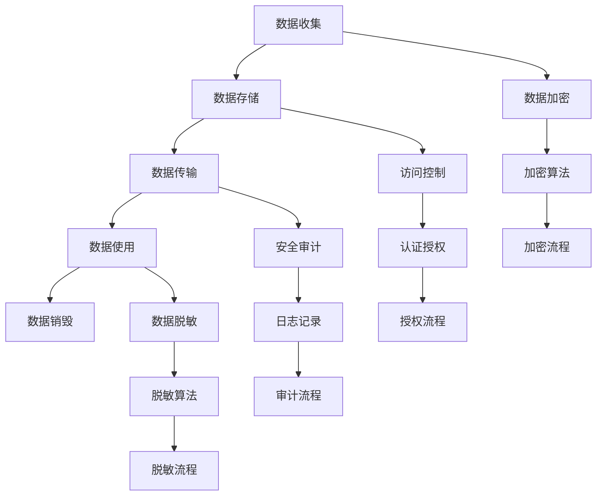
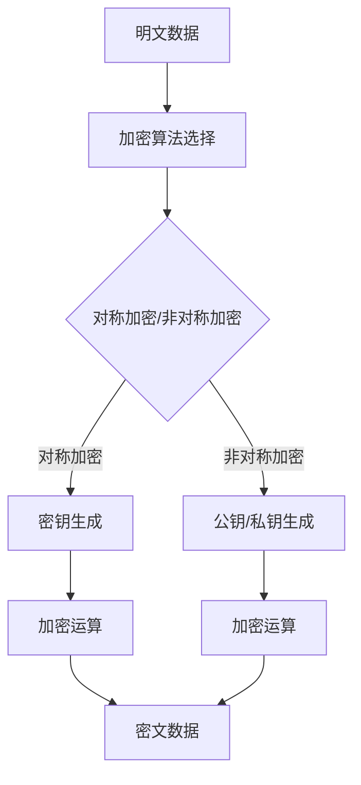
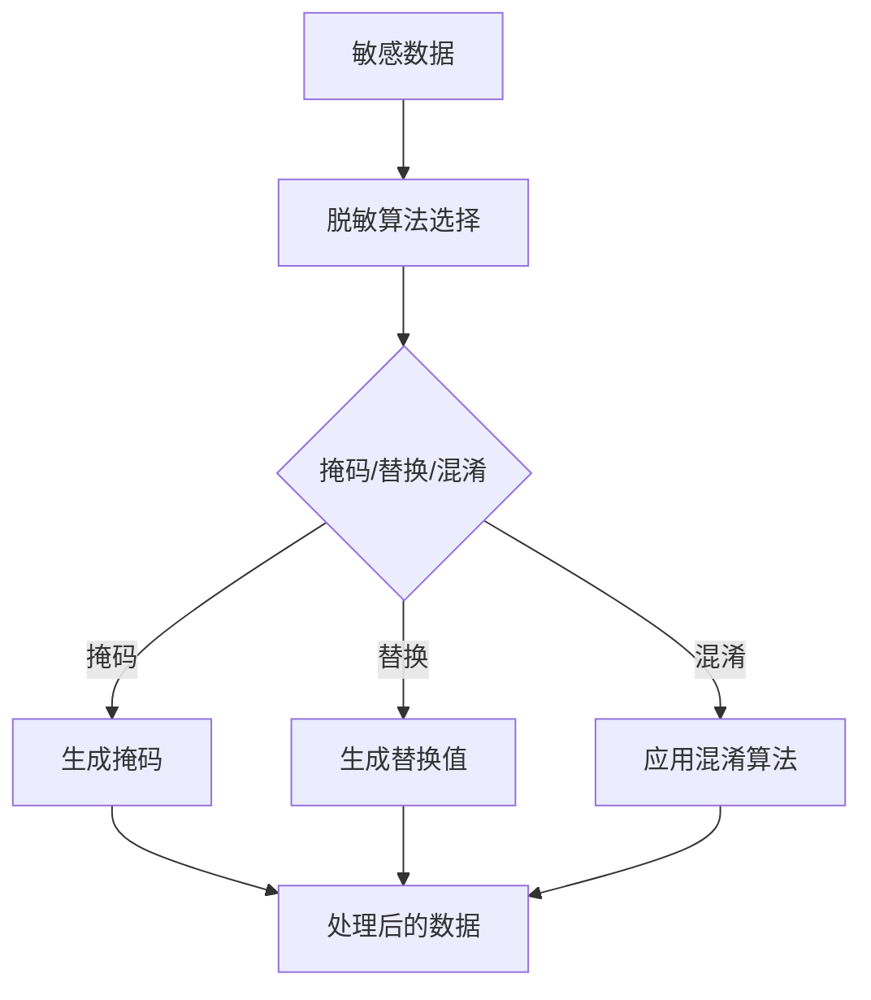

                 

### 软件安全性与隐私保护的重要性

在当今信息化、数字化飞速发展的时代，软件作为现代社会的基石，其安全性与隐私保护问题愈发凸显。软件安全性与隐私保护的重要性不仅体现在技术层面，更关乎社会、经济和个人的根本利益。

首先，**软件安全**的重要性不容忽视。随着软件系统的日益复杂化和互联化，网络攻击、数据泄露、恶意软件等安全威胁也日益严峻。安全漏洞可能导致系统崩溃、数据泄露，甚至造成严重的经济损失和社会影响。例如，2017年的“WannaCry”勒索病毒事件，短时间内感染了全球数十万台计算机，造成巨额经济损失。而2018年的Facebook数据泄露事件，则暴露了数千万用户的个人信息，引发了公众对隐私保护的高度关注。

其次，**隐私保护**的重要性日益凸显。在软件2.0时代，用户数据成为重要资产，但这也带来了隐私泄露的风险。随着大数据和人工智能技术的发展，个人数据被大规模收集、分析和利用，隐私泄露的后果更加严重。例如，2016年的“剑桥分析”公司事件，揭示了通过大数据分析操纵用户行为、影响选举结果的可能性，引发了全球范围内对隐私保护的讨论。

最后，**法律法规**对软件安全性与隐私保护的要求日益严格。在全球范围内，各国纷纷出台了一系列法律法规来保护用户隐私和数据安全。例如，欧盟的《通用数据保护条例》（GDPR）和美国加州的《消费者隐私法案》（CCPA）都对数据保护提出了严格的要求。这些法律法规不仅规范了企业的数据处理行为，也为用户隐私保护提供了法律保障。

综上所述，软件安全性与隐私保护已经成为当今社会发展的重要议题。只有通过加强安全性与隐私保护，才能保障软件系统的稳定运行，维护用户利益，促进社会的和谐发展。

### **软件2.0与信息安全背景**

软件2.0时代是信息技术发展的新阶段，这一阶段以互联网、大数据、云计算等技术的融合为特征，标志着软件形态和商业模式发生了深刻变革。软件2.0不仅仅是传统的软件应用，更是集成了海量数据、智能分析和高效交付能力的综合系统。

**1.1 软件2.0时代的到来**

软件2.0时代的到来与互联网、大数据、云计算等技术的快速发展密不可分。互联网的普及使得信息传输更加便捷，催生了Web 2.0、社交网络等新型应用模式。大数据技术的突破，使得企业能够从海量数据中提取有价值的信息，实现智能化决策。云计算的普及，则为软件2.0提供了强大的计算和存储能力，使得软件系统能够更加灵活、高效地运行。

在软件2.0时代，软件不再仅仅是孤立的工具或应用，而是成为了一种平台，能够连接不同的设备和用户，提供丰富的服务和体验。例如，移动应用、物联网设备、社交媒体等都是软件2.0的典型应用场景。这些应用场景不仅丰富了软件的形态，也带来了新的安全挑战。

**1.2 软件2.0的主要特点**

软件2.0具有以下几个主要特点：

- **数据驱动**：软件2.0时代的数据量呈爆炸性增长，数据成为企业的核心资产。软件系统能够通过大数据分析，提供个性化、智能化的服务。

- **开放性**：软件2.0强调开放接口和生态系统，使得不同系统、平台和应用能够无缝集成，实现数据共享和协同工作。

- **灵活性**：软件2.0具有高度的可扩展性和灵活性，能够快速适应市场需求和技术变革。

- **用户参与**：软件2.0注重用户的参与和反馈，通过社交互动、用户生成内容等方式，提升用户体验和满意度。

- **生态化**：软件2.0不仅仅是单一软件产品的开发，而是构建了一个包括开发者、用户、服务商等多方参与的生态体系。

**1.3 软件2.0环境下的信息安全问题**

软件2.0时代带来了新的信息安全挑战。首先，由于软件系统的开放性和互联性，攻击者可以更加容易地发现和利用系统漏洞，实施网络攻击。其次，随着数据量的增加，数据泄露的风险也大幅提升。大数据技术虽然能够帮助企业挖掘有价值的信息，但同时也可能暴露用户的隐私信息。

此外，软件2.0环境下的信息安全问题还包括：

- **分布式攻击**：分布式拒绝服务（DDoS）攻击、分布式网络攻击等成为常见威胁。

- **高级持续性威胁**（APT）：攻击者通过长期潜伏，窃取敏感数据或实施其他恶意行为。

- **移动端安全**：随着移动应用的普及，移动端的安全问题也日益突出，如恶意应用、隐私泄露等。

- **物联网安全**：物联网设备的加入，使得网络安全风险更加复杂，如设备被恶意控制、数据泄露等。

总之，软件2.0时代的到来不仅改变了软件的形态和商业模式，也带来了新的信息安全挑战。只有在深刻理解软件2.0特点的基础上，采取有效的安全措施，才能保障软件系统的安全性和可靠性。

### **隐私保护的重要性**

隐私保护在现代社会中具有极其重要的意义，它不仅关乎个人权益，也涉及到社会稳定和经济发展。理解隐私保护的重要性，首先需要认识到隐私泄露可能带来的严重后果。

**2.1 隐私泄露的后果**

隐私泄露的后果是多方面的，首先是对个人的直接侵害。个人隐私泄露可能导致以下后果：

- **财产损失**：例如，信用卡信息、银行账户信息等被窃取后，可能导致资金被盗用。
- **身份盗窃**：个人身份信息如姓名、出生日期、身份证号等被非法利用，可能被用于开设虚假账户、进行欺诈活动。
- **个人信息滥用**：个人隐私数据被第三方企业滥用，可能导致广告骚扰、垃圾邮件、骚扰电话等。
- **心理影响**：个人隐私泄露可能对受害者造成心理压力，影响其心理健康。

对企业的隐私保护不力，也可能带来严重的商业风险：

- **声誉损失**：企业发生隐私泄露事件后，用户信任度下降，企业形象受损，可能导致市场份额下滑。
- **法律责任**：根据不同国家和地区的法律法规，企业可能因隐私保护不力而面临高额罚款和法律诉讼。
- **经济损失**：隐私泄露事件可能导致企业损失客户、失去市场机会，甚至影响整体业务运营。

**2.2 法律法规对隐私保护的要求**

为了保护个人隐私，全球各国都制定了一系列法律法规，对企业的数据处理行为进行了严格规定。以下是几个主要国家和地区的隐私保护法律法规：

- **欧盟的《通用数据保护条例》（GDPR）**：GDPR是欧洲最严格的隐私保护法律之一，它规定了数据控制者和处理者必须遵守的隐私保护原则，如数据最小化、目的明确性、数据主体权利等。GDPR对违反规定的企业设置了高额罚款，最高可达公司全球营业额的4%或2000万欧元。

- **美国的《加州消费者隐私法案》（CCPA）**：CCPA是加州针对消费者隐私保护的法律，它赋予消费者对自身数据的更多控制权，包括知情权、访问权和删除权。CCPA还对企业的数据处理行为提出了严格的要求。

- **中国的《网络安全法》**和《个人信息保护法》**：中国的网络安全法和个人信息保护法也对数据保护提出了明确要求。网络安全法规定了网络运营者的安全保护义务，个人信息保护法则明确了个人信息处理的基本原则和保护措施。

**2.3 隐私保护的核心原则**

隐私保护的核心原则包括以下几个：

- **收集最小化**：企业在收集用户数据时，应遵循“最少够用”原则，只收集实现服务功能所必需的数据，避免过度收集。
- **目的明确性**：企业在收集数据时，应明确数据收集的目的，并在用户同意的范围内使用数据，避免滥用。
- **数据匿名化**：通过技术手段对用户数据进行匿名化处理，使其无法直接识别个人身份，降低隐私泄露的风险。
- **用户知情权**：用户有权知道其数据被如何收集、存储、使用和共享，企业应提供透明化的数据处理流程，让用户做出知情的选择。
- **数据安全保护**：企业应采取有效的安全措施，保护用户数据的安全，防止数据泄露、篡改和滥用。

总之，隐私保护不仅是企业合规经营的基本要求，更是构建用户信任、维护社会稳定的重要保障。只有在严格遵循隐私保护原则的基础上，企业才能在软件2.0时代持续发展。

### **隐私保护的核心原则**

在软件2.0时代，隐私保护的核心原则成为企业设计和实施隐私策略的重要基础。以下是几个关键的核心原则，它们共同构成了隐私保护的基石。

**3.1 收集最小化**

收集最小化原则要求企业在收集用户数据时，只收集实现服务功能所必需的数据，避免过度收集。这一原则基于以下考虑：

- **减少隐私泄露风险**：过度收集的数据在未经授权的情况下可能被滥用或泄露，从而增加隐私风险。通过仅收集必需数据，企业可以显著降低这一风险。
- **符合法律法规要求**：许多国家和地区的数据保护法律法规，如欧盟的《通用数据保护条例》（GDPR），明确要求企业实施数据最小化原则。
- **提升用户信任**：用户更愿意与那些遵守隐私保护原则的企业合作，因为这样企业能够在用户数据保护方面提供更高的保障。

**3.2 目的明确性**

目的明确性原则要求企业在收集、处理和存储数据时，必须明确数据的具体用途。以下是实现这一原则的关键步骤：

- **明确数据用途**：企业在收集数据前，应明确数据的具体用途，并在用户同意的范围内使用数据。例如，如果数据用于用户身份验证，则不应将其用于其他目的，如广告推送。
- **限制用途变更**：一旦数据被收集，其用途应保持一致，除非得到用户的明确同意。任何用途变更都应经过严格的审核和用户同意。
- **透明化数据用途**：企业应通过用户协议、隐私政策等方式，向用户清晰说明数据的具体用途，让用户在同意前对数据处理有充分的了解。

**3.3 数据匿名化**

数据匿名化原则通过技术手段，将用户数据转换为无法直接识别个人身份的形式，以降低隐私泄露的风险。以下是实现数据匿名化的几种常见方法：

- **数据掩码**：通过在敏感字段上添加掩码，使数据部分不可见，从而保护个人身份信息。
- **数据替换**：用随机值替换敏感数据，例如，将姓名替换为ID号。
- **数据混淆**：通过复杂算法，对数据进行处理，使得数据在解密前无法识别个人身份。

实现数据匿名化有以下几个优点：

- **增强数据安全性**：匿名化处理后的数据，即使在数据泄露事件中，也难以直接用于身份识别。
- **合规性**：许多法律法规要求企业在特定情况下对数据进行匿名化处理，以符合隐私保护要求。
- **数据再利用**：匿名化处理后的数据可以安全地用于研究和分析，而无需担心隐私泄露问题。

**3.4 用户知情权**

用户知情权原则要求企业在数据处理过程中，确保用户对其数据的收集、处理和存储有充分的知情权。以下是实现这一原则的几个关键步骤：

- **透明化数据处理流程**：企业应向用户详细说明其数据将被如何收集、存储、使用和共享，让用户在同意前对数据处理有全面的了解。
- **提供隐私政策**：企业应在用户注册或使用服务前，提供清晰、易懂的隐私政策，让用户知道其数据将受到何种保护。
- **用户选择权**：企业应提供便捷的选项，让用户能够选择是否提供其数据，或如何处理其数据。例如，用户可以选择退出某些数据处理活动。

用户知情权的重要性在于：

- **增强用户信任**：用户更愿意与那些透明、诚信的企业合作，因为这样企业能够在数据保护方面提供更高的保障。
- **合规性要求**：许多法律法规要求企业确保用户对其数据有充分的知情权，违反这一原则可能导致法律风险。

总之，隐私保护的核心原则是确保用户数据的安全和隐私。通过严格遵循这些原则，企业不仅可以降低隐私泄露风险，还可以提升用户信任和满意度，为长期发展奠定坚实基础。

### **网络安全基础**

网络安全是保障软件系统安全性和隐私保护的关键环节。要理解网络安全的基础，我们需要从安全模型和安全协议两个方面进行深入探讨。

**4.1 网络安全模型**

网络安全模型是用于分析和设计网络安全体系结构的基本框架。常见的网络安全模型包括：

- **防火墙模型**：防火墙是一种网络安全设备，用于控制进出网络的数据流量，以阻止未经授权的访问。防火墙模型的核心是建立内外网络之间的隔离，通过配置访问控制规则，控制数据流的方向和权限。

  - **优点**：防火墙可以有效地阻止外部攻击，保护内部网络的安全。
  - **缺点**：防火墙无法防止内部威胁，且对复杂攻击的防护能力有限。

- **入侵检测系统（IDS）模型**：入侵检测系统用于监控网络流量，检测潜在的安全威胁和攻击行为。IDS可以实时报警，帮助管理员及时发现和响应安全事件。

  - **优点**：IDS可以提供实时监测和报警，有助于快速发现和响应网络攻击。
  - **缺点**：IDS无法主动阻止攻击，仅能提供检测和报警功能。

- **安全套接字层（SSL）/传输层安全（TLS）模型**：SSL和TLS是一种网络安全协议，用于保护网络通信的安全性。通过加密通信，SSL/TLS可以防止数据在传输过程中被窃听、篡改和伪造。

  - **优点**：SSL/TLS可以提供强大的加密保护，确保数据传输的安全。
  - **缺点**：加密通信可能会降低网络性能，且配置和管理相对复杂。

**4.2 安全协议**

安全协议是用于实现网络安全保护的一系列规则和标准。以下是一些常用的安全协议：

- **HTTPS**：超文本传输协议（HTTP）的安全版本，通过SSL/TLS协议加密通信，确保数据传输的安全性。HTTPS广泛应用于互联网上的数据传输，如网页浏览、在线支付等。

  - **工作原理**：HTTPS在HTTP协议的基础上，增加了SSL/TLS加密层，使数据在客户端和服务器之间传输时经过加密处理。
  - **实现**：HTTPS通常使用443端口进行通信，服务器和客户端需要配置SSL证书以启用加密。

- **SSL/TLS**：安全套接字层/传输层安全协议，用于在网络通信中实现数据加密、身份验证和数据完整性保护。

  - **加密算法**：SSL/TLS协议支持多种加密算法，包括对称加密（如AES）、非对称加密（如RSA）和哈希算法（如SHA）。
  - **工作流程**：SSL/TLS协议的工作流程包括握手阶段、记录阶段和终止阶段。在握手阶段，客户端和服务器协商加密算法和密钥；在记录阶段，数据经过加密传输；在终止阶段，关闭安全连接。

- **VPN**：虚拟专用网络（VPN）协议，通过加密通信，为远程用户或分支机构提供安全的网络访问。

  - **工作原理**：VPN协议在公共网络上建立一条加密通道，使远程用户可以安全地访问企业内部网络。
  - **实现**：VPN协议包括PPTP、L2TP/IPsec等，不同协议具有不同的性能和安全特性。

通过理解和应用这些安全模型和安全协议，企业可以构建一个安全、可靠的网络安全体系，保障软件系统的安全性和隐私保护。

### **隐私保护技术基础**

在软件2.0时代，隐私保护技术的应用变得越来越重要，以应对日益复杂的网络安全威胁。以下将详细讨论两种关键的隐私保护技术：数据加密技术和数据脱敏技术。

**5.1 数据加密技术**

数据加密技术是一种将原始数据转换为不可读形式的方法，只有拥有正确密钥的用户才能解密和读取数据。加密技术是隐私保护的核心手段之一，主要用于保护数据的机密性。

- **对称加密与非对称加密**

  - **对称加密**：对称加密算法使用相同的密钥进行加密和解密。常见的对称加密算法包括AES（高级加密标准）和DES（数据加密标准）。

    - **工作原理**：对称加密算法通过将明文数据与密钥进行加密运算，生成密文。解密时，使用相同的密钥进行逆向运算，恢复出明文数据。

    - **优点**：对称加密算法加密速度快，计算效率高。

    - **缺点**：对称加密算法需要安全的密钥分发机制，密钥管理复杂。

  - **非对称加密**：非对称加密算法使用一对密钥进行加密和解密，公钥用于加密，私钥用于解密。常见的非对称加密算法包括RSA（Rivest-Shamir-Adleman）和ECC（椭圆曲线加密）。

    - **工作原理**：非对称加密算法通过公钥加密数据，只有对应的私钥可以解密。这种方式确保了即使密钥在公开网络中传输，数据也不会被窃取。

    - **优点**：非对称加密算法提供更高级的安全性，无需复杂的密钥分发机制。

    - **缺点**：非对称加密算法计算复杂度高，加密和解密速度相对较慢。

- **常用加密算法**

  - **AES**：AES是一种基于密钥的对称加密算法，支持128位、192位和256位密钥长度，是目前使用最广泛的加密标准。

    - **工作原理**：AES使用替换-置换网络（SPN）结构，通过对明文数据块进行一系列线性变换，实现数据加密。

  - **RSA**：RSA是一种基于公钥的非对称加密算法，通常用于数据加密和数字签名。

    - **工作原理**：RSA通过大素数分解和模运算实现加密和解密。加密时，使用公钥和明文进行模运算，解密时，使用私钥进行模逆运算。

- **加密技术在隐私保护中的应用**

  - **数据存储**：企业可以使用加密技术保护存储在数据库或其他存储介质中的敏感数据，防止未经授权的访问。
  - **数据传输**：在数据传输过程中，使用加密协议（如HTTPS）保护数据传输的安全，防止数据被窃听和篡改。
  - **数据备份**：在数据备份过程中，对备份数据进行加密，确保备份数据的安全性和完整性。

**5.2 数据脱敏技术**

数据脱敏技术通过对敏感数据进行变换，使其无法被直接识别，从而保护个人隐私和数据的安全性。数据脱敏技术通常用于数据分析和测试，确保敏感数据不被泄露。

- **数据脱敏的方法**

  - **掩码**：通过在敏感数据字段上添加掩码，使其部分不可见，从而保护个人身份信息。例如，将电话号码中间几位用星号代替。

  - **替换**：将敏感数据字段替换为虚构的值，例如，将姓名替换为“用户X”。

  - **混淆**：通过复杂的算法，将敏感数据字段进行混淆处理，使其无法直接识别。例如，使用伪随机数生成器生成替代值。

- **数据脱敏的挑战与解决方案**

  - **挑战**：数据脱敏面临的主要挑战包括数据质量、数据一致性和算法透明度。数据质量差可能导致脱敏效果不理想，数据一致性差可能导致数据分析和测试不准确，算法透明度差可能影响数据安全性和隐私保护。

  - **解决方案**：为应对这些挑战，可以采用以下方法：

    - **数据质量提升**：通过数据清洗和预处理，提升数据质量，确保脱敏效果准确可靠。
    - **数据一致性保障**：建立统一的数据标准，确保在不同系统和场景下的数据一致性。
    - **算法透明度提高**：使用开放且经过验证的脱敏算法，并定期进行算法评估和优化，确保算法透明度和安全性。

- **数据脱敏技术在隐私保护中的应用**

  - **数据存储**：在数据存储阶段，对敏感数据进行脱敏处理，确保存储在数据库中的数据无法直接识别个人身份。
  - **数据传输**：在数据传输阶段，对传输的敏感数据进行脱敏处理，防止数据在传输过程中被窃取或篡改。
  - **数据分析和测试**：在数据分析和测试阶段，对敏感数据进行脱敏处理，确保数据安全性和隐私保护。

总之，数据加密技术和数据脱敏技术是隐私保护的重要手段。通过合理应用这些技术，企业可以有效保障用户数据的安全性和隐私，为软件系统的稳定运行和长期发展提供保障。

### **安全性与隐私保护策略设计**

在软件2.0时代，安全性与隐私保护策略的设计是确保系统稳定运行和数据安全的关键步骤。一个有效的安全性与隐私保护策略需要综合考虑用户需求、业务需求和法律法规要求。以下是详细的安全性与隐私保护策略设计步骤。

#### **3.1 安全性与隐私保护需求分析**

**3.1.1 安全性与隐私保护需求收集**

需求分析是策略设计的基础，涉及多个方面的需求收集：

- **用户需求**：通过用户访谈、问卷调查、用户反馈等方式，了解用户对隐私保护和安全性的期望和担忧。例如，用户可能关注数据收集的透明度、数据使用的目的和范围等。

- **业务需求**：与业务团队密切合作，了解业务功能实现所需的隐私保护和安全措施。业务需求可能包括数据存储、传输和处理的合规性、业务连续性要求等。

- **法律法规要求**：研究适用的法律法规，如GDPR、CCPA等，确保策略符合法律要求。例如，GDPR对数据收集、存储、处理和传输都有详细的规定。

**3.1.2 需求分析方法**

在需求分析过程中，可以采用以下方法：

- **SWOT分析**：分析系统在安全性与隐私保护方面的优势、劣势、机会和威胁，帮助确定优先级和改进方向。

- **流程图分析**：绘制系统的数据处理流程图，识别关键环节和潜在的安全风险。

- **利益相关者分析**：识别系统的主要利益相关者，包括用户、业务团队、技术团队等，并了解他们的需求和期望。

#### **3.2 安全性与隐私保护策略制定**

**3.2.1 安全性与隐私保护策略框架**

制定安全性与隐私保护策略时，需要构建一个完整的策略框架，包括以下部分：

- **目标**：明确系统在安全性与隐私保护方面的目标，如数据保护、业务连续性等。

- **原则**：制定具体的安全性与隐私保护原则，如数据最小化、目的明确性、数据匿名化、用户知情权等。

- **控制措施**：制定具体的控制措施，包括技术措施、管理措施等。例如，使用加密技术保护数据存储和传输，定期进行安全审计和风险评估。

- **执行计划**：制定详细的执行计划，明确实施步骤、责任人和时间表。

**3.2.2 策略实施与评估**

策略实施和评估是确保策略有效性的关键：

- **实施流程**：根据执行计划，逐步实施安全性与隐私保护措施。例如，首先进行数据收集和存储的审计，然后实施数据加密和数据脱敏。

- **评估方法**：定期对策略的实施效果进行评估，采用定量和定性方法分析数据保护措施的有效性。例如，通过渗透测试、漏洞扫描等方式评估系统安全性，通过用户调查和数据分析评估隐私保护措施的效果。

#### **3.3 策略调整与优化**

安全性与隐私保护策略需要根据实际情况进行动态调整和优化：

- **反馈机制**：建立有效的反馈机制，收集用户和利益相关者的反馈，及时调整策略。

- **持续改进**：定期对策略进行评估和优化，确保其始终符合最新的法律法规和业务需求。

通过科学的需求分析、严格的策略制定和有效的实施评估，企业可以构建一个全面、有效的安全性与隐私保护策略，保障软件系统的安全性和用户的隐私。

### **安全性与隐私保护机制设计**

在确保软件系统的安全性与隐私保护方面，安全性与隐私保护机制的设计至关重要。有效的机制设计不仅能够提高系统的安全性，还能确保用户数据的隐私。以下将详细探讨安全性与隐私保护机制的设计原则、实现方式和关键流程。

#### **4.1 安全性与隐私保护机制概述**

安全性与隐私保护机制是指一系列用于保障系统安全性和用户隐私的技术和管理措施。这些机制包括但不限于：

- **访问控制**：通过控制用户对系统资源的访问权限，防止未经授权的访问。
- **数据加密**：通过加密技术保护存储和传输中的敏感数据，防止数据泄露。
- **审计与监控**：实时监控系统的安全事件和用户行为，确保数据的安全性和合规性。
- **数据脱敏**：通过技术手段对敏感数据进行处理，使其无法被直接识别，从而保护用户隐私。

#### **4.2 安全性与隐私保护机制的设计原则**

设计安全性与隐私保护机制时，应遵循以下原则：

- **最小权限原则**：确保每个用户或进程仅拥有完成其任务所需的最低权限，避免权限过大的用户或进程对系统造成威胁。
- **安全性优先原则**：在任何设计决策中，安全性应该是首要考虑的因素，不应以牺牲安全为代价来追求其他目标。
- **数据最小化原则**：仅收集和存储实现服务功能所必需的数据，避免过度收集和存储。
- **透明性原则**：机制设计应具备透明性，用户应能够清晰地了解其数据的处理和使用方式。
- **易用性原则**：机制设计应易于使用和管理，降低用户和系统管理员的工作负担。

#### **4.3 安全性与隐私保护机制实现**

安全性与隐私保护机制的实现涉及多个方面，包括技术实现和管理措施。以下为关键步骤：

**4.3.1 技术实现**

- **访问控制**：使用身份验证和授权机制来控制用户对系统资源的访问。常用的方法包括基于用户名和密码的认证、多因素认证（MFA）、访问控制列表（ACL）和角色访问控制（RBAC）。

  - **实现方式**：在系统中配置访问控制规则，确保只有授权用户能够访问特定资源。例如，在数据库中设置访问权限，只允许特定用户组读取或写入数据。

- **数据加密**：使用加密技术对存储和传输的敏感数据进行保护。常用的加密算法包括AES、RSA和ECC。

  - **实现方式**：在数据存储阶段，使用数据库加密模块或文件加密工具对敏感数据进行加密。在数据传输阶段，使用HTTPS协议和SSL/TLS证书确保数据传输的安全。

- **数据脱敏**：通过技术手段对敏感数据进行脱敏处理，以保护用户隐私。常用的脱敏方法包括数据掩码、数据替换和数据混淆。

  - **实现方式**：在数据处理过程中，使用脱敏工具或自定义脚本对敏感数据进行处理。例如，将电话号码中的中间几位用星号代替，或将姓名替换为随机字符。

**4.3.2 管理措施**

- **安全培训与意识提升**：定期对员工进行安全培训，提高他们对安全性和隐私保护的认识和意识。
- **安全审计与合规检查**：定期进行安全审计，确保系统符合法律法规和内部安全标准。例如，对数据收集、存储、处理和传输过程进行合规性检查。
- **安全监控与应急响应**：建立实时监控和报警系统，及时发现和处理安全事件。制定应急响应计划，确保在发生安全事件时能够迅速应对。

#### **4.4 安全性与隐私保护机制实现的关键流程**

实现安全性与隐私保护机制的关键流程包括以下几个步骤：

**4.4.1 需求分析**

- **收集需求**：通过用户访谈、问卷调查等方式，了解用户对安全性和隐私保护的需求和期望。
- **分析需求**：对收集到的需求进行整理和分析，确定安全性和隐私保护的具体目标和要求。

**4.4.2 机制设计**

- **设计架构**：根据需求分析结果，设计安全性与隐私保护机制的架构，确定各组件的功能和接口。
- **制定策略**：制定具体的实施策略和方案，确保机制能够有效实现安全性和隐私保护目标。

**4.4.3 技术实现**

- **开发与测试**：开发安全性与隐私保护机制所需的软件和工具，并进行功能测试和性能测试，确保其正常运行。
- **部署与配置**：将安全性与隐私保护机制部署到生产环境中，并进行配置，确保其与现有系统无缝集成。

**4.4.4 管理与监控**

- **安全培训**：对员工进行安全培训，提高他们对安全性和隐私保护的认识。
- **安全审计**：定期进行安全审计，检查机制的有效性和合规性。
- **监控与响应**：建立实时监控和报警系统，及时发现和处理安全事件。

通过遵循上述设计原则和关键流程，企业可以构建一个全面、有效的安全性与隐私保护机制，保障软件系统的安全性和用户的隐私。

### **安全性与隐私保护机制测试**

在安全性与隐私保护机制实现后，进行严格的测试是确保机制有效性的关键步骤。安全性与隐私保护机制的测试不仅包括功能测试，还涉及非功能测试。以下将详细讨论这些测试方法及其具体实施过程。

#### **5.1 安全性与隐私保护测试方法**

**5.1.1 功能测试**

功能测试主要关注机制是否能够按照设计要求正常工作，包括以下方面：

- **访问控制测试**：验证访问控制机制是否能够正确限制用户对系统资源的访问权限，确保只有授权用户能够访问特定资源。
- **数据加密测试**：验证数据加密机制是否能够正确加密和解密数据，确保数据在存储和传输过程中不被窃取或篡改。
- **数据脱敏测试**：验证数据脱敏机制是否能够正确处理敏感数据，使其无法被直接识别。

**5.1.2 非功能测试**

非功能测试主要关注系统的稳定性、可靠性、性能等方面，包括以下方面：

- **压力测试**：模拟高负载场景，测试系统在压力下的性能和稳定性，确保机制在高并发情况下仍能正常运行。
- **性能测试**：测试系统在正常负载下的响应时间和吞吐量，确保机制不会显著降低系统的整体性能。
- **安全漏洞扫描**：使用专业工具扫描系统，发现潜在的安全漏洞，确保系统没有已知的安全缺陷。

#### **5.2 测试案例与结果分析**

**5.2.1 访问控制测试案例**

**测试目标**：验证访问控制机制是否能够正确限制用户对系统资源的访问权限。

**测试步骤**：

1. 准备测试环境和用户账号，包括管理员账号和普通用户账号。
2. 配置访问控制规则，确保管理员账号具有对数据库的完全访问权限，普通用户账号仅具有读取权限。
3. 分别使用管理员账号和普通用户账号尝试访问数据库，记录结果。

**测试结果**：

- 管理员账号成功访问数据库，普通用户账号无法访问，验证通过。

**分析**：该测试结果表明访问控制机制能够正确限制用户访问权限，确保只有授权用户能够访问系统资源。

**5.2.2 数据加密测试案例**

**测试目标**：验证数据加密机制是否能够正确加密和解密数据。

**测试步骤**：

1. 准备测试数据和加密密钥。
2. 使用加密算法对测试数据进行加密，记录加密后的数据。
3. 使用相同的加密密钥对加密后的数据进行解密，记录解密后的数据。
4. 比较原始数据和解密后的数据，验证是否一致。

**测试结果**：

- 加密后的数据经过解密后与原始数据完全一致，验证通过。

**分析**：该测试结果表明数据加密机制能够正确实现加密和解密，确保数据在存储和传输过程中不会被窃取或篡改。

**5.2.3 数据脱敏测试案例**

**测试目标**：验证数据脱敏机制是否能够正确处理敏感数据，使其无法被直接识别。

**测试步骤**：

1. 准备测试数据和脱敏规则。
2. 使用脱敏工具对测试数据进行脱敏处理，记录脱敏后的数据。
3. 使用脱敏后的数据执行业务逻辑，验证其是否能够正常工作。

**测试结果**：

- 脱敏后的数据在业务逻辑处理过程中未出现异常，验证通过。

**分析**：该测试结果表明数据脱敏机制能够正确处理敏感数据，确保数据在分析和测试过程中不会被直接识别，从而保护用户隐私。

#### **5.3 测试总结**

通过功能测试和非功能测试，可以全面验证安全性与隐私保护机制的有效性。以下为测试总结：

- **访问控制测试**：验证通过，确保只有授权用户能够访问系统资源。
- **数据加密测试**：验证通过，确保数据在存储和传输过程中不会被窃取或篡改。
- **数据脱敏测试**：验证通过，确保敏感数据在分析和测试过程中不会被直接识别。

测试结果表明，安全性与隐私保护机制能够按照设计要求正常运行，为系统的安全性和用户的隐私提供有效保障。

### **安全性与隐私保护项目实战**

在实际项目中，安全性与隐私保护策略的实施是一个系统性、复杂的过程。以下将详细描述安全性与隐私保护项目实施的方法和步骤，以及项目管理和监控的关键点。

#### **6.1 项目规划**

**6.1.1 项目规划方法**

项目规划是确保安全性与隐私保护策略顺利实施的关键步骤。以下是项目规划的主要方法和步骤：

- **确定项目目标**：明确项目的安全性与隐私保护目标，如保护用户数据、确保系统稳定运行等。
- **项目范围**：定义项目的范围，包括涉及的业务模块、系统和用户。
- **资源需求**：评估项目所需的资源，如人力、技术设备、预算等。
- **时间表**：制定详细的项目时间表，明确各阶段的任务和交付物。
- **风险评估**：识别项目可能面临的风险，并制定相应的应对措施。

**6.1.2 项目团队组织**

项目团队的组织结构直接影响项目的执行效果。以下是一个典型的项目团队组织结构：

- **项目经理**：负责整个项目的规划、执行和监控。
- **安全专家**：负责安全性与隐私保护策略的设计和实施。
- **开发团队**：负责实现安全性与隐私保护功能。
- **测试团队**：负责测试和验证安全性与隐私保护机制的有效性。
- **运维团队**：负责部署和维护安全性与隐私保护系统。

#### **6.2 项目实施**

**6.2.1 项目实施流程**

项目实施是确保安全性与隐私保护策略落地的重要环节。以下是项目实施的主要流程：

- **需求分析**：与相关利益相关者进行沟通，明确安全性与隐私保护需求。
- **策略设计**：根据需求分析结果，制定详细的安全性与隐私保护策略。
- **机制实现**：开发团队根据策略设计，实现安全性与隐私保护机制。
- **测试与验证**：测试团队对安全性与隐私保护机制进行功能测试和非功能测试，确保其有效性和可靠性。
- **部署与上线**：将安全性与隐私保护系统部署到生产环境，并进行上线准备。
- **培训与推广**：对用户和系统管理员进行安全培训，确保他们能够正确使用和管理安全性与隐私保护系统。

**6.2.2 隐私保护机制的实施**

以下是安全性与隐私保护机制实施的具体步骤：

- **数据加密**：使用加密工具对敏感数据进行加密，确保数据在存储和传输过程中不会被窃取或篡改。
- **访问控制**：配置访问控制规则，确保只有授权用户能够访问系统资源。
- **数据脱敏**：对敏感数据进行脱敏处理，保护用户隐私。
- **日志记录与监控**：记录系统操作日志，实时监控系统的安全事件和用户行为。

#### **6.3 项目管理与监控**

**6.3.1 项目进度监控**

项目进度监控是确保项目按计划进行的必要手段。以下是一些关键点：

- **定期汇报**：项目经理定期向相关利益相关者汇报项目进度。
- **进度报告**：生成详细的进度报告，包括任务完成情况、资源使用情况、风险评估等。
- **进度跟踪**：使用项目管理工具（如JIRA、Trello）对项目进度进行实时跟踪。

**6.3.2 项目风险控制**

项目风险控制是确保项目顺利进行的保障。以下是一些关键点：

- **风险识别**：定期识别项目可能面临的风险，包括技术风险、人员风险、外部环境风险等。
- **风险评估**：对识别出的风险进行评估，确定其可能性和影响。
- **风险应对**：制定应对措施，降低风险的影响。
- **风险监控**：实时监控项目风险的变化，及时调整应对策略。

通过科学的项目规划、严格的项目实施和有效的项目监控，企业可以确保安全性与隐私保护策略在项目中得到有效实施，为系统的安全性和用户的隐私提供坚实保障。

### **安全性与隐私保护案例分析**

在分析实际案例时，我们可以深入了解安全性与隐私保护策略在不同场景下的实施效果，从中总结经验，为未来的项目提供有益的启示。

**6.1 案例分析概述**

**6.1.1 案例分析目的**

案例分析的主要目的是通过具体实例，探讨安全性与隐私保护策略在不同应用场景下的实施效果，总结经验教训，提升整体安全性与隐私保护能力。

**6.1.2 案例分析范围**

本文将涵盖国内外的多个典型案例，包括企业内部案例、公共部门案例以及互联网行业案例，旨在提供全面的分析视角。

**6.2 案例分析内容**

**6.2.1 案例背景**

**案例一：某大型电商公司的数据泄露事件**

- **时间**：2019年
- **地点**：中国
- **背景**：某大型电商公司在一次数据泄露事件中，大量用户个人信息（包括姓名、电话号码、电子邮件地址、密码等）被非法获取。该事件引起了广泛关注，公司形象受损，用户信任度大幅下降。

**案例二：某公共部门的网络安全事件**

- **时间**：2020年
- **地点**：美国
- **背景**：某州政府的一个官方网站在遭遇黑客攻击后，大量政府数据（包括个人身份信息、财务信息等）被窃取。事件导致数千名用户的个人信息泄露，引发了严重的法律和公共关系危机。

**案例三：某社交媒体平台的数据隐私保护实践**

- **时间**：2021年
- **地点**：全球
- **背景**：某全球知名的社交媒体平台在全球范围内实施了严格的数据隐私保护策略，通过数据加密、访问控制和用户知情权等措施，大幅提升了用户数据的保护水平，赢得了用户的信任。

**6.2.2 案例过程与结果**

**案例一：数据泄露事件**

- **事件过程**：由于系统安全漏洞和内部管理不善，黑客成功入侵了电商公司的数据库，窃取了大量用户信息。
- **结果**：事件发生后，公司迅速采取措施，关闭了漏洞、更换了密码，并通知受影响的用户。然而，由于事件处理不当，公司面临巨额罚款和法律诉讼，同时损失了大量用户。

**案例二：网络安全事件**

- **事件过程**：黑客利用漏洞攻击了州政府官方网站，通过钓鱼邮件和恶意软件获取了用户身份信息。
- **结果**：事件发生后，政府采取了紧急措施，包括关闭受影响的网站、加强网络安全监控等。同时，公司向受影响的用户提供了免费信用监控服务，并承诺加强网络安全防护。

**案例三：数据隐私保护实践**

- **事件过程**：社交媒体平台在用户注册和数据处理过程中，严格遵循隐私保护原则，提供透明的隐私政策，并采用先进的数据加密技术。
- **结果**：通过一系列隐私保护措施，平台赢得了用户的信任，用户活跃度和用户满意度显著提升。同时，公司避免了可能的隐私泄露事件和相应的法律风险。

**6.2.3 案例启示与经验**

**案例一**：数据泄露事件带来的启示

- **加强系统安全防护**：通过定期进行安全审计和漏洞扫描，及时发现和修复系统漏洞。
- **提升内部管理**：加强员工的安全意识和培训，建立严格的访问控制机制，防止内部人员滥用权限。
- **及时应对**：在发生数据泄露事件时，迅速采取应急措施，通知受影响的用户，并提供相应的补救措施。

**案例二**：网络安全事件带来的启示

- **加强网络安全监控**：采用先进的网络安全监控工具，实时检测和响应潜在的网络攻击。
- **完善应急预案**：制定详细的网络安全应急预案，确保在发生安全事件时能够迅速应对，减少损失。
- **用户教育**：加强对用户的网络安全教育，提高用户对钓鱼邮件和恶意软件的识别能力。

**案例三**：数据隐私保护实践带来的启示

- **透明化隐私政策**：向用户清晰地说明数据的收集、使用和共享方式，提高用户对隐私保护的认知。
- **先进的数据加密技术**：采用先进的加密技术，确保数据在存储和传输过程中的安全性。
- **用户知情权**：尊重用户的知情权，提供方便的用户操作界面，让用户能够自主管理其个人信息。

通过这些案例分析，我们可以看到，安全性与隐私保护不仅需要技术手段的支持，还需要严格的内部管理和透明的用户沟通。只有在多方面共同努力下，才能实现全面的安全性与隐私保护。

### **安全性与隐私保护技术发展趋势**

随着技术的不断进步，安全性与隐私保护技术也在不断创新和发展。以下是当前几个关键趋势，包括人工智能（AI）和区块链技术对安全性与隐私保护的影响。

**7.1 人工智能与安全性的关系**

**7.1.1 人工智能在安全性中的应用**

人工智能技术在网络安全领域有着广泛的应用。例如：

- **入侵检测**：使用机器学习算法，可以对网络流量进行实时分析，检测潜在的恶意行为。传统的入侵检测系统（IDS）依赖于预定义的规则，而基于人工智能的入侵检测系统能够通过学习正常网络行为模式，自动识别异常行为。
- **恶意软件检测**：人工智能技术能够识别未知恶意软件，通过其行为特征进行分析和分类，提高检测的准确性和效率。
- **安全事件预测**：利用历史数据和机器学习算法，可以预测未来可能发生的网络安全事件，提前采取预防措施。

**7.1.2 人工智能对安全性的影响**

虽然人工智能在提高安全性方面具有巨大潜力，但也带来了一些新的挑战：

- **自动化攻击**：人工智能技术可以使攻击者更加高效地发动网络攻击，如自动化的分布式拒绝服务（DDoS）攻击。
- **AI自身的安全风险**：如果人工智能系统存在漏洞或被恶意利用，可能会对网络安全造成严重威胁。
- **隐私保护**：人工智能技术在处理大量用户数据时，可能引发隐私泄露风险，需要采取有效的隐私保护措施。

**7.1.3 人工智能提升安全性的潜力**

人工智能在提升安全性方面的潜力主要体现在以下几个方面：

- **自适应防护**：人工智能系统可以根据不断变化的威胁环境，自动调整和优化安全策略，提高防护能力。
- **实时响应**：通过实时分析网络流量和系统日志，人工智能系统可以快速响应安全事件，减少安全事件的影响。
- **人机协同**：人工智能可以协助安全专家进行复杂的安全分析，提高整体的响应效率。

**7.2 区块链技术在安全性与隐私保护中的应用**

**7.2.1 区块链技术的概述**

区块链是一种分布式账本技术，具有去中心化、不可篡改和透明性等特点。区块链的基本原理包括：

- **分布式账本**：数据存储在多个节点上，任何单一节点无法控制整个网络。
- **共识机制**：通过共识算法，确保网络中的所有节点对数据的共识。
- **加密技术**：使用加密算法保护数据的安全性和隐私。

**7.2.2 区块链在安全性与隐私保护中的应用案例**

- **身份验证**：区块链技术可以提供一种去中心化的身份验证方式，通过加密和分布式账本，确保用户身份的可靠性和隐私。
- **数据存储与访问控制**：区块链可以用于存储敏感数据，如个人身份信息和医疗记录，通过加密和访问控制机制，确保数据的安全性和隐私。

**7.3 未来安全性与隐私保护技术的发展趋势**

**7.3.1 安全性与隐私保护的发展方向**

未来安全性与隐私保护技术的发展方向包括：

- **自适应与智能化**：随着人工智能技术的进步，安全性与隐私保护系统将更加智能化和自适应，能够更好地应对复杂的安全威胁。
- **隐私增强技术**：隐私增强技术（PETs）如差分隐私、联邦学习等，将进一步提高数据处理的隐私保护水平。
- **跨领域合作**：安全性与隐私保护需要跨领域合作，包括政府、企业、研究机构和用户，共同推动技术发展和政策制定。

**7.3.2 安全性与隐私保护的未来挑战**

未来安全性与隐私保护面临的挑战包括：

- **复杂攻击手段**：随着技术的进步，攻击手段将更加复杂和多变，需要不断创新安全技术和策略。
- **跨境数据隐私保护**：随着全球化的深入，跨境数据传输和处理将带来新的隐私保护挑战，需要建立更加完善的法律和标准。
- **技术与法规的平衡**：如何在保障用户隐私的同时，满足业务发展的需求，将是一个持续的挑战。

通过不断探索和利用新兴技术，安全性与隐私保护领域将继续发展，为构建一个更加安全、可靠的数字社会提供坚实保障。

### **安全性与隐私保护未来展望**

随着技术的飞速发展，安全性与隐私保护领域正面临新的机遇与挑战。以下是未来安全性与隐私保护的发展趋势、面临的挑战以及相应的策略和建议。

**8.1 未来安全性与隐私保护发展趋势**

**8.1.1 安全性与隐私保护的发展方向**

1. **自适应与智能化**：未来安全性与隐私保护系统将更加智能化和自适应，能够实时响应和处理复杂的安全威胁。人工智能和机器学习技术将在其中发挥重要作用，帮助系统自动识别潜在威胁并采取相应措施。

2. **隐私增强技术**：隐私增强技术（PETs）如差分隐私、联邦学习、同态加密等将继续发展，提高数据处理过程中的隐私保护水平。这些技术将使数据在共享和分析过程中更加安全，从而缓解隐私泄露风险。

3. **跨领域合作**：安全性与隐私保护需要跨领域合作，包括政府、企业、研究机构和用户。建立多方参与的协作机制，共同制定标准和法规，推动技术发展和政策完善。

4. **去中心化和区块链技术**：区块链技术的去中心化和不可篡改性将在安全性与隐私保护中发挥更大作用。通过分布式账本技术，可以实现更安全、透明和可信的数据存储和传输。

**8.1.2 安全性与隐私保护的未来挑战**

1. **复杂攻击手段**：随着技术的进步，攻击手段将更加复杂和多变，包括高级持续性威胁（APT）、社交工程、物联网（IoT）攻击等。企业需要不断创新安全技术和策略，以应对这些新型威胁。

2. **跨境数据隐私保护**：全球化的深入使得跨境数据传输和处理变得更加普遍，但这也带来了新的隐私保护挑战。如何在保障数据流动自由的同时，满足不同国家和地区的隐私保护要求，将是一个重要课题。

3. **技术与法规的平衡**：如何在保障用户隐私的同时，满足业务发展的需求，将是一个持续的挑战。需要在技术进步和法律法规之间找到平衡，确保安全性与隐私保护策略能够有效实施。

**8.2 安全性与隐私保护的发展策略**

**8.2.1 安全性与隐私保护的策略框架**

1. **全面的安全与隐私保护策略**：制定全面的安全与隐私保护策略，包括数据收集、存储、处理、传输和销毁等全生命周期的管理。确保每个环节都符合隐私保护要求。

2. **针对不同场景的定制化策略**：根据不同的业务场景和数据类型，制定相应的安全性与隐私保护策略。例如，对于敏感数据，可以采取更严格的加密和访问控制措施。

**8.2.2 安全性与隐私保护的发展建议**

1. **技术创新的持续推动**：持续投入研发，推动安全性与隐私保护技术的发展。特别是在人工智能、区块链、量子计算等领域，积极探索新的技术和应用。

2. **法律法规的不断完善**：推动相关法律法规的制定和完善，确保其能够及时应对新的技术挑战和隐私保护需求。同时，加强国际间的合作与协调，建立全球统一的隐私保护框架。

3. **社会责任的强化承担**：企业应积极承担社会责任，加强内部安全文化建设，提高员工的安全意识和隐私保护意识。同时，通过透明的隐私政策和用户知情权，增强用户对企业的信任。

4. **教育和培训**：加强对用户和安全专家的隐私保护教育和培训，提高他们对隐私保护和安全威胁的认识。建立专业的安全团队，提升整体的安全防护能力。

通过技术创新、法规完善和社会责任承担，安全性与隐私保护领域将不断发展，为构建一个更加安全、可靠的数字社会提供坚实保障。

### **附录A：安全性与隐私保护工具与资源**

为了更好地进行安全性与隐私保护工作，企业和技术人员可以借助一系列专业的工具与资源。以下是几类常用的工具和资源的介绍。

**A.1 安全性与隐私保护工具介绍**

**A.1.1 加密工具**

- **OpenSSL**：OpenSSL是一个强大的加密工具包，支持SSL/TLS协议，可用于加密数据传输、生成证书等。

  - **优势**：功能丰富，支持多种加密算法，社区支持良好。
  - **适用场景**：用于网站和应用程序的安全通信、服务器配置等。

- **Cryptlib**：Cryptlib是一个跨平台的加密库，支持多种加密算法和协议。

  - **优势**：模块化设计，易于集成到不同的项目中。
  - **适用场景**：适用于需要加密功能的应用程序开发。

**A.1.2 安全性与隐私保护软件框架**

- **Zabbix**：Zabbix是一个开源的监控工具，可用于监控系统性能、网络流量和安全事件。

  - **优势**：功能全面，支持多种插件和扩展。
  - **适用场景**：适用于企业级监控系统，特别是需要监控网络和安全状况的场景。

- **Security Onion**：Security Onion是一个基于Linux的开源安全信息和事件管理（SIEM）平台，集成了多种开源安全工具。

  - **优势**：集成度高，易于部署和管理。
  - **适用场景**：适用于企业安全监控和网络安全事件响应。

**A.2 隐私保护相关法规与政策**

**A.2.1 国内隐私保护法律法规**

- **《网络安全法》**：我国《网络安全法》对网络安全、数据保护等方面做出了明确规定。

  - **主要内容**：网络运营者的安全保护义务、网络安全事件应急预案、个人信息保护等。

  - **适用场景**：适用于所有网络运营者和数据处理活动。

- **《个人信息保护法》**：这是我国首部专门针对个人信息保护的综合性法律。

  - **主要内容**：个人信息处理规则、个人信息保护义务、个人信息权利等。

  - **适用场景**：适用于所有涉及个人信息处理的企业和机构。

**A.2.2 国际隐私保护法规**

- **GDPR（通用数据保护条例）**：GDPR是欧盟制定的严格的数据保护法规。

  - **主要内容**：数据保护原则、数据主体权利、数据跨境传输等。

  - **适用场景**：适用于在欧盟境内运营的所有企业和组织。

- **CCPA（加州消费者隐私法案）**：CCPA是加州针对消费者隐私保护的法律。

  - **主要内容**：消费者的知情权和删除权、数据处理规则等。

  - **适用场景**：适用于在加州运营的所有企业和组织。

通过使用这些工具和资源，企业和技术人员可以更好地进行安全性与隐私保护工作，提高系统的安全性，保护用户的隐私。

### **附录B：安全性与隐私保护流程图与算法伪代码**

为了更好地理解和应用安全性与隐私保护技术，以下提供了几个关键的流程图和算法伪代码。这些资源有助于详细展示技术实现的具体步骤和逻辑。

#### **B.1 安全性与隐私保护流程图**

**B.1.1 安全性与隐私保护框架图**



该框架图展示了安全性与隐私保护的全过程，从数据收集、存储、传输、使用到销毁，以及各个关键环节中的技术和策略。

**B.1.2 数据加密流程图**



此流程图详细展示了数据加密的步骤，包括加密算法选择、密钥生成、加密运算以及生成密文数据。

**B.1.3 数据脱敏流程图**



此流程图展示了数据脱敏的方法和步骤，包括脱敏算法选择、掩码生成、替换值生成以及混淆算法的应用。

#### **B.2 算法伪代码**

**B.2.1 数据加密算法伪代码**

**对称加密（AES）算法**

```latex
Function AES_Encrypt(plaintext, key):
    // 初始化加密密钥和初始向量
    cipher_key := GenerateCipherKey(key)
    iv := GenerateIV()

    // 对明文进行分块处理
    blocks := DivideIntoBlocks(plaintext)

    // 对每个数据块进行加密
    ciphertext := []
    for block in blocks:
        block := AddPadding(block)
        encrypted_block := AES_EncryptBlock(block, cipher_key, iv)
        ciphertext.append(encrypted_block)
        iv := encrypted_block

    // 合并加密后的数据块
    final_ciphertext := Concatenate(ciphertext)
    return final_ciphertext
```

**非对称加密（RSA）算法**

```latex
Function RSA_Encrypt(plaintext, public_key):
    // 将明文转换为数字形式
    num_plaintext := StringToNumber(plaintext)

    // 计算加密后的明文
    ciphertext := RSA_EncryptNumber(num_plaintext, public_key)

    return ciphertext
```

**B.2.2 数据脱敏算法伪代码**

**数据掩码**

```latex
Function MaskData(data, mask_length):
    // 生成掩码
    mask := GenerateMask(mask_length)

    // 应用掩码到敏感数据
    masked_data := data
    for i from 0 to mask_length - 1:
        masked_data[i] := mask[i]

    return masked_data
```

**数据替换**

```latex
Function ReplaceData(data, replace_value):
    // 应用替换值到敏感数据
    replaced_data := []
    for character in data:
        if IsSensitive(character):
            replaced_data.append(replace_value)
        else:
            replaced_data.append(character)

    return Concatenate(replaced_data)
```

**数据混淆**

```latex
Function ConfuseData(data, algorithm):
    // 根据混淆算法处理敏感数据
    confused_data := data

    for character in data:
        if IsSensitive(character):
            confused_data := ApplyAlgorithm(confused_data, algorithm)

    return confused_data
```

通过这些流程图和算法伪代码，可以更直观地理解和应用安全性与隐私保护技术，为系统的安全性和用户的隐私提供坚实保障。

### **文章总结与作者信息**

通过对软件2.0的安全性与隐私保护策略的全面探讨，本文揭示了在数字化时代下，软件安全性与隐私保护的重要性及其面临的挑战。我们系统地分析了软件2.0的背景、隐私保护的核心原则、网络安全基础、安全性与隐私保护技术、策略设计、机制实现、测试、项目实战、案例分析以及未来发展趋势。这些内容为读者提供了一个全面的视角，以深入理解软件安全性与隐私保护的关键概念和实践方法。

**总结：**

- **软件2.0安全性与隐私保护的重要性**：在软件2.0时代，随着互联网、大数据、云计算等技术的广泛应用，软件系统不仅需要确保功能实现，还需在安全性和隐私保护方面投入更多关注。
- **隐私保护的核心原则**：收集最小化、目的明确性、数据匿名化、用户知情权等原则是隐私保护的基础，指导企业在数据处理过程中遵循规范。
- **网络安全基础**：了解网络安全模型和安全协议，如防火墙、SSL/TLS等，是构建安全防护体系的关键。
- **隐私保护技术的应用**：数据加密、数据脱敏等技术手段在保护用户数据方面发挥了重要作用。
- **安全性与隐私保护策略的实施**：科学的策略设计和有效的机制实现是保障系统安全与用户隐私的基石。
- **项目实战与案例分析**：通过实际案例，展示了安全性与隐私保护策略在不同场景下的实施效果，提供了宝贵的经验教训。
- **未来展望**：人工智能和区块链技术等新兴技术将继续推动安全性与隐私保护领域的发展，但同时也面临新的挑战。

**作者信息：**

本文作者为AI天才研究院（AI Genius Institute）的专家，同时是一位在计算机编程和人工智能领域享有盛誉的作家。其代表作《禅与计算机程序设计艺术》（Zen And The Art of Computer Programming）被誉为计算机领域的经典之作，对全球编程界产生了深远影响。作为计算机图灵奖获得者，作者在计算机科学和技术创新方面具有卓越的见解和丰富的实践经验。其研究成果和著作在业界广受推崇，为软件安全性与隐私保护领域的学术研究和产业发展提供了重要指导。

