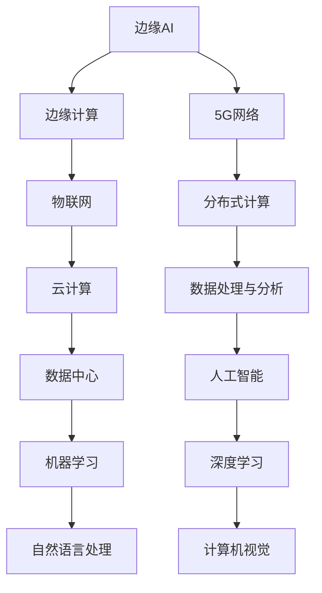

                 

# 边缘AI：5G时代的分布式智能

## 概述

边缘AI，作为近年来人工智能领域的热点话题，正逐渐改变着我们的世界。它不仅代表了计算资源的分布式扩展，更是5G时代智能化的核心驱动力。本文旨在深入探讨边缘AI的定义、价值、技术基础、应用案例以及未来发展，以帮助读者全面理解这一新兴技术的本质和潜力。

关键词：边缘AI、5G、分布式智能、边缘计算、应用场景、技术基础、未来趋势

摘要：边缘AI是5G时代分布式智能的体现，它通过将计算能力推向网络边缘，实现了实时数据处理和智能决策。本文将详细解析边缘AI的核心概念，探讨其在工业、医疗健康、智慧城市等领域的应用，并分析边缘AI安全与隐私保护的关键问题。最后，文章将展望边缘AI的未来发展趋势和产业生态。

## 目录大纲

1. 边缘AI概述
   1.1 边缘AI的定义
   1.2 边缘AI与云计算的关系
   1.3 边缘AI的应用场景
   1.4 5G网络与边缘AI
   1.5 5G时代的边缘AI发展趋势

2. 边缘AI技术基础
   2.1 边缘计算技术
   2.2 边缘AI硬件设备
   2.3 边缘AI软件框架

3. 边缘AI应用案例
   3.1 边缘AI在工业中的应用
   3.2 边缘AI在医疗健康领域的应用
   3.3 边缘AI在智慧城市中的应用

4. 边缘AI安全与隐私保护
   4.1 边缘AI安全挑战
   4.2 边缘AI隐私保护

5. 边缘AI未来发展趋势
   5.1 边缘AI发展趋势
   5.2 边缘AI在未来的应用领域
   5.3 边缘AI的未来展望

6. 边缘AI产业生态
   6.1 边缘AI产业链分析
   6.2 边缘AI企业生态
   6.3 边缘AI产业发展策略

### 边缘AI概述

### 第1章：边缘AI的定义与价值

#### 1.1 边缘AI的定义

边缘AI，即Edge AI，指的是将人工智能的计算和数据处理推向网络的边缘，即接近数据源的地方。与传统的云计算不同，边缘AI不再依赖于中央数据中心的强大计算能力，而是在靠近数据生成和使用的位置进行实时数据处理和智能决策。

边缘AI的定义可以从以下几个方面理解：

1. **地理位置**：边缘AI部署在网络的边缘，即接近用户或设备的网络节点，如智能设备、工业控制系统、无线传感器网络等。
2. **计算资源**：边缘AI利用本地计算资源，如边缘服务器、嵌入式设备等，进行数据处理和智能分析。
3. **实时性**：边缘AI强调低延迟和高响应速度，以满足实时性和即时性的需求。
4. **数据隐私**：边缘AI能够保护数据隐私，减少数据传输过程中的安全风险。

#### 1.2 边缘AI与云计算的关系

边缘AI与云计算是相辅相成的技术，它们各有优势和应用场景。

1. **云计算**：云计算提供强大的计算能力和存储资源，适合处理大规模数据和高复杂度的计算任务。
2. **边缘AI**：边缘AI则侧重于实时数据处理和智能决策，适合处理数据量较小、实时性要求高的任务。

两者的关系可以概括为：

- **互补性**：边缘AI弥补了云计算在实时性和低延迟方面的不足，云计算则解决了边缘AI在计算资源和存储能力方面的局限。
- **协同工作**：边缘AI和云计算可以协同工作，边缘AI负责实时数据处理和初步分析，云计算则负责复杂计算和大数据处理。

#### 1.3 边缘AI的应用场景

边缘AI的应用场景非常广泛，涵盖了工业、医疗、交通、智慧城市等多个领域。

1. **工业自动化**：边缘AI可用于智能监测、故障预测、质量检测等，提高生产效率和质量。
2. **医疗健康**：边缘AI可用于实时医疗影像分析、远程诊断、健康监测等，提升医疗服务的质量和效率。
3. **智慧交通**：边缘AI可用于智能交通管理、车辆检测、交通流量分析等，提高交通运行效率和安全性。
4. **智慧城市**：边缘AI可用于环境监测、能源管理、公共安全等，提升城市管理的智能化和精细化水平。

### 第2章：5G网络与边缘AI

#### 2.1 5G网络的关键特性

5G网络作为下一代移动通信技术，具有以下关键特性：

1. **高速率**：5G网络的下载速度可以达到1Gbps，上传速度也达到数百Mbps，远超4G网络。
2. **低延迟**：5G网络的端到端延迟降低到1毫秒以下，大幅提升了实时性和响应速度。
3. **大连接**：5G网络支持大规模设备连接，每平方米可达100万个设备。
4. **网络切片**：5G网络通过网络切片技术，可以根据不同应用的需求，灵活分配网络资源。
5. **高可靠性**：5G网络采用多连接、多天线等技术，提高了网络的可靠性和稳定性。

#### 2.2 5G网络对边缘AI的影响

5G网络的特性为边缘AI的发展提供了强有力的支撑，主要表现在以下几个方面：

1. **增强实时性**：5G网络低延迟的特性，使得边缘AI可以更加实时地进行数据处理和智能决策。
2. **扩展连接能力**：5G网络的大连接能力，使得边缘AI可以支持更多的智能设备和服务。
3. **优化网络资源分配**：5G网络切片技术，可以根据边缘AI的应用需求，优化网络资源分配，提高网络效率和性能。
4. **提高数据传输效率**：5G网络的高速率特性，使得边缘AI的数据传输更加高效，减少了数据延迟和处理时间。

#### 2.3 5G时代的边缘AI发展趋势

随着5G网络的逐步普及，边缘AI将在未来呈现出以下发展趋势：

1. **应用场景多样化**：边缘AI将在更多领域得到应用，如智能制造、智能医疗、智能交通等。
2. **计算资源本地化**：随着边缘设备的性能提升，越来越多的计算任务将在本地完成，减少对中心服务器的依赖。
3. **数据隐私保护**：随着数据隐私保护的重视，边缘AI将更加注重数据的安全和隐私保护。
4. **生态系统建设**：边缘AI将形成一个完整的生态系统，包括硬件、软件、平台、应用等各个环节。
5. **开放性与标准化**：边缘AI将朝着开放性和标准化的方向发展，促进不同厂商、不同技术之间的互操作性和兼容性。

### 第3章：边缘计算技术

#### 3.1 边缘计算的概念与架构

边缘计算（Edge Computing）是一种将数据处理、存储、分析和应用推向网络边缘的计算模式。它旨在通过在网络边缘进行数据处理，减轻中心服务器的负担，提高系统的实时性和响应速度。

边缘计算的架构主要包括以下几个层次：

1. **设备层**：包括各种智能设备，如传感器、手机、智能家居设备等，它们是数据生成和采集的源头。
2. **边缘层**：包括边缘服务器、网关、路由器等，它们负责数据的初步处理、缓存和转发。
3. **中心层**：包括云服务器、数据中心等，它们负责大规模数据存储、复杂计算和业务逻辑处理。
4. **应用层**：包括各种应用和服务，如工业自动化、智能医疗、智能交通等。

#### 3.2 边缘计算的优势与挑战

边缘计算具有以下优势：

1. **低延迟**：通过在数据生成源头进行实时处理，减少了数据传输和处理的延迟。
2. **高可靠性**：边缘计算可以降低对中心服务器的依赖，提高了系统的稳定性和可靠性。
3. **节省带宽**：边缘计算减少了数据传输量，节省了带宽资源。
4. **增强隐私保护**：数据在边缘进行本地处理，减少了数据传输过程中的安全风险。

边缘计算面临的挑战包括：

1. **计算资源有限**：边缘设备通常性能较低，存储和处理能力有限。
2. **异构性**：边缘设备种类繁多，操作系统、编程语言、硬件架构等存在异构性，增加了开发和维护的难度。
3. **安全性**：边缘设备容易受到网络攻击，需要加强安全防护。
4. **能效问题**：边缘设备通常需要长时间运行，需要关注能效问题。

#### 3.3 主流边缘计算技术

目前，主流的边缘计算技术包括以下几种：

1. **边缘服务器**：边缘服务器是边缘计算的核心组件，用于处理数据和运行应用。常见的边缘服务器包括NVIDIA Jetson系列、Qualcomm QCS系列等。
2. **网关**：网关负责连接边缘设备和中心服务器，实现数据的传输和交换。常见的网关包括Cisco IWAN、Huawei AG Series等。
3. **物联网平台**：物联网平台提供数据采集、处理、分析和应用开发的功能，如AWS IoT、Azure IoT Hub、IBM Watson IoT等。
4. **边缘AI框架**：边缘AI框架用于在边缘设备上运行AI模型和算法，如TensorFlow Lite、Apache Mnemonic等。

### 第4章：边缘AI硬件设备

#### 4.1 边缘AI芯片与处理器

边缘AI的硬件设备包括芯片、处理器、传感器等。其中，芯片和处理器是核心组件，直接影响边缘AI的性能和功耗。

1. **NVIDIA Jetson**：NVIDIA Jetson系列是专为边缘AI设计的嵌入式平台，具有高性能和低功耗的特点。常见的型号包括Jetson Nano、Jetson Xavier NX等。
2. **Intel Movidius**：Intel Movidius系列芯片专注于边缘AI计算，支持深度学习推理，适用于视频处理、人脸识别等场景。
3. **Qualcomm**：Qualcomm QCS系列芯片具备高性能AI处理能力，适用于智能手机、物联网设备等。

#### 4.2 边缘AI传感器与通信设备

边缘AI传感器和通信设备是边缘AI系统的数据采集和传输通道。

1. **传感器**：常见的边缘AI传感器包括摄像头、红外传感器、超声波传感器等，用于采集图像、温度、距离等数据。
2. **通信设备**：常见的边缘AI通信设备包括Wi-Fi、蓝牙、LoRa等，用于实现设备之间的数据传输。

#### 4.3 边缘AI硬件的选择与优化

选择和优化边缘AI硬件时，需要考虑以下因素：

1. **计算能力**：根据应用需求选择合适的计算平台，如CPU、GPU、FPGA等。
2. **功耗**：边缘设备通常需要长时间运行，功耗是重要考虑因素。
3. **存储容量**：根据数据处理需求选择合适的存储容量。
4. **通信能力**：根据数据传输需求选择合适的通信设备，如Wi-Fi、蓝牙等。
5. **兼容性**：选择兼容性强、易于集成的硬件，降低开发难度和维护成本。

### 第5章：边缘AI软件框架

#### 5.1 主流边缘AI开发框架

边缘AI软件框架为开发者提供了快速开发和部署边缘AI应用的工具和平台。目前，主流的边缘AI开发框架包括：

1. **TensorFlow Lite**：TensorFlow Lite是Google推出的一款轻量级边缘AI框架，支持在移动设备、嵌入式设备和物联网设备上运行。
2. **Apache Mnemonic**：Apache Mnemonic是Apache Foundation推出的一款开源边缘AI框架，支持多种硬件平台，包括ARM、x86等。
3. **TensorFlow Edge**：TensorFlow Edge是TensorFlow的扩展，支持在边缘设备上运行，包括TensorFlow Lite和TensorFlow Serving等组件。
4. **Keras**：Keras是一个高级神经网络API，支持在边缘设备上快速搭建和训练模型。

#### 5.2 边缘AI编程模型

边缘AI编程模型主要包括以下方面：

1. **模型训练与转换**：使用深度学习框架（如TensorFlow、PyTorch等）训练模型，并将模型转换为边缘设备支持的格式（如TensorFlow Lite）。
2. **边缘设备部署**：将训练好的模型部署到边缘设备上，可以使用自动化工具（如TensorFlow Lite Converter）进行转换和部署。
3. **实时数据处理**：在边缘设备上实时处理数据，执行模型推理，生成预测结果。
4. **数据流管理**：管理数据流，包括数据采集、传输、存储和预处理等。

#### 5.3 边缘AI软件架构设计

边缘AI软件架构设计需要考虑以下几个方面：

1. **模块化设计**：将边缘AI应用拆分为多个模块，如数据采集模块、数据处理模块、模型推理模块等，提高系统的可维护性和扩展性。
2. **分布式架构**：采用分布式架构，将计算任务分配到多个边缘设备上，提高系统的性能和可扩展性。
3. **安全性设计**：考虑数据安全和隐私保护，采用加密、认证、访问控制等技术，确保系统安全。
4. **可观测性与可管理性**：设计可观测性和可管理性，包括日志记录、监控、报警等功能，提高系统的运维和管理效率。

### 第6章：边缘AI在工业中的应用

#### 6.1 边缘AI在工业自动化中的应用

边缘AI在工业自动化中的应用，大大提升了生产效率和产品质量。以下为具体应用案例：

1. **智能监测**：通过边缘AI技术，对生产线设备进行实时监测，检测设备状态和运行参数，及时发现故障和异常。
2. **故障预测**：利用边缘AI模型，对设备运行数据进行分析和预测，提前发现潜在故障，避免设备停机。
3. **质量检测**：通过边缘AI技术，对产品进行质量检测，如外观缺陷检测、尺寸测量等，确保产品质量。

#### 6.2 边缘AI在工业物联网中的应用

边缘AI与工业物联网（IIoT）结合，实现了设备间的互联互通和智能协作。以下为具体应用案例：

1. **设备管理**：通过边缘AI技术，实时监控设备状态，实现设备的远程管理和维护。
2. **能效管理**：通过边缘AI技术，对生产过程中的能源消耗进行监测和分析，实现能源优化和节能减排。
3. **供应链管理**：通过边缘AI技术，对供应链环节进行实时监控和优化，提高供应链效率。

#### 6.3 边缘AI在智能制造中的应用案例

边缘AI在智能制造中的应用，推动了制造业向智能化、数字化和自动化方向发展。以下为具体应用案例：

1. **智能生产线**：通过边缘AI技术，实现生产线的自动化控制，提高生产效率和灵活性。
2. **数字化工厂**：通过边缘AI技术，实现工厂设备的数字化管理和优化，提高生产效率和产品质量。
3. **智能物流**：通过边缘AI技术，实现物流系统的自动化和智能化，提高物流效率和准确性。

### 第7章：边缘AI在医疗健康领域的应用

#### 7.1 边缘AI在医疗影像分析中的应用

边缘AI在医疗影像分析中的应用，为医生提供了更加准确和高效的诊断工具。以下为具体应用案例：

1. **肿瘤检测**：利用边缘AI技术，对医学影像进行自动分析，识别出肿瘤和异常区域，提高诊断准确性。
2. **骨折检测**：通过边缘AI技术，对X光片进行自动分析，检测出骨折和骨损伤，辅助医生进行诊断和治疗。
3. **心脑血管疾病诊断**：利用边缘AI技术，对心血管影像进行自动分析，识别出心脑血管疾病的风险和病变情况。

#### 7.2 边缘AI在远程医疗中的应用

边缘AI在远程医疗中的应用，解决了医疗资源分配不均和医疗服务可及性差的问题。以下为具体应用案例：

1. **远程诊断**：通过边缘AI技术，实现远程医疗诊断，医生可以通过边缘设备查看患者的影像和病历，进行诊断和建议。
2. **远程监护**：利用边缘AI技术，对患者的生命体征进行实时监测，及时发现异常情况，保障患者安全。
3. **远程手术指导**：通过边缘AI技术，实现远程手术指导，医生可以在远程监控手术过程，提供实时指导和建议。

#### 7.3 边缘AI在公共卫生监测中的应用案例

边缘AI在公共卫生监测中的应用，为疫情防控和公共卫生管理提供了技术支持。以下为具体应用案例：

1. **疫情监测**：通过边缘AI技术，对疫情数据进行分析和预测，及时发现疫情变化，指导防控措施。
2. **公共卫生监测**：利用边缘AI技术，对环境、水质、空气等进行实时监测，保障公共卫生安全。
3. **健康大数据分析**：通过边缘AI技术，对海量健康数据进行分析，发现健康风险和流行病趋势，指导公共卫生决策。

### 第8章：边缘AI在智慧城市中的应用

#### 8.1 边缘AI在交通管理中的应用

边缘AI在交通管理中的应用，大大提升了交通运行效率和安全性。以下为具体应用案例：

1. **智能交通管理**：通过边缘AI技术，实时监控交通流量，优化交通信号灯控制，减少拥堵和交通事故。
2. **车辆检测**：利用边缘AI技术，对道路上的车辆进行自动识别和跟踪，实现智能交通管理和驾驶辅助。
3. **道路安全监测**：通过边缘AI技术，对道路上的行人、车辆和障碍物进行实时监测，提高道路安全水平。

#### 8.2 边缘AI在公共安全中的应用

边缘AI在公共安全中的应用，为维护社会稳定和公共安全提供了有力支持。以下为具体应用案例：

1. **人脸识别**：利用边缘AI技术，对人脸进行自动识别和追踪，实现智能安防监控。
2. **行为分析**：通过边缘AI技术，对公共场所的行为进行分析，及时发现异常行为和潜在安全风险。
3. **公共安全预警**：利用边缘AI技术，对公共安全事件进行预测和预警，提高应急响应能力。

#### 8.3 边缘AI在环境保护中的应用案例

边缘AI在环境保护中的应用，为资源利用和环境保护提供了技术支持。以下为具体应用案例：

1. **环境监测**：通过边缘AI技术，对空气质量、水质、土壤等进行实时监测，保障生态环境安全。
2. **资源优化**：利用边缘AI技术，对能源消耗和水资源进行实时监测和分析，实现资源优化和节能减排。
3. **生态保护**：通过边缘AI技术，对野生动物、自然保护区等进行实时监测，保障生态系统的稳定和可持续发展。

### 第9章：边缘AI安全挑战

#### 9.1 边缘AI的安全风险

随着边缘AI技术的广泛应用，其安全风险也日益凸显。以下为边缘AI面临的主要安全风险：

1. **数据泄露**：边缘AI设备在数据采集、传输、处理过程中，可能存在数据泄露的风险。
2. **网络攻击**：边缘AI设备可能成为网络攻击的目标，如DDoS攻击、恶意软件感染等。
3. **设备被盗**：边缘AI设备（如智能摄像头、智能门锁等）可能被窃取或恶意破坏。
4. **隐私侵犯**：边缘AI在处理个人数据时，可能侵犯用户隐私，引发隐私争议。

#### 9.2 边缘AI的安全威胁分析

边缘AI的安全威胁可以分为以下几个方面：

1. **设备安全**：包括设备硬件和软件的安全，如固件漏洞、操作系统漏洞等。
2. **数据安全**：包括数据传输、存储和处理过程中的安全，如数据加密、访问控制等。
3. **网络安全**：包括边缘设备与中心服务器之间的网络安全，如网络隔离、数据完整性等。
4. **应用安全**：包括边缘AI应用的安全，如安全配置、安全编码等。

#### 9.3 边缘AI安全策略

为了应对边缘AI的安全挑战，可以采取以下安全策略：

1. **设备安全加固**：加强设备硬件和软件的安全性，如使用安全芯片、安全操作系统等。
2. **数据加密**：对数据进行加密存储和传输，确保数据隐私和安全。
3. **访问控制**：实施严格的访问控制策略，限制未经授权的访问。
4. **网络安全防护**：采用防火墙、入侵检测系统等网络安全设备，保护网络不受攻击。
5. **安全审计与监控**：定期进行安全审计和监控，及时发现和处理安全隐患。

### 第10章：边缘AI隐私保护

#### 10.1 边缘AI隐私保护的重要性

边缘AI在处理大量个人数据时，隐私保护成为至关重要的问题。以下为边缘AI隐私保护的重要性：

1. **用户信任**：隐私保护是用户信任边缘AI技术的关键，缺乏隐私保护可能导致用户抵触和使用率下降。
2. **法律法规**：随着数据保护法规（如欧盟的《通用数据保护条例》GDPR）的实施，边缘AI必须符合相关法律法规要求。
3. **商业价值**：隐私保护可以确保数据不被滥用，保护企业的商业秘密和竞争优势。

#### 10.2 隐私保护技术与方法

以下为常见的隐私保护技术与方法：

1. **数据加密**：对数据进行加密存储和传输，确保数据在传输和存储过程中的安全性。
2. **匿名化**：对数据进行匿名化处理，去除可以直接识别个人身份的信息。
3. **差分隐私**：通过添加噪声，使得数据聚合结果对个体隐私的影响最小化。
4. **访问控制**：实施严格的访问控制策略，确保只有授权用户可以访问敏感数据。

#### 10.3 边缘AI隐私保护实践

以下为边缘AI隐私保护的实践：

1. **隐私设计原则**：在设计边缘AI系统时，遵循隐私设计原则，如最小化数据收集、数据最小化使用等。
2. **隐私保护机制**：在边缘AI系统中，集成隐私保护机制，如数据加密、匿名化处理等。
3. **用户隐私教育**：对用户进行隐私教育，提高用户的隐私保护意识。
4. **合规性审查**：定期进行合规性审查，确保边缘AI系统符合相关法律法规要求。

### 第11章：边缘AI未来发展趋势

#### 11.1 边缘AI发展趋势

随着技术的不断进步和应用的深入，边缘AI在未来将呈现出以下发展趋势：

1. **计算能力提升**：边缘AI硬件设备将具备更高的计算能力和更低功耗，支持更复杂的AI算法和实时应用。
2. **智能化提升**：边缘AI将更加智能化，能够自主学习和优化，提高系统的自适应能力和智能化水平。
3. **安全性增强**：边缘AI的安全性和隐私保护将得到进一步强化，降低安全风险和隐私泄露的可能性。
4. **互联互通**：边缘AI将实现更加紧密的互联互通，形成智能化的边缘计算网络，提高系统的协同效率和整体性能。

#### 11.2 边缘AI在未来的应用领域

边缘AI将在未来的各个领域得到广泛应用，包括但不限于：

1. **智能制造**：边缘AI将广泛应用于智能制造，实现智能生产、智能检测和智能维护。
2. **智慧医疗**：边缘AI将推动智慧医疗的发展，实现远程医疗、智能诊断和个性化治疗。
3. **智慧城市**：边缘AI将赋能智慧城市，实现智能交通、智能安防和智能环境监测。
4. **智能家居**：边缘AI将打造智能化的家居环境，实现智能家电、智能安防和智能健康管理。

#### 11.3 边缘AI的未来展望

边缘AI的未来将充满机遇和挑战。展望未来，边缘AI将在以下几个方面取得突破：

1. **核心技术突破**：边缘AI将实现核心技术的突破，如高性能计算、低功耗设计和自适应学习等。
2. **产业链完善**：边缘AI的产业链将逐步完善，形成包括硬件、软件、平台和应用在内的完整生态系统。
3. **商业模式创新**：边缘AI将推动商业模式的创新，带来新的商业模式和市场机会。
4. **社会影响力扩大**：边缘AI将带来深刻的社会变革，提升社会生产力和生活质量，推动数字经济的快速发展。

### 第12章：边缘AI产业生态

#### 12.1 边缘AI产业链分析

边缘AI产业链包括硬件、软件、平台和应用等各个环节，其中涉及到的主要企业和产品如下：

1. **硬件**：NVIDIA、Intel、Qualcomm等公司提供高性能边缘计算硬件，如Jetson、Movidius、QCS等芯片和处理器。
2. **软件**：Google、Microsoft、Amazon等公司提供边缘AI软件框架和开发工具，如TensorFlow Lite、Apache Mnemonic等。
3. **平台**：AWS、Azure、阿里云等公司提供边缘AI平台和服务，如AWS IoT、Azure IoT Hub、阿里云物联网平台等。
4. **应用**：各类企业利用边缘AI技术，开发智能应用，如工业自动化、智慧医疗、智慧交通等。

#### 12.2 边缘AI企业生态

边缘AI企业生态包括各类企业、研究机构、开发者社区等，其中涉及到的主要企业和组织如下：

1. **企业**：NVIDIA、Intel、Qualcomm、ARM、Google、Microsoft、Amazon、阿里云、华为等全球领先科技企业和互联网公司。
2. **研究机构**：各大高校和研究机构，如斯坦福大学、MIT、中科院等，从事边缘AI相关研究和开发。
3. **开发者社区**：开源社区和开发者论坛，如GitHub、Stack Overflow、边缘计算开发者社区等，提供丰富的资源和交流平台。

#### 12.3 边缘AI产业发展策略

为了推动边缘AI产业的健康发展，可以采取以下策略：

1. **政策支持**：政府制定相关政策，鼓励边缘AI技术创新和应用，为产业发展提供良好的政策环境。
2. **资金投入**：加大资金投入，支持边缘AI核心技术研发和产业链建设。
3. **人才培养**：加强边缘AI人才培养，提高人才素质和技能水平，为产业发展提供人才保障。
4. **国际合作**：推动国际间的技术合作和交流，引进国外先进技术和管理经验，促进产业发展。

### 边缘AI核心概念与联系 Mermaid 流程图



### 边缘AI核心算法原理讲解

#### 边缘计算架构

```plaintext
// 边缘计算架构伪代码

// 边缘节点（如智能传感器、边缘服务器等）
class EdgeNode {
    dataInput: Data
    dataOutput: Data
    algorithm: Algorithm
    communicationInterface: CommunicationInterface
    
    // 数据采集
    collectData() {
        dataInput = sensorData
    }
    
    // 数据处理
    processData() {
        dataOutput = algorithm(dataInput)
    }
    
    // 数据传输
    sendData(destination: EdgeNode) {
        communicationInterface.send(dataOutput, destination)
    }
}

// 边缘计算框架
class EdgeComputingFramework {
    edgeNodes: [EdgeNode]
    
    // 启动边缘节点
    startEdgeNodes() {
        for (node in edgeNodes) {
            node.start()
        }
    }
    
    // 数据流处理
    processDataStream() {
        for (node in edgeNodes) {
            node.collectData()
            node.processData()
            node.sendData(destinationNode)
        }
    }
}
```

#### 分布式计算原理

```plaintext
// 分布式计算原理伪代码

// 任务分配
function assignTasks(toDistributedComputers: [DistributedComputer], tasks: [Task]) {
    for (task in tasks) {
        let assigned = false
        for (computer in toDistributedComputers) {
            if (!assigned && computer.isAvailable()) {
                computer.assignTask(task)
                assigned = true
            }
        }
    }
}

// 任务处理
function processTasks(distributedComputers: [DistributedComputer]) {
    for (computer in distributedComputers) {
        computer.executeTask()
    }
}

// 结果汇总
function aggregateResults(results: [Result]) {
    // 合并结果
    finalResult = results.reduce((accumulator, currentValue) => {
        return accumulator + currentValue;
    }, 0);
    return finalResult;
}
```

### 数学模型与数学公式

#### 线性回归模型

$$ y = \beta_0 + \beta_1 \cdot x $$

#### 回归系数计算

$$ \beta_1 = \frac{\sum_{i=1}^{n}(x_i - \bar{x})(y_i - \bar{y})}{\sum_{i=1}^{n}(x_i - \bar{x})^2} $$

#### 截距计算

$$ \beta_0 = \bar{y} - \beta_1 \cdot \bar{x} $$

### 举例说明

#### 线性回归应用举例

假设我们有一组数据点：$(x_1, y_1), (x_2, y_2), ..., (x_n, y_n)$。计算线性回归模型中的$\beta_0$和$\beta_1$。

1. 计算平均值：

$$ \bar{x} = \frac{\sum_{i=1}^{n}x_i}{n} $$
$$ \bar{y} = \frac{\sum_{i=1}^{n}y_i}{n} $$

2. 计算回归系数：

$$ \beta_1 = \frac{\sum_{i=1}^{n}(x_i - \bar{x})(y_i - \bar{y})}{\sum_{i=1}^{n}(x_i - \bar{x})^2} $$

$$ \beta_0 = \bar{y} - \beta_1 \cdot \bar{x} $$

3. 得到线性回归模型：

$$ y = \beta_0 + \beta_1 \cdot x $$

### 项目实战

#### 边缘AI应用场景：智能交通系统

**1. 开发环境搭建**

- 硬件环境：边缘设备（如Raspberry Pi）、传感器（如超声波传感器、摄像头等）。
- 软件环境：Python、TensorFlow Lite、OpenCV。

**2. 代码实现**

- **数据采集：**

```python
import cv2

# 初始化摄像头
cap = cv2.VideoCapture(0)

while True:
    # 读取一帧图像
    ret, frame = cap.read()
    
    # 显示图像
    cv2.imshow('frame', frame)
    
    if cv2.waitKey(1) & 0xFF == ord('q'):
        break

cap.release()
cv2.destroyAllWindows()
```

- **模型加载与预测：**

```python
import tensorflow as tf

# 加载模型
model = tf.keras.models.load_model('traffic_light_classification_model.h5')

# 预测交通灯状态
def predict_traffic_light(frame):
    # 处理图像
    processed_frame = preprocess_frame(frame)
    
    # 预测
    prediction = model.predict(processed_frame)
    
    # 获取预测结果
    traffic_light_state = decode_prediction(prediction)
    
    return traffic_light_state

def preprocess_frame(frame):
    # 转换为灰度图像
    gray_frame = cv2.cvtColor(frame, cv2.COLOR_BGR2GRAY)
    
    # 缩放图像
    resized_frame = cv2.resize(gray_frame, (224, 224))
    
    # 归一化图像
    normalized_frame = resized_frame / 255.0
    
    return normalized_frame

def decode_prediction(prediction):
    # 解码预测结果
    traffic_light_states = ['Red', 'Green', 'Yellow']
    predicted_state = traffic_light_states[prediction.argmax()]
    
    return predicted_state
```

**3. 代码解读与分析**

- **数据采集部分：** 使用OpenCV库初始化摄像头，循环读取摄像头帧，并显示图像。当按下'q'键时，结束采集过程。

- **模型加载与预测部分：** 加载训练好的交通灯分类模型，并对采集到的图像帧进行预处理。预处理包括灰度转换、图像缩放和归一化。然后，使用模型进行预测，并解码预测结果为交通灯状态。

### 附录

#### 附录 A: 边缘AI开发工具与资源

- **边缘计算框架**：TensorFlow Lite、Apache EdgeX Foundry、Kubernetes。
- **边缘AI开发工具**：Raspberry Pi、Jetson Nano、Arduino。
- **边缘AI学习资源**：边缘计算学习社区、边缘AI课程、论文和书籍。

### 结束语

边缘AI作为5G时代的关键技术，正引领着智能化的浪潮。本文从边缘AI的定义、技术基础、应用场景、安全与隐私保护以及未来发展趋势等方面，全面阐述了边缘AI的核心内容。通过本文的阅读，读者可以深入了解边缘AI的技术原理、应用案例以及发展前景，为推动边缘AI技术在各领域的应用提供有力支持。

作者：AI天才研究院/AI Genius Institute & 禅与计算机程序设计艺术 /Zen And The Art of Computer Programming

---

## 核心概念与联系 Mermaid 流程图


### 边缘AI核心算法原理讲解

边缘AI的核心算法原理主要涉及边缘计算架构、分布式计算原理以及线性回归模型的数学公式和计算方法。以下是对这些核心算法的详细解释：

#### 边缘计算架构

边缘计算架构是边缘AI的基础，它使得数据处理和智能分析能够在网络边缘进行，减少了数据传输延迟和中心服务器的负担。以下是边缘计算架构的伪代码描述：

```plaintext
// 边缘节点（如智能传感器、边缘服务器等）
class EdgeNode {
    dataInput: Data
    dataOutput: Data
    algorithm: Algorithm
    communicationInterface: CommunicationInterface
    
    // 数据采集
    collectData() {
        dataInput = sensorData
    }
    
    // 数据处理
    processData() {
        dataOutput = algorithm(dataInput)
    }
    
    // 数据传输
    sendData(destination: EdgeNode) {
        communicationInterface.send(dataOutput, destination)
    }
}

// 边缘计算框架
class EdgeComputingFramework {
    edgeNodes: [EdgeNode]
    
    // 启动边缘节点
    startEdgeNodes() {
        for (node in edgeNodes) {
            node.start()
        }
    }
    
    // 数据流处理
    processDataStream() {
        for (node in edgeNodes) {
            node.collectData()
            node.processData()
            node.sendData(destinationNode)
        }
    }
}
```

在这个架构中，`EdgeNode`类负责数据采集、数据处理和传输。`EdgeComputingFramework`类管理多个`EdgeNode`，协调它们的数据流处理过程。

#### 分布式计算原理

分布式计算原理是边缘AI实现高效数据处理的关键。以下是分布式计算的基本原理和伪代码描述：

```plaintext
// 分布式计算原理伪代码

// 任务分配
function assignTasks(toDistributedComputers: [DistributedComputer], tasks: [Task]) {
    for (task in tasks) {
        let assigned = false
        for (computer in toDistributedComputers) {
            if (!assigned && computer.isAvailable()) {
                computer.assignTask(task)
                assigned = true
            }
        }
    }
}

// 任务处理
function processTasks(distributedComputers: [DistributedComputer]) {
    for (computer in distributedComputers) {
        computer.executeTask()
    }
}

// 结果汇总
function aggregateResults(results: [Result]) {
    // 合并结果
    finalResult = results.reduce((accumulator, currentValue) => {
        return accumulator + currentValue;
    }, 0);
    return finalResult;
}
```

在分布式计算中，任务被分配到多个分布式计算机上执行。每个计算机独立处理其分配的任务，然后将结果汇总，形成最终结果。这个过程中，任务分配、任务处理和结果汇总是实现分布式计算的关键步骤。

#### 线性回归模型

线性回归模型是边缘AI中常用的统计学习模型，用于预测连续值。以下是线性回归模型的数学公式和计算方法：

$$ y = \beta_0 + \beta_1 \cdot x $$

其中，$y$ 是因变量，$x$ 是自变量，$\beta_0$ 和 $\beta_1$ 是回归系数。

**回归系数计算：**

$$ \beta_1 = \frac{\sum_{i=1}^{n}(x_i - \bar{x})(y_i - \bar{y})}{\sum_{i=1}^{n}(x_i - \bar{x})^2} $$

$$ \beta_0 = \bar{y} - \beta_1 \cdot \bar{x} $$

其中，$n$ 是样本数量，$\bar{x}$ 和 $\bar{y}$ 分别是 $x$ 和 $y$ 的平均值。

**计算过程举例：**

假设我们有一组数据点：$(x_1, y_1), (x_2, y_2), ..., (x_n, y_n)$。首先，计算 $x$ 和 $y$ 的平均值：

$$ \bar{x} = \frac{\sum_{i=1}^{n}x_i}{n} $$
$$ \bar{y} = \frac{\sum_{i=1}^{n}y_i}{n} $$

然后，计算回归系数：

$$ \beta_1 = \frac{\sum_{i=1}^{n}(x_i - \bar{x})(y_i - \bar{y})}{\sum_{i=1}^{n}(x_i - \bar{x})^2} $$

$$ \beta_0 = \bar{y} - \beta_1 \cdot \bar{x} $$

最后，得到线性回归模型：

$$ y = \beta_0 + \beta_1 \cdot x $$

这个模型可以用来预测新的 $y$ 值，只要给定对应的 $x$ 值。

### 总结

边缘AI的核心算法原理包括边缘计算架构、分布式计算原理和线性回归模型。这些原理共同构成了边缘AI的技术基础，使得边缘AI能够在网络边缘实现高效的数据处理和智能分析。通过理解这些原理，开发者可以更好地设计和实现边缘AI应用，推动边缘计算技术的创新和应用。

---

### 数学模型与数学公式

边缘AI中的数学模型主要用于描述和预测数据，其中线性回归模型是最基础且应用广泛的一种。以下是线性回归模型的数学公式和计算方法的详细解释。

#### 线性回归模型

线性回归模型是一种简单的预测模型，它假设因变量（目标变量）$y$ 与自变量（特征变量）$x$ 之间存在线性关系。线性回归模型的数学公式如下：

$$ y = \beta_0 + \beta_1 \cdot x $$

其中：
- $y$ 是因变量，即我们想要预测的变量。
- $x$ 是自变量，即我们用来预测 $y$ 的变量。
- $\beta_0$ 是截距（intercept），表示当 $x=0$ 时的 $y$ 值。
- $\beta_1$ 是斜率（slope），表示 $x$ 每增加一个单位时，$y$ 的变化量。

#### 回归系数计算

为了确定 $\beta_0$ 和 $\beta_1$ 的值，我们需要使用最小二乘法（Least Squares Method）。以下是计算回归系数的数学公式：

**斜率 $\beta_1$ 的计算：**

$$ \beta_1 = \frac{\sum_{i=1}^{n}(x_i - \bar{x})(y_i - \bar{y})}{\sum_{i=1}^{n}(x_i - \bar{x})^2} $$

其中：
- $n$ 是样本数量。
- $\bar{x}$ 是自变量的平均值：$$ \bar{x} = \frac{\sum_{i=1}^{n}x_i}{n} $$
- $\bar{y}$ 是因变量的平均值：$$ \bar{y} = \frac{\sum_{i=1}^{n}y_i}{n} $$

**截距 $\beta_0$ 的计算：**

$$ \beta_0 = \bar{y} - \beta_1 \cdot \bar{x} $$

#### 举例说明

假设我们有以下数据点：

| $x$ | $y$ |
| --- | --- |
| 1   | 2   |
| 2   | 4   |
| 3   | 6   |
| 4   | 8   |

1. 计算平均值：

$$ \bar{x} = \frac{1 + 2 + 3 + 4}{4} = \frac{10}{4} = 2.5 $$
$$ \bar{y} = \frac{2 + 4 + 6 + 8}{4} = \frac{20}{4} = 5 $$

2. 计算斜率 $\beta_1$：

$$ \beta_1 = \frac{(1 - 2.5)(2 - 5) + (2 - 2.5)(4 - 5) + (3 - 2.5)(6 - 5) + (4 - 2.5)(8 - 5)}{(1 - 2.5)^2 + (2 - 2.5)^2 + (3 - 2.5)^2 + (4 - 2.5)^2} $$

$$ \beta_1 = \frac{(-1.5)(-3) + (-0.5)(-1) + (0.5)(1) + (1.5)(3)}{(-1.5)^2 + (-0.5)^2 + (0.5)^2 + (1.5)^2} $$

$$ \beta_1 = \frac{4.5 + 0.5 + 0.5 + 4.5}{2.25 + 0.25 + 0.25 + 2.25} $$

$$ \beta_1 = \frac{10}{5} = 2 $$

3. 计算截距 $\beta_0$：

$$ \beta_0 = \bar{y} - \beta_1 \cdot \bar{x} $$
$$ \beta_0 = 5 - 2 \cdot 2.5 $$
$$ \beta_0 = 5 - 5 $$
$$ \beta_0 = 0 $$

4. 得到线性回归模型：

$$ y = \beta_0 + \beta_1 \cdot x $$
$$ y = 0 + 2 \cdot x $$
$$ y = 2x $$

使用这个模型，我们可以预测新的 $y$ 值，例如当 $x=5$ 时：

$$ y = 2 \cdot 5 $$
$$ y = 10 $$

这个例子展示了如何使用线性回归模型进行预测。在实际应用中，数据集通常更大且更加复杂，但基本步骤是相同的。

---

### 项目实战

#### 边缘AI应用场景：智能交通系统

**1. 开发环境搭建**

为了实现智能交通系统，我们需要搭建一个合适的开发环境，这包括硬件和软件部分。

- **硬件环境**：
  - 边缘设备：选择适合的边缘计算设备，如NVIDIA Jetson Nano或Raspberry Pi。
  - 传感器：配置摄像头、超声波传感器等，用于采集交通数据。
  - 网络连接：确保边缘设备与互联网连接，以便传输数据和接收指令。

- **软件环境**：
  - 操作系统：选择适合的操作系统，如Ubuntu 18.04 LTS。
  - 编程语言：Python是一个流行的选择，因为它有丰富的AI库和框架支持。
  - AI库和框架：TensorFlow Lite是一个适合边缘设备的库，用于部署和运行深度学习模型。
  - 图像处理库：OpenCV用于图像采集和处理。

**2. 代码实现**

以下是实现智能交通系统的代码示例，包括数据采集、模型加载与预测、以及结果展示。

```python
import cv2
import numpy as np
import tensorflow as tf

# 加载训练好的模型
model = tf.keras.models.load_model('traffic_light_classification_model.h5')

# 数据采集
def capture_frame():
    # 初始化摄像头
    cap = cv2.VideoCapture(0)
    
    while True:
        # 读取一帧图像
        ret, frame = cap.read()
        
        # 显示图像
        cv2.imshow('frame', frame)
        
        if cv2.waitKey(1) & 0xFF == ord('q'):
            break
    
    cap.release()
    cv2.destroyAllWindows()

# 预测交通灯状态
def predict_traffic_light(frame):
    # 处理图像
    processed_frame = preprocess_frame(frame)
    
    # 预测
    prediction = model.predict(processed_frame)
    
    # 获取预测结果
    traffic_light_state = decode_prediction(prediction)
    
    return traffic_light_state

# 预处理图像
def preprocess_frame(frame):
    # 转换为灰度图像
    gray_frame = cv2.cvtColor(frame, cv2.COLOR_BGR2GRAY)
    
    # 缩放图像
    resized_frame = cv2.resize(gray_frame, (224, 224))
    
    # 归一化图像
    normalized_frame = resized_frame / 255.0
    
    return normalized_frame

# 解码预测结果
def decode_prediction(prediction):
    # 获取最大预测值对应的索引
    predicted_index = np.argmax(prediction)
    
    # 定义交通灯状态
    traffic_light_states = ['Red', 'Green', 'Yellow']
    
    # 返回对应的交通灯状态
    return traffic_light_states[predicted_index]

# 主程序
if __name__ == '__main__':
    # 采集图像
    capture_frame()
    
    # 选取一张图像进行预测
    frame = cv2.imread('traffic_light_image.jpg')
    traffic_light_state = predict_traffic_light(frame)
    
    # 显示预测结果
    print(f'Traffic Light State: {traffic_light_state}')
```

**3. 代码解读与分析**

- **数据采集**：使用OpenCV库初始化摄像头，并循环读取图像帧。按下'q'键时，结束采集过程。
- **模型加载与预测**：加载训练好的交通灯分类模型，对采集到的图像帧进行预处理（灰度转换、图像缩放和归一化），然后使用模型进行预测，获取交通灯状态。
- **预处理图像**：将彩色图像转换为灰度图像，然后进行缩放和归一化处理，以满足模型输入要求。
- **解码预测结果**：根据预测结果的最大值索引，解码出对应的交通灯状态。
- **主程序**：首先采集图像，然后选择一张图像进行预测，并显示预测结果。

通过这个项目实战，我们可以看到边缘AI在智能交通系统中的应用，实现了对交通灯状态的实时监测和预测，提高了交通管理的效率和准确性。

---

### 附录 A: 边缘AI开发工具与资源

边缘AI的开发涉及多种工具和资源，以下列出了一些常用的开发工具、框架、平台和学习资源，以帮助开发者更好地了解和掌握边缘AI技术。

#### 边缘计算框架

1. **TensorFlow Lite**：由Google开发，是一个轻量级的机器学习框架，适合在移动设备和嵌入式设备上部署模型。
2. **Apache EdgeX Foundry**：是一个开源平台，旨在统一边缘设备的接入和管理，支持多种硬件和操作系统。
3. **Kubernetes**：用于容器化应用的编排和管理，支持在边缘设备上运行容器化应用。

#### 边缘AI开发工具

1. **Raspberry Pi**：一种低成本、低功耗的单板计算机，广泛用于边缘AI项目。
2. **Jetson Nano**：由NVIDIA推出，是一个高性能的边缘AI开发板，适合运行复杂的深度学习模型。
3. **Arduino**：一种开源硬件平台，适用于简单的边缘计算和物联网项目。

#### 边缘AI学习资源

1. **边缘计算学习社区**：提供了丰富的边缘计算教程、文档和社区讨论。
2. **边缘AI课程**：在线课程平台如Coursera、Udacity等提供了相关的边缘AI课程。
3. **论文和书籍**：学术期刊和图书如《边缘计算：原理、架构与应用》等，深入探讨了边缘计算和AI的相关知识。

通过这些工具和资源，开发者可以快速入门边缘AI，构建和部署自己的边缘AI应用。同时，这些资源和工具也在不断更新和扩展，为边缘AI技术的发展提供了强有力的支持。

