                 

# 《远程管理：克服距离障碍的有效方法》

## 关键词
远程管理，分布式团队，远程沟通，项目管理，法律伦理，成功案例

## 摘要
随着全球化和技术的进步，远程管理已成为现代企业运营的重要组成部分。本文旨在深入探讨远程管理的核心概念、基本原理、沟通策略、团队管理、项目管理和法律伦理问题，并通过成功案例提供实践启示。文章结构清晰，内容详实，旨在帮助读者全面理解和应用远程管理的方法，以克服距离带来的障碍，实现高效的远程工作。

---

### 目录大纲设计

#### 第1章 引言
- **1.1 远程管理的概念与背景**
- **1.2 远程管理的挑战与机遇**
- **1.3 远程管理的重要性

#### 第2章 远程管理的基本原理
- **2.1 远程管理的核心要素**
  - **2.1.1 目标设定与绩效管理**
  - **2.1.2 沟通与协作**
  - **2.1.3 领导风格与团队建设**
- **2.2 远程工作环境与工具**
  - **2.2.1 远程工作平台的选择**
  - **2.2.2 工具与技术的应用**
  - **2.2.3 信息安全与数据保护**

#### 第3章 远程沟通策略
- **3.1 远程沟通的挑战与解决方法**
  - **3.1.1 面对面的交流替代品**
  - **3.1.2 消除沟通障碍**
  - **3.1.3 提升沟通效果的技术手段**
- **3.2 远程会议与团队协作**
  - **3.2.1 远程会议的最佳实践**
  - **3.2.2 跨文化沟通**
  - **3.2.3 优化团队协作流程**

#### 第4章 远程团队管理
- **4.1 远程团队管理的独特性**
  - **4.1.1 领导者角色的转变**
  - **4.1.2 建立高效的远程团队**
  - **4.1.3 预防与处理远程团队问题**
- **4.2 远程员工激励与成长**
  - **4.2.1 远程工作激励策略**
  - **4.2.2 远程员工职业发展路径**
  - **4.2.3 远程员工心理关怀**

#### 第5章 远程项目管理
- **5.1 远程项目管理的原则与方法**
  - **5.1.1 远程项目计划与执行**
  - **5.1.2 风险管理与问题解决**
  - **5.1.3 项目进度与质量监控**
- **5.2 远程项目工具与平台**
  - **5.2.1 常用的项目管理工具**
  - **5.2.2 搭建远程项目协作平台**
  - **5.2.3 项目文档管理与共享**

#### 第6章 远程管理中的法律与伦理问题
- **6.1 远程管理中的法律问题**
  - **6.1.1 劳动法律框架**
  - **6.1.2 数据隐私与安全**
  - **6.1.3 国际法律冲突**
- **6.2 远程管理的伦理问题**
  - **6.2.1 劳动者权益保障**
  - **6.2.2 远程工作的伦理责任**
  - **6.2.3 企业社会责任**

#### 第7章 成功的远程管理案例
- **7.1 成功远程管理案例介绍**
  - **7.1.1 案例一：全球顶级咨询公司**
  - **7.1.2 案例二：科技创业公司的成功经验**
  - **7.1.3 案例三：跨国企业的远程管理实践**
- **7.2 案例分析与启示**
  - **7.2.1 案例分析的方法与技巧**
  - **7.2.2 案例对远程管理的启示**

#### 第8章 未来远程管理的趋势与发展
- **8.1 远程管理技术的革新**
  - **8.1.1 新兴技术的应用**
  - **8.1.2 人工智能在远程管理中的应用**
  - **8.1.3 虚拟现实与远程管理的融合**
- **8.2 远程管理模式的变革**
  - **8.2.1 远程办公的未来趋势**
  - **8.2.2 远程工作与工作生活平衡**
  - **8.2.3 远程管理的新模式探索**

### 附录
- **附录A：远程管理常用工具与技术概览**
- **附录B：远程管理相关法律法规**
- **附录C：远程管理实践指南**

---

### 第1章 引言

#### 1.1 远程管理的概念与背景

远程管理，顾名思义，是指通过远程方式对团队或项目进行管理的过程。随着信息技术的飞速发展，远程工作已逐渐成为企业运营的一种常态。远程管理不仅涵盖了传统的项目管理、团队协作和沟通，还涉及到技术的应用、法律伦理的考量以及个人与团队的激励与发展。

远程管理的兴起可以追溯到互联网和移动设备的普及。过去，由于地理、时间和沟通的限制，企业往往依赖面对面的交流和传统的管理方法。然而，现代远程管理利用了云计算、视频会议、项目管理工具等新兴技术，使得团队成员能够跨越地域限制，高效协同工作。

远程管理的背景不仅包括技术进步，还涉及到全球化和人力资源多样化的趋势。企业越来越倾向于在全球范围内招募优秀人才，远程管理成为连接这些分散团队的重要纽带。此外，员工对于工作与生活平衡的追求也推动了远程管理的普及。

#### 1.2 远程管理的挑战与机遇

远程管理既带来了机遇，也带来了挑战。

**挑战：**

1. **沟通障碍：** 远程工作环境中缺乏面对面的互动，可能导致信息传递的滞后和理解偏差。
2. **时间差异：** 分布在不同时区的团队成员需要协调工作日程，可能增加协作的复杂性。
3. **团队凝聚力：** 远程工作可能导致团队成员之间的疏离感，影响团队的凝聚力和协作效率。
4. **工作效率：** 缺乏即时的指导和反馈，可能会影响员工的工作效率。

**机遇：**

1. **灵活性：** 远程管理提供了更高的工作灵活性，有利于员工的工作与生活平衡。
2. **人才多样化：** 企业可以通过远程招聘，吸引全球范围内的优秀人才。
3. **成本节约：** 远程工作减少了办公场所和差旅成本，有助于企业降低运营成本。
4. **效率提升：** 利用先进的技术工具，远程管理可以提升团队协作效率和项目进度。

#### 1.3 远程管理的重要性

远程管理的重要性体现在多个方面：

1. **适应未来工作模式：** 远程管理是应对未来工作环境变化的重要手段，有助于企业保持竞争力。
2. **提升工作效率：** 通过高效的远程沟通和协作，企业可以快速响应市场需求，提高工作效率。
3. **优化团队结构：** 远程管理有助于构建多元化的团队，促进创新和知识共享。
4. **强化法律与伦理意识：** 在远程管理中，企业需要遵循相关法律法规，关注员工权益，树立良好的企业社会责任。

总之，远程管理不仅是一种应对远程工作挑战的策略，更是企业实现持续发展和创新的必要手段。在接下来的章节中，我们将深入探讨远程管理的核心要素、沟通策略、团队管理、项目管理和法律伦理问题，为读者提供全面的远程管理知识体系。

### 第2章 远程管理的基本原理

#### 2.1 远程管理的核心要素

远程管理的核心要素包括目标设定与绩效管理、沟通与协作、领导风格与团队建设。这些要素相互关联，共同构成了远程管理的基石。

##### 2.1.1 目标设定与绩效管理

在远程管理中，明确的目标设定是确保团队工作方向一致的基础。管理者需要与团队成员共同制定可量化的目标，并确保这些目标与企业的整体战略相一致。目标设定不仅有助于提高团队的执行力，还能够激发员工的积极性和创造力。

绩效管理是远程管理的重要组成部分。由于团队成员无法面对面交流，绩效评估需要更加系统和透明。管理者可以通过定期的绩效评估会议，与团队成员讨论工作进展、识别问题和制定改进措施。同时，利用远程绩效管理工具，可以实时跟踪团队成员的工作绩效，并提供及时反馈。

**核心概念与联系：**

目标设定与绩效管理之间存在密切联系。目标设定为绩效管理提供了明确的衡量标准，而绩效管理则通过反馈和评估，确保目标的实现。以下是一个目标设定与绩效管理的 Mermaid 流程图：

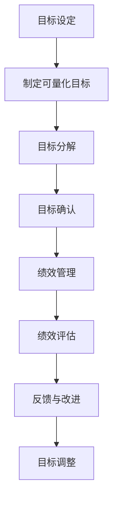

##### 2.1.2 沟通与协作

沟通与协作是远程管理的核心要素之一。在远程环境中，沟通的渠道和方式与传统办公有所不同。管理者需要选择合适的沟通工具，以确保信息的有效传递和理解。

**沟通工具的选择：**

1. **即时通讯工具：** 如 Slack、Microsoft Teams 等，用于实时沟通和协作。
2. **邮件：** 用于正式的沟通和文档传递。
3. **视频会议：** 如 Zoom、Google Meet 等，用于远程会议和团队讨论。
4. **项目管理工具：** 如 Trello、Asana 等，用于任务分配和进度跟踪。

**协作流程的优化：**

1. **明确职责分工：** 确保每个团队成员都了解自己的职责和工作内容。
2. **定期会议：** 通过定期的远程会议，讨论项目进展和解决潜在问题。
3. **共享文档：** 利用云存储和协作工具，确保文档的实时更新和共享。

**核心概念与联系：**

沟通与协作不仅涉及到工具的选择，还包括沟通技巧和协作流程的设计。以下是一个沟通与协作流程的 Mermaid 流程图：

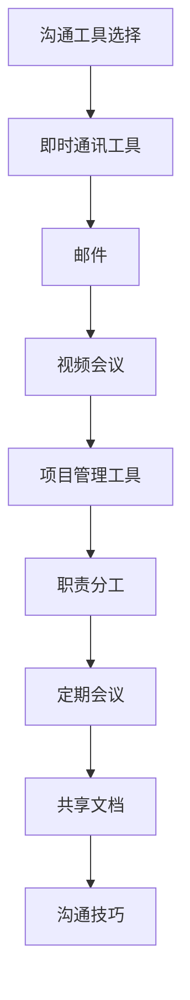

##### 2.1.3 领导风格与团队建设

在远程管理中，领导风格和团队建设尤为重要。远程环境下的领导需要具备更强的沟通能力和团队管理技能，以激励和引导团队成员。

**领导风格：**

1. **参与式领导：** 鼓励团队成员参与决策和问题解决，增强团队凝聚力。
2. **赋能型领导：** 相信团队成员的能力，赋予他们自主权和责任感。
3. **支持型领导：** 提供必要的支持和资源，帮助团队成员克服困难。

**团队建设：**

1. **团队文化：** 建立积极的团队文化，鼓励创新和合作。
2. **信任建设：** 通过有效的沟通和协作，建立团队成员之间的信任。
3. **团队活动：** 定期组织在线团队活动，增强团队成员之间的联系。

**核心概念与联系：**

领导风格和团队建设共同构成了远程管理的领导力基础。以下是一个领导风格与团队建设关系的 Mermaid 流程图：

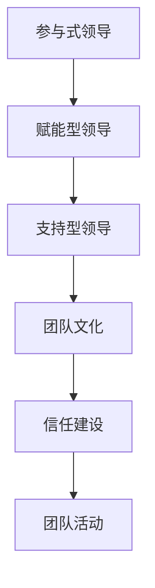

#### 2.2 远程工作环境与工具

远程工作环境的选择和管理对于远程管理的效果至关重要。以下将探讨远程工作平台的选择、工具的应用以及信息安全与数据保护。

##### 2.2.1 远程工作平台的选择

远程工作平台的选择应考虑以下几个因素：

1. **稳定性与可靠性：** 平台应具备高稳定性和可靠性，确保远程工作的顺利进行。
2. **兼容性：** 平台应支持多种设备和操作系统，方便团队成员的接入。
3. **功能丰富：** 平台应提供丰富的功能，如即时通讯、视频会议、项目管理等。
4. **安全性：** 平台应具备良好的安全性，确保数据和信息的保护。

常见的远程工作平台包括：

1. **Slack：** 用于即时通讯和文件共享。
2. **Zoom：** 用于远程视频会议。
3. **Trello：** 用于任务管理和项目管理。
4. **GitHub：** 用于版本控制和代码共享。

##### 2.2.2 工具与技术的应用

远程管理中，各种工具和技术的应用有助于提高工作效率和团队协作效果。以下是一些常用的工具和技术：

1. **项目管理工具：** 如 Asana、Jira 等，用于任务分配、进度跟踪和团队协作。
2. **协作工具：** 如 Google Workspace、Microsoft 365 等，用于文档编辑、共享和协作。
3. **视频会议工具：** 如 Zoom、Microsoft Teams、Google Meet 等，用于远程会议和团队讨论。
4. **版本控制工具：** 如 Git、SVN 等，用于代码管理和版本控制。

**核心概念与联系：**

远程工作平台、工具和技术之间存在着密切的联系。以下是一个远程管理工具和技术应用的 Mermaid 流程图：

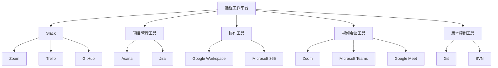

##### 2.2.3 信息安全与数据保护

信息安全与数据保护是远程管理中不可忽视的重要环节。以下是一些信息安全与数据保护的关键点：

1. **数据加密：** 使用数据加密技术，确保数据在传输和存储过程中的安全。
2. **访问控制：** 实施严格的访问控制策略，确保只有授权人员才能访问敏感信息。
3. **身份验证：** 使用双因素身份验证，增强系统的安全性。
4. **网络安全：** 定期进行网络安全检查和更新，防止网络攻击和数据泄露。

**核心概念与联系：**

信息安全与数据保护是远程管理中不可或缺的一部分。以下是一个信息安全与数据保护流程的 Mermaid 流程图：

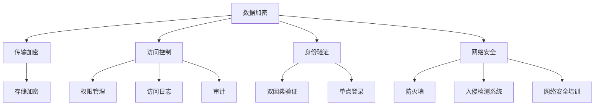

总之，远程管理的基本原理包括目标设定与绩效管理、沟通与协作、领导风格与团队建设，以及远程工作环境与工具的选择。这些核心要素相互关联，共同构成了远程管理的整体框架。通过深入理解和应用这些原理，企业可以更好地克服远程工作带来的挑战，实现高效的远程管理。

### 第3章 远程沟通策略

#### 3.1 远程沟通的挑战与解决方法

远程沟通是远程管理的重要组成部分，但由于缺乏面对面的互动，远程沟通面临许多挑战。以下将探讨这些挑战以及相应的解决方法。

##### 3.1.1 面对面的交流替代品

在远程环境中，面对面的交流难以实现，因此需要找到有效的替代品。以下是一些常见的替代品：

1. **视频会议：** 视频会议可以模拟面对面的交流，有助于建立情感联系和增强沟通效果。常见的视频会议工具有 Zoom、Microsoft Teams、Google Meet 等。

2. **即时通讯工具：** 即时通讯工具如 Slack、Microsoft Teams、WhatsApp 等，可以用于实时沟通和协作，适用于快速解决问题和即时反馈。

3. **邮件和消息应用：** 在需要正式沟通或传递重要信息时，邮件和消息应用如 Gmail、Outlook、Telegram 等，是不错的选择。

**核心概念与联系：**

面对面的交流替代品有助于克服远程沟通的障碍。以下是一个远程沟通替代品的 Mermaid 流程图：

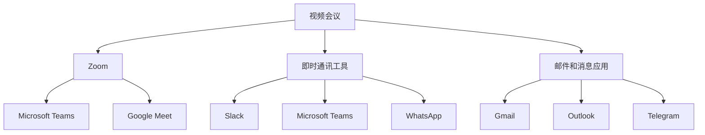

##### 3.1.2 消除沟通障碍

远程沟通中可能面临多种障碍，以下是一些常见的障碍及消除方法：

1. **语言障碍：** 使用统一的沟通语言和术语，确保所有团队成员都能理解和沟通。同时，利用翻译工具或聘请专业的翻译人员，可以减少语言障碍。

2. **文化差异：** 尊重不同文化的价值观和行为习惯，避免文化冲突。在跨文化沟通中，采用包容和理解的态度，促进有效沟通。

3. **技术问题：** 远程沟通依赖于技术工具，因此技术问题如网络连接不稳定、设备故障等，可能影响沟通效果。为确保沟通顺利进行，采用稳定的技术平台和备选方案。

**核心概念与联系：**

消除沟通障碍是远程沟通的关键。以下是一个消除沟通障碍的 Mermaid 流程图：

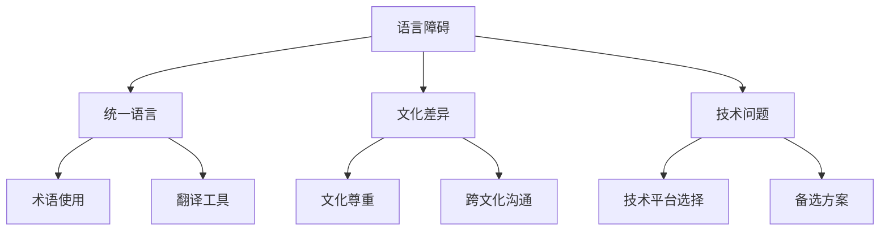

##### 3.1.3 提升沟通效果的技术手段

为了提升远程沟通效果，可以采用以下技术手段：

1. **人工智能和机器学习：** 利用人工智能和机器学习技术，可以提供智能沟通解决方案，如语音识别、自然语言处理、智能客服等。

2. **虚拟现实（VR）和增强现实（AR）：** VR 和 AR 技术可以创造沉浸式的沟通环境，使远程沟通更加生动和真实。

3. **协作工具和项目管理软件：** 利用协作工具和项目管理软件，可以实时跟踪项目进展、任务分配和团队协作，提高沟通效率和团队协作效果。

**核心概念与联系：**

提升沟通效果的技术手段有助于克服远程沟通的障碍，提高沟通效率。以下是一个提升沟通效果的 Mermaid 流程图：

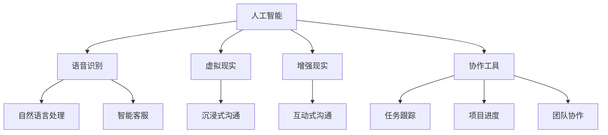

#### 3.2 远程会议与团队协作

远程会议和团队协作是远程管理中的核心环节，以下将探讨远程会议的最佳实践、跨文化沟通以及优化团队协作流程。

##### 3.2.1 远程会议的最佳实践

为了确保远程会议的高效和成功，以下是一些最佳实践：

1. **明确会议目标：** 在会议开始前，明确会议的目标和议程，确保会议内容集中和高效。

2. **提前准备：** 提前准备会议所需的资料和设备，确保会议顺利进行。

3. **会议纪律：** 确保会议期间的秩序，避免干扰和分散注意力。

4. **互动与参与：** 鼓励团队成员积极参与会议讨论，提出问题和建议，提高会议的互动性。

5. **会议记录：** 会议结束后，及时整理会议记录，确保关键信息和决策得到记录和传达。

**核心概念与联系：**

远程会议的最佳实践有助于提高会议效率和团队协作效果。以下是一个远程会议最佳实践的 Mermaid 流程图：

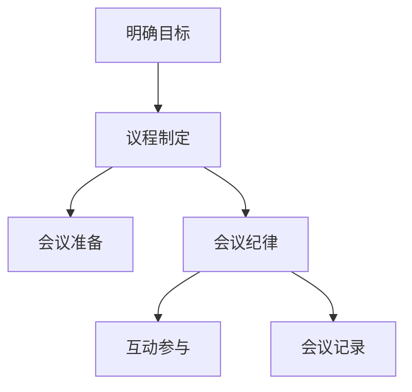

##### 3.2.2 跨文化沟通

在远程团队中，跨文化沟通是一个重要的挑战。以下是一些跨文化沟通的建议：

1. **了解文化差异：** 了解团队成员的文化背景和价值观，尊重差异，避免文化冲突。

2. **保持开放态度：** 保持开放的态度和包容的心态，尊重不同的观点和意见。

3. **明确沟通方式：** 根据不同文化的沟通风格，采用合适的沟通方式和策略。

4. **使用通用语言：** 使用通用的语言和术语，确保沟通的清晰和准确。

**核心概念与联系：**

跨文化沟通有助于建立和谐的团队关系，提高团队协作效果。以下是一个跨文化沟通的 Mermaid 流程图：

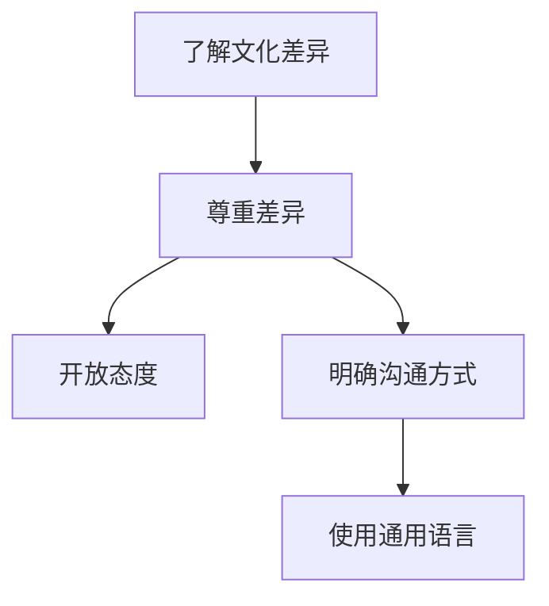

##### 3.2.3 优化团队协作流程

优化团队协作流程是提高远程团队效率的关键。以下是一些优化团队协作流程的方法：

1. **明确职责分工：** 确保每个团队成员都清楚自己的职责和工作内容。

2. **定期沟通与反馈：** 定期进行团队沟通和反馈，及时解决协作中的问题。

3. **使用协作工具：** 利用协作工具，如项目管理软件和即时通讯工具，提高协作效率和沟通效果。

4. **建立清晰的流程：** 确保团队协作流程清晰明确，减少误解和重复工作。

**核心概念与联系：**

优化团队协作流程有助于提高团队协作效率和项目成功率。以下是一个优化团队协作流程的 Mermaid 流程图：

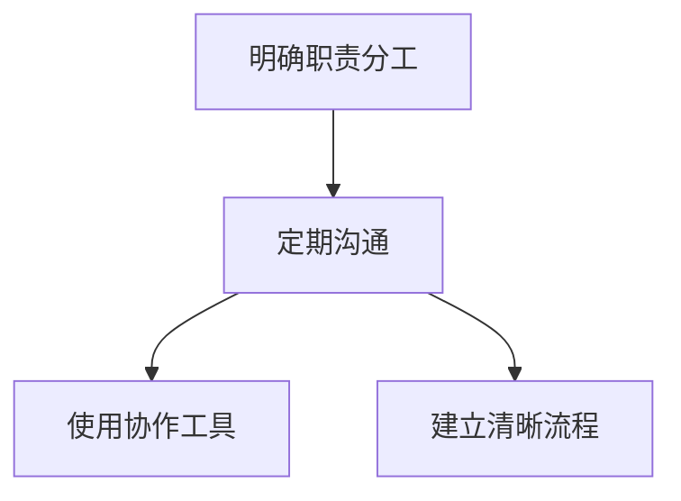

总之，远程沟通策略包括面对面的交流替代品、消除沟通障碍、提升沟通效果的技术手段，以及远程会议、团队协作和跨文化沟通。通过这些策略，企业可以克服远程沟通的挑战，实现高效和和谐的远程团队协作。

### 第4章 远程团队管理

#### 4.1 远程团队管理的独特性

远程团队管理与传统现场管理存在显著差异，其独特性主要体现在以下几个方面：

##### 4.1.1 领导者角色的转变

在远程团队管理中，领导者需要适应新的角色，从传统的命令和控制型转变为支持型和服务型领导者。以下是一些领导者角色的转变：

1. **信任与授权：** 远程团队管理强调信任和授权，领导者应相信团队成员的能力，并赋予他们足够的自主权和责任感。

2. **支持与辅导：** 领导者应提供必要的支持和辅导，帮助团队成员解决工作中的困难和挑战。

3. **激励与认可：** 远程环境中，领导者需要通过其他方式激励团队成员，如在线奖励、公开认可和职业发展机会。

**核心概念与联系：**

领导者角色的转变对于远程团队管理至关重要。以下是一个领导者角色转变的 Mermaid 流程图：

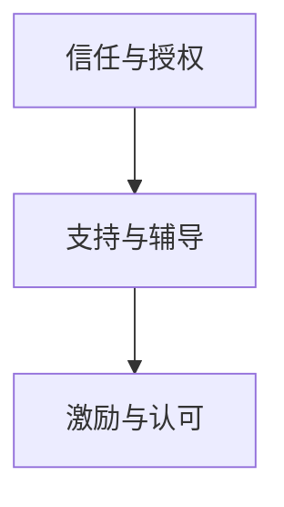

##### 4.1.2 建立高效的远程团队

建立高效的远程团队是远程团队管理的核心目标。以下是一些关键步骤：

1. **明确目标和职责：** 确保每个团队成员都清楚自己的职责和工作目标，以提高团队协作效率。

2. **建立团队文化：** 建立积极的团队文化，鼓励创新、合作和信任，增强团队的凝聚力。

3. **选择合适的协作工具：** 选择适合团队需求的协作工具，如项目管理软件、即时通讯工具和文档共享平台，以提高团队协作效率。

**核心概念与联系：**

建立高效的远程团队需要明确目标和职责，建立团队文化，以及选择合适的协作工具。以下是一个建立高效远程团队的 Mermaid 流程图：

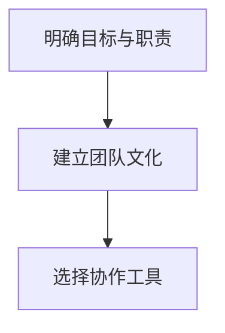

##### 4.1.3 预防与处理远程团队问题

远程团队管理中可能会出现各种问题，以下是一些常见问题及解决方法：

1. **沟通障碍：** 频繁的沟通是解决沟通障碍的关键。使用多种沟通工具，如视频会议、即时通讯和电子邮件，确保信息传递的及时性和准确性。

2. **团队凝聚力不足：** 通过定期的团队活动，如在线聚会和团队建设游戏，增强团队成员之间的联系和凝聚力。

3. **工作效率问题：** 确保团队成员有足够的时间和资源完成工作，避免工作过度负荷。同时，利用项目管理工具和敏捷方法论，优化工作流程和提高工作效率。

**核心概念与联系：**

预防与处理远程团队问题需要关注沟通、团队凝聚力和工作效率。以下是一个预防与处理远程团队问题的 Mermaid 流程图：

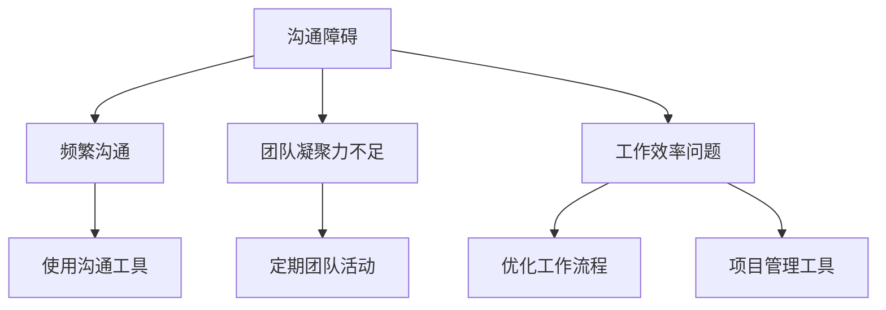

总之，远程团队管理的独特性体现在领导者角色的转变、建立高效的远程团队以及预防与处理远程团队问题。通过深入理解和应用这些原则，企业可以更好地管理远程团队，实现高效的远程工作。

### 第4章 远程团队管理（续）

#### 4.2 远程员工激励与成长

在远程工作环境中，激励员工和关注其成长是远程团队管理的重要任务。以下将探讨远程工作激励策略、员工的职业发展路径以及远程员工的心理关怀。

##### 4.2.1 远程工作激励策略

远程员工激励策略旨在激发员工的工作热情和创造力，以下是一些有效的激励策略：

1. **目标导向的奖励机制：** 设定清晰的目标，并为达成目标的员工提供奖励，如奖金、晋升机会或额外的休假时间。

2. **灵活的工作安排：** 提供灵活的工作时间安排，允许员工根据自己的需求调整工作时间和地点，提高工作满意度。

3. **职业发展机会：** 提供在线培训和职业发展计划，帮助员工提升技能和职业素养，增强其职业竞争力。

4. **公开认可与奖励：** 通过公开认可和奖励，如在线表彰会或团队公告，表彰员工的贡献和成就，增强其工作动力。

**核心概念与联系：**

目标导向的奖励机制、灵活的工作安排、职业发展机会和公开认可与奖励构成了远程工作激励策略的核心。以下是一个激励策略的 Mermaid 流程图：

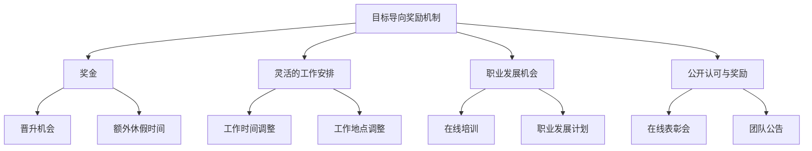

##### 4.2.2 远程员工职业发展路径

为了帮助远程员工实现职业成长，企业需要提供清晰的职业发展路径。以下是一些关键步骤：

1. **技能评估：** 定期对员工进行技能评估，了解其优势和待提升的领域。

2. **职业规划：** 与员工共同制定职业规划，设定短期和长期目标，并提供必要的培训和支持。

3. **晋升机制：** 设立清晰的晋升机制，确保员工的努力和成就得到认可和回报。

4. **跨部门交流：** 通过跨部门项目和团队协作，为员工提供扩展视野和提升技能的机会。

**核心概念与联系：**

远程员工职业发展路径包括技能评估、职业规划、晋升机制和跨部门交流。以下是一个职业发展路径的 Mermaid 流程图：

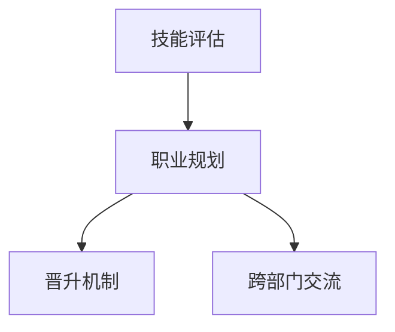

##### 4.2.3 远程员工心理关怀

远程工作可能导致员工感到孤独、焦虑和缺乏归属感。因此，企业需要关注远程员工的心理关怀，以下是一些具体措施：

1. **定期心理辅导：** 提供定期的在线心理辅导，帮助员工应对工作和生活中的压力。

2. **团队互动活动：** 组织在线团队互动活动，如虚拟聚会和团队游戏，增强员工之间的联系。

3. **健康与福利支持：** 提供健康和福利支持，如在线健身课程、心理健康资源和健康保险。

4. **弹性工作时间：** 允许员工根据个人需求调整工作时间，确保工作与生活的平衡。

**核心概念与联系：**

远程员工心理关怀包括定期心理辅导、团队互动活动、健康与福利支持和弹性工作时间。以下是一个心理关怀的 Mermaid 流程图：

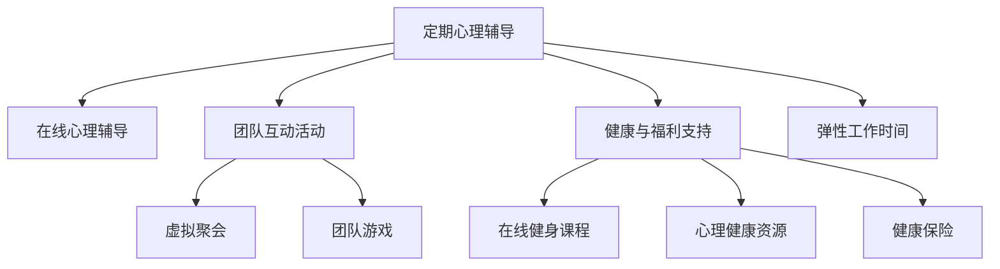

总之，远程团队管理中的员工激励与成长包括目标导向的激励策略、清晰的职业发展路径以及心理关怀。通过这些措施，企业可以增强员工的满意度和忠诚度，提高团队整体绩效。

### 第5章 远程项目管理

#### 5.1 远程项目管理的原则与方法

远程项目管理不同于传统的现场项目管理，其核心原则与方法需要适应远程工作的特点。以下将探讨远程项目管理的原则、项目计划与执行、风险管理以及项目进度与质量监控。

##### 5.1.1 远程项目管理的原则

远程项目管理应遵循以下原则：

1. **目标明确：** 确保项目目标清晰明确，所有团队成员都理解项目的目标和预期成果。

2. **灵活适应：** 远程项目管理应具备灵活性，以适应团队成员的工作时间、地点和技能差异。

3. **透明沟通：** 通过多种沟通渠道保持团队之间的信息透明，确保所有成员都能及时了解项目进展和决策。

4. **持续监控：** 定期监控项目进度和风险，及时调整计划和资源分配，确保项目按时、高质量完成。

**核心概念与联系：**

远程项目管理的原则包括目标明确、灵活适应、透明沟通和持续监控。以下是一个远程项目管理原则的 Mermaid 流程图：

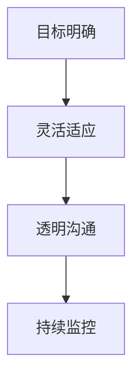

##### 5.1.2 项目计划与执行

在远程项目管理中，项目计划与执行至关重要。以下是一些关键步骤：

1. **需求分析：** 对项目需求进行详细分析，明确项目的范围、目标和关键成果。

2. **任务分解：** 将项目分解为可管理的小任务，确保每个任务都有明确的负责人和完成时间。

3. **资源分配：** 根据任务需求，合理分配人力资源、技术资源和物资资源。

4. **执行监控：** 通过远程协作工具和项目管理软件，实时监控任务进展，确保项目按计划执行。

**核心概念与联系：**

项目计划与执行包括需求分析、任务分解、资源分配和执行监控。以下是一个项目计划与执行的 Mermaid 流程图：

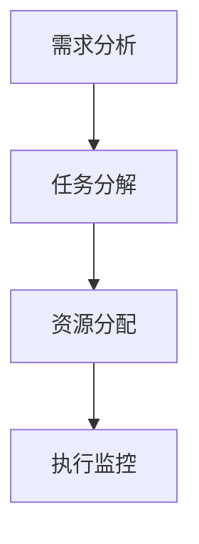

##### 5.1.3 风险管理与问题解决

在远程项目管理中，风险管理尤为重要。以下是一些风险管理方法：

1. **风险识别：** 识别项目可能面临的各种风险，包括技术风险、市场风险、人力资源风险等。

2. **风险评估：** 对识别出的风险进行评估，确定风险的优先级和影响程度。

3. **风险应对：** 制定相应的风险应对策略，包括风险规避、风险减轻、风险转移等。

4. **问题解决：** 及时发现和解决项目中的问题，确保项目顺利推进。

**核心概念与联系：**

风险管理与问题解决包括风险识别、风险评估、风险应对和问题解决。以下是一个风险管理与问题解决的 Mermaid 流程图：

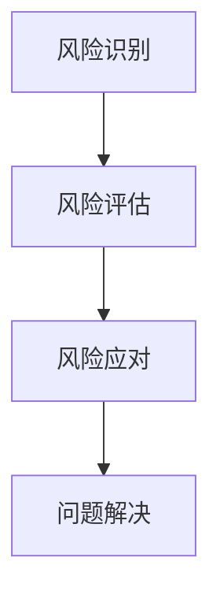

##### 5.1.4 项目进度与质量监控

项目进度与质量监控是确保项目按时、高质量完成的关键。以下是一些监控方法：

1. **进度报告：** 定期向项目团队和管理层报告项目进度，确保所有成员都能了解项目进展。

2. **质量检查：** 对项目成果进行质量检查，确保符合项目需求和标准。

3. **反馈机制：** 建立反馈机制，鼓励团队成员提出意见和建议，及时改进项目流程。

4. **持续改进：** 根据项目进展和反馈，持续改进项目计划和管理方法。

**核心概念与联系：**

项目进度与质量监控包括进度报告、质量检查、反馈机制和持续改进。以下是一个项目进度与质量监控的 Mermaid 流程图：

```mermaid
graph TD
    A[进度报告] --> B[质量检查]
    B --> C[反馈机制]
    C --> D[持续改进]
```

总之，远程项目管理需要遵循目标明确、灵活适应、透明沟通和持续监控的原则，通过项目计划与执行、风险管理、问题解决以及项目进度与质量监控，确保项目成功完成。

### 第5章 远程项目管理（续）

#### 5.2 远程项目工具与平台

在远程项目管理中，选择合适的工具和平台对于确保项目顺利进行至关重要。以下将探讨常用的项目管理工具、搭建远程项目协作平台的方法以及项目文档管理与共享。

##### 5.2.1 常用的项目管理工具

远程项目管理工具可以帮助团队有效协作、任务分配和进度跟踪。以下是一些常用的项目管理工具：

1. **Trello：** Trello 是一款可视化项目管理工具，适用于任务分配和进度跟踪。用户可以通过拖放操作创建卡片、列表和板，便于管理任务和团队协作。

2. **Jira：** Jira 是一款功能强大的项目管理工具，适用于敏捷开发团队。它提供了丰富的功能，包括任务跟踪、问题报告、敏捷看板和报告生成。

3. **Asana：** Asana 是一款适用于各类团队的在线项目管理工具，支持任务分配、进度跟踪和报告生成。它提供了直观的用户界面和多种视图，方便团队成员了解项目进展。

4. **Microsoft Teams：** Microsoft Teams 是一款集成通信、协作和会议功能的平台，适用于远程团队。用户可以通过 Teams 进行即时消息、视频会议和文件共享，提高团队协作效率。

**核心概念与联系：**

常用的项目管理工具包括 Trello、Jira、Asana 和 Microsoft Teams。以下是一个常用项目管理工具的 Mermaid 流程图：

```mermaid
graph TD
    A[Trello] --> B[Jira]
    B --> C[Asana]
    C --> D[Microsoft Teams]
```

##### 5.2.2 搭建远程项目协作平台

搭建远程项目协作平台需要考虑以下几个方面：

1. **需求分析：** 分析项目需求和团队协作方式，确定所需的功能和工具。

2. **平台选择：** 根据需求选择合适的远程协作平台，如 Slack、Microsoft Teams、Zoom 等。

3. **配置与部署：** 在选择好平台后，进行配置和部署，确保团队成员可以轻松接入和使用。

4. **培训与支持：** 提供培训和支持，帮助团队成员熟悉平台功能和操作方法。

**核心概念与联系：**

搭建远程项目协作平台包括需求分析、平台选择、配置与部署以及培训与支持。以下是一个搭建远程项目协作平台的 Mermaid 流程图：

```mermaid
graph TD
    A[需求分析] --> B[平台选择]
    B --> C[配置与部署]
    C --> D[培训与支持]
```

##### 5.2.3 项目文档管理与共享

项目文档管理是远程项目管理的重要组成部分，以下是一些项目文档管理与共享的方法：

1. **云存储服务：** 使用云存储服务，如 Google Drive、OneDrive、Box 等，便于团队成员随时访问和共享文档。

2. **版本控制系统：** 如 Git、SVN 等，用于管理和跟踪项目文档的版本，确保文档的一致性和完整性。

3. **文档协作工具：** 如 Google Docs、Microsoft Office 365 等，支持多人实时编辑和协作，提高文档处理效率。

4. **文档审批流程：** 建立文档审批流程，确保文档的修改和发布经过适当的审核和批准。

**核心概念与联系：**

项目文档管理与共享包括云存储服务、版本控制系统、文档协作工具和文档审批流程。以下是一个项目文档管理与共享的 Mermaid 流程图：

```mermaid
graph TD
    A[云存储服务] --> B[Google Drive]
    B --> C[OneDrive]
    B --> D[Box]
    A --> E[版本控制系统]
    E --> F[Git]
    E --> G[SVN]
    A --> H[文档协作工具]
    H --> I[Google Docs]
    H --> J[Microsoft Office 365]
    A --> K[文档审批流程]
```

总之，远程项目工具与平台的选择和搭建，以及项目文档管理与共享，是远程项目管理中不可或缺的环节。通过合理利用这些工具和平台，企业可以高效地管理远程项目，确保项目成功完成。

### 第6章 远程管理中的法律与伦理问题

#### 6.1 远程管理中的法律问题

远程管理涉及多个法律领域，以下将探讨劳动法律框架、数据隐私与安全以及国际法律冲突。

##### 6.1.1 劳动法律框架

远程工作在不同国家和地区可能受到不同的劳动法律和规定的约束。以下是一些关键点：

1. **劳动合同：** 远程工作合同应明确工作内容、工作时间、薪资待遇和保密协议等条款。

2. **工作时间和休息：** 许多国家和地区有规定工作时间和休息时间，远程工作也需要遵守这些规定。

3. **加班和福利：** 远程工作的加班计算和福利待遇需要与现场工作一致，确保员工的合法权益。

4. **劳动争议解决：** 远程劳动争议可以通过线上调解、仲裁或法律诉讼等方式解决。

**核心概念与联系：**

劳动法律框架包括劳动合同、工作时间、加班和福利以及劳动争议解决。以下是一个劳动法律框架的 Mermaid 流程图：

```mermaid
graph TD
    A[劳动合同] --> B[工作内容]
    B --> C[工作时间]
    B --> D[薪资待遇]
    B --> E[保密协议]
    A --> F[加班和福利]
    F --> G[加班计算]
    F --> H[福利待遇]
    A --> I[劳动争议解决]
    I --> J[线上调解]
    I --> K[仲裁]
    I --> L[法律诉讼]
```

##### 6.1.2 数据隐私与安全

远程工作带来了数据隐私与安全的新挑战，以下是一些关键措施：

1. **数据加密：** 使用数据加密技术，确保数据在传输和存储过程中的安全。

2. **访问控制：** 实施严格的访问控制策略，确保只有授权人员才能访问敏感数据。

3. **安全培训：** 定期对员工进行安全培训，提高其数据安全意识和防范能力。

4. **网络安全：** 加强网络防护，防止网络攻击和数据泄露。

**核心概念与联系：**

数据隐私与安全包括数据加密、访问控制、安全培训和网络安全。以下是一个数据隐私与安全的 Mermaid 流程图：

```mermaid
graph TD
    A[数据加密] --> B[传输加密]
    B --> C[存储加密]
    A --> D[访问控制]
    D --> E[权限管理]
    D --> F[访问日志]
    D --> G[审计]
    A --> H[安全培训]
    A --> I[网络安全]
    I --> J[防火墙]
    I --> K[入侵检测系统]
```

##### 6.1.3 国际法律冲突

在全球化背景下，远程管理可能涉及不同国家和地区的法律冲突。以下是一些处理方法：

1. **了解当地法律：** 远程管理人员需要了解不同国家和地区的劳动法律和商业法规。

2. **选择法律适用：** 在签订合同时，可以约定适用的法律条款，以避免法律冲突。

3. **咨询专业法律意见：** 遇到法律冲突时，应及时咨询专业律师，寻求法律解决方案。

**核心概念与联系：**

国际法律冲突包括了解当地法律、选择法律适用和咨询专业法律意见。以下是一个国际法律冲突的 Mermaid 流程图：

```mermaid
graph TD
    A[了解当地法律] --> B[劳动法律]
    B --> C[商业法规]
    A --> D[选择法律适用]
    D --> E[签订合同时约定法律条款]
    A --> F[咨询专业法律意见]
```

#### 6.2 远程管理的伦理问题

远程管理不仅涉及法律问题，还涉及伦理问题，以下将探讨劳动者权益保障、远程工作的伦理责任以及企业社会责任。

##### 6.2.1 劳动者权益保障

在远程管理中，保护劳动者权益至关重要。以下是一些关键措施：

1. **平等就业机会：** 远程工作不应歧视任何员工，确保所有员工享有平等的就业机会。

2. **职业发展和培训：** 提供远程员工职业发展和培训机会，帮助其提升技能和职业素养。

3. **工作与生活平衡：** 关注远程员工的工作与生活平衡，提供灵活的工作安排和心理支持。

**核心概念与联系：**

劳动者权益保障包括平等就业机会、职业发展和培训以及工作与生活平衡。以下是一个劳动者权益保障的 Mermaid 流程图：

```mermaid
graph TD
    A[平等就业机会] --> B[远程工作不歧视]
    A --> C[职业发展和培训]
    C --> D[技能提升]
    C --> E[职业素养提升]
    A --> F[工作与生活平衡]
    F --> G[灵活的工作安排]
    F --> H[心理支持]
```

##### 6.2.2 远程工作的伦理责任

远程工作对员工和企业都提出了伦理责任要求。以下是一些关键点：

1. **诚信和透明：** 远程工作要求员工保持诚信和透明，确保工作成果的真实和可靠。

2. **尊重隐私：** 尊重员工的隐私权，避免在远程工作中侵犯员工隐私。

3. **环境责任：** 关注远程工作对环境的影响，采取环保措施减少碳足迹。

**核心概念与联系：**

远程工作的伦理责任包括诚信和透明、尊重隐私以及环境责任。以下是一个远程工作伦理责任的 Mermaid 流程图：

```mermaid
graph TD
    A[诚信和透明] --> B[工作成果真实]
    A --> C[尊重隐私]
    A --> D[环境责任]
```

##### 6.2.3 企业社会责任

远程管理中的企业社会责任包括以下方面：

1. **员工关怀：** 关注员工的工作与生活平衡，提供心理健康支持和社会福利。

2. **社区参与：** 参与社区公益活动，回馈社会，提升企业品牌形象。

3. **可持续发展：** 关注企业环境和社会影响，推动可持续发展。

**核心概念与联系：**

企业社会责任包括员工关怀、社区参与和可持续发展。以下是一个企业社会责任的 Mermaid 流程图：

```mermaid
graph TD
    A[员工关怀] --> B[工作与生活平衡]
    B --> C[心理健康支持]
    B --> D[社会福利]
    A --> E[社区参与]
    E --> F[公益活动]
    E --> G[品牌形象提升]
    A --> H[可持续发展]
```

总之，远程管理中的法律与伦理问题涉及劳动法律框架、数据隐私与安全、国际法律冲突，以及劳动者权益保障、远程工作的伦理责任和企业社会责任。通过合理解决这些问题，企业可以确保远程管理的合法性和道德性，实现可持续发展。

### 第7章 成功的远程管理案例

#### 7.1 成功远程管理案例介绍

在本章节中，我们将介绍三个成功远程管理的案例，分别来自全球顶级咨询公司、科技创业公司和跨国企业。这些案例将为我们提供宝贵的实践经验，帮助理解远程管理的最佳实践。

##### 7.1.1 案例一：全球顶级咨询公司

全球顶级咨询公司A公司通过远程管理实现了全球业务的高效运作。A公司采用了以下几种关键措施：

1. **统一平台：** A公司采用了一个统一的远程工作平台，包括即时通讯工具、视频会议软件和项目管理工具。这确保了团队成员之间的沟通顺畅和协作高效。

2. **目标明确：** A公司为每个项目设定了明确的目标和里程碑，并通过定期的进度报告和绩效评估确保项目按计划推进。

3. **领导力支持：** 公司领导层积极参与远程管理的实施，通过定期的在线会议和一对一沟通，提供指导和支持。

4. **员工培训：** A公司定期为员工提供远程管理技能培训，确保团队成员能够熟练使用各种远程管理工具和平台。

**案例分析：**

A公司的成功经验在于其统一平台的应用、明确的目标设定、领导力支持和员工培训。这些措施共同促进了团队成员之间的有效沟通和协作，提高了项目效率。

##### 7.1.2 案例二：科技创业公司

科技创业公司B公司利用远程管理快速响应市场需求，实现了业务的快速增长。B公司采取了以下几种措施：

1. **灵活的工作时间：** B公司允许员工根据个人需求灵活调整工作时间，这提高了员工的工作满意度和生产力。

2. **敏捷开发：** B公司采用敏捷开发方法，通过短周期的迭代和持续的反馈，快速响应市场需求和客户反馈。

3. **团队建设：** B公司定期组织在线团队建设活动，如虚拟聚会和团队游戏，增强了团队成员之间的联系和凝聚力。

4. **员工激励：** B公司通过在线奖励和公开表彰，激励员工积极投入工作，提高了团队整体绩效。

**案例分析：**

B公司的成功在于其灵活的工作时间、敏捷开发方法、团队建设和员工激励措施。这些措施帮助B公司在快速变化的市场环境中保持竞争力，实现了业务的快速增长。

##### 7.1.3 案例三：跨国企业

跨国企业C公司通过远程管理实现了全球团队的协同作战。C公司采取了以下几种措施：

1. **跨文化培训：** C公司为全球团队成员提供跨文化培训，帮助员工了解不同文化的行为规范和沟通方式，减少了文化冲突。

2. **协作平台：** C公司采用了一个全球协作平台，支持多种语言和时区，确保团队成员能够实时沟通和协作。

3. **透明沟通：** C公司通过定期的在线会议和报告，保持团队之间的信息透明，确保所有成员都能了解项目的进展和决策。

4. **风险管理：** C公司建立了全面的风险管理机制，定期评估项目风险，并制定应对措施，确保项目的顺利进行。

**案例分析：**

C公司的成功在于其跨文化培训、协作平台、透明沟通和风险管理措施。这些措施帮助C公司在多元化的全球团队中保持了高效沟通和协作，实现了全球业务的成功。

#### 7.2 案例分析与启示

通过对上述成功远程管理案例的分析，我们可以得出以下启示：

1. **统一平台的重要性：** 统一的平台可以确保团队成员之间的沟通顺畅和协作高效，这是远程管理成功的关键。

2. **灵活性和敏捷性：** 远程工作环境下的灵活性和敏捷性可以帮助企业快速响应市场需求和变化，提高竞争力。

3. **团队建设和文化：** 团队建设和文化是远程管理中的重要环节，通过定期的团队活动和跨文化培训，可以增强团队凝聚力和跨文化沟通能力。

4. **透明沟通和风险管理：** 透明沟通和风险管理是确保项目顺利进行的重要保障，通过定期的沟通和风险评估，可以及时发现和解决问题。

总之，这些成功案例为我们提供了宝贵的实践经验，通过学习这些案例，企业可以更好地实施远程管理，提高工作效率和团队绩效。

### 第8章 未来远程管理的趋势与发展

#### 8.1 远程管理技术的革新

随着技术的不断进步，远程管理领域也在经历着深刻的变革。以下将探讨新兴技术的应用、人工智能在远程管理中的应用以及虚拟现实与远程管理的融合。

##### 8.1.1 新兴技术的应用

1. **云计算：** 云计算为远程管理提供了强大的基础设施支持，通过云计算平台，企业可以轻松实现数据存储、处理和共享。云计算的弹性资源分配能力，使得企业可以根据需求动态调整IT资源，降低了成本，提高了效率。

2. **人工智能（AI）：** 人工智能在远程管理中的应用日益广泛。例如，AI可以用于自动化日常任务，如日程安排、邮件过滤和数据分析，减轻员工的工作负担。此外，AI还可以用于智能客服，提供24/7的客户服务。

3. **物联网（IoT）：** 物联网技术的应用，使得远程管理更加智能化。例如，物联网设备可以实时监控生产设备和环境状况，为企业提供实时数据，帮助企业优化生产流程和提高工作效率。

**核心概念与联系：**

新兴技术在远程管理中的应用，包括云计算、人工智能和物联网。以下是一个新兴技术应用在远程管理的 Mermaid 流程图：

```mermaid
graph TD
    A[云计算] --> B[数据存储]
    B --> C[数据处理]
    B --> D[资源共享]
    A --> E[人工智能]
    E --> F[任务自动化]
    E --> G[智能客服]
    A --> H[物联网]
    H --> I[实时监控]
    H --> J[优化生产流程]
```

##### 8.1.2 人工智能在远程管理中的应用

人工智能在远程管理中的应用，将极大地改变管理方式和效率。以下是一些关键领域：

1. **自动化流程：** 人工智能可以自动化许多远程管理流程，如任务分配、进度跟踪和报告生成，减少人为错误，提高工作效率。

2. **预测分析：** 通过数据分析，人工智能可以预测项目风险、资源需求和工作负荷，帮助企业提前做好准备。

3. **智能沟通：** 人工智能可以用于智能客服，提供24/7的客户支持，同时分析客户反馈，为企业提供改进建议。

4. **员工绩效评估：** 人工智能可以分析员工的工作行为和数据，提供客观的绩效评估，帮助管理者更好地激励和培养员工。

**核心概念与联系：**

人工智能在远程管理中的应用，包括自动化流程、预测分析、智能沟通和员工绩效评估。以下是一个人工智能在远程管理中应用的 Mermaid 流程图：

```mermaid
graph TD
    A[自动化流程] --> B[任务分配]
    B --> C[进度跟踪]
    B --> D[报告生成]
    A --> E[预测分析]
    E --> F[项目风险预测]
    E --> G[资源需求预测]
    A --> H[智能沟通]
    H --> I[24/7客服]
    H --> J[客户反馈分析]
    A --> K[员工绩效评估]
    K --> L[客观评估]
    K --> M[激励与培养]
```

##### 8.1.3 虚拟现实与远程管理的融合

虚拟现实（VR）技术的应用，为远程管理带来了新的可能性。以下是一些关键领域：

1. **虚拟会议室：** 通过VR技术，远程会议可以变得更加真实和互动。参与者可以进入一个虚拟会议室，进行面对面的交流和讨论。

2. **虚拟培训：** VR技术可以用于远程培训，提供沉浸式的学习体验，帮助员工更好地掌握知识和技能。

3. **虚拟团队建设：** 通过VR技术，团队成员可以共同进入一个虚拟空间，进行团队建设活动和互动，增强团队凝聚力。

4. **虚拟办公环境：** VR技术可以为远程员工提供一个虚拟办公环境，使他们能够在一个虚拟空间中办公，提高工作氛围和效率。

**核心概念与联系：**

虚拟现实与远程管理的融合，包括虚拟会议室、虚拟培训、虚拟团队建设和虚拟办公环境。以下是一个虚拟现实与远程管理融合的 Mermaid 流程图：

```mermaid
graph TD
    A[虚拟会议室] --> B[面对面交流]
    A --> C[互动讨论]
    A --> D[虚拟培训]
    D --> E[沉浸式学习]
    A --> F[虚拟团队建设]
    F --> G[团队建设活动]
    F --> H[增强凝聚力]
    A --> I[虚拟办公环境]
    I --> J[提高工作氛围]
    I --> K[提高效率]
```

总之，远程管理技术的革新，包括云计算、人工智能、物联网以及虚拟现实的应用。这些新兴技术将不断推动远程管理的发展，提高管理效率，优化工作流程，为企业和员工带来更多机遇。

### 第8章 未来远程管理的趋势与发展（续）

#### 8.2 远程管理模式的变革

随着技术的进步和远程工作的普及，远程管理模式也在不断变革。以下将探讨远程办公的未来趋势、远程工作与工作生活平衡，以及远程管理的新模式探索。

##### 8.2.1 远程办公的未来趋势

1. **永久远程工作：** 随着远程工作的成功实践，越来越多的企业开始探索永久远程工作的可能性。永久远程工作不仅提高了员工的工作满意度和生产力，还为企业节省了办公场所和差旅成本。

2. **弹性工作制度：** 弹性工作制度将更加普及，允许员工根据个人需求和项目要求灵活安排工作时间。这种制度有助于提高员工的工作效率和生活质量。

3. **分布式团队：** 分布式团队将成为远程办公的常态，团队成员分布在不同的城市、国家甚至时区，通过高效的远程协作工具和平台保持紧密联系。

**核心概念与联系：**

远程办公的未来趋势包括永久远程工作、弹性工作制度和分布式团队。以下是一个远程办公未来趋势的 Mermaid 流程图：

```mermaid
graph TD
    A[永久远程工作] --> B[工作满意度和生产力提升]
    A --> C[成本节约]
    A --> D[弹性工作制度]
    D --> E[灵活安排工作时间]
    D --> F[工作效率提升]
    A --> G[分布式团队]
    G --> H[紧密联系]
    G --> I[高效协作]
```

##### 8.2.2 远程工作与工作生活平衡

远程工作为员工提供了更大的灵活性，但同时也带来了工作与生活平衡的挑战。以下是一些关键措施：

1. **明确工作边界：** 员工和雇主需要明确工作时间和非工作时间，确保工作不会侵占个人时间。

2. **心理健康支持：** 远程工作可能导致员工感到孤独和压力，因此企业需要提供心理健康支持，如在线心理辅导和员工互助小组。

3. **家庭支持：** 鼓励员工在家庭中创造一个适合工作的环境，如设置工作区域和合理安排家务时间。

**核心概念与联系：**

远程工作与工作生活平衡的关键在于明确工作边界、心理健康支持和家庭支持。以下是一个工作生活平衡的 Mermaid 流程图：

```mermaid
graph TD
    A[明确工作边界] --> B[工作时间规划]
    A --> C[非工作时间保障]
    A --> D[心理健康支持]
    D --> E[在线心理辅导]
    D --> F[员工互助小组]
    A --> G[家庭支持]
    G --> H[工作区域设置]
    G --> I[家务时间管理]
```

##### 8.2.3 远程管理的新模式探索

随着远程工作的普及，远程管理也在不断演变，以下是一些新兴的远程管理模式：

1. **远程领导力发展：** 远程领导力发展强调领导者通过远程沟通和协作工具，培养和激励远程团队。这种模式要求领导者具备更高的沟通技能和团队管理能力。

2. **敏捷管理：** 敏捷管理方法在远程环境中具有广泛应用，通过短周期的迭代和持续的反馈，远程团队可以更快地适应变化和客户需求。

3. **混合工作模式：** 混合工作模式结合了远程工作和现场工作，员工可以在家工作和现场工作之间灵活切换。这种模式有助于提高员工的灵活性和企业竞争力。

**核心概念与联系：**

远程管理的新模式探索包括远程领导力发展、敏捷管理和混合工作模式。以下是一个远程管理模式探索的 Mermaid 流程图：

```mermaid
graph TD
    A[远程领导力发展] --> B[沟通技能培养]
    B --> C[团队管理能力提升]
    A --> D[敏捷管理]
    D --> E[短周期迭代]
    D --> F[持续反馈]
    A --> G[混合工作模式]
    G --> H[灵活切换工作地点]
    G --> I[员工灵活性提升]
```

总之，远程管理模式的变革体现在永久远程工作、弹性工作制度、分布式团队、工作生活平衡以及新兴的管理模式探索。这些变革为企业和员工带来了新的机遇和挑战，推动远程管理不断向前发展。

### 附录

#### 附录A：远程管理常用工具与技术概览

1. **即时通讯工具：** Slack、Microsoft Teams、WhatsApp、Telegram
2. **视频会议工具：** Zoom、Google Meet、Microsoft Teams、Skype
3. **项目管理工具：** Trello、Asana、Jira、Monday.com
4. **协作工具：** Google Workspace、Microsoft 365、Notion、Confluence
5. **版本控制工具：** Git、SVN、Mercurial
6. **云存储服务：** Google Drive、OneDrive、Dropbox、Amazon S3
7. **人工智能工具：** IBM Watson、Google Cloud AI、Microsoft Azure AI、OpenAI
8. **虚拟现实与增强现实：** Oculus Rift、HTC Vive、Google Cardboard、ARKit、ARCore
9. **远程工作平台：** Hubstaff、Toggl、Harvest、RemotePC

#### 附录B：远程管理相关法律法规

1. **劳动法律框架：** 不同国家和地区的劳动法律有所不同，企业应遵循所在地的劳动法律。
2. **数据隐私与安全：** GDPR（欧盟通用数据保护条例）、CCPA（美国加州消费者隐私法案）
3. **国际法律冲突：** 企业在跨国远程管理中，应了解并遵守相关国家的法律和规定。
4. **网络安全法：** 确保远程工作环境中的网络安全，如《中华人民共和国网络安全法》

#### 附录C：远程管理实践指南

1. **制定远程工作政策：** 企业应制定明确的远程工作政策，包括工作内容、时间安排、绩效评估等。
2. **培训与支持：** 提供远程管理工具和技术的培训，确保员工能够熟练使用相关工具。
3. **团队沟通：** 建立定期的团队沟通机制，保持团队之间的信息透明和协作顺畅。
4. **员工关怀：** 关注员工的工作与生活平衡，提供心理健康支持和社会福利。
5. **风险管理：** 建立全面的风险管理机制，确保远程项目的顺利进行。

通过附录中的工具概览、法律法规和实践指南，企业可以更好地应对远程管理的挑战，提高工作效率和团队绩效。

