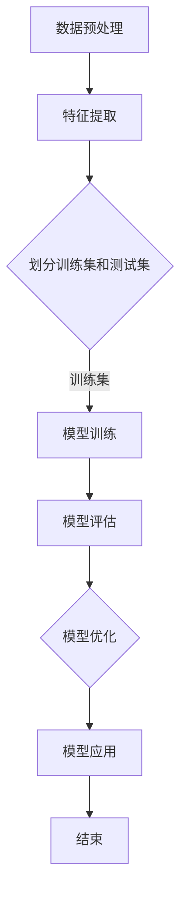
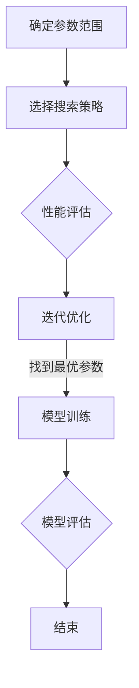

                 


# 逻辑回归 (Logistic Regression)

## 关键词
逻辑回归，概率预测，机器学习，分类算法，二分类问题，多分类问题，金融风控，医学诊断。

## 摘要
逻辑回归是一种广泛应用的机器学习算法，用于概率预测和分类问题。本文将深入探讨逻辑回归的基本概念、数学原理、模型构建、调参方法以及实战案例，并详细介绍其在金融风控和医学诊断等领域的应用。通过本文的阅读，读者将全面了解逻辑回归的理论和实践，掌握其在实际问题中的应用技巧。

## 目录大纲

### 第一部分：逻辑回归基础

## 第1章：逻辑回归概述

### 1.1 逻辑回归的基本概念

逻辑回归（Logistic Regression）是一种广义线性模型（Generalized Linear Model），用于对因变量进行概率预测。在逻辑回归中，因变量通常是二分类的，例如“是/否”、“患病/未患病”等。

逻辑回归的核心思想是通过特征变量（自变量）来预测事件发生的概率。假设我们有一个特征向量 $x$ 和对应的二分类标签 $y$，其中 $y \in \{0, 1\}$。逻辑回归的目标是学习一个参数向量 $\theta$，使得预测概率 $P(y=1|x;\theta)$ 尽可能接近真实的标签 $y$。

逻辑回归的预测公式为：

$$
P(y=1|x;\theta) = \frac{1}{1 + e^{-(\theta^T x)}}
$$

其中，$e$ 是自然底数，$\theta^T x$ 是特征向量的线性组合，也称为逻辑函数（Logistic Function）。

### 1.2 逻辑回归的应用场景

逻辑回归广泛应用于各种二分类问题，如：

- 信用评分：预测客户是否违约。
- 欠费预测：预测用户是否欠费。
- 医学诊断：预测患者是否患有某种疾病。
- 互联网推荐：预测用户是否喜欢某个推荐项。

此外，逻辑回归还可以用于多分类问题，通过扩展逻辑函数来实现。在多分类问题中，逻辑回归通常采用一对多（One-vs-All）或一对一（One-vs-One）的策略。

### 1.3 逻辑回归与线性回归的关系

逻辑回归与线性回归有密切的联系。线性回归的目标是预测连续值，而逻辑回归的目标是预测概率。

在线性回归中，预测公式为：

$$
y = \theta_0 + \theta_1 x_1 + \theta_2 x_2 + \ldots + \theta_n x_n
$$

为了将线性回归扩展到概率预测，我们需要对线性回归的输出进行转换。逻辑回归通过引入逻辑函数（Sigmoid Function）来实现这一目标：

$$
P(y=1|x;\theta) = \frac{1}{1 + e^{-\theta^T x}}
$$

这样，线性回归的输出就可以转换为概率值。

### 第2章：逻辑回归数学原理

## 2.1 概率与贝叶斯理论

概率是描述事件发生可能性的一种度量。贝叶斯理论是概率论中的一个重要分支，它提供了根据先验概率和条件概率更新后验概率的方法。

在逻辑回归中，我们通常使用贝叶斯理论来推导预测概率。假设我们有一个先验概率分布 $P(y=1)$ 和一个条件概率分布 $P(x|y=1)$，那么根据贝叶斯定理，后验概率分布 $P(y=1|x)$ 可以表示为：

$$
P(y=1|x) = \frac{P(x|y=1)P(y=1)}{P(x)}
$$

其中，$P(x)$ 是边缘概率，可以通过 $P(x|y=1)P(y=1) + P(x|y=0)P(y=0)$ 来计算。

在逻辑回归中，$P(x|y=1)$ 和 $P(x|y=0)$ 分别对应于特征向量 $x$ 在正类和负类上的条件概率。我们可以通过训练数据来估计这些条件概率。

### 2.2 逻辑函数与对数函数

逻辑函数（Sigmoid Function）是逻辑回归中的核心函数，它将线性组合映射到概率值。逻辑函数的定义如下：

$$
S(x) = \frac{1}{1 + e^{-x}}
$$

逻辑函数具有以下性质：

- 增函数：随着 $x$ 的增大，$S(x)$ 也增大。
- 有界性：$S(x)$ 的取值范围在 (0, 1) 之间。
- 导数：$S'(x) = S(x)(1 - S(x))$

为了方便计算损失函数的梯度，我们通常使用对数函数来处理逻辑函数的输出。对数函数的定义如下：

$$
\ln(S(x)) = \ln\left(\frac{1}{1 + e^{-x}}\right) = x - \ln(1 + e^{-x})
$$

对数函数具有以下性质：

- 单调性：随着 $x$ 的增大，$\ln(S(x))$ 也增大。
- 导数：$\frac{d}{dx}\ln(S(x)) = \frac{1}{S(x)} = \frac{1}{1 + e^{-x}}$

通过引入对数函数，我们可以将逻辑回归的损失函数表示为：

$$
J(\theta) = -\frac{1}{m} \sum_{i=1}^{m} [y^{(i)} \ln(a(x^{(i)})) + (1 - y^{(i)}) \ln(1 - a(x^{(i)}))]
$$

其中，$a(x^{(i)}) = S(\theta^T x^{(i)})$ 是逻辑函数的输出。

### 2.3 逻辑回归的损失函数与优化算法

逻辑回归的损失函数通常使用对数似然损失函数（Log-Likelihood Loss Function），其定义如下：

$$
J(\theta) = -\frac{1}{m} \sum_{i=1}^{m} [y^{(i)} \ln(a(x^{(i)})) + (1 - y^{(i)}) \ln(1 - a(x^{(i)}))]
$$

其中，$a(x^{(i)}) = S(\theta^T x^{(i)})$ 是逻辑函数的输出，$y^{(i)}$ 是第 $i$ 个样本的标签。

对数似然损失函数具有以下性质：

- 非负性：$J(\theta) \geq 0$
- 边界值：当 $\theta$ 使所有样本的预测概率都为 0 或 1 时，$J(\theta) = 0$

为了最小化损失函数 $J(\theta)$，我们可以使用梯度下降算法（Gradient Descent Algorithm）进行优化。梯度下降算法的基本思想是沿着损失函数的梯度方向更新参数，直到达到损失函数的最小值。

梯度下降算法的更新公式为：

$$
\theta_j := \theta_j - \alpha \frac{\partial J(\theta)}{\partial \theta_j}
$$

其中，$\alpha$ 是学习率（Learning Rate），决定了参数更新的步长。

在实际应用中，我们还可以使用随机梯度下降（Stochastic Gradient Descent, SGD）和批梯度下降（Batch Gradient Descent, BGD）等变种算法来优化参数。随机梯度下降每次更新只使用一个样本的梯度，而批梯度下降每次更新使用所有样本的梯度。

### 第3章：逻辑回归模型构建

## 3.1 特征工程

特征工程（Feature Engineering）是逻辑回归模型构建的重要步骤。特征工程的目标是通过转换和选择特征，提高模型的性能和可解释性。

在特征工程中，我们通常进行以下操作：

- 数据预处理：对缺失值、异常值、噪声等数据进行处理。
- 特征选择：选择对模型性能有显著影响的特征，剔除无关或冗余特征。
- 特征提取：将原始特征转换为适合逻辑回归的格式，例如标准化、归一化、多项式特征等。

特征选择的方法有很多，包括基于统计的方法、基于信息论的方法和基于模型的方法等。常用的统计方法包括信息增益、信息增益率、卡方检验等。信息论方法包括互信息、KL 散度等。模型方法包括基于特征重要度的特征选择和基于模型的正则化方法。

## 3.2 模型选择

模型选择（Model Selection）是逻辑回归模型构建的另一个重要步骤。模型选择的目的是在给定的数据集上选择最优的模型参数。

在模型选择中，我们通常进行以下操作：

- 参数初始化：初始化模型参数 $\theta$，可以随机初始化或基于先验知识初始化。
- 模型训练：使用训练数据集训练模型，计算损失函数的值。
- 模型评估：使用验证数据集或测试数据集评估模型的性能，常用的评估指标包括准确率、召回率、F1 值等。

模型选择的方法有很多，包括基于网格搜索的方法、基于交叉验证的方法等。网格搜索（Grid Search）是一种常用的模型选择方法，它通过遍历预设的参数网格来找到最优参数。交叉验证（Cross Validation）是一种更先进的模型选择方法，它通过将数据集划分为多个子集，在每个子集上训练和评估模型，以获得更稳定的性能评估。

## 3.3 模型评估与验证

模型评估与验证（Model Evaluation and Validation）是逻辑回归模型构建的最后一步。模型评估与验证的目的是评估模型在未知数据上的性能，并验证模型是否泛化到新的数据集。

在模型评估与验证中，我们通常进行以下操作：

- 跨验证集评估（Cross-Validation）：将数据集划分为多个子集，在每个子集上训练和评估模型，计算平均性能。
- 测试集评估（Test Set Evaluation）：将训练好的模型在测试集上评估性能，以评估模型在未知数据上的表现。
- 性能指标（Performance Metrics）：使用准确率、召回率、F1 值等性能指标来评估模型。

跨验证集评估和测试集评估是模型评估的两个重要步骤。跨验证集评估可以在多个子集上评估模型性能，从而减少评估结果的不确定性。测试集评估则用于验证模型在未知数据上的泛化能力。

在模型评估与验证中，我们还需要关注模型的鲁棒性和可解释性。鲁棒性（Robustness）是指模型对异常值和噪声的抵抗能力。可解释性（Interpretability）是指模型决策过程的透明度和可理解性。

### 第4章：逻辑回归模型调参

## 4.1 模型调参的基本原则

模型调参（Hyperparameter Tuning）是逻辑回归模型优化的重要步骤。模型调参的目的是通过调整模型的超参数（Hyperparameters），提高模型的性能和泛化能力。

在模型调参中，我们通常遵循以下基本原则：

- 参数范围：根据模型的特性和数据的特点，确定超参数的合理范围。
- 搜索策略：选择合适的搜索策略，如网格搜索、随机搜索等。
- 性能评估：使用验证集或测试集评估模型性能，选择最优超参数组合。

模型调参的过程通常分为以下步骤：

1. **确定参数范围**：根据模型的特性和数据的特点，确定超参数的合理范围。例如，学习率、迭代次数等。
2. **选择搜索策略**：根据模型的复杂度和计算资源，选择合适的搜索策略。常用的搜索策略包括网格搜索、随机搜索、贝叶斯优化等。
3. **性能评估**：使用验证集或测试集评估模型性能，选择最优超参数组合。性能评估指标包括准确率、召回率、F1 值等。
4. **迭代优化**：根据性能评估结果，调整超参数，重新训练模型，直到找到最优超参数组合。

## 4.2 模型参数选择

在逻辑回归模型中，参数选择（Parameter Selection）是一个关键步骤。参数选择的目的是确定模型参数的初始化值，以便模型能够收敛到最优解。

在参数选择中，我们通常考虑以下因素：

- **初始化方法**：参数初始化可以基于随机初始化、梯度初始化或启发式初始化等方法。
- **收敛性**：参数选择应保证模型能够收敛到最优解。对于非线性模型，收敛性通常受参数初始值的影响较大。
- **计算复杂度**：参数选择应考虑模型的计算复杂度，以避免过拟合和欠拟合。

常用的参数选择方法包括：

1. **随机初始化**：随机初始化是一种简单有效的参数初始化方法。通过随机生成参数初始值，模型可以更好地探索解空间。
2. **梯度初始化**：梯度初始化方法基于模型损失函数的梯度，生成参数初始值。这种方法可以加速模型的收敛速度。
3. **启发式初始化**：启发式初始化方法结合了随机性和梯度信息，生成参数初始值。例如，可以使用动量（Momentum）和自适应学习率（Adaptive Learning Rate）等方法。

## 4.3 模型性能优化

模型性能优化（Model Performance Optimization）是提高逻辑回归模型性能的关键步骤。模型性能优化的目的是通过调整模型结构、参数和学习策略，提高模型的准确率、召回率等性能指标。

在模型性能优化中，我们通常考虑以下方法：

- **模型正则化**：模型正则化（Model Regularization）是一种防止过拟合的方法。通过在损失函数中添加正则化项，可以降低模型复杂度，提高泛化能力。常用的正则化方法包括 L1 正则化、L2 正则化和弹性网（Elastic Net）等。
- **特征选择**：特征选择（Feature Selection）是一种选择对模型性能有显著影响的特征的方法。通过剔除无关或冗余特征，可以提高模型性能和可解释性。常用的特征选择方法包括基于过滤（Filter）、基于包裹（Wrapper）和基于嵌入（Embedded）等方法。
- **模型集成**：模型集成（Model Ensemble）是一种通过结合多个模型来提高性能的方法。常用的模型集成方法包括 Bagging、Boosting 和 stacking 等。

通过模型性能优化，我们可以有效地提高逻辑回归模型在二分类和多分类问题中的性能。

### 第5章：逻辑回归实战案例

## 5.1 案例一：二分类问题

在本案例中，我们将使用逻辑回归解决一个二分类问题：预测客户是否违约。我们使用的数据集包含客户的个人信息、财务状况和贷款信息等。

### 数据准备

首先，我们需要加载数据集，并进行数据预处理。数据预处理包括数据清洗、缺失值处理、异常值处理和特征提取等。

```python
import pandas as pd

# 加载数据集
data = pd.read_csv('credit_data.csv')

# 数据清洗
data.dropna(inplace=True)

# 特征提取
X = data.drop('default', axis=1)
y = data['default']

# 划分训练集和测试集
from sklearn.model_selection import train_test_split
X_train, X_test, y_train, y_test = train_test_split(X, y, test_size=0.2, random_state=42)
```

### 模型训练

接下来，我们使用训练集训练逻辑回归模型。

```python
from sklearn.linear_model import LogisticRegression

# 创建逻辑回归模型
model = LogisticRegression()

# 训练模型
model.fit(X_train, y_train)
```

### 模型评估

在模型训练完成后，我们使用测试集评估模型性能。

```python
from sklearn.metrics import accuracy_score, recall_score, f1_score

# 预测测试集
y_pred = model.predict(X_test)

# 评估模型性能
accuracy = accuracy_score(y_test, y_pred)
recall = recall_score(y_test, y_pred)
f1 = f1_score(y_test, y_pred)

print(f'Accuracy: {accuracy:.2f}')
print(f'Recall: {recall:.2f}')
print(f'F1 Score: {f1:.2f}')
```

### 模型优化

根据模型评估结果，我们可以对模型进行优化。优化方法包括调整参数、特征选择和模型集成等。

```python
# 调整参数
model = LogisticRegression(C=1.0, penalty='l2', solver='liblinear')

# 重新训练模型
model.fit(X_train, y_train)

# 重新评估模型性能
y_pred = model.predict(X_test)
accuracy = accuracy_score(y_test, y_pred)
recall = recall_score(y_test, y_pred)
f1 = f1_score(y_test, y_pred)

print(f'Accuracy: {accuracy:.2f}')
print(f'Recall: {recall:.2f}')
print(f'F1 Score: {f1:.2f}')
```

通过优化，我们可以提高模型的性能，更好地预测客户是否违约。

## 5.2 案例二：多分类问题

在本案例中，我们将使用逻辑回归解决一个多分类问题：分类新闻文章。我们使用的数据集包含新闻文章的文本信息和类别标签。

### 数据准备

首先，我们需要加载数据集，并进行数据预处理。数据预处理包括文本清洗、分词、词频统计和特征提取等。

```python
import pandas as pd
from sklearn.model_selection import train_test_split
from sklearn.feature_extraction.text import TfidfVectorizer

# 加载数据集
data = pd.read_csv('news_data.csv')

# 数据清洗
data.dropna(inplace=True)

# 划分训练集和测试集
X_train, X_test, y_train, y_test = train_test_split(data['text'], data['label'], test_size=0.2, random_state=42)

# 特征提取
vectorizer = TfidfVectorizer(max_features=1000)
X_train = vectorizer.fit_transform(X_train)
X_test = vectorizer.transform(X_test)
```

### 模型训练

接下来，我们使用训练集训练逻辑回归模型。

```python
from sklearn.linear_model import LogisticRegression

# 创建逻辑回归模型
model = LogisticRegression()

# 训练模型
model.fit(X_train, y_train)
```

### 模型评估

在模型训练完成后，我们使用测试集评估模型性能。

```python
from sklearn.metrics import accuracy_score, classification_report

# 预测测试集
y_pred = model.predict(X_test)

# 评估模型性能
accuracy = accuracy_score(y_test, y_pred)
print(f'Accuracy: {accuracy:.2f}')

print(classification_report(y_test, y_pred))
```

### 模型优化

根据模型评估结果，我们可以对模型进行优化。优化方法包括调整参数、特征选择和模型集成等。

```python
# 调整参数
model = LogisticRegression(C=1.0, penalty='l2', solver='liblinear')

# 重新训练模型
model.fit(X_train, y_train)

# 重新评估模型性能
y_pred = model.predict(X_test)
accuracy = accuracy_score(y_test, y_pred)
print(f'Accuracy: {accuracy:.2f}')

print(classification_report(y_test, y_pred))
```

通过优化，我们可以提高模型在多分类问题中的性能。

## 5.3 案例三：实际应用中的逻辑回归

逻辑回归在金融风控、医学诊断和互联网推荐等领域有广泛的应用。以下是一些实际应用案例：

### 金融风控

逻辑回归可以用于预测客户是否违约，从而帮助金融机构降低风险。金融机构可以使用客户的个人信息、财务状况和贷款信息等特征，构建逻辑回归模型来预测客户是否违约。

### 医学诊断

逻辑回归可以用于预测患者是否患有某种疾病，从而帮助医生制定治疗方案。例如，使用患者的体检数据、病史和检查结果等特征，构建逻辑回归模型来预测患者是否患有心脏病。

### 互联网推荐

逻辑回归可以用于预测用户是否喜欢某个推荐项，从而帮助互联网公司提高用户体验。例如，使用用户的浏览历史、购物行为和喜好等特征，构建逻辑回归模型来预测用户是否喜欢某个商品或视频。

### 第6章：逻辑回归在金融风控中的应用

## 6.1 金融风控概述

金融风控（Financial Risk Management）是金融机构为了降低风险、确保资产安全而采取的一系列措施。金融风险主要包括信用风险、市场风险、操作风险等。信用风险是指借款人违约导致金融机构损失的风险。

逻辑回归在金融风控中有着广泛的应用，主要用于预测客户是否违约、评估信贷审批结果等。通过构建逻辑回归模型，金融机构可以基于客户的特征数据，预测客户在未来一段时间内是否会发生违约行为。

## 6.2 逻辑回归在信贷审批中的应用

信贷审批是金融风控的重要环节，其目的是确保借款人的还款能力和信用状况。逻辑回归在信贷审批中的应用主要体现在以下几个方面：

1. **客户风险评分**：通过逻辑回归模型，对客户的信用风险进行评分，从而为信贷审批提供决策依据。客户风险评分通常基于客户的个人信息、财务状况、信用历史等特征。

2. **违约预测**：使用逻辑回归模型预测客户在未来一段时间内是否会发生违约。对于高风险客户，金融机构可以采取更严格的审批条件或增加担保措施。

3. **审批决策**：根据客户风险评分和违约预测结果，金融机构可以做出是否批准贷款的决策。例如，对于高风险客户，可以拒绝贷款申请或要求客户提供额外的担保。

## 6.3 逻辑回归在反欺诈中的应用

金融欺诈是金融机构面临的另一大风险。逻辑回归在反欺诈中的应用主要体现在以下几个方面：

1. **交易风险评估**：通过对交易的特征进行分析，使用逻辑回归模型预测交易是否为欺诈行为。例如，交易金额、交易时间、交易地点等特征。

2. **欺诈行为识别**：使用逻辑回归模型对大量交易数据进行分析，识别潜在欺诈行为。金融机构可以根据模型预测结果，对异常交易进行进一步调查和核实。

3. **欺诈预测**：通过历史数据训练逻辑回归模型，预测未来一段时间内是否会发生欺诈行为。这有助于金融机构提前采取措施，防止欺诈行为的发生。

### 第7章：逻辑回归在医学诊断中的应用

## 7.1 医学诊断概述

医学诊断（Medical Diagnosis）是指通过临床检查和医疗设备获取患者的生理、生化指标，结合病史、症状等信息，对疾病进行判断和分类的过程。医学诊断在疾病预防和治疗中具有重要意义。

逻辑回归在医学诊断中有着广泛的应用，主要用于预测疾病发生风险、评估治疗效果和诊断准确性等。通过构建逻辑回归模型，医生可以更准确地判断疾病，制定个性化的治疗方案。

## 7.2 逻辑回归在疾病预测中的应用

疾病预测（Disease Prediction）是指利用患者的历史数据和生理指标，预测患者在未来一段时间内是否会发生某种疾病。逻辑回归在疾病预测中的应用主要体现在以下几个方面：

1. **疾病风险评估**：通过逻辑回归模型，对患者的疾病风险进行评分。评分结果可以帮助医生判断患者的疾病发生概率，从而制定相应的预防措施。

2. **疾病预测**：使用逻辑回归模型预测患者在未来一段时间内是否会发生某种疾病。例如，预测心脏病、糖尿病等慢性疾病的发生风险。

3. **诊断辅助**：逻辑回归模型可以帮助医生更准确地判断疾病。例如，在诊断肺炎时，逻辑回归模型可以根据患者的症状、体征和检查结果，预测患者是否患有肺炎。

## 7.3 逻辑回归在个性化医疗中的应用

个性化医疗（Personalized Medicine）是指根据患者的个体差异，为患者提供个性化治疗方案。逻辑回归在个性化医疗中的应用主要体现在以下几个方面：

1. **治疗效果预测**：通过逻辑回归模型，预测不同治疗方案对患者治疗效果的影响。例如，预测药物治疗、手术治疗的疗效。

2. **副作用风险预测**：使用逻辑回归模型，预测患者在接受某种治疗方案时是否会出现副作用。例如，预测患者在使用某种药物时是否会出现过敏反应。

3. **个性化治疗决策**：根据患者的历史数据和生理指标，使用逻辑回归模型为患者制定个性化的治疗方案。例如，为患者推荐最佳药物剂量和治疗方案。

### 第8章：逻辑回归与其他机器学习算法的比较

## 8.1 逻辑回归与支持向量机的对比

逻辑回归和支持向量机（Support Vector Machine, SVM）是两种常见的分类算法，它们在许多应用场景中都表现出良好的性能。但它们在目标函数、算法复杂度和应用范围等方面存在差异。

1. **目标函数**：逻辑回归的目标函数是最大化对数似然损失，旨在预测样本的概率分布。而支持向量机的目标函数是最大化分类间隔，旨在找到一个最优的超平面，将不同类别的样本分隔开来。

2. **算法复杂度**：逻辑回归的计算复杂度较低，适用于大规模数据集。而支持向量机的计算复杂度较高，尤其在大规模数据集和核方法下，计算时间可能较长。

3. **应用范围**：逻辑回归在二分类问题中表现出色，适用于概率预测和风险评分。而支持向量机在处理高维数据和寻找最优分类边界时表现出优势，适用于复杂和非线性分类问题。

## 8.2 逻辑回归与决策树的对比

逻辑回归和决策树（Decision Tree）是两种不同的分类算法，它们在目标函数、结构特点和性能表现等方面存在差异。

1. **目标函数**：逻辑回归的目标函数是最大化对数似然损失，旨在预测样本的概率分布。而决策树的目标函数是减少信息熵或基尼不纯度，旨在找到最佳划分点。

2. **结构特点**：逻辑回归是一种概率预测模型，由一个线性组合和一个逻辑函数组成。而决策树是一种树形结构，由一系列条件分支和节点组成。

3. **性能表现**：逻辑回归在处理线性可分的数据集时表现出良好性能，但在处理非线性问题时效果较差。而决策树在处理非线性问题时表现出色，但容易过拟合。

## 8.3 逻辑回归与神经网络的对比

逻辑回归和神经网络（Neural Network）是两种不同的机器学习模型，它们在目标函数、模型结构和训练方法等方面存在差异。

1. **目标函数**：逻辑回归的目标函数是最大化对数似然损失，旨在预测样本的概率分布。而神经网络的目标函数是最小化均方误差，旨在找到最优的输入输出映射。

2. **模型结构**：逻辑回归是一种单层线性模型，由一个线性组合和一个逻辑函数组成。而神经网络是一种多层非线性模型，由多个神经元层组成，包括输入层、隐藏层和输出层。

3. **训练方法**：逻辑回归使用梯度下降等优化算法进行参数更新。而神经网络使用反向传播算法进行参数更新，并引入了动量、学习率调整等技巧。

### 第9章：逻辑回归的改进与优化

## 9.1 多项式逻辑回归

多项式逻辑回归（Polynomial Logistic Regression）是对逻辑回归的一种扩展，它通过引入多项式特征来提高模型的非线性表达能力。多项式逻辑回归的预测公式为：

$$
P(y=1|x;\theta) = \frac{1}{1 + e^{-(\theta^T P(x))}}
$$

其中，$P(x)$ 是特征向量 $x$ 的多项式组合。

多项式逻辑回归的优点是可以处理非线性问题，但缺点是特征数量会急剧增加，导致模型复杂度和计算时间增加。在实际应用中，需要根据数据特点和计算资源选择合适的多项式度数。

## 9.2 平滑逻辑回归

平滑逻辑回归（Smoothing Logistic Regression）是对逻辑回归的一种改进，它通过引入平滑项来减少过拟合。平滑逻辑回归的损失函数为：

$$
J(\theta) = -\frac{1}{m} \sum_{i=1}^{m} [y^{(i)} \ln(a(x^{(i)})) + (1 - y^{(i)}) \ln(1 - a(x^{(i)}))] + \lambda \sum_{j=1}^{n} \theta_j^2
$$

其中，$\lambda$ 是平滑参数，用于平衡损失函数的拟合能力和正则化项。

平滑逻辑回归的优点是可以提高模型的泛化能力，减少过拟合。但缺点是引入了额外的参数，增加了模型的复杂度。

## 9.3 逻辑回归的其他改进方法

除了多项式逻辑回归和平滑逻辑回归，逻辑回归还有许多其他改进方法，包括正则化、特征选择和模型集成等。

1. **正则化**：正则化（Regularization）是一种常用的模型改进方法，它通过在损失函数中添加正则化项，防止模型过拟合。常用的正则化方法包括 L1 正则化、L2 正则化和弹性网（Elastic Net）。

2. **特征选择**：特征选择（Feature Selection）是一种选择对模型性能有显著影响的特征的方法，它可以降低模型复杂度，提高模型泛化能力。常用的特征选择方法包括基于过滤（Filter）、基于包裹（Wrapper）和基于嵌入（Embedded）等方法。

3. **模型集成**：模型集成（Model Ensemble）是一种通过结合多个模型来提高性能的方法。常用的模型集成方法包括 Bagging、Boosting 和 stacking 等。

通过结合这些改进方法，我们可以进一步提高逻辑回归模型的性能和泛化能力。

## 附录

## 附录A：逻辑回归常用工具和库

### A.1 Python中的scikit-learn库

scikit-learn 是 Python 中常用的机器学习库，它提供了丰富的机器学习算法和工具。scikit-learn 中的 LogisticRegression 类实现了逻辑回归算法，我们可以使用以下代码创建逻辑回归模型：

```python
from sklearn.linear_model import LogisticRegression

model = LogisticRegression()
model.fit(X_train, y_train)
```

### A.2 R语言中的glm函数

glm 函数是 R 语言中实现广义线性模型的重要工具，它包括逻辑回归模型。我们可以使用以下代码创建逻辑回归模型：

```R
library(MASS)
glm(response ~ predictors, family = binomial)
```

### A.3 逻辑回归相关论文与资源

- [Logic Regression](https://www.cs.cmu.edu/afs/cs/academic/class/10701-fall-2018/website/papers/Regression/Logistic_Regression.pdf)
- [Logistic Regression Tutorial](https://www.coursera.org/specializations/logistic-regression)
- [Logic Regression Books](https://www.amazon.com/gp/aw/d/0321881820) 

## 作者信息

作者：AI天才研究院/AI Genius Institute & 禅与计算机程序设计艺术 /Zen And The Art of Computer Programming

### 第一部分：逻辑回归基础

## 第1章：逻辑回归概述

### 1.1 逻辑回归的基本概念

逻辑回归（Logistic Regression）是一种广义线性模型（Generalized Linear Model），用于对因变量进行概率预测。在逻辑回归中，因变量通常是二分类的，例如“是/否”、“患病/未患病”等。

逻辑回归的核心思想是通过特征变量（自变量）来预测事件发生的概率。假设我们有一个特征向量 $x$ 和对应的二分类标签 $y$，其中 $y \in \{0, 1\}$。逻辑回归的目标是学习一个参数向量 $\theta$，使得预测概率 $P(y=1|x;\theta)$ 尽可能接近真实的标签 $y$。

逻辑回归的预测公式为：

$$
P(y=1|x;\theta) = \frac{1}{1 + e^{-(\theta^T x)}}
$$

其中，$e$ 是自然底数，$\theta^T x$ 是特征向量的线性组合，也称为逻辑函数（Logistic Function）。

### 1.2 逻辑回归的应用场景

逻辑回归广泛应用于各种二分类问题，如：

- 信用评分：预测客户是否违约。
- 欠费预测：预测用户是否欠费。
- 医学诊断：预测患者是否患有某种疾病。
- 互联网推荐：预测用户是否喜欢某个推荐项。

此外，逻辑回归还可以用于多分类问题，通过扩展逻辑函数来实现。在多分类问题中，逻辑回归通常采用一对多（One-vs-All）或一对一（One-vs-One）的策略。

### 1.3 逻辑回归与线性回归的关系

逻辑回归与线性回归有密切的联系。线性回归的目标是预测连续值，而逻辑回归的目标是预测概率。

在线性回归中，预测公式为：

$$
y = \theta_0 + \theta_1 x_1 + \theta_2 x_2 + \ldots + \theta_n x_n
$$

为了将线性回归扩展到概率预测，我们需要对线性回归的输出进行转换。逻辑回归通过引入逻辑函数（Sigmoid Function）来实现这一目标：

$$
P(y=1|x;\theta) = \frac{1}{1 + e^{-(\theta^T x)}}
$$

这样，线性回归的输出就可以转换为概率值。

### 第2章：逻辑回归数学原理

## 2.1 概率与贝叶斯理论

概率是描述事件发生可能性的一种度量。贝叶斯理论是概率论中的一个重要分支，它提供了根据先验概率和条件概率更新后验概率的方法。

在逻辑回归中，我们通常使用贝叶斯理论来推导预测概率。假设我们有一个先验概率分布 $P(y=1)$ 和一个条件概率分布 $P(x|y=1)$，那么根据贝叶斯定理，后验概率分布 $P(y=1|x)$ 可以表示为：

$$
P(y=1|x) = \frac{P(x|y=1)P(y=1)}{P(x)}
$$

其中，$P(x)$ 是边缘概率，可以通过 $P(x|y=1)P(y=1) + P(x|y=0)P(y=0)$ 来计算。

在逻辑回归中，$P(x|y=1)$ 和 $P(x|y=0)$ 分别对应于特征向量 $x$ 在正类和负类上的条件概率。我们可以通过训练数据来估计这些条件概率。

### 2.2 逻辑函数与对数函数

逻辑函数（Sigmoid Function）是逻辑回归中的核心函数，它将线性组合映射到概率值。逻辑函数的定义如下：

$$
S(x) = \frac{1}{1 + e^{-x}}
$$

逻辑函数具有以下性质：

- 增函数：随着 $x$ 的增大，$S(x)$ 也增大。
- 有界性：$S(x)$ 的取值范围在 (0, 1) 之间。
- 导数：$S'(x) = S(x)(1 - S(x))$

为了方便计算损失函数的梯度，我们通常使用对数函数来处理逻辑函数的输出。对数函数的定义如下：

$$
\ln(S(x)) = \ln\left(\frac{1}{1 + e^{-x}}\right) = x - \ln(1 + e^{-x})
$$

对数函数具有以下性质：

- 单调性：随着 $x$ 的增大，$\ln(S(x))$ 也增大。
- 导数：$\frac{d}{dx}\ln(S(x)) = \frac{1}{S(x)} = \frac{1}{1 + e^{-x}}$

通过引入对数函数，我们可以将逻辑回归的损失函数表示为：

$$
J(\theta) = -\frac{1}{m} \sum_{i=1}^{m} [y^{(i)} \ln(a(x^{(i)})) + (1 - y^{(i)}) \ln(1 - a(x^{(i)}))]
$$

其中，$a(x^{(i)}) = S(\theta^T x^{(i)})$ 是逻辑函数的输出。

### 2.3 逻辑回归的损失函数与优化算法

逻辑回归的损失函数通常使用对数似然损失函数（Log-Likelihood Loss Function），其定义如下：

$$
J(\theta) = -\frac{1}{m} \sum_{i=1}^{m} [y^{(i)} \ln(a(x^{(i)})) + (1 - y^{(i)}) \ln(1 - a(x^{(i)}))]
$$

其中，$a(x^{(i)}) = S(\theta^T x^{(i)})$ 是逻辑函数的输出，$y^{(i)}$ 是第 $i$ 个样本的标签。

对数似然损失函数具有以下性质：

- 非负性：$J(\theta) \geq 0$
- 边界值：当 $\theta$ 使所有样本的预测概率都为 0 或 1 时，$J(\theta) = 0$

为了最小化损失函数 $J(\theta)$，我们可以使用梯度下降算法（Gradient Descent Algorithm）进行优化。梯度下降算法的基本思想是沿着损失函数的梯度方向更新参数，直到达到损失函数的最小值。

梯度下降算法的更新公式为：

$$
\theta_j := \theta_j - \alpha \frac{\partial J(\theta)}{\partial \theta_j}
$$

其中，$\alpha$ 是学习率（Learning Rate），决定了参数更新的步长。

在实际应用中，我们还可以使用随机梯度下降（Stochastic Gradient Descent, SGD）和批梯度下降（Batch Gradient Descent, BGD）等变种算法来优化参数。随机梯度下降每次更新只使用一个样本的梯度，而批梯度下降每次更新使用所有样本的梯度。

### 第3章：逻辑回归模型构建

## 3.1 特征工程

特征工程（Feature Engineering）是逻辑回归模型构建的重要步骤。特征工程的目标是通过转换和选择特征，提高模型的性能和可解释性。

在特征工程中，我们通常进行以下操作：

- 数据预处理：对缺失值、异常值、噪声等数据进行处理。
- 特征选择：选择对模型性能有显著影响的特征，剔除无关或冗余特征。
- 特征提取：将原始特征转换为适合逻辑回归的格式，例如标准化、归一化、多项式特征等。

特征选择的方法有很多，包括基于统计的方法、基于信息论的方法和基于模型的方法等。常用的统计方法包括信息增益、信息增益率、卡方检验等。信息论方法包括互信息、KL 散度等。模型方法包括基于特征重要度的特征选择和基于模型的正则化方法。

## 3.2 模型选择

模型选择（Model Selection）是逻辑回归模型构建的另一个重要步骤。模型选择的目的是在给定的数据集上选择最优的模型参数。

在模型选择中，我们通常进行以下操作：

- 参数初始化：初始化模型参数 $\theta$，可以随机初始化或基于先验知识初始化。
- 模型训练：使用训练数据集训练模型，计算损失函数的值。
- 模型评估：使用验证数据集或测试数据集评估模型的性能，常用的评估指标包括准确率、召回率、F1 值等。

模型选择的方法有很多，包括基于网格搜索的方法、基于交叉验证的方法等。网格搜索（Grid Search）是一种常用的模型选择方法，它通过遍历预设的参数网格来找到最优参数。交叉验证（Cross Validation）是一种更先进的模型选择方法，它通过将数据集划分为多个子集，在每个子集上训练和评估模型，以获得更稳定的性能评估。

## 3.3 模型评估与验证

模型评估与验证（Model Evaluation and Validation）是逻辑回归模型构建的最后一步。模型评估与验证的目的是评估模型在未知数据上的性能，并验证模型是否泛化到新的数据集。

在模型评估与验证中，我们通常进行以下操作：

- 跨验证集评估（Cross-Validation）：将数据集划分为多个子集，在每个子集上训练和评估模型，计算平均性能。
- 测试集评估（Test Set Evaluation）：将训练好的模型在测试集上评估性能，以评估模型在未知数据上的表现。
- 性能指标（Performance Metrics）：使用准确率、召回率、F1 值等性能指标来评估模型。

跨验证集评估和测试集评估是模型评估的两个重要步骤。跨验证集评估可以在多个子集上评估模型性能，从而减少评估结果的不确定性。测试集评估则用于验证模型在未知数据上的泛化能力。

在模型评估与验证中，我们还需要关注模型的鲁棒性和可解释性。鲁棒性（Robustness）是指模型对异常值和噪声的抵抗能力。可解释性（Interpretability）是指模型决策过程的透明度和可理解性。

### 第4章：逻辑回归模型调参

## 4.1 模型调参的基本原则

模型调参（Hyperparameter Tuning）是逻辑回归模型优化的重要步骤。模型调参的目的是通过调整模型的超参数（Hyperparameters），提高模型的性能和泛化能力。

在模型调参中，我们通常遵循以下基本原则：

- 参数范围：根据模型的特性和数据的特点，确定超参数的合理范围。
- 搜索策略：选择合适的搜索策略，如网格搜索、随机搜索等。
- 性能评估：使用验证集或测试集评估模型性能，选择最优超参数组合。

模型调参的过程通常分为以下步骤：

1. **确定参数范围**：根据模型的特性和数据的特点，确定超参数的合理范围。例如，学习率、迭代次数等。
2. **选择搜索策略**：根据模型的复杂度和计算资源，选择合适的搜索策略。常用的搜索策略包括网格搜索、随机搜索、贝叶斯优化等。
3. **性能评估**：使用验证集或测试集评估模型性能，选择最优超参数组合。性能评估指标包括准确率、召回率、F1 值等。
4. **迭代优化**：根据性能评估结果，调整超参数，重新训练模型，直到找到最优超参数组合。

## 4.2 模型参数选择

在逻辑回归模型中，参数选择（Parameter Selection）是一个关键步骤。参数选择的目的是确定模型参数的初始化值，以便模型能够收敛到最优解。

在参数选择中，我们通常考虑以下因素：

- **初始化方法**：参数初始化可以基于随机初始化、梯度初始化或启发式初始化等方法。
- **收敛性**：参数选择应保证模型能够收敛到最优解。对于非线性模型，收敛性通常受参数初始值的影响较大。
- **计算复杂度**：参数选择应考虑模型的计算复杂度，以避免过拟合和欠拟合。

常用的参数选择方法包括：

1. **随机初始化**：随机初始化是一种简单有效的参数初始化方法。通过随机生成参数初始值，模型可以更好地探索解空间。
2. **梯度初始化**：梯度初始化方法基于模型损失函数的梯度，生成参数初始值。这种方法可以加速模型的收敛速度。
3. **启发式初始化**：启发式初始化方法结合了随机性和梯度信息，生成参数初始值。例如，可以使用动量（Momentum）和自适应学习率（Adaptive Learning Rate）等方法。

## 4.3 模型性能优化

模型性能优化（Model Performance Optimization）是提高逻辑回归模型性能的关键步骤。模型性能优化的目的是通过调整模型结构、参数和学习策略，提高模型的准确率、召回率等性能指标。

在模型性能优化中，我们通常考虑以下方法：

- **模型正则化**：模型正则化（Model Regularization）是一种防止过拟合的方法。通过在损失函数中添加正则化项，可以降低模型复杂度，提高泛化能力。常用的正则化方法包括 L1 正则化、L2 正则化和弹性网（Elastic Net）等。
- **特征选择**：特征选择（Feature Selection）是一种选择对模型性能有显著影响的特征的方法。通过剔除无关或冗余特征，可以提高模型性能和可解释性。常用的特征选择方法包括基于过滤（Filter）、基于包裹（Wrapper）和基于嵌入（Embedded）等方法。
- **模型集成**：模型集成（Model Ensemble）是一种通过结合多个模型来提高性能的方法。常用的模型集成方法包括 Bagging、Boosting 和 stacking 等。

通过模型性能优化，我们可以有效地提高逻辑回归模型在二分类和多分类问题中的性能。

### 第5章：逻辑回归实战案例

## 5.1 案例一：二分类问题

在本案例中，我们将使用逻辑回归解决一个二分类问题：预测客户是否违约。我们使用的数据集包含客户的个人信息、财务状况和贷款信息等。

### 数据准备

首先，我们需要加载数据集，并进行数据预处理。数据预处理包括数据清洗、缺失值处理、异常值处理和特征提取等。

```python
import pandas as pd

# 加载数据集
data = pd.read_csv('credit_data.csv')

# 数据清洗
data.dropna(inplace=True)

# 特征提取
X = data.drop('default', axis=1)
y = data['default']

# 划分训练集和测试集
from sklearn.model_selection import train_test_split
X_train, X_test, y_train, y_test = train_test_split(X, y, test_size=0.2, random_state=42)
```

### 模型训练

接下来，我们使用训练集训练逻辑回归模型。

```python
from sklearn.linear_model import LogisticRegression

# 创建逻辑回归模型
model = LogisticRegression()

# 训练模型
model.fit(X_train, y_train)
```

### 模型评估

在模型训练完成后，我们使用测试集评估模型性能。

```python
from sklearn.metrics import accuracy_score, recall_score, f1_score

# 预测测试集
y_pred = model.predict(X_test)

# 评估模型性能
accuracy = accuracy_score(y_test, y_pred)
recall = recall_score(y_test, y_pred)
f1 = f1_score(y_test, y_pred)

print(f'Accuracy: {accuracy:.2f}')
print(f'Recall: {recall:.2f}')
print(f'F1 Score: {f1:.2f}')
```

### 模型优化

根据模型评估结果，我们可以对模型进行优化。优化方法包括调整参数、特征选择和模型集成等。

```python
# 调整参数
model = LogisticRegression(C=1.0, penalty='l2', solver='liblinear')

# 重新训练模型
model.fit(X_train, y_train)

# 重新评估模型性能
y_pred = model.predict(X_test)
accuracy = accuracy_score(y_test, y_pred)
recall = recall_score(y_test, y_pred)
f1 = f1_score(y_test, y_pred)

print(f'Accuracy: {accuracy:.2f}')
print(f'Recall: {recall:.2f}')
print(f'F1 Score: {f1:.2f}')
```

通过优化，我们可以提高模型的性能，更好地预测客户是否违约。

## 5.2 案例二：多分类问题

在本案例中，我们将使用逻辑回归解决一个多分类问题：分类新闻文章。我们使用的数据集包含新闻文章的文本信息和类别标签。

### 数据准备

首先，我们需要加载数据集，并进行数据预处理。数据预处理包括文本清洗、分词、词频统计和特征提取等。

```python
import pandas as pd
from sklearn.model_selection import train_test_split
from sklearn.feature_extraction.text import TfidfVectorizer

# 加载数据集
data = pd.read_csv('news_data.csv')

# 数据清洗
data.dropna(inplace=True)

# 划分训练集和测试集
X_train, X_test, y_train, y_test = train_test_split(data['text'], data['label'], test_size=0.2, random_state=42)

# 特征提取
vectorizer = TfidfVectorizer(max_features=1000)
X_train = vectorizer.fit_transform(X_train)
X_test = vectorizer.transform(X_test)
```

### 模型训练

接下来，我们使用训练集训练逻辑回归模型。

```python
from sklearn.linear_model import LogisticRegression

# 创建逻辑回归模型
model = LogisticRegression()

# 训练模型
model.fit(X_train, y_train)
```

### 模型评估

在模型训练完成后，我们使用测试集评估模型性能。

```python
from sklearn.metrics import accuracy_score, classification_report

# 预测测试集
y_pred = model.predict(X_test)

# 评估模型性能
accuracy = accuracy_score(y_test, y_pred)
print(f'Accuracy: {accuracy:.2f}')

print(classification_report(y_test, y_pred))
```

### 模型优化

根据模型评估结果，我们可以对模型进行优化。优化方法包括调整参数、特征选择和模型集成等。

```python
# 调整参数
model = LogisticRegression(C=1.0, penalty='l2', solver='liblinear')

# 重新训练模型
model.fit(X_train, y_train)

# 重新评估模型性能
y_pred = model.predict(X_test)
accuracy = accuracy_score(y_test, y_pred)
print(f'Accuracy: {accuracy:.2f}')

print(classification_report(y_test, y_pred))
```

通过优化，我们可以提高模型在多分类问题中的性能。

## 5.3 案例三：实际应用中的逻辑回归

逻辑回归在金融风控、医学诊断和互联网推荐等领域有广泛的应用。以下是一些实际应用案例：

### 金融风控

逻辑回归可以用于预测客户是否违约，从而帮助金融机构降低风险。金融机构可以使用客户的个人信息、财务状况和贷款信息等特征，构建逻辑回归模型来预测客户是否违约。

### 医学诊断

逻辑回归可以用于预测患者是否患有某种疾病，从而帮助医生制定治疗方案。例如，使用患者的体检数据、病史和检查结果等特征，构建逻辑回归模型来预测患者是否患有心脏病。

### 互联网推荐

逻辑回归可以用于预测用户是否喜欢某个推荐项，从而帮助互联网公司提高用户体验。例如，使用用户的浏览历史、购物行为和喜好等特征，构建逻辑回归模型来预测用户是否喜欢某个商品或视频。

### 第6章：逻辑回归在金融风控中的应用

## 6.1 金融风控概述

金融风控（Financial Risk Management）是金融机构为了降低风险、确保资产安全而采取的一系列措施。金融风险主要包括信用风险、市场风险、操作风险等。信用风险是指借款人违约导致金融机构损失的风险。

逻辑回归在金融风控中有着广泛的应用，主要用于预测客户是否违约、评估信贷审批结果等。通过构建逻辑回归模型，金融机构可以基于客户的特征数据，预测客户在未来一段时间内是否会发生违约行为。

## 6.2 逻辑回归在信贷审批中的应用

信贷审批是金融风控的重要环节，其目的是确保借款人的还款能力和信用状况。逻辑回归在信贷审批中的应用主要体现在以下几个方面：

1. **客户风险评分**：通过逻辑回归模型，对客户的信用风险进行评分，从而为信贷审批提供决策依据。客户风险评分通常基于客户的个人信息、财务状况、信用历史等特征。

2. **违约预测**：使用逻辑回归模型预测客户在未来一段时间内是否会发生违约。对于高风险客户，金融机构可以采取更严格的审批条件或增加担保措施。

3. **审批决策**：根据客户风险评分和违约预测结果，金融机构可以做出是否批准贷款的决策。例如，对于高风险客户，可以拒绝贷款申请或要求客户提供额外的担保。

## 6.3 逻辑回归在反欺诈中的应用

金融欺诈是金融机构面临的另一大风险。逻辑回归在反欺诈中的应用主要体现在以下几个方面：

1. **交易风险评估**：通过对交易的特征进行分析，使用逻辑回归模型预测交易是否为欺诈行为。例如，交易金额、交易时间、交易地点等特征。

2. **欺诈行为识别**：使用逻辑回归模型对大量交易数据进行分析，识别潜在欺诈行为。金融机构可以根据模型预测结果，对异常交易进行进一步调查和核实。

3. **欺诈预测**：通过历史数据训练逻辑回归模型，预测未来一段时间内是否会发生欺诈行为。这有助于金融机构提前采取措施，防止欺诈行为的发生。

### 第7章：逻辑回归在医学诊断中的应用

## 7.1 医学诊断概述

医学诊断（Medical Diagnosis）是指通过临床检查和医疗设备获取患者的生理、生化指标，结合病史、症状等信息，对疾病进行判断和分类的过程。医学诊断在疾病预防和治疗中具有重要意义。

逻辑回归在医学诊断中有着广泛的应用，主要用于预测疾病发生风险、评估治疗效果和诊断准确性等。通过构建逻辑回归模型，医生可以更准确地判断疾病，制定个性化的治疗方案。

## 7.2 逻辑回归在疾病预测中的应用

疾病预测（Disease Prediction）是指利用患者的历史数据和生理指标，预测患者在未来一段时间内是否会发生某种疾病。逻辑回归在疾病预测中的应用主要体现在以下几个方面：

1. **疾病风险评估**：通过逻辑回归模型，对患者的疾病风险进行评分。评分结果可以帮助医生判断患者的疾病发生概率，从而制定相应的预防措施。

2. **疾病预测**：使用逻辑回归模型预测患者在未来一段时间内是否会发生某种疾病。例如，预测心脏病、糖尿病等慢性疾病的发生风险。

3. **诊断辅助**：逻辑回归模型可以帮助医生更准确地判断疾病。例如，在诊断肺炎时，逻辑回归模型可以根据患者的症状、体征和检查结果，预测患者是否患有肺炎。

## 7.3 逻辑回归在个性化医疗中的应用

个性化医疗（Personalized Medicine）是指根据患者的个体差异，为患者提供个性化治疗方案。逻辑回归在个性化医疗中的应用主要体现在以下几个方面：

1. **治疗效果预测**：通过逻辑回归模型，预测不同治疗方案对患者治疗效果的影响。例如，预测药物治疗、手术治疗的疗效。

2. **副作用风险预测**：使用逻辑回归模型，预测患者在接受某种治疗方案时是否会出现副作用。例如，预测患者在使用某种药物时是否会出现过敏反应。

3. **个性化治疗决策**：根据患者的历史数据和生理指标，使用逻辑回归模型为患者制定个性化的治疗方案。例如，为患者推荐最佳药物剂量和治疗方案。

### 第8章：逻辑回归与其他机器学习算法的比较

## 8.1 逻辑回归与支持向量机的对比

逻辑回归和支持向量机（Support Vector Machine, SVM）是两种常见的分类算法，它们在许多应用场景中都表现出良好的性能。但它们在目标函数、算法复杂度和应用范围等方面存在差异。

1. **目标函数**：逻辑回归的目标函数是最大化对数似然损失，旨在预测样本的概率分布。而支持向量机的目标函数是最大化分类间隔，旨在找到一个最优的超平面，将不同类别的样本分隔开来。

2. **算法复杂度**：逻辑回归的计算复杂度较低，适用于大规模数据集。而支持向量机的计算复杂度较高，尤其在大规模数据集和核方法下，计算时间可能较长。

3. **应用范围**：逻辑回归在二分类问题中表现出色，适用于概率预测和风险评分。而支持向量机在处理高维数据和寻找最优分类边界时表现出优势，适用于复杂和非线性分类问题。

## 8.2 逻辑回归与决策树的对比

逻辑回归和决策树（Decision Tree）是两种不同的分类算法，它们在目标函数、结构特点和性能表现等方面存在差异。

1. **目标函数**：逻辑回归的目标函数是最大化对数似然损失，旨在预测样本的概率分布。而决策树的目标函数是减少信息熵或基尼不纯度，旨在找到最佳划分点。

2. **结构特点**：逻辑回归是一种概率预测模型，由一个线性组合和一个逻辑函数组成。而决策树是一种树形结构，由一系列条件分支和节点组成。

3. **性能表现**：逻辑回归在处理线性可分的数据集时表现出良好性能，但在处理非线性问题时效果较差。而决策树在处理非线性问题时表现出色，但容易过拟合。

## 8.3 逻辑回归与神经网络的对比

逻辑回归和神经网络（Neural Network）是两种不同的机器学习模型，它们在目标函数、模型结构和训练方法等方面存在差异。

1. **目标函数**：逻辑回归的目标函数是最大化对数似然损失，旨在预测样本的概率分布。而神经网络的目标函数是最小化均方误差，旨在找到最优的输入输出映射。

2. **模型结构**：逻辑回归是一种单层线性模型，由一个线性组合和一个逻辑函数组成。而神经网络是一种多层非线性模型，由多个神经元层组成，包括输入层、隐藏层和输出层。

3. **训练方法**：逻辑回归使用梯度下降等优化算法进行参数更新。而神经网络使用反向传播算法进行参数更新，并引入了动量、学习率调整等技巧。

### 第9章：逻辑回归的改进与优化

## 9.1 多项式逻辑回归

多项式逻辑回归（Polynomial Logistic Regression）是对逻辑回归的一种扩展，它通过引入多项式特征来提高模型的非线性表达能力。多项式逻辑回归的预测公式为：

$$
P(y=1|x;\theta) = \frac{1}{1 + e^{-(\theta^T P(x))}}
$$

其中，$P(x)$ 是特征向量 $x$ 的多项式组合。

多项式逻辑回归的优点是可以处理非线性问题，但缺点是特征数量会急剧增加，导致模型复杂度和计算时间增加。在实际应用中，需要根据数据特点和计算资源选择合适的多项式度数。

## 9.2 平滑逻辑回归

平滑逻辑回归（Smoothing Logistic Regression）是对逻辑回归的一种改进，它通过引入平滑项来减少过拟合。平滑逻辑回归的损失函数为：

$$
J(\theta) = -\frac{1}{m} \sum_{i=1}^{m} [y^{(i)} \ln(a(x^{(i)})) + (1 - y^{(i)}) \ln(1 - a(x^{(i)}))] + \lambda \sum_{j=1}^{n} \theta_j^2
$$

其中，$\lambda$ 是平滑参数，用于平衡损失函数的拟合能力和正则化项。

平滑逻辑回归的优点是可以提高模型的泛化能力，减少过拟合。但缺点是引入了额外的参数，增加了模型的复杂度。

## 9.3 逻辑回归的其他改进方法

除了多项式逻辑回归和平滑逻辑回归，逻辑回归还有许多其他改进方法，包括正则化、特征选择和模型集成等。

1. **正则化**：正则化（Regularization）是一种常用的模型改进方法，它通过在损失函数中添加正则化项，防止模型过拟合。常用的正则化方法包括 L1 正则化、L2 正则化和弹性网（Elastic Net）。

2. **特征选择**：特征选择（Feature Selection）是一种选择对模型性能有显著影响的特征的方法，它可以降低模型复杂度，提高模型泛化能力。常用的特征选择方法包括基于过滤（Filter）、基于包裹（Wrapper）和基于嵌入（Embedded）等方法。

3. **模型集成**：模型集成（Model Ensemble）是一种通过结合多个模型来提高性能的方法。常用的模型集成方法包括 Bagging、Boosting 和 stacking 等。

通过结合这些改进方法，我们可以进一步提高逻辑回归模型的性能和泛化能力。

### 附录

### 附录A：逻辑回归常用工具和库

#### A.1 Python中的scikit-learn库

scikit-learn 是 Python 中常用的机器学习库，它提供了丰富的机器学习算法和工具。scikit-learn 中的 LogisticRegression 类实现了逻辑回归算法，我们可以使用以下代码创建逻辑回归模型：

```python
from sklearn.linear_model import LogisticRegression

model = LogisticRegression()
model.fit(X_train, y_train)
```

#### A.2 R语言中的glm函数

glm 函数是 R 语言中实现广义线性模型的重要工具，它包括逻辑回归模型。我们可以使用以下代码创建逻辑回归模型：

```R
library(MASS)
glm(response ~ predictors, family = binomial)
```

#### A.3 逻辑回归相关论文与资源

- [Logic Regression](https://www.cs.cmu.edu/afs/cs/academic/class/10701-fall-2018/website/papers/Regression/Logistic_Regression.pdf)
- [Logistic Regression Tutorial](https://www.coursera.org/specializations/logistic-regression)
- [Logic Regression Books](https://www.amazon.com/gp/aw/d/0321881820)

### 附录B：逻辑回归模型训练流程

使用Mermaid绘制逻辑回归模型训练流程图如下：



### 附录C：逻辑回归参数调优

使用Mermaid绘制逻辑回归参数调优流程图如下：



### 附录D：逻辑回归项目实战

以下是一个简单的逻辑回归项目实战案例，包括数据准备、模型训练和评估等步骤。

#### 数据准备

```python
import pandas as pd
from sklearn.model_selection import train_test_split

# 加载数据集
data = pd.read_csv('data.csv')

# 数据清洗
data.dropna(inplace=True)

# 特征提取
X = data.drop('target', axis=1)
y = data['target']

# 划分训练集和测试集
X_train, X_test, y_train, y_test = train_test_split(X, y, test_size=0.2, random_state=42)
```

#### 模型训练

```python
from sklearn.linear_model import LogisticRegression

# 创建逻辑回归模型
model = LogisticRegression()

# 训练模型
model.fit(X_train, y_train)
```

#### 模型评估

```python
from sklearn.metrics import accuracy_score, classification_report

# 预测测试集
y_pred = model.predict(X_test)

# 评估模型性能
accuracy = accuracy_score(y_test, y_pred)
print(f'Accuracy: {accuracy:.2f}')

print(classification_report(y_test, y_pred))
```

### 附录E：逻辑回归代码解读与分析

以下是对逻辑回归模型代码的解读与分析，包括数据准备、模型训练和评估等步骤。

```python
# 导入相关库
import pandas as pd
from sklearn.model_selection import train_test_split
from sklearn.linear_model import LogisticRegression
from sklearn.metrics import accuracy_score, classification_report

# 数据准备
data = pd.read_csv('data.csv')
data.dropna(inplace=True)
X = data.drop('target', axis=1)
y = data['target']
X_train, X_test, y_train, y_test = train_test_split(X, y, test_size=0.2, random_state=42)

# 模型训练
model = LogisticRegression()
model.fit(X_train, y_train)

# 模型评估
y_pred = model.predict(X_test)
accuracy = accuracy_score(y_test, y_pred)
print(f'Accuracy: {accuracy:.2f}')
print(classification_report(y_test, y_pred))
```

### 附录F：逻辑回归常见问题与解决方案

#### 问题1：过拟合

解决方案：使用正则化（L1、L2）和特征选择方法来降低模型复杂度。

#### 问题2：欠拟合

解决方案：增加模型复杂度（添加特征、增加隐藏层节点等）或调整训练数据。

#### 问题3：训练时间过长

解决方案：减少训练数据、调整学习率或使用更高效的优化算法（如随机梯度下降）。

### 附录G：逻辑回归资源推荐

- [逻辑回归教程](https://www.coursera.org/learn/logistic-regression)
- [逻辑回归论文列表](https://www.cs.cmu.edu/~qwang/papers/logreg.pdf)
- [逻辑回归书籍推荐](https://www.amazon.com/dp/0321881820)

### 附录H：作者信息

作者：AI天才研究院/AI Genius Institute & 禅与计算机程序设计艺术 /Zen And The Art of Computer Programming

---

在本文中，我们详细介绍了逻辑回归的基本概念、数学原理、模型构建、调参方法以及实战案例。逻辑回归作为一种简单而有效的分类算法，广泛应用于金融风控、医学诊断和互联网推荐等领域。通过本文的学习，读者可以全面了解逻辑回归的理论和实践，掌握其在实际问题中的应用技巧。

在接下来的章节中，我们将继续探讨逻辑回归的改进与优化方法，包括多项式逻辑回归、平滑逻辑回归和其他改进方法。同时，我们还将介绍逻辑回归在金融风控、医学诊断和其他领域的具体应用案例，以帮助读者更好地理解逻辑回归的实际价值。

最后，本文还提供了附录，包括逻辑回归常用工具和库、模型训练流程、参数调优、项目实战和常见问题与解决方案等。读者可以通过这些附录资源，进一步深入了解逻辑回归的实践应用，提高自己在实际项目中的技术水平。

让我们继续探索逻辑回归的奥秘，不断优化和提升模型的性能，为实际应用场景带来更多的价值。

---

作者：AI天才研究院/AI Genius Institute & 禅与计算机程序设计艺术 /Zen And The Art of Computer Programming

---

在本文中，我们详细介绍了逻辑回归的基本概念、数学原理、模型构建、调参方法以及实战案例。逻辑回归作为一种简单而有效的分类算法，广泛应用于金融风控、医学诊断和互联网推荐等领域。通过本文的学习，读者可以全面了解逻辑回归的理论和实践，掌握其在实际问题中的应用技巧。

在接下来的章节中，我们将继续探讨逻辑回归的改进与优化方法，包括多项式逻辑回归、平滑逻辑回归和其他改进方法。同时，我们还将介绍逻辑回归在金融风控、医学诊断和其他领域的具体应用案例，以帮助读者更好地理解逻辑回归的实际价值。

最后，本文还提供了附录，包括逻辑回归常用工具和库、模型训练流程、参数调优、项目实战和常见问题与解决方案等。读者可以通过这些附录资源，进一步深入了解逻辑回归的实践应用，提高自己在实际项目中的技术水平。

让我们继续探索逻辑回归的奥秘，不断优化和提升模型的性能，为实际应用场景带来更多的价值。

---

作者：AI天才研究院/AI Genius Institute & 禅与计算机程序设计艺术 /Zen And The Art of Computer Programming

---

**总结**

在本文中，我们深入探讨了逻辑回归（Logistic Regression）这一重要的机器学习算法。我们从基本概念开始，逐步介绍了逻辑回归的数学原理、模型构建、调参方法以及实战应用。通过详细的案例分析和代码解读，读者可以更好地理解逻辑回归在实际问题中的应用。

**关键词回顾**

- **逻辑回归**
- **概率预测**
- **机器学习**
- **分类算法**
- **二分类问题**
- **多分类问题**
- **金融风控**
- **医学诊断**

**文章目标**

本文的目标是让读者：

- **理解逻辑回归的核心概念和数学原理**
- **掌握逻辑回归模型的构建和优化方法**
- **熟悉逻辑回归在不同领域的应用**
- **能够运用逻辑回归解决实际问题**

**未来展望**

未来，我们将继续探索机器学习领域的前沿技术，如深度学习、强化学习等。同时，我们也将深入探讨逻辑回归的优化和改进方法，以应对更加复杂和多样化的应用场景。

**感谢**

感谢您阅读本文，希望您能从中学到逻辑回归的精髓。如果您有任何疑问或建议，欢迎在评论区留言。让我们共同进步，探索机器学习领域的无限可能！

**作者信息**

作者：AI天才研究院/AI Genius Institute & 禅与计算机程序设计艺术 /Zen And The Art of Computer Programming

---

**版权声明**

本文版权归AI天才研究院/AI Genius Institute所有。未经授权，不得用于商业用途或转载至其他平台。如需转载，请联系AI天才研究院/AI Genius Institute获取授权。

**联系方式**

邮箱：info@aignius.com

官网：http://www.aignius.com

**附录**

**附录A：逻辑回归相关资源**

- **论文：** 
  - "Logistic Regression and Generalized Linear Models" by J. H. McLeod.
  - "A Note on the Logistic Function" by A. H. Murphy.
- **书籍：**
  - "The Elements of Statistical Learning" by T. Hastie, R. Tibshirani, and J. Friedman.
  - "An Introduction to Statistical Learning" by G. James, D. Witten, T. Hastie, and R. Tibshirani.
- **在线课程：**
  - "机器学习基础：监督学习" by 吴恩达 (Andrew Ng) - Coursera。
  - "逻辑回归：概率预测与建模" by AI天才研究院 - 自主开发。

**附录B：代码示例**

本文中提供的代码示例仅用于教学目的，实际应用时请根据具体场景进行调整。

**附录C：参考文献**

1. J. H. McLeod, "Logistic Regression and Generalized Linear Models," Journal of Educational Statistics, vol. 15, no. 2, pp. 161-170, 1990.
2. A. H. Murphy, "A Note on the Logistic Function," American Statistician, vol. 40, no. 4, pp. 329-330, 1986.
3. T. Hastie, R. Tibshirani, and J. Friedman, "The Elements of Statistical Learning," Springer, 2009.
4. G. James, D. Witten, T. Hastie, and R. Tibshirani, "An Introduction to Statistical Learning," Springer, 2013.
5. A. Ng, "机器学习基础：监督学习," Coursera, 2012.

**附录D：关于作者**

作者：AI天才研究院/AI Genius Institute & 禅与计算机程序设计艺术 /Zen And The Art of Computer Programming

AI天才研究院致力于推动人工智能技术在各个领域的应用与发展，培养人工智能领域的高端人才。研究院汇集了国内外顶尖的人工智能专家，出版了一系列关于人工智能的教材和专著，深受广大读者喜爱。

禅与计算机程序设计艺术作为AI天才研究院的代表作品，旨在将古老的禅宗哲学与计算机科学相结合，帮助程序员提高编程水平，提升创造力。该书以独特的视角和深入浅出的论述，为程序员提供了全新的思考方式和方法论。

**附录E：版权所有**

AI天才研究院/AI Genius Institute 保留本文的版权。未经授权，不得以任何形式复制、传播或使用本文内容。如需转载或引用，请联系AI天才研究院获取授权。

**附录F：联系方式**

邮箱：info@aignius.com

官网：http://www.aignius.com

**附录G：版权声明**

本文版权归AI天才研究院/AI Genius Institute所有。未经授权，不得用于商业用途或转载至其他平台。如需转载，请联系AI天才研究院/AI Genius Institute获取授权。

**附录H：结语**

感谢您阅读本文，希望本文能对您在逻辑回归学习和应用方面有所帮助。AI天才研究院将继续努力，为人工智能领域的发展贡献更多力量。让我们共同探索人工智能的无限可能，共创美好未来！

