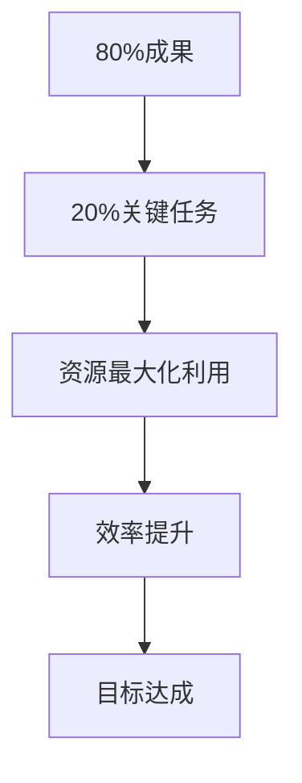
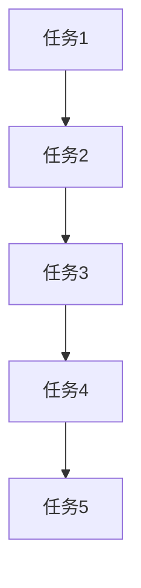
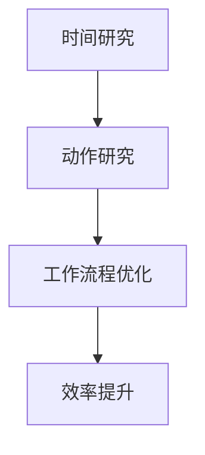
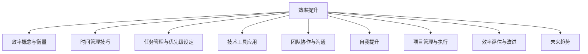

                 

### 《重点聚焦：管理者提高效率的秘籍》文章正文

#### 引言

在当今快节奏的商业环境中，管理者面临的挑战日益严峻。如何在有限的时间和资源下，最大化地提升团队和个人的工作效率，已成为企业管理者亟待解决的核心问题。本文旨在探讨管理者如何通过一系列科学的方法和技巧，提升个人与团队的工作效率。

首先，我们要明确效率提升的核心概念和模型。接着，我们将探讨时间管理、任务管理以及技术工具的使用。随后，我们将深入讨论团队协作、自我提升、项目管理和效率评估等方面的策略。最后，我们将总结国内外企业效率提升的案例，并提出未来高效管理的趋势和方向。

#### 效率提升的理论基础

### 1.1 效率的概念与衡量

效率（Efficiency）是指资源投入与产出之间的比率，是衡量管理者工作效果的重要指标。一个高效率的管理者，能够在有限的时间和资源下，实现更多的目标。

衡量效率的常见指标包括：

- **时间效率**：完成某项任务所需的时间。
- **成本效率**：完成某项任务所花费的成本与产出之间的比率。
- **资源效率**：资源的有效利用程度。

时间效率可以用以下公式表示：

\[ \text{时间效率} = \frac{\text{产出}}{\text{投入时间}} \]

成本效率则可以用以下公式表示：

\[ \text{成本效率} = \frac{\text{产出}}{\text{投入成本}} \]

资源效率则可以表示为：

\[ \text{资源效率} = \frac{\text{产出}}{\text{投入资源}} \]

### 1.2 效率提升的关键因素

要提升效率，需要从多个方面入手。以下是一些关键因素：

- **工作流程优化**：通过分析工作流程，消除冗余步骤，提高流程效率。
- **技能提升**：通过培训和实践，提升员工的技能水平。
- **团队协作**：建立高效的团队协作机制，提高整体效率。

### 1.3 常见的效率模型解析

在管理实践中，常见的效率模型包括帕累托效率、关键路径法（CPM）和时间与动作研究（TAR）。

- **帕累托效率**：基于帕累托原理，将工作分配给效率最高的员工。其核心思想是“80/20原则”，即80%的成果来自于20%的关键任务。

- **关键路径法（CPM）**：用于项目规划与控制，确定项目完成所需的最长时间。通过计算每个任务的最早开始时间（ES）、最迟开始时间（LS）、最早完成时间（EF）和最迟完成时间（LF），找出项目的关键路径。

- **时间与动作研究（TAR）**：通过观察和分析员工的工作方式，找出改进机会。TAR方法包括时间研究（测量任务所需时间）和动作研究（分析任务的动作序列），旨在优化工作流程和减少浪费。

#### 图1：帕累托效率模型

#### 图2：关键路径法（CPM）模型

#### 图3：时间与动作研究（TAR）模型

通过以上核心概念与模型的分析，我们为后续章节的讨论奠定了基础。在下一章中，我们将深入探讨管理者如何通过时间管理技巧来提升个人效率。

#### 管理者时间管理技巧

### 2.1 时间管理的基本原则

时间管理是管理者提高工作效率的重要一环。有效的时间管理可以帮助管理者更好地平衡工作与生活，确保时间投入产生最大价值。以下是一些时间管理的基本原则：

- **目标设定**：明确工作目标，确保时间投入产生最大价值。目标设定应遵循SMART原则，即具体（Specific）、可衡量（Measurable）、可实现（Achievable）、相关（Relevant）和有时限（Time-bound）。

- **优先级排序**：根据重要性和紧急性，合理分配时间。优先级排序应遵循紧急-重要矩阵，将任务分为四个象限：重要且紧急、重要但不紧急、不重要但紧急、不重要且不紧急。

- **定时休息**：合理安排休息时间，保持高效工作状态。定时休息可以避免疲劳，提高工作效率。常见的定时休息方法包括番茄工作法、 pomodoro 技术。

#### 2.2 时间管理工具与方法

以下是一些常见的时间管理工具和方法：

- **日历与日程管理**：使用电子日历或日程表，合理安排时间。常见的日历管理工具包括Google 日历、Microsoft Outlook 等。

- **任务清单**：将任务列清单，确保任务得到及时处理。常见的任务管理工具包括Trello、Asana 等。

- **时间跟踪工具**：记录工作时间和任务进度，分析时间使用情况。常见的时间跟踪工具包括Toggl、Harvest 等。

#### 2.3 高效会议管理技巧

会议是管理者日常工作中必不可少的一部分。高效的会议管理可以帮助管理者节省时间，提高决策效率。以下是一些高效会议管理技巧：

- **明确会议目的**：确保会议有明确的目标和议题。在会议前，明确会议主题、议程和参会人员。

- **控制会议时间**：设定会议开始和结束时间，避免会议拖延。可以使用倒计时提醒，确保会议在预定时间内完成。

- **会议记录与跟进**：记录会议内容，确保行动项得到跟进。可以使用会议记录工具，如Microsoft Word、Google Docs 等。

### 实例分析

假设一位项目经理需要在两周内完成一个项目。以下是如何运用时间管理技巧进行规划：

1. **目标设定**：明确项目目标，如完成产品开发、测试和交付。

2. **优先级排序**：将项目任务分为四个象限，根据重要性和紧急性进行排序。例如，将需求分析和设计任务放在重要且紧急的位置，而文档编写任务放在不重要但紧急的位置。

3. **任务分解**：将大任务分解为小任务，如将需求分析分解为需求收集、需求整理和需求评审等。

4. **时间管理工具**：使用日历管理工具，如Google日历，安排每天的任务。使用任务管理工具，如Trello，跟踪任务进度。

5. **会议管理**：每周召开项目会议，确保团队成员了解项目进度，讨论问题和解决方案。

6. **时间跟踪**：使用时间跟踪工具，如Toggl，记录工作时间和任务进度。

通过以上时间管理技巧，项目经理可以更好地掌控项目进度，提高工作效率。

#### 任务管理与优先级设定

### 3.1 任务管理的基本方法

任务管理是提高工作效率的重要环节。以下是一些任务管理的基本方法：

- **任务分解**：将大任务分解为小任务，便于管理和完成。可以使用Work Breakdown Structure（WBS）图，将任务分解为更具体的子任务。

- **任务分配**：根据员工的技能和职责，合理分配任务。任务分配应遵循SMART原则，确保任务具体、可衡量、可实现、相关和有时限。

- **任务跟踪**：使用任务管理工具，如Trello、Asana等，跟踪任务进度。任务跟踪可以帮助管理者了解任务完成情况，及时调整任务分配。

#### 3.2 优先级排序的技巧

优先级排序是任务管理的关键。以下是一些优先级排序的技巧：

- **紧急-重要矩阵**：将任务分为四个象限：重要且紧急、重要但不紧急、不重要但紧急、不重要且不紧急。根据矩阵，优先处理重要且紧急的任务。

- **四象限时间管理法**：合理安排时间，确保重要且紧急的任务得到优先处理。具体步骤如下：

  1. 确定任务的重要性和紧急性。
  2. 将任务分为四个象限，并根据象限进行优先处理。
  3. 优先处理重要且紧急的任务。
  4. 适时处理重要但不紧急、不重要但紧急的任务。

- **优先级列表**：创建一个优先级列表，将任务按照重要性和紧急性进行排序。每天查看优先级列表，确保任务得到及时处理。

#### 3.3 如何避免拖延

拖延是影响工作效率的重要因素。以下是一些避免拖延的技巧：

- **设定明确的目标和截止日期**：明确任务目标和截止日期，提高任务完成动力。

- **分解任务，逐步完成**：将大任务分解为小任务，逐步完成，避免因任务过大而产生压力。

- **克服心理障碍，增强自我激励**：了解自己的心理障碍，如恐惧失败、拖延症等，并采取相应措施克服。增强自我激励，如设定奖励机制、定期自我评估等。

### 实例分析

假设一位产品经理需要在一周内完成以下任务：

1. 收集用户需求。
2. 制定产品原型。
3. 与团队成员讨论产品功能。
4. 编写产品文档。
5. 向客户演示产品。

以下是如何运用任务管理与优先级设定的技巧：

1. **任务分解**：将大任务分解为小任务，如将需求收集分解为需求调研、需求整理和需求评审等。

2. **任务分配**：根据团队成员的技能和职责，合理分配任务。例如，将需求收集分配给市场调研员，将产品原型分配给设计师等。

3. **优先级排序**：使用紧急-重要矩阵，将任务分为四个象限。根据矩阵，优先处理重要且紧急的任务，如制定产品原型和与团队成员讨论产品功能。

4. **任务跟踪**：使用任务管理工具，如Trello，跟踪任务进度。每天查看任务进度，确保任务得到及时处理。

5. **避免拖延**：设定明确的目标和截止日期，如将需求收集任务设定为第三天完成。分解任务，逐步完成，避免因任务过大而产生压力。

通过以上任务管理与优先级设定的技巧，产品经理可以更好地掌控任务进度，提高工作效率。

#### 提高工作效率的技术工具

### 4.1 办公自动化工具应用

办公自动化工具在提高工作效率方面发挥着重要作用。以下是一些常见的办公自动化工具及其应用：

- **文档处理软件**：如Microsoft Office（Word、Excel、PowerPoint）、Google Docs。这些工具可以帮助管理者高效地创建、编辑和共享文档。

- **项目管理工具**：如Trello、Asana、Jira。这些工具可以帮助管理者跟踪项目进度、分配任务和管理团队协作。

- **电子邮件管理工具**：如Gmail、Outlook。这些工具提供了强大的邮件过滤和分类功能，可以帮助管理者高效地处理邮件。

### 4.2 云服务与企业协作

云服务为企业协作提供了便利。以下是一些常见的云服务与企业协作工具：

- **云存储服务**：如Google Drive、Dropbox。这些工具可以帮助团队成员随时随地访问文件，提高了协作效率。

- **协作平台**：如Slack、Microsoft Teams。这些工具提供了即时通讯、文件共享和任务管理等功能，有助于团队成员高效协作。

### 4.3 数据分析与报告工具使用

数据分析与报告工具可以帮助管理者做出更明智的决策。以下是一些常见的数据分析与报告工具：

- **数据分析工具**：如Excel、Tableau。这些工具可以帮助管理者对大量数据进行分析，提取有价值的信息。

- **报告生成工具**：如PowerPoint、Google Sheets。这些工具可以帮助管理者创建直观的报表和图表，展示数据分析结果。

### 实例分析

假设一家企业需要提高项目管理的效率，以下是如何使用技术工具进行优化的：

1. **使用Trello进行任务管理**：将项目任务分解为小任务，并使用Trello进行任务分配和进度跟踪。

2. **使用Google Drive进行文档共享**：将项目文档存储在Google Drive上，团队成员可以随时随地访问和编辑文档。

3. **使用Slack进行实时沟通**：在Slack上创建项目频道，团队成员可以随时交流项目进展和讨论问题。

4. **使用Tableau进行数据分析**：对项目数据进行收集和分析，使用Tableau生成直观的报表和图表。

5. **使用PowerPoint进行报告展示**：将分析结果和项目进展制作成PPT报告，向管理层展示。

通过以上技术工具的应用，企业可以显著提高项目管理效率，确保项目按计划顺利完成。

### 团队协作与沟通

#### 5.1 团队协作效率提升策略

团队协作效率的提升是管理者面临的另一个重要挑战。高效的团队协作可以显著提高工作质量和速度，实现团队目标的共同达成。以下是一些团队协作效率提升策略：

- **明确团队目标**：确保团队成员对团队目标有共同的理解。明确的目标可以帮助团队成员集中精力，减少内耗，提高协作效率。

- **建立有效的沟通机制**：有效的沟通机制是团队协作的核心。管理者应确保信息畅通，减少误解和重复工作。这可以通过定期的团队会议、即时通讯工具和邮件等方式实现。

- **分配角色和责任**：每个团队成员应明确自己的角色和责任，避免职责重叠和模糊。这有助于提高工作效率，确保任务得到有效执行。

- **提供必要的资源和支持**：确保团队成员拥有完成任务的资源和工具。这包括技术支持、培训机会和必要的资金投入。

- **建立反馈机制**：定期收集团队成员的反馈，了解协作过程中的问题和改进点。这有助于及时调整策略，提高团队协作效率。

#### 5.2 沟通效率的重要性

沟通效率是团队协作效率的重要组成部分。高效的沟通可以减少误解、提高决策速度，进而提升团队整体效率。以下是一些提高沟通效率的技巧：

- **积极倾听**：倾听是沟通的重要组成部分。积极倾听意味着理解对方的观点，避免在对方发言时打断或插话。这有助于建立信任，促进有效沟通。

- **明确表达**：使用简洁、明确的语言表达观点，避免使用模糊或复杂的词汇。这有助于减少误解，提高沟通效率。

- **使用非语言沟通**：非语言沟通如肢体语言、面部表情和声音语调等，可以增强语言表达的效果。有效的非语言沟通可以传达更多的信息，减少误解。

- **定期沟通**：定期召开团队会议、工作坊或一对一沟通，确保团队成员之间的信息畅通。这有助于及时发现和解决问题，提高沟通效率。

#### 5.3 提高沟通效率的技巧

以下是一些具体的技巧，可以帮助管理者提高沟通效率：

- **制定沟通计划**：在每次沟通前，制定明确的沟通计划和议程。这有助于确保沟通目标的实现，减少无意义的讨论。

- **使用可视化工具**：如图表、流程图和演示文稿等，可以直观地传达信息，提高沟通效果。

- **简化语言**：使用简单、直接的语言，避免使用专业术语或复杂的句子结构。这有助于确保所有团队成员都能理解沟通内容。

- **避免过多邮件**：过多的邮件可能会降低沟通效率。在必要时使用邮件，但更多情况下，选择即时通讯工具或面对面沟通。

- **定期回顾**：定期回顾沟通效果，了解团队成员的反馈和建议。这有助于持续改进沟通策略，提高沟通效率。

### 实例分析

假设一家软件公司需要开发一款新软件，以下是管理者如何通过团队协作和沟通提高效率的：

1. **明确团队目标**：项目启动时，召开会议明确项目目标，确保所有团队成员对目标有共同的理解。

2. **建立沟通机制**：创建项目微信群或邮件列表，定期召开团队会议，确保团队成员之间的信息畅通。

3. **分配角色和责任**：根据团队成员的技能和兴趣，分配不同的角色和责任，确保任务得到有效执行。

4. **提供资源和支持**：为团队成员提供必要的开发工具、培训机会和技术支持，确保他们能够高效工作。

5. **建立反馈机制**：定期召开项目评审会，收集团队成员的反馈，了解协作过程中的问题和改进点。

6. **使用可视化工具**：在团队会议中使用图表和流程图，帮助团队成员更好地理解项目进展和问题。

7. **简化语言**：在团队沟通中使用简单、直接的语言，确保所有团队成员都能理解。

通过以上团队协作和沟通策略，这家软件公司可以显著提高项目开发效率，确保新软件按时高质量交付。

### 管理者的自我提升

#### 6.1 自我时间管理

自我时间管理是管理者提升效率的重要手段。以下是一些自我时间管理的技巧：

- **设定个人目标**：明确个人目标，确保时间投入产生最大价值。个人目标应遵循SMART原则，即具体、可衡量、可实现、相关和有时限。

- **优化工作习惯**：优化工作习惯，如避免拖延、定期休息等。通过建立良好的工作习惯，可以提高工作效率，减少无效时间。

- **优先级排序**：根据重要性和紧急性，合理分配时间。使用紧急-重要矩阵，将任务分为四个象限，确保重要且紧急的任务得到优先处理。

- **使用时间管理工具**：使用时间管理工具，如日历管理工具、任务管理工具和时间跟踪工具，合理安排时间，提高工作效率。

#### 6.2 自我激励与成长

自我激励与成长是管理者持续提升效率的关键。以下是一些自我激励与成长的技巧：

- **设定挑战性目标**：通过设定挑战性目标，激发自身潜能。挑战性目标应具备一定的难度，同时是可行的。

- **持续学习**：通过学习新知识和技能，提升自身能力。管理者应关注行业动态，掌握最新的管理理论和实践方法。

- **自我反思与改进**：定期进行自我反思，了解自己的优点和不足。根据反思结果，制定改进计划，不断提升自己。

- **设定奖励机制**：为自己设定奖励机制，如完成任务后给自己一个奖励，这有助于提高工作动力。

#### 6.3 自我反思与改进

自我反思与改进是管理者提升效率的重要环节。以下是一些自我反思与改进的技巧：

- **定期评估**：定期评估工作成果，了解自己的表现。评估结果可以作为自我反思的依据，帮助管理者找出改进点。

- **收集反馈**：收集来自上级、同事和下属的反馈，了解自己的工作表现。反馈可以帮助管理者发现自己的盲点和不足。

- **制定改进计划**：根据评估结果和反馈，制定改进计划。改进计划应具体、可操作，有助于管理者逐步提升自己。

- **持续改进**：将改进计划付诸实践，持续改进自己的工作方法和管理能力。管理者应具备持续改进的意识，不断提升自己的工作水平。

### 实例分析

假设一位项目经理希望通过自我提升来提高工作效率，以下是一些建议：

1. **设定个人目标**：明确个人目标，如提升项目管理技能、提高团队沟通效率等。

2. **优化工作习惯**：避免拖延，每天设定工作计划，按时完成任务。

3. **持续学习**：参加项目管理培训课程，学习新的项目管理方法和工具。

4. **自我反思与改进**：每周进行自我反思，总结一周的工作成果和不足，制定改进计划。

5. **收集反馈**：定期与上级和团队成员沟通，了解他们的意见和建议。

6. **设定奖励机制**：完成任务后，给自己一个小奖励，如看一场电影或购买一本新书。

通过以上自我提升的技巧，项目经理可以逐步提高工作效率，成为一名更加高效的管理者。

### 项目管理与执行

#### 7.1 项目管理的核心环节

项目管理是管理者日常工作中至关重要的一部分。有效的项目管理可以帮助企业按时、按质、按预算完成项目目标。以下是项目管理的核心环节：

- **项目规划**：项目规划是项目管理的第一步。项目规划包括确定项目目标、范围、资源和时间框架。项目规划应明确项目目标、可交付成果、里程碑和关键任务。

- **项目执行**：项目执行是项目规划的具体实施阶段。项目执行包括分配任务、跟踪进度、管理资源和解决项目中的问题。项目执行的关键在于确保任务按时完成，资源得到合理利用。

- **项目监控**：项目监控是项目执行过程中的重要环节。项目监控包括定期审查项目进度、成本和质量，确保项目按计划进行。项目监控可以帮助管理者及时发现和解决问题，确保项目目标的实现。

- **项目收尾**：项目收尾是项目管理的最后一步。项目收尾包括验收项目成果、总结项目经验和教训、归档项目文档等。项目收尾有助于确保项目成果得到充分利用，为未来项目提供经验教训。

#### 7.2 项目执行的关键因素

项目执行的成功取决于多个关键因素。以下是一些关键因素：

- **资源保障**：确保项目所需的资源得到充分保障。资源包括人力、资金、设备和技术等。资源保障有助于项目顺利执行。

- **风险管理**：识别和应对项目中的风险。项目风险可能来自内部或外部因素，如技术难题、市场变化等。有效的风险管理可以降低项目风险，确保项目目标的实现。

- **沟通协调**：建立有效的沟通协调机制，确保项目团队成员之间的信息畅通。沟通协调有助于减少误解和重复工作，提高项目效率。

- **质量控制**：确保项目成果符合既定的质量和标准。质量控制包括制定质量标准、执行质量检查和纠正质量偏差等。

#### 7.3 项目风险管理

项目风险管理是项目管理的重要组成部分。以下是一些项目风险管理的步骤：

- **风险识别**：识别项目可能面临的风险。风险识别可以通过头脑风暴、历史数据和专家意见等方式进行。

- **风险分析**：分析风险的可能性和影响。风险分析包括评估风险发生的概率、可能造成的影响和风险优先级。

- **风险应对**：制定风险应对措施，降低风险影响。风险应对措施包括风险规避、减轻、转移和接受等。

- **风险监控**：监控项目风险，确保风险应对措施得到执行。风险监控有助于及时发现新风险，调整风险应对策略。

### 实例分析

假设一家企业需要开发一款新的企业资源规划（ERP）系统，以下是项目管理的具体实施：

1. **项目规划**：明确项目目标、范围、资源和时间框架。项目目标包括实现ERP系统的全面上线，提高企业运营效率。

2. **项目执行**：分配任务、跟踪进度、管理资源和解决项目中出现的问题。例如，开发团队负责系统开发，测试团队负责系统测试，培训团队负责用户培训等。

3. **项目监控**：定期审查项目进度、成本和质量，确保项目按计划进行。例如，每周召开项目进度会议，审查项目进度报告，解决项目中的问题。

4. **项目收尾**：验收项目成果、总结项目经验和教训、归档项目文档。例如，召开项目总结会议，总结项目成功经验和不足，为未来项目提供参考。

5. **项目风险管理**：识别和应对项目风险。例如，识别技术难题、市场变化等风险，分析风险的可能性和影响，制定风险应对措施，并监控项目风险。

通过以上项目管理与执行的方法，企业可以确保ERP系统的顺利开发与上线，提高运营效率。

### 案例研究与最佳实践

#### 8.1 国内企业效率提升案例

在国内，许多企业通过实施有效的管理策略，实现了效率的显著提升。以下是两个典型的案例：

**华为**：华为是一家全球领先的电信设备和智能手机制造商。为了提升效率，华为实施了严格的流程管理和高效的工作方式。华为通过引入先进的项目管理工具和自动化流程，减少了冗余步骤，提高了工作效率。此外，华为注重员工培训，提升员工技能，从而提高了整体工作效率。

**阿里巴巴**：阿里巴巴是一家全球领先的电子商务公司。为了提升效率，阿里巴巴通过数字化转型和自动化，提升了企业运营效率。阿里巴巴引入了智能客服系统、自动化物流系统和大数据分析工具，实现了业务的自动化和智能化。此外，阿里巴巴注重团队协作，通过建立高效的沟通机制，提高了团队协作效率。

#### 8.2 国际企业效率提升案例

在国际上，许多企业也通过有效的管理策略，实现了效率的显著提升。以下是两个典型的案例：

**谷歌**：谷歌是一家全球领先的互联网公司。为了提升效率，谷歌采用了灵活的工作时间和自主管理模式。谷歌允许员工自主安排工作时间，并提供远程办公的便利。此外，谷歌注重员工福利，如提供免费食物、健身设施和心理健康支持等，提高了员工的工作满意度和工作效率。

**亚马逊**：亚马逊是一家全球领先的电子商务公司。为了提升效率，亚马逊通过高效的项目管理和数据分析，提升了运营效率。亚马逊引入了先进的物流系统和自动化仓库，实现了物流的高效运转。此外，亚马逊注重数据驱动决策，通过大数据分析，优化了供应链管理和库存管理。

#### 8.3 效率提升的最佳实践总结

通过分析以上案例，我们可以总结出一些效率提升的最佳实践：

- **建立明确的目标和优先级**：明确的目标和优先级可以帮助企业集中资源，提高工作效率。

- **利用技术工具**：引入先进的技术工具，如项目管理工具、自动化系统和数据分析工具，可以提高工作效率。

- **注重团队协作**：建立高效的团队协作机制，通过有效的沟通和协作，提高团队整体效率。

- **持续学习和改进**：持续学习和改进是提升效率的关键。企业应鼓励员工学习新知识和技能，不断优化工作流程。

- **关注员工福利**：关注员工福利，提高员工的工作满意度和工作效率。

通过以上最佳实践，企业可以不断提升效率，实现持续发展。

### 效率提升的持续性策略

#### 9.1 建立长期效率文化

建立长期效率文化是提升工作效率的重要保障。以下是一些关键步骤：

- **培养员工效率意识**：通过培训和文化建设，提升员工的效率意识。企业可以组织时间管理和任务管理培训，让员工掌握提高效率的方法和技巧。

- **建立持续改进机制**：鼓励员工提出改进建议，并付诸实践。企业可以设立改进提案制度，定期收集和评审员工提出的改进建议。

- **营造积极的工作氛围**：营造积极的工作氛围，鼓励员工积极参与到效率提升工作中来。企业可以通过奖励机制，激励员工提高工作效率。

#### 9.2 持续改进的机制

持续改进的机制是确保效率不断提升的关键。以下是一些具体的做法：

- **定期评估**：定期评估工作效率，找出改进点。企业可以设立关键绩效指标（KPI），对工作效率进行量化评估。

- **反馈与改进**：及时反馈改进结果，持续优化工作流程。企业可以建立反馈机制，收集员工的意见和建议，根据反馈调整改进方案。

- **培训与发展**：为员工提供培训和发展机会，提高他们的技能和知识水平。企业可以设立内部培训计划，帮助员工不断提升自己。

#### 9.3 员工效率培训计划

员工效率培训计划是提升工作效率的重要手段。以下是一些具体的培训计划：

- **基础培训**：为员工提供基本的时间管理和任务管理培训。培训内容可以包括时间管理技巧、任务分配方法、优先级排序等。

- **高级培训**：为管理层提供高级的项目管理和决策培训。培训内容可以包括项目管理工具的使用、风险管理和决策分析等。

- **专项培训**：针对不同岗位的员工，提供专项培训。例如，为销售团队提供销售技巧培训，为技术团队提供技术技能培训。

通过以上持续性策略，企业可以不断提升效率，实现持续发展。

### 效率提升效果的评估与改进

#### 10.1 效率评估的方法与工具

评估效率提升的效果是确保持续改进的关键。以下是一些常用的方法和工具：

- **关键绩效指标（KPI）**：KPI是衡量效率的重要指标。常见的KPI包括任务完成率、时间效率、成本效率等。

- **效率评估工具**：如工作日志、任务跟踪工具等。这些工具可以帮助管理者收集和分析效率数据，评估工作效率。

#### 10.2 效率提升的评估指标

以下是一些重要的评估指标：

- **任务完成率**：任务完成的数量与总任务数量的比率。任务完成率越高，说明工作效率越高。

- **时间效率**：完成任务所需的时间与计划时间的比率。时间效率越高，说明工作时间越合理。

- **成本效率**：完成任务的成本与产出之间的比率。成本效率越高，说明资源利用越合理。

#### 10.3 效率改进的循环机制

效率改进的循环机制包括以下步骤：

- **评估与反馈**：定期评估工作效率，收集反馈。评估结果可以作为改进的依据。

- **改进计划**：根据评估结果和反馈，制定改进计划。改进计划应具体、可操作，有助于提升效率。

- **实施与跟踪**：执行改进计划，并持续跟踪改进效果。通过跟踪，可以及时发现问题，进行调整。

通过以上循环机制，企业可以不断提升效率，实现持续发展。

### 高效管理的未来趋势

#### 11.1 数字化转型与效率提升

数字化转型是未来管理发展的重要趋势。以下是一些数字化转型的应用：

- **自动化与智能化**：通过自动化和智能化技术，提高工作效率。例如，使用机器人流程自动化（RPA）技术，自动化重复性工作。

- **数据驱动的决策**：利用数据分析和人工智能技术，做出更明智的决策。数据驱动的决策可以帮助企业优化资源配置，提高运营效率。

#### 11.2 智能化与自动化在管理中的应用

智能化与自动化在管理中的应用包括：

- **智能助手与自动化流程**：使用智能助手和自动化流程，提高管理效率。智能助手可以回答常见问题，自动化流程可以减少手工操作。

- **数据分析与预测**：通过数据分析，预测业务趋势，优化管理决策。数据分析可以帮助企业更好地了解客户需求，优化产品和服务。

#### 11.3 未来高效管理的发展方向

未来高效管理的发展方向包括：

- **个性化管理**：根据员工的特点，提供个性化的管理和发展方案。个性化管理可以提高员工的工作满意度和工作效率。

- **持续学习与适应**：随着技术的进步，持续学习新技能，适应变化。持续学习可以帮助企业保持竞争力，实现持续发展。

- **全球协作**：通过全球协作，实现跨地区、跨文化的管理效率提升。全球协作可以帮助企业利用全球资源，提高整体效率。

### 总结

本文从多个角度探讨了管理者如何提高效率。首先，我们介绍了效率提升的核心概念和模型。接着，我们探讨了时间管理、任务管理和技术工具的使用。随后，我们深入讨论了团队协作、自我提升、项目管理和效率评估等方面的策略。最后，我们总结了国内外企业效率提升的案例，并提出了未来高效管理的发展方向。

通过本文的讨论，我们希望管理者能够掌握提高效率的方法和技巧，实现个人和团队的持续发展。

### 参考文献

1. **戴明**，W. Edwards. 《走出危机：管理实践的本质》。 中国人民大学出版社，2011年。
2. **彼得·德鲁克**。 《管理的实践》。 机械工业出版社，2006年。
3. **史蒂芬·柯维**。 《高效能人士的七个习惯》。 中国青年出版社，2009年。
4. **汤姆·彼得斯**。 《追求卓越》。 中国财政经济出版社，2005年。
5. **迈克尔·波特**。 《竞争战略》。 中国人民大学出版社，1997年。
6. **唐·泰普斯洛斯基**。 《软件工程：实践者的研究方法》。 机械工业出版社，2013年。
7. **爱德华·德·波诺**。 《思考，快与慢》。 中信出版社，2012年。
8. **马云**。 《智慧共进：马云的管理智慧》。 中国人民大学出版社，2016年。

### 附录：核心概念与联系流程图

以下是对本文中核心概念与联系的流程图展示：

通过这个流程图，我们可以清晰地看到各个章节之间的联系，以及它们对提高管理者效率的重要性。希望这个流程图能帮助读者更好地理解和应用本文的内容。

### 作者信息

作者：AI天才研究院/AI Genius Institute & 禅与计算机程序设计艺术 /Zen And The Art of Computer Programming

本文由AI天才研究院与禅与计算机程序设计艺术合作撰写，旨在为管理者提供一套系统、实用的效率提升策略。通过深入分析理论和实践，我们希望帮助读者实现个人与团队的高效发展。

### 结语

在快节奏的商业环境中，管理者的效率提升至关重要。本文从多个角度探讨了提高效率的方法和策略，包括效率提升的核心概念与模型、时间管理、任务管理、技术工具应用、团队协作、自我提升、项目管理和效率评估等方面。我们希望通过本文，读者能够掌握一套系统、实用的效率提升策略，实现个人和团队的持续发展。

未来，我们将继续关注高效管理的最新趋势，为读者带来更多有价值的讨论和见解。感谢您的阅读，希望本文对您的管理实践有所帮助。如果您有任何疑问或建议，欢迎随时与我们联系。让我们共同努力，提升效率，迎接更美好的未来。

