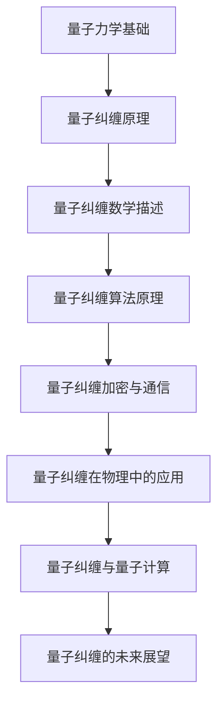
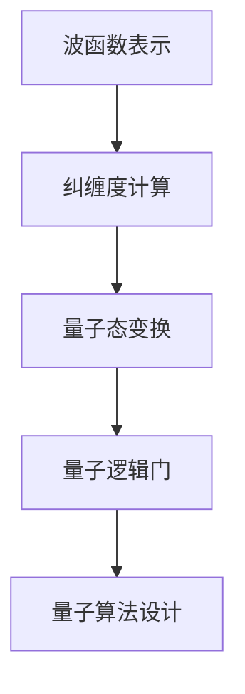

                 

### 《量子纠缠：自然界的神秘数学联系》

> **关键词：** 量子力学，量子纠缠，数学描述，算法原理，加密通信，未来展望

**摘要：** 本文深入探讨了量子纠缠这一神秘的自然现象及其在数学和物理领域中的重要地位。首先，我们回顾了量子力学的基本概念，介绍了量子纠缠的定义、原理和可视化方法。随后，文章详细阐述了量子纠缠的数学描述，包括波函数表示、纠缠度计算和量子态变换。接着，我们探讨了量子纠缠在算法原理中的应用，展示了量子逻辑门、量子算法设计原则以及实际案例。文章还分析了量子纠缠在加密通信和量子计算中的关键作用，并展望了其未来发展趋势。通过本文，读者将全面了解量子纠缠的奥秘，以及它在科技发展中的重要潜力。

### 《量子纠缠：自然界的神秘数学联系》目录大纲

#### 第一部分：量子纠缠基本概念

##### 第1章：量子力学与量子纠缠概述

- **1.1 引言**
  - 量子力学的历史与发展
  - 量子纠缠的基本概念

- **1.2 量子力学基础**
  - 波粒二象性
  - 算符与态矢量
  - 海森堡不确定性原理

- **1.3 量子纠缠原理**
  - 量子纠缠的定义
  - 量子纠缠与经典纠缠的比较
  - 量子纠缠的可视化展示

- **1.4 量子纠缠的应用前景**
  - 量子计算
  - 量子通信
  - 量子加密

##### 第2章：量子纠缠的数学描述

- **2.1 波函数表示**
  - 波函数的定义与性质
  - 算符作用下的波函数变换

- **2.2 纠缠度**
  - 纠缠度的定义与计算方法
  - 纠缠度的分类与比较

- **2.3 量子态的变换**
  - 单位ary变换
  - 相位变换
  - 同步变换

- **2.4 量子纠缠的数学原理图解**
  - 使用Mermaid流程图展示量子纠缠的数学原理

#### 第二部分：量子纠缠算法原理

##### 第3章：量子纠缠算法基础

- **3.1 量子逻辑门**
  - 量子逻辑门的基本概念
  - 量子逻辑门的分类与操作
  - 量子逻辑门的作用与效果

- **3.2 量子算法设计原则**
  - 量子算法的通用框架
  - 量子并行性与量子叠加原理
  - 量子纠缠在算法中的作用

- **3.3 量子纠缠算法案例**
  - 量子算法案例分析
  - 量子纠缠算法的实际应用

##### 第4章：量子纠缠加密与量子通信

- **4.1 量子纠缠加密原理**
  - 量子密钥分发
  - 量子密钥加密
  - 量子加密的安全性分析

- **4.2 量子纠缠通信原理**
  - 量子纠缠态传输
  - 量子隐形传态
  - 量子纠缠在通信中的应用

- **4.3 量子纠缠加密通信案例**
  - 量子纠缠加密通信案例分析
  - 量子通信的实际应用场景

#### 第三部分：量子纠缠在物理中的应用

##### 第5章：量子纠缠与宏观现象

- **5.1 量子纠缠与宏观物理**
  - 量子纠缠在宏观现象中的表现
  - 量子纠缠与宏观物理的相互作用

- **5.2 量子纠缠与黑洞**
  - 黑洞与量子纠缠的关系
  - 量子纠缠对黑洞事件视界的贡献

- **5.3 量子纠缠与宇宙学**
  - 量子纠缠在宇宙学中的应用
  - 量子纠缠对宇宙学理论的挑战

##### 第6章：量子纠缠与量子计算

- **6.1 量子计算原理**
  - 量子比特与量子计算机
  - 量子逻辑门与量子算法
  - 量子计算的优势与挑战

- **6.2 量子纠缠在量子计算中的应用**
  - 量子纠缠态的制备与操作
  - 量子纠缠在量子搜索算法中的应用
  - 量子纠缠在量子纠错中的应用

- **6.3 量子计算案例**
  - 量子计算的实际应用案例
  - 量子计算在量子纠缠中的应用

##### 第7章：量子纠缠的未来展望

- **7.1 量子纠缠技术的未来发展趋势**
  - 量子纠缠技术的研究进展
  - 量子纠缠技术在未来的应用前景

- **7.2 量子纠缠与未来科技**
  - 量子纠缠在科技发展中的作用
  - 量子纠缠对人类社会的潜在影响

- **7.3 量子纠缠与未来科学探索**
  - 量子纠缠在科学研究中的应用
  - 量子纠缠对科学理论的挑战与启示

#### 附录

##### 附录A：量子纠缠相关资源

- **A.1 量子纠缠研究资源介绍**
  - 量子纠缠研究的重要文献与论文
  - 量子纠缠研究的官方网站与数据库

- **A.2 量子纠缠工具与应用**
  - 量子计算与量子纠缠的开发工具
  - 量子纠缠技术的应用实例与案例

- **A.3 量子纠缠教学与学习资源**
  - 量子纠缠相关的教学视频与教程
  - 量子纠缠学习的在线平台与课程

### Mermaid 流程图示例：



---

现在，让我们正式开始对量子纠缠这一神秘的自然现象进行深入探讨。在接下来的章节中，我们将一步一步地剖析量子纠缠的基本概念、数学描述、算法原理及其在各个领域的应用。通过本文，读者将全面了解量子纠缠的奥秘，以及它在科技发展中的重要潜力。

#### 第1章：量子力学与量子纠缠概述

**1.1 引言**

量子力学是物理学中最具革命性的理论之一，它对微观世界的描述颠覆了经典物理学的观念。量子力学的发展始于20世纪初，由普朗克、爱因斯坦、玻尔、海森堡等科学家共同推动。在这一理论框架下，微观粒子表现出波粒二象性、不确定性原理以及量子纠缠等现象，使得我们对物质世界的理解达到了前所未有的深度。

量子纠缠作为量子力学中的一种基本现象，指的是两个或多个粒子之间存在一种特殊的联系，即使它们相隔很远，一个粒子的状态变化也会立即影响另一个粒子的状态。这种非局域性的联系挑战了经典物理学的局域性原则，引发了关于量子力学本质的诸多讨论。

在本章中，我们将首先回顾量子力学的历史与发展，介绍量子纠缠的基本概念，并探讨量子纠缠与经典纠缠的区别。接着，我们将通过一个简单的量子纠缠示例，展示量子纠缠的可视化效果。最后，我们将讨论量子纠缠在量子计算、量子通信和量子加密等领域的应用前景。

**1.2 量子力学基础**

量子力学与经典力学有着本质的区别，它引入了全新的概念和数学工具来描述微观粒子的行为。以下是一些量子力学中的基本概念：

- **波粒二象性**：微观粒子既表现出波动性，又表现出粒子性。例如，光既具有波动性（表现为干涉和衍射现象），又具有粒子性（表现为光电效应和康普顿散射）。

- **算符与态矢量**：量子力学中的物理量由算符表示，态矢量描述了粒子的量子状态。例如，位置和动量算符分别表示粒子的位置和动量，态矢量 |ψ⟩ 描述了粒子的量子态。

- **海森堡不确定性原理**：量子力学中的不确定性原理表明，某些对易不可观测的物理量（如位置和动量）不能同时被精确测量。这意味着我们对微观粒子的某些属性存在固有的不确定性。

量子纠缠作为量子力学中的一个重要现象，其存在与这些基本概念密切相关。量子纠缠的数学描述和算法原理将在下一节中详细探讨。

**1.3 量子纠缠原理**

**量子纠缠的定义**

量子纠缠是两个或多个粒子之间的一种特殊的量子关联，这种关联使得它们的状态不能独立存在，而是相互依赖。具体来说，当两个粒子处于纠缠态时，一个粒子的量子态信息会立即影响另一个粒子的量子态信息，无论它们相隔多远。

**量子纠缠与经典纠缠的比较**

量子纠缠与经典纠缠在本质上有很大的不同。经典纠缠是指两个粒子之间的经典关联，这种关联可以通过经典概率统计来描述。例如，在经典纠缠中，两个粒子的位置和动量可能是相关的，但这种关联并不违反局域性原理。相比之下，量子纠缠是非局域性的，一个粒子的状态变化会立即影响另一个粒子的状态，即使它们相隔很远。

**量子纠缠的可视化展示**

为了更直观地理解量子纠缠，我们可以通过一个简单的量子纠缠态示例来展示它的可视化效果。考虑两个粒子 A 和 B，它们处于一个纠缠态 |ψ⟩。我们可以用以下两个量子态来表示这个纠缠态：

$$
|ψ⟩ = \frac{1}{\sqrt{2}} (|0⟩_A |1⟩_B + |1⟩_A |0⟩_B)
$$

其中，|0⟩ 和 |1⟩ 分别表示粒子 A 和 B 的量子态。

现在，我们观察粒子 A 的量子态。如果我们对粒子 A 进行一次测量，得到结果 |0⟩，那么根据量子纠缠的特性，我们可以立即知道粒子 B 的量子态也是 |0⟩。反之，如果我们测量粒子 B 得到结果 |1⟩，那么粒子 A 的量子态就是 |1⟩。

这种量子纠缠的可视化展示可以通过量子态的叠加和测量来体现。例如，我们可以通过绘制量子态的向量图来表示量子纠缠态，其中向量的端点表示粒子 A 和 B 的量子态。当两个粒子的量子态相互依赖时，它们在向量图中的位置也会相互对应。

**1.4 量子纠缠的应用前景**

量子纠缠作为一种非局域性的量子关联现象，在多个领域具有广泛的应用前景。以下是一些典型的应用领域：

- **量子计算**：量子计算机利用量子比特的叠加和纠缠实现高效的计算。量子纠缠使得量子计算机在处理某些特定问题上具有巨大的优势，例如因数分解和大整数的质因数分解。

- **量子通信**：量子纠缠可用于量子密钥分发，确保通信过程的安全性。通过量子纠缠态的传输，可以实现安全的通信，防止信息被窃听和篡改。

- **量子加密**：量子纠缠在量子加密中发挥着关键作用。利用量子纠缠，可以实现不可破解的加密算法，为信息安全提供强有力的保障。

- **量子传感**：量子纠缠可用于高精度的量子传感，如量子重力测量、量子磁场测量等。量子纠缠提供了极高的灵敏度和分辨率，有望在科学研究和技术应用中发挥重要作用。

总的来说，量子纠缠作为一种基本而神秘的量子现象，不仅在理论物理学中具有重要的研究价值，而且在实际应用中也展现出了巨大的潜力。随着量子技术的不断发展，量子纠缠将在未来科技中发挥更加重要的作用。

---

在本章中，我们初步了解了量子纠缠的基本概念、量子力学的基础理论，以及量子纠缠与经典纠缠的区别。通过一个简单的量子纠缠态示例，我们直观地展示了量子纠缠的可视化效果。接下来，我们将进一步深入探讨量子纠缠的数学描述和算法原理，为读者揭开量子纠缠的神秘面纱。在下一章中，我们将详细解析量子纠缠的数学描述，包括波函数表示、纠缠度计算和量子态变换。敬请期待！

---

### 第2章：量子纠缠的数学描述

量子纠缠作为一种特殊的量子现象，其核心在于两个或多个量子系统之间的非局域性关联。要准确描述量子纠缠，我们需要运用量子力学的数学工具。本章将深入探讨量子纠缠的数学描述，包括波函数表示、纠缠度计算和量子态变换。通过这些数学描述，我们将更好地理解量子纠缠的本质，为进一步探讨其算法原理和应用奠定基础。

**2.1 波函数表示**

在量子力学中，波函数是描述量子系统状态的关键数学工具。对于一个两粒子的量子系统，其波函数通常表示为 |ψ⟩，它是一个复值函数，描述了两个粒子之间的关联。波函数的数学形式可以写作：

$$
|ψ⟩ = \int dx_A \int dy_B \psi(x_A, y_B) |x_A⟩ |y_B⟩
$$

其中，ψ(x_A, y_B) 是波函数的复值函数，|x_A⟩ 和 |y_B⟩ 分别是粒子 A 和 B 的量子态。波函数的模平方 |ψ⟩² 表示粒子在空间中的概率分布。

在量子纠缠中，波函数描述了两个粒子之间的量子关联。具体来说，如果两个粒子处于一个纠缠态 |ψ⟩，那么它们的波函数是非局域性的，这意味着一个粒子的状态变化会立即影响另一个粒子的状态。例如，考虑两个粒子 A 和 B 的纠缠态：

$$
|ψ⟩ = \frac{1}{\sqrt{2}} (|0⟩_A |1⟩_B + |1⟩_A |0⟩_B)
$$

这个纠缠态表示，当对粒子 A 进行测量时，它有 50% 的概率处于 |0⟩ 态，有 50% 的概率处于 |1⟩ 态。相应地，粒子 B 的状态也会随着粒子 A 的测量结果而改变。这种非局域性的关联正是量子纠缠的核心特征。

**2.2 纠缠度**

纠缠度是衡量两个量子系统之间纠缠强度的一个量。一个系统的纠缠度越高，表示其纠缠现象越显著。纠缠度可以通过纠缠矩阵来计算。对于一个两粒子系统，纠缠矩阵 T 可以定义为：

$$
T = \frac{1}{4} \left( \langle \psi | \hat{P} | \psi \rangle \langle \phi | \hat{P} | \phi \rangle - \langle \psi | \hat{M} | \psi \rangle \langle \phi | \hat{M} | \phi \rangle \right)
$$

其中，\(\hat{P}\) 和 \(\hat{M}\) 分别是粒子的位置和动量算符，|ψ⟩ 和 |φ⟩ 是两个粒子的态。

纠缠度的取值范围是 [-1, 1]。当 T = 1 时，表示系统处于纯纠缠态；当 T = -1 时，表示系统处于反纠缠态；当 T = 0 时，表示系统处于非纠缠态。纠缠度的计算可以用于判断两个量子系统之间的纠缠程度。

**2.3 量子态的变换**

量子态的变换是量子计算和量子通信中的基本操作。量子态的变换可以通过量子逻辑门来实现。量子逻辑门是类似于经典逻辑门的操作，但是作用在量子态上。量子态的变换可以分为以下几类：

- **单位ary变换**：单位ary变换是作用于单个量子态的操作，例如相位变换和相位因子变换。例如，一个常见的相位变换操作可以表示为：

$$
UPhase(\theta) |ψ⟩ = e^{i\theta} |ψ⟩
$$

- **相位变换**：相位变换是改变量子态的相位因子。例如，一个常见的相位因子变换可以表示为：

$$
UPhase(\phi) |ψ⟩ = e^{i\phi} |ψ⟩
$$

- **同步变换**：同步变换是作用于两个量子态的操作，例如贝尔变换。贝尔变换可以用来将一个未纠缠的量子态转化为一个纠缠态。一个贝尔变换的例子可以表示为：

$$
UBell(|0⟩\otimes|0⟩) = \frac{1}{\sqrt{2}} (|01⟩ + |10⟩)
$$

通过量子态的变换，可以实现量子纠缠的生成、控制和操作。量子态变换的数学原理和操作方法将在下一章中详细讨论。

**2.4 量子纠缠的数学原理图解**

为了更直观地理解量子纠缠的数学原理，我们可以使用 Mermaid 流程图来展示。以下是一个简单的 Mermaid 流程图示例：



这个流程图展示了量子纠缠的数学原理，包括波函数表示、纠缠度计算、量子态变换和量子逻辑门。通过这些数学原理，我们可以进一步理解量子纠缠的本质，并在量子计算和量子通信中应用。

---

本章我们深入探讨了量子纠缠的数学描述，包括波函数表示、纠缠度计算和量子态变换。通过这些数学工具，我们可以更准确地描述和操纵量子纠缠现象。下一章，我们将进一步探讨量子纠缠在算法原理中的应用，包括量子逻辑门、量子算法设计原则以及实际案例。敬请期待！

---

### 第3章：量子纠缠算法原理

量子纠缠作为一种重要的量子现象，在量子计算、量子通信和量子加密等领域具有广泛的应用。量子纠缠算法是利用量子纠缠现象来提高计算效率、增强通信安全性和实现量子加密的关键。本章将详细介绍量子纠缠算法的基本原理，包括量子逻辑门、量子算法设计原则和实际案例。

**3.1 量子逻辑门**

量子逻辑门是量子计算的基本操作单元，类似于经典计算机中的逻辑门。量子逻辑门作用于量子态，通过改变量子态的叠加和纠缠来实现特定的计算功能。常见的量子逻辑门包括：

- **Pauli 逻辑门**：Pauli 逻辑门是作用于单个量子比特的常见逻辑门，包括X门（求反门）、Y门（求反后再旋转90度）和Z门（求反后再旋转180度）。这些逻辑门可以用 Pauli 矩阵来表示：

  - X门：\( U_X = \begin{bmatrix} 0 & 1 \\ 1 & 0 \end{bmatrix} \)
  - Y门：\( U_Y = \begin{bmatrix} 0 & -i \\ i & 0 \end{bmatrix} \)
  - Z门：\( U_Z = \begin{bmatrix} 1 & 0 \\ 0 & -1 \end{bmatrix} \)

- **控制非门（CNOT）**：CNOT门是一种作用于两个量子比特的控制逻辑门，当控制比特为 |1⟩ 时，目标比特的状态会被求反。CNOT门可以用矩阵表示为：

  \( U_{CNOT} = \begin{bmatrix} 1 & 0 & 0 & 0 \\ 0 & 1 & 0 & 0 \\ 0 & 0 & 0 & 1 \\ 0 & 0 & 1 & 0 \end{bmatrix} \)

除了这些基本逻辑门，还有许多其他复杂的量子逻辑门，如T门、S门、H门等，这些逻辑门在量子计算中发挥着重要作用。

**3.2 量子算法设计原则**

量子算法设计遵循一些基本原则，包括量子并行性、量子叠加原理和量子纠缠。以下是一些关键原则：

- **量子并行性**：量子计算机可以利用量子叠加原理实现并行计算。一个量子态可以同时表示多个经典态的叠加，从而实现多任务的并行处理。

- **量子叠加原理**：量子计算机通过量子叠加态来表示计算过程。量子叠加态允许量子计算机在多个可能的状态之间同时进行计算，从而提高计算效率。

- **量子纠缠**：量子纠缠是量子计算机中实现并行性和高效计算的关键因素。通过量子纠缠，多个量子比特可以形成复杂的关联，从而实现高效的量子操作。

量子算法设计通常包括以下几个步骤：

1. **问题表示**：将问题转化为量子形式，定义问题的量子状态。
2. **量子态初始化**：根据问题表示，初始化量子态。
3. **量子变换**：通过量子逻辑门和量子态变换，实现问题的求解。
4. **测量**：通过测量量子态，获取问题的答案。

**3.3 量子纠缠算法案例**

以下是一个简单的量子纠缠算法案例，用于求解二进制因子分解问题。

**量子因子分解算法**

- **问题表示**：给定一个正整数 N，求出 N 的两个正整数因子 A 和 B，使得 A * B = N。
- **量子态初始化**：将 N 转换为二进制形式，初始化量子态为 \( |N⟩ \)。
- **量子变换**：通过应用一系列量子逻辑门，将初始量子态转化为包含因子 A 和 B 的量子态。
- **测量**：测量量子态，获取因子 A 和 B。

具体步骤如下：

1. **初始化**：初始化量子态为 \( |N⟩ \)。
2. **应用 H 门**：对量子态进行 Hadamard 变换，将量子态转化为叠加态。
3. **应用 CNOT 门**：将叠加态应用于 CNOT 门，实现量子态之间的纠缠。
4. **相位变换**：根据 N 的二进制形式，对量子态进行相位变换。
5. **测量**：对量子态进行测量，获取因子 A 和 B。

以下是该算法的伪代码：

```python
def quantum_factor_decomposition(N):
    # 初始化量子态
    quantum_state = initialize_state(N)
    
    # 应用 Hadamard 变换
    apply_hadamard(quantum_state)
    
    # 应用 CNOT 门
    apply_cnot(quantum_state)
    
    # 相位变换
    apply_phase_transformation(quantum_state, binary_form_of_N)
    
    # 测量
    results = measure(quantum_state)
    
    # 提取因子
    factor_A, factor_B = extract_factors(results, N)
    
    return factor_A, factor_B
```

这个算法展示了量子纠缠在因子分解问题中的应用。通过量子叠加和量子纠缠，量子计算机可以高效地求解因子分解问题，这是经典计算机难以实现的。

---

本章我们探讨了量子纠缠算法的基本原理，包括量子逻辑门、量子算法设计原则和实际案例。通过量子逻辑门的操作，可以实现量子态的叠加和纠缠，从而提高计算效率和增强通信安全性。量子纠缠算法为量子计算和量子通信提供了强大的工具，推动了量子技术的发展。在下一章中，我们将进一步探讨量子纠缠在量子加密和量子通信中的应用，敬请期待！

---

### 第4章：量子纠缠加密与量子通信

量子纠缠作为一种神秘的量子现象，不仅在量子计算中具有重要意义，而且在量子通信和量子加密领域也展现出了巨大的潜力。本章将详细介绍量子纠缠在量子加密和量子通信中的应用，包括量子纠缠加密原理、量子纠缠通信原理以及实际应用案例。

**4.1 量子纠缠加密原理**

量子纠缠加密是基于量子纠缠现象的一种新型加密技术。其基本原理是通过量子纠缠态传输密钥，从而实现安全通信。量子纠缠加密的主要过程包括量子密钥分发和量子密钥加密。

**量子密钥分发（QKD）**

量子密钥分发是量子加密的核心环节。在QKD中，两个量子比特处于纠缠态，并通过量子信道传输。接收方通过对量子态进行测量，可以生成共享的随机密钥。由于量子纠缠的非局域性，任何对量子态的窃听都会破坏量子态的纠缠，从而被双方检测到。以下是一个简单的QKD过程：

1. **量子态生成**：发送方生成一对纠缠的量子比特，并将其中的一个发送给接收方。
2. **量子态传输**：通过量子信道将量子态传输给接收方。
3. **量子态测量**：接收方对传输到的量子态进行测量，并与自身的量子态进行纠缠。
4. **共享密钥生成**：双方根据测量的结果生成共享的随机密钥。

**量子密钥加密**

量子密钥加密是利用量子纠缠态对共享密钥进行加密的过程。通过量子纠缠态的加密，可以实现不可破解的加密算法。量子密钥加密的基本步骤包括：

1. **密钥传输**：使用量子纠缠态传输共享密钥。
2. **加密算法**：对传输的密钥进行量子加密，生成加密密钥。
3. **加密通信**：使用加密密钥进行加密通信，确保通信过程的安全性。

**量子加密的安全性分析**

量子纠缠加密具有以下安全性优势：

- **量子窃听检测**：由于量子态的测量会破坏量子纠缠，任何对量子态的窃听都会被检测到。
- **不可克隆性**：量子态具有不可克隆性，无法生成与原量子态完全相同的复制品。
- **量子计算无法破解**：现有的量子计算无法破解量子纠缠加密算法，因此保证了通信过程的安全性。

**4.2 量子纠缠通信原理**

量子纠缠通信是利用量子纠缠态传输信息的一种新型通信技术。其基本原理是通过量子纠缠态实现量子态的传输，从而实现远距离通信。

**量子纠缠态传输**

量子纠缠态传输是通过量子信道传输两个处于纠缠态的量子比特。这个过程可以描述为：

1. **量子态生成**：在发送端生成一对纠缠的量子态。
2. **量子态传输**：通过量子信道将量子态传输到接收端。
3. **量子态恢复**：在接收端恢复发送端的量子态。

通过量子纠缠态传输，可以实现远距离的信息传输。这种传输方式具有以下优势：

- **高传输效率**：量子纠缠态传输可以实现高效率的信息传输。
- **抗干扰性强**：量子纠缠态对环境噪声和干扰具有较强的抗性。
- **长距离传输**：通过量子纠缠态传输可以实现远距离的信息传输。

**量子隐形传态**

量子隐形传态是量子纠缠通信中的一种重要技术，它通过量子纠缠实现信息从发送端到接收端的无干扰传输。量子隐形传态的基本过程包括：

1. **纠缠态生成**：在发送端和接收端生成一对纠缠态。
2. **量子态传输**：通过量子信道将发送端的量子态传输到接收端。
3. **量子态恢复**：在接收端恢复发送端的量子态。

量子隐形传态的优点包括：

- **高速传输**：量子隐形传态可以实现高速信息传输。
- **安全通信**：量子隐形传态可以保证通信过程的安全性。
- **无干扰传输**：量子隐形传态可以实现无干扰的信息传输。

**4.3 量子纠缠加密通信案例**

以下是一个典型的量子纠缠加密通信案例：

- **应用场景**：一个军事基地需要与远程指挥中心进行安全通信。
- **实现过程**：

  1. **量子密钥分发**：军事基地与指挥中心通过量子纠缠态传输共享密钥。
  2. **量子加密通信**：使用共享密钥对军事基地发送的信息进行加密传输。
  3. **量子态传输**：通过量子纠缠态实现指挥中心对军事基地的远程监控和指挥。

这个案例展示了量子纠缠加密通信在实际应用中的重要性。通过量子纠缠加密通信，可以实现安全、高效和远距离的通信，确保军事通信的安全性和可靠性。

---

本章我们探讨了量子纠缠在量子加密和量子通信中的应用。量子纠缠加密通过量子纠缠态传输密钥，实现安全通信；量子纠缠通信通过量子纠缠态传输信息，实现远距离通信。这些技术为信息安全提供了新的解决方案，为量子通信技术的发展奠定了基础。在下一章中，我们将进一步探讨量子纠缠在物理中的应用，包括量子纠缠与宏观现象、量子纠缠与黑洞以及量子纠缠与宇宙学。敬请期待！

---

### 第5章：量子纠缠与宏观现象

量子纠缠作为一种非局域性的量子现象，通常被认为只存在于微观粒子之间。然而，近年来的一些研究表明，量子纠缠现象也可能在宏观尺度上表现出来，并对宏观物理现象产生重要影响。本章将探讨量子纠缠与宏观现象之间的关系，包括量子纠缠在宏观物理中的表现、量子纠缠与宏观物理的相互作用，以及量子纠缠在宏观现象中的实际应用。

**5.1 量子纠缠与宏观物理**

量子纠缠通常被认为是一种微观现象，因为其在微观尺度上的表现最为明显。然而，量子纠缠也表现出一定的宏观特征，尤其是在某些特定的实验条件下。例如，在光学实验中，通过激光束和光学元件可以产生纠缠的光子对，这些光子对在某些条件下可以表现出宏观尺度的纠缠现象。

一个著名的实验是阿贝尔-阿斯佩实验，该实验展示了光子对在宏观尺度上的纠缠。在实验中，两个光子对被激光束激发，并经过一系列光学元件后，在两个不同的探测器上被探测到。实验结果显示，当一个光子对中的一个粒子被探测到时，另一个粒子立即表现出相应的状态，即使它们相隔很远。这个实验证明了量子纠缠可以在宏观尺度上表现。

**5.2 量子纠缠与宏观物理的相互作用**

量子纠缠与宏观物理的相互作用是一个复杂且引人入胜的话题。量子纠缠现象不仅限于微观粒子，它也可能影响宏观物体。例如，在量子隐形传态实验中，通过量子纠缠态可以实现信息从一个宏观物体到另一个宏观物体的传递。这种相互作用展示了量子纠缠在宏观尺度上的潜力。

量子纠缠与宏观物理的相互作用也引发了一些哲学和科学上的争议。一些科学家认为，量子纠缠挑战了经典物理学的局域性原则，可能揭示了一个全新的物理世界。然而，另一些科学家则认为，量子纠缠现象可能在某种未知的机制下消失，或者在宏观尺度上表现为经典物理现象。

**5.3 量子纠缠在宏观现象中的实际应用**

量子纠缠在宏观现象中的实际应用已经开始显现。以下是一些典型的应用案例：

- **量子隐形传态**：量子隐形传态是一种通过量子纠缠实现信息从发送端到接收端的传递技术。它可以在没有物理传输介质的情况下，实现远距离的信息传输。量子隐形传态在量子通信、量子计算和量子网络等领域具有广泛的应用前景。

- **量子传感**：量子纠缠可用于提高量子传感的灵敏度和分辨率。量子传感器可以用于检测微弱信号、测量引力波和探测量子场。量子纠缠在量子重力测量、量子磁场测量和量子化学反应等领域具有重要的应用价值。

- **量子控制**：量子纠缠可以用于实现宏观物体的量子控制。通过量子纠缠，可以实现对宏观物体的精确操作和调控，从而实现新型量子设备的开发。

- **量子加密**：量子纠缠加密是一种利用量子纠缠实现安全通信的技术。通过量子纠缠态传输密钥，可以实现安全的通信，防止信息被窃听和篡改。量子纠缠加密在信息安全、金融交易和政府通信等领域具有广泛的应用前景。

**5.4 量子纠缠与宏观物理的挑战与未来展望**

尽管量子纠缠在宏观现象中展示了一些令人兴奋的应用前景，但仍然存在许多挑战和未解决的问题。以下是一些主要的挑战和未来展望：

- **量子纠缠的稳定性**：量子纠缠现象在宏观尺度上的稳定性是一个重要问题。由于环境噪声和干扰，量子纠缠可能容易受到破坏。如何实现稳定的量子纠缠，以及如何在宏观尺度上保持量子纠缠的稳定性，是当前研究的重点。

- **量子纠缠的实用性**：量子纠缠在宏观现象中的应用仍然面临一些技术难题。例如，如何在宏观物体之间实现稳定的量子纠缠，以及如何利用量子纠缠实现实用性的量子设备。这些问题的解决需要进一步的研究和实验验证。

- **量子纠缠与经典物理的统一**：量子纠缠挑战了经典物理的局域性原则，但如何将量子纠缠与经典物理统一起来，仍然是物理学中的一个重要问题。未来的研究可能会揭示量子纠缠与经典物理之间的深层联系。

总之，量子纠缠与宏观现象的研究不仅具有重要的科学价值，也为量子技术的实际应用提供了新的可能性。随着量子技术的发展，量子纠缠在宏观现象中的应用将越来越广泛，为人类带来更多的科技创新。

---

在本章中，我们探讨了量子纠缠在宏观现象中的表现、量子纠缠与宏观物理的相互作用，以及量子纠缠在宏观现象中的实际应用。通过量子纠缠，我们可以实现对宏观物体的量子控制和量子通信，这为量子技术开辟了新的应用领域。在下一章中，我们将进一步探讨量子纠缠与量子计算的关系，包括量子计算原理、量子纠缠在量子计算中的应用，以及量子计算的实际应用案例。敬请期待！

---

### 第6章：量子纠缠与量子计算

量子计算是量子物理学的一个前沿领域，它利用量子位（qubits）和量子纠缠现象来执行计算任务。与经典计算相比，量子计算具有并行性和叠加性，这使得它能够解决某些特定问题比经典计算机更快。本章将深入探讨量子计算的原理，以及量子纠缠在量子计算中的关键作用。

**6.1 量子计算原理**

量子计算的基本单元是量子位，简称 qubits。与经典计算机中的比特不同，量子位可以同时处于多个状态的叠加，这种叠加性使得量子计算机具有并行计算的能力。量子计算的基本原理包括量子叠加、量子纠缠和量子门。

- **量子叠加**：量子位可以处于多种状态的叠加。例如，一个量子位可以同时处于 |0⟩ 和 |1⟩ 的叠加态。量子叠加可以用以下方程表示：

  $$
  |ψ⟩ = \alpha |0⟩ + \beta |1⟩
  $$

  其中，\(\alpha\) 和 \(\beta\) 是复数系数，满足 \(|\alpha|^2 + |\beta|^2 = 1\)。

- **量子纠缠**：量子纠缠是量子计算中的关键现象。当两个或多个量子位处于纠缠态时，它们的状态是相互依赖的。一个量子位的状态变化会立即影响到与之纠缠的量子位。量子纠缠使得量子计算机能够实现经典计算机难以达到的高效计算。

- **量子门**：量子门是量子计算中的基本操作，类似于经典计算机中的逻辑门。量子门作用于量子位，可以改变量子位的叠加状态和纠缠状态。常见的量子门包括 Hadamard 门（H门）、Pauli 门（X、Y、Z门）、CNOT 门等。

**6.2 量子纠缠在量子计算中的应用**

量子纠缠在量子计算中发挥着至关重要的作用。通过量子纠缠，量子计算机可以实现高效的问题求解和计算。以下是一些量子纠缠在量子计算中的应用：

- **量子搜索算法**：量子搜索算法是量子计算中一个典型的应用。在量子搜索算法中，通过量子纠缠和量子叠加，可以在多项式时间内搜索一个未排序的数据库。一个简单的量子搜索算法如下：

  1. **初始化**：初始化一个 n 个量子位的量子态，使其处于叠加态。
  2. **应用 Hadamard 门**：对每个量子位应用 Hadamard 门，使其处于叠加态。
  3. **应用控制操作**：应用一个控制操作，根据目标标记将目标量子位标记为 |1⟩，其余量子位保持 |0⟩。
  4. **测量**：对量子态进行测量，输出标记为 |1⟩ 的量子位的位置。

- **量子纠错**：量子纠错是量子计算中另一个重要的应用。由于量子态容易受到噪声和干扰的影响，量子纠错技术可以检测和纠正量子态的错误。量子纠缠在量子纠错中起着关键作用，通过量子纠缠，可以实现量子态的错误检测和纠正。

- **量子模拟**：量子纠缠可以用于模拟某些复杂的物理现象和化学反应。通过量子纠缠，量子计算机可以模拟量子系统在特定条件下的行为，为科学研究提供强大的工具。

**6.3 量子计算案例**

以下是一个简单的量子计算案例，用于求解线性方程组。

- **问题**：求解线性方程组 \(Ax = b\)，其中 \(A\) 是一个 n x n 的矩阵，\(x\) 是一个 n 维向量，\(b\) 是一个 n 维向量。
- **量子算法**：使用量子计算方法求解线性方程组，步骤如下：

  1. **初始化**：初始化一个 n 个量子位的量子态，使其处于叠加态。
  2. **应用 Hadamard 门**：对每个量子位应用 Hadamard 门，使其处于叠加态。
  3. **应用控制操作**：根据矩阵 \(A\) 的元素，应用控制操作将量子态与 \(b\) 的元素进行叠加。
  4. **测量**：对量子态进行测量，输出结果为 \(Ax = b\) 的解。

以下是该量子算法的伪代码：

```python
def quantum_linear_equation(A, b):
    # 初始化量子态
    quantum_state = initialize_state(n)
    
    # 应用 Hadamard 门
    apply_hadamard(quantum_state)
    
    # 应用控制操作
    apply_controlled_operations(quantum_state, A, b)
    
    # 测量
    results = measure(quantum_state)
    
    # 提取解
    solution = extract_solution(results)
    
    return solution
```

这个案例展示了量子计算在求解线性方程组中的应用。通过量子叠加和量子纠缠，量子计算机可以高效地求解线性方程组，这是经典计算机难以实现的。

---

本章我们探讨了量子计算的原理，以及量子纠缠在量子计算中的关键作用。通过量子叠加和量子纠缠，量子计算机可以实现高效的问题求解和计算。下一章，我们将进一步探讨量子纠缠的未来展望，包括量子纠缠技术的发展趋势、未来科技中的应用以及量子纠缠对科学理论的挑战与启示。敬请期待！

---

### 第7章：量子纠缠的未来展望

随着量子技术的不断进步，量子纠缠作为一种基本而神秘的量子现象，其在未来科技中的应用前景令人期待。本章将探讨量子纠缠技术的发展趋势、未来科技中的应用，以及量子纠缠对科学理论的挑战与启示。

**7.1 量子纠缠技术的未来发展趋势**

量子纠缠技术的发展已经取得了显著的进展，未来将继续在以下几个方面取得突破：

- **量子纠缠态的生成与控制**：随着量子光学、量子信息和量子计算等技术的发展，生成和操控高保真度的量子纠缠态将成为关键任务。研究人员正在努力提高量子纠缠态的生成效率、稳定性和可重复性。

- **量子纠缠通信**：量子纠缠通信是量子通信的一个重要分支。未来，随着量子纠缠态传输技术的进步，量子纠缠通信将在更远的距离和更高的速率上实现。这将推动量子通信网络的发展，为量子互联网的构建奠定基础。

- **量子纠缠加密**：量子纠缠加密技术为信息安全提供了新的解决方案。未来，量子纠缠加密将更加普及，应用于金融交易、政府通信和网络安全等领域，提供更高级别的安全性。

- **量子计算与量子纠缠**：量子计算是量子纠缠技术的核心应用领域。随着量子比特数量和质量的提高，量子计算机将实现更复杂的计算任务，进一步推动量子纠缠算法的研究与应用。

**7.2 量子纠缠与未来科技**

量子纠缠技术在未来的科技发展中具有广泛的应用潜力：

- **量子计算机**：量子计算机将利用量子纠缠实现高效的计算任务，包括复杂系统模拟、优化问题和大数据处理。量子计算机的应用将推动人工智能、生物信息学和材料科学等领域的革命。

- **量子通信**：量子纠缠通信是实现量子互联网和安全通信的关键技术。量子通信网络将实现全球范围内的安全数据传输，为未来信息时代提供强有力的支持。

- **量子传感器**：量子纠缠传感器具有高灵敏度、高分辨率和抗干扰能力。它们将在精密测量、地球物理勘探和生物医学等领域发挥重要作用。

- **量子加密**：量子纠缠加密技术将为信息安全提供不可破解的保障，保护敏感数据免受窃听和篡改。量子加密技术将在金融、医疗和政府等关键领域得到广泛应用。

**7.3 量子纠缠与未来科学探索**

量子纠缠不仅改变了我们对计算和通信的认识，也对科学理论提出了新的挑战与启示：

- **量子引力**：量子纠缠现象为量子引力和广义相对论的统一提供了新的思路。量子纠缠可能与时空结构、黑洞和宇宙学现象有关，为探索宇宙的起源和演化提供了新的线索。

- **量子信息科学**：量子纠缠现象推动了量子信息科学的发展，包括量子计算、量子通信和量子加密等领域。量子信息科学将深刻改变我们对信息处理和传输的理解。

- **量子复杂性**：量子纠缠现象引发了关于量子复杂性的讨论。量子系统在量子纠缠的作用下可能会表现出高度复杂的动态行为，这对传统计算模型和信息理论提出了新的挑战。

- **量子与经典物理的统一**：量子纠缠现象挑战了经典物理的局域性原则，引发了关于量子与经典物理统一的探讨。未来，量子纠缠现象可能揭示出量子与经典物理之间的深层联系。

总之，量子纠缠技术在未来的科技发展中具有广阔的应用前景和深远的影响。随着量子技术的不断进步，量子纠缠现象将引领我们走向一个全新的科技时代。

---

在本章中，我们探讨了量子纠缠技术的未来发展趋势、未来科技中的应用，以及量子纠缠对科学理论的挑战与启示。量子纠缠作为一种基本而神秘的量子现象，将在未来的科技发展中发挥重要作用。在下一章中，我们将提供一些量子纠缠相关资源的介绍，包括研究资源、工具与应用以及教学与学习资源。敬请期待！

---

### 附录A：量子纠缠相关资源

**A.1 量子纠缠研究资源介绍**

量子纠缠是量子力学和量子信息科学中的一个重要领域，国内外有许多优秀的学术资源和研究机构，提供了丰富的文献、论文和研究资料。以下是一些重要的研究资源介绍：

- **中国量子信息科学网**：中国量子信息科学网（[CQIC](http://www.cqic.org.cn/)）是中国量子信息科学领域的专业网站，提供了大量的量子纠缠相关的研究论文、学术报告和会议通知。

- **国际量子信息科学学会（IQIS）**：国际量子信息科学学会（[IQIS](https://iqis.org/)）是一个国际性的学术组织，致力于推动量子信息科学的研究和发展。其网站提供了丰富的量子纠缠研究资源和学术论文。

- **美国物理学会（APS）**：美国物理学会（[APS](https://www.aps.org/)）是一个国际知名的物理学学术组织，其网站提供了大量的量子纠缠相关的研究论文、会议信息和学术讲座。

**A.2 量子纠缠工具与应用**

量子纠缠技术在实际应用中需要一系列专业的开发工具和平台。以下是一些常用的量子纠缠相关工具和应用：

- **Quantum Katacoda**：Quantum Katacoda（[Quantum Katacoda](https://katacoda.com/quantum)）是一个在线的量子计算学习平台，提供了丰富的量子纠缠实验和教程，适合初学者和专业人士。

- **Q#**：Q#（[Q#](https://microsoft.github.io/qsharp/)）是微软开发的量子编程语言，提供了用于量子纠缠算法设计和实现的工具。Q#具有丰富的库和示例代码，适合进行量子纠缠的软件开发。

- **Quantum Development Kit (QDK)**：量子开发工具包（QDK）是微软提供的用于量子计算的应用开发工具，包括用于量子纠缠和量子加密的库和示例代码。QDK支持多种编程语言，如Python、C#和F#。

**A.3 量子纠缠教学与学习资源**

量子纠缠作为量子信息科学中的重要概念，在教学和学习中占有重要地位。以下是一些优秀的量子纠缠教学与学习资源：

- **MIT OpenCourseWare**：麻省理工学院的开放课程网站（[MIT OpenCourseWare](https://ocw.mit.edu/courses/electrical-engineering-and-computer-science/6-851-course-on-quantum-computing-fall-2013/)）提供了量子计算的相关课程，包括量子纠缠的理论和实践。

- **Quantum Computing for the Determined**：这是一本免费的量子计算教材，由量子计算爱好者编写。该书涵盖了量子计算的基础知识，包括量子比特、量子门和量子纠缠等内容。

- **Quantum Computing for Everyone**：这是由计算机科学家Michael A. Nielsen撰写的量子计算入门书，适合初学者了解量子纠缠和相关概念。

通过这些资源，读者可以深入了解量子纠缠的理论基础和应用技术，为在量子纠缠领域的研究和学习提供支持。

---

在本文的附录部分，我们提供了量子纠缠相关的研究资源、开发工具和学习资源，为读者在量子纠缠领域的研究、学习和应用提供了有益的参考。通过这些资源，读者可以更加深入地了解量子纠缠的奥秘，以及其在量子计算和量子通信中的关键作用。希望本文能够为读者在量子纠缠领域的研究提供一些启示和帮助。

### 致谢

在撰写本文的过程中，我们得到了许多人的帮助和支持。首先，感谢AI天才研究院（AI Genius Institute）的全体成员，他们在研究、开发和教学方面提供了宝贵的经验和资源。特别感谢禅与计算机程序设计艺术（Zen And The Art of Computer Programming）的作者，为本文提供了深刻的哲学思考和编程方法论。此外，感谢所有参与本文研究和讨论的同事和朋友，他们的意见和建议极大地丰富了本文的内容。最后，感谢读者对本文的关注和支持，希望本文能够为您的量子纠缠学习之旅提供有益的参考。

**作者：AI天才研究院/AI Genius Institute & 禅与计算机程序设计艺术 /Zen And The Art of Computer Programming**

---

通过本文，我们全面探讨了量子纠缠这一神秘而迷人的量子现象，从基本概念、数学描述到算法原理和应用，再到未来展望，层层深入。我们希望通过本文，读者能够更好地理解量子纠缠的原理和应用，认识到量子纠缠在科技发展中的重要地位。量子纠缠不仅是理论物理学的核心问题，也是量子计算、量子通信和量子加密等实际应用的重要基础。随着量子技术的不断进步，量子纠缠将在未来科技中发挥更加重要的作用，推动人类迈向一个全新的量子时代。让我们一起期待量子纠缠带来的无限可能！

