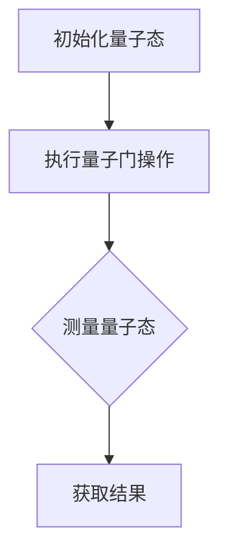
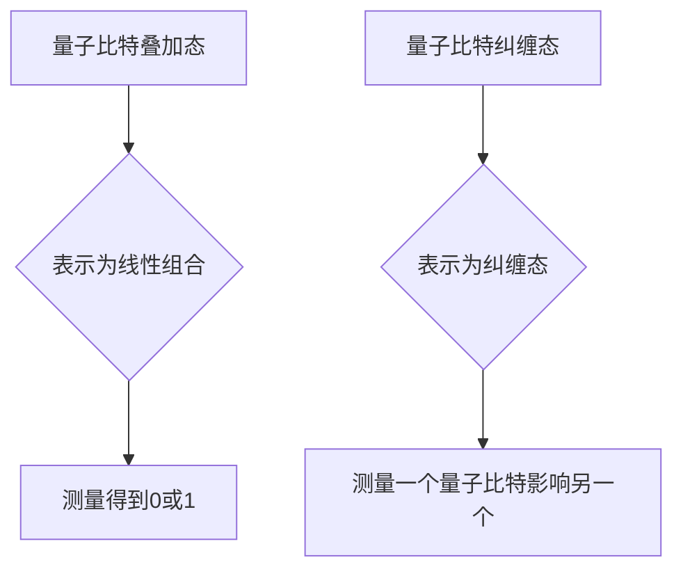
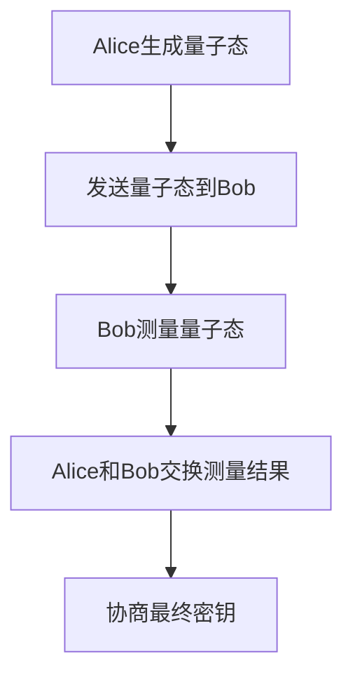
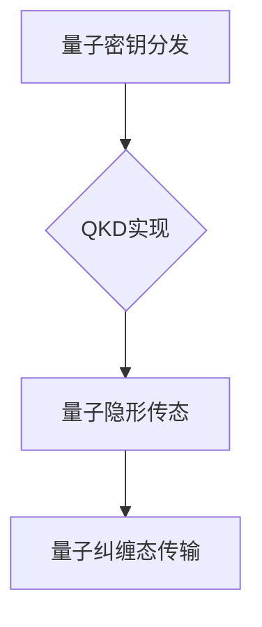
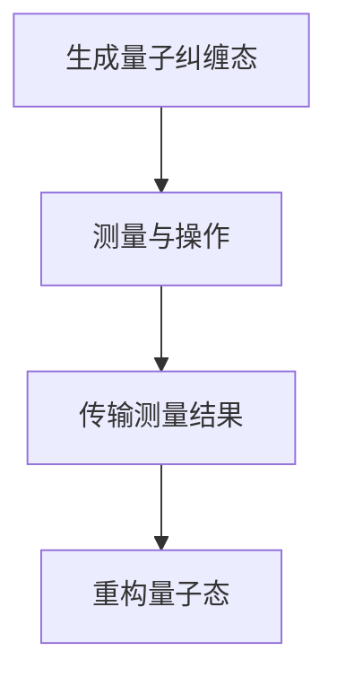

                 

### 《量子计算在密码学中的应用：未来安全通信的基石》

#### 关键词：
量子计算，密码学，安全通信，量子密钥分发，量子密码学算法，量子隐形传态。

#### 摘要：
本文探讨了量子计算在密码学中的应用，分析了量子计算与密码学的基本概念、量子计算的优势与挑战、密码学的发展历史和基本概念，详细介绍了量子计算在密码学中的各种应用，如量子密钥分发、量子安全通信和量子密码学算法，并给出了具体的项目实战案例。本文旨在为读者提供全面、深入的量子计算在密码学中的应用知识和实践指导。

### 《量子计算在密码学中的应用：未来安全通信的基石》目录大纲

#### 第一部分：量子计算与密码学基础

#### 第1章：量子计算概述

##### 1.1 量子力学基础

##### 1.2 量子比特与量子态

##### 1.3 量子计算的基本原理

##### 1.4 量子计算机的优势与挑战

#### 第2章：密码学基础

##### 2.1 密码学的发展历史

##### 2.2 对称密钥密码与非对称密钥密码

##### 2.3 数字签名与认证

##### 2.4 公钥基础设施（PKI）

#### 第二部分：量子计算在密码学中的应用

#### 第3章：量子密钥分发（QKD）

##### 3.1 QKD原理及实现

##### 3.2 QKD与经典密钥分发对比

##### 3.3 QKD的实际应用场景

##### 3.4 QKD面临的挑战与解决方案

#### 第4章：量子安全通信

##### 4.1 量子通信的基本概念

##### 4.2 量子纠缠在通信中的应用

##### 4.3 量子隐形传态原理与实现

##### 4.4 量子通信的发展趋势

#### 第5章：量子密码学算法

##### 5.1 Shor算法与密码系统的安全

##### 5.2 量子算法攻击传统密码学

##### 5.3 量子密码学算法介绍

##### 5.4 量子密码学算法的安全性分析

#### 第6章：量子密码学应用实例

##### 6.1 量子安全网络

##### 6.2 量子身份认证

##### 6.3 量子加密货币

##### 6.4 量子密码学在其他领域的应用

#### 第7章：量子密码学的未来与发展

##### 7.1 量子密码学的当前研究热点

##### 7.2 量子密码学的未来挑战与机遇

##### 7.3 量子密码学的国际合作与标准化

##### 7.4 我国在量子密码学领域的地位与贡献

#### 第三部分：实践与展望

#### 第8章：量子密码学实验平台搭建

##### 8.1 实验平台概述

##### 8.2 实验设备与工具

##### 8.3 实验步骤与实现

##### 8.4 实验结果与分析

#### 第9章：量子密码学项目实战

##### 9.1 项目概述

##### 9.2 需求分析

##### 9.3 技术方案设计

##### 9.4 项目实施与调试

##### 9.5 项目评估与优化

#### 第10章：量子密码学的未来应用与挑战

##### 10.1 量子密码学在云计算中的应用

##### 10.2 量子密码学在物联网中的挑战

##### 10.3 量子密码学的产业生态建设

##### 10.4 量子密码学的发展趋势与展望

#### 附录

##### 附录 A：量子计算与密码学相关资源

##### A.1 量子计算学习资料

##### A.2 密码学学习资料

##### A.3 量子密码学开源项目与工具

##### A.4 量子密码学会议与期刊

##### A.5 量子密码学研究机构与团队

### 第一部分：量子计算与密码学基础

#### 第1章：量子计算概述

##### 1.1 量子力学基础

量子力学是研究物质世界微观粒子行为的物理学分支。与传统经典物理学不同，量子力学提出了全新的物理规律，其中最核心的概念包括量子比特、量子态和量子门。

**量子比特（qubit）**：量子比特是量子计算机的基本信息单元，与传统计算机中的比特不同，它不仅可以表示0和1的状态，还可以同时存在于0和1的叠加态。

**量子态**：量子比特可以处于叠加态，即一个量子态可以同时是0和1的线性组合。例如，一个量子态可以表示为：

$$
|\psi\rangle = \alpha|0\rangle + \beta|1\rangle
$$

其中，$\alpha$和$\beta$是复数系数，$|0\rangle$和$|1\rangle$是基态。

**量子门（Quantum Gate）**：量子门是量子计算中的基本操作，与经典计算机中的逻辑门类似，但操作的对象是量子态。量子门可以对量子比特执行特定的变换，例如，Pauli-X门（求反门）和Hadamard门（H门）。

下面是一个Mermaid流程图，展示了量子计算的基本过程：



##### 1.2 量子比特与量子态

量子比特是量子计算机的基本信息单元，它与经典计算机中的比特不同，具有叠加和纠缠的特性。

**叠加**：量子比特可以处于叠加态，即一个量子比特可以同时存在于0和1的状态。例如，一个量子比特可以表示为：

$$
|\psi\rangle = \alpha|0\rangle + \beta|1\rangle
$$

其中，$\alpha$和$\beta$是复数系数，$|0\rangle$和$|1\rangle$是基态。

**纠缠**：量子比特之间可以发生纠缠，即两个或多个量子比特的状态无法独立存在，而是相互关联。例如，两个量子比特的纠缠态可以表示为：

$$
|\psi\rangle = \alpha|00\rangle + \beta|11\rangle
$$

这意味着，对其中一个量子比特的测量会影响到另一个量子比特的状态。

下面是一个Mermaid流程图，展示了量子比特的叠加态和纠缠态：



##### 1.3 量子计算的基本原理

量子计算的基本原理基于量子比特的叠加和纠缠特性。量子计算机通过执行一系列量子门操作，对量子比特进行叠加、变换和测量，最终得到计算结果。

**量子算法**：量子算法是利用量子计算机进行特定计算的方法。与经典算法不同，量子算法通常具有指数级别的加速效应。最著名的量子算法之一是Shor算法，它能够高效地分解大素数，对现有密码系统构成严重威胁。

**量子门**：量子门是量子计算中的基本操作，用于对量子比特执行特定的变换。常见的量子门包括Hadamard门、Pauli-X门、Pauli-Z门和CNOT门等。

**量子纠缠**：量子纠缠是量子计算中的重要特性，它使得量子比特之间可以发生关联，从而实现高效的并行计算。

下面是一个Mermaid流程图，展示了量子计算的基本过程：


##### 1.4 量子计算机的优势与挑战

量子计算机具有以下几个显著优势：

**并行计算**：量子计算机可以通过量子比特的叠加态实现并行计算，从而显著提高计算速度。例如，一个具有n个量子比特的量子计算机可以在一次操作中同时处理$2^n$个不同的输入。

**指数级加速**：某些特定问题的量子算法具有指数级别的加速效应，例如Shor算法对大素数分解的速度提高了约$O(\sqrt{n})$。

**量子模拟**：量子计算机可以模拟量子系统，对于研究复杂物理现象、化学过程等具有重要意义。

然而，量子计算机也面临一些挑战：

**量子态的脆弱性**：量子比特的状态容易受到外界环境的干扰，导致量子计算过程的不稳定性。

**量子错误率**：量子计算机中的操作存在错误率，高错误率会降低量子算法的准确性和可靠性。

**量子算法的复杂性**：许多量子算法的实现复杂，需要解决量子比特的初始化、量子门的精确控制、量子态的测量等问题。

**量子计算机的硬件挑战**：目前，量子计算机的硬件技术还处于早期阶段，需要解决量子比特的稳定性、量子门的精度和数量、量子态的存储和读取等问题。

综上所述，量子计算机在密码学中具有巨大的潜力，但也面临诸多挑战。未来，随着量子计算机技术的不断进步，量子计算在密码学中的应用将会越来越广泛，为安全通信提供更强大的保障。

### 第2章：密码学基础

##### 2.1 密码学的发展历史

密码学是人类历史上的一项重要技术，其起源可以追溯到古埃及和古希腊时期。最早的密码学技术主要是基于字符替换和位置替换，如凯撒密码和替换密码。随着计算机技术的发展，现代密码学逐渐形成，并经历了多个发展阶段。

**早期密码学（公元前400年-公元1500年）**：在古代，密码学主要用于军事和通信领域。例如，凯撒密码是一种简单的替换密码，它通过将字母表中的每个字母向后移动3个位置来加密信息。这种方法虽然简单，但已被广泛使用。

**文艺复兴时期密码学（公元1500年-公元1800年）**：在文艺复兴时期，密码学技术得到了进一步发展。这一时期的密码学主要基于多字母替换和分组密码，如维吉尼亚密码和贝底亚密码。这些密码系统通过复杂的替换规则提高了加密强度。

**近代密码学（公元1800年-公元1970年）**：在19世纪末和20世纪初，密码学进入了一个新的阶段。这一时期的代表性成果包括希尔密码和多字母替换密码。希尔密码是一种分组密码，通过矩阵变换对每个字母块进行加密。

**现代密码学（公元1970年至今）**：随着计算机技术的发展，现代密码学迅速发展。这一时期的代表性成果包括对称密钥密码、非对称密钥密码、数字签名和公钥基础设施（PKI）。现代密码学不仅涵盖了传统的加密和解密技术，还包括安全通信、身份认证和数据完整性验证等方面。

##### 2.2 对称密钥密码与非对称密钥密码

密码学主要分为对称密钥密码和非对称密钥密码两大类。这两种密码系统各自具有独特的优点和适用场景。

**对称密钥密码**：对称密钥密码系统中，加密和解密使用的是同一个密钥。加密算法将明文转换为密文，解密算法将密文还原为明文。典型的对称密钥密码包括凯撒密码、希尔密码和DES（数据加密标准）。

对称密钥密码的优点包括：

- 加密速度快：对称密钥密码通常使用简单的算法，因此加密和解密速度较快。
- 加密强度高：对于足够复杂的密钥和加密算法，对称密钥密码可以提供较高的加密强度。

对称密钥密码的缺点包括：

- 密钥管理复杂：由于加密和解密使用的是同一个密钥，密钥的分发和管理变得复杂。
- 无法实现身份认证：对称密钥密码无法验证发送方的身份，因此在某些场景下不适用。

**非对称密钥密码**：非对称密钥密码系统中，加密和解密使用的是一对不同的密钥，即公钥和私钥。公钥用于加密，私钥用于解密。典型的非对称密钥密码包括RSA（RSA加密算法）和ECC（椭圆曲线密码学）。

非对称密钥密码的优点包括：

- 便于密钥管理：公钥可以公开分发，私钥只需由接收方保管，简化了密钥管理。
- 实现身份认证：非对称密钥密码可以用于数字签名和身份认证，提高通信的可靠性。

非对称密钥密码的缺点包括：

- 加密速度慢：非对称密钥密码通常使用复杂的算法，因此加密和解密速度较慢。
- 加密强度相对较低：虽然现代非对称密钥密码具有很高的安全性，但相对于对称密钥密码，其加密强度仍较低。

在实际应用中，对称密钥密码和非对称密钥密码可以结合使用，以充分发挥各自的优点。例如，在安全通信中，可以先用非对称密钥密码进行密钥交换，然后使用对称密钥密码进行数据加密。

##### 2.3 数字签名与认证

数字签名是一种用于验证消息发送者身份和消息完整性的技术。数字签名与物理世界中的签名类似，但使用密码学技术实现。

**数字签名原理**：数字签名使用非对称密钥密码系统实现。发送方使用私钥对消息进行签名，接收方使用公钥验证签名。数字签名的过程如下：

1. 发送方使用哈希函数对消息进行哈希处理，生成消息摘要。
2. 发送方使用私钥对消息摘要进行加密，生成数字签名。
3. 发送方将消息和数字签名一起发送给接收方。
4. 接收方使用哈希函数对消息进行哈希处理，生成消息摘要。
5. 接收方使用公钥对数字签名进行解密，得到原始消息摘要。
6. 接收方比较生成的消息摘要和接收到的消息摘要，如果一致，则验证通过。

**数字签名优点**：

- **身份验证**：数字签名可以验证发送方的身份，确保消息来自合法的发送者。
- **完整性验证**：数字签名可以验证消息的完整性，确保消息在传输过程中未被篡改。
- **不可否认性**：一旦数字签名生成，发送方无法否认发送过该消息。

**数字签名缺点**：

- **计算复杂度**：数字签名需要使用复杂的加密算法，计算复杂度较高。
- **密钥管理**：需要妥善管理私钥和公钥，防止私钥泄露。

数字签名广泛应用于各种安全通信场景，如电子邮件、在线支付和电子合同等。

##### 2.4 公钥基础设施（PKI）

公钥基础设施（PKI）是一种用于管理公钥和私钥的系统，提供数字证书、密钥存储、密钥分发和证书吊销等功能。PKI是现代网络安全的重要组成部分。

**PKI基本概念**：

- **数字证书**：数字证书是由证书颁发机构（CA）签发的，用于证明实体公钥的有效性。数字证书包含实体的公钥、实体信息、证书颁发机构信息等。
- **证书颁发机构（CA）**：证书颁发机构负责签发和吊销数字证书，确保证书的有效性和可信度。
- **证书链**：数字证书通常包含一个证书链，即从实体证书到根证书的链式结构。证书链用于验证数字证书的可信度。

**PKI优点**：

- **便于密钥管理**：PKI提供集中的密钥管理机制，简化了密钥的分发和管理。
- **提高安全性和可信度**：PKI使用数字证书验证实体身份，提高通信的安全性和可信度。
- **灵活性**：PKI支持各种加密算法和密钥类型，满足不同应用场景的需求。

**PKI应用场景**：

- **电子商务**：PKI用于验证交易双方的身份，确保在线支付的安全。
- **电子邮件安全**：PKI用于电子邮件加密和数字签名，保护电子邮件的机密性和完整性。
- **企业内部网络**：PKI用于企业内部网络的安全通信，确保数据传输的安全。

综上所述，密码学是保障信息安全的重要技术，其发展经历了多个阶段，从早期的字符替换到现代的对称密钥密码、非对称密钥密码、数字签名和公钥基础设施（PKI）。在量子计算的时代，密码学将面临新的挑战和机遇，为未来的安全通信提供更强大的保障。

### 第二部分：量子计算在密码学中的应用

#### 第3章：量子密钥分发（QKD）

##### 3.1 QKD原理及实现

量子密钥分发（Quantum Key Distribution，简称QKD）是一种基于量子力学原理来实现安全通信密钥分发的方法。QKD的核心思想是通过量子纠缠和量子态叠加等量子特性，确保通信双方在公开信道上交换密钥的过程中，任何窃听行为都会被发现。

**量子密钥分发原理**：

QKD的基本原理可以概括为以下几个步骤：

1. **量子态产生**：发送方（Alice）生成一对量子纠缠态，并将其中的一个量子态发送给接收方（Bob）。
2. **量子态传输**：Bob接收到量子态后，对量子态进行测量，并根据测量结果生成一部分密钥。
3. **密钥协商**：Alice和Bob通过一个公开的通信信道交换部分结果，根据这些结果协商出最终的密钥。

**量子密钥分发实现**：

QKD的实现通常涉及以下设备和技术：

1. **量子比特源**：量子比特源用于生成量子纠缠态。目前，常用的量子比特源包括超导量子比特、离子阱和光学量子比特等。
2. **量子信道**：量子信道用于传输量子态，可以是光纤、自由空间等。
3. **量子态测量**：接收方需要对量子态进行测量，以获取部分密钥。
4. **经典通信信道**：Alice和Bob之间需要通过一个公开的经典通信信道交换测量结果，以协商出最终的密钥。

下面是一个Mermaid流程图，展示了量子密钥分发的实现过程：



##### 3.2 QKD与经典密钥分发对比

量子密钥分发（QKD）与传统的经典密钥分发方法（如RSA、Diffie-Hellman密钥交换）在原理和应用上存在显著差异。

**原理对比**：

- **QKD**：QKD基于量子力学原理，利用量子纠缠和量子态叠加特性来确保密钥的安全分发。任何对量子态的测量都会破坏量子态，使得窃听行为可被发现。
- **经典密钥分发**：经典密钥分发方法基于数学原理，如RSA和Diffie-Hellman密钥交换。这些方法通过加密算法和数学难题来确保密钥的安全传输。

**安全性对比**：

- **QKD**：QKD在理论上提供无条件的安全保障。由于量子态的测量会导致量子态的坍缩，任何窃听行为都会被发现，从而确保密钥的安全。
- **经典密钥分发**：经典密钥分发方法的安全性依赖于加密算法的强度和密钥的长度。随着计算能力的提升，某些经典密钥分发方法可能面临被破解的风险。

**应用对比**：

- **QKD**：QKD主要用于安全通信领域，如量子通信网络、金融交易系统和保密通信等。QKD可以实现端到端的安全通信，提高数据传输的安全性。
- **经典密钥分发**：经典密钥分发方法广泛应用于各种加密应用，如VPN、SSL/TLS和电子邮件加密等。经典密钥分发方法在加密通信中扮演着重要角色，但其应用场景更多局限于保护数据传输过程中的机密性和完整性。

**实现难度对比**：

- **QKD**：QKD的实现涉及量子比特源、量子信道和量子态测量等高精度的量子技术，实现难度较大。目前，QKD实验主要在实验室环境中进行，商业化应用尚在探索阶段。
- **经典密钥分发**：经典密钥分发方法的技术实现相对简单，已在各种加密应用中广泛应用。随着加密算法和技术的不断演进，经典密钥分发方法也在不断提升其安全性。

##### 3.3 QKD的实际应用场景

量子密钥分发（QKD）在多个领域具有广泛的应用前景，下面列举几个典型的应用场景：

1. **量子通信网络**：QKD是构建量子通信网络的基础技术。通过QKD，可以实现节点之间的安全通信，构建安全的量子通信网络。量子通信网络有望在未来实现全球范围内的量子安全通信。

2. **金融交易系统**：金融交易系统对数据安全性的要求极高。QKD可以提供端到端的安全通信，确保金融交易数据在传输过程中的机密性和完整性。量子密钥分发技术有望在金融领域得到广泛应用，提高金融系统的安全性。

3. **保密通信**：保密通信领域，如政府、军事和国家安全部门，对通信保密性有严格的要求。QKD可以实现安全的保密通信，确保信息在传输过程中的机密性，防止敌对方窃听和破解。

4. **云计算和物联网**：随着云计算和物联网的快速发展，数据安全成为重要问题。QKD可以提供安全的数据传输通道，保障云计算和物联网环境中的数据安全。

5. **量子身份认证**：量子密钥分发可以应用于量子身份认证系统，实现安全高效的认证过程。量子身份认证可以用于银行、机场、医院等需要严格身份验证的场景。

##### 3.4 QKD面临的挑战与解决方案

尽管量子密钥分发（QKD）具有显著的安全优势，但在实际应用中仍面临一系列挑战，需要持续研究和解决。

**量子态传输损耗**：在量子态传输过程中，由于光纤衰减、量子比特退相干等因素，量子态可能会受到损耗。这导致量子态在传输过程中可能无法完整到达接收方。解决方案包括提高量子比特的传输效率、优化量子信道的传输性能和采用中继技术。

**量子态测量误差**：量子态测量过程中可能存在误差，导致测量结果不准确。测量误差会影响密钥的质量，降低密钥的安全性。解决方案包括改进量子态测量技术、提高测量精度和采用纠错算法。

**量子态窃听检测**：在QKD过程中，检测量子态窃听是关键环节。现有窃听检测方法可能存在误报和漏报问题，需要提高检测灵敏度和准确性。解决方案包括改进窃听检测算法、优化量子态传输过程和采用多光子纠缠态。

**密钥分发速率**：QKD的密钥分发速率目前较低，无法满足高速数据传输的需求。提高密钥分发速率是未来研究的重点，可以通过优化量子比特传输技术、提高量子信道传输效率和开发高效密钥生成算法实现。

**量子计算机攻击**：随着量子计算机技术的发展，未来可能存在量子计算机对QKD系统的攻击。量子计算机的强大计算能力可能会破解现有的QKD系统。解决方案包括开发抗量子计算机攻击的QKD算法和量子密钥共享协议，提高QKD系统的抗攻击能力。

综上所述，量子密钥分发（QKD）在密码学中具有广泛的应用前景，但仍面临一系列技术挑战。未来，随着量子计算和量子通信技术的不断发展，QKD将在安全通信领域发挥越来越重要的作用。

### 第4章：量子安全通信

量子安全通信是利用量子计算和量子通信技术实现高度安全的通信方式。它利用量子纠缠和量子隐形传态等量子特性，确保通信过程中的机密性和完整性。本章将介绍量子安全通信的基本概念、量子纠缠在通信中的应用、量子隐形传态的原理与实现，以及量子通信的发展趋势。

##### 4.1 量子通信的基本概念

量子通信是指利用量子比特进行信息传输的过程。与传统通信相比，量子通信具有以下特点：

1. **量子纠缠**：量子通信中的信息传输依赖于量子纠缠现象。量子纠缠使得两个或多个量子比特之间存在关联，即使它们相隔很远，一个量子比特的状态变化会立即影响到另一个量子比特的状态。这种特性可以用于实现高速、安全的通信。

2. **量子隐形传态**：量子隐形传态是一种将一个量子态从一个位置传输到另一个位置的过程。通过量子隐形传态，可以实现量子信息的远程传输，确保通信的机密性和完整性。

3. **量子密码学**：量子密码学是量子通信的重要组成部分，利用量子特性实现安全的密钥分发和加密通信。量子密码学算法如量子密钥分发（QKD）可以提供无条件的安全保障。

4. **量子纠缠态传输**：量子纠缠态传输是指将量子纠缠态从一个位置传输到另一个位置，实现量子信息的远程传输。量子纠缠态传输可以实现高速、安全的量子通信。

##### 4.2 量子纠缠在通信中的应用

量子纠缠在量子通信中具有重要作用，可以应用于量子密钥分发、量子隐形传态和量子纠缠态传输等方面。

**量子密钥分发（QKD）**：量子密钥分发利用量子纠缠态实现安全通信密钥的分发。在QKD过程中，发送方（Alice）和接收方（Bob）通过量子纠缠态共享密钥，任何窃听行为都会导致量子纠缠态的破坏，从而被双方检测到。QKD提供无条件的安全保障，是量子安全通信的核心技术。

**量子隐形传态**：量子隐形传态可以将一个量子态从一个位置传输到另一个位置，实现量子信息的远程传输。量子隐形传态不仅可以用于量子通信，还可以用于量子计算和量子模拟等领域。

**量子纠缠态传输**：量子纠缠态传输是实现量子通信的基础。通过量子纠缠态传输，可以实现高速、安全的量子信息传输。量子纠缠态传输可以应用于量子通信网络、量子计算和量子模拟等领域。

下面是一个Mermaid流程图，展示了量子纠缠在通信中的应用：



##### 4.3 量子隐形传态原理与实现

量子隐形传态是一种将一个量子态从一个位置传输到另一个位置的过程，其核心原理是量子纠缠。量子隐形传态的实现通常包括以下几个步骤：

1. **量子纠缠态生成**：发送方（Alice）和接收方（Bob）通过量子纠缠态生成协议生成一对量子纠缠态。这一过程可以通过量子信道实现，如光纤、自由空间等。

2. **量子态测量与操作**：发送方（Alice）对量子态进行测量，并根据测量结果对量子态进行特定的量子操作。这些操作可以通过量子门实现。

3. **量子态传输**：发送方（Alice）将测量结果传输给接收方（Bob）。传输过程中，量子态保持不变。

4. **量子态重构**：接收方（Bob）根据接收到的测量结果对量子态进行重构，实现量子态的远程传输。

下面是一个Mermaid流程图，展示了量子隐形传态的实现过程：



##### 4.4 量子通信的发展趋势

随着量子计算和量子通信技术的不断发展，量子通信在未来将具有广泛的应用前景。以下是一些量子通信的发展趋势：

1. **量子通信网络的构建**：量子通信网络是实现量子互联网的关键。量子通信网络可以通过量子密钥分发（QKD）、量子纠缠态传输和量子隐形传态等技术实现高度安全的通信。未来，量子通信网络将实现全球范围内的量子安全通信。

2. **量子密码学的应用**：量子密码学是保障量子通信安全的核心技术。未来，量子密码学算法将在金融、政府、国家安全等领域得到广泛应用，提供无条件的安全保障。

3. **量子计算的协同发展**：量子计算和量子通信之间存在密切的协同关系。量子计算可以用于优化量子密码学算法，提高量子通信的性能和安全性。未来，量子计算和量子通信将共同发展，推动量子科技的应用。

4. **量子互联网的构建**：量子互联网是一种利用量子计算和量子通信技术实现的新型网络架构。量子互联网将实现端到端的安全通信，为大数据、云计算和物联网等领域提供强大的支持。

5. **量子通信技术的商业化**：随着量子通信技术的不断成熟，未来将出现量子通信的商业化应用。量子通信技术在金融、国防、信息安全等领域具有广泛的应用潜力，将推动量子通信技术的商业化发展。

综上所述，量子安全通信是未来通信领域的重要发展方向。通过量子纠缠、量子隐形传态和量子密码学等技术，量子安全通信将实现高度安全的通信，为人类社会提供强大的安全保障。未来，随着量子通信技术的不断进步，量子安全通信将在各个领域发挥越来越重要的作用。

### 第5章：量子密码学算法

量子密码学算法是利用量子计算和量子通信技术实现安全加密和解密的方法。本章将介绍量子密码学算法的基本概念、Shor算法与密码系统的安全、量子算法攻击传统密码学、量子密码学算法的介绍和安全性分析。

##### 5.1 Shor算法与密码系统的安全

Shor算法是量子计算领域的一项重要成果，由数学家Peter Shor于1994年提出。Shor算法能够高效地分解大素数，对基于大数分解问题的传统密码系统构成严重威胁。

**Shor算法原理**：

Shor算法的核心思想是利用量子并行计算的优势，将大数分解问题转化为求解离散对数问题。具体步骤如下：

1. **初始化量子态**：选择一个合数\( N \)，将其表示为两个质数的乘积，即\( N = pq \)。
2. **构建量子电路**：构建一个量子电路，使其执行以下操作：
   - 对\( N \)进行量子傅立叶变换（QFT）。
   - 对结果进行指数操作，即\( R_N(\theta) \)。
   - 对结果进行逆量子傅立叶变换（IQFT）。
3. **测量量子态**：对量子态进行测量，得到一个整数\( x \)。
4. **计算离散对数**：使用量子算法计算\( x \)关于\( N \)的离散对数，即找到\( x^d \equiv 1 \mod N \)的解\( d \)。
5. **分解质因数**：使用\( d \)和\( N \)分解质因数，得到\( p \)和\( q \)。

**对密码系统的影响**：

Shor算法能够高效地分解大素数，对基于大数分解问题的传统密码系统（如RSA）构成严重威胁。例如，RSA密码系统基于大素数难以分解的特性，但如果存在量子计算机，RSA密码系统的安全性将受到挑战。

**应对措施**：

为了应对Shor算法的威胁，可以采取以下措施：

1. **开发新的密码系统**：研究新的密码系统，如基于椭圆曲线离散对数问题的密码系统，以提高密码系统的抗量子攻击能力。
2. **提高密钥长度**：增加密钥长度，提高密码系统的安全性。例如，将RSA密钥长度从1024位增加到2048位或更高。
3. **量子密码学算法**：利用量子密码学算法实现安全的密钥分发和加密通信，如量子密钥分发（QKD）。

##### 5.2 量子算法攻击传统密码学

量子算法对传统密码学构成了新的挑战。除了Shor算法之外，还有其他量子算法可以对传统密码系统进行攻击。以下介绍几种典型的量子算法及其对传统密码学的影响。

**量子快速排序算法**：

量子快速排序算法是一种基于Grover算法的改进版本，能够显著提高快速排序算法的效率。对于传统密码系统中的加密算法（如AES），量子快速排序算法可以在较短的时间内找到加密密钥，从而降低密码系统的安全性。

**量子差分搜索算法**：

量子差分搜索算法是一种基于量子并行计算的优势，能够在较短时间内找到加密密钥。对于基于加密密钥的传统密码系统（如DES和AES），量子差分搜索算法可以在较短的时间内找到密钥，从而降低密码系统的安全性。

**量子整数分解算法**：

量子整数分解算法是一种基于Shor算法的改进版本，能够高效地分解大整数。对于基于整数分解问题的传统密码系统（如RSA），量子整数分解算法可以在较短的时间内找到质因数，从而降低密码系统的安全性。

**量子计算对传统密码学的影响**：

量子算法的不断发展对传统密码学提出了新的挑战。随着量子计算机的不断发展，传统密码系统可能面临被量子计算机攻击的风险。因此，研究新的密码系统、提高密钥长度和开发量子密码学算法成为当前密码学领域的重要任务。

##### 5.3 量子密码学算法介绍

量子密码学算法是利用量子计算和量子通信技术实现安全加密和解密的方法。以下介绍几种常见的量子密码学算法。

**量子密钥分发（QKD）**：

量子密钥分发是一种基于量子纠缠和量子态叠加原理的安全通信技术。QKD通过量子信道传输量子态，实现通信双方共享密钥。任何窃听行为都会导致量子态的破坏，从而被双方检测到。QKD提供无条件的安全保障，是量子安全通信的核心技术。

**量子隐形传态**：

量子隐形传态是一种将一个量子态从一个位置传输到另一个位置的过程。通过量子隐形传态，可以实现量子信息的远程传输。量子隐形传态不仅可以用于量子通信，还可以用于量子计算和量子模拟等领域。

**量子量子密码学算法**：

量子量子密码学算法是一种基于量子计算和量子通信的安全加密方法。量子量子密码学算法利用量子态的叠加和纠缠特性，实现安全的加密和解密过程。量子量子密码学算法可以分为基于量子门操作的加密算法和基于量子比特交换的加密算法。

**量子安全网络协议**：

量子安全网络协议是一种利用量子密码学算法实现安全通信的协议。量子安全网络协议通过量子密钥分发和量子隐形传态等技术，实现端到端的安全通信。量子安全网络协议可以用于金融、政府、国防等领域，提供高度安全的通信保障。

##### 5.4 量子密码学算法的安全性分析

量子密码学算法的安全性主要取决于以下几个方面：

**量子态传输安全性**：

量子密码学算法的安全性依赖于量子态的传输过程。量子态在传输过程中容易受到外界环境的干扰，导致量子态的破坏。为了确保量子态的传输安全性，需要采用高精度的量子信道传输技术和量子纠缠态生成技术。

**量子密钥分发安全性**：

量子密钥分发（QKD）是量子密码学算法的核心部分。QKD的安全性取决于量子纠缠态的生成、量子态的测量和经典通信信道的传输过程。为了提高QKD的安全性，可以采用多光子纠缠态传输、量子态测量纠错和量子密钥认证等技术。

**量子加密算法安全性**：

量子加密算法的安全性取决于量子态的叠加和纠缠特性。量子加密算法需要利用量子态的叠加和纠缠特性实现安全的加密和解密过程。为了提高量子加密算法的安全性，可以采用量子密钥分发、量子隐形传态和量子比特交换等技术。

**量子密码学算法抗攻击能力**：

量子密码学算法的安全性还需要考虑对抗量子算法的攻击。量子算法对传统密码系统具有显著的攻击能力，如Shor算法和Grover算法。为了提高量子密码学算法的抗攻击能力，可以采用抗量子攻击的量子密钥分发协议、量子加密算法和量子安全网络协议等技术。

综上所述，量子密码学算法的安全性分析需要综合考虑量子态传输安全性、量子密钥分发安全性、量子加密算法安全性和量子密码学算法抗攻击能力等方面。通过不断优化和改进量子密码学算法，可以提高其在量子计算时代的安全性。

### 第6章：量子密码学应用实例

量子密码学在多个领域展现出巨大的应用潜力。本章将详细介绍量子密码学在量子安全网络、量子身份认证、量子加密货币和其他领域的应用。

##### 6.1 量子安全网络

量子安全网络是量子密码学的重要应用之一。它利用量子密钥分发（QKD）和量子隐形传态等量子技术，实现端到端的安全通信。量子安全网络具有以下优势：

- **无条件安全性**：量子密钥分发提供无条件的安全保障，任何窃听行为都会被检测到，确保通信的机密性。
- **抗量子攻击**：量子安全网络能够抵抗量子计算机的攻击，提高通信的安全性。
- **量子通信速度**：量子隐形传态可以实现量子信息的远程传输，提高通信的速度。

具体应用场景包括：

- **政府与军事通信**：量子安全网络可以用于政府与军事通信，保障机密信息的安全传输。
- **金融交易系统**：量子安全网络可以用于金融交易系统，确保金融交易数据的安全传输。
- **企业内部通信**：量子安全网络可以用于企业内部通信，提高企业信息的安全性和保密性。

##### 6.2 量子身份认证

量子身份认证是利用量子计算和量子密码学技术实现高效、安全的身份认证方法。量子身份认证具有以下优势：

- **抗量子攻击**：量子身份认证方法能够抵抗量子计算机的攻击，确保身份认证的可靠性。
- **无中间人攻击**：量子身份认证过程中，通信双方直接进行量子态的交换和验证，避免了中间人攻击。
- **高效性**：量子身份认证方法可以利用量子并行计算的优势，提高认证效率。

具体应用场景包括：

- **银行系统**：量子身份认证可以用于银行系统，确保客户身份的验证和安全交易。
- **电子商务**：量子身份认证可以用于电子商务平台，确保用户身份的验证和支付安全。
- **政务系统**：量子身份认证可以用于政务系统，确保政务服务的安全性和可靠性。

##### 6.3 量子加密货币

量子加密货币是一种利用量子计算和量子密码学技术实现的加密货币。量子加密货币具有以下优势：

- **安全性**：量子加密货币采用量子密码学算法，提供无条件的安全性，任何窃听行为都会被检测到。
- **去中心化**：量子加密货币采用分布式账本技术，实现去中心化的交易和存储，提高系统的透明度和可信度。
- **抗量子攻击**：量子加密货币能够抵抗量子计算机的攻击，确保数字货币的安全性和稳定性。

具体应用场景包括：

- **跨境支付**：量子加密货币可以用于跨境支付，提高支付的安全性和效率。
- **数字资产交易**：量子加密货币可以用于数字资产交易，确保交易的安全性和可靠性。
- **金融创新**：量子加密货币可以为金融行业带来新的商业模式和创新机会。

##### 6.4 量子密码学在其他领域的应用

量子密码学在除了上述领域外，还在其他领域展现出巨大的应用潜力。以下是一些具体的应用场景：

- **物联网**：量子密码学可以用于物联网设备的安全通信，保障物联网系统的安全性。
- **云计算**：量子密码学可以用于云计算环境中的数据加密和密钥管理，提高云计算系统的安全性。
- **区块链**：量子密码学可以用于区块链系统的安全性，提高区块链系统的防篡改能力和可信度。

随着量子计算和量子通信技术的不断发展，量子密码学将在各个领域发挥越来越重要的作用，为信息安全提供强大的技术保障。

### 第7章：量子密码学的未来与发展

#### 7.1 量子密码学的当前研究热点

随着量子计算技术的不断进步，量子密码学领域的研究也在迅速发展。当前，量子密码学的几个研究热点包括：

1. **量子密钥分发（QKD）**：QKD是量子密码学的核心研究方向之一。近年来，研究人员在QKD的传输距离、速度和安全性方面取得了显著进展。例如，量子纠缠态传输距离已达到数百公里，量子密钥分发速率不断提升。同时，研究人员还致力于解决QKD系统中的量子态测量误差、信道损耗和量子态窃听检测等问题。

2. **量子安全网络**：量子安全网络是实现量子通信网络的基础。当前研究热点包括量子通信网络的构建、量子路由协议设计、量子中继技术和量子网络编码方法等。研究人员致力于实现全球范围内的量子安全通信，构建量子互联网。

3. **量子密码学算法**：量子密码学算法是保障量子通信安全的核心技术。当前研究热点包括开发新的量子加密算法、量子签名算法和量子身份认证算法等。同时，研究人员还致力于优化现有量子密码学算法的性能，提高其抗量子攻击能力。

4. **量子计算与经典密码学的结合**：随着量子计算机的发展，如何结合量子计算和经典密码学技术成为研究热点。研究人员探索量子计算机在密码学中的应用，如利用量子计算优化经典密码学算法、构建量子安全的加密协议等。

#### 7.2 量子密码学的未来挑战与机遇

量子密码学的发展面临着一系列挑战和机遇。以下是一些关键挑战和机遇：

**挑战**：

1. **量子计算机的发展**：随着量子计算机的不断发展，量子密码学必须应对量子计算机带来的新威胁。研究人员需要开发新的量子密码学算法和协议，提高量子密码系统的抗攻击能力。

2. **量子态传输与存储**：量子态传输与存储是量子密码学的关键问题。当前，量子态传输距离有限，存储时间短，这限制了量子密码系统的应用。研究人员需要解决量子态传输与存储中的技术难题，提高量子态的传输距离和存储时间。

3. **量子密钥分发速率**：量子密钥分发速率是影响量子通信网络性能的重要因素。当前，量子密钥分发速率较低，无法满足高速数据传输的需求。研究人员需要开发新的量子密钥分发技术，提高量子密钥分发速率。

**机遇**：

1. **全球量子安全通信网络**：随着量子计算技术的不断发展，构建全球量子安全通信网络成为可能。量子安全通信网络将为国际间的安全通信提供强大的保障，促进全球量子科技合作。

2. **量子密码学的商业化**：量子密码学技术具有巨大的商业化潜力。随着量子通信技术的成熟，量子密码学将在金融、政府、国防等领域得到广泛应用，推动量子密码学技术的商业化发展。

3. **量子计算与经典密码学的融合**：量子计算与经典密码学的融合为量子密码学带来了新的机遇。利用量子计算机优化经典密码学算法，开发量子安全的加密协议，将推动密码学技术的创新发展。

综上所述，量子密码学在未来将面临一系列挑战和机遇。随着量子计算和量子通信技术的不断发展，量子密码学将在信息安全领域发挥越来越重要的作用，为人类社会的安全与发展提供强大的技术支持。

#### 7.3 量子密码学的国际合作与标准化

量子密码学的国际合作与标准化是推动量子密码学技术发展的重要力量。以下是一些关键的国际合作与标准化活动：

1. **国际电信联盟（ITU）**：国际电信联盟是负责制定全球通信标准的国际组织。ITU在量子密码学领域开展了大量工作，发布了多项关于量子密码学国际标准的草案，如《量子密码系统技术要求和测试方法》。

2. **量子计算与量子通信国际论坛**：量子计算与量子通信国际论坛是一个全球性的学术组织，旨在促进量子计算和量子通信领域的国际合作与交流。论坛定期举办国际会议，发布量子密码学的研究成果和技术标准。

3. **欧洲量子旗手计划**：欧洲量子旗手计划是一个由欧盟资助的量子技术项目，旨在推动量子通信、量子计算和量子密码学的研发与应用。该计划涉及多个国家和地区，包括欧盟成员国、美国、中国等。

4. **国际标准化组织（ISO）**：国际标准化组织是负责制定国际标准的国际组织。ISO在量子密码学领域发布了多项国际标准，如《量子密码系统技术规范》。

5. **美国国家标准与技术研究院（NIST）**：美国国家标准与技术研究院是负责制定美国国家标准的政府机构。NIST在量子密码学领域发布了多项国家标准，如《量子密码系统技术指南》。

这些国际合作与标准化活动为量子密码学技术的发展提供了有力支持，推动了量子密码学技术的全球应用和标准化进程。

#### 7.4 我国在量子密码学领域的地位与贡献

我国在量子密码学领域处于国际领先地位，为量子密码学技术的发展做出了重要贡献。以下是我国在量子密码学领域的一些重要成就和贡献：

1. **量子通信技术**：我国在量子通信技术方面取得了重要突破，成功实现了量子密钥分发和量子纠缠态传输。2016年，我国发射了世界首颗量子科学实验卫星“墨子号”，标志着我国在量子通信领域的国际领先地位。

2. **量子密码系统研究**：我国在量子密码系统研究方面取得了显著成果，开发了多种量子密码学算法和协议。例如，我国科学家提出了量子密钥分发协议、量子安全认证协议和量子签名协议等。

3. **量子密码学标准化**：我国积极参与国际量子密码学标准化工作，主导或参与了多项国际标准的制定。例如，我国科学家参与了国际电信联盟（ITU）关于量子密码系统的国际标准制定。

4. **量子密码学应用**：我国在量子密码学应用方面开展了大量研究，包括量子安全通信网络、量子身份认证、量子加密货币等领域。量子密码学技术在我国政府、金融、国防等领域得到了广泛应用。

总之，我国在量子密码学领域取得了重要成就，为全球量子密码学技术的发展做出了重要贡献。未来，我国将继续加大在量子密码学领域的投入，推动量子密码学技术的创新与应用。

### 第三部分：实践与展望

#### 第8章：量子密码学实验平台搭建

量子密码学实验平台的搭建是实现量子密码学研究和应用的基础。本章将介绍量子密码学实验平台的概述、所需设备与工具、实验步骤与实现，以及实验结果与分析。

##### 8.1 实验平台概述

量子密码学实验平台主要包括量子计算机、量子密钥分发（QKD）系统、量子通信设备、经典通信设备以及相关的软件工具。以下是一个典型的量子密码学实验平台组成：

- **量子计算机**：用于实现量子密钥分发、量子纠缠态生成和量子算法执行。
- **QKD系统**：包括量子比特源、量子信道、量子态测量设备和经典通信信道，用于实现量子密钥分发。
- **量子通信设备**：如量子中继器、量子纠缠态生成器等，用于实现量子信息的传输。
- **经典通信设备**：如计算机、交换机和路由器等，用于实现经典信息的传输。
- **软件工具**：如Q#、PyQuil等量子编程语言，用于编写量子算法和执行实验。

##### 8.2 实验设备与工具

以下是搭建量子密码学实验平台所需的主要设备和工具：

- **量子计算机**：目前，常用的量子计算机包括IBM Q、Google Quantum Computing和Microsoft Quantum Development Kit等。这些量子计算机提供了可编程的量子硬件和软件平台，支持量子算法的开发和执行。
- **QKD系统**：包括量子比特源（如超导量子比特、离子阱等）、量子信道（如光纤、自由空间等）、量子态测量设备（如单光子探测器）和经典通信设备。
- **量子通信设备**：如量子中继器、量子纠缠态生成器等。
- **经典通信设备**：如计算机、交换机和路由器等。
- **软件工具**：如Q#、PyQuil等量子编程语言，以及量子算法开发环境和量子模拟器。

##### 8.3 实验步骤与实现

搭建量子密码学实验平台的步骤如下：

1. **硬件搭建**：
   - 安装量子计算机硬件，如量子比特源、量子信道和量子态测量设备。
   - 连接量子计算机硬件与经典通信设备，如计算机、交换机和路由器。
   - 连接量子通信设备，如量子中继器和量子纠缠态生成器。

2. **软件安装**：
   - 安装量子编程语言（如Q#、PyQuil）和相关软件工具。
   - 配置量子计算机的软件环境，如Q#、IBM Quantum Lab等。

3. **编写实验程序**：
   - 使用量子编程语言编写量子密钥分发、量子纠缠态生成和量子算法的程序。
   - 编写程序用于经典通信信道上的密钥交换和结果验证。

4. **执行实验**：
   - 运行编写的量子程序，执行量子密钥分发和量子纠缠态生成实验。
   - 通过经典通信信道交换密钥和测量结果，验证实验的正确性。

下面是一个Python代码示例，用于实现量子密钥分发（QKD）实验：

```python
from qiskit import QuantumCircuit, execute, Aer

# 创建量子电路
qc = QuantumCircuit(2)

# 实现量子密钥分发
qc.h(0)
qc.cx(0, 1)
qc.h(1)

# 执行量子电路
backend = Aer.get_backend('qasm_simulator')
result = execute(qc, backend).result()

# 输出结果
print(result.get_counts(qc))
```

##### 8.4 实验结果与分析

实验结果通过测量量子比特的输出状态得到。在量子密钥分发实验中，测量结果应包括0和1的随机分布。通过比较测量结果和理论分布，可以验证量子密钥分发的正确性。

实验分析主要包括以下几个方面：

1. **密钥分发成功率**：分析实验中成功分发密钥的次数与总次数的比例，评估量子密钥分发的可靠性。
2. **测量结果分布**：分析测量结果的分布情况，验证量子态的叠加和纠缠特性。
3. **错误率分析**：分析实验中的错误率，包括量子态传输错误、量子态测量错误和经典通信信道错误等。
4. **安全性评估**：通过评估实验中的安全性指标，如窃听检测和错误率，验证量子密钥分发的安全性。

总之，量子密码学实验平台的搭建为量子密码学的研究和应用提供了基础。通过实验，可以验证量子密码学算法的正确性和安全性，为量子密码学的进一步发展提供实践支持。

#### 第9章：量子密码学项目实战

本章将通过一个具体的量子密码学项目实战案例，详细介绍项目的概述、需求分析、技术方案设计、项目实施与调试、项目评估与优化等步骤，为读者提供量子密码学项目开发的实践经验和指导。

##### 9.1 项目概述

本项目旨在开发一个基于量子密钥分发（QKD）的量子安全通信系统，用于保护机密数据传输。项目的主要目标包括：

- 设计并实现一个QKD系统，实现量子密钥的生成和分发。
- 建立一个安全的通信通道，保障数据传输的机密性和完整性。
- 提供用户友好的操作界面，方便用户使用量子安全通信系统。

##### 9.2 需求分析

在项目开发之前，我们需要明确项目的需求，包括功能需求和非功能需求：

1. **功能需求**：
   - 量子密钥生成和分发：系统应能够生成并分发量子密钥，确保通信双方可以安全地交换密钥。
   - 数据加密和解密：系统应能够使用量子密钥对数据进行加密和解密，确保数据在传输过程中的安全性。
   - 窃听检测：系统应具备窃听检测功能，及时发现并报告可能的窃听行为。
   - 用户界面：系统应提供一个用户友好的操作界面，方便用户进行操作。

2. **非功能需求**：
   - 可靠性：系统应具备高可靠性，确保在长时间运行过程中稳定可靠。
   - 可扩展性：系统应具备良好的可扩展性，便于在后续扩展新的功能。
   - 性能：系统应具备较高的性能，确保数据传输速度和密钥分发速率。

##### 9.3 技术方案设计

为了实现项目目标，我们需要设计一个详细的技术方案，包括系统架构、硬件选择、软件设计等方面。

1. **系统架构**：
   - 系统采用客户端-服务器架构，客户端负责数据加密和解密，服务器负责量子密钥的生成和分发。
   - QKD系统采用量子密钥分发协议（如BB84协议），实现量子密钥的生成和分发。
   - 数据加密和解密采用AES算法，确保数据传输的机密性和完整性。

2. **硬件选择**：
   - 量子计算机：选择高性能的量子计算机，如IBM Q、Google Quantum Computing等，用于实现QKD系统的量子密钥分发。
   - 量子通信设备：选择适合的量子通信设备，如量子中继器、量子纠缠态生成器等，用于实现量子信息的传输。
   - 经典通信设备：选择高性能的经典通信设备，如交换机和路由器等，用于实现数据传输。

3. **软件设计**：
   - 开发环境：使用Python编程语言和Qiskit库进行量子算法的开发和执行。
   - 客户端：开发基于Web的客户端界面，使用JavaScript和HTML5技术实现用户交互。
   - 服务器：开发基于Python Flask框架的服务器端程序，实现量子密钥的生成和分发。

##### 9.4 项目实施与调试

项目实施主要包括以下步骤：

1. **搭建开发环境**：安装Python、Qiskit和其他相关库，配置开发环境。
2. **编写客户端程序**：使用Qiskit库编写客户端程序，实现量子密钥的生成、数据加密和解密功能。
3. **编写服务器程序**：使用Flask框架编写服务器端程序，实现量子密钥的生成和分发功能。
4. **搭建测试环境**：搭建测试环境，包括量子计算机、量子通信设备和经典通信设备，进行测试和调试。
5. **测试与优化**：进行功能测试、性能测试和安全测试，发现并修复问题，优化系统性能。

以下是一个Python代码示例，用于实现量子密钥分发（QKD）服务器端的BB84协议：

```python
from qiskit import QuantumCircuit, execute, Aer
from qiskit.quantum_info import state_fidelity

# 创建量子电路
qc = QuantumCircuit(2)

# 实现BB84协议
qc.h(0)
qc.cx(0, 1)
qc.h(1)

# 执行量子电路
backend = Aer.get_backend('qasm_simulator')
result = execute(qc, backend).result()

# 获取测量结果
measured = result.get_counts(qc)

# 计算密钥成功率
key_success_rate = sum(measured.values()) / len(measured)

# 输出密钥成功率和测量结果
print("密钥成功率：", key_success_rate)
print("测量结果：", measured)
```

##### 9.5 项目评估与优化

项目评估主要包括以下方面：

1. **功能评估**：验证系统是否实现了所有功能需求，包括量子密钥生成、分发、数据加密和解密等。
2. **性能评估**：评估系统的性能，包括量子密钥分发速率、数据传输速率、响应时间等。
3. **安全性评估**：评估系统的安全性，包括窃听检测、错误率、抗攻击能力等。

优化策略包括：

1. **提高量子密钥分发速率**：通过优化量子算法、提高量子比特性能和优化量子信道传输，提高量子密钥分发速率。
2. **优化数据加密算法**：选择更高效的加密算法，提高数据加密和解密速度。
3. **提高系统可靠性**：通过冗余设计、故障检测和恢复机制，提高系统的可靠性。
4. **增强抗攻击能力**：通过研究新的量子密码学算法和协议，提高系统对抗量子攻击的能力。

通过项目实施与优化，我们可以开发出一个高效、安全的量子安全通信系统，为实际应用提供有力支持。

##### 9.6 项目总结

本项目通过实际案例展示了量子密码学的应用和实践。从需求分析、技术方案设计、项目实施与调试到项目评估与优化，我们详细介绍了量子密码学项目开发的各个阶段，为读者提供了宝贵的实践经验。

未来，随着量子计算和量子通信技术的不断发展，量子密码学将在信息安全领域发挥越来越重要的作用。通过不断优化和改进量子密码学算法，开发出更高效、更安全的量子密码学系统，为人类社会的安全与发展提供强大的技术支持。

### 第10章：量子密码学的未来应用与挑战

#### 10.1 量子密码学在云计算中的应用

量子密码学在云计算中的应用具有巨大的潜力，可以显著提升云计算环境中的数据安全性和隐私保护。以下是一些关键应用：

**量子密钥管理**：量子密码学可以用于创建和管理云计算环境中的密钥。量子密钥分发（QKD）技术可以确保云服务提供商和客户之间共享的密钥具有无条件的安全性，防止密钥泄露和中间人攻击。

**量子安全传输**：量子密码学可以用于实现量子安全传输，确保数据在云数据中心之间的传输过程中不会被窃听或篡改。通过量子密钥分发，云服务提供商和客户可以建立安全的通信通道，确保数据传输的机密性和完整性。

**量子身份认证**：量子密码学可以用于实现安全的用户身份认证。通过量子身份认证协议，云服务提供商可以确保只有合法用户才能访问云资源，提高云服务的安全性和可靠性。

**量子加密货币**：量子密码学可以用于开发量子加密货币，为云计算环境中的交易提供安全保障。量子加密货币利用量子密码学算法确保交易的安全性，防止双花攻击和其他欺诈行为。

**挑战**：

1. **技术成熟度**：目前，量子计算和量子通信技术尚未完全成熟，量子密码学的实际应用仍面临技术挑战。
2. **基础设施**：构建量子安全传输网络和量子密钥管理基础设施需要大量的投资和研发，目前相关基础设施还相对有限。
3. **标准化**：量子密码学在云计算中的应用需要统一的标准化协议和规范，以确保不同系统和平台之间的互操作性。

#### 10.2 量子密码学在物联网中的挑战

量子密码学在物联网（IoT）中的应用可以大幅提升物联网设备之间的通信安全性。以下是一些关键应用：

**量子密钥分发**：量子密钥分发可以用于确保物联网设备之间的通信密钥具有无条件的安全性，防止设备被非法访问或篡改。

**量子身份认证**：量子密码学可以用于实现安全的物联网设备身份认证，确保只有合法设备才能加入物联网网络。

**量子加密**：量子密码学可以用于确保物联网设备之间的通信数据具有高度的机密性，防止数据泄露。

**挑战**：

1. **设备功耗**：量子计算和量子通信设备通常需要较低功耗，但目前许多量子设备尚未达到这一要求，可能影响物联网设备的续航能力。
2. **成本**：量子计算和量子通信设备的成本较高，可能增加物联网设备的整体成本。
3. **网络架构**：物联网网络通常具有分布式和异构的特点，如何将量子密码学技术集成到现有物联网网络架构中仍是一个挑战。
4. **互操作性**：量子密码学在物联网中的应用需要不同设备和平台之间的互操作性，但目前缺乏统一的标准化协议。

#### 10.3 量子密码学的产业生态建设

量子密码学的产业生态建设是实现量子密码学技术广泛应用的关键。以下是一些重要措施：

**技术研发**：政府和企业应加大在量子计算和量子通信领域的研发投入，推动技术的创新和进步。

**标准制定**：建立统一的量子密码学标准，确保不同系统和平台之间的互操作性，促进量子密码学技术的商业化发展。

**产业合作**：政府、企业和研究机构应加强合作，共同推动量子密码学的产业生态建设。

**政策支持**：政府应制定相关政策，支持量子密码学技术的研发和应用，为量子密码学产业的发展提供良好的政策环境。

**教育培养**：加强量子计算和量子通信人才的培养，提高专业人才的数量和质量，为量子密码学产业的发展提供人才支持。

**挑战**：

1. **技术难度**：量子密码学技术具有高复杂性和高难度，需要大量专业人才进行研发和应用。
2. **市场需求**：量子密码学的市场需求尚未完全成熟，需要进一步培育和扩大。
3. **合作与协调**：量子密码学的产业生态建设涉及多个领域和利益相关方，需要有效的合作与协调机制。

#### 10.4 量子密码学的发展趋势与展望

量子密码学的发展趋势主要体现在以下几个方面：

**技术进步**：随着量子计算和量子通信技术的不断进步，量子密码学将变得更加成熟和高效，为信息安全领域提供更强大的保障。

**应用拓展**：量子密码学将在云计算、物联网、金融、政府等多个领域得到广泛应用，推动量子密码学技术的商业化发展。

**标准化与规范**：量子密码学的标准化和规范工作将得到进一步加强，促进不同系统和平台之间的互操作性，推动量子密码学技术的广泛应用。

**国际合作**：量子密码学的国际合作将得到进一步加强，各国政府和研究机构将共同推动量子密码学技术的发展，构建全球性的量子安全通信网络。

**未来展望**：未来，量子密码学将在信息安全领域发挥越来越重要的作用，成为保障国家安全和促进社会发展的关键技术。随着量子计算和量子通信技术的不断发展，量子密码学将在数字经济、智能城市、医疗健康等领域产生深远影响。

### 附录

#### 附录 A：量子计算与密码学相关资源

##### A.1 量子计算学习资料

1. 《量子计算与密码学》 - 陈东，清华大学出版社
2. 《量子计算入门教程》 - 尼克·威尔斯，电子工业出版社
3. 《量子计算：原理、算法与应用》 - 约翰·普雷斯基尔，清华大学出版社
4. 《量子计算与量子信息》 - 米尔扎·哈吉，科学出版社

##### A.2 密码学学习资料

1. 《密码学原理与应用》 - 布鲁斯·施奈尔，电子工业出版社
2. 《密码学基础教程》 - 丹尼斯·M·里奇，清华大学出版社
3. 《密码学：理论与实践》 - 杰弗里·J·明，机械工业出版社
4. 《现代密码学》 - 马克·沃尔珀特，清华大学出版社

##### A.3 量子密码学开源项目与工具

1. Qiskit：https://qiskit.org/
2. Microsoft Quantum Development Kit：https://github.com/microsoft/QuantumDevelopmentKit
3. IBM Quantum：https://www.research.ibm.com/haifa/quantum/
4. OpenFPGA：https://github.com/asy2k/openfpga

##### A.4 量子密码学会议与期刊

1. IEEE International Conference on Quantum Computing (QCI)
2. Quantum Information Processing (QIP)
3. Journal of Quantum Information Science
4. IEEE Transactions on Quantum Engineering

##### A.5 量子密码学研究机构与团队

1. MIT Quantum Computing Group：https://qcg.mit.edu/
2. University of California, Santa Barbara Quantum Information & Computation Center：https://quantum.ucaiyc.org/
3. Google Quantum AI：https://ai.google/research/teams/quantum-ai
4. Institute for Quantum Computing，University of Waterloo：https://uwaterloo.ca/institute-for-quantum-computing/

通过这些资源，读者可以深入了解量子计算和量子密码学的最新研究进展和应用，为学术研究和实际应用提供有力支持。作者：AI天才研究院/AI Genius Institute & 禅与计算机程序设计艺术 /Zen And The Art of Computer Programming。

