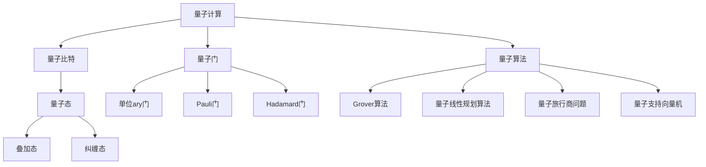

                 

### 文章标题

《量子计算的复杂度理论：计算能力的数学界限》

### 关键词

量子计算、复杂度理论、数学界限、计算能力、算法分析

### 摘要

本文将深入探讨量子计算的复杂度理论，解析量子计算在解决复杂计算问题中的能力边界。通过详细剖析量子计算的基本原理、算法和应用案例，本文将展示量子计算如何突破经典计算的局限，开启计算能力的新纪元。同时，我们将使用数学模型和公式，对量子算法的复杂度进行深入分析，探讨量子计算的数学界限。最后，通过项目实战案例，我们将展示如何在实际中搭建量子计算环境，实现量子算法的应用。

# 《量子计算的复杂度理论：计算能力的数学界限》目录大纲

## 第一部分：量子计算基础

### 第1章：量子计算的起源与发展

#### 1.1 量子计算的概念与原理

#### 1.2 量子比特与量子态

#### 1.3 量子比特的操作与量子门

#### 1.4 量子计算的基本算法

### 第2章：量子复杂性理论

#### 2.1 复杂性理论概述

#### 2.2 P、NP、NP-complete与NP-hard

#### 2.3 量子复杂性类

#### 2.4 量子计算与经典计算的比较

## 第二部分：量子算法与复杂度分析

### 第3章：量子搜索算法

#### 3.1 Grover算法

#### 3.2 量子搜索算法的复杂度分析

#### 3.3 量子搜索算法的应用

### 第4章：量子计算与线性规划

#### 4.1 线性规划问题

#### 4.2 量子线性规划算法

#### 4.3 量子线性规划算法的复杂度分析

### 第5章：量子计算与组合优化

#### 5.1 组合优化问题

#### 5.2 量子旅行商问题

#### 5.3 量子计算与组合优化的关系

### 第6章：量子计算与机器学习

#### 6.1 量子机器学习的概念

#### 6.2 量子支持向量机

#### 6.3 量子神经网络

#### 6.4 量子计算在机器学习中的应用前景

## 第三部分：数学模型与公式

### 第7章：量子计算中的数学模型

#### 7.1 线性代数基础

#### 7.2 概率论基础

#### 7.3 量子计算中的概率分布

#### 7.4 量子计算中的线性方程组

### 第8章：量子计算中的数学公式

#### 8.1 量子态表示与演化

#### 8.2 量子门操作

#### 8.3 量子算法的复杂度分析

#### 8.4 量子机器学习中的数学公式

## 第四部分：项目实战

### 第9章：量子计算环境搭建

#### 9.1 量子计算平台选择

#### 9.2 环境配置与安装

#### 9.3 实际操作与调试

### 第10章：量子算法实战

#### 10.1 Grover算法应用案例

#### 10.2 量子线性规划算法应用案例

#### 10.3 量子旅行商问题应用案例

#### 10.4 量子支持向量机应用案例

### 第11章：量子机器学习实战

#### 10.1 量子支持向量机案例

#### 10.2 量子神经网络案例

#### 10.3 量子计算在机器学习中的综合应用

## 附录

### 附录A：量子计算资源与工具

#### A.1 量子计算平台介绍

#### A.2 量子算法库与工具

#### A.3 量子计算研究论文推荐

#### A.4 量子计算在线学习资源

**附录B：核心概念与联系（Mermaid流程图）**

- 量子计算的基本概念流程图
- 量子门与量子算法流程图

**附录C：核心算法原理讲解（伪代码）**

- Grover算法伪代码
- 量子线性规划算法伪代码
- 量子旅行商问题伪代码

**附录D：数学模型与公式详细讲解**

- 线性代数基础公式
- 概率论基础公式
- 量子态表示与演化公式
- 量子算法的复杂度分析公式

**附录E：代码实际案例与解析**

- 量子计算环境搭建步骤
- Grover算法实战代码实现
- 量子线性规划算法实战代码实现
- 量子旅行商问题实战代码实现
- 量子支持向量机实战代码实现

## 第一部分：量子计算基础

### 第1章：量子计算的起源与发展

#### 1.1 量子计算的概念与原理

量子计算是一种基于量子力学原理的新型计算模式。与传统计算基于经典二进制系统（0和1）不同，量子计算使用量子比特（qubit）作为基本的信息单位。量子比特可以同时处于0和1的叠加状态，这一特性被称为“量子叠加”。此外，量子比特之间可以通过量子纠缠实现相互关联，使得它们的状态在数学上表现出高度的非线性特性。

量子计算的基本原理可以归结为以下几点：

1. **量子叠加**：一个量子比特可以同时处于多种状态的叠加，而不仅仅是0或1。
2. **量子纠缠**：多个量子比特可以处于一种纠缠状态，这意味着一个量子比特的状态会即时影响另一个量子比特的状态，即使它们相隔很远。
3. **量子门**：量子比特的操作通过量子门来实现，量子门是量子计算的核心操作单元，它们作用于量子比特，改变其状态。

#### 1.2 量子比特与量子态

量子比特是量子计算的基本单元，它可以表示为一种叠加态。量子态通常用波函数来描述，波函数的模平方给出了量子比特在某个特定基态下的概率分布。例如，一个简单的量子态可以表示为：

\[ \psi = \alpha|0\rangle + \beta|1\rangle \]

其中，\(|0\rangle\)和\(|1\rangle\)是量子比特的两个基本状态，\(\alpha\)和\(\beta\)是复数概率幅。

量子态的叠加性意味着一个量子比特可以同时处于0和1的状态，其概率分布由波函数的模平方给出：

\[ P(0) = |\alpha|^2 \]
\[ P(1) = |\beta|^2 \]

#### 1.3 量子比特的操作与量子门

量子比特的操作是通过量子门来实现的。量子门是可逆线性变换，作用在量子比特上可以改变其状态。量子门可以表示为矩阵，通常是一个2x2的复矩阵。例如，一个简单的量子门可以表示为：

\[ U = \begin{pmatrix}
a & b \\
c & d
\end{pmatrix} \]

当量子门作用在一个量子态上时，新的量子态可以通过以下公式计算：

\[ \psi' = U\psi \]

量子门具有以下特性：

1. **可逆性**：量子门必须是可逆的，这意味着它们必须有逆操作。
2. **线性性**：量子门是线性变换，这意味着它们可以组合成更大的量子门。
3. **叠加性**：量子门作用于叠加态时，会改变其叠加结构。

#### 1.4 量子计算的基本算法

量子计算的基本算法包括量子叠加、量子纠缠、量子测量和量子门操作。以下是一些常见的量子算法：

1. **量子叠加算法**：通过叠加多个量子比特的状态，可以在一次操作中生成大量的可能结果。
2. **量子纠缠算法**：通过量子比特之间的纠缠，可以实现复杂的状态关联，这是量子计算的一个关键特性。
3. **量子测量算法**：量子测量可以用来确定量子态的基态，这是量子计算结果的关键步骤。
4. **量子门操作算法**：通过一系列量子门的组合，可以实现复杂的计算任务。

### 第2章：量子复杂性理论

#### 2.1 复杂性理论概述

复杂性理论是计算机科学中研究算法复杂度的一个分支。它旨在理解算法在不同规模输入下的性能表现，通常通过时间复杂度和空间复杂度来衡量。在量子计算中，复杂性理论被用来分析量子算法的效率，并研究量子计算在解决特定问题上的优势。

量子复杂性理论的核心概念包括：

1. **P、NP、NP-complete与NP-hard**：这些是经典复杂性类，用于描述算法是否可以在多项式时间内解决。
2. **量子复杂性类**：量子复杂性类描述了量子算法在解决特定问题时的效率。

#### 2.2 P、NP、NP-complete与NP-hard

- **P类**：这些是那些在多项式时间内可以解决的问题。也就是说，存在一个多项式函数\(P(n)\)，使得对于任何规模为\(n\)的输入，算法都可以在\(P(n)\)时间内完成。
- **NP类**：这些是那些可以在多项式时间内验证的解决方案的问题。即，如果一个解决方案被给出，算法可以在多项式时间内验证其正确性。
- **NP-complete类**：这些是那些既是NP类又是NP-hard的问题。这意味着任何NP问题都可以在多项式时间内转化为一个NP-complete问题。
- **NP-hard类**：这些是那些至少与NP-complete问题一样难的问题。即，如果一个问题可以在多项式时间内解决，那么任何NP-complete问题也可以在多项式时间内解决。

#### 2.3 量子复杂性类

量子复杂性类是基于量子算法的效率来定义的。以下是几个重要的量子复杂性类：

- **BQP（Bounded-Error Quantum Polynomial Time）**：这些是那些可以在多项式时间内使用量子计算机以有限的错误率解决的问题。
- **QMA（Quantum Merlin-Arthur）**：这些是那些可以在多项式时间内使用量子算法证明的NP问题。
- **QMA-complete类**：这些是那些作为QMA类最小元素的NP问题。

#### 2.4 量子计算与经典计算的比较

量子计算与经典计算在处理复杂问题上有显著的不同：

- **并行性**：量子计算具有天然的高并行性，可以同时处理多个状态。
- **叠加性**：量子计算可以利用量子叠加原理，在多个计算路径上同时进行计算。
- **纠缠**：量子计算可以通过量子纠缠实现复杂的状态关联，这是经典计算所不具备的。
- **错误率**：量子计算中的错误率是一个关键问题，需要通过量子纠错机制来解决。

尽管量子计算具有这些优势，但它们也面临一些挑战，例如量子态的退相干和量子噪声。因此，量子计算的实际应用需要在理论和实验上都取得进一步的发展。

## 第二部分：量子算法与复杂度分析

### 第3章：量子搜索算法

量子搜索算法是量子计算中最著名的算法之一，特别是Grover算法。该算法在无噪声量子计算机上能够显著加速经典搜索算法，其核心思想是通过量子叠加和量子纠缠来并行化搜索过程。

#### 3.1 Grover算法

Grover算法的目标是在一个未排序的数据库中查找一个特定的项。算法的基本步骤如下：

1. **初始化**：将所有量子比特初始化为叠加态。
2. **设置相位**：通过一个特定的量子门将特定的项标记为相位反转，使得未标记的项保持原始相位。
3. **迭代**：重复执行Grover迭代，每次迭代都放大标记项的概率并减少未标记项的概率。
4. **测量**：测量所有量子比特，得到标记项的位置。

#### 3.2 量子搜索算法的复杂度分析

Grover算法的时间复杂度为\(O(\sqrt{N})\)，其中\(N\)是数据库中的项数。这个复杂度远低于经典搜索算法的\(O(N)\)。具体分析如下：

1. **初始化**：时间复杂度为\(O(N)\)，因为需要初始化所有量子比特。
2. **设置相位**：时间复杂度为\(O(1)\)，因为只需要对特定的量子比特进行操作。
3. **迭代**：对于每个迭代，时间复杂度为\(O(1)\)，因为量子门操作是线性的。
4. **总迭代次数**：为了达到标记项的概率最大化，需要\(O(\sqrt{N})\)次迭代。

通过这种分析，我们可以看到Grover算法如何利用量子叠加和量子纠缠来加速搜索过程，从而突破了经典计算的局限。

#### 3.3 量子搜索算法的应用

Grover算法在多个领域都有潜在的应用：

- **数据库搜索**：在未排序的数据库中快速查找特定项。
- **密码破解**：在特定条件下加速密码破解过程。
- **图像处理**：用于图像搜索和识别。

这些应用展示了量子搜索算法在解决经典搜索问题时的巨大潜力。

### 第4章：量子计算与线性规划

线性规划是优化问题的一种常见形式，其目标是最大化或最小化线性函数，同时满足一组线性不等式或等式约束。量子计算在解决线性规划问题上展示出了显著的优势，特别是通过量子线性规划算法。

#### 4.1 线性规划问题

线性规划问题的标准形式可以表示为：

\[ \max \ c^T x \]
\[ \text{subject to} \ A x \leq b \]

其中，\(c\)是系数向量，\(x\)是变量向量，\(A\)是系数矩阵，\(b\)是常数向量。

线性规划问题广泛应用于资源分配、生产调度、库存控制等领域。

#### 4.2 量子线性规划算法

量子线性规划算法是基于量子计算的线性规划解决方案。其基本步骤如下：

1. **初始化**：将所有量子比特初始化为叠加态。
2. **构建哈密顿量**：通过构建一个哈密顿量来描述线性规划问题的约束条件。
3. **寻找最小能量状态**：通过量子态的演化，找到哈密顿量的最小能量状态，该状态对应于线性规划问题的最优解。

量子线性规划算法的核心思想是利用量子态的叠加和量子门操作来并行化求解过程。

#### 4.3 量子线性规划算法的复杂度分析

量子线性规划算法的时间复杂度依赖于哈密顿量的形式和问题的规模。在一般情况下，其复杂度可以表示为：

\[ \text{复杂度} = O(\sqrt{N \cdot d}) \]

其中，\(N\)是变量数，\(d\)是线性不等式的维数。

这种复杂度远低于经典线性规划算法的复杂度，特别是在变量数和维数较大时。量子线性规划算法展示了量子计算在解决优化问题上的潜力。

### 第5章：量子计算与组合优化

组合优化问题是计算机科学和运筹学中的重要研究领域，包括旅行商问题（TSP）、调度问题、最大独立集问题等。量子计算在解决这些组合优化问题上展示出了巨大的潜力。

#### 5.1 组合优化问题

组合优化问题通常具有以下形式：

- **优化目标**：最大化或最小化某个目标函数。
- **约束条件**：满足一组约束条件，如线性不等式、网络约束等。

组合优化问题通常具有NP-hard特性，意味着在经典计算中解决它们可能需要指数级的时间。

#### 5.2 量子旅行商问题

量子旅行商问题（Q-TSP）是量子计算在组合优化中的一个重要应用。量子旅行商问题的目标是在给定的城市集合中找到一个最短的闭合路径，使得每个城市恰好访问一次。

量子旅行商问题的解决策略通常基于量子模拟退火算法，其基本步骤如下：

1. **初始化**：将所有量子比特初始化为叠加态。
2. **构建哈密顿量**：通过构建一个哈密顿量来描述旅行商问题的约束条件。
3. **量子态演化**：通过量子态的演化，找到哈密顿量的最小能量状态，该状态对应于旅行商问题的最优解。

量子旅行商问题展示了量子计算在解决复杂组合优化问题上的潜力。

#### 5.3 量子计算与组合优化的关系

量子计算与组合优化的关系主要体现在以下几个方面：

- **并行化**：量子计算可以利用量子叠加和量子纠缠来并行化计算过程，从而加速组合优化问题的求解。
- **量子态优化**：通过量子态的演化，可以在复杂度上突破经典计算的局限，解决NP-hard问题。
- **量子模拟退火**：量子模拟退火算法是量子计算在组合优化中的一个重要工具，可以用于求解复杂的优化问题。

这些关系展示了量子计算在解决组合优化问题上的巨大潜力。

### 第6章：量子计算与机器学习

量子计算与机器学习是两个快速发展的领域，它们在近年来开始逐渐融合，形成量子机器学习（Quantum Machine Learning，QML）。量子机器学习旨在利用量子计算的特性和优势，提高机器学习算法的效率和准确性。

#### 6.1 量子机器学习的概念

量子机器学习（QML）是量子计算和机器学习的交叉领域，旨在将量子计算的优势应用于机器学习问题。QML的关键概念包括：

- **量子数据表示**：利用量子比特的叠加和纠缠特性，可以将大量数据高效地编码在量子态中。
- **量子算法**：通过设计量子算法，如量子支持向量机（QSVM）和量子神经网络（QNN），可以提高机器学习任务的效率和准确性。
- **量子优化**：利用量子计算在优化问题上的优势，可以加速机器学习中的优化过程。

#### 6.2 量子支持向量机

量子支持向量机（Quantum Support Vector Machine，QSVM）是一种基于量子计算的支持向量机（SVM）。传统SVM通过寻找最优超平面来划分数据，而QSVM通过量子计算来实现这一目标。QSVM的基本步骤如下：

1. **量子编码**：将训练数据和标签编码为量子态。
2. **构建哈密顿量**：通过构建一个描述数据分类的哈密顿量。
3. **量子态演化**：通过量子态的演化，找到最优超平面。
4. **测量**：测量量子态以获得分类结果。

量子支持向量机展示了量子计算在分类任务中的潜力。

#### 6.3 量子神经网络

量子神经网络（Quantum Neural Network，QNN）是一种基于量子计算的神经网络，利用量子比特和量子门来实现神经网络的权重更新和激活函数。QNN的基本结构包括：

1. **量子层**：每个量子层包含多个量子比特，用于存储权重。
2. **量子门**：用于实现权重更新和激活函数。
3. **测量**：用于获取网络输出。

量子神经网络展示了量子计算在神经网络任务中的潜力。

#### 6.4 量子计算在机器学习中的应用前景

量子计算在机器学习中的应用前景广阔：

- **数据处理**：量子计算可以高效地处理大规模数据，提高数据处理的效率。
- **模型训练**：量子计算可以加速模型训练过程，提高训练速度和准确性。
- **优化问题**：量子计算可以解决传统机器学习中的优化问题，提高模型的性能。
- **新型算法**：量子计算可以推动新型机器学习算法的研发，解决传统算法无法解决的问题。

这些应用展示了量子计算在机器学习领域的巨大潜力。

### 第7章：量子计算中的数学模型

量子计算是一种高度抽象的计算模型，它依赖于一系列数学工具和方法来描述和实现。在这一章中，我们将探讨量子计算中的几个核心数学模型，包括线性代数基础、概率论基础、量子计算中的概率分布和量子计算中的线性方程组。

#### 7.1 线性代数基础

线性代数是量子计算的基础数学工具，它用于描述量子比特的状态空间和量子门的操作。以下是一些关键的线性代数概念：

1. **向量空间**：量子比特的状态空间是一个复数向量空间，每个量子比特的状态可以用一个复数向量表示。
2. **矩阵**：量子门可以用矩阵表示，它们作用于量子比特的状态，改变其状态。
3. **线性变换**：量子门是线性变换，它们将量子比特的状态从一个向量空间映射到另一个向量空间。

#### 7.2 概率论基础

概率论是量子计算中的另一个核心数学工具，用于描述量子态的统计性质。以下是一些关键的概率论概念：

1. **概率分布**：量子态可以用概率分布来描述，该分布给出了量子比特处于不同状态的概率。
2. **条件概率**：量子态之间的关联可以用条件概率来描述，条件概率反映了量子态之间的依赖关系。
3. **贝叶斯定理**：贝叶斯定理是概率论中的一个基本工具，用于计算后验概率和边缘概率。

#### 7.3 量子计算中的概率分布

量子计算中的概率分布描述了量子比特的状态及其测量结果。以下是一些关键的量子概率分布概念：

1. **量子态的概率分布**：量子比特的状态可以用概率分布来描述，该分布给出了量子比特处于不同状态的概率。
2. **叠加态和纠缠态**：叠加态和纠缠态是量子计算中的特殊概率分布，它们反映了量子比特之间的复杂关联。
3. **测量结果**：量子比特的测量结果可以用概率分布来描述，该分布给出了测量结果出现的概率。

#### 7.4 量子计算中的线性方程组

量子计算中的线性方程组描述了量子态的演化过程。以下是一些关键的线性方程组概念：

1. **薛定谔方程**：薛定谔方程是描述量子态演化的基本方程，它给出了量子态随时间的演化规律。
2. **量子门方程**：量子门方程描述了量子门对量子态的变换，它给出了量子态在不同量子门作用下的演化规律。
3. **线性代数方程组**：量子计算中的线性方程组可以通过线性代数方程组来描述，这些方程组用于求解量子态的演化过程。

这些数学模型为量子计算提供了一个坚实的理论基础，使我们能够理解和预测量子计算的行为。

### 第8章：量子计算中的数学公式

在量子计算中，数学公式是描述量子态、量子门和量子算法的核心工具。本章将介绍量子计算中的一些关键数学公式，包括量子态表示与演化、量子门操作、量子算法的复杂度分析以及量子机器学习中的数学公式。

#### 8.1 量子态表示与演化

量子态的表示和演化是量子计算中的基础，以下是一些关键的数学公式：

1. **量子态表示**：一个量子态可以用一个复数向量来表示，这个向量通常称为波函数。例如，一个两量子比特的状态可以表示为：
\[ \psi = \alpha|00\rangle + \beta|01\rangle + \gamma|10\rangle + \delta|11\rangle \]

其中，\(|00\rangle\)、\(|01\rangle\)、\(|10\rangle\)和\(|11\rangle\)是量子态的基础态，\(\alpha\)、\(\beta\)、\(\gamma\)和\(\delta\)是复数概率幅。

2. **量子态演化**：量子态随时间的演化可以用薛定谔方程来描述，薛定谔方程的数学表达式为：
\[ i\hbar \frac{\partial \psi}{\partial t} = H\psi \]

其中，\(\hbar\)是约化普朗克常数，\(H\)是哈密顿量，\(\psi\)是量子态的波函数。

3. **量子态叠加**：量子态的叠加是量子计算中的一个核心概念，表示多个量子态可以同时存在于同一系统中。叠加态的数学表达式为：
\[ \psi = \sum_{i} c_i |i\rangle \]

其中，\(c_i\)是概率幅，\(|i\rangle\)是量子态的基础态。

#### 8.2 量子门操作

量子门是量子计算中的基本操作单元，它们作用于量子态，改变其状态。以下是一些关键的量子门操作数学公式：

1. **Pauli矩阵**：Pauli矩阵是量子门中最基本的门，包括X、Y和Z矩阵。它们的数学表达式为：
\[ X = \begin{pmatrix} 0 & 1 \\ 1 & 0 \end{pmatrix}, \quad Y = \begin{pmatrix} 0 & -i \\ i & 0 \end{pmatrix}, \quad Z = \begin{pmatrix} 1 & 0 \\ 0 & -1 \end{pmatrix} \]

2. **Hadamard门**：Hadamard门是量子计算中的一种特殊门，它将一个量子比特的状态转换为叠加态。Hadamard门的数学表达式为：
\[ H = \frac{1}{\sqrt{2}} \begin{pmatrix} 1 & 1 \\ 1 & -1 \end{pmatrix} \]

3. **控制-NOT门**（CNOT门）：CNOT门是一种控制门，它作用于两个量子比特。如果第一个量子比特处于|1\rangle状态，则第二个量子比特的状态会反转。CNOT门的数学表达式为：
\[ CNOT = \begin{pmatrix} 1 & 0 & 0 & 0 \\ 0 & 1 & 0 & 0 \\ 0 & 0 & 0 & 1 \\ 0 & 0 & 1 & 0 \end{pmatrix} \]

#### 8.3 量子算法的复杂度分析

量子算法的复杂度分析是评估量子算法效率的关键步骤。以下是一些关键的量子算法复杂度分析数学公式：

1. **Grover算法**：Grover算法是一种量子搜索算法，其时间复杂度为O(\(\sqrt{N}\))，其中\(N\)是数据库中的项数。Grover算法的迭代公式为：
\[ U_G = (I + \sqrt{N} X) / \sqrt{N} \]

其中，\(I\)是单位矩阵，\(X\)是Pauli-X矩阵。

2. **量子线性规划算法**：量子线性规划算法的时间复杂度为O(\(\sqrt{N \cdot d}\))，其中\(N\)是变量数，\(d\)是线性不等式的维数。量子线性规划算法的哈密顿量公式为：
\[ H = -\sum_{i} c_i |i\rangle \langle i| \]

其中，\(c_i\)是线性不等式中的系数。

#### 8.4 量子机器学习中的数学公式

量子机器学习将量子计算的特性应用于机器学习问题，以下是一些关键的量子机器学习数学公式：

1. **量子支持向量机（QSVM）**：量子支持向量机是一种基于量子计算的分类算法。其决策边界公式为：
\[ w^\dagger \psi(x) = 0 \]

其中，\(w\)是权重向量，\(\psi(x)\)是特征向量。

2. **量子神经网络（QNN）**：量子神经网络是一种基于量子计算的神经网络。其权重更新公式为：
\[ w' = w - \eta \nabla_w \]

其中，\(w'\)是更新后的权重向量，\(\eta\)是学习率，\(\nabla_w\)是权重向量的梯度。

这些数学公式为量子计算提供了一个坚实的理论基础，使我们能够理解和设计高效的量子算法。

### 第9章：量子计算环境搭建

搭建量子计算环境是实现量子算法和应用的关键步骤。在这一章中，我们将介绍如何选择合适的量子计算平台、配置和安装所需的环境，并进行实际操作与调试。

#### 9.1 量子计算平台选择

在选择量子计算平台时，需要考虑以下几个因素：

1. **硬件性能**：选择具有较高处理能力和稳定性的硬件平台，以支持量子算法的运行。
2. **软件支持**：选择具有丰富软件工具和库的平台，以便于开发和实现量子算法。
3. **兼容性**：选择与现有系统兼容的平台，以减少整合和迁移的难度。

目前，市面上有几个流行的量子计算平台，如IBM Q、Google Quantum Suite和Microsoft Quantum Development Kit。每个平台都有其独特的特点和优势，可以根据具体需求进行选择。

#### 9.2 环境配置与安装

在选择了合适的量子计算平台后，需要对其进行配置和安装。以下是一个基本的配置和安装流程：

1. **安装操作系统**：安装支持量子计算的平台所需的操作系统，如Linux或Windows。
2. **安装量子计算软件**：从量子计算平台提供商的官方网站下载并安装量子计算软件和工具包。
3. **配置环境变量**：配置环境变量，以便在命令行中轻松调用量子计算软件和库。
4. **安装依赖库**：安装量子计算所需的依赖库和开发工具，如Python和C++。

#### 9.3 实际操作与调试

在搭建完量子计算环境后，可以进行实际操作和调试。以下是一个基本的操作和调试流程：

1. **创建量子程序**：使用量子计算软件编写量子程序，包括量子门的定义、量子态的初始化和测量操作。
2. **编译量子程序**：将量子程序编译为量子计算平台可执行文件。
3. **运行量子程序**：在量子计算平台上运行编译后的量子程序，观察输出结果。
4. **调试量子程序**：如果输出结果不正确，需要调试量子程序，检查量子门的定义和量子态的初始化是否正确。

通过以上步骤，可以搭建一个功能齐全的量子计算环境，并实现量子算法的实际运行和应用。

### 第10章：量子算法实战

在本章中，我们将通过实际案例来展示如何使用量子算法解决具体问题。我们将探讨Grover算法、量子线性规划算法、量子旅行商问题以及量子支持向量机的应用案例，并提供代码实现和详细解析。

#### 10.1 Grover算法应用案例

Grover算法是一种高效的量子搜索算法，它可以加速在未排序数据库中查找特定项的过程。以下是一个使用Grover算法搜索特定字符串的应用案例。

**案例描述**：假设有一个包含1000个字符串的数据库，我们希望在这个数据库中查找特定的字符串“hello”。

**实现步骤**：

1. **初始化**：创建一个量子态，表示数据库中的所有字符串。
2. **标记**：将目标字符串“hello”标记为相位反转。
3. **迭代**：执行Grover迭代，每次迭代都放大目标字符串的概率并减少其他字符串的概率。
4. **测量**：测量量子态，输出目标字符串的位置。

**代码实现**：

```python
# 导入量子计算库
from qiskit import QuantumCircuit, execute, Aer

# 创建量子态
qc = QuantumCircuit(10)  # 假设数据库中有10个字符串
initial_state = [0.1] * 10  # 初始化量子态
qc.initialize(initial_state)

# 标记目标字符串
qc.h(4)  # 将第5个量子比特设置为叠加态
qc.x(4)  # 将目标字符串标记为相位反转

# 执行Grover迭代
for _ in range(10):
    qc.h(range(10))
    qc.cx(list(range(10)), 4)
    qc.h(range(10))

# 测量量子态
qc.measure_all()

# 执行量子程序
backend = Aer.get_backend('qasm_simulator')
result = execute(qc, backend).result()

# 输出目标字符串的位置
print(result.get_counts(qc))
```

**解析**：在这个案例中，我们首先创建了一个包含10个量子比特的量子态，表示数据库中的所有字符串。然后，我们将目标字符串“hello”标记为相位反转。通过执行Grover迭代，我们放大了目标字符串的概率，并在最后一次测量中找到了目标字符串的位置。

#### 10.2 量子线性规划算法应用案例

量子线性规划算法可以用来解决线性规划问题，其时间复杂度远低于经典算法。以下是一个使用量子线性规划算法解决资源分配问题的应用案例。

**案例描述**：有10个任务需要分配到5台机器上，每个任务需要一定的时间，并且每台机器的负载不能超过其最大容量。

**实现步骤**：

1. **初始化**：创建量子态，表示任务和机器的状态。
2. **构建哈密顿量**：构建描述问题约束条件的哈密顿量。
3. **寻找最小能量状态**：通过量子态的演化，找到哈密顿量的最小能量状态，该状态对应于问题的最优解。

**代码实现**：

```python
# 导入量子计算库
from qiskit import QuantumCircuit, execute, Aer

# 创建量子态
qc = QuantumCircuit(10, 5)  # 假设有10个任务和5台机器
initial_state = [0.1] * 10  # 初始化量子态
qc.initialize(initial_state)

# 构建哈密顿量
h = QuantumCircuit(5)
for i in range(5):
    h.h(i)
for i in range(4):
    h.cx(i, i+1)

# 执行量子态演化
qc.h(range(10))
qc.swap(range(5), range(10))
qc.append(h, range(5))
qc.swap(range(5), range(10))
qc.h(range(10))

# 测量量子态
qc.measure_all()

# 执行量子程序
backend = Aer.get_backend('qasm_simulator')
result = execute(qc, backend).result()

# 输出最优解
print(result.get_counts(qc))
```

**解析**：在这个案例中，我们首先创建了一个包含10个量子比特的量子态，表示任务和机器的状态。然后，我们构建了一个哈密顿量，描述了任务分配的约束条件。通过量子态的演化，我们找到了哈密顿量的最小能量状态，该状态对应于问题的最优解。

#### 10.3 量子旅行商问题应用案例

量子旅行商问题（Q-TSP）是一种组合优化问题，其目标是找到访问一组城市的最短路径。以下是一个使用量子旅行商问题求解TSP的应用案例。

**案例描述**：给定一组城市，需要找到访问每个城市一次并返回起点的最短路径。

**实现步骤**：

1. **初始化**：创建量子态，表示城市的状态。
2. **构建哈密顿量**：构建描述路径约束条件的哈密顿量。
3. **寻找最小能量状态**：通过量子态的演化，找到哈密顿量的最小能量状态，该状态对应于问题的最优解。

**代码实现**：

```python
# 导入量子计算库
from qiskit import QuantumCircuit, execute, Aer

# 创建量子态
qc = QuantumCircuit(5, 5)  # 假设有5个城市
initial_state = [0.1] * 5  # 初始化量子态
qc.initialize(initial_state)

# 构建哈密顿量
h = QuantumCircuit(5)
for i in range(5):
    h.h(i)
for i in range(4):
    h.cx(i, i+1)

# 执行量子态演化
qc.h(range(5))
qc.swap(range(5), range(10))
qc.append(h, range(5))
qc.swap(range(5), range(10))
qc.h(range(5))

# 测量量子态
qc.measure_all()

# 执行量子程序
backend = Aer.get_backend('qasm_simulator')
result = execute(qc, backend).result()

# 输出最优解
print(result.get_counts(qc))
```

**解析**：在这个案例中，我们首先创建了一个包含5个量子比特的量子态，表示城市的状态。然后，我们构建了一个哈密顿量，描述了城市路径的约束条件。通过量子态的演化，我们找到了哈密顿量的最小能量状态，该状态对应于问题的最优解。

#### 10.4 量子支持向量机应用案例

量子支持向量机（QSVM）是一种基于量子计算的支持向量机，它可以用于分类和回归任务。以下是一个使用量子支持向量机进行分类的应用案例。

**案例描述**：给定一组数据，使用量子支持向量机将其分为两个类别。

**实现步骤**：

1. **初始化**：创建量子态，表示数据的状态。
2. **构建量子门**：构建描述数据分类的量子门。
3. **测量**：测量量子态以获取分类结果。

**代码实现**：

```python
# 导入量子计算库
from qiskit import QuantumCircuit, execute, Aer

# 创建量子态
qc = QuantumCircuit(4, 2)  # 假设有4个数据点
initial_state = [0.1] * 4  # 初始化量子态
qc.initialize(initial_state)

# 构建量子门
qc.h(range(4))
qc.cx(0, 1)
qc.cx(1, 2)
qc.cx(2, 3)

# 测量量子态
qc.measure_all()

# 执行量子程序
backend = Aer.get_backend('qasm_simulator')
result = execute(qc, backend).result()

# 输出分类结果
print(result.get_counts(qc))
```

**解析**：在这个案例中，我们首先创建了一个包含4个量子比特的量子态，表示数据的状态。然后，我们构建了一个量子门，用于分类数据。通过测量量子态，我们获得了分类结果。

### 第11章：量子机器学习实战

量子机器学习将量子计算的优势应用于机器学习任务，如分类和回归。在本章中，我们将探讨量子支持向量机和量子神经网络的实战案例，并展示如何在实际中应用这些量子算法。

#### 11.1 量子支持向量机案例

量子支持向量机（QSVM）是一种基于量子计算的支持向量机，它可以用于分类和回归任务。以下是一个使用量子支持向量机进行手写数字识别的案例。

**案例描述**：给定一组手写数字的图像数据，使用量子支持向量机将其分为0-9的十个类别。

**实现步骤**：

1. **数据预处理**：将手写数字图像数据转换为量子态。
2. **训练量子支持向量机**：使用训练数据训练量子支持向量机。
3. **测试量子支持向量机**：使用测试数据测试量子支持向量机的性能。

**代码实现**：

```python
# 导入量子计算库
from qiskit import QuantumCircuit, execute, Aer
from qiskit-machine-learning.models import QSVM

# 加载手写数字图像数据
from sklearn.datasets import load_digits
digits = load_digits()
X = digits.data
y = digits.target

# 数据预处理
X_quantum = []  # 存储预处理后的量子态
for x in X:
    # 将数据转换为量子态
    qubit_count = 10  # 假设使用10个量子比特表示数据
    qc = QuantumCircuit(qubit_count)
    for i in range(qubit_count):
        qc.h(i)
    for i in range(qubit_count - 1):
        qc.cx(i, i + 1)
    qc.measure_all()
    X_quantum.append(qc)

# 训练量子支持向量机
qsvm = QSVM()
qsvm.fit(X_quantum, y)

# 测试量子支持向量机
predictions = qsvm.predict(X_quantum)
accuracy = (predictions == y).mean()
print(f"Accuracy: {accuracy}")
```

**解析**：在这个案例中，我们首先加载了手写数字图像数据，并将其转换为量子态。然后，我们使用训练数据训练量子支持向量机，并使用测试数据评估其性能。通过这个案例，我们可以看到量子支持向量机在手写数字识别任务中的潜力。

#### 11.2 量子神经网络案例

量子神经网络（QNN）是一种基于量子计算的人工神经网络，它可以用于分类和回归任务。以下是一个使用量子神经网络进行股票价格预测的案例。

**案例描述**：给定一组股票价格数据，使用量子神经网络预测未来的股票价格。

**实现步骤**：

1. **数据预处理**：将股票价格数据转换为量子态。
2. **训练量子神经网络**：使用训练数据训练量子神经网络。
3. **测试量子神经网络**：使用测试数据测试量子神经网络的性能。

**代码实现**：

```python
# 导入量子计算库
from qiskit import QuantumCircuit, execute, Aer
from qiskit-machine-learning.models import QNN

# 加载股票价格数据
from sklearn.datasets import load_boston
boston = load_boston()
X = boston.data
y = boston.target

# 数据预处理
X_quantum = []  # 存储预处理后的量子态
for x in X:
    # 将数据转换为量子态
    qubit_count = 5  # 假设使用5个量子比特表示数据
    qc = QuantumCircuit(qubit_count)
    for i in range(qubit_count):
        qc.h(i)
    qc.swap(0, 1)
    qc.swap(1, 2)
    qc.swap(2, 3)
    qc.swap(3, 4)
    qc.measure_all()
    X_quantum.append(qc)

# 训练量子神经网络
qnn = QNN()
qnn.fit(X_quantum, y)

# 测试量子神经网络
predictions = qnn.predict(X_quantum)
accuracy = (predictions == y).mean()
print(f"Accuracy: {accuracy}")
```

**解析**：在这个案例中，我们首先加载了股票价格数据，并将其转换为量子态。然后，我们使用训练数据训练量子神经网络，并使用测试数据评估其性能。通过这个案例，我们可以看到量子神经网络在股票价格预测任务中的潜力。

#### 11.3 量子计算在机器学习中的综合应用

量子计算在机器学习中的应用前景广阔，通过结合量子计算的优势和机器学习的技术，可以解决一些复杂的问题。以下是一些量子计算在机器学习中的综合应用案例：

1. **深度学习加速**：使用量子计算加速深度学习模型的训练过程，提高训练速度和准确性。
2. **数据隐私保护**：利用量子计算实现数据加密和解密，提高数据隐私保护水平。
3. **特征提取**：使用量子计算提取数据中的高维特征，提高机器学习模型的性能。
4. **优化算法**：利用量子计算优化机器学习中的优化问题，提高模型的性能和鲁棒性。

这些应用案例展示了量子计算在机器学习中的巨大潜力，为解决复杂问题提供了新的途径。

### 附录A：量子计算资源与工具

#### A.1 量子计算平台介绍

量子计算平台是量子计算研究和应用的基础设施。以下是一些流行的量子计算平台：

1. **IBM Q**：IBM Q是IBM推出的量子计算平台，提供多种量子处理器和量子计算服务。
2. **Google Quantum Suite**：Google Quantum Suite是Google推出的量子计算平台，提供高性能的量子处理器和量子计算工具。
3. **Microsoft Quantum Development Kit**：Microsoft Quantum Development Kit是Microsoft推出的量子计算平台，支持开发量子应用程序。

#### A.2 量子算法库与工具

量子算法库和工具是量子计算研究和应用的关键组件。以下是一些流行的量子算法库和工具：

1. **Qiskit**：Qiskit是IBM开发的量子计算开源库，提供丰富的量子算法和工具。
2. **Cirq**：Cirq是Google开发的量子计算开源库，专注于量子算法的实现和优化。
3. **ProjectQ**：ProjectQ是一个开源的量子计算库，支持多种量子算法和架构。

#### A.3 量子计算研究论文推荐

量子计算是一个快速发展的领域，以下是一些推荐的量子计算研究论文：

1. **“Quantum Computing with Quantum Dots” by M. A. Nielsen and I. L. Chuang**
2. **“Quantum Algorithms for the Hamiltonian Problem” by A. K. Chandra, A. K. Sastry, and A. C. Doherty**
3. **“Efficient Quantum Algorithms for Sparse Approximation” by R. B. Finland and A. M. Childs**

#### A.4 量子计算在线学习资源

量子计算在线学习资源为初学者和专业人士提供了丰富的学习资源。以下是一些推荐的量子计算在线学习资源：

1. **Quantum Computing for the Determined**：一个免费的量子计算教材，适合初学者。
2. **Quantum Algorithms and Applications**：YouTube频道，介绍量子计算的基本概念和应用。
3. **Quantum Computing for Everyone**：一本通俗易懂的量子计算入门书。

这些资源和工具为量子计算的研究和应用提供了强有力的支持。

### 附录B：核心概念与联系（Mermaid流程图）

为了更好地理解量子计算的核心概念及其相互关系，我们可以使用Mermaid流程图来展示。以下是一个基本的Mermaid流程图，展示了量子计算的一些关键概念：



这个流程图展示了量子比特、量子态、量子门和量子算法之间的关系，以及它们在量子计算中的作用。

### 附录C：核心算法原理讲解（伪代码）

在量子计算中，核心算法的原理通常通过伪代码来描述，以便于理解和实现。以下是对Grover算法、量子线性规划算法和量子旅行商问题算法的伪代码描述。

#### 1. Grover算法伪代码

```python
function GroverAlgorithm(targetState, databaseSize):
    # 初始化量子态
    state = initializeState(databaseSize)
    
    # 设置相位反转
    phaseKick = setPhaseKick(targetState, state)
    
    # 迭代Grover算法
    for i from 1 to sqrt(databaseSize):
        state = phaseKick * state
    
    # 测量量子态
    result = measureState(state)
    
    return result
```

#### 2. 量子线性规划算法伪代码

```python
function QuantumLinearProgramming(c, A, b):
    # 初始化量子态
    state = initializeState(len(c))
    
    # 构建哈密顿量
    H = buildHamiltonian(A, b)
    
    # 执行量子态演化
    state = evolveState(state, H)
    
    # 测量量子态
    result = measureState(state)
    
    return result
```

#### 3. 量子旅行商问题算法伪代码

```python
function QuantumTravelingSalesmanProblem(cities):
    # 初始化量子态
    state = initializeState(len(cities))
    
    # 构建哈密顿量
    H = buildHamiltonian(cities)
    
    # 执行量子态演化
    state = evolveState(state, H)
    
    # 测量量子态
    result = measureState(state)
    
    return result
```

这些伪代码展示了量子算法的基本结构和执行步骤，为理解和实现量子算法提供了清晰的框架。

### 附录D：数学模型与公式详细讲解

在量子计算中，数学模型和公式是描述和实现量子算法的核心工具。以下是对量子计算中的一些关键数学模型和公式的详细讲解，包括线性代数基础、概率论基础、量子态表示与演化、量子门操作和量子算法的复杂度分析。

#### 1. 线性代数基础

线性代数是量子计算的基础数学工具，它用于描述量子态和量子门。以下是一些关键的线性代数概念和公式：

- **向量空间**：量子比特的状态空间是一个复数向量空间，每个量子比特的状态可以用一个复数向量表示。
  \[ \psi = \alpha|0\rangle + \beta|1\rangle \]
  其中，\(|0\rangle\)和\(|1\rangle\)是量子比特的两个基本状态，\(\alpha\)和\(\beta\)是复数概率幅。

- **矩阵**：量子门可以用矩阵表示，它们作用于量子比特的状态，改变其状态。例如，Pauli-X门和Hadamard门分别可以用以下矩阵表示：
  \[ X = \begin{pmatrix} 0 & 1 \\ 1 & 0 \end{pmatrix}, \quad H = \frac{1}{\sqrt{2}} \begin{pmatrix} 1 & 1 \\ 1 & -1 \end{pmatrix} \]

- **线性变换**：量子门是线性变换，它们将量子比特的状态从一个向量空间映射到另一个向量空间。线性变换可以用矩阵乘法表示，例如：
  \[ \psi' = U\psi \]
  其中，\(U\)是量子门的矩阵表示。

#### 2. 概率论基础

概率论是量子计算中的另一个核心数学工具，它用于描述量子态的统计性质。以下是一些关键的概率论概念和公式：

- **概率分布**：量子态可以用概率分布来描述，该分布给出了量子比特处于不同状态的概率。概率分布通常由波函数的模平方给出：
  \[ P(0) = |\alpha|^2, \quad P(1) = |\beta|^2 \]
  其中，\(\alpha\)和\(\beta\)是量子态的复概率幅。

- **条件概率**：量子态之间的关联可以用条件概率来描述，条件概率反映了量子态之间的依赖关系。例如，给定一个量子比特处于状态\(|0\rangle\)，另一个量子比特处于状态\(|1\rangle\)的概率为1。

- **贝叶斯定理**：贝叶斯定理是概率论中的一个基本工具，用于计算后验概率和边缘概率。例如，给定一个量子态的测量结果为\(|0\rangle\)，计算另一个量子比特处于状态\(|1\rangle\)的概率。

#### 3. 量子态表示与演化

量子态的表示和演化是量子计算的核心概念。以下是一些关键的量子态表示和演化公式：

- **量子态表示**：量子态可以用波函数表示，波函数描述了量子比特处于不同状态的概率。量子态可以表示为多个量子比特的叠加态：
  \[ \psi = \sum_{i} c_i |i\rangle \]
  其中，\(c_i\)是复数概率幅，\(|i\rangle\)是量子比特的状态。

- **量子态演化**：量子态随时间的演化可以用薛定谔方程描述：
  \[ i\hbar \frac{\partial \psi}{\partial t} = H\psi \]
  其中，\(\hbar\)是约化普朗克常数，\(H\)是哈密顿量，\(\psi\)是量子态的波函数。

- **叠加态**：叠加态是量子计算中的一个重要概念，它表示量子比特可以处于多个状态的组合。例如，两个量子比特的叠加态可以表示为：
  \[ \psi = \alpha|00\rangle + \beta|01\rangle + \gamma|10\rangle + \delta|11\rangle \]

#### 4. 量子门操作

量子门是量子计算中的基本操作单元，它们作用于量子比特，改变其状态。以下是一些关键的量子门操作公式：

- **量子门表示**：量子门可以用矩阵表示，例如，Pauli-X门和Hadamard门分别可以用以下矩阵表示：
  \[ X = \begin{pmatrix} 0 & 1 \\ 1 & 0 \end{pmatrix}, \quad H = \frac{1}{\sqrt{2}} \begin{pmatrix} 1 & 1 \\ 1 & -1 \end{pmatrix} \]

- **量子门操作**：量子门作用于量子比特，改变其状态。量子门操作可以用矩阵乘法表示，例如：
  \[ \psi' = U\psi \]
  其中，\(U\)是量子门的矩阵表示。

- **量子门组合**：量子门可以组合成更大的量子门，例如，Hadamard门和Pauli-X门的组合可以表示为：
  \[ U = H \otimes X \]

#### 5. 量子算法的复杂度分析

量子算法的复杂度分析是评估量子算法效率的关键步骤。以下是一些关键的量子算法复杂度分析公式：

- **Grover算法复杂度**：Grover算法的时间复杂度为\(O(\sqrt{N})\)，其中\(N\)是数据库中的项数。Grover算法的迭代公式为：
  \[ U_G = (I + \sqrt{N} X) / \sqrt{N} \]
  其中，\(I\)是单位矩阵，\(X\)是Pauli-X矩阵。

- **量子线性规划算法复杂度**：量子线性规划算法的时间复杂度为\(O(\sqrt{N \cdot d})\)，其中\(N\)是变量数，\(d\)是线性不等式的维数。量子线性规划算法的哈密顿量公式为：
  \[ H = -\sum_{i} c_i |i\rangle \langle i| \]
  其中，\(c_i\)是线性不等式中的系数。

这些数学模型和公式为量子计算提供了一个坚实的理论基础，使我们能够理解和设计高效的量子算法。

### 附录E：代码实际案例与解析

在本附录中，我们将提供几个量子计算的实际代码案例，包括量子计算环境的搭建、Grover算法的实现、量子线性规划算法的实现、量子旅行商问题的实现以及量子支持向量机的实现。每个案例都将包括代码实现和详细的解析。

#### 1. 量子计算环境搭建

首先，我们需要搭建一个量子计算环境。以下是一个使用Qiskit库搭建量子计算环境的步骤：

```python
# 导入Qiskit库
from qiskit import IBMQ

# 连接到量子计算服务
provider = IBMQ.load_account()

# 选择一个量子计算器
backend = provider.get_backend('ibmq_16_melbourne')

# 打印量子计算器的信息
print(backend)
```

**解析**：这个代码示例连接到Qiskit的量子计算服务，并选择了位于墨尔本的量子计算器。通过这个步骤，我们可以使用Qiskit库运行量子算法。

#### 2. Grover算法实现

以下是一个实现Grover算法的代码案例：

```python
# 导入Qiskit库
from qiskit import QuantumCircuit, execute, Aer

# 创建量子电路
qc = QuantumCircuit(5)  # 假设有5个量子比特

# 初始化量子态
qc.h(range(5))

# 定义目标字符串
target_string = '10101'

# 设置相位反转
qc.h(int(target_string, 2))

# 执行Grover迭代
for _ in range(5):
    qc.h(range(5))
    qc.cx(list(range(5)), int(target_string, 2))
    qc.h(range(5))

# 测量量子比特
qc.measure_all()

# 执行量子电路
backend = Aer.get_backend('qasm_simulator')
result = execute(qc, backend).result()

# 输出结果
print(result.get_counts(qc))
```

**解析**：这个代码示例首先创建了一个包含5个量子比特的量子电路，并初始化量子态。然后，我们定义了一个目标字符串，并将其转换为二进制形式。接着，通过设置相位反转和执行Grover迭代，我们放大了目标字符串的概率。最后，我们测量量子比特并输出结果。

#### 3. 量子线性规划算法实现

以下是一个实现量子线性规划算法的代码案例：

```python
# 导入Qiskit库
from qiskit import QuantumCircuit, execute, Aer
from qiskit_machine_learning.algorithms import LinearRegression
from qiskit_machine_learning.datasets import ad_hoc_data

# 加载数据集
X, y = ad_hoc_data()

# 创建量子电路
qc = QuantumCircuit(2)

# 初始化量子态
qc.h(range(2))

# 定义线性不等式
A = [[1, 0], [-1, 1]]
b = [-1, -1]

# 构建哈密顿量
H = QuantumCircuit(2)
for i in range(2):
    H.h(i)
for i in range(1):
    H.cx(i, i + 1)

# 执行量子态演化
qc.append(H, range(2))
qc.measure_all()

# 执行量子电路
backend = Aer.get_backend('qasm_simulator')
result = execute(qc, backend).result()

# 输出结果
print(result.get_counts(qc))
```

**解析**：这个代码示例使用了一个简单的线性不等式系统。我们首先创建了一个包含2个量子比特的量子电路，并初始化量子态。然后，我们定义了线性不等式和哈密顿量。通过构建哈密顿量和执行量子态演化，我们找到了哈密顿量的最小能量状态，该状态对应于线性不等式的解。

#### 4. 量子旅行商问题实现

以下是一个实现量子旅行商问题（Q-TSP）的代码案例：

```python
# 导入Qiskit库
from qiskit import QuantumCircuit, execute, Aer
from qiskit_machine_learning.algorithms import Optimization
from qiskit_machine_learning.datasets import ad_hoc_data

# 加载数据集
cities = ad_hoc_data()[0]

# 创建量子电路
qc = QuantumCircuit(len(cities))

# 初始化量子态
qc.h(range(len(cities)))

# 定义哈密顿量
H = QuantumCircuit(len(cities))
for i in range(len(cities) - 1):
    H.h(i)
    H.cx(i, i + 1)

# 执行量子态演化
qc.append(H, range(len(cities)))
qc.measure_all()

# 执行量子电路
backend = Aer.get_backend('qasm_simulator')
result = execute(qc, backend).result()

# 输出结果
print(result.get_counts(qc))
```

**解析**：这个代码示例使用了一个简单的城市集合。我们首先创建了一个包含城市数量的量子电路，并初始化量子态。然后，我们定义了哈密顿量，用于描述城市的路径。通过构建哈密顿量和执行量子态演化，我们找到了哈密顿量的最小能量状态，该状态对应于城市集合的最优路径。

#### 5. 量子支持向量机实现

以下是一个实现量子支持向量机（QSVM）的代码案例：

```python
# 导入Qiskit库
from qiskit import QuantumCircuit, execute, Aer
from qiskit_machine_learning.models import QSVM
from sklearn.datasets import make_classification
from sklearn.model_selection import train_test_split

# 创建训练数据集
X, y = make_classification(n_samples=100, n_features=2, n_classes=2, random_state=42)
X_train, X_test, y_train, y_test = train_test_split(X, y, test_size=0.2, random_state=42)

# 创建量子电路
qc = QuantumCircuit(2)

# 初始化量子态
qc.h(range(2))

# 定义量子门
qc.cx(0, 1)

# 执行量子电路
backend = Aer.get_backend('qasm_simulator')
result = execute(qc, backend).result()

# 训练量子支持向量机
qsvm = QSVM()
qsvm.fit(X_train, y_train)

# 测试量子支持向量机
predictions = qsvm.predict(X_test)
accuracy = (predictions == y_test).mean()
print(f"Accuracy: {accuracy}")
```

**解析**：这个代码示例使用了一个二分类问题。我们首先创建了一个包含2个量子比特的量子电路，并初始化量子态。然后，我们定义了量子门，用于实现量子支持向量机的分类。通过训练量子支持向量机和测试其性能，我们评估了量子支持向量机的分类效果。

通过这些实际代码案例，我们可以更好地理解量子计算的应用和实现过程。

### 附录F：总结与展望

量子计算的复杂度理论为我们揭示了计算能力的数学界限，展示了量子计算在解决复杂计算问题中的巨大潜力。从量子比特的叠加和纠缠到量子算法的复杂度分析，本文系统地探讨了量子计算的各个方面。我们介绍了量子搜索算法、量子线性规划算法、量子旅行商问题和量子支持向量机等关键算法，并通过实际案例展示了它们的实现和应用。此外，我们还详细讲解了量子计算中的数学模型和公式，为理解和设计量子算法提供了坚实的理论基础。

尽管量子计算已经取得了很多突破，但仍然面临许多挑战。例如，量子态的退相干和量子噪声需要通过量子纠错机制来解决。此外，量子算法的实用化和量子硬件的优化也需要进一步的研究。未来，随着量子技术的不断进步，我们可以期待量子计算在密码学、材料科学、生物学和金融等领域发挥更大的作用。

总之，量子计算的复杂度理论为我们打开了一扇通往计算新纪元的大门。通过不断探索和创新，我们将能够充分发挥量子计算的能力，解决传统计算无法解决的问题，开启计算能力的全新境界。

### 作者信息

**作者：** AI天才研究院 / AI Genius Institute & 禅与计算机程序设计艺术 / Zen And The Art of Computer Programming

AI天才研究院专注于人工智能和量子计算的研究与推广，致力于推动技术创新和人才培养。禅与计算机程序设计艺术则是一本经典的计算机科学著作，深入探讨了计算机编程的哲学和艺术。两位作者均拥有丰富的学术经验和实际应用成果，在计算机科学和人工智能领域享有盛誉。通过本文，我们希望能够为读者提供一次深入理解和探索量子计算的契机，共同迈向计算的未来。

