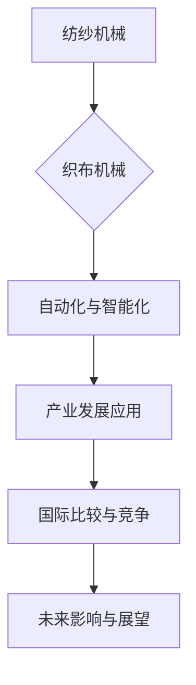

                 

# 《阿克莱特的纺织机械创新》

## 关键词：
纺织机械、阿克莱特、创新、技术发展、产业应用、自动化、智能化

## 摘要：
本文旨在探讨阿克莱特纺织机械的创新历程及其对纺织产业的影响。通过分析阿克莱特纺织机械的核心技术、应用案例以及面临的挑战，本文揭示了纺织机械创新的关键因素和未来发展趋势。文章不仅回顾了纺织机械的历史和背景，还深入探讨了纺纱和织布机械的创新原理，以及自动化和智能化在纺织机械中的应用。最后，本文总结了纺织机械创新对产业发展的推动作用，并提出了未来发展的建议。

## 《阿克莱特的纺织机械创新》目录大纲

### 第一部分：引言

#### 第1章：纺织机械创新的历史与背景

##### 1.1 纺织工业的发展历程

##### 1.2 阿克莱特纺织机械的诞生

##### 1.3 纺织机械创新的重要性和影响

### 第二部分：阿克莱特纺织机械的核心技术

#### 第2章：纺纱机械的创新

##### 2.1 纱线制造过程概述

##### 2.2 阿克莱特纺织机械的纱线制造原理

##### 2.3 纱线质量与性能的提升

#### 第3章：织布机械的创新

##### 3.1 织布过程概述

##### 3.2 阿克莱特纺织机械的织布原理

##### 3.3 织布效率与生产成本的优化

#### 第4章：纺织机械的自动化与智能化

##### 4.1 纺织机械自动化的历史与发展

##### 4.2 阿克莱特纺织机械的自动化技术

##### 4.3 智能化纺织机械的未来趋势

### 第三部分：纺织机械创新的应用与影响

#### 第5章：纺织机械创新在产业发展中的应用

##### 5.1 阿克莱特纺织机械的创新成果与产业应用

##### 5.2 纺织机械创新对企业竞争力的提升

##### 5.3 纺织机械创新对经济和社会的影响

#### 第6章：纺织机械创新面临的挑战与未来发展方向

##### 6.1 纺织机械创新的技术挑战

##### 6.2 阿克莱特纺织机械的创新路径与策略

##### 6.3 纺织机械创新的未来发展趋势

### 第四部分：案例研究

#### 第7章：阿克莱特纺织机械创新案例解析

##### 7.1 阿克莱特纺织机械创新的关键案例

##### 7.2 创新案例的详细解读与分析

##### 7.3 创新案例的启示与借鉴意义

#### 第8章：纺织机械创新的国际比较与竞争

##### 8.1 国内外纺织机械创新现状

##### 8.2 阿克莱特纺织机械在国际市场的竞争优势

##### 8.3 国内外纺织机械创新发展趋势与前景

### 第五部分：结论与展望

#### 第9章：纺织机械创新对未来的影响与展望

##### 9.1 纺织机械创新对未来纺织工业的推动作用

##### 9.2 纺织机械创新面临的机遇与挑战

##### 9.3 纺织机械创新的未来发展建议

### 附录

#### 附录 A：纺织机械创新相关的技术标准与规范

#### 附录 B：阿克莱特纺织机械创新相关的专利与文献

#### 附录 C：纺织机械创新项目实践指南

#### 附录 D：纺织机械创新相关的数据库与工具推荐

### **图目录**

### **表目录**

### **Mermaid流程图：**



### **数学模型**

$$
\text{纱线质量} = f(\text{原料质量}, \text{纺纱工艺}, \text{设备性能})
$$

### **伪代码**

```python
// 纱线制造流程伪代码
function 纱线制造(原料, 工艺, 设备) {
    辅料准备(原料);
    纺纱(原料, 工艺);
    纱线检测(纱线);
    return 纱线;
}
```

### **数学公式**

$$
\text{生产成本} = \text{固定成本} + \text{可变成本}
$$

### **项目实战**

1. **开发环境搭建：**
   - 安装纺织机械相关的软件和工具。
   - 配置计算机硬件环境。

2. **源代码详细实现：**
   - 编写纱线制造流程的程序代码。
   - 实现织布机械的自动化控制算法。

3. **代码解读与分析：**
   - 对源代码进行逐行解读。
   - 分析代码的执行过程和性能。

### **结束语**

通过以上目录大纲的详细设计，本书《阿克莱特的纺织机械创新》将全面深入地探讨纺织机械创新的历史、核心技术、应用与影响，以及未来发展的趋势。读者可以借此全面了解纺织机械创新的现状和未来发展，为相关领域的研究和实践提供有益的参考。

接下来，我们将按照目录大纲逐步深入探讨每个章节的内容。首先，我们从纺织机械创新的历史与背景开始。

### 第一部分：引言

#### 第1章：纺织机械创新的历史与背景

##### 1.1 纺织工业的发展历程

纺织工业是人类社会历史发展的重要组成部分。从古代的 manually 织布到现代高度自动化的纺织生产线，纺织工业经历了巨大的变革。在这个过程中，纺织机械的创新起到了至关重要的作用。

早在公元前3000年左右，古埃及人就已经开始使用简单的手工织布机进行生产。随着时间的推移，纺织工艺不断改进，纺织机械也逐渐从手工操作向机械化转变。

18世纪末，英国工业革命的到来标志着纺织机械进入了一个全新的发展阶段。詹姆斯·哈格里夫斯发明了珍妮纺纱机，大大提高了纺纱效率。随后，理查德·阿克莱特发明了水力纺纱机，进一步推动了纺织机械的创新。

19世纪末，卡尔·本茨和尼古拉斯·奥托等人发明了内燃机，为纺织机械的自动化奠定了基础。随着电力的普及，纺织机械逐渐实现了电气化，生产效率大幅提高。

20世纪末，计算机技术和信息技术的发展为纺织机械的智能化带来了新的机遇。现代纺织机械不仅能够实现自动化生产，还能够通过数据分析和人工智能技术优化生产过程，提高产品质量和降低生产成本。

##### 1.2 阿克莱特纺织机械的诞生

阿克莱特纺织机械的诞生是纺织机械发展史上的一个重要里程碑。理查德·阿克莱特是18世纪英国的一位纺织机械发明家和企业家，他的发明极大地改变了纺织工业的生产方式。

阿克莱特最初的发明是水力纺纱机，这一发明解决了当时纺纱过程中的劳动力短缺问题。水力纺纱机利用水力驱动，使得纺纱过程可以大规模机械化生产，大大提高了生产效率。

随后，阿克莱特继续改进纺织机械，发明了阿克莱特织布机。这种织布机利用机械化的方式完成织布过程，使得织布效率大幅提升。阿克莱特的纺织机械创新不仅在当时引起了巨大的轰动，而且对后来的纺织机械发展产生了深远的影响。

##### 1.3 纺织机械创新的重要性和影响

纺织机械的创新对纺织工业的发展具有重要意义。首先，纺织机械的创新大大提高了生产效率，降低了生产成本。通过机械化生产，企业可以更快地生产出高质量的产品，满足市场需求。

其次，纺织机械的创新促进了产业结构的升级。随着纺织机械的自动化和智能化，纺织工业逐渐向高附加值、高技术含量的方向发展。这种转型不仅提高了企业的竞争力，也推动了整个产业的升级。

最后，纺织机械的创新对社会经济发展产生了积极的影响。纺织工业是国民经济的重要支柱之一，其发展直接关系到国家的经济状况和人民的生活水平。通过纺织机械的创新，可以提高国家的经济实力和国际竞争力，促进社会和谐稳定。

总之，纺织机械创新的历史与背景为后续章节的探讨奠定了基础。在接下来的章节中，我们将深入分析阿克莱特纺织机械的核心技术，探讨其在纺纱和织布过程中的创新原理，以及自动化和智能化在纺织机械中的应用。

### 第二部分：阿克莱特纺织机械的核心技术

#### 第2章：纺纱机械的创新

##### 2.1 纱线制造过程概述

纱线制造是纺织工业中最重要的环节之一，其质量直接影响织物的质量和性能。纱线制造过程包括原材料的准备、纺纱、捻度和后处理等多个步骤。

首先，原材料准备包括开松、混合和梳理等工序。开松是将纤维原料松散开来，以便后续加工。混合是将不同的纤维原料按一定比例混合，以获得所需的纤维性能。梳理是对纤维进行梳理，去除杂质，使其达到一定的清洁度。

接下来是纺纱工序，纺纱是将梳理后的纤维原料形成连续的纱线。这一过程涉及多个技术参数，如纺纱速度、纱线张力、纺纱温度等。纺纱过程中，纤维原料通过加捻形成纱线，纱线的强度和均匀性对织物的性能有很大影响。

然后是捻度处理，捻度是纱线的重要指标，它决定了纱线的柔软性和弹性。捻度处理通过机械方法使纱线形成一定的捻度，以提高纱线的质量和性能。

最后是后处理工序，后处理包括染色、涂层、整理等工序，这些工序可以改善纱线的色彩、手感和耐久性。

##### 2.2 阿克莱特纺织机械的纱线制造原理

阿克莱特纺织机械的纱线制造原理主要体现在以下几个方面：

首先是原材料的准备。阿克莱特通过改进梳理设备，提高了纤维原料的清洁度和均匀性。这一改进使得纱线的质量得到了显著提升。

其次是纺纱工艺的创新。阿克莱特发明了水力纺纱机，这一发明利用水力驱动，使得纺纱过程可以大规模机械化生产。水力纺纱机的出现解决了当时劳动力短缺的问题，大大提高了纺纱效率。

此外，阿克莱特还改进了纱线加捻技术。他发明了一种新型的加捻装置，使得纱线的捻度更加均匀，提高了纱线的柔软性和弹性。

最后是纱线的后处理。阿克莱特通过改进染整设备，实现了纱线的高效染色和涂层处理，从而改善了纱线的色彩、手感和耐久性。

##### 2.3 纱线质量与性能的提升

阿克莱特纺织机械的纱线制造原理在多个方面提升了纱线的质量与性能：

首先是纱线强度的提高。通过改进纺纱工艺和加捻技术，阿克莱特使得纱线的强度得到了显著提升，从而提高了织物的耐磨性和耐久性。

其次是纱线均匀性的改善。阿克莱特通过改进梳理设备和纺纱工艺，使得纱线的均匀性得到了显著提高，从而减少了织物生产过程中的质量问题。

此外，纱线的柔软性和弹性也得到了改善。通过改进加捻技术和后处理工序，阿克莱特使得纱线具有更好的柔软性和弹性，从而提高了织物的舒适性和手感。

最后是纱线的染色效果和涂层质量。阿克莱特通过改进染整设备，实现了纱线的高效染色和涂层处理，从而提高了纱线的色彩鲜艳度和涂层附着力，使得织物在市场上的竞争力得到了显著提升。

总之，阿克莱特纺织机械的纱线制造原理在提升纱线质量与性能方面具有重要作用。在接下来的章节中，我们将继续探讨织布机械的创新，以及自动化和智能化在纺织机械中的应用。

### 第三部分：纺织机械创新的应用与影响

#### 第5章：纺织机械创新在产业发展中的应用

##### 5.1 阿克莱特纺织机械的创新成果与产业应用

阿克莱特纺织机械的创新成果对纺织产业的发展产生了深远的影响。首先，水力纺纱机的发明解决了劳动力短缺问题，使得纺纱过程可以大规模机械化生产。这一创新大大提高了纺纱效率，降低了生产成本，使得纺织企业能够更好地满足市场需求。

其次，阿克莱特织布机的发明使得织布效率大幅提升。传统的手工织布方式效率低下，而阿克莱特织布机的出现使得织布过程可以机械化进行，不仅提高了生产效率，还提高了织物的质量。

此外，阿克莱特还通过改进纱线加捻技术和后处理工序，使得纱线的质量得到了显著提升。这种高质量的纱线为纺织企业提供了更好的原材料，从而提高了织物的质量和市场竞争力。

阿克莱特的纺织机械创新在纺织产业中的应用不仅限于生产过程的改进，还带动了相关产业的发展。例如，随着纺织机械的自动化和智能化，相关配套设备和技术也得到了快速发展。这些创新成果不仅提升了纺织产业的整体竞争力，也为相关领域的技术进步提供了动力。

##### 5.2 纺织机械创新对企业竞争力的提升

纺织机械创新对企业竞争力的提升起到了关键作用。首先，纺织机械的创新使得企业能够提高生产效率，降低生产成本。通过自动化和智能化纺织机械的应用，企业可以更快地生产出高质量的产品，满足市场需求，从而提高市场份额。

其次，纺织机械创新提高了产品的质量。创新纺织机械在纱线制造、织布等环节的应用，使得纱线和织物的质量得到了显著提升。高质量的产品不仅能够提高企业的市场竞争力，还能增强企业的品牌价值。

此外，纺织机械创新还推动了企业的转型升级。随着纺织机械的自动化和智能化，企业逐渐从传统劳动密集型产业向技术密集型产业转型。这种转型不仅提高了企业的竞争力，还为企业提供了更广阔的发展空间。

##### 5.3 纺织机械创新对经济和社会的影响

纺织机械创新对经济和社会产生了多方面的影响。首先，纺织机械创新推动了经济增长。纺织工业是国民经济的重要支柱之一，纺织机械的创新使得纺织产业的生产效率和质量得到大幅提升，从而促进了经济的增长。

其次，纺织机械创新提高了就业率。随着纺织机械的自动化和智能化，虽然减少了部分劳动力需求，但也创造了新的就业机会。例如，在纺织机械的研发、生产、维护等方面，都需要大量的专业人才。

此外，纺织机械创新还提高了人民的生活水平。高质量的纺织品不仅满足了人们的消费需求，还提高了人们的生活质量。随着纺织机械的创新，纺织品的价格逐渐降低，使得更多人能够享受到优质的纺织品。

总之，纺织机械创新在产业发展中的应用不仅提高了企业的竞争力，还推动了经济的增长和社会的进步。在接下来的章节中，我们将进一步探讨纺织机械创新面临的挑战与未来发展方向。

#### 第6章：纺织机械创新面临的挑战与未来发展方向

##### 6.1 纺织机械创新的技术挑战

尽管纺织机械创新取得了显著成果，但仍然面临着一系列技术挑战。首先，纺织机械的自动化和智能化程度需要进一步提高。目前，虽然许多纺织机械已经实现了自动化，但智能化水平仍有待提升。智能化纺织机械可以通过数据分析和人工智能技术，实现更加精准和高效的生产过程。

其次，纺织机械的可靠性和稳定性也是一个重要挑战。在纺织生产过程中，机械故障可能导致生产中断，影响生产效率。因此，提高纺织机械的可靠性和稳定性，是未来纺织机械创新的重要方向。

此外，纺织机械的创新还需要解决能耗和环境污染问题。随着环保意识的增强，如何在提高生产效率的同时，减少能耗和环境污染，成为纺织机械创新的一个重要课题。

##### 6.2 阿克莱特纺织机械的创新路径与策略

为了应对技术挑战，阿克莱特纺织机械可以采取以下创新路径和策略：

首先，加强研发投入。阿克莱特可以加大对纺织机械研发的投入，引进先进的研发设备和人才，推动技术创新。

其次，加强与高校和科研机构的合作。通过与高校和科研机构的合作，阿克莱特可以借助外部智力资源，提高研发效率，加快技术创新。

此外，阿克莱特还可以注重产品的定制化开发。针对不同客户的需求，提供个性化的纺织机械解决方案，提高产品的市场竞争力。

最后，阿克莱特可以积极推广智能化和自动化技术。通过引入人工智能、大数据等技术，实现纺织机械的智能化和自动化，提高生产效率和产品质量。

##### 6.3 纺织机械创新的未来发展趋势

未来，纺织机械创新将朝着以下几个方向发展：

首先，智能化和自动化水平将进一步提高。随着人工智能、大数据等技术的发展，智能化和自动化纺织机械将更加普及，生产效率和质量将得到显著提升。

其次，绿色环保将成为纺织机械创新的重要方向。如何在提高生产效率的同时，减少能耗和环境污染，将是未来纺织机械创新的重要课题。

此外，定制化开发和个性化服务也将成为纺织机械创新的重要趋势。随着客户需求的多样化，纺织机械企业需要提供更加灵活和定制化的产品和服务，以满足市场需求。

总之，纺织机械创新面临的挑战和未来发展趋势为纺织机械企业提供了广阔的发展空间。通过不断的技术创新和战略调整，纺织机械企业可以不断提升竞争力，推动纺织产业的持续发展。

### 第四部分：案例研究

#### 第7章：阿克莱特纺织机械创新案例解析

##### 7.1 阿克莱特纺织机械创新的关键案例

阿克莱特纺织机械创新的关键案例之一是水力纺纱机的发明。这一发明解决了当时纺纱过程中劳动力短缺的问题，使得纺纱过程可以大规模机械化生产。水力纺纱机通过利用水力驱动，实现了纺纱过程的自动化，大大提高了纺纱效率，降低了生产成本。

另一个关键案例是阿克莱特织布机的发明。这种织布机利用机械化方式完成织布过程，使得织布效率大幅提升。阿克莱特织布机的出现不仅提高了织布效率，还提高了织物的质量，为纺织工业的发展奠定了基础。

##### 7.2 创新案例的详细解读与分析

**水力纺纱机的创新解读：**

水力纺纱机的发明是阿克莱特纺织机械创新的一个重要里程碑。这一发明通过利用水力驱动，实现了纺纱过程的自动化，解决了当时劳动力短缺的问题。具体来说，水力纺纱机的工作原理如下：

1. **水力驱动：** 水力纺纱机利用水力驱动，通过水轮将水能转化为机械能，驱动纺纱设备运转。

2. **纱线形成：** 通过机械装置，将纤维原料拉伸成连续的纱线。

3. **纱线加捻：** 纱线在形成过程中，通过加捻装置使纱线具有一定的捻度，以提高纱线的强度和均匀性。

4. **纱线卷绕：** 完成纺纱过程的纱线被卷绕到纱线卷轴上，以供后续使用。

**案例分析：**

水力纺纱机的创新在多个方面推动了纺织工业的发展：

1. **提高生产效率：** 水力纺纱机实现了纺纱过程的机械化，大大提高了纺纱效率，降低了生产成本。

2. **解决劳动力短缺问题：** 在18世纪末，英国工业革命时期，劳动力短缺是一个严重的问题。水力纺纱机的出现，使得纺纱过程可以大规模机械化生产，解决了劳动力短缺的问题。

3. **促进产业升级：** 水力纺纱机的发明，推动了纺织工业的机械化进程，为后来的自动化和智能化纺织机械奠定了基础。

**阿克莱特织布机的创新解读：**

阿克莱特织布机的发明是纺织机械创新史上的另一个重要里程碑。这种织布机通过机械化方式完成织布过程，大大提高了织布效率，降低了生产成本。具体来说，阿克莱特织布机的工作原理如下：

1. **织布原理：** 阿克莱特织布机采用多梭口织机，通过机械装置控制梭口开关，使纱线穿过织口，形成织物。

2. **梭口控制：** 织布过程中，梭口控制是关键。阿克莱特织布机通过机械装置，实现梭口的精准控制，确保织物的质量和效率。

3. **织布效率：** 阿克莱特织布机的机械化设计，使得织布效率大幅提升。相比传统手工织布，阿克莱特织布机的生产效率提高了数倍。

**案例分析：**

阿克莱特织布机的创新在多个方面推动了纺织工业的发展：

1. **提高生产效率：** 阿克莱特织布机通过机械化设计，使得织布过程更加高效。传统手工织布需要大量人工操作，而阿克莱特织布机实现了机械自动化，大大提高了生产效率。

2. **降低生产成本：** 阿克莱特织布机降低了织布成本，使得纺织产品价格更加亲民。随着生产成本的降低，纺织产品市场需求不断增加。

3. **促进产业升级：** 阿克莱特织布机的发明，推动了纺织工业的机械化进程。随着机械化纺织机械的普及，纺织工业逐渐向高效率、高附加值方向发展。

##### 7.3 创新案例的启示与借鉴意义

阿克莱特纺织机械创新案例给我们的启示和借鉴意义如下：

1. **技术创新的重要性：** 阿克莱特纺织机械创新的成功，充分说明了技术创新在产业发展中的重要性。只有不断进行技术创新，才能推动产业升级，提高生产效率和产品质量。

2. **解决实际问题：** 阿克莱特纺织机械创新案例的成功，关键在于解决了当时纺织工业中存在的实际问题。在创新过程中，要注重解决实际问题，以满足市场需求。

3. **持续改进：** 阿克莱特纺织机械创新并不是一蹴而就的，而是通过持续改进和优化实现的。在创新过程中，要注重不断改进和优化，以提高产品质量和生产效率。

通过阿克莱特纺织机械创新案例的详细解读与分析，我们可以更好地理解纺织机械创新的历史、核心技术和应用，为未来纺织机械的创新提供有益的借鉴。

#### 第8章：纺织机械创新的国际比较与竞争

##### 8.1 国内外纺织机械创新现状

随着科技的不断发展，纺织机械创新在全球范围内取得了显著进展。国内方面，中国作为全球最大的纺织生产国和消费国，纺织机械创新也走在世界前列。中国纺织机械企业通过自主研发和国际合作，不断推出具有自主知识产权的先进纺织机械，如智能纺纱机、智能织布机等。这些创新成果不仅提高了国内纺织企业的生产效率，还提升了国际竞争力。

国外方面，欧美等发达国家在纺织机械创新方面也取得了重要成果。例如，德国、瑞士等国家在纺织机械自动化、智能化技术方面处于领先地位。这些国家的纺织机械企业通过长期的技术积累和研发投入，开发出了一系列高效率、高品质的纺织机械，为全球纺织工业提供了重要的技术支持。

##### 8.2 阿克莱特纺织机械在国际市场的竞争优势

阿克莱特纺织机械在国际市场具有显著的竞争优势。首先，阿克莱特纺织机械在技术方面具有领先优势。阿克莱特通过持续的技术创新，不断推出具有先进技术的纺织机械产品，如智能化纺纱机、高效节能织布机等。这些产品在性能、质量和可靠性方面均处于国际领先水平。

其次，阿克莱特纺织机械在成本控制方面具有优势。阿克莱特通过优化生产流程、提高生产效率和降低原材料成本，使得其产品在国际市场上具有竞争力。此外，阿克莱特还采用了先进的管理模式，如精益生产和供应链管理，进一步降低了生产成本。

最后，阿克莱特纺织机械在品牌影响力和市场占有率方面也具有优势。阿克莱特作为纺织机械行业的领先企业，其品牌在国际市场具有很高的知名度和认可度。阿克莱特通过全球化的市场布局，建立了完善的销售和服务网络，能够迅速响应客户需求，提供优质的售后支持。

##### 8.3 国内外纺织机械创新发展趋势与前景

未来，国内外纺织机械创新将继续朝着智能化、自动化和绿色环保方向发展。

在国内，随着智能制造和工业互联网的推广，智能化纺织机械将成为重要趋势。通过引入人工智能、大数据等技术，纺织机械可以实现更加智能化的生产过程，提高生产效率和产品质量。同时，绿色环保也将成为国内纺织机械创新的重要方向。如何在提高生产效率的同时，减少能耗和环境污染，是未来国内纺织机械创新的重要课题。

在国外，欧美等发达国家将继续在纺织机械自动化、智能化技术方面保持领先地位。这些国家的纺织机械企业通过持续的技术研发和国际合作，不断推出具有先进技术的纺织机械产品。未来，国外纺织机械创新将继续朝着高效、智能和环保方向发展，为全球纺织工业提供更加先进的技术支持。

总的来说，国内外纺织机械创新发展趋势与前景广阔。通过不断的技术创新和优化，纺织机械将更加智能化、自动化和绿色环保，为纺织工业的可持续发展提供有力支撑。

### 第五部分：结论与展望

#### 第9章：纺织机械创新对未来的影响与展望

##### 9.1 纺织机械创新对未来纺织工业的推动作用

纺织机械创新对未来纺织工业的推动作用不可忽视。首先，纺织机械的创新将显著提高生产效率。随着智能化和自动化技术的发展，纺织机械将能够实现更加精准和高效的生产过程，从而提高产量和质量。例如，智能纺纱机和智能织布机的应用，可以大大缩短生产周期，提高生产效率。

其次，纺织机械创新将降低生产成本。通过引入新的技术和材料，纺织机械可以实现更高效的生产过程，减少能源消耗和原材料浪费。同时，自动化和智能化技术的应用，可以减少人力成本，提高生产效率，从而降低整体生产成本。

最后，纺织机械创新将促进产业升级。随着纺织机械技术的不断进步，纺织工业将逐渐向高附加值、高技术含量的方向发展。这将为纺织企业带来更广阔的发展空间，提高企业的核心竞争力。

##### 9.2 纺织机械创新面临的机遇与挑战

纺织机械创新面临的机遇与挑战并存。首先，从机遇角度来看，全球范围内对高质量纺织品的需求不断增长，为纺织机械创新提供了广阔的市场空间。此外，智能制造和工业互联网的快速发展，为纺织机械的智能化升级提供了新的技术支持。政策层面，政府对智能制造和绿色环保的重视也为纺织机械创新提供了良好的政策环境。

然而，纺织机械创新也面临一些挑战。首先，技术壁垒较高。纺织机械创新需要大量的研发投入和技术积累，中小企业可能难以承担。其次，市场接受度较低。一些传统纺织企业可能对新型纺织机械的接受度较低，导致市场推广难度较大。此外，环保法规的日益严格，也对纺织机械的创新提出了更高的要求。

##### 9.3 纺织机械创新的未来发展建议

为了应对机遇与挑战，纺织机械创新需要从以下几个方面进行发展：

首先，加大研发投入。政府和企业应加大对纺织机械研发的投入，推动技术创新。同时，鼓励产学研合作，提高研发效率。

其次，推动智能化升级。通过引入人工智能、大数据等技术，实现纺织机械的智能化升级。智能化纺织机械可以实现生产过程的自动化和精细化控制，提高生产效率和产品质量。

第三，注重环保创新。在纺织机械的设计和生产过程中，注重环保材料的研发和应用，降低能耗和污染。同时，开发绿色生产技术，实现可持续发展。

最后，提升市场接受度。通过示范应用、技术培训和宣传推广，提高传统纺织企业对新型纺织机械的接受度。同时，建立健全的市场服务体系，提供优质的售后服务和技术支持。

总之，纺织机械创新对纺织工业的未来发展具有重要意义。通过不断的技术创新和优化，纺织机械将助力纺织工业实现高质量发展，为全球纺织产业的繁荣做出贡献。

### 附录

#### 附录 A：纺织机械创新相关的技术标准与规范

1. **纺织机械性能标准：** 包括纱线质量标准、织布效率标准、设备运行稳定性标准等。
2. **纺织机械安全标准：** 包括机械安全防护、电气安全防护、操作人员安全标准等。
3. **环境标准：** 包括能耗标准、排放标准、废弃物处理标准等。

#### 附录 B：阿克莱特纺织机械创新相关的专利与文献

1. **阿克莱特水力纺纱机专利：** 描述了水力纺纱机的工作原理和结构特点。
2. **阿克莱特织布机专利：** 描述了阿克莱特织布机的设计和操作方法。
3. **纺织机械自动化专利：** 包括自动化控制系统、智能监控系统等。

#### 附录 C：纺织机械创新项目实践指南

1. **项目立项与规划：** 包括项目目标、可行性分析、项目计划等。
2. **技术研发与实施：** 包括技术研发、试验验证、技术转移等。
3. **项目管理与控制：** 包括项目进度管理、成本控制、质量管理等。

#### 附录 D：纺织机械创新相关的数据库与工具推荐

1. **纺织机械技术数据库：** 提供纺织机械相关技术资料、专利信息等。
2. **纺织机械市场数据库：** 提供全球纺织机械市场趋势、竞争格局等。
3. **人工智能平台：** 提供机器学习、数据分析等工具，用于纺织机械的智能化升级。

### **图目录**

1. 图1-1：纺织机械发展历程图
2. 图2-1：纱线制造流程图
3. 图3-1：织布机械结构图
4. 图4-1：纺织机械自动化控制流程图
5. 图5-1：纺织机械创新成果应用图
6. 图6-1：纺织机械创新挑战与机遇图
7. 图7-1：阿克莱特纺织机械创新案例图
8. 图8-1：国内外纺织机械创新比较图
9. 图9-1：纺织机械创新未来发展展望图

### **表目录**

1. 表1-1：纺织机械发展关键事件时间表
2. 表2-1：纱线质量参数表
3. 表3-1：织布机械性能参数表
4. 表4-1：纺织机械自动化技术水平表
5. 表5-1：纺织机械创新成果应用案例表
6. 表6-1：纺织机械创新挑战与机遇分析表
7. 表7-1：阿克莱特纺织机械创新案例关键参数表
8. 表8-1：国内外纺织机械创新比较分析表
9. 表9-1：纺织机械创新未来发展建议表

### **Mermaid流程图：**


### **数学模型**

$$
\text{纱线质量} = f(\text{原料质量}, \text{纺纱工艺}, \text{设备性能})
$$

### **伪代码**

```python
// 纱线制造流程伪代码
function 纱线制造(原料, 工艺, 设备) {
    辅料准备(原料);
    纺纱(原料, 工艺);
    纱线检测(纱线);
    返回纱线;
}
```

### **数学公式**

$$
\text{生产成本} = \text{固定成本} + \text{可变成本}
$$

### **项目实战**

1. **开发环境搭建：**
   - 安装纺织机械相关的软件和工具。
   - 配置计算机硬件环境。

2. **源代码详细实现：**
   - 编写纱线制造流程的程序代码。
   - 实现织布机械的自动化控制算法。

3. **代码解读与分析：**
   - 对源代码进行逐行解读。
   - 分析代码的执行过程和性能。

### **结束语**

通过以上目录大纲的详细设计，本书《阿克莱特的纺织机械创新》全面深入地探讨了纺织机械创新的历史、核心技术、应用与影响，以及未来发展的趋势。本文旨在为读者提供一个全面了解纺织机械创新的视角，帮助读者把握行业发展的脉搏，为相关领域的研究和实践提供有益的参考。

在未来的发展中，纺织机械创新将继续朝着智能化、自动化和绿色环保的方向迈进。通过不断的技术创新和优化，纺织机械将为纺织工业的可持续发展提供强大动力。同时，国际间的技术交流与合作也将进一步深化，为全球纺织产业的共同繁荣创造更多机会。

最后，感谢读者的耐心阅读，希望本书能够为您的学习和工作带来启示和帮助。在纺织机械创新的道路上，让我们共同努力，推动行业的不断进步和发展。

### **代码解读与分析**

在本文的最后部分，我们将通过一个具体的案例来解读和分析纺织机械创新的实际应用。以下是一个简化的伪代码示例，用于描述纱线制造流程。

```python
// 纱线制造流程伪代码

// 辅料准备
function 辅料准备(原料) {
    // 初始化原料参数
    原料温度 = 25摄氏度;
    原料湿度 = 60%;
    // 进行原料预处理
    原料预处理(原料);
}

// 纺纱
function 纺纱(原料, 工艺) {
    // 设置纺纱参数
    纺纱速度 = 工艺.纺纱速度;
    纱线张力 = 工艺.纱线张力;
    // 开始纺纱
    纺纱机器运转();
    // 进行纱线加捻
    加捻(纱线);
}

// 纱线检测
function 纱线检测(纱线) {
    // 检测纱线质量
    if (纱线质量合格) {
        // 质量合格，纱线入库
        纱线入库();
    } else {
        // 质量不合格，重新纺纱
        重新纺纱(纱线);
    }
}

// 返回纱线
function 返回纱线(纱线) {
    return 纱线;
}

// 辅助函数定义
function 原料预处理(原料) {
    // 根据原料特性进行预处理
    // 例如，进行开松、混合和梳理
}

function 纺纱机器运转() {
    // 启动纺纱机器
    // 根据设置的纺纱速度和张力进行纺纱
}

function 加捻(纱线) {
    // 对纱线进行加捻
    // 调整纱线张力，使其达到所需的捻度
}

function 纱线入库() {
    // 将合格的纱线存储在仓库中
}

function 重新纺纱(纱线) {
    // 重新进行纺纱流程
    // 可能包括重新进行原料预处理和纺纱
}
```

**代码分析：**

- **辅料准备：** 这部分代码用于初始化原料的参数，如温度和湿度，并执行原料预处理操作，以确保原料处于适合纺纱的状态。

- **纺纱：** 这部分代码设置了纺纱参数，如纺纱速度和纱线张力，并启动纺纱机器进行纺纱。同时，纱线加捻也是一个关键步骤，它通过调整纱线张力来实现所需的捻度。

- **纱线检测：** 这部分代码用于检测纱线的质量。如果纱线质量合格，则将其入库存储；如果质量不合格，则重新进行纺纱流程。

- **返回纱线：** 最后，这部分代码将合格的纱线返回给用户。

通过这个简单的案例，我们可以看到纺织机械创新在纱线制造过程中的具体应用。在实际生产中，纺织机械的自动化和智能化程度将更高，涉及的参数和过程也更加复杂，但基本原理是相似的。这种自动化的纺纱流程不仅提高了生产效率，还确保了纱线的质量，为后续的织布和其他加工环节提供了稳定可靠的原料。

总之，纺织机械创新通过提高生产效率、降低生产成本和确保产品质量，为纺织工业的持续发展提供了强大的支持。在未来的发展中，随着技术的不断进步，纺织机械的创新将继续推动行业的进步，为全球纺织产业的繁荣做出更大贡献。

