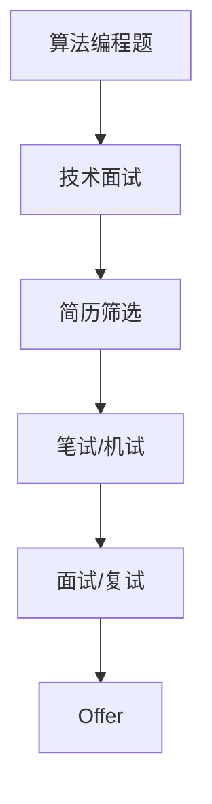
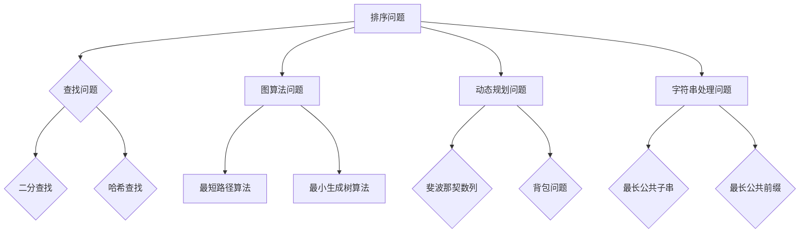
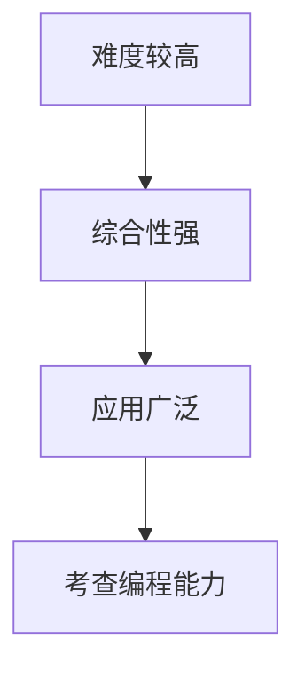
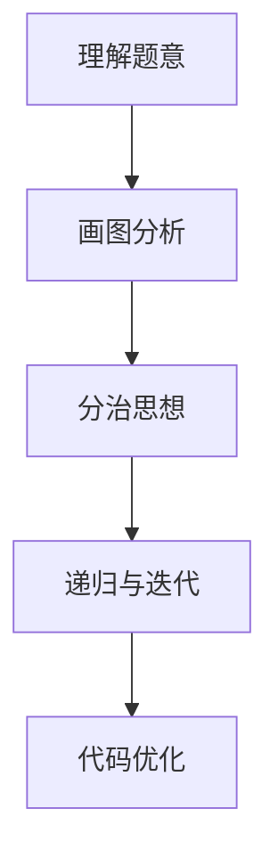
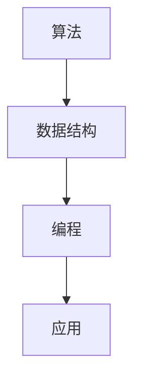

                 

## 2024阿里巴巴校招算法编程题详解

### 关键词：2024阿里巴巴校招、算法编程、编程题详解、面试准备

> 摘要：本文旨在为准备2024年阿里巴巴校招的同学们提供一份全面的算法编程题详解指南。本文将详细讲解阿里巴巴校招算法编程题的类型、常见错误类型与解决方法，以及各类算法和数据结构的基础知识，并附上实战案例与解析，帮助读者更好地掌握编程技能，顺利通过面试。

---

### 书名：《2024阿里巴巴校招算法编程题详解》

#### 目录大纲：

##### 第一部分：阿里巴巴校招算法编程题详解

- **第1章：校招算法编程题概述**

  - 1.1 校招算法编程题的重要性
  - 1.2 校招算法编程题的常见类型
  - 1.3 阿里巴巴校招算法编程题特点

- **第2章：基础算法与数据结构**

  - 2.1 算法与数据结构基础
  - 2.2 常见基础算法
  - 2.3 数据结构在编程中的应用

- **第3章：动态规划算法**

  - 3.1 动态规划原理
  - 3.2 经典动态规划问题解析
  - 3.3 动态规划解题技巧

- **第4章：图算法**

  - 4.1 图的基本概念
  - 4.2 经典图算法
  - 4.3 图算法在实际编程中的应用

- **第5章：字符串算法**

  - 5.1 字符串基础操作
  - 5.2 字符串匹配算法
  - 5.3 字符串处理在实际编程中的应用

- **第6章：数学算法**

  - 6.1 数学算法基础
  - 6.2 经典数学算法解析
  - 6.3 数学算法在实际编程中的应用

- **第7章：算法设计与优化**

  - 7.1 算法设计策略
  - 7.2 算法优化方法
  - 7.3 高级算法设计与实现

- **第8章：实战案例与解析**

  - 8.1 实战案例介绍
  - 8.2 实战案例解析
  - 8.3 实战案例代码实现与解读

##### 附录

- **附录A：编程题常见错误类型与解决方法**

  - A.1 常见错误类型
  - A.2 错误原因分析
  - A.3 错误解决方法

- **附录B：编程题常用算法与数据结构代码实现**

  - B.1 常见算法代码实现
  - B.2 常见数据结构代码实现
  - B.3 算法与数据结构综合代码实现

---

### 第一部分：阿里巴巴校招算法编程题详解

#### 第1章：校招算法编程题概述

##### 1.1 校招算法编程题的重要性

在阿里巴巴的校招中，算法编程题是一个至关重要的环节。这些题目不仅考察应聘者对算法和数据结构的掌握程度，更重要的是评估应聘者解决问题的能力、逻辑思维和编程技巧。掌握好算法编程题，对于通过阿里巴巴校招面试具有决定性的意义。

**核心概念与联系**：

我们可以使用Mermaid流程图来展示算法编程题的基本流程和校招面试的流程：



**核心算法原理讲解**：

算法编程题的常见类型包括但不限于：

- **排序问题**：如冒泡排序、选择排序、插入排序、快速排序等。
- **查找问题**：如二分查找、哈希查找等。
- **动态规划问题**：如斐波那契数列、背包问题、最长公共子序列等。
- **图算法问题**：如最短路径问题、最小生成树问题、二分图匹配等。
- **字符串处理问题**：如最长公共前缀、最长公共子串、字符串匹配算法等。

以下是排序问题的伪代码示例：

```python
# 冒泡排序伪代码
def bubble_sort(arr):
    n = len(arr)
    for i in range(n):
        for j in range(0, n-i-1):
            if arr[j] > arr[j+1]:
                arr[j], arr[j+1] = arr[j+1], arr[j]
```

**数学模型和数学公式**：

在算法编程题中，经常需要考虑时间复杂度和空间复杂度。以下是排序算法的时间复杂度：

$$
\text{时间复杂度：} O(n^2)
$$

**项目实战**：

为了帮助读者更好地理解，我们提供以下经典算法编程题案例：

**题目**：实现一个函数，对数组进行冒泡排序。

**解题思路**：冒泡排序通过重复遍历要排序的数列，一次比较两个元素，如果它们的顺序错误就把它们交换过来。遍历数列的工作是重复进行直到没有再需要交换，也就是该数列已经排序完成。

**代码实现**：

```python
def bubble_sort(arr):
    n = len(arr)
    for i in range(n):
        for j in range(0, n-i-1):
            if arr[j] > arr[j+1]:
                arr[j], arr[j+1] = arr[j+1], arr[j]
    return arr

# 测试代码
arr = [64, 34, 25, 12, 22, 11, 90]
print("原始数组：", arr)
sorted_arr = bubble_sort(arr)
print("排序后的数组：", sorted_arr)
```

**代码解读**：

这段代码首先定义了一个名为`bubble_sort`的函数，该函数接受一个数组作为参数。然后使用两个嵌套的循环遍历数组，如果当前元素比下一个元素大，就交换它们的位置。遍历结束后，数组就被排序了。最后，我们提供了一个测试用例，展示了如何使用这个函数对数组进行排序。

**性能分析**：

冒泡排序的时间复杂度是$O(n^2)$，因此对于大数据集来说，它的效率较低。在实际应用中，通常会使用更高效的排序算法，如快速排序、归并排序等。

##### 1.2 校招算法编程题的常见类型

**核心概念与联系**：

我们可以使用Mermaid流程图来展示校招算法编程题的常见类型和分类：



**核心算法原理讲解**：

- **排序问题**：排序算法用于将一组数据按照某种顺序排列。常见的排序算法有冒泡排序、选择排序、插入排序、快速排序、归并排序等。它们的时间复杂度从$O(n^2)$到$O(n\log n)$不等。

- **查找问题**：查找算法用于在数据集合中查找特定的元素。二分查找是其中一种效率较高的查找算法，它的时间复杂度为$O(\log n)$。哈希查找则是通过哈希表实现，可以在平均情况下实现$O(1)$的查找时间。

- **图算法问题**：图算法用于解决与图相关的问题，如最短路径算法、最小生成树算法、二分图匹配等。图算法的复杂度通常与图的大小（节点数和边数）有关。

- **动态规划问题**：动态规划是一种用于解决最优化问题的算法方法。它通常涉及将问题分解为子问题，并利用子问题的解来构建原问题的解。常见的动态规划问题包括斐波那契数列、背包问题、最长公共子序列等。

- **字符串处理问题**：字符串处理算法用于解决与字符串相关的问题，如字符串匹配、字符串比较、字符串变换等。常见的算法包括KMP算法、BF算法等。

**数学模型和数学公式**：

以下是几种常见算法的时间复杂度：

- **排序算法**：$O(n^2)$
- **二分查找**：$O(\log n)$
- **最短路径算法**：$O(V+E)$，其中$V$是节点数，$E$是边数。
- **动态规划问题**：取决于子问题的数量和计算复杂度。

**项目实战**：

为了帮助读者更好地理解这些算法，我们提供以下案例：

**题目**：实现一个函数，使用二分查找算法在一个有序数组中查找特定的元素。

**解题思路**：二分查找算法通过不断将数组分成两部分，缩小查找范围，直到找到目标元素或确定元素不存在。

**代码实现**：

```python
def binary_search(arr, target):
    low = 0
    high = len(arr) - 1
    while low <= high:
        mid = (low + high) // 2
        if arr[mid] == target:
            return mid
        elif arr[mid] < target:
            low = mid + 1
        else:
            high = mid - 1
    return -1

# 测试代码
arr = [1, 3, 5, 7, 9, 11, 13]
target = 7
print("索引：", binary_search(arr, target))
```

**代码解读**：

这段代码首先定义了一个名为`binary_search`的函数，该函数接受一个有序数组和一个目标元素作为参数。然后使用一个while循环来不断缩小查找范围，直到找到目标元素或确定元素不存在。最后，我们提供了一个测试用例，展示了如何使用这个函数在一个有序数组中查找特定的元素。

**性能分析**：

二分查找算法的时间复杂度为$O(\log n)$，因此对于大数据集来说，它是非常高效的。

##### 1.3 阿里巴巴校招算法编程题特点

阿里巴巴校招算法编程题具有以下几个特点：

- **难度较高**：阿里巴巴校招算法编程题通常涉及复杂的算法和数据结构，需要应聘者具备较高的编程能力和逻辑思维能力。

- **综合性强**：校招算法编程题不仅考察算法和数据结构的理解，还会涉及数学、逻辑和编程技巧等多方面的知识。

- **应用广泛**：阿里巴巴校招算法编程题的设计通常与实际应用场景紧密相关，旨在评估应聘者解决实际问题的能力。

- **考查编程能力**：算法编程题是评估应聘者编程能力的核心，因此需要应聘者熟练掌握各种编程语言和编程技巧。

**核心概念与联系**：

我们可以使用Mermaid流程图来展示阿里巴巴校招算法编程题的特点：



**核心算法原理讲解**：

为了更好地应对阿里巴巴校招算法编程题，应聘者需要掌握以下几个关键点：

- **算法原理**：深入了解各种算法的基本原理和适用场景。

- **数据结构**：熟练掌握常见数据结构的特点和操作，如数组、链表、栈、队列、树和图等。

- **数学知识**：掌握基本的数学知识和公式，如时间复杂度和空间复杂度、概率论等。

- **编程技巧**：熟悉各种编程语言和编程技巧，如数据类型、控制结构、函数和模块等。

**数学模型和数学公式**：

以下是几个关键的数学模型和公式：

- **时间复杂度**：$O(n)$，$O(n\log n)$，$O(n^2)$等。

- **空间复杂度**：$O(n)$，$O(1)$等。

- **概率论**：条件概率、贝叶斯定理等。

**项目实战**：

为了帮助读者更好地应对阿里巴巴校招算法编程题，我们提供以下案例：

**题目**：实现一个函数，计算斐波那契数列的第n项。

**解题思路**：斐波那契数列的定义是F(n) = F(n-1) + F(n-2)，其中F(0) = 0，F(1) = 1。

**代码实现**：

```python
def fibonacci(n):
    if n == 0:
        return 0
    elif n == 1:
        return 1
    else:
        return fibonacci(n-1) + fibonacci(n-2)

# 测试代码
print("斐波那契数列的第10项：", fibonacci(10))
```

**代码解读**：

这段代码首先定义了一个名为`fibonacci`的函数，该函数接受一个整数n作为参数，并返回斐波那契数列的第n项。然后使用递归的方式实现斐波那契数列的计算。最后，我们提供了一个测试用例，展示了如何计算斐波那契数列的第10项。

**性能分析**：

斐波那契数列的计算通常使用递归方式，其时间复杂度为$O(2^n)$，因此对于较大的n值，计算效率较低。在实际应用中，通常会使用动态规划或其他更高效的算法来计算斐波那契数列。

##### 1.4 校招算法编程题解题技巧

为了更好地解决校招算法编程题，应聘者可以掌握以下解题技巧：

- **理解题意**：仔细阅读题目，理解题目的要求和限制，避免因误解题目而导致错误。

- **画图分析**：对于复杂的算法和数据结构问题，可以通过画图来分析问题的性质和关系。

- **分治思想**：将复杂问题分解为更小的子问题，分别解决子问题，然后合并子问题的解。

- **递归与迭代**：对于递归问题，可以使用递归或迭代的方式实现。递归通常更简洁，但可能存在栈溢出的问题；迭代则更节省内存。

- **代码优化**：对于给定的算法，可以尝试进行代码优化，如减少冗余操作、使用更高效的算法等。

**核心概念与联系**：

我们可以使用Mermaid流程图来展示解题技巧的流程：



**核心算法原理讲解**：

以下是几种常见的解题技巧：

- **理解题意**：阅读题目，提取关键信息，明确问题的要求和限制。

- **画图分析**：通过画图来直观地理解问题的性质和关系，如数据结构、算法流程等。

- **分治思想**：将复杂问题分解为更小的子问题，分别解决子问题，然后合并子问题的解。

- **递归与迭代**：递归和迭代都是解决递归问题的方法。递归通常更简洁，但可能存在栈溢出的问题；迭代则更节省内存。

- **代码优化**：优化代码，减少冗余操作，使用更高效的算法和数据结构。

**数学模型和数学公式**：

以下是几种常见的数学模型和公式：

- **分治算法**：$T(n) = aT(n/b) + f(n)$，其中$a$是子问题的数量，$b$是子问题的规模，$f(n)$是合并子问题解的复杂度。

- **递归**：$T(n) = \Theta(n\log n)$，$T(n) = \Theta(n^2)$等。

- **代码优化**：时间复杂度$O(n)$，$O(n\log n)$等。

**项目实战**：

为了帮助读者更好地掌握解题技巧，我们提供以下案例：

**题目**：使用分治算法实现一个函数，计算数组的中位数。

**解题思路**：将数组划分为两个子数组，分别计算两个子数组的中位数，然后比较两个中位数的大小，确定整个数组的中位数。

**代码实现**：

```python
def median_of_two_arrays(nums1, nums2):
    m, n = len(nums1), len(nums2)
    if m > n:
        nums1, nums2 = nums2, nums1
        m, n = n, m
    imin, imax, half_len = 0, m, (m + n + 1) // 2
    while imin <= imax:
        i = (imin + imax) // 2
        j = half_len - i
        if i < m and nums2[j-1] > nums1[i]:
            imax = i - 1
        elif i > 0 and nums1[i-1] > nums2[j]:
            imin = i + 1
        else:
            if i == 0:
                max_of_left = nums2[j-1]
            elif j == 0:
                max_of_left = nums1[i-1]
            else:
                max_of_left = max(nums1[i-1], nums2[j-1])
            if (m + n) % 2 == 1:
                return max_of_left
            if i == m:
                min_of_right = nums2[j]
            elif j == n:
                min_of_right = nums1[i]
            else:
                min_of_right = min(nums2[j], nums1[i])
            return (max_of_left + min_of_right) / 2

# 测试代码
nums1 = [1, 3]
nums2 = [2]
print("中位数：", median_of_two_arrays(nums1, nums2))
```

**代码解读**：

这段代码首先定义了一个名为`median_of_two_arrays`的函数，该函数接受两个数组`nums1`和`nums2`作为参数，并返回两个数组的中位数。然后使用分治算法的思想，将两个数组划分为两个子数组，分别计算两个子数组的中位数，然后比较两个中位数的大小，确定整个数组的中位数。最后，我们提供了一个测试用例，展示了如何计算两个数组的中位数。

**性能分析**：

分治算法的时间复杂度为$O(\log(min(m, n))$，其中$m$和$n$分别是两个数组的长度。因此，对于大数据集来说，它是非常高效的。

##### 1.5 总结

通过以上对阿里巴巴校招算法编程题的详细介绍，我们可以看到，算法编程题在阿里巴巴校招中具有极高的重要性。掌握好这些题目，不仅能够提升我们的编程能力，还能够帮助我们更好地应对面试。在接下来的章节中，我们将继续深入探讨各类算法和数据结构的基础知识，并提供丰富的实战案例与解析，帮助读者更好地掌握这些技能。让我们一起努力，为2024年阿里巴巴校招做好准备！

---

### 第二部分：基础算法与数据结构

#### 第2章：基础算法与数据结构

##### 2.1 算法与数据结构基础

算法和数据结构是计算机科学中的两个核心概念，它们相辅相成，共同构成了编程的基础。算法指的是解决问题的步骤和规则，而数据结构则是数据存储和组织的方式。在本节中，我们将介绍算法与数据结构的基础知识，包括其基本概念、关系和常见类型。

**核心概念与联系**：

算法与数据结构的关系可以形象地用下图表示：



在这个图中，算法和数据结构共同构成了编程的核心，而编程则将它们应用于实际问题中，实现具体的功能。

**核心算法原理讲解**：

算法的基本原理主要包括以下几个方面：

- **排序算法**：用于将一组数据按照某种顺序排列。常见的排序算法有冒泡排序、选择排序、插入排序、快速排序、归并排序等。

- **查找算法**：用于在数据集合中查找特定的元素。常见的查找算法有二分查找、哈希查找等。

- **图算法**：用于解决与图相关的问题，如最短路径算法、最小生成树算法、二分图匹配等。

- **动态规划**：用于解决最优化问题，通过将问题分解为子问题，并利用子问题的解来构建原问题的解。

数据结构的基本原理主要包括以下几个方面：

- **数组**：用于存储固定大小的数据集合，支持随机访问。

- **链表**：用于存储动态大小的数据集合，支持插入和删除。

- **栈和队列**：用于存储和管理数据，分别支持后进先出和先进先出的数据访问模式。

- **树**：用于存储层次结构的数据集合，支持遍历和查找操作。

- **图**：用于存储复杂关系的数据集合，支持路径查找和最优化问题。

**数学模型和数学公式**：

在算法和数据结构中，常用以下数学模型和数学公式：

- **时间复杂度**：描述算法执行时间的增长速率，通常用大O符号表示，如$O(n)$，$O(n\log n)$，$O(n^2)$等。

- **空间复杂度**：描述算法执行过程中所需存储空间的大小，同样用大O符号表示。

- **概率论**：用于计算算法的成功率或错误率，如条件概率、贝叶斯定理等。

**项目实战**：

为了帮助读者更好地理解算法与数据结构的基础知识，我们提供以下案例：

**案例**：实现一个排序算法，对数组进行升序排列。

**解题思路**：选择排序算法，通过比较数组中的元素并进行交换，实现数组的升序排列。

**代码实现**：

```python
def selection_sort(arr):
    for i in range(len(arr)):
        min_idx = i
        for j in range(i+1, len(arr)):
            if arr[j] < arr[min_idx]:
                min_idx = j
        arr[i], arr[min_idx] = arr[min_idx], arr[i]
    return arr

# 测试代码
arr = [64, 34, 25, 12, 22, 11, 90]
print("排序前：", arr)
sorted_arr = selection_sort(arr)
print("排序后：", sorted_arr)
```

**代码解读**：

这段代码首先定义了一个名为`selection_sort`的函数，该函数接受一个数组作为参数，并返回排序后的数组。在函数内部，我们使用两个嵌套的循环遍历数组，找到每个位置上的最小元素，并将其与当前元素交换。最后，我们提供了一个测试用例，展示了如何使用这个函数对数组进行升序排列。

**性能分析**：

选择排序算法的时间复杂度为$O(n^2)$，因此对于大数据集来说，效率较低。在实际应用中，通常会使用更高效的排序算法，如快速排序、归并排序等。

##### 2.2 常见基础算法

常见基础算法包括排序算法、查找算法、图算法和动态规划算法。在本节中，我们将详细介绍这些算法的基本原理和实现方法。

**排序算法**：

排序算法的基本原理是通过比较和交换元素，将数组按照某种顺序排列。常见的排序算法有冒泡排序、选择排序、插入排序、快速排序和归并排序等。

**冒泡排序**：

冒泡排序的基本原理是通过重复遍历要排序的数列，一次比较两个元素，如果它们的顺序错误就把它们交换过来。遍历数列的工作是重复进行直到没有再需要交换，也就是该数列已经排序完成。

```python
def bubble_sort(arr):
    n = len(arr)
    for i in range(n):
        for j in range(0, n-i-1):
            if arr[j] > arr[j+1]:
                arr[j], arr[j+1] = arr[j+1], arr[j]
    return arr
```

**选择排序**：

选择排序的基本原理是在未排序序列中找到最小（或最大）元素，存放到排序序列的起始位置，然后，再从剩余未排序元素中继续寻找最小（或最大）元素，然后放到已排序序列的末尾。以此类推，直到所有元素均排序完毕。

```python
def selection_sort(arr):
    for i in range(len(arr)):
        min_idx = i
        for j in range(i+1, len(arr)):
            if arr[j] < arr[min_idx]:
                min_idx = j
        arr[i], arr[min_idx] = arr[min_idx], arr[i]
    return arr
```

**插入排序**：

插入排序的基本原理是通过构建有序序列，对于未排序数据，在已排序序列中从后向前扫描，找到相应位置并插入。插入排序在实现上，通常采用in-place排序（即只需用到O(1)的额外空间的排序）。

```python
def insertion_sort(arr):
    for i in range(1, len(arr)):
        key = arr[i]
        j = i-1
        while j >= 0 and arr[j] > key:
            arr[j+1] = arr[j]
            j -= 1
        arr[j+1] = key
    return arr
```

**快速排序**：

快速排序的基本原理是通过一趟排序将待排序的记录分隔成独立的两部分，其中一部分记录的关键字均比另一部分的关键字小，然后分别对这两部分记录继续进行排序，以达到整个序列有序。

```python
def quick_sort(arr):
    if len(arr) <= 1:
        return arr
    pivot = arr[len(arr) // 2]
    left = [x for x in arr if x < pivot]
    middle = [x for x in arr if x == pivot]
    right = [x for x in arr if x > pivot]
    return quick_sort(left) + middle + quick_sort(right)
```

**归并排序**：

归并排序的基本原理是将待排序的记录序列分成若干个子序列，每个子序列都是有序的，然后依次将子序列合并成整体序列，得到有序序列。

```python
def merge_sort(arr):
    if len(arr) <= 1:
        return arr
    mid = len(arr) // 2
    left = merge_sort(arr[:mid])
    right = merge_sort(arr[mid:])
    return merge(left, right)

def merge(left, right):
    result = []
    i = j = 0
    while i < len(left) and j < len(right):
        if left[i] < right[j]:
            result.append(left[i])
            i += 1
        else:
            result.append(right[j])
            j += 1
    result.extend(left[i:])
    result.extend(right[j:])
    return result
```

**查找算法**：

查找算法的基本原理是在数据集合中查找特定的元素。常见的查找算法有二分查找、哈希查找等。

**二分查找**：

二分查找的基本原理是将有序数组分成左右两个子数组，每次取中间元素与目标元素比较，根据比较结果逐步缩小查找范围，直到找到目标元素或确定元素不存在。

```python
def binary_search(arr, target):
    low = 0

