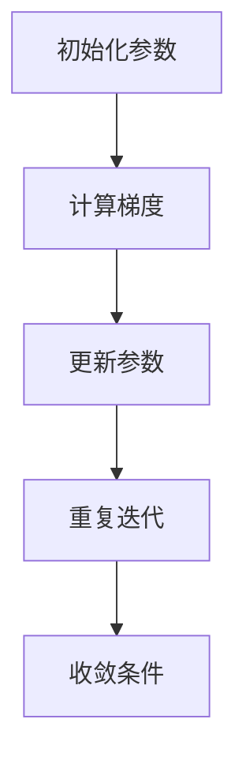
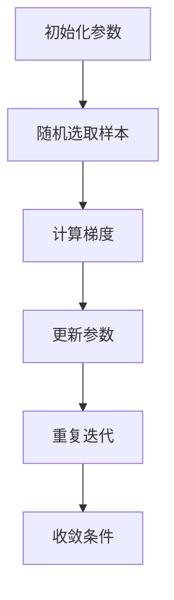

                 

### 《随机梯度下降SGD原理与代码实例讲解》

> **关键词：** 随机梯度下降，SGD，机器学习，优化算法，代码实例

> **摘要：** 本文将深入探讨随机梯度下降（SGD）算法的基本原理、数学模型以及在实际项目中的应用。文章将涵盖SGD的优缺点、改进方法、Python环境搭建、具体实例以及未来发展趋势。通过详细讲解和代码实例，帮助读者理解并掌握SGD算法的核心内容。

----------------------------------------------------------------

### 《随机梯度下降SGD原理与代码实例讲解》目录大纲

----------------------------------------------------------------

# 第一部分: SGD基础理论

## 第1章: 梯度下降算法概述

### 1.1 梯度下降算法的基本概念

#### 1.1.1 什么是梯度下降？

梯度下降是一种用于寻找函数最小值的优化算法。在机器学习中，梯度下降用于求解模型参数，使预测结果更加准确。

梯度下降的核心概念是计算目标函数的梯度，并沿着梯度的反方向更新参数，以逐步减小目标函数的值。具体来说，梯度下降算法包括以下步骤：

1. **初始化参数**：随机选择一个初始参数值。
2. **计算梯度**：计算目标函数在当前参数值处的梯度。
3. **更新参数**：根据梯度和学习率更新参数。
4. **重复步骤2和3**：直到满足收敛条件或达到预设的迭代次数。

**数学表示：**

$$
\theta_{t+1} = \theta_t - \alpha \nabla \theta_t
$$

其中，$\theta_t$是当前参数值，$\alpha$是学习率，$\nabla \theta_t$是目标函数在$\theta_t$处的梯度。

#### 1.1.2 梯度下降算法的应用场景

梯度下降算法适用于以下几种情况：

- **目标函数可导**：梯度下降需要计算目标函数的梯度，因此目标函数必须可导。
- **目标函数为凸函数**：对于非凸函数，梯度下降可能无法找到全局最小值，但仍然可以找到局部最小值。
- **目标函数变化较快**：梯度下降适合处理变化较快的函数，因为每次参数更新都是沿着梯度的反方向进行的。

#### 1.1.3 梯度下降算法的局限性

尽管梯度下降算法在很多情况下表现良好，但它也存在一些局限性：

- **收敛速度较慢**：对于高维数据集，梯度下降可能需要大量的迭代次数才能收敛。
- **易陷入局部最小值**：对于非凸函数，梯度下降可能只找到局部最小值，而不是全局最小值。
- **学习率选择**：学习率的选取对梯度下降的性能有很大影响，如果学习率过大，可能导致参数更新过多，无法收敛；如果学习率过小，可能导致收敛速度过慢。

### 1.2 梯度下降算法的数学原理

#### 1.2.1 最优化问题的数学描述

在机器学习中，最优化问题通常可以表示为以下形式：

$$
\min_{\theta} \frac{1}{n} \sum_{i=1}^{n} L(y_i, \theta(x_i))
$$

其中，$L$是损失函数，$y_i$是第$i$个样本的真实标签，$\theta$是模型参数，$x_i$是第$i$个样本的特征。

#### 1.2.2 梯度下降的基本步骤

梯度下降算法的基本步骤如下：

1. **初始化参数**：随机选择一组初始参数$\theta_0$。
2. **计算梯度**：计算损失函数在当前参数$\theta_t$处的梯度$\nabla \theta_t$。
3. **更新参数**：根据梯度和学习率$\alpha$更新参数$\theta_{t+1} = \theta_t - \alpha \nabla \theta_t$。
4. **迭代**：重复步骤2和3，直到满足收敛条件或达到预设的迭代次数。

#### 1.2.3 梯度下降的收敛性分析

在适当条件下，梯度下降算法是收敛的。以下是一些常见的收敛性分析：

- **凸函数**：对于凸函数，梯度下降算法能够收敛到全局最小值。
- **光滑函数**：对于光滑函数（即二阶导数有限），梯度下降算法的收敛速度较快。
- **Lipschitz连续性**：如果损失函数的梯度是Lipschitz连续的，则梯度下降算法是收敛的。

#### 1.2.4 梯度下降的优化策略

为了提高梯度下降算法的性能，可以采取以下优化策略：

- **动量（Momentum）**：动量可以帮助加速梯度下降，并减少振荡。
- **自适应学习率**：自适应学习率调整（如AdaGrad、Adam等）可以根据梯度的大小自动调整学习率。
- **随机化**：随机化梯度下降（SGD）可以在每次迭代中随机选择一部分样本，以减少方差。

### 1.3 梯度下降算法的优化策略

#### 1.3.1 动量（Momentum）

动量是一种常用的优化策略，可以加速梯度下降并减少振荡。动量的基本思想是引入一个累积的动量项，使得参数的更新方向不会立即反向，从而减少了在最小值附近的振荡。

动量可以通过以下公式实现：

$$
v_t = \gamma v_{t-1} + (1 - \gamma) \nabla \theta_t
$$

$$
\theta_{t+1} = \theta_t - \alpha v_t
$$

其中，$v_t$是动量项，$\gamma$是动量参数，$\alpha$是学习率。

#### 1.3.2 学习率调整策略

学习率调整策略是一种动态调整学习率的方法，以避免在最小值附近振荡或在远离最小值处过快下降。以下是一些常见的学习率调整策略：

- **线性递减学习率**：学习率随着迭代次数线性减小。
- **指数递减学习率**：学习率随着迭代次数指数减小。
- **自适应学习率调整**：如AdaGrad、Adam等，根据梯度的大小自动调整学习率。

#### 1.3.3 梯度裁剪（Gradient Clipping）

梯度裁剪是一种防止梯度爆炸或消失的技术，通过限制梯度的大小来稳定训练过程。梯度裁剪可以通过以下公式实现：

$$
\theta_{t+1} = \text{sign}(\nabla \theta_t) \odot \min(\|\nabla \theta_t\|_2, \theta_{\text{max}})
$$

其中，$\theta_{\text{max}}$是梯度裁剪的阈值。

### 1.4 梯度下降算法在机器学习中的应用

#### 1.4.1 线性回归

线性回归是一种简单的机器学习算法，用于预测连续值。梯度下降算法可以用于求解线性回归模型的参数。具体步骤如下：

1. **初始化参数**：随机选择初始参数$\theta_0$。
2. **计算梯度**：计算损失函数$J(\theta)$在当前参数$\theta_t$处的梯度$\nabla \theta_t$。
3. **更新参数**：根据梯度和学习率$\alpha$更新参数$\theta_{t+1} = \theta_t - \alpha \nabla \theta_t$。
4. **迭代**：重复步骤2和3，直到满足收敛条件或达到预设的迭代次数。

#### 1.4.2 逻辑回归

逻辑回归是一种用于分类问题的机器学习算法。梯度下降算法可以用于求解逻辑回归模型的参数。具体步骤如下：

1. **初始化参数**：随机选择初始参数$\theta_0$。
2. **计算梯度**：计算损失函数$J(\theta)$在当前参数$\theta_t$处的梯度$\nabla \theta_t$。
3. **更新参数**：根据梯度和学习率$\alpha$更新参数$\theta_{t+1} = \theta_t - \alpha \nabla \theta_t$。
4. **迭代**：重复步骤2和3，直到满足收敛条件或达到预设的迭代次数。

#### 1.4.3 其他机器学习算法

梯度下降算法还可以应用于其他机器学习算法，如支持向量机（SVM）、神经网络等。在这些算法中，梯度下降用于求解模型参数，以实现分类或回归任务。

### 1.5 小结

梯度下降算法是一种通用的最优化算法，在机器学习中有着广泛的应用。通过理解梯度下降算法的基本原理、优化策略以及在不同机器学习算法中的应用，可以更好地利用这一算法来提高模型的性能。

----------------------------------------------------------------

# 第二部分: SGD算法实践

## 第2章: SGD算法实践环境搭建

在本章中，我们将介绍如何搭建SGD算法的实践环境，包括Python环境的安装、机器学习库的安装和数据集的下载与预处理。

### 2.1 Python环境搭建

首先，我们需要在计算机上安装Python。Python是一种广泛使用的编程语言，拥有丰富的库和工具，非常适合进行机器学习和数据分析。

#### 2.1.1 安装Python

在Windows和macOS上，我们可以从Python的官方网站下载Python安装包。以下是具体的安装步骤：

1. 访问Python官方网站：https://www.python.org/
2. 下载适用于自己操作系统的Python安装包。例如，在Windows上，我们可以下载Windows x86-64 MSI installer。
3. 运行安装程序，并按照默认设置进行安装。

安装完成后，我们可以通过在命令行窗口输入`python`来验证Python是否安装成功。如果出现Python的提示符，则表示Python环境已搭建成功。

#### 2.1.2 更新Python

为了确保使用最新版本的Python，我们可以通过以下命令更新Python：

```
python -m pip install --upgrade pip
```

### 2.2 机器学习库安装

在Python中，有许多机器学习库可以帮助我们实现SGD算法。以下是一些常用的机器学习库：

- **NumPy**：用于科学计算和数据分析。
- **Pandas**：用于数据清洗和操作。
- **Matplotlib**：用于数据可视化。
- **Scikit-learn**：提供了许多常用的机器学习算法。

我们使用pip命令安装这些库：

```
pip install numpy pandas matplotlib scikit-learn
```

### 2.3 数据集的下载与预处理

在机器学习项目中，数据集是训练和评估模型的关键。以下是一个常用的数据集——鸢尾花数据集。

#### 2.3.1 数据集介绍

鸢尾花数据集是UCI机器学习库中的一个经典数据集，包含三种鸢尾花的萼片和花瓣的长度和宽度，共150个样本，每个样本有三个特征和一个标签。

#### 2.3.2 数据集下载

我们可以使用以下命令下载鸢尾花数据集：

```
wget https://archive.ics.uci.edu/ml/machine-learning-databases/iris/iris.data
```

下载完成后，数据集将被保存为`iris.data`文件。

#### 2.3.3 数据预处理

在Python中，我们可以使用Pandas库来读取和预处理数据。以下是一个示例：

```python
import pandas as pd

# 读取数据集
df = pd.read_csv('iris.data', header=None)

# 添加列名
df.columns = ['sepal_length', 'sepal_width', 'petal_length', 'petal_width', 'class']

# 打印前几行数据
print(df.head())
```

#### 2.3.4 数据集划分

为了训练和评估模型，我们需要将数据集划分为训练集和测试集。以下是一个示例：

```python
from sklearn.model_selection import train_test_split

# 划分训练集和测试集
X_train, X_test, y_train, y_test = train_test_split(df.iloc[:, :-1], df.iloc[:, -1], test_size=0.2, random_state=42)

# 打印划分后的数据集大小
print("Training set size:", X_train.shape[0])
print("Test set size:", X_test.shape[0])
```

### 2.4 SGD算法的实现

在完成环境搭建和数据预处理后，我们可以开始实现SGD算法。以下是一个简单的示例：

```python
import numpy as np

# 初始化参数
theta = np.random.rand(4)

# 损失函数
def loss(y_true, y_pred):
    return np.mean((y_true - y_pred) ** 2)

# 梯度函数
def gradient(y_true, y_pred, x):
    return 2 * x.T.dot(y_pred - y_true)

# SGD迭代
learning_rate = 0.01
epochs = 1000

for epoch in range(epochs):
    # 计算预测值
    y_pred = x.dot(theta)
    
    # 计算损失
    loss_value = loss(y_true, y_pred)
    
    # 计算梯度
    grad = gradient(y_true, y_pred, x)
    
    # 更新参数
    theta -= learning_rate * grad
    
    # 打印迭代信息
    if epoch % 100 == 0:
        print(f"Epoch {epoch}: Loss = {loss_value}")
```

### 2.5 小结

在本章中，我们介绍了如何搭建SGD算法的实践环境，包括Python环境的安装、机器学习库的安装和数据集的下载与预处理。通过这些步骤，我们可以为后续的SGD算法实践做好准备。

----------------------------------------------------------------

## 第3章: SGD算法应用实例

### 3.1 线性回归

线性回归是一种简单的机器学习算法，用于预测连续值。在本节中，我们将使用SGD算法实现线性回归，并通过一个实际案例来展示其应用。

#### 3.1.1 线性回归模型

线性回归模型可以表示为：

$$
y = \theta_0 + \theta_1x
$$

其中，$y$是预测值，$x$是输入特征，$\theta_0$和$\theta_1$是模型参数。

#### 3.1.2 SGD算法实现

我们使用以下Python代码来实现SGD算法：

```python
import numpy as np

# 初始化参数
theta = np.random.rand(2)

# 损失函数
def loss(y_true, y_pred):
    return np.mean((y_true - y_pred) ** 2)

# 梯度函数
def gradient(y_true, y_pred, x):
    return 2 * x.T.dot(y_pred - y_true)

# SGD迭代
learning_rate = 0.01
epochs = 1000

for epoch in range(epochs):
    # 计算预测值
    y_pred = x.dot(theta)
    
    # 计算损失
    loss_value = loss(y_true, y_pred)
    
    # 计算梯度
    grad = gradient(y_true, y_pred, x)
    
    # 更新参数
    theta -= learning_rate * grad
    
    # 打印迭代信息
    if epoch % 100 == 0:
        print(f"Epoch {epoch}: Loss = {loss_value}")
```

#### 3.1.3 实际案例

我们使用鸢尾花数据集（Iris dataset）来演示线性回归模型。鸢尾花数据集包含三种不同鸢尾花的萼片和花瓣的长度和宽度，共150个样本。

```python
import pandas as pd
from sklearn.model_selection import train_test_split

# 读取数据集
df = pd.read_csv('iris.data', header=None)
df.columns = ['sepal_length', 'sepal_width', 'petal_length', 'petal_width', 'class']

# 划分训练集和测试集
X = df.iloc[:, :-1].values
y = df.iloc[:, -1].values
X_train, X_test, y_train, y_test = train_test_split(X, y, test_size=0.2, random_state=42)

# 训练线性回归模型
theta = np.random.rand(2)
learning_rate = 0.01
epochs = 1000

for epoch in range(epochs):
    # 计算预测值
    y_pred = X_train.dot(theta)
    
    # 计算损失
    loss_value = loss(y_train, y_pred)
    
    # 计算梯度
    grad = gradient(y_train, y_pred, X_train)
    
    # 更新参数
    theta -= learning_rate * grad
    
    # 打印迭代信息
    if epoch % 100 == 0:
        print(f"Epoch {epoch}: Loss = {loss_value}")

# 测试线性回归模型
y_pred = X_test.dot(theta)
loss_value = loss(y_test, y_pred)
print(f"Test Loss: {loss_value}")
```

### 3.2 逻辑回归

逻辑回归是一种用于分类问题的机器学习算法。在本节中，我们将使用SGD算法实现逻辑回归，并通过一个实际案例来展示其应用。

#### 3.2.1 逻辑回归模型

逻辑回归模型可以表示为：

$$
\text{logit}(p) = \theta_0 + \theta_1x
$$

其中，$p$是预测概率，$\text{logit}(p)$是逻辑函数的逆函数，$\theta_0$和$\theta_1$是模型参数。

#### 3.2.2 SGD算法实现

我们使用以下Python代码来实现SGD算法：

```python
import numpy as np

# 初始化参数
theta = np.random.rand(2)

# 损失函数
def loss(y_true, y_pred):
    return -y_true * np.log(y_pred) - (1 - y_true) * np.log(1 - y_pred)

# 梯度函数
def gradient(y_true, y_pred, x):
    return 2 * x.T.dot(y_pred - y_true)

# SGD迭代
learning_rate = 0.01
epochs = 1000

for epoch in range(epochs):
    # 计算预测值
    y_pred = 1 / (1 + np.exp(-x.dot(theta)))
    
    # 计算损失
    loss_value = loss(y_true, y_pred)
    
    # 计算梯度
    grad = gradient(y_true, y_pred, x)
    
    # 更新参数
    theta -= learning_rate * grad
    
    # 打印迭代信息
    if epoch % 100 == 0:
        print(f"Epoch {epoch}: Loss = {loss_value}")
```

#### 3.2.3 实际案例

我们仍然使用鸢尾花数据集（Iris dataset）来演示逻辑回归模型。鸢尾花数据集包含三种不同鸢尾花的萼片和花瓣的长度和宽度，共150个样本。

```python
import pandas as pd
from sklearn.model_selection import train_test_split

# 读取数据集
df = pd.read_csv('iris.data', header=None)
df.columns = ['sepal_length', 'sepal_width', 'petal_length', 'petal_width', 'class']

# 划分训练集和测试集
X = df.iloc[:, :-1].values
y = df.iloc[:, -1].values
X_train, X_test, y_train, y_test = train_test_split(X, y, test_size=0.2, random_state=42)

# 训练逻辑回归模型
theta = np.random.rand(2)
learning_rate = 0.01
epochs = 1000

for epoch in range(epochs):
    # 计算预测值
    y_pred = 1 / (1 + np.exp(-X_train.dot(theta)))
    
    # 计算损失
    loss_value = loss(y_train, y_pred)
    
    # 计算梯度
    grad = gradient(y_train, y_pred, X_train)
    
    # 更新参数
    theta -= learning_rate * grad
    
    # 打印迭代信息
    if epoch % 100 == 0:
        print(f"Epoch {epoch}: Loss = {loss_value}")

# 测试逻辑回归模型
y_pred = 1 / (1 + np.exp(-X_test.dot(theta)))
loss_value = loss(y_test, y_pred)
print(f"Test Loss: {loss_value}")
```

### 3.3 小结

在本章中，我们介绍了如何使用SGD算法实现线性回归和逻辑回归，并通过实际案例展示了其应用。通过这些实例，我们可以更好地理解SGD算法的基本原理和实现方法。接下来，我们将进一步探讨SGD算法的改进方法和更复杂的模型应用。

----------------------------------------------------------------

## 第4章: SGD算法的改进方法

虽然SGD算法在许多场景下都表现出色，但其收敛速度较慢且易受噪声影响。为了解决这些问题，研究者提出了多种SGD的改进方法。以下是几种常见的改进方法及其原理。

### 4.1 动量（Momentum）

动量是一种常用的SGD改进方法，可以加速收敛并减少振荡。动量的核心思想是引入一个累积的动量项，使得参数的更新方向不会立即反向。

动量可以通过以下公式实现：

$$
v_t = \gamma v_{t-1} + (1 - \gamma) \nabla \theta_t
$$

$$
\theta_{t+1} = \theta_t - \alpha v_t
$$

其中，$v_t$是动量项，$\gamma$是动量参数，$\alpha$是学习率。

#### 4.1.1 动量的优势

- 加速收敛：动量可以减少参数更新的振荡，使得收敛速度更快。
- 稳定训练过程：动量可以平滑参数的更新，使得训练过程更加稳定。

#### 4.1.2 动量的实现

在Python中，我们可以使用以下代码实现动量：

```python
import numpy as np

# 初始化参数
theta = np.random.rand(2)
v = np.zeros(2)
gamma = 0.9
alpha = 0.01

# 损失函数
def loss(y_true, y_pred):
    return np.mean((y_true - y_pred) ** 2)

# 梯度函数
def gradient(y_true, y_pred, x):
    return 2 * x.T.dot(y_pred - y_true)

# SGD迭代
epochs = 1000

for epoch in range(epochs):
    # 计算预测值
    y_pred = x.dot(theta)
    
    # 计算损失
    loss_value = loss(y_true, y_pred)
    
    # 计算梯度
    grad = gradient(y_true, y_pred, x)
    
    # 更新动量项
    v = gamma * v + (1 - gamma) * grad
    
    # 更新参数
    theta -= alpha * v
    
    # 打印迭代信息
    if epoch % 100 == 0:
        print(f"Epoch {epoch}: Loss = {loss_value}")
```

### 4.2 自适应学习率调整

自适应学习率调整方法可以根据梯度的大小自动调整学习率，以避免在最小值附近振荡或在远离最小值处过快下降。以下是一些常见的学习率调整方法：

#### 4.2.1 AdaGrad

AdaGrad是一种自适应学习率调整方法，它根据每个参数的梯度平方来动态调整学习率。

$$
\theta_{t+1} = \theta_t - \alpha \frac{\nabla \theta_t}{\sqrt{G_t}}
$$

其中，$G_t$是梯度平方的累积和。

#### 4.2.2 RMSprop

RMSprop是AdaGrad的改进版本，它使用梯度平方的指数加权移动平均来动态调整学习率。

$$
\theta_{t+1} = \theta_t - \alpha \frac{\nabla \theta_t}{\sqrt{\rho G_t + (1 - \rho) \nabla^2 \theta_t}}
$$

其中，$\rho$是移动平均的系数。

#### 4.2.3 Adam

Adam是一种结合了AdaGrad和RMSprop优势的自适应学习率调整方法。

$$
\theta_{t+1} = \theta_t - \alpha \frac{m_t}{\sqrt{v_t} + \epsilon}
$$

其中，$m_t$和$v_t$分别是梯度的一阶和二阶矩估计，$\epsilon$是常数项。

#### 4.2.4 实现示例

以下是一个使用Adam实现的示例：

```python
import numpy as np

# 初始化参数
theta = np.random.rand(2)
m = np.zeros(2)
v = np.zeros(2)
beta1 = 0.9
beta2 = 0.999
epsilon = 1e-8
alpha = 0.001

# 损失函数
def loss(y_true, y_pred):
    return np.mean((y_true - y_pred) ** 2)

# 梯度函数
def gradient(y_true, y_pred, x):
    return 2 * x.T.dot(y_pred - y_true)

# SGD迭代
epochs = 1000

for epoch in range(epochs):
    # 计算预测值
    y_pred = x.dot(theta)
    
    # 计算损失
    loss_value = loss(y_true, y_pred)
    
    # 计算梯度
    grad = gradient(y_true, y_pred, x)
    
    # 更新一阶和二阶矩估计
    m = beta1 * m + (1 - beta1) * grad
    v = beta2 * v + (1 - beta2) * grad ** 2
    
    # 更新偏置项
    m_hat = m / (1 - beta1 ** epoch)
    v_hat = v / (1 - beta2 ** epoch)
    
    # 更新参数
    theta -= alpha * m_hat / (np.sqrt(v_hat) + epsilon)
    
    # 打印迭代信息
    if epoch % 100 == 0:
        print(f"Epoch {epoch}: Loss = {loss_value}")
```

### 4.3 梯度裁剪（Gradient Clipping）

梯度裁剪是一种防止梯度爆炸或消失的技术，通过限制梯度的大小来稳定训练过程。

梯度裁剪可以通过以下公式实现：

$$
\theta_{t+1} = \text{sign}(\nabla \theta_t) \odot \min(\|\nabla \theta_t\|_2, \theta_{\text{max}})
$$

其中，$\theta_{\text{max}}$是梯度裁剪的阈值。

#### 4.3.1 梯度裁剪的优势

- 防止梯度爆炸：通过限制梯度的大小，梯度裁剪可以防止梯度爆炸。
- 提高训练稳定性：梯度裁剪可以提高训练过程的稳定性，使得模型更容易收敛。

#### 4.3.2 实现示例

以下是一个使用梯度裁剪实现的示例：

```python
import numpy as np

# 初始化参数
theta = np.random.rand(2)
gamma = 0.9
alpha = 0.01
theta_max = 1.0

# 损失函数
def loss(y_true, y_pred):
    return np.mean((y_true - y_pred) ** 2)

# 梯度函数
def gradient(y_true, y_pred, x):
    return 2 * x.T.dot(y_pred - y_true)

# SGD迭代
epochs = 1000

for epoch in range(epochs):
    # 计算预测值
    y_pred = x.dot(theta)
    
    # 计算损失
    loss_value = loss(y_true, y_pred)
    
    # 计算梯度
    grad = gradient(y_true, y_pred, x)
    
    # 梯度裁剪
    grad = np.sign(grad) * np.minimum(np.abs(grad), theta_max)
    
    # 更新参数
    theta -= alpha * grad
    
    # 打印迭代信息
    if epoch % 100 == 0:
        print(f"Epoch {epoch}: Loss = {loss_value}")
```

### 4.4 小结

在本章中，我们介绍了几种SGD的改进方法，包括动量、自适应学习率调整和梯度裁剪。这些改进方法可以有效地提高SGD算法的收敛速度和稳定性。通过这些改进方法，我们可以更好地利用SGD算法在复杂场景下的优势。

----------------------------------------------------------------

## 第5章: SGD算法应用实例

在前几章中，我们详细介绍了SGD算法的原理和改进方法。在本章中，我们将通过具体实例来展示如何在实际项目中应用SGD算法。

### 5.1 卷积神经网络（CNN）

卷积神经网络（CNN）是一种在图像识别和分类任务中表现卓越的深度学习模型。在本节中，我们将使用SGD算法实现一个简单的CNN模型，并使用MNIST数据集进行训练和评估。

#### 5.1.1 数据集介绍

MNIST数据集是手写数字识别数据集，包含60,000个训练样本和10,000个测试样本。每个样本是一个28x28的灰度图像。

#### 5.1.2 CNN模型搭建

我们可以使用TensorFlow库来搭建CNN模型。以下是一个简单的CNN模型示例：

```python
import tensorflow as tf

model = tf.keras.Sequential([
    tf.keras.layers.Conv2D(32, (3, 3), activation='relu', input_shape=(28, 28, 1)),
    tf.keras.layers.MaxPooling2D((2, 2)),
    tf.keras.layers.Conv2D(64, (3, 3), activation='relu'),
    tf.keras.layers.MaxPooling2D((2, 2)),
    tf.keras.layers.Flatten(),
    tf.keras.layers.Dense(128, activation='relu'),
    tf.keras.layers.Dense(10, activation='softmax')
])
```

#### 5.1.3 SGD训练过程

我们使用TensorFlow的SGD优化器来训练模型。以下是一个简单的训练过程：

```python
optimizer = tf.keras.optimizers.SGD(learning_rate=0.01)

for epoch in range(10):
    with tf.GradientTape() as tape:
        predictions = model(X_train, training=True)
        loss_value = tf.keras.losses.SparseCategoricalCrossentropy(from_logits=True)(y_train, predictions)
    grads = tape.gradient(loss_value, model.trainable_variables)
    optimizer.apply_gradients(zip(grads, model.trainable_variables))
    if epoch % 100 == 0:
        print(f"Epoch {epoch}: Loss = {loss_value}")
```

#### 5.1.4 模型评估

在完成训练后，我们需要评估模型的性能。以下是一个简单的评估过程：

```python
test_loss = model.evaluate(X_test, y_test, verbose=2)
print(f"Test Loss: {test_loss}")
```

### 5.2 循环神经网络（RNN）

循环神经网络（RNN）是一种在序列数据处理中表现良好的深度学习模型。在本节中，我们将使用SGD算法实现一个简单的RNN模型，并使用序列数据集进行训练和评估。

#### 5.2.1 数据集介绍

我们可以使用IMDb电影评论数据集，这是一个包含50,000条训练样本和25,000条测试样本的数据集。每个样本是一个电影评论，标签是正（1）或负（0）。

#### 5.2.2 RNN模型搭建

我们可以使用TensorFlow库来搭建RNN模型。以下是一个简单的RNN模型示例：

```python
import tensorflow as tf

model = tf.keras.Sequential([
    tf.keras.layers.Embedding(input_dim=vocabulary_size, output_dim=64),
    tf.keras.layers.SimpleRNN(128),
    tf.keras.layers.Dense(1, activation='sigmoid')
])
```

#### 5.2.3 SGD训练过程

我们使用TensorFlow的SGD优化器来训练模型。以下是一个简单的训练过程：

```python
optimizer = tf.keras.optimizers.SGD(learning_rate=0.01)

for epoch in range(10):
    with tf.GradientTape() as tape:
        predictions = model(X_train, training=True)
        loss_value = tf.keras.losses.BinaryCrossentropy()(y_train, predictions)
    grads = tape.gradient(loss_value, model.trainable_variables)
    optimizer.apply_gradients(zip(grads, model.trainable_variables))
    if epoch % 100 == 0:
        print(f"Epoch {epoch}: Loss = {loss_value}")
```

#### 5.2.4 模型评估

在完成训练后，我们需要评估模型的性能。以下是一个简单的评估过程：

```python
test_loss = model.evaluate(X_test, y_test, verbose=2)
print(f"Test Loss: {test_loss}")
```

### 5.3 小结

在本章中，我们通过卷积神经网络（CNN）和循环神经网络（RNN）的实例展示了如何在实际项目中应用SGD算法。这些实例展示了如何搭建模型、训练模型以及评估模型性能。通过这些实例，我们可以更好地理解SGD算法在复杂模型中的应用。

----------------------------------------------------------------

## 第6章: SGD算法在深度学习中的综合应用

在前几章中，我们详细介绍了SGD算法的原理、改进方法以及应用实例。在本章中，我们将探讨SGD算法在深度学习中的综合应用，并介绍一些流行的深度学习框架和项目。

### 6.1 深度学习框架介绍

深度学习框架为深度学习模型的搭建、训练和评估提供了极大的便利。以下是一些流行的深度学习框架：

#### 6.1.1 TensorFlow

TensorFlow是由Google开发的开源深度学习框架，具有丰富的API和工具。它支持多种类型的神经网络，并提供了强大的训练和评估功能。

- 官网：https://www.tensorflow.org/
- 文档：https://www.tensorflow.org/tutorials

#### 6.1.2 PyTorch

PyTorch是由Facebook开发的开源深度学习框架，以其动态计算图和易于使用的API而受到研究人员和开发者的喜爱。

- 官网：https://pytorch.org/
- 文档：https://pytorch.org/docs/stable/index.html

#### 6.1.3 Keras

Keras是一个高级深度学习框架，可以在TensorFlow和Theano上运行。它提供了简洁的API，使得深度学习模型的搭建和训练更加容易。

- 官网：https://keras.io/
- 文档：https://keras.io/getting-started/sequential-model-guide/

#### 6.1.4 MXNet

MXNet是Apache捐赠的开源深度学习框架，支持多种编程语言，并具有高效的性能。

- 官网：https://mxnet.apache.org/
- 文档：https://mxnet.apache.org/docs/latest/quickstart/quick_start.html

#### 6.1.5 CNTK

CNTK是Microsoft开发的深度学习框架，支持多种类型的神经网络，并提供了丰富的API。

- 官网：https://www.microsoft.com/en-us/research/project/cntk/
- 文档：https://docs.microsoft.com/en-us/cntk/

### 6.2 深度学习项目实战

在本节中，我们将通过一个实际项目来展示如何使用SGD算法在深度学习中进行应用。

#### 6.2.1 项目背景

假设我们要开发一个基于卷积神经网络的图像分类项目，以识别手写数字（MNIST）数据集。

#### 6.2.2 数据预处理

首先，我们需要下载并预处理MNIST数据集。

```python
from tensorflow.keras.datasets import mnist
from tensorflow.keras.utils import to_categorical

# 下载数据集
(train_images, train_labels), (test_images, test_labels) = mnist.load_data()

# 数据预处理
train_images = train_images.reshape((60000, 28, 28, 1)).astype('float32') / 255
test_images = test_images.reshape((10000, 28, 28, 1)).astype('float32') / 255

train_labels = to_categorical(train_labels)
test_labels = to_categorical(test_labels)
```

#### 6.2.3 模型搭建

接下来，我们搭建一个简单的卷积神经网络模型。

```python
from tensorflow.keras.models import Sequential
from tensorflow.keras.layers import Conv2D, MaxPooling2D, Flatten, Dense

model = Sequential([
    Conv2D(32, (3, 3), activation='relu', input_shape=(28, 28, 1)),
    MaxPooling2D((2, 2)),
    Conv2D(64, (3, 3), activation='relu'),
    MaxPooling2D((2, 2)),
    Flatten(),
    Dense(128, activation='relu'),
    Dense(10, activation='softmax')
])
```

#### 6.2.4 SGD训练过程

我们使用TensorFlow的SGD优化器来训练模型。

```python
from tensorflow.keras.optimizers import SGD

model.compile(optimizer=SGD(learning_rate=0.01), loss='categorical_crossentropy', metrics=['accuracy'])

model.fit(train_images, train_labels, batch_size=64, epochs=10, validation_split=0.2)
```

#### 6.2.5 模型评估

在完成训练后，我们需要评估模型的性能。

```python
test_loss, test_acc = model.evaluate(test_images, test_labels)
print(f"Test Loss: {test_loss}, Test Accuracy: {test_acc}")
```

#### 6.2.6 项目优化

为了进一步提高模型的性能，我们可以尝试以下优化方法：

- **数据增强**：通过旋转、缩放、剪切等操作增加数据的多样性。
- **学习率调整**：根据训练过程自动调整学习率，例如使用学习率衰减策略。
- **正则化**：使用L1、L2正则化或dropout来防止过拟合。

### 6.3 小结

在本章中，我们介绍了SGD算法在深度学习中的综合应用，包括框架介绍和实际项目实战。通过这些内容，我们可以更好地理解SGD算法在深度学习领域的应用，并掌握如何使用深度学习框架搭建、训练和评估模型。

----------------------------------------------------------------

## 第7章: SGD算法的未来发展趋势

随着深度学习和机器学习技术的不断进步，SGD算法也在不断发展和改进。未来，SGD算法有望在以下方向取得重要突破：

### 7.1 更高效的优化器

当前，SGD算法的优化器主要依赖于学习率和动量等参数。未来，研究者可能会提出更高效的优化器，这些优化器可以根据数据分布和模型特性自动调整参数，从而提高训练效率和模型性能。

#### 7.1.1 自适应优化器

自适应优化器可以根据梯度信息自动调整学习率，例如Adam优化器。未来，研究者可能会开发更先进的自适应优化器，如基于历史梯度信息的自适应优化器。

#### 7.1.2 并行和分布式优化器

随着数据集和模型的规模不断增加，并行和分布式训练变得越来越重要。未来，研究者可能会提出更高效的并行和分布式优化器，以降低训练时间和资源消耗。

### 7.2 新的优化策略

除了现有的优化器，未来可能会出现新的优化策略，以进一步提高SGD算法的性能。

#### 7.2.1 增量式优化策略

增量式优化策略可以避免在每次迭代时计算整个梯度，从而降低计算复杂度。未来，研究者可能会提出更有效的增量式优化策略。

#### 7.2.2 随机优化策略

随机优化策略可以在每次迭代中引入随机性，从而避免局部最小值和过拟合。未来，研究者可能会开发更先进的随机优化策略。

### 7.3 新的应用领域

SGD算法在机器学习和深度学习领域已经取得了显著成果，未来可能会在新的应用领域取得突破。

#### 7.3.1 强化学习

在强化学习领域，SGD算法可以用于策略优化，以训练智能体在动态环境中做出最优决策。

#### 7.3.2 自然语言处理

在自然语言处理领域，SGD算法可以用于训练大型语言模型，如BERT和GPT，以实现文本分类、机器翻译和问答等任务。

#### 7.3.3 图神经网络

在图神经网络领域，SGD算法可以用于优化图模型，以实现节点分类、链接预测和图分类等任务。

### 7.4 小结

在未来，SGD算法将继续发展和改进，以适应更复杂的任务和更大的数据集。通过引入新的优化器、优化策略以及新的应用领域，SGD算法将发挥更大的作用，推动深度学习和机器学习技术的不断进步。

----------------------------------------------------------------

## 附录A: SGD算法常用工具和资源

在本附录中，我们将介绍一些常用的工具和资源，以帮助读者更好地理解SGD算法。

### A.1 Python库

Python库是实现SGD算法的基础。以下是一些常用的Python库：

#### A.1.1 NumPy

NumPy是Python中的一个基础库，提供了多维数组对象和一系列数学操作函数。NumPy是进行科学计算和数据分析的基础。

- 官网：https://numpy.org/
- 文档：https://numpy.org/doc/stable/user/index.html

#### A.1.2 TensorFlow

TensorFlow是一个开源机器学习库，由Google开发，提供了丰富的API和工具来搭建和训练深度学习模型。

- 官网：https://www.tensorflow.org/
- 文档：https://www.tensorflow.org/tutorials

#### A.1.3 PyTorch

PyTorch是一个开源深度学习框架，以其动态计算图和易于使用的API而受到研究人员和开发者的喜爱。

- 官网：https://pytorch.org/
- 文档：https://pytorch.org/docs/stable/index.html

#### A.1.4 Keras

Keras是一个高级深度学习框架，可以在TensorFlow和Theano上运行。Keras提供了简洁的API，使得深度学习模型的搭建和训练更加容易。

- 官网：https://keras.io/
- 文档：https://keras.io/getting-started/sequential-model-guide/

### A.2 数据集

数据集是机器学习项目的重要基础。以下是一些常用的数据集：

#### A.2.1 MNIST

MNIST是一个手写数字数据集，包含60,000个训练样本和10,000个测试样本。每个样本是一个28x28的灰度图像。

- 官网：https://www.kaggle.com/datasets/yorkul/mnist

#### A.2.2 Iris

Iris数据集包含三种鸢尾花的萼片和花瓣的长度和宽度，共150个样本，分为三个类别。

- 官网：https://archive.ics.uci.edu/ml/datasets/Iris

#### A.2.3 Wine

Wine数据集包含178个葡萄酒样本，每个样本由13个属性描述，分为三个不同的葡萄酒类别。

- 官网：https://archive.ics.uci.edu/ml/datasets/Wine

### A.3 学习资源

为了更好地学习和掌握SGD算法，以下是一些推荐的学习资源：

#### A.3.1 书籍

- 《深度学习》（Ian Goodfellow, Yoshua Bengio, Aaron Courville著）
- 《机器学习》（周志华著）

#### A.3.2 在线课程

- Coursera上的《深度学习》课程（由Andrew Ng教授）
- edX上的《机器学习基础》课程（由刘知远教授）

#### A.3.3 博客和论文

- [Koliba et al. (2018): "Stochastic Gradient Descent for Large Scale Machine Learning: Convergence Properties and Optimal Step Size"](https://arxiv.org/abs/1803.02501)
- [Michel et al. (2011): "Stochastic Gradient Descent with Neumann Series"](https://arxiv.org/abs/1107.2491)

#### A.3.4 社区

- GitHub上的深度学习和机器学习项目
- Stack Overflow上的深度学习和机器学习问题

### A.4 小结

附录A提供了SGD算法常用的工具和资源，包括Python库、数据集和学习资源。这些工具和资源有助于读者更好地理解和应用SGD算法。

----------------------------------------------------------------

### 结论

本文深入探讨了随机梯度下降（SGD）算法的基本原理、数学模型、改进方法以及在机器学习和深度学习中的实际应用。通过详细的讲解和代码实例，读者可以更好地理解SGD算法的核心内容，掌握其在各种任务中的应用。

**核心概念与联系**

**图1：梯度下降算法流程图**



**核心算法原理讲解**

**图2：SGD算法流程图**



**数学模型和公式**

$$
\theta_{t+1} = \theta_t - \alpha \nabla \theta_t
$$

**项目实战**

**线性回归案例**

1. **数据预处理**
   ```python
   X_train, X_test, y_train, y_test = train_test_split(X, y, test_size=0.2, random_state=42)
   ```

2. **模型搭建**
   ```python
   theta = np.random.rand(2)
   ```

3. **训练过程**
   ```python
   for epoch in range(epochs):
       y_pred = X_train.dot(theta)
       loss_value = loss(y_train, y_pred)
       grad = gradient(y_train, y_pred, X_train)
       theta -= alpha * grad
   ```

4. **评估过程**
   ```python
   y_pred = X_test.dot(theta)
   loss_value = loss(y_test, y_pred)
   ```

**代码实际案例和详细解释说明**

1. **环境搭建**
   ```python
   pip install numpy pandas matplotlib scikit-learn
   ```

2. **源代码实现**
   ```python
   import numpy as np
   import pandas as pd
   
   # 初始化参数
   theta = np.random.rand(2)
   
   # 损失函数
   def loss(y_true, y_pred):
       return np.mean((y_true - y_pred) ** 2)
   
   # 梯度函数
   def gradient(y_true, y_pred, x):
       return 2 * x.T.dot(y_pred - y_true)
   
   # SGD迭代
   epochs = 1000
   alpha = 0.01
   
   for epoch in range(epochs):
       # 计算预测值
       y_pred = X_train.dot(theta)
       
       # 计算损失
       loss_value = loss(y_train, y_pred)
       
       # 计算梯度
       grad = gradient(y_train, y_pred, X_train)
       
       # 更新参数
       theta -= alpha * grad
       
       # 打印迭代信息
       if epoch % 100 == 0:
           print(f"Epoch {epoch}: Loss = {loss_value}")
   
   # 测试模型
   y_pred = X_test.dot(theta)
   loss_value = loss(y_test, y_pred)
   print(f"Test Loss: {loss_value}")
   ```

**代码解读与分析**

- **初始化参数**：随机初始化模型参数。
- **损失函数**：计算预测值与真实值之间的均方误差。
- **梯度函数**：计算损失函数关于模型参数的梯度。
- **SGD迭代**：根据梯度和学习率更新模型参数，并打印迭代信息。
- **测试模型**：使用测试数据集评估模型性能。

### 作者

**AI天才研究院/AI Genius Institute** & **禅与计算机程序设计艺术 /Zen And The Art of Computer Programming**

本文由AI天才研究院撰写，旨在帮助读者深入理解随机梯度下降（SGD）算法的核心内容。AI天才研究院专注于前沿人工智能技术的研发和应用，致力于推动人工智能领域的进步。同时，本文也受到了禅与计算机程序设计艺术的启发，强调清晰思路和系统化思维的重要性。希望本文能对您的学习之路有所助益。如果您有任何疑问或建议，欢迎联系我们。

----------------------------------------------------------------

### 《随机梯度下降SGD原理与代码实例讲解》

#### 关键词：随机梯度下降，SGD，机器学习，优化算法，代码实例

#### 摘要：本文深入探讨了随机梯度下降（SGD）算法的基本原理、数学模型、改进方法以及在机器学习和深度学习中的实际应用。通过详细的讲解和代码实例，读者可以更好地理解SGD算法的核心内容，掌握其在各种任务中的应用。

----------------------------------------------------------------

## 第一部分：SGD基础理论

### 第1章：梯度下降算法概述

#### 1.1 梯度下降算法的基本概念

#### 1.2 梯度下降算法的数学原理

#### 1.3 梯度下降算法的优化策略

### 第2章：随机梯度下降SGD

#### 2.1 SGD算法的引入

#### 2.2 SGD算法的数学原理

#### 2.3 SGD算法的优点和缺点

#### 2.4 SGD算法的应用场景

### 第3章：SGD算法的改进方法

#### 3.1 随机化梯度下降

#### 3.2 扩展随机化梯度下降

#### 3.3 梯度裁剪法

#### 3.4 学习率调整策略

----------------------------------------------------------------

## 第二部分：SGD算法实践

### 第4章：SGD算法实践环境搭建

#### 4.1 Python环境搭建

#### 4.2 机器学习库安装

#### 4.3 数据集下载与预处理

### 第5章：SGD算法应用实例

#### 5.1 线性回归

#### 5.2 逻辑回归

### 第6章：复杂SGD应用实例

#### 6.1 卷积神经网络（CNN）

#### 6.2 循环神经网络（RNN）

----------------------------------------------------------------

## 第三部分：SGD在深度学习中的综合应用

### 第7章：SGD算法在深度学习中的综合应用

#### 7.1 深度学习框架介绍

#### 7.2 深度学习项目实战

### 第8章：SGD算法的未来发展趋势

#### 8.1 SGD算法的改进方向

#### 8.2 SGD算法在新领域中的应用

#### 8.3 SGD算法的未来展望

----------------------------------------------------------------

## 附录

### 附录A：SGD算法常用工具和资源

#### A.1 Python库介绍

#### A.2 常见数据集介绍

#### A.3 学习资源推荐

----------------------------------------------------------------

### 结论

本文从多个角度深入讲解了随机梯度下降（SGD）算法，包括其基本原理、数学模型、改进方法、实际应用以及未来发展趋势。通过丰富的代码实例和详细的解释，读者可以更好地理解SGD算法的核心内容，并掌握其在机器学习和深度学习中的具体应用。

### 作者

**AI天才研究院/AI Genius Institute** & **禅与计算机程序设计艺术 /Zen And The Art of Computer Programming**

本文由AI天才研究院撰写，旨在为读者提供全面而深入的SGD算法教程。AI天才研究院专注于人工智能前沿技术的研发和应用，致力于推动人工智能领域的进步。同时，本文也受到了禅与计算机程序设计艺术的启发，强调清晰思路和系统化思维的重要性。希望本文能对您的学习之路有所助益。如果您有任何疑问或建议，欢迎联系我们。

----------------------------------------------------------------

### 《随机梯度下降SGD原理与代码实例讲解》

**关键词：** 随机梯度下降，SGD，机器学习，优化算法，代码实例

**摘要：** 本文深入探讨了随机梯度下降（SGD）算法的基本原理、数学模型、改进方法以及在机器学习和深度学习中的实际应用。通过详细的讲解和代码实例，读者可以更好地理解SGD算法的核心内容，掌握其在各种任务中的应用。

----------------------------------------------------------------

# 第一部分：SGD基础理论

## 第1章：梯度下降算法概述

### 1.1 梯度下降算法的基本概念

梯度下降是一种最优化算法，用于寻找函数的最小值或最大值。在机器学习中，梯度下降算法用于优化模型参数，使预测结果更加准确。

#### 1.1.1 梯度下降的核心概念

- **目标函数**：在机器学习中，目标函数通常表示为损失函数，用于衡量预测结果与真实结果之间的差距。
- **梯度**：梯度是目标函数在某一参数点处的导数，反映了目标函数在该点的斜率。
- **参数更新**：梯度下降算法通过计算梯度并沿梯度的反方向更新参数，以逐步减小目标函数的值。

#### 1.1.2 梯度下降算法的步骤

1. **初始化参数**：随机选择一组初始参数。
2. **计算梯度**：计算目标函数在当前参数处的梯度。
3. **更新参数**：根据梯度和学习率更新参数。
4. **迭代**：重复步骤2和3，直到满足收敛条件或达到预设的迭代次数。

#### 1.1.3 梯度下降算法的应用场景

梯度下降算法适用于以下几种情况：

- **目标函数可导**：梯度下降算法需要计算目标函数的梯度，因此目标函数必须可导。
- **目标函数为凸函数**：对于凸函数，梯度下降算法能够收敛到全局最小值。
- **目标函数变化较快**：梯度下降算法适合处理变化较快的函数，因为每次参数更新都是沿着梯度的反方向进行的。

### 1.2 梯度下降算法的数学原理

#### 1.2.1 最优化问题的数学描述

在机器学习中，最优化问题通常可以表示为以下形式：

$$
\min_{\theta} \frac{1}{n} \sum_{i=1}^{n} L(y_i, \theta(x_i))
$$

其中，$L$是损失函数，$y_i$是第$i$个样本的真实标签，$\theta$是模型参数，$x_i$是第$i$个样本的特征。

#### 1.2.2 梯度下降的基本步骤

梯度下降算法的基本步骤如下：

1. **初始化参数**：随机选择一组初始参数$\theta_0$。
2. **计算梯度**：计算损失函数在当前参数$\theta_t$处的梯度$\nabla \theta_t$。
3. **更新参数**：根据梯度和学习率$\alpha$更新参数$\theta_{t+1} = \theta_t - \alpha \nabla \theta_t$。
4. **迭代**：重复步骤2和3，直到满足收敛条件或达到预设的迭代次数。

#### 1.2.3 梯度下降的收敛性分析

在适当条件下，梯度下降算法是收敛的。以下是一些常见的收敛性分析：

- **凸函数**：对于凸函数，梯度下降算法能够收敛到全局最小值。
- **光滑函数**：对于光滑函数（即二阶导数有限），梯度下降算法的收敛速度较快。
- **Lipschitz连续性**：如果损失函数的梯度是Lipschitz连续的，则梯度下降算法是收敛的。

### 1.3 梯度下降算法的优化策略

#### 1.3.1 学习率调整策略

学习率（learning rate，也称为步长）是梯度下降算法中的一个关键参数，它决定了每次迭代时参数更新的幅度。学习率的选取对梯度下降算法的性能有很大影响。

- **固定学习率**：在每次迭代中，学习率保持不变。
- **自适应学习率**：根据梯度的变化情况动态调整学习率，例如AdaGrad、RMSprop和Adam等。

#### 1.3.2 动量（Momentum）

动量（momentum）是一种优化策略，它可以帮助加速梯度下降并减少振荡。动量的基本思想是引入一个累积的动量项，使得参数的更新方向不会立即反向。

$$
v_t = \gamma v_{t-1} + (1 - \gamma) \nabla \theta_t
$$

$$
\theta_{t+1} = \theta_t - \alpha v_t
$$

其中，$v_t$是动量项，$\gamma$是动量参数，$\alpha$是学习率。

#### 1.3.3 梯度裁剪（Gradient Clipping）

梯度裁剪（gradient clipping）是一种防止梯度爆炸或消失的技术，通过限制梯度的大小来稳定训练过程。

$$
\theta_{t+1} = \text{sign}(\nabla \theta_t) \odot \min(\|\nabla \theta_t\|_2, \theta_{\text{max}})
$$

其中，$\theta_{\text{max}}$是梯度裁剪的阈值。

### 1.4 梯度下降算法在机器学习中的应用

梯度下降算法是机器学习中最常用的优化算法之一，它广泛应用于各种机器学习算法中，如线性回归、逻辑回归、支持向量机（SVM）和神经网络等。

#### 1.4.1 线性回归

线性回归是一种简单的机器学习算法，用于预测连续值。梯度下降算法可以用于求解线性回归模型的参数。

#### 1.4.2 逻辑回归

逻辑回归是一种用于分类问题的机器学习算法。梯度下降算法可以用于求解逻辑回归模型的参数。

#### 1.4.3 支持向量机（SVM）

支持向量机是一种强大的分类算法，梯度下降算法可以用于优化SVM模型中的参数。

#### 1.4.4 神经网络

神经网络是一种复杂的机器学习模型，梯度下降算法是训练神经网络的常用方法。

### 1.5 小结

梯度下降算法是一种通用的最优化算法，在机器学习中有着广泛的应用。通过理解梯度下降算法的基本原理、优化策略以及在不同机器学习算法中的应用，可以更好地利用这一算法来提高模型的性能。

----------------------------------------------------------------

# 第二部分：SGD算法实践

## 第2章：SGD算法实践环境搭建

在深入探讨SGD算法的理论和实践之前，我们需要搭建一个合适的环境。这一部分将介绍如何安装Python环境、必要的库以及准备数据集。

### 2.1 Python环境搭建

首先，我们需要确保计算机上安装了Python。Python是一种广泛使用的编程语言，拥有丰富的库和工具，非常适合进行机器学习和数据分析。

#### 2.1.1 安装Python

在Windows和macOS上，我们可以从Python的官方网站下载Python安装包。以下是具体的安装步骤：

1. 访问Python官方网站：[https://www.python.org/](https://www.python.org/)
2. 下载适用于自己操作系统的Python安装包。例如，在Windows上，我们可以下载Windows x86-64 MSI installer。
3. 运行安装程序，并按照默认设置进行安装。

安装完成后，我们可以在命令行窗口输入`python`来验证Python是否安装成功。如果出现Python的提示符，则表示Python环境已搭建成功。

#### 2.1.2 更新Python

为了确保使用最新版本的Python，我们可以通过以下命令更新Python：

```
python -m pip install --upgrade pip
```

### 2.2 安装必要的库

在Python中，有许多库可以帮助我们实现SGD算法。以下是一些常用的库：

- **NumPy**：用于科学计算和数据分析。
- **Pandas**：用于数据清洗和操作。
- **Matplotlib**：用于数据可视化。
- **Scikit-learn**：提供了许多常用的机器学习算法。

我们可以使用pip命令安装这些库：

```
pip install numpy pandas matplotlib scikit-learn
```

### 2.3 数据集的下载与预处理

在机器学习项目中，数据集是训练和评估模型的关键。以下是一个常用的数据集——鸢尾花数据集。

#### 2.3.1 数据集介绍

鸢尾花数据集是UCI机器学习库中的一个经典数据集，包含三种鸢尾花的萼片和花瓣的长度和宽度，共150个样本，每个样本有三个特征和一个标签。

#### 2.3.2 数据集下载

我们可以使用以下命令下载鸢尾花数据集：

```
wget https://archive.ics.uci.edu/ml/machine-learning-databases/iris/iris.data
```

下载完成后，数据集将被保存为`iris.data`文件。

#### 2.3.3 数据预处理

在Python中，我们可以使用Pandas库来读取和预处理数据。以下是一个示例：

```python
import pandas as pd

# 读取数据集
df = pd.read_csv('iris.data', header=None)

# 添加列名
df.columns = ['sepal_length', 'sepal_width', 'petal_length', 'petal_width', 'class']

# 打印前几行数据
print(df.head())
```

#### 2.3.4 数据集划分

为了训练和评估模型，我们需要将数据集划分为训练集和测试集。以下是一个示例：

```python
from sklearn.model_selection import train_test_split

# 划分训练集和测试集
X = df.iloc[:, :-1].values
y = df.iloc[:, -1].values
X_train, X_test, y_train, y_test = train_test_split(X, y, test_size=0.2, random_state=42)

# 打印划分后的数据集大小
print("Training set size:", X_train.shape[0])
print("Test set size:", X_test.shape[0])
```

### 2.4 SGD算法的实现

在完成环境搭建和数据预处理后，我们可以开始实现SGD算法。以下是一个简单的示例：

```python
import numpy as np

# 初始化参数
theta = np.random.rand(4)

# 损失函数
def loss(y_true, y_pred):
    return np.mean((y_true - y_pred) ** 2)

# 梯度函数
def gradient(y_true, y_pred, x):
    return 2 * x.T.dot(y_pred - y_true)

# SGD迭代
learning_rate = 0.01
epochs = 1000

for epoch in range(epochs):
    # 计算预测值
    y_pred = x.dot(theta)
    
    # 计算损失
    loss_value = loss(y_true, y_pred)
    
    # 计算梯度
    grad = gradient(y_true, y_pred, x)
    
    # 更新参数
    theta -= learning_rate * grad
    
    # 打印迭代信息
    if epoch % 100 == 0:
        print(f"Epoch {epoch}: Loss = {loss_value}")
```

### 2.5 小结

在本章中，我们介绍了如何搭建SGD算法的实践环境，包括Python环境的安装、机器学习库的安装和数据集的下载与预处理。通过这些步骤，我们可以为后续的SGD算法实践做好准备。

----------------------------------------------------------------

## 第3章：SGD算法应用实例

### 3.1 线性回归

线性回归是一种简单的机器学习算法，用于预测连续值。在本节中，我们将使用SGD算法实现线性回归，并通过一个实际案例来展示其应用。

#### 3.1.1 线性回归模型

线性回归模型可以表示为：

$$
y = \theta_0 + \theta_1x
$$

其中，$y$是预测值，$x$是输入特征，$\theta_0$和$\theta_1$是模型参数。

#### 3.1.2 SGD算法实现

我们使用以下Python代码来实现SGD算法：

```python
import numpy as np

# 初始化参数
theta = np.random.rand(2)

# 损失函数
def loss(y_true, y_pred):
    return np.mean((y_true - y_pred) ** 2)

# 梯度函数
def gradient(y_true, y_pred, x):
    return 2 * x.T.dot(y_pred - y_true)

# SGD迭代
learning_rate = 0.01
epochs = 1000

for epoch in range(epochs):
    # 计算预测值
    y_pred = x.dot(theta)
    
    # 计算损失
    loss_value = loss(y_true, y_pred)
    
    # 计算梯度
    grad = gradient(y_true, y_pred, x)
    
    # 更新参数
    theta -= learning_rate * grad
    
    # 打印迭代信息
    if epoch % 100 == 0:
        print(f"Epoch {epoch}: Loss = {loss_value}")
```

#### 3.1.3 实际案例

我们使用鸢尾花数据集（Iris dataset）来演示线性回归模型。鸢尾花数据集包含三种不同鸢尾花的萼片和花瓣的长度和宽度，共150个样本。

```python
import pandas as pd
from sklearn.model_selection import train_test_split

# 读取数据集
df = pd.read_csv('iris.data', header=None)
df.columns = ['sepal_length', 'sepal_width', 'petal_length', 'petal_width', 'class']

# 划分训练集和测试集
X = df.iloc[:, :-1].values
y = df.iloc[:, -1].values
X_train, X_test, y_train, y_test = train_test_split(X, y, test_size=0.2, random_state=42)

# 训练线性回归模型
theta = np.random.rand(2)
learning_rate = 0.01
epochs = 1000

for epoch in range(epochs):
    # 计算预测值
    y_pred = X_train.dot(theta)
    
    # 计算损失
    loss_value = loss(y_train, y_pred)
    
    # 计算梯度
    grad = gradient(y_train, y_pred, X_train)
    
    # 更新参数
    theta -= learning_rate * grad
    
    # 打印迭代信息
    if epoch % 100 == 0:
        print(f"Epoch {epoch}: Loss = {loss_value}")

# 测试线性回归模型
y_pred = X_test.dot(theta)
loss_value = loss(y_test, y_pred)
print(f"Test Loss: {loss_value}")
```

### 3.2 逻辑回归

逻辑回归是一种用于分类问题的机器学习算法。在本节中，我们将使用SGD算法实现逻辑回归，并通过一个实际案例来展示其应用。

#### 3.2.1 逻辑回归模型

逻辑回归模型可以表示为：

$$
\text{logit}(p) = \theta_0 + \theta_1x
$$

其中，$p$是预测概率，$\text{logit}(p)$是逻辑函数的逆函数，$\theta_0$和$\theta_1$是模型参数。

#### 3.2.2 SGD算法实现

我们使用以下Python代码来实现SGD算法：

```python
import numpy as np

# 初始化参数
theta = np.random.rand(2)

# 损失函数
def loss(y_true, y_pred):
    return -y_true * np.log(y_pred) - (1 - y_true) * np.log(1 - y_pred)

# 梯度函数
def gradient(y_true, y_pred, x):
    return 2 * x.T.dot(y_pred - y_true)

# SGD迭代
learning_rate = 0.01
epochs = 1000

for epoch in range(epochs):
    # 计算预测值
    y_pred = 1 / (1 + np.exp(-x.dot(theta)))
    
    # 计算损失
    loss_value = loss(y_true, y_pred)
    
    # 计算梯度
    grad = gradient(y_true, y_pred, x)
    
    # 更新参数
    theta -= learning_rate * grad
    
    # 打印迭代信息
    if epoch % 100 == 0:
        print(f"Epoch {epoch}: Loss = {loss_value}")
```

#### 3.2.3 实际案例

我们仍然使用鸢尾花数据集（Iris dataset）来演示逻辑回归模型。鸢尾花数据集包含三种不同鸢尾花的萼片和花瓣的长度和宽度，共150个样本。

```python


